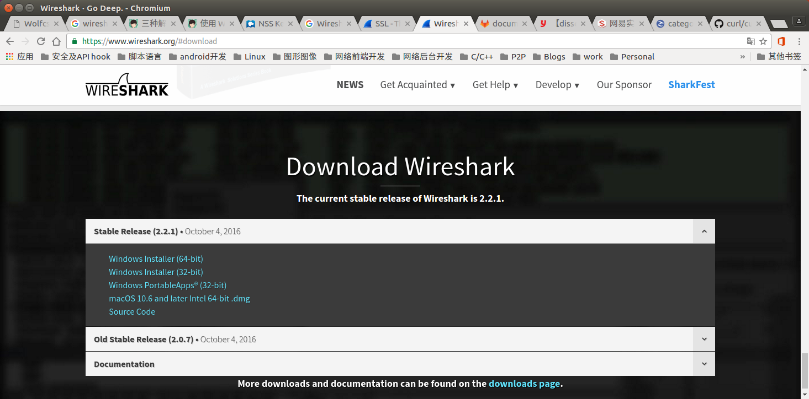
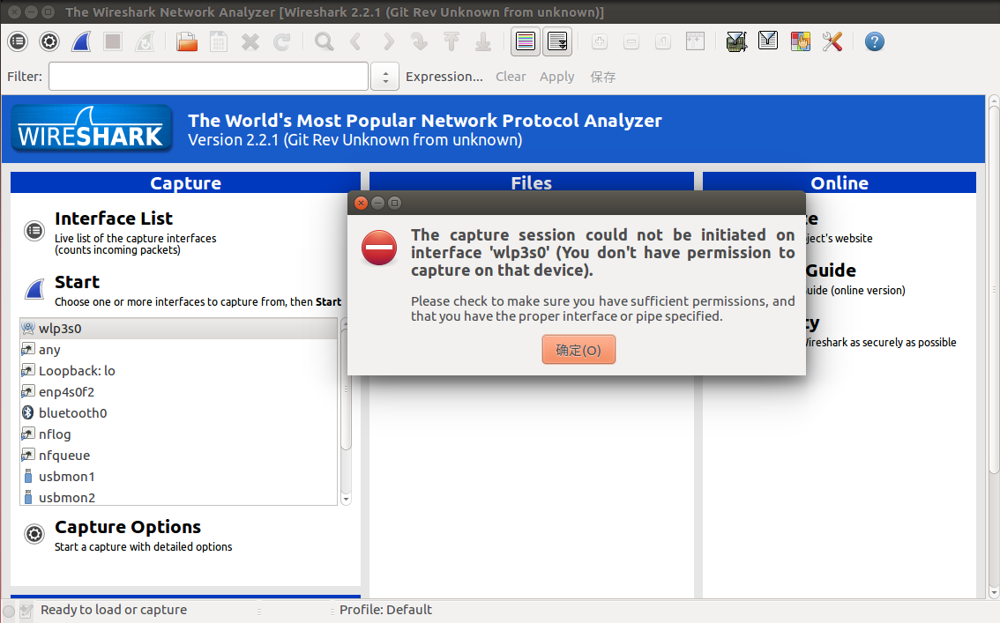

通过 apt-get 获得的Wireshark与最新版相比，总是有一些落后的。通过编译源代码安装，则总是能够最及时的尝试Wireshark最新的功能。本文就来与大家分享，通过源码安装Wireshark的过程。

## 编译安装Wireshark
首先在Wireshark官网下载最新的源码包，[地址](https://www.wireshark.org/#download)。
<!--more-->


当前最新版是2.2.1。下载Wireshark：
```
wget https://2.na.dl.wireshark.org/src/wireshark-2.2.1.tar.bz2
```

配置、编译并安装：
```
$ tar xvf wireshark-2.2.1.tar.bz2
$ cd wireshark-2.2.1
$ ./configure --enable-wireshark  --enable-dumpcap --enable-tfshark --with-gnutls --with-gcrypt=yes
$ make
$ sudo make install
```

还可以通过`./configure --help`了解诶Wireshark的更多编译配置选项：
```
$ ./configure --help
`configure' configures Wireshark 2.2.1 to adapt to many kinds of systems.

Usage: ./configure [OPTION]... [VAR=VALUE]...

To assign environment variables (e.g., CC, CFLAGS...), specify them as
VAR=VALUE.  See below for descriptions of some of the useful variables.

Defaults for the options are specified in brackets.

Configuration:
  -h, --help              display this help and exit
      --help=short        display options specific to this package
      --help=recursive    display the short help of all the included packages
  -V, --version           display version information and exit
  -q, --quiet, --silent   do not print `checking ...' messages
      --cache-file=FILE   cache test results in FILE [disabled]
  -C, --config-cache      alias for `--cache-file=config.cache'
  -n, --no-create         do not create output files
      --srcdir=DIR        find the sources in DIR [configure dir or `..']

Installation directories:
  --prefix=PREFIX         install architecture-independent files in PREFIX
                          [/usr/local]
  --exec-prefix=EPREFIX   install architecture-dependent files in EPREFIX
                          [PREFIX]

By default, `make install' will install all the files in
`/usr/local/bin', `/usr/local/lib' etc.  You can specify
an installation prefix other than `/usr/local' using `--prefix',
for instance `--prefix=$HOME'.

For better control, use the options below.

Fine tuning of the installation directories:
  --bindir=DIR            user executables [EPREFIX/bin]
  --sbindir=DIR           system admin executables [EPREFIX/sbin]
  --libexecdir=DIR        program executables [EPREFIX/libexec]
  --sysconfdir=DIR        read-only single-machine data [PREFIX/etc]
  --sharedstatedir=DIR    modifiable architecture-independent data [PREFIX/com]
  --localstatedir=DIR     modifiable single-machine data [PREFIX/var]
  --runstatedir=DIR       modifiable per-process data [LOCALSTATEDIR/run]
  --libdir=DIR            object code libraries [EPREFIX/lib]
  --includedir=DIR        C header files [PREFIX/include]
  --oldincludedir=DIR     C header files for non-gcc [/usr/include]
  --datarootdir=DIR       read-only arch.-independent data root [PREFIX/share]
  --datadir=DIR           read-only architecture-independent data [DATAROOTDIR]
  --infodir=DIR           info documentation [DATAROOTDIR/info]
  --localedir=DIR         locale-dependent data [DATAROOTDIR/locale]
  --mandir=DIR            man documentation [DATAROOTDIR/man]
  --docdir=DIR            documentation root [DATAROOTDIR/doc/wireshark]
  --htmldir=DIR           html documentation [DOCDIR]
  --dvidir=DIR            dvi documentation [DOCDIR]
  --pdfdir=DIR            pdf documentation [DOCDIR]
  --psdir=DIR             ps documentation [DOCDIR]

Program names:
  --program-prefix=PREFIX            prepend PREFIX to installed program names
  --program-suffix=SUFFIX            append SUFFIX to installed program names
  --program-transform-name=PROGRAM   run sed PROGRAM on installed program names

System types:
  --build=BUILD     configure for building on BUILD [guessed]
  --host=HOST       cross-compile to build programs to run on HOST [BUILD]
  --target=TARGET   configure for building compilers for TARGET [HOST]

Optional Features:
  --disable-option-checking  ignore unrecognized --enable/--with options
  --disable-FEATURE       do not include FEATURE (same as --enable-FEATURE=no)
  --enable-FEATURE[=ARG]  include FEATURE [ARG=yes]
  --enable-silent-rules   less verbose build output (undo: "make V=1")
  --disable-silent-rules  verbose build output (undo: "make V=0")
  --enable-static[=PKGS]  build static libraries [default=no]
  --enable-shared[=PKGS]  build shared libraries [default=yes]
  --enable-fast-install[=PKGS]
                          optimize for fast installation [default=yes]
  --enable-dependency-tracking
                          do not reject slow dependency extractors
  --disable-dependency-tracking
                          speeds up one-time build
  --disable-libtool-lock  avoid locking (might break parallel builds)
  --enable-osx-deploy-target
                          choose an OS X deployment target [default=major
                          release on which you're building]
  --disable-largefile     omit support for large files
  --enable-extra-compiler-warnings
                          do additional compiler warnings [default=no]
  --enable-asan           Enable AddressSanitizer (ASAN) for debugging
                          (degrades performance)[default=no]
  --enable-checkhf-conflict
                          Enable hf conflict check for debugging (start-up may
                          be slower)[default=no]
  --enable-warnings-as-errors
                          treat warnings as errors (only for GCC or clang)
                          [default=no]
  --enable-wireshark      build the Wireshark GUI (with Gtk+, Qt, or both)
                          [default=yes]
  --enable-packet-editor  add support for packet editor in Wireshark
                          [default=yes]
  --enable-profile-build  build profile-ready binaries [default=no]
  --enable-tshark         build tshark [default=yes]
  --enable-editcap        build editcap [default=yes]
  --enable-capinfos       build capinfos [default=yes]
  --enable-captype        build captype [default=yes]
  --enable-mergecap       build mergecap [default=yes]
  --enable-reordercap     build reordercap [default=yes]
  --enable-text2pcap      build text2pcap [default=yes]
  --enable-dftest         build dftest [default=yes]
  --enable-randpkt        build randpkt [default=yes]
  --enable-dumpcap        build dumpcap [default=yes]
  --enable-rawshark       build rawshark [default=yes]
  --enable-echld          support echld (Experimental) [default=no]
  --enable-tfshark        build tfshark (Experimental) [default=no]
  --enable-pcap-ng-default
                          use the pcap-ng file format by default instead of
                          pcap [default=yes]
  --enable-setcap-install install dumpcap with cap_net_admin and cap_net_raw
                          [default=no]
  --enable-setuid-install install dumpcap as setuid [default=no]
  --enable-androiddump    build androiddump [default=yes]
  --enable-androiddump-use-libpcap
                          build androiddump using libpcap [default=no]
  --enable-sshdump        build sshdump [default=yes]
  --enable-ciscodump      build ciscodump [default=yes]
  --enable-randpktdump    build randpktdump [default=yes]

Optional Packages:
  --with-PACKAGE[=ARG]    use PACKAGE [ARG=yes]
  --without-PACKAGE       do not use PACKAGE (same as --with-PACKAGE=no)
  --with-pic[=PKGS]       try to use only PIC/non-PIC objects [default=use
                          both]
  --with-aix-soname=aix|svr4|both
                          shared library versioning (aka "SONAME") variant to
                          provide on AIX, [default=aix].
  --with-gnu-ld           assume the C compiler uses GNU ld [default=no]
  --with-sysroot[=DIR]    Search for dependent libraries within DIR (or the
                          compiler's sysroot if not specified).
  --with-qt=[yes/no/4/5]  use Qt [default=yes, if available]
  --with-gtk=[yes/no/2/3] use GTK+ [default=yes, if available]
  --with-gnutls=[yes/no]  use GnuTLS library [default=yes, if available]
  --with-gcrypt=[yes/no]  use gcrypt library [default=yes, if available]
  --with-libgcrypt-prefix=PFX
                          prefix where LIBGCRYPT is installed (optional)
  --with-libnl[=VERSION]  use libnl (force version VERSION, if supplied)
                          [default: yes, if available]
  --with-libsmi=[DIR]     use libsmi MIB/PIB library [default=yes], optionally
                          specify the prefix for libsmi
  --with-osx-integration  use OS X integration functions [default=yes, if
                          available]
  --with-pcap[=DIR]       use libpcap for packet capturing [default=yes]
  --with-pcap-remote      use libpcap remote capturing (requires libpcap)
  --with-zlib[=DIR]       use zlib (located in directory DIR, if supplied) for
                          gzip compression and decompression [default=yes, if
                          available]
  --with-lua[=DIR]        use liblua (located in directory DIR, if supplied)
                          for the Lua scripting plugin [default=yes, if
                          available]
  --with-portaudio[=DIR]  use libportaudio (located in directory DIR, if
                          supplied) for the GTK+ RTP player [default=yes, if
                          available]
  --with-dumpcap-group=GROUP
                          restrict dumpcap to GROUP
  --with-libcap[=DIR]     use libcap (located in directory DIR, if supplied)
                          for POSIX.1e capabilities management [default=yes,
                          if present]
```

一切都很顺利。

# 权限问题的解决
通过在命令行中输入 `wireshark-gtk` ，可以执行我们刚刚安装的Wireshark。然而当我们选中一个网卡，想要启动抓包时，则获得了如下的报错：



错误提示说缺乏足够的权限。在命令行中执行 `tshark` 时同样报错：
```
$ tshark
Running as user "hanpfei0306" and group "hanpfei0306".
Capturing on 'wlp3s0'
tshark: The capture session could not be initiated on interface 'wlp3s0' (You don't have permission to capture on that device).
Please check to make sure you have sufficient permissions, and that you have the proper interface or pipe specified.
0 packets captured
```

在网上找到了如下的解决方法： 
1.添加wireshark用户组 
```
$ sudo groupadd wireshark 
```

2.将dumpcap更改为wireshark用户组 
```
$ sudo chgrp wireshark /usr/bin/dumpcap 
```

3.让wireshark用户组有root权限使用dumpcap 
```
$ sudo chmod 4755 /usr/bin/dumpcap 
```

4.将需要使用的用户名加入wireshark用户组，我的用户名是craftor 
```
$ sudo gpasswd -a hanpfei0306 wireshark 
```

然而这根本不起作用。

突然想到，命令中执行的 tshark 和 wireshark-gtk 所用的dumpcap 是否不是 `/usr/bin/dumpcap`呢？查找系统所有名字中包含dumpcap的文件：
```
$ locate dumpcap
/usr/bin/dumpcap
/usr/local/bin/dumpcap
/usr/local/share/man/man1/dumpcap.1
/usr/local/share/wireshark/dumpcap.html
/usr/share/man/man1/dumpcap.1.gz
/usr/share/wireshark/dumpcap.html
```
还真是找到了多个 `dumpcap` 可执行文件。

我们针对 `/usr/local/bin/dumpcap` 执行上面类似的步骤：
```
$ sudo chgrp wireshark /usr/local/bin/dumpcap
$ sudo chmod u+s /usr/local/bin/dumpcap
```

再次在命令中执行tshark：
```
$ tshark
Running as user "hanpfei0306" and group "hanpfei0306".
Capturing on 'wlp3s0'
  1 0.000000000 fe80::71ee:909:10db:13ec → ff02::fb     MDNS 180 Standard query 0x0000 PTR _ftp._tcp.local, "QM" question PTR _nfs._tcp.local, "QM" question PTR _afpovertcp._tcp.local, "QM" question PTR _smb._tcp.local, "QM" question PTR _sftp-ssh._tcp.local, "QM" question PTR _webdavs._tcp.local, "QM" question PTR _webdav._tcp.local, "QM" question
  2 0.000054449 10.242.119.221 → 224.0.0.251  MDNS 160 Standard query 0x0000 PTR _ftp._tcp.local, "QM" question PTR _nfs._tcp.local, "QM" question PTR _afpovertcp._tcp.local, "QM" question PTR _smb._tcp.local, "QM" question PTR _sftp-ssh._tcp.local, "QM" question PTR _webdavs._tcp.local, "QM" question PTR _webdav._tcp.local, "QM" question
  3 3.193236858 10.242.119.221 → 61.91.161.217 TCP 66 34736→443 [ACK] Seq=1 Ack=1 Win=350 Len=0 TSval=40947011 TSecr=317612596
  4 3.345237101 10.242.119.221 → 61.91.161.217 TCP 66 34752→443 [ACK] Seq=1 Ack=1 Win=368 Len=0 TSval=40947049 TSecr=317612749
  5 3.654180454 61.91.161.217 → 10.242.119.221 TCP 66 [TCP ACKed unseen segment] 443→34736 [ACK] Seq=1 Ack=2 Win=243 Len=0 TSval=317658055 TSecr=40912897
  6 3.713688791 61.91.161.217 → 10.242.119.221 TCP 66 [TCP ACKed unseen segment] 443→34752 [ACK] Seq=1 Ack=2 Win=334 Len=0 TSval=317658110 TSecr=40924362
```

OK了。
