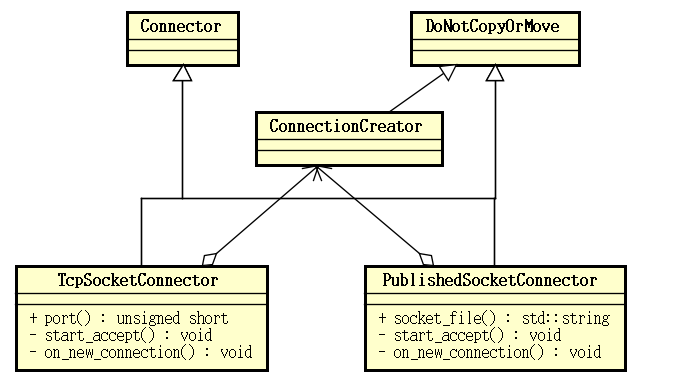
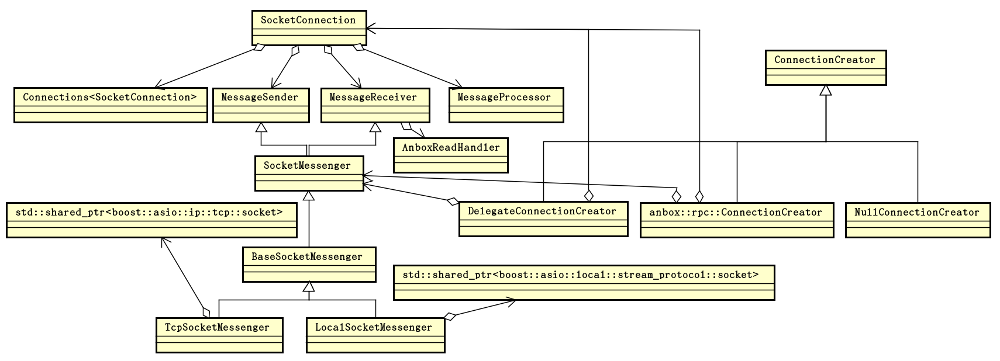

Anbox 运行时主要由两个分开的实例构成，即容器管理器 ContainerManager 和会话管理器 SessionManager，但无论是 ContainerManager 还是 SessionManager，所做的最重要的事情就是处理网络 I/O 事件了。I/O 模型指一个应用处理 I/O 事件的整体框架设计，对于 Anbox 而言主要是处理各种网络 I/O 事务的整体框架设计。ContainerManager 和 SessionManager 基于一个相同的 I/O 模型运行，为了获得对 Anbox 整体行为设计的理解，有必要对其 I/O 模型有个整体的认识。
<!--more-->
# I/O 模型

Anbox 的 I/O 模型基于 boost.asio 构建。Anbox 中所有的 I/O 事件，在一个线程池中，通过一个 `boost::asio::io_service` 对象来派发并处理。Anbox 用 `anbox::Runtime` 类封装一个 `boost::asio::io_service` 对象，并管理执行任务的线程池。

`anbox::Runtime` 类的定义（位于 `anbox/src/anbox/runtime.h`）如下：
```
namespace anbox {

// We bundle our "global" runtime dependencies here, specifically
// a dispatcher to decouple multiple in-process providers from one
// another , forcing execution to a well known set of threads.
class Runtime : public DoNotCopyOrMove,
                public std::enable_shared_from_this<Runtime> {
 public:
  // Our default concurrency setup.
  static constexpr const std::uint32_t worker_threads = 8;

  // create returns a Runtime instance with pool_size worker threads
  // executing the underlying service.
  static std::shared_ptr<Runtime> create(
      std::uint32_t pool_size = worker_threads);

  // Tears down the runtime, stopping all worker threads.
  ~Runtime() noexcept(true);

  // start executes the underlying io_service on a thread pool with
  // the size configured at creation time.
  void start();

  // stop cleanly shuts down a Runtime instance.
  void stop();

  // to_dispatcher_functional returns a function for integration
  // with components that expect a dispatcher for operation.
  std::function<void(std::function<void()>)> to_dispatcher_functional();

  // service returns the underlying boost::asio::io_service that is executed
  // by the Runtime.
  boost::asio::io_service& service();

 private:
  // Runtime constructs a new instance, firing up pool_size
  // worker threads.
  Runtime(std::uint32_t pool_size);

  std::uint32_t pool_size_;
  boost::asio::io_service service_;
  boost::asio::io_service::strand strand_;
  boost::asio::io_service::work keep_alive_;
  std::vector<std::thread> workers_;
};

}  // namespace anbox
```

`anbox::Runtime` 类封装了一个 `boost::asio::io_service` 对象及多个工作线程 `std::thread`，它还继承 `std::enable_shared_from_this<Runtime>` 以获得从 `this` 指针创建智能指针 `std::shared_ptr` 的能力，同时继承了 `DoNotCopyOrMove`，以禁掉类的拷贝和移动操作。

`anbox::Runtime` 类的实现（位于 `anbox/src/anbox/runtime.cpp`）如下：
```
namespace {
void exception_safe_run(boost::asio::io_service& service) {
  while (true) {
    try {
      service.run();
      // a clean return from run only happens in case of
      // stop() being called (we are keeping the service alive with
      // a service::work instance).
      break;
    } catch (const std::exception& e) {
      ERROR("%s", e.what());
    } catch (...) {
      ERROR("Unknown exception caught while executing boost::asio::io_service");
    }
  }
}
}
namespace anbox {

std::shared_ptr<Runtime> Runtime::create(std::uint32_t pool_size) {
  return std::shared_ptr<Runtime>(new Runtime(pool_size));
}

Runtime::Runtime(std::uint32_t pool_size)
    : pool_size_{pool_size},
      service_{pool_size_},
      strand_{service_},
      keep_alive_{service_} {}

Runtime::~Runtime() noexcept(true) {
  try {
    stop();
  } catch (...) {
    // Dropping all exceptions to satisfy the nothrow guarantee.
  }
}

void Runtime::start() {
  for (unsigned int i = 0; i < pool_size_; i++)
    workers_.push_back(std::thread{exception_safe_run, std::ref(service_)});
}

void Runtime::stop() {
  service_.stop();

  for (auto& worker : workers_)
    if (worker.joinable())
      worker.join();
  workers_.clear();
}

std::function<void(std::function<void()>)> Runtime::to_dispatcher_functional() {
  // We have to make sure that we stay alive for as long as
  // calling code requires the dispatcher to work.
  auto sp = shared_from_this();
  return [sp](std::function<void()> task) { sp->strand_.post(task); };
}

boost::asio::io_service& Runtime::service() { return service_; }

}  // namespace anbox
```

`anbox::Runtime` 类有两大职责，一是 `boost::asio::io_service` 对象的生命周期管理；二是向 `boost::asio::io_service` 中提交任务。

在 `anbox::Runtime::start()` 函数中创建并启动多个线程，执行一个执行 `boost::asio::io_service::run()` 函数的函数 `exception_safe_run()`。在 `anbox::Runtime::stop()` 函数中停掉 `boost::asio::io_service` 的执行。`anbox::Runtime` 的析够函数中，还会调用 `stop()` 函数停掉 `boost::asio::io_service` 的执行。`anbox::Runtime` 的类型为 `boost::asio::io_service::work` 的成员变量 `keep_alive_` 也是用于管理 `boost::asio::io_service` 对象的生命周期的，该对象在析够时也会停掉 `boost::asio::io_service` 的执行。

对于不熟悉 boost 库的朋友来说，`boost::asio::io_service` 可以理解为一个 I/O 多路复用器，就像许多网络库通过 select/poll/epoll/kqueue 实现的那样，或者可以理解为以 Reactor 模式实现的网络库中的一个事件循环，可以向其中提交 I/O 任务、定时器及其它任务等。`boost::asio::io_service::strand` 可以理解为 `boost::asio::io_service` 中的一个特殊的子任务队列，该类保证向其提交的所有任务都不会并发执行，以此消除这些任务之间的同步问题。

`anbox::Runtime::to_dispatcher_functional()` 函数返回一个接收一个函数为参数的函数，返回的这个函数可以将它接收的函数作为一个 task，通过 `boost::asio::io_service::strand` 提交给 `boost::asio::io_service` 执行。`anbox::Runtime::service()` 返回 `boost::asio::io_service` 用于方便一些 boost I/O 组件，直接向该 `io_service` 中提交任务。

继承自 `std::enable_shared_from_this<Runtime>` 的 `shared_from_this()` 可以从 `this` 指针创建一个指向当前对象的 `std::shared_ptr` 智能指针。通过对标准库源码的分析，可以知道 `std::enable_shared_from_this` 的实现原理大体如下：`std::enable_shared_from_this<Runtime>` 有一个类型为 `std::weak_ptr<Runtime>` 的成员，该成员在首次创建指向对象的 `std::shared_ptr` 智能指针的时候会被初始化。`shared_from_this()` 函数被调用时，会从类型为 `std::weak_ptr<Runtime>` 的成员变量创建指向当前对象的 `std::shared_ptr` 智能指针。

Anbox 的 I/O 模型可以理解为，底层有 ***一个*** 多路复用器或事件循环 `boost::asio::io_service`，有一个包含了 8 个线程的线程池基于此 `boost::asio::io_service` 运行，处理 I/O 事件及其它各种类型的任务。

有了用于执行 I/O 事件处理程序的 `boost::asio::io_service`，接下来来看一下，Anbox 都会向其中提交哪些任务。

Anbox 需要处理如下这样一些网络 I/O 过程：

 * 监听 Unix 域 Socket 接受连接。Anbox 的 SessionManager 通过 Unix 域 Socket 与 ContainerManager 进行通信，同时也通过 Unix 域 Socket 与 ContainerManager 启动的 Android 容器内的应用程序通信。首先 ContainerManager 监听在特定位置的 Unix 域 Socket 上。随后 SessionManager 监听几个位置上的 Unix 域 Socket，然后请求 ContainerManager 启动 Android 容器，并将这几个 Unix 域 Socket 映射到容器内的 `/dev/` 目录下。Android 容器启动后，一些进程，如 surfaceflinger、cameraservice 等连接这些 Unix 域 Socket，并通过这些 Unix 域 Socket 与 SessionManager 通信，进而操作宿主机的硬件设备。

 * 监听 TCP Socket 接受连接。Anbox 的 SessionManager 作为容器中运行的 Android 与 ADB 进行通信的桥梁，它在与容器中运行的 Android 通过 Unix 域 Socket 通信的同时，也需要与宿主机上的 ADB 通信。SessionManager 通过 TCP 与宿主机上的 ADB 守护进程通信。如同模拟器等 Android 设备一样，SessionManager 遵从 ADB 的通信协议，在发起与 ADB 之间的 TCP 连接的同时，也需要监听一个 TCP 端口，等待 ADB 守护进程发起的连接，以完成整个 ADB 协议。

 * 处理从监听的 Unix 域 Socket 接受的 Unix 域 Socket。监听的 Unix 域 Socket 接受新连接之后，需要将新创建的 Unix 域 Socket 提交给底层的 I/O 多路复用器，并为该 Socket 提供读写等 I/O 事件处理处理回调，以完成 Anbox 的应用逻辑。

 * 处理从监听的 TCP Scoket 接受的 TCP Socket。监听的 TCP Socket 接受新连接之后，需要将新创建的 TCP Socket 提交给底层的 I/O 多路复用器，并为该 Socket 提供读写等 I/O 事件处理处理回调，以完成 Anbox 的应用逻辑。

 * 发起一个到 TCP 服务器的连接。如前面提到的，Anbox 的 SessionManager 通过 TCP 连接与 ADB 守护进程通信，它会先发起一个到 ADB 守护进程的 TCP 连接。

 * 发起一个到 Unix 域 Socket 服务的连接。Anbox 的 SessionManager 与 ContainerManager 之间通过 Unix 域 Socket 通信，SessionManager 会发起到 ContainerManager 监听的 Unix 域 Socket 服务的连接。

# 监听 Unix 域 Socket 接受连接

在 boost.asio 中，监听 Socket 并接受新连接，通过 acceptor 完成，对于具体的 Unix 域 Socket 而言，是通过 `boost::asio::local::stream_protocol::acceptor`。`boost::asio::local::stream_protocol::acceptor` 类对象在创建时，需要为构造函数传入 `boost::asio::io_service` 及 Unix 域 Socket 的路径，通过 acceptor 的 `async_accept()` 函数，可以将 Unix 域 Socket 及处理新连接到来时的回调函数提交给底层的 I/O 多路复用器，异步地启动对 Unix 域 Socket 的监听。

在 Anbox 中，通过 `anbox::network::PublishedSocketConnector` 封装 `boost::asio::local::stream_protocol::acceptor`，并为它定义处理新连接到来时的回调函数。`anbox::network::PublishedSocketConnector` 类的定义（位于 `anbox/src/anbox/network/published_socket_connector.h`）如下：
```
namespace anbox {
namespace network {
class PublishedSocketConnector : public DoNotCopyOrMove, public Connector {
 public:
  explicit PublishedSocketConnector(
      const std::string& socket_file, const std::shared_ptr<Runtime>& rt,
      const std::shared_ptr<ConnectionCreator<
          boost::asio::local::stream_protocol>>& connection_creator);
  ~PublishedSocketConnector() noexcept;

  std::string socket_file() const { return socket_file_; }

 private:
  void start_accept();
  void on_new_connection(
      std::shared_ptr<boost::asio::local::stream_protocol::socket> const& socket,
      boost::system::error_code const& err);

  const std::string socket_file_;
  std::shared_ptr<Runtime> runtime_;
  std::shared_ptr<ConnectionCreator<boost::asio::local::stream_protocol>>
      connection_creator_;
  boost::asio::local::stream_protocol::acceptor acceptor_;
};
}  // namespace network
}  // namespace anbox
```

`anbox::network::PublishedSocketConnector` 保存了 Unix 域 Socket 文件的路径，指向 `anbox::Runtime` 对象的智能指针，一个指向 `ConnectionCreator<boost::asio::local::stream_protocol>` 对象的智能指针，及 一个 `boost::asio::local::stream_protocol::acceptor`。指向 `anbox::Runtime` 对象的智能指针主要用于从 `anbox::Runtime` 对象获得其管理的 `boost::asio::io_service` 的引用。`boost::asio::local::stream_protocol::acceptor` 的作用如前所述，`ConnectionCreator<boost::asio::local::stream_protocol>` 的作用后面再来讨论。

`anbox::network::PublishedSocketConnector` 类的实现（位于 `anbox/src/anbox/network/published_socket_connector.cpp`）如下：
```
namespace anbox {
namespace network {
PublishedSocketConnector::PublishedSocketConnector(
    const std::string& socket_file, const std::shared_ptr<Runtime>& rt,
    const std::shared_ptr<ConnectionCreator<
        boost::asio::local::stream_protocol>>& connection_creator)
    : socket_file_(remove_socket_if_stale(socket_file)),
      runtime_(rt),
      connection_creator_(connection_creator),
      acceptor_(rt->service(), socket_file_) {
  start_accept();
}

PublishedSocketConnector::~PublishedSocketConnector() noexcept {}

void PublishedSocketConnector::start_accept() {
  auto socket = std::make_shared<boost::asio::local::stream_protocol::socket>(runtime_->service());

  acceptor_.async_accept(*socket,
                         [this, socket](boost::system::error_code const& err) {
                           on_new_connection(socket, err);
                         });
}

void PublishedSocketConnector::on_new_connection(std::shared_ptr<boost::asio::local::stream_protocol::socket> const& socket,
                                                 boost::system::error_code const& err) {
  if (!err)
    connection_creator_->create_connection_for(socket);

  if (err.value() == boost::asio::error::operation_aborted)
    return;

  start_accept();
}
}  // namespace network
}  // namespace anbox
```

`anbox::network::PublishedSocketConnector` 类对象构造完成之后，即会调用 `start_accept()` 启动对 Unix 域 Socket 的监听。

`anbox::network::PublishedSocketConnector` 的 `start_accept()` 首先创建一个 `boost::asio::local::stream_protocol::socket` 对象用于保存下次接受的新 Socket 的相关信息，然后将这个对象，及作为处理新连接到来时的回调函数而创建的 lambda 表达式传递给 `boost::asio::local::stream_protocol::acceptor` 的 `async_accept()` 函数以启动对 Unix 域 Socket 的监听。

接收到新到来的连接之后，传给 `boost::asio::local::stream_protocol::acceptor` 的 `async_accept()` 的 lambda 回调函数直接将 Socket 交给 `anbox::network::PublishedSocketConnector::on_new_connection()` 来处理，`anbox::network::PublishedSocketConnector::on_new_connection()` 又将新连接交给 `ConnectionCreator<boost::asio::local::stream_protocol>` 来处理。

由此不难理解，在 Anbox 的设计中，监听并接受连接与对新连接的处理，由两个完全不同的组件来处理，前者由 `anbox::network::Connector` 处理，后者由 `anbox::network::ConnectionCreator` 处理。`anbox::network::ConnectionCreator` 定义（位于 `anbox/src/anbox/network/connection_creator.h`）如下：
```
namespace anbox {
namespace network {
template <typename stream_protocol>
class ConnectionCreator : public DoNotCopyOrMove {
 public:
  virtual void create_connection_for(
      std::shared_ptr<boost::asio::basic_stream_socket<stream_protocol>> const&
          socket) = 0;
};
}  // namespace anbox
}  // namespace network
```

# 监听 TCP Socket 接受连接

Anbox 中监听 TCP Socket 并接受连接的逻辑与监听 Unix 域 Socket 并接受连接的逻辑非常类似，只是依赖的底层 boost.asio 的 acceptor 变为了 `boost::asio::ip::tcp::acceptor`。封装 `boost::asio::ip::tcp::acceptor` 组件等由 `anbox::network::TcpSocketConnector` 完成，这个类的定义（位于 `anbox/src/anbox/network/tcp_socket_connector.h`）如下：
```
namespace anbox {
namespace network {
class TcpSocketConnector : public DoNotCopyOrMove, public Connector {
 public:
  explicit TcpSocketConnector(
      const boost::asio::ip::address_v4 &address, unsigned short port,
      const std::shared_ptr<Runtime> &rt,
      const std::shared_ptr<ConnectionCreator<boost::asio::ip::tcp>>
          &connection_creator);
  ~TcpSocketConnector() noexcept;

  unsigned short port() const { return port_; }

 private:
  void start_accept();
  void on_new_connection(
      std::shared_ptr<boost::asio::ip::tcp::socket> const &socket,
      boost::system::error_code const &err);

  boost::asio::ip::address_v4 address_;
  unsigned short port_;
  std::shared_ptr<Runtime> runtime_;
  std::shared_ptr<ConnectionCreator<boost::asio::ip::tcp>> connection_creator_;
  boost::asio::ip::tcp::acceptor acceptor_;
};
}  // namespace network
}  // namespace anbox
```

监听的地址，不像 `anbox::network::PublishedSocketConnector` 那样用一个路径来描述就可以了，而是要通过 IP 地址和端口号来描述。

`anbox::network::TcpSocketConnector` 类的实现（位于 `anbox/src/anbox/network/tcp_socket_connector.cpp`）如下：
```
namespace anbox {
namespace network {
TcpSocketConnector::TcpSocketConnector(
    const boost::asio::ip::address_v4& address, unsigned short port,
    const std::shared_ptr<Runtime>& rt,
    const std::shared_ptr<ConnectionCreator<boost::asio::ip::tcp>>&
        connection_creator)
    : address_(address),
      port_(port),
      runtime_(rt),
      connection_creator_(connection_creator),
      acceptor_(rt->service(), boost::asio::ip::tcp::endpoint(address, port)) {
  start_accept();
}

TcpSocketConnector::~TcpSocketConnector() noexcept { acceptor_.cancel(); }

void TcpSocketConnector::start_accept() {
  auto socket =
      std::make_shared<boost::asio::ip::tcp::socket>(runtime_->service());

  acceptor_.async_accept(*socket,
                         [this, socket](boost::system::error_code const& err) {
                           on_new_connection(socket, err);
                         });
}

void TcpSocketConnector::on_new_connection(
    std::shared_ptr<boost::asio::ip::tcp::socket> const& socket,
    boost::system::error_code const& err) {
  switch (err.value()) {
    case boost::system::errc::success:
      connection_creator_->create_connection_for(socket);
      break;
    default:
      // Socket was closed so don't listen for any further incoming
      // connection attempts.
      return;
  }

  start_accept();
}
}  // namespace network
}  // namespace anbox
```

启动监听及新连接到来时的回调处理都与 `anbox::network::PublishedSocketConnector` 类似，只是调用 acceptor 的 `async_accept()` 之前创建的是 `boost::asio::ip::tcp::socket` 对象，新连接到来之后，则是交给 `ConnectionCreator<boost::asio::ip::tcp>` 来处理的。

Anbox 中，监听 Socket 相关（包括对 Unix 域 Socket 的监听和对 TCP Socket 的监听）的类结构如下：



# 处理从监听的 Unix 域 Socket 接受的 Unix 域 Socket

在 Anbox 中，使用了 `anbox::network::PublishedSocketConnector` 来监听 Unix 域 Socket 的组件包括如下这些：

| 组件    | 所用 ConnectionCreator   |
|:--------|--------|
| anbox::audio::Server  |  anbox::network::DelegateConnectionCreator |
| anbox::cmds::SessionManager  |  anbox::rpc::ConnectionCreator |
| anbox::container::Service  |  anbox::network::DelegateConnectionCreator |
| anbox::input::Device  |  anbox::network::DelegateConnectionCreator |

在 Anbox 中监听 Unix 域 Socket 的组件有多个，对于新到来的连接的处理方式有着一定的差异，但这种处理又都依赖于相同的底层 Unix 域 Socket 处理框架。

`anbox::rpc::ConnectionCreator` 清晰地为我们展示了，Anbox 中处理新接受的 Unix 域 Socket 的基本方式，来看这个类的实现。`anbox::rpc::ConnectionCreator` 的定义（位于 `anbox/src/anbox/rpc/connection_creator.h`）如下：
```
namespace anbox {
namespace rpc {
class ConnectionCreator
    : public network::ConnectionCreator<boost::asio::local::stream_protocol> {
 public:
  typedef std::function<std::shared_ptr<network::MessageProcessor>(
      const std::shared_ptr<network::MessageSender> &)>
      MessageProcessorFactory;

  ConnectionCreator(const std::shared_ptr<Runtime> &rt,
                    const MessageProcessorFactory &factory);
  ~ConnectionCreator() noexcept;

  void create_connection_for(
      std::shared_ptr<boost::asio::basic_stream_socket<
          boost::asio::local::stream_protocol>> const &socket) override;

 private:
  int next_id();

  std::shared_ptr<Runtime> runtime_;
  std::atomic<int> next_connection_id_;
  std::shared_ptr<network::Connections<network::SocketConnection>> const
      connections_;
  MessageProcessorFactory message_processor_factory_;
};
}  // namespace rpc
}  // namespace anbox
```

`anbox::rpc::ConnectionCreator` 实现用于处理新到来的连接的 `create_connection_for()` 函数。`anbox::rpc::ConnectionCreator` 的实现（位于 `anbox/src/anbox/rpc/connection_creator.cpp`）如下：
```
namespace anbox {
namespace rpc {
ConnectionCreator::ConnectionCreator(const std::shared_ptr<Runtime>& rt,
                                     const MessageProcessorFactory& factory)
    : runtime_(rt),
      next_connection_id_(0),
      connections_(
          std::make_shared<network::Connections<network::SocketConnection>>()),
      message_processor_factory_(factory) {}

ConnectionCreator::~ConnectionCreator() noexcept {}

void ConnectionCreator::create_connection_for(
    std::shared_ptr<boost::asio::local::stream_protocol::socket> const&
        socket) {
  if (connections_->size() >= 1) {
    socket->close();
    WARNING(
        "A second client tried to connect. Denied request as we already have "
        "one and only allow a single client");
    return;
  }

  auto const messenger =
      std::make_shared<network::LocalSocketMessenger>(socket);
  auto const processor = message_processor_factory_(messenger);

  auto const& connection = std::make_shared<network::SocketConnection>(
      messenger, messenger, next_id(), connections_, processor);
  connection->set_name("rpc");
  connections_->add(connection);
  connection->read_next_message();
}

int ConnectionCreator::next_id() { return next_connection_id_.fetch_add(1); }

}  // namespace rpc
}  // namespace anbox
```

从 `anbox::rpc::ConnectionCreator::create_connection_for()` 的实现，可以看到 Anbox 处理新接受的 Unix 域 Socket 的基本流程：

 * 为新的 `boost::asio::local::stream_protocol::socket` 对象创建 `anbox::network::LocalSocketMessenger`，用于将 Socket 添加进底层的 I/O 多路复用器，Socket 的读写等操作。
 * 创建消息处理回调函数。当检测到 Socket 上有消息到来时，消息会被读取，并传递给这个回调函数来处理。
 * 根据前面创建的 `anbox::network::LocalSocketMessenger` 和消息处理回调创建 `anbox::network::SocketConnection`。`anbox::network::SocketConnection` 是底层 Socket（即 `anbox::network::LocalSocketMessenger`） 与其用户之间的桥梁， `anbox::network::SocketConnection` 用于直接将 Socket 提交给底层 I/O 多路复用器以异步读取数据，帮助发送数据，以及拷贝底层数据读取缓冲区的数据并调用用户的消息处理回调函数。
 * 为 `anbox::network::SocketConnection` 设置名称。
 * 将 `anbox::network::SocketConnection` 保存于一个容器，以便于做一些整体的控制。`anbox::network::SocketConnection` 持有指向该容器的智能指针，以便于在连接断开时，将自身从容器中移除。
 * 调用 `anbox::network::SocketConnection` 的 `read_next_message()` 函数，将 Socket 提交给底层的 I/O 多路复用器，以启动接收数据。这个函数十分类似于前面看到的 `anbox::network::PublishedSocketConnector` 和 `anbox::network::TcpSocketConnector` 的 `start_accept()` 函数。

`anbox::network::SocketConnection` 类的定义（位于 `anbox/src/anbox/network/socket_connection.h`）如下：
```
namespace anbox {
namespace network {
class SocketConnection {
 public:
  SocketConnection(
      std::shared_ptr<MessageReceiver> const& message_receiver,
      std::shared_ptr<MessageSender> const& message_sender, int id,
      std::shared_ptr<Connections<SocketConnection>> const& connections,
      std::shared_ptr<MessageProcessor> const& processor);

  ~SocketConnection() noexcept;

  void set_name(const std::string& name) { name_ = name; }

  int id() const { return id_; }

  void send(char const* data, size_t length);
  void read_next_message();

 private:
  void on_read_size(const boost::system::error_code& ec,
                    std::size_t bytes_read);

  std::shared_ptr<MessageReceiver> const message_receiver_;
  std::shared_ptr<MessageSender> const message_sender_;
  int id_;
  std::shared_ptr<Connections<SocketConnection>> const connections_;
  std::shared_ptr<MessageProcessor> processor_;
  std::array<std::uint8_t, 8192> buffer_;
  std::string name_;
};
}  // namespace anbox
}  // namespace network
```

`anbox::network::SocketConnection` 类的实现（位于 `anbox/src/anbox/network/socket_connection.cpp`）如下：
```
namespace ba = boost::asio;
namespace bs = boost::system;

namespace anbox {
namespace network {
SocketConnection::SocketConnection(
    std::shared_ptr<MessageReceiver> const& message_receiver,
    std::shared_ptr<MessageSender> const& message_sender, int id_,
    std::shared_ptr<Connections<SocketConnection>> const& connections,
    std::shared_ptr<MessageProcessor> const& processor)
    : message_receiver_(message_receiver),
      message_sender_(message_sender),
      id_(id_),
      connections_(connections),
      processor_(processor) {}

SocketConnection::~SocketConnection() noexcept {}

void SocketConnection::send(char const* data, size_t length) {
  message_sender_->send(data, length);
}

void SocketConnection::read_next_message() {
  auto callback = std::bind(&SocketConnection::on_read_size, this, std::placeholders::_1, std::placeholders::_2);
  message_receiver_->async_receive_msg(callback, ba::buffer(buffer_));
}

void SocketConnection::on_read_size(const boost::system::error_code& error, std::size_t bytes_read) {
  if (error) {
    connections_->remove(id());
    return;
  }

  std::vector<std::uint8_t> data(bytes_read);
  std::copy(buffer_.data(), buffer_.data() + bytes_read, data.data());

  if (processor_->process_data(data))
    read_next_message();
  else
      connections_->remove(id());
}
}  // namespace anbox
}  // namespace network
```

在 `anbox::network::SocketConnection::read_next_message()` 中，用于存放读取的数据的缓冲区由 `anbox::network::SocketConnection` 提供，这与 `anbox::network::PublishedSocketConnector` 和 `anbox::network::TcpSocketConnector` 的 `start_accept()` 函数中，事先创建好保存下次到来的新连接的状态的 Socket 非常类似。

另外一个 `anbox::network::ConnectionCreator` 实现者是 `anbox::network::DelegateConnectionCreator`，它仅仅是将处理新连接的职责转出去给一个函数，因而通常实际的新连接处理者也是 `anbox::network::PublishedSocketConnector` 的创建者。`anbox::network::DelegateConnectionCreator` 的定义及实现如下：
```
namespace anbox {
namespace network {
template <typename stream_protocol>
class DelegateConnectionCreator : public ConnectionCreator<stream_protocol> {
 public:
  DelegateConnectionCreator(
      std::function<void(std::shared_ptr<boost::asio::basic_stream_socket<
                             stream_protocol>> const&)>
          delegate)
      : delegate_(delegate) {}

  void create_connection_for(
      std::shared_ptr<boost::asio::basic_stream_socket<stream_protocol>> const&
          socket) override {
    if (delegate_)
      delegate_(socket);
    else
      socket->close();
  }

 private:
  std::function<void(std::shared_ptr<
                     boost::asio::basic_stream_socket<stream_protocol>> const&)>
      delegate_;
};
}  // namespace network
}  // namespace anbox
```

使用了 `anbox::network::DelegateConnectionCreator` 的情况下，各个组件自己处理新到来的连接的方式，与 `anbox::rpc::ConnectionCreator` 中处理新到来的连接的方式大同小异。

在 `anbox::cmds::SessionManager` 中（位于 `anbox/src/anbox/cmds/session_manager.cpp`）还有一个 `anbox::network::ConnectionCreator` 的实现：
```
class NullConnectionCreator : public anbox::network::ConnectionCreator<
                                  boost::asio::local::stream_protocol> {
 public:
  void create_connection_for(
      std::shared_ptr<boost::asio::local::stream_protocol::socket> const
          &socket) override {
    WARNING("Not implemented");
    socket->close();
  }
};
```

这个实现，与 `anbox::network::DelegateConnectionCreator` 在 `delegate` 为空时的行为一致，看上去这个类的定义似乎有些多余。

# 处理从监听的 TCP Scoket 接受的 TCP Socket

Anbox 中只有一处监听了 TCP Socket，即在 ADB 消息处理器 `anbox::qemu::AdbMessageProcessor` 中。`anbox::qemu::AdbMessageProcessor` 中处理与 ADB 守护进程的交互的函数主要包括如下这些：
```
void AdbMessageProcessor::wait_for_host_connection() {
  if (state_ != waiting_for_guest_accept_command)
    return;

  if (!host_connector_) {
    host_connector_ = std::make_shared<network::TcpSocketConnector>(
        boost::asio::ip::address_v4::from_string(loopback_address),
        default_host_listen_port, runtime_,
        std::make_shared<
            network::DelegateConnectionCreator<boost::asio::ip::tcp>>(
            std::bind(&AdbMessageProcessor::on_host_connection, this, _1)));
  }

  try {
    // Notify the adb host instance so that it knows on which port our
    // proxy is waiting for incoming connections.
    auto messenger = std::make_shared<network::TcpSocketMessenger>(
        boost::asio::ip::address_v4::from_string(loopback_address), default_adb_client_port, runtime_);
    auto message = utils::string_format("host:emulator:%d", default_host_listen_port);
    auto handshake = utils::string_format("%04x%s", message.size(), message.c_str());
    messenger->send(handshake.data(), handshake.size());
  } catch (...) {
    // Server not up. No problem, it will contact us when started.
  }
}

void AdbMessageProcessor::on_host_connection(std::shared_ptr<boost::asio::basic_stream_socket<boost::asio::ip::tcp>> const &socket) {
  host_messenger_ = std::make_shared<network::TcpSocketMessenger>(socket);

  // set_no_delay() reduces the latency of sending data, at the cost
  // of creating more TCP packets on the connection. It's useful when
  // doing lots of small send() calls, like the ADB protocol requires.
  // And since this is on localhost, the packet increase should not be
  // noticeable.
  host_messenger_->set_no_delay();

  // Let adb inside the container know that we have a connection to
  // the adb host instance
  messenger_->send(reinterpret_cast<const char *>(ok_command.data()), ok_command.size());

  state_ = waiting_for_guest_start_command;
  expected_command_ = start_command;
}

void AdbMessageProcessor::read_next_host_message() {
  auto callback = std::bind(&AdbMessageProcessor::on_host_read_size, this, _1, _2);
  host_messenger_->async_receive_msg(callback, boost::asio::buffer(host_buffer_));
}

void AdbMessageProcessor::on_host_read_size(const boost::system::error_code &error, std::size_t bytes_read) {
  if (error) {
    // When AdbMessageProcessor is destroyed on program termination, the sockets
    // are closed and the standing operations are canceled. But, the callback is
    // still called even in that case, and the object has already been
    // deleted. We detect that condition by looking at the error code and avoid
    // touching *this in that case.
    if (error == boost::system::errc::operation_canceled)
      return;

    // For other errors, we assume the connection with the host is dropped. We
    // close the connection to the container's adbd, which will trigger the
    // deletion of this AdbMessageProcessor instance and free resources (most
    // importantly, default_host_listen_port and the lock). The standing
    // connection that adbd opened can then proceed and wait for the host to be
    // up again.
    state_ = closed_by_host;
    messenger_->close();
    return;
  }

  messenger_->send(reinterpret_cast<const char *>(host_buffer_.data()), bytes_read);
  read_next_host_message();
}
```

`anbox::qemu::AdbMessageProcessor` 是在容器中的 Android 内的 `adbd` 守护进程通过 Unix 域 Socket `/dev/qemu_pipe` 与 SessionManager 建立连接时创建的，它作为容器中的 Android 内的 `adbd` 守护进程与宿主机的 ADB 守护进程之间的桥梁而存在。在 `anbox::qemu::AdbMessageProcessor::wait_for_host_connection()` 函数中，会启动对一个 TCP 端口的监听。

`anbox::qemu::AdbMessageProcessor` 为 `anbox::network::TcpSocketConnector` 传入的 `anbox::network::ConnectionCreator` 是 `anbox::network::DelegateConnectionCreator`，为 `anbox::network::DelegateConnectionCreator` 绑定的 delegate 函数是 `anbox::qemu::AdbMessageProcessor::on_host_connection()`，这也就是说，对新接受的连接的处理是由 `anbox::qemu::AdbMessageProcessor::on_host_connection()` 完成的。

`anbox::qemu::AdbMessageProcessor::on_host_connection()` 中会根据 `<boost::asio::basic_stream_socket<boost::asio::ip::tcp>` 创建一个 `anbox::network::TcpSocketMessenger` 用于将新 Socket 提交给底层的 I/O 多路复用器，读写数据等。`messenger_` 表示与容器中的 Android 内的 adbd 之间的连接，`anbox::qemu::AdbMessageProcessor::on_host_connection()` 在接收到 ADB 守护进程发起的连接之后，还会向容器中的 Android 内的 adbd 发送一条 `ok` 命令。随后容器中的 Android 内的 adbd 会回复一条消息，以通过 `anbox::qemu::AdbMessageProcessor::read_next_host_message()` 启动对新连接上的数据的接收。

`anbox::qemu::AdbMessageProcessor::read_next_host_message()` 启动对新连接上的数据的接收，类似于 `anbox::network::SocketConnection` 的 `read_next_message()`，连接上的数据接收到之后，由 `anbox::qemu::AdbMessageProcessor::on_host_read_size()` 处理，这个函数与在 `anbox::rpc::ConnectionCreator` 中看到的传递给 `anbox::network::SocketConnection` 的 `anbox::network::MessageProcessor` 一样。

`anbox::qemu::AdbMessageProcessor::on_host_read_size()` 对收到的数据的处理方式就是，把收到的数据转发给容器中的 Android 内的 adbd 进程。

Anbox 中与监听的 Socket 上新接受的连接的处理有关的组件如下图所示：



`Connector` 接受新连接之后，将为新连接创建的 Socket 传给 `ConnectionCreator`。Anbox 中的几个 `ConnectionCreator` 实现对新连接的处理方式类似：为新连接创建 `SocketMessenger`，用于将新连接加入底层 I/O 多路复用器，从新连接读取数据，或者向连接中写入数据。使用者可以在启动对 Socket 上的读事件进行监听时，传入 `AnboxReadHandler` 回调，在数据到达时得到通知并对数据做一些处理。`SocketConnection` 为连接管理提供了一些方便，它封装
 `SocketMessenger`，并可以在收到数据时，通过另外的一个回调 `MessageProcessor` 将接收到的数据通知出去。更上层通过实现 `AnboxReadHandler` 或 `MessageProcessor` 来拿到接收到的数据并做处理。

# 发起一个到 Unix 域 Socket 服务的连接

Anbox 的 SessionManager 会通过 `anbox::container::Client` 发起与 ContainerManager 的连接，这是一个 Unix 域 Socket 连接。在 `anbox::container::Client` 中可以看到 Anbox 中发起到 Unix 域 Socket 服务的连接的过程。

`anbox::container::Client` 的定义（位于 `anbox/src/anbox/container/client.h`）如下：
```
namespace anbox {
namespace rpc {
class PendingCallCache;
class Channel;
class MessageProcessor;
}  // namespace rpc
namespace network {
class LocalSocketMessenger;
}  // namespace network
namespace container {
class ManagementApiStub;
class Client {
 public:
  typedef std::function<void()> TerminateCallback;

  Client(const std::shared_ptr<Runtime> &rt);
  ~Client();

  void start(const Configuration &configuration);
  void stop();

  void register_terminate_handler(const TerminateCallback &callback);

 private:
  void read_next_message();
  void on_read_size(const boost::system::error_code &ec,
                    std::size_t bytes_read);

  std::shared_ptr<network::LocalSocketMessenger> messenger_;
  std::shared_ptr<rpc::PendingCallCache> pending_calls_;
  std::shared_ptr<rpc::Channel> rpc_channel_;
  std::shared_ptr<ManagementApiStub> management_api_;
  std::shared_ptr<rpc::MessageProcessor> processor_;
  std::array<std::uint8_t, 8192> buffer_;
  TerminateCallback terminate_callback_;
};
}  // namespace container
}  // namespace anbox
```

这个类的各成员变量中，`messenger_` 表示与目标服务的连接；`buffer_` 是数据接收所需的缓冲区；`pending_calls_`、`rpc_channel_`、`management_api_` 和 `processor_` 都用于处理与目标服务间的通信，它们与 SessionManager 自身的逻辑紧密相关；`terminate_callback_` 用于连接结束。

`anbox::container::Client` 的实现（位于 `anbox/src/anbox/container/client.cpp`）如下：
```
namespace anbox {
namespace container {
Client::Client(const std::shared_ptr<Runtime> &rt)
    : messenger_(std::make_shared<network::LocalSocketMessenger>(
          SystemConfiguration::instance().container_socket_path(), rt)),
      pending_calls_(std::make_shared<rpc::PendingCallCache>()),
      rpc_channel_(std::make_shared<rpc::Channel>(pending_calls_, messenger_)),
      management_api_(std::make_shared<ManagementApiStub>(rpc_channel_)),
      processor_(
          std::make_shared<rpc::MessageProcessor>(messenger_, pending_calls_)) {
  read_next_message();
}

Client::~Client() {}

void Client::start(const Configuration &configuration) {
  try {
    management_api_->start_container(configuration);
  } catch (const std::exception &e) {
    ERROR("Failed to start container: %s", e.what());
    if (terminate_callback_)
      terminate_callback_();
  }
}

void Client::stop() {
  management_api_->stop_container();
}

void Client::register_terminate_handler(const TerminateCallback &callback) {
  terminate_callback_ = callback;
}

void Client::read_next_message() {
  auto callback = std::bind(&Client::on_read_size, this, std::placeholders::_1,
                            std::placeholders::_2);
  messenger_->async_receive_msg(callback, ba::buffer(buffer_));
}

void Client::on_read_size(const boost::system::error_code &error,
                          std::size_t bytes_read) {
  if (error) {
    if (terminate_callback_)
      terminate_callback_();
    return;
  }

  std::vector<std::uint8_t> data(bytes_read);
  std::copy(buffer_.data(), buffer_.data() + bytes_read, data.data());

  if (processor_->process_data(data)) read_next_message();
}
}  // namespace container
}  // namespace anbox
```

在 `anbox::container::Client` 的构造函数中，通过传入目标域 Socket 的地址及 `std::shared_ptr<Runtime>` 来创建 `anbox::network::LocalSocketMessenger`。在 `anbox::network::LocalSocketMessenger` 的构造函数中会自动与目标服务建立连接。

`anbox::network::LocalSocketMessenger` 的定义（位于 `anbox/src/anbox/network/local_socket_messenger.h`）如下：
```
namespace anbox {
namespace network {
class LocalSocketMessenger
    : public BaseSocketMessenger<boost::asio::local::stream_protocol> {
 public:
  LocalSocketMessenger(
      std::shared_ptr<boost::asio::local::stream_protocol::socket> const
          &socket);
  LocalSocketMessenger(const std::string &path,
                       const std::shared_ptr<Runtime> &rt);
  ~LocalSocketMessenger();

 private:
  std::shared_ptr<boost::asio::local::stream_protocol::socket> socket_;
};
}  // namespace network
}  // namespace anbox
```

`anbox::network::LocalSocketMessenger` 的实现（位于 `anbox/src/anbox/network/local_socket_messenger.cpp`）如下：
```
namespace anbox {
namespace network {
LocalSocketMessenger::LocalSocketMessenger(
    std::shared_ptr<boost::asio::local::stream_protocol::socket> const &socket)
    : BaseSocketMessenger(socket) {}

LocalSocketMessenger::LocalSocketMessenger(const std::string &path,
                                           const std::shared_ptr<Runtime> &rt)
    : socket_(std::make_shared<boost::asio::local::stream_protocol::socket>(
          rt->service())) {
  boost::system::error_code err;
  socket_->connect(boost::asio::local::stream_protocol::endpoint(path), err);
  if (err) {
    const auto msg = utils::string_format("Failed to connect to socket %s: %s",
                                          path, err.message());
    BOOST_THROW_EXCEPTION(std::runtime_error(msg));
  }

  setup(socket_);
}

LocalSocketMessenger::~LocalSocketMessenger() {}
}  // namespace network
}  // namespace anbox
```

`anbox::network::LocalSocketMessenger` 对象创建完成后，将 Socket 提交给底层的 I/O 多路复用器，数据的收发及 Socket 的管理等，都与前面看到的为接受的新连接而创建的 `anbox::network::LocalSocketMessenger` 类似。

# 发起一个到 TCP 服务器的连接

在 Anbox 中，仅有一个地方发起了到 TCP 服务器的连接，即在我们前面已经看到过的 `anbox::qemu::AdbMessageProcessor::wait_for_host_connection()` 函数中：
```
  try {
    // Notify the adb host instance so that it knows on which port our
    // proxy is waiting for incoming connections.
    auto messenger = std::make_shared<network::TcpSocketMessenger>(
        boost::asio::ip::address_v4::from_string(loopback_address), default_adb_client_port, runtime_);
    auto message = utils::string_format("host:emulator:%d", default_host_listen_port);
    auto handshake = utils::string_format("%04x%s", message.size(), message.c_str());
    messenger->send(handshake.data(), handshake.size());
  } catch (...) {
    // Server not up. No problem, it will contact us when started.
  }
```

在 Anbox 中，发起到 TCP 服务器的连接即是以目标 IP 地址和端口创建 `anbox::network::TcpSocketMessenger` 对象。`anbox::network::TcpSocketMessenger` 在其构造函数中会完成与目标服务的连接建立。`anbox::network::TcpSocketMessenger` 定义（位于 `anbox/src/anbox/network/tcp_socket_messenger.h`）如下：
```
namespace anbox {
namespace network {
class TcpSocketMessenger : public BaseSocketMessenger<boost::asio::ip::tcp> {
 public:
  TcpSocketMessenger(const boost::asio::ip::address_v4 &addr,
                     unsigned short port, const std::shared_ptr<Runtime> &rt);
  TcpSocketMessenger(
      std::shared_ptr<boost::asio::ip::tcp::socket> const &socket);
  ~TcpSocketMessenger();

  unsigned short local_port() const override;

 private:
  unsigned short local_port_;
};
}  // namespace network
}  // namespace anbox
```

`anbox::network::TcpSocketMessenger` 实现（位于 `anbox/src/anbox/network/tcp_socket_messenger.cpp`）如下：
```
namespace anbox {
namespace network {
TcpSocketMessenger::TcpSocketMessenger(const boost::asio::ip::address_v4 &addr,
                                       unsigned short port,
                                       const std::shared_ptr<Runtime> &rt) {
  boost::asio::ip::tcp::endpoint endpoint(addr, port);
  auto socket = std::make_shared<boost::asio::ip::tcp::socket>(rt->service());
  socket->connect(endpoint);
  setup(socket);
  local_port_ = socket->local_endpoint().port();
}

TcpSocketMessenger::TcpSocketMessenger(
    std::shared_ptr<boost::asio::ip::tcp::socket> const &socket)
    : BaseSocketMessenger(socket) {}

TcpSocketMessenger::~TcpSocketMessenger() {}

unsigned short TcpSocketMessenger::local_port() const { return local_port_; }
}  // namespace network
}  // namespace anbox
```

`anbox::network::TcpSocketMessenger` 对象创建完成之后，将 Socket 提交给底层的 I/O 多路复用器，数据的收发及 Socket 的管理，都与前面看到的为接受的新连接而创建的 `anbox::network::TcpSocketMessenger` 类似。

发起一个到 Unix 域 Socket 服务的连接，与发起一个到 TCP 服务器的连接的过程极为相似，都是通过提供一个具体的地址创建一个 `SocketMessenger` 对象，具体 `SocketMessenger` 类的构造函数会自动建立连接。新创建的 `SocketMessenger` 对象与从接受的 Socket 创建的 `SocketMessenger` 对象无异。

### [打赏](https://www.wolfcstech.com/about/donate.html)

Done。
