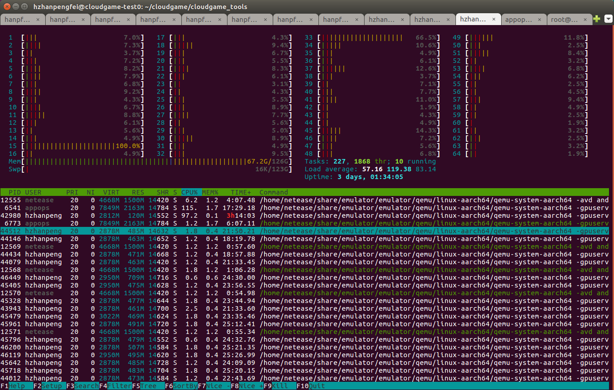

# NUMA 机制的应用
在 ARM 服务器上，以默认的方式启动许多个 emulator 实例，像下面这样：
```
$ emulator -gpuserveraddr 10.240.209.153 -gpuserverport 6230 -port 5580 -avd android_7.1.1_arm64_portrait_720x1280_inst63
```
<!--more-->
将出现许多 emulator 进程 CPU 占用率都非常高，各个 emulator 间疯狂争抢 CPU 资源的问题。这种启动 emulator 的方式是不可能在 64 核的 ARM 服务器上同时运行多于 64 个 emulator 的实例的。

ARM 服务器共有 64 个 CPU 核，及 4 个 NUMA 节点，每个 NUMA 节点都与一些 CPU 核绑定，通过命令行工具 `lscpu` 可以查看相关的信息。
```
$ lscpu
Architecture:          aarch64
Byte Order:            Little Endian
CPU(s):                64
On-line CPU(s) list:   0-63
Thread(s) per core:    1
Core(s) per socket:    4
Socket(s):             16
NUMA node(s):          4
NUMA node0 CPU(s):     0-15
NUMA node1 CPU(s):     16-31
NUMA node2 CPU(s):     32-47
NUMA node3 CPU(s):     48-63
```

从上面输出的信息中，可以看到，第 0 号 NUMA 节点与 0-15 号 CPU 绑定，第 1 号 NUMA 节点与 16-31 号 CPU 绑定，依次类推。通过如下命令启动模拟器，以优化整个系统的性能：
```
$ numactl -m 0 -C 0 emulator -gpuserveraddr 10.240.209.153 -gpuserverport 6230 -port 5580 -avd android_7.1.1_arm64_portrait_720x1280_inst60
```

这个命令将 emulator 的执行绑定在特定的 NUMA 节点和 CPU 核上。需要注意 指定的 CPU 核需要与它绑定的 NUMA 节点一致；指定的 NUMA 节点和 CPU 核均需要在可选择的有效 NUMA 节点和 CPU 范围内，否则进程将启动失败。

经过上面的优化，整个系统的性能得到比较大的优化，不再出现许多 emulator 进程 CPU 占用率都非常高，各个 emulator 间疯狂争抢 CPU 资源的问题。

# adb 导致的性能问题

经过上面的优化，虽然性能得到大幅优化，但当我们通过 `top` 和 `htop` 命令查看进程状态时，还是发现了一些问题。top 命令执行结果如下：
```
  PID USER      PR  NI    VIRT    RES    SHR S  %CPU %MEM     TIME+ COMMAND 
39985 hzhanpe+  20   0 2948060 468216  14720 S  71.4  0.4   7:59.25 qemu-system-aar                                                                 
45405 hzhanpe+  20   0 3021788 487032  14628 S  68.8  0.4  20:55.06 qemu-system-aar                                                                 
40041 hzhanpe+  20   0 2948060 462024  14536 S  68.1  0.4   6:56.74 qemu-system-aar                                                                 
45101 hzhanpe+  20   0 2948060 476648  14724 S  67.8  0.4  17:23.12 qemu-system-aar                                                                 
43542 hzhanpe+  20   0 2948060 468168  14432 S  67.4  0.4  18:12.83 qemu-system-aar                                                                 
45961 hzhanpe+  20   0 2948060 503280  14720 S  67.1  0.4  22:19.33 qemu-system-aar                                                                 
40289 hzhanpe+  20   0 2948060 472256  14648 S  65.8  0.4  11:13.32 qemu-system-aar                                                                 
39961 hzhanpe+  20   0 2948060 472296  14628 S  64.8  0.4   8:13.39 qemu-system-aar                                                                 
45875 hzhanpe+  20   0 2948060 482736  14584 S  61.8  0.4  21:55.84 qemu-system-aar                                                                 
40010 hzhanpe+  20   0 2948060 808292  14632 S  60.2  0.6   7:59.66 qemu-system-aar                                                                 
40096 hzhanpe+  20   0 2948060 459968  14620 S  59.5  0.3   7:16.60 qemu-system-aar                                                                 
41981 hzhanpe+  20   0 2948060 482728  14716 S  59.5  0.4  16:19.01 qemu-system-aar                                                                 
42436 hzhanpe+  20   0 2948060 476416  14512 S  59.5  0.4  13:41.56 qemu-system-aar                                                                 
40253 hzhanpe+  20   0 2948060 464088  14708 S  58.9  0.4  10:50.09 qemu-system-aar                                                                 
46449 hzhanpe+  20   0 3021788 726668  14716 S  58.2  0.6  21:48.36 qemu-system-aar                                                                 
42494 hzhanpe+  20   0 2948060 468384  14648 S  57.6  0.4  14:09.92 qemu-system-aar                                                                 
44146 hzhanpe+  20   0 2948060 468364  14652 S  57.6  0.4  15:56.76 qemu-system-aar                                                                 
40870 hzhanpe+  20   0 2948060 476396  14428 S  56.9  0.4   9:50.65 qemu-system-aar                                                                 
44660 hzhanpe+  20   0 2948060 474528  14652 S  56.9  0.4  16:54.32 qemu-system-aar                                                                 
45479 hzhanpe+  20   0 2948060 476516  14624 S  56.2  0.4  20:37.84 qemu-system-aar                                                                 
45718 hzhanpe+  20   0 2948060 486896  14704 S  56.2  0.4  22:16.29 qemu-system-aar                                                                 
45328 hzhanpe+  20   0 2948060 486856  14644 S  55.6  0.4  20:43.48 qemu-system-aar                                                                 
42381 hzhanpe+  20   0 3021788 470556  14572 S  55.3  0.4  15:05.59 qemu-system-aar                                                                 
43289 hzhanpe+  20   0 2948060 472464  14612 S  55.3  0.4  17:52.02 qemu-system-aar                                                                 
42549 hzhanpe+  20   0 2948060 472540  14608 S  54.9  0.4  14:26.73 qemu-system-aar                                                                 
40909 hzhanpe+  20   0 2948060 472296  14632 S  54.6  0.4   9:53.95 qemu-system-aar                                                                 
45248 hzhanpe+  20   0 2948060 474644  14644 S  54.6  0.4  17:35.15 qemu-system-aar                                                                 
43876 hzhanpe+  20   0 3021788 482736  14472 S  54.3  0.4  20:28.21 qemu-system-aar                                                                 
43608 hzhanpe+  20   0 3021788 480860  14604 S  53.6  0.4  19:05.39 qemu-system-aar                                                                 
41929 hzhanpe+  20   0 2948060 484804  14704 S  52.3  0.4  16:15.19 qemu-system-aar                                                                 
45796 hzhanpe+  20   0 2948060 484612  14552 S  51.6  0.4  21:38.19 qemu-system-aar                                                                 
40156 hzhanpe+  20   0 2948060 460008  14676 S  51.3  0.3  10:05.45 qemu-system-aar                                                                 
46038 hzhanpe+  20   0 3021788 496756  14412 S  51.3  0.4  22:00.39 qemu-system-aar                                                                 
45174 hzhanpe+  20   0 2948060 466276  14632 S  51.0  0.4  17:57.39 qemu-system-aar                                                                 
42980 hzhanpe+  20   0 2880476 123196  14552 S  50.7  0.1 187:53.29 qemu-system-aar                                                                 
41880 hzhanpe+  20   0 2948060 480564  14472 S  50.3  0.4  15:50.96 qemu-system-aar                                                                 
40640 hzhanpe+  20   0 3095516 466332  14668 S  49.7  0.4  12:20.51 qemu-system-aar                                                                 
41487 hzhanpe+  20   0 2948060 472360  14704 S  49.7  0.4  13:40.67 qemu-system-aar
```

从 top 命令的输出结果可以看到，多个 emulator 的进程 CPU 占用率仍然较高。

`htop` 命令执行的结果如下：


emualtor 进程使得 CPU 持续处于异常繁忙的状态同样得到验证。

然而，我们通过如下命令杀掉 ADB server：
```
$ adb kill-server
```

再次查看 `top` 和 `htop` 命令的输出。`top` 命令的输出如下：
```
  PID USER      PR  NI    VIRT    RES    SHR S  %CPU %MEM     TIME+ COMMAND 
42980 hzhanpe+  20   0 2880476 123196  14552 S  99.0  0.1 193:43.96 qemu-system-aar                                                                 
24348 hzhanpe+  20   0    8360   5864   2452 S   7.2  0.0  10:09.35 htop                                                                            
39786 hzhanpe+  20   0 2948060 486748  14620 S   2.0  0.4   7:56.54 qemu-system-aar                                                                 
39836 hzhanpe+  20   0 2948060 437364  14624 S   1.6  0.3   6:58.70 qemu-system-aar                                                                 
39936 hzhanpe+  20   0 3021788 478760  14724 S   1.6  0.4   9:01.92 qemu-system-aar                                                                 
40461 hzhanpe+  20   0 2948060 480476  14668 S   1.6  0.4  12:21.28 qemu-system-aar                                                                 
40640 hzhanpe+  20   0 3095516 464440  14668 S   1.6  0.4  14:00.10 qemu-system-aar                                                                 
40675 hzhanpe+  20   0 2948060 474548  14632 S   1.6  0.4  10:44.42 qemu-system-aar                                                                 
40828 hzhanpe+  20   0 3095516 476800  14640 S   1.6  0.4  10:46.27 qemu-system-aar                                                                 
40870 hzhanpe+  20   0 2948060 476396  14428 S   1.6  0.4  11:06.14 qemu-system-aar                                                                 
41037 hzhanpe+  20   0 3021788 476644  14712 S   1.6  0.4  11:27.86 qemu-system-aar                                                                 
41581 hzhanpe+  20   0 2948060 492944  14748 S   1.6  0.4  16:10.79 qemu-system-aar                                                                 
42137 hzhanpe+  20   0 2948060 470320  14588 S   1.6  0.4  15:38.55 qemu-system-aar                                                                 
42191 hzhanpe+  20   0 2948060 464448  14704 S   1.6  0.4  15:27.60 qemu-system-aar                                                                 
42549 hzhanpe+  20   0 2948060 474608  14608 S   1.6  0.4  16:21.91 qemu-system-aar                                                                 
42861 hzhanpe+  20   0 2948060 474484  14632 S   1.6  0.4  16:45.82 qemu-system-aar                                                                 
43414 hzhanpe+  20   0 2948060 484748  14604 S   1.6  0.4  20:35.28 qemu-system-aar                                                                 
43876 hzhanpe+  20   0 3021788 482736  14472 S   1.6  0.4  23:31.48 qemu-system-aar                                                                 
44217 hzhanpe+  20   0 2948060 472392  14712 S   1.6  0.4  18:51.15 qemu-system-aar                                                                 
45642 hzhanpe+  20   0 2948060 497296  14728 S   1.6  0.4  24:08.87 qemu-system-aar                                                                 
45718 hzhanpe+  20   0 2948060 495088  14704 S   1.6  0.4  25:19.87 qemu-system-aar                                                                 
39713 hzhanpe+  20   0 3020028 483232  15208 S   1.3  0.4   8:40.32 qemu-system-aar                                                                 
39809 hzhanpe+  20   0 2948060 490952  14692 S   1.3  0.4   8:01.09 qemu-system-aar                                                                 
39857 hzhanpe+  20   0 2948060 488848  14664 S   1.3  0.4   7:57.73 qemu-system-aar                                                                 
39884 hzhanpe+  20   0 2948060 478456  14588 S   1.3  0.4   8:51.47 qemu-system-aar                                                                 
39907 hzhanpe+  20   0 2948060 476344  14648 S   1.3  0.4   8:03.02 qemu-system-aar                                                                 
39961 hzhanpe+  20   0 3021788 472456  14632 S   1.3  0.4   9:15.31 qemu-system-aar                                                                 
39985 hzhanpe+  20   0 2948060 468288  14724 S   1.3  0.4   8:58.30 qemu-system-aar                                                                 
40010 hzhanpe+  20   0 2948060 808292  14632 S   1.3  0.6   8:56.44 qemu-system-aar                                                                 
40069 hzhanpe+  20   0 2948060 470128  14620 S   1.3  0.4   8:50.36 qemu-system-aar                                                                 
40123 hzhanpe+  20   0 2948060 457932  14620 S   1.3  0.3  12:03.48 qemu-system-aar                                                                 
40156 hzhanpe+  20   0 2948060 460008  14676 S   1.3  0.3  11:23.75 qemu-system-aar                                                                 
40186 hzhanpe+  20   0 2948060 466192  14488 S   1.3  0.4  12:36.00 qemu-system-aar                                                                 
40220 hzhanpe+  20   0 2948060 468324  14636 S   1.3  0.4  12:17.53 qemu-system-aar                                                                 
40253 hzhanpe+  20   0 2948060 464176  14708 S   1.3  0.4  12:14.23 qemu-system-aar                                                                 
40289 hzhanpe+  20   0 2948060 472324  14648 S   1.3  0.4  12:42.02 qemu-system-aar                                                                 
40328 hzhanpe+  20   0 2948060 476508  14648 S   1.3  0.4  11:41.24 qemu-system-aar
```

从上面的输出中可以看到，除了进程号为 42980 的进程外，其它的 emulator 进程的 CPU 占用率都恢复到比较低的状态。

`htop` 命令的输出如下：


从上面的输出可以看到，除占用第 15 号 CPU 的进程 CPU 占用率总是非常高，接近 100% 之外，整个世界都平静了。不难猜测，这里占用第 15 号 CPU 的进程正是上面看到的进程号为 42980 的进程。

多次查看第 42980 号进程打开的端口：
```
$ lsof -i | grep 42980
qemu-syst 42980 hzhanpengfei   17u  IPv4 3942777      0t0  TCP localhost:44040->localhost:5037 (ESTABLISHED)
qemu-syst 42980 hzhanpengfei   31u  IPv4 2680530      0t0  TCP localhost:5717 (LISTEN)
qemu-syst 42980 hzhanpengfei   32u  IPv6 2680531      0t0  TCP localhost:5717 (LISTEN)
qemu-syst 42980 hzhanpengfei   33u  IPv4 2680532      0t0  TCP localhost:5716 (LISTEN)
qemu-syst 42980 hzhanpengfei   34u  IPv4 4023949      0t0  TCP localhost:50402->localhost:5037 (ESTABLISHED)
$ lsof -i | grep 42980
qemu-syst 42980 hzhanpengfei   17u  IPv4 3942777      0t0  TCP localhost:44040->localhost:5037 (ESTABLISHED)
qemu-syst 42980 hzhanpengfei   31u  IPv4 2680530      0t0  TCP localhost:5717 (LISTEN)
qemu-syst 42980 hzhanpengfei   32u  IPv6 2680531      0t0  TCP localhost:5717 (LISTEN)
qemu-syst 42980 hzhanpengfei   33u  IPv4 2680532      0t0  TCP localhost:5716 (LISTEN)
qemu-syst 42980 hzhanpengfei   34u  IPv4 4024001      0t0  TCP localhost:57242->localhost:5037 (ESTABLISHED)
$ lsof -i | grep 42980
qemu-syst 42980 hzhanpengfei   17u  IPv4 3942777      0t0  TCP localhost:44040->localhost:5037 (ESTABLISHED)
qemu-syst 42980 hzhanpengfei   31u  IPv4 2680530      0t0  TCP localhost:5717 (LISTEN)
qemu-syst 42980 hzhanpengfei   32u  IPv6 2680531      0t0  TCP localhost:5717 (LISTEN)
qemu-syst 42980 hzhanpengfei   33u  IPv4 2680532      0t0  TCP localhost:5716 (LISTEN)
qemu-syst 42980 hzhanpengfei   34u  IPv4 4024001      0t0  TCP localhost:57242->localhost:5037 (ESTABLISHED)
$ lsof -i | grep 42980
qemu-syst 42980 hzhanpengfei   17u  IPv4 3942777      0t0  TCP localhost:44040->localhost:5037 (ESTABLISHED)
qemu-syst 42980 hzhanpengfei   31u  IPv4 2680530      0t0  TCP localhost:5717 (LISTEN)
qemu-syst 42980 hzhanpengfei   32u  IPv6 2680531      0t0  TCP localhost:5717 (LISTEN)
qemu-syst 42980 hzhanpengfei   33u  IPv4 2680532      0t0  TCP localhost:5716 (LISTEN)
$ lsof -i | grep 42980
qemu-syst 42980 hzhanpengfei   17u  IPv4 3942777      0t0  TCP localhost:44040->localhost:5037 (ESTABLISHED)
qemu-syst 42980 hzhanpengfei   31u  IPv4 2680530      0t0  TCP localhost:5717 (LISTEN)
qemu-syst 42980 hzhanpengfei   32u  IPv6 2680531      0t0  TCP localhost:5717 (LISTEN)
qemu-syst 42980 hzhanpengfei   33u  IPv4 2680532      0t0  TCP localhost:5716 (LISTEN)
qemu-syst 42980 hzhanpengfei   34u  IPv4 4024011      0t0  TCP localhost:58792->localhost:5037 (ESTABLISHED)
```

这个 emulator 进程始终监听在第 5716 和 5717 号 TCP 端口上——这两个端口分别是用于终端和 ADB 连接的端口。emulator 与  tcp:localhost:5037 上的服务保持着一条长连接，并与相同地址上的服务有一个频繁地建立和销毁的连接。

对于模拟器而言，在 ADB 中，它的串号通常是 "emulator-" 后跟终端端口号。我们启动 ADB server，并查看该 emulator 的状态：
```
$ adb devices | grep 5716
emulator-5716	offline
```

CPU 占用率始终非常高的 emulator，其状态为 OFFLINE 的。这是由 ADB 导致的 emulator CPU 占用率高的一个问题，即处于 OFFLINE 状态的 emulator 进程 CPU 占用率非常高。

处于 OFFLINE 状态的 emulator，还可以观察到这样一种现象：
```
$ adb devices  | grep offline
emulator-5616	offline
$ lsof -i | grep 5616
qemu-syst 40527 hzhanpengfei   33u  IPv4 2673543      0t0  TCP localhost:5616 (LISTEN)
$ lsof -i | grep 40527
qemu-syst 40527 hzhanpengfei   17u  IPv4 3948652      0t0  TCP localhost:41784->localhost:5037 (ESTABLISHED)
qemu-syst 40527 hzhanpengfei   31u  IPv4 2673541      0t0  TCP localhost:5617 (LISTEN)
qemu-syst 40527 hzhanpengfei   32u  IPv6 2673542      0t0  TCP localhost:5617 (LISTEN)
qemu-syst 40527 hzhanpengfei   33u  IPv4 2673543      0t0  TCP localhost:5616 (LISTEN)
qemu-syst 40527 hzhanpengfei   34u  IPv4 4409291      0t0  TCP localhost:58470->localhost:5037 (ESTABLISHED)
qemu-syst 40527 hzhanpengfei   47u  IPv4 2673550      0t0  TCP localhost:5617->localhost:57289 (CLOSE_WAIT)
```

即由 ADB server 发起的与其建立的连接失败，连接始终处于 `CLOSE_WAIT` 状态。

除了这种处于 OFFLINE 故障状态的 emulator 进程外，在 ADB server 运行时，还有一些 emulator 进程 CPU 占用率也非常高。从中任意挑选一个，如进程号为 45559 的进程，多次查看其打开的端口状态：
```
$ lsof -i | grep 45559
qemu-syst 45559 hzhanpengfei   17u  IPv4 3940753      0t0  TCP localhost:5791->localhost:42171 (ESTABLISHED)
qemu-syst 45559 hzhanpengfei   31u  IPv4 2716489      0t0  TCP localhost:5791 (LISTEN)
qemu-syst 45559 hzhanpengfei   32u  IPv6 2716490      0t0  TCP localhost:5791 (LISTEN)
qemu-syst 45559 hzhanpengfei   33u  IPv4 2716491      0t0  TCP localhost:5790 (LISTEN)
qemu-syst 45559 hzhanpengfei   34u  IPv4 3940758      0t0  TCP localhost:44030->localhost:5037 (ESTABLISHED)
qemu-syst 45559 hzhanpengfei   47u  IPv4 4277378      0t0  TCP localhost:41488->localhost:5037 (ESTABLISHED)
$ lsof -i | grep 45559
qemu-syst 45559 hzhanpengfei   17u  IPv4 3940753      0t0  TCP localhost:5791->localhost:42171 (ESTABLISHED)
qemu-syst 45559 hzhanpengfei   31u  IPv4 2716489      0t0  TCP localhost:5791 (LISTEN)
qemu-syst 45559 hzhanpengfei   32u  IPv6 2716490      0t0  TCP localhost:5791 (LISTEN)
qemu-syst 45559 hzhanpengfei   33u  IPv4 2716491      0t0  TCP localhost:5790 (LISTEN)
qemu-syst 45559 hzhanpengfei   34u  IPv4 3940758      0t0  TCP localhost:44030->localhost:5037 (ESTABLISHED)
qemu-syst 45559 hzhanpengfei   47u  IPv4 4277401      0t0  TCP localhost:43416->localhost:5037 (ESTABLISHED)
$ lsof -i | grep 45559
qemu-syst 45559 hzhanpengfei   17u  IPv4 3940753      0t0  TCP localhost:5791->localhost:42171 (ESTABLISHED)
qemu-syst 45559 hzhanpengfei   31u  IPv4 2716489      0t0  TCP localhost:5791 (LISTEN)
qemu-syst 45559 hzhanpengfei   32u  IPv6 2716490      0t0  TCP localhost:5791 (LISTEN)
qemu-syst 45559 hzhanpengfei   33u  IPv4 2716491      0t0  TCP localhost:5790 (LISTEN)
qemu-syst 45559 hzhanpengfei   34u  IPv4 3940758      0t0  TCP localhost:44030->localhost:5037 (ESTABLISHED)
qemu-syst 45559 hzhanpengfei   47u  IPv4 4277413      0t0  TCP localhost:45272->localhost:5037 (ESTABLISHED)
$ lsof -i | grep 45559
qemu-syst 45559 hzhanpengfei   17u  IPv4 3940753      0t0  TCP localhost:5791->localhost:42171 (ESTABLISHED)
qemu-syst 45559 hzhanpengfei   31u  IPv4 2716489      0t0  TCP localhost:5791 (LISTEN)
qemu-syst 45559 hzhanpengfei   32u  IPv6 2716490      0t0  TCP localhost:5791 (LISTEN)
qemu-syst 45559 hzhanpengfei   33u  IPv4 2716491      0t0  TCP localhost:5790 (LISTEN)
qemu-syst 45559 hzhanpengfei   34u  IPv4 3940758      0t0  TCP localhost:44030->localhost:5037 (ESTABLISHED)
qemu-syst 45559 hzhanpengfei   47u  IPv4 4277430      0t0  TCP localhost:47834->localhost:5037 (ESTABLISHED)
```

这个进程同样监听在两个端口上，只是这两个端口分别是 5790 和 5791。emulator 与 tcp:localhost:5037 上的服务保持着一条长连接，并与相同地址上的服务有一个频繁建立和销毁的连接。另外一个进程与 emulator 在 tcp:localhost:5791 上的服务也保持着一条长连接。

查看在 tcp:localhost:5037 上提供服务的进程，以及与 emulator 建立连接的进程是谁：
```
$ lsof -i | grep 5037
adb       21530 hzhanpengfei    4u  IPv4 3930563      0t0  TCP localhost:5037->localhost:45990 (ESTABLISHED)
adb       21530 hzhanpengfei    7u  IPv4 3930564      0t0  TCP localhost:5037->localhost:45992 (ESTABLISHED)
adb       21530 hzhanpengfei    8u  IPv4 3925385      0t0  TCP localhost:5037 (LISTEN)
$ lsof -i | grep 42171
adb       21530 hzhanpengfei  142u  IPv4 3912508      0t0  TCP localhost:42171->localhost:5791 (ESTABLISHED)
qemu-syst 45559 hzhanpengfei   17u  IPv4 3940753      0t0  TCP localhost:5791->localhost:42171 (ESTABLISHED)
```

可见 emulator 发起的连接的服务端 tcp:localhost:5037 位于 ADB server 进程内，发起与 emulator 内的服务建立连接的同样是 adb 进程。

由此推测，ADB server 启动之后，出现性能问题的可能原因：
1. emulator 频繁地与 ADB server 建立销毁连接造成了比较大的开销。
2. emulator 在由 emulator 发起建立的与 ADB server 之间的连接上活动频繁消耗巨大。
3. emulator 在由 ADB server 发起建立的与 ADB server 之间的连接上活动频繁消耗巨大。

总结一下，要解决或检查的问题：
1. 消除处于 OFFLINE 状态的 emulator，查找 ADB server 与 emulator 建立连接失败的原因。
2. 检查 emulator 进程中，与 ADB server 建立的各条连接的状态。

对于 ADB 导致的性能问题，我们从 emulator 与 ADB server 建立连接的过程开始分析。

emulator 发起的与 ADB server 之间的稳定的长连接的创建位置如下：
```
#0  android::wear::WearAgentImpl::connectToAdbHost (this=0x7fffec081f20) at android/android-emu/android/wear-agent/WearAgent.cpp:291
#1  android::wear::WearAgentImpl::connectToAdbHostWorker (this=0x7fffec081f20) at android/android-emu/android/wear-agent/WearAgent.cpp:277
#2  android::wear::WearAgentImpl::__lambda1::operator() (__closure=<optimized out>) at android/android-emu/android/wear-agent/WearAgent.cpp:441
#3  std::_Function_handler<long int(), android::wear::WearAgentImpl::WearAgentImpl(android::base::Looper*, int)::__lambda1>::_M_invoke(const std::_Any_data &) (__functor=...)
    at /media/data/Androids/emu-2.4-release/prebuilts/gcc/linux-x86/host/x86_64-linux-glibc2.11-4.8/x86_64-linux/include/c++/4.8/functional:2056
#4  0x000000000093d9c4 in android::base::Thread::thread_main (arg=0x7fffec0823e0) at android/android-emu/android/base/threads/Thread_pthread.cpp:152
#5  0x00007ffff7bc16ba in start_thread (arg=0x7ffff228f700) at pthread_create.c:333
#6  0x00007ffff68403dd in clone () at ../sysdeps/unix/sysv/linux/x86_64/clone.S:109
```

emulator 进程与 ADB server 建立 TCP 连接的过程（位于 `qemu/android/android-emu/android/wear-agent/WearAgent.cpp`）如下：
```
void WearAgentImpl::connectToAdbHost() {
    // this is the only function which modifies members from a separate thread
    // it means we need to be extra careful changing it:
    // - make sure correct locks are locked
    // - make sure the state is updated only after everything else
    // - don't hold locks for too long

    const int socket = socketTcp4LoopbackClient(mAdbHostPort);
    if (socket < 0) {
        android::base::AutoLock lock(mSocketLock);
        mSocketOpenState = SocketOpenState::Failed;
        return;
    }

    socketSetNonBlocking(socket);

    android::base::AutoLock lock(mSocketLock);
    if (mSocket >= 0) {
        // already created, make sure the completion runs
        mSocketOpenState = SocketOpenState::Succeded;
        lock.unlock();
        socketClose(socket);
        return;
    }

    mSocket = socket;
    mSocketOpenState = SocketOpenState::Succeded;
}
```

在 `qemu/vl.c` 的 `main_impl()` 函数中有如下这样一行：
```
    android_wear_agent_start(looper_getForThread());
```

这个函数创建 `android::wear::WearAgent` 对象，并在该对象的创建过程中，启动新的线程来建立与 ADB server 之间的连接，即与 ADB server 之间的长连接。

我们注意到，上面建立与 ADB server 之间的连接的过程中，是通过 `android::base::socketTcp4LoopbackClient()` 函数完成的，不难猜测在 emulator 中，建立与某个服务的连接的过程都是通过该函数完成的，包括前面观察到的与 ADB server 之间那个频繁建立与销毁的连接。

通过 GDB 来调试 emulator。我们观察到，在 emulator 的整个生命周期中，除了 `qemu/android/android-emu/android/wear-agent/WearAgent.cpp` 文件中，建立的与 ADB server 的长连接之外，还有如下几处，也与 ADB server 建立了连接。

连接一：
```
#0  android::base::socketTcp4LoopbackClient (port=port@entry=5037) at android/android-emu/android/base/sockets/SocketUtils.cpp:607
#1  0x00000000008b7027 in android::emulation::AdbHostServer::notify (adbEmulatorPort=5555, adbClientPort=5037) at android/android-emu/android/emulation/AdbHostServer.cpp:34
#2  0x0000000000899cb1 in android_emulation_setup (agents=0x161d500 <qemu_android_emulation_setup::consoleAgents>) at android/android-emu/android/qemu-setup.c:373
#3  0x0000000000429797 in main_impl (argc=<optimized out>, argv=<optimized out>) at /media/data/Androids/emu-2.4-release/external/emulator-x86/vl.c:5181
#4  0x000000000042a7b6 in run_qemu_main (argc=<optimized out>, argv=<optimized out>) at /media/data/Androids/emu-2.4-release/external/emulator-x86/vl.c:3254
#5  0x000000000042a80a in enter_qemu_main_loop (argc=62, argv=0x7fffffffcf40) at /media/data/Androids/emu-2.4-release/external/emulator-x86/android-qemu2-glue/main.cpp:341
#6  0x0000000000414775 in std::function<void ()>::operator()() const (this=<optimized out>)
    at /media/data/Androids/emu-2.4-release/prebuilts/gcc/linux-x86/host/x86_64-linux-glibc2.11-4.8/x86_64-linux/include/c++/4.8/functional:2464
#7  AppThread::main (this=<optimized out>) at android/android-emu/android/skin/nowindow/AppThread.cpp:18
#8  0x000000000093db44 in android::base::Thread::thread_main (arg=0x1645900) at android/android-emu/android/base/threads/Thread_pthread.cpp:152
#9  0x00007ffff7bc16ba in start_thread (arg=0x7ffff2a90700) at pthread_create.c:333
#10 0x00007ffff68403dd in clone () at ../sysdeps/unix/sysv/linux/x86_64/clone.S:109
```

这里是在 emulator 进程完成对终端端口和 ADB 端口的监听之后，关于其状态通知 ADB server 而建立的临时连接，通知完成后连接销毁。

连接二：
```
#0  android::base::socketTcp4LoopbackClient (port=port@entry=5037) at android/android-emu/android/base/sockets/SocketUtils.cpp:607
#1  0x00000000008b7027 in android::emulation::AdbHostServer::notify (adbEmulatorPort=5555, adbClientPort=5037) at android/android-emu/android/emulation/AdbHostServer.cpp:34
#2  0x00000000008b65ae in android::emulation::AdbGuestPipe::onGuestSendCommand (this=this@entry=0x7fffd82b3fb0, buffers=0x7fffe3ffd250, numBuffers=1)
    at android/android-emu/android/emulation/AdbGuestPipe.cpp:470
#3  0x00000000008b6628 in android::emulation::AdbGuestPipe::onGuestSend (this=0x7fffd82b3fb0, buffers=<optimized out>, numBuffers=<optimized out>)
    at android/android-emu/android/emulation/AdbGuestPipe.cpp:229
#4  0x000000000048437c in pipeDevice_doCommand_v2 (pipe=0x7fffd8004d80) at /media/data/Androids/emu-2.4-release/external/emulator-x86/hw/misc/goldfish_pipe.c:866
#5  0x00000000004844b9 in pipe_dev_write_v2 (dev=0x7fff894e6e80, offset=<optimized out>, value=0)
    at /media/data/Androids/emu-2.4-release/external/emulator-x86/hw/misc/goldfish_pipe.c:1082
#6  0x000000000049a876 in memory_region_write_accessor (attrs=..., mask=4294967295, shift=<optimized out>, size=<optimized out>, value=0x7fffe3ffe838, addr=<optimized out>, 
    mr=0x7fff894e68f0) at /media/data/Androids/emu-2.4-release/external/emulator-x86/memory.c:525
#7  access_with_adjusted_size (attrs=..., mr=0x7fff894e68f0, access=0x4960d0 <memory_region_write_accessor>, access_size_max=<optimized out>, access_size_min=<optimized out>, 
    size=4, value=0x7fffe3ffe838, addr=0) at /media/data/Androids/emu-2.4-release/external/emulator-x86/memory.c:591
#8  memory_region_dispatch_write (mr=mr@entry=0x7fff894e68f0, addr=0, data=0, size=size@entry=4, attrs=..., attrs@entry=...)
    at /media/data/Androids/emu-2.4-release/external/emulator-x86/memory.c:1262
#9  0x00000000004465de in address_space_write_continue (mr=0x7fff894e68f0, l=4, addr1=0, len=4, buf=0x7ffff7fcf028 "", attrs=..., addr=4278194176, 
    as=0x11ebfc0 <address_space_memory>) at /media/data/Androids/emu-2.4-release/external/emulator-x86/exec.c:2571
#10 address_space_write (as=<optimized out>, addr=<optimized out>, attrs=..., buf=<optimized out>, len=<optimized out>)
    at /media/data/Androids/emu-2.4-release/external/emulator-x86/exec.c:2628
#11 0x00000000004476ed in address_space_rw (as=<optimized out>, addr=<optimized out>, attrs=..., attrs@entry=..., buf=buf@entry=0x7ffff7fcf028 "", len=<optimized out>, 
    is_write=<optimized out>) at /media/data/Androids/emu-2.4-release/external/emulator-x86/exec.c:2736
#12 0x00000000005f25df in kvm_cpu_exec (cpu=cpu@entry=0x7fffeff6eaa0) at /media/data/Androids/emu-2.4-release/external/emulator-x86/kvm-all.c:1964
#13 0x000000000042fd7a in qemu_kvm_cpu_thread_fn (arg=0x7fffeff6eaa0) at /media/data/Androids/emu-2.4-release/external/emulator-x86/cpus.c:1103
#14 0x0000000000827b00 in qemu_thread_trampoline (data_=0x7fffeff8bed0) at /media/data/Androids/emu-2.4-release/external/emulator-x86/util/qemu-thread-posix.c:501
#15 0x00007ffff7bc16ba in start_thread (arg=0x7fffe3fff700) at pthread_create.c:333
#16 0x00007ffff68403dd in clone () at ../sysdeps/unix/sysv/linux/x86_64/clone.S:109
```

这里是 emulator 运行的 Android 系统初始化到一定阶段之后，触发的与 ADB server 之间建立的连接，用于通知其状态。这个连接在通知完成之后销毁。

除了上面 3 个与 ADB server 建立连接的情况，在多个 emulator 同时运行时，如下这种情况发起的与 ADB server 建立连接的情况则要频繁得多：
```
#0  android::base::socketTcp4LoopbackClient (port=port@entry=5037) at android/android-emu/android/base/sockets/SocketUtils.cpp:607
#1  0x00000000008f098b in android::wear::PairUpWearPhoneImpl::openConnection (this=0x7fff8add2b20, port=5037, watch=0x7fff8add2b30, 
    callback=0x8f32e0 <android::wear::_on_adb_server_socket_fd(void*, int, unsigned int)>)
    at android/android-emu/android/wear-agent/PairUpWearPhone.cpp:621
#2  0x00000000008f0cfb in android::wear::PairUpWearPhoneImpl::openAdbConnection (this=0x7fff8add2b20)
    at android/android-emu/android/wear-agent/PairUpWearPhone.cpp:595
#3  android::wear::PairUpWearPhoneImpl::startWriteCommandToAdb (this=this@entry=0x7fff8add2b20, queryType=queryType@entry=1, 
    message=0x7fffec08c2e8 "emulator-5556") at android/android-emu/android/wear-agent/PairUpWearPhone.cpp:373
#4  0x00000000008f0f77 in android::wear::PairUpWearPhoneImpl::startProbeNextDevice (this=this@entry=0x7fff8add2b20)
    at android/android-emu/android/wear-agent/PairUpWearPhone.cpp:509
#5  0x00000000008f1de4 in android::wear::PairUpWearPhoneImpl::updateDevices (this=this@entry=0x7fff8add2b20, devices=...)
    at android/android-emu/android/wear-agent/PairUpWearPhone.cpp:559
#6  0x00000000008f3503 in android::wear::PairUpWearPhoneImpl::PairUpWearPhoneImpl (adbHostPort=5037, devices=..., looper=<optimized out>, 
    this=0x7fff8add2b20) at android/android-emu/android/wear-agent/PairUpWearPhone.cpp:485
#7  android::wear::PairUpWearPhone::PairUpWearPhone (this=0x7fff899dbd50, looper=<optimized out>, devices=..., adbHostPort=5037)
    at android/android-emu/android/wear-agent/PairUpWearPhone.cpp:643
#8  0x00000000008effb3 in android::wear::WearAgentImpl::onRead (this=0x7fffec081f20) at android/android-emu/android/wear-agent/WearAgent.cpp:195
#9  0x00000000008727d0 in android::qemu::(anonymous namespace)::QemuLooper::FdWatch::fire (this=0x7fff89b03590)
    at /media/data/Androids/emu-2.4-release/external/emulator-x86/android-qemu2-glue/base/async/Looper.cpp:128
#10 android::qemu::(anonymous namespace)::QemuLooper::handleBottomHalf (opaque=0x7fffec0813d0)
    at /media/data/Androids/emu-2.4-release/external/emulator-x86/android-qemu2-glue/base/async/Looper.cpp:328
#11 0x00000000005ffdc2 in aio_bh_call (bh=<optimized out>) at /media/data/Androids/emu-2.4-release/external/emulator-x86/async.c:67
#12 aio_bh_poll (ctx=ctx@entry=0x7fffec080e10) at /media/data/Androids/emu-2.4-release/external/emulator-x86/async.c:95
#13 0x00000000007ea320 in aio_dispatch (ctx=0x7fffec080e10) at /media/data/Androids/emu-2.4-release/external/emulator-x86/aio-posix.c:309
#14 0x00000000005ffae9 in aio_ctx_dispatch (source=<optimized out>, callback=<optimized out>, user_data=<optimized out>)
    at /media/data/Androids/emu-2.4-release/external/emulator-x86/async.c:234
#15 0x0000000000cdeaee in g_main_dispatch (context=0x7fffec081270) at /tmp/zyy-build-temp-120638/src/glib-2.38.2/glib/gmain.c:3072
#16 g_main_context_dispatch (context=context@entry=0x7fffec081270) at /tmp/zyy-build-temp-120638/src/glib-2.38.2/glib/gmain.c:3648
#17 0x0000000000787d04 in glib_pollfds_poll () at /media/data/Androids/emu-2.4-release/external/emulator-x86/main-loop.c:222
#18 os_host_main_loop_wait (timeout=<optimized out>) at /media/data/Androids/emu-2.4-release/external/emulator-x86/main-loop.c:267
#19 main_loop_wait (nonblocking=<optimized out>) at /media/data/Androids/emu-2.4-release/external/emulator-x86/main-loop.c:514
#20 0x0000000000429c0c in main_loop () at /media/data/Androids/emu-2.4-release/external/emulator-x86/vl.c:2150
#21 main_impl (argc=<optimized out>, argv=<optimized out>) at /media/data/Androids/emu-2.4-release/external/emulator-x86/vl.c:5346
#22 0x000000000042a7b6 in run_qemu_main (argc=<optimized out>, argv=<optimized out>)
    at /media/data/Androids/emu-2.4-release/external/emulator-x86/vl.c:3254
#23 0x000000000042a80a in enter_qemu_main_loop (argc=62, argv=0x7fffffffcf40)
    at /media/data/Androids/emu-2.4-release/external/emulator-x86/android-qemu2-glue/main.cpp:341
#24 0x0000000000414775 in std::function<void ()>::operator()() const (this=<optimized out>)
    at /media/data/Androids/emu-2.4-release/prebuilts/gcc/linux-x86/host/x86_64-linux-glibc2.11-4.8/x86_64-linux/include/c++/4.8/functional:2464
#25 AppThread::main (this=<optimized out>) at android/android-emu/android/skin/nowindow/AppThread.cpp:18
#26 0x000000000093db44 in android::base::Thread::thread_main (arg=0x1645900) at android/android-emu/android/base/threads/Thread_pthread.cpp:152
#27 0x00007ffff7bc16ba in start_thread (arg=0x7ffff2a90700) at pthread_create.c:333
#28 0x00007ffff68403dd in clone () at ../sysdeps/unix/sysv/linux/x86_64/clone.S:109
```

比较关键的是栈的 #8 号栈帧，其相关代码位于 `qemu/android/android-emu/android/wear-agent/WearAgent.cpp` 中，像这样：
```
void WearAgentImpl::onRead() {
    if (!connected()) {
        return;
    }

    bool isError = false;
    int msgsize = 0;
    AsyncStatus status = mAsyncReader.run();

    switch (status) {
        case kAsyncCompleted:
            if (expectOkay() && !strncmp("OKAY", mReadBuffer, 4)) {
                mTimer->stop();
                mReadBuffer[4] = '\0';
                mAsyncReader.reset(mReadBuffer, 4, mFdWatch.get());
                mExpectReplayType = LENGTH;

            } else if (expectLength() && isValidHexNumber(mReadBuffer, 4)
                    && 1 == sscanf(mReadBuffer, "%x", &msgsize)) {
                if (msgsize < 0) {
                    isError = true;
                } else if (0 == msgsize) { //this is not error: just no devices
                    mExpectReplayType = LENGTH;
                    mReadBuffer[msgsize] = '\0';
                    mAsyncReader.reset(mReadBuffer, 4, mFdWatch.get());
                } else {
                    if (msgsize >= mSizeOfReadBuffer) {
                        char* ptr = (char*)calloc(2 * msgsize, sizeof(char));
                        if (ptr) {
                            mSizeOfReadBuffer = 2 * msgsize;
                            free(mReadBuffer);
                            mReadBuffer = ptr;
                        }
                    }
                    mExpectReplayType = MESSAGE;
                    mReadBuffer[msgsize] = '\0';
                    mAsyncReader.reset(mReadBuffer, msgsize, mFdWatch.get());
                }

            } else if (expectMsg()) {
                DPRINT("message received from ADB:\n%s", mReadBuffer);
                mPairUpWearPhone.reset();

                std::vector<std::string> devices;
                parseAdbDevices(mReadBuffer, &devices);
                if (devices.size() >= 2) {
                    mPairUpWearPhone.reset(new PairUpWearPhone(mLooper,
                                                               devices,
                                                               mAdbHostPort));
                }
                // prepare for next adb devices message
                mReadBuffer[4] = '\0';
                mAsyncReader.reset(mReadBuffer, 4, mFdWatch.get());
                mExpectReplayType = LENGTH;
            } else {
                isError = true;
            }
            break;

        case kAsyncAgain:
            return;

        case kAsyncError:
            isError = true;
            break;
    }

    if (isError) {
        cleanupConnection();
        connectLater();
    }
}
```

从中可以看到，在 `WearAgentImpl::onRead()` 中收到了新消息，从而触发了 emulator 与 ADB server 建立连接。这些消息实际上像下面这样：
```
emulator-5810	device
emulator-5808	device
emulator-5806	device
emulator-5804	device
emulator-5802	device
emulator-5800	device
emulator-5798	device
emulator-5796	device
emulator-5794	device
emulator-5792	device
emulator-5790	device
emulator-5788	device
```

通过观察，不难发现，当系统中有设备/模拟器实例状态发生改变，比如新创建了 emulator 实例，或者 emulator 实例从 OFFLINE 状态切换到 ONLINE 状态，每个 emulator 进程都会收到所有设备/模拟器实例的最新状态。emulator 收到的这些状态信息就像执行 `adb devices` 命令时看到的那样。不难推测这些消息是由 ADB server 发送的。

当系统中运行大量的 emulator 实例时，大量 emulator 实例频繁地相互争抢 CPU 资源，正是由于 ADB server 频繁地向与其连接的所有 emulator 实例广播所有 emulator 实例的状态所导致。

这种机制本来主要是为 Android 可穿戴设备设计，用于与 Android 手机配对的，但在系统中运行大量 emulator 实例时，却导致了性能问题。

# ADB 导致的性能问题的解决

既然找到了问题之所在，那就要寻找解决办法。解决方法可以有两个：一是让 ADB server 不要频繁地唤醒 emulator 进程并向与其连接的所有 emulator 实例广播所有 emulator 实例的状态；二是让 emulator 进程忽略收到的这种消息。

综合来看，还是修改 ADB server 代价较低。

分析 ADB 的代码，不难发现，在 ADB server 中，是通过 `system/core/adb/transport.cpp` 文件中的 `device_tracker_send()` 函数向所有 emulator 实例发送我们前面观察到的消息的。

`device_tracker_send()` 函数在相同文件中的 `device_tracker_ready()` 和 `update_transports()` 函数中被调用，这两个函数定义如下：
```
static void device_tracker_ready(asocket* socket) {
    device_tracker* tracker = reinterpret_cast<device_tracker*>(socket);

    // We want to send the device list when the tracker connects
    // for the first time, even if no update occurred.
    if (tracker->update_needed > 0) {
        tracker->update_needed = 0;

        std::string transports = list_transports(false);
        device_tracker_send(tracker, transports);
    }
}
. . . . . .
// Call this function each time the transport list has changed.
void update_transports() {
    update_transport_status();

    // Notify `adb track-devices` clients.
    std::string transports = list_transports(false);

    device_tracker* tracker = device_tracker_list;
    while (tracker != nullptr) {
        device_tracker* next = tracker->next;
        // This may destroy the tracker if the connection is closed.
        device_tracker_send(tracker, transports);
        tracker = next;
    }
}
```

这两个函数分别在 emulator 启动之初，和其它的 emulator 状态改变时，向所有 emulator 实例发送消息。

鉴于对 Android wear 设备的支持没有太多意义，因而可以禁掉这里向所有 emulator 实例广播所有 emulator 实例状态的动作。

经过上面这番对于 ADB server 的改造，adb 支持的命令，如 `adb shell` 等，依然可以正常执行，但系统中 emulator 进程的 CPU 消耗则可以降到比较低的状态。通过 top 命令可以看到：
```
  PID USER      PR  NI    VIRT    RES    SHR S  %CPU %MEM     TIME+ COMMAND 
7748 hzhanpe+  20   0 2948060 431236  14700 S   1.6  0.3   2:45.72 qemu-system-aar                                                                     
 5716 hzhanpe+  20   0 2948060 437776  14624 S   1.3  0.3   2:55.71 qemu-system-aar                                                                     
 5903 hzhanpe+  20   0 2948060 433300  14620 S   1.3  0.3   2:55.35 qemu-system-aar                                                                     
 6025 hzhanpe+  20   0 2948060 427112  14572 S   1.3  0.3   2:37.52 qemu-system-aar                                                                     
 6056 hzhanpe+  20   0 3095516 525896  14668 S   1.3  0.4   2:59.92 qemu-system-aar                                                                     
 6083 hzhanpe+  20   0 2948060 437616  14628 S   1.3  0.3   2:45.89 qemu-system-aar                                                                     
 6220 hzhanpe+  20   0 2948060 437676  14660 S   1.3  0.3   2:37.56 qemu-system-aar                                                                     
 6368 hzhanpe+  20   0 2948060 441672  14644 S   1.3  0.3   2:56.10 qemu-system-aar                                                                     
 6400 hzhanpe+  20   0 2948060 437524  14748 S   1.3  0.3   2:48.84 qemu-system-aar                                                                     
 6462 hzhanpe+  20   0 2948060 433292  14616 S   1.3  0.3   2:39.45 qemu-system-aar                                                                     
 6560 hzhanpe+  20   0 2948060 433496  14724 S   1.3  0.3   2:44.71 qemu-system-aar                                                                     
 6594 hzhanpe+  20   0 2948060 435388  14604 S   1.3  0.3   2:44.74 qemu-system-aar                                                                     
 6630 hzhanpe+  20   0 2948060 429088  14556 S   1.3  0.3   2:59.23 qemu-system-aar                                                                     
 6665 hzhanpe+  20   0 2948060 437472  14700 S   1.3  0.3   2:51.72 qemu-system-aar                                                                     
 6699 hzhanpe+  20   0 2948060 429248  14700 S   1.3  0.3   2:50.96 qemu-system-aar                                                                     
 6734 hzhanpe+  20   0 2948060 435380  14604 S   1.3  0.3   2:51.35 qemu-system-aar                                                                     
 6847 hzhanpe+  20   0 2948060 431252  14712 S   1.3  0.3   2:51.83 qemu-system-aar                                                                     
 6885 hzhanpe+  20   0 2948060 437388  14604 S   1.3  0.3   2:44.26 qemu-system-aar                                                                     
 6923 hzhanpe+  20   0 3013596 433640  14652 S   1.3  0.3   2:47.02 qemu-system-aar                                                                     
 7003 hzhanpe+  20   0 2948060 431240  14664 S   1.3  0.3   2:50.47 qemu-system-aar                                                                     
 7165 hzhanpe+  20   0 2948060 439512  14664 S   1.3  0.3   2:39.88 qemu-system-aar                                                                     
 7206 hzhanpe+  20   0 3021788 431376  14660 S   1.3  0.3   2:35.25 qemu-system-aar                                                                     
 7249 hzhanpe+  20   0 2948060 439600  14700 S   1.3  0.3   2:42.71 qemu-system-aar                                                                     
 7293 hzhanpe+  20   0 2948060 433388  14628 S   1.3  0.3   2:41.90 qemu-system-aar                                                                     
 7336 hzhanpe+  20   0 2948060 437264  14584 S   1.3  0.3   2:46.49 qemu-system-aar                                                                     
 7424 hzhanpe+  20   0 2948060 439568  14620 S   1.3  0.3   2:40.42 qemu-system-aar                                                                     
 7653 hzhanpe+  20   0 2948060 437660  14720 S   1.3  0.3   2:36.18 qemu-system-aar                                                                     
 7848 hzhanpe+  20   0 2948060 439468  14728 S   1.3  0.3   2:38.05 qemu-system-aar                                                                     
 7946 hzhanpe+  20   0 2948060 429184  14664 S   1.3  0.3   2:39.66 qemu-system-aar                                                                     
 8149 hzhanpe+  20   0 2948060 424992  14632 S   1.3  0.3   2:36.11 qemu-system-aar     
```

### [打赏](https://www.wolfcstech.com/about/donate.html)

Done。
