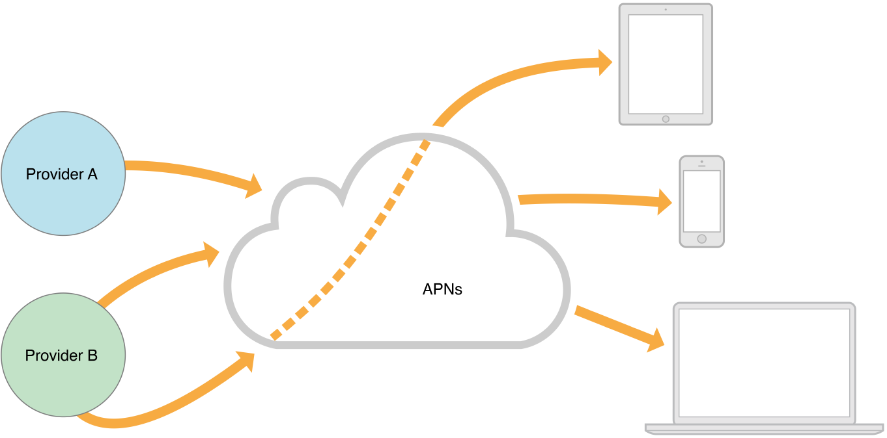
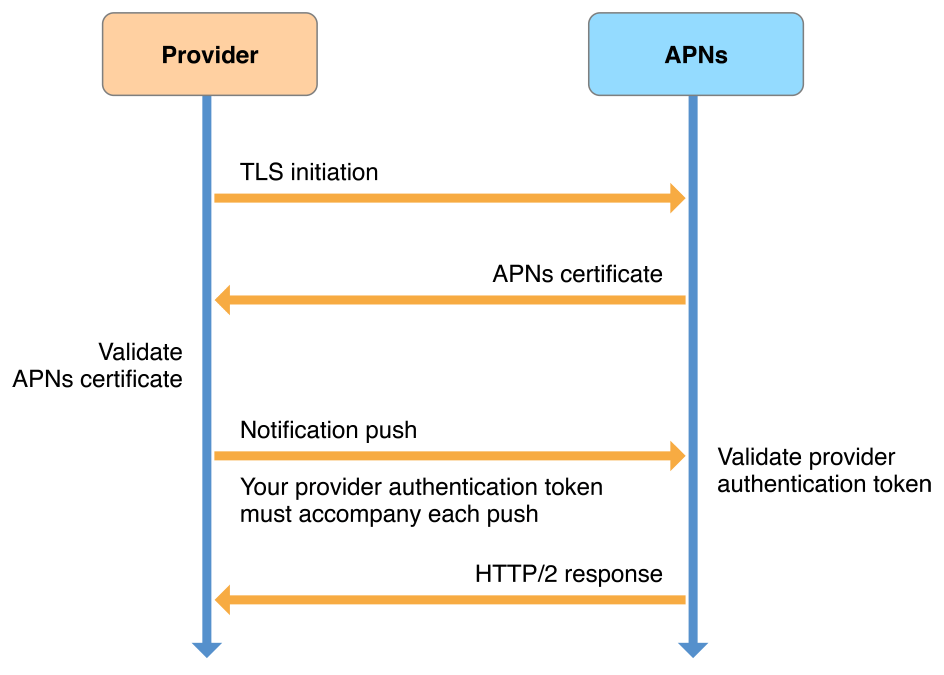
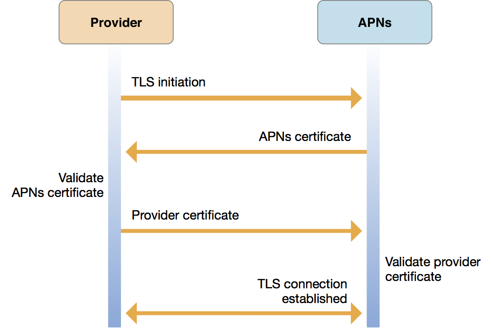
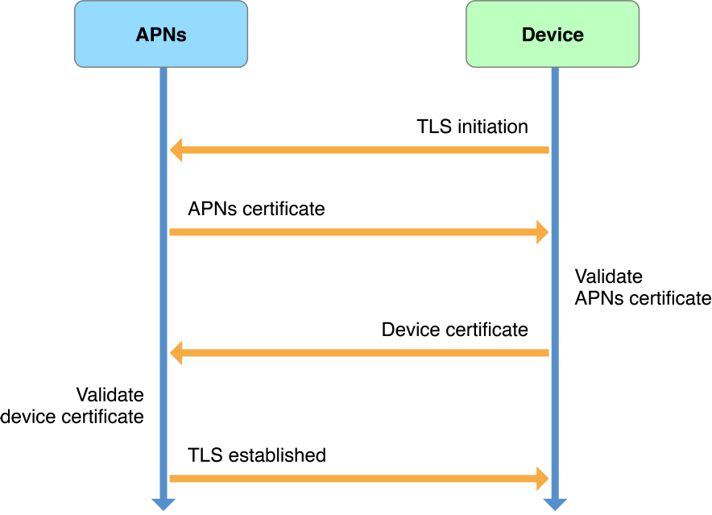
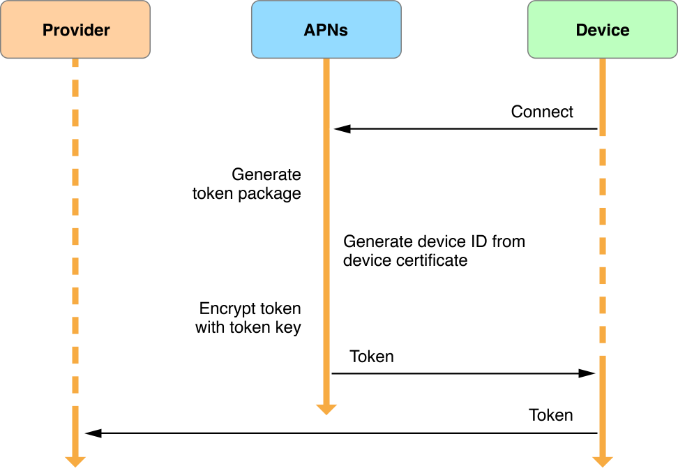
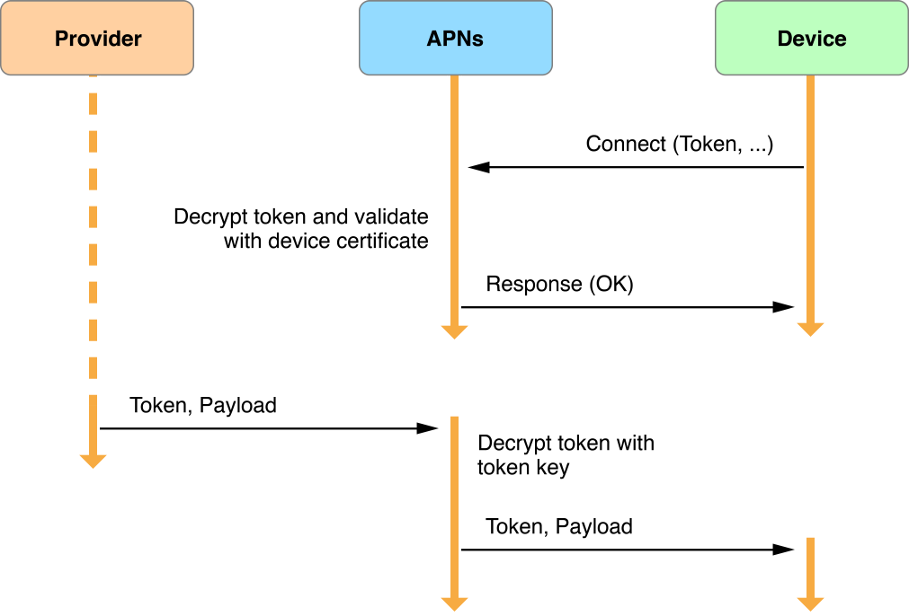

*苹果推送通知服务*（APNs）是远程通知的中心。它是应用程序开发者向 iOS（间接地，watchOS），tvOS，和 macOS 设备传递信息的一个健壮，安全，高效的服务

你的应用程序在用户设备上初次启动时，系统自动地在你的应用程序和APNs 之间建立一条可信的，加密的，持久的 IP 连接。这条连接允许你的应用程序执行一些设置来启用消息接收，如 [配置远程通知支持](https://developer.apple.com/library/archive/documentation/NetworkingInternet/Conceptual/RemoteNotificationsPG/HandlingRemoteNotifications.html#//apple_ref/doc/uid/TP40008194-CH6-SW1) 说明的那样。
<!--more-->
连接的另一半用于发送通知 —— provider 服务器和 APNs 之间持久，安全的通道 —— 需要在你的线上[开发者帐号](https://developer.apple.com/account/)中进行配置并使用苹果提供的加密证书。Provider 是一个服务器，由你部署并管理，由你配置来与 APNs 协同工作。图 6-1 展示了远程通知的传送路径。

在你的 provider 中和你的应用程序中配置完了通知设置之后，你的 providers 就可以给 APNs 发送通知请求了。APNs 传递对应的通知载荷给每个目标设备。收到通知后，系统将载荷传递给设备上适当的应用程序，并管理与用户的交互。

如果你的应用程序的通知到达时，设备处于开机状态但应用程序不在运行，系统依然可以显示通知。如果 APNs 发送通知时，设备处于关机状态，则 APNs 保留该通知并在稍后重试（更多详情，请参考 [服务质量，存储和转发，合并的通知](https://developer.apple.com/library/archive/documentation/NetworkingInternet/Conceptual/RemoteNotificationsPG/APNSOverview.html#//apple_ref/doc/uid/TP40008194-CH8-SW5)）。

# Provider 的职责

你的 provider 服务器在与 APNs 连接通信时具有如下职责：

 * 从用户设备上你的应用程序的实例接收，通过 APNs，全局唯一的，应用程序特有的设备令牌和其它相关的数据。这使得 provider 能够知道关于你的应用程序的每个运行实例。
 * 决定，根据你的通知系统的设计，何时需要给每个设备发送远程通知。
 * 构建并向 APNs 发送通知请求，每个请求包含通知载荷和交付的信息；然后，APNs代表您向目标设备发送相应的通知。

对于 provider 发送的每个远程通知请求，它必须：

 * 构造一个包含了通知载荷的 JSON 字典，如在 [创建远程通知载荷](https://developer.apple.com/library/archive/documentation/NetworkingInternet/Conceptual/RemoteNotificationsPG/CreatingtheNotificationPayload.html#//apple_ref/doc/uid/TP40008194-CH10-SW1) 中描述的那样。
 * 把载荷，一个全局唯一的设备令牌，及其它交付信息添加进一个 HTTP/2 请求。关于设备令牌的信息，请参考 [APN到设备连接信任和设备令牌](https://developer.apple.com/library/archive/documentation/NetworkingInternet/Conceptual/RemoteNotificationsPG/APNSOverview.html#//apple_ref/doc/uid/TP40008194-CH8-SW13)
 * 给 APNs 发送 HTTP/2 请求，以令牌或证书的形式包含加密凭证，通过一个持久的，安全的通道。如 [安全架构](https://developer.apple.com/library/archive/documentation/NetworkingInternet/Conceptual/RemoteNotificationsPG/APNSOverview.html#//apple_ref/doc/uid/TP40008194-CH8-SW9) 中所描述的那样建立这个安全通道。

# 使用多 Providers

图 6-2 描述了 APNs 为设备上运行的你的应用程序支持的虚拟网络的种类。为了处理通知负载，你将需要部署多个 providers，每个都有它自己到 APNs 的持久和安全连接。每个 provider可以以该 provider 具有其有效设备令牌的设备为目标发送通知请求。

# 服务质量，存储和转发，和合并通知

苹果推送通知服务包含一个服务质量（QoS）组件来执行存储和转发功能。如果 APNs 尝试传递一条通知而目标设备离线，APNs 将把通知存储一段时间，并在设备再次上线时传递它。这个组件只存储每个设备每个应用程序最近的通知。如果设备离线，以该设备为目标设备的通知请求将使之前的请求被丢弃。如果设备处于离线状态了很长时间，APNs 中存储的所有它的通知将被丢弃。

为了允许相似通知的合并，你可以在通知请求中携带一个 *合并标识符*。通常，当设备在线时，你给 APNs 发送的每个通知请求将导致一个通知被发送给设备。然而，当你的 HTTP/2 请求头中出现 `apns-collapse-id` 键时，APNs 合并该键的值相同的请求。比如，发送了两次相同头条的新闻服务可以在两个请求中使用相同的合并标识符值。APNs 将合并两个请求为一个通知来传递给设备。关于 `apns-collapse-id` 键更详细的信息，请参考 [表 8-2](https://developer.apple.com/library/archive/documentation/NetworkingInternet/Conceptual/RemoteNotificationsPG/CommunicatingwithAPNs.html#//apple_ref/doc/uid/TP40008194-CH11-SW13)。

# 安全架构

APNs 使用两个信任级别强制执行端到端的加密验证和身份验证：*连接信任* 和 *设备令牌信任*。

*连接信任* 工作于 providers 和 APNs 之间，以及 APNs 和设备之间。

  * **Provider 与 APNs 的连接信任** 确定了 provider 和APNs 之间的连接只能由授权provider 实现，该授权 provider 由与 Apple 达成推送通知传送协议的公司所有。你必须采取步骤确保连接信任出现在你的 providers 服务器和 APNs 之间，如本节描述的那样。
  * **APNs与设备的连接信任** 确保只有授权的设备可以连接到 APNs 来接收通知。APNs 自动强制与每个设备建立连接信任，以确保设备的合法性。

Provider 与 APNs 通信，它必须使用一个有效的认证密钥证书（对于基于令牌的连接信任）或 SSL 证书（对于基于证书的连接信任）。你从你的线上[开发者帐号](https://developer.apple.com/account/)获得这些证书中的一个，如在 Xcode 帮助中的 [配置推送通知](http://help.apple.com/xcode/mac/current/#/dev11b059073) 所描述的那样。为了在两种证书类型中做选择，请阅读  [Provider与 APNs 间的连接信任](https://developer.apple.com/library/archive/documentation/NetworkingInternet/Conceptual/RemoteNotificationsPG/APNSOverview.html#//apple_ref/doc/uid/TP40008194-CH8-SW4)。无论你选择了哪种类型的证书，provider 的连接信任都是 provider 给 APNs 发送推送通知请求的先决条件。

*设备令牌信任* 对每个远程通知都是端到端的。它确保仅在正确的开始（provider）和结束（设备）点之间路由通知。

设备令牌是一个不透明的NSData实例，其中包含Apple为特定设备上的特定应用程序分配的唯一标识符。只有 APNs 可以解码并读取设备令牌的内容。每个应用程序实例在向 APNs 注册时接收它自己唯一的设备令牌，且必须把令牌转发给它的 provider，如 [配置远程通知支持](https://developer.apple.com/library/archive/documentation/NetworkingInternet/Conceptual/RemoteNotificationsPG/HandlingRemoteNotifications.html#//apple_ref/doc/uid/TP40008194-CH6-SW1) 中描述的那样。Provider  必须在以关联的设备为目标设备的推送通知请求中包含设备令牌；APNs 使用设备令牌来确保通知仅传递给预期的唯一应用设备组合。

APNs 可以由于多个原因签发一个新的设备令牌：

 * 用户在一个新设备上安装了你的应用程序。
 * 用户从一个备份中恢复设备。
 * 用户重新安装了操作系统。
 * 其它系统定义事件。

因此，应用程序必须在每次启动时请求设备令牌，如 [APNs 与设备的连接信任及设备令牌](https://developer.apple.com/library/archive/documentation/NetworkingInternet/Conceptual/RemoteNotificationsPG/APNSOverview.html#//apple_ref/doc/uid/TP40008194-CH8-SW13)。代码示例，请参考 [注册接收远程通知](https://developer.apple.com/library/archive/documentation/NetworkingInternet/Conceptual/RemoteNotificationsPG/HandlingRemoteNotifications.html#//apple_ref/doc/uid/TP40008194-CH6-SW3)。

***重要***
为了保护用户隐私，不要使用设备令牌来识别用户设备。

## Provider 与 APNs 间的连接信任

有两种方案可以用于协商你的 provider 服务器和苹果推送通知服务之间的连接信任：

 * 基于令牌的 provider 连接信任：使用基于 HTTP/2 API 的 Provider 可以使用 *JSON web tokens (JWT)* 来为与 APNs 的连接提供验证凭证。在此方案中，您可以配置Apple 保留的公钥以及您保留和保护的私钥。你的 providers 可以使用你的私钥生成并签名 JWT *provider 认证令牌*。你的每个推送通知请求必须包含一个 provider 认证令牌。

你可以使用一个单独的，基于令牌的 provider 和 APNs 间的连接给 bundle ID 列于你的线上[开发者帐号](https://developer.apple.com/account/)的 *所有应用程序* 发送推送通知请求。

每次推送通知请求将导致一个来自于 APN 的 HTTP/2 响应，给你的 provider 返回关于失败或成功的详细信息。

 * 基于证书的 provider 连接信任：或者，provider 可以使用唯一的 *provider证书和私有加密密钥*。当在你的线上[开发者帐号](https://developer.apple.com/account/) 中建立你的推送服务时， provider 证书由 Apple 分配，确定一个 *topic*，这是您的某个应用的 bundle ID。

你可以使用一个基于证书的 provider 和 APNs 间的连接 *精确地向一个应用程序* 发送推送通知请求，该应用程序在你的线上[开发者帐号](https://developer.apple.com/account/)中配置证书时指定。

***重要***
为了与 APNs 建立基于 HTTP/2 的 TLS 会话，你必须确保在你的每个 providers 中安装了一个 GeoTrust Global CA 根证书。如果 provider 运行于 macOS 上，默认情况下，此根证书位于密钥链中。在其它系统上，这个证书可能需要显式地安装。你可以从 [GeoTrust Root Certificates 站点](https://www.geotrust.com/resources/root-certificates/) 下载这个证书。这里是[该证书的链接](https://www.geotrust.com/resources/root_certificates/certificates/GeoTrust_Global_CA.pem)。

如果你使用 APNs 的传统二进制接口，你必须确保你的每个 providers 具有一个 Entrust Certification Authority (2048) 根证书，这可以从 [Entrust SSL Certificates 站点](https://www.entrust.com/ssl-certificates/) 获取。

### 基于令牌的 Provider 与 APNs 间的信任

基于令牌的 Provider 信任使用一个 “Apple Push Notification Authentication Key (Sandbox & Production)” 类型的证书。使用你的线上[开发者帐号](https://developer.apple.com/account/) 配置并获取这个证书，如 Xcode 帮助中的 “[生成一个统一的 provider 令牌签名密钥](http://help.apple.com/xcode/mac/current/#/dev11b059073?sub=dev1eb5dfe65)” 所说明的那样。这个证书具有如下的特性：

 * 一个证书适用于为与您的帐户关联的每个应用发送推送通知请求。
该证书还适用于与您的应用程序的Apple Watch复杂功能的连接，以及适用于您的应用程序的互联网协议语音（VoIP）状态通知。即使这些项目在后台运行，APN也会发送这些通知。参考 [APNs Provider 证书](https://developer.apple.com/library/archive/documentation/NetworkingInternet/Conceptual/RemoteNotificationsPG/CommunicatingwithAPNs.html#//apple_ref/doc/uid/TP40008194-CH11-SW5) 来了解详细信息，并参考 *[iOS 应用程序节能指南](https://developer.apple.com/library/archive/documentation/Performance/Conceptual/EnergyGuide-iOS/index.html#//apple_ref/doc/uid/TP40015243)* 中的 [Voice Over IP (VoIP) 最佳实践](https://developer.apple.com/library/archive/documentation/Performance/Conceptual/EnergyGuide-iOS/OptimizeVoIP.html#//apple_ref/doc/uid/TP40015243-CH30)。
 * 当你通过一个 JWT 基于令牌的 APNs 连接发送一个推送通知请求时，你必须包含你的 provider 认证令牌。
 * APNs 认证密钥证书从不过期，但你可以使用你的线上[开发者帐号](https://developer.apple.com/account/) 永久地吊销它；一旦被吊销，证书将永远无法再次使用。

图 6-3 描述了使用基于 HTTP/2 的 APNs provider API 建立信任，并使用 JWT provider 认证令牌发送通知。

如图 6-3 所示那样，基于令牌的 provider 信任工作过程如下：

 1. 你的 provider 使用 TLS 向 APNs 请求一条安全连接，由图中标为 “TLS initiation” 的箭头表示。
 2. APNs 然后为你的 provider 提供一个 APNs 证书，由图中的下一个箭头（标为 “APNs certificate”）表示，你的 provider 将进行验证。
此时，连接信任建立了，你的 provider 服务器可以向 APNs 发送基于令牌的远程推送通知请求了。
 3. 你的 provider 发送的每个通知请求必须伴有一个 JWT 认证令牌，在图中由标为 “Notification push” 的箭头表示。
 4. APNs 响应每个推送，在图中由标为 “HTTP/2 response” 的箭头表示。

关于这一步中你的 provider 可以接收的响应的规范，请参考 [APNs HTTP/2 响应](https://developer.apple.com/library/archive/documentation/NetworkingInternet/Conceptual/RemoteNotificationsPG/CommunicatingwithAPNs.html#//apple_ref/doc/uid/TP40008194-CH11-SW2)。

### 基于证书的 Provider 与 APNs 间的信任

基于证书的 provider 连接可以向特定应用程序传递推送通知，应用程序由 provider 证书（你必须提前创建，如 Xcode 帮助中的 “[生成一个统一的 provider 令牌签名密钥](http://help.apple.com/xcode/mac/current/#/dev11b059073?sub=dev1eb5dfe65)” 所说明的那样）中指定的 topic（应用程序 bundle ID）标识。根据您配置和配置证书的方式，受信连接也可以用于给其它与你的应用程序关联的项目传递远程通知，括适用于您应用的 Apple Watch 复杂功能，以及适用于您的应用的互联网语音协议（VoIP）状态通知。即使这些项目在后台运行，APNs 也会发送这些通知。参考 [与 APNs 通信](https://developer.apple.com/library/archive/documentation/NetworkingInternet/Conceptual/RemoteNotificationsPG/CommunicatingwithAPNs.html#//apple_ref/doc/uid/TP40008194-CH11-SW1) 来了解详细信息，并参考 *[iOS 应用程序节能指南](https://developer.apple.com/library/archive/documentation/Performance/Conceptual/EnergyGuide-iOS/index.html#//apple_ref/doc/uid/TP40015243)* 中的 [Voice Over IP (VoIP) 最佳实践](https://developer.apple.com/library/archive/documentation/Performance/Conceptual/EnergyGuide-iOS/OptimizeVoIP.html#//apple_ref/doc/uid/TP40015243-CH30)。

通过基于证书的信任，APNs 维护了一个证书吊销列表；如果 provider 的证书位于吊销列表中，APNs 可以撤销 provider 信任（即，APNs 可以拒绝 TLS 初始化连接）。

图 6-4 描述了使用 Apple 签发的 SSL 证书来建立 provider 和 APNs 之间的信任。不像 [吐 6-3](https://developer.apple.com/library/archive/documentation/NetworkingInternet/Conceptual/RemoteNotificationsPG/APNSOverview.html#//apple_ref/doc/uid/TP40008194-CH8-SW3)，这幅图没有展示通知推送本身，但在 TSL 连接建立时终止。在基于证书的信任方案中，推送通知请求未经过身份验证，但使用随附的设备令牌对其进行验证。

如图 6-4 所示，基于证书的 provider 与 APNs 信任工作过程如下：

 1. 你的 provider 使用 TLS 向 APNs 请求一条安全连接，由图中标为 “TLS initiation” 的箭头表示。
 2. APNs 然后为你的 provider 提供一个 APNs 证书，由图中的下一个箭头（标为 “APNs certificate”）表示，你的 provider 将进行验证。
3. 你的 provider 必须发送它的 Apple 提供的 provider 证书（你之前已经在你的线上[开发者帐号](https://developer.apple.com/account/)中获取，如 Xcode 帮助中的 “[生成一个统一的 provider 令牌签名密钥](http://help.apple.com/xcode/mac/current/#/dev11b059073?sub=dev1eb5dfe65)” 所说明的那样）回 APNs，由标为 “Provider certificate” 的箭头表示。
4. APNs 验证你的 provider 证书，从而确保连接请求来自于一个合法的 provider，并建立你的 TLS 连接。
此时，连接信任建立，你的 provider 服务器能够向 APNs 发送基于证书的远程推送通知请求了。

## APNs 与设备的连接信任和设备令牌

APNs 与每个设备的信任是自动建立地，无需你的应用程序参与，如本节描述的那样。

每个设备具有一个加密的证书，和一个私有加密密钥，由操作系统在最初设备激活时提供，并存储在设备的 keychain 中。在激活期间，APNs 认证并验证与设备的连接，基于证书和密钥，如图 6-5 所示。

如图 6-5 所示的那样，APNs 与设备的信任工作过程如下：

 1. 信任协商在设备初始化一条与 APNs 的 TLS 连接时开始，如图中的顶部箭头所示。
 2. APNs 向设备返回一个 APNs 证书。
 3. 操作系统验证这个证书，如 “Device certificate” 箭头所示，发送设备证书给 APNs。
 4. 最后，如图中的底部箭头显示的那样，APNs 验证设备证书，建立信任。

当 APNs 和设备之间的 TLS 连接建立时，应用程序可以向 APNs 注册接收它们的应用特有设备令牌用于远程通知。更多详情和代码示例，请参考 [配置远程通知支持](https://developer.apple.com/library/archive/documentation/NetworkingInternet/Conceptual/RemoteNotificationsPG/HandlingRemoteNotifications.html#//apple_ref/doc/uid/TP40008194-CH6-SW1) 中的 [注册接收远程通知](https://developer.apple.com/library/archive/documentation/NetworkingInternet/Conceptual/RemoteNotificationsPG/HandlingRemoteNotifications.html#//apple_ref/doc/uid/TP40008194-CH6-SW3)。

接收设备令牌之后，应用程序必须连接应用程序的关联 provider，并把令牌转发给它。这一步是必须的，因为 provider 必须在稍后发送通知请求给 APNs 时，以该设备为目标，包含设备令牌。[注册接收远程通知](https://developer.apple.com/library/archive/documentation/NetworkingInternet/Conceptual/RemoteNotificationsPG/HandlingRemoteNotifications.html#//apple_ref/doc/uid/TP40008194-CH6-SW3) 也展示了用于转发令牌的代码。

用户是否是第一次激活设备，或者 APNs 是否已经签发了一个新的设备令牌，过程都是类似的，如图 6-6 所示。

获得并处理一个应用特有设备令牌的工作过程如下：

 1. 你的应用程序向 APNs 注册远程通知，如顶部箭头所示。如果应用程序已经注册了，且应用程序特有的设备令牌没有改变，系统快速给应用程序返回已有的令牌，这个过程跳到步骤 4。
 2. 当需要一个新设备令牌时，APNs 使用设备的证书中包含的信息生成一个。它使用令牌密钥加密令牌，并把它返回给设备，如中间的所示，指向右边的箭头。
 3. 系统把设备令牌通过调用你的 [application:didRegisterForRemoteNotificationsWithDeviceToken:](https://developer.apple.com/documentation/uikit/uiapplicationdelegate/1622958-application) delegate 方法传递回你的应用程序。
 4. 一旦收到令牌，你的应用程序（具有 delegate 方法）必须以二进制或十六进制的形式把它转发给你的 provider。你的 provider 不能发送通知给没有这个令牌的设备。更多详情，请参考 [配置远程通知支持](https://developer.apple.com/library/archive/documentation/NetworkingInternet/Conceptual/RemoteNotificationsPG/HandlingRemoteNotifications.html#//apple_ref/doc/uid/TP40008194-CH6-SW1) 中的 [注册接收远程通知](https://developer.apple.com/library/archive/documentation/NetworkingInternet/Conceptual/RemoteNotificationsPG/HandlingRemoteNotifications.html#//apple_ref/doc/uid/TP40008194-CH6-SW3)

***重要***
APNs 设备令牌的长度是可变的。不要硬编码它们的大小。

当你的 provider 发送通知请求给 APNs 时，它包含标识一个唯一的应用程序-设备组合的设备令牌。这个步骤如图 6-7 中 provider 和 APNs之间的  “Token, Payload” 箭头所示。APNs 解密令牌以确保请求的有效性，并决定目标设备。如果 APNs 确定发送者和接收者是合法的，它将发送通知给标识的设备。

设备收到通知之后（且在图 6-7 中所示的最后一步之后），系统转发远程通知给你的应用程序。

# 配置过程

APNs 适用于通过 iOS App Store，tvOS App Store，和 Mac App Store 分发的应用程序，也适用于企业应用。您的应用必须配置并进行代码签名才能使用 APNs。如果您是作为开发团队的一员进行开发，那么大多数配置步骤只能由团队代理或管理员执行。

更多关于如何在 Xcode 和你的线上[开发者帐号](https://developer.apple.com/account/)中配置推送通知支持的信息，请阅读 Xcode 帮助中的 “[配置推送通知](http://help.apple.com/xcode/mac/current/#/dev11b059073)”。

[原文](https://developer.apple.com/library/archive/documentation/NetworkingInternet/Conceptual/RemoteNotificationsPG/APNSOverview.html#//apple_ref/doc/uid/TP40008194-CH8-SW1)

参考文档：

[苹果远程推送通知 APNs 详解，官方，iOS | Swift | UNNotification](https://segmentfault.com/a/1190000012019282)
[基于HTTP/2与Token的APNs新协议](http://www.skyfox.org/apple-push-with-auth-key-token.html)
[国内90%以上的 iOS 开发者，对 APNs 的认识都是错的](http://www.cocoachina.com/ios/20160426/16013.html)
