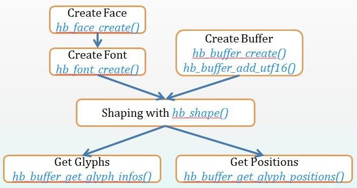

[Harfbuzz]([http://harfbuzz.org/](http://harfbuzz.org/) 是一个 [OpenType](http://www.microsoft.com/typography/otspec/) 文本整形引擎。当前的 Harfbuzz 代码库，之前被称为 harfbuzz-ng，版本号为 1.x.x，它是稳定的且处于活跃的维护之中。Harfbuzz 的使用非常广泛，在最新版本的  Firefox，GNOME，ChromeOS，Chrome，LibreOffice，XeTeX，Android，和 KDE 等项目中都有应用。Harfbuzz 的代码可以在 [这里](https://cgit.freedesktop.org/harfbuzz/) 下载，也可以通过 [GitHub](https://github.com/behdad/harfbuzz) 访问。
<!--more-->
老的 HarfBuzz 代码库，现在被称为 harfbuzz-old，它从  [FreeType](http://freetype.org/)，[Pango](http://pango.org/)，和 [Qt](http://qt-project.org/) 派上而来，可以在 [这里](http://cgit.freedesktop.org/harfbuzz.old/) 下载。老的 HarfBuzz 代码库目前已经不再维护了。

Harfbuzz 在代码结构上，与 harfbuzz-old 的差别非常大。前面 ***Behdad Esfahbod*** 发的那篇名为 [Harfbuzz API 设计（Harfbuzz API design）](https://lists.freedesktop.org/archives/harfbuzz/2009-August/000359.html) 的邮件，所描述的是新 Harfbuzz API 的设计。

本文来看一下 Harfbuzz API 的基本用法。学习一个开源库的 API 的用法最方便的途径，常常正是库本身包含的一些示例程序或这测试程序。下载当前最新的发布版本 [1.7.5](https://github.com/harfbuzz/harfbuzz/releases/download/1.7.5/harfbuzz-1.7.5.tar.bz2) 的源码。将源码解压缩之后，通过如下命令编译它：
```
harfbuzz-1.7.5$ ./configure
harfbuzz-1.7.5$ make
```

编译过程将产生 Harfbuzz 的二进制库文件，和一些测试程序的可执行文件，位于 `harfbuzz-1.7.5/src/test.cc` 的即是其中一个测试程序。这个测试程序编译之后产生的可执行文件为 `harfbuzz-1.7.5/src/test`，通过如下方式执行：
```
harfbuzz-1.7.5$ src/test font-file.ttf
```

即需要唯一的参数，字库文件的路径。我们对这个测试程序做一点简单的修改，让它处理泰语和缅甸语，字库文件我们使用 Android 7.1.1 代码库中，`external/noto-fonts/other/` 下的 `NotoSansThai-Regular.ttf` 和 `NotoSansMyanmar-Regular.ttf`：
```
harfbuzz-1.7.5$ src/test ~/Androids/android_7.1.1/external/noto-fonts/other/NotoSansThai-Regular.ttf
Opened font file ~/Androids/android_7.1.1/external/noto-fonts/other/NotoSansThai-Regular.ttf: 21380 bytes long
cluster 0	glyph 0x4 at	(0,0)+(1264,0)
cluster 0	glyph 0x4e at	(7,0)+(0,0)
cluster 0	glyph 0x5e at	(127,0)+(0,0)
cluster 0	glyph 0x37 at	(0,0)+(994,0)
cluster 3	glyph 0x25 at	(0,0)+(1315,0)
cluster 4	glyph 0x26 at	(0,0)+(1225,0)
cluster 5	glyph 0x27 at	(0,0)+(1301,0)
cluster 6	glyph 0x30 at	(0,0)+(1320,0)
cluster 7	glyph 0x31 at	(0,0)+(1379,0)
cluster 8	glyph 0x33 at	(0,0)+(1195,0)
harfbuzz-1.7.5$ src/test ~/Androids/android_7.1.1/external/noto-fonts/other/NotoSansMyanmar-Regular.ttf
Opened font file ~/Androids/android_7.1.1/external/noto-fonts/other/NotoSansMyanmar-Regular.ttf: 108160 bytes long
cluster 0	glyph 0x9 at	(0,0)+(1381,0)
cluster 0	glyph 0x196 at	(0,0)+(993,0)
cluster 2	glyph 0x5 at	(0,0)+(1384,0)
cluster 2	glyph 0x195 at	(0,0)+(547,0)
cluster 4	glyph 0x22 at	(0,0)+(2308,0)
cluster 4	glyph 0x197 at	(-42,0)+(0,0)
cluster 6	glyph 0x4 at	(0,0)+(2302,0)
cluster 6	glyph 0xd5 at	(-19,-50)+(0,0)
cluster 6	glyph 0x196 at	(0,0)+(993,0)
cluster 10	glyph 0x22 at	(0,0)+(2308,0)
cluster 11	glyph 0x16 at	(0,0)+(1311,0)
cluster 11	glyph 0x104 at	(-4,-50)+(0,0)
cluster 11	glyph 0x195 at	(0,0)+(547,0)
cluster 15	glyph 0xe at	(0,0)+(2271,0)
cluster 15	glyph 0x197 at	(-14,0)+(0,0)
cluster 15	glyph 0xd2 at	(0,0)+(534,0)
cluster 18	glyph 0x15 at	(0,0)+(2304,0)
cluster 18	glyph 0x19f at	(-57,0)+(0,0)
cluster 18	glyph 0xd1 at	(-31,0)+(0,0)
cluster 18	glyph 0x1a1 at	(0,0)+(709,0)
```

`harfbuzz-1.7.5/src/test.cc` 的完整源码如下：
```
#include "hb-private.hh"

#include "hb.h"

#ifdef HAVE_GLIB
# include <glib.h>
# if !GLIB_CHECK_VERSION (2, 22, 0)
#  define g_mapped_file_unref g_mapped_file_free
# endif
#endif
#include <stdlib.h>
#include <stdio.h>

#ifdef HAVE_FREETYPE
#include "hb-ft.h"
#endif

int
main (int argc, char **argv)
{
  hb_blob_t *blob = nullptr;

  if (argc != 2) {
    fprintf (stderr, "usage: %s font-file.ttf\n", argv[0]);
    exit (1);
  }

  /* Create the blob */
  {
    const char *font_data;
    unsigned int len;
    hb_destroy_func_t destroy;
    void *user_data;
    hb_memory_mode_t mm;

#ifdef HAVE_GLIB
    GMappedFile *mf = g_mapped_file_new (argv[1], false, nullptr);
    font_data = g_mapped_file_get_contents (mf);
    len = g_mapped_file_get_length (mf);
    destroy = (hb_destroy_func_t) g_mapped_file_unref;
    user_data = (void *) mf;
    mm = HB_MEMORY_MODE_READONLY_MAY_MAKE_WRITABLE;
#else
    FILE *f = fopen (argv[1], "rb");
    fseek (f, 0, SEEK_END);
    len = ftell (f);
    fseek (f, 0, SEEK_SET);
    font_data = (const char *) malloc (len);
    if (!font_data) len = 0;
    len = fread ((char *) font_data, 1, len, f);
    destroy = free;
    user_data = (void *) font_data;
    fclose (f);
    mm = HB_MEMORY_MODE_WRITABLE;
#endif

    blob = hb_blob_create (font_data, len, mm, user_data, destroy);
  }

  printf ("Opened font file %s: %u bytes long\n", argv[1], hb_blob_get_length (blob));

  /* Create the face */
  hb_face_t *face = hb_face_create (blob, 0 /* first face */);
  hb_blob_destroy (blob);
  blob = nullptr;
  unsigned int upem = hb_face_get_upem (face);

  int textSize = 36;
  uint16_t x_ppem, y_ppem;
  int x_scale, y_scale;

  x_ppem = y_ppem = textSize;
  const int kDevicePixelFraction = 64;
  const int kMultiplyFor16Dot16 = 1 << 16;
  float emScale = kDevicePixelFraction * kMultiplyFor16Dot16 / (float)upem;
  x_scale = emScale * textSize;
  y_scale = emScale * textSize;

  hb_font_t *font = hb_font_create (face);
  hb_font_set_scale(font, x_scale, y_scale);
  hb_font_set_ppem(font, x_ppem, y_ppem);

#ifdef HAVE_FREETYPE
  hb_ft_font_set_funcs (font);
#endif

  hb_buffer_t *buffer = hb_buffer_create ();

  uint16_t myanmarChars[] = {0x1005, 0x102C, 0x1001, 0x102B,
          0x101E, 0x102D, 0x1000, 0x1039, 0x1001, 0x102C,
          0x101E, 0x1012, 0x1039, 0x1013, 0x102B,
          0x100A, 0x102D, 0x102F, 0x1011, 0x102F, 0x1036, 0x1038
  };

  uint16_t thaiChars[] = {
          0xE01, 0xE49, 0xE33, 0xE20, 0xE21, 0xE22, 0xE2B, 0xE2C, 0xE2E
  };

  uint16_t *chars = myanmarChars;

//  hb_buffer_add_utf8 (buffer, "\xe0\xa4\x95\xe0\xa5\x8d\xe0\xa4\xb0\xe0\xa5\x8d\xe0\xa4\x95", -1, 0, -1);
  hb_buffer_add_utf16(buffer, chars, -1, 0, -1);
  hb_buffer_guess_segment_properties (buffer);

  hb_shape (font, buffer, nullptr, 0);

  unsigned int count = hb_buffer_get_length (buffer);
  hb_glyph_info_t *infos = hb_buffer_get_glyph_infos (buffer, nullptr);
  hb_glyph_position_t *positions = hb_buffer_get_glyph_positions (buffer, nullptr);

  for (unsigned int i = 0; i < count; i++)
  {
    hb_glyph_info_t *info = &infos[i];
    hb_glyph_position_t *pos = &positions[i];

    printf ("cluster %d	glyph 0x%x at	(%d,%d)+(%d,%d)\n",
	    info->cluster,
	    info->codepoint,
	    pos->x_offset,
	    pos->y_offset,
	    pos->x_advance,
	    pos->y_advance);

  }

  hb_buffer_destroy (buffer);
  hb_font_destroy (font);
  hb_face_destroy (face);

  return 0;
}
```

接着再来看前面那段code的结构，上面这段代码执行的步骤如下：

 * 1. 读取字库文件中的数据，然后创建 `hb_blot_t`。
 * 2. 利用前面创建的那个含有字库文件数据的 `blob`，创建一个 `face` 。
 * 3. 利用前面创建的 `face`，创建一个 `font`。然后把字体大小的信息（ppem）及字体设计空间向用户空间转换的系数（scale）设置给 `font`。计算 `ppem` 及 `scale` 的那段代码借用了android 4.2 `TextLayoutCache.cpp` 的一些做法。
 * 4. 创建一个 `buffer`，把文本添加进去。这个地方用 `UTF-16` 编码，是因为就手动编码 Unicode 而言，对于许多复杂语系的 Unicode 范围，UTF-16 比 UTF-8 要方便的多，因而也使我们可以更方便地修改它。
 * 5. 调用 Harfbuzz 的主 `shape` 接口执行 `shape` 动作。
 * 6. 最后从 `shape` 之后的 `buffer` 中，取出 `glyph` 和 `position` 相关信息。

通常情况下对于 Harfbuzz API 的使用，大体上如上面所述。用一张图来简单说明上面的过程：



这样的用法，之所以称为基本用法，有如下这样一些原因：

 * 前面的第 2、3 步中，在创建 `face` 和 `font` 时，是直接通过字库文件的路径进行的。通常情况每个系统都会有自己的字库文件管理系统和 Glyph 管理系统，这种做法就完全没有考虑与现有系统的这些模块衔接的问题。在实际系统中，这两个对象应该通过相应有 callback 参数的那些接口来创建。
 * 在 Harfbuzz API Design 中，我们看到有提到 Unicode callback 及 Script、Language 和 Direction 这些文本属性等，这些都是需要正确的设置给 `buffer` 的，因而前面第 4 步所对应的这个测试程序的做法，所创建的 `buffer` 是不够完整的。
 * 在打印位置信息时，我们看到有通过 `HBFixedToFloat()` 这个函数来对 Harfbuzz 输出的位置信息做一个转换，转换为 `float` 格式的像素个数值。可以看到这个地方除了一个 `2048`。这个系数在这个测试程序里用的是一个猜想的值。字体大小为 `36`，所以猜想返回的 `advance` 值应该处于这一数量级。所以取了 `2048` 这个系数。

Done.
