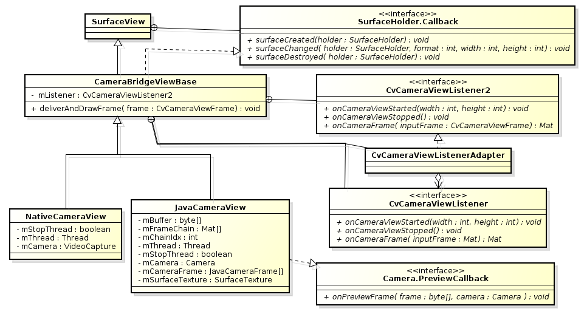
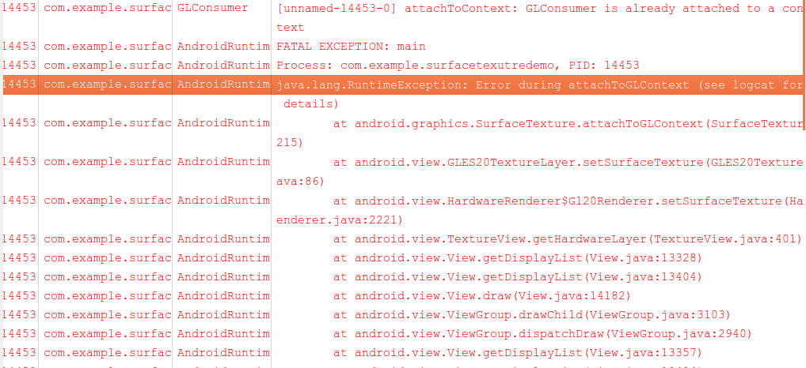

OpenCV4Android中，主要用 `org.opencv.android.JavaCameraView`（后面用`JavaCameraView` 指代）、`org.opencv.android.NativeCameraView`（后面用`NativeCameraView` 指代）及 `org.opencv.android.CameraBridgeViewBase`（后面用`CameraBridgeViewBase` 指代）这几个类将应用程序的逻辑与 Camera 的图像捕捉及处理后的图像显示逻辑联系起来的。这几个类的结构大致如下图所示的这样：

<!--more-->



大体上可以认为，`CameraBridgeViewBase` 主要是借助于 `SurfaceView` 的功能，来完成图像显示相关的功能。而 `JavaCameraView` 则主要用于与 Camera 硬件设备进行交互。而从线程的角度来分析，则这里也是一种生产者消费这模型。生产者线程在
 `onPreviewFrame()` 回调方法中将 camera preview 的一帧帧数据压缩进类型为 Mat 的缓冲区中。而消费者线程则取出这些 Mat 图像，先是传递给 app 注册的 listener 做一些特定于应用的图像处理操作，然后把处理后的图像显示出来。在此处，我们也主要从生产者-消费者模型的角度来分析相关这些类的实现。

# 生产者、消费者

对于生产者线程，我们可以简单的将它理解为，当 Camera preview 的一帧数据准备好了的时候，它会去调用 `onPreviewFrame()` 回调方法将一帧图像压缩进 Mat 的缓冲区。具体 `onPreviewFrame()` 回调方法的调用流程，则大致如下面的这个 backtrace 所示的那样：


由此我们不难理解，生产者这一角色其实是由应用程序的主线程来担任的。我们还可以看一下在 `JavaCameraView.onPreviewFrame(byte[], Camera)` 里面具体都做了些什么：
```
    private byte mBuffer[];
    private Mat[] mFrameChain;
    private int mChainIdx = 0;

    protected Camera mCamera;
    protected JavaCameraFrame[] mCameraFrame;

    public void onPreviewFrame(byte[] frame, Camera arg1) {
        Log.d(TAG, "Preview Frame received. Frame size: " + frame.length);
        synchronized (this) {
            mFrameChain[1 - mChainIdx].put(0, 0, frame);
            this.notify();
        }
        if (mCamera != null)
            mCamera.addCallbackBuffer(mBuffer);
    }
```

非常直接，将一帧 camera preview 数据压入 Mat 缓冲区中；通知在当前对象的等待队列上等待的线程；然后便是调用了 `mCamera.addCallbackBuffer(mBuffer)` (后续会进一步解释这一行)。

接着我们来看消费者线程的前世今生。首先是消费者线程的创建及启动过程，在`JavaCameraView.connectCamera()` 方法中：
```
    private Thread mThread;
    private boolean mStopThread;

    @Override
    protected boolean connectCamera(int width, int height) {
        /* 1. We need to instantiate camera
         * 2. We need to start thread which will be getting frames
         */
        /* First step - initialize camera connection */
        Log.d(TAG, "Connecting to camera");
        if (!initializeCamera(width, height))
            return false;

        /* now we can start update thread */
        Log.d(TAG, "Starting processing thread");
        mStopThread = false;
        mThread = new Thread(new CameraWorker());
        mThread.start();

        return true;
    }
```

整个过程可以看作两步，首先是完成对 Camera 硬件的初始化，为下一步消费者线程的创建及启动创造条件；然后便是创建一个线程，即消费者线程，来执行整个的图像处理及显示循环。那这个方法又是如何一步步被调到的呢？或者换句话说，camera图像的处理及显示循环会在什么样的情况下被启动呢？搜一下这个函数的callers，只有 `CameraBridgeViewBase.onEnterStartedState()` 的一处：
```
    // NOTE: The order of bitmap constructor and camera connection is important for android 4.1.x
    // Bitmap must be constructed before surface
    private void onEnterStartedState() {
        /* Connect camera */
        if (!connectCamera(getWidth(), getHeight())) {
            AlertDialog ad = new AlertDialog.Builder(getContext()).create();
            ad.setCancelable(false); // This blocks the 'BACK' button
            ad.setMessage("It seems that you device does not support camera (or it is locked). Application will be closed.");
            ad.setButton(DialogInterface.BUTTON_NEUTRAL,  "OK", new DialogInterface.OnClickListener() {
                public void onClick(DialogInterface dialog, int which) {
                    dialog.dismiss();
                    ((Activity) getContext()).finish();
                }
            });
            ad.show();

        }
    }
```

这个函数的功能只是调用 `connectCamera(getWidth(), getHeight())` + 对于调用执行出错时的处理，即显示一个 Dialog 给用户一些提示，并在用户点击了 Dialog 上的 Button 时退出应用。继续向上追，`onEnterStartedState()` 也只有一个 caller，为`CameraBridgeViewBase.processEnterState(int state)`：
```
    private void processEnterState(int state) {
        switch(state) {
        case STARTED:
            onEnterStartedState();
            if (mListener != null) {
                mListener.onCameraViewStarted(mFrameWidth, mFrameHeight);
            }
            break;
        case STOPPED:
            onEnterStoppedState();
            if (mListener != null) {
                mListener.onCameraViewStopped();
            }
            break;
        };
    }
```

这个函数处理状态的进入，进入启动状态，或者进入退出状态。将要启动 camera 图像的处理及显示循环的是其中的进入启动状态部分。由此我们也不难发现，在camera图像的处理及显示循环被启动之后，OpenCV4Android 的`JavaCameraView(CameraBridgeViewBase)` 还会通过app注册的
 `Listener(CvCameraViewListener2.onCameraViewStarted(int width, int height))` 给app一个通知。这个方法也还是一个 private 方法，似乎依然没有追到那种让我们可以很容易理解的地步。继续向上追，在 `CameraBridgeViewBase.checkCurrentState()`：
```
    /**
     * Called when mSyncObject lock is held
     */
    private void checkCurrentState() {
        int targetState;

        if (mEnabled && mSurfaceExist && getVisibility() == VISIBLE) {
            targetState = STARTED;
        } else {
            targetState = STOPPED;
        }

        if (targetState != mState) {
            /* The state change detected. Need to exit the current state and enter target state */
            processExitState(mState);
            mState = targetState;
            processEnterState(mState);
        }
    }
```

在这个方法中，会检查这个 `View` 当前的状态，然后退出老的状态，更新当前状态，并进入新的状态。当状态由 `STOPPED` 转入 `STARTED` 状态时，会去启动 camera 图像的处理及显示循环。可是究竟什么样的动作会改变这个 `View` 的状态，并触发这个状态的切换呢？可以查一下这个方法的 callers：
```
    public void surfaceChanged(SurfaceHolder arg0, int arg1, int arg2, int arg3) {
        Log.d(TAG, "call surfaceChanged event");
        synchronized(mSyncObject) {
            if (!mSurfaceExist) {
                mSurfaceExist = true;
                checkCurrentState();
            } else {
                /** Surface changed. We need to stop camera and restart with new parameters */
                /* Pretend that old surface has been destroyed */
                mSurfaceExist = false;
                checkCurrentState();
                /* Now use new surface. Say we have it now */
                mSurfaceExist = true;
                checkCurrentState();
            }
        }
    }

    public void surfaceCreated(SurfaceHolder holder) {
        /* Do nothing. Wait until surfaceChanged delivered */
    }

    public void surfaceDestroyed(SurfaceHolder holder) {
        synchronized(mSyncObject) {
            mSurfaceExist = false;
            checkCurrentState();
        }
    }

    /**
     * This method is provided for clients, so they can enable the camera connection.
     * The actual onCameraViewStarted callback will be delivered only after both this method is called and surface is available
     */
    public void enableView() {
        synchronized(mSyncObject) {
            mEnabled = true;
            checkCurrentState();
        }
    }

    /**
     * This method is provided for clients, so they can disable camera connection and stop
     * the delivery of frames even though the surface view itself is not destroyed and still stays on the scren
     */
    public void disableView() {
        synchronized(mSyncObject) {
            mEnabled = false;
            checkCurrentState();
        }
    }
```

总结一下，系统在 `SurfaceView(CameraBridgeViewBase/JavaCameraView)` 的 surface状态发生改变时可能会去更新这个 View 的当前状态；同时也提供给 app 两个接口`enableView()` 和 `disableView()` 来主动的改变 `View` 的状态。当一个 `View` 进入了`STARTED` 状态时，camera 图像的处理及显示循环会被启动。

消费者线程的启动过程大体如此。那么在消费线程的处理循环中又都会做些什么样的事情呢？来看 `JavaCameraView.CameraWorker` 类的实现：
```
    private class CameraWorker implements Runnable {

        public void run() {
            do {
                synchronized (JavaCameraView.this) {
                    try {
                        JavaCameraView.this.wait();
                    } catch (InterruptedException e) {
                        // TODO Auto-generated catch block
                        e.printStackTrace();
                    }
                }

                if (!mStopThread) {
                    if (!mFrameChain[mChainIdx].empty())
                        deliverAndDrawFrame(mCameraFrame[mChainIdx]);
                    mChainIdx = 1 - mChainIdx;
                }
            } while (!mStopThread);
            Log.d(TAG, "Finish processing thread");
        }
    }
```

可以看到，一个执行周期大体上为：先是等待被另外一个线程唤醒，然后在线程没有被终止的情况下，由 Mat 缓冲中取出一个 Mat，交由 app 进行图像处理，并显示处理之后图像，最后更新 `mChainIdx` 的值，以使得生产者线程能够了解那块缓冲是已经被使用过了的。配合前面 `JavaCameraView.onPreviewFrame(byte[], Camera)` 一起来看，消费者线程总是会先去等待生产者线程的通知，`onPreviewFrame()` 压入一帧图像之后，会去唤醒消费者线程去处理并显示图像。`mFrameChain` 是一个有着两个元素的数组，`mChainIdx` 为将要被处理的那一帧图像的 index。粗略的来看 code，似乎是当 `onPreviewFrame()` 向 index 为 0 的 frame 中压入一帧数据后，它会通知消费者线程去取出 index 为 1 的 frame 来处理，而不是它刚刚压入了数据的 index 为 0 的 frame；而当它向 index 为 1 的 frame 中压入数据时，则它实际上是通知消费者线程去处理它上一次压入图像的 index 为 0 的数据。因而，尽管这里使用了 synchronized-block，但这实际上似乎是一种无锁的并发。

这种设计似乎还是有一些问题。比如，刚启动的时候，`mChainIdx` 为 0，消费者线程会先等待，生产者线程向 index 为 1 的一帧中压入数据，然后消费这线程被唤醒，去处理没有实际内容的 index 为 0 的那一帧，消费者线程可能还是要花一些时间，于是生产者线程可能又多次向 index 为 1 的一帧中压入数据。消费者线程在处理完之后，则会实际上去等待处理 index 为1的那一帧。但消费者线程具体是被生产者线程向 index 为 1 还是为 0 的那一帧中压入图像之后所通知的，还是有不同的可能。假设 `onPreviewFrame()` 压入一帧图像可能会花一些时间，消费者线程会在生产者线程在更新 index 为 1 的那一帧时，迅速将 mChainIdx 更新为 1，并进入等待状态，于是乎，消费者线程将要处理的那一帧将会是刚刚被 `onPreviewFrame()` 更新的那一帧；另外的可能是，`onPreviewFrame()` 先是发出了 notify，消费者线程丢失了这一次通知，`onPreviewFrame()` 会需要一段时间才会有下一帧数据到来，但消费者线程会一直执行，于是消费者线程会继续更新 `mChainIdx` 为 1，并进入等待状态，而当 `onPreviewFrame()` 下一次被调到时，则它将会去更新 index为 0 的那一帧，于是发生的 case 将是，`onPreviewFrame()` 更新 index 为 0 的那一帧之后通知消费者线程去处理 index 为 1 的那一帧。

总结一下，此处是一种无锁并发的设计，使用了生产者-消费者模型，生产者生产的速度快于消费者消费速度时的丢弃策略为，丢掉之前的数据。消费者线程总是会轮流去处理缓冲区中的那两帧，而具体生产者是在更新完哪一帧时去通知的消费者线程则具有颇多的不确定性。比如在上一段的分析中，消费者线程要处理 index 为 1 的那一帧时，既有可能是`onPreviewFrame()` 刚刚第二(N) 次更新 index 为 1 的那一帧之后通知的，也可能是刚刚更新了一次或多次 index 为 0 的那一帧。这种设计总还是会丢弃掉很多帧不去处理及显示，当然这也是这样的应用场景下，非常 reasonable 的一种丢弃策略，即丢掉那些不能及时处理的数据，而只处理最新的那些。

消费的执行周期中，最主要的还是对于 `deliverAndDrawFrame()` 的调用，都是在这个方法中对图像进行处理并绘制的嘛。接着我们就来看一下这个方法的实现：
```
    /**
     * This method shall be called by the subclasses when they have valid
     * object and want it to be delivered to external client (via callback) and
     * then displayed on the screen.
     * @param frame - the current frame to be delivered
     */
    protected void deliverAndDrawFrame(CvCameraViewFrame frame) {
        Mat modified;

        if (mListener != null) {
            modified = mListener.onCameraFrame(frame);
        } else {
            modified = frame.rgba();
        }

        boolean bmpValid = true;
        if (modified != null) {
            try {
                Utils.matToBitmap(modified, mCacheBitmap);
            } catch(Exception e) {
                Log.e(TAG, "Mat type: " + modified);
                Log.e(TAG, "Bitmap type: " + mCacheBitmap.getWidth() + "*" + mCacheBitmap.getHeight());
                Log.e(TAG, "Utils.matToBitmap() throws an exception: " + e.getMessage());
                bmpValid = false;
            }
        }

        if (bmpValid && mCacheBitmap != null) {
            Canvas canvas = getHolder().lockCanvas();
            if (canvas != null) {
                canvas.drawColor(0, android.graphics.PorterDuff.Mode.CLEAR);
                Log.d(TAG, "mStretch value: " + mScale);

                if (mScale != 0) {
                    canvas.drawBitmap(mCacheBitmap, new Rect(0,0,mCacheBitmap.getWidth(), mCacheBitmap.getHeight()),
                         new Rect((int)((canvas.getWidth() - mScale*mCacheBitmap.getWidth()) / 2),
                         (int)((canvas.getHeight() - mScale*mCacheBitmap.getHeight()) / 2),
                         (int)((canvas.getWidth() - mScale*mCacheBitmap.getWidth()) / 2 + mScale*mCacheBitmap.getWidth()),
                         (int)((canvas.getHeight() - mScale*mCacheBitmap.getHeight()) / 2 + mScale*mCacheBitmap.getHeight())), null);
                } else {
                     canvas.drawBitmap(mCacheBitmap, new Rect(0,0,mCacheBitmap.getWidth(), mCacheBitmap.getHeight()),
                         new Rect((canvas.getWidth() - mCacheBitmap.getWidth()) / 2,
                         (canvas.getHeight() - mCacheBitmap.getHeight()) / 2,
                         (canvas.getWidth() - mCacheBitmap.getWidth()) / 2 + mCacheBitmap.getWidth(),
                         (canvas.getHeight() - mCacheBitmap.getHeight()) / 2 + mCacheBitmap.getHeight()), null);
                }

                if (mFpsMeter != null) {
                    mFpsMeter.measure();
                    mFpsMeter.draw(canvas, 20, 30);
                }
                getHolder().unlockCanvasAndPost(canvas);
            }
        }
    }
```

前面唠叨了半天“图像的处理及绘制”，那“图像的处理”究竟指的是什么呢？实际上指的就是那个对于 listener 的回调方法 `mListener.onCameraFrame(frame)` 的调用。图像处理是应用程序的逻辑，因而这一职责也完全的是在应用程序端。图像处理完了之后呢？将 Mat 这种 android 不能直接处理的结构转化为 android 能直接处理的 Bitmap 结构喽。接下来便是绘制，将 Bitmap 绘制在 surface 的正中心位置，可能会放缩，也可能不会，具体要看mScale 的值。此处绘制的部分，也是充分体现了 `SurfaceView` 可以在非主线程中绘制的巨大优势。

那消费者线程又是在什么时候终止的呢？在回到这个问题之前，当然是要先回答另一个问题，就是消费者线程是如何被终止的？由 `JavaCameraView.CameraWorker.run()` 还是不难看出，是通过标记 `mStopThread` 的设置来终止的。稍作搜索，不难发现，是在`JavaCameraView.disconnectCamera()`：
```
    protected void releaseCamera() {
        synchronized (this) {
            if (mCamera != null) {
                mCamera.stopPreview();
                mCamera.setPreviewCallback(null);
                mCamera.release();
            }
            mCamera = null;
            if (mFrameChain != null) {
                mFrameChain[0].release();
                mFrameChain[1].release();
            }
            if (mCameraFrame != null) {
                mCameraFrame[0].release();
                mCameraFrame[1].release();
            }
        }
    }


    protected void disconnectCamera() {
        /* 1. We need to stop thread which updating the frames
         * 2. Stop camera and release it
         */
        Log.d(TAG, "Disconnecting from camera");
        try {
            mStopThread = true;
            Log.d(TAG, "Notify thread");
            synchronized (this) {
                this.notify();
            }
            Log.d(TAG, "Wating for thread");
            if (mThread != null)
                mThread.join();
        } catch (InterruptedException e) {
            e.printStackTrace();
        } finally {
            mThread =  null;
        }

        /* Now release camera */
        releaseCamera();
    }
```

再来看一下这个方法被调用到时的调用栈：


对照前面调用 `connectCamera()` 的过程的分析，大概也不需要做过多的说明。

# Camera

在 `JavaCameraView` 中，与 Camera 硬件的交互方式还是有一些独特性的。首先来看camera 的打开及初始化：
```
    protected boolean initializeCamera(int width, int height) {
        Log.d(TAG, "Initialize java camera");
        boolean result = true;
        synchronized (this) {
            mCamera = null;

            if (mCameraIndex == CAMERA_ID_ANY) {
                Log.d(TAG, "Trying to open camera with old open()");
                try {
                    mCamera = Camera.open();
                }
                catch (Exception e){
                    Log.e(TAG, "Camera is not available (in use or does not exist): " + e.getLocalizedMessage());
                }

                if(mCamera == null && Build.VERSION.SDK_INT >= Build.VERSION_CODES.GINGERBREAD) {
                    boolean connected = false;
                    for (int camIdx = 0; camIdx < Camera.getNumberOfCameras(); ++camIdx) {
                        Log.d(TAG, "Trying to open camera with new open(" + Integer.valueOf(camIdx) + ")");
                        try {
                            mCamera = Camera.open(camIdx);
                            connected = true;
                        } catch (RuntimeException e) {
                            Log.e(TAG, "Camera #" + camIdx + "failed to open: " + e.getLocalizedMessage());
                        }
                        if (connected) break;
                    }
                }
            } else {
                if (Build.VERSION.SDK_INT >= Build.VERSION_CODES.GINGERBREAD) {
                    int localCameraIndex = mCameraIndex;
                    if (mCameraIndex == CAMERA_ID_BACK) {
                        Log.i(TAG, "Trying to open back camera");
                        Camera.CameraInfo cameraInfo = new Camera.CameraInfo();
                        for (int camIdx = 0; camIdx < Camera.getNumberOfCameras(); ++camIdx) {
                            Camera.getCameraInfo( camIdx, cameraInfo );
                            if (cameraInfo.facing == Camera.CameraInfo.CAMERA_FACING_BACK) {
                                localCameraIndex = camIdx;
                                break;
                            }
                        }
                    } else if (mCameraIndex == CAMERA_ID_FRONT) {
                        Log.i(TAG, "Trying to open front camera");
                        Camera.CameraInfo cameraInfo = new Camera.CameraInfo();
                        for (int camIdx = 0; camIdx < Camera.getNumberOfCameras(); ++camIdx) {
                            Camera.getCameraInfo( camIdx, cameraInfo );
                            if (cameraInfo.facing == Camera.CameraInfo.CAMERA_FACING_FRONT) {
                                localCameraIndex = camIdx;
                                break;
                            }
                        }
                    }
                    if (localCameraIndex == CAMERA_ID_BACK) {
                        Log.e(TAG, "Back camera not found!");
                    } else if (localCameraIndex == CAMERA_ID_FRONT) {
                        Log.e(TAG, "Front camera not found!");
                    } else {
                        Log.d(TAG, "Trying to open camera with new open(" + Integer.valueOf(localCameraIndex) + ")");
                        try {
                            mCamera = Camera.open(localCameraIndex);
                        } catch (RuntimeException e) {
                            Log.e(TAG, "Camera #" + localCameraIndex + "failed to open: " + e.getLocalizedMessage());
                        }
                    }
                }
            }

            if (mCamera == null)
                return false;

            /* Now set camera parameters */
            try {
                Camera.Parameters params = mCamera.getParameters();
                Log.d(TAG, "getSupportedPreviewSizes()");
                List<android.hardware.Camera.Size> sizes = params.getSupportedPreviewSizes();

                if (sizes != null) {
                    /* Select the size that fits surface considering maximum size allowed */
                    Size frameSize = calculateCameraFrameSize(sizes, new JavaCameraSizeAccessor(), width, height);

                    params.setPreviewFormat(ImageFormat.NV21);
                    Log.d(TAG, "Set preview size to " + Integer.valueOf((int)frameSize.width) + "x" + Integer.valueOf((int)frameSize.height));
                    params.setPreviewSize((int)frameSize.width, (int)frameSize.height);

                    if (Build.VERSION.SDK_INT >= Build.VERSION_CODES.ICE_CREAM_SANDWICH)
                        params.setRecordingHint(true);

                    List<String> FocusModes = params.getSupportedFocusModes();
                    if (FocusModes != null && FocusModes.contains(Camera.Parameters.FOCUS_MODE_CONTINUOUS_VIDEO))
                    {
                        params.setFocusMode(Camera.Parameters.FOCUS_MODE_CONTINUOUS_VIDEO);
                    }

                    mCamera.setParameters(params);
                    params = mCamera.getParameters();

                    mFrameWidth = params.getPreviewSize().width;
                    mFrameHeight = params.getPreviewSize().height;

                    if ((getLayoutParams().width == LayoutParams.MATCH_PARENT) && (getLayoutParams().height == LayoutParams.MATCH_PARENT))
                        mScale = Math.min(((float)height)/mFrameHeight, ((float)width)/mFrameWidth);
                    else
                        mScale = 0;

                    if (mFpsMeter != null) {
                        mFpsMeter.setResolution(mFrameWidth, mFrameHeight);
                    }

                    int size = mFrameWidth * mFrameHeight;
                    size  = size * ImageFormat.getBitsPerPixel(params.getPreviewFormat()) / 8;
                    mBuffer = new byte[size];

                    mCamera.addCallbackBuffer(mBuffer);
                    mCamera.setPreviewCallbackWithBuffer(this);

                    mFrameChain = new Mat[2];
                    mFrameChain[0] = new Mat(mFrameHeight + (mFrameHeight/2), mFrameWidth, CvType.CV_8UC1);
                    mFrameChain[1] = new Mat(mFrameHeight + (mFrameHeight/2), mFrameWidth, CvType.CV_8UC1);

                    AllocateCache();

                    mCameraFrame = new JavaCameraFrame[2];
                    mCameraFrame[0] = new JavaCameraFrame(mFrameChain[0], mFrameWidth, mFrameHeight);
                    mCameraFrame[1] = new JavaCameraFrame(mFrameChain[1], mFrameWidth, mFrameHeight);

                    if (Build.VERSION.SDK_INT >= Build.VERSION_CODES.HONEYCOMB) {
                        mSurfaceTexture = new SurfaceTexture(MAGIC_TEXTURE_ID);
                        mCamera.setPreviewTexture(mSurfaceTexture);
                    } else
                       mCamera.setPreviewDisplay(null);

                    /* Finally we are ready to start the preview */
                    Log.d(TAG, "startPreview");
                    mCamera.startPreview();
                }
                else
                    result = false;
            } catch (Exception e) {
                result = false;
                e.printStackTrace();
            }
        }

        return result;
    }
```

`JavaCameraView` 允许 app 指定是使用前置摄像头还是后置摄像头。当 app 指定了要使用哪一种(前置或后置)摄像头时，此处会遍历所有的摄像头，找到符合要求的， cameraIndex 最小的那个来打开；没有指定时，则会先尝试打开设备上的第一个 back-facing 的 camera，如果失败，就找能用的 camera 中 cameraIndex 最小的那个来打开。然后就是设置 camera 的 parameters。比较值得关注的，一是获取 preview frame 的方式：此处是先调用 `mCamera.addCallbackBuffer(mBuffer)`，然后调用`mCamera.setPreviewCallbackWithBuffer(this)` 注册 preview 的 callback，这也就意味着camera 会把 preview 的数据填入我们传递给它的一个缓冲区中；同时我们注意到，在`onPreviewFrame()` 方法的最后会再次调用 `mCamera.addCallbackBuffer(mBuffer)`，如果没有这个调用的话，camera 传回 preview 数据的过程将因没有数据缓冲区可用而中止。另一个值得我们关注的是 camera preview 所用 `SurfaceTexture` 的来源问题：在此处是手动创建了一个 `SurfaceTexture` 并设置给 camera 以用于 preview。但此处这个手动创建的 `SurfaceTexture` 是不能直接交给一个 `TextureView` 来显示的。当我们像下面这样直接将这个 `SurfaceTexture` 交给 `TextureView` 来显示时：
```
        mTextureView = (TextureView)findViewById(R.id.texture);
        mSurfaceTexture = new SurfaceTexture(MAGIC_TEXTURE_ID);

        mCamera = Camera.open();
        try {
            mCamera.setPreviewTexture(mSurfaceTexture);
        } catch (IOException ioe) {
            
        }

        mTextureView.setSurfaceTexture(mSurfaceTexture);
```

就会出现一个像下面这样的Exception：



在把 `SurfaceTexture` 交给 `TextureView` 显示之前，我们还需要先将`SurfaceTexture` detach from GL context，像下面这样：
```
        mTextureView = (TextureView)findViewById(R.id.texture);
        mSurfaceTexture = new SurfaceTexture(MAGIC_TEXTURE_ID);

        mCamera = Camera.open();
        try {
            mCamera.setPreviewTexture(mSurfaceTexture);
        } catch (IOException ioe) {
            
        }

        mSurfaceTexture.detachFromGLContext();
        mTextureView.setSurfaceTexture(mSurfaceTexture);

        mCamera.startPreview();
```

基本上就是这样。

Done.
