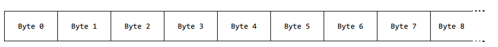
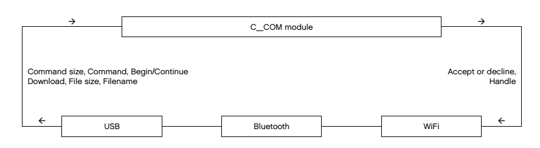
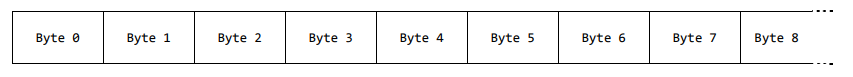

# 1 MINDSTORMS EV3 可编程 brick 的硬件规格

LEGO MINDSTORMS EV3 可编程 brick 是新 LEGO MINDSTORMS 平台内的中央处理单元。可编程 brick 由各种先进的电子设备组成，以实现其广泛的功能。
<!--more-->
下面的列表是 EV3 可编程 brick 硬件规格总结。

|    硬件    |     规格     |
|-------------|--------------|
| 主处理器 | 32-bit ARM9 processor, Texas Instrument AM1808<br>   - 300 MHz <br>    - OS: LINUX |
| 存储器 | 64 MB DDR RAM <br> 16 MB FLASH <br> 256 KB EEPROM |
| Micro SD卡接口 | SDHC standard, 2 – 32 GB |
| Bluetooth 无线通信 | Bluetooth V2.1 EDR, Panasonic PAN1325 模块 <br>  - Texas Instrument CC2550 芯片 <br>  - BlueZ Bluetooth 栈 <br>  - Primary usage, Serial Port Profile (SPP) |
| USB 2.0 通信，客户端接口 | 高速端口 (480 MBit/s) |
| USB 1.1 通信，客户端接口 | 全速端口 (12 MBit/s) |
| 4 个输入端口 | 6 个接口同时支持数字和模拟接口 <br>  - 模拟输入  0 – 5 V <br>  - 支持  Auto-ID 扩展设备 <br>      - UART 通信 <br>    *  Up to 460 Kbit/s (Port 1 and 2) <br>    *  Up to 230 Kbit/s (Port 3 and 4) |
| 4 个输出端口 | 6 个有线接口，支持电机编码器输入 |
| 显示 | 178x128 像素黑白点阵显示器 <br> - 可视区域： 29.9 x 41.1 mm  |
| 扩音器 | 直径，23 mm  |
| 6 个按钮用户接口 | 环绕 UI 灯  |
| 电源 | 6 AA 电池 <br> - 建议使用碱性电池 <br> -  可充电锂离子电池，2000 mAH |
| 链接器 | 6 线工业标准连接器，RJ-12右侧调节  |

# 2 通信接口

这部分将描述不同类型 masters（主机）与 LEGO MINDSTORMS EV3 brick 通信所用的协议。EV3 支持多种通信接口 Bluetooth，USB 和 WiFi。EV3 协议对于所有 3 种传输技术都是相同的。

除了运行用户程序外，VM（虚拟机）还能执行通过上述技术之一发送的直接命令。直接命令由构成常规字节码的小程序组成，有关各字节码的更多详细信息，请参考 *LEGO MINDSTORMS EV3 固件开发者套件*。这些直接命令（代码片段）与运行的用户程序并行执行。

在组合这些直接命令时要特别小心。在使用危险的代码和结构时没有任何限制（例如，允许直接命令中出现死锁循环）。然而 “普通的” 运行中的程序将继续正常工作 - 只有 VM 的直接命令部分将被这样的死锁循环 “锁死”。

由于头部只为变量分配包含 2 个字节，直接命令仅限于一个 VMTHREAD - 即SUBCALLs 和 BLOCKs 当然是不可能的。

具有数据响应的直接命令可以把返回数据放在全局变量空间中。全局变量空间 “等于” 通信响应缓冲区。直接命令的组成定义了放置结果的偏移量位置（全局变量 0 放在返回缓冲区中偏移量为 0 的位置）。

响应缓冲区（全局变量）中的偏移量必须对齐（第一个对齐到 float/32 位，最后一个对齐到 8 位）。

除了直接命令，EV3 还支持系统命令，这是更通用的术语命令，它们被用于向/从嵌入式 EV3 系统下载和上传数据。

# 3 系统命令

```
#define SYSTEM_COMMAND_REPLY 0x01 // 系统命令，需要应答
#define SYSTEM_COMMAND_NO_REPLY 0x81 // 系统命令，无需应答
```

**系统命令字节：**



字节 0 - 1：命令大小，小尾端。命令大小不包含这 2 个字节
字节 2 - 3：消息计数器，小尾端。Forth running counter
字节 4：命令类型。参考上面的定义
字节 5：系统命令。参考下面的定义
字节 6 - n：依赖于字节 5 中给出的系统命令

**系统命令：**
```
#define BEGIN_DOWNLOAD 0x92 // 开始文件下载
#define CONTINUE_DOWNLOAD 0x93 // 继续文件下载
#define BEGIN_UPLOAD 0x94 // 开始文件上传
#define CONTINUE_UPLOAD 0x95 // 继续文件上传
#define BEGIN_GETFILE 0x96 // 开始从文件获取字节（在写入文件时）
#define CONTINUE_GETFILE 0x97 // 继续从文件获取字节（在写入文件时）
#define CLOSE_FILEHANDLE 0x98 // 关闭文件句柄
#define LIST_FILES 0x99 // 列出文件
#define CONTINUE_LIST_FILES 0x9A // 继续列出文件
#define CREATE_DIR 0x9B // 创建目录
#define DELETE_FILE 0x9C // 删除
#define LIST_OPEN_HANDLES 0x9D // 列出句柄
#define WRITEMAILBOX 0x9E // 写邮箱
#define BLUETOOTHPIN 0x9F // 把可信的 pin 码传入 brick 
#define ENTERFWUPDATE 0xA0 // 重启 brick 进入 Firmware 更新模式
```

## 3.1 系统命令应答

```
#define SYSTEM_REPLY 0x03 // 系统命令应答 OK
#define SYSTEM_REPLY_ERROR 0x05 // 系统命令应答 ERROR
```

**系统应答字节：**


字节 0 - 1：应答大小，小尾端。应答大小不包含这 2 个字节
字节 2 - 3：消息计数器，小尾端。等于直接命令
字节 4：应答类型。参考上面的定义
字节 5：这个应答响应的系统命令
字节 6：系统应答状态 - 错误，信息或成功。参考下面的定义
字节 7 - n：进一步的系统应答字节依赖于系统命令和系统应答状态

**系统命令应答状态码：**
```
#define SUCCESS 0x00
#define UNKNOWN_HANDLE 0x01
#define HANDLE_NOT_READY 0x02
#define CORRUPT_FILE 0x03
#define NO_HANDLES_AVAILABLE 0x04
#define NO_PERMISSION 0x05
#define ILLEGAL_PATH 0x06
#define FILE_EXITS 0x07
#define END_OF_FILE 0x08
#define SIZE_ERROR 0x09
#define UNKNOWN_ERROR 0x0A
#define ILLEGAL_FILENAME 0x0B
#define ILLEGAL_CONNECTION 0x0C
```

## 3.2 向 EV3 可编程 brick 下载数据

下载大文件可能非常耗时，因此文件下载可以以 2 种不同的方式完成。

  1. 以最大可能块下载文件，即尽可能使用最大的数据包大小（总命令大小不包括在内。 Length 字节= 65534字节）。如果总消息大小可以保持在 65534 字节以下，则所有的数据可以放进 ***开始下载*** 命令，这将是下载文件最快的方式。这是最快的下载方式，但在这段时间内系统也会被锁定。

  2. 把文件下载分为更小的部分，即一个 ***开始下载*** 后面跟着大量的 ***继续下载*** 命令，这将增加总的下载时间，但在持续的 ***继续下载*** 命令交错间也将给其它命令（更高优先级的）留下空间（时间片）。
这是下载文件最慢的方式，但可以在 ***继续下载*** 消息间交错其他命令。

由于包中没有停止或其它同步字节 - 一个消息一定不能被其它消息打断。即当 brick 已经接收了命令大小（消息的头 2 个字节）时，所有剩余的字节必须无中断地被传送和接收。这个特定消息的应答（来自于 brick）也应该在任何新消息被发送和由 brick 处理前被传送和接收。

**下面的例子基于想要给 P-Brick 发送一个文件的主机应用（X3 software）构建：**



命令大小，命令类型，开始 D/L，文件大小，文件名 ------>
&emsp;&emsp;&emsp;&emsp;&emsp;&emsp;&emsp;&emsp;&emsp;&emsp;&emsp;&emsp;&emsp;&emsp;&emsp;&emsp;&emsp;&emsp;&emsp;&emsp;&emsp;&emsp;&emsp;<------ 命令大小，命令类型，句柄
命令大小，命令类型，继续 D/L，句柄，载荷           ------>
&emsp;&emsp;&emsp;&emsp;&emsp;&emsp;&emsp;&emsp;&emsp;&emsp;&emsp;&emsp;&emsp;&emsp;&emsp;&emsp;&emsp;&emsp;&emsp;&emsp;<------ 命令大小，命令类型
命令大小，命令类型，继续 D/L，句柄，载荷           ------>
&emsp;&emsp;&emsp;&emsp;&emsp;&emsp;&emsp;&emsp;&emsp;&emsp;&emsp;&emsp;&emsp;&emsp;&emsp;&emsp;&emsp;&emsp;&emsp;&emsp;<------ 命令大小，命令类型
命令大小，命令类型，继续 D/L，句柄，载荷           ------>

### 3.2.1 文件下载

 * 目的文件名路径相对于 ***"lms2012/sys"*** 定位
 * 目的目录自动从文件名路径创建
 * 第一个目录名必须是：***"apps"***，***"prjs"*** 或 ***"tools"*** （参考 \ref UIdesign）
 * 文件名路径中的第二个文件夹名称必须等于字节码可执行名称

### 3.2.2 文件上传（文件读取）

 * **BEGIN_UPLOAD** 和 **CONTINUE_UPLOAD** 在文件上传结束时自动关闭文件句柄。
 * **BEGIN_GETFILE** 和 **CONTINUE_GETFILE** 当到达 EOF 时不关闭文件句柄
 * **CONTINUE_GETFILE** 也返回完整的文件大小

### 3.2.3 目录上传

 * **LIST_FILES** 只要列表不超过 1014 字节，就可以工作。

## 3.3 系统命令，通信例子

在下文中，系统命令通信示例的例子将帮助说明接口。

### 3.3.1 文件下载

下载文件 "../apps/tst/tst.rbf"

&emsp;&emsp;&emsp;**BEGIN_DOWNLOAD:**

&emsp;&emsp;&emsp;&emsp;&emsp;向 brick 发送的字节：
&emsp;&emsp;&emsp;&emsp;&emsp;**1C00xxxx0192xxxxxxxx2E2E2F617070732F7473742F7473742E72626600&emsp;&emsp;(Hex)**
&emsp;&emsp;&emsp;&emsp;&emsp;**bbbbmmmmttssllllllllnnnnnnnnnnnnnnnnnnnnnnnnnnnnnnnnnnnnnnnn**

&emsp;&emsp;&emsp;&emsp;&emsp;bbbb = 消息中的字节数
&emsp;&emsp;&emsp;&emsp;&emsp;mm = 消息计数器
&emsp;&emsp;&emsp;&emsp;&emsp;tt = 命令类型
&emsp;&emsp;&emsp;&emsp;&emsp;ss = 系统命令
&emsp;&emsp;&emsp;&emsp;&emsp;llllllll = 文件长度
&emsp;&emsp;&emsp;&emsp;&emsp;nn.. = 以 0 结束的文件名

&emsp;&emsp;&emsp;&emsp;&emsp;从 brick 接收的字节：
&emsp;&emsp;&emsp;&emsp;&emsp;**0600xxxx03920000&emsp;&emsp;(Hex)**
&emsp;&emsp;&emsp;&emsp;&emsp;**bbbbmmmmttssrrhh**

&emsp;&emsp;&emsp;&emsp;&emsp;bbbb = 消息中的字节数
&emsp;&emsp;&emsp;&emsp;&emsp;mm = 消息计数器
&emsp;&emsp;&emsp;&emsp;&emsp;tt = 命令类型
&emsp;&emsp;&emsp;&emsp;&emsp;ss = 系统命令
&emsp;&emsp;&emsp;&emsp;&emsp;rr = 返回状态
&emsp;&emsp;&emsp;&emsp;&emsp;hh = 文件句柄


&emsp;&emsp;&emsp;**CONTINUE_DOWNLOAD:**
&emsp;&emsp;&emsp;&emsp;&emsp;向 brick 发送的字节：
&emsp;&emsp;&emsp;&emsp;&emsp;**xxxxxxxx819300xxxxxxxxxxxxxxxxxxxxxxxxxxxxxxxxxxxxxxxx&emsp;&emsp;(Hex)**
&emsp;&emsp;&emsp;&emsp;&emsp;**bbbbmmmmttsshhpppppppppppppppppppppppppppppppppppppppp**

&emsp;&emsp;&emsp;&emsp;&emsp;bbbb = 消息中的字节数
&emsp;&emsp;&emsp;&emsp;&emsp;mm = 消息计数器
&emsp;&emsp;&emsp;&emsp;&emsp;tt = 命令类型
&emsp;&emsp;&emsp;&emsp;&emsp;ss = 系统命令
&emsp;&emsp;&emsp;&emsp;&emsp;hh = 文件句柄（在 BEGIN_DOWNLOAD 中返回）
&emsp;&emsp;&emsp;&emsp;&emsp;pp.. = 载荷

&emsp;&emsp;&emsp;&emsp;&emsp;从 brick 接收的字节：
&emsp;&emsp;&emsp;&emsp;&emsp;**0600xxxx03930000&emsp;&emsp;(Hex)**
&emsp;&emsp;&emsp;&emsp;&emsp;**bbbbmmmmttssrrhh**

&emsp;&emsp;&emsp;&emsp;&emsp;bbbb = 消息中的字节数
&emsp;&emsp;&emsp;&emsp;&emsp;mm = 消息计数器
&emsp;&emsp;&emsp;&emsp;&emsp;tt = 命令类型
&emsp;&emsp;&emsp;&emsp;&emsp;ss = 系统命令
&emsp;&emsp;&emsp;&emsp;&emsp;rr = 返回状态
&emsp;&emsp;&emsp;&emsp;&emsp;hh = 文件句柄

### 3.3.2 文件上传

&emsp;&emsp;&emsp;**BEGIN_UPLOAD:**
&emsp;&emsp;&emsp;&emsp;&emsp;向 brick 发送的字节：
&emsp;&emsp;&emsp;&emsp;&emsp;**xxxxxxxx0194xxxxxxx**
&emsp;&emsp;&emsp;&emsp;&emsp;**bbbbmmmmttssllllnnn...**

&emsp;&emsp;&emsp;&emsp;&emsp;bbbb = 消息中的字节数
&emsp;&emsp;&emsp;&emsp;&emsp;mmmm = 消息计数器
&emsp;&emsp;&emsp;&emsp;&emsp;tt = 命令类型
&emsp;&emsp;&emsp;&emsp;&emsp;ss = 系统命令
&emsp;&emsp;&emsp;&emsp;&emsp;llll = 要读取的字节
&emsp;&emsp;&emsp;&emsp;&emsp;nnn... = 文件名，包含路径

&emsp;&emsp;&emsp;&emsp;&emsp;从 brick 接收的字节：
&emsp;&emsp;&emsp;&emsp;&emsp;**xxxxxxxx039400xxxxxxxx00xxx**
&emsp;&emsp;&emsp;&emsp;&emsp;**bbbbmmmmttssrrllllllllhhppp...**

&emsp;&emsp;&emsp;&emsp;&emsp;bbbb = 消息中的字节数
&emsp;&emsp;&emsp;&emsp;&emsp;mmmm = 消息计数器
&emsp;&emsp;&emsp;&emsp;&emsp;tt = 命令类型
&emsp;&emsp;&emsp;&emsp;&emsp;ss = 系统命令
&emsp;&emsp;&emsp;&emsp;&emsp;rr = 返回状态
&emsp;&emsp;&emsp;&emsp;&emsp;llllllll = 文件大小
&emsp;&emsp;&emsp;&emsp;&emsp;hh = 文件句柄
&emsp;&emsp;&emsp;&emsp;&emsp;ppp... = 载荷

&emsp;&emsp;&emsp;**CONTINUE_UPLOAD:**
&emsp;&emsp;&emsp;&emsp;&emsp;向 brick 发送的字节：
&emsp;&emsp;&emsp;&emsp;&emsp;**0700xxxx019500xxxx**
&emsp;&emsp;&emsp;&emsp;&emsp;**bbbbmmmmttsshhllll...**

&emsp;&emsp;&emsp;&emsp;&emsp;bbbb = 消息中的字节数
&emsp;&emsp;&emsp;&emsp;&emsp;mmmm = 消息计数器
&emsp;&emsp;&emsp;&emsp;&emsp;tt = 命令类型
&emsp;&emsp;&emsp;&emsp;&emsp;ss = 系统命令
&emsp;&emsp;&emsp;&emsp;&emsp;hh = 文件句柄
&emsp;&emsp;&emsp;&emsp;&emsp;llll = 要读取的字节

&emsp;&emsp;&emsp;&emsp;&emsp;向 PC 发送的字节：
&emsp;&emsp;&emsp;&emsp;&emsp;**xxxxxxxx03950000xxx**
&emsp;&emsp;&emsp;&emsp;&emsp;**bbbbmmmmttssrrhhppp...**

&emsp;&emsp;&emsp;&emsp;&emsp;bbbb = 消息中的字节数
&emsp;&emsp;&emsp;&emsp;&emsp;mmmm = 消息计数器
&emsp;&emsp;&emsp;&emsp;&emsp;tt = 命令类型
&emsp;&emsp;&emsp;&emsp;&emsp;ss = 系统命令
&emsp;&emsp;&emsp;&emsp;&emsp;rr = 返回状态
&emsp;&emsp;&emsp;&emsp;&emsp;hh = 句柄
&emsp;&emsp;&emsp;&emsp;&emsp;pppp.. = 载荷

### 3.3.3 获取文件内容

用于上传数据记录文件 - 文件句柄只在文件指针到达 EOF 时关闭，且文件不以写模式打开。

&emsp;&emsp;&emsp;**BEGIN_GETFILE:**
&emsp;&emsp;&emsp;&emsp;&emsp;向 brick 发送的字节：
&emsp;&emsp;&emsp;&emsp;&emsp;**xxxxxxxx0196xxxxxxx**
&emsp;&emsp;&emsp;&emsp;&emsp;**bbbbmmmmttssllllnnn...**

&emsp;&emsp;&emsp;&emsp;&emsp;bbbb = 消息中的字节数
&emsp;&emsp;&emsp;&emsp;&emsp;mmmm = 消息计数器
&emsp;&emsp;&emsp;&emsp;&emsp;tt = 命令类型
&emsp;&emsp;&emsp;&emsp;&emsp;ss = 系统命令
&emsp;&emsp;&emsp;&emsp;&emsp;llll = 最大读取字节数
&emsp;&emsp;&emsp;&emsp;&emsp;nnnn.... = 路径

&emsp;&emsp;&emsp;&emsp;&emsp;向 PC 发送的字节：
&emsp;&emsp;&emsp;&emsp;&emsp;**xxxxxxxx039600xxxxxxxx00xxx**
&emsp;&emsp;&emsp;&emsp;&emsp;**bbbbmmmmttssrrllllllllhhppp...**

&emsp;&emsp;&emsp;&emsp;&emsp;bbbb = 消息中的字节数
&emsp;&emsp;&emsp;&emsp;&emsp;mmmm = 消息计数器
&emsp;&emsp;&emsp;&emsp;&emsp;tt = 命令类型
&emsp;&emsp;&emsp;&emsp;&emsp;ss = 系统命令
&emsp;&emsp;&emsp;&emsp;&emsp;rr = 返回状态
&emsp;&emsp;&emsp;&emsp;&emsp;llllllll = 文件大小
&emsp;&emsp;&emsp;&emsp;&emsp;hh = 句柄
&emsp;&emsp;&emsp;&emsp;&emsp;ppp... = 载荷

&emsp;&emsp;&emsp;**CONTINUE_GETFILE:**
&emsp;&emsp;&emsp;&emsp;&emsp;向 brick 发送的字节：
&emsp;&emsp;&emsp;&emsp;&emsp;**0700xxxx019700xxxx**
&emsp;&emsp;&emsp;&emsp;&emsp;**bbbbmmmmttsshhllll**

&emsp;&emsp;&emsp;&emsp;&emsp;bbbb = 消息中的字节数
&emsp;&emsp;&emsp;&emsp;&emsp;mmmm = 消息计数器
&emsp;&emsp;&emsp;&emsp;&emsp;tt = 命令类型
&emsp;&emsp;&emsp;&emsp;&emsp;ss = 系统命令
&emsp;&emsp;&emsp;&emsp;&emsp;hh = 句柄
&emsp;&emsp;&emsp;&emsp;&emsp;llll = 最大读取字节数

&emsp;&emsp;&emsp;&emsp;&emsp;向 PC 发送的字节：
&emsp;&emsp;&emsp;&emsp;&emsp;**xxxxxxxx039700xxxxxxxx00xxx**
&emsp;&emsp;&emsp;&emsp;&emsp;**bbbbmmmmttssrrllllllllhhppp...**

&emsp;&emsp;&emsp;&emsp;&emsp;bbbb = 消息中的字节数
&emsp;&emsp;&emsp;&emsp;&emsp;mmmm = 消息计数器
&emsp;&emsp;&emsp;&emsp;&emsp;tt = 命令类型
&emsp;&emsp;&emsp;&emsp;&emsp;ss = 系统命令
&emsp;&emsp;&emsp;&emsp;&emsp;rr = 返回状态
&emsp;&emsp;&emsp;&emsp;&emsp;llllllll = 文件大小
&emsp;&emsp;&emsp;&emsp;&emsp;hh = 句柄
&emsp;&emsp;&emsp;&emsp;&emsp;ppp... = 载荷

### 3.3.4 列出文件和目录

&emsp;&emsp;&emsp;**LIST_FILES:**

&emsp;&emsp;&emsp;新行分隔列表的格式为：

&emsp;&emsp;&emsp;如果是文件：
&emsp;&emsp;&emsp;MD5SUM 的 32 chars (hex) + space +  8 chars (hex) 的文件大小 + space + 文件名 + 新行

&emsp;&emsp;&emsp;如果是目录：
&emsp;&emsp;&emsp;目录名 + / + 新行

&emsp;&emsp;&emsp;&emsp;&emsp;向 brick 发送的字节：
&emsp;&emsp;&emsp;&emsp;&emsp;**xxxxxxxx0199xxxxxxx**
&emsp;&emsp;&emsp;&emsp;&emsp;**bbbbmmmmttssllllnnn...**

&emsp;&emsp;&emsp;&emsp;&emsp;bbbb = 消息中的字节数
&emsp;&emsp;&emsp;&emsp;&emsp;mmmm = 消息计数器
&emsp;&emsp;&emsp;&emsp;&emsp;tt = 消息类型
&emsp;&emsp;&emsp;&emsp;&emsp;ss = 系统命令
&emsp;&emsp;&emsp;&emsp;&emsp;llll = 最大读取字节数
&emsp;&emsp;&emsp;&emsp;&emsp;nnn.... = 路径名

&emsp;&emsp;&emsp;&emsp;&emsp;向 PC 发送的字节：
&emsp;&emsp;&emsp;&emsp;&emsp;**xxxxxxxx0399xxxxxxxxxxxxxxx**
&emsp;&emsp;&emsp;&emsp;&emsp;**bbbbmmmmttssrrllllllllhhnnn...**

&emsp;&emsp;&emsp;&emsp;&emsp;bbbb = 消息中的字节数
&emsp;&emsp;&emsp;&emsp;&emsp;mmmm = 消息计数器
&emsp;&emsp;&emsp;&emsp;&emsp;tt = 消息类型
&emsp;&emsp;&emsp;&emsp;&emsp;ss = 系统命令
&emsp;&emsp;&emsp;&emsp;&emsp;rr = 返回状态
&emsp;&emsp;&emsp;&emsp;&emsp;llllllll = 列表大小
&emsp;&emsp;&emsp;&emsp;&emsp;hh = 句柄
&emsp;&emsp;&emsp;&emsp;&emsp;nnn.. = 新行分隔列表

&emsp;&emsp;&emsp;**CONTINUE_LIST_FILES:**
&emsp;&emsp;&emsp;&emsp;&emsp;向 brick 发送的字节：
&emsp;&emsp;&emsp;&emsp;&emsp;**0700xxxx019Axxxxxx**
&emsp;&emsp;&emsp;&emsp;&emsp;**bbbbmmmmttsshhllll**

&emsp;&emsp;&emsp;&emsp;&emsp;bbbb = 消息中的字节数
&emsp;&emsp;&emsp;&emsp;&emsp;mmmm = 消息计数器
&emsp;&emsp;&emsp;&emsp;&emsp;tt = 命令类型
&emsp;&emsp;&emsp;&emsp;&emsp;ss = 系统命令
&emsp;&emsp;&emsp;&emsp;&emsp;hh = 句柄
&emsp;&emsp;&emsp;&emsp;&emsp;llll = 最大读取字节数

&emsp;&emsp;&emsp;&emsp;&emsp;向 PC 发送的字节：
&emsp;&emsp;&emsp;&emsp;&emsp;**xxxxxxxx039Axxxxxxx**
&emsp;&emsp;&emsp;&emsp;&emsp;**bbbbmmmmttssrrhhppp...**

&emsp;&emsp;&emsp;&emsp;&emsp;bbbb = 消息中的字节数
&emsp;&emsp;&emsp;&emsp;&emsp;mmmm = 消息计数器
&emsp;&emsp;&emsp;&emsp;&emsp;tt = 命令类型
&emsp;&emsp;&emsp;&emsp;&emsp;ss = 系统命令
&emsp;&emsp;&emsp;&emsp;&emsp;rr = 返回状态
&emsp;&emsp;&emsp;&emsp;&emsp;hh = 句柄
&emsp;&emsp;&emsp;&emsp;&emsp;ppp... = 载荷

### 3.3.5 关闭文件句柄

&emsp;&emsp;&emsp;**CLOSE_FILEHANDLE:**
&emsp;&emsp;&emsp;&emsp;&emsp;向 brick 发送的字节：
&emsp;&emsp;&emsp;&emsp;&emsp;**xxxxxxxx019800xxxxxxxxxxxxxxxx**
&emsp;&emsp;&emsp;&emsp;&emsp;**bbbbmmmmttsshhpppppppppppppppp**

&emsp;&emsp;&emsp;&emsp;&emsp;bbbb = 消息中的字节数
&emsp;&emsp;&emsp;&emsp;&emsp;mmmm = 消息计数器
&emsp;&emsp;&emsp;&emsp;&emsp;tt = 消息类型
&emsp;&emsp;&emsp;&emsp;&emsp;ss = 系统命令
&emsp;&emsp;&emsp;&emsp;&emsp;hh = 句柄
&emsp;&emsp;&emsp;&emsp;&emsp;ppp... = 哈希

&emsp;&emsp;&emsp;&emsp;&emsp;向 PC 发送的字节：
&emsp;&emsp;&emsp;&emsp;&emsp;**0500xxxx039800**
&emsp;&emsp;&emsp;&emsp;&emsp;**bbbbmmmmttssrr**

&emsp;&emsp;&emsp;&emsp;&emsp;bbbb = 消息中的字节数
&emsp;&emsp;&emsp;&emsp;&emsp;mmmm = 消息计数器
&emsp;&emsp;&emsp;&emsp;&emsp;tt = 消息类型
&emsp;&emsp;&emsp;&emsp;&emsp;ss = 系统命令
&emsp;&emsp;&emsp;&emsp;&emsp;rr = 返回状态

### 3.3.6 创建目录

&emsp;&emsp;&emsp;**CREATE_DIR:**
&emsp;&emsp;&emsp;&emsp;&emsp;向 brick 发送的字节：
&emsp;&emsp;&emsp;&emsp;&emsp;**xxxxxxxx019Bxxxxxx...**
&emsp;&emsp;&emsp;&emsp;&emsp;**bbbbmmmmttsspppppp...**

&emsp;&emsp;&emsp;&emsp;&emsp;bbbb = 消息中的字节数
&emsp;&emsp;&emsp;&emsp;&emsp;mmmm = 消息计数器
&emsp;&emsp;&emsp;&emsp;&emsp;tt = 消息类型
&emsp;&emsp;&emsp;&emsp;&emsp;ss = 系统命令
&emsp;&emsp;&emsp;&emsp;&emsp;pp = 以 null 结尾的字符串，其中包含了要创建的目录的完整路径

&emsp;&emsp;&emsp;&emsp;&emsp;向 PC 发送的字节：
&emsp;&emsp;&emsp;&emsp;&emsp;**0500xxxx039Bxx**
&emsp;&emsp;&emsp;&emsp;&emsp;**bbbbmmmmttssrr**

&emsp;&emsp;&emsp;&emsp;&emsp;bbbb = 消息中的字节数
&emsp;&emsp;&emsp;&emsp;&emsp;mmmm = 消息计数器
&emsp;&emsp;&emsp;&emsp;&emsp;tt = 消息类型
&emsp;&emsp;&emsp;&emsp;&emsp;ss = 系统命令
&emsp;&emsp;&emsp;&emsp;&emsp;rr = 返回状态

### 3.3.7 删除一个文件

&emsp;&emsp;&emsp;**DELETE_FILE:**
&emsp;&emsp;&emsp;&emsp;&emsp;向 brick 发送的字节：
&emsp;&emsp;&emsp;&emsp;&emsp;**xxxxxxxx019Cxxxxxx...**
&emsp;&emsp;&emsp;&emsp;&emsp;**bbbbmmmmttsspppppp...**

&emsp;&emsp;&emsp;&emsp;&emsp;bbbb = 消息中的字节数
&emsp;&emsp;&emsp;&emsp;&emsp;mmmm = 消息计数器
&emsp;&emsp;&emsp;&emsp;&emsp;tt = 消息类型
&emsp;&emsp;&emsp;&emsp;&emsp;ss = 系统命令
&emsp;&emsp;&emsp;&emsp;&emsp;pp = 以 null 结尾的字符串，其中包含了要删除的文件的完整路径

&emsp;&emsp;&emsp;&emsp;&emsp;向 PC 发送的字节：
&emsp;&emsp;&emsp;&emsp;&emsp;**0500xxxx039Cxx**
&emsp;&emsp;&emsp;&emsp;&emsp;**bbbbmmmmttssrr**

&emsp;&emsp;&emsp;&emsp;&emsp;bbbb = 消息中的字节数
&emsp;&emsp;&emsp;&emsp;&emsp;mmmm = 消息计数器
&emsp;&emsp;&emsp;&emsp;&emsp;tt = 消息类型
&emsp;&emsp;&emsp;&emsp;&emsp;ss = 系统命令
&emsp;&emsp;&emsp;&emsp;&emsp;rr = 返回状态

### 3.3.8 获取打开句柄的列表

&emsp;&emsp;&emsp;**LIST_OPEN_HANDLES:**
&emsp;&emsp;&emsp;&emsp;&emsp;向 brick 发送的字节：
&emsp;&emsp;&emsp;&emsp;&emsp;**xxxxxxxx019D**
&emsp;&emsp;&emsp;&emsp;&emsp;**bbbbmmmmttss**

&emsp;&emsp;&emsp;&emsp;&emsp;bbbb = 消息中的字节数
&emsp;&emsp;&emsp;&emsp;&emsp;mmmm = 消息计数器
&emsp;&emsp;&emsp;&emsp;&emsp;tt = 消息类型
&emsp;&emsp;&emsp;&emsp;&emsp;ss = 系统命令

&emsp;&emsp;&emsp;&emsp;&emsp;向 PC 发送的字节：
&emsp;&emsp;&emsp;&emsp;&emsp;**xxxxxxxx039Dxxxxxx....**
&emsp;&emsp;&emsp;&emsp;&emsp;**bbbbmmmmttssrrpppp....**

&emsp;&emsp;&emsp;&emsp;&emsp;bbbb = 消息中的字节数
&emsp;&emsp;&emsp;&emsp;&emsp;mmmm = 消息计数器
&emsp;&emsp;&emsp;&emsp;&emsp;tt = 消息类型
&emsp;&emsp;&emsp;&emsp;&emsp;ss = 系统命令
&emsp;&emsp;&emsp;&emsp;&emsp;rr = 返回状态
&emsp;&emsp;&emsp;&emsp;&emsp;pppp = 用于指示句柄是否处于 busy 状态的位

### 3.3.9 写邮箱

&emsp;&emsp;&emsp;**WRITEMAILBOX:**
&emsp;&emsp;&emsp;&emsp;&emsp;向另一个 brick 发送的字节：

&emsp;&emsp;&emsp;&emsp;&emsp;邮箱名称必须以 0 结尾，同时名称长度必须是剔除结尾的 0 的字符数！

&emsp;&emsp;&emsp;&emsp;&emsp;**xxxxxxxx819Exxxxxxxxxxxxxxxxxxxx**
&emsp;&emsp;&emsp;&emsp;&emsp;**bbbbmmmmttssllaaaaa...LLLLppp...**

&emsp;&emsp;&emsp;&emsp;&emsp;bbbb = 消息中的字节数
&emsp;&emsp;&emsp;&emsp;&emsp;mmmm = 消息计数器
&emsp;&emsp;&emsp;&emsp;&emsp;tt = 消息类型
&emsp;&emsp;&emsp;&emsp;&emsp;ss = 系统命令
&emsp;&emsp;&emsp;&emsp;&emsp;ll = 名称长度
&emsp;&emsp;&emsp;&emsp;&emsp;aaa... = 名称
&emsp;&emsp;&emsp;&emsp;&emsp;LLLL = 载荷长度
&emsp;&emsp;&emsp;&emsp;&emsp;ppp... = 载荷

&emsp;&emsp;&emsp;&emsp;&emsp;从另一个 brick 接收的应答：
&emsp;&emsp;&emsp;&emsp;&emsp;无效

### 3.3.10 设置 Bluetooth PIN 码

&emsp;&emsp;&emsp;**BLUETOOTHPIN:**

&emsp;&emsp;&emsp;&emsp;&emsp;出于安全的原因，这个命令只能通过 USB 发送，且应该被格式化为：

&emsp;&emsp;&emsp;&emsp;&emsp;&emsp;* Bluetooth 地址一定不能包含冒号
&emsp;&emsp;&emsp;&emsp;&emsp;&emsp;* Bluetooth MAC 地址是 0 结尾的字符串类型
&emsp;&emsp;&emsp;&emsp;&emsp;&emsp;* Bluetooth pin 码是 0 结尾的字符串类型

&emsp;&emsp;&emsp;&emsp;&emsp;向 brick 发送的字节：
&emsp;&emsp;&emsp;&emsp;&emsp;**0E00xxxx019F06xxxxxxxxxxxx04xxxx**
&emsp;&emsp;&emsp;&emsp;&emsp;**bbbbmmmmttssllaaaaaaaaaaaaLLpppp**

&emsp;&emsp;&emsp;&emsp;&emsp;bbbb = 消息中的字节数
&emsp;&emsp;&emsp;&emsp;&emsp;mmmm = 消息计数器
&emsp;&emsp;&emsp;&emsp;&emsp;tt = 消息类型
&emsp;&emsp;&emsp;&emsp;&emsp;ss = 系统命令
&emsp;&emsp;&emsp;&emsp;&emsp;ll = MAC 长度
&emsp;&emsp;&emsp;&emsp;&emsp;aaa... = PC 的 MAC 地址
&emsp;&emsp;&emsp;&emsp;&emsp;LL = pin 长度
&emsp;&emsp;&emsp;&emsp;&emsp;ppp... = pin 码

&emsp;&emsp;&emsp;&emsp;&emsp;向 PC 发送的字节：
&emsp;&emsp;&emsp;&emsp;&emsp;**0F00xxxx039Fxx06xxxxxxxxxxxx04xxxx**
&emsp;&emsp;&emsp;&emsp;&emsp;**bbbbmmmmttssrrllaaaaaaaaaaaaLLpppp**

&emsp;&emsp;&emsp;&emsp;&emsp;bbbb = 消息中的字节
&emsp;&emsp;&emsp;&emsp;&emsp;mmmm = 消息计数器
&emsp;&emsp;&emsp;&emsp;&emsp;tt = 消息类型
&emsp;&emsp;&emsp;&emsp;&emsp;ss = 系统命令
&emsp;&emsp;&emsp;&emsp;&emsp;rr = 返回状态
&emsp;&emsp;&emsp;&emsp;&emsp;ll = MAC 长度
&emsp;&emsp;&emsp;&emsp;&emsp;aaa... = PC 的 MAC 地址
&emsp;&emsp;&emsp;&emsp;&emsp;LL = pin 长度
&emsp;&emsp;&emsp;&emsp;&emsp;ppp... = pin 码

### 3.3.11 强制 EV3 可编程 brick 进入 Firmware 升级模式

这个命令用于强制 brick 进入 Firmware 升级模式。这个命令将不发送任何响应回主机。关闭（关机）Linux OS 时，不会更新文件系统。

&emsp;&emsp;&emsp;**ENTERFWUPDATE:**

&emsp;&emsp;&emsp;&emsp;&emsp;向 brick 发送的字节：
&emsp;&emsp;&emsp;&emsp;&emsp;**0400xxxx81A0**
&emsp;&emsp;&emsp;&emsp;&emsp;**bbbbmmmmttss**

&emsp;&emsp;&emsp;&emsp;&emsp;bbbb = 消息中的字节数
&emsp;&emsp;&emsp;&emsp;&emsp;mmmm = 消息计数器
&emsp;&emsp;&emsp;&emsp;&emsp;tt = 消息类型
&emsp;&emsp;&emsp;&emsp;&emsp;ss = 系统命令

# 4. 直接命令

```
#define DIRECT_COMMAND_REPLY 0x00 // 直接命令，需要应答
#define DIRECT_COMMAND_NO_REPLY 0x80 // 直接命令，无需应答
```

**直接命令字节：**



字节 0 - 1：命令大小，小尾端。命令大小不包含这 2 个字节
字节 2 - 3：消息计数器，小尾端。Forth running counter
字节 4：命令类型。参考上面的定义
字节 5 - 6：使用压缩格式保留（分配）全局变量和局部变量（在字节 5 和字节 6 的 2 个 lsb 中保留全局变量，在字节 6 的高 6 位中保留本地变量） - 见下文：
字节 7 - n：单个命令或复合命令的字节代码（即多个命令组合为一个小程序）

局部的 = “l”， 全局的 = “g”

```
              Byte 6: Byte 5:
位号:        76543210 76543210
变量大小：    llllllgg gggggggg
```

**gg gggggggg** 全局变量保留 0 – (2^10 – 1) 0..1023 字节
**llllllxx** 局部变量保留 0 – (2^6 – 1) 0....63 字节

## 4.1 直接应答

```
#define DIRECT_REPLY 0x02 // 直接命令应答 OK
#define DIRECT_REPLY_ERROR 0x04 // 直接命令应答 ERROR
```

**直接应答字节：**


字节 0 - 1：应答大小，小尾端。应答大小不包含这 2 个字节
字节 2 - 3：消息计数器，小尾端。与直接命令相同
字节 4：应答类型。参考上面的定义
字节 5 - n：响应缓冲区，即命令为全局变量保留的字节内容。即如果命令保留 64 字节，这些字节将被放在应答包的字节 5 到 68。

## 4.2 直接命令，通信示例

下面的直接命令通信的例子将帮助更详细地说明接口。使用的高层的宏说明如下。

更高层的参数编码：

为了使使用参数编码更简单，而使用了 ***“bytecodes.h”*** 中定义的一些宏（关于参数编码也可以参考  *“LEGO MINDSTORMS EV3 - Firmware Developer Kit”* 文档中第 9 页 - *3.4 参数编码*），所示的范围被编码为有符号数。

| LCS | Long variable type| Length bytes | STRING zero terminated |
|-------|--------------------------|-------------------|-----------------------------------|
|LC0(v) | Short constant(value) | single byte | +/- 31
|LC1(v) | Long constant(value)| one byte to follow (2 bytes) | +/- 127
|LC2(v) | Long constant(value) | two bytes to follow (3 bytes) | +/- 32767
|LC4(v) | Long constant(value) | four bytes to follow (5 bytes) | +/- 2147483647
|LV0(i) | Short LOCAL variable(adr) | single byte at adr | +/- 31
|LV1(i) | Long LOCAL variable(adr) | one byte to follow at adr (2 bytes) | +/- 127
|LV2(i) | Long LOCAL variable(adr) | two bytes to follow at adr (3 bytes) | +/- 32767
|LV4(i) | Long LOCAL variable(adr) | four bytes to follow at adr (5 bytes) | +/- 2147483647
|GV0(i) | Short GLOBAL variable(adr) | single byte at adr | +/- 31
|GV0(i) | Long GLOBAL variable(adr) | one byte to follow at adr (2 bytes) | +/- 127
|GV0(i) | Long GLOBAL variable(adr) | two bytes to follow at adr (3 bytes) | +/- 32767
|GV0(i) | Long GLOBAL variable(adr) | four bytes to follow at adr (5 bytes) | +/- 2147483647

### 4.2.1 在 EV3 brick 上启动程序 “Demo”

加载并运行一个应用字节码文件。这个示例也展示了复合的直接命令 - 即在一个单独的包中的两个或更多直接命令。这里我们加载字节码镜像：***“../prjs/BrkProg_SAVE/Demo.rpf”*** 进 slot 1 - 用户 slot。后面紧接着是启动slot 1 中的程序的命令。记住这是一个组合命令，且不能交错。**备注：** 文件扩展名是 “rpf” 而**不是** “rbf”。文件是内建的 “on-brick program file”。

向 brick 发送的字节：

**opFILE,LC0(LOAD_IMAGE),LC2(USER_SLOT),LCS,'.','.','/','p','r','j','s','/',
'B','r','k','P','r','o','g',<br>'_','S','A','V','E'/','D','e','m','o','.','r','p','f',0,GV0(0),GV0(4),opPROGRAM_START,
LC0(USER_SLOT),GV0(0),GV0(4),LC0(0)**

| 指令 |  说明 |
|---|---|
| opFILE |  文件有关的操作码 |
| LC0(LOAD_IMAGE) |  命令被编码为单字节常数 |
| LC2(USER_SLOT) |  用户 slot（1 = 程序 slot）被编码为单个常量字节 |
| LCS |  编码：后面是字符串（以 0 结尾） |
| “../prjs/BrkProg_SAVE/Demo.rpf” |  文件路径和名称。“..” 是 “从当前目录移到上一级目录” |
| 0x00 |   上面的字符串的结尾 0 |
|  GV0(0) |  在全局变量偏移 0 处返回镜像大小。偏移量被编码为单个字节。 |
|  GV0(4) |  在全局变量偏移 4 处返回镜像地址。偏移量被编码为单个字节。 |
|  opPROGRAM_START |  操作码 |
|  LC0(USER_SLOT) |  用户 slot（1 = 程序 slot）被编码为单个字节常量 |
|  GV0(0) |  镜像大小位于全局变量偏移 0 处。 |
|  GV0(4) |  镜像地址位于全局变量偏移 4 处。 |
|  LC0(0) |  调试模式（0 = 普通）被编码为单个字节常量 |

**30000000800800C008820100842E2E2F70726A732F42726B50726F675F534156452F44656D6F2E7270660060640301606400<br>bbbbmmmmtthhhhccccccccccccccccccccccccccccccccccccccccccccccccccccccccccccccccccccccccccccCCCCCCCCCC**

bbbb = 消息中的字节数为 48，不包含包长度字节
mmmm = 消息计数器
tt = 命令类型 - 直接命令无需应答
hhhh = 头部 – 变量分配。
cc/CC = 字节码
hhhh = 10 个最低有效位是全局变量的个数，6 个最高有效位是局部变量的

### 4.2.2 以电源 50 向前启动电动机 B＆C 3 转，并在目的地制动

这个例子使用了特殊的 OUTPUT_STEP_SPEED 电动机命令。这个命令在电动机列表中为电动机设置了速度（(setpoint)）。命令包含加速和减速部分。特别是减速对于更精确地到达最终目的地非常有用。电动机在 3 转（3 * 360 度）结束后制动。

**opOUTPUT_STEP_SPEED,LC0(LAYER_0),LC0(MOTOR_A + MOTOR_B),LC1(SPEED_50),LC0(0),LC2(900),LC2(180),LC0(BRAKE)**

| 指令 |  说明 |
|---|---|
| opOUTPUT_STEP_SPEED |  操作码 |
| LC0(0) | Layer 0 - 被编码为单个字节常量 |
| LC0(MOTOR_A + MOTOR_B) | 电动机 B & C （电动机列表）被编码为单个字节常量 |
| LC1(SPEED_50) | 速度 50% 被编码为单个字节常量 |
| LC0(0) | 没有 STEP1，即从开始全速 - 编码为单个字节常量 |
| LC2(900) | 2.5 周（900 度） STEP2 - 被编码为两个字节 |
| LC2(180) | 0.5 周（180 度） STEP3 为了更精确的到达目的地 -  被编码为两个字节 |
| LC0(BRAKE) | 制动（1）- 被编码为单个字节常量 |

向 brick 发送的字节：

**1200xxxx800000AE000681320082840382B40001<br>Bbbbmmmmtthhhhcccccccccccccccccccccccccc**

bbbb = 消息中的字节数为 21，不包含包长度字节
mmmm = 消息计数器
tt = 命令类型 - 直接命令无需应答
hhhh = 头部 – 变量分配。
cc/CC = 字节码
hhhh = 10 个最低有效位是全局变量的个数，6 个最高有效位是局部变量的

### 4.2.3 读取传感器端口 3 上的光传感器值

这个直接命令将读取连接在 brick 的输入端口 3 上的光传感器。模式被显式地设为模式 0（零）即光传感器（0 – 100 pct.）的本地模式 0。返回值是一个32 位 float，编码为 SI 0-100 pct。

默认的 32 位浮点数（SI 0-100 pct）。

**opINPUT_DEVICE,LC0(READY_SI),LC0(LAYER_0),LC0(SENSOR_PORT_3),LC0(DO_NOT_CHANGE_TYPE),LC0(MODE_0),LC0(ONE_DATA_SET),LCO(GLOBAL_VAR_INDEX0)**

| 指令 |  说明 |
|---|---|
| opINPUT_DEVICE |  输入相关的操作码 |
| LC0(READY_SI) | 命令（READY_SI）被编码为单个字节常量 |
| LC0(LAYER_0) | Layer number (0 = 这个特定 brick) 被编码为单个字节常量 |
| LC0(SENSOR_PORT_3) | 连接到端口 3 （(1-4 / 0-3 内部的）上的传感器被编码为单个字节常量 |
| LC0(DO_NOT_CHANGE_TYPE) | 如果设置为 0 （零） - 不改变类型 - 被编码为单个字节常量 |
| LC0(MODE_0) | 模式 0 - 被编码为单个字节常量 |
| LC0(ONE_DATA _SET) | 数据集的个数（模式 0 只有 1 个（pct））- 被编码为单个字节常量 |
| LC0(GLOBAL_VAR_INDEX0) | 把返回值放在全局变量的索引 0 （零）处 - 被编码为单个字节常量 |

向 brick 发送的字节：

**0D00xxxx000400991D000200000160<br>BbbbmmmmtthhhhCCCCCCCCCCCCCCCC**

bbbb = 消息中的字节数为 13，不包含包长度字节
mmmm = 消息计数器
tt = 命令类型 - 直接命令需要应答
hhhh = 头部 – 变量分配。这 4 个字节在全局变量中保留
CC/cc/CC/cc = 字节码
hhhh = 10 个最低有效位是全局变量的个数，6 个最高有效位是局部变量的

### 4.2.4 读取连接到端口 1 的光传感器为 COLOR

这个直接命令将读取连接在 brick 的输入端口 1 上的光传感器。模式被显式地设为模式 2 “COLOR 模式”。传感器将返回一个 0 - 8（包含）之间的值，即传感器前的物体的颜色。返回值是 32 位浮点数，编码为 0-8。

**opINPUT_DEVICE,LC0(READY_SI),LC0(LAYER_0),LC0(SENSOR_PORT_1),LC0(DO_NOT_CHANGE_TYPE),LC0(MODE_2),LC0(ONE_DATA_SET),LCO(GLOBAL_VAR_INDEX0)**

| 指令 |  说明 |
|---|---|
| opINPUT_DEVICE |  输入相关的操作码 |
| LC0(READY_SI) | 命令（READY_SI）被编码为单个字节常量 |
| LC0(LAYER_0) | Layer number (0 = 这个特定 brick) 被编码为单个字节常量 |
| LC0(SENSOR_PORT_1) | 连接到端口 1 （(1-4 / 0-3 内部的）上的传感器被编码为单个字节常量 |
| LC0(DO_NOT_CHANGE_TYPE) | 如果设置为 0 （零） - 不改变类型 - 被编码为单个字节常量 |
| LC0(MODE_2) | 模式 2 - 被编码为单个字节常量 |
| LC0(ONE_DATA _SET) | 数据集的个数（模式 0 只有 1 个（pct））- 被编码为单个字节常量 |
| LC0(GLOBAL_VAR_INDEX0) | 把返回值放在全局变量的索引 0 （零）处 - 被编码为单个字节常量 |

向 brick 发送的字节：

**0D00xxxx000400991D000000020160<br>BbbbmmmmtthhhhCCCCCCCCCCCCCCCC**

bbbb = 消息中的字节数为 13，不包含包长度字节
mmmm = 消息计数器
tt = 命令类型 - 直接命令需要应答
hhhh = 头部 – 变量分配。这 1 个字节在全局变量中保留
CC/cc/CC/cc = 字节码
hhhh = 10 个最低有效位是全局变量的个数，6 个最高有效位是局部变量的

### 4.2.5 在 level 2 播放 1 Kz 音调 1 秒

**opSOUND,LC0(TONE),LC1(2),LC2(1000),LC2(1000)**

| 指令 |  说明 |
|---|---|
| opSOUND |  声音相关的操作码 |
| LC0(TONE) | 命令（TONE）被编码为单个字节常量 |
| LC1(2) | 声音 leve2 被编码为 1 个常量字节 |
| LC2(1000) | 频率 1000 Hz 被编码为 2 个常量字节 |
| LC2(1000) | 持续时长 1000 ms 被编码为 2 个常量字节 |

向 brick 发送的字节：

**0F00xxxx8000009401810282E80382E803<br>Bbbbmmmmtthhhhcccccccccccccccccccc**

bbbb = 消息中的字节数为 15，不包含包长度字节
mmmm = 消息计数器
tt = 命令类型 - 直接命令无需应答
hhhh = 头部 – 变量分配。
cc/CC = 字节码
hhhh = 10 个最低有效位是全局变量的个数，6 个最高有效位是局部变量的

### 4.2.6 在屏幕上展示一幅图片

清除屏幕，并在屏幕上的坐标 (x = 0, y= 50) 处绘制 bmp 图片 “mindstorms.rgf”。首先屏幕由 FILLWINDOW 子命令清除，然后 bmp 图片文件由子命令 BMPFILE 加载。在 UPDATE 子命令发出之前屏幕上什么都不会发送。

**opUI_DRAW,LC0(FILLWINDOW),LC0(BG_COLOR),LC2(0),LC2(0),opUI_DRAW,LC0(BMPFILE),LCO(FG_COLOR),LC2(0),LC2(50),LCS,'u','i','/','m','i','n','d', 's','t','o','r','m','s','.','r','g','f',0,opUI_DRAW,LC0(UPDATE)**

| 指令 |  说明 |
|---|---|
| opUI_DRAW |  绘制相关的操作码 |
| LC0(FILLWINDOW) | 命令（FILLWINDOW）被编码为单个字节常量 |
| LC0(BG_COLOR) | 颜色设置背景颜色 - 即清除屏幕被编码为单个字节常量 |
| LC2(0) | 起始 y（0 表示整个屏幕）被编码为单个字节常量 |
| LC2(0) | 结束 y（0 表示整个屏幕）被编码为单个字节常量 |
| opUI_DRAW | 绘制相关的操作码 |
| LC0(BMPFILE) | 命令（BMPFILE）被编码为单个字节常量 |
| LC0(FG_COLOR) | 颜色设置前景颜色被编码为单个字节常量 |
| LC2(50) | 起始 y 坐标 50 被编码为 2 个字节 |
| LC2(0) | 起始 x 坐标 0 被编码为 2 个字节 |
| LCS | 编码：字符串（以 0 结尾） |
| “ui/mindstorms.rgf” | 文件路径和名称 |
| 0 | 字符串的 0 结尾 |
| opUI_DRAW | 绘制相关的操作码 |
| LC0(UPDATE) | 命令（UPDATE）“执行所有的图形操作” 被编码为单个字节常量 |

向 brick 发送的字节：

**2C000000800000841300820000820000841C018200008232008475692F6D696E6473746F726D732E726766008400<br>BbbbmmmmtthhhhCCCCCCCCCCCCCCCCCCccccccccccccccccccccccccccccccccccccccccccccccccccccccccCCCC**

bbbb = 消息中的字节数为 44，不包含包长度字节
mmmm = 消息计数器
tt = 命令类型 - 直接命令无需应答
hhhh = 头部 – 变量分配。
CC/cc/CC/cc = 字节码

hhhh = 10 个最低有效位是全局变量的个数，6 个最高有效位是局部变量的

[原文](https://www.lego.com/r/www/r/mindstorms/-/media/franchises/mindstorms%202014/downloads/firmware%20and%20software/advanced/lego%20mindstorms%20ev3%20communication%20developer%20kit.pdf?l.r2=1239680513)
