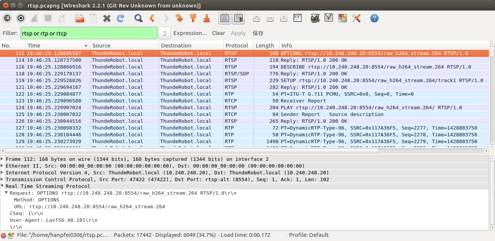
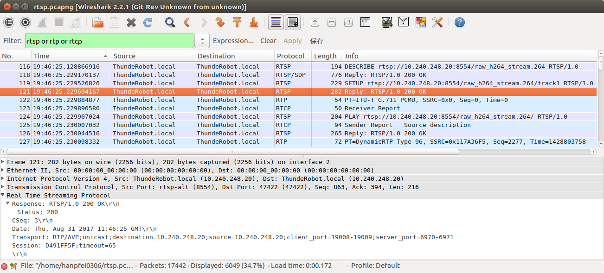
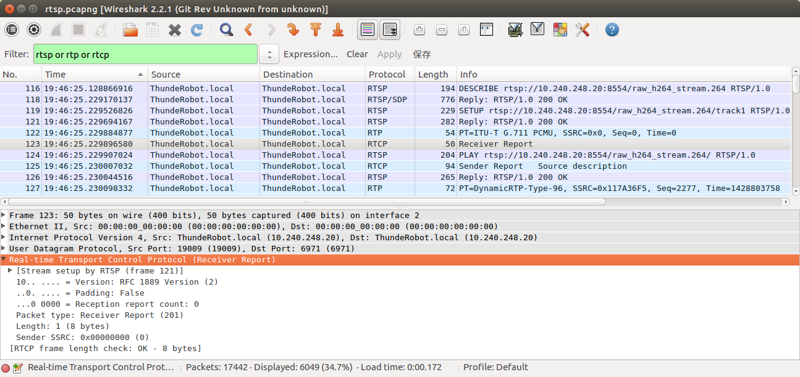
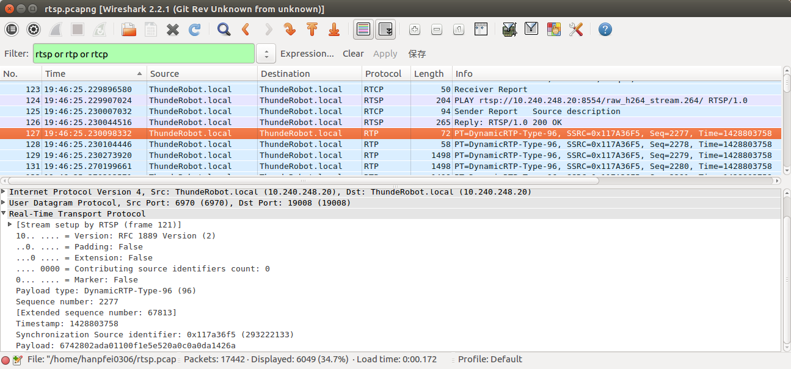
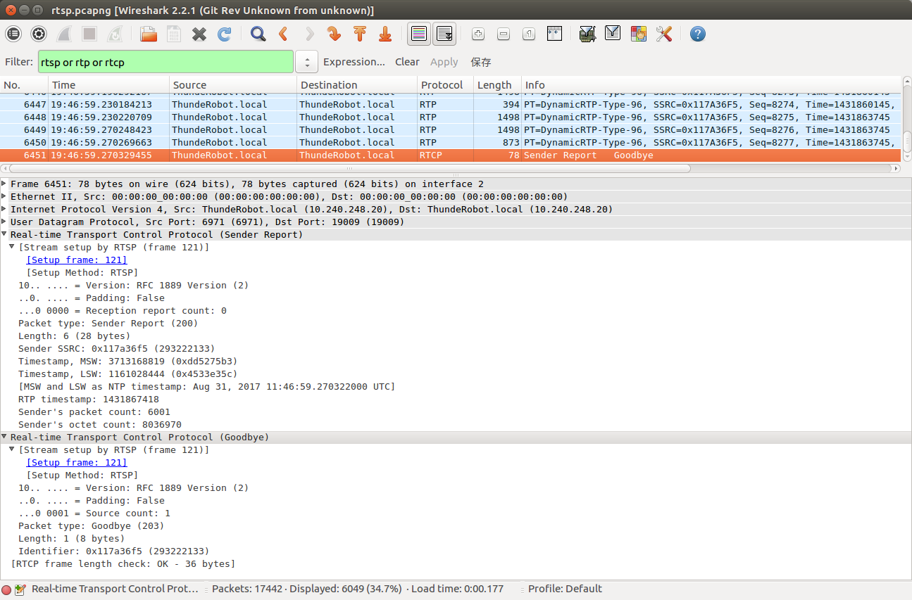

整体而言，RTSP 通常工作于可靠的传输协议 TCP 之上，就像 HTTP 那样，用于发起/结束流媒体传输，交换流媒体元信息。RTP 通常工作于 UDP 之上，用于传输实际的流媒体数据，其中的载荷格式因具体流媒体类型的不同而不同，通常有专门的 RFC 规范对其进行定义，如 H.264 编码格式视频数据的载荷格式在 [RFC 6184, RTP Payload Format for H.264 Video](https://tools.ietf.org/html/rfc6184) 中定义，其它流媒体数据类型有其它的规范进行定义。RTCP 同样通常工作于 UDP 之上，用于对 RTP 进行控制，流媒体数据的收发端在传输过程中相互发送 RTCP 数据包，将自己这一端检测到的 QoS 等信息传递给对方，使用 RTP/RTCP 协议的应用程序，利用这些信息对收发过程进行控制。RTP 和 RTCP 在传输过程中，工作于不同的端口上。
<!--more-->
我们通过 Wireshark 抓包来看一下 RTSP/RTP/RTCP 的基本工作过程。我们启动 `live555MediaServer`，其工作目录下存有一些流媒体文件，其中包括 H.264 原始码流格式的文件 `raw_h264_stream.264`。启动  Wireshark 抓包。然后通过 `ffplay` 请求 `live555MediaServer` 并播放 `raw_h264_stream.264`：
```
$ ffplay rtsp://10.240.248.20:8554/raw_h264_stream.264
```

其中 URI 中的 IP 地址为 `live555MediaServer` 运行的主机的 IP 地址，端口号为其采用的端口号。在 Wireshark 中，通过 `Display Filter` 过滤仅显示 RTSP/RTP/RTCP 包，将看到类似下面这样的包序列：



可以看到，首先是 RTSP 数据的交互，建立媒体传输会话，随后开始通过 RTP/RTCP 传输数据。RTSP 协议在制定时较多地参考了 HTTP/1.1 协议，甚至许多内容与 HTTP/1.1 完全相同。与 HTTP/1.1 类似，RTSP 客户端首先向服务器发送请求，随后服务器发回响应，以此实现数据的交互。RTSP 同样定义了一系列方法，表示对 URI 标识的资源所执行的操作。RTSP 具体定义的方法有如下这些：
```
      method            direction        object     requirement
      DESCRIBE          C->S             P,S        recommended
      ANNOUNCE          C->S, S->C       P,S        optional
      GET_PARAMETER     C->S, S->C       P,S        optional
      OPTIONS           C->S, S->C       P,S        required
                                                    (S->C: optional)
      PAUSE             C->S             P,S        recommended
      PLAY              C->S             P,S        required
      RECORD            C->S             P,S        optional
      REDIRECT          S->C             P,S        optional
      SETUP             C->S             S          required
      SET_PARAMETER     C->S, S->C       P,S        optional
      TEARDOWN          C->S             P,S        required
```

回到 Wireshark 抓的包来看 RTSP/RTP/RTCP 的基本工作过程。

客户端首先向服务器发送了一个方法为 `OPTIONS` 的请求，如第 112 号包，该请求内容如上图所示，携带有 URL，RTSP 版本号，User-Agent 等信息。RTSP 的 `OPTIONS` 与 HTTP/1.1 的对应方法具有相同的语义，具体在 HTTP/1.1 规范 RFC 2616 的 [9.2 节](https://tools.ietf.org/html/rfc2616#section-9.2) 中定义。客户端通过这个方法了解服务器为 URL 提供了哪些方法的支持。

第 112 号包是 RTSP 服务器对客户端的 `OPTIONS` 请求的响应，其具体内容如下：


服务器将该 URL 支持的方法的列表返回给客户端。对于这里的情况，也就是 `OPTIONS, DESCRIBE, SETUP, TEARDOWN, PLAY, PAUSE, GET_PARAMETER, SET_PARAMETER`。

然后客户端向服务器发送了一个 `DESCRIBE` 请求，即第 116 号包，该请求内容如下：


`DESCRIBE` 方法用于客户端提取由所请求的 URL 标识的表示或媒体对象的描述信息。它可以使用 `Accept` 头部指定客户端理解的描述格式。服务器则用所请求的资源的描述作为响应。`DESCRIBE` 应答响应对构成RTSP的媒体初始化阶段。

对于这里的情况，`DESCRIBE` 请求的 `Accept` 头部值为 `application/sdp`，表示客户端希望收到 SDP 格式的媒体表示。

服务器以一个 RTSP/SDP 包作为响应，如图中的第 118 号包：


这个 SDP 包实际内容的文本格式如下：
```
v=0
o=- 1504179985128927 1 IN IP4 10.240.248.20
s=H.264 Video, streamed by the LIVE555 Media Server
i=raw_h264_stream.264
t=0 0
a=tool:LIVE555 Streaming Media v2017.07.18
a=type:broadcast
a=control:*
a=range:npt=0-
a=x-qt-text-nam:H.264 Video, streamed by the LIVE555 Media Server
a=x-qt-text-inf:raw_h264_stream.264
m=video 0 RTP/AVP 96
c=IN IP4 0.0.0.0
b=AS:500
a=rtpmap:96 H264/90000
a=fmtp:96 packetization-mode=1;profile-level-id=42802A;sprop-parameter-sets=Z0KAKtoBEA8eXlIKDAoNoUJq,aM4G4g==
a=control:track1
```

服务器通过 SDP 包，告知流媒体数据传输所用的协议，以及流媒体本身的一些信息，这里所用的协议为 RTP/RTCP。通常的 SDP 文件中，“Media Description” 选项，即以 “m” 开头的那一行中会指定，会指定客户端接收 RTP 包所需要监听的端口，但在这里这个端口为 0。传输中客户端和服务器所选择的用于 RTP/RTCP 包收发的端口将在后面的 RTSP 请求中交换。

客户端在收到服务器发来的 SDP 包之后，会选择两个端口，分别用于 RTP 和 RTCP 包的收发，并发送了一个 `SETUP` 请求用于建立媒体会话，如第 119 号包：


客户通过 `SETUP` 请求的 `Transport` 头部，将为 RTP 和 RTCP 选择的端口、协议及通信方式（UDP 单播还是多播）发送给客户端。这里可以看到，客户端选择了 19008 和 19009 两个端口来进行 RTP 和 RTCP 包的收发。

随后服务器对 `SETUP` 请求做出了响应，如第121 号包：



服务器通过这个响应，把它为媒体会话开启的用于收发 RTP、RTCP 包的端口，会话的标识符，超时时间等信息通知给客户端。随后，客户端分别在 RTP 和 RTCP 的端口上，向服务器的 RTP 和 RTCP 端口上发送了两个包，如第 122 号包和第 123 号包：




这两个包中携带的都是无意义的数据。发送它们的目的，大概主要是为了 NAT 穿墙。

随后客户端向服务器发送了一个 `PLAY` 请求，来启动播放，如第 124 号包：


`PLAY` 请求中会携带从前面的 `SETUP` 请求的响应获得的会话标识符。

随后服务器向客户端发送了一个 RTCP 包，如第 125 号包：


在这个包中，服务器把 RTP 时间戳，服务器的 SSRC，服务器的 CNAME 等信息发送给客户端。之后，服务器发送了 `PLAY` 请求的响应：


在这个包中，发送的 RTP 包的初始序列号，RTP 时间等重要信息被发送给客户端。

至此媒体会话最终建立完成，后面就可以开始通过 RTP 传输视频数据了。请求的 H.264 视频文件的前两个 NALU，即 SPS 和 PPS 如下所示：

```
00000000   00 00 00 01  67 42 80 2A  DA 01 10 0F  1E 5E 52 0A  ....gB.*.....^R.
00000010   0C 0A 0D A1  42 6A 00 00  00 01 68 CE  06 E2
```

开始的两个 RTP 包，即第 127 号包和第 128 号包内容如下：




它们的内容与 H.264 视频文件的前两个 NALU 的内容完全吻合，即 live555 通过两个 RTP 包发送了前两个 NALU SPS 和 PPS。

从 RTSP 的 `OPTIONS` 请求开始，到首个视频数据 NALU 开始发送，经过了总共大概 102 ms 的时间，媒体会话完全建立完成。

视频数据经过一端时间的稳定传输，最终以服务器向客户端发送的一个 RTCP BYE 包而结束，如第 6451 号包：



总结一下这个过程：
1. 客户端首先向服务器发送一个方法为 `OPTIONS` 的请求，了解服务器为 URL 提供了哪些方法的支持。
2. 服务器将该 URL 支持的方法的列表返回给客户端。
3. 客户端向服务器发送了一个 `DESCRIBE` 请求，提取由所请求的 URL 标识的表示或媒体对象的描述信息。
4. 服务器通过 SDP 包，告知流媒体数据传输所用的协议，以及流媒体本身的一些信息。
5. 客户端在收到服务器发来的 SDP 包之后，会选择两个端口，分别用于 RTP 和 RTCP 包的收发，并发送了一个 `SETUP` 请求用于建立媒体会话。
6. 服务器发回 `SETUP` 响应，把它为媒体会话开启的用于收发 RTP、RTCP 包的端口，会话的标识符，超时时间等信息通知给客户端。
7. 客户端分别在 RTP 和 RTCP 的端口上，向服务器的 RTP 和 RTCP 端口上发送了两个包。
8. 客户端向服务器发送一个 `PLAY` 请求，来启动播放。
9. 服务器向客户端发送一个 RTCP 包，把 RTP 时间戳，服务器的 SSRC，服务器的 CNAME 等信息发送给客户端。
10. 服务器发送 `PLAY` 请求的响应，其中包含 RTP 包的初始序列号，RTP 时间等重要信息。至此媒体会话最终建立完成。
11. 通过 RTP/RTCP 发送流媒体数据。
12. 服务器向客户端发送一个 RTCP BYE 包结束会话。

### [打赏](https://www.wolfcstech.com/about/donate.html)

Done.

# live555 源码分析系列文章
[live555 源码分析：简介](https://www.wolfcstech.com/2017/08/28/live555_src_analysis_introduction/)
[live555 源码分析：基础设施](https://www.wolfcstech.com/2017/08/30/live555_src_analysis_infrasture/)
[live555 源码分析：MediaSever](https://www.wolfcstech.com/2017/08/31/live555_src_analysis_mediaserver/)
[Wireshark 抓包分析 RTSP/RTP/RTCP 基本工作过程](https://www.wolfcstech.com/2017/09/01/live555_src_analysis_rtsp_rtp_rtcp_wireshark/)
[live555 源码分析：RTSPServer](https://www.wolfcstech.com/2017/09/03/live555_src_analysis_rtspserver/)
[live555 源码分析：DESCRIBE 的处理](https://www.wolfcstech.com/2017/09/04/live555_src_analysis_describe/)
[live555 源码分析：SETUP 的处理](https://www.wolfcstech.com/2017/09/05/live555_src_analysis_setup/)
[live555 源码分析：PLAY 的处理](https://www.wolfcstech.com/2017/09/05/live555_src_analysis_play/)
[live555 源码分析：RTSPServer 组件结构](https://www.wolfcstech.com/2017/09/06/live555_src_analysis_rtspserver_arch/)
[live555 源码分析：ServerMediaSession](https://www.wolfcstech.com/2017/09/07/live555_src_analysis_servermediasession/)
[live555 源码分析：子会话 SDP 行生成](https://www.wolfcstech.com/2017/09/07/live555_src_analysis_subsession_sdp/)
[live555 源码分析：子会话 SETUP](https://www.wolfcstech.com/2017/09/08/live555_src_analysis_subsession_setup/)
[live555 源码分析：播放启动](https://www.wolfcstech.com/2017/09/08/live555_src_analysis_start_streaming/)
