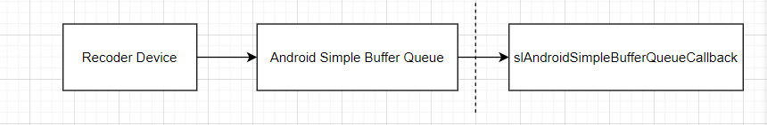
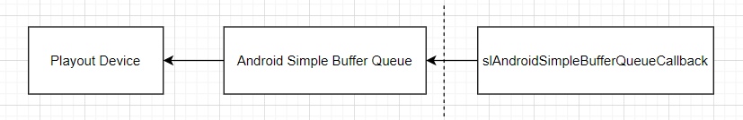
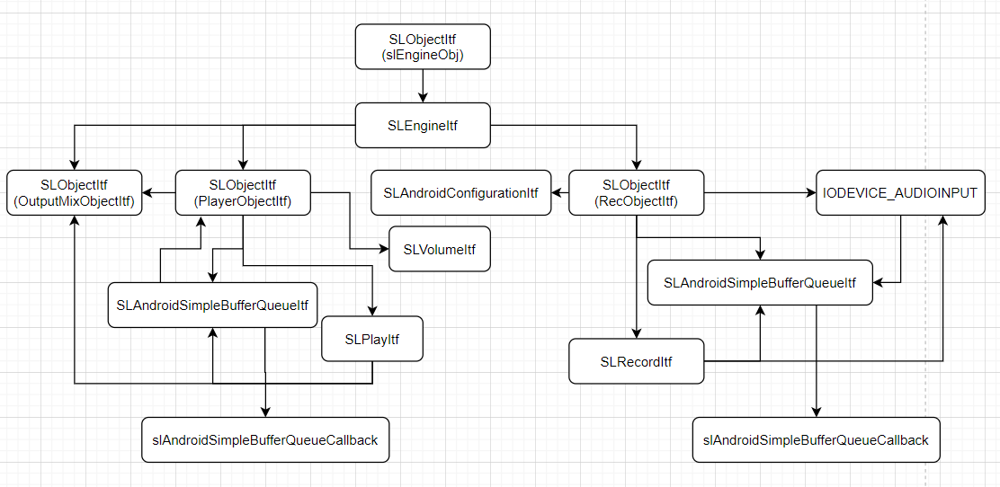

OpenSL ES 是 [Khronos Group](https://www.khronos.org/) 为嵌入式系统开发的调优的免版权费、跨平台、硬件加速的音频 API 规范。Android 提供了这一 API 规范的 Android 专有实现，并允许应用程序通过 NDK 调用这些 API。Android 应用可以借助这一 API，使用 C 或 C++ 实现高性能、低延迟的音频。OpenSL ES™ 标准与 Android Java 框架中的 [MediaPlayer](https://developer.android.google.cn/reference/android/media/MediaPlayer) 和 [MediaRecorder](https://developer.android.google.cn/reference/android/media/MediaRecorder)API 提供类似的音频功能。OpenSL ES 提供 C 语言接口和 C++ 绑定，使我们可以从使用任意一种语言编写的代码中调用 API。

<!--more-->

## OpenSL ES 的使用

与在 Android 应用中使用其它的第三方 C/C++ 库类似，我们需要把 OpenSL ES 添加进我们的应用中，并编写调用 OpenSL ES API 的代码。把 OpenSL ES 添加进我们的应用，具体而言指添加相关的头文件，并配置我们的动态链接库的编译选项以正确的链接 OpenSL ES 库。

标准的核心 OpenSL ES 头文件有 <SLES/OpenSLES.h> 和 <SLES/OpenSLES_Platform.h>，而 <SLES/OpenSLES_Android.h> 和 <SLES/OpenSLES_AndroidConfiguration.h> 中则提供了其他 Android 专用功能。

添加核心 OpenSL ES 功能集的话，包含 `<SLES/OpenSLES.h>` 头文件即可，这个头文件包含了 `<SLES/OpenSLES_Platform.h>`。添加 OpenSL ES [Android 扩展](https://developer.android.google.cn/ndk/guides/audio/opensl/android-extensions)，则可以添加 `<SLES/OpenSLES_Android.h>` 头文件，这个头文件包含如下两个头文件：
```
#include <SLES/OpenSLES_AndroidConfiguration.h>
#include <SLES/OpenSLES_AndroidMetadata.h>
```

配置编译选项引入 OpenSL ES 库使得链接器能够正确链接这个库的方法，因我们使用的编译配置系统的不同而不同。如果我们使用 `Android.mk` 配置编译，需要为 [`Android.mk`](https://developer.android.google.cn/ndk/guides/android_mk)
 文件添加如下行：
```
LOCAL_LDLIBS += -lOpenSLES
```

如果使用 CMake 的话，`target_link_libraries` 需要加上 `OpenSLES`，如：
```
target_link_libraries(echo
  PRIVATE
    OpenSLES )
```

Google 的 android [`ndk-samples`](https://github.com/android/ndk-samples) 中有许多 NDK 相关的示例代码，其中包含有 OpenSL ES 相关的示例代码 [audio-echo](https://github.com/googlesamples/android-ndk/tree/master/audio-echo) 和 [native-audio](https://github.com/googlesamples/android-ndk/tree/master/native-audio)。

这里通过一段基于 [audio-echo](https://github.com/googlesamples/android-ndk/tree/master/audio-echo) 的实现了 Android 平台的耳返功能的代码看一下 OpenSL ES API 的基本使用方法。在这段示例代码中，启动声音录制设备录制声音，录得的声音数据被放进一个中间缓冲区，中间缓冲区中的数据随后又被送进播放设备播放出来。

OpenSL ES 是一套 C 的面向对象 API，它的基本使用方法如下：

1. 创建 Engine 对象

```
  result = slCreateEngine(&engine.slEngineObj_, 0, NULL, 0, NULL, NULL);
  SLASSERT(result);

  result =
          (*engine.slEngineObj_)->Realize(engine.slEngineObj_, SL_BOOLEAN_FALSE);
  SLASSERT(result);

  result = (*engine.slEngineObj_)
          ->GetInterface(engine.slEngineObj_, SL_IID_ENGINE,
                         &engine.slEngineItf_);
  SLASSERT(result);
```

先由 OpenSL ES API 的入口函数 `slCreateEngine()` 创建类型为 `SLObjectItf` 的 `slEngineObj_`，然后借助于 `slEngineObj_` 获得类型为 `SLEngineItf` 的 Engine 对象 `slEngineItf_`。

2. 创建 Recorder

```
AudioRecorder::AudioRecorder(SampleFormat *sampleFormat, SLEngineItf slEngine)
    : freeQueue_(nullptr),
      recQueue_(nullptr),
      devShadowQueue_(nullptr),
      callback_(nullptr) {
  SLresult result;
  sampleInfo_ = *sampleFormat;
  SLAndroidDataFormat_PCM_EX format_pcm;
  ConvertToSLSampleFormat(&format_pcm, &sampleInfo_);

  // configure src.audio source
  SLDataLocator_IODevice loc_dev = {SL_DATALOCATOR_IODEVICE,
                                    SL_IODEVICE_AUDIOINPUT,
                                    SL_DEFAULTDEVICEID_AUDIOINPUT, NULL};
  SLDataSource audioSrc = {&loc_dev, NULL};

  // configure src.audio sink
  SLDataLocator_AndroidSimpleBufferQueue loc_bq = {
      SL_DATALOCATOR_ANDROIDSIMPLEBUFFERQUEUE, DEVICE_SHADOW_BUFFER_QUEUE_LEN};

  SLDataSink audioSnk = {&loc_bq, &format_pcm};

  // create src.audio recorder
  // (requires the RECORD_AUDIO permission)
  const SLInterfaceID id[2] = {SL_IID_ANDROIDSIMPLEBUFFERQUEUE,
                               SL_IID_ANDROIDCONFIGURATION};
  const SLboolean req[2] = {SL_BOOLEAN_TRUE, SL_BOOLEAN_TRUE};
  result = (*slEngine)->CreateAudioRecorder(
      slEngine, &recObjectItf_, &audioSrc, &audioSnk,
      sizeof(id) / sizeof(id[0]), id, req);
  SLASSERT(result);

  // Configure the voice recognition preset which has no
  // signal processing for lower latency.
  SLAndroidConfigurationItf inputConfig;
  result = (*recObjectItf_)
               ->GetInterface(recObjectItf_, SL_IID_ANDROIDCONFIGURATION,
                              &inputConfig);
  if (SL_RESULT_SUCCESS == result) {
    SLuint32 presetValue = SL_ANDROID_RECORDING_PRESET_VOICE_RECOGNITION;
    (*inputConfig)
        ->SetConfiguration(inputConfig, SL_ANDROID_KEY_RECORDING_PRESET,
                           &presetValue, sizeof(SLuint32));
  }
  result = (*recObjectItf_)->Realize(recObjectItf_, SL_BOOLEAN_FALSE);
  SLASSERT(result);
  result =
      (*recObjectItf_)->GetInterface(recObjectItf_, SL_IID_RECORD, &recItf_);
  SLASSERT(result);

  result = (*recObjectItf_)
               ->GetInterface(recObjectItf_, SL_IID_ANDROIDSIMPLEBUFFERQUEUE,
                              &recBufQueueItf_);
  SLASSERT(result);

  result = (*recBufQueueItf_)
               ->RegisterCallback(recBufQueueItf_, bqRecorderCallback, this);
  SLASSERT(result);

  devShadowQueue_ = new AudioQueue(DEVICE_SHADOW_BUFFER_QUEUE_LEN);
  assert(devShadowQueue_);
#ifdef ENABLE_LOG
  std::string name = "rec";
  recLog_ = new AndroidLog(name);
#endif
}
```

创建 Recorder 的过程如下：

 - 1. 为 Recorder  定义流水线，即音频数据流动的方式 Audio Sink 和 Audio Source。
 - 2. 通过 `SLEngineItf` 的 `CreateAudioRecorder()` 接口创建类型为 `SLObjectItf` 的 Recorder 对象。
 - 3. 配置 Recorder。
 - 4. 获得类型为 `SLRecordItf` 的 `recItf_`。

上面这段代码创建的 recording pipeline 大体如下：



配置 OpenSL ES recorder 从录音设备拿到音频数据，放入缓冲区，这些数据再由缓冲区对象通过回调传给外界。Android OpenSL ES 中用 `SLAndroidSimpleBufferQueueItf` 对象描述缓冲区，这个缓冲区本身不包含用于存放音频数据的内存，而是需要外部分配内存，并将分配好的内存给到缓冲区对象。

3. 启动和停止 Recorder

上个步骤创建的类型为 `SLRecordItf` 的 `recItf_` 对象用于控制 recorder 的状态，包括 recorder 的启动和停止：
```
SLboolean AudioRecorder::Start(void) {
  if (!freeQueue_ || !recQueue_ || !devShadowQueue_) {
    LOGE("====NULL poiter to Start(%p, %p, %p)", freeQueue_, recQueue_,
         devShadowQueue_);
    return SL_BOOLEAN_FALSE;
  }
  audioBufCount = 0;

  SLresult result;
  // in case already recording, stop recording and clear buffer queue
  result = (*recItf_)->SetRecordState(recItf_, SL_RECORDSTATE_STOPPED);
  SLASSERT(result);
  result = (*recBufQueueItf_)->Clear(recBufQueueItf_);
  SLASSERT(result);

  for (int i = 0; i < RECORD_DEVICE_KICKSTART_BUF_COUNT; i++) {
    sample_buf *buf = NULL;
    if (!freeQueue_->front(&buf)) {
      LOGE("=====OutOfFreeBuffers @ startingRecording @ (%d)", i);
      break;
    }
    freeQueue_->pop();
    assert(buf->buf_ && buf->cap_ && !buf->size_);

    result = (*recBufQueueItf_)->Enqueue(recBufQueueItf_, buf->buf_, buf->cap_);
    SLASSERT(result);
    devShadowQueue_->push(buf);
  }

  result = (*recItf_)->SetRecordState(recItf_, SL_RECORDSTATE_RECORDING);
  SLASSERT(result);

  return (result == SL_RESULT_SUCCESS ? SL_BOOLEAN_TRUE : SL_BOOLEAN_FALSE);
}

SLboolean AudioRecorder::Stop(void) {
  // in case already recording, stop recording and clear buffer queue
  SLuint32 curState;

  SLresult result = (*recItf_)->GetRecordState(recItf_, &curState);
  SLASSERT(result);
  if (curState == SL_RECORDSTATE_STOPPED) {
    return SL_BOOLEAN_TRUE;
  }
  result = (*recItf_)->SetRecordState(recItf_, SL_RECORDSTATE_STOPPED);
  SLASSERT(result);
  result = (*recBufQueueItf_)->Clear(recBufQueueItf_);
  SLASSERT(result);

#ifdef ENABLE_LOG
  recLog_->flush();
#endif

  return SL_BOOLEAN_TRUE;
}
```

OpenSL ES 没有为启动和停止 recorder 创建专门的接口，而是通过修改 recorder 的状态的接口实现的。

4. 处理录制数据

可以给 `SLAndroidSimpleBufferQueueItf` 对象配置多块分配好的内存缓冲区，当一块缓冲区中填满了录制数据时，注册的回调被调用。当回调被调用时，可以这样来处理数据：
```
void bqRecorderCallback(SLAndroidSimpleBufferQueueItf bq, void *rec) {
  (static_cast<AudioRecorder *>(rec))->ProcessSLCallback(bq);
}

void AudioRecorder::ProcessSLCallback(SLAndroidSimpleBufferQueueItf bq) {
#ifdef ENABLE_LOG
  recLog_->logTime();
#endif
  assert(bq == recBufQueueItf_);
  sample_buf *dataBuf = NULL;
  devShadowQueue_->front(&dataBuf);
  devShadowQueue_->pop();
  dataBuf->size_ = dataBuf->cap_;  // device only calls us when it is really
                                   // full

  callback_(ctx_, ENGINE_SERVICE_MSG_RECORDED_AUDIO_AVAILABLE, dataBuf);
  recQueue_->push(dataBuf);

  sample_buf *freeBuf;
  while (freeQueue_->front(&freeBuf) && devShadowQueue_->push(freeBuf)) {
    freeQueue_->pop();
    SLresult result = (*bq)->Enqueue(bq, freeBuf->buf_, freeBuf->cap_);
    SLASSERT(result);
  }

  ++audioBufCount;

  // should leave the device to sleep to save power if no buffers
  if (devShadowQueue_->size() == 0) {
    LOGI("devShadowQueue size is 0, stop recording");
    (*recItf_)->SetRecordState(recItf_, SL_RECORDSTATE_STOPPED);
  }
}
```

由于 OpenSL ES 总是在缓冲区满时调用回调，则配置的缓冲区大小对录制的延迟及回调调用的间隔有着重大影响。

5. 销毁 Recorder

录制结束时，销毁 recorder：
```
AudioRecorder::~AudioRecorder() {
  // destroy src.audio recorder object, and invalidate all associated interfaces
  if (recObjectItf_ != NULL) {
    (*recObjectItf_)->Destroy(recObjectItf_);
  }

  if (devShadowQueue_) {
    sample_buf *buf = NULL;
    while (devShadowQueue_->front(&buf)) {
      devShadowQueue_->pop();
      freeQueue_->push(buf);
    }
    delete (devShadowQueue_);
  }
#ifdef ENABLE_LOG
  if (recLog_) {
    delete recLog_;
  }
#endif
}
```

6. 创建 Player

```
AudioPlayer::AudioPlayer(SampleFormat *sampleFormat, SLEngineItf slEngine)
    : freeQueue_(nullptr),
      playQueue_(nullptr),
      devShadowQueue_(nullptr),
      callback_(nullptr) {
  SLresult result;
  assert(sampleFormat);
  sampleInfo_ = *sampleFormat;

  result = (*slEngine)
               ->CreateOutputMix(slEngine, &outputMixObjectItf_, 0, NULL, NULL);
  SLASSERT(result);

  // realize the output mix
  result =
      (*outputMixObjectItf_)->Realize(outputMixObjectItf_, SL_BOOLEAN_FALSE);
  SLASSERT(result);

  // configure src.audio source
  SLDataLocator_AndroidSimpleBufferQueue loc_bufq = {
      SL_DATALOCATOR_ANDROIDSIMPLEBUFFERQUEUE, DEVICE_SHADOW_BUFFER_QUEUE_LEN};

  SLAndroidDataFormat_PCM_EX format_pcm;
  ConvertToSLSampleFormat(&format_pcm, &sampleInfo_);
  SLDataSource audioSrc = {&loc_bufq, &format_pcm};

  // configure src.audio sink
  SLDataLocator_OutputMix loc_outmix = {SL_DATALOCATOR_OUTPUTMIX,
                                        outputMixObjectItf_};
  SLDataSink audioSnk = {&loc_outmix, NULL};
  /*
   * create fast path src.audio player: SL_IID_BUFFERQUEUE and SL_IID_VOLUME
   * and other non-signal processing interfaces are ok.
   */
  SLInterfaceID ids[2] = {SL_IID_BUFFERQUEUE, SL_IID_VOLUME};
  SLboolean req[2] = {SL_BOOLEAN_TRUE, SL_BOOLEAN_TRUE};
  result = (*slEngine)->CreateAudioPlayer(
      slEngine, &playerObjectItf_, &audioSrc, &audioSnk,
      sizeof(ids) / sizeof(ids[0]), ids, req);
  SLASSERT(result);

  // realize the player
  result = (*playerObjectItf_)->Realize(playerObjectItf_, SL_BOOLEAN_FALSE);
  SLASSERT(result);

  // get the play interface
  result = (*playerObjectItf_)
               ->GetInterface(playerObjectItf_, SL_IID_PLAY, &playItf_);
  SLASSERT(result);

  // get the buffer queue interface
  result = (*playerObjectItf_)
               ->GetInterface(playerObjectItf_, SL_IID_BUFFERQUEUE,
                              &playBufferQueueItf_);
  SLASSERT(result);

  // register callback on the buffer queue
  result = (*playBufferQueueItf_)
               ->RegisterCallback(playBufferQueueItf_, bqPlayerCallback, this);
  SLASSERT(result);

  result = (*playItf_)->SetPlayState(playItf_, SL_PLAYSTATE_STOPPED);
  SLASSERT(result);

  // create an empty queue to track deviceQueue
  devShadowQueue_ = new AudioQueue(DEVICE_SHADOW_BUFFER_QUEUE_LEN);
  assert(devShadowQueue_);

  silentBuf_.cap_ = (format_pcm.containerSize >> 3) * format_pcm.numChannels *
                    sampleInfo_.framesPerBuf_;
  silentBuf_.buf_ = new uint8_t[silentBuf_.cap_];
  memset(silentBuf_.buf_, 0, silentBuf_.cap_);
  silentBuf_.size_ = silentBuf_.cap_;

#ifdef ENABLE_LOG
  std::string name = "play";
  logFile_ = new AndroidLog(name);
#endif
}
```

创建 Player 的过程与创建 Recorder 的过程类似，同样要定义流水线，只是流水线的样子有差别。Player 的流水线如下面这样：



这个过程最终获得类型为 `SLPlayItf` 的 `playItf_` 来控制播放。

7. 播放的启动和停止

```
SLresult AudioPlayer::Start(void) {
  SLuint32 state;
  SLresult result = (*playItf_)->GetPlayState(playItf_, &state);
  if (result != SL_RESULT_SUCCESS) {
    return SL_BOOLEAN_FALSE;
  }
  if (state == SL_PLAYSTATE_PLAYING) {
    return SL_BOOLEAN_TRUE;
  }

  result = (*playItf_)->SetPlayState(playItf_, SL_PLAYSTATE_STOPPED);
  SLASSERT(result);

  result =
      (*playBufferQueueItf_)
          ->Enqueue(playBufferQueueItf_, silentBuf_.buf_, silentBuf_.size_);
  SLASSERT(result);
  devShadowQueue_->push(&silentBuf_);

  result = (*playItf_)->SetPlayState(playItf_, SL_PLAYSTATE_PLAYING);
  SLASSERT(result);
  return SL_BOOLEAN_TRUE;
}

void AudioPlayer::Stop(void) {
  SLuint32 state;

  SLresult result = (*playItf_)->GetPlayState(playItf_, &state);
  SLASSERT(result);

  if (state == SL_PLAYSTATE_STOPPED) return;

  std::lock_guard<std::mutex> lock(stopMutex_);

  result = (*playItf_)->SetPlayState(playItf_, SL_PLAYSTATE_STOPPED);
  SLASSERT(result);
  (*playBufferQueueItf_)->Clear(playBufferQueueItf_);

#ifdef ENABLE_LOG
  if (logFile_) {
    delete logFile_;
    logFile_ = nullptr;
  }
#endif
}
```

这个过程同样与 recorder 的对应过程类似，通过改变状态来控制播放的启动与停止。

8. 播放回调的处理

```
void bqPlayerCallback(SLAndroidSimpleBufferQueueItf bq, void *ctx) {
  (static_cast<AudioPlayer *>(ctx))->ProcessSLCallback(bq);
}
void AudioPlayer::ProcessSLCallback(SLAndroidSimpleBufferQueueItf bq) {
  LOGI("AudioPlayer::ProcessSLCallback");
#ifdef ENABLE_LOG
  logFile_->logTime();
#endif
  std::lock_guard<std::mutex> lock(stopMutex_);

  // retrieve the finished device buf and put onto the free queue
  // so recorder could re-use it
  sample_buf *buf;
  if (!devShadowQueue_->front(&buf)) {
    /*
     * This should not happen: we got a callback,
     * but we have no buffer in deviceShadowedQueue
     * we lost buffers this way...(ERROR)
     */
    if (callback_) {
      uint32_t count;
      callback_(ctx_, ENGINE_SERVICE_MSG_RETRIEVE_DUMP_BUFS, &count);
    }
    return;
  }
  devShadowQueue_->pop();

  if (buf != &silentBuf_) {
    buf->size_ = 0;
    freeQueue_->push(buf);

    if (!playQueue_->front(&buf)) {
#ifdef ENABLE_LOG
      logFile_->log("%s", "====Warning: running out of the Audio buffers");
#endif
      return;
    }

    devShadowQueue_->push(buf);
    (*bq)->Enqueue(bq, buf->buf_, buf->size_);
    playQueue_->pop();
    return;
  }

  if (playQueue_->size() < PLAY_KICKSTART_BUFFER_COUNT) {
    (*bq)->Enqueue(bq, buf->buf_, buf->size_);
    devShadowQueue_->push(&silentBuf_);
    return;
  }

  assert(PLAY_KICKSTART_BUFFER_COUNT <=
         (DEVICE_SHADOW_BUFFER_QUEUE_LEN - devShadowQueue_->size()));
  for (int32_t idx = 0; idx < PLAY_KICKSTART_BUFFER_COUNT; idx++) {
    playQueue_->front(&buf);
    playQueue_->pop();
    devShadowQueue_->push(buf);
    (*bq)->Enqueue(bq, buf->buf_, buf->size_);
  }
}
```

在录制回调中，将录制的数据传给外界，在播放的回调中，则将外部数据拷贝给 OpenSL ES 使用。

9. 销毁 Player

```
AudioPlayer::~AudioPlayer() {
  std::lock_guard<std::mutex> lock(stopMutex_);

  // destroy buffer queue src.audio player object, and invalidate all associated
  // interfaces
  if (playerObjectItf_ != NULL) {
    (*playerObjectItf_)->Destroy(playerObjectItf_);
  }
  // Consume all non-completed src.audio buffers
  sample_buf *buf = NULL;
  while (devShadowQueue_->front(&buf)) {
    buf->size_ = 0;
    devShadowQueue_->pop();
    if(buf != &silentBuf_) {
      freeQueue_->push(buf);
    }
  }
  delete devShadowQueue_;

  while (playQueue_->front(&buf)) {
    buf->size_ = 0;
    playQueue_->pop();
    freeQueue_->push(buf);
  }

  // destroy output mix object, and invalidate all associated interfaces
  if (outputMixObjectItf_) {
    (*outputMixObjectItf_)->Destroy(outputMixObjectItf_);
  }

  delete[] silentBuf_.buf_;
}
```

播放结束之后，需要销毁相关的对象。

10. 销毁 engine

```
JNIEXPORT void JNICALL MainActivity_deleteSLEngine(
        JNIEnv *env, jclass type) {
  LOGI("MainActivity_deleteSLEngine");
  delete engine.recBufQueue_;
  delete engine.freeBufQueue_;
  releaseSampleBufs(engine.bufs_, engine.bufCount_);
  if (engine.slEngineObj_ != NULL) {
    (*engine.slEngineObj_)->Destroy(engine.slEngineObj_);
    engine.slEngineObj_ = NULL;
    engine.slEngineItf_ = NULL;
  }

  if (engine.delayEffect_) {
    delete engine.delayEffect_;
    engine.delayEffect_ = nullptr;
  }
}
```

## OpenSL ES 的主要对象结构

OpenSL ES 的对象可以大体总结如下：



上面的示例代码只是展示了 OpenSL ES 可以搭建的一种流水线，对于 OpenSL ES API 的其它使用方式可以参考官方的文档。

参考文档：

[OpenSL ES](https://developer.android.google.cn/ndk/guides/audio/opensl)
[OpenSL ES 使用入门](https://developer.android.google.cn/ndk/guides/audio/opensl/getting-started)
[OpenSL ES for Android](https://developer.android.google.cn/ndk/guides/audio/opensl/opensl-for-android)
[OpenSL ES Android 扩展](https://developer.android.google.cn/ndk/guides/audio/opensl/android-extensions)
[OpenSL ES 编程说明](https://developer.android.google.cn/ndk/guides/audio/opensl/opensl-prog-notes)
