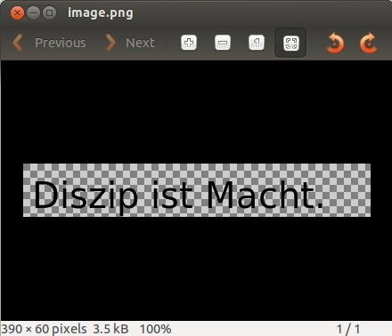
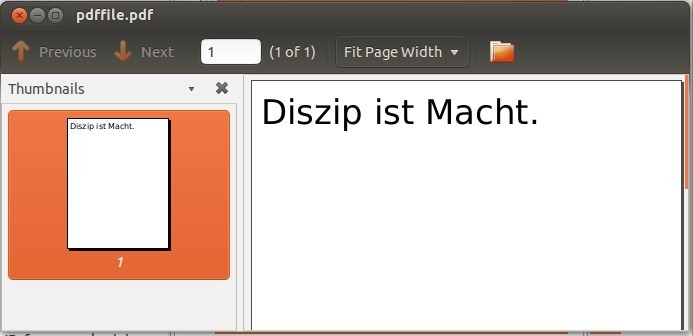
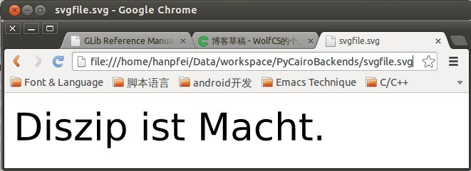
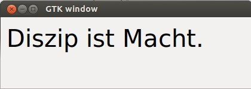

PyCairo 支持多种不同的后端。后端是可以显示 PyCairo 产生的图形的地方。我们将使用 PyCairo 创建一幅 PNG 图像，一个 PDF 文件，一个 SVG 文件，并在一个 GTK 窗口中绘制图形。
<!--more-->
# PNG 图像

在第一个例子中，我们将创建一幅 PNG 图像。
```
#!/usr/bin/python
'''
ZetCode PyCairo tutorial

This program uses PyCairo to 
produce a PNG image.

author: Jan Bodnar
website: zetcode.com
last edited: August 2012
'''

import cairo

def main():
    ims = cairo.ImageSurface(cairo.FORMAT_ARGB32, 390, 60)
    cr = cairo.Context(ims)
    
    cr.set_source_rgb(0, 0, 0)
    cr.select_font_face("Sans", cairo.FONT_SLANT_NORMAL, cairo.FONT_WEIGHT_NORMAL)
    cr.set_font_size(40)
    
    cr.move_to(10, 50)
    cr.show_text("Diszip ist Macht.")
    
    ims.write_to_png("image.png")
    
if __name__ == "__main__":
    main()
```
这是一个创建 PNG 图像的终端命令行小应用程序。

```
import cairo
```
我们导入 PyCairo 模块。

```
    ims = cairo.ImageSurface(cairo.FORMAT_ARGB32, 390, 60)
    cr = cairo.Context(ims)
```
我们创建一个 surface，并由这个 surface 创建一个 Cairo 上下文。这个 surface 是一幅390x60 px 的图像。

```
    cr.set_source_rgb(0, 0, 0)
```
我们用黑色墨水来绘制我们的文字。

```
    cr.select_font_face("Sans", cairo.FONT_SLANT_NORMAL, cairo.FONT_WEIGHT_NORMAL)
    cr.set_font_size(40)
```
我们选择一种字体类型并设置它的大小。

```
    cr.move_to(10, 50)
    cr.show_text("Diszip ist Macht.")
```
我们移动到图像的 x=10.0，y=50.0 的位置，并绘制文字。

```
    ims.write_to_png("image.png")
```
`write_to_png()` 方法把 surface 的内容写入 PNG 图像。



图：Image Viewer 中的 PNG 图像

# PDF 文件

在第二个例子中，我们创建一个简单的 PDF 文件。
```
#!/usr/bin/python
'''
ZetCode PyCairo tutorial

This program uses PyCairo to 
produce a PDF image.

author: Jan Bodnar
website: zetcode.com
last edited: August 2012
'''

import cairo

def main():
    ps = cairo.PDFSurface("pdffile.pdf", 504, 648);
    cr = cairo.Context(ps)
    
    cr.set_source_rgb(0, 0, 0)
    cr.select_font_face("Sans", cairo.FONT_SLANT_NORMAL, cairo.FONT_WEIGHT_NORMAL)
    cr.set_font_size(40)
    
    cr.move_to(10, 50)
    cr.show_text("Diszip ist Macht.")
    cr.show_page()
    
if __name__ == "__main__":
    main()
```

我们必须在 PDF 查看器中打开 PDF 文件。Linux 用户可以使用 KPDF 或者 Evince 查看器。

```
    ps = cairo.PDFSurface("pdffile.pdf", 504, 648);
```

为了渲染一个 PDF 文件，我们必须使用 `cairo.PDFSurface` 对象创建一个 PDF surface。PDF 文件的大小以点为单位，这是排版的标准。

```
    cr.show_page()
```
`show_page()` 结束 PDF 文件的渲染。


图：文档查看器中的 PDF 文件

# SVG 文件

在下一个例子中创建一个简单的 SVG (Scalable Vector Graphics) 文件。SVG 文件是一种基于 XML 的文件格式。
```
#!/usr/bin/python
'''
ZetCode PyCairo tutorial

This program uses PyCairo to 
produce a SVG image.

author: Jan Bodnar
website: zetcode.com
last edited: August 2012
'''

import cairo

def main():
    ps = cairo.SVGSurface("svgfile.svg", 390, 60);
    cr = cairo.Context(ps)
    
    cr.set_source_rgb(0, 0, 0)
    cr.select_font_face("Sans", cairo.FONT_SLANT_NORMAL, cairo.FONT_WEIGHT_NORMAL)
    cr.set_font_size(40)
    
    cr.move_to(10, 50)
    cr.show_text("Diszip ist Macht.")
    cr.show_page()
    
if __name__ == "__main__":
    main()
```

我们可以使用浏览器，比如 Google Chrome 或者向量绘图程序，比如 Inkscape 打开 SVG 文件。

```
    ps = cairo.SVGSurface("svgfile.svg", 390, 60);
```

要在 PyCairo 中创建一个 SVG 文件，我们必须使用 `cairo.SVGSurface` 对象创建一个 SVG surface。


图： Chrome 中的 SVG 文件

# GTK窗口

在最后一个例子中，我们在 GTK 窗口中绘制。这个后端也将用于本指南后面的所有例子中。
```
#!/usr/bin/python
'''
ZetCode PyCairo tutorial

This program uses PyCairo to 
draw on a window in GTK.

author: wolf-cs
website: http://my.oschina.net/wolfcs/blog
last edited: May 2013
'''

import gtk
import cairo

class Example(gtk.Window):
    def __init__(self):
        super(Example, self).__init__()
        self.init_ui()
        print "Example: " + str(self)
        
    def init_ui(self):
        darea = gtk.DrawingArea()
        darea.connect("expose_event", self.expose)
        self.add(darea)

        self.set_title("GTK window")
        self.resize(420, 120)
        self.set_position(gtk.WIN_POS_CENTER)
        
        self.connect("delete-event", gtk.main_quit)
        self.show_all()
        
    def expose(self, widget, event):
        self.context = widget.window.cairo_create()
        self.on_draw(420, self.context)
        print "expose: " + str(widget)
        
    def on_draw(self, wid, cr):
        cr.set_source_rgb(0, 0, 0)
        cr.select_font_face("Sans", cairo.FONT_SLANT_NORMAL, cairo.FONT_WEIGHT_NORMAL)
        cr.set_font_size(40)
    
        cr.move_to(10, 50)
        cr.show_text("Diszip ist Macht.")
        
def main():
    window = Example()

    gtk.main()
        
if __name__ == "__main__":
    main()
```

这个例子弹出一个位于屏幕中间的 GTK 窗口，其中绘制了文字 “Disziplin ist Macht”。

```
import gtk
import cairo
```
我们导入需要的 PyCairo 和 GTK 模块。

```
        darea = gtk.DrawingArea()
```
我们将在一个 `gtk.DrawingArea` 控件上进行绘制。

```
        darea.connect("expose_event", self.expose)
```
当窗口被重绘时，会发射一个 `expose_event` 信号。我们将该信号连接到 `expose()` 回调函数。

```
    def expose(self, widget, event):
        . . . . . .
```
在 `expose()` 回调中，我们创建 Cairo 上下文。然后，绘制的动作在 `on_draw()` 方法的内部完成。第三个参数是 Cairo 上下文，由 `expose()` 创建。Cairo 库是 GTK 系统内建的。


图: GTK 窗口

在本章中，我们已经覆盖了 PyCairo 支持的所有后端。

[原文](http://zetcode.com/gfx/pycairo/backends/)

Done.
