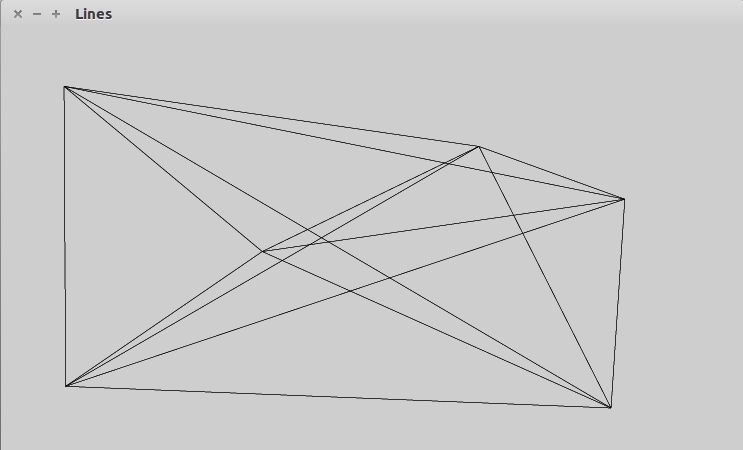
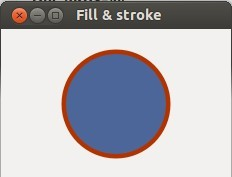
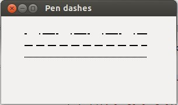
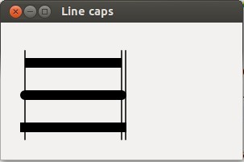
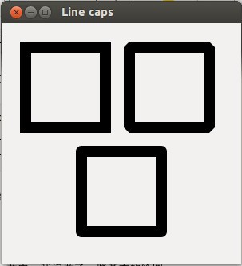
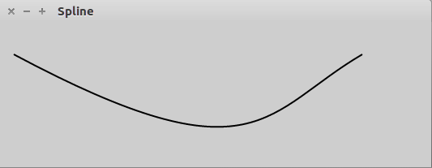

PyCairo 教程的这个部分，我们绘制一些基本的元素。我们将使用填充和 stroke 操作，长划，线帽和线连接。
<!--more-->
# 直线

直线是非常基本的向量对象。为了绘制一条直线，我们使用两个方法调用。起始点通过 `move_to()` 调用指定。线的终点通过 `line_to()` 调用指定。
```
#!/usr/bin/python

'''
ZetCode PyCairo tutorial

In this program, we connect all mouse
clicks with a line.

Author: Jan Bodnar
Website: zetcode.com
Last edited: April 2018
'''
import gi
gi.require_version('Gtk', '3.0')
from gi.repository import Gtk, Gdk
import cairo


class MouseButtons:
    LEFT_BUTTON = 1
    RIGHT_BUTTON = 3


class Example(Gtk.Window):
    def __init__(self):
        super(Example, self).__init__()

        self.init_ui()

    def init_ui(self):

        self.darea = Gtk.DrawingArea()
        self.darea.connect("draw", self.on_draw)
        self.darea.set_events(Gdk.EventMask.BUTTON_PRESS_MASK)
        self.add(self.darea)

        self.coords = []

        self.darea.connect("button-press-event", self.on_button_press)

        self.set_title("Lines")
        self.resize(300, 200)
        self.set_position(Gtk.WindowPosition.CENTER)
        self.connect("delete-event", Gtk.main_quit)
        self.show_all()

    def on_draw(self, wid, cr):

        cr.set_source_rgb(0, 0, 0)
        cr.set_line_width(0.5)

        for i in self.coords:
            for j in self.coords:
                cr.move_to(i[0], i[1])
                cr.line_to(j[0], j[1])
                cr.stroke()

        del self.coords[:]

    def on_button_press(self, w, e):

        if e.type == Gdk.EventType.BUTTON_PRESS \
                and e.button == MouseButtons.LEFT_BUTTON:
            self.coords.append([e.x, e.y])

        if e.type == Gdk.EventType.BUTTON_PRESS \
                and e.button == MouseButtons.RIGHT_BUTTON:
            self.darea.queue_draw()


def main():
    app = Example()
    Gtk.main()


if __name__ == "__main__":
    main()
```
在我们的例子中，我们用鼠标左键在窗口中随机地点击。每次点击都被存进一个列表。当我们在窗口点击鼠标右键时，列表中每一个点都与其它所有点连接起来。此外，点击鼠标右键清空窗口。

```
class MouseButtons:
    LEFT_BUTTON = 1
    RIGHT_BUTTON = 3
```
GTK 文档简单地声明了鼠标左键为数字 1，鼠标右键为数字 3。我们创建一个定制的类为鼠标的键提供标识。

```
        self.darea.set_events(Gdk.EventMask.BUTTON_PRESS_MASK)
```
默认情况下某些事件是不启用的；鼠标点击事件即属其中。然而，我们需要通过 `set_event()` 方法启用鼠标点击事件。

```
        self.darea.connect("button-press-event", self.on_button_press)
```
在这个例子中，我们对鼠标点击事件作出响应。

```
        cr.set_source_rgb(0, 0, 0)
        cr.set_line_width(0.5)
```
直线将用黑色墨水和 0.5 点宽度来画。

```
        for i in self.coords:
            for j in self.coords:
                cr.move_to(i[0], i[1])
                cr.line_to(j[0], j[1])
                cr.stroke()
```
我们把列表中的每个点连接到其它的每个点。`stroke()` 调用绘制直线。

```
        del self.coords[:]
```
最后，删除所有坐标。现在我们可以创建另一个对象了。

```
    def on_button_press(self, w, e):

        if e.type == Gdk.EventType.BUTTON_PRESS \
                and e.button == MouseButtons.LEFT_BUTTON:
            self.coords.append([e.x, e.y])
    . . . . . .
```
如果按下鼠标左键，我们会把它的 x，y 坐标添加到 `self.coords` 列表中去。

```
        if e.type == Gdk.EventType.BUTTON_PRESS \
                and e.button == MouseButtons.RIGHT_BUTTON:
            self.darea.queue_draw()
```
按下鼠标右键时，我们调用 `queue_draw()` 方法，它将重绘绘图区域。所有的点会连成线。


图：直线

# 填充和stroke

Stroke 操作绘制形状的轮廓，而填充操作则填充形状的内部。
```
#!/usr/bin/python

'''
ZetCode PyCairo tutorial

This code example draws a circle
using the PyCairo library.

Author: Jan Bodnar
Website: zetcode.com
Last edited: April 2018
'''

import gi
gi.require_version('Gtk', '3.0')
from gi.repository import Gtk
import cairo
import math


class Example(Gtk.Window):
    def __init__(self):
        super(Example, self).__init__()

        self.init_ui()

    def init_ui(self):
        darea = Gtk.DrawingArea()
        darea.connect("draw", self.on_draw)
        self.add(darea)

        self.set_title("Fill & stroke")
        self.resize(230, 150)
        self.set_position(Gtk.WindowPosition.CENTER)
        self.connect("delete-event", Gtk.main_quit)
        self.show_all()

    def on_draw(self, wid, cr):
        cr.set_line_width(9)
        cr.set_source_rgb(0.7, 0.2, 0.0)

        w, h = self.get_size()

        cr.translate(w / 2, h / 2)
        cr.arc(0, 0, 50, 0, 2 * math.pi)
        cr.stroke_preserve()

        cr.set_source_rgb(0.3, 0.4, 0.6)
        cr.fill()


def main():
    app = Example()
    Gtk.main()


if __name__ == "__main__":
    main()
```
在这个例子中，我们绘制一个圆圈，并用纯色填充它。

```
import math
```
`pi` 常量需要这个模块，后面在绘制圆圈时会用到 `pi`。

```
        cr.set_line_width(9)
        cr.set_source_rgb(0.7, 0.2, 0.0)
```
我们用 `set_line_width()` 方法设置线的宽度。我们使用 `set_source_rgb()` 方法把 source 设置为某种暗红色。

```
        w, h = self.get_size()
```
此处我们获取窗口的宽度和高度。我们需要这些值来把圆圈放到窗口的中心。

```
        cr.translate(w / 2, h / 2)
        cr.arc(0, 0, 50, 0, 2 * math.pi)
        cr.stroke_preserve()
```
通过 `translate()` 方法，我们把绘制原点移动到窗口的中心。我们想要我们的圆圈位于中心位置。`arc()` 方法向 Cairo 绘制上下文添加一个新的圆圈 path。最后，`stroke_preserve()` 方法绘制圆圈的轮廓。不像 `stroke()` 方法那样，它还会保留形状以用于后面的绘制。

```
        cr.set_source_rgb(0.3, 0.4, 0.6)
        cr.fill()
```
我们修改绘制的颜色，并使用 `fill()` 方法以一种新的颜色填充圆圈。


图：填充 & Stroke

# 笔破折号

每条直线都可以用不同的笔破折号来画。笔破折号定义了直线的风格。破折号模式通过 `set_dash()` 方法指定。模式通过一个以浮点值组成的破折号列表设置。它们设置破折号模式的 on 和 off 部分。`stroke()` 方法使用破折号创建一条直线。如果破折号的数量为 0，则禁用破折号。如果破折号的数量为 1，则假设是对称模式，其中 on 和 off 部分交替出现，它们的大小由破折号中的单独的值指定。

```
    def on_draw(self, wid, cr):

        cr.set_source_rgba(0, 0, 0, 1)
        cr.set_line_width(2)

        cr.set_dash([4.0, 21.0, 2.0])

        cr.move_to(40, 30)
        cr.line_to(250, 30)
        cr.stroke()

        cr.set_dash([14.0, 6.0])

        cr.move_to(40, 50)
        cr.line_to(250, 50)
        cr.stroke()

        cr.set_dash([1.0])

        cr.move_to(40, 70)
        cr.line_to(250, 70)
        cr.stroke()
```
我们在三个不同的笔破折号中绘制三条直线。

```
        cr.set_dash([4.0, 21.0, 2.0])
```
我们定义了具有三个数字的模式。我们画 4 个点，21 个不画，画 2 个点，然后 4 个点不画，21 个点画，2 个点不画。这个模式如此交替，直到直线的终点。

```
        cr.set_dash([14.0, 6.0])
```
在这个模式中，我们总是画 14 个点，6 个不画。

```
        cr.set_dash([1.0])
```
我们在这儿创建一个对称的笔破折号模式，交替的一个点画，一个点不画。


图：笔破折号

# 线帽

线帽是直线的终止点。

 * cairo.LINE_CAP_BUTT
 * cairo.LINE_CAP_ROUND
 * cairo.LINE_CAP_SQUARE

Cairo 中有三种不同的线帽风格。


图：方形，圆形和 butt 盖

相对于线帽为 `cairo.LINE_CAP_BUTT` 的直线，线帽为 `cairo.LINE_CAP_SQUARE` 的直线具有不同的大小。如果直线是 x 单元宽的，线帽为 `cairo.LINE_CAP_SQUARE` 的直线在大小上要大整整 x 个单元；开始处 x/2 个单元，结尾处 x/2 个单元。
```
def on_draw(self, wid, cr):
        cr.set_source_rgba(0, 0, 0, 1)
        cr.set_line_width(12)
        
        cr.set_line_cap(cairo.LINE_CAP_BUTT)
        cr.move_to(30, 50)
        cr.line_to(150, 50)
        cr.stroke()
        
        cr.set_line_cap(cairo.LINE_CAP_ROUND)
        cr.move_to(30, 90)
        cr.line_to(150, 90)
        cr.stroke()
        
        cr.set_line_cap(cairo.LINE_CAP_SQUARE)
        cr.move_to(30, 130)
        cr.line_to(150, 130)
        cr.stroke()
        
        cr.set_line_width(1.5)
        
        cr.move_to(30, 35)
        cr.line_to(30, 145)
        cr.stroke()
        
        cr.move_to(150, 35)
        cr.line_to(150, 145)
        cr.stroke()
        
        cr.move_to(155, 35)
        cr.line_to(155, 145)
        cr.stroke()
```
这个例子画了三条具有不同线帽的直线。它还通过画出三条额外的垂直方向的细线生动地演示了直线的不同大小。

```
        cr.set_line_width(12)
```
我们的直线 12 个单元宽。默认的直线宽度为 2。

```
        cr.set_line_cap(cairo.LINE_CAP_ROUND)
        cr.move_to(30, 90)
        cr.line_to(150, 90)
        cr.stroke()
```
此处我们画了一条线帽为 `cairo.LINE_CAP_ROUND` 的水平直线。

```
        cr.set_line_width(1.5)

        cr.move_to(30, 35)
        cr.line_to(30, 145)
        cr.stroke()
```
这是用于演示不同直线大小的三条垂直直线中的一条。


图：线帽

# 线连接

直线可以用三种不同的风格来连接。

 * cairo.LINE_JOIN_MITER
 * cairo.LINE_JOIN_BEVEL
 * cairo.LINE_JOIN_ROUND


图：Bevel，Round，Miter 线连接

```
    def on_draw(self, wid, cr):
        cr.set_line_width(14)

        cr.rectangle(30, 30, 100, 100)
        cr.set_line_join(cairo.LINE_JOIN_MITER)
        cr.stroke()

        cr.rectangle(160, 30, 100, 100)
        cr.set_line_join(cairo.LINE_JOIN_BEVEL)
        cr.stroke()

        cr.rectangle(100, 160, 100, 100)
        cr.set_line_join(cairo.LINE_JOIN_ROUND)
        cr.stroke()
```
在这个例子中，我们画了三个具有不同线连接的厚矩形。

```
        cr.set_line_width(14)
```
直线是 14 个单元宽的。

```
        cr.rectangle(30, 30, 100, 100)
        cr.set_line_join(cairo.LINE_JOIN_MITER)
        cr.stroke()
```
此处我们绘制了一个线连接风格为 `cairo.LINE_JOIN_MITER` 的矩形。


图：线连接

# 贝塞尔曲线

贝塞尔曲线是由数学公式定义的曲线。

PyCairo指南的这一章中，我们做了一些基本的绘图。绘制曲线的数学方法是 Pierre Bézier 在1960 年代晚期，在雷诺为了汽车制造而创建的。
```
curve_to(x1, y1, x2, y2, x3, y3)
```
`curve_to()` 方法向 path 添加一条三次贝塞尔样条曲线。参数是第一个控制点的 x 和 y 坐标，第二个控制点的 x 和 y 坐标，及曲线的终点的 x 和 y 坐标。

```
    def on_draw(self, wid, cr):

        cr.move_to(20, 40)
        cr.curve_to(320, 200, 330, 110, 450, 40)
        cr.stroke()
```
在这个例子中，通过 `curve_to()` 方法绘制一条贝塞尔曲线。


图：贝塞尔曲线

PyCairo 教程的这一章，我们做了一些基本的绘制。

[原文](http://zetcode.com/gfx/pycairo/basicdrawing/)

Done.
