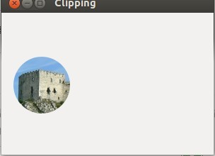
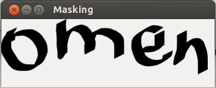
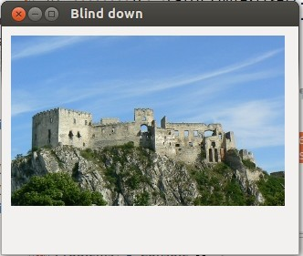

在 PyCairo 教程的这个部分，我们将讨论剪裁和屏蔽操作。
<!--more-->

# 剪裁

*裁剪* 是将绘制限定在某一区域内。这样做有一些效率的因素，或者为了创建有趣的效果。PyCairo 有一个 `clip()` 方法用于设置裁剪区域。
```
#!/usr/bin/python

'''
ZetCode PyCairo tutorial

This program shows how to perform
clipping in PyCairo.

author: Jan Bodnar
website: zetcode.com
last edited: August 2012
'''

import gi
gi.require_version('Gtk', '3.0')
from gi.repository import Gtk, GLib
import cairo
import math
import random


class Example(Gtk.Window):
    def __init__(self):
        super(Example, self).__init__()

        self.init_ui()
        self.load_image()
        self.init_vars()

    def init_ui(self):

        self.darea = Gtk.DrawingArea()
        self.darea.connect("draw", self.on_draw)
        self.add(self.darea)

        GLib.timeout_add(100, self.on_timer)

        self.set_title("Clipping")
        self.resize(300, 200)
        self.set_position(Gtk.WindowPosition.CENTER)
        self.connect("delete-event", Gtk.main_quit)
        self.show_all()

    def load_image(self):

        self.image = cairo.ImageSurface.create_from_png("beckov.png")

    def init_vars(self):

        self.pos_x = 128
        self.pos_y = 128
        self.radius = 40

        self.delta = [3, 3]

    def on_timer(self):

        self.pos_x += self.delta[0]
        self.pos_y += self.delta[1]

        self.darea.queue_draw()
        return True

    def on_draw(self, wid, cr):

        w, h = self.get_size()

        if (self.pos_x < 0 + self.radius):
            self.delta[0] = random.randint(5, 9)
        elif (self.pos_x > w - self.radius):
            self.delta[0] = -random.randint(5, 9)

        if (self.pos_y < 0 + self.radius):
            self.delta[1] = random.randint(5, 9)
        elif (self.pos_y > h - self.radius):
            self.delta[1] = -random.randint(5, 9)

        cr.set_source_surface(self.image, 1, 1)
        cr.arc(self.pos_x, self.pos_y, self.radius, 0, 2 * math.pi)
        cr.clip()
        cr.paint()


def main():
    app = Example()
    Gtk.main()


if __name__ == "__main__":
    main()
```
在这个例子中，我们将裁剪一幅图片。一个圆圈在窗口区域移动，并显示下面的图片的一部分。这就好像我们通过一个洞看过去一样。

```
    def load_image(self):

        self.image = cairo.ImageSurface.create_from_png("beckov.png")
```
这是下面的图片。每一个定时器周期，我们将看到这幅图片的一部分。

```
        if (self.pos_x < 0 + self.radius):
            self.delta[0] = random.randint(5, 9)
        elif (self.pos_x > w - self.radius):
            self.delta[0] = -random.randint(5, 9)
```
如果圆圈击中了窗口的左边或右边，则圆圈移动的方向会随机地改变。对于上边和下边也一样。

```
        cr.arc(self.pos_x, self.pos_y, self.radius, 0, 2 * math.pi)
```
这一行给 Cairo 上下文添加一个圆形的 Path。

```
        cr.clip()
```
`clip()` 设置裁剪区域。裁剪区域是当前正在使用的 Path。当前的 path 由 `arc()` 方法调用创建。

```
        cr.paint()
```
`paint()` 用当前的 source 描绘当前裁剪区域内的部分。



# 屏蔽

在 source 被应用于 surface 之前，它首先会被过滤。mask 被用作一个过滤器。mask 决定 source 的哪个部分被应用，而哪个部分不会。mask 不透明的部分允许复制 source。透明的部分则不允许复制 source 到 surface。

```
#!/usr/bin/python

'''
ZetCode PyCairo tutorial

This program demonstrates masking.

author: Jan Bodnar
website: zetcode.com
last edited: August 2012
'''

import gi
gi.require_version('Gtk', '3.0')
from gi.repository import Gtk
import cairo


class Example(Gtk.Window):
    def __init__(self):
        super(Example, self).__init__()

        self.init_ui()
        self.load_image()

    def init_ui(self):
        darea = Gtk.DrawingArea()
        darea.connect("draw", self.on_draw)
        self.add(darea)

        self.set_title("Masking")
        self.resize(310, 100)
        self.set_position(Gtk.WindowPosition.CENTER)
        self.connect("delete-event", Gtk.main_quit)
        self.show_all()

    def load_image(self):
        self.ims = cairo.ImageSurface.create_from_png("omen.png")

    def on_draw(self, wid, cr):
        cr.mask_surface(self.ims, 0, 0);
        cr.fill()


def main():
    app = Example()
    Gtk.main()


if __name__ == "__main__":
    main()
```
在这个例子中，屏蔽决定了哪些地方需要绘制哪些地方不绘制。

```
        cr.mask_surface(self.ims, 0, 0);
        cr.fill()
```
我们使用一幅图片作为 mask，这将会把它显示在窗口中。



# Blind down 效果

在这个代码例子中，我们将 blind down 我们的图片。这类似于我们使用的遮光窗帘。

```
#!/usr/bin/python

'''
ZetCode PyCairo tutorial

This program creates a blind down
effect using masking operation.

author: Jan Bodnar
website: zetcode.com
last edited: August 2012
'''

import gi
gi.require_version('Gtk', '3.0')
from gi.repository import Gtk, GLib
import cairo
import math


class Example(Gtk.Window):
    def __init__(self):
        super(Example, self).__init__()

        self.init_ui()
        self.load_image()
        self.init_vars()

    def init_ui(self):

        self.darea = Gtk.DrawingArea()
        self.darea.connect("draw", self.on_draw)
        self.add(self.darea)

        GLib.timeout_add(35, self.on_timer)

        self.set_title("Blind down")
        self.resize(325, 250)
        self.set_position(Gtk.WindowPosition.CENTER)
        self.connect("delete-event", Gtk.main_quit)
        self.show_all()

    def load_image(self):

        self.image = cairo.ImageSurface.create_from_png("beckov.png")

    def init_vars(self):

        self.timer = True
        self.h = 0
        self.iw = self.image.get_width()
        self.ih = self.image.get_height()

        self.ims = cairo.ImageSurface(cairo.FORMAT_ARGB32,
                                      self.iw, self.ih)

    def on_timer(self):

        if (not self.timer):
            return False

        self.darea.queue_draw()
        return True

    def on_draw(self, wid, cr):

        ic = cairo.Context(self.ims)

        ic.rectangle(0, 0, self.iw, self.h)
        ic.fill()

        self.h += 1

        if (self.h == self.ih):
            self.timer = False

        cr.set_source_surface(self.image, 10, 10)
        cr.mask_surface(self.ims, 10, 10)


def main():
    app = Example()
    Gtk.main()


if __name__ == "__main__":
    main()
```
blend down 效果背后的想法相当的简单。图像有 h 个像素高。我们绘制 0，1， 2... 个 1 像素高的行。每个周期，图像的部分多出一像素的高度，直到整幅图片都变得可见为止。

```
    def load_image(self):

        self.image = cairo.ImageSurface.create_from_png("beckov.png")
```
在 `load_image()` 方法中，我们由一幅 PNG 图片创建一个图片 surface。

```
    def init_vars(self):

        self.timer = True
        self.h = 0
        self.iw = self.image.get_width()
        self.ih = self.image.get_height()

        self.ims = cairo.ImageSurface(cairo.FORMAT_ARGB32,
                                      self.iw, self.ih)
```
在 `init_vars()` 方法中，我们初始化一些变量。我们初始化 `self.timer` 和 `self.h` 变量。我们获取所加载的图片的宽度和高度。然后我们创建一个空的图像 surface。它将会被来自于先前我们所创建的图像 surface 的像素行所填充。

```
        ic = cairo.Context(self.ims)
```
我们由空的图像 source 创建一个 cairo 上下文。

```
        ic.rectangle(0, 0, self.iw, self.h)
        ic.fill()
```
我们向最初为空的图像中绘制一个矩形。矩形每个周期高出 1px。用这种方式创建的图像将在后面作为一个 mask。

```
        self.h += 1
```
将要显示的图像的高度被加了一个单元。

```
        if (self.h == self.ih):
            self.timer = False
```
当我们在 GTK 窗口中绘制了整个图片时，我们停掉定时器方法。

```
        cr.set_source_surface(self.image, 10, 10)
        cr.mask_surface(self.ims, 10, 10)
```
城堡的图片被设置为绘制时的 source。`mask_surface()` 绘制当前的 source，使用 surface 的 alpha 通道作为一个 mask。



Blind down 是一种动画效果。

本章讨论了PyCairo中的裁剪和屏蔽。

[原文](http://zetcode.com/gfx/pycairo/clipmask/)

Done.
