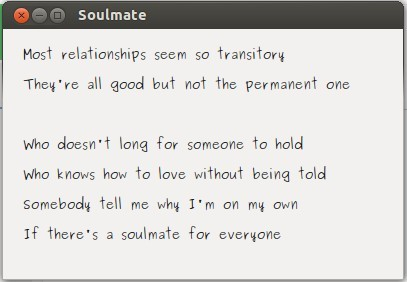
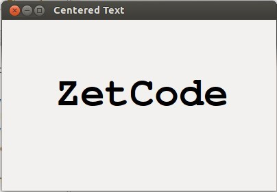
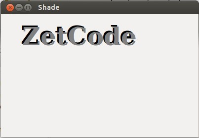
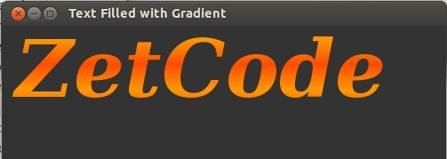
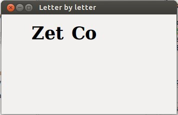
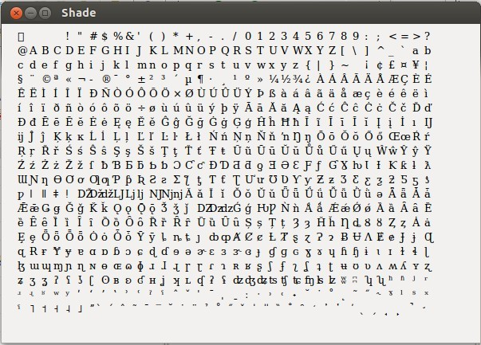

PyCairo 教程的这个部分，我们将与文本打交道。
<!--more-->
# 灵魂伴侣

在第一个例子中，我们将在窗口中显示一些歌词。

```
    def on_draw(self, wid, cr):

        cr.set_source_rgb(0.1, 0.1, 0.1)

        cr.select_font_face("Purisa", cairo.FONT_SLANT_NORMAL,
                            cairo.FONT_WEIGHT_NORMAL)
        cr.set_font_size(13)

        cr.move_to(20, 30)
        cr.show_text("Most relationships seem so transitory")
        cr.move_to(20, 60)
        cr.show_text("They're all good but not the permanent one")
        cr.move_to(20, 120)
        cr.show_text("Who doesn't long for someone to hold")
        cr.move_to(20, 150)
        cr.show_text("Who knows how to love without being told")
        cr.move_to(20, 180)
        cr.show_text("Somebody tell me why I'm on my own")
        cr.move_to(20, 210)
        cr.show_text("If there's a soulmate for everyone")
```
这段代码中，我们显示了来自于 Natasha Bedingfields Soulmate 这首歌的歌词的一部分。

```
        cr.select_font_face("Purisa", cairo.FONT_SLANT_NORMAL,
                            cairo.FONT_WEIGHT_NORMAL)
```
此处我们选择 font face。这个方法接收三个参数，font family，font slant 和font weight.

```
        cr.set_font_size(13)
```
此处我们指定字体大小。

```
        cr.move_to(20, 30)
        cr.show_text("Most relationships seem so transitory")
```
我们通过为文本指定位置并调用 `show_text()` 方法将文本显示在窗口中。



# 居中的文字

接下来我们将演示如何在窗口中居中显示文字。

```
    def on_draw(self, wid, cr):

        w, h = self.get_size()

        cr.select_font_face("Courier", cairo.FONT_SLANT_NORMAL,
                            cairo.FONT_WEIGHT_BOLD)
        cr.set_font_size(60)

        (x, y, width, height, dx, dy) = cr.text_extents("ZetCode")

        cr.move_to(w / 2 - width / 2, h / 2)
        cr.show_text("ZetCode")
```
这段代码将一段文字放在窗口的中心。即使调整了窗口的大小，也依然会位于中心。

```
        w, h = self.get_size()
```
为了使文字位于窗口的中心，需要获取窗口的客户区域的大小。

```
        cr.select_font_face("Courier", cairo.FONT_SLANT_NORMAL,
                            cairo.FONT_WEIGHT_BOLD)
        cr.set_font_size(60)
```
我们选择一个字体及字体大小用于显示。

```
        (x, y, width, height, dx, dy) = cr.text_extents("ZetCode")
```
我们获取文本 extents，这是一些用来描述文字的数字。我们的例子需要文字的宽度。

```
        cr.move_to(w / 2 - width / 2, h / 2)
        cr.show_text("ZetCode")
```
我们将文字定位在窗口的中间，并用 `show_text()` 显示它。



# 阴影文字

现在我们将在窗口中创建一段阴影文字。

```
    def on_draw(self, wid, cr):

        cr.select_font_face("Serif", cairo.FONT_SLANT_NORMAL,
                            cairo.FONT_WEIGHT_BOLD)
        cr.set_font_size(50)

        cr.set_source_rgb(0, 0, 0)
        cr.move_to(40, 60)
        cr.show_text("ZetCode")

        cr.set_source_rgb(0.5, 0.5, 0.5)
        cr.move_to(43, 63)
        cr.show_text("ZetCode")
```
为了创建阴影，我们以不同的颜色绘制文字两次。第二段文字向右下方移动了一点。

```
        cr.set_source_rgb(0, 0, 0)
        cr.move_to(40, 60)
        cr.show_text("ZetCode")
```
第一段文字用黑色墨水绘制。它做为阴影。

```
        cr.set_source_rgb(0.5, 0.5, 0.5)
        cr.move_to(43, 63)
        cr.show_text("ZetCode")
```
第二段文字以一些灰色墨水绘制。它向右下边移动了 3px。



# 渐变填充文字

下面的例子将创建一个很棒的效果。我们将用线性渐变来填充文字。

```
    def on_draw(self, wid, cr):

        cr.set_source_rgb(0.2, 0.2, 0.2)
        cr.paint()

        h = 90

        cr.select_font_face("Serif", cairo.FONT_SLANT_ITALIC,
                            cairo.FONT_WEIGHT_BOLD)
        cr.set_font_size(h)

        lg = cairo.LinearGradient(0, 15, 0, h * 0.8)
        lg.set_extend(cairo.EXTEND_REPEAT)
        lg.add_color_stop_rgb(0.0, 1, 0.6, 0)
        lg.add_color_stop_rgb(0.5, 1, 0.3, 0)

        cr.move_to(15, 80)
        cr.text_path("ZetCode")
        cr.set_source(lg)
        cr.fill()
```
我们在窗口中绘制一段文字，并以线性渐变填充。颜色是一些桔黄色。

```
        cr.set_source_rgb(0.2, 0.2, 0.2)
        cr.paint()
```
为了使它的视觉效果更吸引人，我们用深灰色来绘制背景。

```
        lg = cairo.LinearGradient(0, 15, 0, h * 0.8)
        lg.set_extend(cairo.EXTEND_REPEAT)
        lg.add_color_stop_rgb(0.0, 1, 0.6, 0)
        lg.add_color_stop_rgb(0.5, 1, 0.3, 0)
```
创建线性渐变。

```
        cr.move_to(15, 80)
        cr.text_path("ZetCode")
        cr.set_source(lg)
        cr.fill()
```
文字被显示于窗口中。我们用渐变作为 source 来绘制。



# 逐字符显示

在这个效果中，我们将逐字符显示一段文字。字符的显示将有一些延时。

```
#!/usr/bin/python

'''
ZetCode PyCairo tutorial

This program shows text letter by
letter.

author: Jan Bodnar
website: zetcode.com
last edited: August 2012
'''

import gi
gi.require_version('Gtk', '3.0')
from gi.repository import Gtk, GLib
import cairo


class cv(object):
    SPEED = 800
    TEXT_SIZE = 35
    COUNT_MAX = 8


class Example(Gtk.Window):
    def __init__(self):
        super(Example, self).__init__()

        self.init_ui()
        self.init_vars()

    def init_ui(self):

        self.darea = Gtk.DrawingArea()
        self.darea.connect("draw", self.on_draw)
        self.add(self.darea)

        GLib.timeout_add(cv.SPEED, self.on_timer)

        self.set_title("Letter by letter")
        self.resize(350, 200)
        self.set_position(Gtk.WindowPosition.CENTER)
        self.connect("delete-event", Gtk.main_quit)
        self.show_all()

    def init_vars(self):

        self.timer = True
        self.count = 0
        self.text = ["Z", "e", "t", "C", "o", "d", "e"]

    def on_timer(self):

        if not self.timer: return False

        self.darea.queue_draw()
        return True

    def on_draw(self, wid, cr):

        cr.select_font_face("Courier", cairo.FONT_SLANT_NORMAL,
                            cairo.FONT_WEIGHT_BOLD)

        cr.set_font_size(cv.TEXT_SIZE)

        dis = 0

        for i in range(self.count):
            (x, y, width, height, dx, dy) = cr.text_extents(self.text[i])

            dis += width + 2
            cr.move_to(dis + 30, 50)
            cr.show_text(self.text[i])

        self.count += 1

        if self.count == cv.COUNT_MAX:
            self.timer = False
            self.count = 0


def main():
    app = Example()
    Gtk.main()


if __name__ == "__main__":
    main()
```
在我们的例子中，我们以一定的延时，逐字符的在 GTK 窗口中显示 "ZetCode" 字串。

```
        self.text = ["Z", "e", "t", "C", "o", "d", "e"]
```
这是将在窗口中显示的字符的列表。

```
        cr.select_font_face("Courier", cairo.FONT_SLANT_NORMAL,
                            cairo.FONT_WEIGHT_BOLD)
```
我们以 bold weight 选择一个 Courier font face。

```
        for i in range(self.count):
            (x, y, width, height, dx, dy) = cr.text_extents(self.text[i])

            dis += width + 2
            cr.move_to(dis + 30, 50)
            cr.show_text(self.text[i])
```
此处我们逐字符绘制文本。我们获取每个字符的宽度，然后计算沿 x 轴需要移动的距离。



# Glyphs

`show_text()` 方法只适合简单的文本渲染。Cairo 开发者称它为玩具方法。更专业的文本渲染通过 glyphs 完成。一个 *glyph* 是为一个字符提供一个外形的图形符号。一个字符提供一种含义。它可以有多个 glyphs。字符没有内在的外观。glyph 没有内在的含义。

注意，许多需要处理文字的通用编程需要由 Pango 库来处理。

```
    def on_draw(self, wid, cr):

        cr.select_font_face("Serif", cairo.FONT_SLANT_NORMAL,
                            cairo.FONT_WEIGHT_NORMAL)

        cr.set_font_size(13)

        glyphs = []
        index = 0

        for y in range(20):
            for x in range(35):
                glyphs.append((index, x * 15 + 20, y * 18 + 20))
                index += 1

        cr.show_glyphs(glyphs)
```
这段代码显示选中的字体中的 700 个 glyphs。

```
        glyphs = []
```
glyphs 列表将存储三个整数值。第一个值是 glyph 在选中的字体类型中的索引。第二个和第三个是 glyph 的 x，y 位置。

```
        cr.show_glyphs(glyphs)
```
`show_glyphs()`  方法在窗口中显示 glyphs。



本章讨论了 PyCairo 中的文本。

[原文](http://zetcode.com/gfx/pycairo/text/)

Done.
