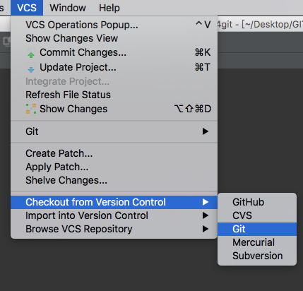

本文档展示了如何建立一个使用 PyCharm IDE 为 ev3dev 开发 Python 程序的良好的工作环境。

在这份文档中，我们假设你已经刷写了一张 SD 卡，用它启动设备，并且已经 [在设备上配置了网络](https://www.ev3dev.org/docs/networking/)。这些步骤在 [入门指南](https://www.ev3dev.org/docs/getting-started) 中说明。
<!--more-->
# 登录 ev3dev

在这份文档中，我们需要能够在 EV3 上运行终端命令。要完成这一设置，请移步我们的  [SSH 教程](https://www.ev3dev.org/docs/tutorials/connecting-to-ev3dev-with-ssh/)。

# 配置代码同步

注意：本教程的前半部分假设你使用免费的 “社区” 版 PyCharm。然而，如果你有权使用对于学生和其它一些 [特殊情况](https://www.jetbrains.com/pycharm/buy/#edition=discounts) 是免费的 “标准” 版的 PyCharm，我们建议你阅读在后面说明的 PyCharm Professional 的部分。

目的是能够只需点击几下，就能在你将代码写入 EV3 或其他 ev3dev 设备时传输代码。为了实现这一点，我们打算使用一个称为 git 的程序。Git 是一个 “版本控制” 系统，它通常用于存储源码。然而，对于我们来说，它作为一种用 PyCharm 内建的工具把代码传送到远程机器上的简单方式非常有效。

## 在 ev3dev 设备上配置主 repo

首先，打开你之前建立的 SSH 终端，然后运行如下的命令（确保把 name/email 替换为你自己的）：
```
sudo apt-get update
sudo apt-get install git
git config --global user.email "you@example.com"
git config --global user.name "Your Name"
```

现在让我们使用我们的版本系统创建一个新的工程。键入：
```
mkdir myproject.git
git init --bare myproject.git
mkdir myproject
```

注意：如果你想为你的工程起一个不同的名字，你可以把上面的 `myproject` 替换为你自己的名称。确保它不包含空格或其它特殊字符。

好极了！这样就在我们新创建的目录下初始化了 Git。我们有了一个新的工程仓库。现在我们可以在我们的开发机器上 clone 这个仓库了，但首先我们需要做一点额外的配置，以在我们把代码 push 回 ev3dev brick 时自动地部署我们的代码：
```
nano myproject.git/hooks/post-receive
```

把下面的内容添加到你刚刚打开的文件。如果你需要一些关于 nano 的提示，请参考 [nano cheat sheet](https://www.ev3dev.org/docs/tutorials/nano-cheat-sheet)。
```
#!/bin/sh
git --work-tree=/home/robot/myproject --git-dir=/home/robot/myproject.git checkout -f
```

最后，执行：
```
chmod +x myproject.git/hooks/post-receive
```

## 在 PyCharm 中配置同步

这份教程专注于 PyCharm Community Edition（尽管这些说明也适用于更多 软件的高级版本）。如果你还没有安装，请安装 [PyCharm](https://www.jetbrains.com/pycharm/)。


现在我们要做的是创建一份我们在 ev3dev 机器上创建的工程的 clone，以便我们可以在开发 PC 机上工作。在 PyCharm 的 Welcome 对话框中，选择：*Checkout from version control* > *Git*。现在输入 ev3dev 主机的主机名（主机名通常是 `ev3dev` 或 `ev3dev.local`），后面跟冒号，然后是工程名。在其它选项中选择一个适当的 parent 和工程目录。


除了在 PyCharm 的 Welcome 界面外，还可以在 PyCharm 的主界面选择菜单选项 *VCS* > *Checkout from version control* > *Git*，打开与上面完全一样的对话框。如下图：



然后按照与上面的说明一致的方法输入相关信息。

如果一切正常，你应该已经在一个新的 PyCharm 窗口中打开了你的空工程。如果 ‘testing’ 对话框在屏幕上保持了很长时间，那可能是因为你的 PyCharm 密码存储需要你的 PyCharm master 密码。取消 checkout，键入 master 密码，并再次尝试。

## 添加一些代码

让我们给工程添加一些代码。在左边的 ‘myproject’ 目录上点击右键，并选择 *new* > *python file*。把它命名为 `run_motor`。PyCharm 将询问你是否想把它添加进 git；我们正在使用 git 来把代码同步到 brick，因此我们想要使用它。选择 *Yes*。

现在添加如下的测试代码：
```
from ev3dev.auto import *
import time

m = Motor(OUTPUT_A)
m.run_timed(time_sp=3000, speed_sp=500)
```

一旦你输入了那些代码，选择 *VCS* > *Commit Changes…* 或按下 `Ctrl`+`K` (在
 Mac 上是 `Cmd`+`K`)。

 commit message 专门用于描述你对代码做的修改。它在后面你开始对代码做大量修改时很方便，但现在我们只输入 `first commit`。现在我们把鼠标移到 `commit` 按钮并在下拉选项中选择 “commit and push”。在下一个对话框确保选择 “alternative branch” 复选框并点击 “Push”。瞧！我们的代码已经被发送到了 ev3dev brick。让我们看一下。

# 运行代码

是时候运行我们之前写的代码了。它试着运行一个马达，因此在你的 brick 的 端口 A 上插上一个。现在你将需要从你之前的那个打开 SSH 会话（或一个新的），并运行如下的命令：

```
cd myproject
python3 run_motor.py
```

观察你连接的马达。如果你的代码运行正常，你应该看到马达旋转了三秒。

# 启用自动补全和错误检查

我们之前保存代码的时候，你可能已经注意到了一个问题：PyCharm 在 ev3dev 库的 import 行下面放置了红色波浪线。


这是由于在开发机上缺失了 ev3dev 库，因此 PyCharm 认为你的代码引用了不存在的类。我们可以通过在开发机上安装 ev3dev 库来解决这个问题：我们当然无法在桌面电脑上运行马达，但库中的文档和自动补全将被探测到，以便 PyCharm 可以帮助您。

使用 Python 内建的包管理器 [pip](https://en.wikipedia.org/wiki/Pip_(package_manager)) 在你的计算机上安装 ev3dev-python 库。
```
pip3 install python-ev3dev
```

使用 pip 安装包的时候，注意一下系统中当前配置的 Python 版本。如果 PyCharm 中选择的解释器是 Python3，而系统中配置的当前 Python 解释器的版本为 Python2.7，则上面的命令无法为 PyCharm 所使用的 Python 解释器安装适当的 ev3dev 包，ev3dev 会被安装到 Python2.7 的包目录下，且只能被 Python 2.7 引用到。可通过如下命令强制为 Python3 安装 ev3dev 包：
```
$ sudo python3 /usr/local/bin/pip3 install python-ev3dev
```

安装了库之后，红色的波浪线将消失，并且  ev3dev-python 命令的自动补全将会工作（非常方便）。


# 使用IDE的强大功能

IDE (PyCharm) 设置完成并且库安装好之后，你可以写代码写得更快。PyCharm 将高亮显示大多数编码错误和拼写错误。它也会提示和自动补全你的代码并显示文档。你可以键入 `m.` 然后 PyCharm 将提示所有可能的方法和属性。选择一个。现在你可以把光标放在属性中并按下 F1 来查看文档。我们按下 cmd/control-down 箭头来深入查看库中这个属性的定义。整洁，对吧？ 快乐编码。

# PyCharm 专业版的额外功能

PyCharm 专业版（对于教育的场景或开源项目的顶级贡献者可以免费获得）有更多功能使你的开发体验更刘畅。如果你是一个学生或老师，请在 JetBrains 学生申请页面上注册您的有效机构电子邮件地址，以申请免费版本的 PyCharm 专业版。如果你是一个开源开发者，并且为现有的项目贡献了大量代码，你可以访问  [JetBrains Open Source 许可证页](https://www.jetbrains.com/buy/opensource/) 来查看你是否有资格申请一个 PyCharm 专业版的免费版。

这里是一个你可以在 PyCharm 专业版中使用的能使你的 Python 开发更简单地工具的清单。


|  工具 | 用途 |
|---------|-------|
|  [SFTP 远程服务器](https://www.jetbrains.com/help/pycharm/2016.3/creating-a-remote-server-configuration.html) | 上面所用方法的一个替代方法，可以在你的计算机上的文件保存时把你的计算机上的代码更快地传输到 EV3。 |
| [SSH 终端](https://www.jetbrains.com/help/pycharm/2016.3/ssh-terminal.html)  | 让你直接通过 PyCharm 创建 SSH 连接，而不是用另外一个工具（比如 PuTTY）。 |
| [远程解释器](https://www.jetbrains.com/help/pycharm/2016.3/configuring-remote-interpreters-via-ssh.html) | 让你无需 SSH 终端，直接点击 PyCharm 中的运行来运行程序。允许调试，日志，等等所有你的主机上的 PyCharm IDE 内有的东西（但是它 **很慢**！） |

通过这些工具并在你的电脑上安装 ev3dev-lang-python，你可以真正地使 Python 开发流程相当友好。

## 设置 SFTP 远程服务器

这是本教程前面展示的 git post-receive hook 方案的一个替代方法。如果你有权使用 PyCharm 专业版，则这个方案是一个比前面的那个更优雅的方案。在即时地传输代码上它的工作几乎是一样的，但它也允许你有一些其它的 git remote（比如 GitHub）而不是使用 EV3 作为你的 git remote。这是使用 PyCharm 远程服务器建立你的文件传输机制必须的步骤。

 * 在 PyCharm 中选择 *File* > *Settings* （Windows 和 Linux 上） (或在 macOS 上 *PyCharm* > *Preferences*)
 * 展开 `Build, Execution, Deployment`
 * 点击 `Deployment`
 * 点击 `+` 图标，并添加一个新的远程服务器，随意命名为你喜欢的名字（比如 `EV3`）


 * 选择 SFTP，然后设置如下的参数：
   - SFTP 主机：`ev3dev` 或 `ev3dev.local`，依赖于你的网络配置（如果你重命名了 EV3 的话将是不同的）
   - 端口：22（不要修改它）
   - 根路径：/ （不要因为我们稍后设置完整路径而改变它）
   - 用户名：robot
   - 密码：`maker`（这是默认的密码，如果你修改了它的话，用你自己的）
   - 保存密码：选中此框以使自己更轻松。
   - 你也可以在顶部反选 ‘Visible only for this project’。


 * 点击 Mappings 标签（如果为空，点击 OK 回到这个 spot，有时它需要你先保存它）
   - 选择你的文件在 EV3 上的路径，比如
      * 服务器上的部署地址：`/home/robot/myfolderpath`
   - 点击顶部的 `Use this server as default` 按钮
   - 点击 OK


 * 重新打开 *File* > *Settings* （在 Windows 和 Linux 上，或在 macOS 上 *PyCharm* > *Preferences*）区域（注意我们必须先保存之前的步骤）。
 * 展开  *Build, Execution, Deployment*，展开 *Deployment*，然后选择 *Options*
 * 在 `Upload changed files automatically to the default server` 上，选择 `On explicit save action`


你可以在无需执行任何代码的情况下测试这个设置。做一个修改，保存文件，然后在你的 EV3 上看下文件是否同步。注意，为了运行测试，你需要一个 SSH 终端，你也可以在 PyCharm 中做这些（参考下一节的说明）。

## 在 PyCharm 中创建 SSH 终端

这个工具真的只是一个方便。不是使用单独的程序，比如 PuTTY，MobaXterm，或 Mac Terminal，只在 PyCharm 中创建。要启动一个 SSH 会话，仅使用菜单选项 *Tools* > *Start SSH Session…*。

它将提示你你想使用哪个远程服务器。选择 `EV3`（如果你重命名了它则使用那个）。接着它将展示一个对话框  “Connecting to Remote Host … Are you sure?”，点击 **Yes**。然后在新的终端标签中将打开一个到你的 EV3 的 SSH 连接。


你甚至可以通过设置默认的部署服务器来跳过那些选择步骤（saves 1 click!）。

 * 选择 *File* > *Settings* （在 Windows 和 Linux 上，或在 macOS 上 *PyCharm* > *Preferences*）
 * 展开 `Tools`
 * 选择 `SSH Terminal`
 * 把部署服务器从 `Select server on every run` 修改为你配置的服务器（比如 `EV3`，如果你重命名了则使用那个）


# 配置远程解释器

这一步是可选的。你已经在 PyCharm 中有了 SSH 终端来运行你的程序。然而点击 PyCharm 的 run 按钮而不是在 SSH 终端中输入 `python3 filename.py` 运行程序岂不是更友好？感觉就像是程序是运行在你自己的机器上一样。即，理论上，在 PyCharm 中是可能的；然而，它有一些严重的问题。

注意：在我的测试中，在一个真实的 EV3 上，这个方法非常慢，以致于无法使用（可能 RPI 上能工作的好一点）。你可以试一下，也许你更幸运一点。

 * 选择 *File* > *Settings* （在 Windows 和 Linux 上，或在 macOS 上 *PyCharm* > *Preferences*）
 * 展开你的工程
 * 选择 `Python Interpreter`
 * 点击三个小点添加新的解释器并选择 `Add Remote`
 * 选择 `SSH Credentials`
 * 添加主机，用户名，和密码，就像在上面的远程服务器设置步骤中所做的那样
 * 把 Python 解释器的路径修改为 `/usr/bin/python3`

设置完成后，PyCharm 将向 ev3 安装一些辅助信息，并将索引 ev3 上已经存在的文件，这可能会耗费比较长的时间（2-3 分钟），因此你可以做一些其它事等一下。它完成时你可以使用 PyCharm IDE 的运行按钮在 ev3 上运行你的代码。如果它运作得更好，这是一个非常好的想法。祝好运！

[原文](https://www.ev3dev.org/docs/tutorials/setting-up-python-pycharm/)
