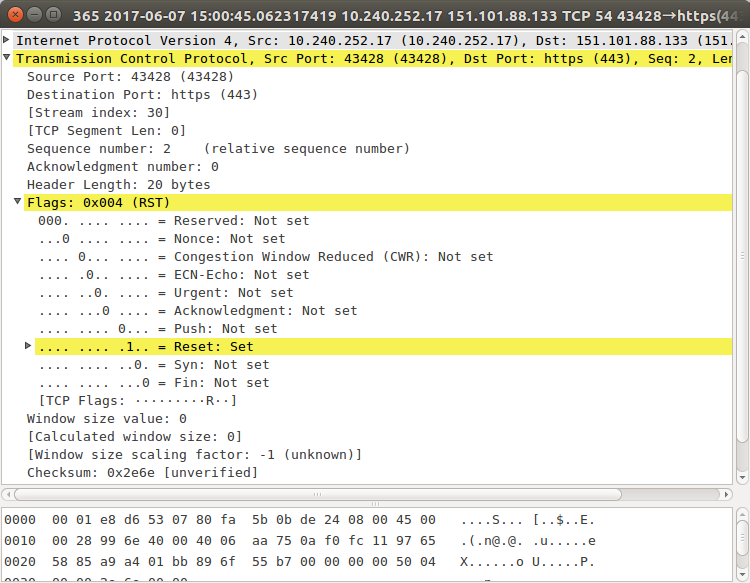
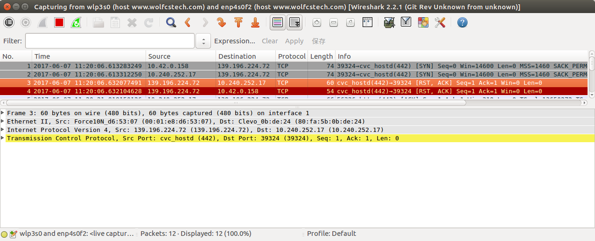
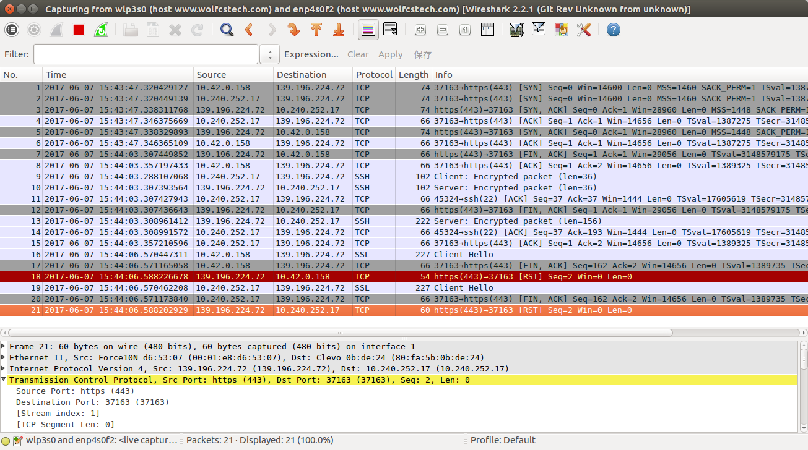
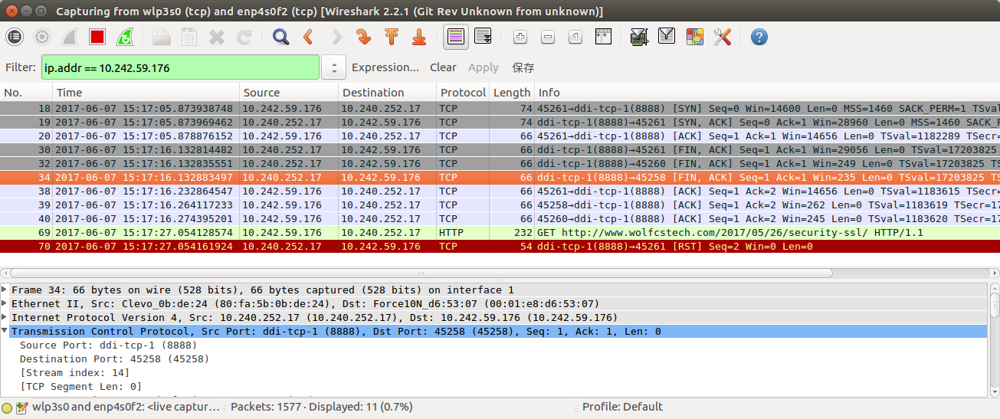
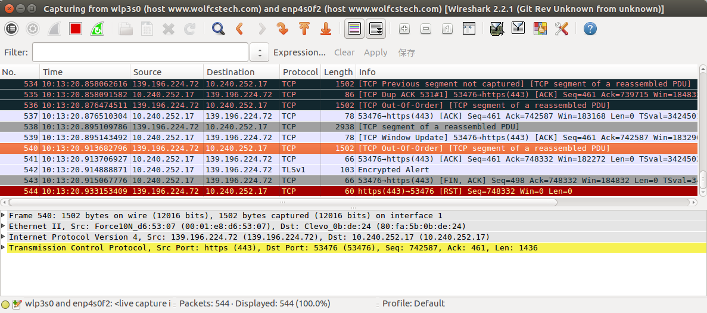
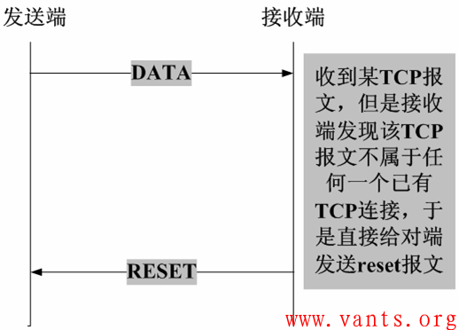
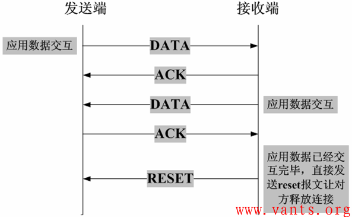

TCP 的异常终止是相对于正常释放 TCP 连接的过程而言的，我们都知道，TCP 连接的建立是通过三次握手完成的，而 TCP 正常释放连接是通过四次挥手来完成，但是有些情况下，TCP 在交互过程中会出现一些意想不到的情况，导致 TCP 无法按照正常的四次挥手来释放连接。如果此时不通过其他方式释放 TCP 连接的话，这个 TCP 连接将会一直存在，并占用系统的部分资源。
<!--more-->

在TCP异常终止的情况下，我们就需要有一种能够释放 TCP 连接的机制，这种机制就是 TCP 的 Reset 报文。Reset 报文是指 TCP 报头的标志字段中的 Reset 位设置为一的报文，如下图所示：



我们在实际的工作环境中，导致某一方发送 Reset 报文的情形有多种。

## 服务器端口未对外提供服务
客户端尝试与服务器未对外提供服务的端口建立 TCP 连接，服务器将会直接向客户端发送 Reset 报文。


通过共享 WiFi 热点的方式，用 Wireshark 抓包来看这个过程中网络包的交互，在 Android 客户端 Java 代码中访问服务器一个不提供服务的端口 442：



如上图，第 1 号和 2 号包，是客户端发向服务器，用于建立 TCP 连接的 SYN 包，随后立即就收到了服务器返回的 ***[RST，ACK]*** 包。

以 OkHttp 做为客户端 Java HttpStack 库，这种情况下将抛出如下异常：
```
java.net.ConnectException: Failed to connect to www.wolfcstech.com/139.196.224.72:442
    at okhttp3.internal.connection.RealConnection.connectSocket(RealConnection.java:222)
    at okhttp3.internal.connection.RealConnection.connect(RealConnection.java:146)
    at okhttp3.internal.connection.StreamAllocation.findConnection(StreamAllocation.java:186)
    at okhttp3.internal.connection.StreamAllocation.findHealthyConnection(StreamAllocation.java:121)
    at okhttp3.internal.connection.StreamAllocation.newStream(StreamAllocation.java:100)
    at okhttp3.internal.connection.ConnectInterceptor.intercept(ConnectInterceptor.java:42)
    at okhttp3.internal.http.RealInterceptorChain.proceed(RealInterceptorChain.java:92)
    at okhttp3.internal.http.RealInterceptorChain.proceed(RealInterceptorChain.java:67)
    at okhttp3.internal.cache.CacheInterceptor.intercept(CacheInterceptor.java:93)
    at okhttp3.internal.http.RealInterceptorChain.proceed(RealInterceptorChain.java:92)
    at okhttp3.internal.http.RealInterceptorChain.proceed(RealInterceptorChain.java:67)
    at okhttp3.internal.http.BridgeInterceptor.intercept(BridgeInterceptor.java:93)
    at okhttp3.internal.http.RealInterceptorChain.proceed(RealInterceptorChain.java:92)
    at okhttp3.internal.http.RetryAndFollowUpInterceptor.intercept(RetryAndFollowUpInterceptor.java:120)
    at okhttp3.internal.http.RealInterceptorChain.proceed(RealInterceptorChain.java:92)
    at okhttp3.internal.http.RealInterceptorChain.proceed(RealInterceptorChain.java:67)
    at com.netease.netlib.OkHttp3Utils$MyInterceptor.intercept(OkHttp3Utils.java:29)
    at okhttp3.internal.http.RealInterceptorChain.proceed(RealInterceptorChain.java:92)
    at okhttp3.internal.http.RealInterceptorChain.proceed(RealInterceptorChain.java:67)
    at okhttp3.RealCall.getResponseWithInterceptorChain(RealCall.java:179)
    at okhttp3.RealCall$AsyncCall.execute(RealCall.java:129)
    at okhttp3.internal.NamedRunnable.run(NamedRunnable.java:32)
    at java.util.concurrent.ThreadPoolExecutor.runWorker(ThreadPoolExecutor.java:1112)
    at java.util.concurrent.ThreadPoolExecutor$Worker.run(ThreadPoolExecutor.java:587)
    at java.lang.Thread.run(Thread.java:841)
Caused by: java.net.ConnectException: failed to connect to www.wolfcstech.com/139.196.224.72 (port 442) after 10000ms: isConnected failed: ECONNREFUSED (Connection refused)
    at libcore.io.IoBridge.isConnected(IoBridge.java:223)
    at libcore.io.IoBridge.connectErrno(IoBridge.java:161)
    at libcore.io.IoBridge.connect(IoBridge.java:112)
    at java.net.PlainSocketImpl.connect(PlainSocketImpl.java:192)
    at java.net.PlainSocketImpl.connect(PlainSocketImpl.java:460)
    at java.net.Socket.connect(Socket.java:833)
    at okhttp3.internal.platform.AndroidPlatform.connectSocket(AndroidPlatform.java:63)
    at okhttp3.internal.connection.RealConnection.connectSocket(RealConnection.java:220)
	... 24 more
Caused by: libcore.io.ErrnoException: isConnected failed: ECONNREFUSED (Connection refused)
    at libcore.io.IoBridge.isConnected(IoBridge.java:208)
```

OkHttp 抛出了 Java 异常 `java.net.ConnectException`，然而 libcore 层的异常显示，连接被拒绝：
```
libcore.io.ErrnoException: isConnected failed: ECONNREFUSED (Connection refused)
```

## 通信某一方异常崩溃
客户端和服务器的某一方在交互的过程中发生异常（如程序崩溃等），该方系统将向对端发送 TCP Reset 报文，告之对方释放相关的 TCP 连接，如下图所示：


异常终止的一方，在进程退出时，释放占用的资源，包括 socket，TCP、UDP 端口等。站在异常退出的这一方的角度来看，对端是在访问一个没有打开的 socket。

通过如下方式模拟数据发送时，服务器端异常退出的情况：
1. 开启代理服务器，如 Fiddler，mitmproxy，或 Charles。
2. 为 Android 设备配置代理服务器。
3. 以 OkHttp 为 Android 应用 HTTP 客户端，在 OkHttp 中连接建立完成的地方打断点。
4. 以 Debug 模式运行 Android 应用，执行一个 HTTP/HTTPS 请求，应用将停在连接建立完成的地方。
5. 关掉代理服务器。
6. 放开端点，继续执行 Android 应用。

### HTTPS 请求-发送数据
前面的操作过程中，执行 HTTPS 请求，通过 Wireshark 抓包，得到如下结果：


第 116 号包，Android 手机发送 TCP SYN 包，与代理服务器建立 TCP 连接。到第 118 号包，完成 TCP 三次握手，连接建立完成。

第119 号包到第121 号包，Android 应用请求代理服务器建立隧道连接，隧道连接建立完成。

第 123 号包是代理服务器进程在退出时，发送了 ***[FIN ACK]*** 结束 TCP 连接。

第 130 号包是在代理服务器关闭之后，Android 应用发送的数据，TLS 握手的 ***Client Hello ***。随后代理服务器主机立即响应了 RST 包给 Android 应用。

经过上面的操作，OkHttp 的执行将报错退出，报出的异常如下：
```

 javax.net.ssl.SSLException: Connection closed by peer
     at com.android.org.conscrypt.NativeCrypto.SSL_do_handshake(Native Method)
     at com.android.org.conscrypt.OpenSSLSocketImpl.startHandshake(OpenSSLSocketImpl.java:405)
     at okhttp3.internal.connection.RealConnection.connectTls(RealConnection.java:267)
     at okhttp3.internal.connection.RealConnection.establishProtocol(RealConnection.java:237)
     at okhttp3.internal.connection.RealConnection.connect(RealConnection.java:148)
     at okhttp3.internal.connection.StreamAllocation.findConnection(StreamAllocation.java:186)
     at okhttp3.internal.connection.StreamAllocation.findHealthyConnection(StreamAllocation.java:121)
     at okhttp3.internal.connection.StreamAllocation.newStream(StreamAllocation.java:100)
     at okhttp3.internal.connection.ConnectInterceptor.intercept(ConnectInterceptor.java:42)
     at okhttp3.internal.http.RealInterceptorChain.proceed(RealInterceptorChain.java:92)
     at okhttp3.internal.http.RealInterceptorChain.proceed(RealInterceptorChain.java:67)
     at okhttp3.internal.cache.CacheInterceptor.intercept(CacheInterceptor.java:93)
     at okhttp3.internal.http.RealInterceptorChain.proceed(RealInterceptorChain.java:92)
     at okhttp3.internal.http.RealInterceptorChain.proceed(RealInterceptorChain.java:67)
     at okhttp3.internal.http.BridgeInterceptor.intercept(BridgeInterceptor.java:93)
     at okhttp3.internal.http.RealInterceptorChain.proceed(RealInterceptorChain.java:92)
     at okhttp3.internal.http.RetryAndFollowUpInterceptor.intercept(RetryAndFollowUpInterceptor.java:120)
     at okhttp3.internal.http.RealInterceptorChain.proceed(RealInterceptorChain.java:92)
     at okhttp3.internal.http.RealInterceptorChain.proceed(RealInterceptorChain.java:67)
     at com.netease.netlib.OkHttp3Utils$MyInterceptor.intercept(OkHttp3Utils.java:29)
     at okhttp3.internal.http.RealInterceptorChain.proceed(RealInterceptorChain.java:92)
     at okhttp3.internal.http.RealInterceptorChain.proceed(RealInterceptorChain.java:67)
     at okhttp3.RealCall.getResponseWithInterceptorChain(RealCall.java:179)
     at okhttp3.RealCall$AsyncCall.execute(RealCall.java:129)
     at okhttp3.internal.NamedRunnable.run(NamedRunnable.java:32)
     at java.util.concurrent.ThreadPoolExecutor.runWorker(ThreadPoolExecutor.java:1112)
     at java.util.concurrent.ThreadPoolExecutor$Worker.run(ThreadPoolExecutor.java:587)
     at java.lang.Thread.run(Thread.java:841)
```

报出了  **javax.net.ssl.SSLException: Connection closed by peer**。

修改前面的操作，让 Android 客户端直接与远程 HTTP 服务器连接，在连接建立完成的时候，杀掉 HTTP 服务进程，其它保持完全不变，则无论是抓到的包，还是 OkHttp 报出的异常，基本都没有改变。抓到的包如下：



OkHttp 抛出的异常如下：
```
javax.net.ssl.SSLException: Connection closed by peer
    at com.android.org.conscrypt.NativeCrypto.SSL_do_handshake(Native Method)
    at com.android.org.conscrypt.OpenSSLSocketImpl.startHandshake(OpenSSLSocketImpl.java:405)
    at okhttp3.internal.connection.RealConnection.connectTls(RealConnection.java:267)
    at okhttp3.internal.connection.RealConnection.establishProtocol(RealConnection.java:237)
    at okhttp3.internal.connection.RealConnection.connect(RealConnection.java:148)
    at okhttp3.internal.connection.StreamAllocation.findConnection(StreamAllocation.java:186)
    at okhttp3.internal.connection.StreamAllocation.findHealthyConnection(StreamAllocation.java:121)
    at okhttp3.internal.connection.StreamAllocation.newStream(StreamAllocation.java:100)
    at okhttp3.internal.connection.ConnectInterceptor.intercept(ConnectInterceptor.java:42)
    at okhttp3.internal.http.RealInterceptorChain.proceed(RealInterceptorChain.java:92)
    at okhttp3.internal.http.RealInterceptorChain.proceed(RealInterceptorChain.java:67)
    at okhttp3.internal.cache.CacheInterceptor.intercept(CacheInterceptor.java:93)
    at okhttp3.internal.http.RealInterceptorChain.proceed(RealInterceptorChain.java:92)
    at okhttp3.internal.http.RealInterceptorChain.proceed(RealInterceptorChain.java:67)
    at okhttp3.internal.http.BridgeInterceptor.intercept(BridgeInterceptor.java:93)
    at okhttp3.internal.http.RealInterceptorChain.proceed(RealInterceptorChain.java:92)
    at okhttp3.internal.http.RetryAndFollowUpInterceptor.intercept(RetryAndFollowUpInterceptor.java:120)
    at okhttp3.internal.http.RealInterceptorChain.proceed(RealInterceptorChain.java:92)
    at okhttp3.internal.http.RealInterceptorChain.proceed(RealInterceptorChain.java:67)
    at com.netease.netlib.OkHttp3Utils$MyInterceptor.intercept(OkHttp3Utils.java:29)
    at okhttp3.internal.http.RealInterceptorChain.proceed(RealInterceptorChain.java:92)
    at okhttp3.internal.http.RealInterceptorChain.proceed(RealInterceptorChain.java:67)
    at okhttp3.RealCall.getResponseWithInterceptorChain(RealCall.java:179)
    at okhttp3.RealCall$AsyncCall.execute(RealCall.java:129)
    at okhttp3.internal.NamedRunnable.run(NamedRunnable.java:32)
```

可见，执行 HTTPS 请求，在发送数据时，代理服务器或远程 HTTP 服务器被杀掉的话，它们都会执行正常结束 TCP 连接的操作。而在 Android 端，OkHttp 将报出异常 **`javax.net.ssl.SSLException: Connection closed by peer`**。

### HTTP 请求-发送数据
前面的操作过程中，使用代理时，执行 HTTP 请求，通过 Wireshark 抓包，得到如下结果：



Android 客户端与代理服务器的连接建立完成之后，立即杀掉代理服务器进程，代理服务器向 Android 客户端发送了 **[FIN, ACK]** 以结束 TCP 连接。随后 Android 客户端发出 HTTP 请求，将立即收到代理服务器进程发回的 RST 包。

OkHttp 将报出如下的异常：
```
java.io.IOException: unexpected end of stream on Connection{www.wolfcstech.com:80, proxy=HTTP@10.240.252.17:8888 hostAddress=/10.240.252.17:8888 cipherSuite=none protocol=http/1.1}
    at okhttp3.internal.http1.Http1Codec.readResponseHeaders(Http1Codec.java:205)
    at okhttp3.internal.http.CallServerInterceptor.intercept(CallServerInterceptor.java:67)
    at okhttp3.internal.http.RealInterceptorChain.proceed(RealInterceptorChain.java:92)
    at okhttp3.internal.connection.ConnectInterceptor.intercept(ConnectInterceptor.java:45)
    at okhttp3.internal.http.RealInterceptorChain.proceed(RealInterceptorChain.java:92)
    at okhttp3.internal.http.RealInterceptorChain.proceed(RealInterceptorChain.java:67)
    at okhttp3.internal.cache.CacheInterceptor.intercept(CacheInterceptor.java:93)
    at okhttp3.internal.http.RealInterceptorChain.proceed(RealInterceptorChain.java:92)
    at okhttp3.internal.http.RealInterceptorChain.proceed(RealInterceptorChain.java:67)
    at okhttp3.internal.http.BridgeInterceptor.intercept(BridgeInterceptor.java:93)
    at okhttp3.internal.http.RealInterceptorChain.proceed(RealInterceptorChain.java:92)
    at okhttp3.internal.http.RetryAndFollowUpInterceptor.intercept(RetryAndFollowUpInterceptor.java:120)
    at okhttp3.internal.http.RealInterceptorChain.proceed(RealInterceptorChain.java:92)
    at okhttp3.internal.http.RealInterceptorChain.proceed(RealInterceptorChain.java:67)
    at com.netease.netlib.OkHttp3Utils$MyInterceptor.intercept(OkHttp3Utils.java:29)
    at okhttp3.internal.http.RealInterceptorChain.proceed(RealInterceptorChain.java:92)
    at okhttp3.internal.http.RealInterceptorChain.proceed(RealInterceptorChain.java:67)
    at okhttp3.RealCall.getResponseWithInterceptorChain(RealCall.java:179)
    at okhttp3.RealCall$AsyncCall.execute(RealCall.java:129)
    at okhttp3.internal.NamedRunnable.run(NamedRunnable.java:32)
    at java.util.concurrent.ThreadPoolExecutor.runWorker(ThreadPoolExecutor.java:1112)
    at java.util.concurrent.ThreadPoolExecutor$Worker.run(ThreadPoolExecutor.java:587)
    at java.lang.Thread.run(Thread.java:841)
Caused by: java.io.EOFException: \n not found: size=0 content=…
    at okio.RealBufferedSource.readUtf8LineStrict(RealBufferedSource.java:215)
    at okhttp3.internal.http1.Http1Codec.readResponseHeaders(Http1Codec.java:189)
	... 22 more
```

让 Android 客户端直接与远端 HTTP 服务器相连，则抓到的包如下：


在服务器进程被杀掉的时候，同样发出了 ***[FIN ACK]*** 来结束 TCP 连接。此时 OkHttp 报出的异常将像下面这样：
```
  java.io.IOException: unexpected end of stream on Connection{www.wolfcstech.com:80, proxy=DIRECT@ hostAddress=www.wolfcstech.com/139.196.224.72:80 cipherSuite=none protocol=http/1.1}
      at okhttp3.internal.http1.Http1Codec.readResponseHeaders(Http1Codec.java:205)
      at okhttp3.internal.http.CallServerInterceptor.intercept(CallServerInterceptor.java:67)
      at okhttp3.internal.http.RealInterceptorChain.proceed(RealInterceptorChain.java:92)
      at okhttp3.internal.connection.ConnectInterceptor.intercept(ConnectInterceptor.java:45)
      at okhttp3.internal.http.RealInterceptorChain.proceed(RealInterceptorChain.java:92)
      at okhttp3.internal.http.RealInterceptorChain.proceed(RealInterceptorChain.java:67)
      at okhttp3.internal.cache.CacheInterceptor.intercept(CacheInterceptor.java:93)
      at okhttp3.internal.http.RealInterceptorChain.proceed(RealInterceptorChain.java:92)
      at okhttp3.internal.http.RealInterceptorChain.proceed(RealInterceptorChain.java:67)
      at okhttp3.internal.http.BridgeInterceptor.intercept(BridgeInterceptor.java:93)
      at okhttp3.internal.http.RealInterceptorChain.proceed(RealInterceptorChain.java:92)
      at okhttp3.internal.http.RetryAndFollowUpInterceptor.intercept(RetryAndFollowUpInterceptor.java:120)
      at okhttp3.internal.http.RealInterceptorChain.proceed(RealInterceptorChain.java:92)
      at okhttp3.internal.http.RealInterceptorChain.proceed(RealInterceptorChain.java:67)
      at com.netease.netlib.OkHttp3Utils$MyInterceptor.intercept(OkHttp3Utils.java:29)
      at okhttp3.internal.http.RealInterceptorChain.proceed(RealInterceptorChain.java:92)
      at okhttp3.internal.http.RealInterceptorChain.proceed(RealInterceptorChain.java:67)
      at okhttp3.RealCall.getResponseWithInterceptorChain(RealCall.java:179)
      at okhttp3.RealCall$AsyncCall.execute(RealCall.java:129)
      at okhttp3.internal.NamedRunnable.run(NamedRunnable.java:32)
      at java.util.concurrent.ThreadPoolExecutor.runWorker(ThreadPoolExecutor.java:1112)
      at java.util.concurrent.ThreadPoolExecutor$Worker.run(ThreadPoolExecutor.java:587)
      at java.lang.Thread.run(Thread.java:841)
  Caused by: java.io.EOFException: \n not found: size=0 content=…
      at okio.RealBufferedSource.readUtf8LineStrict(RealBufferedSource.java:215)
      at okhttp3.internal.http1.Http1Codec.readResponseHeaders(Http1Codec.java:189)
  	... 22 more
```

可见，执行 HTTP 请求，在发送数据时，代理服务器或远程 HTTP 服务器被杀掉的话，它们都会执行正常结束 TCP 连接的操作。而在 Android 端，OkHttp 将报出异常 **` java.io.IOException: unexpected end of stream on Connection{www.wolfcstech.com:80, proxy=DIRECT@ hostAddress=www.wolfcstech.com/139.196.224.72:80 cipherSuite=none protocol=http/1.1}`**。

通过如下方式模拟数据接收时，服务器端异常退出的情况：
1. 以 OkHttp 为 Android 应用 HTTP 客户端，向服务器请求文件。
2. 在文件的接收过程中杀掉 HTTP 服务器进程。

### HTTPS 请求 - 接收响应

按上面的操作，在接收响应的过程中，突然杀掉服务器进程，抓到的包如下：



在这种情况下，服务器没有来得及给客户端发送 ***[FIN, ACK]*** 包结束 TCP 连接，而是客户端首先发出了 ***[FIN, ACK]*** 包 。

此时 OkHttp 报出了如下的异常：
```
java.net.ProtocolException: unexpected end of stream
    at okhttp3.internal.http1.Http1Codec$FixedLengthSource.read(Http1Codec.java:387)
    at okio.Buffer.writeAll(Buffer.java:996)
    at okio.RealBufferedSource.readString(RealBufferedSource.java:189)
    at okhttp3.ResponseBody.string(ResponseBody.java:174)
    at com.netease.volleydemo.MainActivity$2$1.onResponse(MainActivity.java:207)
    at okhttp3.RealCall$AsyncCall.execute(RealCall.java:135)
    at okhttp3.internal.NamedRunnable.run(NamedRunnable.java:32)
    at java.util.concurrent.ThreadPoolExecutor.runWorker(ThreadPoolExecutor.java:1112)
    at java.util.concurrent.ThreadPoolExecutor$Worker.run(ThreadPoolExecutor.java:587)
    at java.lang.Thread.run(Thread.java:841)
```

### HTTP/2 请求 - 接收响应

如果前面的请求是 HTTP/2 请求，在接收响应的过程中，突然杀掉服务器进程，抓到的包则如下：


服务器来不及结束 TCP 连接。客户端向服务器发送数据时，收到了服务器响应的 RST。OkHttp 抛出如下错误：
```
okhttp3.internal.http2.StreamResetException: stream was reset: CANCEL
    at okhttp3.internal.http2.Http2Stream$FramingSource.checkNotClosed(Http2Stream.java:436)
    at okhttp3.internal.http2.Http2Stream$FramingSource.read(Http2Stream.java:338)
    at okio.ForwardingSource.read(ForwardingSource.java:35)
    at okio.Buffer.writeAll(Buffer.java:996)
    at okio.RealBufferedSource.readString(RealBufferedSource.java:189)
    at okhttp3.ResponseBody.string(ResponseBody.java:174)
    at com.netease.volleydemo.MainActivity$2$1.onResponse(MainActivity.java:207)
    at okhttp3.RealCall$AsyncCall.execute(RealCall.java:135)
    at okhttp3.internal.NamedRunnable.run(NamedRunnable.java:32)
```

### HTTP 请求 - 接收响应
在接收响应的过程中，突然杀掉服务器进程，抓到的包如下：


服务器正常结束掉了 TCP 连接。OkHttp 抛出如下错误：
```
java.net.ProtocolException: unexpected end of stream
    at okhttp3.internal.http1.Http1Codec$FixedLengthSource.read(Http1Codec.java:387)
    at okio.Buffer.writeAll(Buffer.java:996)
    at okio.RealBufferedSource.readString(RealBufferedSource.java:189)
    at okhttp3.ResponseBody.string(ResponseBody.java:174)
    at com.netease.volleydemo.MainActivity$2$1.onResponse(MainActivity.java:207)
    at okhttp3.RealCall$AsyncCall.execute(RealCall.java:135)
    at okhttp3.internal.NamedRunnable.run(NamedRunnable.java:32)
```

在 Android 客户端从 HTTP 接收数据时， HTTP 服务器意外挂掉，HTTPS 和 HTTP 请求，抛出了异常 **`java.net.ProtocolException: unexpected end of stream`** ，而 HTTP/2 请求，则抛出了异常 **`okhttp3.internal.http2.StreamResetException: stream was reset: CANCEL`**。对于这三种请求，在 HTTP 服务器结束退出时，都没有来得及发送 ***[FIN, ACK]*** 结束 TCP 连接，***[FIN, ACK]*** 均是首先由 Android 客户端发出。

这分为两种情况，一是发送数据的一方意外崩溃，接收数据的一方看到了什么？二是接收数据的一方意外崩溃，发送数据的一方又看到了什么？

读写的角度，站在 Android 客户端的角度来看，如果是接收数据的时候，对端意外退出，它将会发生什么？二是在写数据的时候，对端意外退出，它又将看到什么？

数据接收的一方终止连接的话，数据发送的一方将看到如下的景象：


从抓到的包来看，HTTP 请求结束之前，客户端把连接关闭的话，TCP正常结束的挥手流程会走，FIN 会发给服务器。不过后续在服务器收到 FIN 之前发的数据还会继续到达，客户端收到这些包的时候会发送 RST

3, 接收端收到TCP报文，但是发现该TCP的报文，并不在其已建立的TCP连接列表内，则其直接向对端发送reset报文，如下图所示：



为什么会出现这种情况？TCP 报文，具体指那种类型的报文，SYN 还是 DATA？是 TCP 报文路由出错了，被发送给了错误的主机了么？还是 TCP 连接已经被接收数据的一方关掉了？

4, 在交互的双方中的某一方长期未收到来自对方的确认报文，则其在超出一定的重传次数或时间后，会主动向对端发送reset报文释放该TCP连接，如下图所示：


5, 有些应用开发者在设计应用系统时，会利用reset报文快速释放已经完成数据交互的TCP连接，以提高业务交互的效率，如下图所示：



参考文档

* [TCP异常终止（reset报文）](http://www.vants.org/?post=22)

* [Caddy tls configuration](https://caddyserver.com/docs/tls)
