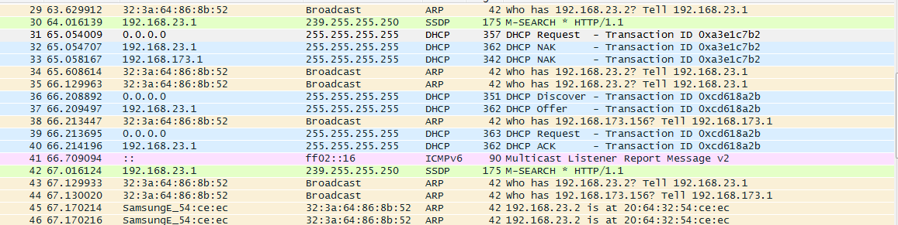
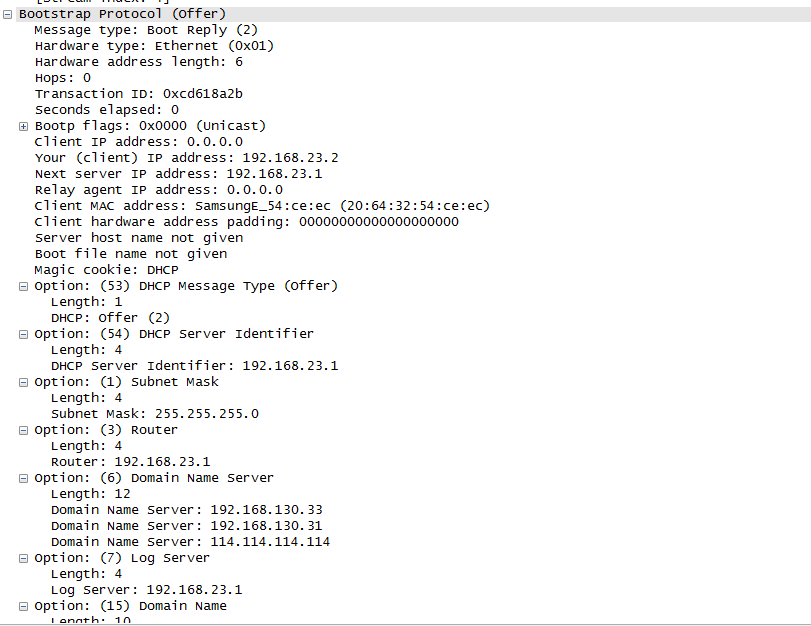

DNS 是互联网中非常重要的一个系统。任何主机、设备，要想访问网络，几乎都需要先通过 DNS 服务器，查询主机的 IP 地址，然后才能与目标主机通信。通常情况下，我们都是无需为主机或设备设置 DNS 服务器地址的，那么那些 DNS 服务器地址究竟是哪里来的呢？难道是厂商事先在计算机里面埋的静态地址么？如果是这样的话，如果 DNS 服务器的 IP 地址改变了要如何处理呢？这里我们就通过 Wireshark 抓包，分析一下计算机的初始 DNS 服务器地址到底是哪里来的。
<!--more-->
手机在启动之后，首先会通过DHCP协议，来获得自己的IP地址。如下图：

在 DHCP 协议中，需要分配 IP 地址的设备发送一个广播包，也就是 DHCP Request，如图中的第 31 号包所示，其中包含有一个 Transaction ID。由此可见 DHCP 协议是运行于 UDP 之上的。DHCP Request 广播由请求分配 IP 地址的设备的 UDP 68 号端口发出，发向广播的 UDP 67 号端口，如下图：

然而 DHCP 协议不仅仅用于分配 IP 地址，如上图的第 32 号包的 DHCP Request 的 Parameter Request List option 如下：

可见 DHCP 还会被用于，获取子网掩码、域名以及域名解析服务器的地址等信息。

局域网中的 DHCP 服务器在收到 DHCP Request 消息之后，会发出一个 DHCP NACK 作为响应。如 32 和 33 号包。

设备又发送了一个 DHCP Discover 包，这个包的内容与前面的 DHCP Request 包大同小异。DHCP 服务器在收到 DHCP Discover 包之后，将响应一个 DHCP Offer 包，在这个包中将携带有为设备分配的IP地址，可用的域名服务器地址等信息，如第 37 号包：

对于我们这个 case，设备被分配的 IP 地址为 `192.168.23.2` ，DHCP 为设备提供了 3 个域名解析服务器地址，分别为 `192.168.130.33`, `192.168.130.31`，和 `114.114.114.114`，这些域名解析服务器 IP 地址按照优先级进行排列。

后续的DNS请求，我们可以看到，都是发向 192.168.130.33 的，如下图：

由此可见，计算机的域名解析服务器的地址，通常都是来自于 DHCP 服务器的。

Done。
