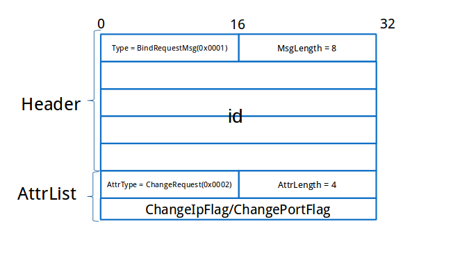
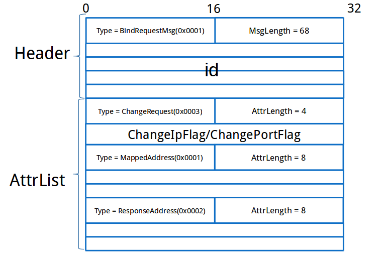

这里基于stund的实现，来研究标准STUN协议，判断NatType的过程。

# stund用于判断NatType的接口的用法

首先来看stund中用于判断NatType的接口的用法。这里主要来看stund中的STUN客户端client.cxx的实现。client.cxx是一个常规的C/C++ app，这个app的主要code如下：
<!--more-->
```
void usage() {
    cerr << "Usage:" << endl
         << "    ./client stunServerHostname [testNumber] [-v] [-p srcPort] "
                 "[-i nicAddr1] [-i nicAddr2] [-i nicAddr3] " << endl
         << "For example, if the STUN server was larry.gloo.net, you could do:" << endl
         << "    ./client larry.gloo.net" << endl
         << "The testNumber is just used for special tests." << endl
         << " test 1 runs test 1 from the RFC. For example:" << endl
         << "    ./client larry.gloo.net 0" << endl << endl << endl;
}

#define MAX_NIC 3
StunAddress4 stunServerAddr;

int main(int argc, char* argv[]) {
    assert( sizeof(UInt8 ) == 1);
    assert( sizeof(UInt16) == 2);
    assert( sizeof(UInt32) == 4);

    initNetwork();

    cout << "STUN client version " << STUN_VERSION << endl;

    int testNum = 0;
    bool verbose = false;

    stunServerAddr.addr = 0;

    int srcPort = 0;
    StunAddress4 sAddr[MAX_NIC];
    int retval[MAX_NIC];
    int numNic = 0;

    for (int i = 0; i < MAX_NIC; i++) {
        sAddr[i].addr = 0;
        sAddr[i].port = 0;
        retval[i] = 0;
    }

    for (int arg = 1; arg < argc; arg++) {
        if (!strcmp(argv[arg], "-v")) {
            verbose = true;
        } else if (!strcmp(argv[arg], "-i")) {
            arg++;
            if (argc <= arg) {
                usage();
                exit(-1);
            }
            if (numNic >= MAX_NIC) {
                cerr << "Can not have more than " << MAX_NIC <<" -i options" << endl;
                usage();
                exit(-1);
            }

            stunParseServerName(argv[arg], sAddr[numNic++]);
        } else if (!strcmp(argv[arg], "-p")) {
            arg++;
            if (argc <= arg) {
                usage();
                exit(-1);
            }
            srcPort = strtol(argv[arg], NULL, 10);
        } else {
            char* ptr;
            int t = strtol(argv[arg], &ptr, 10);
            if (*ptr == 0) {
                // conversion worked
                testNum = t;
                cout << "running test number " << testNum << endl;
            } else {
                bool ret = stunParseServerName(argv[arg], stunServerAddr);
                if (ret != true) {
                    cerr << argv[arg] << " is not a valid host name " << endl;
                    usage();
                    exit(-1);
                }
            }
        }
    }

    if (srcPort == 0) {
        srcPort = stunRandomPort();
    }

    if (numNic == 0) {
        // use default
        numNic = 1;
    }

    for (int nic = 0; nic < numNic; nic++) {
        sAddr[nic].port = srcPort;
        if (stunServerAddr.addr == 0) {
            usage();
            exit(-1);
        }

        if (testNum == 0) {
            bool presPort = false;
            bool hairpin = false;

            NatType stype = stunNatType(stunServerAddr, verbose, &presPort, &hairpin, srcPort, &sAddr[nic]);

            if (nic == 0) {
                cout << "Primary: ";
            } else {
                cout << "Secondary: ";
            }

            switch (stype) {
                case StunTypeFailure:
                    cout << "Some stun error detetecting NAT type";
                    retval[nic] = -1;
                    exit(-1);
                    break;
                case StunTypeUnknown:
                    cout << "Some unknown type error detetecting NAT type";
                    retval[nic] = 0xEE;
                    break;
                case StunTypeOpen:
                    cout << "Open";
                    retval[nic] = 0x00;
                    break;
                case StunTypeIndependentFilter:
                    cout << "Independent Mapping, Independent Filter";
                    if (presPort)
                        cout << ", preserves ports";
                    else
                        cout << ", random port";
                    if (hairpin)
                        cout << ", will hairpin";
                    else
                        cout << ", no hairpin";
                    retval[nic] = 0x02;
                    break;
                case StunTypeDependentFilter:
                    cout << "Independent Mapping, Address Dependent Filter";
                    if (presPort)
                        cout << ", preserves ports";
                    else
                        cout << ", random port";
                    if (hairpin)
                        cout << ", will hairpin";
                    else
                        cout << ", no hairpin";
                    retval[nic] = 0x04;
                    break;
                case StunTypePortDependedFilter:
                    cout << "Independent Mapping, Port Dependent Filter";
                    if (presPort)
                        cout << ", preserves ports";
                    else
                        cout << ", random port";
                    if (hairpin)
                        cout << ", will hairpin";
                    else
                        cout << ", no hairpin";
                    retval[nic] = 0x06;
                    break;
                case StunTypeDependentMapping:
                    cout << "Dependent Mapping";
                    if (presPort)
                        cout << ", preserves ports";
                    else
                        cout << ", random port";
                    if (hairpin)
                        cout << ", will hairpin";
                    else
                        cout << ", no hairpin";
                    retval[nic] = 0x08;
                    break;
                case StunTypeFirewall:
                    cout << "Firewall";
                    retval[nic] = 0x0A;
                    break;
                case StunTypeBlocked:
                    cout << "Blocked or could not reach STUN server";
                    retval[nic] = 0x0C;
                    break;
                default:
                    cout << stype;
                    cout << "Unkown NAT type";
                    retval[nic] = 0x0E;  // Unknown NAT type
                    break;
            }
            cout << "\t";
            cout.flush();

            if (!hairpin) {
                retval[nic] |= 0x10;
            }

            if (presPort) {
                retval[nic] |= 0x01;
            }
        } else if (testNum == 100) {
```
可以看到这个app主要做了3件事情：

1. 解析参数。主要从参数中获得STUN server的地址，及本地用于发送数据包所用的UDP端口号。

2. 调用stunNatType()函数判断NatType。判断NatType的全部逻辑都在这个函数里。

3. 将stunNatType()函数返回的NatType进行格式化并打印输出，以便于人的阅读。

接着来看stunNatType()函数的实现

# stunNatType()函数的实现

stunNatType()函数的实现如下：
```
NatType stunNatType(StunAddress4& dest, bool verbose, bool* preservePort,  // if set, is return for if NAT preservers ports or not
                    bool* hairpin,  // if set, is the return for if NAT will hairpin packets
                    int port,  // port to use for the test, 0 to choose random port
                    StunAddress4* sAddr  // NIC to use
                    ) {
    assert( dest.addr != 0);
    assert( dest.port != 0);

    if (hairpin) {
        *hairpin = false;
    }

    if (port == 0) {
        port = stunRandomPort();
    }
    UInt32 interfaceIp = 0;
    if (sAddr) {
        interfaceIp = sAddr->addr;
    }
    Socket myFd1 = openPort(port, interfaceIp, verbose);
    Socket myFd2 = openPort(port + 1, interfaceIp, verbose);

    if ((myFd1 == INVALID_SOCKET) || (myFd2 == INVALID_SOCKET)) {
        cerr << "Some problem opening port/interface to send on" << endl;
        return StunTypeFailure;
    }

    assert( myFd1 != INVALID_SOCKET);
    assert( myFd2 != INVALID_SOCKET);

    bool respTestI = false;
    bool isNat = true;
    StunAddress4 testImappedAddr;
    bool respTestI2 = false;
    bool mappedIpSame = true;
    StunAddress4 testI2mappedAddr;
    StunAddress4 testI2dest = dest;
    bool respTestII = false;
    bool respTestIII = false;

    bool respTestHairpin = false;
    bool respTestPreservePort = false;

    memset(&testImappedAddr, 0, sizeof(testImappedAddr));

    StunAtrString username;
    StunAtrString password;

    username.sizeValue = 0;
    password.sizeValue = 0;

#ifdef USE_TLS 
    stunGetUserNameAndPassword( dest, username, password );
#endif

    int count = 0;
    while (count < 7) {
        struct timeval tv;
        fd_set fdSet;
#ifdef WIN32
        unsigned int fdSetSize;
#else
        int fdSetSize;
#endif
        FD_ZERO(&fdSet);
        fdSetSize = 0;
        FD_SET(myFd1, &fdSet);
        fdSetSize = (myFd1 + 1 > fdSetSize) ? myFd1 + 1 : fdSetSize;
        FD_SET(myFd2, &fdSet);
        fdSetSize = (myFd2 + 1 > fdSetSize) ? myFd2 + 1 : fdSetSize;
        tv.tv_sec = 0;
        tv.tv_usec = 150 * 1000;  // 150 ms
        if (count == 0)
            tv.tv_usec = 0;

        int err = select(fdSetSize, &fdSet, NULL, NULL, &tv);
        int e = getErrno();
        if (err == SOCKET_ERROR) {
            // error occured
            cerr << "Error " << e << " " << strerror(e) << " in select" << endl;
            return StunTypeFailure;
        } else if (err == 0) {
            // timeout occured
            count++;

            if (!respTestI) {
                stunSendTest(myFd1, dest, username, password, 1, verbose);
            }

            if ((!respTestI2) && respTestI) {
                // check the address to send to if valid
                if ((testI2dest.addr != 0) && (testI2dest.port != 0)) {
                    stunSendTest(myFd1, testI2dest, username, password, 10, verbose);
                }
            }

            if (!respTestII) {
                stunSendTest(myFd2, dest, username, password, 2, verbose);
            }

            if (!respTestIII) {
                stunSendTest(myFd2, dest, username, password, 3, verbose);
            }

            if (respTestI && (!respTestHairpin)) {
                if ((testImappedAddr.addr != 0) && (testImappedAddr.port != 0)) {
                    stunSendTest(myFd1, testImappedAddr, username, password, 11, verbose);
                }
            }
        } else {
            //if (verbose) clog << "-----------------------------------------" << endl;
            assert( err>0);
            // data is avialbe on some fd

            for (int i = 0; i < 2; i++) {
                Socket myFd;
                if (i == 0) {
                    myFd = myFd1;
                } else {
                    myFd = myFd2;
                }

                if (myFd != INVALID_SOCKET) {
                    if (FD_ISSET(myFd,&fdSet)) {
                        char msg[STUN_MAX_MESSAGE_SIZE];
                        int msgLen = sizeof(msg);

                        StunAddress4 from;

                        getMessage(myFd, msg, &msgLen, &from.addr, &from.port, verbose);

                        StunMessage resp;
                        memset(&resp, 0, sizeof(StunMessage));

                        stunParseMessage(msg, msgLen, resp, verbose);

                        if (verbose) {
                            clog << "Received message of type " << resp.msgHdr.msgType << "  id="
                                 << (int) (resp.msgHdr.id.octet[0]) << endl;
                        }

                        switch (resp.msgHdr.id.octet[0]) {
                            case 1: {
                                if (!respTestI) {
                                    testImappedAddr.addr = resp.mappedAddress.ipv4.addr;
                                    testImappedAddr.port = resp.mappedAddress.ipv4.port;

                                    respTestPreservePort = (testImappedAddr.port == port);
                                    if (preservePort) {
                                        *preservePort = respTestPreservePort;
                                    }

                                    testI2dest.addr = resp.changedAddress.ipv4.addr;

                                    if (sAddr) {
                                        sAddr->port = testImappedAddr.port;
                                        sAddr->addr = testImappedAddr.addr;
                                    }

                                    count = 0;
                                }
                                respTestI = true;
                            }
                                break;
                            case 2: {
                                respTestII = true;
                            }
                                break;
                            case 3: {
                                respTestIII = true;
                            }
                                break;
                            case 10: {
                                if (!respTestI2) {
                                    testI2mappedAddr.addr = resp.mappedAddress.ipv4.addr;
                                    testI2mappedAddr.port = resp.mappedAddress.ipv4.port;

                                    mappedIpSame = false;
                                    if ((testI2mappedAddr.addr == testImappedAddr.addr)
                                            && (testI2mappedAddr.port == testImappedAddr.port)) {
                                        mappedIpSame = true;
                                    }

                                }
                                respTestI2 = true;
                            }
                                break;
                            case 11: {
                                if (hairpin) {
                                    *hairpin = true;
                                }
                                respTestHairpin = true;
                            }
                                break;
                        }
                    }
                }
            }
        }
    }

    // see if we can bind to this address
    //cerr << "try binding to " << testImappedAddr << endl;
    Socket s = openPort(0/*use ephemeral*/, testImappedAddr.addr, false);
    if (s != INVALID_SOCKET) {
        closesocket(s);
        isNat = false;
        //cerr << "binding worked" << endl;
    } else {
        isNat = true;
        //cerr << "binding failed" << endl;
    }

    if (verbose) {
        clog << "test I = " << respTestI << endl;
        clog << "test II = " << respTestII << endl;
        clog << "test III = " << respTestIII << endl;
        clog << "test I(2) = " << respTestI2 << endl;
        clog << "is nat  = " << isNat << endl;
        clog << "mapped IP same = " << mappedIpSame << endl;
        clog << "hairpin = " << respTestHairpin << endl;
        clog << "preserver port = " << respTestPreservePort << endl;
    }

#if 0
    // implement logic flow chart from draft RFC
    if (respTestI) {
        if (isNat) {
            if (respTestII) {
                return StunTypeConeNat;
            } else {
                if (mappedIpSame) {
                    if (respTestIII) {
                        return StunTypeRestrictedNat;
                    } else {
                        return StunTypePortRestrictedNat;
                    }
                } else {
                    return StunTypeSymNat;
                }
            }
        } else {
            if (respTestII) {
                return StunTypeOpen;
            } else {
                return StunTypeSymFirewall;
            }
        }
    } else {
        return StunTypeBlocked;
    }
#else
    if (respTestI) {  // not blocked
        if (isNat) {
            if (mappedIpSame) {
                if (respTestII) {
                    return StunTypeIndependentFilter;
                } else {
                    if (respTestIII) {
                        return StunTypeDependentFilter;
                    } else {
                        return StunTypePortDependedFilter;
                    }
                }
            } else {  // mappedIp is not same
                return StunTypeDependentMapping;
            }
        } else {  // isNat is false
            if (respTestII) {
                return StunTypeOpen;
            } else {
                return StunTypeFirewall;
            }
        }
    } else {
        return StunTypeBlocked;
    }
#endif

    return StunTypeUnknown;
}
```
可以看到这个函数主要做了几件事：

1. 打开了两个UDP socket。后续会通过这两个socket来进行数据包的发送，并最终根据这些数据包的响应数据包的情况来判断NatType。

2. 向STUN server发送请求。调用stunSendTest()函数发送了5种不同类型的消息，各个消息之间的差异也仅仅在与stunSendTest()函数的testNum参数不同。这里我们也用testNum来区分不同的消息，我们称它们分别为类型1，类型2，类型3，类型10及类型11的消息。
其中类型10和类型11的消息依赖于类型1的消息的响应，但类型2和类型3的消息的发送则与类型1的消息的发送及响应相互独立，因而它们可以与类型1的消息并行的发送。

3. 接收发送的消息的响应。
从类型1的消息的响应中获得的东西比较多。类型10和类型11的消息要发送的目标地址，都来源于类型1的消息的响应。
类型10的消息发向类型1的消息的响应的changedAddress地址。这个地址是STUN server的副IP地址及端口号。
类型11的消息则发向类型1的消息的响应的testImappedAddr地址，这个地址是发送消息的地址的出口公网地址，向这个消息发送消息实际是向本节点在发送消息，这么做的实际目的是为了测试节点所连接的NAT是否支持消息的回传，或者说测试NAT是否是hairpin的。即如果这个类型11的消息通过NAT并最终被发送给本节点且本节点接收到了这个消息，则说明本节点所连接的NAT是hairpin的。
STUN终端会从类型10的消息的响应中获得相同的本地网络地址到另外的网络地址（IP地址与类型1的目标IP地址不同）的出口公网地址，并用这个地址与类型1的响应中携带的那个出口公网地址进行比较，以此来判断当前节点所连接的NAT是否是对称型的。
除了类型1和类型10之外，发送其它的消息主要就是看看是否能获得对应的响应。

4. 根据发送的这5种不同类型的消息的响应来判断当前节点所连接的NAT的类型并返回给调用者。

下面我们再用几张图来详细地说明，这些消息都发到了哪里，而响应又是从哪里返回回来的。

先说明一下，stund的STUN Server需要部署在一台具有双网卡且每个网卡都有一个自己公网IP地址的主机上。STUN Server的两个IP可以称为IPAddr1（primary IP）和IPAddr2（alt IP），两个端口可以称为Port1（primary port）和Port2（alt port），这两个端口默认分别为3478和3479。STUN Server会打开4个sockets，每个IP两个分别对应两个不同的端口。

首先是消息1：


消息1从客户端的第一个端口Port1发向STUN Server的IPAddr1:Port1，响应中则会携带客户端发送消息的端口的出口网络地址，及IPAddr2:Port2，以为后续发送消息10及消息11做准备。

消息2：


消息2从客户端的第二个端口，发向STUN Server的IPAddr1:Port1，这个消息请求STUN Server将响应从它的IPAddr2:Port1发送回来，也就是相对于接收数据包的网络地址而言切换一下IP地址的网络地址。

发送这个消息的目的是什么呢？这个消息的响应如果能接收到的话，说明当前节点连接的NAT的类型为全锥型的，说明NAT对于发向其内部的主机的数据包几乎没有限制。

这里为什么要从第二个端口发送消息呢？这主要是因为，类型10的消息会发向IPAddr2:Port1，这实际上会对消息2的响应的接收产生干扰。如果一个地址向IPAddr2:Port1发送了消息，即使当前节点连接的NAT的类型不是全锥型的，从IPAddr2:Port1发回来的消息也可能被接收到。

消息3：


消息3同样从客户端的第二个端口发出，且同样发向STUN Server的IPAddr1:Port1，但这个消息请求STUN Server将响应从它的IPAddr1:Port2发送回来，也就是相对于接收数据包的网络地址而言切换一下端口的网络地址。

在消息2的响应接收不到的情况下，如果消息3的响应可以接收到，说明NAT对传入给内部主机的包是限制IP而不限制端口的，也就是说当前节点连接的NAT的类型是IP限制型的。

消息4：


# 针对多主机部署的STUN Server优化

由上面的过程，不难看到，STUN Server的部署有一个比较大的限制，即要求部署的主机具有双网卡，这对于我们当前遍地云主机的环境而言，部署起来是不那么方便的。主要是对于类型2的消息，客户端请求STUN Server切换一下IP地址将消息发回来。

因而一种用于stund的STUN Server的优化设计应运而生，结构如下图：


这种设计主要是让STUN Server只绑定一个IP上的两个端口，同时在STUN之间建立一个通信信道，以便于类型2的消息能得到合适的处理。

针对多主机部署的STUN Server的优化当前实现的状况：
Github主页：[https://github.com/hanpfei/stund](https://github.com/hanpfei/stund)

# STUN消息的格式

具体可多主机部署的STUN Server要如何设计？这还要从STUN消息的具体格式说起。接着来看下STUN消息的具体格式。

首先是客户端发送的请求的格式。我们可以通过stunSendTest()函数的实现来对这个问题做一番了解：

```
static void stunSendTest(Socket myFd, StunAddress4& dest, const StunAtrString& username, const StunAtrString& password,
                         int testNum, bool verbose) {
    assert( dest.addr != 0);
    assert( dest.port != 0);

    bool changePort = false;
    bool changeIP = false;
    bool discard = false;

    switch (testNum) {
        case 1:
        case 10:
        case 11:
            break;
        case 2:
            //changePort=true;
            changeIP = true;
            break;
        case 3:
            changePort = true;
            break;
        case 4:
            changeIP = true;
            break;
        case 5:
            discard = true;
            break;
        default:
            cerr << "Test " << testNum << " is unkown\n";
            assert(0);
    }

    StunMessage req;
    memset(&req, 0, sizeof(StunMessage));

    stunBuildReqSimple(&req, username, changePort, changeIP, testNum);

    char buf[STUN_MAX_MESSAGE_SIZE];
    int len = STUN_MAX_MESSAGE_SIZE;

    len = stunEncodeMessage(req, buf, len, password, verbose);

    if (verbose) {
        clog << "About to send msg of len " << len << " to " << dest << endl;
    }

    sendMessage(myFd, buf, len, dest.addr, dest.port, verbose);

    // add some delay so the packets don't get sent too quickly
#ifdef WIN32 // !cj! TODO - should fix this up in windows
    clock_t now = clock();
    assert( CLOCKS_PER_SEC == 1000 );
    while ( clock() <= now+10 ) {};
#else
    usleep(10 * 1000);
#endif

}
```
从这里似乎也得不到太多STUN消息格式的具体信息，细节都被放在stunBuildReqSimple()和stunEncodeMessage()两个函数中了，接着来看这两个函数的实现：
```
static char*
encodeAtrChangeRequest(char* ptr, const StunAtrChangeRequest& atr) {
    ptr = encode16(ptr, ChangeRequest);
    ptr = encode16(ptr, 4);
    ptr = encode32(ptr, atr.value);
    return ptr;
}


unsigned int stunEncodeMessage(const StunMessage& msg, char* buf, unsigned int bufLen, const StunAtrString& password,
                               bool verbose) {
    assert(bufLen >= sizeof(StunMsgHdr));
    char* ptr = buf;

    ptr = encode16(ptr, msg.msgHdr.msgType);
    char* lengthp = ptr;
    ptr = encode16(ptr, 0);
    ptr = encode(ptr, reinterpret_cast<const char*>(msg.msgHdr.id.octet), sizeof(msg.msgHdr.id));

    if (verbose)
        clog << "Encoding stun message: " << endl;
    if (msg.hasMappedAddress) {
        if (verbose)
            clog << "Encoding MappedAddress: " << msg.mappedAddress.ipv4 << endl;
        ptr = encodeAtrAddress4(ptr, MappedAddress, msg.mappedAddress);
    }
    if (msg.hasResponseAddress) {
        if (verbose)
            clog << "Encoding ResponseAddress: " << msg.responseAddress.ipv4 << endl;
        ptr = encodeAtrAddress4(ptr, ResponseAddress, msg.responseAddress);
    }
    if (msg.hasChangeRequest) {
        if (verbose)
            clog << "Encoding ChangeRequest: " << msg.changeRequest.value << endl;
        ptr = encodeAtrChangeRequest(ptr, msg.changeRequest);
    }
    if (msg.hasSourceAddress) {
        if (verbose)
            clog << "Encoding SourceAddress: " << msg.sourceAddress.ipv4 << endl;
        ptr = encodeAtrAddress4(ptr, SourceAddress, msg.sourceAddress);
    }
    if (msg.hasChangedAddress) {
        if (verbose)
            clog << "Encoding ChangedAddress: " << msg.changedAddress.ipv4 << endl;
        ptr = encodeAtrAddress4(ptr, ChangedAddress, msg.changedAddress);
    }
    if (msg.hasUsername) {
        if (verbose)
            clog << "Encoding Username: " << msg.username.value << endl;
        ptr = encodeAtrString(ptr, Username, msg.username);
    }
    if (msg.hasPassword) {
        if (verbose)
            clog << "Encoding Password: " << msg.password.value << endl;
        ptr = encodeAtrString(ptr, Password, msg.password);
    }
    if (msg.hasErrorCode) {
        if (verbose)
            clog << "Encoding ErrorCode: class=" << int(msg.errorCode.errorClass) << " number="
                 << int(msg.errorCode.number) << " reason=" << msg.errorCode.reason << endl;

        ptr = encodeAtrError(ptr, msg.errorCode);
    }
    if (msg.hasUnknownAttributes) {
        if (verbose)
            clog << "Encoding UnknownAttribute: ???" << endl;
        ptr = encodeAtrUnknown(ptr, msg.unknownAttributes);
    }
    if (msg.hasReflectedFrom) {
        if (verbose)
            clog << "Encoding ReflectedFrom: " << msg.reflectedFrom.ipv4 << endl;
        ptr = encodeAtrAddress4(ptr, ReflectedFrom, msg.reflectedFrom);
    }
    if (msg.hasXorMappedAddress) {
        if (verbose)
            clog << "Encoding XorMappedAddress: " << msg.xorMappedAddress.ipv4 << endl;
        ptr = encodeAtrAddress4(ptr, XorMappedAddress, msg.xorMappedAddress);
    }
    if (msg.xorOnly) {
        if (verbose)
            clog << "Encoding xorOnly: " << endl;
        ptr = encodeXorOnly(ptr);
    }
    if (msg.hasServerName) {
        if (verbose)
            clog << "Encoding ServerName: " << msg.serverName.value << endl;
        ptr = encodeAtrString(ptr, ServerName, msg.serverName);
    }
    if (msg.hasSecondaryAddress) {
        if (verbose)
            clog << "Encoding SecondaryAddress: " << msg.secondaryAddress.ipv4 << endl;
        ptr = encodeAtrAddress4(ptr, SecondaryAddress, msg.secondaryAddress);
    }

    if (password.sizeValue > 0) {
        if (verbose)
            clog << "HMAC with password: " << password.value << endl;

        StunAtrIntegrity integrity;
        computeHmac(integrity.hash, buf, int(ptr - buf), password.value, password.sizeValue);
        ptr = encodeAtrIntegrity(ptr, integrity);
    }
    if (verbose)
        clog << endl;

    encode16(lengthp, UInt16(ptr - buf - sizeof(StunMsgHdr)));
    return int(ptr - buf);
}


void stunBuildReqSimple(StunMessage* msg, const StunAtrString& username, bool changePort, bool changeIp,
                        unsigned int id) {
    assert( msg);
    memset(msg, 0, sizeof(*msg));

    msg->msgHdr.msgType = BindRequestMsg;

    for (int i = 0; i < 16; i = i + 4) {
        assert(i+3<16);
        int r = stunRand();
        msg->msgHdr.id.octet[i + 0] = r >> 0;
        msg->msgHdr.id.octet[i + 1] = r >> 8;
        msg->msgHdr.id.octet[i + 2] = r >> 16;
        msg->msgHdr.id.octet[i + 3] = r >> 24;
    }

    if (id != 0) {
        msg->msgHdr.id.octet[0] = id;
    }

    msg->hasChangeRequest = true;
    msg->changeRequest.value = (changeIp ? ChangeIpFlag : 0) | (changePort ? ChangePortFlag : 0);

    if (username.sizeValue > 0) {
        msg->hasUsername = true;
        msg->username = username;
    }
}
```
由这些函数的实现，当不难理出来STUN请求消息的格式大体为：


整体来看，STUN请求消息分为两个部分，一部分是Header，另一部分是Attr的List。

而Header又包含消息的类型，消息不包含Header的长度，及一个128位16字节的id。在stund中，id的首个字节保存了消息的类型。STUN Server会原封不动的将客户端发过去的消息的id包含在响应中发回给客户端，在stund中，使用了id的首个字节用以区分发出去的不同类型的消息的响应。

Attr的List则是一系列的Attr。Attr的结构大体为，先是一个16位的AttrType，然后是16位的Attr值长度，接着便是Attr的值，而Attr的值所占字节数因Attr的不同而不同。对于判断NatType这个case而言，AttrList中只有一个Attr，及类型为ChangeRequest的Attr，它有一个32位4字节的值。这个Attr用于告诉STUN Server，响应应该从哪个网络地址发回来。

看完了STUN请求消息的格式之后，接着再来看STUN响应消息的格式。这个我们可以从stunServerProcessMsg()函数的实现来了解：
```
bool stunServerProcessMsg(char* buf, unsigned int bufLen, StunAddress4& from, StunAddress4& secondary,
                          StunAddress4& myAddr, StunAddress4& altAddr, StunMessage* resp, StunAddress4* destination,
                          StunAtrString* hmacPassword, bool* changePort, bool* changeIp, bool verbose) {

    // set up information for default response

    memset(resp, 0, sizeof(*resp));

    *changeIp = false;
    *changePort = false;

    StunMessage req;
    bool ok = stunParseMessage(buf, bufLen, req, verbose);

    if (!ok) {      // Complete garbage, drop it on the floor
        if (verbose)
            clog << "Request did not parse" << endl;
        return false;
    }
    if (verbose)
        clog << "Request parsed ok" << endl;

    StunAddress4 mapped = req.mappedAddress.ipv4;
    StunAddress4 respondTo = req.responseAddress.ipv4;
    UInt32 flags = req.changeRequest.value;

    switch (req.msgHdr.msgType) {
        case SharedSecretRequestMsg:
            if (verbose)
                clog << "Received SharedSecretRequestMsg on udp. send error 433." << endl;
            // !cj! - should fix so you know if this came over TLS or UDP
            stunCreateSharedSecretResponse(req, from, *resp);
            //stunCreateSharedSecretErrorResponse(*resp, 4, 33, "this request must be over TLS");
            return true;

        case BindRequestMsg:
            if (!req.hasMessageIntegrity) {
                if (verbose)
                    clog << "BindRequest does not contain MessageIntegrity" << endl;

                if (0) {  // !jf! mustAuthenticate
                    if (verbose)
                        clog << "Received BindRequest with no MessageIntegrity. Sending 401." << endl;
                    stunCreateErrorResponse(*resp, 4, 1, "Missing MessageIntegrity");
                    return true;
                }
            } else {
                if (!req.hasUsername) {
                    if (verbose)
                        clog << "No UserName. Send 432." << endl;
                    stunCreateErrorResponse(*resp, 4, 32, "No UserName and contains MessageIntegrity");
                    return true;
                } else {
                    if (verbose)
                        clog << "Validating username: " << req.username.value << endl;
                    // !jf! could retrieve associated password from provisioning here
                    if (strcmp(req.username.value, "test") == 0) {
                        if (0) {
                            // !jf! if the credentials are stale
                            stunCreateErrorResponse(*resp, 4, 30, "Stale credentials on BindRequest");
                            return true;
                        } else {
                            if (verbose)
                                clog << "Validating MessageIntegrity" << endl;
                            // need access to shared secret

                            unsigned char hmac[20];
#ifndef NOSSL
                            unsigned int hmacSize=20;

                            HMAC(EVP_sha1(),
                                    "1234", 4,
                                    reinterpret_cast<const unsigned char*>(buf), bufLen-20-4,
                                    hmac, &hmacSize);
                            assert(hmacSize == 20);
#endif

                            if (memcmp(buf, hmac, 20) != 0) {
                                if (verbose)
                                    clog << "MessageIntegrity is bad. Sending " << endl;
                                stunCreateErrorResponse(*resp, 4, 3, "Unknown username. Try test with password 1234");
                                return true;
                            }

                            // need to compute this later after message is filled in
                            resp->hasMessageIntegrity = true;
                            assert(req.hasUsername);
                            resp->hasUsername = true;
                            resp->username = req.username;  // copy username in
                        }
                    } else {
                        if (verbose)
                            clog << "Invalid username: " << req.username.value << "Send 430." << endl;
                    }
                }
            }

            // TODO !jf! should check for unknown attributes here and send 420 listing the
            // unknown attributes.

            if (respondTo.port == 0)
                respondTo = from;
            if (mapped.port == 0)
                mapped = from;

            *changeIp = (flags & ChangeIpFlag) ? true : false;
            *changePort = (flags & ChangePortFlag) ? true : false;

            if (verbose) {
                clog << "Request is valid:" << endl;
                clog << "\t flags=" << flags << endl;
                clog << "\t changeIp=" << *changeIp << endl;
                clog << "\t changePort=" << *changePort << endl;
                clog << "\t from = " << from << endl;
                clog << "\t respond to = " << respondTo << endl;
                clog << "\t mapped = " << mapped << endl;
            }

            // form the outgoing message
            resp->msgHdr.msgType = BindResponseMsg;
            for (int i = 0; i < 16; i++) {
                resp->msgHdr.id.octet[i] = req.msgHdr.id.octet[i];
            }

            if (req.xorOnly == false) {
                resp->hasMappedAddress = true;
                resp->mappedAddress.ipv4.port = mapped.port;
                resp->mappedAddress.ipv4.addr = mapped.addr;
            }

            if (1) {  // do xorMapped address or not
                resp->hasXorMappedAddress = true;
                UInt16 id16 = req.msgHdr.id.octet[0] << 8 | req.msgHdr.id.octet[1];
                UInt32 id32 = req.msgHdr.id.octet[0] << 24 | req.msgHdr.id.octet[1] << 16 | req.msgHdr.id.octet[2] << 8
                        | req.msgHdr.id.octet[3];
                resp->xorMappedAddress.ipv4.port = mapped.port ^ id16;
                resp->xorMappedAddress.ipv4.addr = mapped.addr ^ id32;
            }

            resp->hasSourceAddress = true;
            resp->sourceAddress.ipv4.port = (*changePort) ? altAddr.port : myAddr.port;
            resp->sourceAddress.ipv4.addr = (*changeIp) ? altAddr.addr : myAddr.addr;

            resp->hasChangedAddress = true;
            resp->changedAddress.ipv4.port = altAddr.port;
            resp->changedAddress.ipv4.addr = altAddr.addr;

            if (secondary.port != 0) {
                resp->hasSecondaryAddress = true;
                resp->secondaryAddress.ipv4.port = secondary.port;
                resp->secondaryAddress.ipv4.addr = secondary.addr;
            }

            if (req.hasUsername && req.username.sizeValue > 0) {
                // copy username in
                resp->hasUsername = true;
                assert( req.username.sizeValue % 4 == 0);
                assert( req.username.sizeValue < STUN_MAX_STRING);
                memcpy(resp->username.value, req.username.value, req.username.sizeValue);
                resp->username.sizeValue = req.username.sizeValue;
            }

            if (1) {  // add ServerName
                resp->hasServerName = true;
                const char serverName[] = "Vovida.org " STUN_VERSION;  // must pad to mult of 4

                assert( sizeof(serverName) < STUN_MAX_STRING);
                //cerr << "sizeof serverName is "  << sizeof(serverName) << endl;
                assert( sizeof(serverName)%4 == 0);
                memcpy(resp->serverName.value, serverName, sizeof(serverName));
                resp->serverName.sizeValue = sizeof(serverName);
            }

            if (req.hasMessageIntegrity & req.hasUsername) {
                // this creates the password that will be used in the HMAC when then
                // messages is sent
                stunCreatePassword(req.username, hmacPassword);
            }

            if (req.hasUsername && (req.username.sizeValue > 64)) {
                UInt32 source;
                assert( sizeof(int) == sizeof(UInt32));

                sscanf(req.username.value, "%x", &source);
                resp->hasReflectedFrom = true;
                resp->reflectedFrom.ipv4.port = 0;
                resp->reflectedFrom.ipv4.addr = source;
            }

            destination->port = respondTo.port;
            destination->addr = respondTo.addr;

            return true;

        default:
            if (verbose)
                clog << "Unknown or unsupported request " << endl;
            return false;
    }

    assert(0);
    return false;
}
```
由这个函数的实现，我们不难看出STUN Server发回给客户端的响应的消息格式与请求的格式大体一样，但消息的具体内容有一些区别。消息的格式大体为：


这个消息里的内容要多一点。

了解了STUN客户端和STUN Server间交互的这些UDP数据包的格式之后，我们就可以确定可双主机部署的STUN Server间通信的消息的格式了。

仔细来看stunServerProcessMsg()，我们注意到，STUN server响应发送的目标地址，以及返回给客户端的它的出口公网地址也就是mappedAddress也没有限定只能是from地址，这些值也可以来源于请求消息。

借助于stund的这些良好设计，可以大大简化我们的可双主机部署的STUN server的设计与实现。STUN server间的消息格式可以为：



也就是说，当STUN Server收到类型2的消息时，构造一个格式如上图的消息，并将该消息转发给另为一个STUN Server。其中MappedAddress和ResponseAddress Attr的值都是消息的from地址，即客户端发送消息的端口的出口公网地址。

经过对stunServerProcessMsg()的一番改造，终于可以实现STUN Server的多主机部署，其改造后的实现为：
```
bool stunServerProcessMsg(StunServerInfo& info, char* buf, unsigned int bufLen, StunAddress4& from,
                          StunAddress4& secondary, StunAddress4& myAddr, StunAddress4& altAddr, StunMessage* resp,
                          StunAddress4* destination, StunAtrString* hmacPassword, bool* changePort, bool* changeIp,
                          bool verbose) {

    // set up information for default response

    memset(resp, 0, sizeof(*resp));

    *changeIp = false;
    *changePort = false;

    StunMessage req;
    bool ok = stunParseMessage(buf, bufLen, req, verbose);

    if (!ok) {      // Complete garbage, drop it on the floor
        if (verbose)
            clog << "Request did not parse" << endl;
        return false;
    }
    if (verbose)
        clog << "Request parsed ok" << endl;

    StunAddress4 mapped = req.mappedAddress.ipv4;
    StunAddress4 respondTo = req.responseAddress.ipv4;
    UInt32 flags = req.changeRequest.value;

    switch (req.msgHdr.msgType) {
        case SharedSecretRequestMsg:
            if (verbose)
                clog << "Received SharedSecretRequestMsg on udp. send error 433." << endl;
            // !cj! - should fix so you know if this came over TLS or UDP
            stunCreateSharedSecretResponse(req, from, *resp);
            //stunCreateSharedSecretErrorResponse(*resp, 4, 33, "this request must be over TLS");
            return true;

        case BindRequestMsg:
            if (!req.hasMessageIntegrity) {
                if (verbose)
                    clog << "BindRequest does not contain MessageIntegrity" << endl;

                if (0) {  // !jf! mustAuthenticate
                    if (verbose)
                        clog << "Received BindRequest with no MessageIntegrity. Sending 401." << endl;
                    stunCreateErrorResponse(*resp, 4, 1, "Missing MessageIntegrity");
                    return true;
                }
            } else {
                if (!req.hasUsername) {
                    if (verbose)
                        clog << "No UserName. Send 432." << endl;
                    stunCreateErrorResponse(*resp, 4, 32, "No UserName and contains MessageIntegrity");
                    return true;
                } else {
                    if (verbose)
                        clog << "Validating username: " << req.username.value << endl;
                    // !jf! could retrieve associated password from provisioning here
                    if (strcmp(req.username.value, "test") == 0) {
                        if (0) {
                            // !jf! if the credentials are stale
                            stunCreateErrorResponse(*resp, 4, 30, "Stale credentials on BindRequest");
                            return true;
                        } else {
                            if (verbose)
                                clog << "Validating MessageIntegrity" << endl;
                            // need access to shared secret

                            unsigned char hmac[20];
#ifndef NOSSL
                            unsigned int hmacSize=20;

                            HMAC(EVP_sha1(),
                                    "1234", 4,
                                    reinterpret_cast<const unsigned char*>(buf), bufLen-20-4,
                                    hmac, &hmacSize);
                            assert(hmacSize == 20);
#endif

                            if (memcmp(buf, hmac, 20) != 0) {
                                if (verbose)
                                    clog << "MessageIntegrity is bad. Sending " << endl;
                                stunCreateErrorResponse(*resp, 4, 3, "Unknown username. Try test with password 1234");
                                return true;
                            }

                            // need to compute this later after message is filled in
                            resp->hasMessageIntegrity = true;
                            assert(req.hasUsername);
                            resp->hasUsername = true;
                            resp->username = req.username;  // copy username in
                        }
                    } else {
                        if (verbose)
                            clog << "Invalid username: " << req.username.value << "Send 430." << endl;
                    }
                }
            }

            // TODO !jf! should check for unknown attributes here and send 420 listing the
            // unknown attributes.

            if (respondTo.port == 0)
                respondTo = from;
            if (mapped.port == 0)
                mapped = from;

            *changeIp = (flags & ChangeIpFlag) ? true : false;
            *changePort = (flags & ChangePortFlag) ? true : false;

            if (verbose) {
                clog << "Request is valid:" << endl;
                clog << "\t flags=" << flags << endl;
                clog << "\t changeIp=" << *changeIp << endl;
                clog << "\t changePort=" << *changePort << endl;
                clog << "\t from = " << from << endl;
                clog << "\t respond to = " << respondTo << endl;
                clog << "\t mapped = " << mapped << endl;
            }

            // form the outgoing message
            for (int i = 0; i < 16; i++) {
                resp->msgHdr.id.octet[i] = req.msgHdr.id.octet[i];
            }
            if (*changeIp && info.altIpFd == INVALID_SOCKET) {
                resp->msgHdr.msgType = req.msgHdr.msgType;

                *changeIp = false;
                *changePort = false;

                resp->hasChangeRequest = true;
                resp->changeRequest.value = changePort ? ChangePortFlag : 0;

                resp->hasMappedAddress = true;
                resp->mappedAddress.ipv4.port = mapped.port;
                resp->mappedAddress.ipv4.addr = mapped.addr;

                resp->hasResponseAddress = true;
                resp->responseAddress.ipv4.port = from.port;
                resp->responseAddress.ipv4.addr = from.addr;

                respondTo.port = info.myAddr.port;
                respondTo.addr = info.altAddr.addr;
                if (verbose) {
                    clog << "\t respondTo change = " << respondTo << endl;
                }
            } else {
                resp->msgHdr.msgType = BindResponseMsg;

                if (req.xorOnly == false) {
                    resp->hasMappedAddress = true;
                    resp->mappedAddress.ipv4.port = mapped.port;
                    resp->mappedAddress.ipv4.addr = mapped.addr;
                }

                if (1) {  // do xorMapped address or not
                    resp->hasXorMappedAddress = true;
                    UInt16 id16 = req.msgHdr.id.octet[0] << 8 | req.msgHdr.id.octet[1];
                    UInt32 id32 = req.msgHdr.id.octet[0] << 24 | req.msgHdr.id.octet[1] << 16
                            | req.msgHdr.id.octet[2] << 8 | req.msgHdr.id.octet[3];
                    resp->xorMappedAddress.ipv4.port = mapped.port ^ id16;
                    resp->xorMappedAddress.ipv4.addr = mapped.addr ^ id32;
                }

                resp->hasSourceAddress = true;
                resp->sourceAddress.ipv4.port = (*changePort) ? altAddr.port : myAddr.port;
                resp->sourceAddress.ipv4.addr = (*changeIp) ? altAddr.addr : myAddr.addr;

                resp->hasChangedAddress = true;
                resp->changedAddress.ipv4.port = altAddr.port;
                resp->changedAddress.ipv4.addr = altAddr.addr;

                if (secondary.port != 0) {
                    resp->hasSecondaryAddress = true;
                    resp->secondaryAddress.ipv4.port = secondary.port;
                    resp->secondaryAddress.ipv4.addr = secondary.addr;
                }

                if (req.hasUsername && req.username.sizeValue > 0) {
                    // copy username in
                    resp->hasUsername = true;
                    assert( req.username.sizeValue % 4 == 0);
                    assert( req.username.sizeValue < STUN_MAX_STRING);
                    memcpy(resp->username.value, req.username.value, req.username.sizeValue);
                    resp->username.sizeValue = req.username.sizeValue;
                }

                if (1) {  // add ServerName
                    resp->hasServerName = true;
                    const char serverName[] = "Vovida.org " STUN_VERSION;  // must pad to mult of 4

                    assert( sizeof(serverName) < STUN_MAX_STRING);
                    //cerr << "sizeof serverName is "  << sizeof(serverName) << endl;
                    assert( sizeof(serverName)%4 == 0);
                    memcpy(resp->serverName.value, serverName, sizeof(serverName));
                    resp->serverName.sizeValue = sizeof(serverName);
                }

                if (req.hasMessageIntegrity & req.hasUsername) {
                    // this creates the password that will be used in the HMAC when then
                    // messages is sent
                    stunCreatePassword(req.username, hmacPassword);
                }

                if (req.hasUsername && (req.username.sizeValue > 64)) {
                    UInt32 source;
                    assert( sizeof(int) == sizeof(UInt32));

                    sscanf(req.username.value, "%x", &source);
                    resp->hasReflectedFrom = true;
                    resp->reflectedFrom.ipv4.port = 0;
                    resp->reflectedFrom.ipv4.addr = source;
                }
            }

            destination->port = respondTo.port;
            destination->addr = respondTo.addr;

            return true;

        default:
            if (verbose)
                clog << "Unknown or unsupported request " << endl;
            return false;
    }

    assert(0);
    return false;
}
```

主要的改动即是在发现客户端请求改变IP地址发回响应时，构造如上图中的消息，并发给另一个STUN Server。从而，对于消息2，数据包的流转过程大体如下：


Done。
