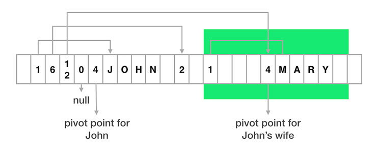
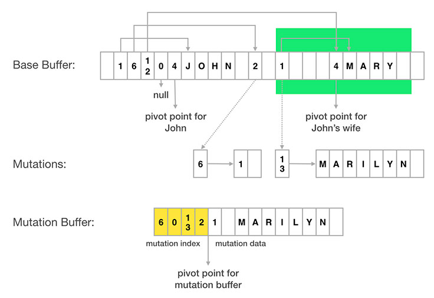
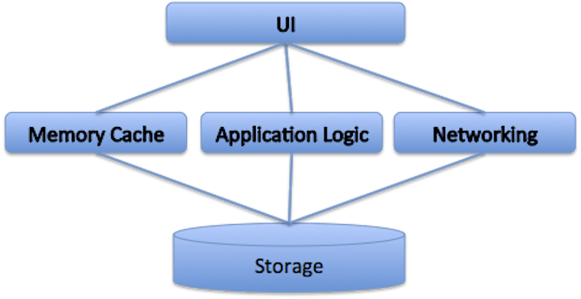
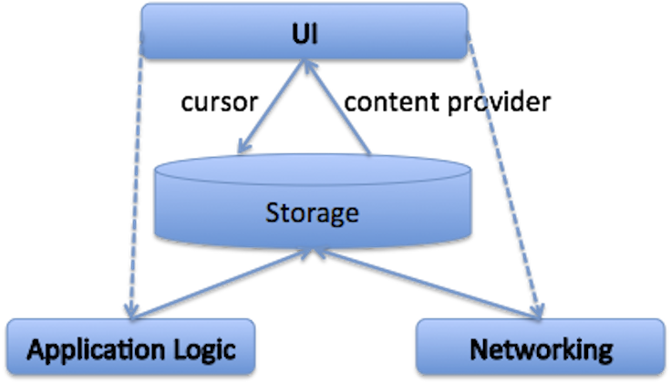

在Facebook上，人们可以通过阅读状态更新和查看照片同他们的家人和朋友来往。在我们的后端，我们保存了组成这些连接的社交图谱的所有数据。在我们的移动客户端，我们不能下载完整的图谱，而是以一个本地的树结构的形式下载一个节点及它的一些连接。

<!--more-->

下面的图片描述了在一个含有照片附件的story中这是如何工作的。在这个例子中，John创建了一个story，他的朋友们很喜欢它并加了评论。图片的左边是社交图谱，用来描述Facebook后端的人际关系。当Android app查询story时，我们获得一个以story开始的树结构，包含了参与者的信息，反馈，和附件（如图片的右边所展示的那样）。


我们要处理的一个重要问题是如何在app中表示并存储数据。规格化所有这些数据为不同的表并放进SQLite数据库不太现实，因为我们查询节点并关联来自于后端的树结构的方式非常非常多，因此我们直接存储树结构。一个解决方案是将树结构存储为JSON，但那将需要我们在它能够被用于UI展示之前先解析JSON，并转换为一个Java对象。而且，JSON解析耗费时间。我们过去常常在Android平台上使用Jackson JSON解析器，但我们发现了它的一些问题：

* **解析速度**。它要耗费35 ms来解析一个20 KB（Facebook中一个典型的响应的大小）的JSON流，这超出了UI帧刷新的16.6 ms的间隔了。使用这种方法，我们无法在滚动时，按照需要及时地从磁盘缓存中加载stories而不出现丢帧(视觉上的抖动)。
* **解析初始化**。一个JSON解析器在它可以开始解析之前，需要构建一个字段映射，这可能要耗费100 ms到200 ms，这大幅地降低了应用的启动时间。
* **垃圾回收**。在JSON解析的过程中要创建大量的小对象，在我们的探索研究中发现，解析一个20 KB的JSON 流时，大概要分配 100 KB的瞬时内存，这将给Java的垃圾回收器带来巨大的压力。

我们想要找到一个更好的存储格式来提升我们的Android app的性能。

# FlatBuffers

在我们对可选的格式的探索中，我们找到了[FlatBuffers](https://google.github.io/flatbuffers/)，来自于Google的一个开源项目。FlatBuffers是protocol buffers（protobuf）的一个进化版，后者已经包含了对象元数据，允许直接地访问数据的独立的子部件，而不必须先反序列化整个对象(在这个例子中，是一棵树)。

想象一下，我们有一个简单的person类对象，它有四个字段： name，friendship status，spouse，及friends列表。spouse和friends字段还包含了person对象，这些形成了一个树结构。这是一个说明了这样一个对象，一个person，John和他的妻子，Mary，在FlatBuffer中是如何布局的简化的图解。

```
class Person {
    String name;
    int friendshipStatus;
    Person spouse;
    List<Person>friends;
}
```


在上面的布局中，你需要注意：
 * 每个对象都被分为两个部分：元数据的部分(或vtable)在轴心点的左边，真实的数据部分在右边。

* 每个字段对应于vtable中的一个槽，其中存储了那个字段的真实数据的偏移量。比如，John的table的第一个槽的值为1，表明了John的名字被存放在了距离Jonh的轴心点向右偏移一个字节的地方。

* 对于对象字段，vtable中的偏移量指向子对象的轴心点。比如，John的vtable中的第三个槽指向了Mary的轴心点。

* 要表示字段没有值，我们可以在一个vtable槽中使用一个0偏移量。

下面的代码片段展示了我们可以如何在上面展示的结构中找到Jonh的妻子的名字。
```
// Root object position is normally stored at beginning of flatbuffer.
int johnPosition = FlatBufferHelper.getRootObjectPosition(flatBuffer);
int maryPosition = FlatBufferHelper.getChildObjectPosition(
   flatBuffer,
   johnPosition, // parent object position
   2 /* field number for spouse field */);

String maryName = FlatBufferHelper.getString(
   flatBuffer,
   maryPosition, // parent object position
   0 /* field number for name field */);
```

注意，不需要创建中间对象，这节省了瞬时内存的分配。我们甚至可以通过直接地把FlatBuffer数据存储在文件中，然后把它mmap进内存中来做进一步的优化。这意味着我只需要加载文件中我们需要读取的部分，这将进一步降低总的内存消耗。

而且，在读取字段之前，无需反序列化对象树。这减少了存储层和UI之间的延迟，它将提升总的性能。

# FlatBuffers上的变化

有时我们需要修改FlatBuffers里的值。由于FlatBuffers有意地设计为不可变的，而没有一个直接的方法来做到这一点。我们想到的一个方案是与最初的FlatBuffer一并追踪变化。

FlatBuffer中的每个数据片段可以通过它在FlatBuffer中的绝对位置来唯一的标识。我们支持变化，因而我们不一定要为很小的更新重新下载整个story——比如friendship status的改变。由于只是例子，这是一个概念的可视化，关于如何使用它来追踪两个变化：
 * Jonh的friendship status由FlatBuffer的绝对索引2处的vtable槽指向。要改变John的status，我们只需要记录绝对索引2所对应的那个数据现在为1（意味着一个friend）而不是2（意味着不是一个friend，但需要发送friendship请求）。

 * Mary的名字(“Mary”)由位于绝对索引13处的一个vtable槽指向。类似地，要修改Mary的名字，我们只需要记录对应于绝对索引13的新的String值。

最后，我们可以把所有的变化打包进变化缓冲区。变化缓冲区由两部分组成：变化索引和变化数据。变化索引记录了从base buffer中绝对索引到新数据的位置的映射。变化数据以FlatBuffer的格式存储了新的数据。



当查询FlatBuffers中的一个数据片段时，我们可以计算出数据的绝对位置，然后查询变化缓冲区来查看是否发生了变化并返回它，否则返回base buffer中的数据。

# 平坦模型

FlatBuffers不仅可以被用于存储，也可以被用于网络，以app中的in-memory的格式。这消除了服务器响应的数据到UI显示之间的转换。这已经允许我们走向一个更干净**平坦模型**架构，这将消除UI和存储层之间额外的复杂性。

当使用JSON作为存储格式时，我们需要添加一个内存缓存来迂回地处理反序列化的性能问题。我们最终也在UI和存储层之间添加应用和网络逻辑。


尽管这个三层架构在iOS和桌面上已经相当的流行了，它在Android上依然有一些重要问题：

* 一个内存缓存通常意味着，相对于UI显示的需要，我们将在内存中放多得多的东西。市场上的许多Android设备依然有着每个app 48 MB或更少内存的限制。当你加入了Java的垃圾收集器的开销，这可能对性能有影响。

* 应用逻辑需要处理内存缓存，UI和存储，但是典型地与UI和存储相关的代码是发生在不同的线程中的。但在一个巨大的应用程序中保持线程模型简单可能是很困难的。

* UI典型地从多个源接收数据，比如存储中缓存的数据，来自于网络的新数据，来自于应用逻辑的本地数据变化，还有更多其它的。这需要UI不得不处理不同类型的数据改变场景，而可能导致UI透支。

通过 平坦模型 方法，UI和存储层可以被更简单地集成，如下面的图片所展示的那样。



* 使用标准的Android cursors直接在存储之上构建UI，而且由于storage-to-UI是大多数Android apps中最热的执行路径，这可以帮助保持UI响应性。
* 应用逻辑和网络组件已经被移到了存储层的下方，允许那里的所有逻辑发生在一个后台线程中，并确保结果首先反映在存储中。然后，通过使用标准Android content provider通知，UI可以被通知去重绘。
* 这个架构可以将UI和应用逻辑进行干净的分离——我们可以简化每个的逻辑。UI组件只需要反映存储的状态 ，而应用逻辑只需要向存储层写入最终的(正确的)信息。UI和应用逻辑层运行于不同的线程，它们从不需要彼此直接的通信。

# 结论

FlatBuffers是一个数据格式，它使得存储和UI之间的数据转换变得不必要了。采用这种技术，我们也已经驱动了我们的app的额外的架构提升，如平坦模型。我们在FlatBuffers之上构建的mutation扩展使我们可以在一个单独的结构中，追踪服务器数据，变化，和本地状态，这可以简化我们的数据模型，并暴露一个一致的API给我们的UI组件。

在过去的六个月，我们已经将Android平台上的Facebook的大部分过度到使用FlatBuffers作为存储格式了。一些性能提升数字包括：

* 从磁盘缓存中加载每个Story的时间从35 ms减小到了4 ms。
* 瞬时内存分配减少了75%。
* 冷启动时间提升了10-15个百分点。
* 我们已经减少了15%的存储大小。

看到数据格式的选择使得人们可以只花费一点点的时间就读到他们的朋友的更新及查看他们的家人的照片令人感到兴奋。感谢你，FlatBuffers！

[原文链接](https://code.facebook.com/posts/872547912839369/improving-facebook-s-performance-on-android-with-flatbuffers/)
