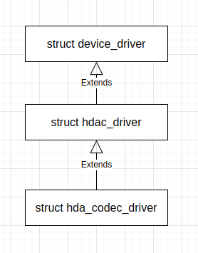
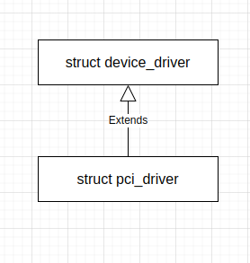
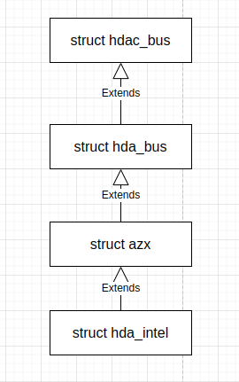
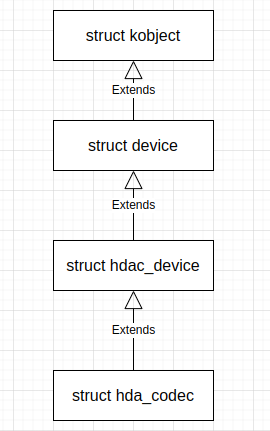

这里的代码分析基于 Android 通用 Linux 内核的版本 common-android12-5.10，这个版本的 Linux 内核代码的获取方法可参考 [Build Android system and Kernel images](https://www.codeinsideout.com/blog/android/build-aosp/)。

## PCI 总线注册

`pci_bus_type` 总线类型是一个非常早就被注册的总线类型，注册操作的调用栈如下：
```
[    0.171827] pci_driver_init+0x9/0x27
[    0.171827] do_one_initcall+0x110/0x2e0
[    0.171827] do_initcall_level+0xc9/0x131
[    0.171827] do_initcalls+0x49/0x75
[    0.171827] do_basic_setup+0x1f/0x21
[    0.171827] kernel_init_freeable+0xf1/0x156
[    0.171827] ? rest_init+0xc0/0xc0
[    0.171827] kernel_init+0x9/0x180
[    0.171827] ret_from_fork+0x22/0x30
```

上面调用栈开头的方括号内的部分是自开机之后经历的时间，可以看到执行的时间非常早。注册 `pci_bus_type` 总线类型的 `pci_driver_init()` 函数定义 (位于 *common/drivers/pci/pci-driver.c*) 如下：
```
struct bus_type pci_bus_type = {
	.name		= "pci",
	.match		= pci_bus_match,
	.uevent		= pci_uevent,
	.probe		= pci_device_probe,
	.remove		= pci_device_remove,
	.shutdown	= pci_device_shutdown,
	.dev_groups	= pci_dev_groups,
	.bus_groups	= pci_bus_groups,
	.drv_groups	= pci_drv_groups,
	.pm		= PCI_PM_OPS_PTR,
	.num_vf		= pci_bus_num_vf,
	.dma_configure	= pci_dma_configure,
};
EXPORT_SYMBOL(pci_bus_type);

#ifdef CONFIG_PCIEPORTBUS
static int pcie_port_bus_match(struct device *dev, struct device_driver *drv)
{
	struct pcie_device *pciedev;
	struct pcie_port_service_driver *driver;

	if (drv->bus != &pcie_port_bus_type || dev->bus != &pcie_port_bus_type)
		return 0;

	pciedev = to_pcie_device(dev);
	driver = to_service_driver(drv);

	if (driver->service != pciedev->service)
		return 0;

	if (driver->port_type != PCIE_ANY_PORT &&
	    driver->port_type != pci_pcie_type(pciedev->port))
		return 0;

	return 1;
}

struct bus_type pcie_port_bus_type = {
	.name		= "pci_express",
	.match		= pcie_port_bus_match,
};
EXPORT_SYMBOL_GPL(pcie_port_bus_type);
#endif

static int __init pci_driver_init(void)
{
	int ret;

	ret = bus_register(&pci_bus_type);
	if (ret)
		return ret;

#ifdef CONFIG_PCIEPORTBUS
	ret = bus_register(&pcie_port_bus_type);
	if (ret)
		return ret;
#endif
	dma_debug_add_bus(&pci_bus_type);
	return 0;
}
postcore_initcall(pci_driver_init);
```

这里导出了符号 `pci_bus_type`。

`pci_driver_init()` 函数通过 `bus_register()` 函数注册总线类型。`bus_register()` 函数定义 (位于 *common/drivers/base/bus.c*) 如下：
```
int bus_register(struct bus_type *bus)
{
	int retval;
	struct subsys_private *priv;
	struct lock_class_key *key = &bus->lock_key;

	priv = kzalloc(sizeof(struct subsys_private), GFP_KERNEL);
	if (!priv)
		return -ENOMEM;

	priv->bus = bus;
	bus->p = priv;

	BLOCKING_INIT_NOTIFIER_HEAD(&priv->bus_notifier);

	retval = kobject_set_name(&priv->subsys.kobj, "%s", bus->name);
	if (retval)
		goto out;

	priv->subsys.kobj.kset = bus_kset;
	priv->subsys.kobj.ktype = &bus_ktype;
	priv->drivers_autoprobe = 1;

	retval = kset_register(&priv->subsys);
	if (retval)
		goto out;

	retval = bus_create_file(bus, &bus_attr_uevent);
	if (retval)
		goto bus_uevent_fail;

	priv->devices_kset = kset_create_and_add("devices", NULL,
						 &priv->subsys.kobj);
	if (!priv->devices_kset) {
		retval = -ENOMEM;
		goto bus_devices_fail;
	}

	priv->drivers_kset = kset_create_and_add("drivers", NULL,
						 &priv->subsys.kobj);
	if (!priv->drivers_kset) {
		retval = -ENOMEM;
		goto bus_drivers_fail;
	}

	INIT_LIST_HEAD(&priv->interfaces);
	__mutex_init(&priv->mutex, "subsys mutex", key);
	klist_init(&priv->klist_devices, klist_devices_get, klist_devices_put);
	klist_init(&priv->klist_drivers, NULL, NULL);

	retval = add_probe_files(bus);
	if (retval)
		goto bus_probe_files_fail;

	retval = bus_add_groups(bus, bus->bus_groups);
	if (retval)
		goto bus_groups_fail;

	pr_debug("bus: '%s': registered\n", bus->name);
	return 0;

bus_groups_fail:
	remove_probe_files(bus);
bus_probe_files_fail:
	kset_unregister(bus->p->drivers_kset);
bus_drivers_fail:
	kset_unregister(bus->p->devices_kset);
bus_devices_fail:
	bus_remove_file(bus, &bus_attr_uevent);
bus_uevent_fail:
	kset_unregister(&bus->p->subsys);
out:
	kfree(bus->p);
	bus->p = NULL;
	return retval;
}
EXPORT_SYMBOL_GPL(bus_register);
```

`bus_register()` 函数进一步初始化了 `struct bus_type` 对象的字段，如为 `struct bus_type` 对象创建了 `struct subsys_private` 对象，初始化了用来保存探测到的设备的链表 `priv->klist_devices` 和注册的驱动 `priv->klist_drivers` 等。

## 扫描并添加 PCI 设备

ACPI 总线及子系统初始化期间，会扫描 PCI 设备，为设备创建 `struct pci_dev` 对象，并把创建的对象挂在 pci 总线类型上，如对于我们的 HDA 总线，设备名为 ***0000:00:02.0***。扫描 PCI 设备的调用堆栈大体如下：
```
[    0.319949] pci_scan_single_device+0xb8/0x170
[    0.319950] pci_scan_slot+0x7a/0x1f0
[    0.319957] pci_scan_child_bus_extend+0x108/0x3c0
[    0.319958] pci_scan_child_bus+0xb/0x10
[    0.319960] acpi_pci_root_create+0x2fc/0x3a0
[    0.319961] pci_acpi_scan_root+0xcc/0x150
[    0.319962] acpi_pci_root_add+0x439/0x620
[    0.319964] acpi_bus_attach+0x2e4/0x350
[    0.319966] acpi_bus_attach+0xd9/0x350
[    0.319967] acpi_bus_attach+0xd9/0x350
[    0.319969] acpi_bus_scan+0x67/0x90
[    0.319972] ? acpi_subsystem_init+0x4b/0x4b
[    0.319973] acpi_scan_init+0xf6/0x27f
[    0.319974] ? acpi_subsystem_init+0x4b/0x4b
[    0.319976] acpi_init+0x9f/0xbc
[    0.319977] do_one_initcall+0x110/0x2e0
[    0.319979] do_initcall_level+0xc9/0x131
[    0.319991] do_initcalls+0x49/0x75
[    0.319992] do_basic_setup+0x1f/0x21
[    0.319994] kernel_init_freeable+0xf1/0x156
[    0.319995] ? rest_init+0xc0/0xc0
[    0.319997] kernel_init+0x9/0x180
[    0.319998] ret_from_fork+0x22/0x30
```

`pci_scan_single_device()` 函数定义 (位于 *common/drivers/pci/probe.c*) 如下：
```
struct pci_dev *pci_get_slot(struct pci_bus *bus, unsigned int devfn)
{
	struct pci_dev *dev;

	WARN_ON(in_interrupt());
	down_read(&pci_bus_sem);

	list_for_each_entry(dev, &bus->devices, bus_list) {
		if (dev->devfn == devfn)
			goto out;
	}

	dev = NULL;
 out:
	pci_dev_get(dev);
	up_read(&pci_bus_sem);
	return dev;
}
EXPORT_SYMBOL(pci_get_slot);
 . . . . . .
struct pci_dev *pci_scan_single_device(struct pci_bus *bus, int devfn)
{
	struct pci_dev *dev;

	dev = pci_get_slot(bus, devfn);
	if (dev) {
		pci_dev_put(dev);
		return dev;
	}

	dev = pci_scan_device(bus, devfn);
	if (!dev)
		return NULL;

	pci_device_add(dev, bus);

	return dev;
}
EXPORT_SYMBOL(pci_scan_single_device);
```

`pci_scan_single_device()` 函数的执行过程很清晰：
1. 根据传入的编码的设备和功能索引 `devfn` 在 `bus` 的设备列表中查找对应槽位的设备，如果已经存在则返回，否则继续执行，这样来防止重复为设备创建 `struct pci_dev` 对象；
2. 调用 `pci_scan_device()` 函数扫描 `devfn` 槽位的设备，并为它创建 `struct pci_dev` 对象；
3. 调用 `pci_device_add()` 函数添加 PCI 设备。

`pci_scan_device()` 函数为一个 PCI 设备读取配置数据，检查它，创建并填充 dev 结构，这个函数定义 (位于 *common/drivers/pci/probe.c*) 如下：
```
struct pci_dev *pci_alloc_dev(struct pci_bus *bus)
{
	struct pci_dev *dev;

	dev = kzalloc(sizeof(struct pci_dev), GFP_KERNEL);
	if (!dev)
		return NULL;

	INIT_LIST_HEAD(&dev->bus_list);
	dev->dev.type = &pci_dev_type;
	dev->bus = pci_bus_get(bus);

	return dev;
}
EXPORT_SYMBOL(pci_alloc_dev);
. . . . . .
bool pci_bus_generic_read_dev_vendor_id(struct pci_bus *bus, int devfn, u32 *l,
					int timeout)
{
	if (pci_bus_read_config_dword(bus, devfn, PCI_VENDOR_ID, l))
		return false;

	/* Some broken boards return 0 or ~0 if a slot is empty: */
	if (*l == 0xffffffff || *l == 0x00000000 ||
	    *l == 0x0000ffff || *l == 0xffff0000)
		return false;

	if (pci_bus_crs_vendor_id(*l))
		return pci_bus_wait_crs(bus, devfn, l, timeout);

	return true;
}

bool pci_bus_read_dev_vendor_id(struct pci_bus *bus, int devfn, u32 *l,
				int timeout)
{
#ifdef CONFIG_PCI_QUIRKS
	struct pci_dev *bridge = bus->self;

	/*
	 * Certain IDT switches have an issue where they improperly trigger
	 * ACS Source Validation errors on completions for config reads.
	 */
	if (bridge && bridge->vendor == PCI_VENDOR_ID_IDT &&
	    bridge->device == 0x80b5)
		return pci_idt_bus_quirk(bus, devfn, l, timeout);
#endif

	return pci_bus_generic_read_dev_vendor_id(bus, devfn, l, timeout);
}
EXPORT_SYMBOL(pci_bus_read_dev_vendor_id);

/*
 * Read the config data for a PCI device, sanity-check it,
 * and fill in the dev structure.
 */
static struct pci_dev *pci_scan_device(struct pci_bus *bus, int devfn)
{
	struct pci_dev *dev;
	u32 l;

	if (!pci_bus_read_dev_vendor_id(bus, devfn, &l, 60*1000))
		return NULL;

	dev = pci_alloc_dev(bus);
	if (!dev)
		return NULL;

	dev->devfn = devfn;
	dev->vendor = l & 0xffff;
	dev->device = (l >> 16) & 0xffff;

	pci_set_of_node(dev);

	if (pci_setup_device(dev)) {
		pci_release_of_node(dev);
		pci_bus_put(dev->bus);
		kfree(dev);
		return NULL;
	}

	return dev;
}
```

`pci_scan_device()` 函数：
1. 读取设备的供应商 ID `vendor` 和设备 ID `device`；
2. 通过 `pci_alloc_dev()` 函数分配 `struct pci_dev` 对象，`pci_alloc_dev()` 函数分配一块内存用于创建 `struct pci_dev` 对象，之后简单初始化它的几个字段，如 `bus_list`，`bus` 和 `dev.type` 等；
3. 为 dev 结构设置 `devfn`、`vendor` 和 `device`；
4. 为 dev 结构设置 of_node，*common/drivers/pci/of.c* 文件中定义了详细的设置过程；
5. 通过 `pci_setup_device()` 函数进一步设置 dev 结构。

`pci_setup_device()` 函数定义 (位于 *common/drivers/pci/probe.c*) 如下：
```
int pci_setup_device(struct pci_dev *dev)
{
	u32 class;
	u16 cmd;
	u8 hdr_type;
	int pos = 0;
	struct pci_bus_region region;
	struct resource *res;

	hdr_type = pci_hdr_type(dev);

	dev->sysdata = dev->bus->sysdata;
	dev->dev.parent = dev->bus->bridge;
	dev->dev.bus = &pci_bus_type;
	dev->hdr_type = hdr_type & 0x7f;
	dev->multifunction = !!(hdr_type & 0x80);
	dev->error_state = pci_channel_io_normal;
	set_pcie_port_type(dev);

	pci_dev_assign_slot(dev);

	/*
	 * Assume 32-bit PCI; let 64-bit PCI cards (which are far rarer)
	 * set this higher, assuming the system even supports it.
	 */
	dev->dma_mask = 0xffffffff;

	dev_set_name(&dev->dev, "%04x:%02x:%02x.%d", pci_domain_nr(dev->bus),
		     dev->bus->number, PCI_SLOT(dev->devfn),
		     PCI_FUNC(dev->devfn));

	class = pci_class(dev);

	dev->revision = class & 0xff;
	dev->class = class >> 8;		    /* upper 3 bytes */

	if (pci_early_dump)
		early_dump_pci_device(dev);

	/* Need to have dev->class ready */
	dev->cfg_size = pci_cfg_space_size(dev);

	/* Need to have dev->cfg_size ready */
	set_pcie_thunderbolt(dev);

	set_pcie_untrusted(dev);

	/* "Unknown power state" */
	dev->current_state = PCI_UNKNOWN;

	/* Early fixups, before probing the BARs */
	pci_fixup_device(pci_fixup_early, dev);

	pci_info(dev, "[%04x:%04x] type %02x class %#08x\n",
		 dev->vendor, dev->device, dev->hdr_type, dev->class);

	/* Device class may be changed after fixup */
	class = dev->class >> 8;

	if (dev->non_compliant_bars && !dev->mmio_always_on) {
		pci_read_config_word(dev, PCI_COMMAND, &cmd);
		if (cmd & (PCI_COMMAND_IO | PCI_COMMAND_MEMORY)) {
			pci_info(dev, "device has non-compliant BARs; disabling IO/MEM decoding\n");
			cmd &= ~PCI_COMMAND_IO;
			cmd &= ~PCI_COMMAND_MEMORY;
			pci_write_config_word(dev, PCI_COMMAND, cmd);
		}
	}

	dev->broken_intx_masking = pci_intx_mask_broken(dev);

	switch (dev->hdr_type) {		    /* header type */
	case PCI_HEADER_TYPE_NORMAL:		    /* standard header */
		if (class == PCI_CLASS_BRIDGE_PCI)
			goto bad;
		pci_read_irq(dev);
		pci_read_bases(dev, 6, PCI_ROM_ADDRESS);

		pci_subsystem_ids(dev, &dev->subsystem_vendor, &dev->subsystem_device);

		/*
		 * Do the ugly legacy mode stuff here rather than broken chip
		 * quirk code. Legacy mode ATA controllers have fixed
		 * addresses. These are not always echoed in BAR0-3, and
		 * BAR0-3 in a few cases contain junk!
		 */
		if (class == PCI_CLASS_STORAGE_IDE) {
			u8 progif;
			pci_read_config_byte(dev, PCI_CLASS_PROG, &progif);
			if ((progif & 1) == 0) {
				region.start = 0x1F0;
				region.end = 0x1F7;
				res = &dev->resource[0];
				res->flags = LEGACY_IO_RESOURCE;
				pcibios_bus_to_resource(dev->bus, res, &region);
				pci_info(dev, "legacy IDE quirk: reg 0x10: %pR\n",
					 res);
				region.start = 0x3F6;
				region.end = 0x3F6;
				res = &dev->resource[1];
				res->flags = LEGACY_IO_RESOURCE;
				pcibios_bus_to_resource(dev->bus, res, &region);
				pci_info(dev, "legacy IDE quirk: reg 0x14: %pR\n",
					 res);
			}
			if ((progif & 4) == 0) {
				region.start = 0x170;
				region.end = 0x177;
				res = &dev->resource[2];
				res->flags = LEGACY_IO_RESOURCE;
				pcibios_bus_to_resource(dev->bus, res, &region);
				pci_info(dev, "legacy IDE quirk: reg 0x18: %pR\n",
					 res);
				region.start = 0x376;
				region.end = 0x376;
				res = &dev->resource[3];
				res->flags = LEGACY_IO_RESOURCE;
				pcibios_bus_to_resource(dev->bus, res, &region);
				pci_info(dev, "legacy IDE quirk: reg 0x1c: %pR\n",
					 res);
			}
		}
		break;

	case PCI_HEADER_TYPE_BRIDGE:		    /* bridge header */
		/*
		 * The PCI-to-PCI bridge spec requires that subtractive
		 * decoding (i.e. transparent) bridge must have programming
		 * interface code of 0x01.
		 */
		pci_read_irq(dev);
		dev->transparent = ((dev->class & 0xff) == 1);
		pci_read_bases(dev, 2, PCI_ROM_ADDRESS1);
		pci_read_bridge_windows(dev);
		set_pcie_hotplug_bridge(dev);
		pos = pci_find_capability(dev, PCI_CAP_ID_SSVID);
		if (pos) {
			pci_read_config_word(dev, pos + PCI_SSVID_VENDOR_ID, &dev->subsystem_vendor);
			pci_read_config_word(dev, pos + PCI_SSVID_DEVICE_ID, &dev->subsystem_device);
		}
		break;

	case PCI_HEADER_TYPE_CARDBUS:		    /* CardBus bridge header */
		if (class != PCI_CLASS_BRIDGE_CARDBUS)
			goto bad;
		pci_read_irq(dev);
		pci_read_bases(dev, 1, 0);
		pci_read_config_word(dev, PCI_CB_SUBSYSTEM_VENDOR_ID, &dev->subsystem_vendor);
		pci_read_config_word(dev, PCI_CB_SUBSYSTEM_ID, &dev->subsystem_device);
		break;

	default:				    /* unknown header */
		pci_err(dev, "unknown header type %02x, ignoring device\n",
			dev->hdr_type);
		return -EIO;

	bad:
		pci_err(dev, "ignoring class %#08x (doesn't match header type %02x)\n",
			dev->class, dev->hdr_type);
		dev->class = PCI_CLASS_NOT_DEFINED << 8;
	}

	/* We found a fine healthy device, go go go... */
	return 0;
}
```

`pci_setup_device()` 函数填充设备的类别和映射信息。它初始化设备结构的 vendor、class、内存和 IO 空间地址，IRQ 线等信息。特别注意，在这里，我们在前面看到的注册的总线类型 `pci_bus_type` 的地址被赋值给 `dev->dev.bus`。如我们的 HDA 总线设备：
```
[    0.171727] pci 0000:00:02.0: [8086:2668] type 00 class 0x040300
[    0.172259] pci 0000:00:02.0: reg 0x10: [mem 0xfebc0000-0xfebc3fff]
[    0.177118] bus: 'pci': add device 0000:00:02.0
```

回到 `pci_scan_single_device()` 函数，它调用 `pci_device_add()` 函数添加 PCI 设备，`pci_device_add()` 函数定义 (位于 *common/drivers/pci/probe.c*) 如下：
```
void pci_device_add(struct pci_dev *dev, struct pci_bus *bus)
{
	int ret;

	pci_configure_device(dev);

	device_initialize(&dev->dev);
	dev->dev.release = pci_release_dev;

	set_dev_node(&dev->dev, pcibus_to_node(bus));
	dev->dev.dma_mask = &dev->dma_mask;
	dev->dev.dma_parms = &dev->dma_parms;
	dev->dev.coherent_dma_mask = 0xffffffffull;

	dma_set_max_seg_size(&dev->dev, 65536);
	dma_set_seg_boundary(&dev->dev, 0xffffffff);

	/* Fix up broken headers */
	pci_fixup_device(pci_fixup_header, dev);

	pci_reassigndev_resource_alignment(dev);

	dev->state_saved = false;

	pci_init_capabilities(dev);

	/*
	 * Add the device to our list of discovered devices
	 * and the bus list for fixup functions, etc.
	 */
	down_write(&pci_bus_sem);
	list_add_tail(&dev->bus_list, &bus->devices);
	up_write(&pci_bus_sem);

	ret = pcibios_add_device(dev);
	WARN_ON(ret < 0);

	/* Set up MSI IRQ domain */
	pci_set_msi_domain(dev);

	/* Notifier could use PCI capabilities */
	dev->match_driver = false;
	ret = device_add(&dev->dev);
	WARN_ON(ret < 0);
}
```

这个函数：
1. 初始化 `dev->dev`；
2. 修复损坏的头部；
3. 重新分配对齐的资源；
4. 初始化权能；
5. 将设备挂在 `struct pci_bus` 的设备列表上；
6. 调用 `device_add()` 函数，将设备加进设备层次结构中。

`device_add()` 函数定义 (位于 *common/drivers/base/core.c*) 如下：
```
int device_add(struct device *dev)
{
	struct device *parent;
	struct kobject *kobj;
	struct class_interface *class_intf;
	int error = -EINVAL;
	struct kobject *glue_dir = NULL;

	dev = get_device(dev);
	if (!dev)
		goto done;

	if (!dev->p) {
		error = device_private_init(dev);
		if (error)
			goto done;
	}

	/*
	 * for statically allocated devices, which should all be converted
	 * some day, we need to initialize the name. We prevent reading back
	 * the name, and force the use of dev_name()
	 */
	if (dev->init_name) {
		dev_set_name(dev, "%s", dev->init_name);
		dev->init_name = NULL;
	}

	/* subsystems can specify simple device enumeration */
	if (!dev_name(dev) && dev->bus && dev->bus->dev_name)
		dev_set_name(dev, "%s%u", dev->bus->dev_name, dev->id);

	if (!dev_name(dev)) {
		error = -EINVAL;
		goto name_error;
	}

	pr_debug("device: '%s': %s\n", dev_name(dev), __func__);

	parent = get_device(dev->parent);
	kobj = get_device_parent(dev, parent);
	if (IS_ERR(kobj)) {
		error = PTR_ERR(kobj);
		goto parent_error;
	}
	if (kobj)
		dev->kobj.parent = kobj;

	/* use parent numa_node */
	if (parent && (dev_to_node(dev) == NUMA_NO_NODE))
		set_dev_node(dev, dev_to_node(parent));

	/* first, register with generic layer. */
	/* we require the name to be set before, and pass NULL */
	error = kobject_add(&dev->kobj, dev->kobj.parent, NULL);
	if (error) {
		glue_dir = get_glue_dir(dev);
		goto Error;
	}

	/* notify platform of device entry */
	error = device_platform_notify(dev, KOBJ_ADD);
	if (error)
		goto platform_error;

	error = device_create_file(dev, &dev_attr_uevent);
	if (error)
		goto attrError;

	error = device_add_class_symlinks(dev);
	if (error)
		goto SymlinkError;
	error = device_add_attrs(dev);
	if (error)
		goto AttrsError;
	error = bus_add_device(dev);
	if (error)
		goto BusError;
	error = dpm_sysfs_add(dev);
	if (error)
		goto DPMError;
	device_pm_add(dev);

	if (MAJOR(dev->devt)) {
		error = device_create_file(dev, &dev_attr_dev);
		if (error)
			goto DevAttrError;

		error = device_create_sys_dev_entry(dev);
		if (error)
			goto SysEntryError;

		devtmpfs_create_node(dev);
	}

	/* Notify clients of device addition.  This call must come
	 * after dpm_sysfs_add() and before kobject_uevent().
	 */
	if (dev->bus)
		blocking_notifier_call_chain(&dev->bus->p->bus_notifier,
					     BUS_NOTIFY_ADD_DEVICE, dev);

	kobject_uevent(&dev->kobj, KOBJ_ADD);

	/*
	 * Check if any of the other devices (consumers) have been waiting for
	 * this device (supplier) to be added so that they can create a device
	 * link to it.
	 *
	 * This needs to happen after device_pm_add() because device_link_add()
	 * requires the supplier be registered before it's called.
	 *
	 * But this also needs to happen before bus_probe_device() to make sure
	 * waiting consumers can link to it before the driver is bound to the
	 * device and the driver sync_state callback is called for this device.
	 */
	if (dev->fwnode && !dev->fwnode->dev) {
		dev->fwnode->dev = dev;
		fw_devlink_link_device(dev);
	}

	bus_probe_device(dev);
	if (parent)
		klist_add_tail(&dev->p->knode_parent,
			       &parent->p->klist_children);

	if (dev->class) {
		mutex_lock(&dev->class->p->mutex);
		/* tie the class to the device */
		klist_add_tail(&dev->p->knode_class,
			       &dev->class->p->klist_devices);

		/* notify any interfaces that the device is here */
		list_for_each_entry(class_intf,
				    &dev->class->p->interfaces, node)
			if (class_intf->add_dev)
				class_intf->add_dev(dev, class_intf);
		mutex_unlock(&dev->class->p->mutex);
	}
done:
	put_device(dev);
	return error;
 SysEntryError:
	if (MAJOR(dev->devt))
		device_remove_file(dev, &dev_attr_dev);
 DevAttrError:
	device_pm_remove(dev);
	dpm_sysfs_remove(dev);
 DPMError:
	bus_remove_device(dev);
 BusError:
	device_remove_attrs(dev);
 AttrsError:
	device_remove_class_symlinks(dev);
 SymlinkError:
	device_remove_file(dev, &dev_attr_uevent);
 attrError:
	device_platform_notify(dev, KOBJ_REMOVE);
platform_error:
	kobject_uevent(&dev->kobj, KOBJ_REMOVE);
	glue_dir = get_glue_dir(dev);
	kobject_del(&dev->kobj);
 Error:
	cleanup_glue_dir(dev, glue_dir);
parent_error:
	put_device(parent);
name_error:
	kfree(dev->p);
	dev->p = NULL;
	goto done;
}
EXPORT_SYMBOL_GPL(device_add);
```

暂时主要关注这个函数调用 `bus_add_device()` 把设备加进总线类型的设备列表里。`bus_add_device()` 函数定义 (位于 *common/drivers/base/bus.c*) 如下：
```
int bus_add_device(struct device *dev)
{
	struct bus_type *bus = bus_get(dev->bus);
	int error = 0;

	if (bus) {
		pr_info("bus: '%s': add device %s\n", bus->name, dev_name(dev));
		error = device_add_groups(dev, bus->dev_groups);
		if (error)
			goto out_put;
		error = sysfs_create_link(&bus->p->devices_kset->kobj,
						&dev->kobj, dev_name(dev));
		if (error)
			goto out_groups;
		error = sysfs_create_link(&dev->kobj,
				&dev->bus->p->subsys.kobj, "subsystem");
		if (error)
			goto out_subsys;
		klist_add_tail(&dev->p->knode_bus, &bus->p->klist_devices);
	}
	return 0;

out_subsys:
	sysfs_remove_link(&bus->p->devices_kset->kobj, dev_name(dev));
out_groups:
	device_remove_groups(dev, bus->dev_groups);
out_put:
	bus_put(dev->bus);
	return error;
}
```

后面注册 PCI 驱动时会遍历总线类型的设备列表。

## 初始化 sound class

音频核心在其模块初始化时，会创建并注册一个 `struct class` 对象，这个过程如下：
```
[    0.368316] init_soundcore+0xa/0x41
[    0.368318] do_one_initcall+0x110/0x2e0
[    0.368324] do_initcall_level+0xc9/0x131
[    0.368325] do_initcalls+0x49/0x75
[    0.368326] do_basic_setup+0x1f/0x21
[    0.368328] kernel_init_freeable+0xf1/0x156
[    0.368331] ? rest_init+0xc0/0xc0
[    0.368332] kernel_init+0x9/0x180
[    0.368334] ret_from_fork+0x22/0x30
```

所谓音频核心，其主要内容 (位于 *common/sound/sound_core.c*) 如下：
```
struct class *sound_class;
EXPORT_SYMBOL(sound_class);

MODULE_DESCRIPTION("Core sound module");
MODULE_AUTHOR("Alan Cox");
MODULE_LICENSE("GPL");

static char *sound_devnode(struct device *dev, umode_t *mode)
{
	if (MAJOR(dev->devt) == SOUND_MAJOR)
		return NULL;
	return kasprintf(GFP_KERNEL, "snd/%s", dev_name(dev));
}

static int __init init_soundcore(void)
{
	int rc;

	rc = init_oss_soundcore();
	if (rc)
		return rc;

	sound_class = class_create(THIS_MODULE, "sound");
	if (IS_ERR(sound_class)) {
		cleanup_oss_soundcore();
		return PTR_ERR(sound_class);
	}

	sound_class->devnode = sound_devnode;

	return 0;
}

static void __exit cleanup_soundcore(void)
{
	cleanup_oss_soundcore();
	class_destroy(sound_class);
}

subsys_initcall(init_soundcore);
module_exit(cleanup_soundcore);
```

这里导出了一个全局符号 `sound_class`，后面在创建音频设备的驱动时会被引用。Sound class 主要定义了为设备生成设备文件路径的 `sound_devnode()` 函数，具体来说，设备文件路径为 `snd/$dev_name`。用于获得设备名的 `dev_name()` 函数定义 (位于 `common/include/linux/device.h`) 如下：
```
static inline const char *dev_name(const struct device *dev)
{
	/* Use the init name until the kobject becomes available */
	if (dev->init_name)
		return dev->init_name;

	return kobject_name(&dev->kobj);
}
```

即优先从 `struct device` 的 `init_name` 字段获得，失败时，从设备的 `struct kobject` 获得。上面看到的 `kobject_name()` 函数定义 (位于 `common/include/linux/kobject.h`) 如下：
```
static inline const char *kobject_name(const struct kobject *kobj)
{
	return kobj->name;
}
```

`dev_name()` 函数与 `dev_set_name()` 函数配合使用，前者获取名称，后者设置名称，后者的函数定义 (位于 `common/drivers/base/core.c`) 如下：
```
int dev_set_name(struct device *dev, const char *fmt, ...)
{
	va_list vargs;
	int err;

	va_start(vargs, fmt);
	err = kobject_set_name_vargs(&dev->kobj, fmt, vargs);
	va_end(vargs);
	return err;
}
EXPORT_SYMBOL_GPL(dev_set_name);
```

可以看到，给 `struct device` 设置设备名，一般是设置给它的 `struct kobject`。

sound_core 的 `sound_devnode()` 函数在多种情况下会被调用。如在 PCI 和 HDA 设备探测期间，注册所有音频设备时：
```
[    0.549924] sound_devnode+0x46/0x70
[    0.549926] device_get_devnode+0x63/0xd0
[    0.549928] dev_uevent+0x94/0x1d0
[    0.549930] kobject_uevent_env+0x1e6/0x580
[    0.549931] kobject_uevent+0xb/0x10
[    0.549933] device_add+0x537/0x720
[    0.549934] snd_register_device+0xfe/0x160
[    0.549939] snd_pcm_dev_register+0x11b/0x220
[    0.549941] snd_device_register_all+0x5a/0x80
[    0.549943] snd_card_register+0x4f/0x190
[    0.549947] ? azx_codec_configure+0x3c/0xb0 [snd_hda_codec]
[    0.549949] azx_probe_work+0xf6/0x6e0 [snd_hda_intel]
```

用户空间通过设备文件访问设备，特别是向设备文件写入信息时，如：
```
[    3.508609] sound_devnode+0x46/0x70
[    3.508612] device_get_devnode+0x63/0xd0
[    3.508613] dev_uevent+0x94/0x1d0
[    3.508615] kobject_uevent_env+0x1e6/0x580
[    3.508617] kobject_synth_uevent+0x3c2/0x460
[    3.508618] uevent_store+0x1a/0x50
[    3.508619] dev_attr_store+0x12/0x20
[    3.508621] sysfs_kf_write+0x34/0x50
[    3.508622] kernfs_fop_write_iter+0x10a/0x190
[    3.508627] vfs_write+0x3b2/0x450
[    3.508628] ksys_write+0x70/0xd0
[    3.508630] __x64_sys_write+0x16/0x20
```

## 注册 HDA bus

HDA bus 指 HD-audio bus，即高解析度音频总线，它一般被挂在 PCI 总线上，声卡硬件设备再通过这个总线连接进计算机。对于 X86_64 Android 模拟器而言，它的 HDA 总线驱动是系统起来后，通过加载 `.ko` 文件注册进内核的，具体来说，是 `snd-hda-core.ko` 文件，如：
```
[    0.533055] init: Loading module /lib/modules/snd-hda-core.ko with args ''
[    0.533881] init: Loaded kernel module /lib/modules/snd-hda-core.ko
[    0.533895] init: Loading module /lib/modules/snd-hda-codec.ko with args ''
[    0.534944] init: Loaded kernel module /lib/modules/snd-hda-codec.ko
[    0.534953] init: Loading module /lib/modules/snd-hda-codec-generic.ko with args ''
[    0.535392] init: Loaded kernel module /lib/modules/snd-hda-codec-generic.ko
[    0.535415] init: Loading module /lib/modules/snd-hda-codec-realtek.ko with args ''
[    0.536000] init: Loaded kernel module /lib/modules/snd-hda-codec-realtek.ko
[    0.536021] init: Loading module /lib/modules/snd-intel-dspcfg.ko with args ''
[    0.536130] init: Loaded kernel module /lib/modules/snd-intel-dspcfg.ko
[    0.536137] init: Loading module /lib/modules/snd-hda-intel.ko with args ''
[    0.555990] PCI Interrupt Link [LNKB] enabled at IRQ 10
[    0.556776] init: Loaded kernel module /lib/modules/snd-hda-intel.ko
[    0.556809] init: Loading module /lib/modules/snd-intel8x0.ko with args ''
[    0.557103] init: Loaded kernel module /lib/modules/snd-intel8x0.ko
[    0.557117] init: Loading module /lib/modules/system_heap.ko with args ''
[    0.557272] init: Loaded kernel module /lib/modules/system_heap.ko
[    0.557286] init: Loading module /lib/modules/test_meminit.ko with args ''
[    0.559646] bus: 'hdaudio': add device hdaudioC0D0
[    0.559752] snd_hda_codec_generic hdaudioC0D0: (sound/pci/hda/hda_bind.c:93):hda_codec_driver_probe() dev 0xc32a6000
[    0.559909] snd_hda_codec_generic hdaudioC0D0: autoconfig for Generic: line_outs=1 (0x3/0x0/0x0/0x0/0x0) type:line
[    0.559911] snd_hda_codec_generic hdaudioC0D0:    speaker_outs=0 (0x0/0x0/0x0/0x0/0x0)
[    0.559912] snd_hda_codec_generic hdaudioC0D0:    hp_outs=0 (0x0/0x0/0x0/0x0/0x0)
[    0.559913] snd_hda_codec_generic hdaudioC0D0:    mono: mono_out=0x0
[    0.559914] snd_hda_codec_generic hdaudioC0D0:    inputs:
[    0.559915] snd_hda_codec_generic hdaudioC0D0:      Line=0x5
```

Linux 内核中，HDA 总线驱动注册 HDA 总线类型的过程如下：
```
[    0.533766] hda_bus_init [snd_hda_core]
[    0.533766] init_module+0x9/0x1000 [snd_hda_core]
[    0.533766] init_module+0x9/0x1000 [snd_hda_core]
[    0.533768] do_one_initcall+0x110/0x2e0
[    0.533773] do_init_module+0x4a/0x300
[    0.533774] load_module+0x3dea/0x4090
[    0.533780] ? kernel_read_file_from_fd+0x5a/0x80
[    0.533782] __x64_sys_finit_module+0xbd/0xf0
[    0.533783] do_syscall_64+0x37/0x50
[    0.533786] entry_SYSCALL_64_after_hwframe+0x61/0xc6
```

HDA 总线驱动的实现 (位于 *common/sound/hda/hda_bus_type.c*) 如下：
```
MODULE_DESCRIPTION("HD-audio bus");
MODULE_LICENSE("GPL");

/**
 * hdac_get_device_id - gets the hdac device id entry
 * @hdev: HD-audio core device
 * @drv: HD-audio codec driver
 *
 * Compares the hdac device vendor_id and revision_id to the hdac_device
 * driver id_table and returns the matching device id entry.
 */
const struct hda_device_id *
hdac_get_device_id(struct hdac_device *hdev, struct hdac_driver *drv)
{
	if (drv->id_table) {
		const struct hda_device_id *id  = drv->id_table;

		while (id->vendor_id) {
			if (hdev->vendor_id == id->vendor_id &&
				(!id->rev_id || id->rev_id == hdev->revision_id))
				return id;
			id++;
		}
	}

	return NULL;
}
EXPORT_SYMBOL_GPL(hdac_get_device_id);

static int hdac_codec_match(struct hdac_device *dev, struct hdac_driver *drv)
{
	if (hdac_get_device_id(dev, drv))
		return 1;
	else
		return 0;
}

static int hda_bus_match(struct device *dev, struct device_driver *drv)
{
	struct hdac_device *hdev = dev_to_hdac_dev(dev);
	struct hdac_driver *hdrv = drv_to_hdac_driver(drv);

	if (hdev->type != hdrv->type)
		return 0;

	/*
	 * if driver provided a match function use that otherwise we will
	 * use hdac_codec_match function
	 */
	if (hdrv->match)
		return hdrv->match(hdev, hdrv);
	else
		return hdac_codec_match(hdev, hdrv);
	return 1;
}

static int hda_uevent(struct device *dev, struct kobj_uevent_env *env)
{
	char modalias[32];

	snd_hdac_codec_modalias(dev_to_hdac_dev(dev), modalias,
				sizeof(modalias));
	if (add_uevent_var(env, "MODALIAS=%s", modalias))
		return -ENOMEM;
	return 0;
}

struct bus_type snd_hda_bus_type = {
	.name = "hdaudio",
	.match = hda_bus_match,
	.uevent = hda_uevent,
};
EXPORT_SYMBOL_GPL(snd_hda_bus_type);

static int __init hda_bus_init(void)
{
	return bus_register(&snd_hda_bus_type);
}

static void __exit hda_bus_exit(void)
{
	bus_unregister(&snd_hda_bus_type);
}

subsys_initcall(hda_bus_init);
module_exit(hda_bus_exit);
```

在驱动的整体实现结构上，HDA 总线驱动和 PCI 总线驱动差别不大，只不过 HDA 总线要比 PCI 总线简单一些。

## 注册 HDA Codec 驱动

HDA Codec 驱动也是通过加载 `.ko` 文件注册进内核的，Android 模拟器加载了两个 HDA Codec 驱动，分别是 `snd-hda-codec-generic.ko` 和 `snd-hda-codec-realtek.ko`，对于 `.ko` 文件中定义的驱动被注册的调用栈，与上面的 HDA 总线驱动没有太大的差别，如：
```
[    0.500252] __hda_codec_driver_register+0x61/0xa0 [snd_hda_codec]
[    0.500254] ? 0xffffffffc03a5000
[    0.500256] init_module+0x1e/0x1000 [snd_hda_codec_generic]
[    0.500258] do_one_initcall+0x110/0x2e0
[    0.500263] do_init_module+0x4a/0x300
[    0.500264] load_module+0x3dea/0x4090
[    0.500270] ? kernel_read_file_from_fd+0x5a/0x80
[    0.500272] __x64_sys_finit_module+0xbd/0xf0
```

以 `snd_hda_codec_generic` 驱动为例，HDA Codec 驱动的基本实现 (位于 *common/sound/pci/hda/hda_generic.c*) 如下：
```
static const struct hda_codec_ops generic_patch_ops = {
	.build_controls = snd_hda_gen_build_controls,
	.build_pcms = snd_hda_gen_build_pcms,
	.init = snd_hda_gen_init,
	.free = snd_hda_gen_free,
	.unsol_event = snd_hda_jack_unsol_event,
	.reboot_notify = snd_hda_gen_reboot_notify,
#ifdef CONFIG_PM
	.check_power_status = snd_hda_gen_check_power_status,
#endif
};

/*
 * snd_hda_parse_generic_codec - Generic codec parser
 * @codec: the HDA codec
 */
static int snd_hda_parse_generic_codec(struct hda_codec *codec)
{
	struct hda_gen_spec *spec;
	int err;

	spec = kzalloc(sizeof(*spec), GFP_KERNEL);
	if (!spec)
		return -ENOMEM;
	snd_hda_gen_spec_init(spec);
	codec->spec = spec;

	err = snd_hda_parse_pin_defcfg(codec, &spec->autocfg, NULL, 0);
	if (err < 0)
		goto error;

	err = snd_hda_gen_parse_auto_config(codec, &spec->autocfg);
	if (err < 0)
		goto error;

	codec->patch_ops = generic_patch_ops;
	return 0;

error:
	snd_hda_gen_free(codec);
	return err;
}

static const struct hda_device_id snd_hda_id_generic[] = {
	HDA_CODEC_ENTRY(HDA_CODEC_ID_GENERIC, "Generic", snd_hda_parse_generic_codec),
	{} /* terminator */
};
MODULE_DEVICE_TABLE(hdaudio, snd_hda_id_generic);

static struct hda_codec_driver generic_driver = {
	.id = snd_hda_id_generic,
};

module_hda_codec_driver(generic_driver);

MODULE_LICENSE("GPL");
MODULE_DESCRIPTION("Generic HD-audio codec parser");
```

`snd_hda_codec_generic` 驱动主要通过其设备表表项的 `driver_data` 字段提供了一个通用的 HDA codec 解析器 `snd_hda_parse_generic_codec()` 函数，而在 `snd_hda_parse_generic_codec()` 函数中，可以为传入的 `struct hda_codec` 对象挂一个 `struct hda_codec_ops` 操作集。

这里看到的注册驱动的 `module_hda_codec_driver` 宏定义 (位于 *common/include/sound/hda_codec.h*) 如下：
```
int __hda_codec_driver_register(struct hda_codec_driver *drv, const char *name,
			       struct module *owner);
#define hda_codec_driver_register(drv) \
	__hda_codec_driver_register(drv, KBUILD_MODNAME, THIS_MODULE)
void hda_codec_driver_unregister(struct hda_codec_driver *drv);
#define module_hda_codec_driver(drv) \
	module_driver(drv, hda_codec_driver_register, \
		      hda_codec_driver_unregister)
```

这个宏又用了另一个宏 `module_driver`，后者定义 (位于 *common/include/linux/device/driver.h*) 如下：
```
#define module_driver(__driver, __register, __unregister, ...) \
static int __init __driver##_init(void) \
{ \
	return __register(&(__driver) , ##__VA_ARGS__); \
} \
module_init(__driver##_init); \
static void __exit __driver##_exit(void) \
{ \
	__unregister(&(__driver) , ##__VA_ARGS__); \
} \
module_exit(__driver##_exit);
```

这样最终注册驱动将由 `__hda_codec_driver_register()` 函数执行，这个函数定义 (位于 *common/sound/pci/hda/hda_bind.c*) 如下：
```
int __hda_codec_driver_register(struct hda_codec_driver *drv, const char *name,
			       struct module *owner)
{
	drv->core.driver.name = name;
	drv->core.driver.owner = owner;
	drv->core.driver.bus = &snd_hda_bus_type;
	drv->core.driver.probe = hda_codec_driver_probe;
	drv->core.driver.remove = hda_codec_driver_remove;
	drv->core.driver.shutdown = hda_codec_driver_shutdown;
	drv->core.driver.pm = &hda_codec_driver_pm;
	drv->core.type = HDA_DEV_LEGACY;
	drv->core.match = hda_codec_match;
	drv->core.unsol_event = hda_codec_unsol_event;
	return driver_register(&drv->core.driver);
}
EXPORT_SYMBOL_GPL(__hda_codec_driver_register);
```

对于 `snd_hda_codec_generic` 驱动，它的 `struct hda_codec_driver` 对象的两个字段，类型为 `struct hda_device_id *` 的 `id` 字段在对象创建时初始化，类型为 `struct hdac_driver` 的 `core` 字段，在注册驱动时初始化。值得注意的是，这个驱动的 `bus` 指向前面看到的 `snd_hda_bus_type`。

`struct hda_codec_driver` 相关对象的继承层次结构如下图：



注册驱动主要是把驱动对象挂在对应的总线类型 `snd_hda_bus_type` 的驱动链表上。如下面**PCI 驱动驱动注册及设备 probe 时创建 struct snd_card 对象**部分将会看到的那样，这个过程会尝试把驱动与设备绑定起来，会尝试把总线类型的设备链表上挂的每个设备与驱动绑定，不过此时总线类型的设备链表上应该还没有设备。

## HDA PCI 驱动注册及设备 probe 时创建 struct snd_card 对象

音频硬件可以通过 HDA 总线连接进计算机，HDA 总线挂在 PCI 总线上。音频 PCI/HDA 设备驱动需要实现一个 PCI 驱动。以 Intel HDA 驱动为例，它通过加载 `.ko` 文件注册进内核，具体地说，是 `snd-hda-intel.ko` 文件，如：
```
[    0.536137] init: Loading module /lib/modules/snd-hda-intel.ko with args ''
[    0.555990] PCI Interrupt Link [LNKB] enabled at IRQ 10
[    0.556776] init: Loaded kernel module /lib/modules/snd-hda-intel.ko
```

Intel HDA 驱动的实现，首先是注册 PCI 驱动，相关代码 (位于 *common/sound/pci/hda/hda_intel.c*) 如下：
```
/* PCI IDs */
static const struct pci_device_id azx_ids[] = {
	/* CPT */
	{ PCI_DEVICE(0x8086, 0x1c20),
	  .driver_data = AZX_DRIVER_PCH | AZX_DCAPS_INTEL_PCH_NOPM },
	/* PBG */
	{ PCI_DEVICE(0x8086, 0x1d20),
	  .driver_data = AZX_DRIVER_PCH | AZX_DCAPS_INTEL_PCH_NOPM },
. . . . . .
	{ PCI_DEVICE(0x1d17, 0x3288), .driver_data = AZX_DRIVER_ZHAOXIN },
	{ 0, }
};
MODULE_DEVICE_TABLE(pci, azx_ids);

/* pci_driver definition */
static struct pci_driver azx_driver = {
	.name = KBUILD_MODNAME,
	.id_table = azx_ids,
	.probe = azx_probe,
	.remove = azx_remove,
	.shutdown = azx_shutdown,
	.driver = {
		.pm = AZX_PM_OPS,
	},
};

module_pci_driver(azx_driver);
```

上面看到的 `MODULE_DEVICE_TABLE` 是 *common/include/linux/module.h* 文件中定义的宏：
```
#ifdef MODULE
/* Creates an alias so file2alias.c can find device table. */
#define MODULE_DEVICE_TABLE(type, name)					\
extern typeof(name) __mod_##type##__##name##_device_table		\
  __attribute__ ((unused, alias(__stringify(name))))
#else  /* !MODULE */
#define MODULE_DEVICE_TABLE(type, name)
#endif
```

`MODULE_DEVICE_TABLE` 宏为设备表定一个别名。

上面看到的 `module_pci_driver()` 也是一个宏，其定义 (位于 *common/include/linux/pci.h*) 如下：
```
/* Proper probing supporting hot-pluggable devices */
int __must_check __pci_register_driver(struct pci_driver *, struct module *,
				       const char *mod_name);

/* pci_register_driver() must be a macro so KBUILD_MODNAME can be expanded */
#define pci_register_driver(driver)		\
	__pci_register_driver(driver, THIS_MODULE, KBUILD_MODNAME)

void pci_unregister_driver(struct pci_driver *dev);

/**
 * module_pci_driver() - Helper macro for registering a PCI driver
 * @__pci_driver: pci_driver struct
 *
 * Helper macro for PCI drivers which do not do anything special in module
 * init/exit. This eliminates a lot of boilerplate. Each module may only
 * use this macro once, and calling it replaces module_init() and module_exit()
 */
#define module_pci_driver(__pci_driver) \
	module_driver(__pci_driver, pci_register_driver, pci_unregister_driver)
```

`module_pci_driver()` 宏用到的另一个宏 `module_driver`，其定义如我们前面在**注册 HDA Codec 驱动**部分看到的那样。

`module_pci_driver()` 宏用于为 PCI 驱动快速定义初始化和退出函数，其中初始化和退出的实际动作由 PCI 驱动核心的 `__pci_register_driver()` 和 `pci_unregister_driver()` 函数执行。在内核中，`struct pci_driver` 用来描述一个 PCI 驱动，这个结构体定义 (位于 *common/include/linux/pci.h*) 如下：
```
struct pci_driver {
	struct list_head	node;
	const char		*name;
	const struct pci_device_id *id_table;	/* Must be non-NULL for probe to be called */
	int  (*probe)(struct pci_dev *dev, const struct pci_device_id *id);	/* New device inserted */
	void (*remove)(struct pci_dev *dev);	/* Device removed (NULL if not a hot-plug capable driver) */
	int  (*suspend)(struct pci_dev *dev, pm_message_t state);	/* Device suspended */
	int  (*resume)(struct pci_dev *dev);	/* Device woken up */
	void (*shutdown)(struct pci_dev *dev);
	int  (*sriov_configure)(struct pci_dev *dev, int num_vfs); /* On PF */
	const struct pci_error_handlers *err_handler;
	const struct attribute_group **groups;
	struct device_driver	driver;
	struct pci_dynids	dynids;

	ANDROID_KABI_RESERVE(1);
	ANDROID_KABI_RESERVE(2);
	ANDROID_KABI_RESERVE(3);
	ANDROID_KABI_RESERVE(4);
};
```

从面向对象编程的视角来看，`struct pci_driver` 继承自 `struct device_driver`，如下图：


`__pci_register_driver()` 函数定义 (位于 *common/drivers/pci/pci-driver.c*) 如下：
```
int __pci_register_driver(struct pci_driver *drv, struct module *owner,
			  const char *mod_name)
{
	/* initialize common driver fields */
	drv->driver.name = drv->name;
	drv->driver.bus = &pci_bus_type;
	drv->driver.owner = owner;
	drv->driver.mod_name = mod_name;
	drv->driver.groups = drv->groups;

	spin_lock_init(&drv->dynids.lock);
	INIT_LIST_HEAD(&drv->dynids.list);

	/* register with core */
	return driver_register(&drv->driver);
}
EXPORT_SYMBOL(__pci_register_driver);
```

需要特别注意的是 `struct pci_driver` 对象的 `bus` 字段，它被设置为指向 `pci_bus_type`，PCI 设备和这里的 PCI 驱动通过 `pci_bus_type` 而有了千丝万缕的联系，在 probe 之后，它们将被关联起来。

`__pci_register_driver()` 函数初始化 `struct pci_driver` 对象的一些字段后，即通过 `driver_register()` 函数将 `struct pci_driver` 挂在 bus 的驱动列表上。`driver_register()` 函数定义 (位于 *common/drivers/base/driver.c*) 如下：
```
/**
 * driver_register - register driver with bus
 * @drv: driver to register
 *
 * We pass off most of the work to the bus_add_driver() call,
 * since most of the things we have to do deal with the bus
 * structures.
 */
int driver_register(struct device_driver *drv)
{
	int ret;
	struct device_driver *other;

	if (!drv->bus->p) {
		pr_err("Driver '%s' was unable to register with bus_type '%s' because the bus was not initialized.\n",
			   drv->name, drv->bus->name);
		return -EINVAL;
	}

	if ((drv->bus->probe && drv->probe) ||
	    (drv->bus->remove && drv->remove) ||
	    (drv->bus->shutdown && drv->shutdown))
		pr_warn("Driver '%s' needs updating - please use "
			"bus_type methods\n", drv->name);

	other = driver_find(drv->name, drv->bus);
	if (other) {
		pr_err("Error: Driver '%s' is already registered, "
			"aborting...\n", drv->name);
		return -EBUSY;
	}

	ret = bus_add_driver(drv);
	if (ret)
		return ret;
	ret = driver_add_groups(drv, drv->groups);
	if (ret) {
		bus_remove_driver(drv);
		return ret;
	}
	kobject_uevent(&drv->p->kobj, KOBJ_ADD);

	return ret;
}
EXPORT_SYMBOL_GPL(driver_register);
 . . . . . .
struct device_driver *driver_find(const char *name, struct bus_type *bus)
{
	struct kobject *k = kset_find_obj(bus->p->drivers_kset, name);
	struct driver_private *priv;

	if (k) {
		/* Drop reference added by kset_find_obj() */
		kobject_put(k);
		priv = to_driver(k);
		return priv->driver;
	}
	return NULL;
}
EXPORT_SYMBOL_GPL(driver_find);
```

`driver_register()` 函数：
1. 先在总线类型的驱动列表里，根据驱动名称找一下，看看驱动是否已经被加进来了，如果已经加了，则返回错误退出，否则继续执行；
2. 调用 `bus_add_driver()` 函数把驱动加进它的总线类型的驱动列表上；
3. 把驱动加进驱动属性组里；
4. 发送一个 uevent 通知用户空间事件的发生。

`bus_add_driver()` 函数定义 (位于 *common/drivers/base/bus.c*) 如下：
```
int bus_add_driver(struct device_driver *drv)
{
	struct bus_type *bus;
	struct driver_private *priv;
	int error = 0;

	bus = bus_get(drv->bus);
	if (!bus)
		return -EINVAL;

	pr_debug("bus: '%s': add driver %s\n", bus->name, drv->name);

	priv = kzalloc(sizeof(*priv), GFP_KERNEL);
	if (!priv) {
		error = -ENOMEM;
		goto out_put_bus;
	}
	klist_init(&priv->klist_devices, NULL, NULL);
	priv->driver = drv;
	drv->p = priv;
	priv->kobj.kset = bus->p->drivers_kset;
	error = kobject_init_and_add(&priv->kobj, &driver_ktype, NULL,
				     "%s", drv->name);
	if (error)
		goto out_unregister;

	klist_add_tail(&priv->knode_bus, &bus->p->klist_drivers);
	if (drv->bus->p->drivers_autoprobe) {
		error = driver_attach(drv);
		if (error)
			goto out_del_list;
	}
	module_add_driver(drv->owner, drv);

	error = driver_create_file(drv, &driver_attr_uevent);
	if (error) {
		printk(KERN_ERR "%s: uevent attr (%s) failed\n",
			__func__, drv->name);
	}
	error = driver_add_groups(drv, bus->drv_groups);
	if (error) {
		/* How the hell do we get out of this pickle? Give up */
		printk(KERN_ERR "%s: driver_create_groups(%s) failed\n",
			__func__, drv->name);
	}

	if (!drv->suppress_bind_attrs) {
		error = add_bind_files(drv);
		if (error) {
			/* Ditto */
			printk(KERN_ERR "%s: add_bind_files(%s) failed\n",
				__func__, drv->name);
		}
	}

	return 0;

out_del_list:
	klist_del(&priv->knode_bus);
out_unregister:
	kobject_put(&priv->kobj);
	/* drv->p is freed in driver_release()  */
	drv->p = NULL;
out_put_bus:
	bus_put(bus);
	return error;
}
```

`bus_add_driver()` 函数：
1. 为设备驱动分配并初始化 `struct driver_private` 对象，`struct driver_private` 对象的 `priv->klist_devices` 用来挂匹配的设备；
2. 为设备驱动初始化并添加 kobject；
3. 把设备驱动添加进总线类型的设备驱动列表；
4. 调用 `driver_attach()` 函数把设备驱动绑定到设备；
5. 为模块添加设备驱动；
6. 为设备驱动创建 sysfs 文件；
7. 为设备驱动的 kobject，创建一组属性组。

`driver_attach()` 函数把设备驱动绑定到设备，这个函数定义 (位于 *common/drivers/base/dd.c*) 如下：
```
int driver_attach(struct device_driver *drv)
{
	return bus_for_each_dev(drv->bus, NULL, drv, __driver_attach);
}
EXPORT_SYMBOL_GPL(driver_attach);
```

`driver_attach()` 函数通过 `bus_for_each_dev()` 函数遍历总线类型上的所有设备，并尝试把设备驱动与设备绑定起来。`bus_for_each_dev()` 函数定义 (位于 *common/drivers/base/bus.c*) 如下：
```
int bus_for_each_dev(struct bus_type *bus, struct device *start,
		     void *data, int (*fn)(struct device *, void *))
{
	struct klist_iter i;
	struct device *dev;
	int error = 0;

	if (!bus || !bus->p)
		return -EINVAL;

	klist_iter_init_node(&bus->p->klist_devices, &i,
			     (start ? &start->p->knode_bus : NULL));
	while (!error && (dev = next_device(&i)))
		error = fn(dev, data);
	klist_iter_exit(&i);
	return error;
}
EXPORT_SYMBOL_GPL(bus_for_each_dev);
```

对于 PCI 设备，前面我们看到设备通过 `pci_device_add()` -> `device_add()` -> `bus_add_device()` 被添加进这里看到的总线类型的设备列表。这里在遍历并处理设备时，如果处理函数返回 0，则继续遍历，否则退出遍历。

具体地尝试把设备驱动和设备绑定起来由 `__driver_attach()` 函数完成，该函数定义 (位于 *common/drivers/base/dd.c*) 如下：
```
void driver_deferred_probe_add(struct device *dev)
{
	mutex_lock(&deferred_probe_mutex);
	if (list_empty(&dev->p->deferred_probe)) {
		dev_dbg(dev, "Added to deferred list\n");
		list_add_tail(&dev->p->deferred_probe, &deferred_probe_pending_list);
	}
	mutex_unlock(&deferred_probe_mutex);
}
 . . . . . .
int device_driver_attach(struct device_driver *drv, struct device *dev)
{
	int ret = 0;

	__device_driver_lock(dev, dev->parent);

	/*
	 * If device has been removed or someone has already successfully
	 * bound a driver before us just skip the driver probe call.
	 */
	if (!dev->p->dead && !dev->driver)
		ret = driver_probe_device(drv, dev);

	__device_driver_unlock(dev, dev->parent);

	return ret;
}

static void __driver_attach_async_helper(void *_dev, async_cookie_t cookie)
{
	struct device *dev = _dev;
	struct device_driver *drv;
	int ret = 0;

	__device_driver_lock(dev, dev->parent);

	drv = dev->p->async_driver;

	/*
	 * If device has been removed or someone has already successfully
	 * bound a driver before us just skip the driver probe call.
	 */
	if (!dev->p->dead && !dev->driver)
		ret = driver_probe_device(drv, dev);

	__device_driver_unlock(dev, dev->parent);

	dev_dbg(dev, "driver %s async attach completed: %d\n", drv->name, ret);

	put_device(dev);
}

static int __driver_attach(struct device *dev, void *data)
{
	struct device_driver *drv = data;
	bool async = false;
	int ret;

	/*
	 * Lock device and try to bind to it. We drop the error
	 * here and always return 0, because we need to keep trying
	 * to bind to devices and some drivers will return an error
	 * simply if it didn't support the device.
	 *
	 * driver_probe_device() will spit a warning if there
	 * is an error.
	 */

	ret = driver_match_device(drv, dev);
	if (ret == 0) {
		/* no match */
		return 0;
	} else if (ret == -EPROBE_DEFER) {
		dev_dbg(dev, "Device match requests probe deferral\n");
		driver_deferred_probe_add(dev);
		/*
		 * Driver could not match with device, but may match with
		 * another device on the bus.
		 */
		return 0;
	} else if (ret < 0) {
		dev_dbg(dev, "Bus failed to match device: %d\n", ret);
		/*
		 * Driver could not match with device, but may match with
		 * another device on the bus.
		 */
		return 0;
	} /* ret > 0 means positive match */

	if (driver_allows_async_probing(drv)) {
		/*
		 * Instead of probing the device synchronously we will
		 * probe it asynchronously to allow for more parallelism.
		 *
		 * We only take the device lock here in order to guarantee
		 * that the dev->driver and async_driver fields are protected
		 */
		dev_dbg(dev, "probing driver %s asynchronously\n", drv->name);
		device_lock(dev);
		if (!dev->driver) {
			get_device(dev);
			dev->p->async_driver = drv;
			async = true;
		}
		device_unlock(dev);
		if (async)
			async_schedule_dev(__driver_attach_async_helper, dev);
		return 0;
	}

	device_driver_attach(drv, dev);

	return 0;
}
```

`__driver_attach()` 函数首先检查设备和驱动是否匹配，对于检查结果，有四种不同地处理方式：
 * 设备和驱动不匹配：什么也不做，直接返回；
 * 不能判断，期望推迟检测：把设备加进延迟探测列表；
 * 匹配，驱动允许异步探测：调度一个异步探测任务 `__driver_attach_async_helper()`；
 * 匹配，驱动不允许异步探测：通过 `device_driver_attach()` 同步执行探测。

貌似无论探测过程中遇到什么情况，都会继续尝试其它设备。同步执行探测的 `device_driver_attach()` 和异步的 `__driver_attach_async_helper()` 最终都通过 `driver_probe_device()` 函数执行探测。

用来判断驱动和设备是否匹配的 `driver_match_device()` 函数定义 (位于 *common/drivers/base/base.h*) 如下：
```
static inline int driver_match_device(struct device_driver *drv,
				      struct device *dev)
{
	return drv->bus->match ? drv->bus->match(dev, drv) : 1;
}
```

驱动和设备是否匹配由总线类型的 `match` 回调判断。对于 PCI 总线类型，`match` 回调为 `pci_bus_match()` 函数，这个函数定义 (位于 *common/drivers/pci/pci-driver.c*) 如下：
```
const struct pci_device_id *pci_match_id(const struct pci_device_id *ids,
					 struct pci_dev *dev)
{
	if (ids) {
		while (ids->vendor || ids->subvendor || ids->class_mask) {
			if (pci_match_one_device(ids, dev))
				return ids;
			ids++;
		}
	}
	return NULL;
}
EXPORT_SYMBOL(pci_match_id);

static const struct pci_device_id pci_device_id_any = {
	.vendor = PCI_ANY_ID,
	.device = PCI_ANY_ID,
	.subvendor = PCI_ANY_ID,
	.subdevice = PCI_ANY_ID,
};

/**
 * pci_match_device - Tell if a PCI device structure has a matching PCI device id structure
 * @drv: the PCI driver to match against
 * @dev: the PCI device structure to match against
 *
 * Used by a driver to check whether a PCI device present in the
 * system is in its list of supported devices.  Returns the matching
 * pci_device_id structure or %NULL if there is no match.
 */
static const struct pci_device_id *pci_match_device(struct pci_driver *drv,
						    struct pci_dev *dev)
{
	struct pci_dynid *dynid;
	const struct pci_device_id *found_id = NULL;

	/* When driver_override is set, only bind to the matching driver */
	if (dev->driver_override && strcmp(dev->driver_override, drv->name))
		return NULL;

	/* Look at the dynamic ids first, before the static ones */
	spin_lock(&drv->dynids.lock);
	list_for_each_entry(dynid, &drv->dynids.list, node) {
		if (pci_match_one_device(&dynid->id, dev)) {
			found_id = &dynid->id;
			break;
		}
	}
	spin_unlock(&drv->dynids.lock);

	if (!found_id)
		found_id = pci_match_id(drv->id_table, dev);

	/* driver_override will always match, send a dummy id */
	if (!found_id && dev->driver_override)
		found_id = &pci_device_id_any;

	return found_id;
}
 . . . . . .
static int pci_bus_match(struct device *dev, struct device_driver *drv)
{
	struct pci_dev *pci_dev = to_pci_dev(dev);
	struct pci_driver *pci_drv;
	const struct pci_device_id *found_id;

	if (!pci_dev->match_driver)
		return 0;

	pci_drv = to_pci_driver(drv);
	found_id = pci_match_device(pci_drv, pci_dev);
	if (found_id)
		return 1;

	return 0;
}
```

PCI 总线类型的匹配检查函数 `pci_bus_match()`，首先检查设备驱动的动态设备 ID 表，找不到则检查设备驱动的静态设备 ID 表，还没找到的话，如果驱动设置了 `dev->driver_override`，则返回 dummy 设备 ID，否则认为不匹配。

回到 `__driver_attach()` 函数，它最终通过 `driver_probe_device()` 函数执行探测。这个函数定义 (位于 *common/drivers/base/dd.c*) 如下：
```
static int really_probe(struct device *dev, struct device_driver *drv)
{
	int ret = -EPROBE_DEFER;
	int local_trigger_count = atomic_read(&deferred_trigger_count);
	bool test_remove = IS_ENABLED(CONFIG_DEBUG_TEST_DRIVER_REMOVE) &&
			   !drv->suppress_bind_attrs;

	if (defer_all_probes) {
		/*
		 * Value of defer_all_probes can be set only by
		 * device_block_probing() which, in turn, will call
		 * wait_for_device_probe() right after that to avoid any races.
		 */
		dev_dbg(dev, "Driver %s force probe deferral\n", drv->name);
		driver_deferred_probe_add(dev);
		return ret;
	}

	ret = device_links_check_suppliers(dev);
	if (ret == -EPROBE_DEFER)
		driver_deferred_probe_add_trigger(dev, local_trigger_count);
	if (ret)
		return ret;

	atomic_inc(&probe_count);
	pr_debug("bus: '%s': %s: probing driver %s with device %s\n",
		 drv->bus->name, __func__, drv->name, dev_name(dev));
	if (!list_empty(&dev->devres_head)) {
		dev_crit(dev, "Resources present before probing\n");
		ret = -EBUSY;
		goto done;
	}

re_probe:
	dev->driver = drv;

	/* If using pinctrl, bind pins now before probing */
	ret = pinctrl_bind_pins(dev);
	if (ret)
		goto pinctrl_bind_failed;

	if (dev->bus->dma_configure) {
		ret = dev->bus->dma_configure(dev);
		if (ret)
			goto probe_failed;
	}

	ret = driver_sysfs_add(dev);
	if (ret) {
		pr_err("%s: driver_sysfs_add(%s) failed\n",
		       __func__, dev_name(dev));
		goto probe_failed;
	}

	if (dev->pm_domain && dev->pm_domain->activate) {
		ret = dev->pm_domain->activate(dev);
		if (ret)
			goto probe_failed;
	}

	if (dev->bus->probe) {
		ret = dev->bus->probe(dev);
		if (ret)
			goto probe_failed;
	} else if (drv->probe) {
		ret = drv->probe(dev);
		if (ret)
			goto probe_failed;
	}

	ret = device_add_groups(dev, drv->dev_groups);
	if (ret) {
		dev_err(dev, "device_add_groups() failed\n");
		goto dev_groups_failed;
	}

	if (dev_has_sync_state(dev)) {
		ret = device_create_file(dev, &dev_attr_state_synced);
		if (ret) {
			dev_err(dev, "state_synced sysfs add failed\n");
			goto dev_sysfs_state_synced_failed;
		}
	}

	if (test_remove) {
		test_remove = false;

		device_remove_file(dev, &dev_attr_state_synced);
		device_remove_groups(dev, drv->dev_groups);

		if (dev->bus->remove)
			dev->bus->remove(dev);
		else if (drv->remove)
			drv->remove(dev);

		devres_release_all(dev);
		arch_teardown_dma_ops(dev);
		kfree(dev->dma_range_map);
		dev->dma_range_map = NULL;
		driver_sysfs_remove(dev);
		dev->driver = NULL;
		dev_set_drvdata(dev, NULL);
		if (dev->pm_domain && dev->pm_domain->dismiss)
			dev->pm_domain->dismiss(dev);
		pm_runtime_reinit(dev);

		goto re_probe;
	}

	pinctrl_init_done(dev);

	if (dev->pm_domain && dev->pm_domain->sync)
		dev->pm_domain->sync(dev);

	driver_bound(dev);
	ret = 1;
	pr_debug("bus: '%s': %s: bound device %s to driver %s\n",
		 drv->bus->name, __func__, dev_name(dev), drv->name);
	goto done;

dev_sysfs_state_synced_failed:
	device_remove_groups(dev, drv->dev_groups);
dev_groups_failed:
	if (dev->bus->remove)
		dev->bus->remove(dev);
	else if (drv->remove)
		drv->remove(dev);
probe_failed:
	if (dev->bus)
		blocking_notifier_call_chain(&dev->bus->p->bus_notifier,
					     BUS_NOTIFY_DRIVER_NOT_BOUND, dev);
pinctrl_bind_failed:
	device_links_no_driver(dev);
	devres_release_all(dev);
	arch_teardown_dma_ops(dev);
	kfree(dev->dma_range_map);
	dev->dma_range_map = NULL;
	driver_sysfs_remove(dev);
	dev->driver = NULL;
	dev_set_drvdata(dev, NULL);
	if (dev->pm_domain && dev->pm_domain->dismiss)
		dev->pm_domain->dismiss(dev);
	pm_runtime_reinit(dev);
	dev_pm_set_driver_flags(dev, 0);

	switch (ret) {
	case -EPROBE_DEFER:
		/* Driver requested deferred probing */
		dev_dbg(dev, "Driver %s requests probe deferral\n", drv->name);
		driver_deferred_probe_add_trigger(dev, local_trigger_count);
		break;
	case -ENODEV:
	case -ENXIO:
		pr_debug("%s: probe of %s rejects match %d\n",
			 drv->name, dev_name(dev), ret);
		break;
	default:
		/* driver matched but the probe failed */
		pr_warn("%s: probe of %s failed with error %d\n",
			drv->name, dev_name(dev), ret);
	}
	/*
	 * Ignore errors returned by ->probe so that the next driver can try
	 * its luck.
	 */
	ret = 0;
done:
	atomic_dec(&probe_count);
	wake_up_all(&probe_waitqueue);
	return ret;
}

/*
 * For initcall_debug, show the driver probe time.
 */
static int really_probe_debug(struct device *dev, struct device_driver *drv)
{
	ktime_t calltime, rettime;
	int ret;

	calltime = ktime_get();
	ret = really_probe(dev, drv);
	rettime = ktime_get();
	pr_debug("probe of %s returned %d after %lld usecs\n",
		 dev_name(dev), ret, ktime_us_delta(rettime, calltime));
	return ret;
}
 . . . . . .
int driver_probe_device(struct device_driver *drv, struct device *dev)
{
	int ret = 0;

	if (!device_is_registered(dev))
		return -ENODEV;

	pr_debug("bus: '%s': %s: matched device %s with driver %s\n",
		 drv->bus->name, __func__, dev_name(dev), drv->name);

	pm_runtime_get_suppliers(dev);
	if (dev->parent)
		pm_runtime_get_sync(dev->parent);

	pm_runtime_barrier(dev);
	if (initcall_debug)
		ret = really_probe_debug(dev, drv);
	else
		ret = really_probe(dev, drv);
	pm_request_idle(dev);

	if (dev->parent)
		pm_runtime_put(dev->parent);

	pm_runtime_put_suppliers(dev);
	return ret;
}
```

简单来说，`driver_probe_device()` 函数首先尝试通过总线类型的 probe 函数探测，如果这个函数不存在，则直接尝试通过驱动程序的 probe 函数执行探测。对于 PCI 总线类型，它的 probe 函数为 `pci_device_probe()`，这个函数定义 (位于 *common/drivers/pci/pci-driver.c*) 如下：
```
struct drv_dev_and_id {
	struct pci_driver *drv;
	struct pci_dev *dev;
	const struct pci_device_id *id;
};

static long local_pci_probe(void *_ddi)
{
	struct drv_dev_and_id *ddi = _ddi;
	struct pci_dev *pci_dev = ddi->dev;
	struct pci_driver *pci_drv = ddi->drv;
	struct device *dev = &pci_dev->dev;
	int rc;

	/*
	 * Unbound PCI devices are always put in D0, regardless of
	 * runtime PM status.  During probe, the device is set to
	 * active and the usage count is incremented.  If the driver
	 * supports runtime PM, it should call pm_runtime_put_noidle(),
	 * or any other runtime PM helper function decrementing the usage
	 * count, in its probe routine and pm_runtime_get_noresume() in
	 * its remove routine.
	 */
	pm_runtime_get_sync(dev);
	pci_dev->driver = pci_drv;
	rc = pci_drv->probe(pci_dev, ddi->id);
	if (!rc)
		return rc;
	if (rc < 0) {
		pci_dev->driver = NULL;
		pm_runtime_put_sync(dev);
		return rc;
	}
	/*
	 * Probe function should return < 0 for failure, 0 for success
	 * Treat values > 0 as success, but warn.
	 */
	pci_warn(pci_dev, "Driver probe function unexpectedly returned %d\n",
		 rc);
	return 0;
}

static bool pci_physfn_is_probed(struct pci_dev *dev)
{
#ifdef CONFIG_PCI_IOV
	return dev->is_virtfn && dev->physfn->is_probed;
#else
	return false;
#endif
}

static int pci_call_probe(struct pci_driver *drv, struct pci_dev *dev,
			  const struct pci_device_id *id)
{
	int error, node, cpu;
	int hk_flags = HK_FLAG_DOMAIN | HK_FLAG_WQ;
	struct drv_dev_and_id ddi = { drv, dev, id };

	/*
	 * Execute driver initialization on node where the device is
	 * attached.  This way the driver likely allocates its local memory
	 * on the right node.
	 */
	node = dev_to_node(&dev->dev);
	dev->is_probed = 1;

	cpu_hotplug_disable();

	/*
	 * Prevent nesting work_on_cpu() for the case where a Virtual Function
	 * device is probed from work_on_cpu() of the Physical device.
	 */
	if (node < 0 || node >= MAX_NUMNODES || !node_online(node) ||
	    pci_physfn_is_probed(dev))
		cpu = nr_cpu_ids;
	else
		cpu = cpumask_any_and(cpumask_of_node(node),
				      housekeeping_cpumask(hk_flags));

	if (cpu < nr_cpu_ids)
		error = work_on_cpu(cpu, local_pci_probe, &ddi);
	else
		error = local_pci_probe(&ddi);

	dev->is_probed = 0;
	cpu_hotplug_enable();
	return error;
}

/**
 * __pci_device_probe - check if a driver wants to claim a specific PCI device
 * @drv: driver to call to check if it wants the PCI device
 * @pci_dev: PCI device being probed
 *
 * returns 0 on success, else error.
 * side-effect: pci_dev->driver is set to drv when drv claims pci_dev.
 */
static int __pci_device_probe(struct pci_driver *drv, struct pci_dev *pci_dev)
{
	const struct pci_device_id *id;
	int error = 0;

	if (!pci_dev->driver && drv->probe) {
		error = -ENODEV;

		id = pci_match_device(drv, pci_dev);
		if (id)
			error = pci_call_probe(drv, pci_dev, id);
	}
	return error;
}

int __weak pcibios_alloc_irq(struct pci_dev *dev)
{
	return 0;
}
 . . . . . .
#ifdef CONFIG_PCI_IOV
static inline bool pci_device_can_probe(struct pci_dev *pdev)
{
	return (!pdev->is_virtfn || pdev->physfn->sriov->drivers_autoprobe ||
		pdev->driver_override);
}
#else
static inline bool pci_device_can_probe(struct pci_dev *pdev)
{
	return true;
}
#endif

static int pci_device_probe(struct device *dev)
{
	int error;
	struct pci_dev *pci_dev = to_pci_dev(dev);
	struct pci_driver *drv = to_pci_driver(dev->driver);

	if (!pci_device_can_probe(pci_dev))
		return -ENODEV;

	pci_assign_irq(pci_dev);

	error = pcibios_alloc_irq(pci_dev);
	if (error < 0)
		return error;

	pci_dev_get(pci_dev);
	error = __pci_device_probe(drv, pci_dev);
	if (error) {
		pcibios_free_irq(pci_dev);
		pci_dev_put(pci_dev);
	}

	return error;
}
```

`pci_device_probe()` 函数为设备分配中断，再次执行设备与驱动的匹配检查，***这里的检查似乎与 `bus_for_each_dev()`/`__driver_attach()` 中的检查重复了，它们做的是完全相同的事情***；之后执行驱动程序的 probe 函数。

对于 Intel HDA 驱动，最终其 probe 函数 `azx_probe()` 会被执行，如：
```
[    0.539030] azx_probe+0xd1/0xa10 [snd_hda_intel]
[    0.539036] pci_device_probe+0xd6/0x170
[    0.539044] really_probe+0x26e/0x610
[    0.539046] driver_probe_device+0x70/0xb0
[    0.539047] device_driver_attach+0x6a/0xb0
[    0.539048] __driver_attach+0xc7/0x150
[    0.539050] ? driver_attach+0x20/0x20
[    0.539051] bus_for_each_dev+0x93/0xd0
[    0.539052] driver_attach+0x19/0x20
[    0.539054] bus_add_driver+0x11c/0x210
[    0.539055] driver_register+0x81/0x120
[    0.539056] ? 0xffffffffc046a000
[    0.539058] __pci_register_driver+0x52/0x60
[    0.539063] init_module+0x1e/0x1000 [snd_hda_intel]
[    0.539065] do_one_initcall+0x110/0x2e0
[    0.539070] do_init_module+0x4a/0x300
[    0.539071] load_module+0x3dea/0x4090
```

同样地在之前已经有对应地总线类型被注册，但在注册 Intel HDA 总线 PCI 驱动时，我们看到驱动的 `probe` 函数被调用，而上面在注册 HDA Codec 驱动 `snd-hda-codec-generic.ko` 时，却不见它的 `probe` 函数被调用。这是因为，在注册 Intel HDA 总线 PCI 驱动时，其设备已经通过 ACPI 子系统扫描过，PCI 总线类型上已经挂了探测到的设备；而对于 HDA Codec 驱动，其设备还在等待着由 Intel HDA 总线 PCI 驱动去探测。

内核对不同类型的内核模块的加载顺序有要求：1. 总线类型要最先被加载；2. 之后要探测并创建设备的其它驱动，和设备的驱动被加载的顺序没有要求。

`azx_probe()` 函数定义 (位于 *common/sound/pci/hda/hda_intel.c*) 如下：
```
static int azx_probe(struct pci_dev *pci,
		     const struct pci_device_id *pci_id)
{
	static int dev;
	struct snd_card *card;
	struct hda_intel *hda;
	struct azx *chip;
	bool schedule_probe;
	int err;

	if (pci_match_id(driver_denylist, pci)) {
		dev_info(&pci->dev, "Skipping the device on the denylist\n");
		return -ENODEV;
	}

	if (dev >= SNDRV_CARDS)
		return -ENODEV;
	if (!enable[dev]) {
		dev++;
		return -ENOENT;
	}

	/*
	 * stop probe if another Intel's DSP driver should be activated
	 */
	if (dmic_detect) {
		err = snd_intel_dsp_driver_probe(pci);
		if (err != SND_INTEL_DSP_DRIVER_ANY && err != SND_INTEL_DSP_DRIVER_LEGACY) {
			dev_dbg(&pci->dev, "HDAudio driver not selected, aborting probe\n");
			return -ENODEV;
		}
	} else {
		dev_warn(&pci->dev, "dmic_detect option is deprecated, pass snd-intel-dspcfg.dsp_driver=1 option instead\n");
	}

	err = snd_card_new(&pci->dev, index[dev], id[dev], THIS_MODULE,
			   0, &card);
	if (err < 0) {
		dev_err(&pci->dev, "Error creating card!\n");
		return err;
	}

	err = azx_create(card, pci, dev, pci_id->driver_data, &chip);
	if (err < 0)
		goto out_free;
	card->private_data = chip;
	hda = container_of(chip, struct hda_intel, chip);

	pci_set_drvdata(pci, card);

	err = register_vga_switcheroo(chip);
	if (err < 0) {
		dev_err(card->dev, "Error registering vga_switcheroo client\n");
		goto out_free;
	}

	if (check_hdmi_disabled(pci)) {
		dev_info(card->dev, "VGA controller is disabled\n");
		dev_info(card->dev, "Delaying initialization\n");
		chip->disabled = true;
	}

	schedule_probe = !chip->disabled;

#ifdef CONFIG_SND_HDA_PATCH_LOADER
	if (patch[dev] && *patch[dev]) {
		dev_info(card->dev, "Applying patch firmware '%s'\n",
			 patch[dev]);
		err = request_firmware_nowait(THIS_MODULE, true, patch[dev],
					      &pci->dev, GFP_KERNEL, card,
					      azx_firmware_cb);
		if (err < 0)
			goto out_free;
		schedule_probe = false; /* continued in azx_firmware_cb() */
	}
#endif /* CONFIG_SND_HDA_PATCH_LOADER */

#ifndef CONFIG_SND_HDA_I915
	if (CONTROLLER_IN_GPU(pci))
		dev_err(card->dev, "Haswell/Broadwell HDMI/DP must build in CONFIG_SND_HDA_I915\n");
#endif

	if (schedule_probe)
		schedule_delayed_work(&hda->probe_work, 0);

	dev++;
	if (chip->disabled)
		complete_all(&hda->probe_wait);
	return 0;

out_free:
	snd_card_free(card);
	return err;
}
```

如我们前面看到的，在 PCI 总线类型的 `probe` 函数中，PCI 设备驱动的 `probe` 函数被调用之前，在驱动核心的 `__driver_attach()` 函数和 PCI 总线类型的 `probe` 函数中，都会先做设备 ID 的匹配检查。`azx_probe()` 函数：
1. 检查传入的设备 ID 是否在黑名单里，如果在，则失败返回，否则继续；
2. Intel hda 驱动支持的最大声卡数有限制，检查声卡是否超出限制；
3. 如果有其它的 Intel DSP 驱动应该激活，则停止探测；
4. 调用 `snd_card_new()` 函数创建声卡结构 `struct snd_card` 对象；
5. 调用 `azx_create()` 函数创建 `struct azx` 对象；
6. 注册 VGA switcheroo；
7. 根据需要调度 hda 的探测任务。

`snd_card_new()` 函数定义 (位于 *common/sound/core/init.c*) 如下：
```
int snd_card_new(struct device *parent, int idx, const char *xid,
		    struct module *module, int extra_size,
		    struct snd_card **card_ret)
{
	struct snd_card *card;
	int err;

	if (snd_BUG_ON(!card_ret))
		return -EINVAL;
	*card_ret = NULL;

	if (extra_size < 0)
		extra_size = 0;
	card = kzalloc(sizeof(*card) + extra_size, GFP_KERNEL);
	if (!card)
		return -ENOMEM;
	if (extra_size > 0)
		card->private_data = (char *)card + sizeof(struct snd_card);
	if (xid)
		strlcpy(card->id, xid, sizeof(card->id));
	err = 0;
	mutex_lock(&snd_card_mutex);
	if (idx < 0) /* first check the matching module-name slot */
		idx = get_slot_from_bitmask(idx, module_slot_match, module);
	if (idx < 0) /* if not matched, assign an empty slot */
		idx = get_slot_from_bitmask(idx, check_empty_slot, module);
	if (idx < 0)
		err = -ENODEV;
	else if (idx < snd_ecards_limit) {
		if (test_bit(idx, snd_cards_lock))
			err = -EBUSY;	/* invalid */
	} else if (idx >= SNDRV_CARDS)
		err = -ENODEV;
	if (err < 0) {
		mutex_unlock(&snd_card_mutex);
		dev_err(parent, "cannot find the slot for index %d (range 0-%i), error: %d\n",
			 idx, snd_ecards_limit - 1, err);
		kfree(card);
		return err;
	}
	set_bit(idx, snd_cards_lock);		/* lock it */
	if (idx >= snd_ecards_limit)
		snd_ecards_limit = idx + 1; /* increase the limit */
	mutex_unlock(&snd_card_mutex);
	card->dev = parent;
	card->number = idx;
#ifdef MODULE
	WARN_ON(!module);
	card->module = module;
#endif
	INIT_LIST_HEAD(&card->devices);
	init_rwsem(&card->controls_rwsem);
	rwlock_init(&card->ctl_files_rwlock);
	INIT_LIST_HEAD(&card->controls);
	INIT_LIST_HEAD(&card->ctl_files);
	spin_lock_init(&card->files_lock);
	INIT_LIST_HEAD(&card->files_list);
	mutex_init(&card->memory_mutex);
#ifdef CONFIG_PM
	init_waitqueue_head(&card->power_sleep);
#endif
	init_waitqueue_head(&card->remove_sleep);
	card->sync_irq = -1;

	device_initialize(&card->card_dev);
	card->card_dev.parent = parent;
	card->card_dev.class = sound_class;
	card->card_dev.release = release_card_device;
	card->card_dev.groups = card->dev_groups;
	card->dev_groups[0] = &card_dev_attr_group;
	err = kobject_set_name(&card->card_dev.kobj, "card%d", idx);
	if (err < 0)
		goto __error;

	snprintf(card->irq_descr, sizeof(card->irq_descr), "%s:%s",
		 dev_driver_string(card->dev), dev_name(&card->card_dev));

	/* the control interface cannot be accessed from the user space until */
	/* snd_cards_bitmask and snd_cards are set with snd_card_register */
	err = snd_ctl_create(card);
	if (err < 0) {
		dev_err(parent, "unable to register control minors\n");
		goto __error;
	}
	err = snd_info_card_create(card);
	if (err < 0) {
		dev_err(parent, "unable to create card info\n");
		goto __error_ctl;
	}
	*card_ret = card;
	return 0;

      __error_ctl:
	snd_device_free_all(card);
      __error:
	put_device(&card->card_dev);
  	return err;
}
EXPORT_SYMBOL(snd_card_new);
```

`snd_card_new()` 函数：
1. 创建并初始化 `struct snd_card` 对象；
2. 初始化 `struct snd_card` 的 card_dev；
3. 为 `struct snd_card` 的 card_dev 设置名字，这里调用的 `kobject_set_name(&card->card_dev.kobj, "card%d", idx)` 等价于 `dev_set_name(&card->card_dev, "card%d", idx)`；
4. 设置 irq 描述；
5. 调用 `snd_ctl_create()` 函数为 `struct snd_card` 对象创建控制设备；
6. 调用 `snd_info_card_create()` 函数为 `struct snd_card` 对象创建 procfs 下的文件。

这里来看一下 `struct snd_card` 的定义 (位于 *common/include/sound/core.h*)：
```
struct snd_card {
	int number;			/* number of soundcard (index to
								snd_cards) */

	char id[16];			/* id string of this card */
	char driver[16];		/* driver name */
	char shortname[32];		/* short name of this soundcard */
	char longname[80];		/* name of this soundcard */
	char irq_descr[32];		/* Interrupt description */
	char mixername[80];		/* mixer name */
	char components[128];		/* card components delimited with
								space */
	struct module *module;		/* top-level module */

	void *private_data;		/* private data for soundcard */
	void (*private_free) (struct snd_card *card); /* callback for freeing of
								private data */
	struct list_head devices;	/* devices */

	struct device ctl_dev;		/* control device */
	unsigned int last_numid;	/* last used numeric ID */
	struct rw_semaphore controls_rwsem;	/* controls list lock */
	rwlock_t ctl_files_rwlock;	/* ctl_files list lock */
	int controls_count;		/* count of all controls */
	int user_ctl_count;		/* count of all user controls */
	struct list_head controls;	/* all controls for this card */
	struct list_head ctl_files;	/* active control files */

	struct snd_info_entry *proc_root;	/* root for soundcard specific files */
	struct proc_dir_entry *proc_root_link;	/* number link to real id */

	struct list_head files_list;	/* all files associated to this card */
	struct snd_shutdown_f_ops *s_f_ops; /* file operations in the shutdown
								state */
	spinlock_t files_lock;		/* lock the files for this card */
	int shutdown;			/* this card is going down */
	struct completion *release_completion;
	struct device *dev;		/* device assigned to this card */
	struct device card_dev;		/* cardX object for sysfs */
	const struct attribute_group *dev_groups[4]; /* assigned sysfs attr */
	bool registered;		/* card_dev is registered? */
	int sync_irq;			/* assigned irq, used for PCM sync */
	wait_queue_head_t remove_sleep;

	size_t total_pcm_alloc_bytes;	/* total amount of allocated buffers */
	struct mutex memory_mutex;	/* protection for the above */

#ifdef CONFIG_PM
	unsigned int power_state;	/* power state */
	wait_queue_head_t power_sleep;
#endif

#if IS_ENABLED(CONFIG_SND_MIXER_OSS)
	struct snd_mixer_oss *mixer_oss;
	int mixer_oss_change_count;
#endif

	ANDROID_KABI_RESERVE(1);
	ANDROID_KABI_RESERVE(2);
};
```

`snd_ctl_create()` 函数定义 (位于 *common/sound/core/control.c*) 如下：
```
/*
 * create control core:
 * called from init.c
 */
int snd_ctl_create(struct snd_card *card)
{
	static const struct snd_device_ops ops = {
		.dev_free = snd_ctl_dev_free,
		.dev_register =	snd_ctl_dev_register,
		.dev_disconnect = snd_ctl_dev_disconnect,
	};
	int err;

	if (snd_BUG_ON(!card))
		return -ENXIO;
	if (snd_BUG_ON(card->number < 0 || card->number >= SNDRV_CARDS))
		return -ENXIO;

	snd_device_initialize(&card->ctl_dev, card);
	dev_set_name(&card->ctl_dev, "controlC%d", card->number);

	err = snd_device_new(card, SNDRV_DEV_CONTROL, card, &ops);
	if (err < 0)
		put_device(&card->ctl_dev);
	return err;
}
```

`snd_ctl_create()` 函数：
1. 调用 `snd_device_initialize()` 函数初始化 `struct snd_card` 对象的表示控制设备的 `struct device` 类型字段 `ctl_dev`；
2. 为控制设备设置了设备名，这个名字也就是我们在 `/dev/snd/` 目录下看到的，sound class 的 `sound_devnode()` 读取的那个；
3. 为控制设备创建了 `struct snd_device`。

`snd_device_initialize()` 函数定义 (位于 *common/sound/core/init.c*) 如下：
```
void snd_device_initialize(struct device *dev, struct snd_card *card)
{
	device_initialize(dev);
	if (card)
		dev->parent = &card->card_dev;
	dev->class = sound_class;
	dev->release = default_release;
}
EXPORT_SYMBOL_GPL(snd_device_initialize);
```

这里调用的 `device_initialize()` 函数定义 (位于 *common/drivers/base/core.c*) 如下：
```
void device_initialize(struct device *dev)
{
	dev->kobj.kset = devices_kset;
	kobject_init(&dev->kobj, &device_ktype);
	INIT_LIST_HEAD(&dev->dma_pools);
	mutex_init(&dev->mutex);
#ifdef CONFIG_PROVE_LOCKING
	mutex_init(&dev->lockdep_mutex);
#endif
	lockdep_set_novalidate_class(&dev->mutex);
	spin_lock_init(&dev->devres_lock);
	INIT_LIST_HEAD(&dev->devres_head);
	device_pm_init(dev);
	set_dev_node(dev, -1);
#ifdef CONFIG_GENERIC_MSI_IRQ
	INIT_LIST_HEAD(&dev->msi_list);
#endif
	INIT_LIST_HEAD(&dev->links.consumers);
	INIT_LIST_HEAD(&dev->links.suppliers);
	INIT_LIST_HEAD(&dev->links.defer_sync);
	dev->links.status = DL_DEV_NO_DRIVER;
}
EXPORT_SYMBOL_GPL(device_initialize);
```

`snd_device_initialize()` 函数为音频设备初始化 `struct device`，它主要初始化 `struct device` 对象自己的各个字段，并使其 `class` 指向我们前面看到的 `sound_class`。`snd_device_new()` 和 `snd_device_initialize()` 函数名字看上去关系比较近，但它们实际操作的目标是不同的对象。

创建 `struct snd_device` 对象的 `snd_device_new()` 函数定义 (位于 *common/sound/core/device.c*) 如下：
```
/**
 * snd_device_new - create an ALSA device component
 * @card: the card instance
 * @type: the device type, SNDRV_DEV_XXX
 * @device_data: the data pointer of this device
 * @ops: the operator table
 *
 * Creates a new device component for the given data pointer.
 * The device will be assigned to the card and managed together
 * by the card.
 *
 * The data pointer plays a role as the identifier, too, so the
 * pointer address must be unique and unchanged.
 *
 * Return: Zero if successful, or a negative error code on failure.
 */
int snd_device_new(struct snd_card *card, enum snd_device_type type,
		   void *device_data, const struct snd_device_ops *ops)
{
	struct snd_device *dev;
	struct list_head *p;

	if (snd_BUG_ON(!card || !device_data || !ops))
		return -ENXIO;
	dev = kzalloc(sizeof(*dev), GFP_KERNEL);
	if (!dev)
		return -ENOMEM;
	INIT_LIST_HEAD(&dev->list);
	dev->card = card;
	dev->type = type;
	dev->state = SNDRV_DEV_BUILD;
	dev->device_data = device_data;
	dev->ops = ops;

	/* insert the entry in an incrementally sorted list */
	list_for_each_prev(p, &card->devices) {
		struct snd_device *pdev = list_entry(p, struct snd_device, list);
		if ((unsigned int)pdev->type <= (unsigned int)type)
			break;
	}

	list_add(&dev->list, p);
	return 0;
}
EXPORT_SYMBOL(snd_device_new);
```

在 `snd_ctl_create()` 函数中，`snd_device_new()` 函数用于创建一个类型为 `SNDRV_DEV_CONTROL` 的 `struct snd_device` 对象。`snd_device_new()` 函数新建一个 `struct snd_device` 对象，并把这个对象挂在 `struct snd_card` 的设备链表中。`struct snd_device` 用于表示一个 ALSA 设备组件。

`snd_card_new()` 函数中调用的 `azx_create()` 函数定义 (位于 *common/sound/pci/hda/hda_intel.c*) 如下：
```
static const struct hda_controller_ops pci_hda_ops;

static int azx_create(struct snd_card *card, struct pci_dev *pci,
		      int dev, unsigned int driver_caps,
		      struct azx **rchip)
{
	static const struct snd_device_ops ops = {
		.dev_disconnect = azx_dev_disconnect,
		.dev_free = azx_dev_free,
	};
	struct hda_intel *hda;
	struct azx *chip;
	int err;

	*rchip = NULL;

	err = pci_enable_device(pci);
	if (err < 0)
		return err;

	hda = devm_kzalloc(&pci->dev, sizeof(*hda), GFP_KERNEL);
	if (!hda) {
		pci_disable_device(pci);
		return -ENOMEM;
	}

	chip = &hda->chip;
	mutex_init(&chip->open_mutex);
	chip->card = card;
	chip->pci = pci;
	chip->ops = &pci_hda_ops;
	chip->driver_caps = driver_caps;
	chip->driver_type = driver_caps & 0xff;
	check_msi(chip);
	chip->dev_index = dev;
	if (jackpoll_ms[dev] >= 50 && jackpoll_ms[dev] <= 60000)
		chip->jackpoll_interval = msecs_to_jiffies(jackpoll_ms[dev]);
	INIT_LIST_HEAD(&chip->pcm_list);
	INIT_WORK(&hda->irq_pending_work, azx_irq_pending_work);
	INIT_LIST_HEAD(&hda->list);
	init_vga_switcheroo(chip);
	init_completion(&hda->probe_wait);

	assign_position_fix(chip, check_position_fix(chip, position_fix[dev]));

	if (single_cmd < 0) /* allow fallback to single_cmd at errors */
		chip->fallback_to_single_cmd = 1;
	else /* explicitly set to single_cmd or not */
		chip->single_cmd = single_cmd;

	azx_check_snoop_available(chip);

	if (bdl_pos_adj[dev] < 0)
		chip->bdl_pos_adj = default_bdl_pos_adj(chip);
	else
		chip->bdl_pos_adj = bdl_pos_adj[dev];

	err = azx_bus_init(chip, model[dev]);
	if (err < 0) {
		pci_disable_device(pci);
		return err;
	}

	/* use the non-cached pages in non-snoop mode */
	if (!azx_snoop(chip))
		azx_bus(chip)->dma_type = SNDRV_DMA_TYPE_DEV_UC;

	if (chip->driver_type == AZX_DRIVER_NVIDIA) {
		dev_dbg(chip->card->dev, "Enable delay in RIRB handling\n");
		chip->bus.core.needs_damn_long_delay = 1;
	}

	check_probe_mask(chip, dev);

	err = snd_device_new(card, SNDRV_DEV_LOWLEVEL, chip, &ops);
	if (err < 0) {
		dev_err(card->dev, "Error creating device [card]!\n");
		azx_free(chip);
		return err;
	}

	/* continue probing in work context as may trigger request module */
	INIT_DELAYED_WORK(&hda->probe_work, azx_probe_work);

	*rchip = chip;

	return 0;
}
```

`azx_create()` 函数：
1. 使能 PCI 设备；
2. 创建一个 `struct hda_intel` 对象并初始化它；
3. 调用 `azx_bus_init()` 函数执行 HD-audio 总线初始化；
4. 创建一个类型为 `SNDRV_DEV_LOWLEVEL` 的 `struct snd_device` 对象，`azx_create()` 函数中创建的 `struct hda_intel` 对象通过类型 `SNDRV_DEV_LOWLEVEL` 的 `struct snd_device` 对象被挂在了 `struct snd_card` 的设备链表中；
5. 初始化 hda->probe_work 为 `azx_probe_work()` 函数，在 `azx_probe()` 中我们看到这个任务被调度。

`struct hda_intel` 结构体定义 (位于 *common/sound/pci/hda/hda_intel.h*) 如下：
```
struct hda_intel {
	struct azx chip;

	/* for pending irqs */
	struct work_struct irq_pending_work;

	/* sync probing */
	struct completion probe_wait;
	struct delayed_work probe_work;

	/* card list (for power_save trigger) */
	struct list_head list;

	/* extra flags */
	unsigned int irq_pending_warned:1;
	unsigned int probe_continued:1;

	/* vga_switcheroo setup */
	unsigned int use_vga_switcheroo:1;
	unsigned int vga_switcheroo_registered:1;
	unsigned int init_failed:1; /* delayed init failed */
	unsigned int freed:1; /* resources already released */

	bool need_i915_power:1; /* the hda controller needs i915 power */

	int probe_retry;	/* being probe-retry */
};
```

`struct hda_intel` 结构体包含的 `struct azx`  结构体定义 (位于 *common/sound/pci/hda/hda_controller.h*) 如下：
```
struct azx {
	struct hda_bus bus;

	struct snd_card *card;
	struct pci_dev *pci;
	int dev_index;

	/* chip type specific */
	int driver_type;
	unsigned int driver_caps;
	int playback_streams;
	int playback_index_offset;
	int capture_streams;
	int capture_index_offset;
	int num_streams;
	int jackpoll_interval; /* jack poll interval in jiffies */

	/* Register interaction. */
	const struct hda_controller_ops *ops;

	/* position adjustment callbacks */
	azx_get_pos_callback_t get_position[2];
	azx_get_delay_callback_t get_delay[2];

	/* locks */
	struct mutex open_mutex; /* Prevents concurrent open/close operations */

	/* PCM */
	struct list_head pcm_list; /* azx_pcm list */

	/* HD codec */
	int  codec_probe_mask; /* copied from probe_mask option */
	unsigned int beep_mode;

#ifdef CONFIG_SND_HDA_PATCH_LOADER
	const struct firmware *fw;
#endif

	/* flags */
	int bdl_pos_adj;
	unsigned int running:1;
	unsigned int fallback_to_single_cmd:1;
	unsigned int single_cmd:1;
	unsigned int msi:1;
	unsigned int probing:1; /* codec probing phase */
	unsigned int snoop:1;
	unsigned int uc_buffer:1; /* non-cached pages for stream buffers */
	unsigned int align_buffer_size:1;
	unsigned int region_requested:1;
	unsigned int disabled:1; /* disabled by vga_switcheroo */
	unsigned int pm_prepared:1;

	/* GTS present */
	unsigned int gts_present:1;

#ifdef CONFIG_SND_HDA_DSP_LOADER
	struct azx_dev saved_azx_dev;
#endif
};
```

`struct azx` 结构体包含的 `struct hda_bus` 结构体表示 HD-audio codec 总线，它的定义 (位于 *common/include/sound/hda_codec.h*) 如下：
```
struct hda_bus {
	struct hdac_bus core;

	struct snd_card *card;

	struct pci_dev *pci;
	const char *modelname;

	struct mutex prepare_mutex;

	/* assigned PCMs */
	DECLARE_BITMAP(pcm_dev_bits, SNDRV_PCM_DEVICES);

	/* misc op flags */
	unsigned int allow_bus_reset:1;	/* allow bus reset at fatal error */
	/* status for codec/controller */
	unsigned int shutdown :1;	/* being unloaded */
	unsigned int response_reset:1;	/* controller was reset */
	unsigned int in_reset:1;	/* during reset operation */
	unsigned int no_response_fallback:1; /* don't fallback at RIRB error */
	unsigned int bus_probing :1;	/* during probing process */
	unsigned int keep_power:1;	/* keep power up for notification */

	int primary_dig_out_type;	/* primary digital out PCM type */
	unsigned int mixer_assigned;	/* codec addr for mixer name */
};
```

`struct hda_bus` 结构体包含的 `struct hdac_bus` 结构体表示 HD-audio 总线基础驱动程序，它的定义 (位于 *common/include/sound/hda_codec.h*) 如下：
```
struct hdac_bus {
	struct device *dev;
	const struct hdac_bus_ops *ops;
	const struct hdac_ext_bus_ops *ext_ops;

	/* h/w resources */
	unsigned long addr;
	void __iomem *remap_addr;
	int irq;

	void __iomem *ppcap;
	void __iomem *spbcap;
	void __iomem *mlcap;
	void __iomem *gtscap;
	void __iomem *drsmcap;

	/* codec linked list */
	struct list_head codec_list;
	unsigned int num_codecs;

	/* link caddr -> codec */
	struct hdac_device *caddr_tbl[HDA_MAX_CODEC_ADDRESS + 1];

	/* unsolicited event queue */
	u32 unsol_queue[HDA_UNSOL_QUEUE_SIZE * 2]; /* ring buffer */
	unsigned int unsol_rp, unsol_wp;
	struct work_struct unsol_work;

	/* bit flags of detected codecs */
	unsigned long codec_mask;

	/* bit flags of powered codecs */
	unsigned long codec_powered;

	/* CORB/RIRB */
	struct hdac_rb corb;
	struct hdac_rb rirb;
	unsigned int last_cmd[HDA_MAX_CODECS];	/* last sent command */
	wait_queue_head_t rirb_wq;

	/* CORB/RIRB and position buffers */
	struct snd_dma_buffer rb;
	struct snd_dma_buffer posbuf;
	int dma_type;			/* SNDRV_DMA_TYPE_XXX for CORB/RIRB */

	/* hdac_stream linked list */
	struct list_head stream_list;

	/* operation state */
	bool chip_init:1;		/* h/w initialized */

	/* behavior flags */
	bool aligned_mmio:1;		/* aligned MMIO access */
	bool sync_write:1;		/* sync after verb write */
	bool use_posbuf:1;		/* use position buffer */
	bool snoop:1;			/* enable snooping */
	bool align_bdle_4k:1;		/* BDLE align 4K boundary */
	bool reverse_assign:1;		/* assign devices in reverse order */
	bool corbrp_self_clear:1;	/* CORBRP clears itself after reset */
	bool polling_mode:1;
	bool needs_damn_long_delay:1;

	int poll_count;

	int bdl_pos_adj;		/* BDL position adjustment */

	/* delay time in us for dma stop */
	unsigned int dma_stop_delay;

	/* locks */
	spinlock_t reg_lock;
	struct mutex cmd_mutex;
	struct mutex lock;

	/* DRM component interface */
	struct drm_audio_component *audio_component;
	long display_power_status;
	unsigned long display_power_active;

	/* parameters required for enhanced capabilities */
	int num_streams;
	int idx;

	/* link management */
	struct list_head hlink_list;
	bool cmd_dma_state;

	/* factor used to derive STRIPE control value */
	unsigned int sdo_limit;
};
```

`struct hda_intel` 的继承层次结构如下：



`azx_bus_init()` 函数定义 (位于 *common/sound/pci/hda/hda_controller.c*) 如下：
```
static const struct hdac_bus_ops bus_core_ops = {
	.command = azx_send_cmd,
	.get_response = azx_get_response,
};
 . . . . . .
int azx_bus_init(struct azx *chip, const char *model)
{
	struct hda_bus *bus = &chip->bus;
	int err;

	err = snd_hdac_bus_init(&bus->core, chip->card->dev, &bus_core_ops);
	if (err < 0)
		return err;

	bus->card = chip->card;
	mutex_init(&bus->prepare_mutex);
	bus->pci = chip->pci;
	bus->modelname = model;
	bus->mixer_assigned = -1;
	bus->core.snoop = azx_snoop(chip);
	if (chip->get_position[0] != azx_get_pos_lpib ||
	    chip->get_position[1] != azx_get_pos_lpib)
		bus->core.use_posbuf = true;
	bus->core.bdl_pos_adj = chip->bdl_pos_adj;
	if (chip->driver_caps & AZX_DCAPS_CORBRP_SELF_CLEAR)
		bus->core.corbrp_self_clear = true;

	if (chip->driver_caps & AZX_DCAPS_4K_BDLE_BOUNDARY)
		bus->core.align_bdle_4k = true;

	/* enable sync_write flag for stable communication as default */
	bus->core.sync_write = 1;

	return 0;
}
EXPORT_SYMBOL_GPL(azx_bus_init);
```

`azx_bus_init()` 函数名的含义是初始化 `struct azx` 对象的 bus 字段，也就是 `struct hda_bus` 对象。`azx_bus_init()` 函数首先通过 `snd_hdac_bus_init()` 函数初始化 `struct hda_bus` 对象的 `struct hdac_bus` 成员，然后初始化其它字段，大概就像先调用父类的构造函数一样。`snd_hdac_bus_init()` 函数定义 (位于 *common/sound/hda/hdac_bus.c*) 如下：
```
int snd_hdac_bus_init(struct hdac_bus *bus, struct device *dev,
		      const struct hdac_bus_ops *ops)
{
	memset(bus, 0, sizeof(*bus));
	bus->dev = dev;
	if (ops)
		bus->ops = ops;
	else
		bus->ops = &default_ops;
	bus->dma_type = SNDRV_DMA_TYPE_DEV;
	INIT_LIST_HEAD(&bus->stream_list);
	INIT_LIST_HEAD(&bus->codec_list);
	INIT_WORK(&bus->unsol_work, snd_hdac_bus_process_unsol_events);
	spin_lock_init(&bus->reg_lock);
	mutex_init(&bus->cmd_mutex);
	mutex_init(&bus->lock);
	INIT_LIST_HEAD(&bus->hlink_list);
	init_waitqueue_head(&bus->rirb_wq);
	bus->irq = -1;

	/*
	 * Default value of '8' is as per the HD audio specification (Rev 1.0a).
	 * Following relation is used to derive STRIPE control value.
	 *  For sample rate <= 48K:
	 *   { ((num_channels * bits_per_sample) / number of SDOs) >= 8 }
	 *  For sample rate > 48K:
	 *   { ((num_channels * bits_per_sample * rate/48000) /
	 *	number of SDOs) >= 8 }
	 */
	bus->sdo_limit = 8;

	return 0;
}
EXPORT_SYMBOL_GPL(snd_hdac_bus_init);
```

尽管 `azx_create()` 返回的是 `struct azx` 对象，但它实际创建的是 `struct hda_intel`，后续需要的时候，可以基于 `struct azx` 对象的指针，通过 `container_of` 之类的宏，获得 `struct hda_intel` 对象。

`azx_probe()` 中创建的 `struct snd_card` 上已经挂了两个音频设备了。

## HDA PCI 驱动 Probe 时探测 codec 驱动

HDA PCI 驱动 Probe 是分两个阶段进行的，第一阶段在 HDA PCI 驱动的 `probe` 函数，也就是 `azx_probe()` 函数中进行的，如我们上面看到的，它主要创建了 `struct snd_card` 对象，创建了 `struct hda_intel` 对象。`azx_probe()` 函数结束时，会调度一个任务来执行，即 `azx_probe_work()` 函数，这也就是 HDA PCI 驱动 Probe 的第二阶段。

`azx_probe_work()` 函数定义 (位于 *common/sound/hda/hdac_bus.c*) 如下：
```
static void azx_probe_work(struct work_struct *work)
{
	struct hda_intel *hda = container_of(work, struct hda_intel, probe_work.work);
	azx_probe_continue(&hda->chip);
}
 . . . . . .
static int azx_probe_continue(struct azx *chip)
{
	struct hda_intel *hda = container_of(chip, struct hda_intel, chip);
	struct hdac_bus *bus = azx_bus(chip);
	struct pci_dev *pci = chip->pci;
	int dev = chip->dev_index;
	int err;

	if (chip->disabled || hda->init_failed)
		return -EIO;
	if (hda->probe_retry)
		goto probe_retry;

	to_hda_bus(bus)->bus_probing = 1;
	hda->probe_continued = 1;

	/* bind with i915 if needed */
	if (chip->driver_caps & AZX_DCAPS_I915_COMPONENT) {
		err = snd_hdac_i915_init(bus);
		if (err < 0) {
			/* if the controller is bound only with HDMI/DP
			 * (for HSW and BDW), we need to abort the probe;
			 * for other chips, still continue probing as other
			 * codecs can be on the same link.
			 */
			if (CONTROLLER_IN_GPU(pci)) {
				dev_err(chip->card->dev,
					"HSW/BDW HD-audio HDMI/DP requires binding with gfx driver\n");
				goto out_free;
			} else {
				/* don't bother any longer */
				chip->driver_caps &= ~AZX_DCAPS_I915_COMPONENT;
			}
		}

		/* HSW/BDW controllers need this power */
		if (CONTROLLER_IN_GPU(pci))
			hda->need_i915_power = 1;
	}

	/* Request display power well for the HDA controller or codec. For
	 * Haswell/Broadwell, both the display HDA controller and codec need
	 * this power. For other platforms, like Baytrail/Braswell, only the
	 * display codec needs the power and it can be released after probe.
	 */
	display_power(chip, true);

	err = azx_first_init(chip);
	if (err < 0)
		goto out_free;

#ifdef CONFIG_SND_HDA_INPUT_BEEP
	chip->beep_mode = beep_mode[dev];
#endif

	/* create codec instances */
	if (bus->codec_mask) {
		err = azx_probe_codecs(chip, azx_max_codecs[chip->driver_type]);
		if (err < 0)
			goto out_free;
	}

#ifdef CONFIG_SND_HDA_PATCH_LOADER
	if (chip->fw) {
		err = snd_hda_load_patch(&chip->bus, chip->fw->size,
					 chip->fw->data);
		if (err < 0)
			goto out_free;
#ifndef CONFIG_PM
		release_firmware(chip->fw); /* no longer needed */
		chip->fw = NULL;
#endif
	}
#endif

 probe_retry:
	if (bus->codec_mask && !(probe_only[dev] & 1)) {
		err = azx_codec_configure(chip);
		if (err) {
			if ((chip->driver_caps & AZX_DCAPS_RETRY_PROBE) &&
			    ++hda->probe_retry < 60) {
				schedule_delayed_work(&hda->probe_work,
						      msecs_to_jiffies(1000));
				return 0; /* keep things up */
			}
			dev_err(chip->card->dev, "Cannot probe codecs, giving up\n");
			goto out_free;
		}
	}

	err = snd_card_register(chip->card);
	if (err < 0)
		goto out_free;

	setup_vga_switcheroo_runtime_pm(chip);

	chip->running = 1;
	azx_add_card_list(chip);

	set_default_power_save(chip);

	if (azx_has_pm_runtime(chip)) {
		pm_runtime_use_autosuspend(&pci->dev);
		pm_runtime_allow(&pci->dev);
		pm_runtime_put_autosuspend(&pci->dev);
	}

out_free:
	if (err < 0) {
		pci_set_drvdata(pci, NULL);
		snd_card_free(chip->card);
		return err;
	}

	if (!hda->need_i915_power)
		display_power(chip, false);
	complete_all(&hda->probe_wait);
	to_hda_bus(bus)->bus_probing = 0;
	hda->probe_retry = 0;
	return 0;
}
```

这里是清晰的几个步骤：
1. 初始化 chip；
2. 调用 `azx_probe_codecs()` 函数探测 codec 设备；
3. 调用 `azx_codec_configure()` 函数配置每个 codec 设备实例；
4. 调用 `snd_card_register()` 函数注册声卡；
5. 把 chip 保存在一个全局链表上；
6. 更新总线状态 `to_hda_bus(bus)->bus_probing` 和 chip 状态 `hda->probe_retry`。

`azx_probe_codecs()` 函数定义 (位于 *common/sound/pci/hda/hda_controller.c*) 如下：
```
static int probe_codec(struct azx *chip, int addr)
{
	unsigned int cmd = (addr << 28) | (AC_NODE_ROOT << 20) |
		(AC_VERB_PARAMETERS << 8) | AC_PAR_VENDOR_ID;
	struct hdac_bus *bus = azx_bus(chip);
	int err;
	unsigned int res = -1;

	mutex_lock(&bus->cmd_mutex);
	chip->probing = 1;
	azx_send_cmd(bus, cmd);
	err = azx_get_response(bus, addr, &res);
	chip->probing = 0;
	mutex_unlock(&bus->cmd_mutex);
	if (err < 0 || res == -1)
		return -EIO;
	dev_dbg(chip->card->dev, "codec #%d probed OK\n", addr);
	return 0;
}
 . . . . . .
int azx_probe_codecs(struct azx *chip, unsigned int max_slots)
{
	struct hdac_bus *bus = azx_bus(chip);
	int c, codecs, err;

	codecs = 0;
	if (!max_slots)
		max_slots = AZX_DEFAULT_CODECS;

	/* First try to probe all given codec slots */
	for (c = 0; c < max_slots; c++) {
		if ((bus->codec_mask & (1 << c)) & chip->codec_probe_mask) {
			if (probe_codec(chip, c) < 0) {
				/* Some BIOSen give you wrong codec addresses
				 * that don't exist
				 */
				dev_warn(chip->card->dev,
					 "Codec #%d probe error; disabling it...\n", c);
				bus->codec_mask &= ~(1 << c);
				/* More badly, accessing to a non-existing
				 * codec often screws up the controller chip,
				 * and disturbs the further communications.
				 * Thus if an error occurs during probing,
				 * better to reset the controller chip to
				 * get back to the sanity state.
				 */
				azx_stop_chip(chip);
				azx_init_chip(chip, true);
			}
		}
	}

	/* Then create codec instances */
	for (c = 0; c < max_slots; c++) {
		if ((bus->codec_mask & (1 << c)) & chip->codec_probe_mask) {
			struct hda_codec *codec;
			err = snd_hda_codec_new(&chip->bus, chip->card, c, &codec);
			if (err < 0)
				continue;
			codec->jackpoll_interval = chip->jackpoll_interval;
			codec->beep_mode = chip->beep_mode;
			codecs++;
		}
	}
	if (!codecs) {
		dev_err(chip->card->dev, "no codecs initialized\n");
		return -ENXIO;
	}
	return 0;
}
EXPORT_SYMBOL_GPL(azx_probe_codecs);
```

这里探测 codec 设备是比较清晰的两个过程：
1. 尝试探测所有给定的 codec 槽，要探测的槽位由 `bus->codec_mask` 指定，探测之后，这个字段也将保存探测到了设备的槽位；
2. 为每一个探测到的 codec 设备调用 `snd_hda_codec_new()` 函数创建 HDA codec。

`snd_hda_codec_new()` 函数定义 (位于 *common/sound/pci/hda/hda_codec.c*) 如下：
```
static int snd_hda_codec_device_init(struct hda_bus *bus, struct snd_card *card,
			unsigned int codec_addr, struct hda_codec **codecp)
{
	char name[DEV_NAME_LEN];
	struct hda_codec *codec;
	int err;

	dev_dbg(card->dev, "%s: entry\n", __func__);

	if (snd_BUG_ON(!bus))
		return -EINVAL;
	if (snd_BUG_ON(codec_addr > HDA_MAX_CODEC_ADDRESS))
		return -EINVAL;

	codec = kzalloc(sizeof(*codec), GFP_KERNEL);
	if (!codec)
		return -ENOMEM;

	sprintf(name, "hdaudioC%dD%d", card->number, codec_addr);
	err = snd_hdac_device_init(&codec->core, &bus->core, name, codec_addr);
	if (err < 0) {
		kfree(codec);
		return err;
	}

	codec->core.type = HDA_DEV_LEGACY;
	*codecp = codec;

	return err;
}

/**
 * snd_hda_codec_new - create a HDA codec
 * @bus: the bus to assign
 * @card: card for this codec
 * @codec_addr: the codec address
 * @codecp: the pointer to store the generated codec
 *
 * Returns 0 if successful, or a negative error code.
 */
int snd_hda_codec_new(struct hda_bus *bus, struct snd_card *card,
		      unsigned int codec_addr, struct hda_codec **codecp)
{
	int ret;

	ret = snd_hda_codec_device_init(bus, card, codec_addr, codecp);
	if (ret < 0)
		return ret;

	return snd_hda_codec_device_new(bus, card, codec_addr, *codecp);
}
EXPORT_SYMBOL_GPL(snd_hda_codec_new);

int snd_hda_codec_device_new(struct hda_bus *bus, struct snd_card *card,
			unsigned int codec_addr, struct hda_codec *codec)
{
	char component[31];
	hda_nid_t fg;
	int err;
	static const struct snd_device_ops dev_ops = {
		.dev_register = snd_hda_codec_dev_register,
		.dev_free = snd_hda_codec_dev_free,
	};

	dev_dbg(card->dev, "%s: entry\n", __func__);

	if (snd_BUG_ON(!bus))
		return -EINVAL;
	if (snd_BUG_ON(codec_addr > HDA_MAX_CODEC_ADDRESS))
		return -EINVAL;

	codec->core.dev.release = snd_hda_codec_dev_release;
	codec->core.exec_verb = codec_exec_verb;

	codec->bus = bus;
	codec->card = card;
	codec->addr = codec_addr;
	mutex_init(&codec->spdif_mutex);
	mutex_init(&codec->control_mutex);
	snd_array_init(&codec->mixers, sizeof(struct hda_nid_item), 32);
	snd_array_init(&codec->nids, sizeof(struct hda_nid_item), 32);
	snd_array_init(&codec->init_pins, sizeof(struct hda_pincfg), 16);
	snd_array_init(&codec->driver_pins, sizeof(struct hda_pincfg), 16);
	snd_array_init(&codec->cvt_setups, sizeof(struct hda_cvt_setup), 8);
	snd_array_init(&codec->spdif_out, sizeof(struct hda_spdif_out), 16);
	snd_array_init(&codec->jacktbl, sizeof(struct hda_jack_tbl), 16);
	snd_array_init(&codec->verbs, sizeof(struct hda_verb *), 8);
	INIT_LIST_HEAD(&codec->conn_list);
	INIT_LIST_HEAD(&codec->pcm_list_head);

	INIT_DELAYED_WORK(&codec->jackpoll_work, hda_jackpoll_work);
	codec->depop_delay = -1;
	codec->fixup_id = HDA_FIXUP_ID_NOT_SET;

#ifdef CONFIG_PM
	codec->power_jiffies = jiffies;
#endif

	snd_hda_sysfs_init(codec);

	if (codec->bus->modelname) {
		codec->modelname = kstrdup(codec->bus->modelname, GFP_KERNEL);
		if (!codec->modelname) {
			err = -ENOMEM;
			goto error;
		}
	}

	fg = codec->core.afg ? codec->core.afg : codec->core.mfg;
	err = read_widget_caps(codec, fg);
	if (err < 0)
		goto error;
	err = read_pin_defaults(codec);
	if (err < 0)
		goto error;

	/* power-up all before initialization */
	hda_set_power_state(codec, AC_PWRST_D0);
	codec->core.dev.power.power_state = PMSG_ON;

	snd_hda_codec_proc_new(codec);

	snd_hda_create_hwdep(codec);

	sprintf(component, "HDA:%08x,%08x,%08x", codec->core.vendor_id,
		codec->core.subsystem_id, codec->core.revision_id);
	snd_component_add(card, component);

	err = snd_device_new(card, SNDRV_DEV_CODEC, codec, &dev_ops);
	if (err < 0)
		goto error;

	/* PM runtime needs to be enabled later after binding codec */
	pm_runtime_forbid(&codec->core.dev);

	return 0;

 error:
	put_device(hda_codec_dev(codec));
	return err;
}
EXPORT_SYMBOL_GPL(snd_hda_codec_device_new);
```

`snd_hda_codec_new()` 函数：
1. 调用 `snd_hda_codec_device_init()` 分配并初始化一个 `struct hda_codec` 对象，初始化主要由 `snd_hdac_device_init()` 函数完成；
2. 调用 `snd_hda_codec_device_new()` 为 `struct hda_codec` 对象分配 ALSA 的对象，会调用 `snd_hda_create_hwdep()` 函数可能创建一个类型为 `SNDRV_DEV_HWDEP` 的 `struct snd_device` 对象，并会创建一个类型为 `SNDRV_DEV_CODEC` 的 `struct snd_device` 对象。对于 `snd_hda_create_hwdep()` 函数，在 *common/sound/pci/hda/hda_local.h* 文件中可以看到这样一段代码：
```
#ifdef CONFIG_SND_HDA_HWDEP
int snd_hda_create_hwdep(struct hda_codec *codec);
#else
static inline int snd_hda_create_hwdep(struct hda_codec *codec) { return 0; }
#endif
```

即只有开了 `CONFIG_SND_HDA_HWDEP` 才会真的去创建 hwdep，android 模拟器内核编译时，这个是关闭的。这里创建的 `SNDRV_DEV_CODEC` 设备是为 `struct snd_card` 创建的第三个设备。

`snd_hdac_device_init()` 函数用于初始化 HD-audio codec base 设备，这个函数的定义 (位于 *common/sound/hda/hdac_device.c*) 如下：
```
int snd_hdac_device_init(struct hdac_device *codec, struct hdac_bus *bus,
			 const char *name, unsigned int addr)
{
	struct device *dev;
	hda_nid_t fg;
	int err;

	dev = &codec->dev;
	device_initialize(dev);
	dev->parent = bus->dev;
	dev->bus = &snd_hda_bus_type;
	dev->release = default_release;
	dev->groups = hdac_dev_attr_groups;
	dev_set_name(dev, "%s", name);
	device_enable_async_suspend(dev);

	codec->bus = bus;
	codec->addr = addr;
	codec->type = HDA_DEV_CORE;
	mutex_init(&codec->widget_lock);
	mutex_init(&codec->regmap_lock);
	pm_runtime_set_active(&codec->dev);
	pm_runtime_get_noresume(&codec->dev);
	atomic_set(&codec->in_pm, 0);

	err = snd_hdac_bus_add_device(bus, codec);
	if (err < 0)
		goto error;

	/* fill parameters */
	codec->vendor_id = snd_hdac_read_parm(codec, AC_NODE_ROOT,
					      AC_PAR_VENDOR_ID);
	if (codec->vendor_id == -1) {
		/* read again, hopefully the access method was corrected
		 * in the last read...
		 */
		codec->vendor_id = snd_hdac_read_parm(codec, AC_NODE_ROOT,
						      AC_PAR_VENDOR_ID);
	}

	codec->subsystem_id = snd_hdac_read_parm(codec, AC_NODE_ROOT,
						 AC_PAR_SUBSYSTEM_ID);
	codec->revision_id = snd_hdac_read_parm(codec, AC_NODE_ROOT,
						AC_PAR_REV_ID);

	setup_fg_nodes(codec);
	if (!codec->afg && !codec->mfg) {
		dev_err(dev, "no AFG or MFG node found\n");
		err = -ENODEV;
		goto error;
	}

	fg = codec->afg ? codec->afg : codec->mfg;

	err = snd_hdac_refresh_widgets(codec);
	if (err < 0)
		goto error;

	codec->power_caps = snd_hdac_read_parm(codec, fg, AC_PAR_POWER_STATE);
	/* reread ssid if not set by parameter */
	if (codec->subsystem_id == -1 || codec->subsystem_id == 0)
		snd_hdac_read(codec, fg, AC_VERB_GET_SUBSYSTEM_ID, 0,
			      &codec->subsystem_id);

	err = get_codec_vendor_name(codec);
	if (err < 0)
		goto error;

	codec->chip_name = kasprintf(GFP_KERNEL, "ID %x",
				     codec->vendor_id & 0xffff);
	if (!codec->chip_name) {
		err = -ENOMEM;
		goto error;
	}

	return 0;

 error:
	put_device(&codec->dev);
	return err;
}
EXPORT_SYMBOL_GPL(snd_hdac_device_init);
```

这个函数：
1. 初始化 codec device，这里设备的 bus 被设置为指向 `snd_hda_bus_type`；
2. 把 codec device 添加进总线 `struct hdac_bus` 的设备列表 `codec_list` 上；
3. 获得设备的 `vendor_id`，`subsystem_id` 和 `revision_id` 等。

回到 `azx_probe_continue()`，它调用 `azx_codec_configure()` 函数配置每个 codec 设备实例。`azx_codec_configure()` 函数定义 (位于 *common/sound/pci/hda/hda_controller.c*) 如下：
```
int azx_codec_configure(struct azx *chip)
{
	struct hda_codec *codec, *next;
	int success = 0;

	list_for_each_codec(codec, &chip->bus) {
		if (!snd_hda_codec_configure(codec))
			success++;
	}

	if (success) {
		/* unregister failed codecs if any codec has been probed */
		list_for_each_codec_safe(codec, next, &chip->bus) {
			if (!codec->configured) {
				codec_err(codec, "Unable to configure, disabling\n");
				snd_hdac_device_unregister(&codec->core);
			}
		}
	}

	return success ? 0 : -ENODEV;
}
EXPORT_SYMBOL_GPL(azx_codec_configure);
```

`azx_codec_configure()` 函数本身遍历 `struct hda_bus` 上挂的每个 codec 设备，并通过 `snd_hda_codec_configure()` 函数配置 codec 设备。`snd_hda_codec_configure()` 函数定义 (位于 *common/sound/pci/hda/hda_bind.c*) 如下：
```
static inline bool codec_probed(struct hda_codec *codec)
{
	return device_attach(hda_codec_dev(codec)) > 0 && codec->preset;
}

/* try to auto-load codec module */
static void request_codec_module(struct hda_codec *codec)
{
#ifdef MODULE
	char modalias[32];
	const char *mod = NULL;

	switch (codec->probe_id) {
	case HDA_CODEC_ID_GENERIC_HDMI:
#if IS_MODULE(CONFIG_SND_HDA_CODEC_HDMI)
		mod = "snd-hda-codec-hdmi";
#endif
		break;
	case HDA_CODEC_ID_GENERIC:
#if IS_MODULE(CONFIG_SND_HDA_GENERIC)
		mod = "snd-hda-codec-generic";
#endif
		break;
	default:
		snd_hdac_codec_modalias(&codec->core, modalias, sizeof(modalias));
		mod = modalias;
		break;
	}

	if (mod)
		request_module(mod);
#endif /* MODULE */
}

/* try to auto-load and bind the codec module */
static void codec_bind_module(struct hda_codec *codec)
{
#ifdef MODULE
	request_codec_module(codec);
	if (codec_probed(codec))
		return;
#endif
}

#if IS_ENABLED(CONFIG_SND_HDA_CODEC_HDMI)
/* if all audio out widgets are digital, let's assume the codec as a HDMI/DP */
static bool is_likely_hdmi_codec(struct hda_codec *codec)
{
	hda_nid_t nid;

	for_each_hda_codec_node(nid, codec) {
		unsigned int wcaps = get_wcaps(codec, nid);
		switch (get_wcaps_type(wcaps)) {
		case AC_WID_AUD_IN:
			return false; /* HDMI parser supports only HDMI out */
		case AC_WID_AUD_OUT:
			if (!(wcaps & AC_WCAP_DIGITAL))
				return false;
			break;
		}
	}
	return true;
}
#else
/* no HDMI codec parser support */
#define is_likely_hdmi_codec(codec)	false
#endif /* CONFIG_SND_HDA_CODEC_HDMI */

static int codec_bind_generic(struct hda_codec *codec)
{
	if (codec->probe_id)
		return -ENODEV;

	if (is_likely_hdmi_codec(codec)) {
		codec->probe_id = HDA_CODEC_ID_GENERIC_HDMI;
		request_codec_module(codec);
		if (codec_probed(codec))
			return 0;
	}

	codec->probe_id = HDA_CODEC_ID_GENERIC;
	request_codec_module(codec);
	if (codec_probed(codec))
		return 0;
	return -ENODEV;
}

#if IS_ENABLED(CONFIG_SND_HDA_GENERIC)
#define is_generic_config(codec) \
	(codec->modelname && !strcmp(codec->modelname, "generic"))
#else
#define is_generic_config(codec)	0
#endif

/**
 * snd_hda_codec_configure - (Re-)configure the HD-audio codec
 * @codec: the HDA codec
 *
 * Start parsing of the given codec tree and (re-)initialize the whole
 * patch instance.
 *
 * Returns 0 if successful or a negative error code.
 */
int snd_hda_codec_configure(struct hda_codec *codec)
{
	int err;

	if (codec->configured)
		return 0;

	if (is_generic_config(codec))
		codec->probe_id = HDA_CODEC_ID_GENERIC;
	else
		codec->probe_id = 0;

	if (!device_is_registered(&codec->core.dev)) {
		err = snd_hdac_device_register(&codec->core);
		if (err < 0)
			return err;
	}

	if (!codec->preset)
		codec_bind_module(codec);
	if (!codec->preset) {
		err = codec_bind_generic(codec);
		if (err < 0) {
			codec_dbg(codec, "Unable to bind the codec\n");
			return err;
		}
	}

	codec->configured = 1;
	return 0;
}
EXPORT_SYMBOL_GPL(snd_hda_codec_configure);
```

`snd_hda_codec_configure()` 函数：
1. 调用 `snd_hdac_device_register()` 函数注册 `codec` 设备 `struct hdac_device`，这会把设备加进总线类型的设备列表里，对于 Android 模拟器的音频设备，其设备名为 `hdaudioC0D0`；
2. 调用 `device_attach()` 函数把设备和驱动绑定起来。

对于 codec 来说，它的驱动程序先注册，设备后探测，设备和驱动程序绑定的过程，与前面看到的，PCI 设备先探测，PCI 驱动后注册时，驱动和设备绑定的过程有一定的相似性，可以对比来看。

`device_attach()` 函数定义 (位于 *common/drivers/base/dd.c*) 如下：
```
static int __device_attach_driver(struct device_driver *drv, void *_data)
{
	struct device_attach_data *data = _data;
	struct device *dev = data->dev;
	bool async_allowed;
	int ret;

	ret = driver_match_device(drv, dev);
	if (ret == 0) {
		/* no match */
		return 0;
	} else if (ret == -EPROBE_DEFER) {
		dev_dbg(dev, "Device match requests probe deferral\n");
		driver_deferred_probe_add(dev);
		/*
		 * Device can't match with a driver right now, so don't attempt
		 * to match or bind with other drivers on the bus.
		 */
		return ret;
	} else if (ret < 0) {
		dev_dbg(dev, "Bus failed to match device: %d\n", ret);
		return ret;
	} /* ret > 0 means positive match */

	async_allowed = driver_allows_async_probing(drv);

	if (async_allowed)
		data->have_async = true;

	if (data->check_async && async_allowed != data->want_async)
		return 0;

	return driver_probe_device(drv, dev);
}

static void __device_attach_async_helper(void *_dev, async_cookie_t cookie)
{
	struct device *dev = _dev;
	struct device_attach_data data = {
		.dev		= dev,
		.check_async	= true,
		.want_async	= true,
	};

	device_lock(dev);

	/*
	 * Check if device has already been removed or claimed. This may
	 * happen with driver loading, device discovery/registration,
	 * and deferred probe processing happens all at once with
	 * multiple threads.
	 */
	if (dev->p->dead || dev->driver)
		goto out_unlock;

	if (dev->parent)
		pm_runtime_get_sync(dev->parent);

	bus_for_each_drv(dev->bus, NULL, &data, __device_attach_driver);
	dev_dbg(dev, "async probe completed\n");

	pm_request_idle(dev);

	if (dev->parent)
		pm_runtime_put(dev->parent);
out_unlock:
	device_unlock(dev);

	put_device(dev);
}

static int __device_attach(struct device *dev, bool allow_async)
{
	int ret = 0;
	bool async = false;

	device_lock(dev);
	if (dev->p->dead) {
		goto out_unlock;
	} else if (dev->driver) {
		if (device_is_bound(dev)) {
			ret = 1;
			goto out_unlock;
		}
		ret = device_bind_driver(dev);
		if (ret == 0)
			ret = 1;
		else {
			dev->driver = NULL;
			ret = 0;
		}
	} else {
		struct device_attach_data data = {
			.dev = dev,
			.check_async = allow_async,
			.want_async = false,
		};

		if (dev->parent)
			pm_runtime_get_sync(dev->parent);

		ret = bus_for_each_drv(dev->bus, NULL, &data,
					__device_attach_driver);
		if (!ret && allow_async && data.have_async) {
			/*
			 * If we could not find appropriate driver
			 * synchronously and we are allowed to do
			 * async probes and there are drivers that
			 * want to probe asynchronously, we'll
			 * try them.
			 */
			dev_dbg(dev, "scheduling asynchronous probe\n");
			get_device(dev);
			async = true;
		} else {
			pm_request_idle(dev);
		}

		if (dev->parent)
			pm_runtime_put(dev->parent);
	}
out_unlock:
	device_unlock(dev);
	if (async)
		async_schedule_dev(__device_attach_async_helper, dev);
	return ret;
}

/**
 * device_attach - try to attach device to a driver.
 * @dev: device.
 *
 * Walk the list of drivers that the bus has and call
 * driver_probe_device() for each pair. If a compatible
 * pair is found, break out and return.
 *
 * Returns 1 if the device was bound to a driver;
 * 0 if no matching driver was found;
 * -ENODEV if the device is not registered.
 *
 * When called for a USB interface, @dev->parent lock must be held.
 */
int device_attach(struct device *dev)
{
	return __device_attach(dev, false);
}
EXPORT_SYMBOL_GPL(device_attach);
```

这里的 `device_attach()` 函数通过 `bus_for_each_drv()` 遍历总线类型上挂的所有设备驱动，在 `driver_attach()` 中通过 `bus_for_each_dev()` 遍历总线类型上挂的所有设备；
`device_attach()` 函数通过 `__device_attach_driver()` 试图将驱动与设备绑定，在 `driver_attach()` 函数中通过 `__driver_attach()` 试图将设备与驱动绑定；
`__device_attach_driver()` 和 `__driver_attach()` 在探测设备之前，通过相同的函数 `driver_match_device()` 执行匹配性检查，都通过总线类型的匹配函数来完成；
`__device_attach_driver()` 和 `__driver_attach()` 都支持异步探测和同步探测等多种方式；
`__device_attach_driver()` 和 `__driver_attach()` 都通过 `driver_probe_device()` 函数执行探测，这最终将调用设备驱动的 probe 函数，对于 HDA 总线的 Codec 来说，也就是 `hda_codec_driver_probe()` 函数。

对于设备和驱动的匹配性检查，如我们前面看到的，`driver_match_device()` 函数通过总线类型的 `match` 函数来执行，对于 HDA 总线，其 `match` 函数为 `hda_bus_match()`，这个函数定义 (位于 *common/sound/hda/hda_bus_type.c*) 如下：
```
const struct hda_device_id *
hdac_get_device_id(struct hdac_device *hdev, struct hdac_driver *drv)
{
	if (drv->id_table) {
		const struct hda_device_id *id  = drv->id_table;

		while (id->vendor_id) {
			if (hdev->vendor_id == id->vendor_id &&
				(!id->rev_id || id->rev_id == hdev->revision_id))
				return id;
			id++;
		}
	}

	return NULL;
}
EXPORT_SYMBOL_GPL(hdac_get_device_id);

static int hdac_codec_match(struct hdac_device *dev, struct hdac_driver *drv)
{
	if (hdac_get_device_id(dev, drv))
		return 1;
	else
		return 0;
}

static int hda_bus_match(struct device *dev, struct device_driver *drv)
{
	struct hdac_device *hdev = dev_to_hdac_dev(dev);
	struct hdac_driver *hdrv = drv_to_hdac_driver(drv);

	if (hdev->type != hdrv->type)
		return 0;

	/*
	 * if driver provided a match function use that otherwise we will
	 * use hdac_codec_match function
	 */
	if (hdrv->match)
		return hdrv->match(hdev, hdrv);
	else
		return hdac_codec_match(hdev, hdrv);
	return 1;
}
```

`hda_bus_match()` 函数优先通过 codec 驱动的 `match` 函数判断，当 codec 驱动的 `match` 函数不存在时，则查询设备驱动提供的设备 ID 表，当能在表中找到对应的设备时认为i匹配，否则认为不匹配。对于 `snd_hda_codec_generic` HDA codec 驱动来说，其 `match` 函数是存在的，为 `hda_codec_match()`，这个函数定义 (位于 *common/sound/pci/hda/hda_bind.c*) 如下：
```
static int hda_codec_match(struct hdac_device *dev, struct hdac_driver *drv)
{
	struct hda_codec *codec = container_of(dev, struct hda_codec, core);
	struct hda_codec_driver *driver =
		container_of(drv, struct hda_codec_driver, core);
	const struct hda_device_id *list;
	/* check probe_id instead of vendor_id if set */
	u32 id = codec->probe_id ? codec->probe_id : codec->core.vendor_id;
	u32 rev_id = codec->core.revision_id;

	for (list = driver->id; list->vendor_id; list++) {
		if (list->vendor_id == id &&
		    (!list->rev_id || list->rev_id == rev_id)) {
			codec->preset = list;
			return 1;
		}
	}
	return 0;
}
```

`struct hda_codec` 的继承层次结构如下图：



`snd_hda_codec_generic` HDA codec 驱动的 `match` 函数 `hda_codec_match()` 主要操作 `struct hda_codec` 对象，总线类型的 `match` 函数 `hda_bus_match()` 主要操作 `struct hdac_device` 对象，`struct hda_codec` 和 `struct hdac_device` 分别有自己的设备 ID 表，`hda_codec_match()` 通过 `struct hda_codec` 的设备 ID 表做匹配性检查，检查过程和 `hda_bus_match()` 的检查过程高度相似，仅有的差别是，会设置  `struct hda_codec` 的 `preset` 字段指向找到的设备 ID。

`hda_codec_driver_probe()` 函数被调用的堆栈如下：
```
[    0.531160] hda_codec_driver_probe+0x1c/0x1e0 [snd_hda_codec]
[    0.531166] really_probe+0x26e/0x610
[    0.531168] driver_probe_device+0x70/0xb0
[    0.531169] __device_attach_driver+0x10e/0x120
[    0.531171] ? state_synced_show+0x50/0x50
[    0.531172] bus_for_each_drv+0xa8/0xf0
[    0.531173] __device_attach+0xf7/0x1a0
[    0.531175] device_attach+0xb/0x10
[    0.531178] snd_hda_codec_configure+0x14f/0x170 [snd_hda_codec]
[    0.531181] ? azx_probe_codecs+0x1d2/0x250 [snd_hda_codec]
[    0.531185] azx_codec_configure+0x3c/0xb0 [snd_hda_codec]
[    0.531187] azx_probe_work+0x97/0x6e0 [snd_hda_intel]
```

`hda_codec_driver_probe()` 函数定义 (位于 *common/sound/pci/hda/hda_bind.c*) 如下：
```
int snd_hda_codec_set_name(struct hda_codec *codec, const char *name)
{
	int err;

	if (!name)
		return 0;
	err = snd_hdac_device_set_chip_name(&codec->core, name);
	if (err < 0)
		return err;

	/* update the mixer name */
	if (!*codec->card->mixername ||
	    codec->bus->mixer_assigned >= codec->core.addr) {
		snprintf(codec->card->mixername,
			 sizeof(codec->card->mixername), "%s %s",
			 codec->core.vendor_name, codec->core.chip_name);
		codec->bus->mixer_assigned = codec->core.addr;
	}

	return 0;
}
EXPORT_SYMBOL_GPL(snd_hda_codec_set_name);

static int hda_codec_driver_probe(struct device *dev)
{
	struct hda_codec *codec = dev_to_hda_codec(dev);
	struct module *owner = dev->driver->owner;
	hda_codec_patch_t patch;
	int err;

	if (codec->bus->core.ext_ops) {
		if (WARN_ON(!codec->bus->core.ext_ops->hdev_attach))
			return -EINVAL;
		return codec->bus->core.ext_ops->hdev_attach(&codec->core);
	}

	if (WARN_ON(!codec->preset))
		return -EINVAL;

	err = snd_hda_codec_set_name(codec, codec->preset->name);
	if (err < 0)
		goto error;
	err = snd_hdac_regmap_init(&codec->core);
	if (err < 0)
		goto error;

	if (!try_module_get(owner)) {
		err = -EINVAL;
		goto error;
	}

	patch = (hda_codec_patch_t)codec->preset->driver_data;
	if (patch) {
		err = patch(codec);
		if (err < 0)
			goto error_module_put;
	}

	err = snd_hda_codec_build_pcms(codec);
	if (err < 0)
		goto error_module;
	err = snd_hda_codec_build_controls(codec);
	if (err < 0)
		goto error_module;
	/* only register after the bus probe finished; otherwise it's racy */
	if (!codec->bus->bus_probing && codec->card->registered) {
		err = snd_card_register(codec->card);
		if (err < 0)
			goto error_module;
		snd_hda_codec_register(codec);
	}

	codec->core.lazy_cache = true;
	return 0;

 error_module:
	if (codec->patch_ops.free)
		codec->patch_ops.free(codec);
 error_module_put:
	module_put(owner);

 error:
	snd_hda_codec_cleanup_for_unbind(codec);
	return err;
}
```

`hda_codec_driver_probe()` 函数：
1. 设置 codec 名称，这包括设置 chip 名称，和设置 mixer 名称；
2. 为 HDA 寄存器访问初始化 regmap；
3. 执行 Generic codec 解析，前面我们在匹配性检查函数 `hda_codec_match()` 中看到，codec->preset 被设置为指向找到的设备 ID，对于 `snd_hda_codec_generic` HDA codec 驱动来说，其设备 ID 的 `driver_data` 字段为回调函数 `snd_hda_parse_generic_codec()`，这个函数执行 spec 配置的解析，并关联 `patch_ops`；
4. 调用 `snd_hda_codec_build_pcms()` 函数分配给定 codec 的所有 PCM；
5. 调用 `snd_hda_codec_build_controls()` 函数构建控制；
6. 总线探测结束且已经注册过声卡，则再次声卡。

`snd_hda_codec_build_pcms()` 函数定义 (位于 *common/sound/pci/hda/hda_bind.c*) 如下：
```
int snd_hda_codec_parse_pcms(struct hda_codec *codec)
{
	struct hda_pcm *cpcm;
	int err;

	if (!list_empty(&codec->pcm_list_head))
		return 0; /* already parsed */

	if (!codec->patch_ops.build_pcms)
		return 0;

	err = codec->patch_ops.build_pcms(codec);
	if (err < 0) {
		codec_err(codec, "cannot build PCMs for #%d (error %d)\n",
			  codec->core.addr, err);
		return err;
	}

	list_for_each_entry(cpcm, &codec->pcm_list_head, list) {
		int stream;

		for (stream = 0; stream < 2; stream++) {
			struct hda_pcm_stream *info = &cpcm->stream[stream];

			if (!info->substreams)
				continue;
			err = set_pcm_default_values(codec, info);
			if (err < 0) {
				codec_warn(codec,
					   "fail to setup default for PCM %s\n",
					   cpcm->name);
				return err;
			}
		}
	}

	return 0;
}
EXPORT_SYMBOL_GPL(snd_hda_codec_parse_pcms);

/* assign all PCMs of the given codec */
int snd_hda_codec_build_pcms(struct hda_codec *codec)
{
	struct hda_bus *bus = codec->bus;
	struct hda_pcm *cpcm;
	int dev, err;

	err = snd_hda_codec_parse_pcms(codec);
	if (err < 0)
		return err;

	/* attach a new PCM streams */
	list_for_each_entry(cpcm, &codec->pcm_list_head, list) {
		if (cpcm->pcm)
			continue; /* already attached */
		if (!cpcm->stream[0].substreams && !cpcm->stream[1].substreams)
			continue; /* no substreams assigned */

		dev = get_empty_pcm_device(bus, cpcm->pcm_type);
		if (dev < 0) {
			cpcm->device = SNDRV_PCM_INVALID_DEVICE;
			continue; /* no fatal error */
		}
		cpcm->device = dev;
		err =  snd_hda_attach_pcm_stream(bus, codec, cpcm);
		if (err < 0) {
			codec_err(codec,
				  "cannot attach PCM stream %d for codec #%d\n",
				  dev, codec->core.addr);
			continue; /* no fatal error */
		}
	}

	return 0;
}
```

`snd_hda_codec_build_pcms()` 函数：
1. 通过 codec 的 patch_ops 的 build_pcms 操作基于解析的结果构建 PCM 流，对于`snd_hda_codec_generic` HDA codec 驱动来说，build_pcms 操作是 `snd_hda_gen_build_pcms`，并给这些 PCM 流 `struct hda_pcm` 设置默认操作，新建的 `struct hda_pcm` 对象会被挂在 codec 的 pcm 列表上；
2. 为每个 PCM 流调用 `snd_hda_attach_pcm_stream()` 函数来关联 codec 和 PCM 流。

`snd_hda_attach_pcm_stream()` 函数定义 (位于 *common/sound/pci/hda/hda_controller.c*) 如下：
```
int snd_hda_attach_pcm_stream(struct hda_bus *_bus, struct hda_codec *codec,
			      struct hda_pcm *cpcm)
{
	struct hdac_bus *bus = &_bus->core;
	struct azx *chip = bus_to_azx(bus);
	struct snd_pcm *pcm;
	struct azx_pcm *apcm;
	int pcm_dev = cpcm->device;
	unsigned int size;
	int s, err;
	int type = SNDRV_DMA_TYPE_DEV_SG;

	list_for_each_entry(apcm, &chip->pcm_list, list) {
		if (apcm->pcm->device == pcm_dev) {
			dev_err(chip->card->dev, "PCM %d already exists\n",
				pcm_dev);
			return -EBUSY;
		}
	}
	err = snd_pcm_new(chip->card, cpcm->name, pcm_dev,
			  cpcm->stream[SNDRV_PCM_STREAM_PLAYBACK].substreams,
			  cpcm->stream[SNDRV_PCM_STREAM_CAPTURE].substreams,
			  &pcm);
	if (err < 0)
		return err;
	strlcpy(pcm->name, cpcm->name, sizeof(pcm->name));
	apcm = kzalloc(sizeof(*apcm), GFP_KERNEL);
	if (apcm == NULL) {
		snd_device_free(chip->card, pcm);
		return -ENOMEM;
	}
	apcm->chip = chip;
	apcm->pcm = pcm;
	apcm->codec = codec;
	apcm->info = cpcm;
	pcm->private_data = apcm;
	pcm->private_free = azx_pcm_free;
	if (cpcm->pcm_type == HDA_PCM_TYPE_MODEM)
		pcm->dev_class = SNDRV_PCM_CLASS_MODEM;
	list_add_tail(&apcm->list, &chip->pcm_list);
	cpcm->pcm = pcm;
	for (s = 0; s < 2; s++) {
		if (cpcm->stream[s].substreams)
			snd_pcm_set_ops(pcm, s, &azx_pcm_ops);
	}
	/* buffer pre-allocation */
	size = CONFIG_SND_HDA_PREALLOC_SIZE * 1024;
	if (size > MAX_PREALLOC_SIZE)
		size = MAX_PREALLOC_SIZE;
	if (chip->uc_buffer)
		type = SNDRV_DMA_TYPE_DEV_UC_SG;
	snd_pcm_set_managed_buffer_all(pcm, type, chip->card->dev,
				       size, MAX_PREALLOC_SIZE);
	return 0;
}
```

`snd_hda_attach_pcm_stream()` 函数：
1. 首先判断要关联的 PCM 流是否已经关联，已经在 chip 的 PCM 列表上了，如果已经关联过了，则什么都不做并返回，否则继续执行；
2. 调用 `snd_pcm_new()` 创建一个新的 PCM 实例，一个 `struct snd_pcm` 对象实例，`struct hda_pcm` 和 `struct azx_pcm` 用于在 HDA 框架下表示 PCM，其中 `struct hda_pcm` 主要用来描述 PCM 信息，`struct snd_pcm` 则用于在 ALSA 框架下表示 PCM；
3. 把 PCM 挂在 chip 的 PCM 列表上，PCM 的 `struct azx_pcm` 表示；
4. 为 PCM 不同方向的子流设置操作 `azx_pcm_ops`；
5. 调用 `snd_pcm_set_managed_buffer_all()` 为所有的子流建立缓冲区管理。

`struct snd_pcm`、`struct snd_pcm_str` 和 `struct snd_pcm_substream` 定义 (位于 *common/include/sound/pcm.h*) 如下：
```
struct snd_pcm_substream {
	struct snd_pcm *pcm;
	struct snd_pcm_str *pstr;
	void *private_data;		/* copied from pcm->private_data */
	int number;
	char name[32];			/* substream name */
	int stream;			/* stream (direction) */
	struct pm_qos_request latency_pm_qos_req; /* pm_qos request */
	size_t buffer_bytes_max;	/* limit ring buffer size */
	struct snd_dma_buffer dma_buffer;
	size_t dma_max;
	/* -- hardware operations -- */
	const struct snd_pcm_ops *ops;
	/* -- runtime information -- */
	struct snd_pcm_runtime *runtime;
        /* -- timer section -- */
	struct snd_timer *timer;		/* timer */
	unsigned timer_running: 1;	/* time is running */
	long wait_time;	/* time in ms for R/W to wait for avail */
	/* -- next substream -- */
	struct snd_pcm_substream *next;
	/* -- linked substreams -- */
	struct list_head link_list;	/* linked list member */
	struct snd_pcm_group self_group;	/* fake group for non linked substream (with substream lock inside) */
	struct snd_pcm_group *group;		/* pointer to current group */
	/* -- assigned files -- */
	int ref_count;
	atomic_t mmap_count;
	unsigned int f_flags;
	void (*pcm_release)(struct snd_pcm_substream *);
	struct pid *pid;
#if IS_ENABLED(CONFIG_SND_PCM_OSS)
	/* -- OSS things -- */
	struct snd_pcm_oss_substream oss;
#endif
#ifdef CONFIG_SND_VERBOSE_PROCFS
	struct snd_info_entry *proc_root;
#endif /* CONFIG_SND_VERBOSE_PROCFS */
	/* misc flags */
	unsigned int hw_opened: 1;
	unsigned int managed_buffer_alloc:1;
};

#define SUBSTREAM_BUSY(substream) ((substream)->ref_count > 0)


struct snd_pcm_str {
	int stream;				/* stream (direction) */
	struct snd_pcm *pcm;
	/* -- substreams -- */
	unsigned int substream_count;
	unsigned int substream_opened;
	struct snd_pcm_substream *substream;
#if IS_ENABLED(CONFIG_SND_PCM_OSS)
	/* -- OSS things -- */
	struct snd_pcm_oss_stream oss;
#endif
#ifdef CONFIG_SND_VERBOSE_PROCFS
	struct snd_info_entry *proc_root;
#ifdef CONFIG_SND_PCM_XRUN_DEBUG
	unsigned int xrun_debug;	/* 0 = disabled, 1 = verbose, 2 = stacktrace */
#endif
#endif
	struct snd_kcontrol *chmap_kctl; /* channel-mapping controls */
	struct device dev;
};

struct snd_pcm {
	struct snd_card *card;
	struct list_head list;
	int device; /* device number */
	unsigned int info_flags;
	unsigned short dev_class;
	unsigned short dev_subclass;
	char id[64];
	char name[80];
	struct snd_pcm_str streams[2];
	struct mutex open_mutex;
	wait_queue_head_t open_wait;
	void *private_data;
	void (*private_free) (struct snd_pcm *pcm);
	bool internal; /* pcm is for internal use only */
	bool nonatomic; /* whole PCM operations are in non-atomic context */
	bool no_device_suspend; /* don't invoke device PM suspend */
#if IS_ENABLED(CONFIG_SND_PCM_OSS)
	struct snd_pcm_oss oss;
#endif
};
```

PCM 由 `struct snd_pcm` 表示，每个 PCM 实例包含两条流，分别为输入流和输出流，输出输出流由 `struct snd_pcm_str` 表示，输入或输出流包含若干子流，子流则由 `struct snd_pcm_substream` 表示。

`snd_pcm_new()` 函数定义 (位于 *common/sound/core/pcm.c*) 如下：
```
int snd_pcm_new_stream(struct snd_pcm *pcm, int stream, int substream_count)
{
	int idx, err;
	struct snd_pcm_str *pstr = &pcm->streams[stream];
	struct snd_pcm_substream *substream, *prev;

#if IS_ENABLED(CONFIG_SND_PCM_OSS)
	mutex_init(&pstr->oss.setup_mutex);
#endif
	pstr->stream = stream;
	pstr->pcm = pcm;
	pstr->substream_count = substream_count;
	if (!substream_count)
		return 0;

	snd_device_initialize(&pstr->dev, pcm->card);
	pstr->dev.groups = pcm_dev_attr_groups;
	pstr->dev.type = &pcm_dev_type;
	dev_set_name(&pstr->dev, "pcmC%iD%i%c", pcm->card->number, pcm->device,
		     stream == SNDRV_PCM_STREAM_PLAYBACK ? 'p' : 'c');

	if (!pcm->internal) {
		err = snd_pcm_stream_proc_init(pstr);
		if (err < 0) {
			pcm_err(pcm, "Error in snd_pcm_stream_proc_init\n");
			return err;
		}
	}
	prev = NULL;
	for (idx = 0, prev = NULL; idx < substream_count; idx++) {
		substream = kzalloc(sizeof(*substream), GFP_KERNEL);
		if (!substream)
			return -ENOMEM;
		substream->pcm = pcm;
		substream->pstr = pstr;
		substream->number = idx;
		substream->stream = stream;
		sprintf(substream->name, "subdevice #%i", idx);
		substream->buffer_bytes_max = UINT_MAX;
		if (prev == NULL)
			pstr->substream = substream;
		else
			prev->next = substream;

		if (!pcm->internal) {
			err = snd_pcm_substream_proc_init(substream);
			if (err < 0) {
				pcm_err(pcm,
					"Error in snd_pcm_stream_proc_init\n");
				if (prev == NULL)
					pstr->substream = NULL;
				else
					prev->next = NULL;
				kfree(substream);
				return err;
			}
		}
		substream->group = &substream->self_group;
		snd_pcm_group_init(&substream->self_group);
		list_add_tail(&substream->link_list, &substream->self_group.substreams);
		atomic_set(&substream->mmap_count, 0);
		prev = substream;
	}
	return 0;
}				
EXPORT_SYMBOL(snd_pcm_new_stream);

static int _snd_pcm_new(struct snd_card *card, const char *id, int device,
		int playback_count, int capture_count, bool internal,
		struct snd_pcm **rpcm)
{
	struct snd_pcm *pcm;
	int err;
	static const struct snd_device_ops ops = {
		.dev_free = snd_pcm_dev_free,
		.dev_register =	snd_pcm_dev_register,
		.dev_disconnect = snd_pcm_dev_disconnect,
	};
	static const struct snd_device_ops internal_ops = {
		.dev_free = snd_pcm_dev_free,
	};

	if (snd_BUG_ON(!card))
		return -ENXIO;
	if (rpcm)
		*rpcm = NULL;
	pcm = kzalloc(sizeof(*pcm), GFP_KERNEL);
	if (!pcm)
		return -ENOMEM;
	pcm->card = card;
	pcm->device = device;
	pcm->internal = internal;
	mutex_init(&pcm->open_mutex);
	init_waitqueue_head(&pcm->open_wait);
	INIT_LIST_HEAD(&pcm->list);
	if (id)
		strlcpy(pcm->id, id, sizeof(pcm->id));

	err = snd_pcm_new_stream(pcm, SNDRV_PCM_STREAM_PLAYBACK,
				 playback_count);
	if (err < 0)
		goto free_pcm;

	err = snd_pcm_new_stream(pcm, SNDRV_PCM_STREAM_CAPTURE, capture_count);
	if (err < 0)
		goto free_pcm;

	err = snd_device_new(card, SNDRV_DEV_PCM, pcm,
			     internal ? &internal_ops : &ops);
	if (err < 0)
		goto free_pcm;

	if (rpcm)
		*rpcm = pcm;
	return 0;

free_pcm:
	snd_pcm_free(pcm);
	return err;
}

/**
 * snd_pcm_new - create a new PCM instance
 * @card: the card instance
 * @id: the id string
 * @device: the device index (zero based)
 * @playback_count: the number of substreams for playback
 * @capture_count: the number of substreams for capture
 * @rpcm: the pointer to store the new pcm instance
 *
 * Creates a new PCM instance.
 *
 * The pcm operators have to be set afterwards to the new instance
 * via snd_pcm_set_ops().
 *
 * Return: Zero if successful, or a negative error code on failure.
 */
int snd_pcm_new(struct snd_card *card, const char *id, int device,
		int playback_count, int capture_count, struct snd_pcm **rpcm)
{
	return _snd_pcm_new(card, id, device, playback_count, capture_count,
			false, rpcm);
}
EXPORT_SYMBOL(snd_pcm_new);
```

`snd_pcm_new()` 函数为 `struct snd_pcm` 对象分配空间并初始化它，分别为播放和采集两个方向的流创建子流，并创建一个类型为 `SNDRV_DEV_PCM` 的 `struct snd_device` 对象。

回到 `hda_codec_driver_probe()`，它调用 `snd_hda_codec_build_controls()` 函数构建控制，`snd_hda_codec_build_controls()` 函数定义 (位于 *common/sound/pci/hda/hda_codec.c*) 如下：
```
int snd_hda_codec_build_controls(struct hda_codec *codec)
{
	int err = 0;
	hda_exec_init_verbs(codec);
	/* continue to initialize... */
	if (codec->patch_ops.init)
		err = codec->patch_ops.init(codec);
	if (!err && codec->patch_ops.build_controls)
		err = codec->patch_ops.build_controls(codec);
	if (err < 0)
		return err;

	/* we create chmaps here instead of build_pcms */
	err = add_std_chmaps(codec);
	if (err < 0)
		return err;

	if (codec->jackpoll_interval)
		hda_jackpoll_work(&codec->jackpoll_work.work);
	else
		snd_hda_jack_report_sync(codec); /* call at the last init point */
	sync_power_up_states(codec);
	return 0;
}
EXPORT_SYMBOL_GPL(snd_hda_codec_build_controls);
```

`snd_hda_codec_build_controls()` 函数主要通过 codec 驱动的 `build_controls` 操作构建控制，对于 `snd_hda_codec_generic` HDA codec 驱动来说，其 `build_controls` 操作为 `snd_hda_gen_build_controls()` 函数，`snd_hda_gen_build_controls()` 函数定义 (位于 *common/sound/pci/hda/hda_generic.c*) 如下：
```
int snd_hda_gen_build_controls(struct hda_codec *codec)
{
	struct hda_gen_spec *spec = codec->spec;
	int err;

	if (spec->kctls.used) {
		err = snd_hda_add_new_ctls(codec, spec->kctls.list);
		if (err < 0)
			return err;
	}

	if (spec->multiout.dig_out_nid) {
		err = snd_hda_create_dig_out_ctls(codec,
						  spec->multiout.dig_out_nid,
						  spec->multiout.dig_out_nid,
						  spec->pcm_rec[1]->pcm_type);
		if (err < 0)
			return err;
		if (!spec->no_analog) {
			err = snd_hda_create_spdif_share_sw(codec,
							    &spec->multiout);
			if (err < 0)
				return err;
			spec->multiout.share_spdif = 1;
		}
	}
	if (spec->dig_in_nid) {
		err = snd_hda_create_spdif_in_ctls(codec, spec->dig_in_nid);
		if (err < 0)
			return err;
	}

	/* if we have no master control, let's create it */
	if (!spec->no_analog && !spec->suppress_vmaster &&
	    !snd_hda_find_mixer_ctl(codec, "Master Playback Volume")) {
		err = snd_hda_add_vmaster(codec, "Master Playback Volume",
					  spec->vmaster_tlv, follower_pfxs,
					  "Playback Volume");
		if (err < 0)
			return err;
	}
	if (!spec->no_analog && !spec->suppress_vmaster &&
	    !snd_hda_find_mixer_ctl(codec, "Master Playback Switch")) {
		err = __snd_hda_add_vmaster(codec, "Master Playback Switch",
					    NULL, follower_pfxs,
					    "Playback Switch",
					    true, &spec->vmaster_mute.sw_kctl);
		if (err < 0)
			return err;
		if (spec->vmaster_mute.hook) {
			snd_hda_add_vmaster_hook(codec, &spec->vmaster_mute,
						 spec->vmaster_mute_enum);
			snd_hda_sync_vmaster_hook(&spec->vmaster_mute);
		}
	}

	free_kctls(spec); /* no longer needed */

	err = snd_hda_jack_add_kctls(codec, &spec->autocfg);
	if (err < 0)
		return err;

	return 0;
}
EXPORT_SYMBOL_GPL(snd_hda_gen_build_controls);
```

`snd_hda_gen_build_controls()` 函数：
1. 如果还没有主控制，则创建虚拟主控制；
2. 调用 `snd_hda_jack_add_kctls()` 为给定的 pincfg 中包含的所有针脚添加 kctls。

`snd_hda_jack_add_kctls()` 函数定义 (位于 *common/sound/pci/hda/hda_generic.c*) 如下：
```
int snd_hda_jack_add_kctls(struct hda_codec *codec,
			   const struct auto_pin_cfg *cfg)
{
	const hda_nid_t *p;
	int i, err;

	for (i = 0; i < cfg->num_inputs; i++) {
		/* If we have headphone mics; make sure they get the right name
		   before grabbed by output pins */
		if (cfg->inputs[i].is_headphone_mic) {
			if (auto_cfg_hp_outs(cfg) == 1)
				err = add_jack_kctl(codec, auto_cfg_hp_pins(cfg)[0],
						    cfg, "Headphone Mic");
			else
				err = add_jack_kctl(codec, cfg->inputs[i].pin,
						    cfg, "Headphone Mic");
		} else
			err = add_jack_kctl(codec, cfg->inputs[i].pin, cfg,
					    NULL);
		if (err < 0)
			return err;
	}

	for (i = 0, p = cfg->line_out_pins; i < cfg->line_outs; i++, p++) {
		err = add_jack_kctl(codec, *p, cfg, NULL);
		if (err < 0)
			return err;
	}
	for (i = 0, p = cfg->hp_pins; i < cfg->hp_outs; i++, p++) {
		if (*p == *cfg->line_out_pins) /* might be duplicated */
			break;
		err = add_jack_kctl(codec, *p, cfg, NULL);
		if (err < 0)
			return err;
	}
	for (i = 0, p = cfg->speaker_pins; i < cfg->speaker_outs; i++, p++) {
		if (*p == *cfg->line_out_pins) /* might be duplicated */
			break;
		err = add_jack_kctl(codec, *p, cfg, NULL);
		if (err < 0)
			return err;
	}
	for (i = 0, p = cfg->dig_out_pins; i < cfg->dig_outs; i++, p++) {
		err = add_jack_kctl(codec, *p, cfg, NULL);
		if (err < 0)
			return err;
	}
	err = add_jack_kctl(codec, cfg->dig_in_pin, cfg, NULL);
	if (err < 0)
		return err;
	err = add_jack_kctl(codec, cfg->mono_out_pin, cfg, NULL);
	if (err < 0)
		return err;
	return 0;
}
EXPORT_SYMBOL_GPL(snd_hda_jack_add_kctls);
```

`snd_hda_jack_add_kctls()` 函数分别为所有的输入针脚和输出针脚创建 kctl，这最终将为每个输入或输出针脚，创建一个类型为 `SNDRV_DEV_JACK` 的 `struct snd_device` 对象，对于 Android 模拟器的音频设备，各有一个输入和输出针脚，则将创建两个类型为 `SNDRV_DEV_JACK` 的 `struct snd_device` 对象。创建类型为 `SNDRV_DEV_JACK` 的 `struct snd_device` 对象的完整调用栈如下：
```
[    0.513668] snd_device_new+0x32/0x120
[    0.513669] snd_jack_new+0x17a/0x2b0
[    0.513674] snd_hda_jack_add_kctl_mst+0xe5/0x1e0 [snd_hda_codec]
[    0.513678] add_jack_kctl+0x1ec/0x320 [snd_hda_codec]
[    0.513681] snd_hda_jack_add_kctls+0xa7/0x1f0 [snd_hda_codec]
[    0.513683] snd_hda_gen_build_controls+0x1f7/0x210 [snd_hda_codec_generic]
[    0.513687] snd_hda_codec_build_controls+0x4d/0x240 [snd_hda_codec]
[    0.513691] hda_codec_driver_probe+0x162/0x1f0 [snd_hda_codec]
[    0.513695] really_probe+0x26e/0x610
[    0.513696] driver_probe_device+0x70/0xb0
[    0.513698] __device_attach_driver+0x10e/0x120
[    0.513699] ? state_synced_show+0x50/0x50
[    0.513700] bus_for_each_drv+0xa8/0xf0
[    0.513702] __device_attach+0xf7/0x1a0
[    0.513703] device_attach+0xb/0x10
[    0.513706] snd_hda_codec_configure+0x14f/0x170 [snd_hda_codec]
[    0.513710] ? azx_probe_codecs+0x192/0x210 [snd_hda_codec]
[    0.513713] azx_codec_configure+0x3c/0xb0 [snd_hda_codec]
[    0.513715] azx_probe_work+0x76/0x6e0 [snd_hda_intel]
```

我们回到 `azx_probe_continue()` 函数，它会调用 `snd_card_register()` 函数注册声卡，这个函数定义 (位于 *common/sound/core/init.c*) 如下：
```
int snd_card_register(struct snd_card *card)
{
	int err;

	if (snd_BUG_ON(!card))
		return -EINVAL;

	if (!card->registered) {
		err = device_add(&card->card_dev);
		if (err < 0)
			return err;
		card->registered = true;
	}

	if ((err = snd_device_register_all(card)) < 0)
		return err;
	mutex_lock(&snd_card_mutex);
	if (snd_cards[card->number]) {
		/* already registered */
		mutex_unlock(&snd_card_mutex);
		return snd_info_card_register(card); /* register pending info */
	}
	if (*card->id) {
		/* make a unique id name from the given string */
		char tmpid[sizeof(card->id)];
		memcpy(tmpid, card->id, sizeof(card->id));
		snd_card_set_id_no_lock(card, tmpid, tmpid);
	} else {
		/* create an id from either shortname or longname */
		const char *src;
		src = *card->shortname ? card->shortname : card->longname;
		snd_card_set_id_no_lock(card, src,
					retrieve_id_from_card_name(src));
	}
	snd_cards[card->number] = card;
	mutex_unlock(&snd_card_mutex);
	err = snd_info_card_register(card);
	if (err < 0)
		return err;

#if IS_ENABLED(CONFIG_SND_MIXER_OSS)
	if (snd_mixer_oss_notify_callback)
		snd_mixer_oss_notify_callback(card, SND_MIXER_OSS_NOTIFY_REGISTER);
#endif
	return 0;
}
EXPORT_SYMBOL(snd_card_register);
```

这个函数注册分配给声卡的所有设备。直到调用这个函数，从外部访问 ALSA 控制接口将被阻塞。因此，这个函数应该在声卡初始化的最后调用。这里主要调用 `snd_device_register_all()` 函数来注册声卡上的所有设备，这个函数定义 (位于 *common/sound/core/device.c*) 如下：
```
static int __snd_device_register(struct snd_device *dev)
{
	if (dev->state == SNDRV_DEV_BUILD) {
		if (dev->ops->dev_register) {
			int err = dev->ops->dev_register(dev);
			if (err < 0)
				return err;
		}
		dev->state = SNDRV_DEV_REGISTERED;
	}
	return 0;
}
 . . . . . .
int snd_device_register_all(struct snd_card *card)
{
	struct snd_device *dev;
	int err;
	
	if (snd_BUG_ON(!card))
		return -ENXIO;
	list_for_each_entry(dev, &card->devices, list) {
		err = __snd_device_register(dev);
		if (err < 0)
			return err;
	}
	return 0;
}
```

这个函数遍历 `struct snd_card` 上挂的所有音频设备，并调用其 `dev_register` 函数，不同类型的音频设备，其 `dev_register` 函数不同。对于 Android 模拟器的音频设备，到这时，其声卡上总共有 6 个设备：
 * 一个 SNDRV_DEV_CONTROL 设备，设备创建的调用堆栈为：
```
[    0.487907] snd_device_new+0x32/0x120
[    0.487909] snd_ctl_create+0x58/0x80
[    0.487911] snd_card_new+0x30f/0x3d0
[    0.487918] azx_probe+0xfc/0x9f0 [snd_hda_intel]
[    0.487925] pci_device_probe+0xd6/0x170
[    0.487932] really_probe+0x26e/0x610
[    0.487933] driver_probe_device+0x70/0xb0
[    0.487935] device_driver_attach+0x6a/0xb0
[    0.487936] __driver_attach+0xc7/0x150
[    0.487938] ? driver_attach+0x20/0x20
[    0.487939] bus_for_each_dev+0x93/0xd0
[    0.487941] driver_attach+0x19/0x20
[    0.487942] bus_add_driver+0x11c/0x210
[    0.487945] driver_register+0x81/0x120
[    0.487947] ? 0xffffffffc06e3000
[    0.487949] __pci_register_driver+0x52/0x60
[    0.487952] init_module+0x1e/0x1000 [snd_hda_intel]
```
 * 一个 SNDRV_DEV_LOWLEVEL 设备，设备创建的调用堆栈为：
```
[    0.502974] snd_device_new+0x32/0x120
[    0.502977] azx_probe+0x6b1/0x9f0 [snd_hda_intel]
[    0.502980] pci_device_probe+0xd6/0x170
[    0.502984] really_probe+0x26e/0x610
[    0.502985] driver_probe_device+0x70/0xb0
[    0.502986] device_driver_attach+0x6a/0xb0
[    0.502988] __driver_attach+0xc7/0x150
[    0.502989] ? driver_attach+0x20/0x20
[    0.502990] bus_for_each_dev+0x93/0xd0
[    0.502991] driver_attach+0x19/0x20
[    0.502993] bus_add_driver+0x11c/0x210
[    0.502994] driver_register+0x81/0x120
[    0.502995] ? 0xffffffffc06e3000
[    0.502996] __pci_register_driver+0x52/0x60
[    0.502999] init_module+0x1e/0x1000 [snd_hda_intel]
```
 * 一个 SNDRV_DEV_CODEC 设备，设备创建的调用堆栈为：
```
[    0.506242] snd_device_new+0x32/0x120
[    0.506247] snd_hda_codec_device_new+0x2d8/0x320 [snd_hda_codec]
[    0.506251] snd_hda_codec_new+0xdf/0x120 [snd_hda_codec]
[    0.506254] ? azx_get_response+0x41/0x1e0 [snd_hda_codec]
[    0.506258] azx_probe_codecs+0x192/0x210 [snd_hda_codec]
[    0.506261] azx_probe_work+0x5de/0x6e0 [snd_hda_intel]
```
 * 一个 SNDRV_DEV_PCM 设备，设备创建的调用堆栈为：
```
[    0.506905] snd_device_new+0x32/0x120
[    0.506906] _snd_pcm_new+0x10d/0x2c0
[    0.506908] snd_pcm_new+0x10/0x20
[    0.506911] snd_hda_attach_pcm_stream+0x80/0x210 [snd_hda_codec]
[    0.506915] snd_hda_codec_build_pcms+0x5e/0x200 [snd_hda_codec]
[    0.506918] hda_codec_driver_probe+0x156/0x1f0 [snd_hda_codec]
[    0.506919] really_probe+0x26e/0x610
[    0.506921] driver_probe_device+0x70/0xb0
[    0.506922] __device_attach_driver+0x10e/0x120
[    0.506923] ? state_synced_show+0x50/0x50
[    0.506924] bus_for_each_drv+0xa8/0xf0
[    0.506926] __device_attach+0xf7/0x1a0
[    0.506927] device_attach+0xb/0x10
[    0.506930] snd_hda_codec_configure+0x14f/0x170 [snd_hda_codec]
[    0.506934] ? azx_probe_codecs+0x192/0x210 [snd_hda_codec]
[    0.506937] azx_codec_configure+0x3c/0xb0 [snd_hda_codec]
[    0.506939] azx_probe_work+0x76/0x6e0 [snd_hda_intel]
```
 * 两个 SNDRV_DEV_JACK 设备，设备创建的调用堆栈为：
```
[    0.513668] snd_device_new+0x32/0x120
[    0.513669] snd_jack_new+0x17a/0x2b0
[    0.513674] snd_hda_jack_add_kctl_mst+0xe5/0x1e0 [snd_hda_codec]
[    0.513678] add_jack_kctl+0x1ec/0x320 [snd_hda_codec]
[    0.513681] snd_hda_jack_add_kctls+0xa7/0x1f0 [snd_hda_codec]
[    0.513683] snd_hda_gen_build_controls+0x1f7/0x210 [snd_hda_codec_generic]
[    0.513687] snd_hda_codec_build_controls+0x4d/0x240 [snd_hda_codec]
[    0.513691] hda_codec_driver_probe+0x162/0x1f0 [snd_hda_codec]
[    0.513695] really_probe+0x26e/0x610
[    0.513696] driver_probe_device+0x70/0xb0
[    0.513698] __device_attach_driver+0x10e/0x120
[    0.513699] ? state_synced_show+0x50/0x50
[    0.513700] bus_for_each_drv+0xa8/0xf0
[    0.513702] __device_attach+0xf7/0x1a0
[    0.513703] device_attach+0xb/0x10
[    0.513706] snd_hda_codec_configure+0x14f/0x170 [snd_hda_codec]
[    0.513710] ? azx_probe_codecs+0x192/0x210 [snd_hda_codec]
[    0.513713] azx_codec_configure+0x3c/0xb0 [snd_hda_codec]
[    0.513715] azx_probe_work+0x76/0x6e0 [snd_hda_intel]
```

SNDRV_DEV_CONTROL 设备的 ops 如下：
```
	static const struct snd_device_ops ops = {
		.dev_free = snd_ctl_dev_free,
		.dev_register =	snd_ctl_dev_register,
		.dev_disconnect = snd_ctl_dev_disconnect,
	};
```

SNDRV_DEV_LOWLEVEL 设备的 ops 如下：
```
	static const struct snd_device_ops ops = {
		.dev_disconnect = azx_dev_disconnect,
		.dev_free = azx_dev_free,
	};
```

SNDRV_DEV_CODEC 设备的 ops 如下：
```
	static const struct snd_device_ops dev_ops = {
		.dev_register = snd_hda_codec_dev_register,
		.dev_free = snd_hda_codec_dev_free,
	};
```

SNDRV_DEV_PCM 设备的 ops 如下：
```
	static const struct snd_device_ops ops = {
		.dev_free = snd_pcm_dev_free,
		.dev_register =	snd_pcm_dev_register,
		.dev_disconnect = snd_pcm_dev_disconnect,
	};
	static const struct snd_device_ops internal_ops = {
		.dev_free = snd_pcm_dev_free,
	};
```

SNDRV_DEV_JACK 设备的 ops 如下：
```
	static const struct snd_device_ops ops = {
		.dev_free = snd_jack_dev_free,
#ifdef CONFIG_SND_JACK_INPUT_DEV
		.dev_register = snd_jack_dev_register,
		.dev_disconnect = snd_jack_dev_disconnect,
#endif /* CONFIG_SND_JACK_INPUT_DEV */
	};
```

各个设备注册的调用堆栈类似下面这样：
```
[    0.513917] snd_ctl_dev_register+0xe/0x60
[    0.513919] snd_device_register_all+0x5a/0x80
[    0.513920] snd_card_register+0x4f/0x190
[    0.513924] ? azx_codec_configure+0x3c/0xb0 [snd_hda_codec]
[    0.513927] azx_probe_work+0xd5/0x6e0 [snd_hda_intel]
```

`snd_ctl_dev_register()` 函数定义 (位于 *common/sound/core/control.c*) 如下：
```
static const struct file_operations snd_ctl_f_ops =
{
	.owner =	THIS_MODULE,
	.read =		snd_ctl_read,
	.open =		snd_ctl_open,
	.release =	snd_ctl_release,
	.llseek =	no_llseek,
	.poll =		snd_ctl_poll,
	.unlocked_ioctl =	snd_ctl_ioctl,
	.compat_ioctl =	snd_ctl_ioctl_compat,
	.fasync =	snd_ctl_fasync,
};

/*
 * registration of the control device
 */
static int snd_ctl_dev_register(struct snd_device *device)
{
	struct snd_card *card = device->device_data;
	return snd_register_device(SNDRV_DEVICE_TYPE_CONTROL, card, -1,
				   &snd_ctl_f_ops, card, &card->ctl_dev);
}
```

`snd_ctl_dev_register()` 函数注册控制设备，它主要通过 `snd_register_device()` 函数为声卡注册一个 ALSA 设备文件，也就是 `/dev/snd/controlCX`，与设备文件绑定的文件操作为 `snd_ctl_f_ops`。`snd_register_device()` 函数定义 (位于 *common/sound/core/sound.c*) 如下：
```
int snd_register_device(int type, struct snd_card *card, int dev,
			const struct file_operations *f_ops,
			void *private_data, struct device *device)
{
	int minor;
	int err = 0;
	struct snd_minor *preg;

	if (snd_BUG_ON(!device))
		return -EINVAL;

	preg = kmalloc(sizeof *preg, GFP_KERNEL);
	if (preg == NULL)
		return -ENOMEM;
	preg->type = type;
	preg->card = card ? card->number : -1;
	preg->device = dev;
	preg->f_ops = f_ops;
	preg->private_data = private_data;
	preg->card_ptr = card;
	mutex_lock(&sound_mutex);
	minor = snd_find_free_minor(type, card, dev);
	if (minor < 0) {
		err = minor;
		goto error;
	}

	preg->dev = device;
	device->devt = MKDEV(major, minor);
	err = device_add(device);
	if (err < 0)
		goto error;

	snd_minors[minor] = preg;
 error:
	mutex_unlock(&sound_mutex);
	if (err < 0)
		kfree(preg);
	return err;
}
EXPORT_SYMBOL(snd_register_device);
```

`snd_hda_codec_dev_register()` 函数定义 (位于 *common/sound/pci/hda/hda_codec.c*) 如下：
```
void snd_hda_codec_register(struct hda_codec *codec)
{
	if (codec->registered)
		return;
	if (device_is_registered(hda_codec_dev(codec))) {
		codec_display_power(codec, true);
		pm_runtime_enable(hda_codec_dev(codec));
		/* it was powered up in snd_hda_codec_new(), now all done */
		snd_hda_power_down(codec);
		codec->registered = 1;
	}
}

static int snd_hda_codec_dev_register(struct snd_device *device)
{
	snd_hda_codec_register(device->device_data);
	return 0;
}
```

`snd_pcm_dev_register()` 函数定义 (位于 *common/sound/core/pcm.c*) 如下：
```
static int snd_pcm_add(struct snd_pcm *newpcm)
{
	struct snd_pcm *pcm;

	if (newpcm->internal)
		return 0;

	list_for_each_entry(pcm, &snd_pcm_devices, list) {
		if (pcm->card == newpcm->card && pcm->device == newpcm->device)
			return -EBUSY;
		if (pcm->card->number > newpcm->card->number ||
				(pcm->card == newpcm->card &&
				pcm->device > newpcm->device)) {
			list_add(&newpcm->list, pcm->list.prev);
			return 0;
		}
	}
	list_add_tail(&newpcm->list, &snd_pcm_devices);
	return 0;
}
 . . . . . .
static int snd_pcm_dev_register(struct snd_device *device)
{
	int cidx, err;
	struct snd_pcm_substream *substream;
	struct snd_pcm *pcm;

	if (snd_BUG_ON(!device || !device->device_data))
		return -ENXIO;
	pcm = device->device_data;

	mutex_lock(&register_mutex);
	err = snd_pcm_add(pcm);
	if (err)
		goto unlock;
	for (cidx = 0; cidx < 2; cidx++) {
		int devtype = -1;
		if (pcm->streams[cidx].substream == NULL)
			continue;
		switch (cidx) {
		case SNDRV_PCM_STREAM_PLAYBACK:
			devtype = SNDRV_DEVICE_TYPE_PCM_PLAYBACK;
			break;
		case SNDRV_PCM_STREAM_CAPTURE:
			devtype = SNDRV_DEVICE_TYPE_PCM_CAPTURE;
			break;
		}
		/* register pcm */
		err = snd_register_device(devtype, pcm->card, pcm->device,
					  &snd_pcm_f_ops[cidx], pcm,
					  &pcm->streams[cidx].dev);
		if (err < 0) {
			list_del_init(&pcm->list);
			goto unlock;
		}

		for (substream = pcm->streams[cidx].substream; substream; substream = substream->next)
			snd_pcm_timer_init(substream);
	}

	pcm_call_notify(pcm, n_register);

 unlock:
	mutex_unlock(&register_mutex);
	return err;
}
```

`snd_pcm_dev_register()` 函数：
1. 把 PCM 挂在一个全局链表上；
2. 分别为输出和输入创建设备文件，也就是 `/dev/snd/pcmCxDyp` 和 `/dev/snd/pcmCxDyc`，绑定的文件操作为 `snd_pcm_f_ops`；
3. 调用 `snd_pcm_timer_init()` 函数为每个子流初始化定时器。

`snd_pcm_timer_init()` 函数定义 (位于 *common/sound/core/timer.c*) 如下：
```
void snd_pcm_timer_init(struct snd_pcm_substream *substream)
{
	struct snd_timer_id tid;
	struct snd_timer *timer;

	tid.dev_sclass = SNDRV_TIMER_SCLASS_NONE;
	tid.dev_class = SNDRV_TIMER_CLASS_PCM;
	tid.card = substream->pcm->card->number;
	tid.device = substream->pcm->device;
	tid.subdevice = (substream->number << 1) | (substream->stream & 1);
	if (snd_timer_new(substream->pcm->card, "PCM", &tid, &timer) < 0)
		return;
	sprintf(timer->name, "PCM %s %i-%i-%i",
			substream->stream == SNDRV_PCM_STREAM_CAPTURE ?
				"capture" : "playback",
			tid.card, tid.device, tid.subdevice);
	timer->hw = snd_pcm_timer;
	if (snd_device_register(timer->card, timer) < 0) {
		snd_device_free(timer->card, timer);
		return;
	}
	timer->private_data = substream;
	timer->private_free = snd_pcm_timer_free;
	substream->timer = timer;
}
 . . . . . .
int snd_timer_new(struct snd_card *card, char *id, struct snd_timer_id *tid,
		  struct snd_timer **rtimer)
{
	struct snd_timer *timer;
	int err;
	static const struct snd_device_ops ops = {
		.dev_free = snd_timer_dev_free,
		.dev_register = snd_timer_dev_register,
		.dev_disconnect = snd_timer_dev_disconnect,
	};

	if (snd_BUG_ON(!tid))
		return -EINVAL;
	if (tid->dev_class == SNDRV_TIMER_CLASS_CARD ||
	    tid->dev_class == SNDRV_TIMER_CLASS_PCM) {
		if (WARN_ON(!card))
			return -EINVAL;
	}
	if (rtimer)
		*rtimer = NULL;
	timer = kzalloc(sizeof(*timer), GFP_KERNEL);
	if (!timer)
		return -ENOMEM;
	timer->tmr_class = tid->dev_class;
	timer->card = card;
	timer->tmr_device = tid->device;
	timer->tmr_subdevice = tid->subdevice;
	if (id)
		strlcpy(timer->id, id, sizeof(timer->id));
	timer->sticks = 1;
	INIT_LIST_HEAD(&timer->device_list);
	INIT_LIST_HEAD(&timer->open_list_head);
	INIT_LIST_HEAD(&timer->active_list_head);
	INIT_LIST_HEAD(&timer->ack_list_head);
	INIT_LIST_HEAD(&timer->sack_list_head);
	spin_lock_init(&timer->lock);
	INIT_WORK(&timer->task_work, snd_timer_work);
	timer->max_instances = 1000; /* default limit per timer */
	if (card != NULL) {
		timer->module = card->module;
		err = snd_device_new(card, SNDRV_DEV_TIMER, timer, &ops);
		if (err < 0) {
			snd_timer_free(timer);
			return err;
		}
	}
	if (rtimer)
		*rtimer = timer;
	return 0;
}
EXPORT_SYMBOL(snd_timer_new);
```

`snd_pcm_timer_init()` 函数将创建一个类型为 `SNDRV_DEV_TIMER` 的 `struct snd_device` 对象，并注册。

SNDRV_DEV_TIMER 设备的 ops 如下：
```
	static const struct snd_device_ops ops = {
		.dev_free = snd_timer_dev_free,
		.dev_register = snd_timer_dev_register,
		.dev_disconnect = snd_timer_dev_disconnect,
	};
```

sound timer 的用户空间设备文件不是给类型为 `SNDRV_DEV_TIMER` 的音频设备创建的，而是在 alsa timer 模块初始化的时候创建的，如下面的代码 (位于 *common/sound/core/timer.c*) ：
```
static const struct file_operations snd_timer_f_ops =
{
	.owner =	THIS_MODULE,
	.read =		snd_timer_user_read,
	.open =		snd_timer_user_open,
	.release =	snd_timer_user_release,
	.llseek =	no_llseek,
	.poll =		snd_timer_user_poll,
	.unlocked_ioctl =	snd_timer_user_ioctl,
	.compat_ioctl =	snd_timer_user_ioctl_compat,
	.fasync = 	snd_timer_user_fasync,
};
 . . . . . .
static int __init alsa_timer_init(void)
{
	int err;

	snd_device_initialize(&timer_dev, NULL);
	dev_set_name(&timer_dev, "timer");

#ifdef SNDRV_OSS_INFO_DEV_TIMERS
	snd_oss_info_register(SNDRV_OSS_INFO_DEV_TIMERS, SNDRV_CARDS - 1,
			      "system timer");
#endif

	err = snd_timer_register_system();
	if (err < 0) {
		pr_err("ALSA: unable to register system timer (%i)\n", err);
		goto put_timer;
	}

	err = snd_register_device(SNDRV_DEVICE_TYPE_TIMER, NULL, 0,
				  &snd_timer_f_ops, NULL, &timer_dev);
	if (err < 0) {
		pr_err("ALSA: unable to register timer device (%i)\n", err);
		snd_timer_free_all();
		goto put_timer;
	}

	snd_timer_proc_init();
	return 0;

put_timer:
	put_device(&timer_dev);
	return err;
}

static void __exit alsa_timer_exit(void)
{
	snd_unregister_device(&timer_dev);
	snd_timer_free_all();
	put_device(&timer_dev);
	snd_timer_proc_done();
#ifdef SNDRV_OSS_INFO_DEV_TIMERS
	snd_oss_info_unregister(SNDRV_OSS_INFO_DEV_TIMERS, SNDRV_CARDS - 1);
#endif
}

module_init(alsa_timer_init)
module_exit(alsa_timer_exit)
```

这个注册动作应该是发生在初始化 sound class 之后，注册 HDA bus 之前。前面我们看到，在`snd_register_device()` 函数中，它并没有直接创建字符设备并绑上传入的文件操作， 而只是把相关的信息以 `struct snd_minor` 的形式保存起来，并保存在一个名为 `snd_minors` 的全局列表中。

实际上 ALSA 音频框架会为主设备号为 116 的字符设备注册一个字符设备驱动，如 (位于 `common/sound/core/sound.c`)：
```
static int major = CONFIG_SND_MAJOR;
int snd_major;
EXPORT_SYMBOL(snd_major);
 . . . . . .
static const struct file_operations snd_fops =
{
	.owner =	THIS_MODULE,
	.open =		snd_open,
	.llseek =	noop_llseek,
};
 . . . . . .
static int __init alsa_sound_init(void)
{
	snd_major = major;
	snd_ecards_limit = cards_limit;
	if (register_chrdev(major, "alsa", &snd_fops)) {
		pr_err("ALSA core: unable to register native major device number %d\n", major);
		return -EIO;
	}
	if (snd_info_init() < 0) {
		unregister_chrdev(major, "alsa");
		return -ENOMEM;
	}
#ifndef MODULE
	pr_info("Advanced Linux Sound Architecture Driver Initialized.\n");
#endif
	return 0;
}

static void __exit alsa_sound_exit(void)
{
	snd_info_done();
	unregister_chrdev(major, "alsa");
}

subsys_initcall(alsa_sound_init);
module_exit(alsa_sound_exit);
```

ALSA 字符设备驱动给设备文件提供的 open 操作为 `snd_open()`，这个函数定义 (位于 `common/sound/core/sound.c`) 如下：
```
static int snd_open(struct inode *inode, struct file *file)
{
	unsigned int minor = iminor(inode);
	struct snd_minor *mptr = NULL;
	const struct file_operations *new_fops;
	int err = 0;

	if (minor >= ARRAY_SIZE(snd_minors))
		return -ENODEV;
	mutex_lock(&sound_mutex);
	mptr = snd_minors[minor];
	if (mptr == NULL) {
		mptr = autoload_device(minor);
		if (!mptr) {
			mutex_unlock(&sound_mutex);
			return -ENODEV;
		}
	}
	new_fops = fops_get(mptr->f_ops);
	mutex_unlock(&sound_mutex);
	if (!new_fops)
		return -ENODEV;
	replace_fops(file, new_fops);

	if (file->f_op->open)
		err = file->f_op->open(inode, file);
	return err;
}
```

在这里，它会根据传入的次设备号，在 `snd_minors` 表中查找对应的设备好文件操作，并替换文件结构的文件操作，这样也就把具体的设备驱动提供的文件操作和设备文件关联起来了。
。
