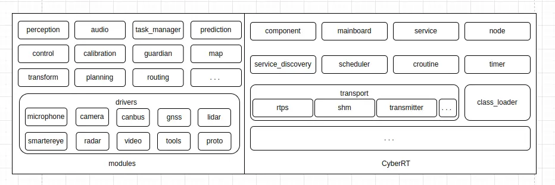

## 百度 Apollo 的简单编译运行方法

1. 下载 apollo 源码并进入 apollo 目录
```
$ git clone https://github.com/ApolloAuto/apollo.git
$ cd apollo
```

2. 安装docker
```
$ sudo docker/setup_host/install_docker.sh
```

官方代码库中的 `docker/setup_host/install_docker.sh` 脚本由于没有可执行权限，上面的命令会执行失败。在执行上面的命令之前，还需要给这个脚本加上可执行权限：
```
$ chmod a+x docker/setup_host/install_docker.sh
```

3. 启动docker
```
$ sudo docker/scripts/dev_start.sh
```

4. 进入docker环境
```
$ sudo docker/scripts/dev_into.sh
```

5. 在 docker 中编译 apollo 源码
```
$ sudo ./apollo.sh build
```

这个命令编译的是 release 版的二进制文件，也就是说生成的二进制文件，包括动态链接库和可执行文件，不包含调试用的符号信息。把 `apollo.sh` 命令的 `build` 参数换成 `build_dbg` 参数，可以编译调试版二进制文件。

6. 启动 Dreamview
在 docker 环境中执行如下命令：
```
# sudo scripts/bootstrap.sh
```

若正常启动，打开 http://localhost:8888 可以看到效果

7. 运行 Cyber RT 示例应用

Cyber RT 有一个示例应用演示了 Cyber RT 框架的基本用法，位于 `apollo/cyber/examples/common_component_example`。可以在 docker 环境中执行示例应用。

在执行下面的程序之前，可以先打开向标准错误输出的日志输出，具体来说可以将 `cyber/setup.bash` 脚本中的 `GLOG_alsologtostderr` 从 `0` 改为 `1`，并在当前终端中执行 `source cyber/setup.bash`。

或者也可以直接执行如下命令：
```
export GLOG_alsologtostderr=1
```

(1). 运行示例组件

可以通过如下命令执行示例组件：
```
# bazel-bin/cyber/tools/cyber_launch/cyber_launch start cyber/examples/common_component_example/common.launch
```

或者也可以直接通过 `mainboard` 来运行：
```
# bazel-bin/cyber/mainboard/mainboard -d cyber/examples/common_component_example/common.dag
```

此时可以在终端看到类似如下这样的输出：
```
root@in-dev-docker:/apollo# bazel-bin/cyber/mainboard/mainboard -d cyber/examples/common_component_example/common.dag
WARNING: Logging before InitGoogleLogging() is written to STDERR
I1216 19:24:43.487663 110641 module_argument.cc:81] []command: bazel-bin/cyber/mainboard/mainboard -d cyber/examples/common_component_example/common.dag 
I1216 19:24:43.488569 110641 global_data.cc:153] []host ip: 192.168.31.205
W1216 19:24:43.488574 110641 environment.h:33] []Environment variable [CYBER_PATH] not set, fallback to 
I1216 19:24:43.489843 110641 module_argument.cc:57] []binary_name_ is mainboard, process_group_ is mainboard_default, has 1 dag conf
I1216 19:24:43.489851 110641 module_argument.cc:60] []dag_conf: cyber/examples/common_component_example/common.dag
W1216 19:24:43.489900 110641 environment.h:33] [mainboard]Environment variable [CYBER_PATH] not set, fallback to 
W1216 19:24:43.489915 110641 scheduler_factory.cc:63] [mainboard]Scheduler conf named /apollo/cyber/conf/mainboard_default.conf not found, use default.
W1216 19:24:43.489931 110641 environment.h:33] [mainboard]Environment variable [CYBER_PATH] not set, fallback to 
I1216 19:24:43.490108 110643 processor.cc:42] [mainboard]processor_tid: 110643
I1216 19:24:43.490167 110644 processor.cc:42] [mainboard]processor_tid: 110644
I1216 19:24:43.490209 110645 processor.cc:42] [mainboard]processor_tid: 110645
```

这个组件用于读取消息并输出。

(2). 启动写节点

另外开两个终端，并进入 docker 环境，然后分别执行如下两个命令：
```
root@in-dev-docker:/apollo# bazel-bin/cyber/examples/common_component_example/channel_prediction_writer
```

以及：
```
root@in-dev-docker:/apollo# bazel-bin/cyber/examples/common_component_example/channel_test_writer
```

在这三个终端中分别可以看到发送消息和接收消息的日志输出。

## 百度 Apollo 构建系统简单说明

Apollo 的具体代码是用 bazel 构建的，但它也提供了一些方便构建的 shell 脚本。Apollo 的整个代码库是一个 bazel 的 workspace，shell 脚本则位于 `apollo/scripts`，如上面我们用到的 `apollo/scripts/apollo_build.sh`。上面拉的 docker 镜像包含了构建 Apollo 所需的各种依赖。Apollo 用来方便构建的那些 shell 脚本包装了对 bazel 的调用。

`apollo/scripts/apollo_build.sh` 检查是否在 docker 环境中运行，并强制要求只能在 docker 环境中运行。当直接在非 docker 环境执行时，会报出如下错误：
```
apollo$ ./scripts/apollo_build.sh build
[ERROR] The build operation must be run from within docker container
```

Bazel 构建本身不要求在 docker 环境中运行，但 Apollo 的构建要求 bazel 的版本高于 3.7.0，否则会报错：
```
auto/apollo$ bazel build
Starting local Bazel server and connecting to it...
(09:43:35) WARNING: Usage: bazel build <options> <targets>.
Invoke `bazel help build` for full description of usage and options.
Your request is correct, but requested an empty set of targets. Nothing will be built.
(09:43:35) INFO: Current date is 2022-12-17
(09:43:35) ERROR: Traceback (most recent call last):
	File "/media/data2/auto/apollo/WORKSPACE", line 23, column 15, in <toplevel>
		versions.check(minimum_bazel_version = "3.7.0")
	File "/home/user/.cache/bazel/_bazel_user/4240ccd68eabfe2609ab326fd8c4918b/external/bazel_skylib/lib/versions.bzl", line 105, column 13, in _check_bazel_version
		fail("Current Bazel version is {}; expected at least {}".format(
Error in fail: Current Bazel version is 3.5.1- (@non-git); expected at least 3.7.0
(09:43:35) ERROR: error loading package '': Encountered error while reading extension file 'proto/repositories.bzl': no such package '@rules_proto//proto': error loading package 'external': Could not load //external package
(09:43:35) INFO: Elapsed time: 0.874s
(09:43:35) INFO: 0 processes. 
(09:43:35) FAILED: Build did NOT complete successfully (0 packages loaded)
```

可以在 Bazel 的 [官方 GitHub 仓库](https://github.com/bazelbuild/bazel/releases) 下载新版本的 bazel 二进制文件进行安装。关于 bazel 更详细的安装及使用方法，可以参考 bazel 官方提供的 [文档](https://bazel.google.cn/docs)。

## 在非 docker 环境中构建

在非 docker 环境中直接执行 bazel 构建 apollo 可能会由于依赖不满足而失败，如执行 `bazel build //:install` 编译整个 apollo 时会失败并报出如下错误信息：
```
auto/apollo$ bazel build //:install 
(10:43:28) INFO: Current date is 2022-12-17
(10:43:28) ERROR: /media/data2/auto/apollo/WORKSPACE:6:20: fetching new_local_repository rule //external:boost: java.io.IOException: The repository's path is "/opt/apollo/sysroot/include" (absolute: "/opt/apollo/sysroot/include") but this directory does not exist.
(10:43:28) INFO: Repository com_github_gflags_gflags instantiated at:
  /media/data2/auto/apollo/WORKSPACE:6:20: in <toplevel>
  /media/data2/auto/apollo/tools/workspace.bzl:94:27: in apollo_repositories
  /media/data2/auto/apollo/tools/workspace.bzl:63:11: in initialize_third_party
  /media/data2/auto/apollo/third_party/gflags/workspace.bzl:6:17: in repo
Repository rule http_archive defined at:
  /home/user/.cache/bazel/_bazel_user/4240ccd68eabfe2609ab326fd8c4918b/external/bazel_tools/tools/build_defs/repo/http.bzl:355:31: in <toplevel>
(10:43:28) ERROR: /media/data2/auto/apollo/modules/contrib/cyber_bridge/BUILD:18:10: //modules/contrib/cyber_bridge:cyber_bridge depends on @boost//:boost in repository @boost which failed to fetch. no such package '@boost//': The repository's path is "/opt/apollo/sysroot/include" (absolute: "/opt/apollo/sysroot/include") but this directory does not exist.
(10:43:28) ERROR: Analysis of target '//:install' failed; build aborted: 
(10:43:28) INFO: Elapsed time: 0.491s
(10:43:28) INFO: 0 processes.
(10:43:28) FAILED: Build did NOT complete successfully (48 packages loaded, 138 targets configured)
    currently loading: modules/planning/proto ... (3 packages)
    Fetching https://apollo-system.cdn.bcebos.com/archive/6.0/v2.2.2.tar.gz
```

执行 `bazel build //cyber` 单独编译 CyberRT 同样会失败：
```
auto/apollo$ bazel build //cyber
(10:48:52) INFO: Current date is 2022-12-17
(10:48:53) INFO: Repository com_github_google_glog instantiated at:
  /media/data2/auto/apollo/WORKSPACE:6:20: in <toplevel>
  /media/data2/auto/apollo/tools/workspace.bzl:94:27: in apollo_repositories
  /media/data2/auto/apollo/tools/workspace.bzl:64:9: in initialize_third_party
  /media/data2/auto/apollo/third_party/glog/workspace.bzl:15:17: in repo
Repository rule http_archive defined at:
  /home/user/.cache/bazel/_bazel_user/4240ccd68eabfe2609ab326fd8c4918b/external/bazel_tools/tools/build_defs/repo/http.bzl:355:31: in <toplevel>
(10:48:53) ERROR: /media/data2/auto/apollo/WORKSPACE:6:20: fetching new_local_repository rule //external:fastrtps: java.io.IOException: The repository's path is "/usr/local/fast-rtps/include" (absolute: "/usr/local/fast-rtps/include") but this directory does not exist.
(10:48:53) ERROR: /media/data2/auto/apollo/cyber/BUILD:73:11: //cyber:cyber_core depends on @fastrtps//:fastrtps in repository @fastrtps which failed to fetch. no such package '@fastrtps//': The repository's path is "/usr/local/fast-rtps/include" (absolute: "/usr/local/fast-rtps/include") but this directory does not exist.
(10:48:53) ERROR: Analysis of target '//cyber:cyber' failed; build aborted: 
(10:48:53) INFO: Elapsed time: 0.318s
(10:48:53) INFO: 0 processes.
(10:48:53) FAILED: Build did NOT complete successfully (22 packages loaded, 2 targets configured)
    currently loading: @com_google_protobuf// ... (2 packages)
    Fetching https://apollo-system.cdn.bcebos.com/archive/6.0/v0.4.0.tar.gz
```

在 `apollo/WORKSPACE` 和 `apollo/tools/workspace.bzl` 文件中引入了许多外部依赖，如 `apollo/WORKSPACE` 文件中引入的 `zlib`：
```
http_archive(
    name = "zlib",
    build_file = "@com_google_protobuf//:third_party/zlib.BUILD",
    sha256 = "629380c90a77b964d896ed37163f5c3a34f6e6d897311f1df2a7016355c45eff",
    strip_prefix = "zlib-1.2.11",
    urls = ["https://github.com/madler/zlib/archive/v1.2.11.tar.gz"],
)
```

以及通过 `apollo/tools/workspace.bzl` 文件间接引入并在 `apollo/third_party/opencv/workspace.bzl` 文件中定义的 OpenCV：
```
def repo():
    native.new_local_repository(
        name = "opencv",
        build_file = clean_dep("//third_party/opencv:opencv.BUILD"),
        path = "/opt/apollo/sysroot/include/opencv4",
    )
```

CyberRT 框架直接依赖的外部模块（在 cyber 目录下的各个 `BUILD` 文件中，用关键字 `@` 捞的）有如下这些：

| 模块 | 名字 | 引入位置 | 备注说明 |
|---------|-------------|-----------|-----------|
| C/C++编译规则 | rules_cc | bazel 内部模块 | 包含 `cc_library` 和 `cc_test` 之类的编译规则 |
| gtest | com_google_googletest | `apollo/tools/workspace.bzl` : `apollo/third_party/gtest/workspace.bzl` | HTTP 包依赖 |
| protobuf | com_google_protobuf | `apollo/tools/workspace.bzl` : `apollo/third_party/protobuf/workspace.bzl` | HTTP 包依赖 |
| glog | com_github_google_glog | `apollo/tools/workspace.bzl` : `apollo/third_party/glog/workspace.bzl` | HTTP 包依赖 |
| fastrtps | fastrtps | `apollo/tools/workspace.bzl` : `apollo/third_party/fastrtps/workspace.bzl` | 本地依赖，即在开始编译之前需要先将这个模块安装进系统的本地文件系统。这个模块的代码位于 [Fast-DDS](https://github.com/eProsima/Fast-DDS)，开始编译前需要先通过源码安装 |
| Proto 规则 | rules_proto | `apollo/WORKSPACE` | HTTP 包依赖 |
| uuid | uuid | `apollo/tools/workspace.bzl` : `apollo/third_party/uuid/workspace.bzl` | 本地依赖，可通过 apt 安装 uuid-dev 获得 |
| fastcdr | fastcdr | `apollo/tools/workspace.bzl` : `apollo/third_party/fastrtps/workspace.bzl` | 本地依赖，这个模块的代码位于 [Fast-CDR](https://github.com/eProsima/Fast-CDR)，开始编译前需要先通过源码安装 |
| Python 规则 | rules_python | `apollo/WORKSPACE` | HTTP 包依赖 |
| 本地 Python 配置 | local_config_python | `apollo/third_party/py/python_configure.bzl` | 本地定义的一个模块 |
| 平台 | platforms | bazel 内部模块 |  |
| ncurses5 | ncurses5 | `apollo/tools/workspace.bzl` : `apollo/third_party/ncurses5/workspace.bzl` | 本地依赖，可通过 apt 安装 libncurses5-dev 获得 |
| gflags | com_github_gflags_gflags | `apollo/tools/workspace.bzl` : `apollo/third_party/gflags/workspace.bzl` | HTTP 包依赖 |

上面所有这些依赖包，bazel 内部模块、本地定义模块和 HTTP 依赖包不需要特别处理，bazel 编译时会自动拉取，那些本地依赖需要在编译之前准备好。在这些本地依赖中，`uuid` 和 `ncurses5` 可通过 apt 安装：`sudo apt-get install uuid-dev  libncurses5-dev`，fastrtps 和 fastcdr 需要通过源码安装。

在 docker 环境中，我们通过 `/usr/local/fast-rtps/lib` 目录下文件的文件名可以看到依赖的 fastrtps 和 fastcdr 的版本：
```
root@in-dev-docker:/apollo# ls  /usr/local/fast-rtps/lib 
fastcdr  fastrtps  libfastcdr.so  libfastcdr.so.1  libfastcdr.so.1.0.7  libfastrtps.so  libfastrtps.so.1  libfastrtps.so.1.5.0
```

可以看到依赖的 fastrtps 版本为 1.5.0，依赖的 fastcdr 版本为 1.0.7。我们编译并安装这些版本的 fastrtps 和 fastcdr，先安装 fastcdr，然后是 fastrtps。

下载并安装 fastcdr 的过程大体如下：
```
auto$ git clone https://github.com/eProsima/Fast-CDR.git
auto$ cd Fast-CDR
Fast-CDR$ git checkout v1.0.7
Fast-CDR$ mkdir build
Fast-CDR$ cd build/
build$ cmake ..
build$ make
build$ sudo make install
Consolidate compiler generated dependencies of target fastcdr
[100%] Built target fastcdr
Install the project...
-- Install configuration: "Release"
-- Installing: /usr/local/share/fastcdr/LICENSE
-- Installing: /usr/local/lib/fastcdr/cmake/fastcdrConfig.cmake
-- Installing: /usr/local/lib/fastcdr/cmake/fastcdrConfigVersion.cmake
-- Installing: /usr/local/include/fastcdr
-- Installing: /usr/local/include/fastcdr/FastBuffer.h
-- Installing: /usr/local/include/fastcdr/Cdr.h
-- Installing: /usr/local/include/fastcdr/FastCdr.h
-- Installing: /usr/local/include/fastcdr/fastcdr_dll.h
-- Installing: /usr/local/include/fastcdr/eProsima_auto_link.h
-- Installing: /usr/local/include/fastcdr/exceptions
-- Installing: /usr/local/include/fastcdr/exceptions/BadParamException.h
-- Installing: /usr/local/include/fastcdr/exceptions/NotEnoughMemoryException.h
-- Installing: /usr/local/include/fastcdr/exceptions/Exception.h
-- Installing: /usr/local/include/fastcdr/config.h
-- Installing: /usr/local/lib/libfastcdr.so.1.0.7
-- Installing: /usr/local/lib/libfastcdr.so
-- Installing: /usr/local/lib/fastcdr/cmake/fastcdrTargets.cmake
-- Installing: /usr/local/lib/fastcdr/cmake/fastcdrTargets-release.cmake
```

fastrtps 依赖 boost 的 asio、TinyXML 和 OpenSSL 的 ssl 库（参加 [eProsima Fast DDS Documentation](https://github.com/eProsima/Fast-DDS-docs)），因而在编译 fastrtps 之前需要先安装这些库：
```
sudo apt-get install libboost-all-dev libasio-dev libtinyxml2-dev libssl-dev
```

下载并安装 fastrtps 的过程大体如下：
```
auto$ git clone https://github.com/eProsima/Fast-DDS.git
auto$ cd Fast-DDS
Fast-DDS$ git checkout v1.5.0
Fast-DDS$ mkdir build
Fast-DDS$ cd build/
build$ cmake ..
build$ make
build$ sudo make install
```

在编译 fastrtps 期间，由于 `Fast-DDS/include/fastrtps/rtps/writer/RTPSWriter.h` 遗漏了包含头文件 `functional` 而编译失败，给这个文件加上相应的 include 即可。

上面安装 fastrtps 和 fastcdr 的目录和 docker 环境中这些库的默认安装位置不太一样，因而还需要对这些依赖的配置做些修改。具体来说，修改 `apollo/third_party/fastrtps/workspace.bzl` 文件，将其中的 `/usr/local/fast-rtps/include` 替换为 fastrtps 和 fastcdr 的头文件实际的安装位置 `/usr/local/include`；修改 `apollo/third_party/fastrtps/fastrtps.BUILD` 和 `apollo/third_party/fastrtps/fastcdr.BUILD` 文件，将其中 `linkopts` 的 `-L/usr/local/fast-rtps/lib` 替换为 fastrtps 和 fastcdr 的库文件实际的安装位置 "-L/usr/local/lib"。

完成了上面的准备工作之后，即可编译 CyberRT 了，如：
```
apollo$ bazel build //cyber
apollo$ bazel build //cyber/examples/common_component_example/...
apollo$ bazel build //cyber/mainboard
```

如果想要编译 debug 版的话，则给上面的命令加上 `--config=dbg`，如：
```
apollo$ bazel build //cyber --config=dbg
apollo$ bazel build //cyber/examples/common_component_example/... --config=dbg
apollo$ bazel build //cyber/mainboard --config=dbg
```

直接执行前面的示例应用，应用会崩溃：
```
apollo$ export GLOG_alsologtostderr=1
apollo$ bazel-bin/cyber/mainboard/mainboard -d cyber/examples/common_component_example/common.dag 
WARNING: Logging before InitGoogleLogging() is written to STDERR
I1217 14:19:49.706243 147166 module_argument.cc:81] []command: bazel-bin/cyber/mainboard/mainboard -d cyber/examples/common_component_example/common.dag 
I1217 14:19:49.707167 147166 global_data.cc:153] []host ip: 192.168.31.205
W1217 14:19:49.707171 147166 environment.h:33] []Environment variable [CYBER_PATH] not set, fallback to 
E1217 14:19:49.707178 147166 file.cc:73] []Failed to open file /apollo/cyber/conf/cyber.pb.conf in text mode.
E1217 14:19:49.707195 147166 file.cc:99] []Failed to open file /apollo/cyber/conf/cyber.pb.conf in binary mode.
E1217 14:19:49.707201 147166 global_data.cc:159] []read cyber default conf failed!
F1217 14:19:49.707203 147166 global_data.cc:55] Check failed: InitConfig() []
*** Check failure stack trace: ***
已放弃 (核心已转储)
```

CyberRT 找不到配置文件（`apollo/cyber/common/global_data.cc`）：
```
bool GlobalData::InitConfig() {
  auto config_path = GetAbsolutePath(WorkRoot(), "conf/cyber.pb.conf");
  if (!GetProtoFromFile(config_path, &config_)) {
    AERROR << "read cyber default conf failed!";
    return false;
  }

  return true;
}
```

其中的 `WorkRoot()` 如下（`apollo/cyber/common/environment.h`）：
```
inline const std::string WorkRoot() {
  std::string work_root = GetEnv("CYBER_PATH");
  if (work_root.empty()) {
    work_root = "/apollo/cyber";
  }
  return work_root;
}
```

即 work root 路径默认为 `/apollo/cyber`，但可以通过环境变量 `CYBER_PATH` 来设置。在执行前面的示例应用之前，还需要设置 `CYBER_PATH` 环境变量指向 cyber 目录，如：
```
apollo$ export CYBER_PATH=/media/data2/auto/apollo/cyber
```

在执行 `bazel-bin/cyber/mainboard/mainboard -d cyber/examples/common_component_example/common.dag` 时，为了使 `mainboard` 能找到示例组件的动态连接库，还需要修改 `cyber/examples/common_component_example/common.dag`，配置 `module_library` 字段指向适当库文件。

## Apollo 的模块结构

从模块的视角来看，Apollo 的组成如下图所示：



整体来看，Apollo 主要由消息通信框架 Cyber RT，和基于 Cyber RT 实现的各种模块组成。 Cyber RT 框架内部又由协程 coroutine、传输 transport 和任务调度 scheduler 等组件组成。而其它模块通过 Cyber RT 进行通信，相互传递消息和数据，它们主要由两大部分组成，一部分是驱动模块，它们是用户空间程序而不是操作系统内核的那个驱动，它们通过操作系统提供的接口，访问硬件设备，获得传感器采集的数据，如访问麦克风和摄像头等；另一部分则处理从传感器获得的数据，实现感知、规划、控制和预测等功能。

各个模块的实现除了依赖 Cyber RT 之外，也会借助其它一些外部模块来实现其功能，如许多模块的实现依赖 OpenCV。这些模块的依赖问题的解决，这里不再赘述。

参考文档：
[百度Apollo编译运行方法](https://blog.csdn.net/haizixinzhu/article/details/124239322)

Done.
