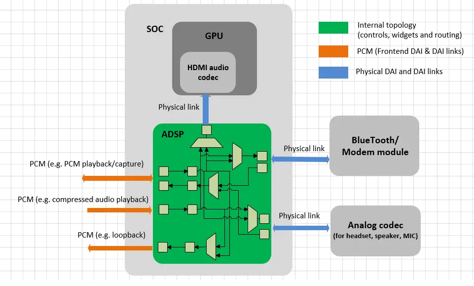
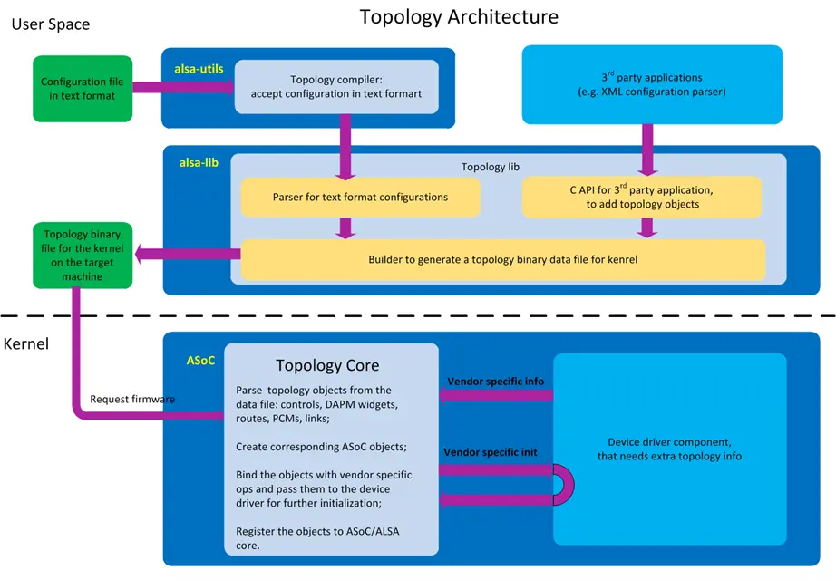

ALSA 拓扑给音频驱动程序提供了一种在运行时，从用户空间加载它们的混音器，路由，PCM 和能力，而无需修改任何驱动程序源码的方法。其目标是编写一次驱动程序，而在拓扑中处理变化和差异。

## 我们为什么需要拓扑？

当前的音频驱动程序通常将拓扑信息硬编码进驱动程序源码中：这将音频驱动程序与开发板紧密耦合起来，使得修改驱动程序以在不同设备上工作非常耗时。驱动程序也与 DSP 固件版本紧密耦合起来，这意味着需要格外小心以保持驱动程序和固件版本的同步。新的固件特性也意味着驱动程序要更新。

通过 ALSA 拓扑项目，则无需重新编写音频驱动程序或将其移植到不同的设备或不同的固件：驱动程序不再硬编码拓扑数据，这意味着单个驱动程序可以通过更新文件系统中的拓扑数据而用于不同的设备上。无需更新驱动程序即可推送固件更新。新固件只需要包含描述更新的新拓扑文件。

### 拓扑对象

用户空间可以配置的拓扑对象包括：controls，widgets，routes，PCMs 和物理 DAI & DAI 链接的配置。

这里有一个例子。

## 拓扑架构

### 用户空间

拓扑库是 alsa-lib 的一部分。用户可以定义描述客户固件拓扑的拓扑对象，比如 SOC 中嵌入的 ADSP 或非 SOC 编解码器。这些拓扑对象可以在文本配置文件中定义，也可以通过 C API 来添加。拓扑库将解析它们，并为内核生成二进制文件。请参考 alsa-lib 的 src/topology 目录下的源码。

生成的拓扑二进制文件由清单和块列表组成。清单数据提供文件中拓扑对象类型的总体信息，如 controls、widgets、routes、PCM、物理 DAI 和物理 DAI 链接的数量。每个块由一个块头和特定类型的拓扑对象组成。关于文件和拓扑对象的布局，请参考 alsa-lib 中的 ABI 文件 include/sound/asoc.h 和 tlv.h。

#### *如何生成拓扑二进制文件*

用户可以在文本配置文件中定义拓扑对象。语法基于 alsaconf 语法，请参见 alsa-lib/include/alsa/topology.h。然后用户可以使用 alsa-utils 中的拓扑工具 *alsatplg* 将拓扑文本配置文件转换为二进制文件，通过命令 “alsatplg -c <path-of-input-text-configuration-file> -o <path-of-output-binary-file>”。请参阅 alsa-utils 的 topology 目录中的 alsatplg 源码，以及 alsa-lib/src/conf/topology 中的 Intel Broadwell 和 Skylake 配置作为文本配置文件的示例。

用户还可以编写自己的应用程序并调用拓扑库 API 来添加拓扑对象并生成二进制文件。 请参阅 alsa-lib/include/alsa/topology.h 了解 API 定义。

### 内核

拓扑内核驱动程序为设备驱动程序提供 API，以从用户空间加载拓扑二进制文件，然后它将解析文件中的 ABI 对象，创建 controls，widgets，routes，前端 DAI 和 DAI 链接（PCM），并配置现有的物理 DAI 和 DAI 链路。它还将让设备驱动程序通过设备驱动程序注册的拓扑操作对这些对象进行特定于平台的初始化。请参阅内核中 sound/soc/soc-topology.c 的代码。

#### *设备驱动程序如何使用拓扑*

Intel Skylake 平台驱动程序是设备驱动程序如何使用拓扑的示例，请参阅内核中sound/soc/intel/skylake/skl-topology.c 的 代码。

[原文](https://www.alsa-project.org/main/index.php/ALSA_topology)。

Done.
