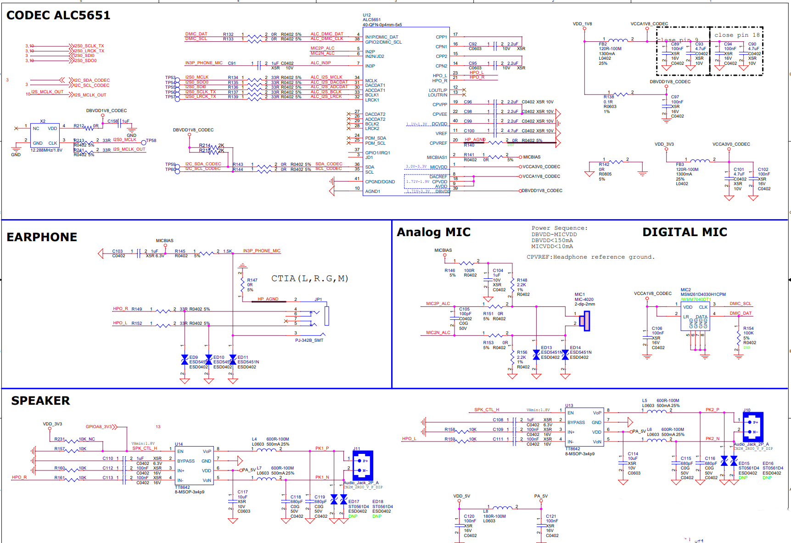
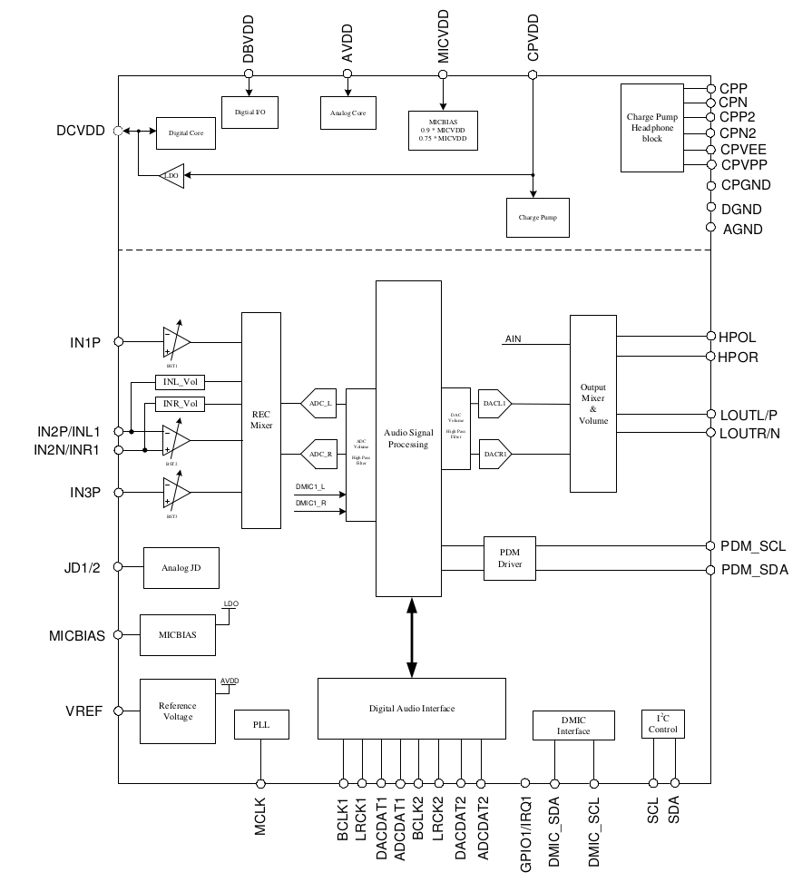
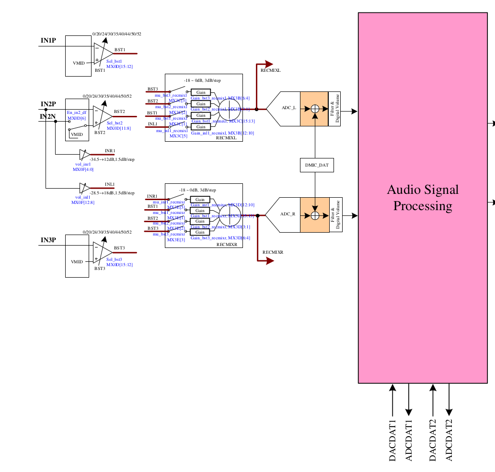
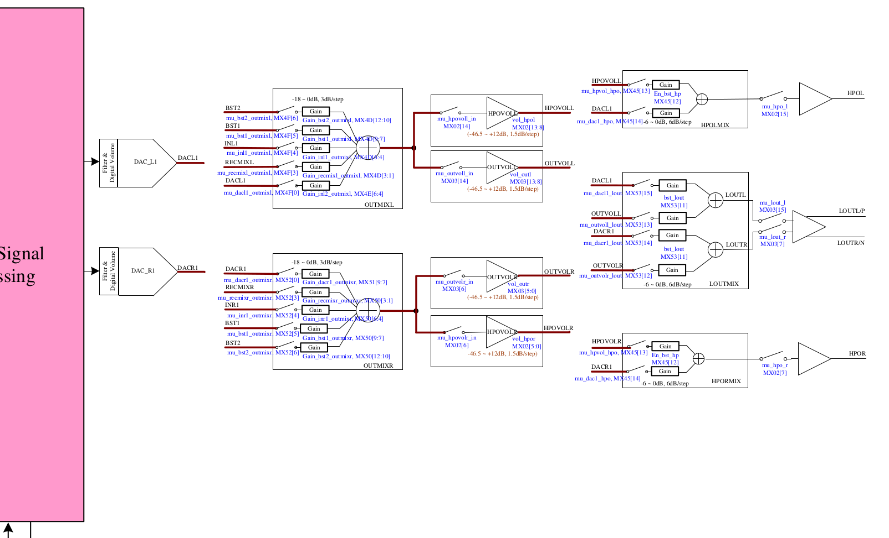
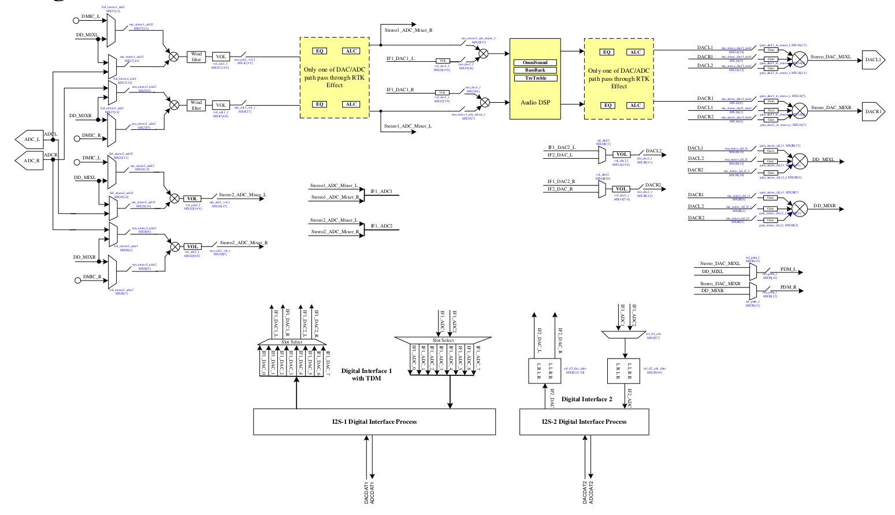

音频的基本处理 (原始音频) 操作主要有音量调节、重采样、混音，音频信号处理 (包括 3A 处理回声降噪和自动增益控制，及混响、变声等音效) 等。音频的基本处理操作通过各种形态的组合组成音频处理管线，以应对各种各样应用场景的需要。

在软硬件系统栈中，音频处理管线的搭建存在于各种各样不同的层面。

应用程序可以搭建自己的音频处理管线，其中操作系统应用开发框架提供某些音频处理操作模块，如音效、编解码和播放采集等。

操作系统应用开发框架可以搭建自己的音频处理管线，如将多个应用程序要播放的数据混音之后播放，按照硬件的配置做重采样，处理音频路由的切换管理，回声降噪等 3A 处理，音效，及 `android.media.MediaPlayer` 这样简化应用程序音视频应用开发的组件等。

操作系统内核可以搭建自己的音频处理管线，如 Android/Linux 的 offload 模式，可以将编码的数据丢给内核，在内核驱动程序中，通过 ADSP 解码，并把解码出来的数据通过 I2S 这样的总线送进 audio codec，audio codec 做 DAC 处理，通过耳机和扬声器等播放出来。

硬件 audio codec 可以搭建自己的音频处理管线。有线播放、耳机播放和扬声器播放在硬件上可能是不完全相同的信号通路，数字麦克风和模拟麦克风、耳机麦克风可能是不完全相同的信号通路，播放的音频信号可以混音进采集的信号送给上层录音的应用，采集的音频信号可以和播放的音频信号混音之后再播放出来，可以在音频信号通路上加 EQ 和自动增益控制等处理。

各个层面的音频处理管线，尽管描述方式可能不同，建立的抽象可能不完全相同，但在基本组成上，是有许多相似之处的。但 Audio codec 硬件相对于软件，具有 ADC 和 DAC 这种处理模拟信号的模块，混音器分模拟信号混音器和数字信号混音器，音频处理模块是固定的，音频处理管线通过开关和多路复用器构建。

ALC5651 是一款时间比较久比较成熟的 audio codec，本文从驱动软件开发的视角，看一下这款 audio codec 的硬件内部结构。可以在 www.alldatasheet.com  找到 [ALC5651 的 datasheet](https://pdf1.alldatasheet.com/datasheet-pdf/view/1132330/REALTEK/ALC5651.html)。

## ALC5651 芯片的引脚分配

从外部看，ALC5651 芯片的引脚分配如下图：

ALC5651 芯片封装总共有 40 个引脚，这些引脚按照信号类型，可以分为四类：数字 I/O 引脚，模拟 I/O 引脚 (第 4 号引脚是复用的，即可以用作数字 I/O，也可以用作模拟 I/O 引脚)，过滤器/参考引脚，和电源/地引脚。ALC5651 被放在某块板子上，与整个硬件系统的 SoC 和各种器件连接，连接结构可能类似下面这样：

尽管过滤器/参考引脚（2、11、20、16、17、14 和 15 号引脚，共 7 个），和电源/地引脚 (1、9、8、10、18、22、19、40、39 和 41 号引脚，共 9 个) 对于芯片的正常工作非常重要，但站在驱动软件的视角，除了第 2 号的麦克风偏置电压输出引脚外，不特别关注其它引脚。

ALC5651 共有 15 个数字 I/O 引脚，它们分别是：

| 引脚名称 | 类型 | 引脚编号 | 功能描述 |
|----|----|----|----|
| DACDAT1 | I | 31 | 第一个 I2S 接口串行数据输入 |
| ADCDAT1 | O | 30 | 第一个 I2S 接口串行数据输出 |
| BCLK1 | I/O | 33 | 第一个 I2S 接口串行位时钟 |
| LRCK1 | I/O | 32 | 第一个 I2S 接口帧同步信号 |
| DACDAT2 | I | 27 | 第二个 I2S 接口串行数据输入 |
| ADCDAT2 | O | 26 | 第二个 I2S 接口串行数据输出 |
| BCLK2 | I/O | 29 | 第二个 I2S 接口串行位时钟 |
| LRCK2 | I/O | 28 | 第二个 I2S 接口帧同步信号 |
| SDA | I/O | 36 | I2C 接口串行数据 |
| SCL | I | 35 | I2C 接口时钟输入 |
| MCLK | I | 34 | I2S 接口主时钟输入 |
| GPIO1/IRQ | I/O | 37 | GPIO 或中断输出 |
| GPIO2/DMIC_SCL | I/O | 38 | GPIO 或数字麦克风时钟输出 |
| PDM_SCL | O | 25 | PDM 时钟输出 |
| PDM_SDA | O | 24 | PDM 数据输出 |

数字 I/O 引脚和其它数字器件连接，ALC5651 的数字 I/O 引脚主要和两种器件连接，一是数字麦克风，这包括 GPIO2/DMIC_SCL 引脚，它为数字麦克风提供时钟；二是 SoC，这包括其余所有的数字引脚。ALC5651 可以接两个 I2S 总线，它和 SoC 连接的这些数字引脚，按功能块可以分为如下几种：

1. I2S1，包括 DACDAT1、ADCDAT1、BCLK1 和 LRCK1 引脚，它们用于和 SoC 的一个 I2S 总线通信。
2. I2S2，包括 DACDAT2、ADCDAT2、BCLK2 和 LRCK2 引脚，它们用于和 SoC 的另一个 I2S 总线通信。
3. I2C，包括 SDA 和 SCL 引脚，它们用于和 SoC 的 I2C 通信。SoC 和 CPU 通过 I2C 控制 ALC5651，如读写 ALC5651 的各个寄存器。ALC5651 作为 I2C 从设备和 SoC 连接。
4. MCLK，包括 MCLK 引脚，I2S 接口主时钟输入。
5. 中断，包括 GPIO1/IRQ 引脚，用于向 SoC 和 CPU 传递中断。
6. PDM，包括 PDM_SCL 和 PDM_SDA 引脚，

ALC5651 共有 9 个模拟 I/O 引脚，它们分别是：

| 引脚名称 | 类型 | 引脚编号 | 功能描述 |
|----|----|----|----|
| LOUTR/N | O | 13 | 有线输出类型，单端输出的右声道，或负通道差分输出 |
| LOUTL/P | O | 12 | 有线输出类型，单端输出的左声道，或正通道差分输出 |
| IN2P | I | 5 | 麦克风 2 的正差分输入，或有线输入的左声道 |
| IN2N/JD2 | I | 6 | 麦克风 2 的负差分输入，或有线输入的右声道，或第二个插孔探测引脚 |
| IN1P/DMIC_DAT | I | 4 | 麦克风 1 的单端输入，或数字麦克风的数据输入 |
| JD1 | I | 3 | 第一个插孔探测引脚 |
| HPO_R | O | 21 | 耳机放大器输出，右声道 |
| HPO_L | O | 23 | 耳机放大器输出，左声道 |
| IN3P | I | 7 | 麦克风 3 的单端输入 |

模拟 I/O 引脚和其它模拟设备连接，ALC5651 的模拟 I/O 引脚根据功能的不同，连接不同的模拟设备。这些模拟引脚连接的模拟设备有如下这些：

1. 有线输出，包括 LOUTR/N 和 LOUTL/P 引脚，可能接一个扬声器。
2. 耳机输出，包括 HPO_R 和 HPO_L 引脚。
3. 麦克风 1，包括 IN1P/DMIC_DAT 引脚。
4. 麦克风 2，包括 IN2P 和 IN2N/JD2 引脚。
5. 有线输入，包括 IN2P 和 IN2N/JD2 引脚，与麦克风 2 复用引脚。
6. 麦克风 3，包括 IN3P 引脚。
7. 数字麦克风，包括 IN1P/DMIC_DAT 引脚，和麦克风 1 复用同一个引脚。
8. 插孔探测 1，包括 JD1 引脚。
9. 插孔探测 2，包括 IN2N/JD2 引脚，和麦克风 2 复用了一个引脚。

对于一个特定的硬件系统，不一定所有的数字和模拟 I/O 引脚都接了设备。

在上面 ALC5651 的连接结构图中，可以看到，接了 3 个麦克风设备，分别是耳机麦克风，接在 IN3P 引脚，模拟麦克风，接在 IN2P 和 IN2N，及数字麦克风，接 IN1P/DMIC_DAT 和 GPIO2/DMIC_SCL 引脚；接了两个播放设备，耳机和扬声器都接在 HPO_R 和 HPO_L 引脚。有线输出，I2S2 和 PDM 有关的引脚没有接任何设备。

对于音频录制，ALC5651 总共有 5 个音频源，包括麦克风 1、麦克风 2、有线输入、麦克风 3 和数字麦克风。对于播放，总共有两个音频输出，分别是有线输出和耳机输出。

## ALC5651 的内部功能结构

来看一下 ALC5651 的内部功能框图：

对于音频录制，四个模拟音频输入，即麦克风 1、麦克风 2、有线输入和麦克风 3 接在称为 REC Mixer 的模拟混音器中，REC Mixer 混音之后的信号被送进 ADC L/ADC R，经过 ADC L/ADC R 的处理，模拟音频信号变为数字音频信号，数字音频信号被送进一个数字混音器。另外，数字麦克风的数字信号直接送进数字混音器。数字混音器混音数字麦克风和 ADC L/ADC R 输出的数字信号，生成最终的数据，之后通过音频信号处理，并通过 I2S 数字总线，送进 SoC、CPU 和内存。

对于音频播放，数字音频信号，从 SoC、CPU 和内存经 I2S 进入 ALC5651 的音频信号处理模块，随后经 DAC 音量调节和高通滤波器，然后经 DACL1/DACR1，数字信号变为模拟器信号，模拟信号进入输出混音器。输出混音器有另外的音频源 AIN，这是指麦克风录制的模拟音频信号。输出混音器混音之后，音频信号被送进有线输出和耳机输出。

## ALC5651 内部的模拟混音器

ALC5651 内部，模拟混音器更详细的结构如下面两幅图。录制的模拟混音器详细结构如下图：

四个模拟音频源，各通过一个开关连接到一个增益模块，这大概用来实现音量调节。增益模块出来的信号进入模拟器混音器 RECMIXL/RECMIXR，在软件中，可以配置这些开关的连接或断开，来决定对应的音频源是否接入混音器。从图中可以看到，除了有线输入之外，其它音频源都是同一路音频信号，被分别送进左右声道的混音器 RECMIXL 和 RECMIXR，只有有线输入是不同的两路音频信号被送进 RECMIXL 和 RECMIXR。也就是说，有线输入是真正的立体声输入。

RECMIXL 和 RECMIXR 处理之后的信号，被送进 ADC，以做进一步的处理。在 RECMIXL 和 RECMIXR 的后面，各引了一根线出来。

播放的模拟混音器详细结构如下图：

音频信号处理模块出来的信号，进入过滤器和数字音量模块，之后进入 DAC 模块。DAC 模块将数字信号转换为模拟信号，模拟信号通过一个开关连接到一个增益模块，进而连接到模拟混音器 OUTMIXL/OUTMIXR。除了 DACL1/DACR1，OUTMIXL/OUTMIXR 还有四路音频源，分别是 BST1、BST2、INL1/INR1 和 RECMIXL/RECMIXR。四路模拟录制音频源中的三路，通过一个开关接入了输出模拟混音器 OUTMIXL/OUTMIXR，模拟录制混音器 RECMIXL/RECMIXR 出来的信号，通过另一个开关接入了输出模拟混音器。这也就意味着，录制的音频信号，通过控制这些开关，可以再通过耳机或扬声器播放出来。

输出模拟混音器 OUTMIXL/OUTMIXR 出来的信号，被送进耳机输出音量模块 HPOVOLL/HPOVOLR 和有线输出音量模块 OUTVOLL/OUTVOLR，之后音频信号通过开关接入增益模块，进而接入另一个模拟混音器。HPOVOLL/HPOVOLR 出来的音频信号接入 HPOLMIX/HPORMIX 混音器。OUTVOLL/OUTVOLR 出来的音频信号接入 LOUTMIX 混音器。HPOLMIX/HPORMIX 混音器出来的音频信号进入耳机输出 HPOL/HPOR 播放出来，LOUTMIX 混音器出来的音频信号进入有线输出 LOUTL/P 和 LOUTR/N 播放出来。

HPOLMIX/HPORMIX 混音器和 LOUTMIX 混音器都有另一路音频源，即 DAC 模块出来的 DACL1/DACR1。这意味着，DAC 模块出来的 DACL1/DACR1 音频信号，可以绕开中间的输出音量模块，直通最后的耳机输出或有线输出。

ALC5651 内部总共有 4 个模拟混音器，录制一个，为 RECMIXL/RECMIXR，播放 3 个，分别为 OUTMIXL/OUTMIXR、HPOLMIX/HPORMIX 和 LOUTMIX。

## ALC5651 内部的数字混音器

ALC5651 里，在上图中的 ADC —— Audio Signal Processing —— DAC 之间，有着更为复杂精细的结构，其中包含多个数字混音器。

数字混音器相关结构如下图：

对于录制，在 ADC 之后，对于播放，在 DAC 之前，音频信号都有两条路径，一条经过音频信号处理模块，另一条则不经过，更快地连接到 I2S。

先来看录制的音频信号。ADC_L/ADC_R 出来的音频信号分成两路，上面的一路最终可能经过音频信号处理模块，下面的一路不经过。

对于上面的一路音频信号，它和 DMIC_L/DMIC_R 及 DD_MIXL/DD_MIXR 一起，被送进两组多路复用器。这两组多路复用器从 ADC_L/ADC_R、DMIC_L/DMIC_R 和 DD_MIXL/DD_MIXR 三路音频源中，选出其中的两个 (这两个可以同时为 DD_MIXL/DD_MIXR)，送进一组数字混音器。数字混音器出来的音频信号被送进风噪过滤器，进一步送进一个音量模块，之后通过一个开关，连接到音频信号处理模块。音频信号处理模块出来的音频信号，一路通过开关接入另一组数字混音器，另一路称为 Stereo1_ADC_Mixer_L/Stereo1_ADC_Mixer_R。

对于下面的一路音频信号，它和 DMIC_L/DMIC_R 及 DD_MIXL/DD_MIXR 一起，被送进另外两组多路复用器。这两组多路复用器从 ADC_L/ADC_R、DMIC_L/DMIC_R 和 DD_MIXL/DD_MIXR 三路音频源中，选出其中的两个 (这两个可以同时为 DD_MIXL/DD_MIXR)，送进另一组数字混音器。数字混音器出来的音频信号被送进一个音量模块，之后经过一个开关，这路音频信号称为 Stereo2_ADC_Mixer_L/Stereo2_ADC_Mixer_R。后面将看到 DD_MIXL/DD_MIXR 是怎么产生的。

Stereo1_ADC_Mixer_L/Stereo1_ADC_Mixer_R 通过 IF1_ADC1 连接到 I2S1 外面的多路复用器，Stereo2_ADC_Mixer_L/Stereo2_ADC_Mixer_R 则通过 IF1_ADC2 连接到 I2S1 外面的多路复用器。多路复用器在 IF1_ADC1 和 IF1_ADC2 之间选择一路，送进 I2S1。IF1_ADC1 和 IF1_ADC2 也会被送进 I2S2 外面的多路复用器。这也就意味着 I2S2 录制的音频信号，可能和 I2S1 是一样的。

对于播放，从 I2S1 中出来的音频信号被分成两路，一路称为 IF1_DAC1_L/IF1_DAC1_R，另一路称为 IF1_DAC2_L/IF1_DAC2_R。IF1_DAC1_L/IF1_DAC1_R 将经过音频信号处理模块，IF1_DAC2_L/IF1_DAC2_R 不经过。从 I2S2 中出来的音频信号，称为 IF2_DAC_L/IF2_DAC_R，它们不经过音频信号处理模块。

IF1_DAC1_L/IF1_DAC1_R 接入一组音量模块，继而经过一个开关接入一组数字混音器。这组混音器的另一路音频源为经过音频信号处理的录制的音频信号，与 Stereo1_ADC_Mixer_L/Stereo1_ADC_Mixer_R 相同。这组数字混音器出来的音频信号经过 Audio DSP 模块，继而经过 EQ/ALC 处理。从 EQ/ALC 处理模块出来的音频信号称为 DACL1/DACR1。录制的音频信号不仅可以经过输出模拟混音器 OUTMIXL/OUTMIXR 播放出来，也可以通过这里的数字混音器播放出来。

I2S1 出来的不需要经过音频信号处理的 IF1_DAC2_L/IF1_DAC2_R 和 I2S2 出来的 IF2_DAC_L/IF2_DAC_R，一起进入一组多路复用器。这组多路复用器从这两个音频源中选出一组，送进一个音量模块，并经过一组开关，这路音频信号称为 DACL2/DACR2。

DACL1/DACR1 和 DACL2/DACR2 各自通过两组开关，经过两组增益模块进入两组数字混音器。其中一组数字混音器出来的音频信号称为 Stereo_DAC_MIXL/Stereo_DAC_MIXR，它们将被送进 DACL1/DACR1。另一组数字混音器出来的音频信号称为 DD_MIXL/DD_MIXR，即前面看到的可能和 DMIC_L/DMIC_R 或 ADC_L/ADC_R 混音，送进 I2S 的 SDI 的音频信号。这意味着，播放的音频信号可以再被录制进来，只是只能通过数字混音器。Stereo_DAC_MIXL/Stereo_DAC_MIXR 和 DD_MIXL/DD_MIXR 音频信号都支持在单个声道中包含一路音频左右两个声道的信号。

Stereo_DAC_MIXL/Stereo_DAC_MIXR 和 DD_MIXL/DD_MIXR 音频信号的另一个去处是一组多路复用器。这组多路复用器从这两路音频源中选出一路，经过一个开关，通过 PDM 口送进外面接的支持 PDM 协议的器件。

参考文档：
[Rockchip RK3399 - Codec驱动（ Realtek ALC5651）](https://www.cnblogs.com/zyly/p/17591411.html)
[Rockchip RK3399 - ALC5651音频调试](https://www.cnblogs.com/zyly/p/17591417.html)

Done.
