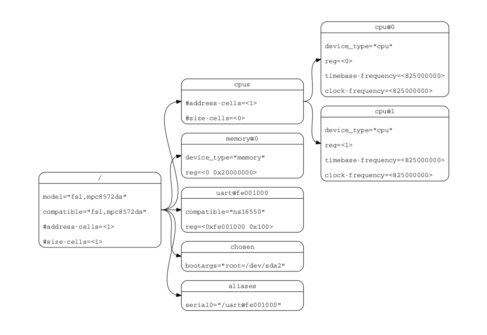
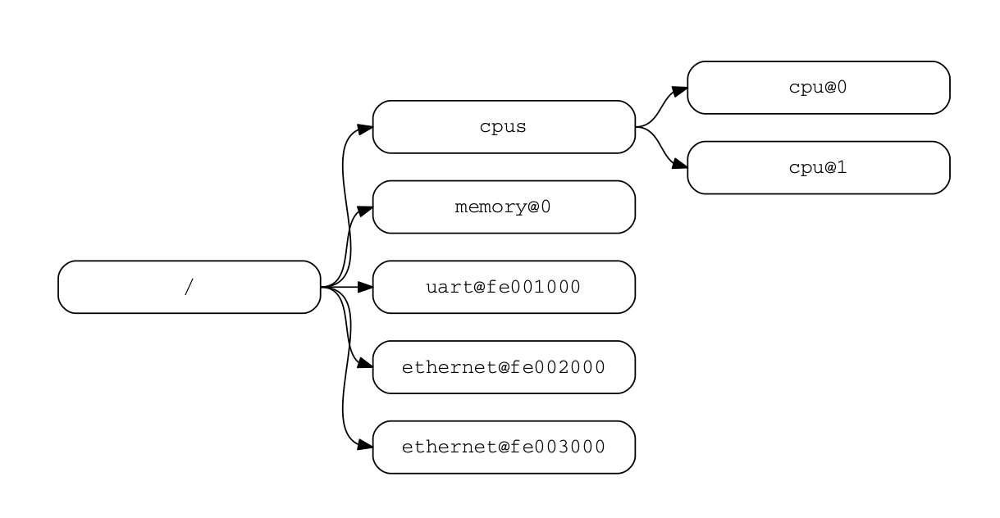

# 第 1 章 简介

## 1.1 目的及范围

各种软件组件相互作用，以初始化并启动引导计算机系统。固件可以在将控制权传给操作系统、bootloader 或 hypervisor 这样的软件之前，执行底层的系统硬件初始化。Bootloader 和 hypervisor 可以依次加载并将控制权传给操作系统。标准、一致的接口和约定促进这些软件组件之间的交互。在本文档中，术语 *引导程序* 通常用于指初始化系统状态并执行称为 *客户端程序* 的另一个软件组件的软件组件。引导程序的例子包括：固件，bootloader 和 hypervisor。客户端程序的例子包括：bootloaders，hypervisors，操作系统和特殊用途程序。一个软件既可以是客户端程序，也可以是引导程序(比如 hypervisor)。

这个规范，即设备树规范 (DTSpec)，提供了一个完整的引导程序到客户端程序的接口定义，并结合了促进各种系统开发的最低系统需求。

这个规范针对嵌入式系统的需求。嵌入式系统通常由系统硬件，操作系统和应用软件组成，这些应用软件是为执行一组固定的、特定的任务而定制设计的。这与通用计算机不同，通用计算机被设计为，为用户使用各种软件和 I/O 设备进行定制。嵌入式系统的其它特性可能包括：

 * 一组固定的 I/O 设备，可能是针对应用程序高度定制的
 * 针对大小和成本做系统板子的优化
 * 有限的用户接口
 * 资源约束，比如有限的内存和有限的非易失性存储
 * 实时性约束
 * 使用各种各样的操作系统，包括 Linux，实时操作系统，和定制的或专有的操作系统

#### 本文档的组织结构

 * 第 1 章介绍 DTSpec 描述的体系结构。
 * 第 2 章介绍设备树的概念，并描述它的逻辑结构和标准属性。
 * 第 3 章描述 DTSpec 兼容的设备树必需的基本设备节点集的定义。
 * 第 4 章描述了某些设备类别和特定设备类型的设备绑定。
 * 第 5 章描述设备树的 DTB 编码。
 * 第 6 章描述 DTS 源码语言。

#### 本文档中的约定

*应* (*shall*) 一词用来表示为符合标准而必须严格遵守的强制性要求，不允许有任何偏差 (*应* (*shall*) 等价于 *必须* (*required to*))。

*应该* (*should*) 一词用来表示在几种可能性中，某一个被推荐为特别合适的，而不提及或排除其它可能性；或者某一行为是首选的，但不一定是必须的；或 (否定的形式中) 某一行为是弃用的，但不是禁止的 (*应该* (*should*) 等价于 *建议* (*recommended that*))。

*可以* (*may*) 一词用来表示某一行为在标准的限制范围内是允许的 (*可以* (*may*) 等价于 *允许* (*permitted*))。

设备树语法表中展示了许多设备树构造的例子。有关该语法的概述，请参见第 6 节。

## 1.2 与 IEEE™ 1275 和 ePAPR 的关系

DTSpec 与 IEEE 1275 开放固件标准 — IEEE Standard for Boot (Initialization Configuration) Firmware: Core Requirements and Practices [[IEEE1275](http://global.ihs.com/)] 关系松散。

最初的 IEEE 1275 规范及其派生规范如 CHRP [[CHRP](http://playground.sun.com/1275/bindings/chrp/chrp1_8a.ps)] 和 PAPR [[PAPR](http://playground.sun.com/1275/bindings/devices/postscript/isa-pic-1_1d.ps)] 解决的是通用计算机的问题，比如单个版本的操作系统如何在同一系列的多个不同计算机上运行，和从用户安装的 I/O 设备上加载操作系统的问题。

由于嵌入式系统的特性，开放、通用的计算机面对的这些问题中的一些不适用于嵌入式系统。DTSpec 省略的值得注意的 IEEE 1275 规范的特性包括：

 * 插件设备驱动程序
 * FCode
 * 基于 Forth 的可编程的 Open Firmware 用户接口
 * FCode 调试
 * 操作系统调试

从 IEEE 1275 中保留下来的是来自设备树体系结构的概念，通过该体系结构，引导程序可以描述系统硬件信息并与客户端程序通信，从而消除了客户端程序对硬编码系统硬件描述的需要。

本规范部分取代了 ePAPR [[ePAPR](https://www.power.org/documentation/power-org-standard-for-embedded-power-architecture-platform-requirements-epapr-v1-1)] 规范。ePAPR 记录了 Power ISA 如何使用设备树，并涵盖了一般概念以及 Power ISA 特定的绑定。本文档的文本继承自 ePAPR，但是移除了特定于体系结构的绑定，或者将它们移到了附录中。

## 1.3 32 位和 64 位支持

DTSpec 支持具有 32 位和 64 位寻址能力的 CPU。在适用的情况下，DTSpec 的章节描述 32 位和 64 位寻址的任何要求或注意事项。

## 1.4 术语定义

**AMP** 非对称多处理。计算机可用的 CPU 被分成若干组，每个组运行一个不同的操作系统映像。CPU 可以相同，也可以不相同。

**引导 CPU** 引导程序导向客户端程序入口点的第一个CPU。

**Book III-E** 嵌入式环境。Power ISA 的一部分，定义了嵌入式 Power 处理器实现中使用的 supervisor 指令和相关设施。

**引导程序** 通常用于指初始化系统状态并执行称为客户端程序的另一个软件组件的软件组件。引导程序的例子包括：固件，bootloader 和 hypervisor。

**客户端程序** 通常包含应用程序或操作系统软件的程序。客户端程序的例子包括：bootloaders，hypervisors，操作系统和特殊用途程序。

**cell** 由 32 位组成的信息单位。

**DMA** 直接存储器（内存）存取。

**DTB** 设备树 blob。设备树的紧凑二进制表示。

**DTC** 设备树编译器。一个用于从 DTS 文件创建 DTB 文件的开源工具。

**DTS** 设备树语法。输入给 DTC 的设备树的文本表示。参考附录 A 设备树源码格式 (版本 1)。

**有效地址** 由处理器存储器访问或分支指令计算的内存地址。

**物理地址** 处理器用来访问外部设备 (通常是存储器控制器) 的地址。

**Power ISA** Power 指令集体系结构。

**中断说明符** 描述中断的属性值。通常包括指定中断号、灵敏度和触发机制的信息。

**从 CPU** 引导 CPU 之外的，属于客户端程序的 CPU 被认为是 *从 CPU*。

**SMP** 对称多处理。两个或多个相同的 CPU 可以共享存储器和 IO，并在单个操作系统下运行的计算机体系结构。

**SoC** 片上系统。单个计算机芯片集成一个或多个 CPU 核心和大量的其它外设。

**单元地址** 节点名中描述了在父节点的地址空间中节点的地址的部分。

**静默 CPU** 静默 CPU 处于无法与其它 CPU 的正常运行交互，也不会受其它运行中的 CPU 的正常运行
影响的状态，除非通过显式的方法来启用或重新启用静默 CPU。

# 第 2 章 设备树

## 2.1 概述

DTSpec 描述了一种称为 *设备树* 的用于描述系统硬件的结构。引导程序把设备树加载进客户端程序的存储器，并把指向设备树的指针传给客户端。

本章描述设备树的逻辑结构，并指定描述设备节点中使用的基本属性集。第 3 章指定符合 DTSpec 的设备树所需的某些设备节点。第 4 章描述 DTSpec 定义的设备绑定—— 表示特定设备类型或设备类别的要求。第 5 章描述设备树的内存编码。

设备树是一种树形数据结构，其节点描述系统中的设备。每个节点具有属性/值对，用于描述所表示的设备的特性。除根节点外，每个节点有且仅有一个父节点，根节点没有父节点。

符合 DTSpec 的设备树描述系统中，不需要由客户端程序动态检测的设备信息。比如，PCI 体系结构使客户端能够搜寻并探测连接的设备，这样设备树节点描述 PCI 设备可能不是必须的。然而，如果无法通过搜寻探测的话，描述系统中的 PCI 主机桥的设备节点是必须的。

##### 示例

图 2.1 展示了一个简单的设备树的示例表示，它几乎足够完整，可以引导一个简单的操作系统，其中描述了平台类型、CPU、存储器和一个 UART。展示的设备节点在每个节点内具有属性和值。



## 2.2 设备树结构和约定

### 2.1 节点名称
#### 节点名称要求

设备树中的每个节点都根据如下约定命名：

    `node-name@unit-address`

*node-name* 组件指定节点的名称。它应 (shall) 为 1 到 31 个字符长，并仅仅由表 2.1 中的字符集合的字符组成。

<center> 表 2.1：节点名的有效字符 </center>

| 字符 | 描述 |
|------|------|
| `0`-`9` | 数字 |
| `a`-`z` | 小写字母 |
| `A`-`Z` | 大写字母 |
| `,` | 逗号 |
| `.` | 句点号 |
| `_` | 下划线 |
| `+` | 加号 |
| `-` | 破折号 |

*node-name* 应 (shall) 以小写或大写字符开头，并应该 (should) 描述设备的一般类别。

名称的 *unit-address* 组件特定于节点所在的总线类型。它由来自于表 2.1 中的字符集合的一个或多个 ASCII 字符组成。*unit-address* 必须与节点的 *reg* 属性中指定的第一个地址匹配。如果节点没有 *reg* 属性，则必须省略 *@unit-address*，并且仅用 *node-name* 将节点与设备树中相同层级的其它节点区分开来。特定总线的绑定可以为 *reg* 和 *unit-address* 的格式指定额外的，更具体的要求。

根节点没有节点名或单元地址。它由正斜线 (/) 标识。



在图 2.2 中：

 * 名称为 `cpu` 的节点通过其单元地址值 0 和 1 来区分。
 * 名称为 `ethernet` 的节点通过其单元地址值 `fe002000` 和 `fe003000` 来区分。

### 2.2.2 通用名称推荐

节点的名称应该 (should) 是通用的，反映设备的功能，而不是其精确的编程模型。如果合适，名称应该 (should) 是下列选择之一：

 * adc
 * accelerometer
 * atm
 * audio-codec
 * audio-controller
 * backlight
 * bluetooth
 * bus
 * cache-controller
 * camera
 * can
 * charger
 * clock
 * clock-controller
 * compact-flash
 * cpu
 * cpus
 * crypto
 * disk
 * display
 * dma-controller
 * dsi
 * dsp
 * eeprom
 * efuse
 * endpoint
 * ethernet
 * ethernet-phy
 * fdc
 * flash
 * gnss
 * gpio
 * gpu
 * gyrometer
 * hdmi
 * hwlock
 * i2c
 * i2c-mux
 * ide
 * interrupt-controller
 * iommu
 * isa
 * keyboard
 * key
 * keys
 * lcd-controller
 * led
 * leds
 * led-controller
 * light-sensor
 * magnetometer
 * mailbox
 * mdio
 * memory
 * memory-controller
 * mmc
 * mmc-slot
 * mouse
 * nand-controller
 * nvram
 * oscillator
 * parallel
 * pc-card
 * pci
 * pcie
 * phy
 * pinctrl
 * pmic
 * pmu
 * port
 * ports
 * power-monitor
 * pwm
 * regulator
 * reset-controller
 * rng
 * rtc
 * sata
 * scsi
 * serial
 * sound
 * spi
 * sram-controller
 * ssi-controller
 * syscon
 * temperature-sensor
 * timer
 * touchscreen
 * tpm
 * usb
 * usb-hub
 * usb-phy
 * video-codec
 * vme
 * watchdog
 * wifi

### 路径名

设备树中的节点，可以通过指定从根节点通过所有后代节点，直到目标节点的完整路径来唯一标识。

指定设备路径的约定是：
  `/node-name-1/node-name-2/node-name-N`

比如，在图 2.2 中，cpu #1 的设备路径将是：
  `/cpus/cpu@1`

根节点的路径为 `/`。

如果到节点的完整路径是明确的，则可以省略单元地址。

如果客户端程序遇到一个不明确的路径，则其行为未定义。

### 属性

设备树中的每个节点都有属性，它们描述了节点的特性。属性由名称和值组成。

#### 属性名

属性名是来自于表 2.2 所示的字符集合的 1 到 31 个字符的字符串。

<center> 表 2.2：属性名的有效字符 </center>

| 字符 | 描述 |
|------|------|
| `0`-`9` | 数字 |
| `a`-`z` | 小写字母 |
| `A`-`Z` | 大写字母 |
| `,` | 逗号 |
| `.` | 句点号 |
| `_` | 下划线 |
| `+` | 加号 |
| `?` | 问号 |
| `#` | 井号 |
| `-` | 破折号 |

非标准属性名应该 (should) 指定一个唯一的字符串前缀，比如股票代码，标识定义属性的公司或组织的名称。例如：
```
        fsl,channel-fifo-len
        ibm,ppc-interrupt-server#s
        linux,network-index
```

#### 属性值

属性值是 0 个或多个字节的数组，它包含与属性关联的信息。

如果仅传递 true-false 信息，则属性可能有一个空值。在这种情况下，属性的存在或不存在具有足够的描述性。

表 2.3 描述了 DTSpec 定义的一组基本值类型。

<center> 表 2.3：属性值 </center>

| 值 | 描述 |
|------|------|
| `<empty>` | 值是空的。用于传递 true-false 信息，属性存在或不存在本身具有足够的描述性。 |
| `<u32>` | 大尾端格式的 32 位整数。例如：32 位值 0x11223344 将在内存中表示为：<br> `address` `      ` `11` <br> `address+1` `   ` `22` <br> `address+2`  `   ` `33` <br> `address+3`  `   ` `44` |
| `<u64>` | 大尾端格式表示的 64 位整数。由两个 `<u32>` 值组成，其中第一个值包含整数的最高有效位，第二个值包含最低有效位。<br> 例如：64 位值 0x1122334455667788 将表示为两个单元：<0x11223344 0x55667788>。<br> 这个值在内存中将表示为：<br> `address` `      ` `11` <br> `address+1` `   ` `22` <br> `address+2`  `   ` `33` <br> `address+3`  `   ` `44` <br> `address+4`  `   ` `55` <br> `address+5`  `   ` `66` <br> `address+6`  `   ` `77` <br> `address+7`  `   ` `88` |
| `<string>` | 可打印的且以 null 终止的字符串。例如：字符串 “hello” 将在内存中表示为：<br> `address` `      ` `68` `'h'` <br> `address+1` `   ` `65` `'e'` <br> `address+2`  `   ` `6C` `'l'` <br> `address+3`  `   ` `6C` `'l'` <br> `address+4`  `   ` `6F` `'o'` <br> `address+5`  `   ` `00` `'\0'` |
| `<prop-encoded-array>` | 格式是特定于属性的。参见属性的定义。 |
| `<phandle>` | 一个 `<u32>` 值。`phandle` 值是引用设备树中另一个节点的一种方式。可以被引用的任何节点定义一个具有唯一的 `<u32>` 值的 phandle 属性。该数字用于具有 phandle 值类型的属性的值。 |
| `<stringlist>` | `<string>` 值的列表连接在一起。<br> 例如：字符串列表 “hello”,”world” 将在内存中表示为：<br> `address` `      ` `68` `'h'` <br> `address+1` `   ` `65` `'e'` <br> `address+2`  `   ` `6C` `'l'` <br> `address+3`  `   ` `6C` `'l'` <br> `address+4`  `   ` `6F` `'o'` <br> `address+5`  `   ` `00` `'\0'` <br> `address+6` `      ` `77` `'w'` <br> `address+7` `   ` `6f` `'o'` <br> `address+8`  `   ` `72` `'r'` <br> `address+9`  `   ` `6C` `'l'` <br> `address+10`  `   ` `64` `'d'` <br> `address+11`  `   ` `00` `'\0'` |

## 2.3 标准属性

DTSpec 为设备节点指定了一组标准属性。本节将详细描述这些属性。DTSpec 定义的设备节点 (见第 3 章) 可以指定关于标准属性使用的额外要求或约束。第 4 章描述了特定设备的表示，也可以指定额外的要求。

----------------------
**注意：** 本文档中所有设备树节点的示例使用 DTS (Devicetree Source) 格式来指定节点和属性。

----------------------

### 2.3.1 compatible
属性名：`compatible`

值类型：`<stringlist>`

描述：
`compatible` 属性值由一个或多个字符串组成，它们为设备定义了特定的编程模型。该字符串列表应该 (should) 由客户端程序用于设备驱动程序选择。该属性值由以 null 结尾的字符串的连接列表组成，从最特定到最通用。它们允许设备表达其与一系列类似设备的兼容性，潜在地允许单个设备驱动程序与多个设备匹配。

建议的格式为 "`manufacturer,model`"，其中 `manufacturer` 是描述制造商名称的字符串 (比如股票代码)，而 `model` 指定了型号。

示例：
```
    compatible = "fsl,mpc8641", "ns16550";
```

在这个例子中，操作系统将首先尝试找到支持 fsl,mpc8641 的设备驱动程序。如果没找到，随后它将尝试找到支持更通用的 ns16550 设备类型的驱动程序。

### 2.3.2 model
属性名：`model`

值类型：`<string>`

描述：
`model` 属性值是一个字符串，它指定的了制造商的设备型号。

建议的格式为 "`manufacturer,model`"，其中 `manufacturer` 是描述制造商名称的字符串 (比如股票代码)，而 `model` 指定了型号。

示例：
```
    model = "fsl,MPC8349EMITX";
```

### 2.3.3 phandle
属性名：`phandle`

值类型：`<u32>`

描述：
*phandle* 属性为设备树中的节点指定了一个唯一的数字标识符。*phandle* 属性值由需要引用与属性关联的节点的其它节点使用。

示例：
请看如下的设备树片段：
```
pic@10000000 {
    phandle = <1>;
    interrupt-controller;
};
```

定义了 *phandle* 值 1。另一个设备节点可以通过 phandle 值 1 引用 pic 节点：
```
another-device-node {
    interrupt-parent = <1>;
};
```

----------------------
**注意：** 可能遇到包含这个属性废弃的称为 `linux,phandle` 的形式的更老版本设备树。为了兼容性，客户端程序可能在 `phandle` 属性不存在时，希望支持 `linux,phandle`。两个属性的含义和用法是一样的。

----------------------

----------------------
**注意：** DTS (参见附录 A) 格式的大多数设备树不包含显式的 phandle 属性。在 DTS 被编译为二进制的 DTB 格式时，DTC 工具自动插入 `phandle` 属性。

----------------------

### 2.3.4 status
属性名：`status`

值类型：`<string>`

描述：
`status` 属性表示设备的操作状态。表 2.4 列出并定义了有效值。

<center> 表 2.4：status 属性的值 </center>

| 值 | 描述 |
|------|------|
| "`okay`" | 表示设备正常运行。 |
| "`disabled`" | 表示设备目前不能运行，但将来可能会运行 (例如，某些东西没有插入或关闭)。<br> 有关 disabled 对给定设备的含义的详细信息，请参阅设备绑定。 |
| "`reserved`" | 表示设备可以运行，但不应该 (should) 使用。通常用于由另一个软件组件 (比如平台固件) 控制的设备。 |
| "`fail`" | 表示设备不能运行。在设备中检测到一个严重的错误，且如果不进行修理，它不太可能变得可以运行。 |
| "`fail-sss`" | 示设备不能运行。在设备中检测到一个严重的错误，且如果不进行修理，它不太可能变得可以运行。值的 sss 部分特定于设备，它表示检测到的错误条件。 |

### 2.3.5 #address-cells 和 #size-cells
属性名：`#address-cells`，`#size-cells`

值类型：`<u32>`

描述：
`#address-cells` 和 `#size-cells` 属性可以用于设备树层次结构中具有子结点的任何设备节点，它们描述了子设备节点应该 (should) 如何寻址。`#address-cells` 属性定义用于编码子节点的 `reg` 属性中地址字段的 `<u32>` 单元的个数。`#size-cells` 属性定义用于编码子节点的 `reg` 属性中大小字段的 `<u32>` 单元的个数。

`#address-cells` 和 `#size-cells` 属性不从设备树中的祖先节点继承。它们应 (shall) 显式定义。

符合 DTSpec 的引导程序应 (shall) 为所有具有子结点的节点提供 `#address-cells` 和 `#size-cells`。

如果缺失，客户端程序应该 (should) 假设 `#address-cells` 的默认值为 2，`#size-cells` 的默认值为 1。

示例：
请看如下的设备树片段：
```
soc {
    #address-cells = <1>;
    #size-cells = <1>;

    serial@4600 {
        compatible = "ns16550";
        reg = <0x4600 0x100>;
        clock-frequency = <0>;
        interrupts = <0xA 0x8>;
        interrupt-parent = <&ipic>;
    };
};
```

在这个例子中，`soc` 节点的 `#address-cells` 和 `#size-cells` 属性都设置为 1。这种设置指定对于这个节点的子节点，表示地址需要一个单元，表示大小需要一个单元。

串口设备的 `reg` 属性必须遵循父 (`soc`) 节点中设置的规范 —— 地址由一个单元表示 (0x4600)，大小由一个单元表示 (0x100)。

### 2.3.6 reg
属性名：`reg`

属性值：`<prop-encoded-array>` 编码为任意个数的 (`address`, `length`) 对。

描述：
`reg` 属性描述由设备的父总线定义的地址空间中设备资源的地址。最常见的是内存映射的 IO 寄存器块的偏移量和长度，但在某些总线类型上可以具有不同的含义。根节点定义的地址空间中的地址是 CPU 实际地址。

该值是一个 `<prop-encoded-array>`，由任意个数的地址和长度对 `<address length>` 组成。指定地址和长度所需的 `<u32>` 单元的个数是特定于总线的，并由设备节点的父节点中的 `#address-cells` 和 `#size-cells` 属性指定。如果父节点给 `#size-cells` 指定了 0 值，则 `reg` 值中的长度字段应 (shall) 省略。

示例：
假设 SoC 片上系统中的设备具有两个寄存器块，一个位于 SoC 的偏移量 0x3000 处的 32 字节的块，及一个位于偏移量 0xFE00 处的 256 字节的块。`reg` 属性将编码如下 (假设 `#address-cells` 和 `#size-cells` 的值为 1)：
```
        reg = <0x3000 0x20 0xFE00 0x100>;
```

### 2.3.7 virtual-reg
属性名：`virtual-reg`

值类型：`<u32>`

描述：
`virtual-reg` 属性指定了一个有效地址，将会映射到设备节点的 `reg` 属性中指定的第一个物理地址。该属性使引导程序能够向客户端程序提供已建立的虚拟到物理的映射。

### 2.3.8 ranges
属性名：`ranges`

值类型：`<empty>` 或 `<prop-encoded-array>` 编码为任意个数的 (child-bus-address, parent-bus-address, length) 三元组。

描述：
`ranges` 属性提供了一种方法来定义总线地址空间 (子地址空间) 和总线节点的父节点的地址空间 (父地址空间) 之间的映射或转换。

`ranges` 属性的值的格式是任意个数的 (child-bus-address, parent-
bus-address, length) 三元组

  * *child-bus-address* 是子总线地址空间中的物理地址。表示该地址所需的单元个数依赖于总线，且可由该节点 (*ranges* 属性出现的节点) 的 *#address-cells* 决定。

  * *parent-bus-address* 是父总线地址空间中的物理地址。表示父地址所需的单元个数依赖于总线，且可由定义父地址空间的节点的 *#address-cells* 属性决定。

  * *length* 指定了子地址空间中 range 的大小。表示该大小所需的单元个数可由该节点 (*ranges* 属性出现的节点) 的 *#size-cells* 决定。

如果该属性被定义为 `<empty>` 值，则它指定父和子地址空间是一致的，且无需作地址转换。

如果总线节点中没有出现该属性，则假设节点的子和父地址空间之间没有映射。

地址转换示例：
```
soc {
    compatible = "simple-bus";
    #address-cells = <1>;
    #size-cells = <1>;
    ranges = <0x0 0xe0000000 0x00100000>;
    serial@4600 {
        device_type = "serial";
        compatible = "ns16550";
        reg = <0x4600 0x100>;
        clock-frequency = <0>;
        interrupts = <0xA 0x8>;
        interrupt-parent = <&ipic>;
    };
};
```

`soc` 节点指定了一个 *ranges* 属性
```
    <0x0 0xe0000000 0x00100000>;
```

该属性值指定对于一个 1024 KB 范围的地址空间，物理地址为 0x0 的子节点映射到物理地址为 0xe0000000 的父地址空间地址。通过此映射，`serial` 设备节点可以通过对地址 0xe0004600 的加载或存储进行寻址，0x4600 的偏移量 (*reg* 中指定) 加上 *ranges* 中指定的映射。

### 2.3.9 dma-ranges
属性名：`dma-ranges`

值类型：`<empty>` 或 `<prop-encoded-array>` 编码为任意个数的 (`child-bus-address`, `parent-bus-address`, `length`) 三元组。

描述：
`dma-ranges` 属性用于描述内存映射的总线的直接存储器（内存）存取 (DMA) 结构，该总线的设备树父节点可以从源自总线的 DMA 操作访问。它提供了一种定义总线的物理地址空间和总线的父节点的物理地址空间之间的映射或转换的方法。

*dma-ranges* 属性的值的格式是任意个 (*child-bus-address*, *parent-bus-address*, *length*) 的三元组。指定的每个三元组描述一个连续的DMA地址范围。

  * *child-bus-address* 是子总线的地址空间内的物理地址。表示该地址的单元的个数依赖于总线，且可由该节点 (*dma-ranges* 属性出现的节点) 的 *#address-cells* 确定。

  * *parent-bus-address* 是父总线的地址空间内的物理地址。表示父总线地址的单元的个数依赖于总线，且可由定义了父总线的地址空间的节点的 *#address-cells* 属性确定。

  * *length* 指定了子总线的地址空间中的范围大小。表示该大小的单元的个数可由该节点 (*dma-ranges* 属性出现的节点) 的 *#size-cells* 确定。

### 2.3.10 name (已废弃)
属性名：`name`

值类型：`<string>`

描述：
*name* 属性是一个字符串，它指定了节点的名称。这个属性已废弃，不建议使用它。然而，它可能在更老的非 DTSpec 兼容的设备树中使用。操作系统应该基于节点名称的 *node-name* 组件确定一个节点的名称 (参见 2.2.1 节)。

### 2.3.11 device_type (已废弃)
属性名：`device_type`

值类型：`<string>`

描述：
IEEE 1275 使用 *device_type* 属性来描述设备的 FCode 变成模型。由于 DTSpec 没有 FCode，所以对于这个属性的新用法已经废弃，为了与 IEEE 1275 派生的设备树兼容，它应该只包含在 `cpu` 和 `memory` 节点中。


## 2.4 中断和中断映射
DTSpec 采用 *开放固件推荐实践：中断映射，版本0.9* [[b7](http://playground.sun.com/1275/bindings/usb/usb-1_0.ps)] 中指定的表示中断的中断树模型。在设备树中，存在一个逻辑中断树，来表示平台硬件中中断的层次结构和路由。虽然通常被称为中断树，但从技术上讲，它是一个有向无环图。


属性名：`virtual-reg`

值类型：`<u32>`

描述：

### 2.3.999 xcv
属性名：`virtual-reg`

值类型：`<u32>`

描述：


`
`
`
`
`
`
`
`
`
`
`
`
`
`
`
`
`
`
`
`
`


