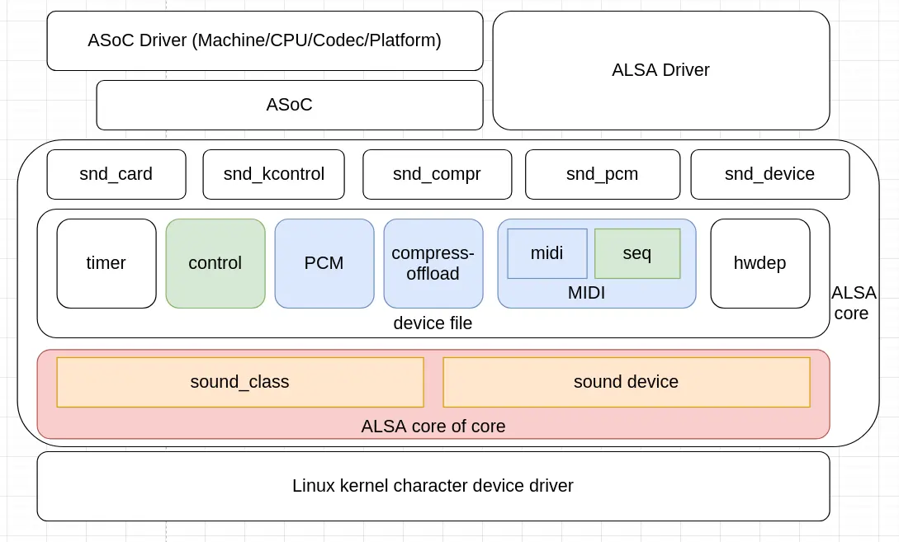

Linux 内核音频 ALSA 框架向用户空间导出多个有着不同作用的设备文件，用户空间应用程序通过这些设备文件，可以向音频设备传递音频数据播放音频文件，可以从音频设备获得采集到的音频数据，可以控制音频流程及音频小部件的开关，如音量、静音等。

Linux 内核音频 ALSA 框架向用户空间导出字符设备文件，具体来说这些设备文件主要有以下 7 种：

 - **pcm**：用于传递原始 PCM 音频数据，每个方向的音频流一个，单个 `SNDRV_DEV_PCM` 类型的设备通常有两个，一个用于播放，另一个用于录制，单个声卡可能有多个，具体的设备文件名如 **pcmC0D0c**、**pcmC0D0p** 和 **pcmC0D1c**；
 - **compr**：Compress-offload 音频设备文件，用于传递编码压缩的音频数据，导出 Audio DSP 的能力，每个方向的音频流一个，单个 `SNDRV_DEV_COMPRESS` 类型的设备一个，单个声卡可能有多个，具体的设备文件名如 **comprC0D2**；
 - **midi**：MIDI 音频设备文件，用于和 MIDI 设备传递 MIDI 数据，单个 `SNDRV_DEV_RAWMIDI` 类型的设备一个，单个声卡可能有多个，具体的设备文件名如 **midiC0D0**；
 - **seq**：通常与 MIDI 配合使用，Linux 内核音频 ALSA 框架导出唯一的一个，所有 `SNDRV_DEV_SEQUENCER` 类型的设备共享同一个，设备文件名为 **seq**；
 - **hwdep**：常用于加载 DSP，单个 `SNDRV_DEV_HWDEP` 类型的设备一个，单个声卡可能有多个，具体的设备文件名如 **hwC0D0**；
 - **control**：用于控制特定声卡上的音频处理，单个声卡一个，具有多个声卡的系统中可能有多个，具体的设备文件名如 **controlC0**；
 - **timer**：Linux 内核音频 ALSA 框架导出唯一的一个，所有 `SNDRV_DEV_TIMER` 类型的设备共享同一个，设备文件名为 **timer**。

这些音频设备文件中，**pcm**、**compr** 和 **midi** 用于传递不同格式的音频数据，其它音频设备文件提供各种辅助或控制功能。Linux 内核音频 ALSA 框架基于音频设备文件，建立 `snd_card` 和 `snd_card` 等抽象和 pcm、control 和 compress offload 等各个功能子系统。各个音频设备驱动程序可以基于 ALSA 核心的抽象和各个功能子系统建立。

为了方便嵌入式 SoC 设备中，音频设备驱动程序的开发，基于 ALSA 核心的抽象和各个功能子系统建立了 ASoC 框架。ASoC 框架建立了 component、dai 和 dai link 等新的抽象，以方便 PCM、compress offload 和声卡等音频设备驱动程序的开发。ASoC 设备驱动程序基于 ASoC 框架和 ALSA 核心创建。MIDI 设备极少用于嵌入式设备，因而 ASoC 框架也没有 MIDI 相关的接口。ASoC 设备驱动程序除了使用 ASoC 框架的接口外，还会使用 kcontrol 和内存分配等 ALSA 核心的接口。

Linux 内核音频 ALSA 框架整体结构如下图：



Linux 内核音频 ALSA 框架中，字符设备文件创建及次设备号管理相关的逻辑，可以认为是 ALSA 核心的核心。Linux 音频设备文件，在 `struct class` 的协助下，在向设备驱动核心添加设备时创建。所有 Linux 音频设备文件在创建之初共享相同的文件操作，这组文件操作的 `open` 操作在执行时，会根据文件的次设备号，将要打开的文件的文件操作替换为对应设备的文件操作。

## Linux 内核 ALSA 音频框架初始化

Linux 内核 ALSA 音频框架的初始化分为两部分，一是 sound class 的创建，二是字符设备驱动的注册。

sound class 的创建过程 (位于 `sound/sound_core.c`) 如下：
```
struct class *sound_class;
EXPORT_SYMBOL(sound_class);

MODULE_DESCRIPTION("Core sound module");
MODULE_AUTHOR("Alan Cox");
MODULE_LICENSE("GPL");

static char *sound_devnode(struct device *dev, umode_t *mode)
{
	if (MAJOR(dev->devt) == SOUND_MAJOR)
		return NULL;
	return kasprintf(GFP_KERNEL, "snd/%s", dev_name(dev));
}

static int __init init_soundcore(void)
{
	int rc;

	rc = init_oss_soundcore();
	if (rc)
		return rc;

	sound_class = class_create(THIS_MODULE, "sound");
	if (IS_ERR(sound_class)) {
		cleanup_oss_soundcore();
		return PTR_ERR(sound_class);
	}

	sound_class->devnode = sound_devnode;

	return 0;
}

static void __exit cleanup_soundcore(void)
{
	cleanup_oss_soundcore();
	class_destroy(sound_class);
}

subsys_initcall(init_soundcore);
module_exit(cleanup_soundcore);
```

sound class 主要作用是为音频设备文件的创建生成设备文件名。音频设备文件创建生成设备文件名的调用过程大概如下面的堆栈所示：
```
[   20.585396]  sound_devnode+0x18/0x5c
[   20.590400]  device_get_devnode+0x78/0xe4
[   20.595882]  devtmpfs_create_node+0x58/0xec
[   20.601563]  device_add+0x638/0x714
[   20.606416]  snd_register_device+0x128/0x190
[   20.612221]  snd_pcm_dev_register+0xdc/0x1b4
[   20.617997]  snd_device_register_all+0x4c/0x80
[   20.624056]  snd_card_register+0x4c/0x170
[   20.629585]  snd_soc_bind_card+0x8a8/0x924
[   20.635172]  snd_soc_register_card+0xf4/0x10c
[   20.641121]  devm_snd_soc_register_card+0x44/0xa0
```

音频字符设备驱动注册的过程 (位于 `sound/core/sound.c`) 如下：
```
static int major = CONFIG_SND_MAJOR;
int snd_major;
EXPORT_SYMBOL(snd_major);
 . . . . . .
static const struct file_operations snd_fops =
{
	.owner =	THIS_MODULE,
	.open =		snd_open,
	.llseek =	noop_llseek,
};
 . . . . . .
static int __init alsa_sound_init(void)
{
	snd_major = major;
	snd_ecards_limit = cards_limit;
	if (register_chrdev(major, "alsa", &snd_fops)) {
		pr_err("ALSA core: unable to register native major device number %d\n", major);
		return -EIO;
	}
	if (snd_info_init() < 0) {
		unregister_chrdev(major, "alsa");
		return -ENOMEM;
	}
#ifndef MODULE
	pr_info("Advanced Linux Sound Architecture Driver Initialized.\n");
#endif
	return 0;
}

static void __exit alsa_sound_exit(void)
{
	snd_info_done();
	unregister_chrdev(major, "alsa");
}

subsys_initcall(alsa_sound_init);
module_exit(alsa_sound_exit);
```

注册字符设备驱动时，还会在 `/proc` 文件系统中，创建音频设备相关项。音频设备文件的主设备号为 `CONFIG_SND_MAJOR` 116，它们的文件操作为 `snd_fops`。`snd_fops` 文件操作相当简陋，它只提供了 `open` 操作和实际什么也不做的 `llseek` 操作 `noop_llseek()`。

## 为声卡注册 ALSA 设备文件

在 Linux 内核 ALSA 音频框架中，声卡抽象表示应用程序可以直接使用的一个音频系统，它管理若干个功能不同，又相互有一定关联的音频设备 (这里的音频设备与音频设备文件不一定完全对应)。声卡各个具体音频设备文件的相关信息，由 `struct snd_minor` 对象维护，这个结构体定义 (位于 `include/sound/core.h`) 如下：
```
struct snd_minor {
	int type;			/* SNDRV_DEVICE_TYPE_XXX */
	int card;			/* card number */
	int device;			/* device number */
	const struct file_operations *f_ops;	/* file operations */
	void *private_data;		/* private data for f_ops->open */
	struct device *dev;		/* device for sysfs */
	struct snd_card *card_ptr;	/* assigned card instance */
};
```

`struct snd_minor` 对象包含的信息如下：

 - 设备类型，ALSA 字符设备文件管理部分定义的设备类型，会参与构造字符设备文件的次设备号，与 ALSA 核心的 `snd_device_type` 有关联，但不完全相同；
 - 所属的声卡的声卡号；
 - 设备号，与各个设备向声卡添加的顺序有关；
 - 与音频设备文件关联的文件操作；
 - 所属的声卡的声卡对象指针。

Linux 内核 ALSA 音频框架维护一个 `struct snd_minor` 对象指针的数组 `snd_minors`，数组中包含 **SNDRV_OS_MINORS** (256) 个元素，每个音频设备文件对应数组中的一个元素。`snd_minors` 用来保存已经注册的音频设备文件的相关信息。

Linux 内核 ALSA 音频框架的其它部分需要创建音频设备文件时，调用 `snd_register_device()` 函数为声卡注册设备，该函数定义 (位于 `sound/core/sound.c`) 如下：
```
/* this one holds the actual max. card number currently available.
 * as default, it's identical with cards_limit option.  when more
 * modules are loaded manually, this limit number increases, too.
 */
int snd_ecards_limit;
EXPORT_SYMBOL(snd_ecards_limit);

static struct snd_minor *snd_minors[SNDRV_OS_MINORS];
static DEFINE_MUTEX(sound_mutex);
 . . . . . .
#ifdef CONFIG_MODULES
static struct snd_minor *autoload_device(unsigned int minor)
{
	int dev;
	mutex_unlock(&sound_mutex); /* release lock temporarily */
	dev = SNDRV_MINOR_DEVICE(minor);
	if (dev == SNDRV_MINOR_CONTROL) {
		/* /dev/aloadC? */
		int card = SNDRV_MINOR_CARD(minor);
		struct snd_card *ref = snd_card_ref(card);
		if (!ref)
			snd_request_card(card);
		else
			snd_card_unref(ref);
	} else if (dev == SNDRV_MINOR_GLOBAL) {
		/* /dev/aloadSEQ */
		snd_request_other(minor);
	}
	mutex_lock(&sound_mutex); /* reacuire lock */
	return snd_minors[minor];
}
#else /* !CONFIG_MODULES */
#define autoload_device(minor)	NULL
#endif /* CONFIG_MODULES */
 . . . . . .
#ifdef CONFIG_SND_DYNAMIC_MINORS
static int snd_find_free_minor(int type, struct snd_card *card, int dev)
{
	int minor;

	/* static minors for module auto loading */
	if (type == SNDRV_DEVICE_TYPE_SEQUENCER)
		return SNDRV_MINOR_SEQUENCER;
	if (type == SNDRV_DEVICE_TYPE_TIMER)
		return SNDRV_MINOR_TIMER;

	for (minor = 0; minor < ARRAY_SIZE(snd_minors); ++minor) {
		/* skip static minors still used for module auto loading */
		if (SNDRV_MINOR_DEVICE(minor) == SNDRV_MINOR_CONTROL)
			continue;
		if (minor == SNDRV_MINOR_SEQUENCER ||
		    minor == SNDRV_MINOR_TIMER)
			continue;
		if (!snd_minors[minor])
			return minor;
	}
	return -EBUSY;
}
#else
static int snd_find_free_minor(int type, struct snd_card *card, int dev)
{
	int minor;

	switch (type) {
	case SNDRV_DEVICE_TYPE_SEQUENCER:
	case SNDRV_DEVICE_TYPE_TIMER:
		minor = type;
		break;
	case SNDRV_DEVICE_TYPE_CONTROL:
		if (snd_BUG_ON(!card))
			return -EINVAL;
		minor = SNDRV_MINOR(card->number, type);
		break;
	case SNDRV_DEVICE_TYPE_HWDEP:
	case SNDRV_DEVICE_TYPE_RAWMIDI:
	case SNDRV_DEVICE_TYPE_PCM_PLAYBACK:
	case SNDRV_DEVICE_TYPE_PCM_CAPTURE:
	case SNDRV_DEVICE_TYPE_COMPRESS:
		if (snd_BUG_ON(!card))
			return -EINVAL;
		minor = SNDRV_MINOR(card->number, type + dev);
		break;
	default:
		return -EINVAL;
	}
	if (snd_BUG_ON(minor < 0 || minor >= SNDRV_OS_MINORS))
		return -EINVAL;
	if (snd_minors[minor])
		return -EBUSY;
	return minor;
}
#endif

/**
 * snd_register_device - Register the ALSA device file for the card
 * @type: the device type, SNDRV_DEVICE_TYPE_XXX
 * @card: the card instance
 * @dev: the device index
 * @f_ops: the file operations
 * @private_data: user pointer for f_ops->open()
 * @device: the device to register
 *
 * Registers an ALSA device file for the given card.
 * The operators have to be set in reg parameter.
 *
 * Return: Zero if successful, or a negative error code on failure.
 */
int snd_register_device(int type, struct snd_card *card, int dev,
			const struct file_operations *f_ops,
			void *private_data, struct device *device)
{
	int minor;
	int err = 0;
	struct snd_minor *preg;

	if (snd_BUG_ON(!device))
		return -EINVAL;

	preg = kmalloc(sizeof *preg, GFP_KERNEL);
	if (preg == NULL)
		return -ENOMEM;
	preg->type = type;
	preg->card = card ? card->number : -1;
	preg->device = dev;
	preg->f_ops = f_ops;
	preg->private_data = private_data;
	preg->card_ptr = card;
	mutex_lock(&sound_mutex);
	minor = snd_find_free_minor(type, card, dev);
	if (minor < 0) {
		err = minor;
		goto error;
	}

	preg->dev = device;
	device->devt = MKDEV(major, minor);
	err = device_add(device);
	if (err < 0)
		goto error;

	snd_minors[minor] = preg;
 error:
	mutex_unlock(&sound_mutex);
	if (err < 0)
		kfree(preg);
	return err;
}
EXPORT_SYMBOL(snd_register_device);
```

`snd_register_device()` 函数的参数基本上与 `struct snd_minor` 对象的各个字段对应。这个函数的执行过程如下：

1. 分配 `struct snd_minor` 对象，并根据参数设置它的各个字段；
2. 为要注册的设备寻找可用的次设备号；
3. 构造包含主设备号和次设备号的设备号；
4. 向 Linux 内核的设备核心添加设备；
5. 将 `struct snd_minor` 对象指针保存在 `struct snd_minor` 对象指针数组中。

寻找可用的次设备号有两种策略，一是当 `SND_DYNAMIC_MINORS` 开关打开时，使用动态从设备号；二是当 `SND_DYNAMIC_MINORS` 开关关闭时，使用静态从设备号。

在动态从设备号分配策略中，**SNDRV_DEVICE_TYPE_SEQUENCER** 和 **SNDRV_DEVICE_TYPE_TIMER** 类型的设备使用固定的设备号 **SNDRV_MINOR_SEQUENCER**(1) 和 **SNDRV_MINOR_TIMER**(33)；Control 次设备号 **SNDRV_MINOR_CONTROL**(0) 保留；其它类型的设备 (包括 control 类型的设备) 在分配次设备号时，在 `snd_minors` 数组中顺序查找可用的次设备号。动态从设备号分配策略中，音频设备次设备号分配比较紧凑，音频设备次设备号空间的次设备号利用率较高。***怀疑这段代码有问题，SNDRV_DEVICE_TYPE_CONTROL 类型的设备没有分配到 control 类型的设备号。***

在静态从设备号分配策略中，**SNDRV_DEVICE_TYPE_SEQUENCER** 和 **SNDRV_DEVICE_TYPE_TIMER** 类型的设备依然使用固定的设备号 **SNDRV_MINOR_SEQUENCER**(1) 和 **SNDRV_MINOR_TIMER**(33)。但对于其它类型的音频设备，将音频设备次设备号空间按照声卡分成不同的子区域，每个子区域 32 个次设备号；在各个子区域中，根据设备类型进行划分，各个设备类型的设备占据相对固定的位置；在各个设备类型的小区域中，按照设备编号依次放置。为声卡的音频设备查找空闲的次设备号时，直接根据声卡编号，音频设备类型，和设备编号计算得出。

各个音频设备类型，及各个音频设备类型的次设备号定义 (位于 `include/sound/minors.h`) 如下：
```
/*
 *  MINOR numbers
 */

#define SNDRV_OS_MINORS			256

#define SNDRV_MINOR_DEVICES		32
#define SNDRV_MINOR_CARD(minor)		((minor) >> 5)
#define SNDRV_MINOR_DEVICE(minor)	((minor) & 0x001f)
#define SNDRV_MINOR(card, dev)		(((card) << 5) | (dev))

/* these minors can still be used for autoloading devices (/dev/aload*) */
#define SNDRV_MINOR_CONTROL		0	/* 0 */
#define SNDRV_MINOR_GLOBAL		1	/* 1 */
#define SNDRV_MINOR_SEQUENCER		1	/* SNDRV_MINOR_GLOBAL + 0 * 32 */
#define SNDRV_MINOR_TIMER		33	/* SNDRV_MINOR_GLOBAL + 1 * 32 */

#ifndef CONFIG_SND_DYNAMIC_MINORS
#define SNDRV_MINOR_COMPRESS		2	/* 2 - 3 */
#define SNDRV_MINOR_HWDEP		4	/* 4 - 7 */
#define SNDRV_MINOR_RAWMIDI		8	/* 8 - 15 */
#define SNDRV_MINOR_PCM_PLAYBACK	16	/* 16 - 23 */
#define SNDRV_MINOR_PCM_CAPTURE		24	/* 24 - 31 */

/* same as first respective minor number to make minor allocation easier */
#define SNDRV_DEVICE_TYPE_CONTROL	SNDRV_MINOR_CONTROL
#define SNDRV_DEVICE_TYPE_HWDEP		SNDRV_MINOR_HWDEP
#define SNDRV_DEVICE_TYPE_RAWMIDI	SNDRV_MINOR_RAWMIDI
#define SNDRV_DEVICE_TYPE_PCM_PLAYBACK	SNDRV_MINOR_PCM_PLAYBACK
#define SNDRV_DEVICE_TYPE_PCM_CAPTURE	SNDRV_MINOR_PCM_CAPTURE
#define SNDRV_DEVICE_TYPE_SEQUENCER	SNDRV_MINOR_SEQUENCER
#define SNDRV_DEVICE_TYPE_TIMER		SNDRV_MINOR_TIMER
#define SNDRV_DEVICE_TYPE_COMPRESS	SNDRV_MINOR_COMPRESS

#else /* CONFIG_SND_DYNAMIC_MINORS */

enum {
	SNDRV_DEVICE_TYPE_CONTROL,
	SNDRV_DEVICE_TYPE_SEQUENCER,
	SNDRV_DEVICE_TYPE_TIMER,
	SNDRV_DEVICE_TYPE_HWDEP,
	SNDRV_DEVICE_TYPE_RAWMIDI,
	SNDRV_DEVICE_TYPE_PCM_PLAYBACK,
	SNDRV_DEVICE_TYPE_PCM_CAPTURE,
	SNDRV_DEVICE_TYPE_COMPRESS,
};

#endif /* CONFIG_SND_DYNAMIC_MINORS */

#define SNDRV_MINOR_HWDEPS		4
#define SNDRV_MINOR_RAWMIDIS		8
#define SNDRV_MINOR_PCMS		8
```

`snd_register_device()` 函数调用 `device_add()` 函数向 Linux 内核的设备核心添加设备，这个函数定义 (位于 `drivers/base/core.c`) 如下：
```
int device_add(struct device *dev)
{
	struct device *parent;
	struct kobject *kobj;
	struct class_interface *class_intf;
	int error = -EINVAL;
	struct kobject *glue_dir = NULL;

	dev = get_device(dev);
	if (!dev)
		goto done;

	if (!dev->p) {
		error = device_private_init(dev);
		if (error)
			goto done;
	}

	/*
	 * for statically allocated devices, which should all be converted
	 * some day, we need to initialize the name. We prevent reading back
	 * the name, and force the use of dev_name()
	 */
	if (dev->init_name) {
		dev_set_name(dev, "%s", dev->init_name);
		dev->init_name = NULL;
	}

	/* subsystems can specify simple device enumeration */
	if (!dev_name(dev) && dev->bus && dev->bus->dev_name)
		dev_set_name(dev, "%s%u", dev->bus->dev_name, dev->id);

	if (!dev_name(dev)) {
		error = -EINVAL;
		goto name_error;
	}

	pr_debug("device: '%s': %s\n", dev_name(dev), __func__);

	parent = get_device(dev->parent);
	kobj = get_device_parent(dev, parent);
	if (IS_ERR(kobj)) {
		error = PTR_ERR(kobj);
		goto parent_error;
	}
	if (kobj)
		dev->kobj.parent = kobj;

	/* use parent numa_node */
	if (parent && (dev_to_node(dev) == NUMA_NO_NODE))
		set_dev_node(dev, dev_to_node(parent));

	/* first, register with generic layer. */
	/* we require the name to be set before, and pass NULL */
	error = kobject_add(&dev->kobj, dev->kobj.parent, NULL);
	if (error) {
		glue_dir = get_glue_dir(dev);
		goto Error;
	}

	/* notify platform of device entry */
	error = device_platform_notify(dev, KOBJ_ADD);
	if (error)
		goto platform_error;

	error = device_create_file(dev, &dev_attr_uevent);
	if (error)
		goto attrError;

	error = device_add_class_symlinks(dev);
	if (error)
		goto SymlinkError;
	error = device_add_attrs(dev);
	if (error)
		goto AttrsError;
	error = bus_add_device(dev);
	if (error)
		goto BusError;
	error = dpm_sysfs_add(dev);
	if (error)
		goto DPMError;
	device_pm_add(dev);

	if (MAJOR(dev->devt)) {
		error = device_create_file(dev, &dev_attr_dev);
		if (error)
			goto DevAttrError;

		error = device_create_sys_dev_entry(dev);
		if (error)
			goto SysEntryError;

		devtmpfs_create_node(dev);
	}

	/* Notify clients of device addition.  This call must come
	 * after dpm_sysfs_add() and before kobject_uevent().
	 */
	if (dev->bus)
		blocking_notifier_call_chain(&dev->bus->p->bus_notifier,
					     BUS_NOTIFY_ADD_DEVICE, dev);

	kobject_uevent(&dev->kobj, KOBJ_ADD);

	/*
	 * Check if any of the other devices (consumers) have been waiting for
	 * this device (supplier) to be added so that they can create a device
	 * link to it.
	 *
	 * This needs to happen after device_pm_add() because device_link_add()
	 * requires the supplier be registered before it's called.
	 *
	 * But this also needs to happen before bus_probe_device() to make sure
	 * waiting consumers can link to it before the driver is bound to the
	 * device and the driver sync_state callback is called for this device.
	 */
	if (dev->fwnode && !dev->fwnode->dev) {
		dev->fwnode->dev = dev;
		fw_devlink_link_device(dev);
	}

	bus_probe_device(dev);
	if (parent)
		klist_add_tail(&dev->p->knode_parent,
			       &parent->p->klist_children);

	if (dev->class) {
		mutex_lock(&dev->class->p->mutex);
		/* tie the class to the device */
		klist_add_tail(&dev->p->knode_class,
			       &dev->class->p->klist_devices);

		/* notify any interfaces that the device is here */
		list_for_each_entry(class_intf,
				    &dev->class->p->interfaces, node)
			if (class_intf->add_dev)
				class_intf->add_dev(dev, class_intf);
		mutex_unlock(&dev->class->p->mutex);
	}
done:
	put_device(dev);
	return error;
 SysEntryError:
	if (MAJOR(dev->devt))
		device_remove_file(dev, &dev_attr_dev);
 DevAttrError:
	device_pm_remove(dev);
	dpm_sysfs_remove(dev);
 DPMError:
	bus_remove_device(dev);
 BusError:
	device_remove_attrs(dev);
 AttrsError:
	device_remove_class_symlinks(dev);
 SymlinkError:
	device_remove_file(dev, &dev_attr_uevent);
 attrError:
	device_platform_notify(dev, KOBJ_REMOVE);
platform_error:
	kobject_uevent(&dev->kobj, KOBJ_REMOVE);
	glue_dir = get_glue_dir(dev);
	kobject_del(&dev->kobj);
 Error:
	cleanup_glue_dir(dev, glue_dir);
parent_error:
	put_device(parent);
name_error:
	kfree(dev->p);
	dev->p = NULL;
	goto done;
}
EXPORT_SYMBOL_GPL(device_add);
```

当添加的设备具有有效的设备号时，`device_add()` 函数调用 `device_create_file()`、`device_create_sys_dev_entry()` 和 `devtmpfs_create_node()` 等函数在 sysfs 和 devtmpfs 文件系统中创建包括音频字符设备文件在内的设备相关文件。

内核各模块通过 `devtmpfs_create_node()` 函数创建 devtmpfs 文件，这个函数定义 (位于 `drivers/base/devtmpfs.c`) 如下：
```
static int devtmpfs_submit_req(struct req *req, const char *tmp)
{
	init_completion(&req->done);

	spin_lock(&req_lock);
	req->next = requests;
	requests = req;
	spin_unlock(&req_lock);

	wake_up_process(thread);
	wait_for_completion(&req->done);

	kfree(tmp);

	return req->err;
}

int devtmpfs_create_node(struct device *dev)
{
	const char *tmp = NULL;
	struct req req;

	if (!thread)
		return 0;

	req.mode = 0;
	req.uid = GLOBAL_ROOT_UID;
	req.gid = GLOBAL_ROOT_GID;
	req.name = device_get_devnode(dev, &req.mode, &req.uid, &req.gid, &tmp);
	if (!req.name)
		return -ENOMEM;

	if (req.mode == 0)
		req.mode = 0600;
	if (is_blockdev(dev))
		req.mode |= S_IFBLK;
	else
		req.mode |= S_IFCHR;

	req.dev = dev;

	return devtmpfs_submit_req(&req, tmp);
}
```

这个函数通过 `device_get_devnode()` 函数获得 devtmpfs 设备文件的文件名，创建一个 devtmpfs 设备文件创建请求，并提交。在 `devtmpfs_submit_req()` 函数中，可以看到所有的请求由单链表维护，新的请求被放在单链表的头部。

`device_get_devnode()` 函数定义 (位于 `drivers/base/core.c`) 如下：
```
const char *device_get_devnode(struct device *dev,
			       umode_t *mode, kuid_t *uid, kgid_t *gid,
			       const char **tmp)
{
	char *s;

	*tmp = NULL;

	/* the device type may provide a specific name */
	if (dev->type && dev->type->devnode)
		*tmp = dev->type->devnode(dev, mode, uid, gid);
	if (*tmp)
		return *tmp;

	/* the class may provide a specific name */
	if (dev->class && dev->class->devnode)
		*tmp = dev->class->devnode(dev, mode);
	if (*tmp)
		return *tmp;

	/* return name without allocation, tmp == NULL */
	if (strchr(dev_name(dev), '!') == NULL)
		return dev_name(dev);

	/* replace '!' in the name with '/' */
	s = kstrdup(dev_name(dev), GFP_KERNEL);
	if (!s)
		return NULL;
	strreplace(s, '!', '/');
	return *tmp = s;
}
```

`device_get_devnode()` 函数按照一定的优先级，尝试从几个地方获得设备文件名：
1. 设备的设备类型 `struct device_type` 的 `devnode` 操作；
2. 设备的类别 `struct class` 的 `devnode` 操作；
3. 设备名字。

对于音频设备，设备的类别 `struct class` 的 `devnode` 操作，即我们在 `sound/sound_core.c` 文件中看到的 `sound_devnode()` 函数。

## 注销 ALSA 音频设备文件

当不再需要某个 ALSA 音频设备文件时，可以注销它，这通过 `snd_unregister_device()` 函数完成。`snd_unregister_device()` 函数定义 (位于 `sound/core/sound.c`) 如下：
```
int snd_unregister_device(struct device *dev)
{
	int minor;
	struct snd_minor *preg;

	mutex_lock(&sound_mutex);
	for (minor = 0; minor < ARRAY_SIZE(snd_minors); ++minor) {
		preg = snd_minors[minor];
		if (preg && preg->dev == dev) {
			snd_minors[minor] = NULL;
			device_del(dev);
			kfree(preg);
			break;
		}
	}
	mutex_unlock(&sound_mutex);
	if (minor >= ARRAY_SIZE(snd_minors))
		return -ENOENT;
	return 0;
}
EXPORT_SYMBOL(snd_unregister_device);
```

`snd_unregister_device()` 函数根据传入的设备，在 `snd_minors` 数组中，查找对应的 `struct snd_minor` 对象，找到时，从 `snd_minors` 数组中删除设备的 `struct snd_minor` 对象，这包括删除 devtmpfs 文件系统中的设备文件等，释放 `struct snd_minor` 对象等。

***在 `snd_register_device()` 函数中可以看到，是将计算获得的设备号赋值给了设备的，这里不能获取次设备号，并根据次设备号在 `snd_minors` 数组中快速查找对应的 `struct snd_minor` 对象么？***

## 音频设备文件的文件操作

Linux 内核 ALSA 音频框架注册音频字符设备驱动时，绑定了文件操作 `snd_fops`，所有的音频设备文件在创建之初，都绑定相同的文件操作 `snd_fops`。这个文件操作只定义了 `open` 和 `llseek` 两个操作，其中 `llseek` 操作 `noop_llseek()` 的定义 (位于 `fs/read_write.c`) 如下：
```
loff_t noop_llseek(struct file *file, loff_t offset, int whence)
{
	return file->f_pos;
}
EXPORT_SYMBOL(noop_llseek);
```

`noop_llseek()` 操作基本上什么也没做。

`open` 操作 `snd_open()` 定义 (位于 `sound/core/sound.c`) 如下：
```
static int snd_open(struct inode *inode, struct file *file)
{
	unsigned int minor = iminor(inode);
	struct snd_minor *mptr = NULL;
	const struct file_operations *new_fops;
	int err = 0;

	if (minor >= ARRAY_SIZE(snd_minors))
		return -ENODEV;
	mutex_lock(&sound_mutex);
	mptr = snd_minors[minor];
	if (mptr == NULL) {
		mptr = autoload_device(minor);
		if (!mptr) {
			mutex_unlock(&sound_mutex);
			return -ENODEV;
		}
	}
	new_fops = fops_get(mptr->f_ops);
	mutex_unlock(&sound_mutex);
	if (!new_fops)
		return -ENODEV;
	replace_fops(file, new_fops);

	if (file->f_op->open)
		err = file->f_op->open(inode, file);
	return err;
}
```

这个函数执行过程如下：

1. 从 `struct inode` 中获得音频设备文件的次设备号；
2. 根据次设备号，在 `snd_minors` 数组中，找到对应的 `struct snd_minor` 对象；
3. 从 `struct snd_minor` 对象获得它的文件操作，即注册 ALSA 音频设备文件时传入的文件操作；
4. 将 `struct file` 的文件操作替换为获得的文件操作；
5. 执行新的文件操作的 `open` 操作。

`snd_open()` 最主要的作用，即是将打开的音频设备文件的默认的文件操作，替换为其真正的文件操作。

Done.
