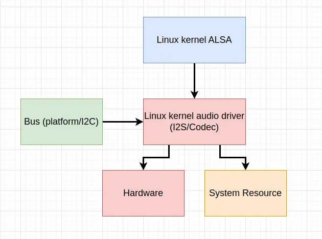
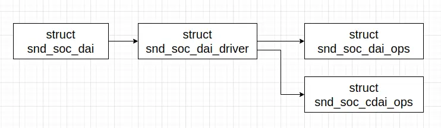
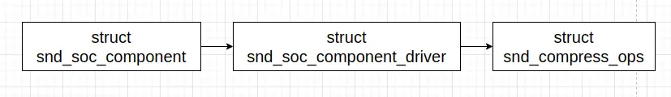

Linux 内核 ASoC 框架建立了新的抽象，并通过一些中间层，将这些抽象接入 ALSA 音频框架。

Linux 内核 ASoC 设备驱动的结构如下图：



Linux 内核 ASoC 设备驱动程序在 Linux 内核中扮演多个角色。

Linux 内核 ASoC 设备驱动程序在初始化阶段向内核注册某个总线类型的设备驱动程序，总线负责相应的设备发现。这里的总线不一定是真实的硬件总线，如 PCI 等，也可能是虚拟的，如 platform 等。总线在发现设备之后，会记录发现的设备，并尝试匹配注册的驱动程序。（如果总线探测设备在驱动程序注册之前完成，注册驱动程序时，会尝试匹配已经发现的设备。）设备和驱动程序匹配时，驱动程序的 `probe` 操作被执行。即 Linux 内核 ASoC 设备驱动程序是某个总线类型的设备驱动程序。

Linux 内核 ASoC 设备驱动程序需要实现 Linux 内核 ALSA ASoC 框架的某些抽象，并在其中扮演一定的角色，如 DAI 等。在设备驱动程序的 `probe` 操作执行时，它创建 ALSA ASoC 框架的抽象，并将相应的结构注册给 Linux 内核 ALSA ASoC 框架。

在设备驱动程序内部，它一方面管理属于它自己的硬件资源；另一方面，它的硬件设备要工作起来，通常离不开系统的其它资源，这包括内存、中断、时钟、内存映射的寄存器、DMA 通道和 GPIO 等。

## DAI

在系统中，播放或采集音频数据，可能涉及多个硬件设备，如 CPU/内存 通过 **I2S 总线** 和 **Audio Codec** 传递音频 PCM 数据；CPU/内存 通过 **I2C 总线** 和 **Audio Codec** 传递控制信息，如静音、音量等；**Audio Codec** 执行数字音频数据和模拟音频信号的转换等。在 ASoC 框架中，**I2S 总线** 和 **Audio Codec** 用一个 DAI 抽象来表示，与 DAI 抽象相关的结构主要有 `struct snd_soc_dai`、`struct snd_soc_dai_driver`、`struct snd_soc_cdai_ops` 和 `struct snd_soc_dai_ops`，这些结构定义 (位于 `include/sound/soc-dai.h`) 如下：

```
struct snd_soc_dai_ops {
	/*
	 * DAI clocking configuration, all optional.
	 * Called by soc_card drivers, normally in their hw_params.
	 */
	int (*set_sysclk)(struct snd_soc_dai *dai,
		int clk_id, unsigned int freq, int dir);
	int (*set_pll)(struct snd_soc_dai *dai, int pll_id, int source,
		unsigned int freq_in, unsigned int freq_out);
	int (*set_clkdiv)(struct snd_soc_dai *dai, int div_id, int div);
	int (*set_bclk_ratio)(struct snd_soc_dai *dai, unsigned int ratio);

	/*
	 * DAI format configuration
	 * Called by soc_card drivers, normally in their hw_params.
	 */
	int (*set_fmt)(struct snd_soc_dai *dai, unsigned int fmt);
	int (*xlate_tdm_slot_mask)(unsigned int slots,
		unsigned int *tx_mask, unsigned int *rx_mask);
	int (*set_tdm_slot)(struct snd_soc_dai *dai,
		unsigned int tx_mask, unsigned int rx_mask,
		int slots, int slot_width);
	int (*set_channel_map)(struct snd_soc_dai *dai,
		unsigned int tx_num, unsigned int *tx_slot,
		unsigned int rx_num, unsigned int *rx_slot);
	int (*get_channel_map)(struct snd_soc_dai *dai,
			unsigned int *tx_num, unsigned int *tx_slot,
			unsigned int *rx_num, unsigned int *rx_slot);
	int (*set_tristate)(struct snd_soc_dai *dai, int tristate);

	int (*set_sdw_stream)(struct snd_soc_dai *dai,
			void *stream, int direction);
	void *(*get_sdw_stream)(struct snd_soc_dai *dai, int direction);

	/*
	 * DAI digital mute - optional.
	 * Called by soc-core to minimise any pops.
	 */
	int (*mute_stream)(struct snd_soc_dai *dai, int mute, int stream);

	/*
	 * ALSA PCM audio operations - all optional.
	 * Called by soc-core during audio PCM operations.
	 */
	int (*startup)(struct snd_pcm_substream *,
		struct snd_soc_dai *);
	void (*shutdown)(struct snd_pcm_substream *,
		struct snd_soc_dai *);
	int (*hw_params)(struct snd_pcm_substream *,
		struct snd_pcm_hw_params *, struct snd_soc_dai *);
	int (*hw_free)(struct snd_pcm_substream *,
		struct snd_soc_dai *);
	int (*prepare)(struct snd_pcm_substream *,
		struct snd_soc_dai *);
	/*
	 * NOTE: Commands passed to the trigger function are not necessarily
	 * compatible with the current state of the dai. For example this
	 * sequence of commands is possible: START STOP STOP.
	 * So do not unconditionally use refcounting functions in the trigger
	 * function, e.g. clk_enable/disable.
	 */
	int (*trigger)(struct snd_pcm_substream *, int,
		struct snd_soc_dai *);
	int (*bespoke_trigger)(struct snd_pcm_substream *, int,
		struct snd_soc_dai *);
	/*
	 * For hardware based FIFO caused delay reporting.
	 * Optional.
	 */
	snd_pcm_sframes_t (*delay)(struct snd_pcm_substream *,
		struct snd_soc_dai *);

	/* bit field */
	unsigned int no_capture_mute:1;
};

struct snd_soc_cdai_ops {
	/*
	 * for compress ops
	 */
	int (*startup)(struct snd_compr_stream *,
			struct snd_soc_dai *);
	int (*shutdown)(struct snd_compr_stream *,
			struct snd_soc_dai *);
	int (*set_params)(struct snd_compr_stream *,
			struct snd_compr_params *, struct snd_soc_dai *);
	int (*get_params)(struct snd_compr_stream *,
			struct snd_codec *, struct snd_soc_dai *);
	int (*set_metadata)(struct snd_compr_stream *,
			struct snd_compr_metadata *, struct snd_soc_dai *);
	int (*get_metadata)(struct snd_compr_stream *,
			struct snd_compr_metadata *, struct snd_soc_dai *);
	int (*trigger)(struct snd_compr_stream *, int,
			struct snd_soc_dai *);
	int (*pointer)(struct snd_compr_stream *,
			struct snd_compr_tstamp *, struct snd_soc_dai *);
	int (*ack)(struct snd_compr_stream *, size_t,
			struct snd_soc_dai *);
};

/*
 * Digital Audio Interface Driver.
 *
 * Describes the Digital Audio Interface in terms of its ALSA, DAI and AC97
 * operations and capabilities. Codec and platform drivers will register this
 * structure for every DAI they have.
 *
 * This structure covers the clocking, formating and ALSA operations for each
 * interface.
 */
struct snd_soc_dai_driver {
	/* DAI description */
	const char *name;
	unsigned int id;
	unsigned int base;
	struct snd_soc_dobj dobj;

	/* DAI driver callbacks */
	int (*probe)(struct snd_soc_dai *dai);
	int (*remove)(struct snd_soc_dai *dai);
	/* compress dai */
	int (*compress_new)(struct snd_soc_pcm_runtime *rtd, int num);
	/* Optional Callback used at pcm creation*/
	int (*pcm_new)(struct snd_soc_pcm_runtime *rtd,
		       struct snd_soc_dai *dai);

	/* ops */
	const struct snd_soc_dai_ops *ops;
	const struct snd_soc_cdai_ops *cops;

	/* DAI capabilities */
	struct snd_soc_pcm_stream capture;
	struct snd_soc_pcm_stream playback;
	unsigned int symmetric_rates:1;
	unsigned int symmetric_channels:1;
	unsigned int symmetric_samplebits:1;

	/* probe ordering - for components with runtime dependencies */
	int probe_order;
	int remove_order;
};

/*
 * Digital Audio Interface runtime data.
 *
 * Holds runtime data for a DAI.
 */
struct snd_soc_dai {
	const char *name;
	int id;
	struct device *dev;

	/* driver ops */
	struct snd_soc_dai_driver *driver;

	/* DAI runtime info */
	unsigned int stream_active[SNDRV_PCM_STREAM_LAST + 1]; /* usage count */

	struct snd_soc_dapm_widget *playback_widget;
	struct snd_soc_dapm_widget *capture_widget;

	/* DAI DMA data */
	void *playback_dma_data;
	void *capture_dma_data;

	/* Symmetry data - only valid if symmetry is being enforced */
	unsigned int rate;
	unsigned int channels;
	unsigned int sample_bits;

	/* parent platform/codec */
	struct snd_soc_component *component;

	/* CODEC TDM slot masks and params (for fixup) */
	unsigned int tx_mask;
	unsigned int rx_mask;

	struct list_head list;

	/* function mark */
	struct snd_pcm_substream *mark_startup;

	/* bit field */
	unsigned int probed:1;
};
```
这些结构的关系如下：



这些结构中，`struct snd_soc_dai_driver` 和 `struct snd_soc_dai_ops` 通常由设备驱动程序创建，以静态或动态的方式完成创建。`struct snd_soc_dai` 结构对象由 ASoC 框架创建。设备驱动程序在通过 `devm_snd_soc_register_component()` 函数向 ASoC 框架注册 `struct snd_soc_dai_driver` 和 `struct snd_soc_component_driver` 的过程中，在 `snd_soc_register_dai()` 函数 (位于 `sound/soc/soc-core.c`) 中创建。如在 Realtek 的 ALC 5651 audio codec 驱动程序 `sound/soc/codecs/rt5651.c` 中那样。

## component

DAI 抽象通过 `component` 抽象挂进 Linux 内核 ASoC 框架，相关的结构主要有 `struct snd_soc_component`、`struct snd_soc_component_driver` 和 `struct snd_compress_ops`，这些结构定义 (位于 `include/sound/soc-component.h`) 如下：
```
/* component interface */
struct snd_compress_ops {
	int (*open)(struct snd_soc_component *component,
		    struct snd_compr_stream *stream);
	int (*free)(struct snd_soc_component *component,
		    struct snd_compr_stream *stream);
	int (*set_params)(struct snd_soc_component *component,
			  struct snd_compr_stream *stream,
			  struct snd_compr_params *params);
	int (*get_params)(struct snd_soc_component *component,
			  struct snd_compr_stream *stream,
			  struct snd_codec *params);
	int (*set_metadata)(struct snd_soc_component *component,
			    struct snd_compr_stream *stream,
			    struct snd_compr_metadata *metadata);
	int (*get_metadata)(struct snd_soc_component *component,
			    struct snd_compr_stream *stream,
			    struct snd_compr_metadata *metadata);
	int (*trigger)(struct snd_soc_component *component,
		       struct snd_compr_stream *stream, int cmd);
	int (*pointer)(struct snd_soc_component *component,
		       struct snd_compr_stream *stream,
		       struct snd_compr_tstamp *tstamp);
	int (*copy)(struct snd_soc_component *component,
		    struct snd_compr_stream *stream, char __user *buf,
		    size_t count);
	int (*mmap)(struct snd_soc_component *component,
		    struct snd_compr_stream *stream,
		    struct vm_area_struct *vma);
	int (*ack)(struct snd_soc_component *component,
		   struct snd_compr_stream *stream, size_t bytes);
	int (*get_caps)(struct snd_soc_component *component,
			struct snd_compr_stream *stream,
			struct snd_compr_caps *caps);
	int (*get_codec_caps)(struct snd_soc_component *component,
			      struct snd_compr_stream *stream,
			      struct snd_compr_codec_caps *codec);
};

struct snd_soc_component_driver {
	const char *name;

	/* Default control and setup, added after probe() is run */
	const struct snd_kcontrol_new *controls;
	unsigned int num_controls;
	const struct snd_soc_dapm_widget *dapm_widgets;
	unsigned int num_dapm_widgets;
	const struct snd_soc_dapm_route *dapm_routes;
	unsigned int num_dapm_routes;

	int (*probe)(struct snd_soc_component *component);
	void (*remove)(struct snd_soc_component *component);
	int (*suspend)(struct snd_soc_component *component);
	int (*resume)(struct snd_soc_component *component);

	unsigned int (*read)(struct snd_soc_component *component,
			     unsigned int reg);
	int (*write)(struct snd_soc_component *component,
		     unsigned int reg, unsigned int val);

	/* pcm creation and destruction */
	int (*pcm_construct)(struct snd_soc_component *component,
			     struct snd_soc_pcm_runtime *rtd);
	void (*pcm_destruct)(struct snd_soc_component *component,
			     struct snd_pcm *pcm);

	/* component wide operations */
	int (*set_sysclk)(struct snd_soc_component *component,
			  int clk_id, int source, unsigned int freq, int dir);
	int (*set_pll)(struct snd_soc_component *component, int pll_id,
		       int source, unsigned int freq_in, unsigned int freq_out);
	int (*set_jack)(struct snd_soc_component *component,
			struct snd_soc_jack *jack,  void *data);

	/* DT */
	int (*of_xlate_dai_name)(struct snd_soc_component *component,
				 struct of_phandle_args *args,
				 const char **dai_name);
	int (*of_xlate_dai_id)(struct snd_soc_component *comment,
			       struct device_node *endpoint);
	void (*seq_notifier)(struct snd_soc_component *component,
			     enum snd_soc_dapm_type type, int subseq);
	int (*stream_event)(struct snd_soc_component *component, int event);
	int (*set_bias_level)(struct snd_soc_component *component,
			      enum snd_soc_bias_level level);

	int (*open)(struct snd_soc_component *component,
		    struct snd_pcm_substream *substream);
	int (*close)(struct snd_soc_component *component,
		     struct snd_pcm_substream *substream);
	int (*ioctl)(struct snd_soc_component *component,
		     struct snd_pcm_substream *substream,
		     unsigned int cmd, void *arg);
	int (*hw_params)(struct snd_soc_component *component,
			 struct snd_pcm_substream *substream,
			 struct snd_pcm_hw_params *params);
	int (*hw_free)(struct snd_soc_component *component,
		       struct snd_pcm_substream *substream);
	int (*prepare)(struct snd_soc_component *component,
		       struct snd_pcm_substream *substream);
	int (*trigger)(struct snd_soc_component *component,
		       struct snd_pcm_substream *substream, int cmd);
	int (*sync_stop)(struct snd_soc_component *component,
			 struct snd_pcm_substream *substream);
	snd_pcm_uframes_t (*pointer)(struct snd_soc_component *component,
				     struct snd_pcm_substream *substream);
	int (*get_time_info)(struct snd_soc_component *component,
		struct snd_pcm_substream *substream, struct timespec64 *system_ts,
		struct timespec64 *audio_ts,
		struct snd_pcm_audio_tstamp_config *audio_tstamp_config,
		struct snd_pcm_audio_tstamp_report *audio_tstamp_report);
	int (*copy_user)(struct snd_soc_component *component,
			 struct snd_pcm_substream *substream, int channel,
			 unsigned long pos, void __user *buf,
			 unsigned long bytes);
	struct page *(*page)(struct snd_soc_component *component,
			     struct snd_pcm_substream *substream,
			     unsigned long offset);
	int (*mmap)(struct snd_soc_component *component,
		    struct snd_pcm_substream *substream,
		    struct vm_area_struct *vma);

	const struct snd_compress_ops *compress_ops;

	/* probe ordering - for components with runtime dependencies */
	int probe_order;
	int remove_order;

	/*
	 * signal if the module handling the component should not be removed
	 * if a pcm is open. Setting this would prevent the module
	 * refcount being incremented in probe() but allow it be incremented
	 * when a pcm is opened and decremented when it is closed.
	 */
	unsigned int module_get_upon_open:1;

	/* bits */
	unsigned int idle_bias_on:1;
	unsigned int suspend_bias_off:1;
	unsigned int use_pmdown_time:1; /* care pmdown_time at stop */
	unsigned int endianness:1;
	unsigned int non_legacy_dai_naming:1;

	/* this component uses topology and ignore machine driver FEs */
	const char *ignore_machine;
	const char *topology_name_prefix;
	int (*be_hw_params_fixup)(struct snd_soc_pcm_runtime *rtd,
				  struct snd_pcm_hw_params *params);
	bool use_dai_pcm_id;	/* use DAI link PCM ID as PCM device number */
	int be_pcm_base;	/* base device ID for all BE PCMs */
};

struct snd_soc_component {
	const char *name;
	int id;
	const char *name_prefix;
	struct device *dev;
	struct snd_soc_card *card;

	unsigned int active;

	unsigned int suspended:1; /* is in suspend PM state */

	struct list_head list;
	struct list_head card_aux_list; /* for auxiliary bound components */
	struct list_head card_list;

	const struct snd_soc_component_driver *driver;

	struct list_head dai_list;
	int num_dai;

	struct regmap *regmap;
	int val_bytes;

	struct mutex io_mutex;

	/* attached dynamic objects */
	struct list_head dobj_list;

	/*
	 * DO NOT use any of the fields below in drivers, they are temporary and
	 * are going to be removed again soon. If you use them in driver code
	 * the driver will be marked as BROKEN when these fields are removed.
	 */

	/* Don't use these, use snd_soc_component_get_dapm() */
	struct snd_soc_dapm_context dapm;

	/* machine specific init */
	int (*init)(struct snd_soc_component *component);

	/* function mark */
	struct snd_pcm_substream *mark_module;
	struct snd_pcm_substream *mark_open;
	void *mark_pm;

#ifdef CONFIG_DEBUG_FS
	struct dentry *debugfs_root;
	const char *debugfs_prefix;
#endif
};
```

这些结构的关系如下：



这些结构中，`struct snd_soc_component_driver` 常常和 `struct snd_soc_dai_driver` 结构一起由设备驱动程序创建，一起通过 `devm_snd_soc_register_component()` 函数注册进 ASoC 框架。`struct snd_compress_ops` 结构通常由支持 offload 模式的设备驱动程序创建。

与 `struct snd_soc_dai` 结构类似，`struct snd_soc_component` 结构对象由 ASoC 框架创建。在函数 `devm_snd_soc_register_component()` 的执行过程中，在 `snd_soc_register_component()` 函数 (位于 `sound/soc/soc-core.c`) 中创建。

CPU DAI，如 I2S，和 CODEC DAI，如 ALC 5651 audio codec 等设备的驱动程序，创建并注册 `struct snd_soc_component_driver` 和 `struct snd_soc_dai_driver` 结构对象。Realtek ALC 5651 audio codec 设备的驱动程序 (位于 `sound/soc/codecs/rt5651.c`) 有如下代码片段：
```
static const struct snd_soc_dai_ops rt5651_aif_dai_ops = {
	.hw_params = rt5651_hw_params,
	.set_fmt = rt5651_set_dai_fmt,
	.set_sysclk = rt5651_set_dai_sysclk,
	.set_pll = rt5651_set_dai_pll,
};

static struct snd_soc_dai_driver rt5651_dai[] = {
	{
		.name = "rt5651-aif1",
		.id = RT5651_AIF1,
		.playback = {
			.stream_name = "AIF1 Playback",
			.channels_min = 1,
			.channels_max = 2,
			.rates = RT5651_STEREO_RATES,
			.formats = RT5651_FORMATS,
		},
		.capture = {
			.stream_name = "AIF1 Capture",
			.channels_min = 1,
			.channels_max = 2,
			.rates = RT5651_STEREO_RATES,
			.formats = RT5651_FORMATS,
		},
		.ops = &rt5651_aif_dai_ops,
	},
	{
		.name = "rt5651-aif2",
		.id = RT5651_AIF2,
		.playback = {
			.stream_name = "AIF2 Playback",
			.channels_min = 1,
			.channels_max = 2,
			.rates = RT5651_STEREO_RATES,
			.formats = RT5651_FORMATS,
		},
		.capture = {
			.stream_name = "AIF2 Capture",
			.channels_min = 1,
			.channels_max = 2,
			.rates = RT5651_STEREO_RATES,
			.formats = RT5651_FORMATS,
		},
		.ops = &rt5651_aif_dai_ops,
	},
};

static const struct snd_soc_component_driver soc_component_dev_rt5651 = {
	.probe			= rt5651_probe,
	.suspend		= rt5651_suspend,
	.resume			= rt5651_resume,
	.set_bias_level		= rt5651_set_bias_level,
	.set_jack		= rt5651_set_jack,
	.controls		= rt5651_snd_controls,
	.num_controls		= ARRAY_SIZE(rt5651_snd_controls),
	.dapm_widgets		= rt5651_dapm_widgets,
	.num_dapm_widgets	= ARRAY_SIZE(rt5651_dapm_widgets),
	.dapm_routes		= rt5651_dapm_routes,
	.num_dapm_routes	= ARRAY_SIZE(rt5651_dapm_routes),
	.use_pmdown_time	= 1,
	.endianness		= 1,
	.non_legacy_dai_naming	= 1,
};
 . . . . . .
static int rt5651_i2c_probe(struct i2c_client *i2c,
		    const struct i2c_device_id *id)
{
 . . . . . .
	ret = devm_snd_soc_register_component(&i2c->dev,
				&soc_component_dev_rt5651,
				rt5651_dai, ARRAY_SIZE(rt5651_dai));

	return ret;
}
```

`devm_snd_soc_register_component()` 函数定义 (位于 `sound/soc/soc-devres.c`) 如下：
```
static void devm_component_release(struct device *dev, void *res)
{
	const struct snd_soc_component_driver **cmpnt_drv = res;

	snd_soc_unregister_component_by_driver(dev, *cmpnt_drv);
}

/**
 * devm_snd_soc_register_component - resource managed component registration
 * @dev: Device used to manage component
 * @cmpnt_drv: Component driver
 * @dai_drv: DAI driver
 * @num_dai: Number of DAIs to register
 *
 * Register a component with automatic unregistration when the device is
 * unregistered.
 */
int devm_snd_soc_register_component(struct device *dev,
			 const struct snd_soc_component_driver *cmpnt_drv,
			 struct snd_soc_dai_driver *dai_drv, int num_dai)
{
	const struct snd_soc_component_driver **ptr;
	int ret;

	ptr = devres_alloc(devm_component_release, sizeof(*ptr), GFP_KERNEL);
	if (!ptr)
		return -ENOMEM;

	ret = snd_soc_register_component(dev, cmpnt_drv, dai_drv, num_dai);
	if (ret == 0) {
		*ptr = cmpnt_drv;
		devres_add(dev, ptr);
	} else {
		devres_free(ptr);
	}

	return ret;
}
EXPORT_SYMBOL_GPL(devm_snd_soc_register_component);
```

`devm_snd_soc_register_component()` 函数是 `snd_soc_register_component()` 函数的包装，它应用了 `devres` 机制，使得 `snd_soc_component_driver` 可以在设备注销的时候，自动地被注销。具体地说，它分配并给 `struct device` 添加了一个 `struct devres` 对象，`struct devres` 对象的 data 字段保存了 `struct snd_soc_component_driver` 结构对象的指针，当 `struct device` 注销时，其所有 `struct devres` 对象随着一起注销。

`snd_soc_register_component()` 函数定义 (位于 `sound/soc/soc-core.c`) 如下：
```
void snd_soc_unregister_dai(struct snd_soc_dai *dai)
{
	dev_dbg(dai->dev, "ASoC: Unregistered DAI '%s'\n", dai->name);
	list_del(&dai->list);
}
EXPORT_SYMBOL_GPL(snd_soc_unregister_dai);

/**
 * snd_soc_register_dai - Register a DAI dynamically & create its widgets
 *
 * @component: The component the DAIs are registered for
 * @dai_drv: DAI driver to use for the DAI
 * @legacy_dai_naming: if %true, use legacy single-name format;
 * 	if %false, use multiple-name format;
 *
 * Topology can use this API to register DAIs when probing a component.
 * These DAIs's widgets will be freed in the card cleanup and the DAIs
 * will be freed in the component cleanup.
 */
struct snd_soc_dai *snd_soc_register_dai(struct snd_soc_component *component,
					 struct snd_soc_dai_driver *dai_drv,
					 bool legacy_dai_naming)
{
	struct device *dev = component->dev;
	struct snd_soc_dai *dai;

	dev_dbg(dev, "ASoC: dynamically register DAI %s\n", dev_name(dev));

	lockdep_assert_held(&client_mutex);

	dai = devm_kzalloc(dev, sizeof(*dai), GFP_KERNEL);
	if (dai == NULL)
		return NULL;

	/*
	 * Back in the old days when we still had component-less DAIs,
	 * instead of having a static name, component-less DAIs would
	 * inherit the name of the parent device so it is possible to
	 * register multiple instances of the DAI. We still need to keep
	 * the same naming style even though those DAIs are not
	 * component-less anymore.
	 */
	if (legacy_dai_naming &&
	    (dai_drv->id == 0 || dai_drv->name == NULL)) {
		dai->name = fmt_single_name(dev, &dai->id);
	} else {
		dai->name = fmt_multiple_name(dev, dai_drv);
		if (dai_drv->id)
			dai->id = dai_drv->id;
		else
			dai->id = component->num_dai;
	}
	if (!dai->name)
		return NULL;

	dai->component = component;
	dai->dev = dev;
	dai->driver = dai_drv;

	/* see for_each_component_dais */
	list_add_tail(&dai->list, &component->dai_list);
	component->num_dai++;

	dev_dbg(dev, "ASoC: Registered DAI '%s'\n", dai->name);
	return dai;
}

/**
 * snd_soc_unregister_dais - Unregister DAIs from the ASoC core
 *
 * @component: The component for which the DAIs should be unregistered
 */
static void snd_soc_unregister_dais(struct snd_soc_component *component)
{
	struct snd_soc_dai *dai, *_dai;

	for_each_component_dais_safe(component, dai, _dai)
		snd_soc_unregister_dai(dai);
}

/**
 * snd_soc_register_dais - Register a DAI with the ASoC core
 *
 * @component: The component the DAIs are registered for
 * @dai_drv: DAI driver to use for the DAIs
 * @count: Number of DAIs
 */
static int snd_soc_register_dais(struct snd_soc_component *component,
				 struct snd_soc_dai_driver *dai_drv,
				 size_t count)
{
	struct snd_soc_dai *dai;
	unsigned int i;
	int ret;

	for (i = 0; i < count; i++) {
		dai = snd_soc_register_dai(component, dai_drv + i, count == 1 &&
				  !component->driver->non_legacy_dai_naming);
		if (dai == NULL) {
			ret = -ENOMEM;
			goto err;
		}
	}

	return 0;

err:
	snd_soc_unregister_dais(component);

	return ret;
}
 . . . . . .
int snd_soc_component_initialize(struct snd_soc_component *component,
				 const struct snd_soc_component_driver *driver,
				 struct device *dev)
{
	INIT_LIST_HEAD(&component->dai_list);
	INIT_LIST_HEAD(&component->dobj_list);
	INIT_LIST_HEAD(&component->card_list);
	INIT_LIST_HEAD(&component->list);
	mutex_init(&component->io_mutex);

	component->name = fmt_single_name(dev, &component->id);
	if (!component->name) {
		dev_err(dev, "ASoC: Failed to allocate name\n");
		return -ENOMEM;
	}

	component->dev		= dev;
	component->driver	= driver;

	return 0;
}
EXPORT_SYMBOL_GPL(snd_soc_component_initialize);

int snd_soc_add_component(struct snd_soc_component *component,
			  struct snd_soc_dai_driver *dai_drv,
			  int num_dai)
{
	int ret;
	int i;

	mutex_lock(&client_mutex);

	if (component->driver->endianness) {
		for (i = 0; i < num_dai; i++) {
			convert_endianness_formats(&dai_drv[i].playback);
			convert_endianness_formats(&dai_drv[i].capture);
		}
	}

	ret = snd_soc_register_dais(component, dai_drv, num_dai);
	if (ret < 0) {
		dev_err(component->dev, "ASoC: Failed to register DAIs: %d\n",
			ret);
		goto err_cleanup;
	}

	if (!component->driver->write && !component->driver->read) {
		if (!component->regmap)
			component->regmap = dev_get_regmap(component->dev,
							   NULL);
		if (component->regmap)
			snd_soc_component_setup_regmap(component);
	}

	/* see for_each_component */
	list_add(&component->list, &component_list);

err_cleanup:
	if (ret < 0)
		snd_soc_del_component_unlocked(component);

	mutex_unlock(&client_mutex);

	if (ret == 0)
		snd_soc_try_rebind_card();

	return ret;
}
EXPORT_SYMBOL_GPL(snd_soc_add_component);

int snd_soc_register_component(struct device *dev,
			const struct snd_soc_component_driver *component_driver,
			struct snd_soc_dai_driver *dai_drv,
			int num_dai)
{
	struct snd_soc_component *component;
	int ret;

	component = devm_kzalloc(dev, sizeof(*component), GFP_KERNEL);
	if (!component)
		return -ENOMEM;

	ret = snd_soc_component_initialize(component, component_driver, dev);
	if (ret < 0)
		return ret;

	return snd_soc_add_component(component, dai_drv, num_dai);
}
EXPORT_SYMBOL_GPL(snd_soc_register_component);
```

在 `snd_soc_register_component()` 函数中，是清晰的三个步骤：

1. 分配 `struct snd_soc_component` 结构对象；
2. 初始化 `struct snd_soc_component` 结构对象，会将 `struct snd_soc_component` 结构对象和传入的 `struct snd_soc_component_driver` 结构对象绑定在一起；
3. 添加 `struct snd_soc_component` 结构对象。这个操作会完成如下工作：
    - 为每个 `struct snd_soc_dai_driver` 结构对象分配 `struct snd_soc_dai` 结构对象，并把它们绑定在一起；
    - 将 `struct snd_soc_dai` 结构对象放进 `struct snd_soc_component` 结构对象的链表中；
    - 初始化 `struct snd_soc_component` 结构对象的寄存器内存映射；
    - 将 `struct snd_soc_component` 结构对象添加进一个全局的链表中。

## snd_soc_card 和 snd_soc_dai_link

在 Linux 内核的 ASoC 文档中，有提到 ASoC 框架基本上将嵌入式音频系统分为多种可重用的组件驱动程序，主要包括 codec 类驱动程序，平台类驱动程序，如 DMA 引擎、DAI (I2S、AC97 和 PCM) 和 DSP 等，和机器类驱动程序。实际上在 Linux-5.10 版本中，机器类驱动程序之外的各类驱动程序，包括 I2S 驱动、Codec 驱动和平台驱动等都由 DAI 和 component 抽象描述，只是它们被称为 CPU DAI，Codec DAI 和 platform DAI。

机器类驱动程序作为胶水，将其它组件驱动程序绑在一起，形成一个 ALSA “声卡设备”。具体到实现，机器类驱动程序主要由 `snd_soc_card` 和 `snd_soc_dai_link` 抽象表示，相关的这两个结构定义 (位于 `include/sound/soc-component.h`) 如下：
```
struct snd_soc_dai_link_component {
	const char *name;
	struct device_node *of_node;
	const char *dai_name;
};

struct snd_soc_dai_link {
	/* config - must be set by machine driver */
	const char *name;			/* Codec name */
	const char *stream_name;		/* Stream name */

	/*
	 * You MAY specify the link's CPU-side device, either by device name,
	 * or by DT/OF node, but not both. If this information is omitted,
	 * the CPU-side DAI is matched using .cpu_dai_name only, which hence
	 * must be globally unique. These fields are currently typically used
	 * only for codec to codec links, or systems using device tree.
	 */
	/*
	 * You MAY specify the DAI name of the CPU DAI. If this information is
	 * omitted, the CPU-side DAI is matched using .cpu_name/.cpu_of_node
	 * only, which only works well when that device exposes a single DAI.
	 */
	struct snd_soc_dai_link_component *cpus;
	unsigned int num_cpus;

	/*
	 * You MUST specify the link's codec, either by device name, or by
	 * DT/OF node, but not both.
	 */
	/* You MUST specify the DAI name within the codec */
	struct snd_soc_dai_link_component *codecs;
	unsigned int num_codecs;

	/*
	 * You MAY specify the link's platform/PCM/DMA driver, either by
	 * device name, or by DT/OF node, but not both. Some forms of link
	 * do not need a platform. In such case, platforms are not mandatory.
	 */
	struct snd_soc_dai_link_component *platforms;
	unsigned int num_platforms;

	int id;	/* optional ID for machine driver link identification */

	const struct snd_soc_pcm_stream *params;
	unsigned int num_params;

	unsigned int dai_fmt;           /* format to set on init */

	enum snd_soc_dpcm_trigger trigger[2]; /* trigger type for DPCM */

	/* codec/machine specific init - e.g. add machine controls */
	int (*init)(struct snd_soc_pcm_runtime *rtd);

	/* codec/machine specific exit - dual of init() */
	void (*exit)(struct snd_soc_pcm_runtime *rtd);

	/* optional hw_params re-writing for BE and FE sync */
	int (*be_hw_params_fixup)(struct snd_soc_pcm_runtime *rtd,
			struct snd_pcm_hw_params *params);

	/* machine stream operations */
	const struct snd_soc_ops *ops;
	const struct snd_soc_compr_ops *compr_ops;

	/* Mark this pcm with non atomic ops */
	unsigned int nonatomic:1;

	/* For unidirectional dai links */
	unsigned int playback_only:1;
	unsigned int capture_only:1;

	/* Keep DAI active over suspend */
	unsigned int ignore_suspend:1;

	/* Symmetry requirements */
	unsigned int symmetric_rates:1;
	unsigned int symmetric_channels:1;
	unsigned int symmetric_samplebits:1;

	/* Do not create a PCM for this DAI link (Backend link) */
	unsigned int no_pcm:1;

	/* This DAI link can route to other DAI links at runtime (Frontend)*/
	unsigned int dynamic:1;

	/* DPCM capture and Playback support */
	unsigned int dpcm_capture:1;
	unsigned int dpcm_playback:1;

	/* DPCM used FE & BE merged format */
	unsigned int dpcm_merged_format:1;
	/* DPCM used FE & BE merged channel */
	unsigned int dpcm_merged_chan:1;
	/* DPCM used FE & BE merged rate */
	unsigned int dpcm_merged_rate:1;

	/* pmdown_time is ignored at stop */
	unsigned int ignore_pmdown_time:1;

	/* Do not create a PCM for this DAI link (Backend link) */
	unsigned int ignore:1;

#ifdef CONFIG_SND_SOC_TOPOLOGY
	struct snd_soc_dobj dobj; /* For topology */
#endif
};
 . . . . . .
struct snd_soc_codec_conf {
	/*
	 * specify device either by device name, or by
	 * DT/OF node, but not both.
	 */
	struct snd_soc_dai_link_component dlc;

	/*
	 * optional map of kcontrol, widget and path name prefixes that are
	 * associated per device
	 */
	const char *name_prefix;
};

struct snd_soc_aux_dev {
	/*
	 * specify multi-codec either by device name, or by
	 * DT/OF node, but not both.
	 */
	struct snd_soc_dai_link_component dlc;

	/* codec/machine specific init - e.g. add machine controls */
	int (*init)(struct snd_soc_component *component);
};

/* SoC card */
struct snd_soc_card {
	const char *name;
	const char *long_name;
	const char *driver_name;
	const char *components;
#ifdef CONFIG_DMI
	char dmi_longname[80];
#endif /* CONFIG_DMI */
	char topology_shortname[32];

	struct device *dev;
	struct snd_card *snd_card;
	struct module *owner;

	struct mutex mutex;
	struct mutex dapm_mutex;

	/* Mutex for PCM operations */
	struct mutex pcm_mutex;
	enum snd_soc_pcm_subclass pcm_subclass;

	spinlock_t dpcm_lock;

	int (*probe)(struct snd_soc_card *card);
	int (*late_probe)(struct snd_soc_card *card);
	int (*remove)(struct snd_soc_card *card);

	/* the pre and post PM functions are used to do any PM work before and
	 * after the codec and DAI's do any PM work. */
	int (*suspend_pre)(struct snd_soc_card *card);
	int (*suspend_post)(struct snd_soc_card *card);
	int (*resume_pre)(struct snd_soc_card *card);
	int (*resume_post)(struct snd_soc_card *card);

	/* callbacks */
	int (*set_bias_level)(struct snd_soc_card *,
			      struct snd_soc_dapm_context *dapm,
			      enum snd_soc_bias_level level);
	int (*set_bias_level_post)(struct snd_soc_card *,
				   struct snd_soc_dapm_context *dapm,
				   enum snd_soc_bias_level level);

	int (*add_dai_link)(struct snd_soc_card *,
			    struct snd_soc_dai_link *link);
	void (*remove_dai_link)(struct snd_soc_card *,
			    struct snd_soc_dai_link *link);

	long pmdown_time;

	/* CPU <--> Codec DAI links  */
	struct snd_soc_dai_link *dai_link;  /* predefined links only */
	int num_links;  /* predefined links only */

	struct list_head rtd_list;
	int num_rtd;

	/* optional codec specific configuration */
	struct snd_soc_codec_conf *codec_conf;
	int num_configs;

	/*
	 * optional auxiliary devices such as amplifiers or codecs with DAI
	 * link unused
	 */
	struct snd_soc_aux_dev *aux_dev;
	int num_aux_devs;
	struct list_head aux_comp_list;

	const struct snd_kcontrol_new *controls;
	int num_controls;

	/*
	 * Card-specific routes and widgets.
	 * Note: of_dapm_xxx for Device Tree; Otherwise for driver build-in.
	 */
	const struct snd_soc_dapm_widget *dapm_widgets;
	int num_dapm_widgets;
	const struct snd_soc_dapm_route *dapm_routes;
	int num_dapm_routes;
	const struct snd_soc_dapm_widget *of_dapm_widgets;
	int num_of_dapm_widgets;
	const struct snd_soc_dapm_route *of_dapm_routes;
	int num_of_dapm_routes;

	/* lists of probed devices belonging to this card */
	struct list_head component_dev_list;
	struct list_head list;

	struct list_head widgets;
	struct list_head paths;
	struct list_head dapm_list;
	struct list_head dapm_dirty;

	/* attached dynamic objects */
	struct list_head dobj_list;

	/* Generic DAPM context for the card */
	struct snd_soc_dapm_context dapm;
	struct snd_soc_dapm_stats dapm_stats;
	struct snd_soc_dapm_update *update;

#ifdef CONFIG_DEBUG_FS
	struct dentry *debugfs_card_root;
#endif
#ifdef CONFIG_PM_SLEEP
	struct work_struct deferred_resume_work;
#endif
	u32 pop_time;

	/* bit field */
	unsigned int instantiated:1;
	unsigned int topology_shortname_created:1;
	unsigned int fully_routed:1;
	unsigned int disable_route_checks:1;
	unsigned int probed:1;

	void *drvdata;
};
```

机器类驱动程序的例子如 Samsung 的 bells，这个设备驱动程序 (位于 `sound/soc/samsung/bells.c`) 有如下代码片段：
```
static const struct snd_soc_pcm_stream baseband_params = {
	.formats = SNDRV_PCM_FMTBIT_S32_LE,
	.rate_min = 8000,
	.rate_max = 8000,
	.channels_min = 2,
	.channels_max = 2,
};

static const struct snd_soc_pcm_stream sub_params = {
	.formats = SNDRV_PCM_FMTBIT_S32_LE,
	.rate_min = SYS_AUDIO_RATE,
	.rate_max = SYS_AUDIO_RATE,
	.channels_min = 2,
	.channels_max = 2,
};

SND_SOC_DAILINK_DEFS(wm2200_cpu_dsp,
	DAILINK_COMP_ARRAY(COMP_CPU("samsung-i2s.0")),
	DAILINK_COMP_ARRAY(COMP_CODEC("spi0.0", "wm0010-sdi1")),
	DAILINK_COMP_ARRAY(COMP_PLATFORM("samsung-i2s.0")));

SND_SOC_DAILINK_DEFS(wm2200_dsp_codec,
	DAILINK_COMP_ARRAY(COMP_CPU("wm0010-sdi2")),
	DAILINK_COMP_ARRAY(COMP_CODEC("wm2200.1-003a", "wm2200")));

static struct snd_soc_dai_link bells_dai_wm2200[] = {
	{
		.name = "CPU-DSP",
		.stream_name = "CPU-DSP",
		.dai_fmt = SND_SOC_DAIFMT_I2S | SND_SOC_DAIFMT_NB_NF
				| SND_SOC_DAIFMT_CBM_CFM,
		SND_SOC_DAILINK_REG(wm2200_cpu_dsp),
	},
	{
		.name = "DSP-CODEC",
		.stream_name = "DSP-CODEC",
		.dai_fmt = SND_SOC_DAIFMT_I2S | SND_SOC_DAIFMT_NB_NF
				| SND_SOC_DAIFMT_CBM_CFM,
		.params = &sub_params,
		.ignore_suspend = 1,
		SND_SOC_DAILINK_REG(wm2200_dsp_codec),
	},
};

SND_SOC_DAILINK_DEFS(wm5102_cpu_dsp,
	DAILINK_COMP_ARRAY(COMP_CPU("samsung-i2s.0")),
	DAILINK_COMP_ARRAY(COMP_CODEC("spi0.0", "wm0010-sdi1")),
	DAILINK_COMP_ARRAY(COMP_PLATFORM("samsung-i2s.0")));

SND_SOC_DAILINK_DEFS(wm5102_dsp_codec,
	DAILINK_COMP_ARRAY(COMP_CPU("wm0010-sdi2")),
	DAILINK_COMP_ARRAY(COMP_CODEC("wm5102-codec", "wm5102-aif1")));

SND_SOC_DAILINK_DEFS(wm5102_baseband,
	DAILINK_COMP_ARRAY(COMP_CPU("wm5102-aif2")),
	DAILINK_COMP_ARRAY(COMP_CODEC("wm1250-ev1.1-0027", "wm1250-ev1")));

SND_SOC_DAILINK_DEFS(wm5102_sub,
	DAILINK_COMP_ARRAY(COMP_CPU("wm5102-aif3")),
	DAILINK_COMP_ARRAY(COMP_CODEC("wm9081.1-006c", "wm9081-hifi")));

static struct snd_soc_dai_link bells_dai_wm5102[] = {
	{
		.name = "CPU-DSP",
		.stream_name = "CPU-DSP",
		.dai_fmt = SND_SOC_DAIFMT_I2S | SND_SOC_DAIFMT_NB_NF
				| SND_SOC_DAIFMT_CBM_CFM,
		SND_SOC_DAILINK_REG(wm5102_cpu_dsp),
	},
	{
		.name = "DSP-CODEC",
		.stream_name = "DSP-CODEC",
		.dai_fmt = SND_SOC_DAIFMT_I2S | SND_SOC_DAIFMT_NB_NF
				| SND_SOC_DAIFMT_CBM_CFM,
		.params = &sub_params,
		.ignore_suspend = 1,
		SND_SOC_DAILINK_REG(wm5102_dsp_codec),
	},
	{
		.name = "Baseband",
		.stream_name = "Baseband",
		.dai_fmt = SND_SOC_DAIFMT_I2S | SND_SOC_DAIFMT_NB_NF
				| SND_SOC_DAIFMT_CBM_CFM,
		.ignore_suspend = 1,
		.params = &baseband_params,
		SND_SOC_DAILINK_REG(wm5102_baseband),
	},
	{
		.name = "Sub",
		.stream_name = "Sub",
		.dai_fmt = SND_SOC_DAIFMT_I2S | SND_SOC_DAIFMT_NB_NF
				| SND_SOC_DAIFMT_CBS_CFS,
		.ignore_suspend = 1,
		.params = &sub_params,
		SND_SOC_DAILINK_REG(wm5102_sub),
	},
};

SND_SOC_DAILINK_DEFS(wm5110_cpu_dsp,
	DAILINK_COMP_ARRAY(COMP_CPU("samsung-i2s.0")),
	DAILINK_COMP_ARRAY(COMP_CODEC("spi0.0", "wm0010-sdi1")),
	DAILINK_COMP_ARRAY(COMP_PLATFORM("samsung-i2s.0")));

SND_SOC_DAILINK_DEFS(wm5110_dsp_codec,
	DAILINK_COMP_ARRAY(COMP_CPU("wm0010-sdi2")),
	DAILINK_COMP_ARRAY(COMP_CODEC("wm5110-codec", "wm5110-aif1")));

SND_SOC_DAILINK_DEFS(wm5110_baseband,
	DAILINK_COMP_ARRAY(COMP_CPU("wm5110-aif2")),
	DAILINK_COMP_ARRAY(COMP_CODEC("wm1250-ev1.1-0027", "wm1250-ev1")));


SND_SOC_DAILINK_DEFS(wm5110_sub,
	DAILINK_COMP_ARRAY(COMP_CPU("wm5110-aif3")),
	DAILINK_COMP_ARRAY(COMP_CODEC("wm9081.1-006c", "wm9081-hifi")));

static struct snd_soc_dai_link bells_dai_wm5110[] = {
	{
		.name = "CPU-DSP",
		.stream_name = "CPU-DSP",
		.dai_fmt = SND_SOC_DAIFMT_I2S | SND_SOC_DAIFMT_NB_NF
				| SND_SOC_DAIFMT_CBM_CFM,
		SND_SOC_DAILINK_REG(wm5110_cpu_dsp),
	},
	{
		.name = "DSP-CODEC",
		.stream_name = "DSP-CODEC",
		.dai_fmt = SND_SOC_DAIFMT_I2S | SND_SOC_DAIFMT_NB_NF
				| SND_SOC_DAIFMT_CBM_CFM,
		.params = &sub_params,
		.ignore_suspend = 1,
		SND_SOC_DAILINK_REG(wm5110_dsp_codec),
	},
	{
		.name = "Baseband",
		.stream_name = "Baseband",
		.dai_fmt = SND_SOC_DAIFMT_I2S | SND_SOC_DAIFMT_NB_NF
				| SND_SOC_DAIFMT_CBM_CFM,
		.ignore_suspend = 1,
		.params = &baseband_params,
		SND_SOC_DAILINK_REG(wm5110_baseband),
	},
	{
		.name = "Sub",
		.stream_name = "Sub",
		.dai_fmt = SND_SOC_DAIFMT_I2S | SND_SOC_DAIFMT_NB_NF
				| SND_SOC_DAIFMT_CBS_CFS,
		.ignore_suspend = 1,
		.params = &sub_params,
		SND_SOC_DAILINK_REG(wm5110_sub),
	},
};

static struct snd_soc_codec_conf bells_codec_conf[] = {
	{
		.dlc = COMP_CODEC_CONF("wm9081.1-006c"),
		.name_prefix = "Sub",
	},
};

static struct snd_soc_dapm_widget bells_widgets[] = {
	SND_SOC_DAPM_MIC("DMIC", NULL),
};

static struct snd_soc_dapm_route bells_routes[] = {
	{ "Sub CLK_SYS", NULL, "OPCLK" },
	{ "CLKIN", NULL, "OPCLK" },

	{ "DMIC", NULL, "MICBIAS2" },
	{ "IN2L", NULL, "DMIC" },
	{ "IN2R", NULL, "DMIC" },
};

static struct snd_soc_card bells_cards[] = {
	{
		.name = "Bells WM2200",
		.owner = THIS_MODULE,
		.dai_link = bells_dai_wm2200,
		.num_links = ARRAY_SIZE(bells_dai_wm2200),
		.codec_conf = bells_codec_conf,
		.num_configs = ARRAY_SIZE(bells_codec_conf),

		.late_probe = bells_late_probe,

		.dapm_widgets = bells_widgets,
		.num_dapm_widgets = ARRAY_SIZE(bells_widgets),
		.dapm_routes = bells_routes,
		.num_dapm_routes = ARRAY_SIZE(bells_routes),

		.set_bias_level = bells_set_bias_level,
		.set_bias_level_post = bells_set_bias_level_post,

		.drvdata = &wm2200_drvdata,
	},
	{
		.name = "Bells WM5102",
		.owner = THIS_MODULE,
		.dai_link = bells_dai_wm5102,
		.num_links = ARRAY_SIZE(bells_dai_wm5102),
		.codec_conf = bells_codec_conf,
		.num_configs = ARRAY_SIZE(bells_codec_conf),

		.late_probe = bells_late_probe,

		.dapm_widgets = bells_widgets,
		.num_dapm_widgets = ARRAY_SIZE(bells_widgets),
		.dapm_routes = bells_routes,
		.num_dapm_routes = ARRAY_SIZE(bells_routes),

		.set_bias_level = bells_set_bias_level,
		.set_bias_level_post = bells_set_bias_level_post,

		.drvdata = &wm5102_drvdata,
	},
	{
		.name = "Bells WM5110",
		.owner = THIS_MODULE,
		.dai_link = bells_dai_wm5110,
		.num_links = ARRAY_SIZE(bells_dai_wm5110),
		.codec_conf = bells_codec_conf,
		.num_configs = ARRAY_SIZE(bells_codec_conf),

		.late_probe = bells_late_probe,

		.dapm_widgets = bells_widgets,
		.num_dapm_widgets = ARRAY_SIZE(bells_widgets),
		.dapm_routes = bells_routes,
		.num_dapm_routes = ARRAY_SIZE(bells_routes),

		.set_bias_level = bells_set_bias_level,
		.set_bias_level_post = bells_set_bias_level_post,

		.drvdata = &wm5110_drvdata,
	},
};

static int bells_probe(struct platform_device *pdev)
{
	int ret;

	bells_cards[pdev->id].dev = &pdev->dev;

	ret = devm_snd_soc_register_card(&pdev->dev, &bells_cards[pdev->id]);
	if (ret)
		dev_err(&pdev->dev,
			"snd_soc_register_card(%s) failed: %d\n",
			bells_cards[pdev->id].name, ret);

	return ret;
}
```

这个驱动程序定义了多个 `struct snd_soc_card` 结构对象，每个 `struct snd_soc_card` 结构对象都和多个 `struct snd_soc_dai_link` 结构对象绑定，每个 `struct snd_soc_dai_link` 结构对象都定义了自己的 CPU DAI、platform DAI 和 CODEC DAI。每一个 DAI 由一个 `struct snd_soc_dai_link_component` 结构对象描述。

`devm_snd_soc_register_card()` 函数将 `struct snd_soc_card` 结构对象注册进 ASoC 框架，该函数定义 (位于 `sound/soc/soc-devres.c`) 如下：
```
static void devm_card_release(struct device *dev, void *res)
{
	snd_soc_unregister_card(*(struct snd_soc_card **)res);
}

/**
 * devm_snd_soc_register_card - resource managed card registration
 * @dev: Device used to manage card
 * @card: Card to register
 *
 * Register a card with automatic unregistration when the device is
 * unregistered.
 */
int devm_snd_soc_register_card(struct device *dev, struct snd_soc_card *card)
{
	struct snd_soc_card **ptr;
	int ret;

	ptr = devres_alloc(devm_card_release, sizeof(*ptr), GFP_KERNEL);
	if (!ptr)
		return -ENOMEM;

	ret = snd_soc_register_card(card);
	if (ret == 0) {
		*ptr = card;
		devres_add(dev, ptr);
	} else {
		devres_free(ptr);
	}

	return ret;
}
EXPORT_SYMBOL_GPL(devm_snd_soc_register_card);
```

`devm_snd_soc_register_card()` 函数与上面的 `devm_snd_soc_register_component()` 函数十分相似，只是它封装的是 `snd_soc_register_card()` 函数。

`snd_soc_register_card()` 函数定义 (位于 `sound/soc/soc-core.c`) 如下：
```
int snd_soc_register_card(struct snd_soc_card *card)
{
	if (!card->name || !card->dev)
		return -EINVAL;

	dev_set_drvdata(card->dev, card);

	INIT_LIST_HEAD(&card->widgets);
	INIT_LIST_HEAD(&card->paths);
	INIT_LIST_HEAD(&card->dapm_list);
	INIT_LIST_HEAD(&card->aux_comp_list);
	INIT_LIST_HEAD(&card->component_dev_list);
	INIT_LIST_HEAD(&card->list);
	INIT_LIST_HEAD(&card->rtd_list);
	INIT_LIST_HEAD(&card->dapm_dirty);
	INIT_LIST_HEAD(&card->dobj_list);

	card->instantiated = 0;
	mutex_init(&card->mutex);
	mutex_init(&card->dapm_mutex);
	mutex_init(&card->pcm_mutex);
	spin_lock_init(&card->dpcm_lock);

	return snd_soc_bind_card(card);
}
EXPORT_SYMBOL_GPL(snd_soc_register_card);
```

`snd_soc_register_card()` 函数初始化 `struct snd_soc_card` 结构对象的一些字段，并调用 `snd_soc_bind_card()` 函数绑定声卡。`snd_soc_bind_card()` 函数定义 (位于 `sound/soc/soc-core.c`) 如下：
```
static int snd_soc_bind_card(struct snd_soc_card *card)
{
	struct snd_soc_pcm_runtime *rtd;
	struct snd_soc_component *component;
	struct snd_soc_dai_link *dai_link;
	int ret, i;

	mutex_lock(&client_mutex);
	mutex_lock_nested(&card->mutex, SND_SOC_CARD_CLASS_INIT);

	snd_soc_dapm_init(&card->dapm, card, NULL);

	/* check whether any platform is ignore machine FE and using topology */
	soc_check_tplg_fes(card);

	/* bind aux_devs too */
	ret = soc_bind_aux_dev(card);
	if (ret < 0)
		goto probe_end;

	/* add predefined DAI links to the list */
	card->num_rtd = 0;
	for_each_card_prelinks(card, i, dai_link) {
		ret = snd_soc_add_pcm_runtime(card, dai_link);
		if (ret < 0)
			goto probe_end;
	}

	/* card bind complete so register a sound card */
	ret = snd_card_new(card->dev, SNDRV_DEFAULT_IDX1, SNDRV_DEFAULT_STR1,
			card->owner, 0, &card->snd_card);
	if (ret < 0) {
		dev_err(card->dev,
			"ASoC: can't create sound card for card %s: %d\n",
			card->name, ret);
		goto probe_end;
	}

	soc_init_card_debugfs(card);

	soc_resume_init(card);

	ret = snd_soc_dapm_new_controls(&card->dapm, card->dapm_widgets,
					card->num_dapm_widgets);
	if (ret < 0)
		goto probe_end;

	ret = snd_soc_dapm_new_controls(&card->dapm, card->of_dapm_widgets,
					card->num_of_dapm_widgets);
	if (ret < 0)
		goto probe_end;

	/* initialise the sound card only once */
	ret = snd_soc_card_probe(card);
	if (ret < 0)
		goto probe_end;

	/* probe all components used by DAI links on this card */
	ret = soc_probe_link_components(card);
	if (ret < 0) {
		dev_err(card->dev,
			"ASoC: failed to instantiate card %d\n", ret);
		goto probe_end;
	}

	/* probe auxiliary components */
	ret = soc_probe_aux_devices(card);
	if (ret < 0) {
		dev_err(card->dev,
			"ASoC: failed to probe aux component %d\n", ret);
		goto probe_end;
	}

	/* probe all DAI links on this card */
	ret = soc_probe_link_dais(card);
	if (ret < 0) {
		dev_err(card->dev,
			"ASoC: failed to instantiate card %d\n", ret);
		goto probe_end;
	}

	for_each_card_rtds(card, rtd) {
		ret = soc_init_pcm_runtime(card, rtd);
		if (ret < 0)
			goto probe_end;
	}

	snd_soc_dapm_link_dai_widgets(card);
	snd_soc_dapm_connect_dai_link_widgets(card);

	ret = snd_soc_add_card_controls(card, card->controls,
					card->num_controls);
	if (ret < 0)
		goto probe_end;

	ret = snd_soc_dapm_add_routes(&card->dapm, card->dapm_routes,
				      card->num_dapm_routes);
	if (ret < 0) {
		if (card->disable_route_checks) {
			dev_info(card->dev,
				 "%s: disable_route_checks set, ignoring errors on add_routes\n",
				 __func__);
		} else {
			dev_err(card->dev,
				 "%s: snd_soc_dapm_add_routes failed: %d\n",
				 __func__, ret);
			goto probe_end;
		}
	}

	ret = snd_soc_dapm_add_routes(&card->dapm, card->of_dapm_routes,
				      card->num_of_dapm_routes);
	if (ret < 0)
		goto probe_end;

	/* try to set some sane longname if DMI is available */
	snd_soc_set_dmi_name(card, NULL);

	soc_setup_card_name(card->snd_card->shortname,
			    card->name, NULL, 0);
	soc_setup_card_name(card->snd_card->longname,
			    card->long_name, card->name, 0);
	soc_setup_card_name(card->snd_card->driver,
			    card->driver_name, card->name, 1);

	if (card->components) {
		/* the current implementation of snd_component_add() accepts */
		/* multiple components in the string separated by space, */
		/* but the string collision (identical string) check might */
		/* not work correctly */
		ret = snd_component_add(card->snd_card, card->components);
		if (ret < 0) {
			dev_err(card->dev, "ASoC: %s snd_component_add() failed: %d\n",
				card->name, ret);
			goto probe_end;
		}
	}

	ret = snd_soc_card_late_probe(card);
	if (ret < 0)
		goto probe_end;

	snd_soc_dapm_new_widgets(card);

	ret = snd_card_register(card->snd_card);
	if (ret < 0) {
		dev_err(card->dev, "ASoC: failed to register soundcard %d\n",
				ret);
		goto probe_end;
	}

	card->instantiated = 1;
	dapm_mark_endpoints_dirty(card);
	snd_soc_dapm_sync(&card->dapm);

	/* deactivate pins to sleep state */
	for_each_card_components(card, component)
		if (!snd_soc_component_active(component))
			pinctrl_pm_select_sleep_state(component->dev);

probe_end:
	if (ret < 0)
		soc_cleanup_card_resources(card);

	mutex_unlock(&card->mutex);
	mutex_unlock(&client_mutex);

	return ret;
}
```

`snd_soc_bind_card()` 函数比较复杂，这个函数执行结束，即意味着音频设备对用户空间程序变得可用，用户空间程序可以访问音频设备文件。

这里主要关注将预定义的 DAI link 添加进 `struct snd_soc_card` 结构对象这段：
```
	/* add predefined DAI links to the list */
	card->num_rtd = 0;
	for_each_card_prelinks(card, i, dai_link) {
		ret = snd_soc_add_pcm_runtime(card, dai_link);
		if (ret < 0)
			goto probe_end;
	}
```

`snd_soc_bind_card()` 函数通过 `snd_soc_add_pcm_runtime()` 函数为 `struct snd_soc_card` 的每个 `struct snd_soc_dai_link` 结构对象创建并添加 `struct snd_soc_pcm_runtime` 结构对象。

`snd_soc_add_pcm_runtime()` 函数定义 (位于 `sound/soc/soc-core.c`) 如下：
```
int snd_soc_card_add_dai_link(struct snd_soc_card *card,
			      struct snd_soc_dai_link *dai_link)
{
	int ret = 0;

	if (card->add_dai_link)
		ret = card->add_dai_link(card, dai_link);

	return soc_card_ret(card, ret);
}
EXPORT_SYMBOL_GPL(snd_soc_card_add_dai_link);
 . . . . . .
static int soc_dai_link_sanity_check(struct snd_soc_card *card,
				     struct snd_soc_dai_link *link)
{
	int i;
	struct snd_soc_dai_link_component *cpu, *codec, *platform;

	for_each_link_codecs(link, i, codec) {
		/*
		 * Codec must be specified by 1 of name or OF node,
		 * not both or neither.
		 */
		if (!!codec->name == !!codec->of_node) {
			dev_err(card->dev, "ASoC: Neither/both codec name/of_node are set for %s\n",
				link->name);
			return -EINVAL;
		}

		/* Codec DAI name must be specified */
		if (!codec->dai_name) {
			dev_err(card->dev, "ASoC: codec_dai_name not set for %s\n",
				link->name);
			return -EINVAL;
		}

		/*
		 * Defer card registration if codec component is not added to
		 * component list.
		 */
		if (!soc_find_component(codec)) {
			dev_dbg(card->dev,
				"ASoC: codec component %s not found for link %s\n",
				codec->name, link->name);
			return -EPROBE_DEFER;
		}
	}

	for_each_link_platforms(link, i, platform) {
		/*
		 * Platform may be specified by either name or OF node, but it
		 * can be left unspecified, then no components will be inserted
		 * in the rtdcom list
		 */
		if (!!platform->name == !!platform->of_node) {
			dev_err(card->dev,
				"ASoC: Neither/both platform name/of_node are set for %s\n",
				link->name);
			return -EINVAL;
		}

		/*
		 * Defer card registration if platform component is not added to
		 * component list.
		 */
		if (!soc_find_component(platform)) {
			dev_dbg(card->dev,
				"ASoC: platform component %s not found for link %s\n",
				platform->name, link->name);
			return -EPROBE_DEFER;
		}
	}

	for_each_link_cpus(link, i, cpu) {
		/*
		 * CPU device may be specified by either name or OF node, but
		 * can be left unspecified, and will be matched based on DAI
		 * name alone..
		 */
		if (cpu->name && cpu->of_node) {
			dev_err(card->dev,
				"ASoC: Neither/both cpu name/of_node are set for %s\n",
				link->name);
			return -EINVAL;
		}

		/*
		 * Defer card registration if cpu dai component is not added to
		 * component list.
		 */
		if ((cpu->of_node || cpu->name) &&
		    !soc_find_component(cpu)) {
			dev_dbg(card->dev,
				"ASoC: cpu component %s not found for link %s\n",
				cpu->name, link->name);
			return -EPROBE_DEFER;
		}

		/*
		 * At least one of CPU DAI name or CPU device name/node must be
		 * specified
		 */
		if (!cpu->dai_name &&
		    !(cpu->name || cpu->of_node)) {
			dev_err(card->dev,
				"ASoC: Neither cpu_dai_name nor cpu_name/of_node are set for %s\n",
				link->name);
			return -EINVAL;
		}
	}

	return 0;
}
 . . . . . .
int snd_soc_add_pcm_runtime(struct snd_soc_card *card,
			    struct snd_soc_dai_link *dai_link)
{
	struct snd_soc_pcm_runtime *rtd;
	struct snd_soc_dai_link_component *codec, *platform, *cpu;
	struct snd_soc_component *component;
	int i, ret;

	lockdep_assert_held(&client_mutex);

	/*
	 * Notify the machine driver for extra initialization
	 */
	ret = snd_soc_card_add_dai_link(card, dai_link);
	if (ret < 0)
		return ret;

	if (dai_link->ignore)
		return 0;

	dev_dbg(card->dev, "ASoC: binding %s\n", dai_link->name);

	ret = soc_dai_link_sanity_check(card, dai_link);
	if (ret < 0)
		return ret;

	rtd = soc_new_pcm_runtime(card, dai_link);
	if (!rtd)
		return -ENOMEM;

	for_each_link_cpus(dai_link, i, cpu) {
		asoc_rtd_to_cpu(rtd, i) = snd_soc_find_dai(cpu);
		if (!asoc_rtd_to_cpu(rtd, i)) {
			dev_info(card->dev, "ASoC: CPU DAI %s not registered\n",
				 cpu->dai_name);
			goto _err_defer;
		}
		snd_soc_rtd_add_component(rtd, asoc_rtd_to_cpu(rtd, i)->component);
	}

	/* Find CODEC from registered CODECs */
	for_each_link_codecs(dai_link, i, codec) {
		asoc_rtd_to_codec(rtd, i) = snd_soc_find_dai(codec);
		if (!asoc_rtd_to_codec(rtd, i)) {
			dev_info(card->dev, "ASoC: CODEC DAI %s not registered\n",
				 codec->dai_name);
			goto _err_defer;
		}

		snd_soc_rtd_add_component(rtd, asoc_rtd_to_codec(rtd, i)->component);
	}

	/* Find PLATFORM from registered PLATFORMs */
	for_each_link_platforms(dai_link, i, platform) {
		for_each_component(component) {
			if (!snd_soc_is_matching_component(platform, component))
				continue;

			snd_soc_rtd_add_component(rtd, component);
		}
	}

	return 0;

_err_defer:
	snd_soc_remove_pcm_runtime(card, rtd);
	return -EPROBE_DEFER;
}
EXPORT_SYMBOL_GPL(snd_soc_add_pcm_runtime);
```

`snd_soc_add_pcm_runtime()` 函数动态地通过 dai_link 添加一个 pcm_runtime，这个函数的主要执行过程如下：

1. 调用 `snd_soc_card_add_dai_link()` 函数通知机器驱动程序执行额外的初始化（机器驱动程序定义 `struct snd_soc_card`，包括其各种回调）；
2. 调用 `soc_dai_link_sanity_check()` 函数对 dai_link 执行合理性检查，这主要包括对 dai_link 的 CPU DAI、Codec DAI 和 platform DAI 的检查，不同类型的 DAI 约束不同：
     - Codec DAI：(1). 不能同时指定或都不指定 name 和 of_node；(2). dai_name 必须指定；(3). Codec DAI component 必须已经注册过，如我们上面看到的，通过 `devm_snd_soc_register_component()` 函数注册 DAI 和 component 驱动程序，会向一个全局的链表中放一个 component，此时会在这个链表中查找 component。
     - Platform DAI：(1). 不能同时指定或都不指定 name 和 of_node；(2). Platform DAI component 必须已经注册过。
     - CPU DAI：(1). 不能同时指定 name 和 of_node，但可以都不指定，此时将基于 DAI name 来匹配；(2). 如果指定了 name 或 of_node，则通过这些信息必须可以找到对应的 component；(3). 不能同时不指定 name、of_node 和 DAI name。
3. 为 dai_link 创建并初始化 pcm_runtime；
4. 将各个 CPU DAI 的 `struct snd_soc_dai` 和 component 添加进 pcm_runtime；
5. 将各个 CODEC DAI 的 `struct snd_soc_dai` 和 component 添加进 pcm_runtime；
6. 将各个 platform DAI 的 component 添加进 pcm_runtime。

用于为 dai_link 创建并初始化 pcm_runtime 的 `soc_new_pcm_runtime()` 函数定义 (位于 `sound/soc/soc-core.c`) 如下：
```
static struct snd_soc_pcm_runtime *soc_new_pcm_runtime(
	struct snd_soc_card *card, struct snd_soc_dai_link *dai_link)
{
	struct snd_soc_pcm_runtime *rtd;
	struct snd_soc_component *component;
	struct device *dev;
	int ret;
	int stream;

	/*
	 * for rtd->dev
	 */
	dev = kzalloc(sizeof(struct device), GFP_KERNEL);
	if (!dev)
		return NULL;

	dev->parent	= card->dev;
	dev->release	= soc_release_rtd_dev;

	dev_set_name(dev, "%s", dai_link->name);

	ret = device_register(dev);
	if (ret < 0) {
		put_device(dev); /* soc_release_rtd_dev */
		return NULL;
	}

	/*
	 * for rtd
	 */
	rtd = devm_kzalloc(dev,
			   sizeof(*rtd) +
			   sizeof(*component) * (dai_link->num_cpus +
						 dai_link->num_codecs +
						 dai_link->num_platforms),
			   GFP_KERNEL);
	if (!rtd)
		goto free_rtd;

	rtd->dev = dev;
	INIT_LIST_HEAD(&rtd->list);
	for_each_pcm_streams(stream) {
		INIT_LIST_HEAD(&rtd->dpcm[stream].be_clients);
		INIT_LIST_HEAD(&rtd->dpcm[stream].fe_clients);
	}
	dev_set_drvdata(dev, rtd);
	INIT_DELAYED_WORK(&rtd->delayed_work, close_delayed_work);

	/*
	 * for rtd->dais
	 */
	rtd->dais = devm_kcalloc(dev, dai_link->num_cpus + dai_link->num_codecs,
					sizeof(struct snd_soc_dai *),
					GFP_KERNEL);
	if (!rtd->dais)
		goto free_rtd;

	/*
	 * dais = [][][][][][][][][][][][][][][][][][]
	 *	  ^cpu_dais         ^codec_dais
	 *	  |--- num_cpus ---|--- num_codecs --|
	 * see
	 *	asoc_rtd_to_cpu()
	 *	asoc_rtd_to_codec()
	 */
	rtd->num_cpus	= dai_link->num_cpus;
	rtd->num_codecs	= dai_link->num_codecs;
	rtd->card	= card;
	rtd->dai_link	= dai_link;
	rtd->num	= card->num_rtd++;

	/* see for_each_card_rtds */
	list_add_tail(&rtd->list, &card->rtd_list);

	ret = device_add_groups(dev, soc_dev_attr_groups);
	if (ret < 0)
		goto free_rtd;

	return rtd;

free_rtd:
	soc_free_pcm_runtime(rtd);
	return NULL;
}
```

在初始化 `struct snd_soc_pcm_runtime` 结构对象之后，该对象会被加进 `struct snd_soc_card` 的对应链表中。

上面看到的 `struct snd_soc_pcm_runtime` 结构定义 (位于 `include/sound/soc.h`) 如下：
```
struct snd_soc_pcm_runtime {
	struct device *dev;
	struct snd_soc_card *card;
	struct snd_soc_dai_link *dai_link;
	struct snd_pcm_ops ops;

	unsigned int params_select; /* currently selected param for dai link */

	/* Dynamic PCM BE runtime data */
	struct snd_soc_dpcm_runtime dpcm[2];

	long pmdown_time;

	/* runtime devices */
	struct snd_pcm *pcm;
	struct snd_compr *compr;

	/*
	 * dais = cpu_dai + codec_dai
	 * see
	 *	soc_new_pcm_runtime()
	 *	asoc_rtd_to_cpu()
	 *	asoc_rtd_to_codec()
	 */
	struct snd_soc_dai **dais;
	unsigned int num_codecs;
	unsigned int num_cpus;

	struct snd_soc_dapm_widget *playback_widget;
	struct snd_soc_dapm_widget *capture_widget;

	struct delayed_work delayed_work;
	void (*close_delayed_work_func)(struct snd_soc_pcm_runtime *rtd);
#ifdef CONFIG_DEBUG_FS
	struct dentry *debugfs_dpcm_root;
#endif

	unsigned int num; /* 0-based and monotonic increasing */
	struct list_head list; /* rtd list of the soc card */

	/* function mark */
	struct snd_pcm_substream *mark_startup;

	/* bit field */
	unsigned int pop_wait:1;
	unsigned int fe_compr:1; /* for Dynamic PCM */

	int num_components;
	struct snd_soc_component *components[]; /* CPU/Codec/Platform */
};
```

用于根据 `dai_link_component` 查找 dai 的 `snd_soc_find_dai()` 函数定义 (位于 `sound/soc/soc-core.c`) 如下：
```
static struct device_node
*soc_component_to_node(struct snd_soc_component *component)
{
	struct device_node *of_node;

	of_node = component->dev->of_node;
	if (!of_node && component->dev->parent)
		of_node = component->dev->parent->of_node;

	return of_node;
}

static int snd_soc_is_matching_component(
	const struct snd_soc_dai_link_component *dlc,
	struct snd_soc_component *component)
{
	struct device_node *component_of_node;

	if (!dlc)
		return 0;

	component_of_node = soc_component_to_node(component);

	if (dlc->of_node && component_of_node != dlc->of_node)
		return 0;
	if (dlc->name && strcmp(component->name, dlc->name))
		return 0;

	return 1;
}

static struct snd_soc_component *soc_find_component(
	const struct snd_soc_dai_link_component *dlc)
{
	struct snd_soc_component *component;

	lockdep_assert_held(&client_mutex);

	/*
	 * NOTE
	 *
	 * It returns *1st* found component, but some driver
	 * has few components by same of_node/name
	 * ex)
	 *	CPU component and generic DMAEngine component
	 */
	for_each_component(component)
		if (snd_soc_is_matching_component(dlc, component))
			return component;

	return NULL;
}

/**
 * snd_soc_find_dai - Find a registered DAI
 *
 * @dlc: name of the DAI or the DAI driver and optional component info to match
 *
 * This function will search all registered components and their DAIs to
 * find the DAI of the same name. The component's of_node and name
 * should also match if being specified.
 *
 * Return: pointer of DAI, or NULL if not found.
 */
struct snd_soc_dai *snd_soc_find_dai(
	const struct snd_soc_dai_link_component *dlc)
{
	struct snd_soc_component *component;
	struct snd_soc_dai *dai;

	lockdep_assert_held(&client_mutex);

	/* Find CPU DAI from registered DAIs */
	for_each_component(component) {
		if (!snd_soc_is_matching_component(dlc, component))
			continue;
		for_each_component_dais(component, dai) {
			if (dlc->dai_name && strcmp(dai->name, dlc->dai_name)
			    && (!dai->driver->name
				|| strcmp(dai->driver->name, dlc->dai_name)))
				continue;

			return dai;
		}
	}

	return NULL;
}
EXPORT_SYMBOL_GPL(snd_soc_find_dai);
```

这个函数先查找匹配的 component，再在 component 中查找匹配的 dai。dai_link_component 的 name 和 of_node 用于和 component 匹配，dai_name 用于和 dai 匹配。

Done.