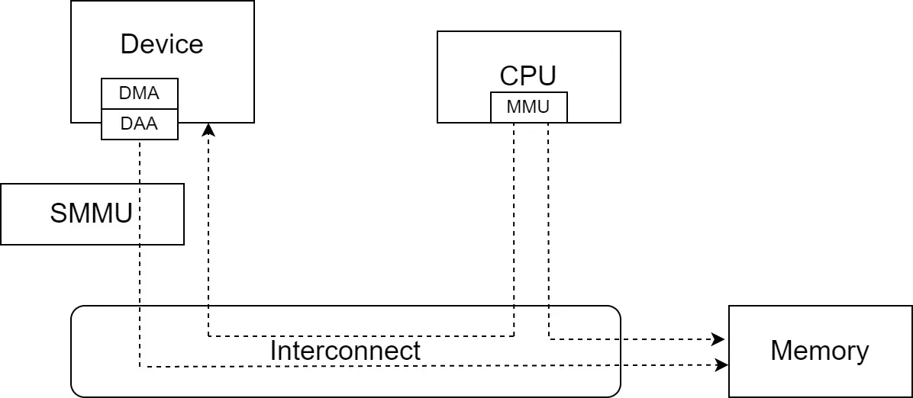
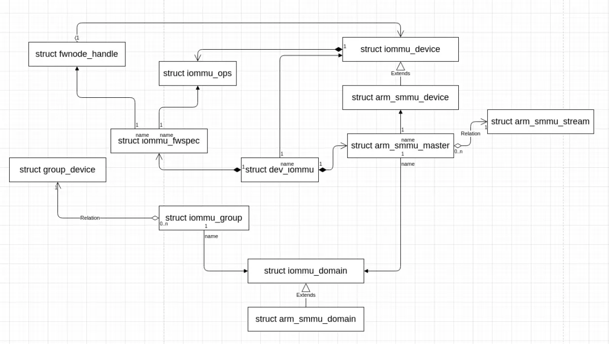
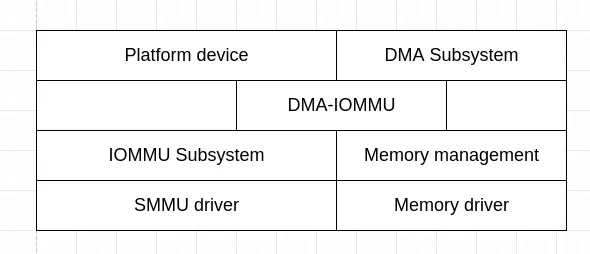

## Linux 系统下的 SMMU 介绍

在计算机系统架构中，与传统的用于 CPU 访问内存的管理的 MMU 类似，IOMMU (Input Output Memory Management Unit) 将来自系统 I/O 设备的 DMA 请求传递到系统互连之前，它会先转换请求的地址，并对系统 I/O 设备的内存访问事务进行管理和限制。IOMMU 将设备可见的虚拟地址 (IOVA) 映射到物理内存地址。不同的硬件体系结构有不同的 IOMMU 实现，ARM 平台的 IOMMU 是 SMMU (System Memory Management)。

SMMU 只为来自系统 I/O 设备的内存访问事务提供转换服务，而不为到系统 I/O 设备的事务提供转换服务。从系统或 CPU 到系统 I/O 设备的事务由其它方式管理，例如 MMU。下图展示了 SMMU 在系统中的角色。


来自系统 I/O 设备的内存访问事务指系统 I/O 设备对内存的读写，到系统 I/O 设备的事务通常指 CPU 访问系统 I/O 设备内部映射到物理内存地址空间的存储器或寄存器。关于 SMMU 更详细的介绍，可以参考 [IOMMU和Arm SMMU介绍](https://www.openeuler.org/zh/blog/wxggg/2020-11-21-iommu-smmu-intro.html) 及 [SMMU 软件指南](https://github.com/hanpfei/hanpfei-documents/blob/master/source/linux_kernel/arm_smmu_software_guide.md)。关于 SMMU 的寄存器、数据结构和行为的详细描述，可以参考 [ARM 系统内存管理单元架构规范版本 3](https://developer.arm.com/documentation/ihi0070/latest/)。关于 SMMU 的具体实现，可以参考相关实现的文档，如 MMU-600 的 [Arm CoreLink MMU-600 系统内存管理单元技术参考手册](https://developer.arm.com/documentation/100310/0202?lang=en) 和 MMU-700 的 [Arm® CoreLink™ MMU-700 系统内存管理单元技术参考手册](https://developer.arm.com/documentation/101542/0001/Introduction/About-the-CoreLink-MMU-700-System-Memory-Management-Unit)。

SMMU 通过 StreamID 等区分不同的系统 I/O 设备，系统 I/O 设备在通过 SMMU 访问内存时，需要将 StreamID 等信息带给 SMMU。从系统 I/O 设备的角度来看，包含 SMMU 的系统更精细的结构如下图：



系统 I/O 设备通过 DMA 访问内存，DMA 请求发出后，在送到 SMMU 和系统互联之前，先要经过一个称为 DAA (对于其它实现，可能是其它设备) 的设备，DAA 做第一次地址转换，之后将内存访问请求信息，包括配置的 StreamID 等送进 SMMU，以做进一步的处理。

在 Linux 系统中，要为某个系统 I/O 设备开启 SMMU，一般要经过如下步骤：

1. SMMU 驱动程序的初始化。这主要包括读取 dts 文件中的，SMMU 设备节点，探测 SMMU 的硬件设备特性，初始化全局资源及数据结构，如命令队列、事件队列、中断，和流表等，并将 SMMU 设备注册进 Linux 内核的 IOMMU 子系统。
2. 系统 I/O 设备探测、发现，并和驱动程序绑定初始化的过程中，设备和 IOMMU 的绑定。对于使用 DMA 来访问内存的设备，这一般通过调用 `of_dma_configure()`/`of_dma_configure_id()` 函数完成。设备探测、发现，并和驱动程序绑定初始化的过程，需要访问设备树 dts 文件里，设备节点定义中与 IOMMU 配置相关的字段。如在 *arch/arm64/boot/dts/renesas/r8a77961.dtsi* 文件中：
```
			iommus = <&ipmmu_vc0 19>;
```
3. 系统 I/O 设备驱动程序关于 IOMMU 的配置。这部分通常因具体的硬件系统实现而异。这主要包括调用 `dma_coerce_mask_and_coherent()`/`dma_set_mask_and_coherent()` 函数将 DMA 掩码和一致性 DMA 掩码设置为相同的值，以及配置类似前面提到的 DAA 之类的设备。
4. 系统 I/O 设备驱动程序分配内存。系统 I/O 设备驱动程序通过 `dma_alloc_coherent()` 等接口分配内存，这个过程除了分配内存外，还会通过 SMMU 设备驱动程序的操作函数，创建地址转换表，并完成 SMMU CD 等数据结构的设置。在 Linux 内核中，不同的子系统实际调用的分配 DMA 内存的方法不同，但最终都需要调用 `dma_alloc_coherent()` 函数，这样分配的内存，在通过 DMA 访问时，才会经过 SMMU。
5. 访问分配的内存。通过 `dma_alloc_coherent()` 函数分配到的内存，其地址可以提供给系统 I/O 设备的 DMA 配置相关逻辑，后续系统 I/O 设备通过 DMA 访问内存，将经过 SMMU 完成地址转换。通过 DMA 访问内存时，将经过 SMMU 的地址转换。

SMMU 的地址转换借助于相关的数据结构完成，这主要包括流表及其流表项 STE，上下文描述符表及其表项 CD，和地址转换表及其表项。STE 存储流的上下文信息，每个 STE 64 字节。CD 存储了与第 1 阶段转换有关的所有设置，每个 CD 64 字节。地址转换表用于描述虚拟地址和物理内存地址之间的映射关系。流表的结构可以分为 **线性流表** 和 **2 级流表** 两种。线性流表结构如下图：


2 级流表示例结构如下图：


上下文描述符表的结构可以分为 **单个 CD**，**单级 CD 表** 和 **2 级 CD 表** 三种情况。单个 CD 示例结构如下图：


单级 CD 表示例结构如下图：


2 级 CD 表示例结构如下图：


SMMU 在做地址转换时，根据 SMMU 的流表基址寄存器找到流表，通过 **StreamID** 在流表中找到 STE。之后根据 STE 的配置和 **SubstreamID**/**PASID**，找到上下文描述符表及对应的 CD。再根据 CD 中的信息找到地址转换表，并通过地址转换表完成最终的地址转换。

Linux 内核的 IOMMU 子系统相关源码位于 *drivers/iommu*，ARM SMMU 驱动实现位于 *drivers/iommu/arm/arm-smmu-v3*。在 Linux 内核的 SMMU 驱动实现中，做地址转换所用到的数据结构，在上面提到的不同步骤中创建：

 * 流表在 SMMU 驱动程序的初始化过程中创建。如果流表的结构为线性流表，则线性流表中所有的 STE 都被配置为旁路 SMMU，即对应的流不做 SMMU 地址转换；如果流表的结构为 2 级流表，则流表中为无效的 L1 流表描述符。
 * 系统 I/O 设备发现、探测，并和驱动程序绑定初始化的过程中，设备和 IOMMU 绑定时，创建上下文描述符表。如果流表的结构为 2 级流表，这个过程会先创建第 2 级流表，第 2 级流表中的 STE 都被配置为旁路 SMMU。创建上下文描述符表时，同样分是否需要 2 级上下文描述符表来执行。上下文描述符表创建之后，其地址被写入 STE。
 * 系统 I/O 设备驱动程序分配内存的过程中创建地址转换表。这个过程中，SMMU 驱动程序的回调会被调用，以将地址转换表的地址放进 CD 中。

## Linux 内核中 SMMU 的数据结构

Linux 内核的 IOMMU 子系统用 `struct iommu_device` 结构体表示一个 IOMMU 硬件设备实例，并用 `struct iommu_ops` 结构体描述 IOMMU 硬件设备实例支持的操作和能力，这两个结构体定义 (位于 *include/linux/iommu.h* 文件中) 如下：
```
/**
 * struct iommu_ops - iommu ops and capabilities
 * @capable: check capability
 * @domain_alloc: allocate iommu domain
 * @domain_free: free iommu domain
 * @attach_dev: attach device to an iommu domain
 * @detach_dev: detach device from an iommu domain
 * @map: map a physically contiguous memory region to an iommu domain
 * @unmap: unmap a physically contiguous memory region from an iommu domain
 * @flush_iotlb_all: Synchronously flush all hardware TLBs for this domain
 * @iotlb_sync_map: Sync mappings created recently using @map to the hardware
 * @iotlb_sync: Flush all queued ranges from the hardware TLBs and empty flush
 *            queue
 * @iova_to_phys: translate iova to physical address
 * @probe_device: Add device to iommu driver handling
 * @release_device: Remove device from iommu driver handling
 * @probe_finalize: Do final setup work after the device is added to an IOMMU
 *                  group and attached to the groups domain
 * @device_group: find iommu group for a particular device
 * @domain_get_attr: Query domain attributes
 * @domain_set_attr: Change domain attributes
 * @support_dirty_log: Check whether domain supports dirty log tracking
 * @switch_dirty_log: Perform actions to start|stop dirty log tracking
 * @sync_dirty_log: Sync dirty log from IOMMU into a dirty bitmap
 * @clear_dirty_log: Clear dirty log of IOMMU by a mask bitmap
 * @get_resv_regions: Request list of reserved regions for a device
 * @put_resv_regions: Free list of reserved regions for a device
 * @apply_resv_region: Temporary helper call-back for iova reserved ranges
 * @domain_window_enable: Configure and enable a particular window for a domain
 * @domain_window_disable: Disable a particular window for a domain
 * @of_xlate: add OF master IDs to iommu grouping
 * @is_attach_deferred: Check if domain attach should be deferred from iommu
 *                      driver init to device driver init (default no)
 * @dev_has/enable/disable_feat: per device entries to check/enable/disable
 *                               iommu specific features.
 * @dev_feat_enabled: check enabled feature
 * @aux_attach/detach_dev: aux-domain specific attach/detach entries.
 * @aux_get_pasid: get the pasid given an aux-domain
 * @sva_bind: Bind process address space to device
 * @sva_unbind: Unbind process address space from device
 * @sva_get_pasid: Get PASID associated to a SVA handle
 * @page_response: handle page request response
 * @cache_invalidate: invalidate translation caches
 * @sva_bind_gpasid: bind guest pasid and mm
 * @sva_unbind_gpasid: unbind guest pasid and mm
 * @def_domain_type: device default domain type, return value:
 *		- IOMMU_DOMAIN_IDENTITY: must use an identity domain
 *		- IOMMU_DOMAIN_DMA: must use a dma domain
 *		- 0: use the default setting
 * @attach_pasid_table: attach a pasid table
 * @detach_pasid_table: detach the pasid table
 * @pgsize_bitmap: bitmap of all possible supported page sizes
 * @owner: Driver module providing these ops
 */
struct iommu_ops {
	bool (*capable)(enum iommu_cap);

	/* Domain allocation and freeing by the iommu driver */
	struct iommu_domain *(*domain_alloc)(unsigned iommu_domain_type);
	void (*domain_free)(struct iommu_domain *);

	int (*attach_dev)(struct iommu_domain *domain, struct device *dev);
	void (*detach_dev)(struct iommu_domain *domain, struct device *dev);
	int (*map)(struct iommu_domain *domain, unsigned long iova,
		   phys_addr_t paddr, size_t size, int prot, gfp_t gfp);
	size_t (*unmap)(struct iommu_domain *domain, unsigned long iova,
		     size_t size, struct iommu_iotlb_gather *iotlb_gather);
	void (*flush_iotlb_all)(struct iommu_domain *domain);
	void (*iotlb_sync_map)(struct iommu_domain *domain, unsigned long iova,
			       size_t size);
	void (*iotlb_sync)(struct iommu_domain *domain,
			   struct iommu_iotlb_gather *iotlb_gather);
	phys_addr_t (*iova_to_phys)(struct iommu_domain *domain, dma_addr_t iova);
	struct iommu_device *(*probe_device)(struct device *dev);
	void (*release_device)(struct device *dev);
	void (*probe_finalize)(struct device *dev);
	struct iommu_group *(*device_group)(struct device *dev);
	int (*domain_get_attr)(struct iommu_domain *domain,
			       enum iommu_attr attr, void *data);
	int (*domain_set_attr)(struct iommu_domain *domain,
			       enum iommu_attr attr, void *data);

	/*
	 * Track dirty log. Note: Don't concurrently call these interfaces with
	 * other ops that access underlying page table.
	 */
	bool (*support_dirty_log)(struct iommu_domain *domain);
	int (*switch_dirty_log)(struct iommu_domain *domain, bool enable,
				unsigned long iova, size_t size, int prot);
	int (*sync_dirty_log)(struct iommu_domain *domain,
			      unsigned long iova, size_t size,
			      unsigned long *bitmap, unsigned long base_iova,
			      unsigned long bitmap_pgshift);
	int (*clear_dirty_log)(struct iommu_domain *domain,
			       unsigned long iova, size_t size,
			       unsigned long *bitmap, unsigned long base_iova,
			       unsigned long bitmap_pgshift);

	/* Request/Free a list of reserved regions for a device */
	void (*get_resv_regions)(struct device *dev, struct list_head *list);
	void (*put_resv_regions)(struct device *dev, struct list_head *list);
	void (*apply_resv_region)(struct device *dev,
				  struct iommu_domain *domain,
				  struct iommu_resv_region *region);

	/* Window handling functions */
	int (*domain_window_enable)(struct iommu_domain *domain, u32 wnd_nr,
				    phys_addr_t paddr, u64 size, int prot);
	void (*domain_window_disable)(struct iommu_domain *domain, u32 wnd_nr);

	int (*of_xlate)(struct device *dev, struct of_phandle_args *args);
	bool (*is_attach_deferred)(struct iommu_domain *domain, struct device *dev);

	/* Per device IOMMU features */
	bool (*dev_has_feat)(struct device *dev, enum iommu_dev_features f);
	bool (*dev_feat_enabled)(struct device *dev, enum iommu_dev_features f);
	int (*dev_enable_feat)(struct device *dev, enum iommu_dev_features f);
	int (*dev_disable_feat)(struct device *dev, enum iommu_dev_features f);

	/* Aux-domain specific attach/detach entries */
	int (*aux_attach_dev)(struct iommu_domain *domain, struct device *dev);
	void (*aux_detach_dev)(struct iommu_domain *domain, struct device *dev);
	int (*aux_get_pasid)(struct iommu_domain *domain, struct device *dev);

	struct iommu_sva *(*sva_bind)(struct device *dev, struct mm_struct *mm,
				      void *drvdata);
	void (*sva_unbind)(struct iommu_sva *handle);
	u32 (*sva_get_pasid)(struct iommu_sva *handle);

	int (*page_response)(struct device *dev,
			     struct iommu_fault_event *evt,
			     struct iommu_page_response *msg);
	int (*cache_invalidate)(struct iommu_domain *domain, struct device *dev,
				struct iommu_cache_invalidate_info *inv_info);
	int (*sva_bind_gpasid)(struct iommu_domain *domain,
			struct device *dev, struct iommu_gpasid_bind_data *data);

	int (*sva_unbind_gpasid)(struct device *dev, u32 pasid);
	int (*attach_pasid_table)(struct iommu_domain *domain,
				  struct iommu_pasid_table_config *cfg);
	void (*detach_pasid_table)(struct iommu_domain *domain);

	int (*def_domain_type)(struct device *dev);
	int (*dev_get_config)(struct device *dev, int type, void *data);
	int (*dev_set_config)(struct device *dev, int type, void *data);

	unsigned long pgsize_bitmap;
	struct module *owner;
};

/**
 * struct iommu_device - IOMMU core representation of one IOMMU hardware
 *			 instance
 * @list: Used by the iommu-core to keep a list of registered iommus
 * @ops: iommu-ops for talking to this iommu
 * @dev: struct device for sysfs handling
 */
struct iommu_device {
	struct list_head list;
	const struct iommu_ops *ops;
	struct fwnode_handle *fwnode;
	struct device *dev;
};
```

SMMU 驱动程序创建 `struct iommu_device` 和 `struct iommu_ops` 结构体的实例并注册进 IOMMU 子系统中。

Linux 内核的 IOMMU 子系统用 `struct dev_iommu` 结构体表示一个连接到 IOMMU 的系统 I/O 设备，用 `struct iommu_fwspec` 表示系统 I/O 设备连接的 IOMMU 设备，`struct iommu_fwspec` 在系统 I/O 设备侧，描述指向它连接的 IOMMU 设备的引用，这几个结构体定义 (位于 *include/linux/iommu.h* 文件中) 如下：
```
struct fwnode_handle {
	struct fwnode_handle *secondary;
	const struct fwnode_operations *ops;
	struct device *dev;
};
 . . . . . .
/**
 * struct dev_iommu - Collection of per-device IOMMU data
 *
 * @fault_param: IOMMU detected device fault reporting data
 * @iopf_param:	 I/O Page Fault queue and data
 * @fwspec:	 IOMMU fwspec data
 * @iommu_dev:	 IOMMU device this device is linked to
 * @priv:	 IOMMU Driver private data
 *
 * TODO: migrate other per device data pointers under iommu_dev_data, e.g.
 *	struct iommu_group	*iommu_group;
 */
struct dev_iommu {
	struct mutex lock;
	struct iommu_fault_param	*fault_param;
	struct iopf_device_param	*iopf_param;
	struct iommu_fwspec		*fwspec;
	struct iommu_device		*iommu_dev;
	void				*priv;
};
 . . . . . .
/**
 * struct iommu_fwspec - per-device IOMMU instance data
 * @ops: ops for this device's IOMMU
 * @iommu_fwnode: firmware handle for this device's IOMMU
 * @iommu_priv: IOMMU driver private data for this device
 * @num_ids: number of associated device IDs
 * @ids: IDs which this device may present to the IOMMU
 */
struct iommu_fwspec {
	const struct iommu_ops	*ops;
	struct fwnode_handle	*iommu_fwnode;
	u32			flags;
	unsigned int		num_ids;
	u32			ids[];
};
```

在 IOMMU 子系统中，domain 代表 IOMMU 映射地址空间，即一个 page table。IOMMU group 逻辑上需要与 domain 绑定，即一个 IOMMU group 中的所有设备都位于一个 domain 中。在 Linux 内核的 IOMMU 子系统中，domain 由 `struct iommu_domain` 结构体表示，这个结构体定义 (位于 *include/linux/iommu.h* 文件中) 如下：
```
struct iommu_domain {
	unsigned type;
	const struct iommu_ops *ops;
	unsigned long pgsize_bitmap;	/* Bitmap of page sizes in use */
	iommu_fault_handler_t handler;
	void *handler_token;
	struct iommu_domain_geometry geometry;
	void *iova_cookie;
	struct mutex switch_log_lock;
};
```

Linux 内核的 IOMMU 子系统用 `struct iommu_group` 结构体表示位于同一个 domain 的设备组，并用 `struct group_device` 结构体在 IOMMU group 中表示设备组中的一个设备。这两个结构体定义 (位于 *drivers/iommu/iommu.c* 文件中) 如下：
```
struct iommu_group {
	struct kobject kobj;
	struct kobject *devices_kobj;
	struct list_head devices;
	struct mutex mutex;
	struct blocking_notifier_head notifier;
	void *iommu_data;
	void (*iommu_data_release)(void *iommu_data);
	char *name;
	int id;
	struct iommu_domain *default_domain;
	struct iommu_domain *domain;
	struct list_head entry;
};

struct group_device {
	struct list_head list;
	struct device *dev;
	char *name;
};
```

`struct group_device` 和 `struct device` 的关系与 `struct iommu_fwspec` 和 `struct iommu_device` 的关系有相似之处。

以面向对象的编程方法来看，可以认为在 ARM SMMUv3 驱动程序中，`struct iommu_device` 和 `struct iommu_domain` 结构体有其特定的子类实现，即 `struct arm_smmu_device` 和 `struct arm_smmu_domain` 继承了 `struct iommu_device` 和 `struct iommu_domain`，这两个结构体定义 (位于 *drivers/iommu/arm/arm-smmu-v3/arm-smmu-v3.h* 文件中) 如下：
```
/* An SMMUv3 instance */
struct arm_smmu_device {
	struct device			*dev;
	void __iomem			*base;
	void __iomem			*page1;

#define ARM_SMMU_FEAT_2_LVL_STRTAB	(1 << 0)
#define ARM_SMMU_FEAT_2_LVL_CDTAB	(1 << 1)
#define ARM_SMMU_FEAT_TT_LE		(1 << 2)
#define ARM_SMMU_FEAT_TT_BE		(1 << 3)
#define ARM_SMMU_FEAT_PRI		(1 << 4)
#define ARM_SMMU_FEAT_ATS		(1 << 5)
#define ARM_SMMU_FEAT_SEV		(1 << 6)
#define ARM_SMMU_FEAT_MSI		(1 << 7)
#define ARM_SMMU_FEAT_COHERENCY		(1 << 8)
#define ARM_SMMU_FEAT_TRANS_S1		(1 << 9)
#define ARM_SMMU_FEAT_TRANS_S2		(1 << 10)
#define ARM_SMMU_FEAT_STALLS		(1 << 11)
#define ARM_SMMU_FEAT_HYP		(1 << 12)
#define ARM_SMMU_FEAT_STALL_FORCE	(1 << 13)
#define ARM_SMMU_FEAT_VAX		(1 << 14)
#define ARM_SMMU_FEAT_RANGE_INV		(1 << 15)
#define ARM_SMMU_FEAT_BTM		(1 << 16)
#define ARM_SMMU_FEAT_SVA		(1 << 17)
#define ARM_SMMU_FEAT_E2H		(1 << 18)
#define ARM_SMMU_FEAT_HA		(1 << 19)
#define ARM_SMMU_FEAT_HD		(1 << 20)
#define ARM_SMMU_FEAT_BBML1		(1 << 21)
#define ARM_SMMU_FEAT_BBML2		(1 << 22)
#define ARM_SMMU_FEAT_ECMDQ		(1 << 23)
#define ARM_SMMU_FEAT_MPAM		(1 << 24)
	u32				features;

#define ARM_SMMU_OPT_SKIP_PREFETCH	(1 << 0)
#define ARM_SMMU_OPT_PAGE0_REGS_ONLY	(1 << 1)
#define ARM_SMMU_OPT_MSIPOLL		(1 << 2)
	u32				options;

	union {
		u32			nr_ecmdq;
		u32			ecmdq_enabled;
	};
	struct arm_smmu_ecmdq *__percpu	*ecmdq;

	struct arm_smmu_cmdq		cmdq;
	struct arm_smmu_evtq		evtq;
	struct arm_smmu_priq		priq;

	int				gerr_irq;
	int				combined_irq;

	unsigned long			ias; /* IPA */
	unsigned long			oas; /* PA */
	unsigned long			pgsize_bitmap;

#define ARM_SMMU_MAX_ASIDS		(1 << 16)
	unsigned int			asid_bits;

#define ARM_SMMU_MAX_VMIDS		(1 << 16)
	unsigned int			vmid_bits;
	DECLARE_BITMAP(vmid_map, ARM_SMMU_MAX_VMIDS);

	unsigned int			ssid_bits;
	unsigned int			sid_bits;

	struct arm_smmu_strtab_cfg	strtab_cfg;

	/* IOMMU core code handle */
	struct iommu_device		iommu;

	struct rb_root			streams;
	struct mutex			streams_mutex;

	unsigned int			mpam_partid_max;
	unsigned int			mpam_pmg_max;

	bool				bypass;
};
 . . . . . .
struct arm_smmu_domain {
	struct arm_smmu_device		*smmu;
	struct mutex			init_mutex; /* Protects smmu pointer */

	struct io_pgtable_ops		*pgtbl_ops;
	bool				stall_enabled;
	bool				non_strict;
	atomic_t			nr_ats_masters;

	enum arm_smmu_domain_stage	stage;
	union {
		struct arm_smmu_s1_cfg	s1_cfg;
		struct arm_smmu_s2_cfg	s2_cfg;
	};

	struct iommu_domain		domain;

	/* Unused in aux domains */
	struct list_head		devices;
	spinlock_t			devices_lock;

	struct list_head		mmu_notifiers;

	/* Auxiliary domain stuff */
	struct arm_smmu_domain		*parent;
	ioasid_t			ssid;
	unsigned long			aux_nr_devs;
};
```

在 ARM SMMUv3 驱动程序中，用 `struct arm_smmu_master` 结构体描述连接到 SMMU 的系统 I/O 设备的 SMMU 私有数据，这个结构体定义 (位于 *drivers/iommu/arm/arm-smmu-v3/arm-smmu-v3.h* 文件中) 如下：
```
struct arm_smmu_stream {
	u32				id;
	struct arm_smmu_master		*master;
	struct rb_node			node;
};

/* SMMU private data for each master */
struct arm_smmu_master {
	struct arm_smmu_device		*smmu;
	struct device			*dev;
	struct arm_smmu_domain		*domain;
	struct list_head		domain_head;
	struct arm_smmu_stream		*streams;
	unsigned int			num_streams;
	bool				ats_enabled;
	bool				stall_enabled;
	bool				pri_supported;
	bool				prg_resp_needs_ssid;
	bool				sva_enabled;
	bool				iopf_enabled;
	bool				auxd_enabled;
	struct list_head		bonds;
	unsigned int			ssid_bits;
};
```

以面向对象的编程方法来看，可以认为 `struct arm_smmu_master` 继承了 `struct dev_iommu`。

Linux 内核中 SMMU 的数据结构大体有如下的结构关系：



上面这些数据结构，基本上都包含指向 `struct device` 对象的指针，`struct device` 则包含指向几个关键 IOMMU 对象的指针。`struct device` 对象是各个部分的中介者，相关的各个部分多通过 `struct device` 对象找到它需要的操作或数据。`struct device` 结构体中与 IOMMU 相关的字段主要有如下这些：
```
struct device {
#ifdef CONFIG_DMA_OPS
	const struct dma_map_ops *dma_ops;
#endif
 . . . . . .
#ifdef CONFIG_DMA_DECLARE_COHERENT
	struct dma_coherent_mem	*dma_mem; /* internal for coherent mem
					     override */
#endif
 . . . . . .
	struct iommu_group	*iommu_group;
	struct dev_iommu	*iommu;
 . . . . . .
#if defined(CONFIG_ARCH_HAS_SYNC_DMA_FOR_DEVICE) || \
    defined(CONFIG_ARCH_HAS_SYNC_DMA_FOR_CPU) || \
    defined(CONFIG_ARCH_HAS_SYNC_DMA_FOR_CPU_ALL)
	bool			dma_coherent:1;
#endif
#ifdef CONFIG_DMA_OPS_BYPASS
	bool			dma_ops_bypass : 1;
#endif
};
```

除了 IOMMU 子系统的这些数据结构外，在更底层的 SMMUv3 设备驱动程序实现中，还定义了许多特定于硬件的数据结构，如：

 * 命令队列项 `struct arm_smmu_cmdq_ent`，
 * 命令队列 `struct arm_smmu_cmdq`，
 * 扩展命令队列 `struct arm_smmu_ecmdq`，
 * 事件队列 `struct arm_smmu_evtq`，
 * PRI 队列 `struct arm_smmu_priq`，
 * 2 级流表中的 L1 流表描述符 `struct arm_smmu_strtab_l1_desc`，
 * 上下文描述符 `struct arm_smmu_ctx_desc`
 * 2 级上下文描述符表中的 L1 表描述符 `struct arm_smmu_l1_ctx_desc`
 * 上下文描述符配置 `struct arm_smmu_ctx_desc_cfg`
 * 第 1 阶段转换配置 `struct arm_smmu_s1_cfg`
 * 第 2 阶段转换配置 `struct arm_smmu_s2_cfg`
 * 流表配置 `struct arm_smmu_strtab_cfg`

特定于硬件的这些数据结构基本上与 ARM 官方的硬件说明文档 [SMMU 软件指南](https://github.com/hanpfei/hanpfei-documents/blob/master/source/linux_kernel/arm_smmu_software_guide.md) 和 [ARM 系统内存管理单元架构规范版本 3](https://developer.arm.com/documentation/ihi0070/latest/) 中提到的数据结构严格的一一对应。

SMMU 相关的操作及过程，和对 SMMU 的访问，基于上面这些数据结构实现，这种实现的分层结构大体如下图所示：



系统 I/O 设备发现、探测，并和驱动程序绑定初始化的过程，及系统 I/O 设备驱动程序通常调用平台设备子系统和 DMA 子系统提供的接口，如平台设备子系统的 `of_dma_configure()`/`of_dma_configure_id()` 和 DMA 子系统的 `dma_alloc_coherent()` 函数，这些函数的实现中，调用更底层的 IOMMU 子系统的接口及 SMMUv3 设备驱动程序的回调，完成必要的 IOMMU 配置。

## SMMUv3 设备驱动程序的初始化

Linux 内核启动早期，会执行 IOMMU 初始化，这主要是执行 `iommu_init()` 函数，它创建并添加 `iommu_groups` kset，这个函数定义 (位于 *drivers/iommu/iommu.c* 文件中) 如下：
```
static int __init iommu_init(void)
{
	iommu_group_kset = kset_create_and_add("iommu_groups",
					       NULL, kernel_kobj);
	BUG_ON(!iommu_group_kset);

	iommu_debugfs_setup();

	return 0;
}
core_initcall(iommu_init);
```

Linux 内核启动时，可以传入一些配置 IOMMU 的命令行参数，这包括用于配置默认 domain 类型的 `iommu.passthrough`、用于配置 DMA setup 的 `iommu.strict` 和用于配置等待挂起的页请求的页相应的超时时间的 `iommu.prq_timeout`。Linux 内核启动早期，会初始化 IOMMU 子系统，如果没有通过 Linux 内核的命令行参数配置 IOMMU，则会设置默认的 domain 类型，相关代码 (位于 *drivers/iommu/iommu.c* 文件中) 如下：
```
static unsigned int iommu_def_domain_type __read_mostly;
static bool iommu_dma_strict __read_mostly;
static u32 iommu_cmd_line __read_mostly;

/*
 * Timeout to wait for page response of a pending page request. This is
 * intended as a basic safety net in case a pending page request is not
 * responded for an exceptionally long time. Device may also implement
 * its own protection mechanism against this exception.
 * Units are in jiffies with a range between 1 - 100 seconds equivalent.
 * Default to 10 seconds.
 * Setting 0 means no timeout tracking.
 */
#define IOMMU_PAGE_RESPONSE_MAX_TIMEOUT (HZ * 100)
#define IOMMU_PAGE_RESPONSE_DEF_TIMEOUT (HZ * 10)
static unsigned long prq_timeout = IOMMU_PAGE_RESPONSE_DEF_TIMEOUT;
 . . . . . .
#define IOMMU_CMD_LINE_DMA_API		BIT(0)

static void iommu_set_cmd_line_dma_api(void)
{
	iommu_cmd_line |= IOMMU_CMD_LINE_DMA_API;
}

static bool iommu_cmd_line_dma_api(void)
{
	return !!(iommu_cmd_line & IOMMU_CMD_LINE_DMA_API);
}
 . . . . . .
/*
 * Use a function instead of an array here because the domain-type is a
 * bit-field, so an array would waste memory.
 */
static const char *iommu_domain_type_str(unsigned int t)
{
	switch (t) {
	case IOMMU_DOMAIN_BLOCKED:
		return "Blocked";
	case IOMMU_DOMAIN_IDENTITY:
		return "Passthrough";
	case IOMMU_DOMAIN_UNMANAGED:
		return "Unmanaged";
	case IOMMU_DOMAIN_DMA:
		return "Translated";
	default:
		return "Unknown";
	}
}

static int __init iommu_subsys_init(void)
{
	bool cmd_line = iommu_cmd_line_dma_api();

	if (!cmd_line) {
		if (IS_ENABLED(CONFIG_IOMMU_DEFAULT_PASSTHROUGH))
			iommu_set_default_passthrough(false);
		else
			iommu_set_default_translated(false);

		if (iommu_default_passthrough() && mem_encrypt_active()) {
			pr_info("Memory encryption detected - Disabling default IOMMU Passthrough\n");
			iommu_set_default_translated(false);
		}
	}

	pr_info("Default domain type: %s %s\n",
		iommu_domain_type_str(iommu_def_domain_type),
		cmd_line ? "(set via kernel command line)" : "");

	return 0;
}
subsys_initcall(iommu_subsys_init);
 . . . . . .
static int __init iommu_set_def_domain_type(char *str)
{
	bool pt;
	int ret;

	ret = kstrtobool(str, &pt);
	if (ret)
		return ret;

	if (pt)
		iommu_set_default_passthrough(true);
	else
		iommu_set_default_translated(true);

	return 0;
}
early_param("iommu.passthrough", iommu_set_def_domain_type);

static int __init iommu_dma_setup(char *str)
{
	return kstrtobool(str, &iommu_dma_strict);
}
early_param("iommu.strict", iommu_dma_setup);

static int __init iommu_set_prq_timeout(char *str)
{
	int ret;
	unsigned long timeout;

	if (!str)
		return -EINVAL;

	ret = kstrtoul(str, 10, &timeout);
	if (ret)
		return ret;
	timeout = timeout * HZ;
	if (timeout > IOMMU_PAGE_RESPONSE_MAX_TIMEOUT)
		return -EINVAL;
	prq_timeout = timeout;

	return 0;
}
early_param("iommu.prq_timeout", iommu_set_prq_timeout);
 . . . . . .
void iommu_set_default_passthrough(bool cmd_line)
{
	if (cmd_line)
		iommu_set_cmd_line_dma_api();

	iommu_def_domain_type = IOMMU_DOMAIN_IDENTITY;
}

void iommu_set_default_translated(bool cmd_line)
{
	if (cmd_line)
		iommu_set_cmd_line_dma_api();

	iommu_def_domain_type = IOMMU_DOMAIN_DMA;
}
```

`core_initcall` 的函数比 `subsys_initcall` 的函数执行地更早。

IOMMU 子系统初始化之后，就轮到 SMMU 设备驱动程序上场了。SMMUv3 本身是一个平台设备，其硬件设备信息，包括寄存器映射地址范围，中断号等使用的资源，在设备树 `dts`/`dtsi` 文件中描述。SMMUv3 设备在设备树文件中的示例设备节点 (位于 *arch/arm64/boot/dts/arm/fvp-base-revc.dts* 文件中) 如下：
```
	smmu: iommu@2b400000 {
		compatible = "arm,smmu-v3";
		reg = <0x0 0x2b400000 0x0 0x100000>;
		interrupts = <GIC_SPI 74 IRQ_TYPE_EDGE_RISING>,
			     <GIC_SPI 79 IRQ_TYPE_EDGE_RISING>,
			     <GIC_SPI 75 IRQ_TYPE_EDGE_RISING>,
			     <GIC_SPI 77 IRQ_TYPE_EDGE_RISING>;
		interrupt-names = "eventq", "gerror", "priq", "cmdq-sync";
		dma-coherent;
		#iommu-cells = <1>;
		msi-parent = <&its 0x10000>;
	};
```

SMMUv3 设备驱动程序加载的入口为 `arm_smmu_device_probe()` 函数，这个函数定义 (位于 *drivers/iommu/arm/arm-smmu-v3/arm-smmu-v3.c* 文件中) 如下：
```
static struct arm_smmu_option_prop arm_smmu_options[] = {
	{ ARM_SMMU_OPT_SKIP_PREFETCH, "hisilicon,broken-prefetch-cmd" },
	{ ARM_SMMU_OPT_PAGE0_REGS_ONLY, "cavium,cn9900-broken-page1-regspace"},
	{ 0, NULL},
};

static void parse_driver_options(struct arm_smmu_device *smmu)
{
	int i = 0;

	do {
		if (of_property_read_bool(smmu->dev->of_node,
						arm_smmu_options[i].prop)) {
			smmu->options |= arm_smmu_options[i].opt;
			dev_notice(smmu->dev, "option %s\n",
				arm_smmu_options[i].prop);
		}
	} while (arm_smmu_options[++i].opt);
}
 . . . . . .
static int arm_smmu_device_dt_probe(struct platform_device *pdev,
				    struct arm_smmu_device *smmu)
{
	struct device *dev = &pdev->dev;
	u32 cells;
	int ret = -EINVAL;

	if (of_property_read_u32(dev->of_node, "#iommu-cells", &cells))
		dev_err(dev, "missing #iommu-cells property\n");
	else if (cells != 1)
		dev_err(dev, "invalid #iommu-cells value (%d)\n", cells);
	else
		ret = 0;

	parse_driver_options(smmu);

	if (of_dma_is_coherent(dev->of_node))
		smmu->features |= ARM_SMMU_FEAT_COHERENCY;

	return ret;
}

static unsigned long arm_smmu_resource_size(struct arm_smmu_device *smmu)
{
	if (smmu->options & ARM_SMMU_OPT_PAGE0_REGS_ONLY)
		return SZ_64K;
	else
		return SZ_128K;
}
 . . . . . .
static void __iomem *arm_smmu_ioremap(struct device *dev, resource_size_t start,
				      resource_size_t size)
{
	struct resource res = DEFINE_RES_MEM(start, size);

	return devm_ioremap_resource(dev, &res);
}
 . . . . . .
static int arm_smmu_device_probe(struct platform_device *pdev)
{
	int irq, ret;
	struct resource *res;
	resource_size_t ioaddr;
	struct arm_smmu_device *smmu;
	struct device *dev = &pdev->dev;

	smmu = devm_kzalloc(dev, sizeof(*smmu), GFP_KERNEL);
	if (!smmu) {
		dev_err(dev, "failed to allocate arm_smmu_device\n");
		return -ENOMEM;
	}
	smmu->dev = dev;

	if (dev->of_node) {
		ret = arm_smmu_device_dt_probe(pdev, smmu);
	} else {
		ret = arm_smmu_device_acpi_probe(pdev, smmu);
		if (ret == -ENODEV)
			return ret;
	}

	/* Set bypass mode according to firmware probing result */
	smmu->bypass = !!ret;

	/* Base address */
	res = platform_get_resource(pdev, IORESOURCE_MEM, 0);
	if (!res)
		return -EINVAL;
	if (resource_size(res) < arm_smmu_resource_size(smmu)) {
		dev_err(dev, "MMIO region too small (%pr)\n", res);
		return -EINVAL;
	}
	ioaddr = res->start;

	/*
	 * Don't map the IMPLEMENTATION DEFINED regions, since they may contain
	 * the PMCG registers which are reserved by the PMU driver.
	 */
	smmu->base = arm_smmu_ioremap(dev, ioaddr, ARM_SMMU_REG_SZ);
	if (IS_ERR(smmu->base))
		return PTR_ERR(smmu->base);

	if (arm_smmu_resource_size(smmu) > SZ_64K) {
		smmu->page1 = arm_smmu_ioremap(dev, ioaddr + SZ_64K,
					       ARM_SMMU_REG_SZ);
		if (IS_ERR(smmu->page1))
			return PTR_ERR(smmu->page1);
	} else {
		smmu->page1 = smmu->base;
	}

	/* Interrupt lines */

	irq = platform_get_irq_byname_optional(pdev, "combined");
	if (irq > 0)
		smmu->combined_irq = irq;
	else {
		irq = platform_get_irq_byname_optional(pdev, "eventq");
		if (irq > 0)
			smmu->evtq.q.irq = irq;

		irq = platform_get_irq_byname_optional(pdev, "priq");
		if (irq > 0)
			smmu->priq.q.irq = irq;

		irq = platform_get_irq_byname_optional(pdev, "gerror");
		if (irq > 0)
			smmu->gerr_irq = irq;
	}
	/* Probe the h/w */
	ret = arm_smmu_device_hw_probe(smmu);
	if (ret)
		return ret;

	/* Initialise in-memory data structures */
	ret = arm_smmu_init_structures(smmu);
	if (ret)
		return ret;

	/* Record our private device structure */
	platform_set_drvdata(pdev, smmu);

	/* Reset the device */
	ret = arm_smmu_device_reset(smmu, false);
	if (ret)
		return ret;

	/* And we're up. Go go go! */
	ret = iommu_device_sysfs_add(&smmu->iommu, dev, NULL,
				     "smmu3.%pa", &ioaddr);
	if (ret)
		return ret;

	iommu_device_set_ops(&smmu->iommu, &arm_smmu_ops);
	iommu_device_set_fwnode(&smmu->iommu, dev->fwnode);

	ret = iommu_device_register(&smmu->iommu);
	if (ret) {
		dev_err(dev, "Failed to register iommu\n");
		return ret;
	}

	return arm_smmu_set_bus_ops(&arm_smmu_ops);
}
```

`arm_smmu_device_probe()` 函数主要做了如下几件事情：

1. 分配 `struct arm_smmu_device` 对象，这个对象用来在 IOMMU 子系统中描述 SMMUv3 设备。
2. 获取设备树文件 `dts`/`dtsi` 中的 SMMUv3 设备节点中包含的信息，和引用的资源，这主要包括：
     - 关于 SMMUv3 设备的信息，如 `iommu-cells`，其值必须为 1；options，如是否只有寄存器页 0 等；SMMU 是否支持 coherent，这主要由设备树文件中的设备节点的 `dma-coherent` 属性表示；
     - SMMUv3 设备的寄存器映射，`arm_smmu_device_probe()` 函数会根据 options 的值检查寄存器映射的范围大小是否与预期匹配，并重映射 SMMUv3 设备的寄存器映射；
     - SMMUv3 设备引用的中断资源，包括用于命令队列、事件队列和全局错误的中断资源。
3. 探测 SMMUv3 设备的硬件特性，这主要按照 [ARM 系统内存管理单元架构规范版本 3](https://developer.arm.com/documentation/ihi0070/latest/) 中定义的寄存器 **SMMU_IDR0**、**SMMU_IDR1**、**SMMU_IDR3**、和 **SMMU_IDR5** (另外一些用于提供信息的只读寄存器包含的信息和 SMMUv3 硬件设备的特性关系不大，**SMMU_IDR2** 包含 SMMU 为非安全编程接口实现的特性相关的信息，**SMMU_IDR4** 是一个 SMMU 实现定义的寄存器，**SMMU_IIDR** 寄存器包含 SMMU 的实现和实现者的信息，以及由实现定义的支持的架构版本信息，**SMMU_AIDR** 寄存器包含 SMMU 实现遵从的 SMMU 架构版本号信息) 的各个字段，确认实际的 SMMUv3 硬件设备支持的特性，这主要通过调用 `arm_smmu_device_hw_probe()` 函数完成。
4. 初始化数据结构，这主要包括几个队列和流表，队列包括命令队列、事件队列和 PRIQ 队列。对于流表的初始化，分两种情况，如果流表的结构为线性流表，则线性流表中所有的 STE 都被配置为旁路 SMMU；如果流表的结构为 2 级流表，则流表中为无效的 L1 流表描述符，这主要通过调用 `arm_smmu_init_structures()` 函数完成。
5. 在设备结构 `struct platform_device` 对象的私有字段中记录 `struct arm_smmu_device` 对象。
6. 复位 SMMUv3 设备，这主要包括通过 **SMMU_CR0** 等寄存器复位硬件设备，设置流表基址寄存器等；以及设置中断，包括向系统请求中断及注册中断处理程序；初始化数据结构在内存中建立各个数据结构，复位 SMMUv3 设备则将各个数据结构的基地址和各种配置写进对应的设备寄存器中，这主要通过调用 `arm_smmu_device_reset()` 函数完成。
7. 将 SMMUv3 设备注册到 IOMMU 子系统，这包括为 `struct iommu_device` 设置 `struct iommu_ops` 和 `struct fwnode_handle`，并将 `struct iommu_device` 对象注册进 IOMMU 子系统。`struct fwnode_handle` 用于匹配 SMMUv3 设备和系统 I/O 设备，这主要通过调用 `iommu_device_register()` 函数完成。
8. 为各个总线类型设置 `struct iommu_ops`，SMMUv3 设备驱动程序和要使用 IOMMU 的系统 I/O 设备的加载顺序可能是不确定的；正常情况下，应该是 SMMUv3 设备驱动程序先加载，要使用 IOMMU 的系统 I/O 设备后加载；这里会处理使用 IOMMU 的系统 I/O 设备先于 SMMUv3 设备驱动程序加载的情况，这主要通过调用 `arm_smmu_set_bus_ops()` 函数完成。

### 探测 SMMUv3 设备的硬件特性

`arm_smmu_device_probe()` 函数调用 `arm_smmu_device_hw_probe()` 函数探测 SMMUv3 设备的硬件特性，后者定义 (位于 *drivers/iommu/arm/arm-smmu-v3/arm-smmu-v3.c* 文件中) 如下：
```
static int arm_smmu_ecmdq_probe(struct arm_smmu_device *smmu)
{
	int ret, cpu;
	u32 i, nump, numq, gap;
	u32 reg, shift_increment;
	u64 addr, smmu_dma_base;
	void __iomem *cp_regs, *cp_base;

	/* IDR6 */
	reg = readl_relaxed(smmu->base + ARM_SMMU_IDR6);

	smmu_reg_dump(smmu);

	nump = 1 << FIELD_GET(IDR6_LOG2NUMP, reg);
	numq = 1 << FIELD_GET(IDR6_LOG2NUMQ, reg);
	smmu->nr_ecmdq = nump * numq;
	gap = ECMDQ_CP_RRESET_SIZE >> FIELD_GET(IDR6_LOG2NUMQ, reg);

	smmu_dma_base = (vmalloc_to_pfn(smmu->base) << PAGE_SHIFT);
	cp_regs = ioremap(smmu_dma_base + ARM_SMMU_ECMDQ_CP_BASE, PAGE_SIZE);
	if (!cp_regs)
		return -ENOMEM;

	for (i = 0; i < nump; i++) {
		u64 val, pre_addr;

		val = readq_relaxed(cp_regs + 32 * i);
		if (!(val & ECMDQ_CP_PRESET)) {
			iounmap(cp_regs);
			dev_err(smmu->dev, "ecmdq control page %u is memory mode\n", i);
			return -EFAULT;
		}

		if (i && ((val & ECMDQ_CP_ADDR) != (pre_addr + ECMDQ_CP_RRESET_SIZE))) {
			iounmap(cp_regs);
			dev_err(smmu->dev, "ecmdq_cp memory region is not contiguous\n");
			return -EFAULT;
		}

		pre_addr = val & ECMDQ_CP_ADDR;
	}

	addr = readl_relaxed(cp_regs) & ECMDQ_CP_ADDR;
	iounmap(cp_regs);

	cp_base = devm_ioremap(smmu->dev, smmu_dma_base + addr, ECMDQ_CP_RRESET_SIZE * nump);
	if (!cp_base)
		return -ENOMEM;

	smmu->ecmdq = devm_alloc_percpu(smmu->dev, struct arm_smmu_ecmdq *);
	if (!smmu->ecmdq)
		return -ENOMEM;

	ret = arm_smmu_ecmdq_layout(smmu);
	if (ret)
		return ret;

	shift_increment = order_base_2(num_possible_cpus() / smmu->nr_ecmdq);

	addr = 0;
	for_each_possible_cpu(cpu) {
		struct arm_smmu_ecmdq *ecmdq;
		struct arm_smmu_queue *q;

		ecmdq = *per_cpu_ptr(smmu->ecmdq, cpu);
		q = &ecmdq->cmdq.q;

		/*
		 * The boot option "maxcpus=" can limit the number of online
		 * CPUs. The CPUs that are not selected are not showed in
		 * cpumask_of_node(node), their 'ecmdq' may be NULL.
		 *
		 * (q->ecmdq_prod & ECMDQ_PROD_EN) indicates that the ECMDQ is
		 * shared by multiple cores and has been initialized.
		 */
		if (!ecmdq || (q->ecmdq_prod & ECMDQ_PROD_EN))
			continue;
		ecmdq->base = cp_base + addr;

		q->llq.max_n_shift = ECMDQ_MAX_SZ_SHIFT + shift_increment;
		ret = arm_smmu_init_one_queue(smmu, q, ecmdq->base, ARM_SMMU_ECMDQ_PROD,
				ARM_SMMU_ECMDQ_CONS, CMDQ_ENT_DWORDS, "ecmdq");
		if (ret)
			return ret;

		q->ecmdq_prod = ECMDQ_PROD_EN;
		rwlock_init(&q->ecmdq_lock);

		ret = arm_smmu_ecmdq_init(&ecmdq->cmdq);
		if (ret) {
			dev_err(smmu->dev, "ecmdq[%d] init failed\n", i);
			return ret;
		}

		addr += gap;
	}

	return 0;
}

static void arm_smmu_get_httu(struct arm_smmu_device *smmu, u32 reg)
{
	u32 fw_features = smmu->features & (ARM_SMMU_FEAT_HA | ARM_SMMU_FEAT_HD);
	u32 features = 0;

	switch (FIELD_GET(IDR0_HTTU, reg)) {
	case IDR0_HTTU_ACCESS_DIRTY:
		features |= ARM_SMMU_FEAT_HD;
		fallthrough;
	case IDR0_HTTU_ACCESS:
		features |= ARM_SMMU_FEAT_HA;
	}

	if (smmu->dev->of_node)
		smmu->features |= features;
	else if (features != fw_features)
		/* ACPI IORT sets the HTTU bits */
		dev_warn(smmu->dev,
			 "IDR0.HTTU overridden by FW configuration (0x%x)\n",
			 fw_features);
}

static int arm_smmu_device_hw_probe(struct arm_smmu_device *smmu)
{
	u32 reg;
	bool coherent = smmu->features & ARM_SMMU_FEAT_COHERENCY;
	bool vhe = cpus_have_cap(ARM64_HAS_VIRT_HOST_EXTN);

	/* IDR0 */
	reg = readl_relaxed(smmu->base + ARM_SMMU_IDR0);

	/* 2-level structures */
	if (FIELD_GET(IDR0_ST_LVL, reg) == IDR0_ST_LVL_2LVL)
		smmu->features |= ARM_SMMU_FEAT_2_LVL_STRTAB;

	if (reg & IDR0_CD2L)
		smmu->features |= ARM_SMMU_FEAT_2_LVL_CDTAB;

	/*
	 * Translation table endianness.
	 * We currently require the same endianness as the CPU, but this
	 * could be changed later by adding a new IO_PGTABLE_QUIRK.
	 */
	switch (FIELD_GET(IDR0_TTENDIAN, reg)) {
	case IDR0_TTENDIAN_MIXED:
		smmu->features |= ARM_SMMU_FEAT_TT_LE | ARM_SMMU_FEAT_TT_BE;
		break;
#ifdef __BIG_ENDIAN
	case IDR0_TTENDIAN_BE:
		smmu->features |= ARM_SMMU_FEAT_TT_BE;
		break;
#else
	case IDR0_TTENDIAN_LE:
		smmu->features |= ARM_SMMU_FEAT_TT_LE;
		break;
#endif
	default:
		dev_err(smmu->dev, "unknown/unsupported TT endianness!\n");
		return -ENXIO;
	}

	/* Boolean feature flags */
	if (IS_ENABLED(CONFIG_PCI_PRI) && reg & IDR0_PRI)
		smmu->features |= ARM_SMMU_FEAT_PRI;

	if (IS_ENABLED(CONFIG_PCI_ATS) && reg & IDR0_ATS)
		smmu->features |= ARM_SMMU_FEAT_ATS;

	if (reg & IDR0_SEV)
		smmu->features |= ARM_SMMU_FEAT_SEV;

	if (reg & IDR0_MSI) {
		smmu->features |= ARM_SMMU_FEAT_MSI;
		if (coherent && !disable_msipolling)
			smmu->options |= ARM_SMMU_OPT_MSIPOLL;
	}

	if (reg & IDR0_HYP) {
		smmu->features |= ARM_SMMU_FEAT_HYP;
		if (vhe)
			smmu->features |= ARM_SMMU_FEAT_E2H;
	}

	arm_smmu_get_httu(smmu, reg);

	/*
	 * If the CPU is using VHE, but the SMMU doesn't support it, the SMMU
	 * will create TLB entries for NH-EL1 world and will miss the
	 * broadcasted TLB invalidations that target EL2-E2H world. Don't enable
	 * BTM in that case.
	 */
	if (reg & IDR0_BTM && (!vhe || reg & IDR0_HYP))
		smmu->features |= ARM_SMMU_FEAT_BTM;

	/*
	 * The coherency feature as set by FW is used in preference to the ID
	 * register, but warn on mismatch.
	 */
	if (!!(reg & IDR0_COHACC) != coherent)
		dev_warn(smmu->dev, "IDR0.COHACC overridden by FW configuration (%s)\n",
			 coherent ? "true" : "false");

	switch (FIELD_GET(IDR0_STALL_MODEL, reg)) {
	case IDR0_STALL_MODEL_FORCE:
		smmu->features |= ARM_SMMU_FEAT_STALL_FORCE;
		fallthrough;
	case IDR0_STALL_MODEL_STALL:
		smmu->features |= ARM_SMMU_FEAT_STALLS;
	}

	if (reg & IDR0_S1P)
		smmu->features |= ARM_SMMU_FEAT_TRANS_S1;

	if (reg & IDR0_S2P)
		smmu->features |= ARM_SMMU_FEAT_TRANS_S2;

	if (!(reg & (IDR0_S1P | IDR0_S2P))) {
		dev_err(smmu->dev, "no translation support!\n");
		return -ENXIO;
	}

	/* We only support the AArch64 table format at present */
	switch (FIELD_GET(IDR0_TTF, reg)) {
	case IDR0_TTF_AARCH32_64:
		smmu->ias = 40;
		fallthrough;
	case IDR0_TTF_AARCH64:
		break;
	default:
		dev_err(smmu->dev, "AArch64 table format not supported!\n");
		return -ENXIO;
	}

	/* ASID/VMID sizes */
	smmu->asid_bits = reg & IDR0_ASID16 ? 16 : 8;
	smmu->vmid_bits = reg & IDR0_VMID16 ? 16 : 8;

	/* IDR1 */
	reg = readl_relaxed(smmu->base + ARM_SMMU_IDR1);
	if (reg & (IDR1_TABLES_PRESET | IDR1_QUEUES_PRESET | IDR1_REL)) {
		dev_err(smmu->dev, "embedded implementation not supported\n");
		return -ENXIO;
	}

	if (reg & IDR1_ECMDQ)
		smmu->features |= ARM_SMMU_FEAT_ECMDQ;

	/* Queue sizes, capped to ensure natural alignment */
	smmu->cmdq.q.llq.max_n_shift = min_t(u32, CMDQ_MAX_SZ_SHIFT,
					     FIELD_GET(IDR1_CMDQS, reg));
	if (smmu->cmdq.q.llq.max_n_shift <= ilog2(CMDQ_BATCH_ENTRIES)) {
		/*
		 * We don't support splitting up batches, so one batch of
		 * commands plus an extra sync needs to fit inside the command
		 * queue. There's also no way we can handle the weird alignment
		 * restrictions on the base pointer for a unit-length queue.
		 */
		dev_err(smmu->dev, "command queue size <= %d entries not supported\n",
			CMDQ_BATCH_ENTRIES);
		return -ENXIO;
	}

	smmu->evtq.q.llq.max_n_shift = min_t(u32, EVTQ_MAX_SZ_SHIFT,
					     FIELD_GET(IDR1_EVTQS, reg));
	smmu->priq.q.llq.max_n_shift = min_t(u32, PRIQ_MAX_SZ_SHIFT,
					     FIELD_GET(IDR1_PRIQS, reg));

	/* SID/SSID sizes */
	smmu->ssid_bits = FIELD_GET(IDR1_SSIDSIZE, reg);
	smmu->sid_bits = FIELD_GET(IDR1_SIDSIZE, reg);

	/*
	 * If the SMMU supports fewer bits than would fill a single L2 stream
	 * table, use a linear table instead.
	 */
	if (smmu->sid_bits <= STRTAB_SPLIT)
		smmu->features &= ~ARM_SMMU_FEAT_2_LVL_STRTAB;

	/* IDR3 */
	reg = readl_relaxed(smmu->base + ARM_SMMU_IDR3);
	switch (FIELD_GET(IDR3_BBML, reg)) {
	case IDR3_BBML0:
		break;
	case IDR3_BBML1:
		smmu->features |= ARM_SMMU_FEAT_BBML1;
		break;
	case IDR3_BBML2:
		smmu->features |= ARM_SMMU_FEAT_BBML2;
		break;
	default:
		dev_err(smmu->dev, "unknown/unsupported BBM behavior level\n");
		return -ENXIO;
	}

	if (FIELD_GET(IDR3_RIL, reg))
		smmu->features |= ARM_SMMU_FEAT_RANGE_INV;

	if (reg & IDR3_MPAM) {
		reg = readl_relaxed(smmu->base + ARM_SMMU_MPAMIDR);
		smmu->mpam_partid_max = FIELD_GET(MPAMIDR_PARTID_MAX, reg);
		smmu->mpam_pmg_max = FIELD_GET(MPAMIDR_PMG_MAX, reg);
		if (smmu->mpam_partid_max || smmu->mpam_pmg_max)
			smmu->features |= ARM_SMMU_FEAT_MPAM;
	}

	/* IDR5 */
	reg = readl_relaxed(smmu->base + ARM_SMMU_IDR5);

	/* Maximum number of outstanding stalls */
	smmu->evtq.max_stalls = FIELD_GET(IDR5_STALL_MAX, reg);

	/* Page sizes */
	if (reg & IDR5_GRAN64K)
		smmu->pgsize_bitmap |= SZ_64K | SZ_512M;
	if (reg & IDR5_GRAN16K)
		smmu->pgsize_bitmap |= SZ_16K | SZ_32M;
	if (reg & IDR5_GRAN4K)
		smmu->pgsize_bitmap |= SZ_4K | SZ_2M | SZ_1G;

	/* Input address size */
	if (FIELD_GET(IDR5_VAX, reg) == IDR5_VAX_52_BIT)
		smmu->features |= ARM_SMMU_FEAT_VAX;

	/* Output address size */
	switch (FIELD_GET(IDR5_OAS, reg)) {
	case IDR5_OAS_32_BIT:
		smmu->oas = 32;
		break;
	case IDR5_OAS_36_BIT:
		smmu->oas = 36;
		break;
	case IDR5_OAS_40_BIT:
		smmu->oas = 40;
		break;
	case IDR5_OAS_42_BIT:
		smmu->oas = 42;
		break;
	case IDR5_OAS_44_BIT:
		smmu->oas = 44;
		break;
	case IDR5_OAS_52_BIT:
		smmu->oas = 52;
		smmu->pgsize_bitmap |= 1ULL << 42; /* 4TB */
		break;
	default:
		dev_info(smmu->dev,
			"unknown output address size. Truncating to 48-bit\n");
		fallthrough;
	case IDR5_OAS_48_BIT:
		smmu->oas = 48;
	}

	if (arm_smmu_ops.pgsize_bitmap == -1UL)
		arm_smmu_ops.pgsize_bitmap = smmu->pgsize_bitmap;
	else
		arm_smmu_ops.pgsize_bitmap |= smmu->pgsize_bitmap;

	/* Set the DMA mask for our table walker */
	if (dma_set_mask_and_coherent(smmu->dev, DMA_BIT_MASK(smmu->oas)))
		dev_warn(smmu->dev,
			 "failed to set DMA mask for table walker\n");

	smmu->ias = max(smmu->ias, smmu->oas);

	if (arm_smmu_sva_supported(smmu))
		smmu->features |= ARM_SMMU_FEAT_SVA;

	dev_info(smmu->dev, "ias %lu-bit, oas %lu-bit (features 0x%08x)\n",
		 smmu->ias, smmu->oas, smmu->features);

	if (smmu->features & ARM_SMMU_FEAT_ECMDQ) {
		int err;

		err = arm_smmu_ecmdq_probe(smmu);
		if (err) {
			dev_err(smmu->dev, "suppress ecmdq feature, errno=%d\n", err);
			smmu->ecmdq_enabled = 0;
		}
	}
	return 0;
}
```

在 `struct arm_smmu_device` 结构体中，SMMUv3 驱动程序用一个 32 位的值来描述支持的硬件特性，其中每个特性用一位来表示。函数 `arm_smmu_device_hw_probe()` 通过读取 SMMU 的寄存器获取 SMMU 的硬件特性。

**SMMU_IDR0** 寄存器：

 * 是否支持两级流表
 * 是否支持两级上下文描述符 (CD) 表
 * 支持的转换表的字节序
 * 是否支持 PRI
 * 是否支持 ATS
 * 是否支持 SEV
 * 是否支持 MSI
 * 是否支持 HYP
 * HTTU 特性
 * 是否支持 BTM
 * 是否支持 COHACC
 * 是否支持 STALL
 * 是否支持第 1 阶段转换
 * 是否支持第 2 阶段转换
 * IAS (输入地址大小) 的值
 * ASID bits
 * VMID bits

**SMMU_IDR1** 寄存器 (部分字段被忽略，如 ATTR_TYPE_OVR 和 ATTR_PERMS_OVR)：

 * 流表基地址和流表配置是否固定
 * 命令队列、事件队列和 PRI 队列基址是否固定
 * 基址固定时，基址寄存器包含的是绝对地址还是相对地址，SMMUv3 设备驱动程序要求流表基地址和流表配置不固定，命令队列、事件队列和 PRI 队列基址不固定
 * 是否支持扩展的命令队列
 * 命令队列、事件队列和 PRI 队列的大小
 * StreamID SID 的大小
 * SubstreamID SSID 的大小

**SMMU_IDR3** 寄存器 (部分字段被忽略)：

 * 支持的 BBML
 * 是否支持 RIL
 * 是否支持 MPAM，支持 MPAM 时，还会读取 MPAM 的寄存器获得更多信息

**SMMU_IDR5** 寄存器：

 * SMMU 和系统支持的未完成停滞事务的最大数目。
 * 支持的页大小
 * 虚拟地址扩展 VAX，即支持的虚拟地址大小
 * 输出地址大小 OAS

此外，`arm_smmu_device_hw_probe()` 函数还会探测是否支持 SVA，当前面检测到支持扩展的命令队列时，还会读取 **ARM_SMMU_IDR6** 寄存器检测 ECMDQ 的特性。

`arm_smmu_device_hw_probe()` 函数按照 [ARM 系统内存管理单元架构规范版本 3](https://developer.arm.com/documentation/ihi0070/latest/) 中定义的寄存器各个字段的含义执行。

## 初始化数据结构

初始化数据结构主要通过调用 `arm_smmu_init_structures()` 函数完成，这个函数定义 (位于 *drivers/iommu/arm/arm-smmu-v3/arm-smmu-v3.c* 文件中) 如下：
```
/* Stream table manipulation functions */
static void
arm_smmu_write_strtab_l1_desc(__le64 *dst, struct arm_smmu_strtab_l1_desc *desc)
{
	u64 val = 0;

	val |= FIELD_PREP(STRTAB_L1_DESC_SPAN, desc->span);
	val |= desc->l2ptr_dma & STRTAB_L1_DESC_L2PTR_MASK;

	/* See comment in arm_smmu_write_ctx_desc() */
	WRITE_ONCE(*dst, cpu_to_le64(val));
}

static void arm_smmu_sync_ste_for_sid(struct arm_smmu_device *smmu, u32 sid)
{
	struct arm_smmu_cmdq_ent cmd = {
		.opcode	= CMDQ_OP_CFGI_STE,
		.cfgi	= {
			.sid	= sid,
			.leaf	= true,
		},
	};

	arm_smmu_cmdq_issue_cmd_with_sync(smmu, &cmd);
}

static void arm_smmu_write_strtab_ent(struct arm_smmu_master *master, u32 sid,
				      __le64 *dst)
{
	/*
	 * This is hideously complicated, but we only really care about
	 * three cases at the moment:
	 *
	 * 1. Invalid (all zero) -> bypass/fault (init)
	 * 2. Bypass/fault -> translation/bypass (attach)
	 * 3. Translation/bypass -> bypass/fault (detach)
	 *
	 * Given that we can't update the STE atomically and the SMMU
	 * doesn't read the thing in a defined order, that leaves us
	 * with the following maintenance requirements:
	 *
	 * 1. Update Config, return (init time STEs aren't live)
	 * 2. Write everything apart from dword 0, sync, write dword 0, sync
	 * 3. Update Config, sync
	 */
	u64 val = le64_to_cpu(dst[0]);
	bool ste_live = false;
	struct arm_smmu_device *smmu = NULL;
	struct arm_smmu_s1_cfg *s1_cfg = NULL;
	struct arm_smmu_s2_cfg *s2_cfg = NULL;
	struct arm_smmu_domain *smmu_domain = NULL;
	struct arm_smmu_cmdq_ent prefetch_cmd = {
		.opcode		= CMDQ_OP_PREFETCH_CFG,
		.prefetch	= {
			.sid	= sid,
		},
	};

	if (master) {
		smmu_domain = master->domain;
		smmu = master->smmu;
	}

	if (smmu_domain) {
		switch (smmu_domain->stage) {
		case ARM_SMMU_DOMAIN_S1:
			s1_cfg = &smmu_domain->s1_cfg;
			break;
		case ARM_SMMU_DOMAIN_S2:
		case ARM_SMMU_DOMAIN_NESTED:
			s2_cfg = &smmu_domain->s2_cfg;
			break;
		default:
			break;
		}
	}

	if (val & STRTAB_STE_0_V) {
		switch (FIELD_GET(STRTAB_STE_0_CFG, val)) {
		case STRTAB_STE_0_CFG_BYPASS:
			break;
		case STRTAB_STE_0_CFG_S1_TRANS:
		case STRTAB_STE_0_CFG_S2_TRANS:
			ste_live = true;
			break;
		case STRTAB_STE_0_CFG_ABORT:
			BUG_ON(!disable_bypass);
			break;
		default:
			BUG(); /* STE corruption */
		}
	}

	/* Nuke the existing STE_0 value, as we're going to rewrite it */
	val = STRTAB_STE_0_V;

	/* Bypass/fault */
	if (!smmu_domain || !(s1_cfg || s2_cfg)) {
		if (!smmu_domain && disable_bypass)
			val |= FIELD_PREP(STRTAB_STE_0_CFG, STRTAB_STE_0_CFG_ABORT);
		else
			val |= FIELD_PREP(STRTAB_STE_0_CFG, STRTAB_STE_0_CFG_BYPASS);

		dst[0] = cpu_to_le64(val);
		dst[1] = cpu_to_le64(FIELD_PREP(STRTAB_STE_1_SHCFG,
						STRTAB_STE_1_SHCFG_INCOMING));
		dst[2] = 0; /* Nuke the VMID */
		/*
		 * The SMMU can perform negative caching, so we must sync
		 * the STE regardless of whether the old value was live.
		 */
		if (smmu)
			arm_smmu_sync_ste_for_sid(smmu, sid);
		return;
	}

	if (s1_cfg) {
		u64 strw = smmu->features & ARM_SMMU_FEAT_E2H ?
			STRTAB_STE_1_STRW_EL2 : STRTAB_STE_1_STRW_NSEL1;

		BUG_ON(ste_live);
		dst[1] = cpu_to_le64(
			 FIELD_PREP(STRTAB_STE_1_S1DSS, STRTAB_STE_1_S1DSS_SSID0) |
			 FIELD_PREP(STRTAB_STE_1_S1CIR, STRTAB_STE_1_S1C_CACHE_WBRA) |
			 FIELD_PREP(STRTAB_STE_1_S1COR, STRTAB_STE_1_S1C_CACHE_WBRA) |
			 FIELD_PREP(STRTAB_STE_1_S1CSH, ARM_SMMU_SH_ISH) |
			 FIELD_PREP(STRTAB_STE_1_STRW, strw));

		if (master->prg_resp_needs_ssid)
			dst[1] |= cpu_to_le64(STRTAB_STE_1_PPAR);

		if (smmu->features & ARM_SMMU_FEAT_STALLS &&
		    !master->stall_enabled)
			dst[1] |= cpu_to_le64(STRTAB_STE_1_S1STALLD);

		val |= (s1_cfg->cdcfg.cdtab_dma & STRTAB_STE_0_S1CTXPTR_MASK) |
			FIELD_PREP(STRTAB_STE_0_CFG, STRTAB_STE_0_CFG_S1_TRANS) |
			FIELD_PREP(STRTAB_STE_0_S1CDMAX, s1_cfg->s1cdmax) |
			FIELD_PREP(STRTAB_STE_0_S1FMT, s1_cfg->s1fmt);
	}

	if (s2_cfg) {
		BUG_ON(ste_live);
		dst[2] = cpu_to_le64(
			 FIELD_PREP(STRTAB_STE_2_S2VMID, s2_cfg->vmid) |
			 FIELD_PREP(STRTAB_STE_2_VTCR, s2_cfg->vtcr) |
#ifdef __BIG_ENDIAN
			 STRTAB_STE_2_S2ENDI |
#endif
			 STRTAB_STE_2_S2PTW | STRTAB_STE_2_S2AA64 |
			 STRTAB_STE_2_S2R);

		dst[3] = cpu_to_le64(s2_cfg->vttbr & STRTAB_STE_3_S2TTB_MASK);

		val |= FIELD_PREP(STRTAB_STE_0_CFG, STRTAB_STE_0_CFG_S2_TRANS);
	}

	if (master->ats_enabled)
		dst[1] |= cpu_to_le64(FIELD_PREP(STRTAB_STE_1_EATS,
						 STRTAB_STE_1_EATS_TRANS));

	pr_info("arm_smmu_write_strtab_ent[%d], val[0]=0x%llx, val[1]=0x%llx, val[2]=0x%llx, val[3]=0x%llx\n",
			sid, val, dst[1], dst[2], dst[3]);
	arm_smmu_sync_ste_for_sid(smmu, sid);
	/* See comment in arm_smmu_write_ctx_desc() */
	WRITE_ONCE(dst[0], cpu_to_le64(val));
	arm_smmu_sync_ste_for_sid(smmu, sid);

	/* It's likely that we'll want to use the new STE soon */
	if (!(smmu->options & ARM_SMMU_OPT_SKIP_PREFETCH))
		arm_smmu_cmdq_issue_cmd(smmu, &prefetch_cmd);
}

static void arm_smmu_init_bypass_stes(__le64 *strtab, unsigned int nent)
{
	unsigned int i;

	for (i = 0; i < nent; ++i) {
		arm_smmu_write_strtab_ent(NULL, -1, strtab);
		strtab += STRTAB_STE_DWORDS;
	}
}
 . . . . . .
/* Probing and initialisation functions */
static int arm_smmu_init_one_queue(struct arm_smmu_device *smmu,
				   struct arm_smmu_queue *q,
				   void __iomem *page,
				   unsigned long prod_off,
				   unsigned long cons_off,
				   size_t dwords, const char *name)
{
	size_t qsz;

	do {
		qsz = ((1 << q->llq.max_n_shift) * dwords) << 3;
		q->base = dmam_alloc_coherent(smmu->dev, qsz, &q->base_dma,
					      GFP_KERNEL);
		if (q->base || qsz < PAGE_SIZE)
			break;

		q->llq.max_n_shift--;
	} while (1);

	if (!q->base) {
		dev_err(smmu->dev,
			"failed to allocate queue (0x%zx bytes) for %s\n",
			qsz, name);
		return -ENOMEM;
	}

	if (!WARN_ON(q->base_dma & (qsz - 1))) {
		dev_info(smmu->dev, "allocated %u entries for %s\n",
			 1 << q->llq.max_n_shift, name);
	}

	q->prod_reg	= page + prod_off;
	q->cons_reg	= page + cons_off;
	q->ent_dwords	= dwords;

	q->q_base  = Q_BASE_RWA;
	q->q_base |= q->base_dma & Q_BASE_ADDR_MASK;
	q->q_base |= FIELD_PREP(Q_BASE_LOG2SIZE, q->llq.max_n_shift);

	q->llq.prod = q->llq.cons = 0;
	return 0;
}

static void arm_smmu_cmdq_free_bitmap(void *data)
{
	unsigned long *bitmap = data;
	bitmap_free(bitmap);
}

static int arm_smmu_cmdq_init(struct arm_smmu_device *smmu)
{
	int ret = 0;
	struct arm_smmu_cmdq *cmdq = &smmu->cmdq;
	unsigned int nents = 1 << cmdq->q.llq.max_n_shift;
	atomic_long_t *bitmap;

	cmdq->shared = 1;
	atomic_set(&cmdq->owner_prod, 0);
	atomic_set(&cmdq->lock, 0);

	bitmap = (atomic_long_t *)bitmap_zalloc(nents, GFP_KERNEL);
	if (!bitmap) {
		dev_err(smmu->dev, "failed to allocate cmdq bitmap\n");
		ret = -ENOMEM;
	} else {
		cmdq->valid_map = bitmap;
		devm_add_action(smmu->dev, arm_smmu_cmdq_free_bitmap, bitmap);
	}

	return ret;
}

static int arm_smmu_ecmdq_init(struct arm_smmu_cmdq *cmdq)
{
	unsigned int nents = 1 << cmdq->q.llq.max_n_shift;

	atomic_set(&cmdq->owner_prod, 0);
	atomic_set(&cmdq->lock, 0);

	cmdq->valid_map = (atomic_long_t *)bitmap_zalloc(nents, GFP_KERNEL);
	if (!cmdq->valid_map)
		return -ENOMEM;

	return 0;
}

static int arm_smmu_init_queues(struct arm_smmu_device *smmu)
{
	int ret;

	/* cmdq */
	ret = arm_smmu_init_one_queue(smmu, &smmu->cmdq.q, smmu->base,
				      ARM_SMMU_CMDQ_PROD, ARM_SMMU_CMDQ_CONS,
				      CMDQ_ENT_DWORDS, "cmdq");
	if (ret)
		return ret;

	ret = arm_smmu_cmdq_init(smmu);
	if (ret)
		return ret;

	/* evtq */
	ret = arm_smmu_init_one_queue(smmu, &smmu->evtq.q, smmu->page1,
				      ARM_SMMU_EVTQ_PROD, ARM_SMMU_EVTQ_CONS,
				      EVTQ_ENT_DWORDS, "evtq");
	if (ret)
		return ret;

	if ((smmu->features & ARM_SMMU_FEAT_SVA) &&
	    (smmu->features & ARM_SMMU_FEAT_STALLS)) {
		smmu->evtq.iopf = iopf_queue_alloc(dev_name(smmu->dev));
		if (!smmu->evtq.iopf)
			return -ENOMEM;
	}

	/* priq */
	if (!(smmu->features & ARM_SMMU_FEAT_PRI))
		return 0;

	if (smmu->features & ARM_SMMU_FEAT_SVA) {
		smmu->priq.iopf = iopf_queue_alloc(dev_name(smmu->dev));
		if (!smmu->priq.iopf)
			return -ENOMEM;
	}

	init_waitqueue_head(&smmu->priq.wq);
	smmu->priq.batch = 0;

	return arm_smmu_init_one_queue(smmu, &smmu->priq.q, smmu->page1,
				       ARM_SMMU_PRIQ_PROD, ARM_SMMU_PRIQ_CONS,
				       PRIQ_ENT_DWORDS, "priq");
}

static int arm_smmu_init_l1_strtab(struct arm_smmu_device *smmu)
{
	unsigned int i;
	struct arm_smmu_strtab_cfg *cfg = &smmu->strtab_cfg;
	size_t size = sizeof(*cfg->l1_desc) * cfg->num_l1_ents;
	void *strtab = smmu->strtab_cfg.strtab;

	cfg->l1_desc = devm_kzalloc(smmu->dev, size, GFP_KERNEL);
	if (!cfg->l1_desc) {
		dev_err(smmu->dev, "failed to allocate l1 stream table desc\n");
		return -ENOMEM;
	}

	for (i = 0; i < cfg->num_l1_ents; ++i) {
		arm_smmu_write_strtab_l1_desc(strtab, &cfg->l1_desc[i]);
		strtab += STRTAB_L1_DESC_DWORDS << 3;
	}

	return 0;
}

#ifdef CONFIG_SMMU_BYPASS_DEV
static void arm_smmu_install_bypass_ste_for_dev(struct arm_smmu_device *smmu,
				    u32 sid)
{
	u64 val;
	__le64 *step = arm_smmu_get_step_for_sid(smmu, sid);

	if (!step)
		return;

	val = STRTAB_STE_0_V;
	val |= FIELD_PREP(STRTAB_STE_0_CFG, STRTAB_STE_0_CFG_BYPASS);
	step[0] = cpu_to_le64(val);
	step[1] = cpu_to_le64(FIELD_PREP(STRTAB_STE_1_SHCFG,
	STRTAB_STE_1_SHCFG_INCOMING));
	step[2] = 0;
}

static int arm_smmu_prepare_init_l2_strtab(struct device *dev, void *data)
{
	u32 sid;
	int ret;
	struct pci_dev *pdev;
	struct arm_smmu_device *smmu = (struct arm_smmu_device *)data;

	if (!arm_smmu_device_domain_type(dev))
		return 0;

	pdev = to_pci_dev(dev);
	sid = PCI_DEVID(pdev->bus->number, pdev->devfn);
	if (!arm_smmu_sid_in_range(smmu, sid))
		return -ERANGE;

	ret = arm_smmu_init_l2_strtab(smmu, sid);
	if (ret)
		return ret;

	arm_smmu_install_bypass_ste_for_dev(smmu, sid);

	return 0;
}
#endif

static int arm_smmu_init_strtab_2lvl(struct arm_smmu_device *smmu)
{
	void *strtab;
	u64 reg;
	u32 size, l1size;
	struct arm_smmu_strtab_cfg *cfg = &smmu->strtab_cfg;
#ifdef CONFIG_SMMU_BYPASS_DEV
	int ret;
#endif

	/* Calculate the L1 size, capped to the SIDSIZE. */
	size = STRTAB_L1_SZ_SHIFT - (ilog2(STRTAB_L1_DESC_DWORDS) + 3);
	size = min(size, smmu->sid_bits - STRTAB_SPLIT);
	cfg->num_l1_ents = 1 << size;

	size += STRTAB_SPLIT;
	if (size < smmu->sid_bits)
		dev_warn(smmu->dev,
			 "2-level strtab only covers %u/%u bits of SID\n",
			 size, smmu->sid_bits);

	l1size = cfg->num_l1_ents * (STRTAB_L1_DESC_DWORDS << 3);
	strtab = dmam_alloc_coherent(smmu->dev, l1size, &cfg->strtab_dma,
				     GFP_KERNEL);
	if (!strtab) {
		dev_err(smmu->dev,
			"failed to allocate l1 stream table (%u bytes)\n",
			l1size);
		return -ENOMEM;
	}
	cfg->strtab = strtab;

	/* Configure strtab_base_cfg for 2 levels */
	reg  = FIELD_PREP(STRTAB_BASE_CFG_FMT, STRTAB_BASE_CFG_FMT_2LVL);
	reg |= FIELD_PREP(STRTAB_BASE_CFG_LOG2SIZE, size);
	reg |= FIELD_PREP(STRTAB_BASE_CFG_SPLIT, STRTAB_SPLIT);
	cfg->strtab_base_cfg = reg;
#ifdef CONFIG_SMMU_BYPASS_DEV
	ret = arm_smmu_init_l1_strtab(smmu);
	if (ret)
		return ret;

	if (smmu_bypass_devices_num) {
		ret = bus_for_each_dev(&pci_bus_type, NULL, (void *)smmu,
								arm_smmu_prepare_init_l2_strtab);
	}

	return ret;
#else
	return arm_smmu_init_l1_strtab(smmu);
#endif
}

static int arm_smmu_init_strtab_linear(struct arm_smmu_device *smmu)
{
	void *strtab;
	u64 reg;
	u32 size;
	struct arm_smmu_strtab_cfg *cfg = &smmu->strtab_cfg;

	size = (1 << smmu->sid_bits) * (STRTAB_STE_DWORDS << 3);
	strtab = dmam_alloc_coherent(smmu->dev, size, &cfg->strtab_dma,
				     GFP_KERNEL);
	if (!strtab) {
		dev_err(smmu->dev,
			"failed to allocate linear stream table (%u bytes)\n",
			size);
		return -ENOMEM;
	}
	cfg->strtab = strtab;
	cfg->num_l1_ents = 1 << smmu->sid_bits;

	/* Configure strtab_base_cfg for a linear table covering all SIDs */
	reg  = FIELD_PREP(STRTAB_BASE_CFG_FMT, STRTAB_BASE_CFG_FMT_LINEAR);
	reg |= FIELD_PREP(STRTAB_BASE_CFG_LOG2SIZE, smmu->sid_bits);
	cfg->strtab_base_cfg = reg;

	arm_smmu_init_bypass_stes(strtab, cfg->num_l1_ents);
	return 0;
}

static int arm_smmu_init_strtab(struct arm_smmu_device *smmu)
{
	u64 reg;
	int ret;

	if (smmu->features & ARM_SMMU_FEAT_2_LVL_STRTAB)
		ret = arm_smmu_init_strtab_2lvl(smmu);
	else
		ret = arm_smmu_init_strtab_linear(smmu);

	if (ret)
		return ret;

	/* Set the strtab base address */
	reg  = smmu->strtab_cfg.strtab_dma & STRTAB_BASE_ADDR_MASK;
	reg |= STRTAB_BASE_RA;
	smmu->strtab_cfg.strtab_base = reg;

	/* Allocate the first VMID for stage-2 bypass STEs */
	set_bit(0, smmu->vmid_map);
	return 0;
}

static int arm_smmu_init_structures(struct arm_smmu_device *smmu)
{
	int ret;

	mutex_init(&smmu->streams_mutex);
	smmu->streams = RB_ROOT;

	ret = arm_smmu_init_queues(smmu);
	if (ret)
		return ret;

	return arm_smmu_init_strtab(smmu);
}
```

`arm_smmu_init_structures()` 函数初始化的数据结构，主要有命令队列和事件队列，当 SMMUv3 硬件设备支持 PRI 时，会初始化 PRI 队列，以及流表。

队列的初始化主要通过 `arm_smmu_init_queues()`/`arm_smmu_init_one_queue()` 函数完成，这个过程大体如下：

1. 为队列分配内存，**SMMU_IDR1** 寄存器中有字段描述了支持的命令队列、事件队列和 PRIQ 队列的最大大小，这个大小的含义为，支持的队列中包含的项的最大个数以 2 为底的对数。在为队列分配内存时，会尝试从分配最大数量的内存开始，并逐渐减半，直到内存分配成功，或队列大小的字节数小于一个内存页，后一种情况也就意味着内存分配失败，此时将报错退出。
2. 初始化队列的生产者和消费者寄存器地址，以及队列项以 64 位为单位的大小。
3. 基于为队列分配的内存的地址，以及队列大小，构造队列基址寄存器的值，这个值将在后面被写入 **SMMU_CMDQ_BASE**、**SMMU_EVENTQ_BASE** 和 **SMMU_PRIQ_BASE** 等寄存器。

流表的初始化主要通过 `arm_smmu_init_strtab()` 及其调用的 `arm_smmu_init_strtab_2lvl()`/`arm_smmu_init_strtab_linear()` 等函数完成，这个过程大体如下：

1. 如果 SMMUv3 硬件设备支持 2 级流表，则创建 2 级流表：
     - **SMMU_STRTAB_BASE_CFG** 寄存器中有几个位可以用来配置使用多级流表时，StreamID 的分割点，即多少位用于索引第 1 级流表，多少位用于索引第 2 级流表，还有几个位可以用来配置 StreamID 的位长，另外从 **SMMU_IDR1** 寄存器中可以获得 SMMUv3 硬件设备支持的最长 StreamID 位长；
     - SMMUv3 设备驱动程序取第 2 级流表位长为 **STRTAB_SPLIT** 位，即 8 位，并取第 1 级流表最大占用 1 MB 内存空间，以此计算第 1 级流表的位长，并计算第 1 级流表的项数，和所需的以字节为单位的内存空间；
     - 为第 1 级流表分配内存；
     - 初始化流表配置结构体 `struct arm_smmu_strtab_cfg` 的流表基址，流表项个数，和流表配置值等字段，其中的流表配置值将在后面被写入 **SMMU_STRTAB_BASE_CFG** 寄存器；
     - 调用 `arm_smmu_init_l1_strtab()` 函数初始化第 1 级流表，SMMUv3 设备驱动程序维护两个 L1 流表描述符表，一个主要由 SMMUv3 驱动程序访问，另一个给 SMMUv3 硬件访问，前者用 `struct arm_smmu_strtab_l1_desc` 结构体数组来表示，在 `arm_smmu_init_l1_strtab()` 函数中会创建 `struct arm_smmu_strtab_l1_desc` 结构体数组，并初始化为无效 L1 流表描述符，并将这些对象的内容写入第 1 级流表。
2. SMMUv3 硬件设备不支持 2 级流表，创建线性流表：
     - 根据前面从 **SMMU_IDR1** 寄存器中获得的 StreamID 的位长度，计算线性流表所需的内存空间以字节为单位的大小；
     - 为线性流表分配内存；
     - 初始化流表配置结构体 `struct arm_smmu_strtab_cfg` 的流表基址，流表项个数，和流表配置值等字段，其中的流表配置值将在后面被写入 **SMMU_STRTAB_BASE_CFG** 寄存器；
     - 调用 `arm_smmu_init_bypass_stes()` 函数，将线性流表中的所有 STE 初始化为旁路 SMMU。
3. 基于在内存中创建的流表的基地址，构造流表基址寄存器的值，这个值将在后面被写入 **SMMU_STRTAB_BASE** 寄存器。

`arm_smmu_init_structures()` 函数按照 [ARM 系统内存管理单元架构规范版本 3](https://developer.arm.com/documentation/ihi0070/latest/) 中定义的数据结构及它们的关系执行。

### 复位 SMMUv3 设备

复位 SMMUv3 设备主要通过调用 `arm_smmu_device_reset()` 函数完成，这个函数定义 (位于 *drivers/iommu/arm/arm-smmu-v3/arm-smmu-v3.c* 文件中) 如下：
```
static int arm_smmu_write_reg_sync(struct arm_smmu_device *smmu, u32 val,
				   unsigned int reg_off, unsigned int ack_off)
{
	u32 reg;

	writel_relaxed(val, smmu->base + reg_off);
	return readl_relaxed_poll_timeout(smmu->base + ack_off, reg, reg == val,
					  1, ARM_SMMU_POLL_TIMEOUT_US);
}

/* GBPA is "special" */
static int arm_smmu_update_gbpa(struct arm_smmu_device *smmu, u32 set, u32 clr)
{
	int ret;
	u32 reg, __iomem *gbpa = smmu->base + ARM_SMMU_GBPA;

	ret = readl_relaxed_poll_timeout(gbpa, reg, !(reg & GBPA_UPDATE),
					 1, ARM_SMMU_POLL_TIMEOUT_US);
	if (ret)
		return ret;

	reg &= ~clr;
	reg |= set;
	writel_relaxed(reg | GBPA_UPDATE, gbpa);
	ret = readl_relaxed_poll_timeout(gbpa, reg, !(reg & GBPA_UPDATE),
					 1, ARM_SMMU_POLL_TIMEOUT_US);

	if (ret)
		dev_err(smmu->dev, "GBPA not responding to update\n");
	return ret;
}

static void arm_smmu_free_msis(void *data)
{
	struct device *dev = data;
	platform_msi_domain_free_irqs(dev);
}

static void arm_smmu_write_msi_msg(struct msi_desc *desc, struct msi_msg *msg)
{
	phys_addr_t doorbell;
	struct device *dev = msi_desc_to_dev(desc);
	struct arm_smmu_device *smmu = dev_get_drvdata(dev);
	phys_addr_t *cfg = arm_smmu_msi_cfg[desc->platform.msi_index];

	doorbell = (((u64)msg->address_hi) << 32) | msg->address_lo;
	doorbell &= MSI_CFG0_ADDR_MASK;

#ifdef CONFIG_PM_SLEEP
	/* Saves the msg (base addr of msi irq) and restores it during resume */
	desc->msg.address_lo = msg->address_lo;
	desc->msg.address_hi = msg->address_hi;
	desc->msg.data = msg->data;
#endif

	writeq_relaxed(doorbell, smmu->base + cfg[0]);
	writel_relaxed(msg->data, smmu->base + cfg[1]);
	writel_relaxed(ARM_SMMU_MEMATTR_DEVICE_nGnRE, smmu->base + cfg[2]);
}

static void arm_smmu_setup_msis(struct arm_smmu_device *smmu)
{
	struct msi_desc *desc;
	int ret, nvec = ARM_SMMU_MAX_MSIS;
	struct device *dev = smmu->dev;

	/* Clear the MSI address regs */
	writeq_relaxed(0, smmu->base + ARM_SMMU_GERROR_IRQ_CFG0);
	writeq_relaxed(0, smmu->base + ARM_SMMU_EVTQ_IRQ_CFG0);

	if (smmu->features & ARM_SMMU_FEAT_PRI)
		writeq_relaxed(0, smmu->base + ARM_SMMU_PRIQ_IRQ_CFG0);
	else
		nvec--;

	if (!(smmu->features & ARM_SMMU_FEAT_MSI))
		return;

	if (!dev->msi_domain) {
		dev_info(smmu->dev, "msi_domain absent - falling back to wired irqs\n");
		return;
	}

	/* Allocate MSIs for evtq, gerror and priq. Ignore cmdq */
	ret = platform_msi_domain_alloc_irqs(dev, nvec, arm_smmu_write_msi_msg);
	if (ret) {
		dev_warn(dev, "failed to allocate MSIs - falling back to wired irqs\n");
		return;
	}

	for_each_msi_entry(desc, dev) {
		switch (desc->platform.msi_index) {
		case EVTQ_MSI_INDEX:
			smmu->evtq.q.irq = desc->irq;
			break;
		case GERROR_MSI_INDEX:
			smmu->gerr_irq = desc->irq;
			break;
		case PRIQ_MSI_INDEX:
			smmu->priq.q.irq = desc->irq;
			break;
		default:	/* Unknown */
			continue;
		}
	}

	/* Add callback to free MSIs on teardown */
	devm_add_action(dev, arm_smmu_free_msis, dev);
}

#ifdef CONFIG_PM_SLEEP
static void arm_smmu_resume_msis(struct arm_smmu_device *smmu)
{
	struct msi_desc *desc;
	struct device *dev = smmu->dev;

	for_each_msi_entry(desc, dev) {
		switch (desc->platform.msi_index) {
		case EVTQ_MSI_INDEX:
		case GERROR_MSI_INDEX:
		case PRIQ_MSI_INDEX: {
			phys_addr_t *cfg = arm_smmu_msi_cfg[desc->platform.msi_index];
			struct msi_msg *msg = &desc->msg;
			phys_addr_t doorbell = (((u64)msg->address_hi) << 32) | msg->address_lo;

			doorbell &= MSI_CFG0_ADDR_MASK;
			writeq_relaxed(doorbell, smmu->base + cfg[0]);
			writel_relaxed(msg->data, smmu->base + cfg[1]);
			writel_relaxed(ARM_SMMU_MEMATTR_DEVICE_nGnRE,
					smmu->base + cfg[2]);
			break;
		}
		default:
			continue;

		}
	}
}
#else
static void arm_smmu_resume_msis(struct arm_smmu_device *smmu)
{
}
#endif

static void arm_smmu_setup_unique_irqs(struct arm_smmu_device *smmu, bool resume)
{
	int irq, ret;

	if (!resume)
		arm_smmu_setup_msis(smmu);
	else {
		/* The irq doesn't need to be re-requested during resume */
		arm_smmu_resume_msis(smmu);
		return;
	}

	/* Request interrupt lines */
	irq = smmu->evtq.q.irq;
	if (irq) {
		ret = devm_request_threaded_irq(smmu->dev, irq, NULL,
						arm_smmu_evtq_thread,
						IRQF_ONESHOT,
						"arm-smmu-v3-evtq", smmu);
		if (ret < 0)
			dev_warn(smmu->dev, "failed to enable evtq irq\n");
	} else {
		dev_warn(smmu->dev, "no evtq irq - events will not be reported!\n");
	}

	irq = smmu->gerr_irq;
	if (irq) {
		ret = devm_request_irq(smmu->dev, irq, arm_smmu_gerror_handler,
				       0, "arm-smmu-v3-gerror", smmu);
		if (ret < 0)
			dev_warn(smmu->dev, "failed to enable gerror irq\n");
	} else {
		dev_warn(smmu->dev, "no gerr irq - errors will not be reported!\n");
	}

	if (smmu->features & ARM_SMMU_FEAT_PRI) {
		irq = smmu->priq.q.irq;
		if (irq) {
			ret = devm_request_threaded_irq(smmu->dev, irq, NULL,
							arm_smmu_priq_thread,
							IRQF_ONESHOT,
							"arm-smmu-v3-priq",
							smmu);
			if (ret < 0)
				dev_warn(smmu->dev,
					 "failed to enable priq irq\n");
		} else {
			dev_warn(smmu->dev, "no priq irq - PRI will be broken\n");
		}
	}
}

static int arm_smmu_setup_irqs(struct arm_smmu_device *smmu, bool resume)
{
	int ret, irq;
	u32 irqen_flags = IRQ_CTRL_EVTQ_IRQEN | IRQ_CTRL_GERROR_IRQEN;

	/* Disable IRQs first */
	ret = arm_smmu_write_reg_sync(smmu, 0, ARM_SMMU_IRQ_CTRL,
				      ARM_SMMU_IRQ_CTRLACK);
	if (ret) {
		dev_err(smmu->dev, "failed to disable irqs\n");
		return ret;
	}

	irq = smmu->combined_irq;
	if (irq) {
		/*
		 * Cavium ThunderX2 implementation doesn't support unique irq
		 * lines. Use a single irq line for all the SMMUv3 interrupts.
		 */
		ret = devm_request_threaded_irq(smmu->dev, irq,
					arm_smmu_combined_irq_handler,
					arm_smmu_combined_irq_thread,
					IRQF_ONESHOT,
					"arm-smmu-v3-combined-irq", smmu);
		if (ret < 0)
			dev_warn(smmu->dev, "failed to enable combined irq\n");
	} else
		arm_smmu_setup_unique_irqs(smmu, resume);

	if (smmu->features & ARM_SMMU_FEAT_PRI)
		irqen_flags |= IRQ_CTRL_PRIQ_IRQEN;

	/* Enable interrupt generation on the SMMU */
	ret = arm_smmu_write_reg_sync(smmu, irqen_flags,
				      ARM_SMMU_IRQ_CTRL, ARM_SMMU_IRQ_CTRLACK);
	if (ret)
		dev_warn(smmu->dev, "failed to enable irqs\n");

	return 0;
}

static int arm_smmu_device_disable(struct arm_smmu_device *smmu)
{
	int ret;

	ret = arm_smmu_write_reg_sync(smmu, 0, ARM_SMMU_CR0, ARM_SMMU_CR0ACK);
	if (ret)
		dev_err(smmu->dev, "failed to clear cr0\n");

	return ret;
}

static int arm_smmu_device_reset(struct arm_smmu_device *smmu, bool resume)
{
	int i;
	int ret;
	u32 reg, enables;
	struct arm_smmu_cmdq_ent cmd;

	/* Clear CR0 and sync (disables SMMU and queue processing) */
	reg = readl_relaxed(smmu->base + ARM_SMMU_CR0);
	if (reg & CR0_SMMUEN) {
		dev_warn(smmu->dev, "SMMU currently enabled! Resetting...\n");
		WARN_ON(is_kdump_kernel() && !disable_bypass);
		arm_smmu_update_gbpa(smmu, GBPA_ABORT, 0);
	}

	ret = arm_smmu_device_disable(smmu);
	if (ret)
		return ret;

	/* CR1 (table and queue memory attributes) */
	reg = FIELD_PREP(CR1_TABLE_SH, ARM_SMMU_SH_ISH) |
	      FIELD_PREP(CR1_TABLE_OC, CR1_CACHE_WB) |
	      FIELD_PREP(CR1_TABLE_IC, CR1_CACHE_WB) |
	      FIELD_PREP(CR1_QUEUE_SH, ARM_SMMU_SH_ISH) |
	      FIELD_PREP(CR1_QUEUE_OC, CR1_CACHE_WB) |
	      FIELD_PREP(CR1_QUEUE_IC, CR1_CACHE_WB);
	writel_relaxed(reg, smmu->base + ARM_SMMU_CR1);

	/* CR2 (random crap) */
	reg = CR2_RECINVSID;

	if (smmu->features & ARM_SMMU_FEAT_E2H)
		reg |= CR2_E2H;

	if (!(smmu->features & ARM_SMMU_FEAT_BTM))
		reg |= CR2_PTM;

	writel_relaxed(reg, smmu->base + ARM_SMMU_CR2);

	/* Stream table */
	writeq_relaxed(smmu->strtab_cfg.strtab_base,
		       smmu->base + ARM_SMMU_STRTAB_BASE);
	writel_relaxed(smmu->strtab_cfg.strtab_base_cfg,
		       smmu->base + ARM_SMMU_STRTAB_BASE_CFG);

	/* Command queue */
	writeq_relaxed(smmu->cmdq.q.q_base, smmu->base + ARM_SMMU_CMDQ_BASE);
	writel_relaxed(smmu->cmdq.q.llq.prod, smmu->base + ARM_SMMU_CMDQ_PROD);
	writel_relaxed(smmu->cmdq.q.llq.cons, smmu->base + ARM_SMMU_CMDQ_CONS);

	for (i = 0; i < smmu->nr_ecmdq; i++) {
		struct arm_smmu_ecmdq *ecmdq;
		struct arm_smmu_queue *q;

		ecmdq = *per_cpu_ptr(smmu->ecmdq, i);
		q = &ecmdq->cmdq.q;

		if (WARN_ON(q->llq.prod != q->llq.cons)) {
			q->llq.prod = 0;
			q->llq.cons = 0;
		}
		writeq_relaxed(q->q_base, ecmdq->base + ARM_SMMU_ECMDQ_BASE);
		writel_relaxed(q->llq.prod, ecmdq->base + ARM_SMMU_ECMDQ_PROD);
		writel_relaxed(q->llq.cons, ecmdq->base + ARM_SMMU_ECMDQ_CONS);

		/* enable ecmdq */
		writel(ECMDQ_PROD_EN | q->llq.prod, q->prod_reg);
		ret = readl_relaxed_poll_timeout(q->cons_reg, reg, reg & ECMDQ_CONS_ENACK,
					  1, ARM_SMMU_POLL_TIMEOUT_US);
		if (ret) {
			dev_err(smmu->dev, "ecmdq[%d] enable failed\n", i);
			smmu->ecmdq_enabled = 0;
			break;
		}
	}

	enables = CR0_CMDQEN;
	ret = arm_smmu_write_reg_sync(smmu, enables, ARM_SMMU_CR0,
				      ARM_SMMU_CR0ACK);
	if (ret) {
		dev_err(smmu->dev, "failed to enable command queue\n");
		return ret;
	}

	/* Invalidate any cached configuration */
	cmd.opcode = CMDQ_OP_CFGI_ALL;
	arm_smmu_cmdq_issue_cmd_with_sync(smmu, &cmd);

	/* Invalidate any stale TLB entries */
	if (smmu->features & ARM_SMMU_FEAT_HYP) {
		cmd.opcode = CMDQ_OP_TLBI_EL2_ALL;
		arm_smmu_cmdq_issue_cmd_with_sync(smmu, &cmd);
	}

	cmd.opcode = CMDQ_OP_TLBI_NSNH_ALL;
	arm_smmu_cmdq_issue_cmd_with_sync(smmu, &cmd);

	/* Event queue */
	writeq_relaxed(smmu->evtq.q.q_base, smmu->base + ARM_SMMU_EVTQ_BASE);
	writel_relaxed(smmu->evtq.q.llq.prod, smmu->page1 + ARM_SMMU_EVTQ_PROD);
	writel_relaxed(smmu->evtq.q.llq.cons, smmu->page1 + ARM_SMMU_EVTQ_CONS);

	enables |= CR0_EVTQEN;
	ret = arm_smmu_write_reg_sync(smmu, enables, ARM_SMMU_CR0,
				      ARM_SMMU_CR0ACK);
	if (ret) {
		dev_err(smmu->dev, "failed to enable event queue\n");
		return ret;
	}

	/* PRI queue */
	if (smmu->features & ARM_SMMU_FEAT_PRI) {
		writeq_relaxed(smmu->priq.q.q_base,
			       smmu->base + ARM_SMMU_PRIQ_BASE);
		writel_relaxed(smmu->priq.q.llq.prod,
			       smmu->page1 + ARM_SMMU_PRIQ_PROD);
		writel_relaxed(smmu->priq.q.llq.cons,
			       smmu->page1 + ARM_SMMU_PRIQ_CONS);

		enables |= CR0_PRIQEN;
		ret = arm_smmu_write_reg_sync(smmu, enables, ARM_SMMU_CR0,
					      ARM_SMMU_CR0ACK);
		if (ret) {
			dev_err(smmu->dev, "failed to enable PRI queue\n");
			return ret;
		}
	}

	if (smmu->features & ARM_SMMU_FEAT_ATS) {
		enables |= CR0_ATSCHK;
		ret = arm_smmu_write_reg_sync(smmu, enables, ARM_SMMU_CR0,
					      ARM_SMMU_CR0ACK);
		if (ret) {
			dev_err(smmu->dev, "failed to enable ATS check\n");
			return ret;
		}
	}

	ret = arm_smmu_setup_irqs(smmu, resume);
	if (ret) {
		dev_err(smmu->dev, "failed to setup irqs\n");
		return ret;
	}

	if (is_kdump_kernel())
		enables &= ~(CR0_EVTQEN | CR0_PRIQEN);

	/* Enable the SMMU interface, or ensure bypass */
	if (!smmu->bypass || disable_bypass) {
		enables |= CR0_SMMUEN;
	} else {
		ret = arm_smmu_update_gbpa(smmu, 0, GBPA_ABORT);
		if (ret)
			return ret;
	}
	ret = arm_smmu_write_reg_sync(smmu, enables, ARM_SMMU_CR0,
				      ARM_SMMU_CR0ACK);
	if (ret) {
		dev_err(smmu->dev, "failed to enable SMMU interface\n");
		return ret;
	}

	return 0;
}
```

复位 SMMUv3 设备完成硬件 SMMUv3 设备的使能，这个过程大体如下：

1. 检查 **SMMU_CR0** 寄存器，如果 SMMU 已经使能，则更新 **SMMU_GBPA** 寄存器，停止所有传入的事务。
2. 禁用 SMMU 设备的所有功能，包括命令队列、事件队列，和 PRI 队列 等，这里可以看到 SMMU 的一种独特的寄存器写入模式，**SMMU_CR0** 寄存器有一个对应的确认寄存器 **SMMU_CR0ACK**，当向 **SMMU_CR0** 寄存器写入的值确认生效时，**SMMU_CR0ACK** 寄存器对应的位会被更新，这里在写入 **SMMU_CR0** 寄存器时，会等待 **SMMU_CR0ACK** 寄存器对应位的更新，以确定写入生效，还有其它几个 SMMU 寄存器的写入模式与此类似。
3. 写入**SMMU_CR1** 寄存器，配置表和队列的内存属性，流表、命令队列、事件队列和 PRI 队列等的可缓存性，可共享性。
4. 写入**SMMU_CR2** 寄存器，配置 **RECINVSID**、**E2H** 和 **BTM**。
5. 将前面在初始化数据结构中创建的流表基址配置，流表基址值写入对应的寄存器。
6. 将前面在初始化数据结构中创建的命令队列基址值，命令队列生产者指针，命令队列消费者指针，扩展命令队列相关的配置写入对应的寄存器，并写入 **SMMU_CR0** 寄存器 **启用命令队列**。
7. 向命令队列中发送几条命令，无效任何缓存配置，陈旧的 TLB 项等。
8. 将前面在初始化数据结构中创建的事件队列基址值，事件队列生产者指针，事件队列消费者指针写入对应的寄存器，并写入 **SMMU_CR0** 寄存器 **启用事件队列**。
9. SMMUv3 硬件设备支持 PRI 时，将前面在初始化数据结构中创建的 PRI 队列基址值，PRI 队列生产者指针，PRI 队列消费者指针写入对应的寄存器，并写入 **SMMU_CR0** 寄存器 **启用 PRI 队列**。
10. 如果 SMMUv3 硬件设备支持 ATS 检查，则写入 **SMMU_CR0** 寄存器 **启用 ATS 检查**。
11. 配置中断。
12. 如果没有配置旁路 SMMU 或禁用 SMMU，则写入 **SMMU_CR0** 寄存器开启 SMMU。

设置中断的过程如下：

1. 写入 **SMMU_IRQ_CTRL** 寄存器禁用中断。
2. 如果配置了使用联合中断，则向系统申请中断资源，并注册中断处理程序。
3. 没有使用联合中断：
     * 配置 MSI；
     * 为事件队列请求中断线，并注册中断处理程序；
     * 为全局错误请求中断线，并注册中断处理程序；
     * SMMUv3 硬件设备支持 PRI 时，为 PRI 队列请求中断线，并注册中断处理程序。
4. 写入 **SMMU_IRQ_CTRL** 寄存器启用中断。

`arm_smmu_device_reset()` 函数复位 SMMUv3 设备，集中设置 SMMUv3 设备的各种寄存器，和流表，队列，及中断相关的各个寄存器，并在最后使能 SMMU 硬件设备。

### 将 SMMUv3 设备注册到 IOMMU 子系统

`arm_smmu_device_probe()` 函数调用 `iommu_device_register()` 函数将 SMMUv3 设备注册进 IOMMU 子系统，`iommu_device_register()` 函数定义 (位于 *drivers/iommu/iommu.c* 文件中) 如下：
```
static LIST_HEAD(iommu_device_list);
static DEFINE_SPINLOCK(iommu_device_lock);
 . . . . . .
int iommu_device_register(struct iommu_device *iommu)
{
	spin_lock(&iommu_device_lock);
	list_add_tail(&iommu->list, &iommu_device_list);
	spin_unlock(&iommu_device_lock);
	return 0;
}
EXPORT_SYMBOL_GPL(iommu_device_register);
```

IOMMU 子系统用一个链表来维护系统中的 IOMMU 设备，将 SMMUv3 设备注册进 IOMMU 子系统即将表示 SMMUv3 设备的 `struct iommu_device` 对象放进 IOMMU 子系统的 IOMMU 设备链表中。

### 为各个总线类型设置 IOMMU 回调

`arm_smmu_device_probe()` 函数调用 `arm_smmu_set_bus_ops()` 函数为各个支持的总线类型设置 IOMMU 回调，`arm_smmu_set_bus_ops()` 函数定义 (位于 *drivers/iommu/arm/arm-smmu-v3/arm-smmu-v3.c* 文件中) 如下：
```
static int arm_smmu_set_bus_ops(struct iommu_ops *ops)
{
	int err;

#ifdef CONFIG_PCI
	if (pci_bus_type.iommu_ops != ops) {
		err = bus_set_iommu(&pci_bus_type, ops);
		if (err)
			return err;
	}
#endif
#ifdef CONFIG_ARM_AMBA
	if (amba_bustype.iommu_ops != ops) {
		err = bus_set_iommu(&amba_bustype, ops);
		if (err)
			goto err_reset_pci_ops;
	}
#endif
	if (platform_bus_type.iommu_ops != ops) {
		err = bus_set_iommu(&platform_bus_type, ops);
		if (err)
			goto err_reset_amba_ops;
	}

	return 0;

err_reset_amba_ops:
#ifdef CONFIG_ARM_AMBA
	bus_set_iommu(&amba_bustype, NULL);
#endif
err_reset_pci_ops: __maybe_unused;
#ifdef CONFIG_PCI
	bus_set_iommu(&pci_bus_type, NULL);
#endif
	return err;
}
```

`arm_smmu_set_bus_ops()` 函数调用 `bus_set_iommu()` 函数为 `platform_bus_type`、`pci_bus_type` 和 `amba_bustype` 等设置 IOMMU 回调。`bus_set_iommu()` 函数定义 (位于 *drivers/iommu/iommu.c* 文件中) 如下：
```
static int probe_get_default_domain_type(struct device *dev, void *data)
{
	const struct iommu_ops *ops = dev->bus->iommu_ops;
	struct __group_domain_type *gtype = data;
	unsigned int type = 0;

	if (ops->def_domain_type)
		type = ops->def_domain_type(dev);

	if (type) {
		if (gtype->type && gtype->type != type) {
			dev_warn(dev, "Device needs domain type %s, but device %s in the same iommu group requires type %s - using default\n",
				 iommu_domain_type_str(type),
				 dev_name(gtype->dev),
				 iommu_domain_type_str(gtype->type));
			gtype->type = 0;
		}

		if (!gtype->dev) {
			gtype->dev  = dev;
			gtype->type = type;
		}
	}

	return 0;
}

static void probe_alloc_default_domain(struct bus_type *bus,
				       struct iommu_group *group)
{
	struct __group_domain_type gtype;

	memset(&gtype, 0, sizeof(gtype));

	/* Ask for default domain requirements of all devices in the group */
	__iommu_group_for_each_dev(group, &gtype,
				   probe_get_default_domain_type);

	if (!gtype.type)
		gtype.type = iommu_def_domain_type;

	iommu_group_alloc_default_domain(bus, group, gtype.type);

}

static int iommu_group_do_dma_attach(struct device *dev, void *data)
{
	struct iommu_domain *domain = data;
	int ret = 0;

	if (!iommu_is_attach_deferred(domain, dev))
		ret = __iommu_attach_device(domain, dev);

	return ret;
}

static int __iommu_group_dma_attach(struct iommu_group *group)
{
	return __iommu_group_for_each_dev(group, group->default_domain,
					  iommu_group_do_dma_attach);
}

static int iommu_group_do_probe_finalize(struct device *dev, void *data)
{
	struct iommu_domain *domain = data;

	if (domain->ops->probe_finalize)
		domain->ops->probe_finalize(dev);

	return 0;
}

static void __iommu_group_dma_finalize(struct iommu_group *group)
{
	__iommu_group_for_each_dev(group, group->default_domain,
				   iommu_group_do_probe_finalize);
}

static void __iommu_group_dma_finalize(struct iommu_group *group)
{
	__iommu_group_for_each_dev(group, group->default_domain,
				   iommu_group_do_probe_finalize);
}

static int iommu_group_create_direct_mappings(struct iommu_group *group)
{
	return __iommu_group_for_each_dev(group, group,
					  iommu_do_create_direct_mappings);
}

static int probe_iommu_group(struct device *dev, void *data)
{
	struct list_head *group_list = data;
	struct iommu_group *group;
	int ret;

	/* Device is probed already if in a group */
	group = iommu_group_get(dev);
	if (group) {
		iommu_group_put(group);
		return 0;
	}

	ret = __iommu_probe_device(dev, group_list);
	if (ret == -ENODEV)
		ret = 0;

	return ret;
}

static int remove_iommu_group(struct device *dev, void *data)
{
	iommu_release_device(dev);

	return 0;
}

static int iommu_bus_notifier(struct notifier_block *nb,
			      unsigned long action, void *data)
{
	unsigned long group_action = 0;
	struct device *dev = data;
	struct iommu_group *group;

	/*
	 * ADD/DEL call into iommu driver ops if provided, which may
	 * result in ADD/DEL notifiers to group->notifier
	 */
	if (action == BUS_NOTIFY_ADD_DEVICE) {
		int ret;

		ret = iommu_probe_device(dev);
		return (ret) ? NOTIFY_DONE : NOTIFY_OK;
	} else if (action == BUS_NOTIFY_REMOVED_DEVICE) {
		iommu_release_device(dev);
		return NOTIFY_OK;
	}

	/*
	 * Remaining BUS_NOTIFYs get filtered and republished to the
	 * group, if anyone is listening
	 */
	group = iommu_group_get(dev);
	if (!group)
		return 0;

	switch (action) {
	case BUS_NOTIFY_BIND_DRIVER:
		group_action = IOMMU_GROUP_NOTIFY_BIND_DRIVER;
		break;
	case BUS_NOTIFY_BOUND_DRIVER:
		group_action = IOMMU_GROUP_NOTIFY_BOUND_DRIVER;
		break;
	case BUS_NOTIFY_UNBIND_DRIVER:
		group_action = IOMMU_GROUP_NOTIFY_UNBIND_DRIVER;
		break;
	case BUS_NOTIFY_UNBOUND_DRIVER:
		group_action = IOMMU_GROUP_NOTIFY_UNBOUND_DRIVER;
		break;
	}

	if (group_action)
		blocking_notifier_call_chain(&group->notifier,
					     group_action, dev);

	iommu_group_put(group);
	return 0;
}
 . . . . . .
int bus_iommu_probe(struct bus_type *bus)
{
	struct iommu_group *group, *next;
	LIST_HEAD(group_list);
	int ret;

	/*
	 * This code-path does not allocate the default domain when
	 * creating the iommu group, so do it after the groups are
	 * created.
	 */
	ret = bus_for_each_dev(bus, NULL, &group_list, probe_iommu_group);
	if (ret)
		return ret;

	list_for_each_entry_safe(group, next, &group_list, entry) {
		/* Remove item from the list */
		list_del_init(&group->entry);

		mutex_lock(&group->mutex);

		/* Try to allocate default domain */
		probe_alloc_default_domain(bus, group);

		if (!group->default_domain) {
			mutex_unlock(&group->mutex);
			continue;
		}

		iommu_group_create_direct_mappings(group);

		ret = __iommu_group_dma_attach(group);

		mutex_unlock(&group->mutex);

		if (ret)
			break;

		__iommu_group_dma_finalize(group);
	}

	return ret;
}

static int iommu_bus_init(struct bus_type *bus, const struct iommu_ops *ops)
{
	struct notifier_block *nb;
	int err;

	nb = kzalloc(sizeof(struct notifier_block), GFP_KERNEL);
	if (!nb)
		return -ENOMEM;

	nb->notifier_call = iommu_bus_notifier;

	err = bus_register_notifier(bus, nb);
	if (err)
		goto out_free;

	err = bus_iommu_probe(bus);
	if (err)
		goto out_err;


	return 0;

out_err:
	/* Clean up */
	bus_for_each_dev(bus, NULL, NULL, remove_iommu_group);
	bus_unregister_notifier(bus, nb);

out_free:
	kfree(nb);

	return err;
}

/**
 * bus_set_iommu - set iommu-callbacks for the bus
 * @bus: bus.
 * @ops: the callbacks provided by the iommu-driver
 *
 * This function is called by an iommu driver to set the iommu methods
 * used for a particular bus. Drivers for devices on that bus can use
 * the iommu-api after these ops are registered.
 * This special function is needed because IOMMUs are usually devices on
 * the bus itself, so the iommu drivers are not initialized when the bus
 * is set up. With this function the iommu-driver can set the iommu-ops
 * afterwards.
 */
int bus_set_iommu(struct bus_type *bus, const struct iommu_ops *ops)
{
	int err;

	if (ops == NULL) {
		bus->iommu_ops = NULL;
		return 0;
	}

	if (bus->iommu_ops != NULL)
		return -EBUSY;

	bus->iommu_ops = ops;

	/* Do IOMMU specific setup for this bus-type */
	err = iommu_bus_init(bus, ops);
	if (err)
		bus->iommu_ops = NULL;

	return err;
}
EXPORT_SYMBOL_GPL(bus_set_iommu);
```

`bus_set_iommu()` 函数执行过程如下：

1. 为总线设置 IOMMU 回调。
2. 执行总线类型 IOMMU 特有的设置：
     - 向总线注册一个回调，以便于在有新设备添加时得到通知；
     - 探测已经添加到总线的设备。

探测已经添加到总线的设备的过程如下：

1. 遍历总线上已经添加的所有设备，探测各个设备，如果设备连接到注册的 IOMMU 设备上，则获得设备的 `iommu_group`，这些 `iommu_group` 都被放进一个链表中。
2. 遍历获得的 `iommu_group`，针对每个 `iommu_group`：
     - 将 `iommu_group` 移出链表；
     - 尝试分配默认的 domain，先确认默认的 domain 类型，然后分配 domain 对象，确认 domain 类型时，先尝试通过 SMMU 设备注册的回调 `def_domain_type` 获取，失败时则取 IOMMO 子系统的默认 domain 类型；
     - 为各个设备创建直接映射；
     - 为各个设备执行 attach；
     - 为各个设备执行探测结束回调。

为各个总线类型设置 IOMMU 回调，处理了连接到 IOMMU 的系统 I/O 设备先于 IOMMU 设备探测的情况。

参考文档

[IOMMU的现状和发展](https://zhuanlan.zhihu.com/p/53455219)

[IOMMU和Arm SMMU介绍](https://www.openeuler.org/zh/blog/wxggg/2020-11-21-iommu-smmu-intro.html)

[SMMU内核驱动分析](https://crab2313.github.io/post/smmu/#iommu-domain)

[IOMMU/SMMUV3代码分析（5）IO设备与SMMU的关联2](https://blog.csdn.net/flyingnosky/article/details/122569919)
