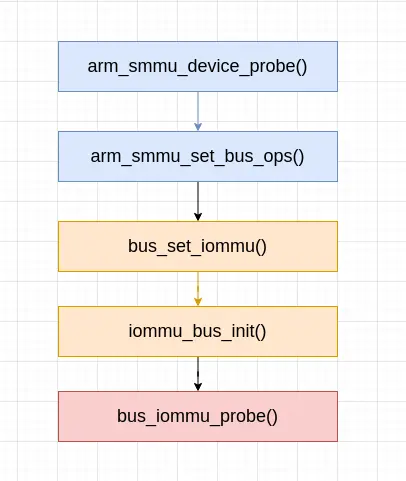
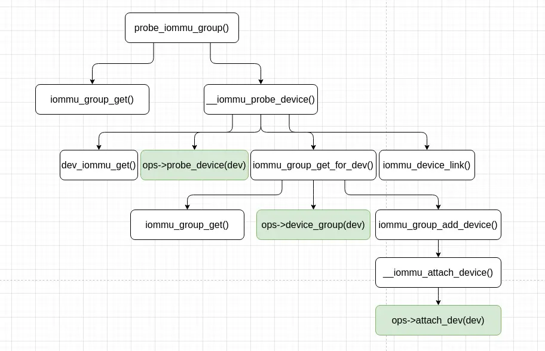
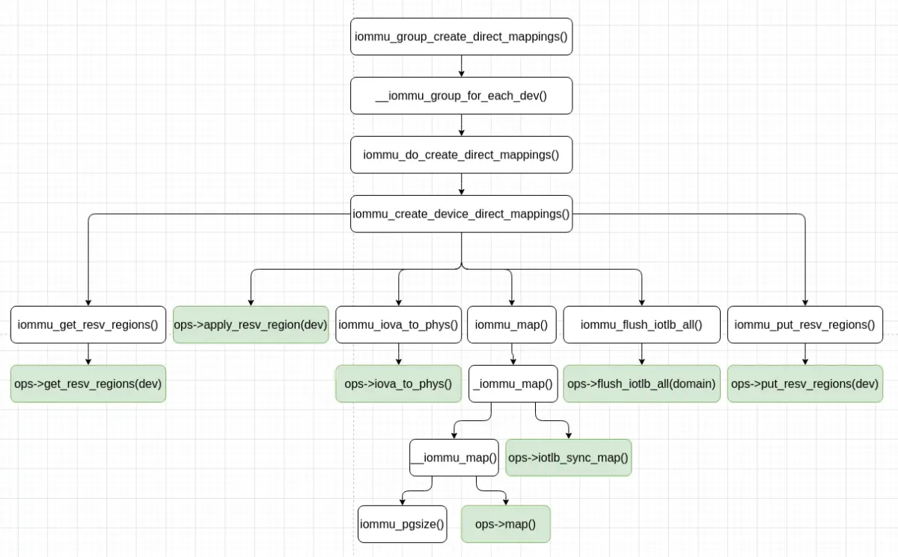
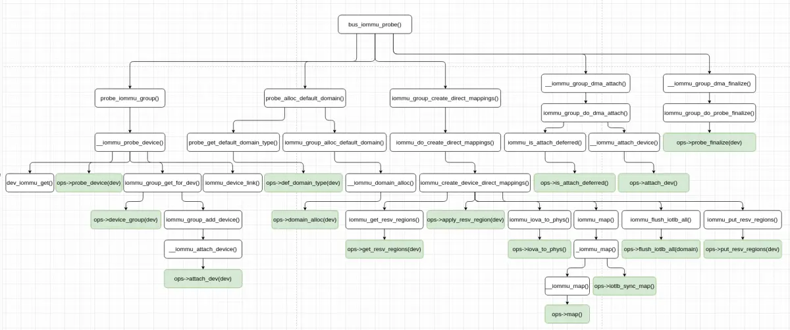
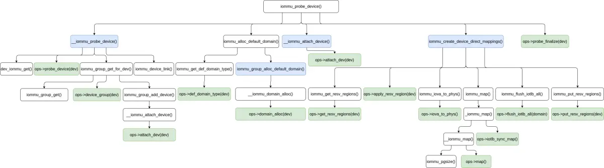
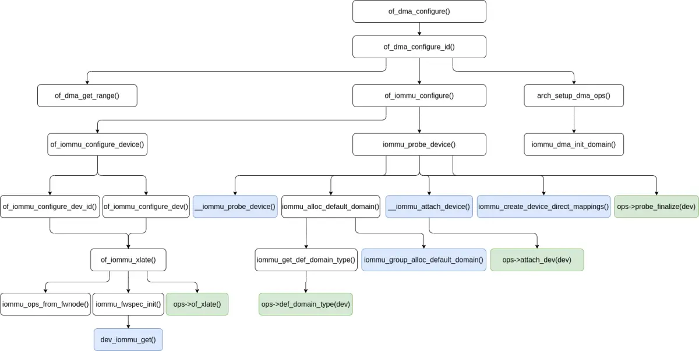
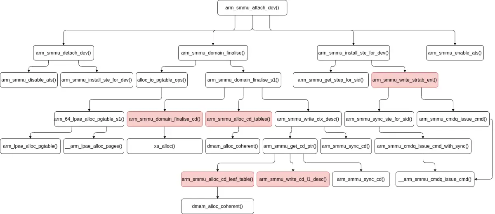

## SMMU 驱动中的系统 I/O 设备探测

要使系统 I/O 设备的 DMA 内存访问能通过 IOMMU，需要将系统 I/O 设备和 IOMMU 设备绑定起来，也就是执行 SMMU 驱动中的系统 I/O 设备探测。总线发现系统 I/O 设备并和对应的驱动程序绑定，与 IOMMU 设备驱动程序注册并为 IOMMU 设备执行探测初始化的相对顺序不固定，可能系统 I/O 设备先被发现并和对应的驱动程序绑定，也可能 IOMMU 设备驱动程序注册及为 IOMMU 设备执行探测初始化先进行。

SMMU 驱动中的系统 I/O 设备探测有两个时机：

1. 如果系统 I/O 设备发现并和对应的驱动程序绑定先执行，在为 IOMMU 设备执行探测初始化时，调用 `bus_set_iommu()` 函数为总线类型设置 IOMMU 回调，此时会遍历总线类型上已经发现的设备列表，并尝试执行 SMMU 驱动中的系统 I/O 设备探测及连接。

2. 如果为 IOMMU 设备执行探测初始化先进行，则总线在发现及添加设备，并和对应的设备驱动程序绑定时，调用 `of_dma_configure()` 之类的函数尝试执行 SMMU 驱动中的系统 I/O 设备探测。

### SMMUv3 设备驱动程序 `probe` 时执行系统 I/O 设备的 IOMMU 探测

SMMUv3 设备驱动程序 `probe` 时，通过如下这样的调用链：



一路调到 `bus_iommu_probe()` 函数，`bus_iommu_probe()` 函数执行对总线类型上已经添加的系统 I/O 设备的探测。`bus_iommu_probe()` 函数定义 (位于 *drivers/iommu/iommu.c* 文件中) 如下：
```
int bus_iommu_probe(struct bus_type *bus)
{
	struct iommu_group *group, *next;
	LIST_HEAD(group_list);
	int ret;

	/*
	 * This code-path does not allocate the default domain when
	 * creating the iommu group, so do it after the groups are
	 * created.
	 */
	ret = bus_for_each_dev(bus, NULL, &group_list, probe_iommu_group);
	if (ret)
		return ret;

	list_for_each_entry_safe(group, next, &group_list, entry) {
		/* Remove item from the list */
		list_del_init(&group->entry);

		mutex_lock(&group->mutex);

		/* Try to allocate default domain */
		probe_alloc_default_domain(bus, group);

		if (!group->default_domain) {
			mutex_unlock(&group->mutex);
			continue;
		}

		iommu_group_create_direct_mappings(group);

		ret = __iommu_group_dma_attach(group);

		mutex_unlock(&group->mutex);

		if (ret)
			break;

		__iommu_group_dma_finalize(group);
	}

	return ret;
}
```

`bus_iommu_probe()` 函数主要做了这样一些事情：

1. 遍历总线类型上的所有设备，针对每个设备执行 IOMMU 探测，获得或创建每个设备的 `struct iommu_group`，这些 `struct iommu_group` 放进一个链表中，由一个传出参数返回。各个设备的 IOMMU 探测主要由 `probe_iommu_group()` 函数完成。

2. 遍历前 1 步中找到的所有 `struct iommu_group`，针对其中的每一个执行：
     * 将其从 `struct iommu_group` 链表中移除；
     * 为 IOMMU group 分配默认的 domain，这主要通过 `probe_alloc_default_domain()` 函数完成；
     * 为 IOMMU group 分配默认的 domain 失败，则检查下一个 `struct iommu_group`，否则继续执行；
     * 创建设备直接映射，这主要通过 `iommu_group_create_direct_mappings()` 函数完成；
     * 连接设备和 IOMMU domain，这主要通过 `__iommu_group_dma_attach()` 函数完成；
     * 完成系统 I/O 设备的 IOMMU 探测，这主要通过 `__iommu_group_dma_finalize()` 函数完成。

`probe_iommu_group()` 函数为每个系统 I/O 设备执行 IOMMU 探测，该函数定义 (位于 *drivers/iommu/iommu.c* 文件中) 如下：
```
static struct dev_iommu *dev_iommu_get(struct device *dev)
{
	struct dev_iommu *param = dev->iommu;

	if (param)
		return param;

	param = kzalloc(sizeof(*param), GFP_KERNEL);
	if (!param)
		return NULL;

	mutex_init(&param->lock);
	dev->iommu = param;
	return param;
}

static void dev_iommu_free(struct device *dev)
{
	struct dev_iommu *param = dev->iommu;

	dev->iommu = NULL;
	if (param->fwspec) {
		fwnode_handle_put(param->fwspec->iommu_fwnode);
		kfree(param->fwspec);
	}
	kfree(param);
}

static int __iommu_probe_device(struct device *dev, struct list_head *group_list)
{
	const struct iommu_ops *ops = dev->bus->iommu_ops;
	struct iommu_device *iommu_dev;
	struct iommu_group *group;
	int ret;

	if (!ops)
		return -ENODEV;

	if (!dev_iommu_get(dev))
		return -ENOMEM;

	if (!try_module_get(ops->owner)) {
		ret = -EINVAL;
		goto err_free;
	}

	iommu_dev = ops->probe_device(dev);
	if (IS_ERR(iommu_dev)) {
		ret = PTR_ERR(iommu_dev);
		goto out_module_put;
	}

	dev->iommu->iommu_dev = iommu_dev;

	group = iommu_group_get_for_dev(dev);
	if (IS_ERR(group)) {
		ret = PTR_ERR(group);
		goto out_release;
	}
	iommu_group_put(group);

	if (group_list && !group->default_domain && list_empty(&group->entry))
		list_add_tail(&group->entry, group_list);

	iommu_device_link(iommu_dev, dev);

	return 0;

out_release:
	ops->release_device(dev);

out_module_put:
	module_put(ops->owner);

err_free:
	dev_iommu_free(dev);

	return ret;
}
 . . . . . .
static bool iommu_is_attach_deferred(struct iommu_domain *domain,
				     struct device *dev)
{
	if (domain->ops->is_attach_deferred)
		return domain->ops->is_attach_deferred(domain, dev);

	return false;
}

/**
 * iommu_group_add_device - add a device to an iommu group
 * @group: the group into which to add the device (reference should be held)
 * @dev: the device
 *
 * This function is called by an iommu driver to add a device into a
 * group.  Adding a device increments the group reference count.
 */
int iommu_group_add_device(struct iommu_group *group, struct device *dev)
{
	int ret, i = 0;
	struct group_device *device;

	device = kzalloc(sizeof(*device), GFP_KERNEL);
	if (!device)
		return -ENOMEM;

	device->dev = dev;

	ret = sysfs_create_link(&dev->kobj, &group->kobj, "iommu_group");
	if (ret)
		goto err_free_device;

	device->name = kasprintf(GFP_KERNEL, "%s", kobject_name(&dev->kobj));
rename:
	if (!device->name) {
		ret = -ENOMEM;
		goto err_remove_link;
	}

	ret = sysfs_create_link_nowarn(group->devices_kobj,
				       &dev->kobj, device->name);
	if (ret) {
		if (ret == -EEXIST && i >= 0) {
			/*
			 * Account for the slim chance of collision
			 * and append an instance to the name.
			 */
			kfree(device->name);
			device->name = kasprintf(GFP_KERNEL, "%s.%d",
						 kobject_name(&dev->kobj), i++);
			goto rename;
		}
		goto err_free_name;
	}

	kobject_get(group->devices_kobj);

	dev->iommu_group = group;

	mutex_lock(&group->mutex);
	list_add_tail(&device->list, &group->devices);
	if (group->domain  && !iommu_is_attach_deferred(group->domain, dev))
		ret = __iommu_attach_device(group->domain, dev);
	mutex_unlock(&group->mutex);
	if (ret)
		goto err_put_group;

	/* Notify any listeners about change to group. */
	blocking_notifier_call_chain(&group->notifier,
				     IOMMU_GROUP_NOTIFY_ADD_DEVICE, dev);

	trace_add_device_to_group(group->id, dev);

	dev_info(dev, "Adding to iommu group %d\n", group->id);

	return 0;

err_put_group:
	mutex_lock(&group->mutex);
	list_del(&device->list);
	mutex_unlock(&group->mutex);
	dev->iommu_group = NULL;
	kobject_put(group->devices_kobj);
	sysfs_remove_link(group->devices_kobj, device->name);
err_free_name:
	kfree(device->name);
err_remove_link:
	sysfs_remove_link(&dev->kobj, "iommu_group");
err_free_device:
	kfree(device);
	dev_err(dev, "Failed to add to iommu group %d: %d\n", group->id, ret);
	return ret;
}
EXPORT_SYMBOL_GPL(iommu_group_add_device);
 . . . . . .
struct iommu_group *iommu_group_get(struct device *dev)
{
	struct iommu_group *group = dev->iommu_group;

	if (group)
		kobject_get(group->devices_kobj);

	return group;
}
EXPORT_SYMBOL_GPL(iommu_group_get);

/**
 * iommu_group_ref_get - Increment reference on a group
 * @group: the group to use, must not be NULL
 *
 * This function is called by iommu drivers to take additional references on an
 * existing group.  Returns the given group for convenience.
 */
struct iommu_group *iommu_group_ref_get(struct iommu_group *group)
{
	kobject_get(group->devices_kobj);
	return group;
}
EXPORT_SYMBOL_GPL(iommu_group_ref_get);

/**
 * iommu_group_put - Decrement group reference
 * @group: the group to use
 *
 * This function is called by iommu drivers and users to release the
 * iommu group.  Once the reference count is zero, the group is released.
 */
void iommu_group_put(struct iommu_group *group)
{
	if (group)
		kobject_put(group->devices_kobj);
}
EXPORT_SYMBOL_GPL(iommu_group_put);
 . . . . . .
static struct iommu_group *iommu_group_get_for_dev(struct device *dev)
{
	const struct iommu_ops *ops = dev->bus->iommu_ops;
	struct iommu_group *group;
	int ret;

	group = iommu_group_get(dev);
	if (group)
		return group;

	if (!ops)
		return ERR_PTR(-EINVAL);

	group = ops->device_group(dev);
	if (WARN_ON_ONCE(group == NULL))
		return ERR_PTR(-EINVAL);

	if (IS_ERR(group))
		return group;

	ret = iommu_group_add_device(group, dev);
	if (ret)
		goto out_put_group;

	return group;

out_put_group:
	iommu_group_put(group);

	return ERR_PTR(ret);
}
 . . . . . .
static int probe_iommu_group(struct device *dev, void *data)
{
	struct list_head *group_list = data;
	struct iommu_group *group;
	int ret;

	/* Device is probed already if in a group */
	group = iommu_group_get(dev);
	if (group) {
		iommu_group_put(group);
		return 0;
	}

	ret = __iommu_probe_device(dev, group_list);
	if (ret == -ENODEV)
		ret = 0;

	return ret;
}
 . . . . . .
static int __iommu_attach_device(struct iommu_domain *domain,
				 struct device *dev)
{
	int ret;

	if (unlikely(domain->ops->attach_dev == NULL))
		return -ENODEV;

	ret = domain->ops->attach_dev(domain, dev);
	if (!ret)
		trace_attach_device_to_domain(dev);
	return ret;
}
```

`probe_iommu_group()` 函数首先尝试从设备 (由 `struct device` 表示) 获得它的 IOMMU group，如果获得成功，就返回，否则调用 `__iommu_probe_device()` 函数为系统 I/O 设备执行 IOMMU 的探测。

`__iommu_probe_device()` 函数的主要执行过程如下：

1. 通过 `dev_iommu_get()` 获得设备 (由 `struct device` 表示) 的 `dev_iommu`。前面我们提到，在 IOMMU 子系统中，`struct dev_iommu` 对象表示一个连接到 IOMMU 的系统 I/O 设备。在 `dev_iommu_get()` 函数中，首先尝试获得设备的 `dev_iommu`，如果失败，**会为设备创建 `struct dev_iommu` 对象**。

2. 调用 IOMMU 设备驱动程序的 `probe_device()` 回调，添加设备到 IOMMU 设备驱动程序处理。SMMUv3 设备驱动程序的 `probe_device()` 回调检查设备是否与 SMMUv3 设备驱动程序匹配。`probe_device()` 回调成功时，为系统 I/O 设备返回它连接的 IOMMU 设备 (由 `struct iommu_device` 表示)，失败时返回退出。

3. 调用 `iommu_group_get_for_dev()` 函数为设备查找或创建 IOMMU group。
     * 尝试从设备获得它的 IOMMU group，如果获得成功，就返回，否则继续执行。
     * 调用 IOMMU 设备驱动程序的 `device_group()` 回调为设备查找或创建 IOMMU group，不同系统 I/O 设备间共享及创建 IOMMU group 的规则，由 IOMMU 设备驱动程序确定。
     * 将设备添加进 IOMMU group 的设备列表中。如果 IOMMU group 的 domain 已经存在，且设备不需要延迟连接，则会调用 `__iommu_attach_device()` 函数连接系统 I/O 设备和 IOMMU 设备，并会通知监听者 IOMMU group 添加了设备。

4. 将获得的 IOMMU group 添加进传入的 IOMMU group 链表中。只有 IOMMU group 是新创建的会执行这个动作。

5. 创建系统 I/O 设备和 IOMMU 设备间的链接。指示设备由给定的 IOMMU 管理。在 sysfs 中，IOMMU 设备的 “devices” 目录中将创建一个到该设备的链接，并在被链接的设备下创建一个指向 IOMMU 设备的 “IOMMU” 链接。

`probe_iommu_group()` 函数的执行过程总结如下图：



`probe_iommu_group()`/`__iommu_probe_device()` 函数为设备创建了如下对象：

 * 表示一个连接到 IOMMU 的系统 I/O 设备的 `struct dev_iommu` 对象；
 * SMMUv3 设备驱动程序内部表示系统 I/O 设备的 `struct arm_smmu_master` 对象，在 SMMUv3 设备驱动程序的 `probe_device()` 回调中；
 * IOMMU group。

`probe_alloc_default_domain()` 函数为各个 IOMMU group 分配默认的 domain，该函数定义 (位于 *drivers/iommu/iommu.c* 文件中) 如下：
```
static int __iommu_group_for_each_dev(struct iommu_group *group, void *data,
				      int (*fn)(struct device *, void *))
{
	struct group_device *device;
	int ret = 0;

	list_for_each_entry(device, &group->devices, list) {
		ret = fn(device->dev, data);
		if (ret)
			break;
	}
	return ret;
}
 . . . . . .
static int iommu_group_alloc_default_domain(struct bus_type *bus,
					    struct iommu_group *group,
					    unsigned int type)
{
	struct iommu_domain *dom;

	dom = __iommu_domain_alloc(bus, type);
	if (!dom && type != IOMMU_DOMAIN_DMA) {
		dom = __iommu_domain_alloc(bus, IOMMU_DOMAIN_DMA);
		if (dom)
			pr_warn("Failed to allocate default IOMMU domain of type %u for group %s - Falling back to IOMMU_DOMAIN_DMA",
				type, group->name);
	}

	if (!dom)
		return -ENOMEM;

	group->default_domain = dom;
	if (!group->domain)
		group->domain = dom;

	if (!iommu_dma_strict) {
		int attr = 1;
		iommu_domain_set_attr(dom,
				      DOMAIN_ATTR_DMA_USE_FLUSH_QUEUE,
				      &attr);
	}

	return 0;
}
 . . . . . .
static int probe_get_default_domain_type(struct device *dev, void *data)
{
	const struct iommu_ops *ops = dev->bus->iommu_ops;
	struct __group_domain_type *gtype = data;
	unsigned int type = 0;

	if (ops->def_domain_type)
		type = ops->def_domain_type(dev);

	if (type) {
		if (gtype->type && gtype->type != type) {
			dev_warn(dev, "Device needs domain type %s, but device %s in the same iommu group requires type %s - using default\n",
				 iommu_domain_type_str(type),
				 dev_name(gtype->dev),
				 iommu_domain_type_str(gtype->type));
			gtype->type = 0;
		}

		if (!gtype->dev) {
			gtype->dev  = dev;
			gtype->type = type;
		}
	}

	return 0;
}

static void probe_alloc_default_domain(struct bus_type *bus,
				       struct iommu_group *group)
{
	struct __group_domain_type gtype;

	memset(&gtype, 0, sizeof(gtype));

	/* Ask for default domain requirements of all devices in the group */
	__iommu_group_for_each_dev(group, &gtype,
				   probe_get_default_domain_type);

	if (!gtype.type)
		gtype.type = iommu_def_domain_type;

	iommu_group_alloc_default_domain(bus, group, gtype.type);

}
 . . . . . .
static struct iommu_domain *__iommu_domain_alloc(struct bus_type *bus,
						 unsigned type)
{
	struct iommu_domain *domain;

	if (bus == NULL || bus->iommu_ops == NULL)
		return NULL;

	domain = bus->iommu_ops->domain_alloc(type);
	if (!domain)
		return NULL;

	domain->ops  = bus->iommu_ops;
	domain->type = type;
	/* Assume all sizes by default; the driver may override this later */
	domain->pgsize_bitmap  = bus->iommu_ops->pgsize_bitmap;
	mutex_init(&domain->switch_log_lock);

	return domain;
}
```

`probe_alloc_default_domain()` 函数：

1. 遍历 IOMMU group 中的所有系统 I/O 设备，通过 IOMMU 设备驱动程序的 `def_domain_type()` 回调为系统 I/O 设备获得默认的 domain 类型，这分为几种情况来处理：
     * IOMMU 设备驱动程序不支持为系统 I/O 设备获得默认 domain 类型的操作，或者通过 IOMMU 设备驱动程序为所有系统 I/O 设备获得的默认 domain 类型都为 0，则采用定义的全局默认 domain 类型；
     * IOMMU 设备驱动程序为部分系统 I/O 设备定义了默认 domain 类型，且所有这些系统 I/O 设备的默认 domain 类型相同，则采用这个默认的 domain 类型；
     * IOMMU 设备驱动程序为部分系统 I/O 设备定义了默认 domain 类型，但所有这些系统 I/O 设备的默认 domain 类型不完全相同，则采用定义的全局默认 domain 类型。

2. 根据获得的默认 domain 类型，通过 IOMMU 设备驱动程序的 `domain_alloc()` 回调为 IOMMU group 分配默认的 domain。如果分配传入的 domain 类型的 domain 失败，还会尝试分配 `IOMMU_DOMAIN_DMA` domain 类型的 domain。

`iommu_group_create_direct_mappings()` 函数为各个 IOMMU group 中的各个系统 I/O 设备创建直接映射，该函数定义 (位于 *drivers/iommu/iommu.c* 文件中) 如下：
```
static int iommu_create_device_direct_mappings(struct iommu_group *group,
					       struct device *dev)
{
	struct iommu_domain *domain = group->default_domain;
	struct iommu_resv_region *entry;
	struct list_head mappings;
	unsigned long pg_size;
	int ret = 0;

	if (!domain || domain->type != IOMMU_DOMAIN_DMA)
		return 0;

	BUG_ON(!domain->pgsize_bitmap);

	pg_size = 1UL << __ffs(domain->pgsize_bitmap);
	INIT_LIST_HEAD(&mappings);

	iommu_get_resv_regions(dev, &mappings);

	/* We need to consider overlapping regions for different devices */
	list_for_each_entry(entry, &mappings, list) {
		dma_addr_t start, end, addr;

		if (domain->ops->apply_resv_region)
			domain->ops->apply_resv_region(dev, domain, entry);

		start = ALIGN(entry->start, pg_size);
		end   = ALIGN(entry->start + entry->length, pg_size);

		if (entry->type != IOMMU_RESV_DIRECT &&
		    entry->type != IOMMU_RESV_DIRECT_RELAXABLE)
			continue;

		for (addr = start; addr < end; addr += pg_size) {
			phys_addr_t phys_addr;

			phys_addr = iommu_iova_to_phys(domain, addr);
			if (phys_addr)
				continue;

			ret = iommu_map(domain, addr, addr, pg_size, entry->prot);
			if (ret)
				goto out;
		}

	}

	iommu_flush_iotlb_all(domain);

out:
	iommu_put_resv_regions(dev, &mappings);

	return ret;
}
 . . . . . .
static int iommu_do_create_direct_mappings(struct device *dev, void *data)
{
	struct iommu_group *group = data;

	iommu_create_device_direct_mappings(group, dev);

	return 0;
}

static int iommu_group_create_direct_mappings(struct iommu_group *group)
{
	return __iommu_group_for_each_dev(group, group,
					  iommu_do_create_direct_mappings);
}
 . . . . . .
phys_addr_t iommu_iova_to_phys(struct iommu_domain *domain, dma_addr_t iova)
{
	if (unlikely(domain->ops->iova_to_phys == NULL))
		return 0;

	return domain->ops->iova_to_phys(domain, iova);
}
EXPORT_SYMBOL_GPL(iommu_iova_to_phys);

size_t iommu_pgsize(struct iommu_domain *domain,
		    unsigned long addr_merge, size_t size)
{
	unsigned int pgsize_idx;
	size_t pgsize;

	/* Max page size that still fits into 'size' */
	pgsize_idx = __fls(size);

	/* need to consider alignment requirements ? */
	if (likely(addr_merge)) {
		/* Max page size allowed by address */
		unsigned int align_pgsize_idx = __ffs(addr_merge);
		pgsize_idx = min(pgsize_idx, align_pgsize_idx);
	}

	/* build a mask of acceptable page sizes */
	pgsize = (1UL << (pgsize_idx + 1)) - 1;

	/* throw away page sizes not supported by the hardware */
	pgsize &= domain->pgsize_bitmap;

	/* make sure we're still sane */
	BUG_ON(!pgsize);

	/* pick the biggest page */
	pgsize_idx = __fls(pgsize);
	pgsize = 1UL << pgsize_idx;

	return pgsize;
}
EXPORT_SYMBOL_GPL(iommu_pgsize);

static int __iommu_map(struct iommu_domain *domain, unsigned long iova,
		       phys_addr_t paddr, size_t size, int prot, gfp_t gfp)
{
	const struct iommu_ops *ops = domain->ops;
	unsigned long orig_iova = iova;
	unsigned int min_pagesz;
	size_t orig_size = size;
	phys_addr_t orig_paddr = paddr;
	int ret = 0;

	if (unlikely(ops->map == NULL ||
		     domain->pgsize_bitmap == 0UL))
		return -ENODEV;

	if (unlikely(!(domain->type & __IOMMU_DOMAIN_PAGING)))
		return -EINVAL;

	/* find out the minimum page size supported */
	min_pagesz = 1 << __ffs(domain->pgsize_bitmap);

	/*
	 * both the virtual address and the physical one, as well as
	 * the size of the mapping, must be aligned (at least) to the
	 * size of the smallest page supported by the hardware
	 */
	if (!IS_ALIGNED(iova | paddr | size, min_pagesz)) {
		pr_err("unaligned: iova 0x%lx pa %pa size 0x%zx min_pagesz 0x%x\n",
		       iova, &paddr, size, min_pagesz);
		return -EINVAL;
	}

	pr_debug("map: iova 0x%lx pa %pa size 0x%zx\n", iova, &paddr, size);

	while (size) {
		size_t pgsize = iommu_pgsize(domain, iova | paddr, size);

		pr_debug("mapping: iova 0x%lx pa %pa pgsize 0x%zx\n",
			 iova, &paddr, pgsize);
		ret = ops->map(domain, iova, paddr, pgsize, prot, gfp);

		if (ret)
			break;

		iova += pgsize;
		paddr += pgsize;
		size -= pgsize;
	}

	/* unroll mapping in case something went wrong */
	if (ret)
		iommu_unmap(domain, orig_iova, orig_size - size);
	else
		trace_map(orig_iova, orig_paddr, orig_size);

	return ret;
}

static int _iommu_map(struct iommu_domain *domain, unsigned long iova,
		      phys_addr_t paddr, size_t size, int prot, gfp_t gfp)
{
	const struct iommu_ops *ops = domain->ops;
	int ret;

	ret = __iommu_map(domain, iova, paddr, size, prot, gfp);
	if (ret == 0 && ops->iotlb_sync_map)
		ops->iotlb_sync_map(domain, iova, size);

	return ret;
}

int iommu_map(struct iommu_domain *domain, unsigned long iova,
	      phys_addr_t paddr, size_t size, int prot)
{
	might_sleep();
	return _iommu_map(domain, iova, paddr, size, prot, GFP_KERNEL);
}
EXPORT_SYMBOL_GPL(iommu_map);
 . . . . . .
void iommu_get_resv_regions(struct device *dev, struct list_head *list)
{
	const struct iommu_ops *ops = dev->bus->iommu_ops;

	if (ops && ops->get_resv_regions)
		ops->get_resv_regions(dev, list);
}

void iommu_put_resv_regions(struct device *dev, struct list_head *list)
{
	const struct iommu_ops *ops = dev->bus->iommu_ops;

	if (ops && ops->put_resv_regions)
		ops->put_resv_regions(dev, list);
}
```

`iommu_group_create_direct_mappings()` 函数遍历 IOMMU group 中的各个系统 I/O 设备，通过 `iommu_do_create_direct_mappings()`/`iommu_create_device_direct_mappings()`函数为每个设备创建设备的直接映射，直接映射针对设备的保留内存区域，且 domain type 为 DMA。

`iommu_create_device_direct_mappings()` 的执行过程如下：

1. 通过 IOMMU 设备驱动程序的 `get_resv_regions()` 回调获得设备的所有保留内存映射区域，没开启 IOMMU 时，保留内存映射区域的地址是物理内存地址，开启 IOMMU 时，保留内存映射区域的地址是 IO 虚拟地址。
2. 针对设备的每个保留内存映射区域：
     * 通过 IOMMU 设备驱动程序的 `apply_resv_region()` 回调，应用保留内存映射区域；
     * 将内存映射区域的起始地址对齐到页大小；
     * 针对内存映射区域内的每个内存页：
         - 通过 IOMMU 设备驱动程序的 `iova_to_phys()` 回调获得内存页的物理地址，用于判断是否可以映射；
         - 通过 `iommu_map()`/`_iommu_map()` 函数映射一个内存页。
3. 通过 IOMMU 设备驱动程序的 `flush_iotlb_all()` 回调刷新 domain 的 IO TLB。
4. 通过 IOMMU 设备驱动程序的 `put_resv_regions()` 回调释放获得的设备的所有保留内存映射区域。

`iommu_create_device_direct_mappings()` 函数的执行过程总结如下图：



`__iommu_group_dma_attach()` 函数为各个 IOMMU group 中的各个系统 I/O 设备建立与 IOMMU 设备的连接，这个函数定义 (位于 *drivers/iommu/iommu.c* 文件中) 如下：
```
static int iommu_group_do_dma_attach(struct device *dev, void *data)
{
	struct iommu_domain *domain = data;
	int ret = 0;

	if (!iommu_is_attach_deferred(domain, dev))
		ret = __iommu_attach_device(domain, dev);

	return ret;
}

static int __iommu_group_dma_attach(struct iommu_group *group)
{
	return __iommu_group_for_each_dev(group, group->default_domain,
					  iommu_group_do_dma_attach);
}
```

`__iommu_group_dma_attach()` 函数遍历 IOMMU group 中的各个系统 I/O 设备，通过 IOMMU 设备驱动程序的 `is_attach_deferred()` 回调判断系统 I/O 设备是否需要延迟连接，如果不需要，则会调用 `__iommu_attach_device()` 函数，通过 IOMMU 设备驱动程序的 `attach_dev()` 回调连接系统 I/O 设备和 IOMMU 设备。由于前面的步骤，此时可以确保 IOMMU group 的 domain 是存在的，因而不需要像前面在将设备添加到 IOMMU group 中那样检查 domain。

`__iommu_group_dma_finalize()` 函数为各个 IOMMU group 中的各个系统 I/O 设备结束 IOMMU 探测，这个函数定义 (位于 *drivers/iommu/iommu.c* 文件中) 如下：
```
static int iommu_group_do_probe_finalize(struct device *dev, void *data)
{
	struct iommu_domain *domain = data;

	if (domain->ops->probe_finalize)
		domain->ops->probe_finalize(dev);

	return 0;
}

static void __iommu_group_dma_finalize(struct iommu_group *group)
{
	__iommu_group_for_each_dev(group, group->default_domain,
				   iommu_group_do_probe_finalize);
}
```

`__iommu_group_dma_finalize()` 函数遍历 IOMMU group 中的各个系统 I/O 设备，通过 IOMMU 设备驱动程序的 `probe_finalize()` 回调为系统 I/O 设备结束 IOMMU 探测。

SMMUv3 设备驱动程序 `probe` 时执行系统 I/O 设备的 IOMMU 探测的整体过程大概如下图所示：



### 系统 I/O 设备和其对应的驱动程序绑定时执行系统 I/O 设备的 IOMMU 探测

系统 I/O 设备和其对应的驱动程序绑定时执行系统 I/O 设备的 IOMMU 探测，入口是 `of_dma_configure()`/`of_dma_configure_id()` 函数，它们用于建立 DMA 配置。`of_dma_configure()` 函数定义 (位于 *include/linux/of_device.h* 文件中) 如下：
```
int of_dma_configure_id(struct device *dev,
		     struct device_node *np,
		     bool force_dma, const u32 *id);
static inline int of_dma_configure(struct device *dev,
				   struct device_node *np,
				   bool force_dma)
{
	return of_dma_configure_id(dev, np, force_dma, NULL);
}
```

系统 I/O 设备的 IOMMU 探测的调用链大概像下面这样：
```
[   19.147047]  iommu_probe_device+0x28/0x1c0
[   19.152700]  of_iommu_configure+0xd8/0x1e0
[   19.158358]  of_dma_configure_id+0x1c8/0x2a4
[   19.164266]  platform_dma_configure+0x20/0x90
[   19.170186]  really_probe+0xa0/0x4c0
[   19.175083]  driver_probe_device+0x58/0xc0
[   19.180657]  device_driver_attach+0xc0/0xd0
[   19.186342]  __driver_attach+0x84/0x124
[   19.191559]  bus_for_each_dev+0x70/0xd0
[   19.196795]  driver_attach+0x24/0x30
[   19.201686]  bus_add_driver+0x108/0x1fc
[   19.206928]  driver_register+0x78/0x130
[   19.212189]  __platform_driver_register+0x4c/0x60
```

`of_dma_configure_id()` 函数定义 (位于 *drivers/of/device.c* 文件中) 如下：
```
int of_dma_configure_id(struct device *dev, struct device_node *np,
			bool force_dma, const u32 *id)
{
	const struct iommu_ops *iommu;
	const struct bus_dma_region *map = NULL;
	u64 dma_start = 0;
	u64 mask, end, size = 0;
	bool coherent;
	int ret;

	ret = of_dma_get_range(np, &map);
	if (ret < 0) {
		/*
		 * For legacy reasons, we have to assume some devices need
		 * DMA configuration regardless of whether "dma-ranges" is
		 * correctly specified or not.
		 */
		if (!force_dma)
			return ret == -ENODEV ? 0 : ret;
	} else {
		const struct bus_dma_region *r = map;
		u64 dma_end = 0;

		/* Determine the overall bounds of all DMA regions */
		for (dma_start = ~0; r->size; r++) {
			/* Take lower and upper limits */
			if (r->dma_start < dma_start)
				dma_start = r->dma_start;
			if (r->dma_start + r->size > dma_end)
				dma_end = r->dma_start + r->size;
		}
		size = dma_end - dma_start;

		/*
		 * Add a work around to treat the size as mask + 1 in case
		 * it is defined in DT as a mask.
		 */
		if (size & 1) {
			dev_warn(dev, "Invalid size 0x%llx for dma-range(s)\n",
				 size);
			size = size + 1;
		}

		if (!size) {
			dev_err(dev, "Adjusted size 0x%llx invalid\n", size);
			kfree(map);
			return -EINVAL;
		}
	}

	/*
	 * If @dev is expected to be DMA-capable then the bus code that created
	 * it should have initialised its dma_mask pointer by this point. For
	 * now, we'll continue the legacy behaviour of coercing it to the
	 * coherent mask if not, but we'll no longer do so quietly.
	 */
	if (!dev->dma_mask) {
		dev_warn(dev, "DMA mask not set\n");
		dev->dma_mask = &dev->coherent_dma_mask;
	}

	if (!size && dev->coherent_dma_mask)
		size = max(dev->coherent_dma_mask, dev->coherent_dma_mask + 1);
	else if (!size)
		size = 1ULL << 32;

	/*
	 * Limit coherent and dma mask based on size and default mask
	 * set by the driver.
	 */
	end = dma_start + size - 1;
	mask = DMA_BIT_MASK(ilog2(end) + 1);
	dev->coherent_dma_mask &= mask;
	*dev->dma_mask &= mask;
	/* ...but only set bus limit and range map if we found valid dma-ranges earlier */
	if (!ret) {
		dev->bus_dma_limit = end;
		dev->dma_range_map = map;
	}

	coherent = of_dma_is_coherent(np);
	dev_dbg(dev, "device is%sdma coherent\n",
		coherent ? " " : " not ");

	iommu = of_iommu_configure(dev, np, id);
	if (PTR_ERR(iommu) == -EPROBE_DEFER) {
		/* Don't touch range map if it wasn't set from a valid dma-ranges */
		if (!ret)
			dev->dma_range_map = NULL;
		kfree(map);
		return -EPROBE_DEFER;
	}

	dev_dbg(dev, "device is%sbehind an iommu\n",
		iommu ? " " : " not ");

	arch_setup_dma_ops(dev, dma_start, size, iommu, coherent);

	return 0;
}
EXPORT_SYMBOL_GPL(of_dma_configure_id);
```

`of_dma_configure_id()` 函数做了如下几件事情：

1. 调用 `of_dma_get_range()` 函数获得设备的 DMA 范围信息，并把它们放进一个 map 数组中。设备的 DMA 范围信息在设备树文件中，由设备节点的 "dma-ranges" 属性定义，像下面 (位于 *arch/arm64/boot/dts/apm/apm-storm.dtsi* 文件中) 这样：
```
		pcie0: pcie@1f2b0000 {
 . . . . . .
			dma-ranges = <0x42000000 0x80 0x00000000 0x80 0x00000000 0x00 0x80000000
				      0x42000000 0x00 0x00000000 0x00 0x00000000 0x80 0x00000000>;
 . . . . . .
		};
```

`of_dma_get_range()` 函数定义 (位于 *drivers/of/address.c* 文件中) 如下：
```
#ifdef CONFIG_HAS_DMA
/**
 * of_dma_get_range - Get DMA range info and put it into a map array
 * @np:		device node to get DMA range info
 * @map:	dma range structure to return
 *
 * Look in bottom up direction for the first "dma-ranges" property
 * and parse it.  Put the information into a DMA offset map array.
 *
 * dma-ranges format:
 *	DMA addr (dma_addr)	: naddr cells
 *	CPU addr (phys_addr_t)	: pna cells
 *	size			: nsize cells
 *
 * It returns -ENODEV if "dma-ranges" property was not found for this
 * device in the DT.
 */
int of_dma_get_range(struct device_node *np, const struct bus_dma_region **map)
{
	struct device_node *node = of_node_get(np);
	const __be32 *ranges = NULL;
	bool found_dma_ranges = false;
	struct of_range_parser parser;
	struct of_range range;
	struct bus_dma_region *r;
	int len, num_ranges = 0;
	int ret = 0;

	while (node) {
		ranges = of_get_property(node, "dma-ranges", &len);

		/* Ignore empty ranges, they imply no translation required */
		if (ranges && len > 0)
			break;

		/* Once we find 'dma-ranges', then a missing one is an error */
		if (found_dma_ranges && !ranges) {
			ret = -ENODEV;
			goto out;
		}
		found_dma_ranges = true;

		node = of_get_next_dma_parent(node);
	}

	if (!node || !ranges) {
		pr_debug("no dma-ranges found for node(%pOF)\n", np);
		ret = -ENODEV;
		goto out;
	}

	of_dma_range_parser_init(&parser, node);
	for_each_of_range(&parser, &range)
		num_ranges++;

	r = kcalloc(num_ranges + 1, sizeof(*r), GFP_KERNEL);
	if (!r) {
		ret = -ENOMEM;
		goto out;
	}

	/*
	 * Record all info in the generic DMA ranges array for struct device.
	 */
	*map = r;
	of_dma_range_parser_init(&parser, node);
	for_each_of_range(&parser, &range) {
		pr_debug("dma_addr(%llx) cpu_addr(%llx) size(%llx)\n",
			 range.bus_addr, range.cpu_addr, range.size);
		if (range.cpu_addr == OF_BAD_ADDR) {
			pr_err("translation of DMA address(%llx) to CPU address failed node(%pOF)\n",
			       range.bus_addr, node);
			continue;
		}
		r->cpu_start = range.cpu_addr;
		r->dma_start = range.bus_addr;
		r->size = range.size;
		r->offset = range.cpu_addr - range.bus_addr;
		r++;
	}
out:
	of_node_put(node);
	return ret;
}
#endif /* CONFIG_HAS_DMA */
```

2. 计算所有 DMA 区域整体的边界和大小。
3. 初始化设备的 `dma_mask`，及总线 DMA 限制。
4. 调用 `of_iommu_configure()` 函数为设备执行 IOMMU 配置。
5. 调用 `arch_setup_dma_ops()` 函数为设备设置 DMA 操作回调。

`of_iommu_configure()` 函数定义 (位于 *drivers/iommu/of_iommu.c* 文件中) 如下：
```
static int of_iommu_xlate(struct device *dev,
			  struct of_phandle_args *iommu_spec)
{
	const struct iommu_ops *ops;
	struct fwnode_handle *fwnode = &iommu_spec->np->fwnode;
	int ret;

	ops = iommu_ops_from_fwnode(fwnode);
	if ((ops && !ops->of_xlate) ||
	    !of_device_is_available(iommu_spec->np))
		return NO_IOMMU;

	ret = iommu_fwspec_init(dev, &iommu_spec->np->fwnode, ops);
	if (ret)
		return ret;
	/*
	 * The otherwise-empty fwspec handily serves to indicate the specific
	 * IOMMU device we're waiting for, which will be useful if we ever get
	 * a proper probe-ordering dependency mechanism in future.
	 */
	if (!ops)
		return driver_deferred_probe_check_state(dev);

	if (!try_module_get(ops->owner))
		return -ENODEV;

	ret = ops->of_xlate(dev, iommu_spec);
	module_put(ops->owner);
	return ret;
}

static int of_iommu_configure_dev_id(struct device_node *master_np,
				     struct device *dev,
				     const u32 *id)
{
	struct of_phandle_args iommu_spec = { .args_count = 1 };
	int err;

	err = of_map_id(master_np, *id, "iommu-map",
			 "iommu-map-mask", &iommu_spec.np,
			 iommu_spec.args);
	if (err)
		return err == -ENODEV ? NO_IOMMU : err;

	err = of_iommu_xlate(dev, &iommu_spec);
	of_node_put(iommu_spec.np);
	return err;
}

static int of_iommu_configure_dev(struct device_node *master_np,
				  struct device *dev)
{
	struct of_phandle_args iommu_spec;
	int err = NO_IOMMU, idx = 0;

	while (!of_parse_phandle_with_args(master_np, "iommus",
					   "#iommu-cells",
					   idx, &iommu_spec)) {
		err = of_iommu_xlate(dev, &iommu_spec);
		of_node_put(iommu_spec.np);
		idx++;
		if (err)
			break;
	}

	return err;
}
 . . . . . .
static int of_iommu_configure_device(struct device_node *master_np,
				     struct device *dev, const u32 *id)
{
	return (id) ? of_iommu_configure_dev_id(master_np, dev, id) :
		      of_iommu_configure_dev(master_np, dev);
}
 . . . . . .
const struct iommu_ops *of_iommu_configure(struct device *dev,
					   struct device_node *master_np,
					   const u32 *id)
{
	const struct iommu_ops *ops = NULL;
	struct iommu_fwspec *fwspec = dev_iommu_fwspec_get(dev);
	int err = NO_IOMMU;

	if (!master_np)
		return NULL;

	if (fwspec) {
		if (fwspec->ops)
			return fwspec->ops;

		/* In the deferred case, start again from scratch */
		iommu_fwspec_free(dev);
	}

	/*
	 * We don't currently walk up the tree looking for a parent IOMMU.
	 * See the `Notes:' section of
	 * Documentation/devicetree/bindings/iommu/iommu.txt
	 */
	if (dev_is_pci(dev)) {
		struct of_pci_iommu_alias_info info = {
			.dev = dev,
			.np = master_np,
		};

		pci_request_acs();
		err = pci_for_each_dma_alias(to_pci_dev(dev),
					     of_pci_iommu_init, &info);
		of_pci_check_device_ats(dev, master_np);

	} else {
		err = of_iommu_configure_device(master_np, dev, id);
	}

	/*
	 * Two success conditions can be represented by non-negative err here:
	 * >0 : there is no IOMMU, or one was unavailable for non-fatal reasons
	 *  0 : we found an IOMMU, and dev->fwspec is initialised appropriately
	 * <0 : any actual error
	 */
	if (!err) {
		/* The fwspec pointer changed, read it again */
		fwspec = dev_iommu_fwspec_get(dev);
		ops    = fwspec->ops;
	}
	/*
	 * If we have reason to believe the IOMMU driver missed the initial
	 * probe for dev, replay it to get things in order.
	 */
	if (!err && dev->bus && !device_iommu_mapped(dev))
		err = iommu_probe_device(dev);

	/* Ignore all other errors apart from EPROBE_DEFER */
	if (err == -EPROBE_DEFER) {
		ops = ERR_PTR(err);
	} else if (err < 0) {
		dev_dbg(dev, "Adding to IOMMU failed: %d\n", err);
		ops = NULL;
	}

	return ops;
}
```

这里主要关注非 PCIe 设备的情况。`struct iommu_fwspec` 对象包含每设备的 IOMMU 实例数据。`of_iommu_configure()` 函数执行过程如下：

1. 尝试从系统 I/O 设备获得它的 `struct iommu_fwspec` 对象。`dev_iommu_fwspec_get(dev)` 函数定义 (位于 *include/linux/iommu.h* 文件中) 如下：
```
static inline struct iommu_fwspec *dev_iommu_fwspec_get(struct device *dev)
{
	if (dev->iommu)
		return dev->iommu->fwspec;
	else
		return NULL;
}

static inline void dev_iommu_fwspec_set(struct device *dev,
					struct iommu_fwspec *fwspec)
{
	dev->iommu->fwspec = fwspec;
}
```
`dev_iommu_fwspec_get(dev)` 函数通过系统 I/O 设备的 `struct dev_iommu *iommu` 获得其 `struct iommu_fwspec` 对象，但系统 I/O 设备的 `struct dev_iommu *iommu` 在 IOMMU 配置设备时，或系统 I/O 设备的 IOMMU 探测时创建。如果这里成功获得了系统 I/O 设备的 `struct iommu_fwspec` 对象，且其 IOMMU 回调有效，则直接返回其 IOMMU 回调。为系统 I/O 设备调用 `of_dma_configure_id()` 函数时，已经对系统 I/O 设备执行过了 IOMMU 初始化时，会发生这种情况。如果这里成功获得了系统 I/O 设备的 `struct iommu_fwspec` 对象，但其 IOMMU 回调无效，`struct iommu_fwspec` 对象会被先释放掉。

2. 通过 `of_iommu_configure_device()` 函数，从设备树的设备节点中获得它连接的 IOMMU 设备的句柄，并为系统 I/O 设备调用 `of_iommu_xlate()` 函数执行 iommu xlate 操作。`of_iommu_xlate()` 函数执行过程如下：
     - 在 IOMMU 子系统的所有 IOMMU 设备列表中查找与获得的 IOMMU 设备句柄匹配的 IOMMU 设备的 IOMMU 回调。这通过 `iommu_ops_from_fwnode()` 函数完成。
     - 调用 `iommu_fwspec_init()` 函数为设备创建 `struct iommu_fwspec` 对象。当系统 I/O 设备的 dev_iommu 不存在时，`iommu_fwspec_init()` 函数会创建它。
     - 通过找到的 IOMMU 设备的 IOMMU 设备驱动程序的 `of_xlate()` 回调，将 OF master ID 添加到 IOMMU 组。

`iommu_ops_from_fwnode()` 函数和 `iommu_fwspec_init()` 函数定义 (位于 *drivers/iommu/iommu.c* 文件中) 如下：
```
const struct iommu_ops *iommu_ops_from_fwnode(struct fwnode_handle *fwnode)
{
	const struct iommu_ops *ops = NULL;
	struct iommu_device *iommu;

	spin_lock(&iommu_device_lock);
	list_for_each_entry(iommu, &iommu_device_list, list)
		if (iommu->fwnode == fwnode) {
			ops = iommu->ops;
			break;
		}
	spin_unlock(&iommu_device_lock);
	return ops;
}

int iommu_fwspec_init(struct device *dev, struct fwnode_handle *iommu_fwnode,
		      const struct iommu_ops *ops)
{
	struct iommu_fwspec *fwspec = dev_iommu_fwspec_get(dev);

	if (fwspec)
		return ops == fwspec->ops ? 0 : -EINVAL;

	if (!dev_iommu_get(dev))
		return -ENOMEM;

	/* Preallocate for the overwhelmingly common case of 1 ID */
	fwspec = kzalloc(struct_size(fwspec, ids, 1), GFP_KERNEL);
	if (!fwspec)
		return -ENOMEM;

	of_node_get(to_of_node(iommu_fwnode));
	fwspec->iommu_fwnode = iommu_fwnode;
	fwspec->ops = ops;
	dev_iommu_fwspec_set(dev, fwspec);
	return 0;
}
EXPORT_SYMBOL_GPL(iommu_fwspec_init);
```

3. 通过 `iommu_probe_device()` 函数执行系统 I/O 设备的 IOMMU 探测。

`iommu_probe_device()` 函数与 `bus_iommu_probe()` 函数做的事情类似，差别在于前者针对单个系统 I/O 设备，后者则针对总线类型上存在的许多系统 I/O 设备。`iommu_probe_device()` 函数定义 (位于 *drivers/iommu/iommu.c* 文件中) 如下：
```
int iommu_probe_device(struct device *dev)
{
	const struct iommu_ops *ops = dev->bus->iommu_ops;
	struct iommu_group *group;
	int ret;

	ret = __iommu_probe_device(dev, NULL);
	if (ret)
		goto err_out;

	group = iommu_group_get(dev);
	if (!group)
		goto err_release;

	/*
	 * Try to allocate a default domain - needs support from the
	 * IOMMU driver. There are still some drivers which don't
	 * support default domains, so the return value is not yet
	 * checked.
	 */
	iommu_alloc_default_domain(group, dev);

	if (group->default_domain) {
		ret = __iommu_attach_device(group->default_domain, dev);
		if (ret) {
			iommu_group_put(group);
			goto err_release;
		}
	}

	iommu_create_device_direct_mappings(group, dev);

	iommu_group_put(group);

	if (ops->probe_finalize)
		ops->probe_finalize(dev);

	return 0;

err_release:
	iommu_release_device(dev);

err_out:
	return ret;

}
 . . . . . .
static int iommu_get_def_domain_type(struct device *dev)
{
	const struct iommu_ops *ops = dev->bus->iommu_ops;
	unsigned int type = 0;

	if (ops->def_domain_type)
		type = ops->def_domain_type(dev);

	return (type == 0) ? iommu_def_domain_type : type;
}
 . . . . . .
static int iommu_alloc_default_domain(struct iommu_group *group,
				      struct device *dev)
{
	unsigned int type;

	if (group->default_domain)
		return 0;

	type = iommu_get_def_domain_type(dev);

	return iommu_group_alloc_default_domain(dev->bus, group, type);
}
```

`iommu_probe_device()` 函数主要做了这样一些事情：

1. 通过 `__iommu_probe_device()` 函数为系统 I/O 设备执行 IOMMU 探测，获得或创建设备的 `struct iommu_group`。

2. 为 IOMMU group 分配默认的 domain，这主要通过 `iommu_alloc_default_domain()` 函数完成。`iommu_alloc_default_domain()` 函数首先通过 `iommu_get_def_domain_type()` 函数获得系统 I/O 设备默认的 domain 的类型，然后通过 `iommu_group_alloc_default_domain()` 函数分配默认的 domain。

3. 连接系统 I/O 设备和 IOMMU domain，这主要通过 `__iommu_attach_device()` 函数完成。

4. 创建设备直接映射，这主要通过 `iommu_create_device_direct_mappings()` 函数完成。

5. 完成系统 I/O 设备的 IOMMU 探测，这主要通过 IOMMU 设备驱动程序提供的 `probe_finalize()` 回调完成。

`iommu_probe_device()` 函数整体的执行过程大概如下图所示：



`of_dma_configure()`/`of_dma_configure_id()` 函数整体的执行过程 (`iommu_probe_device()` 函数的部分调用关系简略表示) 大概如下图所示：



### SMMUv3 设备驱动程序中的系统 I/O 设备探测

如上所述，系统 I/O 设备的 IOMMU 探测过程中，有多个 SMMUv3 设备驱动程序提供的 IOMMU 回调，出于不同的目的被调用。系统 I/O 设备的 IOMMU 探测过程可以分为几个阶段，每个阶段会有不同的 SMMUv3 设备驱动程序 IOMMU 回调被调用：

1. OF IOMMU 配置设备，`struct iommu_fwspec` 对象创建及初始化：
     - **of_xlate()**/**arm_smmu_of_xlate()**

2. IOMMU 探测设备：
     - **probe_device()**/**arm_smmu_probe_device()**
     - **device_group()**/**arm_smmu_device_group()**

3. 分配默认的 domain：
     - **def_domain_type()**/**arm_smmu_device_domain_type()**
     - **domain_alloc()**/**arm_smmu_domain_alloc()**

4. 连接系统 I/O 设备和 SMMUv3 设备：
     - **attach_dev()**/**arm_smmu_attach_dev()**

5. 创建设备直接区域映射：
     - **get_resv_regions()**/**arm_smmu_get_resv_regions()**
     - **apply_resv_region()**/**\***，SMMUv3 设备驱动程序未实现
     - **iova_to_phys()**/**arm_smmu_iova_to_phys()**
     - **map()**/**arm_smmu_map()**
     - **iotlb_sync_map()**/**\***，SMMUv3 设备驱动程序未实现
     - **flush_iotlb_all()**/**arm_smmu_flush_iotlb_all()**
     - **put_resv_regions()**/**generic_iommu_put_resv_regions()**

6. 结束系统 I/O 设备的 IOMMU 探测：
     - **probe_finalize()**/**\***，SMMUv3 设备驱动程序未实现

SMMUv3 设备驱动程序定义的所有 IOMMU 回调都位于 *drivers/iommu/arm/arm-smmu-v3/arm-smmu-v3.c* 文件中。

SMMUv3 设备驱动程序的 `of_xlate()` 回调 `arm_smmu_of_xlate()` 将从设备树文件中解析获得的系统 I/O 设备的 StreamID 添加进它的 `struct iommu_fwspec` 对象，这个函数定义如下：
```
static int arm_smmu_of_xlate(struct device *dev, struct of_phandle_args *args)
{
	return iommu_fwspec_add_ids(dev, args->args, 1);
}
```

`arm_smmu_of_xlate()` 函数调用 `iommu_fwspec_add_ids()` 函数添加 1 个 StreamID。`iommu_fwspec_add_ids()` 函数定义 (位于 *drivers/iommu/iommu.c* 文件中) 如下：
```
int iommu_fwspec_add_ids(struct device *dev, u32 *ids, int num_ids)
{
	struct iommu_fwspec *fwspec = dev_iommu_fwspec_get(dev);
	int i, new_num;

	if (!fwspec)
		return -EINVAL;

	new_num = fwspec->num_ids + num_ids;
	if (new_num > 1) {
		fwspec = krealloc(fwspec, struct_size(fwspec, ids, new_num),
				  GFP_KERNEL);
		if (!fwspec)
			return -ENOMEM;

		dev_iommu_fwspec_set(dev, fwspec);
	}

	for (i = 0; i < num_ids; i++)
		fwspec->ids[fwspec->num_ids + i] = ids[i];

	fwspec->num_ids = new_num;
	return 0;
}
EXPORT_SYMBOL_GPL(iommu_fwspec_add_ids);
```

`iommu_fwspec_add_ids()` 函数确保 `struct iommu_fwspec` 对象中有足够的空间来存放要添加的 StreamID，如果空间不足，会先重新分配并初始化 `struct iommu_fwspec` 对象，之后将要添加的 StreamID 放进 `struct iommu_fwspec` 对象。

在 IOMMU 探测设备阶段，SMMUv3 设备驱动程序的 `probe_device()` 回调 `arm_smmu_probe_device()` 执行系统 I/O 设备的 IOMMU 探测。这个函数定义如下：：
```
static void
arm_smmu_write_strtab_l1_desc(__le64 *dst, struct arm_smmu_strtab_l1_desc *desc)
{
	u64 val = 0;

	val |= FIELD_PREP(STRTAB_L1_DESC_SPAN, desc->span);
	val |= desc->l2ptr_dma & STRTAB_L1_DESC_L2PTR_MASK;

	/* See comment in arm_smmu_write_ctx_desc() */
	WRITE_ONCE(*dst, cpu_to_le64(val));
}
 . . . . . .
static void arm_smmu_init_bypass_stes(__le64 *strtab, unsigned int nent)
{
	unsigned int i;

	for (i = 0; i < nent; ++i) {
		arm_smmu_write_strtab_ent(NULL, -1, strtab);
		strtab += STRTAB_STE_DWORDS;
	}
}

static int arm_smmu_init_l2_strtab(struct arm_smmu_device *smmu, u32 sid)
{
	size_t size;
	void *strtab;
	struct arm_smmu_strtab_cfg *cfg = &smmu->strtab_cfg;
	struct arm_smmu_strtab_l1_desc *desc = &cfg->l1_desc[sid >> STRTAB_SPLIT];

	if (desc->l2ptr)
		return 0;

	size = 1 << (STRTAB_SPLIT + ilog2(STRTAB_STE_DWORDS) + 3);
	strtab = &cfg->strtab[(sid >> STRTAB_SPLIT) * STRTAB_L1_DESC_DWORDS];

	desc->span = STRTAB_SPLIT + 1;
	desc->l2ptr = dmam_alloc_coherent(smmu->dev, size, &desc->l2ptr_dma,
					  GFP_KERNEL);
	if (!desc->l2ptr) {
		dev_err(smmu->dev,
			"failed to allocate l2 stream table for SID %u\n",
			sid);
		return -ENOMEM;
	}

	arm_smmu_init_bypass_stes(desc->l2ptr, 1 << STRTAB_SPLIT);
	arm_smmu_write_strtab_l1_desc(strtab, desc);
	return 0;
}
 . . . . . .
static bool arm_smmu_sid_in_range(struct arm_smmu_device *smmu, u32 sid)
{
	unsigned long limit = smmu->strtab_cfg.num_l1_ents;

	if (smmu->features & ARM_SMMU_FEAT_2_LVL_STRTAB)
		limit *= 1UL << STRTAB_SPLIT;

	return sid < limit;
}

static int arm_smmu_insert_master(struct arm_smmu_device *smmu,
				  struct arm_smmu_master *master)
{
	int i;
	int ret = 0;
	struct arm_smmu_stream *new_stream, *cur_stream;
	struct rb_node **new_node, *parent_node = NULL;
	struct iommu_fwspec *fwspec = dev_iommu_fwspec_get(master->dev);

	master->streams = kcalloc(fwspec->num_ids, sizeof(*master->streams),
				  GFP_KERNEL);
	if (!master->streams)
		return -ENOMEM;
	master->num_streams = fwspec->num_ids;

	mutex_lock(&smmu->streams_mutex);
	for (i = 0; i < fwspec->num_ids; i++) {
		u32 sid = fwspec->ids[i];

		new_stream = &master->streams[i];
		new_stream->id = sid;
		new_stream->master = master;

		/*
		 * Check the SIDs are in range of the SMMU and our stream table
		 */
		if (!arm_smmu_sid_in_range(smmu, sid)) {
			ret = -ERANGE;
			break;
		}

		/* Ensure l2 strtab is initialised */
		if (smmu->features & ARM_SMMU_FEAT_2_LVL_STRTAB) {
			ret = arm_smmu_init_l2_strtab(smmu, sid);
			if (ret)
				break;
		}

		/* Insert into SID tree */
		new_node = &(smmu->streams.rb_node);
		while (*new_node) {
			cur_stream = rb_entry(*new_node, struct arm_smmu_stream,
					      node);
			parent_node = *new_node;
			if (cur_stream->id > new_stream->id) {
				new_node = &((*new_node)->rb_left);
			} else if (cur_stream->id < new_stream->id) {
				new_node = &((*new_node)->rb_right);
			} else {
				dev_warn(master->dev,
					 "stream %u already in tree\n",
					 cur_stream->id);
				ret = -EINVAL;
				break;
			}
		}
		if (ret)
			break;

		rb_link_node(&new_stream->node, parent_node, new_node);
		rb_insert_color(&new_stream->node, &smmu->streams);
	}

	if (ret) {
		for (i--; i >= 0; i--)
			rb_erase(&master->streams[i].node, &smmu->streams);
		kfree(master->streams);
	}
	mutex_unlock(&smmu->streams_mutex);

	return ret;
}
 . . . . . .
static struct iommu_ops arm_smmu_ops;

static struct iommu_device *arm_smmu_probe_device(struct device *dev)
{
	int ret;
	struct arm_smmu_device *smmu;
	struct arm_smmu_master *master;
	struct iommu_fwspec *fwspec = dev_iommu_fwspec_get(dev);

	if (!fwspec || fwspec->ops != &arm_smmu_ops)
		return ERR_PTR(-ENODEV);

	if (WARN_ON_ONCE(dev_iommu_priv_get(dev)))
		return ERR_PTR(-EBUSY);

	smmu = arm_smmu_get_by_fwnode(fwspec->iommu_fwnode);
	if (!smmu)
		return ERR_PTR(-ENODEV);

	master = kzalloc(sizeof(*master), GFP_KERNEL);
	if (!master)
		return ERR_PTR(-ENOMEM);

	master->dev = dev;
	master->smmu = smmu;
	INIT_LIST_HEAD(&master->bonds);
	dev_iommu_priv_set(dev, master);

	ret = arm_smmu_insert_master(smmu, master);
	if (ret)
		goto err_free_master;

	device_property_read_u32(dev, "pasid-num-bits", &master->ssid_bits);
	master->ssid_bits = min(smmu->ssid_bits, master->ssid_bits);

	/*
	 * Note that PASID must be enabled before, and disabled after ATS:
	 * PCI Express Base 4.0r1.0 - 10.5.1.3 ATS Control Register
	 *
	 *   Behavior is undefined if this bit is Set and the value of the PASID
	 *   Enable, Execute Requested Enable, or Privileged Mode Requested bits
	 *   are changed.
	 */
	arm_smmu_enable_pasid(master);

	if (!(smmu->features & ARM_SMMU_FEAT_2_LVL_CDTAB))
		master->ssid_bits = min_t(u8, master->ssid_bits,
					  CTXDESC_LINEAR_CDMAX);

	if ((smmu->features & ARM_SMMU_FEAT_STALLS &&
	     device_property_read_bool(dev, "dma-can-stall")) ||
	    smmu->features & ARM_SMMU_FEAT_STALL_FORCE)
		master->stall_enabled = true;

	arm_smmu_init_pri(master);

	return &smmu->iommu;

err_free_master:
	kfree(master);
	dev_iommu_priv_set(dev, NULL);
	return ERR_PTR(ret);
}
```

`probe_device()` 回调大概做了这样一些事情：

1. 创建并初始化 `struct arm_smmu_master` 对象。`struct arm_smmu_master` 在 SMMUv3 设备驱动程序中表示一个连接到 SMMUv3 设备的系统 I/O 设备。`struct arm_smmu_master` 对象通过系统 I/O 设备的 dev_iommu 的 `priv` 字段和它连接在一起，这从 `dev_iommu_priv_get()`/`dev_iommu_priv_set()` 函数的定义 (位于 *include/linux/iommu.h* 文件中) 可以看出来：
```
static inline void *dev_iommu_priv_get(struct device *dev)
{
	if (dev->iommu)
		return dev->iommu->priv;
	else
		return NULL;
}

static inline void dev_iommu_priv_set(struct device *dev, void *priv)
{
	dev->iommu->priv = priv;
}
```

2. 调用 `arm_smmu_insert_master()` 函数为系统 I/O 设备创建流，并把这些流 SID 插入 SMMUv3 设备的 SID 树中：
     - 为流分配内存。要创建的流的数量根据系统 I/O 设备的 StreamID 的数量确定，对于大多数一般的系统 I/O 设备为 1。
     - 对于每个流：
         * 初始化流的 ID；
         * 检查流的 ID 是否在设置的 StreamID 的范围内，如果不在则检查下一个流，否则继续执行；
         * 如果使用了 2 级流表，在 `arm_smmu_init_l2_strtab()` 函数中分配并填充第 2 级流表。`arm_smmu_init_l2_strtab()` 函数调用 `arm_smmu_init_bypass_stes()` 函数将第 2 级流表中的所有流表项 STE 初始化为旁路 SMMU，并调用 `arm_smmu_write_strtab_l1_desc()` 函数将第 2 级流表的地址写入第 1 级流表中，对应的 L1 流表描述符中；
         * 将 StreamID 插入 SMMUv3 设备的 SID 树中；
     - 如果针对某个流的某个操作执行失败，则移除已经为当前系统 I/O 设备添加的所有 StreamID。

3. 从设备树文件中读取系统 I/O 设备的 SubstreamID 位长，并计算将采用的 SubstreamID 位长。

4. 启用 PASID。仅用于 PCIe 设备。

5. 不支持 2 级 CD 表时，更新 SubstreamID 位长。

6. 检查是否要为系统 I/O 设备支持 Stall 模式。

7. 初始化 PRI。仅用于 PCIe 设备。

在 IOMMU 探测设备阶段，SMMUv3 设备驱动程序的 `device_group()` 回调 `arm_smmu_device_group()` 用于为系统 I/O 设备查找或创建 IOMMU group，这个函数定义如下：
```
static struct iommu_group *arm_smmu_device_group(struct device *dev)
{
	struct iommu_group *group;

	/*
	 * We don't support devices sharing stream IDs other than PCI RID
	 * aliases, since the necessary ID-to-device lookup becomes rather
	 * impractical given a potential sparse 32-bit stream ID space.
	 */
	if (dev_is_pci(dev))
		group = pci_device_group(dev);
	else
		group = generic_device_group(dev);

	return group;
}
```

`arm_smmu_device_group()` 函数分为 PCIe 设备和其它设备来执行。IOMMU 子系统不支持设备共享 stream ID，除了 PCI RID 别名。这里主要关注非 PCIe 设备。`generic_device_group()` 函数为非 PCIe 设备分配 IOMMU group，这个函数定义 (位于 *drivers/iommu/iommu.c* 文件中) 如下：
```
struct iommu_group *iommu_group_alloc(void)
{
	struct iommu_group *group;
	int ret;

	group = kzalloc(sizeof(*group), GFP_KERNEL);
	if (!group)
		return ERR_PTR(-ENOMEM);

	group->kobj.kset = iommu_group_kset;
	mutex_init(&group->mutex);
	INIT_LIST_HEAD(&group->devices);
	INIT_LIST_HEAD(&group->entry);
	BLOCKING_INIT_NOTIFIER_HEAD(&group->notifier);

	ret = ida_simple_get(&iommu_group_ida, 0, 0, GFP_KERNEL);
	if (ret < 0) {
		kfree(group);
		return ERR_PTR(ret);
	}
	group->id = ret;

	ret = kobject_init_and_add(&group->kobj, &iommu_group_ktype,
				   NULL, "%d", group->id);
	if (ret) {
		ida_simple_remove(&iommu_group_ida, group->id);
		kobject_put(&group->kobj);
		return ERR_PTR(ret);
	}

	group->devices_kobj = kobject_create_and_add("devices", &group->kobj);
	if (!group->devices_kobj) {
		kobject_put(&group->kobj); /* triggers .release & free */
		return ERR_PTR(-ENOMEM);
	}

	/*
	 * The devices_kobj holds a reference on the group kobject, so
	 * as long as that exists so will the group.  We can therefore
	 * use the devices_kobj for reference counting.
	 */
	kobject_put(&group->kobj);

	ret = iommu_group_create_file(group,
				      &iommu_group_attr_reserved_regions);
	if (ret)
		return ERR_PTR(ret);

	ret = iommu_group_create_file(group, &iommu_group_attr_type);
	if (ret)
		return ERR_PTR(ret);

	pr_debug("Allocated group %d\n", group->id);

	return group;
}
EXPORT_SYMBOL_GPL(iommu_group_alloc);
 . . . . . .
/*
 * Generic device_group call-back function. It just allocates one
 * iommu-group per device.
 */
struct iommu_group *generic_device_group(struct device *dev)
{
	return iommu_group_alloc();
}
EXPORT_SYMBOL_GPL(generic_device_group);
```

`generic_device_group()` 函数分配一个新的 IOMMU group，它为 `struct iommu_group` 对象分配内存，初始化对象，获得 group ID，并创建 sysfs 文件。SMMUv3 设备驱动程序的 `device_group()` 回调为非 PCIe 分配新的 IOMMU group。

`def_domain_type()`/`arm_smmu_device_domain_type()` 和 `domain_alloc()`/`arm_smmu_domain_alloc()` 在分配默认的 domain 阶段配合使用，前者用于获得默认的 domain 类型，后者用于分配 domain 对象。这两个回调实现如下：
```
static struct iommu_domain *arm_smmu_domain_alloc(unsigned type)
{
	struct arm_smmu_domain *smmu_domain;

	if (type != IOMMU_DOMAIN_UNMANAGED &&
	    type != IOMMU_DOMAIN_DMA &&
	    type != IOMMU_DOMAIN_IDENTITY)
		return NULL;

	/*
	 * Allocate the domain and initialise some of its data structures.
	 * We can't really do anything meaningful until we've added a
	 * master.
	 */
	smmu_domain = kzalloc(sizeof(*smmu_domain), GFP_KERNEL);
	if (!smmu_domain)
		return NULL;

	if (type == IOMMU_DOMAIN_DMA &&
	    iommu_get_dma_cookie(&smmu_domain->domain)) {
		kfree(smmu_domain);
		return NULL;
	}

	mutex_init(&smmu_domain->init_mutex);
	INIT_LIST_HEAD(&smmu_domain->devices);
	spin_lock_init(&smmu_domain->devices_lock);
	INIT_LIST_HEAD(&smmu_domain->mmu_notifiers);

	return &smmu_domain->domain;
}
 . . . . . .
#ifdef CONFIG_SMMU_BYPASS_DEV
static int arm_smmu_device_domain_type(struct device *dev)
{
	int i;
	struct pci_dev *pdev;

	if (!dev_is_pci(dev))
		return 0;

	pdev = to_pci_dev(dev);
	for (i = 0; i < smmu_bypass_devices_num; i++) {
		if ((smmu_bypass_devices[i].vendor == pdev->vendor)	&&
			(smmu_bypass_devices[i].device == pdev->device)) {
			dev_info(dev, "device 0x%hx:0x%hx uses identity mapping.",
				pdev->vendor, pdev->device);
			return IOMMU_DOMAIN_IDENTITY;
		}
	}

	return 0;
}
#endif
```

对于 SMMUv3 设备驱动程序来说， `def_domain_type()`/`arm_smmu_device_domain_type()` 回调在开启 SMMU 绕过部分系统 I/O 设备特性时可用，且仅对于 PCIe 设备可用。此时，可以通过 Linux 内核的启动参数传入要绕过 SMMU 的 PCIe 设备的 vendor id 和 device id，`def_domain_type()`/`arm_smmu_device_domain_type()` 回调为这些设备返回 domain 类型 `IOMMU_DOMAIN_IDENTITY`，即绕过 SMMU。对于其它情况，采用全局的默认 domain 类型。

`domain_alloc()`/`arm_smmu_domain_alloc()` 回调根据传入的 domain 类型分配 domain 对象。Linux 的 IOMMU 子系统用 `struct iommu_domain` 对象表示 domain，SMMUv3 设备驱动程序继承自 `struct iommu_domain` 定义了自己的 domain 对象，即 `struct arm_smmu_domain`。`domain_alloc()`/`arm_smmu_domain_alloc()` 回调为 `struct arm_smmu_domain` 对象分配内存，并初始化其各个字段。当 domain 类型为 `IOMMU_DOMAIN_DMA` 时，还会为 domain 获得 dma cookie。`iommu_get_dma_cookie()` 函数定义 (位于 *drivers/iommu/dma-iommu.c* 文件中) 如下：
```
static struct iommu_dma_cookie *cookie_alloc(enum iommu_dma_cookie_type type)
{
	struct iommu_dma_cookie *cookie;

	cookie = kzalloc(sizeof(*cookie), GFP_KERNEL);
	if (cookie) {
		INIT_LIST_HEAD(&cookie->msi_page_list);
		cookie->type = type;
	}
	return cookie;
}

/**
 * iommu_get_dma_cookie - Acquire DMA-API resources for a domain
 * @domain: IOMMU domain to prepare for DMA-API usage
 *
 * IOMMU drivers should normally call this from their domain_alloc
 * callback when domain->type == IOMMU_DOMAIN_DMA.
 */
int iommu_get_dma_cookie(struct iommu_domain *domain)
{
	if (domain->iova_cookie)
		return -EEXIST;

	domain->iova_cookie = cookie_alloc(IOMMU_DMA_IOVA_COOKIE);
	if (!domain->iova_cookie)
		return -ENOMEM;

	return 0;
}
EXPORT_SYMBOL(iommu_get_dma_cookie);
```

SMMUv3 设备驱动程序的 `attach_dev()` 回调 `arm_smmu_attach_dev()` 用于连接系统 I/O 设备和 SMMUv3 设备，这个回调实现如下：
```
static void arm_smmu_detach_dev(struct arm_smmu_master *master)
{
	unsigned long flags;
	struct arm_smmu_domain *smmu_domain = master->domain;

	if (!smmu_domain)
		return;

	arm_smmu_disable_ats(master);

	spin_lock_irqsave(&smmu_domain->devices_lock, flags);
	list_del(&master->domain_head);
	spin_unlock_irqrestore(&smmu_domain->devices_lock, flags);

	master->domain = NULL;
	master->ats_enabled = false;
	arm_smmu_install_ste_for_dev(master);
}

static int arm_smmu_attach_dev(struct iommu_domain *domain, struct device *dev)
{
	int ret = 0;
	unsigned long flags;
	struct iommu_fwspec *fwspec = dev_iommu_fwspec_get(dev);
	struct arm_smmu_device *smmu;
	struct arm_smmu_domain *smmu_domain = to_smmu_domain(domain);
	struct arm_smmu_master *master;

	if (!fwspec)
		return -ENOENT;

	master = dev_iommu_priv_get(dev);
	smmu = master->smmu;

	/*
	 * Checking that SVA is disabled ensures that this device isn't bound to
	 * any mm, and can be safely detached from its old domain. Bonds cannot
	 * be removed concurrently since we're holding the group mutex.
	 */
	if (arm_smmu_master_sva_enabled(master)) {
		dev_err(dev, "cannot attach - SVA enabled\n");
		return -EBUSY;
	}

	arm_smmu_detach_dev(master);

	mutex_lock(&smmu_domain->init_mutex);

	if (!smmu_domain->smmu) {
		smmu_domain->smmu = smmu;
		ret = arm_smmu_domain_finalise(domain, master);
		if (ret) {
			smmu_domain->smmu = NULL;
			goto out_unlock;
		}
	} else if (smmu_domain->smmu != smmu) {
		dev_err(dev,
			"cannot attach to SMMU %s (upstream of %s)\n",
			dev_name(smmu_domain->smmu->dev),
			dev_name(smmu->dev));
		ret = -ENXIO;
		goto out_unlock;
	} else if (smmu_domain->stage == ARM_SMMU_DOMAIN_S1 &&
		   master->ssid_bits != smmu_domain->s1_cfg.s1cdmax) {
		dev_err(dev,
			"cannot attach to incompatible domain (%u SSID bits != %u)\n",
			smmu_domain->s1_cfg.s1cdmax, master->ssid_bits);
		ret = -EINVAL;
		goto out_unlock;
	} else if (smmu_domain->stage == ARM_SMMU_DOMAIN_S1 &&
		   smmu_domain->stall_enabled != master->stall_enabled) {
		dev_err(dev, "cannot attach to stall-%s domain\n",
			smmu_domain->stall_enabled ? "enabled" : "disabled");
		ret = -EINVAL;
		goto out_unlock;
	} else if (smmu_domain->parent) {
		dev_err(dev, "cannot attach auxiliary domain\n");
		ret = -EINVAL;
		goto out_unlock;
	}

	master->domain = smmu_domain;

	if (smmu_domain->stage != ARM_SMMU_DOMAIN_BYPASS)
		master->ats_enabled = arm_smmu_ats_supported(master);

	arm_smmu_install_ste_for_dev(master);

	spin_lock_irqsave(&smmu_domain->devices_lock, flags);
	list_add(&master->domain_head, &smmu_domain->devices);
	spin_unlock_irqrestore(&smmu_domain->devices_lock, flags);

	arm_smmu_enable_ats(master);

out_unlock:
	mutex_unlock(&smmu_domain->init_mutex);
	return ret;
}
```

`arm_smmu_attach_dev()` 函数做了这样一些事情：

1. 检查系统 I/O 设备的 SVA 已经被禁用，以确保它没有绑定到任何 mm，且可以从老的 domain 安全地断开连接。

2. 从老的 domain 断开连接：
     - 停用 ATS，仅用于 PCIe 设备；
     - 将系统 I/O 设备 (在 SMMUv3 设备驱动程序中由 `struct arm_smmu_master` 对象表示) 从 domain 的设备列表中移除；
     - 调用 `arm_smmu_install_ste_for_dev()` 函数为系统 I/O 设备安装流表 STE，此时系统 I/O 设备已经与 domain 断开连接，系统 I/O 设备的流表 STE 将被配置为旁路 SMMU。

3. 对于非 PCIe 的一般系统 I/O 设备，每个设备都是一个独立 IOMMU group，也都有一个独立的 domain。如果 domain 没有和 SMMU 设备连接起来，则连接 domain 和 SMMU 设备，并调用 `arm_smmu_domain_finalise()` 函数配置 SMMU domain。

4. 连接系统 I/O 设备与 domain。

5. 调用 `arm_smmu_install_ste_for_dev()` 函数再次为系统 I/O 设备安装流表 STE，此时系统 I/O 设备已经与 domain 连接。

6. 将系统 I/O 设备添加进 domain 的设备列表中。

7. 开启 ATS，仅用于 PCIe 设备。

`arm_smmu_domain_finalise()` 函数配置 SMMU domain，这个函数定义如下：
```
static int arm_smmu_domain_finalise(struct iommu_domain *domain,
				    struct arm_smmu_master *master)
{
	int ret;
	unsigned long ias, oas;
	enum io_pgtable_fmt fmt;
	struct io_pgtable_cfg pgtbl_cfg;
	struct io_pgtable_ops *pgtbl_ops;
	int (*finalise_stage_fn)(struct arm_smmu_domain *,
				 struct arm_smmu_master *,
				 struct io_pgtable_cfg *);
	struct arm_smmu_domain *smmu_domain = to_smmu_domain(domain);
	struct arm_smmu_device *smmu = smmu_domain->smmu;

	if (domain->type == IOMMU_DOMAIN_IDENTITY) {
		smmu_domain->stage = ARM_SMMU_DOMAIN_BYPASS;
		return 0;
	}

	/* Restrict the stage to what we can actually support */
	if (!(smmu->features & ARM_SMMU_FEAT_TRANS_S1))
		smmu_domain->stage = ARM_SMMU_DOMAIN_S2;
	if (!(smmu->features & ARM_SMMU_FEAT_TRANS_S2))
		smmu_domain->stage = ARM_SMMU_DOMAIN_S1;

	switch (smmu_domain->stage) {
	case ARM_SMMU_DOMAIN_S1:
		ias = (smmu->features & ARM_SMMU_FEAT_VAX) ? 52 : 48;
		ias = min_t(unsigned long, ias, VA_BITS);
		oas = smmu->ias;
		fmt = ARM_64_LPAE_S1;
		if (smmu_domain->parent)
			finalise_stage_fn = arm_smmu_domain_finalise_cd;
		else
			finalise_stage_fn = arm_smmu_domain_finalise_s1;
		break;
	case ARM_SMMU_DOMAIN_NESTED:
	case ARM_SMMU_DOMAIN_S2:
		ias = smmu->ias;
		oas = smmu->oas;
		fmt = ARM_64_LPAE_S2;
		finalise_stage_fn = arm_smmu_domain_finalise_s2;
		break;
	default:
		return -EINVAL;
	}

	pgtbl_cfg = (struct io_pgtable_cfg) {
		.pgsize_bitmap	= smmu->pgsize_bitmap,
		.ias		= ias,
		.oas		= oas,
		.coherent_walk	= smmu->features & ARM_SMMU_FEAT_COHERENCY,
		.tlb		= &arm_smmu_flush_ops,
		.iommu_dev	= smmu->dev,
	};

	if (smmu_domain->non_strict)
		pgtbl_cfg.quirks |= IO_PGTABLE_QUIRK_NON_STRICT;
	if (smmu->features & ARM_SMMU_FEAT_HD)
		pgtbl_cfg.quirks |= IO_PGTABLE_QUIRK_ARM_HD;

	if (smmu->features & ARM_SMMU_FEAT_BBML1)
		pgtbl_cfg.quirks |= IO_PGTABLE_QUIRK_ARM_BBML1;
	else if (smmu->features & ARM_SMMU_FEAT_BBML2)
		pgtbl_cfg.quirks |= IO_PGTABLE_QUIRK_ARM_BBML2;

	pgtbl_ops = alloc_io_pgtable_ops(fmt, &pgtbl_cfg, smmu_domain);
	if (!pgtbl_ops)
		return -ENOMEM;

	domain->pgsize_bitmap = pgtbl_cfg.pgsize_bitmap;
	domain->geometry.aperture_end = (1UL << pgtbl_cfg.ias) - 1;
	domain->geometry.force_aperture = true;

	ret = finalise_stage_fn(smmu_domain, master, &pgtbl_cfg);
	if (ret < 0) {
		free_io_pgtable_ops(pgtbl_ops);
		return ret;
	}

	smmu_domain->pgtbl_ops = pgtbl_ops;
	return 0;
}
```

`arm_smmu_domain_finalise()` 函数的执行过程如下：

1. 根据从 SMMUv3 设备的 **SMMU_IDR\*** 寄存器读取的硬件特性及配置，如是否执行第 1 阶段地址转换，是否执行第 2 阶段地址转换，输入地址大小，输出地址大小等，来确定 IO 页表的格式和配置，及后面要执行的 `finalise_stage_fn`。对于一般的系统 I/O 设备驱动，只需要执行第 1 阶段的地址转换，IO 页表格式将是 **ARM_64_LPAE_S1**，后面要执行的 `finalise_stage_fn` 将是 `arm_smmu_domain_finalise_s1()`。

2. 根据前面获得的 IO 页表格式和配置，调用 `alloc_io_pgtable_ops()` 函数分配 IO 页表操作。

3. 执行 `finalise_stage_fn`，对于一般的系统 I/O 设备驱动，即 `arm_smmu_domain_finalise_s1()` 函数。

4. 连接 IO 页表操作和 domain。

`alloc_io_pgtable_ops()` 函数定义 (位于 *drivers/iommu/io-pgtable.c* 文件中) 如下：
```
static const struct io_pgtable_init_fns *
io_pgtable_init_table[IO_PGTABLE_NUM_FMTS] = {
#ifdef CONFIG_IOMMU_IO_PGTABLE_LPAE
	[ARM_32_LPAE_S1] = &io_pgtable_arm_32_lpae_s1_init_fns,
	[ARM_32_LPAE_S2] = &io_pgtable_arm_32_lpae_s2_init_fns,
	[ARM_64_LPAE_S1] = &io_pgtable_arm_64_lpae_s1_init_fns,
	[ARM_64_LPAE_S2] = &io_pgtable_arm_64_lpae_s2_init_fns,
	[ARM_MALI_LPAE] = &io_pgtable_arm_mali_lpae_init_fns,
#endif
#ifdef CONFIG_IOMMU_IO_PGTABLE_ARMV7S
	[ARM_V7S] = &io_pgtable_arm_v7s_init_fns,
#endif
};

struct io_pgtable_ops *alloc_io_pgtable_ops(enum io_pgtable_fmt fmt,
					    struct io_pgtable_cfg *cfg,
					    void *cookie)
{
	struct io_pgtable *iop;
	const struct io_pgtable_init_fns *fns;

	if (fmt >= IO_PGTABLE_NUM_FMTS)
		return NULL;

	fns = io_pgtable_init_table[fmt];
	if (!fns)
		return NULL;

	iop = fns->alloc(cfg, cookie);
	if (!iop)
		return NULL;

	iop->fmt	= fmt;
	iop->cookie	= cookie;
	iop->cfg	= *cfg;

	return &iop->ops;
}
EXPORT_SYMBOL_GPL(alloc_io_pgtable_ops);
```

`alloc_io_pgtable_ops()` 函数根据传入的 IO 页表格式选择一组 IO 页表初始化操作，并利于 IO 页表初始化操作的分配操作分配一组 IO 页表，并将其中的 IO 页表操作返回。对于 **ARM_64_LPAE_S1** 格式，选中的 IO 页表初始化操作将是 `io_pgtable_arm_64_lpae_s1_init_fns`。这组 IO 页表初始化操作定义 (位于 *drivers/iommu/io-pgtable-arm.c* 文件中) 如下：
```
static void __arm_lpae_free_pgtable(struct arm_lpae_io_pgtable *data, int lvl,
				    arm_lpae_iopte *ptep)
{
	arm_lpae_iopte *start, *end;
	unsigned long table_size;

	if (lvl == data->start_level)
		table_size = ARM_LPAE_PGD_SIZE(data);
	else
		table_size = ARM_LPAE_GRANULE(data);

	start = ptep;

	/* Only leaf entries at the last level */
	if (lvl == ARM_LPAE_MAX_LEVELS - 1)
		end = ptep;
	else
		end = (void *)ptep + table_size;

	while (ptep != end) {
		arm_lpae_iopte pte = *ptep++;

		if (!pte || iopte_leaf(pte, lvl, data->iop.fmt))
			continue;

		__arm_lpae_free_pgtable(data, lvl + 1, iopte_deref(pte, data));
	}

	__arm_lpae_free_pages(start, table_size, &data->iop.cfg);
}

static void arm_lpae_free_pgtable(struct io_pgtable *iop)
{
	struct arm_lpae_io_pgtable *data = io_pgtable_to_data(iop);

	__arm_lpae_free_pgtable(data, data->start_level, data->pgd);
	kfree(data);
}
 . . . . . .
static struct arm_lpae_io_pgtable *
arm_lpae_alloc_pgtable(struct io_pgtable_cfg *cfg)
{
	struct arm_lpae_io_pgtable *data;
	int levels, va_bits, pg_shift;

	arm_lpae_restrict_pgsizes(cfg);

	if (!(cfg->pgsize_bitmap & (SZ_4K | SZ_16K | SZ_64K)))
		return NULL;

	if (cfg->ias > ARM_LPAE_MAX_ADDR_BITS)
		return NULL;

	if (cfg->oas > ARM_LPAE_MAX_ADDR_BITS)
		return NULL;

	data = kmalloc(sizeof(*data), GFP_KERNEL);
	if (!data)
		return NULL;

	pg_shift = __ffs(cfg->pgsize_bitmap);
	data->bits_per_level = pg_shift - ilog2(sizeof(arm_lpae_iopte));

	va_bits = cfg->ias - pg_shift;
	levels = DIV_ROUND_UP(va_bits, data->bits_per_level);
	data->start_level = ARM_LPAE_MAX_LEVELS - levels;

	/* Calculate the actual size of our pgd (without concatenation) */
	data->pgd_bits = va_bits - (data->bits_per_level * (levels - 1));

	data->iop.ops = (struct io_pgtable_ops) {
		.map		= arm_lpae_map,
		.unmap		= arm_lpae_unmap,
		.iova_to_phys	= arm_lpae_iova_to_phys,
		.split_block	= arm_lpae_split_block,
		.merge_page	= arm_lpae_merge_page,
		.sync_dirty_log	= arm_lpae_sync_dirty_log,
		.clear_dirty_log = arm_lpae_clear_dirty_log,
	};

	return data;
}

static struct io_pgtable *
arm_64_lpae_alloc_pgtable_s1(struct io_pgtable_cfg *cfg, void *cookie)
{
	u64 reg;
	struct arm_lpae_io_pgtable *data;
	typeof(&cfg->arm_lpae_s1_cfg.tcr) tcr = &cfg->arm_lpae_s1_cfg.tcr;
	bool tg1;

	if (cfg->quirks & ~(IO_PGTABLE_QUIRK_ARM_NS |
			    IO_PGTABLE_QUIRK_NON_STRICT |
			    IO_PGTABLE_QUIRK_ARM_TTBR1 |
			    IO_PGTABLE_QUIRK_ARM_HD |
			    IO_PGTABLE_QUIRK_ARM_BBML1 |
			    IO_PGTABLE_QUIRK_ARM_BBML2))
		return NULL;

	data = arm_lpae_alloc_pgtable(cfg);
	if (!data)
		return NULL;

	/* TCR */
	if (cfg->coherent_walk) {
		tcr->sh = ARM_LPAE_TCR_SH_IS;
		tcr->irgn = ARM_LPAE_TCR_RGN_WBWA;
		tcr->orgn = ARM_LPAE_TCR_RGN_WBWA;
	} else {
		tcr->sh = ARM_LPAE_TCR_SH_OS;
		tcr->irgn = ARM_LPAE_TCR_RGN_NC;
		tcr->orgn = ARM_LPAE_TCR_RGN_NC;
	}

	tg1 = cfg->quirks & IO_PGTABLE_QUIRK_ARM_TTBR1;
	switch (ARM_LPAE_GRANULE(data)) {
	case SZ_4K:
		tcr->tg = tg1 ? ARM_LPAE_TCR_TG1_4K : ARM_LPAE_TCR_TG0_4K;
		break;
	case SZ_16K:
		tcr->tg = tg1 ? ARM_LPAE_TCR_TG1_16K : ARM_LPAE_TCR_TG0_16K;
		break;
	case SZ_64K:
		tcr->tg = tg1 ? ARM_LPAE_TCR_TG1_64K : ARM_LPAE_TCR_TG0_64K;
		break;
	}

	switch (cfg->oas) {
	case 32:
		tcr->ips = ARM_LPAE_TCR_PS_32_BIT;
		break;
	case 36:
		tcr->ips = ARM_LPAE_TCR_PS_36_BIT;
		break;
	case 40:
		tcr->ips = ARM_LPAE_TCR_PS_40_BIT;
		break;
	case 42:
		tcr->ips = ARM_LPAE_TCR_PS_42_BIT;
		break;
	case 44:
		tcr->ips = ARM_LPAE_TCR_PS_44_BIT;
		break;
	case 48:
		tcr->ips = ARM_LPAE_TCR_PS_48_BIT;
		break;
	case 52:
		tcr->ips = ARM_LPAE_TCR_PS_52_BIT;
		break;
	default:
		goto out_free_data;
	}

	tcr->tsz = 64ULL - cfg->ias;

	/* MAIRs */
	reg = (ARM_LPAE_MAIR_ATTR_NC
	       << ARM_LPAE_MAIR_ATTR_SHIFT(ARM_LPAE_MAIR_ATTR_IDX_NC)) |
	      (ARM_LPAE_MAIR_ATTR_WBRWA
	       << ARM_LPAE_MAIR_ATTR_SHIFT(ARM_LPAE_MAIR_ATTR_IDX_CACHE)) |
	      (ARM_LPAE_MAIR_ATTR_DEVICE
	       << ARM_LPAE_MAIR_ATTR_SHIFT(ARM_LPAE_MAIR_ATTR_IDX_DEV)) |
	      (ARM_LPAE_MAIR_ATTR_INC_OWBRWA
	       << ARM_LPAE_MAIR_ATTR_SHIFT(ARM_LPAE_MAIR_ATTR_IDX_INC_OCACHE));

	cfg->arm_lpae_s1_cfg.mair = reg;

	/* Looking good; allocate a pgd */
	data->pgd = __arm_lpae_alloc_pages(ARM_LPAE_PGD_SIZE(data),
					   GFP_KERNEL, cfg);
	if (!data->pgd)
		goto out_free_data;

	/* Ensure the empty pgd is visible before any actual TTBR write */
	wmb();

	/* TTBR */
	cfg->arm_lpae_s1_cfg.ttbr = virt_to_phys(data->pgd);
	return &data->iop;

out_free_data:
	kfree(data);
	return NULL;
}
 . . . . . .
struct io_pgtable_init_fns io_pgtable_arm_32_lpae_s1_init_fns = {
	.alloc	= arm_32_lpae_alloc_pgtable_s1,
	.free	= arm_lpae_free_pgtable,
};
```

`io_pgtable_arm_64_lpae_s1_init_fns` 的页表分配操作 `arm_64_lpae_alloc_pgtable_s1()`，它分两步分配 IO 页表：

1. 调用 `arm_lpae_alloc_pgtable()` 分配 IO 页表结构，初始化包括 IO 页表操作在内的各种配置。

2. 分配并创建 PGD。

`arm_smmu_domain_finalise_s1()` 函数定义如下：
```
static void arm_smmu_sync_cd(struct arm_smmu_domain *smmu_domain,
			     int ssid, bool leaf)
{
	size_t i;
	unsigned long flags;
	struct arm_smmu_master *master;
	struct arm_smmu_cmdq_batch cmds = {};
	struct arm_smmu_device *smmu = smmu_domain->smmu;
	struct arm_smmu_cmdq_ent cmd = {
		.opcode	= CMDQ_OP_CFGI_CD,
		.cfgi	= {
			.ssid	= ssid,
			.leaf	= leaf,
		},
	};

	arm_smmu_preempt_disable(smmu);
	spin_lock_irqsave(&smmu_domain->devices_lock, flags);
	list_for_each_entry(master, &smmu_domain->devices, domain_head) {
		for (i = 0; i < master->num_streams; i++) {
			cmd.cfgi.sid = master->streams[i].id;
			arm_smmu_cmdq_batch_add(smmu, &cmds, &cmd);
		}
	}
	spin_unlock_irqrestore(&smmu_domain->devices_lock, flags);

	arm_smmu_cmdq_batch_submit(smmu, &cmds);
	arm_smmu_preempt_enable(smmu);
}

static int arm_smmu_alloc_cd_leaf_table(struct arm_smmu_device *smmu,
					struct arm_smmu_l1_ctx_desc *l1_desc)
{
	size_t size = CTXDESC_L2_ENTRIES * (CTXDESC_CD_DWORDS << 3);

	l1_desc->l2ptr = dmam_alloc_coherent(smmu->dev, size,
					     &l1_desc->l2ptr_dma, GFP_KERNEL);
	if (!l1_desc->l2ptr) {
		dev_warn(smmu->dev,
			 "failed to allocate context descriptor table\n");
		return -ENOMEM;
	}
	return 0;
}

static void arm_smmu_write_cd_l1_desc(__le64 *dst,
				      struct arm_smmu_l1_ctx_desc *l1_desc)
{
	u64 val = (l1_desc->l2ptr_dma & CTXDESC_L1_DESC_L2PTR_MASK) |
		  CTXDESC_L1_DESC_V;

	/* See comment in arm_smmu_write_ctx_desc() */
	WRITE_ONCE(*dst, cpu_to_le64(val));
}

static __le64 *arm_smmu_get_cd_ptr(struct arm_smmu_domain *smmu_domain,
				   u32 ssid)
{
	__le64 *l1ptr;
	unsigned int idx;
	struct arm_smmu_l1_ctx_desc *l1_desc;
	struct arm_smmu_device *smmu = smmu_domain->smmu;
	struct arm_smmu_ctx_desc_cfg *cdcfg = &smmu_domain->s1_cfg.cdcfg;

	if (smmu_domain->s1_cfg.s1fmt == STRTAB_STE_0_S1FMT_LINEAR)
		return cdcfg->cdtab + ssid * CTXDESC_CD_DWORDS;

	idx = ssid >> CTXDESC_SPLIT;
	l1_desc = &cdcfg->l1_desc[idx];
	if (!l1_desc->l2ptr) {
		if (arm_smmu_alloc_cd_leaf_table(smmu, l1_desc))
			return NULL;

		l1ptr = cdcfg->cdtab + idx * CTXDESC_L1_DESC_DWORDS;
		arm_smmu_write_cd_l1_desc(l1ptr, l1_desc);
		/* An invalid L1CD can be cached */
		arm_smmu_sync_cd(smmu_domain, ssid, false);
	}
	idx = ssid & (CTXDESC_L2_ENTRIES - 1);
	return l1_desc->l2ptr + idx * CTXDESC_CD_DWORDS;
}

int arm_smmu_write_ctx_desc(struct arm_smmu_domain *smmu_domain, int ssid,
			    struct arm_smmu_ctx_desc *cd)
{
	/*
	 * This function handles the following cases:
	 *
	 * (1) Install primary CD, for normal DMA traffic (SSID = 0).
	 * (2) Install a secondary CD, for SID+SSID traffic.
	 * (3) Update ASID of a CD. Atomically write the first 64 bits of the
	 *     CD, then invalidate the old entry and mappings.
	 * (4) Quiesce the context without clearing the valid bit. Disable
	 *     translation, and ignore any translation fault.
	 * (5) Remove a secondary CD.
	 */
	u64 val;
	bool cd_live;
	__le64 *cdptr;
	struct arm_smmu_device *smmu = smmu_domain->smmu;

	if (WARN_ON(ssid >= (1 << smmu_domain->s1_cfg.s1cdmax)))
		return -E2BIG;

	cdptr = arm_smmu_get_cd_ptr(smmu_domain, ssid);
	if (!cdptr)
		return -ENOMEM;

	val = le64_to_cpu(cdptr[0]);
	cd_live = !!(val & CTXDESC_CD_0_V);

	if (!cd) { /* (5) */
		val = 0;
	} else if (cd == &quiet_cd) { /* (4) */
		val |= CTXDESC_CD_0_TCR_EPD0;
	} else if (cd_live) { /* (3) */
		val &= ~CTXDESC_CD_0_ASID;
		val |= FIELD_PREP(CTXDESC_CD_0_ASID, cd->asid);
		/*
		 * Until CD+TLB invalidation, both ASIDs may be used for tagging
		 * this substream's traffic
		 */
	} else { /* (1) and (2) */
		u64 tcr = cd->tcr;

		cdptr[1] = cpu_to_le64(cd->ttbr & CTXDESC_CD_1_TTB0_MASK);
		cdptr[2] = 0;
		cdptr[3] = cpu_to_le64(cd->mair);

		if (!(smmu->features & ARM_SMMU_FEAT_HD))
			tcr &= ~CTXDESC_CD_0_TCR_HD;
		if (!(smmu->features & ARM_SMMU_FEAT_HA))
			tcr &= ~CTXDESC_CD_0_TCR_HA;

		/*
		 * STE is live, and the SMMU might read dwords of this CD in any
		 * order. Ensure that it observes valid values before reading
		 * V=1.
		 */
		arm_smmu_sync_cd(smmu_domain, ssid, true);

		val = tcr |
#ifdef __BIG_ENDIAN
			CTXDESC_CD_0_ENDI |
#endif
			CTXDESC_CD_0_R | CTXDESC_CD_0_A |
			(cd->mm ? 0 : CTXDESC_CD_0_ASET) |
			CTXDESC_CD_0_AA64 |
			FIELD_PREP(CTXDESC_CD_0_ASID, cd->asid) |
			CTXDESC_CD_0_V;

		if (smmu_domain->stall_enabled)
			val |= CTXDESC_CD_0_S;
	}

	/*
	 * The SMMU accesses 64-bit values atomically. See IHI0070Ca 3.21.3
	 * "Configuration structures and configuration invalidation completion"
	 *
	 *   The size of single-copy atomic reads made by the SMMU is
	 *   IMPLEMENTATION DEFINED but must be at least 64 bits. Any single
	 *   field within an aligned 64-bit span of a structure can be altered
	 *   without first making the structure invalid.
	 */
	WRITE_ONCE(cdptr[0], cpu_to_le64(val));
	arm_smmu_sync_cd(smmu_domain, ssid, true);
	return 0;
}

static int arm_smmu_alloc_cd_tables(struct arm_smmu_domain *smmu_domain)
{
	int ret;
	size_t l1size;
	size_t max_contexts;
	struct arm_smmu_device *smmu = smmu_domain->smmu;
	struct arm_smmu_s1_cfg *cfg = &smmu_domain->s1_cfg;
	struct arm_smmu_ctx_desc_cfg *cdcfg = &cfg->cdcfg;

	max_contexts = 1 << cfg->s1cdmax;

	if (!(smmu->features & ARM_SMMU_FEAT_2_LVL_CDTAB) ||
	    max_contexts <= CTXDESC_L2_ENTRIES) {
		cfg->s1fmt = STRTAB_STE_0_S1FMT_LINEAR;
		cdcfg->num_l1_ents = max_contexts;

		l1size = max_contexts * (CTXDESC_CD_DWORDS << 3);
	} else {
		cfg->s1fmt = STRTAB_STE_0_S1FMT_64K_L2;
		cdcfg->num_l1_ents = DIV_ROUND_UP(max_contexts,
						  CTXDESC_L2_ENTRIES);

		cdcfg->l1_desc = devm_kcalloc(smmu->dev, cdcfg->num_l1_ents,
					      sizeof(*cdcfg->l1_desc),
					      GFP_KERNEL);
		if (!cdcfg->l1_desc)
			return -ENOMEM;

		l1size = cdcfg->num_l1_ents * (CTXDESC_L1_DESC_DWORDS << 3);
	}

	cdcfg->cdtab = dmam_alloc_coherent(smmu->dev, l1size, &cdcfg->cdtab_dma,
					   GFP_KERNEL);
	if (!cdcfg->cdtab) {
		dev_warn(smmu->dev, "failed to allocate context descriptor\n");
		ret = -ENOMEM;
		goto err_free_l1;
	}

	return 0;

err_free_l1:
	if (cdcfg->l1_desc) {
		devm_kfree(smmu->dev, cdcfg->l1_desc);
		cdcfg->l1_desc = NULL;
	}
	return ret;
}
 . . . . . .
static int arm_smmu_domain_finalise_cd(struct arm_smmu_domain *smmu_domain,
				       struct arm_smmu_master *master,
				       struct io_pgtable_cfg *pgtbl_cfg)
{
	int ret;
	u32 asid;
	struct arm_smmu_device *smmu = smmu_domain->smmu;
	struct arm_smmu_s1_cfg *cfg = &smmu_domain->s1_cfg;
	typeof(&pgtbl_cfg->arm_lpae_s1_cfg.tcr) tcr = &pgtbl_cfg->arm_lpae_s1_cfg.tcr;

	refcount_set(&cfg->cd.refs, 1);

	ret = xa_alloc(&arm_smmu_asid_xa, &asid, &cfg->cd,
		       XA_LIMIT(1, (1 << smmu->asid_bits) - 1), GFP_KERNEL);
	if (ret)
		return ret;

	cfg->cd.asid	= (u16)asid;
	cfg->cd.ttbr	= pgtbl_cfg->arm_lpae_s1_cfg.ttbr;
	cfg->cd.tcr	= FIELD_PREP(CTXDESC_CD_0_TCR_T0SZ, tcr->tsz) |
			  FIELD_PREP(CTXDESC_CD_0_TCR_TG0, tcr->tg) |
			  FIELD_PREP(CTXDESC_CD_0_TCR_IRGN0, tcr->irgn) |
			  FIELD_PREP(CTXDESC_CD_0_TCR_ORGN0, tcr->orgn) |
			  FIELD_PREP(CTXDESC_CD_0_TCR_SH0, tcr->sh) |
			  FIELD_PREP(CTXDESC_CD_0_TCR_IPS, tcr->ips) |
			  CTXDESC_CD_0_TCR_HA | CTXDESC_CD_0_TCR_HD |
			  CTXDESC_CD_0_TCR_EPD1 | CTXDESC_CD_0_AA64;
	cfg->cd.mair	= pgtbl_cfg->arm_lpae_s1_cfg.mair;
	return 0;
}

static int arm_smmu_domain_finalise_s1(struct arm_smmu_domain *smmu_domain,
				       struct arm_smmu_master *master,
				       struct io_pgtable_cfg *pgtbl_cfg)
{
	int ret;
	struct arm_smmu_s1_cfg *cfg = &smmu_domain->s1_cfg;

	/* Prevent SVA from modifying the ASID until it is written to the CD */
	mutex_lock(&arm_smmu_asid_lock);
	ret = arm_smmu_domain_finalise_cd(smmu_domain, master, pgtbl_cfg);
	if (ret)
		goto out_unlock;

	cfg->s1cdmax = master->ssid_bits;

	smmu_domain->stall_enabled = master->stall_enabled;

	ret = arm_smmu_alloc_cd_tables(smmu_domain);
	if (ret)
		goto out_free_asid;

	/*
	 * Note that this will end up calling arm_smmu_sync_cd() before
	 * the master has been added to the devices list for this domain.
	 * This isn't an issue because the STE hasn't been installed yet.
	 */
	ret = arm_smmu_write_ctx_desc(smmu_domain, 0, &cfg->cd);
	if (ret)
		goto out_free_cd_tables;

	mutex_unlock(&arm_smmu_asid_lock);
	return 0;

out_free_cd_tables:
	arm_smmu_free_cd_tables(smmu_domain);
out_free_asid:
	arm_smmu_free_asid(&cfg->cd);
out_unlock:
	mutex_unlock(&arm_smmu_asid_lock);
	return ret;
}
```

`arm_smmu_domain_finalise_s1()` 函数的执行过程如下：

1. 调用 `arm_smmu_domain_finalise_cd()` 函数，为 domain 获得 ASID，并根据前面获得的 IO 页表配置等信息创建第 1 阶段转换的 CD 配置。

2. 调用 `arm_smmu_alloc_cd_tables()` 函数根据 SSID 位数计算 CD 表的项数，并分配 CD 表，分为两种情况来处理：
     * SMMUv3 硬件设备支持 2 级 CD 表，且 SSID 位数大于 **CTXDESC_SPLIT**(10)，分配 L1 CD 描述符表，并分配与 L1 CD 描述符表项数相同的 `struct arm_smmu_l1_ctx_desc` 对象数组，`struct arm_smmu_l1_ctx_desc` 对象表示上下文描述符，但它主要由 CPU 访问，而不是 SMMUv3 硬件设备，它的内容将被以 SMMUv3 硬件设备支持的方式写入 L1 CD 描述符表的对应位置；
     * SMMUv3 硬件设备仅支持 1 级 CD 表，或者 SSID 位数小于 **CTXDESC_SPLIT**(10)，直接分配 CD 表。

3. 调用 `arm_smmu_write_ctx_desc()` 函数将上下文描述符写入 CD 表，这里 SSID 取了 0：
     - 调用 `arm_smmu_get_cd_ptr()` 函数得到 CD 指针，这可以分为两种情况：
         * 如果使用了 2 级 CD 表，先调用 `arm_smmu_alloc_cd_leaf_table()` 函数分配第 2 级 CD 表，调用 `arm_smmu_write_cd_l1_desc()` 函数将 L1 CD 描述符写入 L1 CD 描述符表的对应位置，调用 `arm_smmu_sync_cd()` 函数向命令队列发送命令以同步 CD，返回第 2 级 CD 表中对应位置的 CD 项指针，两个具体位置由传入的 SSID 确定。
         * 仅使用了 1 级 CD 表，返回 CD 表中对应位置的 CD 项指针，具体位置由传入的 SSID 确定。
     - 通过 CD 指针将 CD 配置写入 CD 项。
     - 调用 `arm_smmu_sync_cd()` 函数向命令队列发送命令以同步 CD。

在 `arm_smmu_attach_dev()` 函数中，`arm_smmu_install_ste_for_dev()` 函数用来最后将 CD 表配置等信息写入流表的 STE，这个函数定义如下：
```
static void arm_smmu_write_strtab_ent(struct arm_smmu_master *master, u32 sid,
				      __le64 *dst)
{
	/*
	 * This is hideously complicated, but we only really care about
	 * three cases at the moment:
	 *
	 * 1. Invalid (all zero) -> bypass/fault (init)
	 * 2. Bypass/fault -> translation/bypass (attach)
	 * 3. Translation/bypass -> bypass/fault (detach)
	 *
	 * Given that we can't update the STE atomically and the SMMU
	 * doesn't read the thing in a defined order, that leaves us
	 * with the following maintenance requirements:
	 *
	 * 1. Update Config, return (init time STEs aren't live)
	 * 2. Write everything apart from dword 0, sync, write dword 0, sync
	 * 3. Update Config, sync
	 */
	u64 val = le64_to_cpu(dst[0]);
	bool ste_live = false;
	struct arm_smmu_device *smmu = NULL;
	struct arm_smmu_s1_cfg *s1_cfg = NULL;
	struct arm_smmu_s2_cfg *s2_cfg = NULL;
	struct arm_smmu_domain *smmu_domain = NULL;
	struct arm_smmu_cmdq_ent prefetch_cmd = {
		.opcode		= CMDQ_OP_PREFETCH_CFG,
		.prefetch	= {
			.sid	= sid,
		},
	};

	if (master) {
		smmu_domain = master->domain;
		smmu = master->smmu;
	}

	if (smmu_domain) {
		switch (smmu_domain->stage) {
		case ARM_SMMU_DOMAIN_S1:
			s1_cfg = &smmu_domain->s1_cfg;
			break;
		case ARM_SMMU_DOMAIN_S2:
		case ARM_SMMU_DOMAIN_NESTED:
			s2_cfg = &smmu_domain->s2_cfg;
			break;
		default:
			break;
		}
	}

	if (val & STRTAB_STE_0_V) {
		switch (FIELD_GET(STRTAB_STE_0_CFG, val)) {
		case STRTAB_STE_0_CFG_BYPASS:
			break;
		case STRTAB_STE_0_CFG_S1_TRANS:
		case STRTAB_STE_0_CFG_S2_TRANS:
			ste_live = true;
			break;
		case STRTAB_STE_0_CFG_ABORT:
			BUG_ON(!disable_bypass);
			break;
		default:
			BUG(); /* STE corruption */
		}
	}

	/* Nuke the existing STE_0 value, as we're going to rewrite it */
	val = STRTAB_STE_0_V;

	/* Bypass/fault */
	if (!smmu_domain || !(s1_cfg || s2_cfg)) {
		if (!smmu_domain && disable_bypass)
			val |= FIELD_PREP(STRTAB_STE_0_CFG, STRTAB_STE_0_CFG_ABORT);
		else
			val |= FIELD_PREP(STRTAB_STE_0_CFG, STRTAB_STE_0_CFG_BYPASS);

		dst[0] = cpu_to_le64(val);
		dst[1] = cpu_to_le64(FIELD_PREP(STRTAB_STE_1_SHCFG,
						STRTAB_STE_1_SHCFG_INCOMING));
		dst[2] = 0; /* Nuke the VMID */
		/*
		 * The SMMU can perform negative caching, so we must sync
		 * the STE regardless of whether the old value was live.
		 */
		if (smmu)
			arm_smmu_sync_ste_for_sid(smmu, sid);
		return;
	}

	if (s1_cfg) {
		u64 strw = smmu->features & ARM_SMMU_FEAT_E2H ?
			STRTAB_STE_1_STRW_EL2 : STRTAB_STE_1_STRW_NSEL1;

		BUG_ON(ste_live);
		dst[1] = cpu_to_le64(
			 FIELD_PREP(STRTAB_STE_1_S1DSS, STRTAB_STE_1_S1DSS_SSID0) |
			 FIELD_PREP(STRTAB_STE_1_S1CIR, STRTAB_STE_1_S1C_CACHE_WBRA) |
			 FIELD_PREP(STRTAB_STE_1_S1COR, STRTAB_STE_1_S1C_CACHE_WBRA) |
			 FIELD_PREP(STRTAB_STE_1_S1CSH, ARM_SMMU_SH_ISH) |
			 FIELD_PREP(STRTAB_STE_1_STRW, strw));

		if (master->prg_resp_needs_ssid)
			dst[1] |= cpu_to_le64(STRTAB_STE_1_PPAR);

		if (smmu->features & ARM_SMMU_FEAT_STALLS &&
		    !master->stall_enabled)
			dst[1] |= cpu_to_le64(STRTAB_STE_1_S1STALLD);

		val |= (s1_cfg->cdcfg.cdtab_dma & STRTAB_STE_0_S1CTXPTR_MASK) |
			FIELD_PREP(STRTAB_STE_0_CFG, STRTAB_STE_0_CFG_S1_TRANS) |
			FIELD_PREP(STRTAB_STE_0_S1CDMAX, s1_cfg->s1cdmax) |
			FIELD_PREP(STRTAB_STE_0_S1FMT, s1_cfg->s1fmt);
	}

	if (s2_cfg) {
		BUG_ON(ste_live);
		dst[2] = cpu_to_le64(
			 FIELD_PREP(STRTAB_STE_2_S2VMID, s2_cfg->vmid) |
			 FIELD_PREP(STRTAB_STE_2_VTCR, s2_cfg->vtcr) |
#ifdef __BIG_ENDIAN
			 STRTAB_STE_2_S2ENDI |
#endif
			 STRTAB_STE_2_S2PTW | STRTAB_STE_2_S2AA64 |
			 STRTAB_STE_2_S2R);

		dst[3] = cpu_to_le64(s2_cfg->vttbr & STRTAB_STE_3_S2TTB_MASK);

		val |= FIELD_PREP(STRTAB_STE_0_CFG, STRTAB_STE_0_CFG_S2_TRANS);
	}

	if (master->ats_enabled)
		dst[1] |= cpu_to_le64(FIELD_PREP(STRTAB_STE_1_EATS,
						 STRTAB_STE_1_EATS_TRANS));

	arm_smmu_sync_ste_for_sid(smmu, sid);
	/* See comment in arm_smmu_write_ctx_desc() */
	WRITE_ONCE(dst[0], cpu_to_le64(val));
	arm_smmu_sync_ste_for_sid(smmu, sid);

	/* It's likely that we'll want to use the new STE soon */
	if (!(smmu->options & ARM_SMMU_OPT_SKIP_PREFETCH))
		arm_smmu_cmdq_issue_cmd(smmu, &prefetch_cmd);
}
 . . . . . .
static __le64 *arm_smmu_get_step_for_sid(struct arm_smmu_device *smmu, u32 sid)
{
	__le64 *step;
	struct arm_smmu_strtab_cfg *cfg = &smmu->strtab_cfg;

	if (smmu->features & ARM_SMMU_FEAT_2_LVL_STRTAB) {
		struct arm_smmu_strtab_l1_desc *l1_desc;
		int idx;

		/* Two-level walk */
		idx = (sid >> STRTAB_SPLIT) * STRTAB_L1_DESC_DWORDS;
		l1_desc = &cfg->l1_desc[idx];
		idx = (sid & ((1 << STRTAB_SPLIT) - 1)) * STRTAB_STE_DWORDS;
		step = &l1_desc->l2ptr[idx];
	} else {
		/* Simple linear lookup */
		step = &cfg->strtab[sid * STRTAB_STE_DWORDS];
	}

	return step;
}

static void arm_smmu_install_ste_for_dev(struct arm_smmu_master *master)
{
	int i, j;
	struct arm_smmu_device *smmu = master->smmu;

	for (i = 0; i < master->num_streams; ++i) {
		u32 sid = master->streams[i].id;
		__le64 *step = arm_smmu_get_step_for_sid(smmu, sid);

		/* Bridged PCI devices may end up with duplicated IDs */
		for (j = 0; j < i; j++)
			if (master->streams[j].id == sid)
				break;
		if (j < i)
			continue;

		arm_smmu_write_strtab_ent(master, sid, step);
	}
}
```

`arm_smmu_install_ste_for_dev()` 函数为系统 I/O 设备的每个流执行如下操作：

1. 根据 StreamID 获得对应的 STE 指针，分为两种情况来处理：
     - 使用了 2 级流表，返回第 2 级流表中对应的 STE 的指针；
     - 使用了 1 级流表，返回流表中对应的 STE 的指针。

2. 调用 `arm_smmu_write_strtab_ent()` 函数写入流表 STE，这分为三种情况来处理：
     - 旁路 SMMU；
     - 使用第 1 阶段地址转换；
     - 使用第 2 阶段地址转换；
`arm_smmu_write_strtab_ent()` 函数在写入流表 STE 后，会调用 `arm_smmu_sync_ste_for_sid()` 函数向命令队列发送命令，为流同步 STE。

`arm_smmu_attach_dev()` 函数的执行过程总结如下图：



## 设备驱动程序分配内存
```
[   52.677459]  arm_smmu_map+0x34/0x9c
[   52.682265]  __iommu_map+0xdc/0x190
[   52.687057]  __iommu_map_sg+0xa8/0x140
[   52.692181]  iommu_map_sg_atomic+0x14/0x20
[   52.697693]  iommu_dma_alloc_remap+0x35c/0x45c
[   52.703665]  iommu_dma_alloc+0x24c/0x2d4
[   52.708991]  dma_alloc_attrs+0xdc/0xe4
[   52.714063]  snd_dma_alloc_pages+0x13c/0x174
[   52.719804]  preallocate_pages+0x190/0x220
[   52.725326]  snd_pcm_lib_preallocate_pages_for_all+0x84/0xa4
```

