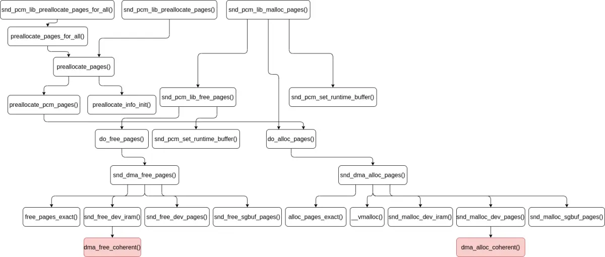
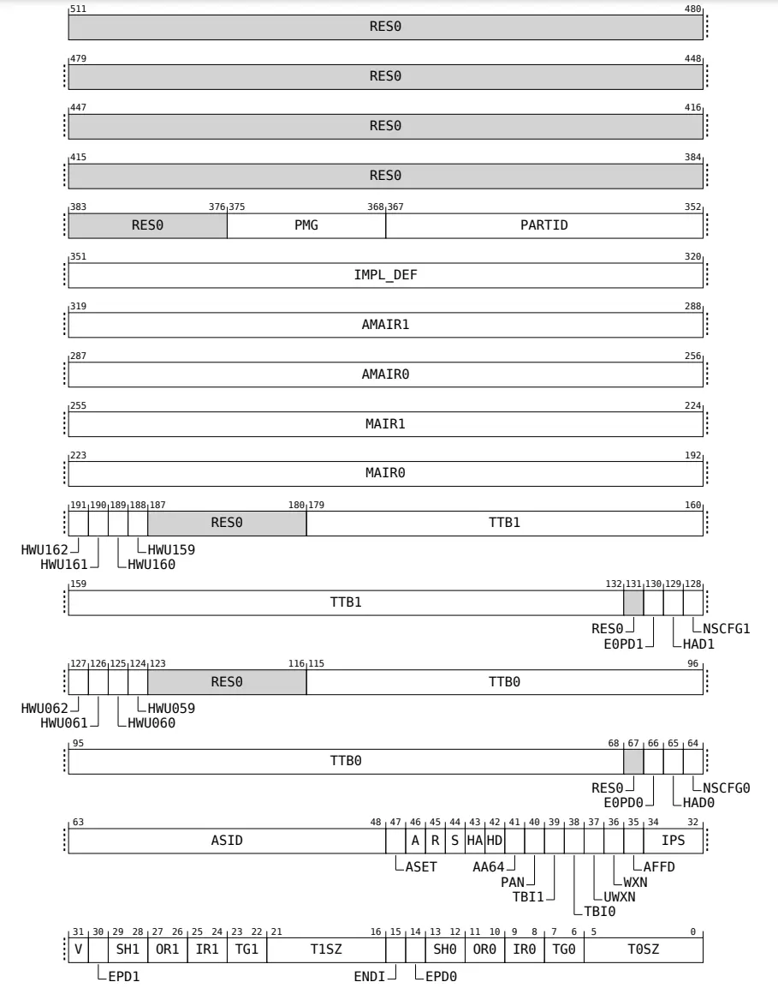

系统 I/O 设备驱动程序通常调用其特定子系统的接口为 DMA 分配内存，但最终会调到 DMA 子系统的 `dma_alloc_coherent()`/`dma_alloc_attrs()` 等接口。`dma_alloc_coherent()`/`dma_alloc_attrs()` 等接口通过 DMA IOMMU 的回调分配内存，并为经过 IOMMU 的 DMA 内存访问准备转换表。之后经过 IOMMU 的 DMA 内存访问所需的所有工作都已完成。

音频子系统 ALSA 的驱动程序，通过 `snd_pcm_lib_preallocate_pages()`/`snd_pcm_lib_preallocate_pages_for_all()`/`snd_pcm_lib_malloc_pages()` 等函数为 DMA 分配内存，这些函数定义 (位于 *sound/core/pcm_memory.c* 文件中) 如下：
```
static int do_alloc_pages(struct snd_card *card, int type, struct device *dev,
			  size_t size, struct snd_dma_buffer *dmab)
{
	int err;

	if (max_alloc_per_card &&
	    card->total_pcm_alloc_bytes + size > max_alloc_per_card)
		return -ENOMEM;

	err = snd_dma_alloc_pages(type, dev, size, dmab);
	if (!err) {
		mutex_lock(&card->memory_mutex);
		card->total_pcm_alloc_bytes += dmab->bytes;
		mutex_unlock(&card->memory_mutex);
	}
	return err;
}
 . . . . . .
/*
 * try to allocate as the large pages as possible.
 * stores the resultant memory size in *res_size.
 *
 * the minimum size is snd_minimum_buffer.  it should be power of 2.
 */
static int preallocate_pcm_pages(struct snd_pcm_substream *substream, size_t size)
{
	struct snd_dma_buffer *dmab = &substream->dma_buffer;
	struct snd_card *card = substream->pcm->card;
	size_t orig_size = size;
	int err;

	do {
		err = do_alloc_pages(card, dmab->dev.type, dmab->dev.dev,
				     size, dmab);
		if (err != -ENOMEM)
			return err;
		size >>= 1;
	} while (size >= snd_minimum_buffer);
	dmab->bytes = 0; /* tell error */
	pr_warn("ALSA pcmC%dD%d%c,%d:%s: cannot preallocate for size %zu\n",
		substream->pcm->card->number, substream->pcm->device,
		substream->stream ? 'c' : 'p', substream->number,
		substream->pcm->name, orig_size);
	return 0;
}
 . . . . . .
/*
 * pre-allocate the buffer and create a proc file for the substream
 */
static void preallocate_pages(struct snd_pcm_substream *substream,
			      int type, struct device *data,
			      size_t size, size_t max, bool managed)
{
	if (snd_BUG_ON(substream->dma_buffer.dev.type))
		return;

	substream->dma_buffer.dev.type = type;
	substream->dma_buffer.dev.dev = data;

	if (size > 0 && preallocate_dma && substream->number < maximum_substreams)
		preallocate_pcm_pages(substream, size);

	if (substream->dma_buffer.bytes > 0)
		substream->buffer_bytes_max = substream->dma_buffer.bytes;
	substream->dma_max = max;
	if (max > 0)
		preallocate_info_init(substream);
	if (managed)
		substream->managed_buffer_alloc = 1;
}

static void preallocate_pages_for_all(struct snd_pcm *pcm, int type,
				      void *data, size_t size, size_t max,
				      bool managed)
{
	struct snd_pcm_substream *substream;
	int stream;

	for (stream = 0; stream < 2; stream++)
		for (substream = pcm->streams[stream].substream; substream;
		     substream = substream->next)
			preallocate_pages(substream, type, data, size, max,
					  managed);
}

/**
 * snd_pcm_lib_preallocate_pages - pre-allocation for the given DMA type
 * @substream: the pcm substream instance
 * @type: DMA type (SNDRV_DMA_TYPE_*)
 * @data: DMA type dependent data
 * @size: the requested pre-allocation size in bytes
 * @max: the max. allowed pre-allocation size
 *
 * Do pre-allocation for the given DMA buffer type.
 */
void snd_pcm_lib_preallocate_pages(struct snd_pcm_substream *substream,
				  int type, struct device *data,
				  size_t size, size_t max)
{
	preallocate_pages(substream, type, data, size, max, false);
}
EXPORT_SYMBOL(snd_pcm_lib_preallocate_pages);

/**
 * snd_pcm_lib_preallocate_pages_for_all - pre-allocation for continuous memory type (all substreams)
 * @pcm: the pcm instance
 * @type: DMA type (SNDRV_DMA_TYPE_*)
 * @data: DMA type dependent data
 * @size: the requested pre-allocation size in bytes
 * @max: the max. allowed pre-allocation size
 *
 * Do pre-allocation to all substreams of the given pcm for the
 * specified DMA type.
 */
void snd_pcm_lib_preallocate_pages_for_all(struct snd_pcm *pcm,
					  int type, void *data,
					  size_t size, size_t max)
{
	preallocate_pages_for_all(pcm, type, data, size, max, false);
}
EXPORT_SYMBOL(snd_pcm_lib_preallocate_pages_for_all);

/**
 * snd_pcm_set_managed_buffer - set up buffer management for a substream
 * @substream: the pcm substream instance
 * @type: DMA type (SNDRV_DMA_TYPE_*)
 * @data: DMA type dependent data
 * @size: the requested pre-allocation size in bytes
 * @max: the max. allowed pre-allocation size
 *
 * Do pre-allocation for the given DMA buffer type, and set the managed
 * buffer allocation mode to the given substream.
 * In this mode, PCM core will allocate a buffer automatically before PCM
 * hw_params ops call, and release the buffer after PCM hw_free ops call
 * as well, so that the driver doesn't need to invoke the allocation and
 * the release explicitly in its callback.
 * When a buffer is actually allocated before the PCM hw_params call, it
 * turns on the runtime buffer_changed flag for drivers changing their h/w
 * parameters accordingly.
 */
void snd_pcm_set_managed_buffer(struct snd_pcm_substream *substream, int type,
				struct device *data, size_t size, size_t max)
{
	preallocate_pages(substream, type, data, size, max, true);
}
EXPORT_SYMBOL(snd_pcm_set_managed_buffer);

/**
 * snd_pcm_set_managed_buffer_all - set up buffer management for all substreams
 *	for all substreams
 * @pcm: the pcm instance
 * @type: DMA type (SNDRV_DMA_TYPE_*)
 * @data: DMA type dependent data
 * @size: the requested pre-allocation size in bytes
 * @max: the max. allowed pre-allocation size
 *
 * Do pre-allocation to all substreams of the given pcm for the specified DMA
 * type and size, and set the managed_buffer_alloc flag to each substream.
 */
void snd_pcm_set_managed_buffer_all(struct snd_pcm *pcm, int type,
				    struct device *data,
				    size_t size, size_t max)
{
	preallocate_pages_for_all(pcm, type, data, size, max, true);
}
EXPORT_SYMBOL(snd_pcm_set_managed_buffer_all);
 . . . . . .
/**
 * snd_pcm_lib_malloc_pages - allocate the DMA buffer
 * @substream: the substream to allocate the DMA buffer to
 * @size: the requested buffer size in bytes
 *
 * Allocates the DMA buffer on the BUS type given earlier to
 * snd_pcm_lib_preallocate_xxx_pages().
 *
 * Return: 1 if the buffer is changed, 0 if not changed, or a negative
 * code on failure.
 */
int snd_pcm_lib_malloc_pages(struct snd_pcm_substream *substream, size_t size)
{
	struct snd_card *card;
	struct snd_pcm_runtime *runtime;
	struct snd_dma_buffer *dmab = NULL;

	if (PCM_RUNTIME_CHECK(substream))
		return -EINVAL;
	if (snd_BUG_ON(substream->dma_buffer.dev.type ==
		       SNDRV_DMA_TYPE_UNKNOWN))
		return -EINVAL;
	runtime = substream->runtime;
	card = substream->pcm->card;

	if (runtime->dma_buffer_p) {
		/* perphaps, we might free the large DMA memory region
		   to save some space here, but the actual solution
		   costs us less time */
		if (runtime->dma_buffer_p->bytes >= size) {
			runtime->dma_bytes = size;
			return 0;	/* ok, do not change */
		}
		snd_pcm_lib_free_pages(substream);
	}
	if (substream->dma_buffer.area != NULL &&
	    substream->dma_buffer.bytes >= size) {
		dmab = &substream->dma_buffer; /* use the pre-allocated buffer */
	} else {
		dmab = kzalloc(sizeof(*dmab), GFP_KERNEL);
		if (! dmab)
			return -ENOMEM;
		dmab->dev = substream->dma_buffer.dev;
		if (do_alloc_pages(card,
				   substream->dma_buffer.dev.type,
				   substream->dma_buffer.dev.dev,
				   size, dmab) < 0) {
			kfree(dmab);
			return -ENOMEM;
		}
	}
	snd_pcm_set_runtime_buffer(substream, dmab);
	runtime->dma_bytes = size;
	return 1;			/* area was changed */
}
EXPORT_SYMBOL(snd_pcm_lib_malloc_pages);
```

Linux 内核音频子系统的这些 DMA 内存分配函数的调用过程如下图：



`snd_pcm_lib_preallocate_pages()` 和 `snd_pcm_lib_preallocate_pages_for_all()` 函数用于**预分配** DMA 内存，两者的区别在于，前者为单个子流预分配，后者为某个 PCM 下的所有子流预分配。它们都通过 `preallocate_pages()`/`preallocate_pcm_pages()`/`do_alloc_pages()` 函数为某个子流预分配内存。`do_alloc_pages()` 执行单个声卡所有子流分配的总内存量的控制，即不能超过 32 MB。`preallocate_pcm_pages()` 函数执行内存分配失败的恢复策略，当分配请求最大大小的内存块失败时，将请求大小减半再次尝试分配内存，直到内存分配成功，或请求大小小于 16 KB 则分配失败返回。`preallocate_pages()` 函数更新子流的缓冲区最大字节数为实际预分配的内存块的字节数。预分配的内存块保存在子流 `snd_pcm_substream` 的 `dma_buffer` 字段中。

音频子系统 ALSA 的驱动程序调用 `snd_pcm_lib_malloc_pages()` 函数为子流**分配** DMA 缓冲区，这个过程大体如下：

1. 如果子流的 DMA 缓冲区已经存在，且空间足够大，会直接成功返回，否则先释放它。
2. 如果子流预分配的内存块空间足够大，会使用预分配的内存块，否则调用 `do_alloc_pages()` 函数为子流分配内存块。
3. 更新子流的各个运行时状态。

`do_alloc_pages()` 函数调用 `snd_dma_alloc_pages()` 函数根据请求的类型分配内存，这个函数定义 (位于 *sound/core/memalloc.c* 文件中) 如下：
```
#ifdef CONFIG_HAS_DMA
/* allocate the coherent DMA pages */
static void snd_malloc_dev_pages(struct snd_dma_buffer *dmab, size_t size)
{
	gfp_t gfp_flags;

	gfp_flags = GFP_KERNEL
		| __GFP_COMP	/* compound page lets parts be mapped */
		| __GFP_NORETRY /* don't trigger OOM-killer */
		| __GFP_NOWARN; /* no stack trace print - this call is non-critical */
	dmab->area = dma_alloc_coherent(dmab->dev.dev, size, &dmab->addr,
					gfp_flags);
#ifdef CONFIG_X86
	if (dmab->area && dmab->dev.type == SNDRV_DMA_TYPE_DEV_UC)
		set_memory_wc((unsigned long)dmab->area,
			      PAGE_ALIGN(size) >> PAGE_SHIFT);
#endif
}

/* free the coherent DMA pages */
static void snd_free_dev_pages(struct snd_dma_buffer *dmab)
{
#ifdef CONFIG_X86
	if (dmab->dev.type == SNDRV_DMA_TYPE_DEV_UC)
		set_memory_wb((unsigned long)dmab->area,
			      PAGE_ALIGN(dmab->bytes) >> PAGE_SHIFT);
#endif
	dma_free_coherent(dmab->dev.dev, dmab->bytes, dmab->area, dmab->addr);
}
 . . . . . .
/**
 * snd_dma_alloc_pages - allocate the buffer area according to the given type
 * @type: the DMA buffer type
 * @device: the device pointer
 * @size: the buffer size to allocate
 * @dmab: buffer allocation record to store the allocated data
 *
 * Calls the memory-allocator function for the corresponding
 * buffer type.
 *
 * Return: Zero if the buffer with the given size is allocated successfully,
 * otherwise a negative value on error.
 */
int snd_dma_alloc_pages(int type, struct device *device, size_t size,
			struct snd_dma_buffer *dmab)
{
	gfp_t gfp;

	if (WARN_ON(!size))
		return -ENXIO;
	if (WARN_ON(!dmab))
		return -ENXIO;

	dmab->dev.type = type;
	dmab->dev.dev = device;
	dmab->bytes = 0;
	dmab->area = NULL;
	dmab->addr = 0;
	dmab->private_data = NULL;
	switch (type) {
	case SNDRV_DMA_TYPE_CONTINUOUS:
		gfp = snd_mem_get_gfp_flags(device, GFP_KERNEL);
		dmab->area = alloc_pages_exact(size, gfp);
		break;
	case SNDRV_DMA_TYPE_VMALLOC:
		gfp = snd_mem_get_gfp_flags(device, GFP_KERNEL | __GFP_HIGHMEM);
		dmab->area = __vmalloc(size, gfp);
		break;
#ifdef CONFIG_HAS_DMA
#ifdef CONFIG_GENERIC_ALLOCATOR
	case SNDRV_DMA_TYPE_DEV_IRAM:
		snd_malloc_dev_iram(dmab, size);
		if (dmab->area)
			break;
		/* Internal memory might have limited size and no enough space,
		 * so if we fail to malloc, try to fetch memory traditionally.
		 */
		dmab->dev.type = SNDRV_DMA_TYPE_DEV;
		fallthrough;
#endif /* CONFIG_GENERIC_ALLOCATOR */
	case SNDRV_DMA_TYPE_DEV:
	case SNDRV_DMA_TYPE_DEV_UC:
		snd_malloc_dev_pages(dmab, size);
		break;
#endif
#ifdef CONFIG_SND_DMA_SGBUF
	case SNDRV_DMA_TYPE_DEV_SG:
	case SNDRV_DMA_TYPE_DEV_UC_SG:
		snd_malloc_sgbuf_pages(device, size, dmab, NULL);
		break;
#endif
	default:
		pr_err("snd-malloc: invalid device type %d\n", type);
		return -ENXIO;
	}
	if (! dmab->area)
		return -ENOMEM;
	dmab->bytes = size;
	return 0;
}
EXPORT_SYMBOL(snd_dma_alloc_pages);
 . . . . . .
/**
 * snd_dma_free_pages - release the allocated buffer
 * @dmab: the buffer allocation record to release
 *
 * Releases the allocated buffer via snd_dma_alloc_pages().
 */
void snd_dma_free_pages(struct snd_dma_buffer *dmab)
{
	switch (dmab->dev.type) {
	case SNDRV_DMA_TYPE_CONTINUOUS:
		free_pages_exact(dmab->area, dmab->bytes);
		break;
	case SNDRV_DMA_TYPE_VMALLOC:
		vfree(dmab->area);
		break;
#ifdef CONFIG_HAS_DMA
#ifdef CONFIG_GENERIC_ALLOCATOR
	case SNDRV_DMA_TYPE_DEV_IRAM:
		snd_free_dev_iram(dmab);
		break;
#endif /* CONFIG_GENERIC_ALLOCATOR */
	case SNDRV_DMA_TYPE_DEV:
	case SNDRV_DMA_TYPE_DEV_UC:
		snd_free_dev_pages(dmab);
		break;
#endif
#ifdef CONFIG_SND_DMA_SGBUF
	case SNDRV_DMA_TYPE_DEV_SG:
	case SNDRV_DMA_TYPE_DEV_UC_SG:
		snd_free_sgbuf_pages(dmab);
		break;
#endif
	default:
		pr_err("snd-malloc: invalid device type %d\n", dmab->dev.type);
	}
}
EXPORT_SYMBOL(snd_dma_free_pages);
```

DMA 内存最终由 DMA 子系统的 `dma_alloc_coherent()` 和 `dma_free_coherent()` 分配和释放。

`dma_alloc_coherent()` 函数定义 (位于 *include/linux/dma-mapping.h* 文件中) 如下：
```
static inline void *dma_alloc_coherent(struct device *dev, size_t size,
		dma_addr_t *dma_handle, gfp_t gfp)
{

	return dma_alloc_attrs(dev, size, dma_handle, gfp,
			(gfp & __GFP_NOWARN) ? DMA_ATTR_NO_WARN : 0);
}

static inline void dma_free_coherent(struct device *dev, size_t size,
		void *cpu_addr, dma_addr_t dma_handle)
{
	return dma_free_attrs(dev, size, cpu_addr, dma_handle, 0);
}
```

`dma_alloc_coherent()` 函数是 `dma_alloc_attrs()` 的包装，后者定义 (位于 *kernel/dma/mapping.c* 文件中) 如下：
```
static bool dma_go_direct(struct device *dev, dma_addr_t mask,
		const struct dma_map_ops *ops)
{
	if (likely(!ops))
		return true;
#ifdef CONFIG_DMA_OPS_BYPASS
	if (dev->dma_ops_bypass)
		return min_not_zero(mask, dev->bus_dma_limit) >=
			    dma_direct_get_required_mask(dev);
#endif
	return false;
}


/*
 * Check if the devices uses a direct mapping for streaming DMA operations.
 * This allows IOMMU drivers to set a bypass mode if the DMA mask is large
 * enough.
 */
static inline bool dma_alloc_direct(struct device *dev,
		const struct dma_map_ops *ops)
{
	return dma_go_direct(dev, dev->coherent_dma_mask, ops);
}
 . . . . . .
void *dma_alloc_attrs(struct device *dev, size_t size, dma_addr_t *dma_handle,
		gfp_t flag, unsigned long attrs)
{
	const struct dma_map_ops *ops = get_dma_ops(dev);
	void *cpu_addr;

	WARN_ON_ONCE(!dev->coherent_dma_mask);

	if (dma_alloc_from_dev_coherent(dev, size, dma_handle, &cpu_addr))
		return cpu_addr;

	/* let the implementation decide on the zone to allocate from: */
	flag &= ~(__GFP_DMA | __GFP_DMA32 | __GFP_HIGHMEM);

	if (dma_alloc_direct(dev, ops))
		cpu_addr = dma_direct_alloc(dev, size, dma_handle, flag, attrs);
	else if (ops->alloc)
		cpu_addr = ops->alloc(dev, size, dma_handle, flag, attrs);
	else
		return NULL;

	debug_dma_alloc_coherent(dev, size, *dma_handle, cpu_addr);
	return cpu_addr;
}
EXPORT_SYMBOL(dma_alloc_attrs);
```

`dma_alloc_attrs()` 函数的执行过程如下：

1. 调用 `dma_alloc_from_dev_coherent()` 函数尝试从系统 I/O 设备的 coherent 内存中分配，如果成功就返回，否则继续执行。
2. 检查设备是否为流式 DMA 操作使用直接映射，如果是，调用 `dma_direct_alloc()` 函数分配内存；否则通过设备的 DMA 映射操作的 `alloc()` 回调分配内存。一般来说，DMA 映射操作有效时，不需要使用直接映射。在开启了 IOMMU 的情况下，对于连接到 IOMMU 的系统 I/O 设备，DMA 映射操作在系统 I/O 设备的 IOMMU 探测及其与 IOMMU 设备的连接过程中，在 `of_dma_configure_id()` 函数中，通过调用 `arch_setup_dma_ops()` 函数设置。

设备的 coherent 内存池是 Linux 内核的一种系统 I/O 设备驱动程序 DMA 内存管理和分配机制。`dma_alloc_from_dev_coherent()` 函数定义 (位于 *kernel/dma/coherent.c* 文件中) 如下：
```
static inline struct dma_coherent_mem *dev_get_coherent_memory(struct device *dev)
{
	if (dev && dev->dma_mem)
		return dev->dma_mem;
	return NULL;
}

static inline dma_addr_t dma_get_device_base(struct device *dev,
					     struct dma_coherent_mem * mem)
{
	if (mem->use_dev_dma_pfn_offset)
		return phys_to_dma(dev, PFN_PHYS(mem->pfn_base));
	return mem->device_base;
}
 . . . . . .
static void *__dma_alloc_from_coherent(struct device *dev,
				       struct dma_coherent_mem *mem,
				       ssize_t size, dma_addr_t *dma_handle)
{
	int order = get_order(size);
	unsigned long flags;
	int pageno;
	void *ret;

	spin_lock_irqsave(&mem->spinlock, flags);

	if (unlikely(size > ((dma_addr_t)mem->size << PAGE_SHIFT)))
		goto err;

	pageno = bitmap_find_free_region(mem->bitmap, mem->size, order);
	if (unlikely(pageno < 0))
		goto err;

	/*
	 * Memory was found in the coherent area.
	 */
	*dma_handle = dma_get_device_base(dev, mem) +
			((dma_addr_t)pageno << PAGE_SHIFT);
	ret = mem->virt_base + ((dma_addr_t)pageno << PAGE_SHIFT);
	spin_unlock_irqrestore(&mem->spinlock, flags);
	memset(ret, 0, size);
	return ret;
err:
	spin_unlock_irqrestore(&mem->spinlock, flags);
	return NULL;
}

/**
 * dma_alloc_from_dev_coherent() - allocate memory from device coherent pool
 * @dev:	device from which we allocate memory
 * @size:	size of requested memory area
 * @dma_handle:	This will be filled with the correct dma handle
 * @ret:	This pointer will be filled with the virtual address
 *		to allocated area.
 *
 * This function should be only called from per-arch dma_alloc_coherent()
 * to support allocation from per-device coherent memory pools.
 *
 * Returns 0 if dma_alloc_coherent should continue with allocating from
 * generic memory areas, or !0 if dma_alloc_coherent should return @ret.
 */
int dma_alloc_from_dev_coherent(struct device *dev, ssize_t size,
		dma_addr_t *dma_handle, void **ret)
{
	struct dma_coherent_mem *mem = dev_get_coherent_memory(dev);

	if (!mem)
		return 0;

	*ret = __dma_alloc_from_coherent(dev, mem, size, dma_handle);
	return 1;
}
```

`dma_alloc_from_dev_coherent()` 函数从设备的 coherent 内存池中分配内存。coherent 内存池由设备驱动程序通过 `dma_declare_coherent_memory()` 接口创建，这个接口实现 (位于 *kernel/dma/coherent.c* 文件中) 如下：
```
static int dma_init_coherent_memory(phys_addr_t phys_addr,
		dma_addr_t device_addr, size_t size,
		struct dma_coherent_mem **mem)
{
	struct dma_coherent_mem *dma_mem = NULL;
	void *mem_base = NULL;
	int pages = size >> PAGE_SHIFT;
	int bitmap_size = BITS_TO_LONGS(pages) * sizeof(long);
	int ret;

	if (!size) {
		ret = -EINVAL;
		goto out;
	}

	mem_base = memremap(phys_addr, size, MEMREMAP_WC);
	if (!mem_base) {
		ret = -EINVAL;
		goto out;
	}
	dma_mem = kzalloc(sizeof(struct dma_coherent_mem), GFP_KERNEL);
	if (!dma_mem) {
		ret = -ENOMEM;
		goto out;
	}
	dma_mem->bitmap = kzalloc(bitmap_size, GFP_KERNEL);
	if (!dma_mem->bitmap) {
		ret = -ENOMEM;
		goto out;
	}

	dma_mem->virt_base = mem_base;
	dma_mem->device_base = device_addr;
	dma_mem->pfn_base = PFN_DOWN(phys_addr);
	dma_mem->size = pages;
	spin_lock_init(&dma_mem->spinlock);

	*mem = dma_mem;
	return 0;

out:
	kfree(dma_mem);
	if (mem_base)
		memunmap(mem_base);
	return ret;
}
 . . . . . .
static int dma_assign_coherent_memory(struct device *dev,
				      struct dma_coherent_mem *mem)
{
	if (!dev)
		return -ENODEV;

	if (dev->dma_mem)
		return -EBUSY;

	dev->dma_mem = mem;
	return 0;
}

/*
 * Declare a region of memory to be handed out by dma_alloc_coherent() when it
 * is asked for coherent memory for this device.  This shall only be used
 * from platform code, usually based on the device tree description.
 * 
 * phys_addr is the CPU physical address to which the memory is currently
 * assigned (this will be ioremapped so the CPU can access the region).
 *
 * device_addr is the DMA address the device needs to be programmed with to
 * actually address this memory (this will be handed out as the dma_addr_t in
 * dma_alloc_coherent()).
 *
 * size is the size of the area (must be a multiple of PAGE_SIZE).
 *
 * As a simplification for the platforms, only *one* such region of memory may
 * be declared per device.
 */
int dma_declare_coherent_memory(struct device *dev, phys_addr_t phys_addr,
				dma_addr_t device_addr, size_t size)
{
	struct dma_coherent_mem *mem;
	int ret;

	ret = dma_init_coherent_memory(phys_addr, device_addr, size, &mem);
	if (ret)
		return ret;

	ret = dma_assign_coherent_memory(dev, mem);
	if (ret)
		dma_release_coherent_memory(mem);
	return ret;
}
```

对于没有使用 coherent 内存池的系统 I/O 设备驱动程序，可以忽略从 coherent 内存池分配内存的逻辑。

`arch_setup_dma_ops()` 为系统 I/O 设备设置 DMA 操作，它是各个 CPU 硬件平台提供的操作，对于 ARM64 平台，这个操作的实现 (位于 *arch/arm64/mm/dma-mapping.c* 文件中) 如下：
```
void arch_setup_dma_ops(struct device *dev, u64 dma_base, u64 size,
			const struct iommu_ops *iommu, bool coherent)
{
	int cls = cache_line_size_of_cpu();

	WARN_TAINT(!coherent && cls > ARCH_DMA_MINALIGN,
		   TAINT_CPU_OUT_OF_SPEC,
		   "%s %s: ARCH_DMA_MINALIGN smaller than CTR_EL0.CWG (%d < %d)",
		   dev_driver_string(dev), dev_name(dev),
		   ARCH_DMA_MINALIGN, cls);

	dev->dma_coherent = coherent;
	if (iommu)
		iommu_setup_dma_ops(dev, dma_base, size);

#ifdef CONFIG_XEN
	if (xen_initial_domain())
		dev->dma_ops = &xen_swiotlb_dma_ops;
#endif
}
```

`arch_setup_dma_ops()` 操作调用 IOMMU 子系统的 `iommu_setup_dma_ops()` 函数为系统 I/O 设备设置 DMA 操作，`iommu_setup_dma_ops()` 函数定义 (位于 *drivers/iommu/dma-iommu.c* 文件中) 如下：
```
static const struct dma_map_ops iommu_dma_ops = {
	.alloc			= iommu_dma_alloc,
	.free			= iommu_dma_free,
	.alloc_pages		= dma_common_alloc_pages,
	.free_pages		= dma_common_free_pages,
	.alloc_noncoherent	= iommu_dma_alloc_noncoherent,
	.free_noncoherent	= iommu_dma_free_noncoherent,
	.mmap			= iommu_dma_mmap,
	.get_sgtable		= iommu_dma_get_sgtable,
	.map_page		= iommu_dma_map_page,
	.unmap_page		= iommu_dma_unmap_page,
	.map_sg			= iommu_dma_map_sg,
	.unmap_sg		= iommu_dma_unmap_sg,
	.sync_single_for_cpu	= iommu_dma_sync_single_for_cpu,
	.sync_single_for_device	= iommu_dma_sync_single_for_device,
	.sync_sg_for_cpu	= iommu_dma_sync_sg_for_cpu,
	.sync_sg_for_device	= iommu_dma_sync_sg_for_device,
	.map_resource		= iommu_dma_map_resource,
	.unmap_resource		= iommu_dma_unmap_resource,
	.get_merge_boundary	= iommu_dma_get_merge_boundary,
};

/*
 * The IOMMU core code allocates the default DMA domain, which the underlying
 * IOMMU driver needs to support via the dma-iommu layer.
 */
void iommu_setup_dma_ops(struct device *dev, u64 dma_base, u64 size)
{
	struct iommu_domain *domain = iommu_get_domain_for_dev(dev);

	if (!domain)
		goto out_err;

	/*
	 * The IOMMU core code allocates the default DMA domain, which the
	 * underlying IOMMU driver needs to support via the dma-iommu layer.
	 */
	if (domain->type == IOMMU_DOMAIN_DMA) {
		if (iommu_dma_init_domain(domain, dma_base, size, dev))
			goto out_err;
		dev->dma_ops = &iommu_dma_ops;
	}

	return;
out_err:
	 pr_warn("Failed to set up IOMMU for device %s; retaining platform DMA ops\n",
		 dev_name(dev));
}
```

`iommu_setup_dma_ops()` 函数调用 `iommu_dma_init_domain()` 初始化 DMA 映射 domain，并为系统 I/O 设备设置 DMA 操作。`iommu_dma_init_domain()` 函数定义 (位于 *drivers/iommu/dma-iommu.c* 文件中) 如下：
```
static int iova_reserve_iommu_regions(struct device *dev,
		struct iommu_domain *domain)
{
	struct iommu_dma_cookie *cookie = domain->iova_cookie;
	struct iova_domain *iovad = &cookie->iovad;
	struct iommu_resv_region *region;
	LIST_HEAD(resv_regions);
	int ret = 0;

	if (dev_is_pci(dev)) {
		ret = iova_reserve_pci_windows(to_pci_dev(dev), iovad);
		if (ret)
			return ret;
	}

	iommu_get_resv_regions(dev, &resv_regions);
	list_for_each_entry(region, &resv_regions, list) {
		unsigned long lo, hi;

		/* We ARE the software that manages these! */
		if (region->type == IOMMU_RESV_SW_MSI)
			continue;

		lo = iova_pfn(iovad, region->start);
		hi = iova_pfn(iovad, region->start + region->length - 1);
		reserve_iova(iovad, lo, hi);

		if (region->type == IOMMU_RESV_MSI)
			ret = cookie_init_hw_msi_region(cookie, region->start,
					region->start + region->length);
		if (ret)
			break;
	}
	iommu_put_resv_regions(dev, &resv_regions);

	return ret;
}
 . . . . . .
/**
 * iommu_dma_init_domain - Initialise a DMA mapping domain
 * @domain: IOMMU domain previously prepared by iommu_get_dma_cookie()
 * @base: IOVA at which the mappable address space starts
 * @size: Size of IOVA space
 * @dev: Device the domain is being initialised for
 *
 * @base and @size should be exact multiples of IOMMU page granularity to
 * avoid rounding surprises. If necessary, we reserve the page at address 0
 * to ensure it is an invalid IOVA. It is safe to reinitialise a domain, but
 * any change which could make prior IOVAs invalid will fail.
 */
static int iommu_dma_init_domain(struct iommu_domain *domain, dma_addr_t base,
		u64 size, struct device *dev)
{
	struct iommu_dma_cookie *cookie = domain->iova_cookie;
	unsigned long order, base_pfn;
	struct iova_domain *iovad;
	int attr;

	if (!cookie || cookie->type != IOMMU_DMA_IOVA_COOKIE)
		return -EINVAL;

	iovad = &cookie->iovad;

	/* Use the smallest supported page size for IOVA granularity */
	order = __ffs(domain->pgsize_bitmap);
	base_pfn = max_t(unsigned long, 1, base >> order);

	/* Check the domain allows at least some access to the device... */
	if (domain->geometry.force_aperture) {
		if (base > domain->geometry.aperture_end ||
		    base + size <= domain->geometry.aperture_start) {
			pr_warn("specified DMA range outside IOMMU capability\n");
			return -EFAULT;
		}
		/* ...then finally give it a kicking to make sure it fits */
		base_pfn = max_t(unsigned long, base_pfn,
				domain->geometry.aperture_start >> order);
	}

	/* start_pfn is always nonzero for an already-initialised domain */
	if (iovad->start_pfn) {
		if (1UL << order != iovad->granule ||
		    base_pfn != iovad->start_pfn) {
			pr_warn("Incompatible range for DMA domain\n");
			return -EFAULT;
		}

		return 0;
	}

	init_iova_domain(iovad, 1UL << order, base_pfn);

	if (!cookie->fq_domain && !iommu_domain_get_attr(domain,
			DOMAIN_ATTR_DMA_USE_FLUSH_QUEUE, &attr) && attr) {
		if (init_iova_flush_queue(iovad, iommu_dma_flush_iotlb_all,
					NULL))
			pr_warn("iova flush queue initialization failed\n");
		else
			cookie->fq_domain = domain;
	}

	if (!dev)
		return 0;

	return iova_reserve_iommu_regions(dev, domain);
}
```

在前面 IOMMU 回调 `arm_smmu_domain_alloc()` 被调用创建 domain 时，如果 domain type 为 `IOMMU_DOMAIN_DMA`，会为 domain 创建类型为 `IOMMU_DMA_IOVA_COOKIE` 的 `iommu_dma_cookie` 及其 `struct iova_domain`。`struct iova_domain` 用于管理 domain 的 I/O 虚拟地址空间。`iommu_dma_init_domain()` 函数调用 `init_iova_domain()` 为 domain 初始化 `struct iova_domain`。

`size` 为 IOVA 空间的大小，它是由 `of_dma_configure_id()` 函数传过来的，如果 `dev->coherent_dma_mask` 非 0，则一般为 `dev->coherent_dma_mask`，否则为 0x100000000。

`__ffs()` 函数返回一个数二进制表示的最低有效位的位数。`iommu_dma_init_domain()` 函数以 `1UL << order` 作为 `granule` 来初始化 `struct iova_domain`，即设置以支持的最细粒度的内存页大小来分配 IOVA 地址段。

`init_iova_domain()` 函数定义 (位于 *drivers/iommu/iova.c* 文件中) 如下：
```
void
init_iova_domain(struct iova_domain *iovad, unsigned long granule,
	unsigned long start_pfn)
{
	/*
	 * IOVA granularity will normally be equal to the smallest
	 * supported IOMMU page size; both *must* be capable of
	 * representing individual CPU pages exactly.
	 */
	BUG_ON((granule > PAGE_SIZE) || !is_power_of_2(granule));

	spin_lock_init(&iovad->iova_rbtree_lock);
	iovad->rbroot = RB_ROOT;
	iovad->cached_node = &iovad->anchor.node;
	iovad->cached32_node = &iovad->anchor.node;
	iovad->granule = granule;
	iovad->start_pfn = start_pfn;
	iovad->dma_32bit_pfn = 1UL << (32 - iova_shift(iovad));
	iovad->max32_alloc_size = iovad->dma_32bit_pfn;
	iovad->flush_cb = NULL;
	iovad->fq = NULL;
	iovad->anchor.pfn_lo = iovad->anchor.pfn_hi = IOVA_ANCHOR;
	rb_link_node(&iovad->anchor.node, NULL, &iovad->rbroot.rb_node);
	rb_insert_color(&iovad->anchor.node, &iovad->rbroot);
	init_iova_rcaches(iovad);
}
EXPORT_SYMBOL_GPL(init_iova_domain);
```

`dma_alloc_attrs()` 函数调用的 dma 映射操作的 `alloc()` 回调实际为 `iommu_dma_alloc()` 函数，这个函数定义 (位于 *drivers/iommu/dma-iommu.c* 文件中) 如下：
```
static void *iommu_dma_alloc(struct device *dev, size_t size,
		dma_addr_t *handle, gfp_t gfp, unsigned long attrs)
{
	bool coherent = dev_is_dma_coherent(dev);
	int ioprot = dma_info_to_prot(DMA_BIDIRECTIONAL, coherent, attrs);
	struct page *page = NULL;
	void *cpu_addr;

	gfp |= __GFP_ZERO;

	if (IS_ENABLED(CONFIG_DMA_REMAP) && gfpflags_allow_blocking(gfp) &&
	    !(attrs & DMA_ATTR_FORCE_CONTIGUOUS)) {
		return iommu_dma_alloc_remap(dev, size, handle, gfp,
				dma_pgprot(dev, PAGE_KERNEL, attrs), attrs);
	}

	if (IS_ENABLED(CONFIG_DMA_DIRECT_REMAP) &&
	    !gfpflags_allow_blocking(gfp) && !coherent)
		page = dma_alloc_from_pool(dev, PAGE_ALIGN(size), &cpu_addr,
					       gfp, NULL);
	else
		cpu_addr = iommu_dma_alloc_pages(dev, size, &page, gfp, attrs);
	if (!cpu_addr)
		return NULL;

	*handle = __iommu_dma_map(dev, page_to_phys(page), size, ioprot,
			dev->coherent_dma_mask);
	if (*handle == DMA_MAPPING_ERROR) {
		__iommu_dma_free(dev, size, cpu_addr);
		return NULL;
	}

	return cpu_addr;
}
```

`iommu_dma_alloc()` 函数中，如果启用了 **CONFIG_DMA_REMAP**，gfp 标记允许阻塞，且没有带强制连续属性，则调用 `iommu_dma_alloc_remap()` 函数完成内存分配及重映射并返回；否则，先通过 `dma_alloc_from_pool()` 或 `iommu_dma_alloc_pages()` 分配物理内存页，再通过 `__iommu_dma_map()` 分配 I/O 虚拟地址空间地址段并执行重映射。

`iommu_dma_alloc_remap()` 函数定义 (位于 *drivers/iommu/dma-iommu.c* 文件中) 如下：
```
static int iommu_dma_deferred_attach(struct device *dev,
		struct iommu_domain *domain)
{
	const struct iommu_ops *ops = domain->ops;

	if (!is_kdump_kernel())
		return 0;

	if (unlikely(ops->is_attach_deferred &&
			ops->is_attach_deferred(domain, dev)))
		return iommu_attach_device(domain, dev);

	return 0;
}
 . . . . . .
/**
 * iommu_dma_alloc_remap - Allocate and map a buffer contiguous in IOVA space
 * @dev: Device to allocate memory for. Must be a real device
 *	 attached to an iommu_dma_domain
 * @size: Size of buffer in bytes
 * @dma_handle: Out argument for allocated DMA handle
 * @gfp: Allocation flags
 * @prot: pgprot_t to use for the remapped mapping
 * @attrs: DMA attributes for this allocation
 *
 * If @size is less than PAGE_SIZE, then a full CPU page will be allocated,
 * but an IOMMU which supports smaller pages might not map the whole thing.
 *
 * Return: Mapped virtual address, or NULL on failure.
 */
static void *iommu_dma_alloc_remap(struct device *dev, size_t size,
		dma_addr_t *dma_handle, gfp_t gfp, pgprot_t prot,
		unsigned long attrs)
{
	struct iommu_domain *domain = iommu_get_dma_domain(dev);
	struct iommu_dma_cookie *cookie = domain->iova_cookie;
	struct iova_domain *iovad = &cookie->iovad;
	bool coherent = dev_is_dma_coherent(dev);
	int ioprot = dma_info_to_prot(DMA_BIDIRECTIONAL, coherent, attrs);
	unsigned int count, min_size, alloc_sizes = domain->pgsize_bitmap;
	struct page **pages;
	struct sg_table sgt;
	dma_addr_t iova;
	void *vaddr;

	*dma_handle = DMA_MAPPING_ERROR;

	if (unlikely(iommu_dma_deferred_attach(dev, domain)))
		return NULL;

	min_size = alloc_sizes & -alloc_sizes;
	if (min_size < PAGE_SIZE) {
		min_size = PAGE_SIZE;
		alloc_sizes |= PAGE_SIZE;
	} else {
		size = ALIGN(size, min_size);
	}
	if (attrs & DMA_ATTR_ALLOC_SINGLE_PAGES)
		alloc_sizes = min_size;

	count = PAGE_ALIGN(size) >> PAGE_SHIFT;
	pages = __iommu_dma_alloc_pages(dev, count, alloc_sizes >> PAGE_SHIFT,
					gfp);
	if (!pages)
		return NULL;

	size = iova_align(iovad, size);
	iova = iommu_dma_alloc_iova(domain, size, dev->coherent_dma_mask, dev);
	if (!iova)
		goto out_free_pages;

	if (sg_alloc_table_from_pages(&sgt, pages, count, 0, size, GFP_KERNEL))
		goto out_free_iova;

	if (!(ioprot & IOMMU_CACHE)) {
		struct scatterlist *sg;
		int i;

		for_each_sg(sgt.sgl, sg, sgt.orig_nents, i)
			arch_dma_prep_coherent(sg_page(sg), sg->length);
	}

	if (iommu_map_sg_atomic(domain, iova, sgt.sgl, sgt.orig_nents, ioprot)
			< size)
		goto out_free_sg;

	vaddr = dma_common_pages_remap(pages, size, prot,
			__builtin_return_address(0));
	if (!vaddr)
		goto out_unmap;

	*dma_handle = iova;
	sg_free_table(&sgt);
	return vaddr;

out_unmap:
	__iommu_dma_unmap(dev, iova, size);
out_free_sg:
	sg_free_table(&sgt);
out_free_iova:
	iommu_dma_free_iova(cookie, iova, size);
out_free_pages:
	__iommu_dma_free_pages(pages, count);
	return NULL;
}
```

`iommu_dma_alloc_remap()` 函数做了这样一些事情：

1. 如果系统 I/O 设备延迟连接 IOMMU，此时调用 `iommu_attach_device()` 执行系统 I/O 设备与 IOMMU 的连接。
2. 计算要分配的内存的页数及 `order_mask`，并调用 `__iommu_dma_alloc_pages()` 分配物理内存页。`domain->pgsize_bitmap` 为 domain 支持的页大小的集合，支持的页大小都是 2 的整数次幂，这个值是支持的页大小的按位或。计算 `min_size` 时，表达式 `alloc_sizes & -alloc_sizes` 的思路是，一个数的相反数是这个数的按位取反加 1，因此这个表达式等价于 `alloc_sizes & ((~alloc_sizes) + 1)`，这样可以比较高效地找到数的二进制表示的最低有效位，也就是支持的最小页大小。这里限定分配的最小内存块为 `PAGE_SIZE`。一个 `alloc_sizes` 和 `min_size` 的示例如：`alloc_sizes(0x40201000), min_size(0x1000)`。
3. 计算 IOVA 对齐的内存大小，并调用 `iommu_dma_alloc_iova()` 在 I/O 虚拟地址空间分配地址段，传入的 `dma_limit` 为 `dev->coherent_dma_mask`。
4. 调用 `sg_alloc_table_from_pages()` 由内存页数组分配并初始化一个 sg 表。
5. 调用 `iommu_map_sg_atomic()` 执行 IOMMU sg 映射。
6. 将内存页数组映射到另一个 vm_area。

`iommu_attach_device()` 函数定义 (位于 *drivers/iommu/iommu.c* 文件中) 如下：
```
static int iommu_group_device_count(struct iommu_group *group)
{
	struct group_device *entry;
	int ret = 0;

	list_for_each_entry(entry, &group->devices, list)
		ret++;

	return ret;
}
 . . . . . .
static int __iommu_attach_device(struct iommu_domain *domain,
				 struct device *dev)
{
	int ret;

	if (unlikely(domain->ops->attach_dev == NULL))
		return -ENODEV;

	ret = domain->ops->attach_dev(domain, dev);
	if (!ret)
		trace_attach_device_to_domain(dev);
	return ret;
}

int iommu_attach_device(struct iommu_domain *domain, struct device *dev)
{
	struct iommu_group *group;
	int ret;

	group = iommu_group_get(dev);
	if (!group)
		return -ENODEV;

	/*
	 * Lock the group to make sure the device-count doesn't
	 * change while we are attaching
	 */
	mutex_lock(&group->mutex);
	ret = -EINVAL;
	if (iommu_group_device_count(group) != 1)
		goto out_unlock;

	ret = __iommu_attach_group(domain, group);

out_unlock:
	mutex_unlock(&group->mutex);
	iommu_group_put(group);

	return ret;
}
EXPORT_SYMBOL_GPL(iommu_attach_device);
 . . . . . .
/*
 * IOMMU groups are really the natural working unit of the IOMMU, but
 * the IOMMU API works on domains and devices.  Bridge that gap by
 * iterating over the devices in a group.  Ideally we'd have a single
 * device which represents the requestor ID of the group, but we also
 * allow IOMMU drivers to create policy defined minimum sets, where
 * the physical hardware may be able to distiguish members, but we
 * wish to group them at a higher level (ex. untrusted multi-function
 * PCI devices).  Thus we attach each device.
 */
static int iommu_group_do_attach_device(struct device *dev, void *data)
{
	struct iommu_domain *domain = data;

	return __iommu_attach_device(domain, dev);
}

static int __iommu_attach_group(struct iommu_domain *domain,
				struct iommu_group *group)
{
	int ret;

	if (group->default_domain && group->domain != group->default_domain)
		return -EBUSY;

	ret = __iommu_group_for_each_dev(group, domain,
					 iommu_group_do_attach_device);
	if (ret == 0)
		group->domain = domain;

	return ret;
}
```

`iommu_attach_device()` 函数从系统 I/O 设备获得 IOMMU group，并计算 IOMMU group 中系统 I/O 设备的数量，如果不为 1，则返回，否则为 IOMMU group 中的系统 I/O 设备执行与 IOMMU 的连接。最终通过 IOMMU 回调的 `attach_dev()` 操作为系统 I/O 设备执行与 IOMMU 的连接。

`__iommu_dma_alloc_pages()` 函数用于分配物理内存页，这个函数定义 (位于 *drivers/iommu/dma-iommu.c* 文件中) 如下：
```
static struct page **__iommu_dma_alloc_pages(struct device *dev,
		unsigned int count, unsigned long order_mask, gfp_t gfp)
{
	struct page **pages;
	unsigned int i = 0, nid = dev_to_node(dev);

	order_mask &= (2U << MAX_ORDER) - 1;
	if (!order_mask)
		return NULL;

	pages = kvzalloc(count * sizeof(*pages), GFP_KERNEL);
	if (!pages)
		return NULL;

	/* IOMMU can map any pages, so himem can also be used here */
	gfp |= __GFP_NOWARN | __GFP_HIGHMEM;

	/* It makes no sense to muck about with huge pages */
	gfp &= ~__GFP_COMP;

	while (count) {
		struct page *page = NULL;
		unsigned int order_size;

		/*
		 * Higher-order allocations are a convenience rather
		 * than a necessity, hence using __GFP_NORETRY until
		 * falling back to minimum-order allocations.
		 */
		for (order_mask &= (2U << __fls(count)) - 1;
		     order_mask; order_mask &= ~order_size) {
			unsigned int order = __fls(order_mask);
			gfp_t alloc_flags = gfp;

			order_size = 1U << order;
			if (order_mask > order_size)
				alloc_flags |= __GFP_NORETRY;
			page = alloc_pages_node(nid, alloc_flags, order);
			if (!page)
				continue;
			if (order)
				split_page(page, order);
			break;
		}
		if (!page) {
			__iommu_dma_free_pages(pages, i);
			return NULL;
		}
		count -= order_size;
		while (order_size--)
			pages[i++] = page++;
	}
	return pages;
}
```

`__iommu_dma_alloc_pages()` 函数中，`order_mask` 为支持的连续内存页数的集合。`__fls()` 函数用于获得一个数的二进制表示的最高有效位数。`(2U << __fls(count))` 表达式获得 `count` 的最高位加 1 位；`(2U << __fls(count)) - 1` 表达式获得 `count` 最高位及其更低位全为 1 的值；`order_mask &= (2U << __fls(count)) - 1` 表达式获得 `count` 范围内可用的支持的连续内存页数的集合。`__fls(order_mask)` 表达式获得一次分配最大的可支持的连续页数。`order_mask &= ~order_size` 表达式清除最高位。

`__iommu_dma_alloc_pages()` 函数用一个两层循环分配物理内存页。外层循环控制分配内存的总页数。内层循环执行错误处理。内层循环每次尝试分配最大的可支持的连续物理内存页数，如果分配失败，则尝试分配更小一级的可支持的连续物理内存页数，依次类推直到分配成功。如果内存分配成功，会将大内存页按 `PAGE_SIZE` 大小分割为更小的内存页。

尽管 `__iommu_dma_alloc_pages()` 函数返回的是大小相同的物理内存页，但它返回的实际上可能是可作为大小不同的内存页来使用的内存页。深入到内存管理子系统中，分配物理内存页的详细过程，这里忽略。

`iommu_dma_alloc_iova()` 函数在 I/O 虚拟地址空间分配地址段，这个函数定义 (位于 *drivers/iommu/dma-iommu.c* 文件中) 如下：
```
static dma_addr_t iommu_dma_alloc_iova(struct iommu_domain *domain,
		size_t size, u64 dma_limit, struct device *dev)
{
	struct iommu_dma_cookie *cookie = domain->iova_cookie;
	struct iova_domain *iovad = &cookie->iovad;
	unsigned long shift, iova_len, iova = 0;

	if (cookie->type == IOMMU_DMA_MSI_COOKIE) {
		cookie->msi_iova += size;
		return cookie->msi_iova - size;
	}

	shift = iova_shift(iovad);
	iova_len = size >> shift;
	/*
	 * Freeing non-power-of-two-sized allocations back into the IOVA caches
	 * will come back to bite us badly, so we have to waste a bit of space
	 * rounding up anything cacheable to make sure that can't happen. The
	 * order of the unadjusted size will still match upon freeing.
	 */
	if (iova_len < (1 << (IOVA_RANGE_CACHE_MAX_SIZE - 1)))
		iova_len = roundup_pow_of_two(iova_len);

	dma_limit = min_not_zero(dma_limit, dev->bus_dma_limit);

	if (domain->geometry.force_aperture)
		dma_limit = min(dma_limit, (u64)domain->geometry.aperture_end);

	/* Try to get PCI devices a SAC address */
	if (dma_limit > DMA_BIT_MASK(32) && dev_is_pci(dev))
		iova = alloc_iova_fast(iovad, iova_len,
				       DMA_BIT_MASK(32) >> shift, false);

	if (!iova)
		iova = alloc_iova_fast(iovad, iova_len, dma_limit >> shift,
				       true);

	return (dma_addr_t)iova << shift;
}
```

`iommu_dma_alloc_iova()` 函数根据传入的 `dma_limit`，domain 的限制，及设备的类型重新计算最大的限制地址，根据要分配的内存块大小，计算要分配的 IO 虚拟地址空间内存块块数，并调用 `alloc_iova_fast()` 函数在 I/O 虚拟地址空间分配地址段。对于 PCIe 设备，会先尝试获取一个 SAC 地址，失败时根据计算获得的 `dma_limit` 在 I/O 虚拟地址空间分配地址段。

`alloc_iova_fast()` 函数定义 (位于 *drivers/iommu/iova.c* 文件中) 如下：
```static int __alloc_and_insert_iova_range(struct iova_domain *iovad,
		unsigned long size, unsigned long limit_pfn,
			struct iova *new, bool size_aligned)
{
	struct rb_node *curr, *prev;
	struct iova *curr_iova;
	unsigned long flags;
	unsigned long new_pfn;
	unsigned long align_mask = ~0UL;

	if (size_aligned)
		align_mask <<= fls_long(size - 1);

	/* Walk the tree backwards */
	spin_lock_irqsave(&iovad->iova_rbtree_lock, flags);
	if (limit_pfn <= iovad->dma_32bit_pfn &&
			size >= iovad->max32_alloc_size)
		goto iova32_full;

	curr = __get_cached_rbnode(iovad, limit_pfn);
	curr_iova = rb_entry(curr, struct iova, node);
	do {
		limit_pfn = min(limit_pfn, curr_iova->pfn_lo);
		new_pfn = (limit_pfn - size) & align_mask;
		prev = curr;
		curr = rb_prev(curr);
		curr_iova = rb_entry(curr, struct iova, node);
	} while (curr && new_pfn <= curr_iova->pfn_hi);

	if (limit_pfn < size || new_pfn < iovad->start_pfn) {
		iovad->max32_alloc_size = size;
		goto iova32_full;
	}

	/* pfn_lo will point to size aligned address if size_aligned is set */
	new->pfn_lo = new_pfn;
	new->pfn_hi = new->pfn_lo + size - 1;

	/* If we have 'prev', it's a valid place to start the insertion. */
	iova_insert_rbtree(&iovad->rbroot, new, prev);
	__cached_rbnode_insert_update(iovad, new);

	spin_unlock_irqrestore(&iovad->iova_rbtree_lock, flags);
	return 0;

iova32_full:
	spin_unlock_irqrestore(&iovad->iova_rbtree_lock, flags);
	return -ENOMEM;
}

static struct kmem_cache *iova_cache;
static unsigned int iova_cache_users;
static DEFINE_MUTEX(iova_cache_mutex);

struct iova *alloc_iova_mem(void)
{
	return kmem_cache_zalloc(iova_cache, GFP_ATOMIC | __GFP_NOWARN);
}
EXPORT_SYMBOL(alloc_iova_mem);
 . . . . . .
/**
 * alloc_iova - allocates an iova
 * @iovad: - iova domain in question
 * @size: - size of page frames to allocate
 * @limit_pfn: - max limit address
 * @size_aligned: - set if size_aligned address range is required
 * This function allocates an iova in the range iovad->start_pfn to limit_pfn,
 * searching top-down from limit_pfn to iovad->start_pfn. If the size_aligned
 * flag is set then the allocated address iova->pfn_lo will be naturally
 * aligned on roundup_power_of_two(size).
 */
struct iova *
alloc_iova(struct iova_domain *iovad, unsigned long size,
	unsigned long limit_pfn,
	bool size_aligned)
{
	struct iova *new_iova;
	int ret;

	new_iova = alloc_iova_mem();
	if (!new_iova)
		return NULL;

	ret = __alloc_and_insert_iova_range(iovad, size, limit_pfn + 1,
			new_iova, size_aligned);

	if (ret) {
		free_iova_mem(new_iova);
		return NULL;
	}

	return new_iova;
}
EXPORT_SYMBOL_GPL(alloc_iova);
 . . . . . .
/**
 * alloc_iova_fast - allocates an iova from rcache
 * @iovad: - iova domain in question
 * @size: - size of page frames to allocate
 * @limit_pfn: - max limit address
 * @flush_rcache: - set to flush rcache on regular allocation failure
 * This function tries to satisfy an iova allocation from the rcache,
 * and falls back to regular allocation on failure. If regular allocation
 * fails too and the flush_rcache flag is set then the rcache will be flushed.
*/
unsigned long
alloc_iova_fast(struct iova_domain *iovad, unsigned long size,
		unsigned long limit_pfn, bool flush_rcache)
{
	unsigned long iova_pfn;
	struct iova *new_iova;

	iova_pfn = iova_rcache_get(iovad, size, limit_pfn + 1);
	if (iova_pfn)
		return iova_pfn;

retry:
	new_iova = alloc_iova(iovad, size, limit_pfn, true);
	if (!new_iova) {
		unsigned int cpu;

		if (!flush_rcache)
			return 0;

		/* Try replenishing IOVAs by flushing rcache. */
		flush_rcache = false;
		for_each_online_cpu(cpu)
			free_cpu_cached_iovas(cpu, iovad);
		goto retry;
	}

	return new_iova->pfn_lo;
}
EXPORT_SYMBOL_GPL(alloc_iova_fast);
 . . . . . .
/*
 * Caller wants to allocate a new IOVA range from 'rcache'.  If we can
 * satisfy the request, return a matching non-NULL range and remove
 * it from the 'rcache'.
 */
static unsigned long __iova_rcache_get(struct iova_rcache *rcache,
				       unsigned long limit_pfn)
{
	struct iova_cpu_rcache *cpu_rcache;
	unsigned long iova_pfn = 0;
	bool has_pfn = false;
	unsigned long flags;

	cpu_rcache = raw_cpu_ptr(rcache->cpu_rcaches);
	spin_lock_irqsave(&cpu_rcache->lock, flags);

	if (!iova_magazine_empty(cpu_rcache->loaded)) {
		has_pfn = true;
	} else if (!iova_magazine_empty(cpu_rcache->prev)) {
		swap(cpu_rcache->prev, cpu_rcache->loaded);
		has_pfn = true;
	} else {
		spin_lock(&rcache->lock);
		if (rcache->depot_size > 0) {
			iova_magazine_free(cpu_rcache->loaded);
			cpu_rcache->loaded = rcache->depot[--rcache->depot_size];
			has_pfn = true;
		}
		spin_unlock(&rcache->lock);
	}

	if (has_pfn)
		iova_pfn = iova_magazine_pop(cpu_rcache->loaded, limit_pfn);

	spin_unlock_irqrestore(&cpu_rcache->lock, flags);

	return iova_pfn;
}

/*
 * Try to satisfy IOVA allocation range from rcache.  Fail if requested
 * size is too big or the DMA limit we are given isn't satisfied by the
 * top element in the magazine.
 */
static unsigned long iova_rcache_get(struct iova_domain *iovad,
				     unsigned long size,
				     unsigned long limit_pfn)
{
	unsigned int log_size = order_base_2(size);

	if (log_size >= IOVA_RANGE_CACHE_MAX_SIZE)
		return 0;

	return __iova_rcache_get(&iovad->rcaches[log_size], limit_pfn - size);
}
```

`alloc_iova_fast()` 函数首先尝试从缓存中查找满足条件的 I/O 虚拟地址空间地址段，如果找到就成功返回；否则，调用 `alloc_iova()` 函数分配 IOVA 内存段，如果需要刷新缓存，则释放 CPU 缓存的所有 IOVA 范围。

在 `alloc_iova()` 函数中，它首先分配 `struct iova` 对象，然后遵从地址限制，分配 IOVA 内存段。

在 `iommu_dma_alloc_remap()` 函数中，可以看到 `dma_limit` 的一个来源是 `dev->coherent_dma_mask`。在系统 I/O 设备驱动程序中，为 DMA 分配内存前，需要调用 `dma_coerce_mask_and_coherent()`/`dma_set_mask_and_coherent()`/`dma_set_coherent_mask()`/`dma_set_mask()` 等函数为系统 I/O 设备设置 mask 和 coherent mask，如：
```
	if (WARN_ON(!dev->dma_mask)) {
		/* Platform did not initialize dma_mask */
		ret = dma_coerce_mask_and_coherent(i2s->dev, DMA_BIT_MASK(40));
	} else {
		ret = dma_set_mask_and_coherent(i2s->dev, DMA_BIT_MASK(40));
	}
```

`DMA_BIT_MASK(n)` 宏及上面几个函数的定义或声明 (位于 *include/linux/dma-mapping.h* 文件中) 如下：
```
#define DMA_MAPPING_ERROR		(~(dma_addr_t)0)

#define DMA_BIT_MASK(n)	(((n) == 64) ? ~0ULL : ((1ULL<<(n))-1))
 . . . . . .
int dma_set_mask(struct device *dev, u64 mask);
int dma_set_coherent_mask(struct device *dev, u64 mask);
 . . . . . .
/*
 * Set both the DMA mask and the coherent DMA mask to the same thing.
 * Note that we don't check the return value from dma_set_coherent_mask()
 * as the DMA API guarantees that the coherent DMA mask can be set to
 * the same or smaller than the streaming DMA mask.
 */
static inline int dma_set_mask_and_coherent(struct device *dev, u64 mask)
{
	int rc = dma_set_mask(dev, mask);
	if (rc == 0)
		dma_set_coherent_mask(dev, mask);
	return rc;
}

/*
 * Similar to the above, except it deals with the case where the device
 * does not have dev->dma_mask appropriately setup.
 */
static inline int dma_coerce_mask_and_coherent(struct device *dev, u64 mask)
{
	dev->dma_mask = &dev->coherent_dma_mask;
	return dma_set_mask_and_coherent(dev, mask);
}
```

`dma_coerce_mask_and_coherent()`/`dma_set_mask_and_coherent()` 接口同时设置系统 I/O 设备的 DMA mask 和 coherent DMA mask 为相同值。以上面传入 `DMA_BIT_MASK(40)` 作为 mask 的代码为例，mask 将是 0xFFFFFFFF。它们调用 `dma_set_coherent_mask()`/`dma_set_mask()` 分别为 DMA mask 和 coherent DMA mask 设置值。`dma_set_coherent_mask()`/`dma_set_mask()` 函数定义 (位于 *include/linux/dma-mapping.h* 文件中) 如下：
```
int dma_supported(struct device *dev, u64 mask)
{
	const struct dma_map_ops *ops = get_dma_ops(dev);

	/*
	 * ->dma_supported sets the bypass flag, so we must always call
	 * into the method here unless the device is truly direct mapped.
	 */
	if (!ops)
		return dma_direct_supported(dev, mask);
	if (!ops->dma_supported)
		return 1;
	return ops->dma_supported(dev, mask);
}
EXPORT_SYMBOL(dma_supported);

#ifdef CONFIG_ARCH_HAS_DMA_SET_MASK
void arch_dma_set_mask(struct device *dev, u64 mask);
#else
#define arch_dma_set_mask(dev, mask)	do { } while (0)
#endif

int dma_set_mask(struct device *dev, u64 mask)
{
	/*
	 * Truncate the mask to the actually supported dma_addr_t width to
	 * avoid generating unsupportable addresses.
	 */
	mask = (dma_addr_t)mask;

	if (!dev->dma_mask || !dma_supported(dev, mask))
		return -EIO;

	arch_dma_set_mask(dev, mask);
	*dev->dma_mask = mask;
	return 0;
}
EXPORT_SYMBOL(dma_set_mask);

#ifndef CONFIG_ARCH_HAS_DMA_SET_COHERENT_MASK
int dma_set_coherent_mask(struct device *dev, u64 mask)
{
	/*
	 * Truncate the mask to the actually supported dma_addr_t width to
	 * avoid generating unsupportable addresses.
	 */
	mask = (dma_addr_t)mask;

	if (!dma_supported(dev, mask))
		return -EIO;

	dev->coherent_dma_mask = mask;
	return 0;
}
EXPORT_SYMBOL(dma_set_coherent_mask);
#endif
```

系统 I/O 设备驱动程序为系统 I/O 设备设置的 DMA mask 和 coherent DMA mask，对 DMA 内存分配有着比较大的影响。对于连接到 SMMU 的系统 I/O 设备，这个值设置的和 SMMU 的输入地址大小 IAS 保持一致比较好，如 IAS 为 40 bit，DMA mask 和 coherent DMA mask 就设置为 `DMA_BIT_MASK(40)`。

dma_limit 是分配 I/O 虚拟地址空间地址段的上限，IOMMU 子系统的 IOVA 部分，从这个上限往下查找可用的地址段，并用红黑树管理已经分配的地址段，IOVA 部分还会建立地址段的缓存，以加速地址段的分配。

在 `iommu_dma_alloc_remap()` 函数中，`sg_alloc_table_from_pages()` 用于由内存页数组分配并初始化 sg 表，这个函数定义 (位于 *lib/scatterlist.c* 文件中) 如下：
```
static struct scatterlist *get_next_sg(struct sg_table *table,
				       struct scatterlist *cur,
				       unsigned long needed_sges,
				       gfp_t gfp_mask)
{
	struct scatterlist *new_sg, *next_sg;
	unsigned int alloc_size;

	if (cur) {
		next_sg = sg_next(cur);
		/* Check if last entry should be keeped for chainning */
		if (!sg_is_last(next_sg) || needed_sges == 1)
			return next_sg;
	}

	alloc_size = min_t(unsigned long, needed_sges, SG_MAX_SINGLE_ALLOC);
	new_sg = sg_kmalloc(alloc_size, gfp_mask);
	if (!new_sg)
		return ERR_PTR(-ENOMEM);
	sg_init_table(new_sg, alloc_size);
	if (cur) {
		__sg_chain(next_sg, new_sg);
		table->orig_nents += alloc_size - 1;
	} else {
		table->sgl = new_sg;
		table->orig_nents = alloc_size;
		table->nents = 0;
	}
	return new_sg;
}

/**
 * __sg_alloc_table_from_pages - Allocate and initialize an sg table from
 *			         an array of pages
 * @sgt:	 The sg table header to use
 * @pages:	 Pointer to an array of page pointers
 * @n_pages:	 Number of pages in the pages array
 * @offset:      Offset from start of the first page to the start of a buffer
 * @size:        Number of valid bytes in the buffer (after offset)
 * @max_segment: Maximum size of a scatterlist element in bytes
 * @prv:	 Last populated sge in sgt
 * @left_pages:  Left pages caller have to set after this call
 * @gfp_mask:	 GFP allocation mask
 *
 * Description:
 *    If @prv is NULL, allocate and initialize an sg table from a list of pages,
 *    else reuse the scatterlist passed in at @prv.
 *    Contiguous ranges of the pages are squashed into a single scatterlist
 *    entry up to the maximum size specified in @max_segment.  A user may
 *    provide an offset at a start and a size of valid data in a buffer
 *    specified by the page array.
 *
 * Returns:
 *   Last SGE in sgt on success, PTR_ERR on otherwise.
 *   The allocation in @sgt must be released by sg_free_table.
 *
 * Notes:
 *   If this function returns non-0 (eg failure), the caller must call
 *   sg_free_table() to cleanup any leftover allocations.
 */
struct scatterlist *__sg_alloc_table_from_pages(struct sg_table *sgt,
		struct page **pages, unsigned int n_pages, unsigned int offset,
		unsigned long size, unsigned int max_segment,
		struct scatterlist *prv, unsigned int left_pages,
		gfp_t gfp_mask)
{
	unsigned int chunks, cur_page, seg_len, i, prv_len = 0;
	unsigned int added_nents = 0;
	struct scatterlist *s = prv;

	/*
	 * The algorithm below requires max_segment to be aligned to PAGE_SIZE
	 * otherwise it can overshoot.
	 */
	max_segment = ALIGN_DOWN(max_segment, PAGE_SIZE);
	if (WARN_ON(max_segment < PAGE_SIZE))
		return ERR_PTR(-EINVAL);

	if (IS_ENABLED(CONFIG_ARCH_NO_SG_CHAIN) && prv)
		return ERR_PTR(-EOPNOTSUPP);

	if (prv) {
		unsigned long paddr = (page_to_pfn(sg_page(prv)) * PAGE_SIZE +
				       prv->offset + prv->length) /
				      PAGE_SIZE;

		if (WARN_ON(offset))
			return ERR_PTR(-EINVAL);

		/* Merge contiguous pages into the last SG */
		prv_len = prv->length;
		while (n_pages && page_to_pfn(pages[0]) == paddr) {
			if (prv->length + PAGE_SIZE > max_segment)
				break;
			prv->length += PAGE_SIZE;
			paddr++;
			pages++;
			n_pages--;
		}
		if (!n_pages)
			goto out;
	}

	/* compute number of contiguous chunks */
	chunks = 1;
	seg_len = 0;
	for (i = 1; i < n_pages; i++) {
		seg_len += PAGE_SIZE;
		if (seg_len >= max_segment ||
		    page_to_pfn(pages[i]) != page_to_pfn(pages[i - 1]) + 1) {
			chunks++;
			seg_len = 0;
		}
	}

	/* merging chunks and putting them into the scatterlist */
	cur_page = 0;
	for (i = 0; i < chunks; i++) {
		unsigned int j, chunk_size;

		/* look for the end of the current chunk */
		seg_len = 0;
		for (j = cur_page + 1; j < n_pages; j++) {
			seg_len += PAGE_SIZE;
			if (seg_len >= max_segment ||
			    page_to_pfn(pages[j]) !=
			    page_to_pfn(pages[j - 1]) + 1)
				break;
		}

		/* Pass how many chunks might be left */
		s = get_next_sg(sgt, s, chunks - i + left_pages, gfp_mask);
		if (IS_ERR(s)) {
			/*
			 * Adjust entry length to be as before function was
			 * called.
			 */
			if (prv)
				prv->length = prv_len;
			return s;
		}
		chunk_size = ((j - cur_page) << PAGE_SHIFT) - offset;
		sg_set_page(s, pages[cur_page],
			    min_t(unsigned long, size, chunk_size), offset);
		added_nents++;
		size -= chunk_size;
		offset = 0;
		cur_page = j;
	}
	sgt->nents += added_nents;
out:
	if (!left_pages)
		sg_mark_end(s);
	return s;
}
EXPORT_SYMBOL(__sg_alloc_table_from_pages);

/**
 * sg_alloc_table_from_pages - Allocate and initialize an sg table from
 *			       an array of pages
 * @sgt:	 The sg table header to use
 * @pages:	 Pointer to an array of page pointers
 * @n_pages:	 Number of pages in the pages array
 * @offset:      Offset from start of the first page to the start of a buffer
 * @size:        Number of valid bytes in the buffer (after offset)
 * @gfp_mask:	 GFP allocation mask
 *
 *  Description:
 *    Allocate and initialize an sg table from a list of pages. Contiguous
 *    ranges of the pages are squashed into a single scatterlist node. A user
 *    may provide an offset at a start and a size of valid data in a buffer
 *    specified by the page array. The returned sg table is released by
 *    sg_free_table.
 *
 * Returns:
 *   0 on success, negative error on failure
 */
int sg_alloc_table_from_pages(struct sg_table *sgt, struct page **pages,
			      unsigned int n_pages, unsigned int offset,
			      unsigned long size, gfp_t gfp_mask)
{
	return PTR_ERR_OR_ZERO(__sg_alloc_table_from_pages(sgt, pages, n_pages,
			offset, size, UINT_MAX, NULL, 0, gfp_mask));
}
EXPORT_SYMBOL(sg_alloc_table_from_pages);
```

`sg_alloc_table_from_pages()`/`__sg_alloc_table_from_pages()` 函数的执行过程大体为：

1. 计算连续的块的个数。
2. 合并内存块并把它们放进 scatterlist。

在 `iommu_dma_alloc_remap()` 函数中，`iommu_map_sg_atomic()` 用于建立物理内存页和 IOVA 虚拟地址之间的映射，这个函数定义 (位于 *drivers/iommu/iommu.c* 文件中) 如下：
```
size_t iommu_pgsize(struct iommu_domain *domain,
		    unsigned long addr_merge, size_t size)
{
	unsigned int pgsize_idx;
	size_t pgsize;

	/* Max page size that still fits into 'size' */
	pgsize_idx = __fls(size);

	/* need to consider alignment requirements ? */
	if (likely(addr_merge)) {
		/* Max page size allowed by address */
		unsigned int align_pgsize_idx = __ffs(addr_merge);
		pgsize_idx = min(pgsize_idx, align_pgsize_idx);
	}

	/* build a mask of acceptable page sizes */
	pgsize = (1UL << (pgsize_idx + 1)) - 1;

	/* throw away page sizes not supported by the hardware */
	pgsize &= domain->pgsize_bitmap;

	/* make sure we're still sane */
	BUG_ON(!pgsize);

	/* pick the biggest page */
	pgsize_idx = __fls(pgsize);
	pgsize = 1UL << pgsize_idx;

	return pgsize;
}
EXPORT_SYMBOL_GPL(iommu_pgsize);

static int __iommu_map(struct iommu_domain *domain, unsigned long iova,
		       phys_addr_t paddr, size_t size, int prot, gfp_t gfp)
{
	const struct iommu_ops *ops = domain->ops;
	unsigned long orig_iova = iova;
	unsigned int min_pagesz;
	size_t orig_size = size;
	phys_addr_t orig_paddr = paddr;
	int ret = 0;

	if (unlikely(ops->map == NULL ||
		     domain->pgsize_bitmap == 0UL))
		return -ENODEV;

	if (unlikely(!(domain->type & __IOMMU_DOMAIN_PAGING)))
		return -EINVAL;

	/* find out the minimum page size supported */
	min_pagesz = 1 << __ffs(domain->pgsize_bitmap);

	/*
	 * both the virtual address and the physical one, as well as
	 * the size of the mapping, must be aligned (at least) to the
	 * size of the smallest page supported by the hardware
	 */
	if (!IS_ALIGNED(iova | paddr | size, min_pagesz)) {
		pr_err("unaligned: iova 0x%lx pa %pa size 0x%zx min_pagesz 0x%x\n",
		       iova, &paddr, size, min_pagesz);
		return -EINVAL;
	}

	pr_debug("map: iova 0x%lx pa %pa size 0x%zx\n", iova, &paddr, size);

	while (size) {
		size_t pgsize = iommu_pgsize(domain, iova | paddr, size);

		pr_debug("mapping: iova 0x%lx pa %pa pgsize 0x%zx\n",
			 iova, &paddr, pgsize);
		ret = ops->map(domain, iova, paddr, pgsize, prot, gfp);

		if (ret)
			break;

		iova += pgsize;
		paddr += pgsize;
		size -= pgsize;
	}

	/* unroll mapping in case something went wrong */
	if (ret)
		iommu_unmap(domain, orig_iova, orig_size - size);
	else
		trace_map(orig_iova, orig_paddr, orig_size);

	return ret;
}
 . . . . . .
static size_t __iommu_map_sg(struct iommu_domain *domain, unsigned long iova,
			     struct scatterlist *sg, unsigned int nents, int prot,
			     gfp_t gfp)
{
	const struct iommu_ops *ops = domain->ops;
	size_t len = 0, mapped = 0;
	phys_addr_t start;
	unsigned int i = 0;
	int ret;

	while (i <= nents) {
		phys_addr_t s_phys = sg_phys(sg);

		if (len && s_phys != start + len) {
			ret = __iommu_map(domain, iova + mapped, start,
					len, prot, gfp);

			if (ret)
				goto out_err;

			mapped += len;
			len = 0;
		}

		if (len) {
			len += sg->length;
		} else {
			len = sg->length;
			start = s_phys;
		}

		if (++i < nents)
			sg = sg_next(sg);
	}

	if (ops->iotlb_sync_map)
		ops->iotlb_sync_map(domain, iova, mapped);
	return mapped;

out_err:
	/* undo mappings already done */
	iommu_unmap(domain, iova, mapped);

	return 0;

}
 . . . . . .
size_t iommu_map_sg_atomic(struct iommu_domain *domain, unsigned long iova,
		    struct scatterlist *sg, unsigned int nents, int prot)
{
	return __iommu_map_sg(domain, iova, sg, nents, prot, GFP_ATOMIC);
}
EXPORT_SYMBOL_GPL(iommu_map_sg_atomic);
```

`iommu_map_sg_atomic()`/`__iommu_map_sg()` 函数逐个 `scatterlist` 处理，它们对于每个 `scatterlist` 执行如下操作：

1. 获得 `scatterlist` 内存块的物理地址。
2. 调用 `__iommu_map()` 函数映射一段连续的物理内存块。当遍历到第 n+1 个 `scatterlist` 时，为第 n 个 `scatterlist` 做映射。IOVA 地址连续单调递增，物理地址则可能因 `scatterlist` 的物理内存地址的跳変而跳変。
3. 获得下一个 `scatterlist`。

`__iommu_map_sg()` 函数在最后，还会通过 IOMMU 设备驱动程序的 IOMMU 回调的 `iotlb_sync_map` 同步映射。

在 `__iommu_map()` 函数中，以支持的最小页大小为单位，通过 IOMMU 设备驱动程序的 IOMMU 回调的 `map()` 逐个内存页执行映射。SMMUv3 设备驱动程序的 `map()` 回调为 `arm_smmu_map()` 函数。`arm_smmu_map()` 函数定义 (位于 *drivers/iommu/arm/arm-smmu-v3/arm-smmu-v3.c* 文件中) 如下：
```
static int arm_smmu_map(struct iommu_domain *domain, unsigned long iova,
			phys_addr_t paddr, size_t size, int prot, gfp_t gfp)
{
	struct io_pgtable_ops *ops = to_smmu_domain(domain)->pgtbl_ops;

	if (!ops)
		return -ENODEV;

	return ops->map(ops, iova, paddr, size, prot, gfp);
}
```

`arm_smmu_map()` 函数包装了 domain 的 IO pagetable 操作的 `map()` 回调。domain 的 IO pagetable 操作在 `arm_smmu_attach_dev()` 中创建。

domain 的 IO pagetable 操作的 `map()` 回调是 `arm_lpae_map()` 函数，这个函数定义 (位于 *drivers/iommu/io-pgtable-arm.c* 文件中) 如下：
```
static int arm_lpae_map(struct io_pgtable_ops *ops, unsigned long iova,
			phys_addr_t paddr, size_t size, int iommu_prot, gfp_t gfp)
{
	struct arm_lpae_io_pgtable *data = io_pgtable_ops_to_data(ops);
	struct io_pgtable_cfg *cfg = &data->iop.cfg;
	arm_lpae_iopte *ptep = data->pgd;
	int ret, lvl = data->start_level;
	arm_lpae_iopte prot;
	long iaext = (s64)iova >> cfg->ias;

	/* If no access, then nothing to do */
	if (!(iommu_prot & (IOMMU_READ | IOMMU_WRITE)))
		return 0;

	if (WARN_ON(!size || (size & cfg->pgsize_bitmap) != size))
		return -EINVAL;

	if (cfg->quirks & IO_PGTABLE_QUIRK_ARM_TTBR1)
		iaext = ~iaext;
	if (WARN_ON(iaext || paddr >> cfg->oas))
		return -ERANGE;

	prot = arm_lpae_prot_to_pte(data, iommu_prot);
	ret = __arm_lpae_map(data, iova, paddr, size, prot, lvl, ptep, gfp);
	/*
	 * Synchronise all PTE updates for the new mapping before there's
	 * a chance for anything to kick off a table walk for the new iova.
	 */
	wmb();

	return ret;
}
```

在 SMMUv3 设备驱动程序中，系统 I/O 设备的地址转换表，是早就分配好的。在 `arm_smmu_attach_dev()` 的执行过程中，在 `alloc_io_pgtable_ops()` -> `arm_64_lpae_alloc_pgtable_s1()` 中为 domain 创建 IO pagetable 操作时，已经为系统 I/O 设备创建了地址转换表，并将地址转换表的基地址 (ttbr) 等配置信息保存在了 `io_pgtable_cfg` 中，如 `arm_64_lpae_alloc_pgtable_s1()` 函数的定义 (位于 *drivers/iommu/io-pgtable-arm.c* 文件中)：
```
static struct io_pgtable *
arm_64_lpae_alloc_pgtable_s1(struct io_pgtable_cfg *cfg, void *cookie)
{
	u64 reg;
	struct arm_lpae_io_pgtable *data;
	typeof(&cfg->arm_lpae_s1_cfg.tcr) tcr = &cfg->arm_lpae_s1_cfg.tcr;
	bool tg1;

	if (cfg->quirks & ~(IO_PGTABLE_QUIRK_ARM_NS |
			    IO_PGTABLE_QUIRK_NON_STRICT |
			    IO_PGTABLE_QUIRK_ARM_TTBR1 |
			    IO_PGTABLE_QUIRK_ARM_HD |
			    IO_PGTABLE_QUIRK_ARM_BBML1 |
			    IO_PGTABLE_QUIRK_ARM_BBML2))
		return NULL;

	data = arm_lpae_alloc_pgtable(cfg);
	if (!data)
		return NULL;

	/* TCR */
	if (cfg->coherent_walk) {
		tcr->sh = ARM_LPAE_TCR_SH_IS;
		tcr->irgn = ARM_LPAE_TCR_RGN_WBWA;
		tcr->orgn = ARM_LPAE_TCR_RGN_WBWA;
	} else {
		tcr->sh = ARM_LPAE_TCR_SH_OS;
		tcr->irgn = ARM_LPAE_TCR_RGN_NC;
		tcr->orgn = ARM_LPAE_TCR_RGN_NC;
	}

	tg1 = cfg->quirks & IO_PGTABLE_QUIRK_ARM_TTBR1;
	switch (ARM_LPAE_GRANULE(data)) {
	case SZ_4K:
		tcr->tg = tg1 ? ARM_LPAE_TCR_TG1_4K : ARM_LPAE_TCR_TG0_4K;
		break;
	case SZ_16K:
		tcr->tg = tg1 ? ARM_LPAE_TCR_TG1_16K : ARM_LPAE_TCR_TG0_16K;
		break;
	case SZ_64K:
		tcr->tg = tg1 ? ARM_LPAE_TCR_TG1_64K : ARM_LPAE_TCR_TG0_64K;
		break;
	}

	switch (cfg->oas) {
	case 32:
		tcr->ips = ARM_LPAE_TCR_PS_32_BIT;
		break;
	case 36:
		tcr->ips = ARM_LPAE_TCR_PS_36_BIT;
		break;
	case 40:
		tcr->ips = ARM_LPAE_TCR_PS_40_BIT;
		break;
	case 42:
		tcr->ips = ARM_LPAE_TCR_PS_42_BIT;
		break;
	case 44:
		tcr->ips = ARM_LPAE_TCR_PS_44_BIT;
		break;
	case 48:
		tcr->ips = ARM_LPAE_TCR_PS_48_BIT;
		break;
	case 52:
		tcr->ips = ARM_LPAE_TCR_PS_52_BIT;
		break;
	default:
		goto out_free_data;
	}

	tcr->tsz = 64ULL - cfg->ias;

	/* MAIRs */
	reg = (ARM_LPAE_MAIR_ATTR_NC
	       << ARM_LPAE_MAIR_ATTR_SHIFT(ARM_LPAE_MAIR_ATTR_IDX_NC)) |
	      (ARM_LPAE_MAIR_ATTR_WBRWA
	       << ARM_LPAE_MAIR_ATTR_SHIFT(ARM_LPAE_MAIR_ATTR_IDX_CACHE)) |
	      (ARM_LPAE_MAIR_ATTR_DEVICE
	       << ARM_LPAE_MAIR_ATTR_SHIFT(ARM_LPAE_MAIR_ATTR_IDX_DEV)) |
	      (ARM_LPAE_MAIR_ATTR_INC_OWBRWA
	       << ARM_LPAE_MAIR_ATTR_SHIFT(ARM_LPAE_MAIR_ATTR_IDX_INC_OCACHE));

	cfg->arm_lpae_s1_cfg.mair = reg;

	/* Looking good; allocate a pgd */
	data->pgd = __arm_lpae_alloc_pages(ARM_LPAE_PGD_SIZE(data),
					   GFP_KERNEL, cfg);
	if (!data->pgd)
		goto out_free_data;

	/* Ensure the empty pgd is visible before any actual TTBR write */
	wmb();

	/* TTBR */
	cfg->arm_lpae_s1_cfg.ttbr = virt_to_phys(data->pgd);
	return &data->iop;

out_free_data:
	kfree(data);
	return NULL;
}
```

后面在 `arm_smmu_write_ctx_desc()` 函数中，为系统 I/O 设备写入上下文描述符时，地址转换表基址和配置这些字段也一并被写入，如 `arm_smmu_write_ctx_desc()` 函数的定义 (位于 *drivers/iommu/arm/arm-smmu-v3/arm-smmu-v3.c* 文件中)：
```
int arm_smmu_write_ctx_desc(struct arm_smmu_domain *smmu_domain, int ssid,
			    struct arm_smmu_ctx_desc *cd)
{
	/*
	 * This function handles the following cases:
	 *
	 * (1) Install primary CD, for normal DMA traffic (SSID = 0).
	 * (2) Install a secondary CD, for SID+SSID traffic.
	 * (3) Update ASID of a CD. Atomically write the first 64 bits of the
	 *     CD, then invalidate the old entry and mappings.
	 * (4) Quiesce the context without clearing the valid bit. Disable
	 *     translation, and ignore any translation fault.
	 * (5) Remove a secondary CD.
	 */
	u64 val;
	bool cd_live;
	__le64 *cdptr;
	struct arm_smmu_device *smmu = smmu_domain->smmu;

	if (WARN_ON(ssid >= (1 << smmu_domain->s1_cfg.s1cdmax)))
		return -E2BIG;

	cdptr = arm_smmu_get_cd_ptr(smmu_domain, ssid);
	if (!cdptr)
		return -ENOMEM;

	val = le64_to_cpu(cdptr[0]);
	cd_live = !!(val & CTXDESC_CD_0_V);

	if (!cd) { /* (5) */
		val = 0;
	} else if (cd == &quiet_cd) { /* (4) */
		val |= CTXDESC_CD_0_TCR_EPD0;
	} else if (cd_live) { /* (3) */
		val &= ~CTXDESC_CD_0_ASID;
		val |= FIELD_PREP(CTXDESC_CD_0_ASID, cd->asid);
		/*
		 * Until CD+TLB invalidation, both ASIDs may be used for tagging
		 * this substream's traffic
		 */
	} else { /* (1) and (2) */
		u64 tcr = cd->tcr;

		cdptr[1] = cpu_to_le64(cd->ttbr & CTXDESC_CD_1_TTB0_MASK);
		cdptr[2] = 0;
		cdptr[3] = cpu_to_le64(cd->mair);

		if (!(smmu->features & ARM_SMMU_FEAT_HD))
			tcr &= ~CTXDESC_CD_0_TCR_HD;
		if (!(smmu->features & ARM_SMMU_FEAT_HA))
			tcr &= ~CTXDESC_CD_0_TCR_HA;

		/*
		 * STE is live, and the SMMU might read dwords of this CD in any
		 * order. Ensure that it observes valid values before reading
		 * V=1.
		 */
		arm_smmu_sync_cd(smmu_domain, ssid, true);

		val = tcr |
#ifdef __BIG_ENDIAN
			CTXDESC_CD_0_ENDI |
#endif
			CTXDESC_CD_0_R | CTXDESC_CD_0_A |
			(cd->mm ? 0 : CTXDESC_CD_0_ASET) |
			CTXDESC_CD_0_AA64 |
			FIELD_PREP(CTXDESC_CD_0_ASID, cd->asid) |
			CTXDESC_CD_0_V;

		if (smmu_domain->stall_enabled)
			val |= CTXDESC_CD_0_S;
	}

	/*
	 * The SMMU accesses 64-bit values atomically. See IHI0070Ca 3.21.3
	 * "Configuration structures and configuration invalidation completion"
	 *
	 *   The size of single-copy atomic reads made by the SMMU is
	 *   IMPLEMENTATION DEFINED but must be at least 64 bits. Any single
	 *   field within an aligned 64-bit span of a structure can be altered
	 *   without first making the structure invalid.
	 */
	WRITE_ONCE(cdptr[0], cpu_to_le64(val));
	arm_smmu_sync_cd(smmu_domain, ssid, true);
	return 0;
}
```

按照 [ARM 系统内存管理单元架构规范版本 3](https://developer.arm.com/documentation/ihi0070/latest/) 的定义，上下文描述符共有 512 位，64 个字节，8 个 64 位值，具体如下图：



其中有许多位属于保留位，或实现定义位，在标准 SMMUv3 设备驱动程序中，并没有真正被用到。`arm_smmu_write_ctx_desc()` 函数将包括地址转换表基址在内的必要字段写入。

`arm_lpae_map()` 函数填充地址转换表的内容，它主要分为两步来完成：

1. 调用 `arm_lpae_prot_to_pte()` 函数构造页表项，其中包含主要的配置信息。
2. 调用 `__arm_lpae_map()` 函数在页表项中填入 I/O 虚拟地址和物理地址，完成页表项设置，并将页表项写入地址转换表。如果需要创建多级页表，还会创建中间页目录。

`arm_lpae_prot_to_pte()` 函数定义 (位于 *drivers/iommu/io-pgtable-arm.c* 文件中) 如下：
```
static arm_lpae_iopte arm_lpae_prot_to_pte(struct arm_lpae_io_pgtable *data,
					   int prot)
{
	struct io_pgtable_cfg *cfg = &data->iop.cfg;
	arm_lpae_iopte pte;

	if (data->iop.fmt == ARM_64_LPAE_S1 ||
	    data->iop.fmt == ARM_32_LPAE_S1) {
		pte = ARM_LPAE_PTE_nG;
		if (!(prot & IOMMU_WRITE) && (prot & IOMMU_READ))
			pte |= ARM_LPAE_PTE_AP_RDONLY;
		else if (data->iop.fmt == ARM_64_LPAE_S1 &&
			 cfg->quirks & IO_PGTABLE_QUIRK_ARM_HD)
			pte |= ARM_LPAE_PTE_DBM;

		if (!(prot & IOMMU_PRIV))
			pte |= ARM_LPAE_PTE_AP_UNPRIV;
	} else {
		pte = ARM_LPAE_PTE_HAP_FAULT;
		if (prot & IOMMU_READ)
			pte |= ARM_LPAE_PTE_HAP_READ;
		if (prot & IOMMU_WRITE)
			pte |= ARM_LPAE_PTE_HAP_WRITE;
	}

	/*
	 * Note that this logic is structured to accommodate Mali LPAE
	 * having stage-1-like attributes but stage-2-like permissions.
	 */
	if (data->iop.fmt == ARM_64_LPAE_S2 ||
	    data->iop.fmt == ARM_32_LPAE_S2) {
		if (prot & IOMMU_MMIO)
			pte |= ARM_LPAE_PTE_MEMATTR_DEV;
		else if (prot & IOMMU_CACHE)
			pte |= ARM_LPAE_PTE_MEMATTR_OIWB;
		else
			pte |= ARM_LPAE_PTE_MEMATTR_NC;
	} else {
		if (prot & IOMMU_MMIO)
			pte |= (ARM_LPAE_MAIR_ATTR_IDX_DEV
				<< ARM_LPAE_PTE_ATTRINDX_SHIFT);
		else if (prot & IOMMU_CACHE)
			pte |= (ARM_LPAE_MAIR_ATTR_IDX_CACHE
				<< ARM_LPAE_PTE_ATTRINDX_SHIFT);
	}

	/*
	 * Also Mali has its own notions of shareability wherein its Inner
	 * domain covers the cores within the GPU, and its Outer domain is
	 * "outside the GPU" (i.e. either the Inner or System domain in CPU
	 * terms, depending on coherency).
	 */
	if (prot & IOMMU_CACHE && data->iop.fmt != ARM_MALI_LPAE)
		pte |= ARM_LPAE_PTE_SH_IS;
	else
		pte |= ARM_LPAE_PTE_SH_OS;

	if (prot & IOMMU_NOEXEC)
		pte |= ARM_LPAE_PTE_XN;

	if (data->iop.cfg.quirks & IO_PGTABLE_QUIRK_ARM_NS)
		pte |= ARM_LPAE_PTE_NS;

	if (data->iop.fmt != ARM_MALI_LPAE)
		pte |= ARM_LPAE_PTE_AF;

	return pte;
}
```

`__arm_lpae_map()` 函数定义 (位于 *drivers/iommu/io-pgtable-arm.c* 文件中) 如下：
```
/* IOPTE accessors */
#define iopte_deref(pte,d) __va(iopte_to_paddr(pte, d))

#define iopte_type(pte,l)					\
	(((pte) >> ARM_LPAE_PTE_TYPE_SHIFT) & ARM_LPAE_PTE_TYPE_MASK)

#define iopte_prot(pte)	((pte) & ARM_LPAE_PTE_ATTR_MASK)

struct arm_lpae_io_pgtable {
	struct io_pgtable	iop;

	int			pgd_bits;
	int			start_level;
	int			bits_per_level;

	void			*pgd;
};

typedef u64 arm_lpae_iopte;

static inline bool iopte_leaf(arm_lpae_iopte pte, int lvl,
			      enum io_pgtable_fmt fmt)
{
	if (lvl == (ARM_LPAE_MAX_LEVELS - 1) && fmt != ARM_MALI_LPAE)
		return iopte_type(pte, lvl) == ARM_LPAE_PTE_TYPE_PAGE;

	return iopte_type(pte, lvl) == ARM_LPAE_PTE_TYPE_BLOCK;
}

static arm_lpae_iopte paddr_to_iopte(phys_addr_t paddr,
				     struct arm_lpae_io_pgtable *data)
{
	arm_lpae_iopte pte = paddr;

	/* Of the bits which overlap, either 51:48 or 15:12 are always RES0 */
	return (pte | (pte >> (48 - 12))) & ARM_LPAE_PTE_ADDR_MASK;
}
 . . . . . .
static void *__arm_lpae_alloc_pages(size_t size, gfp_t gfp,
				    struct io_pgtable_cfg *cfg)
{
	struct device *dev = cfg->iommu_dev;
	int order = get_order(size);
	struct page *p;
	dma_addr_t dma;
	void *pages;

	VM_BUG_ON((gfp & __GFP_HIGHMEM));
	p = alloc_pages_node(dev ? dev_to_node(dev) : NUMA_NO_NODE,
			     gfp | __GFP_ZERO, order);
	if (!p)
		return NULL;

	pages = page_address(p);
	if (!cfg->coherent_walk) {
		dma = dma_map_single(dev, pages, size, DMA_TO_DEVICE);
		if (dma_mapping_error(dev, dma))
			goto out_free;
		/*
		 * We depend on the IOMMU being able to work with any physical
		 * address directly, so if the DMA layer suggests otherwise by
		 * translating or truncating them, that bodes very badly...
		 */
		if (dma != virt_to_phys(pages))
			goto out_unmap;
	}

	return pages;

out_unmap:
	dev_err(dev, "Cannot accommodate DMA translation for IOMMU page tables\n");
	dma_unmap_single(dev, dma, size, DMA_TO_DEVICE);
out_free:
	__free_pages(p, order);
	return NULL;
}
 . . . . . .
static void __arm_lpae_sync_pte(arm_lpae_iopte *ptep,
				struct io_pgtable_cfg *cfg)
{
	dma_sync_single_for_device(cfg->iommu_dev, __arm_lpae_dma_addr(ptep),
				   sizeof(*ptep), DMA_TO_DEVICE);
}

static void __arm_lpae_set_pte(arm_lpae_iopte *ptep, arm_lpae_iopte pte,
			       struct io_pgtable_cfg *cfg)
{
	*ptep = pte;

	if (!cfg->coherent_walk)
		__arm_lpae_sync_pte(ptep, cfg);
}
 . . . . . .
static void __arm_lpae_init_pte(struct arm_lpae_io_pgtable *data,
				phys_addr_t paddr, arm_lpae_iopte prot,
				int lvl, arm_lpae_iopte *ptep)
{
	arm_lpae_iopte pte = prot;

	if (data->iop.fmt != ARM_MALI_LPAE && lvl == ARM_LPAE_MAX_LEVELS - 1)
		pte |= ARM_LPAE_PTE_TYPE_PAGE;
	else
		pte |= ARM_LPAE_PTE_TYPE_BLOCK;

	pte |= paddr_to_iopte(paddr, data);

	__arm_lpae_set_pte(ptep, pte, &data->iop.cfg);
}

static int arm_lpae_init_pte(struct arm_lpae_io_pgtable *data,
			     unsigned long iova, phys_addr_t paddr,
			     arm_lpae_iopte prot, int lvl,
			     arm_lpae_iopte *ptep)
{
	arm_lpae_iopte pte = *ptep;

	if (iopte_leaf(pte, lvl, data->iop.fmt)) {
		/* We require an unmap first */
		WARN_ON(!selftest_running);
		return -EEXIST;
	} else if (iopte_type(pte, lvl) == ARM_LPAE_PTE_TYPE_TABLE) {
		/*
		 * We need to unmap and free the old table before
		 * overwriting it with a block entry.
		 */
		arm_lpae_iopte *tblp;
		size_t sz = ARM_LPAE_BLOCK_SIZE(lvl, data);

		tblp = ptep - ARM_LPAE_LVL_IDX(iova, lvl, data);
		if (__arm_lpae_unmap(data, NULL, iova, sz, lvl, tblp) != sz) {
			WARN_ON(1);
			return -EINVAL;
		}
	}

	__arm_lpae_init_pte(data, paddr, prot, lvl, ptep);
	return 0;
}

static arm_lpae_iopte arm_lpae_install_table(arm_lpae_iopte *table,
					     arm_lpae_iopte *ptep,
					     arm_lpae_iopte curr,
					     struct arm_lpae_io_pgtable *data)
{
	arm_lpae_iopte old, new;
	struct io_pgtable_cfg *cfg = &data->iop.cfg;

	new = paddr_to_iopte(__pa(table), data) | ARM_LPAE_PTE_TYPE_TABLE;
	if (cfg->quirks & IO_PGTABLE_QUIRK_ARM_NS)
		new |= ARM_LPAE_PTE_NSTABLE;

	/*
	 * Ensure the table itself is visible before its PTE can be.
	 * Whilst we could get away with cmpxchg64_release below, this
	 * doesn't have any ordering semantics when !CONFIG_SMP.
	 */
	dma_wmb();

	old = cmpxchg64_relaxed(ptep, curr, new);

	if (cfg->coherent_walk || (old & ARM_LPAE_PTE_SW_SYNC))
		return old;

	/* Even if it's not ours, there's no point waiting; just kick it */
	__arm_lpae_sync_pte(ptep, cfg);
	if (old == curr)
		WRITE_ONCE(*ptep, new | ARM_LPAE_PTE_SW_SYNC);

	return old;
}

static int __arm_lpae_map(struct arm_lpae_io_pgtable *data, unsigned long iova,
			  phys_addr_t paddr, size_t size, arm_lpae_iopte prot,
			  int lvl, arm_lpae_iopte *ptep, gfp_t gfp)
{
	arm_lpae_iopte *cptep, pte;
	size_t block_size = ARM_LPAE_BLOCK_SIZE(lvl, data);
	size_t tblsz = ARM_LPAE_GRANULE(data);
	struct io_pgtable_cfg *cfg = &data->iop.cfg;

	/* Find our entry at the current level */
	ptep += ARM_LPAE_LVL_IDX(iova, lvl, data);

	/* If we can install a leaf entry at this level, then do so */
	if (size == block_size)
		return arm_lpae_init_pte(data, iova, paddr, prot, lvl, ptep);

	/* We can't allocate tables at the final level */
	if (WARN_ON(lvl >= ARM_LPAE_MAX_LEVELS - 1))
		return -EINVAL;

	/* Grab a pointer to the next level */
	pte = READ_ONCE(*ptep);
	if (!pte) {
		cptep = __arm_lpae_alloc_pages(tblsz, gfp, cfg);
		if (!cptep)
			return -ENOMEM;

		pte = arm_lpae_install_table(cptep, ptep, 0, data);
		if (pte)
			__arm_lpae_free_pages(cptep, tblsz, cfg);
	} else if (!cfg->coherent_walk && !(pte & ARM_LPAE_PTE_SW_SYNC)) {
		__arm_lpae_sync_pte(ptep, cfg);
	}

	if (pte && !iopte_leaf(pte, lvl, data->iop.fmt)) {
		cptep = iopte_deref(pte, data);
	} else if (pte) {
		/* We require an unmap first */
		WARN_ON(!selftest_running);
		return -EEXIST;
	}

	/* Rinse, repeat */
	return __arm_lpae_map(data, iova, paddr, size, prot, lvl + 1, cptep, gfp);
}
```

`__arm_lpae_map()` 函数的执行过程如下：

1. 根据传入的虚拟地址，I/O 页表，和当前的页表层级获得对应的页表或页目录项的指针。
2. 检查当前页表层级单个项映射的内存块大小是否和要映射的内存块大小匹配：
     - 匹配，调用 `arm_lpae_init_pte()` 函数初始化并写入页表项。`arm_lpae_init_pte()` 函数检查参数，当页表项保存了有效的映射时，会先执行 unmap，调用 `__arm_lpae_init_pte()` 函数构造最终的页表项并将页表项写入页表。在 `__arm_lpae_init_pte()` 函数中，`paddr_to_iopte()` 用于在页表项中填入物理内存页的地址，`__arm_lpae_set_pte()` 则用于将页表项写入页表。
     - 不匹配，先检查下一级页表是否存在：
         * 不存在，调用 `__arm_lpae_alloc_pages()` 函数为下一级页表分配内存，调用  `arm_lpae_install_table()` 函数安装页表，在对应的页目录项位置写入构造的页目录项，并调用  `__arm_lpae_sync_pte()` 函数与设备同步页表/页目录项。
         * 存在，调用  `__arm_lpae_sync_pte()` 函数与设备同步页表/页目录项。
         * 针对下一级页表，回到第 1 步，执行相同的过程。

在 `iommu_dma_alloc_remap()` 函数中，`dma_common_pages_remap()` 用于将 `PAGE_SIZE` 大小的内存页数组重映射到另一个 `vm_area`。`dma_common_pages_remap()` 函数定义 (位于 *kernel/dma/remap.c* 文件中) 如下：
```
/*
 * Remaps an array of PAGE_SIZE pages into another vm_area.
 * Cannot be used in non-sleeping contexts
 */
void *dma_common_pages_remap(struct page **pages, size_t size,
			 pgprot_t prot, const void *caller)
{
	void *vaddr;

	vaddr = vmap(pages, PAGE_ALIGN(size) >> PAGE_SHIFT,
		     VM_DMA_COHERENT, prot);
	if (vaddr)
		find_vm_area(vaddr)->pages = pages;
	return vaddr;
}
```

### 问题调试

SMMUv3 设备在执行 IO 地址转换失败时，会给事件队列发送消息，并产生中断。SMMUv3 设备驱动程序中，定义 (位于 *drivers/iommu/arm/arm-smmu-v3/arm-smmu-v3.h* 文件中) 了几种事件类型：
```
#define EVT_ID_TRANSLATION_FAULT	0x10
#define EVT_ID_ADDR_SIZE_FAULT		0x11
#define EVT_ID_ACCESS_FAULT		0x12
#define EVT_ID_PERMISSION_FAULT		0x13
```

SMMUv3 硬件设备实际可能报出的事件类型更多一些。[ARM 系统内存管理单元架构规范版本 3](https://developer.arm.com/documentation/ihi0070/latest/) 中定义了各种事件的事件类型号，事件信息的详细结构及事件的触发条件。SMMUv3 硬件设备的事件有如下这些：

| 事件类型 | 事件类型号 |
|--------------|----------------|
| **F_UUT** | 0x01 |
| **C_BAD_STREAMID** | 0x02 |
| **F_STE_FETCH** | 0x03 |
| **C_BAD_STE** | 0x04 |
| **F_BAD_ATS_TREQ** | 0x05 |
| **F_STREAM_DISABLED** | 0x06 |
| **F_TRANSL_FORBIDDEN** | 0x07 |
| **C_BAD_SUBSTREAMID** | 0x08 |
| **F_CD_FETCH** | 0x09 |
| **C_BAD_CD** | 0x0A |
| **F_WALK_EABT** | 0x0B |
| **F_TRANSLATION** | 0x10 |
| **F_ADDR_SIZE** | 0x11 |
| **F_ACCESS** | 0x12 |
| **F_PERMISSION** | 0x13 |
| **F_TLB_CONFLICT** | 0x20 |
| **F_CFG_CONFLICT** | 0x21 |
| **E_PAGE_REQUEST** | 0x24 |
| **F_VMS_FETCH** | 0x25 |


1. 分配内存时所用的 dev，不是连接 SMMUv3 设备的系统 I/O 设备时

```
[  130.837807] arm-smmu-v3 1000000.smmu: event 0x10 received:
[  130.845314] arm-smmu-v3 1000000.smmu:        0x0000000100002810
[  130.852634] arm-smmu-v3 1000000.smmu:        0x0000020880000b17
[  130.859927] arm-smmu-v3 1000000.smmu:        0x00000009f44a0300
[  130.867203] arm-smmu-v3 1000000.smmu:        0x0000000000000000
[  130.874834] arm-smmu-v3 1000000.smmu: event 0x10 received:
[  130.882345] arm-smmu-v3 1000000.smmu:        0x0000000100002810
[  130.889630] arm-smmu-v3 1000000.smmu:        0x0000020880000b18
[  130.896921] arm-smmu-v3 1000000.smmu:        0x00000009f44a0380
[  130.904214] arm-smmu-v3 1000000.smmu:        0x0000000000000000
```

2. 在设备树中配置了非零 `pasid-num-bits` 但为系统 I/O 设备配置了 0 pasid

```
[   27.960983] arm-smmu-v3 1000000.smmu: event 0x06 received:
[   27.969199] arm-smmu-v3 1000000.smmu:        0x0000000100000006
[   27.976969] arm-smmu-v3 1000000.smmu:        0x0000000000000000
[   27.984570] arm-smmu-v3 1000000.smmu:        0x0000000000000000
[   27.992193] arm-smmu-v3 1000000.smmu:        0x0000000000000000
[   27.999578] arm-smmu-v3 1000000.smmu: event 0x06 received:
[   28.007042] arm-smmu-v3 1000000.smmu:        0x0000000100000006
[   28.014346] arm-smmu-v3 1000000.smmu:        0x0000000000000000
[   28.021676] arm-smmu-v3 1000000.smmu:        0x0000000000000000
[   28.029014] arm-smmu-v3 1000000.smmu:        0x0000000000000000
```

3. 在设备树中将 `pasid-num-bits` 配置为 0，为系统 I/O 设备配置了 0 pasid
```
[   42.463517] arm-smmu-v3 1000000.smmu: event 0x08 received:
[   42.471632] arm-smmu-v3 1000000.smmu:        0x0000000100000008
[   42.479423] arm-smmu-v3 1000000.smmu:        0x0000000000000000
[   42.487026] arm-smmu-v3 1000000.smmu:        0x0000000000000000
[   42.494674] arm-smmu-v3 1000000.smmu:        0x0000000000000000
[   42.502219] arm-smmu-v3 1000000.smmu: event 0x08 received:
[   42.509674] arm-smmu-v3 1000000.smmu:        0x0000000100000008
[   42.516984] arm-smmu-v3 1000000.smmu:        0x0000000000000000
[   42.524302] arm-smmu-v3 1000000.smmu:        0x0000000000000000
[   42.531604] arm-smmu-v3 1000000.smmu:        0x0000000000000000
```

Done.
