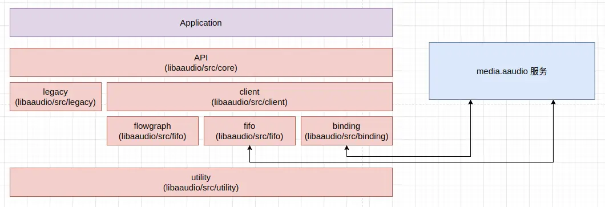
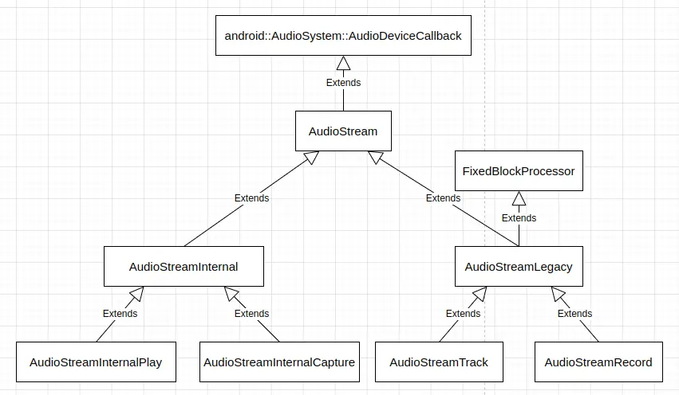
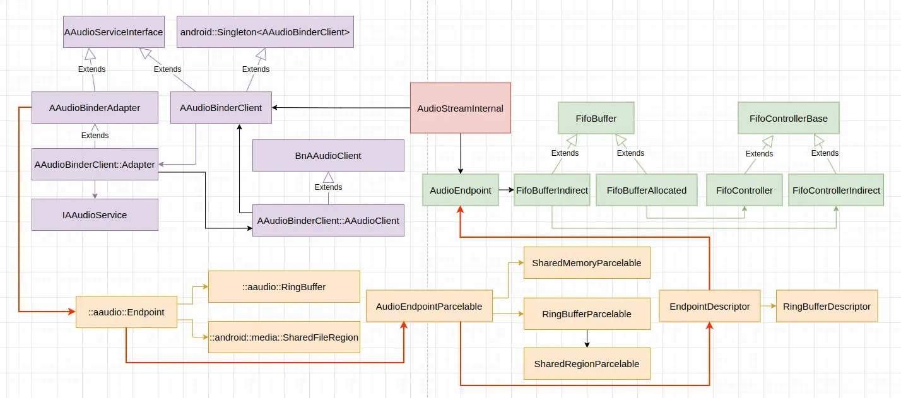
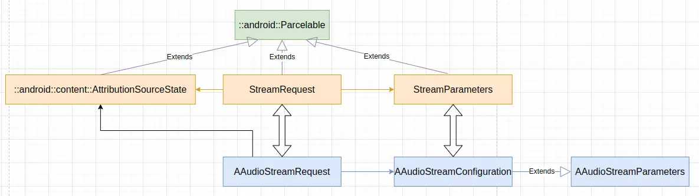
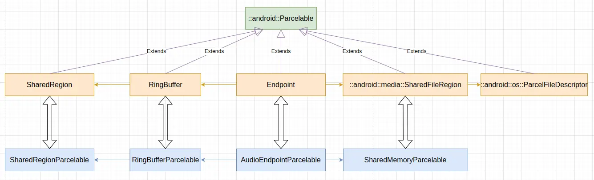
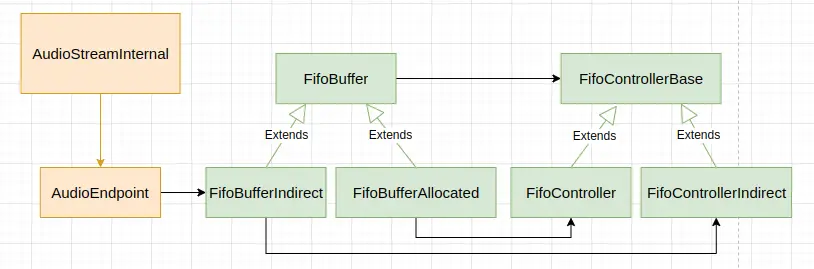
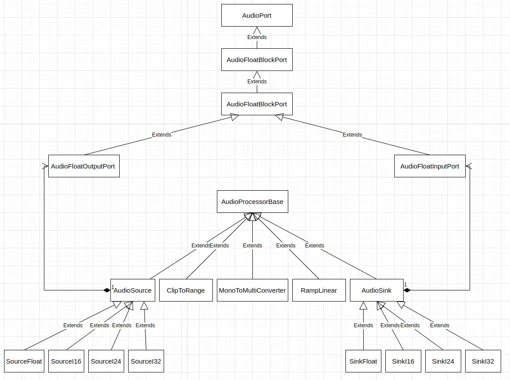
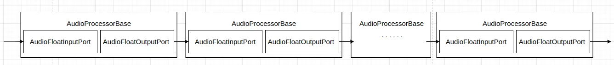
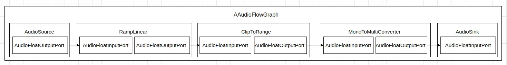

AAudio 是一个自 Android O 引入的新的 Android C API。它主要是为需要低延迟的高性能音频应用设计的。应用程序通过直接从流中读取或向流中写入数据来与 AAudio 通信，但它只包含基本的音频输入输出能力。Android 的官方文档 [AAudio](https://developer.android.com/ndk/guides/audio/aaudio/aaudio) 对 AAudio 的 API 及设计思想做了良好的介绍，这里来看一下 AAudio 的实现。后面的代码分析基于 android-12.1.0_r27 进行。

AAudio 在应用程序和 Android 设备上的音频输入输出之间移动音频数据。应用程序传入音频流和从音频流读取数据来实现这种音频数据的传递。AAudio 的实现围绕音频数据传递，围绕音频流进行。

AAudio 的数据传递主要有两种工作模式，一种是 MMap 模式，此时客户端 AAudio 库从 `media.aaudio` 服务获得一块共享内存，并通过这块共享内存将数据传给设备；另一种是所谓的传统模式，此时客户端 AAudio 的接口基于传统的 `android::AudioTrack` 和 `android::AudioRecord` 实现，与 Java 的 `AudioTrack` 和 `AudioRecord` 实现使用相同的组件。真正能够实现 AAudio 文档中说明的性能和延迟优势的是基于 mmap 的共享内存与设备传递数据的工作模式。

AAudio 库的实现主要包括这样几个模块，其源码目录结构也按照模块组织：

 * API 接口，它们直接实现了在应用程序中调用的 AAudio C 接口，相关代码位于 `libaaudio/src/core` 目录；
 * legacy，基于传统的 `android::AudioTrack` 和 `android::AudioRecord` 接口实现的音频流，相关代码位于 `libaaudio/src/legacy` 目录；
 * binding，客户端绑定，主要用于与 `media.aaudio` 服务通信，如向 `media.aaudio` 发送请求，或接收 `media.aaudio` 服务的事件通知，相关代码位于 `libaaudio/src/binding` 目录；
 * fifo，主要用于与 `media.aaudio` 服务或设备进行数据传递，AAudio 通过 binding 模块拿到了与共享内存绑定的 fd，这个 fd 在当前进程中需要重新 mmap，fifo 模块的相关类用于通过这些 mmap 的共享内存与 `media.aaudio` 服务或设备进行数据传递，相关代码位于 `libaaudio/src/fifo` 目录；
 * flowgraph，用 AAudio 播放数据时，会对数据做一些简单的处理，如通道数转换等，flowgraph 模块用于完成这些处理，相关代码位于 `libaaudio/src/flowgraph` 目录；
 * client，基于 binding、fifo 和 flowgraph 等模块实现的音频流，相关代码位于 `libaaudio/src/client` 目录；
 * utility，一些实用程序，相关代码位于 `libaaudio/src/utility` 目录。

从模块的视角来看，AAudio 库的实现结构如下图所示：



这里对 Android AAudio 实现的分析重点关注基于 mmap 的共享内存传递音频数据的音频流。

## 打开音频流

AAudio 接口的使用者通过 `AAudioStreamBuilder_openStream()` 接口，基于 `AAudioStreamBuilder` 中的音频流配置打开一个音频流。这个函数的定义 (位于 *frameworks/av/media/libaaudio/src/flowgraph/AudioProcessorBase.h*) 如下：
```
AAUDIO_API aaudio_result_t  AAudioStreamBuilder_openStream(AAudioStreamBuilder* builder,
                                                     AAudioStream** streamPtr)
{
    AudioStream *audioStream = nullptr;
    aaudio_stream_id_t id = 0;
    // Please leave these logs because they are very helpful when debugging.
    ALOGI("%s() called ----------------------------------------", __func__);
    AudioStreamBuilder *streamBuilder = COMMON_GET_FROM_BUILDER_OR_RETURN(streamPtr);
    aaudio_result_t result = streamBuilder->build(&audioStream);
    if (result == AAUDIO_OK) {
        *streamPtr = (AAudioStream*) audioStream;
        id = audioStream->getId();
    } else {
        *streamPtr = nullptr;
    }
    ALOGI("%s() returns %d = %s for s#%u ----------------",
        __func__, result, AAudio_convertResultToText(result), id);
    return result;
}
```

AAudio 实际通过 `AudioStreamBuilder::build()` 打开音频流，后者会创建及初始化音频流对象 `AudioStream` 并返回给调用者。顺便提一下，在 AAudio 接口头文件 *aaudio/AAudio.h* 中看到的 `struct AAudioStreamStruct` 和 `struct AAudioStreamBuilderStruct` 不是真实存在的结构体，这两个结构体大概和 `void` 没什么区别，实际的结构为 `aaudio::AudioStream` 和 `aaudio::AudioStreamBuilder`。

`AudioStreamBuilder::build(AudioStream** streamPtr)` 函数的定义 (位于 *frameworks/av/media/libaaudio/src/core/AudioStreamBuilder.cpp*) 如下：
```
static aaudio_result_t builder_createStream(aaudio_direction_t direction,
                                         aaudio_sharing_mode_t sharingMode,
                                         bool tryMMap,
                                         android::sp<AudioStream> &stream) {
    aaudio_result_t result = AAUDIO_OK;

    switch (direction) {

        case AAUDIO_DIRECTION_INPUT:
            if (tryMMap) {
                stream = new AudioStreamInternalCapture(AAudioBinderClient::getInstance(),
                                                                 false);
            } else {
                stream = new AudioStreamRecord();
            }
            break;

        case AAUDIO_DIRECTION_OUTPUT:
            if (tryMMap) {
                stream = new AudioStreamInternalPlay(AAudioBinderClient::getInstance(),
                                                              false);
            } else {
                stream = new AudioStreamTrack();
            }
            break;

        default:
            ALOGE("%s() bad direction = %d", __func__, direction);
            result = AAUDIO_ERROR_ILLEGAL_ARGUMENT;
    }
    return result;
}

// Try to open using MMAP path if that is allowed.
// Fall back to Legacy path if MMAP not available.
// Exact behavior is controlled by MMapPolicy.
aaudio_result_t AudioStreamBuilder::build(AudioStream** streamPtr) {

    if (streamPtr == nullptr) {
        ALOGE("%s() streamPtr is null", __func__);
        return AAUDIO_ERROR_NULL;
    }
    *streamPtr = nullptr;

    logParameters();

    aaudio_result_t result = validate();
    if (result != AAUDIO_OK) {
        return result;
    }

    // The API setting is the highest priority.
    aaudio_policy_t mmapPolicy = AudioGlobal_getMMapPolicy();
    // If not specified then get from a system property.
    if (mmapPolicy == AAUDIO_UNSPECIFIED) {
        mmapPolicy = AAudioProperty_getMMapPolicy();
    }
    // If still not specified then use the default.
    if (mmapPolicy == AAUDIO_UNSPECIFIED) {
        mmapPolicy = AAUDIO_MMAP_POLICY_DEFAULT;
    }

    int32_t mapExclusivePolicy = AAudioProperty_getMMapExclusivePolicy();
    if (mapExclusivePolicy == AAUDIO_UNSPECIFIED) {
        mapExclusivePolicy = AAUDIO_MMAP_EXCLUSIVE_POLICY_DEFAULT;
    }

    aaudio_sharing_mode_t sharingMode = getSharingMode();
    if ((sharingMode == AAUDIO_SHARING_MODE_EXCLUSIVE)
        && (mapExclusivePolicy == AAUDIO_POLICY_NEVER)) {
        ALOGD("%s() EXCLUSIVE sharing mode not supported. Use SHARED.", __func__);
        sharingMode = AAUDIO_SHARING_MODE_SHARED;
        setSharingMode(sharingMode);
    }

    bool allowMMap = mmapPolicy != AAUDIO_POLICY_NEVER;
    bool allowLegacy = mmapPolicy != AAUDIO_POLICY_ALWAYS;

    // TODO Support other performance settings in MMAP mode.
    // Disable MMAP if low latency not requested.
    if (getPerformanceMode() != AAUDIO_PERFORMANCE_MODE_LOW_LATENCY) {
        ALOGD("%s() MMAP not used because AAUDIO_PERFORMANCE_MODE_LOW_LATENCY not requested.",
              __func__);
        allowMMap = false;
    }

    // SessionID and Effects are only supported in Legacy mode.
    if (getSessionId() != AAUDIO_SESSION_ID_NONE) {
        ALOGD("%s() MMAP not used because sessionId specified.", __func__);
        allowMMap = false;
    }

    if (!allowMMap && !allowLegacy) {
        ALOGE("%s() no backend available: neither MMAP nor legacy path are allowed", __func__);
        return AAUDIO_ERROR_ILLEGAL_ARGUMENT;
    }

    setPrivacySensitive(false);
    if (mPrivacySensitiveReq == PRIVACY_SENSITIVE_DEFAULT) {
        // When not explicitly requested, set privacy sensitive mode according to input preset:
        // communication and camcorder captures are considered privacy sensitive by default.
        aaudio_input_preset_t preset = getInputPreset();
        if (preset == AAUDIO_INPUT_PRESET_CAMCORDER
                || preset == AAUDIO_INPUT_PRESET_VOICE_COMMUNICATION) {
            setPrivacySensitive(true);
        }
    } else if (mPrivacySensitiveReq == PRIVACY_SENSITIVE_ENABLED) {
        setPrivacySensitive(true);
    }

    android::sp<AudioStream> audioStream;
    result = builder_createStream(getDirection(), sharingMode, allowMMap, audioStream);
    if (result == AAUDIO_OK) {
        // Open the stream using the parameters from the builder.
        result = audioStream->open(*this);
        if (result != AAUDIO_OK) {
            bool isMMap = audioStream->isMMap();
            if (isMMap && allowLegacy) {
                ALOGV("%s() MMAP stream did not open so try Legacy path", __func__);
                // If MMAP stream failed to open then TRY using a legacy stream.
                result = builder_createStream(getDirection(), sharingMode,
                                              false, audioStream);
                if (result == AAUDIO_OK) {
                    result = audioStream->open(*this);
                }
            }
        }
        if (result == AAUDIO_OK) {
            audioStream->registerPlayerBase();
            audioStream->logOpenActual();
            *streamPtr = startUsingStream(audioStream);
        } // else audioStream will go out of scope and be deleted
    }

    return result;
}
```

创建并打开音频流时，MMap 策略是最重要的参数之一。`AudioStreamBuilder::build()` 打开音频流的主要过程如下：

 * 获得 MMap 策略，先从 API 设置中获取，如果没有设置，则从系统属性获取；
 * 从系统属性获取 MMap 独占策略；
 * 根据 MMap 独占策略和设置的共享模式修正共享模式；
 * 检查性能模式和 session id，SessionID 和音效只在传统模式中支持，性能模式不是低延迟模式的话，走传统模式；
 * 通过 `builder_createStream()` 函数创建音频流，它会根据 MMap 模式和输入输出类型创建不同类型的音频流对象；
 * 执行音频流对象的 `open()` 操作，打开音频流；
 * 如果请求打开 MMap 模式的音频流，但执行失败，则会尝试创建并打开传统模式的音频流。

AAudio 的接口实现还比较健壮，在低延迟模式由于各种各样的原因不能正常工作时，会回退到传统模式。

AAudio 中音频流对象的层次结构如下图：



不难看出，`AudioStreamInternalPlay` 和 `AudioStreamInternalCapture` 分别是 MMap 模式的播放音频流和采集音频流类型，`AudioStreamTrack` 和 `AudioStreamRecord` 则分别是传统模式的播放音频流和采集音频流类型。

AAudio 提供了设置和获取 MMap 策略的接口，这些接口的定义 (位于 *frameworks/av/media/libaaudio/src/core/AudioGlobal.cpp*) 如下：
```
static aaudio_policy_t g_MMapPolicy = AAUDIO_UNSPECIFIED;

aaudio_policy_t AudioGlobal_getMMapPolicy() {
  return g_MMapPolicy;
}

aaudio_result_t AudioGlobal_setMMapPolicy(aaudio_policy_t policy) {
    aaudio_result_t result = AAUDIO_OK;
    switch(policy) {
        case AAUDIO_UNSPECIFIED:
        case AAUDIO_POLICY_NEVER:
        case AAUDIO_POLICY_AUTO:
        case AAUDIO_POLICY_ALWAYS:
            g_MMapPolicy = policy;
            break;
        default:
            result = AAUDIO_ERROR_ILLEGAL_ARGUMENT;
            break;
    }
    return result;
}
```

定义 MMap 策略的系统属性为 `aaudio.mmap_policy`，定义 MMap 独占策略的系统属性为 `aaudio.mmap_exclusive_policy`，在 *frameworks/av/media/libaaudio/src/utility/AAudioUtilities.h* 文件中可以看到这一点：
```
int32_t AAudioProperty_getMMapPolicy();
#define AAUDIO_PROP_MMAP_POLICY           "aaudio.mmap_policy"

/**
 * Read system property.
 * @return AAUDIO_UNSPECIFIED, AAUDIO_POLICY_NEVER or AAUDIO_POLICY_AUTO or AAUDIO_POLICY_ALWAYS
 */
int32_t AAudioProperty_getMMapExclusivePolicy();
#define AAUDIO_PROP_MMAP_EXCLUSIVE_POLICY "aaudio.mmap_exclusive_policy"
```

获取系统属性的方法 (位于 *frameworks/av/media/libaaudio/src/utility/AAudioUtilities.cpp*) 如下：
```
static int32_t AAudioProperty_getMMapProperty(const char *propName,
                                              int32_t defaultValue,
                                              const char * caller) {
    int32_t prop = property_get_int32(propName, defaultValue);
    switch (prop) {
        case AAUDIO_UNSPECIFIED:
        case AAUDIO_POLICY_NEVER:
        case AAUDIO_POLICY_ALWAYS:
        case AAUDIO_POLICY_AUTO:
            break;
        default:
            ALOGE("%s: invalid = %d", caller, prop);
            prop = defaultValue;
            break;
    }
    return prop;
}

int32_t AAudioProperty_getMMapPolicy() {
    return AAudioProperty_getMMapProperty(AAUDIO_PROP_MMAP_POLICY,
                                          AAUDIO_UNSPECIFIED, __func__);
}

int32_t AAudioProperty_getMMapExclusivePolicy() {
    return AAudioProperty_getMMapProperty(AAUDIO_PROP_MMAP_EXCLUSIVE_POLICY,
                                          AAUDIO_UNSPECIFIED, __func__);
}
```

这种系统属性可以在 mk 文件中定义，如为了使 AAOS 版模拟器可以启动 `media.aaudio` 服务，需要在 `device/generic/car/emulator/audio/car_emulator_audio.mk` 文件中添加如下的行：
```
PRODUCT_PROPERTY_OVERRIDES += aaudio.mmap_policy=2
```

虽然在 AAudio 库的实现中，API 设置的 MMap 策略具有最高优先级，但客户端进程中的这种设置无法影响 `media.aaudio` 服务是否启动，而系统属性 `aaudio.mmap_policy` 的设置可以。

不同音频流类型的对象，其 `open()` 操作有着不同的行为。这里看一下 `AudioStreamInternalPlay::open()` 函数的定义 (位于 *frameworks/av/media/libaaudio/src/client/AudioStreamInternalPlay.cpp*) ：
```
aaudio_result_t AudioStreamInternalPlay::open(const AudioStreamBuilder &builder) {
    aaudio_result_t result = AudioStreamInternal::open(builder);
    if (result == AAUDIO_OK) {
        result = mFlowGraph.configure(getFormat(),
                             getSamplesPerFrame(),
                             getDeviceFormat(),
                             getDeviceChannelCount());

        if (result != AAUDIO_OK) {
            safeReleaseClose();
        }
        // Sample rate is constrained to common values by now and should not overflow.
        int32_t numFrames = kRampMSec * getSampleRate() / AAUDIO_MILLIS_PER_SECOND;
        mFlowGraph.setRampLengthInFrames(numFrames);
    }
    return result;
}
```

`AudioStreamInternalPlay::open()` 执行 `AudioStreamInternal::open(builder)`，并配置用于处理音频播放数据的数据处理流水线 `AAudioFlowGraph`。

`AudioStreamInternal::open(builder)` 函数的定义 (位于 *frameworks/av/media/libaaudio/src/client/AudioStreamInternal.cpp*) 如下：
```
aaudio_result_t AudioStreamInternal::open(const AudioStreamBuilder &builder) {

    aaudio_result_t result = AAUDIO_OK;
    int32_t framesPerBurst;
    int32_t framesPerHardwareBurst;
    AAudioStreamRequest request;
    AAudioStreamConfiguration configurationOutput;

    if (getState() != AAUDIO_STREAM_STATE_UNINITIALIZED) {
        ALOGE("%s - already open! state = %d", __func__, getState());
        return AAUDIO_ERROR_INVALID_STATE;
    }

    // Copy requested parameters to the stream.
    result = AudioStream::open(builder);
    if (result < 0) {
        return result;
    }

    const int32_t burstMinMicros = AAudioProperty_getHardwareBurstMinMicros();
    int32_t burstMicros = 0;

    const audio_format_t requestedFormat = getFormat();
    // We have to do volume scaling. So we prefer FLOAT format.
    if (requestedFormat == AUDIO_FORMAT_DEFAULT) {
        setFormat(AUDIO_FORMAT_PCM_FLOAT);
    }
    // Request FLOAT for the shared mixer or the device.
    request.getConfiguration().setFormat(AUDIO_FORMAT_PCM_FLOAT);

    // TODO b/182392769: use attribution source util
    AttributionSourceState attributionSource;
    attributionSource.uid = VALUE_OR_FATAL(android::legacy2aidl_uid_t_int32_t(getuid()));
    attributionSource.pid = VALUE_OR_FATAL(android::legacy2aidl_pid_t_int32_t(getpid()));
    attributionSource.packageName = builder.getOpPackageName();
    attributionSource.attributionTag = builder.getAttributionTag();
    attributionSource.token = sp<android::BBinder>::make();

    // Build the request to send to the server.
    request.setAttributionSource(attributionSource);
    request.setSharingModeMatchRequired(isSharingModeMatchRequired());
    request.setInService(isInService());

    request.getConfiguration().setDeviceId(getDeviceId());
    request.getConfiguration().setSampleRate(getSampleRate());
    request.getConfiguration().setDirection(getDirection());
    request.getConfiguration().setSharingMode(getSharingMode());
    request.getConfiguration().setChannelMask(getChannelMask());

    request.getConfiguration().setUsage(getUsage());
    request.getConfiguration().setContentType(getContentType());
    request.getConfiguration().setSpatializationBehavior(getSpatializationBehavior());
    request.getConfiguration().setIsContentSpatialized(isContentSpatialized());
    request.getConfiguration().setInputPreset(getInputPreset());
    request.getConfiguration().setPrivacySensitive(isPrivacySensitive());

    request.getConfiguration().setBufferCapacity(builder.getBufferCapacity());

    mDeviceChannelCount = getSamplesPerFrame(); // Assume it will be the same. Update if not.

    mServiceStreamHandle = mServiceInterface.openStream(request, configurationOutput);
    if (mServiceStreamHandle < 0
            && (request.getConfiguration().getSamplesPerFrame() == 1
                    || request.getConfiguration().getChannelMask() == AAUDIO_CHANNEL_MONO)
            && getDirection() == AAUDIO_DIRECTION_OUTPUT
            && !isInService()) {
        // if that failed then try switching from mono to stereo if OUTPUT.
        // Only do this in the client. Otherwise we end up with a mono mixer in the service
        // that writes to a stereo MMAP stream.
        ALOGD("%s() - openStream() returned %d, try switching from MONO to STEREO",
              __func__, mServiceStreamHandle);
        request.getConfiguration().setChannelMask(AAUDIO_CHANNEL_STEREO);
        mServiceStreamHandle = mServiceInterface.openStream(request, configurationOutput);
    }
    if (mServiceStreamHandle < 0) {
        return mServiceStreamHandle;
    }

    // This must match the key generated in oboeservice/AAudioServiceStreamBase.cpp
    // so the client can have permission to log.
    if (!mInService) {
        // No need to log if it is from service side.
        mMetricsId = std::string(AMEDIAMETRICS_KEY_PREFIX_AUDIO_STREAM)
                     + std::to_string(mServiceStreamHandle);
    }

    android::mediametrics::LogItem(mMetricsId)
            .set(AMEDIAMETRICS_PROP_PERFORMANCEMODE,
                 AudioGlobal_convertPerformanceModeToText(builder.getPerformanceMode()))
            .set(AMEDIAMETRICS_PROP_SHARINGMODE,
                 AudioGlobal_convertSharingModeToText(builder.getSharingMode()))
            .set(AMEDIAMETRICS_PROP_ENCODINGCLIENT,
                 android::toString(requestedFormat).c_str()).record();

    result = configurationOutput.validate();
    if (result != AAUDIO_OK) {
        goto error;
    }
    // Save results of the open.
    if (getChannelMask() == AAUDIO_UNSPECIFIED) {
        setChannelMask(configurationOutput.getChannelMask());
    }

    mDeviceChannelCount = configurationOutput.getSamplesPerFrame();

    setSampleRate(configurationOutput.getSampleRate());
    setDeviceId(configurationOutput.getDeviceId());
    setSessionId(configurationOutput.getSessionId());
    setSharingMode(configurationOutput.getSharingMode());

    setUsage(configurationOutput.getUsage());
    setContentType(configurationOutput.getContentType());
    setSpatializationBehavior(configurationOutput.getSpatializationBehavior());
    setIsContentSpatialized(configurationOutput.isContentSpatialized());
    setInputPreset(configurationOutput.getInputPreset());

    // Save device format so we can do format conversion and volume scaling together.
    setDeviceFormat(configurationOutput.getFormat());

    result = mServiceInterface.getStreamDescription(mServiceStreamHandle, mEndPointParcelable);
    if (result != AAUDIO_OK) {
        goto error;
    }

    // Resolve parcelable into a descriptor.
    result = mEndPointParcelable.resolve(&mEndpointDescriptor);
    if (result != AAUDIO_OK) {
        goto error;
    }

    // Configure endpoint based on descriptor.
    mAudioEndpoint = std::make_unique<AudioEndpoint>();
    result = mAudioEndpoint->configure(&mEndpointDescriptor, getDirection());
    if (result != AAUDIO_OK) {
        goto error;
    }

    framesPerHardwareBurst = mEndpointDescriptor.dataQueueDescriptor.framesPerBurst;

    // Scale up the burst size to meet the minimum equivalent in microseconds.
    // This is to avoid waking the CPU too often when the HW burst is very small
    // or at high sample rates.
    framesPerBurst = framesPerHardwareBurst;
    do {
        if (burstMicros > 0) {  // skip first loop
            framesPerBurst *= 2;
        }
        burstMicros = framesPerBurst * static_cast<int64_t>(1000000) / getSampleRate();
    } while (burstMicros < burstMinMicros);
    ALOGD("%s() original HW burst = %d, minMicros = %d => SW burst = %d\n",
          __func__, framesPerHardwareBurst, burstMinMicros, framesPerBurst);

    // Validate final burst size.
    if (framesPerBurst < MIN_FRAMES_PER_BURST || framesPerBurst > MAX_FRAMES_PER_BURST) {
        ALOGE("%s - framesPerBurst out of range = %d", __func__, framesPerBurst);
        result = AAUDIO_ERROR_OUT_OF_RANGE;
        goto error;
    }
    setFramesPerBurst(framesPerBurst); // only save good value

    mBufferCapacityInFrames = mEndpointDescriptor.dataQueueDescriptor.capacityInFrames;
    if (mBufferCapacityInFrames < getFramesPerBurst()
            || mBufferCapacityInFrames > MAX_BUFFER_CAPACITY_IN_FRAMES) {
        ALOGE("%s - bufferCapacity out of range = %d", __func__, mBufferCapacityInFrames);
        result = AAUDIO_ERROR_OUT_OF_RANGE;
        goto error;
    }

    mClockModel.setSampleRate(getSampleRate());
    mClockModel.setFramesPerBurst(framesPerHardwareBurst);

    if (isDataCallbackSet()) {
        mCallbackFrames = builder.getFramesPerDataCallback();
        if (mCallbackFrames > getBufferCapacity() / 2) {
            ALOGW("%s - framesPerCallback too big = %d, capacity = %d",
                  __func__, mCallbackFrames, getBufferCapacity());
            result = AAUDIO_ERROR_OUT_OF_RANGE;
            goto error;

        } else if (mCallbackFrames < 0) {
            ALOGW("%s - framesPerCallback negative", __func__);
            result = AAUDIO_ERROR_OUT_OF_RANGE;
            goto error;

        }
        if (mCallbackFrames == AAUDIO_UNSPECIFIED) {
            mCallbackFrames = getFramesPerBurst();
        }

        const int32_t callbackBufferSize = mCallbackFrames * getBytesPerFrame();
        mCallbackBuffer = std::make_unique<uint8_t[]>(callbackBufferSize);
    }

    // For debugging and analyzing the distribution of MMAP timestamps.
    // For OUTPUT, use a NEGATIVE offset to move the CPU writes further BEFORE the HW reads.
    // For INPUT, use a POSITIVE offset to move the CPU reads further AFTER the HW writes.
    // You can use this offset to reduce glitching.
    // You can also use this offset to force glitching. By iterating over multiple
    // values you can reveal the distribution of the hardware timing jitter.
    if (mAudioEndpoint->isFreeRunning()) { // MMAP?
        int32_t offsetMicros = (getDirection() == AAUDIO_DIRECTION_OUTPUT)
                ? AAudioProperty_getOutputMMapOffsetMicros()
                : AAudioProperty_getInputMMapOffsetMicros();
        // This log is used to debug some tricky glitch issues. Please leave.
        ALOGD_IF(offsetMicros, "%s() - %s mmap offset = %d micros",
                __func__,
                (getDirection() == AAUDIO_DIRECTION_OUTPUT) ? "output" : "input",
                offsetMicros);
        mTimeOffsetNanos = offsetMicros * AAUDIO_NANOS_PER_MICROSECOND;
    }

    setBufferSize(mBufferCapacityInFrames / 2); // Default buffer size to match Q

    setState(AAUDIO_STREAM_STATE_OPEN);

    return result;

error:
    safeReleaseClose();
    return result;
}
```

`AudioStreamInternal::open(builder)` 函数的执行过程大体如下：

1. 执行 `AudioStream::open(builder)` 函数，主要是将用户通过 `AudioStreamBuilder` 做的音频流配置拷贝进来，如采样率、通道数、数据格式、共享模式和性能模式等，对于用户没有设置的一些配置项，会设置适当的默认值；
2. 构造 AAudio 流请求对象，即 `AAudioStreamRequest` 对象；
3. 通过 AAudio 服务接口请求 `media.aaudio` 服务打开音频流，AAudio 服务接口打开音频流的操作的返回值包括两部分，一是操作的返回值，为 `media.aaudio` 服务打开的服务端音频流的句柄，二是用作传出参数的 `AAudioStreamConfiguration` 对象，它主要包含音频流的实际配置信息；
4. 当通过 AAudio 服务接口请求 `media.aaudio` 服务打开流失败时，如果请求的流通道数为单声道，则会尝试以双声道立体声的音频流配置再打开一次；
5. 根据打开音频流时返回的实际音频流配置信息设置当前音频流的状态；
6. 通过 AAudio 服务接口获得音频流描述，传入服务端音频流的句柄，获得一个 `AudioEndpointParcelable` 类型对象的音频流描述，AAudio 客户端与 `media.aaudio` 服务进行通信所需的共享内存相关的信息，不是在打开流时通过 `AAudioStreamConfiguration` 对象返回的，而是这里通过 `AudioEndpointParcelable` 对象返回的；
7. `AudioEndpointParcelable` 对象的通信相关共享内存信息转换为 `EndpointDescriptor` 形式的描述；
8. 创建并配置 `AudioEndpoint` 对象，它主要用来与 `media.aaudio` 服务交换命令和音频数据；
9. 根据系统属性的配置，即 `aaudio.hw_burst_min_usec` 的每次数据传输的最短时长，来修正每次数据传输的最小数据量配置；
10. 检查缓冲区的音频帧容量；
11. 设置时钟模型；
12. 配置数据回调；
13. 设置缓冲区大小，设置音频流的状态为打开状态。

由 `AudioStreamInternal::open(builder)` 函数可以看到，基于 mmap 的共享内存与设备和 `media.aaudio` 服务通信的音频流实现，其类级别的结构大概如下图所示：



虽然 API 接口实现相关代码的目录被命名为了 `core`，但在 AAudio 库中，音频流无疑才是整个实现的中心。

## binding

binding 模块主要用于与 `media.aaudio` 服务通信。AAudio 定义了 AAudio 服务接口 `AAudioServiceInterface`，`AudioStreamInternal::open(builder)` 在打开音频流时通过这接口请求 `media.aaudio` 服务打开音频流，并获得流描述，这个接口的定义 (位于 *frameworks/av/media/libaaudio/src/binding/AAudioServiceInterface.h*) 如下：
```
class AAudioServiceInterface {
public:

    AAudioServiceInterface() {};
    virtual ~AAudioServiceInterface() = default;

    virtual void registerClient(const android::sp<IAAudioClient>& client) = 0;

    /**
     * @param request info needed to create the stream
     * @param configuration contains information about the created stream
     * @return handle to the stream or a negative error
     */
    virtual aaudio_handle_t openStream(const AAudioStreamRequest &request,
                                       AAudioStreamConfiguration &configuration) = 0;

    virtual aaudio_result_t closeStream(aaudio_handle_t streamHandle) = 0;

    /* Get an immutable description of the in-memory queues
    * used to communicate with the underlying HAL or Service.
    */
    virtual aaudio_result_t getStreamDescription(aaudio_handle_t streamHandle,
                                                 AudioEndpointParcelable &parcelable) = 0;

    /**
     * Start the flow of data.
     */
    virtual aaudio_result_t startStream(aaudio_handle_t streamHandle) = 0;

    /**
     * Stop the flow of data such that start() can resume without loss of data.
     */
    virtual aaudio_result_t pauseStream(aaudio_handle_t streamHandle) = 0;

    /**
     * Stop the flow of data after data currently inthe buffer has played.
     */
    virtual aaudio_result_t stopStream(aaudio_handle_t streamHandle) = 0;

    /**
     *  Discard any data held by the underlying HAL or Service.
     */
    virtual aaudio_result_t flushStream(aaudio_handle_t streamHandle) = 0;

    /**
     * Manage the specified thread as a low latency audio thread.
     */
    virtual aaudio_result_t registerAudioThread(aaudio_handle_t streamHandle,
                                                pid_t clientThreadId,
                                                int64_t periodNanoseconds) = 0;

    virtual aaudio_result_t unregisterAudioThread(aaudio_handle_t streamHandle,
                                                  pid_t clientThreadId) = 0;

    virtual aaudio_result_t startClient(aaudio_handle_t streamHandle,
                                        const android::AudioClient& client,
                                        const audio_attributes_t *attr,
                                        audio_port_handle_t *clientHandle) = 0;

    virtual aaudio_result_t stopClient(aaudio_handle_t streamHandle,
                                       audio_port_handle_t clientHandle) = 0;
};

} /* namespace aaudio */
```

`AAudioBinderAdapter` 封装 `media.aaudio` 服务的客户端代理对象，并基于该客户端代理对象实现 `AAudioServiceInterface` 接口。`AAudioBinderAdapter` 的实现 (位于 *frameworks/av/media/libaaudio/src/binding/AAudioBinderAdapter.cpp*) 如下：
```
namespace aaudio {

using android::aidl_utils::statusTFromBinderStatus;
using android::binder::Status;

AAudioBinderAdapter::AAudioBinderAdapter(IAAudioService* delegate)
        : mDelegate(delegate) {}

void AAudioBinderAdapter::registerClient(const android::sp<IAAudioClient>& client) {
    mDelegate->registerClient(client);
}

aaudio_handle_t AAudioBinderAdapter::openStream(const AAudioStreamRequest& request,
                                                AAudioStreamConfiguration& config) {
    aaudio_handle_t result;
    StreamParameters params;
    Status status = mDelegate->openStream(request.parcelable(),
                                          &params,
                                          &result);
    if (!status.isOk()) {
        result = AAudioConvert_androidToAAudioResult(statusTFromBinderStatus(status));
    }
    config = params;
    return result;
}

aaudio_result_t AAudioBinderAdapter::closeStream(aaudio_handle_t streamHandle) {
    aaudio_result_t result;
    Status status = mDelegate->closeStream(streamHandle, &result);
    if (!status.isOk()) {
        result = AAudioConvert_androidToAAudioResult(statusTFromBinderStatus(status));
    }
    return result;
}

aaudio_result_t AAudioBinderAdapter::getStreamDescription(aaudio_handle_t streamHandle,
                                                          AudioEndpointParcelable& endpointOut) {
    aaudio_result_t result;
    Endpoint endpoint;
    Status status = mDelegate->getStreamDescription(streamHandle,
                                                    &endpoint,
                                                    &result);
    if (!status.isOk()) {
        result = AAudioConvert_androidToAAudioResult(statusTFromBinderStatus(status));
    }
    endpointOut = std::move(endpoint);
    return result;
}

aaudio_result_t AAudioBinderAdapter::startStream(aaudio_handle_t streamHandle) {
    aaudio_result_t result;
    Status status = mDelegate->startStream(streamHandle, &result);
    if (!status.isOk()) {
        result = AAudioConvert_androidToAAudioResult(statusTFromBinderStatus(status));
    }
    return result;
}

aaudio_result_t AAudioBinderAdapter::pauseStream(aaudio_handle_t streamHandle) {
    aaudio_result_t result;
    Status status = mDelegate->pauseStream(streamHandle, &result);
    if (!status.isOk()) {
        result = AAudioConvert_androidToAAudioResult(statusTFromBinderStatus(status));
    }
    return result;
}

aaudio_result_t AAudioBinderAdapter::stopStream(aaudio_handle_t streamHandle) {
    aaudio_result_t result;
    Status status = mDelegate->stopStream(streamHandle, &result);
    if (!status.isOk()) {
        result = AAudioConvert_androidToAAudioResult(statusTFromBinderStatus(status));
    }
    return result;
}

aaudio_result_t AAudioBinderAdapter::flushStream(aaudio_handle_t streamHandle) {
    aaudio_result_t result;
    Status status = mDelegate->flushStream(streamHandle, &result);
    if (!status.isOk()) {
        result = AAudioConvert_androidToAAudioResult(statusTFromBinderStatus(status));
    }
    return result;
}

aaudio_result_t AAudioBinderAdapter::registerAudioThread(aaudio_handle_t streamHandle,
                                                         pid_t clientThreadId,
                                                         int64_t periodNanoseconds) {
    aaudio_result_t result;
    Status status = mDelegate->registerAudioThread(streamHandle, clientThreadId, periodNanoseconds, &result);
    if (!status.isOk()) {
        result = AAudioConvert_androidToAAudioResult(statusTFromBinderStatus(status));
    }
    return result;
}

aaudio_result_t AAudioBinderAdapter::unregisterAudioThread(aaudio_handle_t streamHandle,
                                                           pid_t clientThreadId) {
    aaudio_result_t result;
    Status status = mDelegate->unregisterAudioThread(streamHandle, clientThreadId, &result);
    if (!status.isOk()) {
        result = AAudioConvert_androidToAAudioResult(statusTFromBinderStatus(status));
    }
    return result;
}

}  // namespace aaudio
```

`AAudioBinderAdapter` 做的事情基本就是把操转给 `media.aaudio` 服务的客户端代理对象，并适当转换返回值。

`AAudioClient` binder 接口用于 `media.aaudio` 服务向客户端通知一些事件，`AAudioBinderClient::AAudioClient` 实现 `BnAAudioClient` 接口。`AAudioBinderClient::AAudioClient` 收到事件通知后，会将事件传给 `AAudioBinderClient`。

`AAudioBinderClient::Adapter` 继承 `AAudioBinderAdapter`，它相对于 `AAudioBinderAdapter`，增加了在销毁时，注销死亡通知的逻辑。

`AAudioBinderClient` 是 binding 模块的核心，它维护 `media.aaudio` 服务的客户端代理对象、`AAudioClient` 和 `AAudioBinderAdapter` 对象等，client 模块通过它访问 `media.aaudio` 服务。

`AAudioBinderClient` 中用于获得 `AAudioServiceInterface` 接口对象的 `getAAudioService()` 函数的实现 (位于 *frameworks/av/media/libaaudio/src/binding/AAudioBinderClient.cpp*) 如下：
```
// TODO Share code with other service clients.
// Helper function to get access to the "AAudioService" service.
// This code was modeled after frameworks/av/media/libaudioclient/AudioSystem.cpp
std::shared_ptr<AAudioServiceInterface> AAudioBinderClient::getAAudioService() {
    std::shared_ptr<AAudioServiceInterface> result;
    sp<IAAudioService> aaudioService;
    bool needToRegister = false;
    {
        Mutex::Autolock _l(mServiceLock);
        if (mAdapter == nullptr) {
            sp<IBinder> binder;
            sp<IServiceManager> sm = defaultServiceManager();
            // Try several times to get the service.
            int retries = 4;
            do {
                binder = sm->getService(String16(AAUDIO_SERVICE_NAME)); // This will wait a while.
                if (binder.get() != nullptr) {
                    break;
                }
            } while (retries-- > 0);

            if (binder.get() != nullptr) {
                // Ask for notification if the service dies.
                status_t status = binder->linkToDeath(mAAudioClient);
                // TODO review what we should do if this fails
                if (status != NO_ERROR) {
                    ALOGE("%s() - linkToDeath() returned %d", __func__, status);
                }
                aaudioService = interface_cast<IAAudioService>(binder);
                mAdapter.reset(new Adapter(aaudioService, mAAudioClient));
                needToRegister = true;
                // Make sure callbacks can be received by mAAudioClient
                ProcessState::self()->startThreadPool();
            } else {
                ALOGE("AAudioBinderClient could not connect to %s", AAUDIO_SERVICE_NAME);
            }
        }
        result = mAdapter;
    }
    // Do this outside the mutex lock.
    if (needToRegister && aaudioService.get() != nullptr) { // new client?
        aaudioService->registerClient(mAAudioClient);
    }
    return result;
}
```

`AAudioBinderClient::getAAudioService()` 函数从 service manager 获得 `media.aaudio` 服务的客户端代理对象并基于该对象创建 `AAudioServiceInterface` 接口对象，然后注册死亡通知和 `AAudioClient`。

当 `AAudioBinderClient` 收到 `media.aaudio` 服务挂掉的通知时，会销毁它维护的资源，如 `media.aaudio` 服务的客户端代理对象等，这通过 `dropAAudioService()` 函数 (位于 *frameworks/av/media/libaaudio/src/binding/AAudioBinderClient.cpp*) 完成：
```
void AAudioBinderClient::dropAAudioService() {
    Mutex::Autolock _l(mServiceLock);
    mAdapter.reset();
}
```

与 `media.aaudio` 服务交换数据是 binding 模块的核心部分，具体的数据交换主要发生在这样几个操作中：

1. 在打开音频流时，发送以 `AAudioStreamRequest` 对象表示的请求，接收以 `AAudioStreamConfiguration` 对象表示的流配置信息的响应，以及服务端音频流的句柄；
2. 获得音频流的描述，发送服务端音频流的句柄，接收以 `AudioEndpointParcelable` 表示的音频流描述信息，主要是后续与 `media.aaudio` 服务通信所用的共享内存相关信息；
3. 音频数据读写。

打开音频流时用以表示请求和响应的这些数据对象具有这样的结构：



`android::content::AttributionSourceState` 对象主要包含当前进程的信息，如包名，用户 ID，进程 ID 等；`AAudioStreamConfiguration` 对象主要包含音频流的配置信息，如设备 ID，采样率，通道数，内容类型，性能模式等。可以通过 Binder IPC 跨进程传递的数据只有支持 `Parcelable` 机制进行序列化的对象。`AAudioStreamConfiguration` 对象的数据通过 AIDL 对象 `StreamParameters` 进行传递，`AAudioStreamConfiguration` 提供 `parcelable()` 操作基于当前对象的状态创建 `StreamParameters` 对象，并支持基于 `StreamParameters` 对象创建 `AAudioStreamConfiguration` 对象。`AAudioStreamRequest` 对象的数据通过 AIDL 对象 `StreamRequest` 进行传递。

音频流描述相关的数据对象具有如下这样的结构：



图中黄色矩形框中的对象为 AIDL 对象，它们直接用于 Binder IPC 数据交换。

上图中的 `SharedMemoryParcelable` 用于表示绑定于某个文件描述符，如音频设备上的一块 mmap 的共享内存空间，它可能被分割为多个不同的区域，这块内存可以使用 Binder 或在进程之间共享，这个类的定义 (位于 *frameworks/av/media/libaaudio/src/binding/SharedMemoryParcelable.h*) 如下：
```
class SharedMemoryParcelable {
public:
    SharedMemoryParcelable() = default;

    // Ctor from a parcelable representation.
    // Since the parcelable object owns a unique FD, move semantics are provided to avoid the need
    // to dupe.
    explicit SharedMemoryParcelable(android::media::SharedFileRegion&& parcelable);

    /**
     * Make a dup() of the fd and store it for later use.
     *
     * @param fd
     * @param sizeInBytes
     */
    void setup(const android::base::unique_fd& fd, int32_t sizeInBytes);

    // mmap() shared memory
    aaudio_result_t resolve(int32_t offsetInBytes, int32_t sizeInBytes, void **regionAddressPtr);

    // munmap() any mapped memory
    aaudio_result_t close();

    int32_t getSizeInBytes();

    void dump();

    // Extract a parcelable representation of this object.
    // Since we own a unique FD, move semantics are provided to avoid the need to dupe.
    android::media::SharedFileRegion parcelable() &&;

    // Copy this instance. Duplicates the underlying FD.
    SharedMemoryParcelable dup() const;

private:
#define MMAP_UNRESOLVED_ADDRESS    reinterpret_cast<uint8_t*>(MAP_FAILED)

    android::base::unique_fd   mFd;
    int64_t                    mSizeInBytes = 0;
    int64_t                    mOffsetInBytes = 0;
    uint8_t                   *mResolvedAddress = MMAP_UNRESOLVED_ADDRESS;

    aaudio_result_t resolveSharedMemory(const android::base::unique_fd& fd);
    aaudio_result_t validate() const;
};

} /* namespace aaudio */
```

`SharedMemoryParcelable` 包含共享的内存与其关联的文件描述符，内存块的大小，内存块的偏移量，及内存块在当前进程中的地址。文件描述一般来说是进程的文件描述符表的索引，它只对打开了文件的当前进程有效，它是属于进程的资源，传递文件描述符时，需要在目标进程的文件描述符表中创建对应的项指向原始的文件，Android 的 Binder 机制提供了这种跨进程传递文件描述符的能力。这里看到的文件描述符可以理解为，实际值可能与另外的进程中的原始文件描述符不同，但指向相同的实际文件的东西。

`SharedMemoryParcelable` 从直接用于 Binder IPC 通信的 AIDL 对象 `SharedFileRegion` 创建，或基于当前对象创建该对象的方法 (位于 *frameworks/av/media/libaaudio/src/binding/SharedMemoryParcelable.cpp*) 如下：
```
SharedMemoryParcelable::SharedMemoryParcelable(SharedFileRegion&& parcelable) {
    mFd = parcelable.fd.release();
    mSizeInBytes = parcelable.size;
    mOffsetInBytes = parcelable.offset;
}

SharedFileRegion SharedMemoryParcelable::parcelable() && {
    SharedFileRegion result;
    result.fd.reset(std::move(mFd));
    result.size = mSizeInBytes;
    result.offset = mOffsetInBytes;
    return result;
}
```

`SharedMemoryParcelable::resolve()` 函数用于解析以获得共享内存块中的某个共享内存区域，它会在需要的时候执行内存映射，这个函数的定义 (位于 *frameworks/av/media/libaaudio/src/binding/SharedMemoryParcelable.cpp*) 如下：
```
aaudio_result_t SharedMemoryParcelable::resolveSharedMemory(const unique_fd& fd) {
    mResolvedAddress = (uint8_t *) mmap(0, mSizeInBytes, PROT_READ | PROT_WRITE,
                                        MAP_SHARED, fd.get(), 0);
    if (mResolvedAddress == MMAP_UNRESOLVED_ADDRESS) {
        ALOGE("mmap() failed for fd = %d, nBytes = %" PRId64 ", errno = %s",
              fd.get(), mSizeInBytes, strerror(errno));
        return AAUDIO_ERROR_INTERNAL;
    }
    return AAUDIO_OK;
}

aaudio_result_t SharedMemoryParcelable::resolve(int32_t offsetInBytes, int32_t sizeInBytes,
                                              void **regionAddressPtr) {
    if (offsetInBytes < 0) {
        ALOGE("illegal offsetInBytes = %d", offsetInBytes);
        return AAUDIO_ERROR_OUT_OF_RANGE;
    } else if ((offsetInBytes + sizeInBytes) > mSizeInBytes) {
        ALOGE("out of range, offsetInBytes = %d, "
                      "sizeInBytes = %d, mSizeInBytes = %" PRId64,
              offsetInBytes, sizeInBytes, mSizeInBytes);
        return AAUDIO_ERROR_OUT_OF_RANGE;
    }

    aaudio_result_t result = AAUDIO_OK;

    if (mResolvedAddress == MMAP_UNRESOLVED_ADDRESS) {
        if (mFd.get() != -1) {
            result = resolveSharedMemory(mFd);
        } else {
            ALOGE("has no file descriptor for shared memory.");
            result = AAUDIO_ERROR_INTERNAL;
        }
    }

    if (result == AAUDIO_OK && mResolvedAddress != MMAP_UNRESOLVED_ADDRESS) {
        *regionAddressPtr = mResolvedAddress + offsetInBytes;
        ALOGV("mResolvedAddress = %p", mResolvedAddress);
        ALOGV("offset by %d, *regionAddressPtr = %p", offsetInBytes, *regionAddressPtr);
    }
    return result;
}
```

`SharedRegionParcelable` 描述由 `SharedMemoryParcelable` 所描述的共享内存块上的一个共享内存区域，这个类的定义 (位于 *frameworks/av/media/libaaudio/src/binding/SharedRegionParcelable.h*) 如下：
```
namespace aaudio {

class SharedRegionParcelable {
public:
    SharedRegionParcelable() = default;

    // Construct based on a parcelable representation.
    explicit SharedRegionParcelable(const SharedRegion& parcelable);

    void setup(int32_t sharedMemoryIndex, int32_t offsetInBytes, int32_t sizeInBytes);

    aaudio_result_t resolve(SharedMemoryParcelable *memoryParcels, void **regionAddressPtr);

    bool isFileDescriptorSafe(SharedMemoryParcelable *memoryParcels);

    void dump();

    // Extract a parcelable representation of this object.
    SharedRegion parcelable() const;

private:
    int32_t mSharedMemoryIndex = -1;
    int32_t mOffsetInBytes     = 0;
    int32_t mSizeInBytes       = 0;

    aaudio_result_t validate() const;
};

} /* namespace aaudio */
```

从 `SharedMemoryParcelable::validate()` 函数可以看到，共享内存块的大小范围为 (0 kB, 256 kB)：
```
aaudio_result_t SharedMemoryParcelable::validate() const {
    if (mSizeInBytes < 0 || mSizeInBytes >= MAX_MMAP_SIZE_BYTES) {
        ALOGE("invalid mSizeInBytes = %" PRId64, mSizeInBytes);
        return AAUDIO_ERROR_OUT_OF_RANGE;
    }
    if (mOffsetInBytes != 0) {
        ALOGE("invalid mOffsetInBytes = %" PRId64, mOffsetInBytes);
        return AAUDIO_ERROR_OUT_OF_RANGE;
    }
    return AAUDIO_OK;
}
```

`SharedRegionParcelable` 包含了指向一个 `SharedMemoryParcelable` 数组中的某个共享内存块中的一个共享内存区域的信息。执行 `SharedRegionParcelable::resolve()` 时获得这个共享内存区域在当前进程中的地址：
```
aaudio_result_t SharedRegionParcelable::resolve(SharedMemoryParcelable *memoryParcels,
                                              void **regionAddressPtr) {
    if (mSizeInBytes == 0) {
        *regionAddressPtr = nullptr;
        return AAUDIO_OK;
    }
    if (mSharedMemoryIndex < 0) {
        ALOGE("invalid mSharedMemoryIndex = %d", mSharedMemoryIndex);
        return AAUDIO_ERROR_INTERNAL;
    }
    SharedMemoryParcelable *memoryParcel = &memoryParcels[mSharedMemoryIndex];
    return memoryParcel->resolve(mOffsetInBytes, mSizeInBytes, regionAddressPtr);
}
```

操作系统提供底层的共享内存基础设施，但两个进程之间要真正地实现通过共享内存进行通信，还需要更多的协议设计，如两个进程之间怎么同步对共享内存区域的访问等。`RingBufferParcelable` 封装了几个共享内存区域，实现了一条通过共享内存交换大块数据的数据通路。`RingBufferParcelable` 类的定义 (位于 *frameworks/av/media/libaaudio/src/binding/RingBufferParcelable.h*) 如下：
```
namespace aaudio {

class RingBufferParcelable  {
public:
    RingBufferParcelable() = default;

    // Construct based on a parcelable representation.
    explicit RingBufferParcelable(const RingBuffer& parcelable);

    // TODO This assumes that all three use the same SharedMemoryParcelable
    void setupMemory(int32_t sharedMemoryIndex,
                     int32_t dataMemoryOffset,
                     int32_t dataSizeInBytes,
                     int32_t readCounterOffset,
                     int32_t writeCounterOffset,
                     int32_t counterSizeBytes);

    void setupMemory(int32_t sharedMemoryIndex,
                     int32_t dataMemoryOffset,
                     int32_t dataSizeInBytes);

    int32_t getBytesPerFrame();

    void setBytesPerFrame(int32_t bytesPerFrame);

    int32_t getFramesPerBurst();

    void setFramesPerBurst(int32_t framesPerBurst);

    int32_t getCapacityInFrames();

    void setCapacityInFrames(int32_t capacityInFrames);

    bool isFileDescriptorSafe(SharedMemoryParcelable *memoryParcels);

    aaudio_result_t resolve(SharedMemoryParcelable *memoryParcels, RingBufferDescriptor *descriptor);

    void dump();

    // Extract a parcelable representation of this object.
    RingBuffer parcelable() const;

private:
    SharedRegionParcelable  mReadCounterParcelable;
    SharedRegionParcelable  mWriteCounterParcelable;
    SharedRegionParcelable  mDataParcelable;
    int32_t                 mBytesPerFrame = 0;     // index is in frames
    int32_t                 mFramesPerBurst = 0;    // for ISOCHRONOUS queues
    int32_t                 mCapacityInFrames = 0;  // zero if unused
    RingbufferFlags         mFlags = RingbufferFlags::NONE;

    aaudio_result_t validate() const;
};

} /* namespace aaudio */
```

具体来说 `RingBufferParcelable` 封装了 3 个共享内存区域，分别用作读计数器，写计数器和音频数据传递。`RingBufferParcelable` 基于 AIDL 对象 `RingBuffer` 创建和创建 AIDL 对象 `RingBuffer` 的方法 (位于 *frameworks/av/media/libaaudio/src/binding/RingBufferParcelable.cpp*) 如下：
```
RingBufferParcelable::RingBufferParcelable(const RingBuffer& parcelable)
        : mReadCounterParcelable(std::move(parcelable.readCounterParcelable)),
          mWriteCounterParcelable(std::move(parcelable.writeCounterParcelable)),
          mDataParcelable(std::move(parcelable.dataParcelable)),
          mBytesPerFrame(parcelable.bytesPerFrame),
          mFramesPerBurst(parcelable.framesPerBurst),
          mCapacityInFrames(parcelable.capacityInFrames),
          mFlags(static_cast<RingbufferFlags>(parcelable.flags)) {
    static_assert(sizeof(mFlags) == sizeof(parcelable.flags));
}

RingBuffer RingBufferParcelable::parcelable() const {
    RingBuffer result;
    result.readCounterParcelable = std::move(mReadCounterParcelable).parcelable();
    result.writeCounterParcelable = std::move(mWriteCounterParcelable).parcelable();
    result.dataParcelable = std::move(mDataParcelable).parcelable();
    result.bytesPerFrame = mBytesPerFrame;
    result.framesPerBurst = mFramesPerBurst;
    result.capacityInFrames = mCapacityInFrames;
    static_assert(sizeof(mFlags) == sizeof(result.flags));
    result.flags = static_cast<int32_t>(mFlags);
    return result;
}
```

`RingBufferParcelable::setupMemory()` 函数设置三个内存区域在同一块内存上：
```
void RingBufferParcelable::setupMemory(int32_t sharedMemoryIndex,
                 int32_t dataMemoryOffset,
                 int32_t dataSizeInBytes,
                 int32_t readCounterOffset,
                 int32_t writeCounterOffset,
                 int32_t counterSizeBytes) {
    mReadCounterParcelable.setup(sharedMemoryIndex, readCounterOffset, counterSizeBytes);
    mWriteCounterParcelable.setup(sharedMemoryIndex, writeCounterOffset, counterSizeBytes);
    mDataParcelable.setup(sharedMemoryIndex, dataMemoryOffset, dataSizeInBytes);
}

void RingBufferParcelable::setupMemory(int32_t sharedMemoryIndex,
                 int32_t dataMemoryOffset,
                 int32_t dataSizeInBytes) {
    mReadCounterParcelable.setup(sharedMemoryIndex, 0, 0);
    mWriteCounterParcelable.setup(sharedMemoryIndex, 0, 0);
    mDataParcelable.setup(sharedMemoryIndex, dataMemoryOffset, dataSizeInBytes);
}
```

`RingBufferParcelable::resolve()` 函数用于获得三个内存区域的地址：
```
aaudio_result_t RingBufferParcelable::resolve(SharedMemoryParcelable *memoryParcels, RingBufferDescriptor *descriptor) {
    aaudio_result_t result;

    result = mReadCounterParcelable.resolve(memoryParcels,
                                            (void **) &descriptor->readCounterAddress);
    if (result != AAUDIO_OK) {
        return result;
    }

    result = mWriteCounterParcelable.resolve(memoryParcels,
                                             (void **) &descriptor->writeCounterAddress);
    if (result != AAUDIO_OK) {
        return result;
    }

    result = mDataParcelable.resolve(memoryParcels, (void **) &descriptor->dataAddress);
    if (result != AAUDIO_OK) {
        return result;
    }

    descriptor->bytesPerFrame = mBytesPerFrame;
    descriptor->framesPerBurst = mFramesPerBurst;
    descriptor->capacityInFrames = mCapacityInFrames;
    descriptor->flags = mFlags;
    return AAUDIO_OK;
}
```

一条音频流需要与 `media.aaudio` 服务维持多条基于共享内存实现的数据通路，`AudioEndpointParcelable` 维护一条音频流中与 `media.aaudio` 服务通过共享内存进行通信的相关信息，包括多个共享内存块 `SharedMemoryParcelable` 的信息，和用于不同目的的数据通路 `RingBufferParcelable` 的信息。`AudioEndpointParcelable` 类的定义 (位于 *frameworks/av/media/libaaudio/src/binding/AudioEndpointParcelable.h*) 如下：
```
namespace aaudio {

/**
 * Container for information about the message queues plus
 * general stream information needed by AAudio clients.
 * It contains no addresses, just sizes, offsets and file descriptors for
 * shared memory that can be passed through Binder.
 */
class AudioEndpointParcelable {
public:
    AudioEndpointParcelable() = default;

    // Ctor/assignment from a parcelable representation.
    // Since the parcelable object owns unique FDs (for shared memory blocks), move semantics are
    // provided to avoid the need to dupe.
    AudioEndpointParcelable(Endpoint&& parcelable);
    AudioEndpointParcelable& operator=(Endpoint&& parcelable);

    /**
     * Add the file descriptor to the table.
     * @return index in table or negative error
     */
    int32_t addFileDescriptor(const android::base::unique_fd& fd, int32_t sizeInBytes);

    aaudio_result_t resolve(EndpointDescriptor *descriptor);

    aaudio_result_t close();

    void dump();

    // Extract a parcelable representation of this object.
    // Since our shared memory objects own a unique FD, move semantics are provided to avoid the
    // need to dupe.
    Endpoint parcelable()&&;

public: // TODO add getters
    // Set capacityInFrames to zero if Queue is unused.
    RingBufferParcelable    mUpMessageQueueParcelable;   // server to client
    RingBufferParcelable    mDownMessageQueueParcelable; // to server
    RingBufferParcelable    mUpDataQueueParcelable;      // eg. record, could share same queue
    RingBufferParcelable    mDownDataQueueParcelable;    // eg. playback

private:
    aaudio_result_t         validate() const;

    int32_t                 mNumSharedMemories = 0;
    SharedMemoryParcelable  mSharedMemories[MAX_SHARED_MEMORIES];
};

} /* namespace aaudio */
```

`AudioEndpointParcelable` 对象的信息来自于 AIDL 对象 `Endpoint`。`AudioEndpointParcelable::resolve()` 函数解析共享内存的信息，在当前进程中建立用于共享内存的内存映射等：
```
aaudio_result_t AudioEndpointParcelable::resolve(EndpointDescriptor *descriptor) {
    aaudio_result_t result = mUpMessageQueueParcelable.resolve(mSharedMemories,
                                                           &descriptor->upMessageQueueDescriptor);
    if (result != AAUDIO_OK) return result;
    result = mDownMessageQueueParcelable.resolve(mSharedMemories,
                                        &descriptor->downMessageQueueDescriptor);
    if (result != AAUDIO_OK) return result;

    result = mDownDataQueueParcelable.resolve(mSharedMemories,
                                              &descriptor->dataQueueDescriptor);
    return result;
}
```

`AudioEndpointParcelable`、`RingBufferParcelable`、`SharedRegionParcelable` 和 `SharedMemoryParcelable` 等不直接用于与 `media.aaudio` 服务的通信。`AudioEndpointParcelable::resolve()` 函数解析的共享内存相关信息由 `EndpointDescriptor` 维护。`EndpointDescriptor` 的定义 (位于 *frameworks/av/media/libaaudio/src/binding/AAudioServiceDefinitions.h*) 如下：
```
// This must be a fixed width so it can be in shared memory.
enum RingbufferFlags : uint32_t {
    NONE = 0,
    RATE_ISOCHRONOUS = 0x0001,
    RATE_ASYNCHRONOUS = 0x0002,
    COHERENCY_DMA = 0x0004,
    COHERENCY_ACQUIRE_RELEASE = 0x0008,
    COHERENCY_AUTO = 0x0010,
};

// This is not passed through Binder.
// Client side code will convert Binder data and fill this descriptor.
typedef struct RingBufferDescriptor_s {
    uint8_t* dataAddress;       // offset from read or write block
    int64_t* writeCounterAddress;
    int64_t* readCounterAddress;
    int32_t  bytesPerFrame;     // index is in frames
    int32_t  framesPerBurst;    // for ISOCHRONOUS queues
    int32_t  capacityInFrames;  // zero if unused
    RingbufferFlags flags;
} RingBufferDescriptor;

// This is not passed through Binder.
// Client side code will convert Binder data and fill this descriptor.
typedef struct EndpointDescriptor_s {
    // Set capacityInFrames to zero if Queue is unused.
    RingBufferDescriptor upMessageQueueDescriptor;   // server to client
    RingBufferDescriptor downMessageQueueDescriptor; // client to server
    RingBufferDescriptor dataQueueDescriptor;    // playback or capture
} EndpointDescriptor;
```

一条音频流与 `media.aaudio` 服务实际上有三条数据通道，分别用于发送消息，接收消息和音频数据传递。

## fifo

不难看出，直接用 `EndpointDescriptor` 与 `media.aaudio` 服务通信不是很方便。fifo 模块封装用于进程间通信的共享内存块，并提供更为方便的操作。fifo 模块中各个类的结构关系如下图：



`FifoBuffer` 表示一条数据通道，`FifoControllerBase` 则用于维护 `FifoBuffer` 的读计数器和写计数器。`FifoBufferIndirect` 为基于进程间通信的共享内存块实现的 `FifoBuffer`，`FifoBufferAllocated` 为基于堆上分配的内存实现的 `FifoBuffer`。

AAudio 的音频流通过 `AudioEndpoint` 维护这些数据通道。`AudioEndpoint::configure()` 函数 (位于 *frameworks/av/media/libaaudio/src/client/AudioEndpoint.cpp*) 基于 `EndpointDescriptor` 创建 `FifoBuffer` 对象：
```
// TODO Consider moving to a method in RingBufferDescriptor
static aaudio_result_t AudioEndpoint_validateQueueDescriptor(const char *type,
                                                  const RingBufferDescriptor *descriptor) {
    if (descriptor == nullptr) {
        ALOGE("AudioEndpoint_validateQueueDescriptor() NULL descriptor");
        return AAUDIO_ERROR_NULL;
    }

    if (descriptor->capacityInFrames < 1
        || descriptor->capacityInFrames > RIDICULOUSLY_LARGE_BUFFER_CAPACITY) {
        ALOGE("AudioEndpoint_validateQueueDescriptor() bad capacityInFrames = %d",
              descriptor->capacityInFrames);
        return AAUDIO_ERROR_OUT_OF_RANGE;
    }

    // Reject extreme values to catch bugs and prevent numeric overflows.
    if (descriptor->bytesPerFrame < 1
        || descriptor->bytesPerFrame > RIDICULOUSLY_LARGE_FRAME_SIZE) {
        ALOGE("AudioEndpoint_validateQueueDescriptor() bad bytesPerFrame = %d",
              descriptor->bytesPerFrame);
        return AAUDIO_ERROR_OUT_OF_RANGE;
    }

    if (descriptor->dataAddress == nullptr) {
        ALOGE("AudioEndpoint_validateQueueDescriptor() NULL dataAddress");
        return AAUDIO_ERROR_NULL;
    }
    ALOGV("AudioEndpoint_validateQueueDescriptor %s, dataAddress at %p ====================",
          type,
          descriptor->dataAddress);
    ALOGV("AudioEndpoint_validateQueueDescriptor  readCounter at %p, writeCounter at %p",
          descriptor->readCounterAddress,
          descriptor->writeCounterAddress);

    // Try to READ from the data area.
    // This code will crash if the mmap failed.
    uint8_t value = descriptor->dataAddress[0];
    ALOGV("AudioEndpoint_validateQueueDescriptor() dataAddress[0] = %d, then try to write",
        (int) value);
    // Try to WRITE to the data area.
    descriptor->dataAddress[0] = value * 3;
    ALOGV("AudioEndpoint_validateQueueDescriptor() wrote successfully");

    if (descriptor->readCounterAddress) {
        fifo_counter_t counter = *descriptor->readCounterAddress;
        ALOGV("AudioEndpoint_validateQueueDescriptor() *readCounterAddress = %d, now write",
              (int) counter);
        *descriptor->readCounterAddress = counter;
        ALOGV("AudioEndpoint_validateQueueDescriptor() wrote readCounterAddress successfully");
    }

    if (descriptor->writeCounterAddress) {
        fifo_counter_t counter = *descriptor->writeCounterAddress;
        ALOGV("AudioEndpoint_validateQueueDescriptor() *writeCounterAddress = %d, now write",
              (int) counter);
        *descriptor->writeCounterAddress = counter;
        ALOGV("AudioEndpoint_validateQueueDescriptor() wrote writeCounterAddress successfully");
    }

    return AAUDIO_OK;
}

aaudio_result_t AudioEndpoint_validateDescriptor(const EndpointDescriptor *pEndpointDescriptor) {
    aaudio_result_t result = AudioEndpoint_validateQueueDescriptor("messages",
                                    &pEndpointDescriptor->upMessageQueueDescriptor);
    if (result == AAUDIO_OK) {
        result = AudioEndpoint_validateQueueDescriptor("data",
                                                &pEndpointDescriptor->dataQueueDescriptor);
    }
    return result;
}

aaudio_result_t AudioEndpoint::configure(const EndpointDescriptor *pEndpointDescriptor,
                                         aaudio_direction_t   direction)
{
    aaudio_result_t result = AudioEndpoint_validateDescriptor(pEndpointDescriptor);
    if (result != AAUDIO_OK) {
        return result;
    }

    // ============================ up message queue =============================
    const RingBufferDescriptor *descriptor = &pEndpointDescriptor->upMessageQueueDescriptor;
    if(descriptor->bytesPerFrame != sizeof(AAudioServiceMessage)) {
        ALOGE("configure() bytesPerFrame != sizeof(AAudioServiceMessage) = %d",
              descriptor->bytesPerFrame);
        return AAUDIO_ERROR_INTERNAL;
    }

    if(descriptor->readCounterAddress == nullptr || descriptor->writeCounterAddress == nullptr) {
        ALOGE("configure() NULL counter address");
        return AAUDIO_ERROR_NULL;
    }

    // Prevent memory leak and reuse.
    if(mUpCommandQueue != nullptr || mDataQueue != nullptr) {
        ALOGE("configure() endpoint already used");
        return AAUDIO_ERROR_INTERNAL;
    }

    mUpCommandQueue = std::make_unique<FifoBufferIndirect>(
            descriptor->bytesPerFrame,
            descriptor->capacityInFrames,
            descriptor->readCounterAddress,
            descriptor->writeCounterAddress,
            descriptor->dataAddress
    );

    // ============================ data queue =============================
    descriptor = &pEndpointDescriptor->dataQueueDescriptor;
    ALOGV("configure() data framesPerBurst = %d", descriptor->framesPerBurst);
    ALOGV("configure() data readCounterAddress = %p",
          descriptor->readCounterAddress);

    // An example of free running is when the other side is read or written by hardware DMA
    // or a DSP. It does not update its counter so we have to update it.
    int64_t *remoteCounter = (direction == AAUDIO_DIRECTION_OUTPUT)
                             ? descriptor->readCounterAddress // read by other side
                             : descriptor->writeCounterAddress; // written by other side
    mFreeRunning = (remoteCounter == nullptr);
    ALOGV("configure() mFreeRunning = %d", mFreeRunning ? 1 : 0);

    int64_t *readCounterAddress = (descriptor->readCounterAddress == nullptr)
                                  ? &mDataReadCounter
                                  : descriptor->readCounterAddress;
    int64_t *writeCounterAddress = (descriptor->writeCounterAddress == nullptr)
                                  ? &mDataWriteCounter
                                  : descriptor->writeCounterAddress;

    // Clear buffer to avoid an initial glitch on some devices.
    size_t bufferSizeBytes = descriptor->capacityInFrames * descriptor->bytesPerFrame;
    memset(descriptor->dataAddress, 0, bufferSizeBytes);

    mDataQueue = std::make_unique<FifoBufferIndirect>(
            descriptor->bytesPerFrame,
            descriptor->capacityInFrames,
            readCounterAddress,
            writeCounterAddress,
            descriptor->dataAddress
    );
    uint32_t threshold = descriptor->capacityInFrames / 2;
    mDataQueue->setThreshold(threshold);
    return result;
}
```

每条音频流实际上用了两条数据通道，一条用于 `media.aaudio` 服务向 AAudio 客户端发送消息；另一条用于音频数据传递。

`AudioEndpoint::configure()` 的执行过程大体如下：

1. 验证传进来的 `EndpointDescriptor` 对象；
2. 为 `media.aaudio` 服务向 AAudio 客户端发送消息的数据通道创建 `FifoBufferIndirect`，消息的格式将为 `AAudioServiceMessage`；
3. 为用于音频数据传递的数据通道创建 `FifoBufferIndirect`。

`FifoBuffer` 主要提供了对数据通道的读写操作。读写操作的一般过程为，先从 `FifoBuffer` 获得可用的内存区域的包装，然后对可用的内存区域进行读写。可用的内存区域的包装由 `struct WrappingBuffer` 描述，这个结构体的定义 (位于 *frameworks/av/media/libaaudio/src/fifo/FifoBuffer.h*) 如下：
```
struct WrappingBuffer {
    enum {
        SIZE = 2
    };
    void *data[SIZE];
    int32_t numFrames[SIZE];
};
```

由于数据通道的内存块是一个环形缓冲区，可用的内存区域可能跨越了缓冲区的边界，这样在缓冲区尾部和缓冲区头部的内存区域则分开描述。`getFullDataAvailable(WrappingBuffer *wrappingBuffer)` 用于获得可读的数据区域，`getEmptyRoomAvailable(WrappingBuffer *wrappingBuffer)` 用于获得可写的数据区域，这两个函数的定义 (位于 *frameworks/av/media/libaaudio/src/fifo/FifoBuffer.cpp*) 如下：
```
void FifoBuffer::fillWrappingBuffer(WrappingBuffer *wrappingBuffer,
                                    int32_t framesAvailable,
                                    int32_t startIndex) {
    wrappingBuffer->data[1] = nullptr;
    wrappingBuffer->numFrames[1] = 0;
    uint8_t *storage = getStorage();
    if (framesAvailable > 0) {
        fifo_frames_t capacity = mFifo->getCapacity();
        uint8_t *source = &storage[convertFramesToBytes(startIndex)];
        // Does the available data cross the end of the FIFO?
        if ((startIndex + framesAvailable) > capacity) {
            wrappingBuffer->data[0] = source;
            fifo_frames_t firstFrames = capacity - startIndex;
            wrappingBuffer->numFrames[0] = firstFrames;
            wrappingBuffer->data[1] = &storage[0];
            wrappingBuffer->numFrames[1] = framesAvailable - firstFrames;
        } else {
            wrappingBuffer->data[0] = source;
            wrappingBuffer->numFrames[0] = framesAvailable;
        }
    } else {
        wrappingBuffer->data[0] = nullptr;
        wrappingBuffer->numFrames[0] = 0;
    }
}

fifo_frames_t FifoBuffer::getFullDataAvailable(WrappingBuffer *wrappingBuffer) {
    // The FIFO might be overfull so clip to capacity.
    fifo_frames_t framesAvailable = std::min(mFifo->getFullFramesAvailable(),
                                             mFifo->getCapacity());
    fifo_frames_t startIndex = mFifo->getReadIndex();
    fillWrappingBuffer(wrappingBuffer, framesAvailable, startIndex);
    return framesAvailable;
}

fifo_frames_t FifoBuffer::getEmptyRoomAvailable(WrappingBuffer *wrappingBuffer) {
    // The FIFO might have underrun so clip to capacity.
    fifo_frames_t framesAvailable = std::min(mFifo->getEmptyFramesAvailable(),
                                             mFifo->getCapacity());
    fifo_frames_t startIndex = mFifo->getWriteIndex();
    fillWrappingBuffer(wrappingBuffer, framesAvailable, startIndex);
    return framesAvailable;
}
```

`FifoBuffer` 的使用者可以通过 `getFullDataAvailable(WrappingBuffer *wrappingBuffer)` 和 `getEmptyRoomAvailable(WrappingBuffer *wrappingBuffer)` 获得可用的缓冲区，然后通过获得的缓冲区来传递数据或消息，也可以直接使用 `FifoBuffer` 的 `read()` 和 `write()` 操作，这两个函数的定义 (位于 *frameworks/av/media/libaaudio/src/fifo/FifoBuffer.cpp*) 如下：
```
fifo_frames_t FifoBuffer::read(void *buffer, fifo_frames_t numFrames) {
    WrappingBuffer wrappingBuffer;
    uint8_t *destination = (uint8_t *) buffer;
    fifo_frames_t framesLeft = numFrames;

    getFullDataAvailable(&wrappingBuffer);

    // Read data in one or two parts.
    int partIndex = 0;
    while (framesLeft > 0 && partIndex < WrappingBuffer::SIZE) {
        fifo_frames_t framesToRead = framesLeft;
        fifo_frames_t framesAvailable = wrappingBuffer.numFrames[partIndex];
        if (framesAvailable > 0) {
            if (framesToRead > framesAvailable) {
                framesToRead = framesAvailable;
            }
            int32_t numBytes = convertFramesToBytes(framesToRead);
            memcpy(destination, wrappingBuffer.data[partIndex], numBytes);

            destination += numBytes;
            framesLeft -= framesToRead;
        } else {
            break;
        }
        partIndex++;
    }
    fifo_frames_t framesRead = numFrames - framesLeft;
    mFifo->advanceReadIndex(framesRead);
    return framesRead;
}

fifo_frames_t FifoBuffer::write(const void *buffer, fifo_frames_t numFrames) {
    WrappingBuffer wrappingBuffer;
    uint8_t *source = (uint8_t *) buffer;
    fifo_frames_t framesLeft = numFrames;

    getEmptyRoomAvailable(&wrappingBuffer);

    // Read data in one or two parts.
    int partIndex = 0;
    while (framesLeft > 0 && partIndex < WrappingBuffer::SIZE) {
        fifo_frames_t framesToWrite = framesLeft;
        fifo_frames_t framesAvailable = wrappingBuffer.numFrames[partIndex];
        if (framesAvailable > 0) {
            if (framesToWrite > framesAvailable) {
                framesToWrite = framesAvailable;
            }
            int32_t numBytes = convertFramesToBytes(framesToWrite);
            memcpy(wrappingBuffer.data[partIndex], source, numBytes);

            source += numBytes;
            framesLeft -= framesToWrite;
        } else {
            break;
        }
        partIndex++;
    }
    fifo_frames_t framesWritten = numFrames - framesLeft;
    mFifo->advanceWriteIndex(framesWritten);
    return framesWritten;
}
```

`FifoBuffer` 的 `read()` 和 `write()` 操作的大体过程如下：

1. 通过 `getFullDataAvailable(WrappingBuffer *wrappingBuffer)` 或 `getEmptyRoomAvailable(WrappingBuffer *wrappingBuffer)` 获得可用的缓冲区；
2. 读些数据；
3. 更新读计数器或写计数器。

读计数器和写计数器都是单调递增的，缓冲区中的可读数据量为写计数器减去读计数器，可写数据量为阈值减去可读数据量，读指针和写指针通过读计数器和写计数器除以缓冲区容量取余获得，如下面的代码 (位于 *frameworks/av/media/libaaudio/src/fifo/FifoControllerBase.cpp*) 所示：
```
FifoControllerBase::FifoControllerBase(fifo_frames_t capacity, fifo_frames_t threshold)
        : mCapacity(capacity)
        , mThreshold(threshold)
{
}

FifoControllerBase::~FifoControllerBase() {
}

fifo_frames_t FifoControllerBase::getFullFramesAvailable() {
    fifo_frames_t temp = 0;
    __builtin_sub_overflow(getWriteCounter(), getReadCounter(), &temp);
    return temp;
}

fifo_frames_t FifoControllerBase::getReadIndex() {
    // % works with non-power of two sizes
    return (fifo_frames_t) ((uint64_t)getReadCounter() % mCapacity);
}

void FifoControllerBase::advanceReadIndex(fifo_frames_t numFrames) {
   fifo_counter_t temp = 0;
    __builtin_add_overflow(getReadCounter(), numFrames, &temp);
    setReadCounter(temp);
}

fifo_frames_t FifoControllerBase::getEmptyFramesAvailable() {
    return (int32_t)(mThreshold - getFullFramesAvailable());
}

fifo_frames_t FifoControllerBase::getWriteIndex() {
    // % works with non-power of two sizes
    return (fifo_frames_t) ((uint64_t)getWriteCounter() % mCapacity);
}

void FifoControllerBase::advanceWriteIndex(fifo_frames_t numFrames) {
    fifo_counter_t temp = 0;
    __builtin_add_overflow(getWriteCounter(), numFrames, &temp);
    setWriteCounter(temp);
}

void FifoControllerBase::setThreshold(fifo_frames_t threshold) {
    if (threshold > mCapacity) {
        threshold = mCapacity;
    } else if (threshold < 0) {
        threshold = 0;
    }
    mThreshold = threshold;
}
```

`FifoBuffer` 的使用者无法直接操作其 `FifoControllerBase`，对 `FifoBuffer` 的读写操作受其严格控制，因而读写不会越界。

## AAudio 中的数据处理

AAudio 主要的目标是高性能的音频采集和播放，但对于要播放的数据，它也可以做一些简单的处理。具体来说，它可以接收 `float`、`int16_t`、`int 24` 和 `int32_t` 格式的音频采样数据，并转换为这些格式的音频采样数据传递出去。在接收数据和把数据传递出去之间，它可以对这些数据执行音量斜坡，音频采样值范围限定和单声道转多声道等处理。在接收数据和把数据传递出去之间对数据的处理，只针对 `float` 格式的数据执行，用于接收数据的 `AudioSource` 组件，将送进来的任意格式的数据转为 `float` 格式的数据，用于将数据传递出去的 `AudioSink` 将 `float` 格式的数据转换为期望的数据格式。

AAudio 中数据处理相关的类的结构如下图：



AAudio 定义了 `AudioProcessorBase`，用以表示音频数据处理节点组件，这个类的定义 (位于 *frameworks/av/media/libaaudio/src/flowgraph/AudioProcessorBase.h*) 如下：
```
class AudioProcessorBase {
public:
    virtual ~AudioProcessorBase() = default;

    /**
     * Perform custom function.
     *
     * @param framePosition index of first frame to be processed
     * @param numFrames maximum number of frames requested for processing
     * @return number of frames actually processed
     */
    virtual int32_t onProcess(int64_t framePosition, int32_t numFrames) = 0;

    /**
     * If the framePosition is at or after the last frame position then call onProcess().
     * This prevents infinite recursion in case of cyclic graphs.
     * It also prevents nodes upstream from a branch from being executed twice.
     *
     * @param framePosition
     * @param numFrames
     * @return
     */
    int32_t pullData(int64_t framePosition, int32_t numFrames);

protected:
    int64_t  mLastFramePosition = -1; // Start at -1 so that the first pull works.

private:
    int32_t  mFramesValid = 0; // num valid frames in the block
};
```

`AudioProcessorBase` 的 `onProcess()` 函数执行定制的数据处理操作，`pullData()` 用以驱动 `AudioProcessorBase` 执行数据处理。`AudioProcessorBase` 的实现如下：
```
int32_t AudioProcessorBase::pullData(int64_t framePosition, int32_t numFrames) {
    if (framePosition > mLastFramePosition) {
        mLastFramePosition = framePosition;
        mFramesValid = onProcess(framePosition, numFrames);
    }
    return mFramesValid;
}
```

`pullData()` 方法在传入的参数 `framePosition` 比上次处理的音频帧的位置更靠后时才调用 `onProcess()`，防止了音频数据处理图成环时的无穷递归。它还可以防止分支上游的节点被执行两次。

AAudio 定义了 `AudioPort` 连接器以使数据可以在不同的 `AudioProcessorBase` 模块间流动，这些类的定义 (位于 *frameworks/av/media/libaaudio/src/flowgraph/AudioProcessorBase.h*) 如下：
```
class AudioPort {
public:
    AudioPort(AudioProcessorBase &parent, int32_t samplesPerFrame)
            : mParent(parent)
            , mSamplesPerFrame(samplesPerFrame) {
    }

    // Ports are often declared public. So let's make them non-copyable.
    AudioPort(const AudioPort&) = delete;
    AudioPort& operator=(const AudioPort&) = delete;

    int32_t getSamplesPerFrame() const {
        return mSamplesPerFrame;
    }

protected:
    AudioProcessorBase &mParent;

private:
    const int32_t    mSamplesPerFrame = 1;
};

/***************************************************************************/
/**
 * This port contains a float type buffer.
 * The size is framesPerBlock * samplesPerFrame).
 */
class AudioFloatBlockPort  : public AudioPort {
public:
    AudioFloatBlockPort(AudioProcessorBase &mParent,
                   int32_t samplesPerFrame,
                   int32_t framesPerBlock = kDefaultBlockSize
                );

    virtual ~AudioFloatBlockPort();

    int32_t getFramesPerBlock() const {
        return mFramesPerBlock;
    }

protected:

    /**
     * @return buffer internal to the port or from a connected port
     */
    virtual float *getBlock() {
        return mSampleBlock;
    }


private:
    const int32_t    mFramesPerBlock = 1;
    float           *mSampleBlock = nullptr; // allocated in constructor
};

/***************************************************************************/
/**
  * The results of a module are stored in the buffer of the output ports.
  */
class AudioFloatOutputPort : public AudioFloatBlockPort {
public:
    AudioFloatOutputPort(AudioProcessorBase &parent, int32_t samplesPerFrame)
            : AudioFloatBlockPort(parent, samplesPerFrame) {
    }

    virtual ~AudioFloatOutputPort() = default;

    using AudioFloatBlockPort::getBlock;

    /**
     * Call the parent module's onProcess() method.
     * That may pull data from its inputs and recursively
     * process the entire graph.
     * @return number of frames actually pulled
     */
    int32_t pullData(int64_t framePosition, int32_t numFrames);

    /**
     * Connect to the input of another module.
     * An input port can only have one connection.
     * An output port can have multiple connections.
     * If you connect a second output port to an input port
     * then it overwrites the previous connection.
     *
     * This not thread safe. Do not modify the graph topology form another thread while running.
     */
    void connect(AudioFloatInputPort *port);

    /**
     * Disconnect from the input of another module.
     * This not thread safe.
     */
    void disconnect(AudioFloatInputPort *port);
};

/***************************************************************************/
class AudioFloatInputPort : public AudioFloatBlockPort {
public:
    AudioFloatInputPort(AudioProcessorBase &parent, int32_t samplesPerFrame)
            : AudioFloatBlockPort(parent, samplesPerFrame) {
    }

    virtual ~AudioFloatInputPort() = default;

    /**
     * If connected to an output port then this will return
     * that output ports buffers.
     * If not connected then it returns the input ports own buffer
     * which can be loaded using setValue().
     */
    float *getBlock() override;

    /**
     * Pull data from any output port that is connected.
     */
    int32_t pullData(int64_t framePosition, int32_t numFrames);

    /**
     * Write every value of the float buffer.
     * This value will be ignored if an output port is connected
     * to this port.
     */
    void setValue(float value) {
        int numFloats = kDefaultBlockSize * getSamplesPerFrame();
        float *buffer = getBlock();
        for (int i = 0; i < numFloats; i++) {
            *buffer++ = value;
        }
    }

    /**
     * Connect to the output of another module.
     * An input port can only have one connection.
     * An output port can have multiple connections.
     * This not thread safe.
     */
    void connect(AudioFloatOutputPort *port) {
        assert(getSamplesPerFrame() == port->getSamplesPerFrame());
        mConnected = port;
    }

    void disconnect(AudioFloatOutputPort *port) {
        assert(mConnected == port);
        (void) port;
        mConnected = nullptr;
    }

    void disconnect() {
        mConnected = nullptr;
    }

private:
    AudioFloatOutputPort *mConnected = nullptr;
};
```

`AudioFloatBlockPort` 主要维护了一个用于实现数据传递的缓冲区。将不同的 `AudioProcessorBase` 模块连接起来的工作，主要由 `AudioFloatOutputPort` 和 `AudioFloatInputPort` 完成，它们添加了 `pullData()`、`connect()` 和 `disconnect()` 等操作。这些 `AudioPort` 的实现 (位于 *frameworks/av/media/libaaudio/src/flowgraph/AudioProcessorBase.cpp*) 如下：
```
/***************************************************************************/
AudioFloatBlockPort::AudioFloatBlockPort(AudioProcessorBase &parent,
                               int32_t samplesPerFrame,
                               int32_t framesPerBlock)
        : AudioPort(parent, samplesPerFrame)
        , mFramesPerBlock(framesPerBlock)
        , mSampleBlock(NULL) {
    int32_t numFloats = framesPerBlock * getSamplesPerFrame();
    mSampleBlock = new float[numFloats]{0.0f};
}

AudioFloatBlockPort::~AudioFloatBlockPort() {
    delete[] mSampleBlock;
}

/***************************************************************************/
int32_t AudioFloatOutputPort::pullData(int64_t framePosition, int32_t numFrames) {
    numFrames = std::min(getFramesPerBlock(), numFrames);
    return mParent.pullData(framePosition, numFrames);
}

// These need to be in the .cpp file because of forward cross references.
void AudioFloatOutputPort::connect(AudioFloatInputPort *port) {
    port->connect(this);
}

void AudioFloatOutputPort::disconnect(AudioFloatInputPort *port) {
    port->disconnect(this);
}

/***************************************************************************/
int32_t AudioFloatInputPort::pullData(int64_t framePosition, int32_t numFrames) {
    return (mConnected == NULL)
            ? std::min(getFramesPerBlock(), numFrames)
            : mConnected->pullData(framePosition, numFrames);
}

float *AudioFloatInputPort::getBlock() {
    if (mConnected == NULL) {
        return AudioFloatBlockPort::getBlock(); // loaded using setValue()
    } else {
        return mConnected->getBlock();
    }
}
```

`AudioPort` 设计中的工作方式是这样的：

1. `AudioProcessorBase` 模块包含 `AudioFloatOutputPort` 对象，`AudioFloatOutputPort` 的 `pullData()` 接口用于驱动音频数据处理流水线对音频数据做处理，即调用 `AudioProcessorBase` 的  `pullData()` 并继而执行 `AudioProcessorBase` 的数据操作 `onProcess()`，在 `AudioProcessorBase` 的数据操作 `onProcess()` 实现中，`AudioProcessorBase` 从别处拿到要处理的数据，处理之后放进 `AudioFloatOutputPort` 的缓冲区中；
2. `AudioProcessorBase` 模块包含 `AudioFloatInputPort` 对象，用于从其它 `AudioProcessorBase` 模块获得它们处理之后的数据，`AudioFloatInputPort` 对象持有包含它的 `AudioProcessorBase` 模块的引用不是必须的；
3. `AudioFloatOutputPort` 和 `AudioFloatInputPort` 的 `connect()` 和 `disconnect()` 操作主要用于将前面的 `AudioProcessorBase` 模块的 `AudioFloatInputPort` 和后面的 `AudioProcessorBase` 模块的 `AudioFloatOutputPort` 连接起来。

由 `AudioProcessorBase`、`AudioFloatOutputPort` 和 `AudioFloatOutputPort` 组成的音频数据处理流水线将如下图所示：



不同 `AudioProcessorBase` 模块间的数据传递由 `AudioFloatOutputPort` 和 `AudioFloatOutputPort` 完成，同一个 `AudioProcessorBase` 模块中的 `AudioFloatOutputPort` 和 `AudioFloatOutputPort` 之间的数据传递，则主要由 `AudioProcessorBase` 的数据操作 `onProcess()` 接口完成。

AAudio 定义了 `AudioSource` 来表示处理输入数据，也就是将某种类型的音频数据转换为 `float` 型数据的节点组件，这个类的定义 (位于 *frameworks/av/media/libaaudio/src/flowgraph/AudioProcessorBase.h*) 如下：
```
class AudioSource : public AudioProcessorBase {
public:
    explicit AudioSource(int32_t channelCount)
            : output(*this, channelCount) {
    }

    virtual ~AudioSource() = default;

    AudioFloatOutputPort output;

    void setData(const void *data, int32_t numFrames) {
        mData = data;
        mSizeInFrames = numFrames;
        mFrameIndex = 0;
    }

protected:
    const void *mData = nullptr;
    int32_t     mSizeInFrames = 0; // number of frames in mData
    int32_t     mFrameIndex = 0; // index of next frame to be processed
};
```

`AudioSource` 提供了一个接口 `setData()` 给外界来为音频数据处理流水线提供源数据，并通过它包含的 `AudioFloatOutputPort` 将转换之后的数据传递给音频数据处理流水线后续的 `AudioProcessorBase` 模块。

AAudio 定义了 `AudioSink` 来表示处理输出数据，也就是将 `float` 型数据转换为某种类型的音频数据的节点组件，这个类的定义 (位于 *frameworks/av/media/libaaudio/src/flowgraph/AudioProcessorBase.h*) 如下：
```
class AudioSink : public AudioProcessorBase {
public:
    explicit AudioSink(int32_t channelCount)
            : input(*this, channelCount) {
    }

    virtual ~AudioSink() = default;

    AudioFloatInputPort input;

    /**
     * Do nothing. The work happens in the read() method.
     *
     * @param framePosition index of first frame to be processed
     * @param numFrames
     * @return number of frames actually processed
     */
    int32_t onProcess(int64_t framePosition, int32_t numFrames) override {
        (void) framePosition;
        (void) numFrames;
        return 0;
    };

    virtual int32_t read(void *data, int32_t numFrames) = 0;

protected:
    int32_t pull(int32_t numFrames);

private:
    int64_t mFramePosition = 0;
};
```

`AudioSink` 的 `onProcess()` 函数为空操作，它添加了新的 `read()` 操作，来完成音频数据处理流水线中最后的数据处理操作，并获取处理之后的数据。`AudioSink` 的当前设计将 `onProcess()` 实现为空操作，这破坏了继承的 `pullData()` 和 `onProcess()` 接口的语义。对于 `AudioSink` 的设计，还可以有其它的选择：

(1). 不需要添加 `read()` 操作；
(2). 在包含了一个 `AudioFloatInputPort` 对象之外，`AudioSink` 再包含一个 `AudioFloatOutputPort` 对象；
(3). 由 `AudioFloatOutputPort` 对象的 `pullData()` 驱动整个音频数据处理流水线工作；
(4). 将原本 `read()` 接口完成的工作分为两部分，数据处理的部分放在 `onProcess()` 接口中，处理之后的数据被保存在 `AudioFloatOutputPort` 的缓冲区中，获取数据的部分则直接通过 `AudioFloatOutputPort` 对象完成。

不过当前的设计，倒是可以避免一次数据拷贝。这大概也是为了通用性而付出的努力，还是要为性能而妥协的一个例子。这里再看几个不同类型 `AudioProcessorBase` 模块的例子。`SourceI16` 是用于将 `int16_t` 类型的源数据转换为 `float` 型数据的 `AudioSource`，这个类的定义 (位于 *frameworks/av/media/libaaudio/src/flowgraph/SourceI16.h*) 如下：
```
namespace flowgraph {

class SourceI16 : public AudioSource {
public:
    explicit SourceI16(int32_t channelCount);

    int32_t onProcess(int64_t framePosition, int32_t numFrames) override;
};

} /* namespace flowgraph */
```

这个类的实现 (位于 *frameworks/av/media/libaaudio/src/flowgraph/SourceI16.cpp*) 如下：
```
using namespace flowgraph;

SourceI16::SourceI16(int32_t channelCount)
        : AudioSource(channelCount) {
}

int32_t SourceI16::onProcess(int64_t framePosition, int32_t numFrames) {
    float *floatData = output.getBlock();
    int32_t channelCount = output.getSamplesPerFrame();

    int32_t framesLeft = mSizeInFrames - mFrameIndex;
    int32_t framesToProcess = std::min(numFrames, framesLeft);
    int32_t numSamples = framesToProcess * channelCount;

    const int16_t *shortBase = static_cast<const int16_t *>(mData);
    const int16_t *shortData = &shortBase[mFrameIndex * channelCount];

#ifdef __ANDROID__
    memcpy_to_float_from_i16(floatData, shortData, numSamples);
#else
    for (int i = 0; i < numSamples; i++) {
        *floatData++ = *shortData++ * (1.0f / 32768);
    }
#endif

    mFrameIndex += framesToProcess;
    return framesToProcess;
}
```

`MonoToMultiConverter` 处于音频数据处理流水线的中间位置，它用于将单声道的数据转换为多声道的数据，这个类的定义 (位于 *frameworks/av/media/libaaudio/src/flowgraph/MonoToMultiConverter.h*) 如下：
```
namespace flowgraph {

class MonoToMultiConverter : public AudioProcessorBase {
public:
    explicit MonoToMultiConverter(int32_t channelCount);

    virtual ~MonoToMultiConverter();

    int32_t onProcess(int64_t framePosition, int32_t numFrames) override;

    AudioFloatInputPort input;
    AudioFloatOutputPort output;
};

} /* namespace flowgraph */
```

这个类的实现 (位于 *frameworks/av/media/libaaudio/src/flowgraph/MonoToMultiConverter.cpp*) 如下：
```
using namespace flowgraph;

MonoToMultiConverter::MonoToMultiConverter(int32_t channelCount)
        : input(*this, 1)
        , output(*this, channelCount) {
}

MonoToMultiConverter::~MonoToMultiConverter() { }

int32_t MonoToMultiConverter::onProcess(int64_t framePosition, int32_t numFrames) {
    int32_t framesToProcess = input.pullData(framePosition, numFrames);

    const float *inputBuffer = input.getBlock();
    float *outputBuffer = output.getBlock();
    int32_t channelCount = output.getSamplesPerFrame();
    // TODO maybe move to audio_util as audio_mono_to_multi()
    for (int i = 0; i < framesToProcess; i++) {
        // read one, write many
        float sample = *inputBuffer++;
        for (int channel = 0; channel < channelCount; channel++) {
            *outputBuffer++ = sample;
        }
    }
    return framesToProcess;
}
```

`SinkI16` 是将 `float` 型数据转换为 `int16_t` 型数据的 `AudioSink`，这个类的定义 (位于 *frameworks/av/media/libaaudio/src/flowgraph/SinkI16.h*) 如下：
```
namespace flowgraph {

class SinkI16 : public AudioSink {
public:
    explicit SinkI16(int32_t channelCount);

    int32_t read(void *data, int32_t numFrames) override;
};

} /* namespace flowgraph */
```

这个类的实现 (位于 *frameworks/av/media/libaaudio/src/flowgraph/SinkI16.cpp*) 如下：
```
using namespace flowgraph;

SinkI16::SinkI16(int32_t channelCount)
        : AudioSink(channelCount) {}

int32_t SinkI16::read(void *data, int32_t numFrames) {
    int16_t *shortData = (int16_t *) data;
    const int32_t channelCount = input.getSamplesPerFrame();

    int32_t framesLeft = numFrames;
    while (framesLeft > 0) {
        // Run the graph and pull data through the input port.
        int32_t framesRead = pull(framesLeft);
        if (framesRead <= 0) {
            break;
        }
        const float *signal = input.getBlock();
        int32_t numSamples = framesRead * channelCount;
#ifdef __ANDROID__
        memcpy_to_i16_from_float(shortData, signal, numSamples);
        shortData += numSamples;
        signal += numSamples;
#else
        for (int i = 0; i < numSamples; i++) {
            int32_t n = (int32_t) (*signal++ * 32768.0f);
            *shortData++ = std::min(INT16_MAX, std::max(INT16_MIN, n)); // clip
        }
#endif
        framesLeft -= framesRead;
    }
    return numFrames - framesLeft;
}
```

AAudio 的音频数据处理流水线由 `AAudioFlowGraph` 维护，这个类的定义 (位于 *frameworks/av/media/libaaudio/src/client/AAudioFlowGraph.h*) 如下：
```
class AAudioFlowGraph {
public:
    /** Connect several modules together to convert from source to sink.
     * This should only be called once for each instance.
     *
     * @param sourceFormat
     * @param sourceChannelCount
     * @param sinkFormat
     * @param sinkChannelCount
     * @return
     */
    aaudio_result_t configure(audio_format_t sourceFormat,
                              int32_t sourceChannelCount,
                              audio_format_t sinkFormat,
                              int32_t sinkChannelCount);

    void process(const void *source, void *destination, int32_t numFrames);

    /**
     * @param volume between 0.0 and 1.0
     */
    void setTargetVolume(float volume);

    void setRampLengthInFrames(int32_t numFrames);

private:
    std::unique_ptr<flowgraph::AudioSource>          mSource;
    std::unique_ptr<flowgraph::RampLinear>           mVolumeRamp;
    std::unique_ptr<flowgraph::ClipToRange>          mClipper;
    std::unique_ptr<flowgraph::MonoToMultiConverter> mChannelConverter;
    std::unique_ptr<flowgraph::AudioSink>            mSink;
};
```

`AAudioFlowGraph` 在配置时搭建音频数据处理流水线，并提供 `process()` 操作通过音频数据处理流水线对数据做处理：
```
using namespace flowgraph;

aaudio_result_t AAudioFlowGraph::configure(audio_format_t sourceFormat,
                          int32_t sourceChannelCount,
                          audio_format_t sinkFormat,
                          int32_t sinkChannelCount) {
    AudioFloatOutputPort *lastOutput = nullptr;

    // TODO change back to ALOGD
    ALOGI("%s() source format = 0x%08x, channels = %d, sink format = 0x%08x, channels = %d",
          __func__, sourceFormat, sourceChannelCount, sinkFormat, sinkChannelCount);

    switch (sourceFormat) {
        case AUDIO_FORMAT_PCM_FLOAT:
            mSource = std::make_unique<SourceFloat>(sourceChannelCount);
            break;
        case AUDIO_FORMAT_PCM_16_BIT:
            mSource = std::make_unique<SourceI16>(sourceChannelCount);
            break;
        case AUDIO_FORMAT_PCM_24_BIT_PACKED:
            mSource = std::make_unique<SourceI24>(sourceChannelCount);
            break;
        case AUDIO_FORMAT_PCM_32_BIT:
            mSource = std::make_unique<SourceI32>(sourceChannelCount);
            break;
        default:
            ALOGE("%s() Unsupported source format = %d", __func__, sourceFormat);
            return AAUDIO_ERROR_UNIMPLEMENTED;
    }
    lastOutput = &mSource->output;

    // Apply volume as a ramp to avoid pops.
    mVolumeRamp = std::make_unique<RampLinear>(sourceChannelCount);
    lastOutput->connect(&mVolumeRamp->input);
    lastOutput = &mVolumeRamp->output;

    // For a pure float graph, there is chance that the data range may be very large.
    // So we should clip to a reasonable value that allows a little headroom.
    if (sourceFormat == AUDIO_FORMAT_PCM_FLOAT && sinkFormat == AUDIO_FORMAT_PCM_FLOAT) {
        mClipper = std::make_unique<ClipToRange>(sourceChannelCount);
        lastOutput->connect(&mClipper->input);
        lastOutput = &mClipper->output;
    }

    // Expand the number of channels if required.
    if (sourceChannelCount == 1 && sinkChannelCount > 1) {
        mChannelConverter = std::make_unique<MonoToMultiConverter>(sinkChannelCount);
        lastOutput->connect(&mChannelConverter->input);
        lastOutput = &mChannelConverter->output;
    } else if (sourceChannelCount != sinkChannelCount) {
        ALOGE("%s() Channel reduction not supported.", __func__);
        return AAUDIO_ERROR_UNIMPLEMENTED;
    }

    switch (sinkFormat) {
        case AUDIO_FORMAT_PCM_FLOAT:
            mSink = std::make_unique<SinkFloat>(sinkChannelCount);
            break;
        case AUDIO_FORMAT_PCM_16_BIT:
            mSink = std::make_unique<SinkI16>(sinkChannelCount);
            break;
        case AUDIO_FORMAT_PCM_24_BIT_PACKED:
            mSink = std::make_unique<SinkI24>(sinkChannelCount);
            break;
        case AUDIO_FORMAT_PCM_32_BIT:
            mSink = std::make_unique<SinkI32>(sinkChannelCount);
            break;
        default:
            ALOGE("%s() Unsupported sink format = %d", __func__, sinkFormat);
            return AAUDIO_ERROR_UNIMPLEMENTED;
    }
    lastOutput->connect(&mSink->input);

    return AAUDIO_OK;
}

void AAudioFlowGraph::process(const void *source, void *destination, int32_t numFrames) {
    mSource->setData(source, numFrames);
    mSink->read(destination, numFrames);
}

/**
 * @param volume between 0.0 and 1.0
 */
void AAudioFlowGraph::setTargetVolume(float volume) {
    mVolumeRamp->setTarget(volume);
}

void AAudioFlowGraph::setRampLengthInFrames(int32_t numFrames) {
    mVolumeRamp->setLengthInFrames(numFrames);
}
```

这样，AAudio 的音频数据处理流水线最终将像下面这样：



## 音频流的实现

打开音频流时分配了音频流跑起来所需的大部分资源，在应用程序请求启动音频流时，音频流会真正地跑起来。AAudio 请求启动音频流的接口实现 (位于 *frameworks/av/media/libaaudio/src/core/AAudioAudio.cpp*) 如下：
```
AAUDIO_API aaudio_result_t  AAudioStream_requestStart(AAudioStream* stream)
{
    AudioStream *audioStream = convertAAudioStreamToAudioStream(stream);
    aaudio_stream_id_t id = audioStream->getId();
    ALOGD("%s(s#%u) called --------------", __func__, id);
    aaudio_result_t result = audioStream->systemStart();
    ALOGD("%s(s#%u) returned %d ---------", __func__, id, result);
    return result;
}
```

这个函数调用 `AudioStream::systemStart()` 函数，后者的定义 (位于 *frameworks/av/media/libaaudio/src/core/AudioStream.cpp*) 如下：
```
aaudio_result_t AudioStream::systemStart() {
    if (collidesWithCallback()) {
        ALOGE("%s cannot be called from a callback!", __func__);
        return AAUDIO_ERROR_INVALID_STATE;
    }

    std::lock_guard<std::mutex> lock(mStreamLock);

    switch (getState()) {
        // Is this a good time to start?
        case AAUDIO_STREAM_STATE_OPEN:
        case AAUDIO_STREAM_STATE_PAUSING:
        case AAUDIO_STREAM_STATE_PAUSED:
        case AAUDIO_STREAM_STATE_STOPPING:
        case AAUDIO_STREAM_STATE_STOPPED:
        case AAUDIO_STREAM_STATE_FLUSHING:
        case AAUDIO_STREAM_STATE_FLUSHED:
            break; // Proceed with starting.

        // Already started?
        case AAUDIO_STREAM_STATE_STARTING:
        case AAUDIO_STREAM_STATE_STARTED:
            ALOGW("%s() stream was already started, state = %s", __func__,
                  AudioGlobal_convertStreamStateToText(getState()));
            return AAUDIO_ERROR_INVALID_STATE;

        // Don't start when the stream is dead!
        case AAUDIO_STREAM_STATE_DISCONNECTED:
        case AAUDIO_STREAM_STATE_CLOSING:
        case AAUDIO_STREAM_STATE_CLOSED:
        default:
            ALOGW("%s() stream is dead, state = %s", __func__,
                  AudioGlobal_convertStreamStateToText(getState()));
            return AAUDIO_ERROR_INVALID_STATE;
    }

    aaudio_result_t result = requestStart_l();
    if (result == AAUDIO_OK) {
        // We only call this for logging in "dumpsys audio". So ignore return code.
        (void) mPlayerBase->startWithStatus(getDeviceId());
    }
    return result;
}
```

`AudioStream::systemStart()` 函数检查音频流的当前状态；当状态允许启动时，则请求具体的音频流执行启动动作，即 `requestStart_l()`。`AudioStreamInternal::requestStart_l()` 函数的定义 (位于 *frameworks/av/media/libaaudio/src/client/AudioStreamInternal.cpp*) 如下：
```
aaudio_result_t AudioStreamInternal::requestStart_l()
{
    int64_t startTime;
    if (mServiceStreamHandle == AAUDIO_HANDLE_INVALID) {
        ALOGD("requestStart() mServiceStreamHandle invalid");
        return AAUDIO_ERROR_INVALID_STATE;
    }
    if (isActive()) {
        ALOGD("requestStart() already active");
        return AAUDIO_ERROR_INVALID_STATE;
    }

    aaudio_stream_state_t originalState = getState();
    if (originalState == AAUDIO_STREAM_STATE_DISCONNECTED) {
        ALOGD("requestStart() but DISCONNECTED");
        return AAUDIO_ERROR_DISCONNECTED;
    }
    setState(AAUDIO_STREAM_STATE_STARTING);

    // Clear any stale timestamps from the previous run.
    drainTimestampsFromService();

    prepareBuffersForStart(); // tell subclasses to get ready

    aaudio_result_t result = mServiceInterface.startStream(mServiceStreamHandle);
    if (result == AAUDIO_ERROR_INVALID_HANDLE) {
        ALOGD("%s() INVALID_HANDLE, stream was probably stolen", __func__);
        // Stealing was added in R. Coerce result to improve backward compatibility.
        result = AAUDIO_ERROR_DISCONNECTED;
        setState(AAUDIO_STREAM_STATE_DISCONNECTED);
    }

    startTime = AudioClock::getNanoseconds();
    mClockModel.start(startTime);
    mNeedCatchUp.request();  // Ask data processing code to catch up when first timestamp received.

    // Start data callback thread.
    if (result == AAUDIO_OK && isDataCallbackSet()) {
        // Launch the callback loop thread.
        int64_t periodNanos = mCallbackFrames
                              * AAUDIO_NANOS_PER_SECOND
                              / getSampleRate();
        mCallbackEnabled.store(true);
        result = createThread_l(periodNanos, aaudio_callback_thread_proc, this);
    }
    if (result != AAUDIO_OK) {
        setState(originalState);
    }
    return result;
}
 . . . . . .
aaudio_result_t AudioStreamInternal::drainTimestampsFromService() {
    aaudio_result_t result = AAUDIO_OK;

    while (result == AAUDIO_OK) {
        AAudioServiceMessage message;
        if (!mAudioEndpoint) {
            break;
        }
        if (mAudioEndpoint->readUpCommand(&message) != 1) {
            break; // no command this time, no problem
        }
        switch (message.what) {
            // ignore most messages
            case AAudioServiceMessage::code::TIMESTAMP_SERVICE:
            case AAudioServiceMessage::code::TIMESTAMP_HARDWARE:
                break;

            case AAudioServiceMessage::code::EVENT:
                result = onEventFromServer(&message);
                break;

            default:
                ALOGE("%s - unrecognized message.what = %d", __func__, (int) message.what);
                result = AAUDIO_ERROR_INTERNAL;
                break;
        }
    }
    return result;
}
```

这个函数的执行过程如下：

1. 检查音频流的当前状态并设置当前状态为 `AAUDIO_STREAM_STATE_STARTING`；
2. 清空服务端发送过来的消息；
3. **请求音频流子类为启动做好准备，准备好缓冲区；**
4. 通过 AAudio 服务接口请求 `media.aaudio` 服务启动音频流；
5. 将当前时间设置为同步时钟模型的启动时间，以方便预测给定时间点的音频流位置；
6. **音频流的数据传递有推模式和拉模式两种，一种是应用程序通过音频流提供的 `read()`/`write()` 操作同步地将音频数据取出送入音频流；另一种是为音频流设置一个数据回调，此时 AAudio 为音频流起一个线程，先通过回调与应用程序完成数据传递，之后再将数据写入或读出数据流。当设置了数据回调时，计算回调执行的周期，请求启动一个线程。**

为音频流启动的线程执行的任务 (位于 *frameworks/av/media/libaaudio/src/client/AudioStreamInternal.cpp*) 如下：
```
static void *aaudio_callback_thread_proc(void *context)
{
    AudioStreamInternal *stream = (AudioStreamInternal *)context;
    //LOGD("oboe_callback_thread, stream = %p", stream);
    if (stream != NULL) {
        return stream->callbackLoop();
    } else {
        return NULL;
    }
}
```

播放音频流的回调循环 (位于 *frameworks/av/media/libaaudio/src/client/AudioStreamInternalPlay.cpp*) 是这样的：
```
void *AudioStreamInternalPlay::callbackLoop() {
    ALOGD("%s() entering >>>>>>>>>>>>>>>", __func__);
    aaudio_result_t result = AAUDIO_OK;
    aaudio_data_callback_result_t callbackResult = AAUDIO_CALLBACK_RESULT_CONTINUE;
    if (!isDataCallbackSet()) return NULL;
    int64_t timeoutNanos = calculateReasonableTimeout(mCallbackFrames);

    // result might be a frame count
    while (mCallbackEnabled.load() && isActive() && (result >= 0)) {
        // Call application using the AAudio callback interface.
        callbackResult = maybeCallDataCallback(mCallbackBuffer.get(), mCallbackFrames);

        if (callbackResult == AAUDIO_CALLBACK_RESULT_CONTINUE) {
            // Write audio data to stream. This is a BLOCKING WRITE!
            result = write(mCallbackBuffer.get(), mCallbackFrames, timeoutNanos);
            if ((result != mCallbackFrames)) {
                if (result >= 0) {
                    // Only wrote some of the frames requested. Must have timed out.
                    result = AAUDIO_ERROR_TIMEOUT;
                }
                maybeCallErrorCallback(result);
                break;
            }
        } else if (callbackResult == AAUDIO_CALLBACK_RESULT_STOP) {
            ALOGD("%s(): callback returned AAUDIO_CALLBACK_RESULT_STOP", __func__);
            result = systemStopInternal();
            break;
        }
    }

    ALOGD("%s() exiting, result = %d, isActive() = %d <<<<<<<<<<<<<<",
          __func__, result, (int) isActive());
    return NULL;
}
```

它不断向应用程序请求音频数据，获得的音频数据被保存在一块缓冲区中，之后被写入音频流。

采集音频流的回调循环 (位于 *frameworks/av/media/libaaudio/src/client/AudioStreamInternalCapture.cpp*) 是这样的：
```
void *AudioStreamInternalCapture::callbackLoop() {
    aaudio_result_t result = AAUDIO_OK;
    aaudio_data_callback_result_t callbackResult = AAUDIO_CALLBACK_RESULT_CONTINUE;
    if (!isDataCallbackSet()) return NULL;

    // result might be a frame count
    while (mCallbackEnabled.load() && isActive() && (result >= 0)) {

        // Read audio data from stream.
        int64_t timeoutNanos = calculateReasonableTimeout(mCallbackFrames);

        // This is a BLOCKING READ!
        result = read(mCallbackBuffer.get(), mCallbackFrames, timeoutNanos);
        if ((result != mCallbackFrames)) {
            ALOGE("callbackLoop: read() returned %d", result);
            if (result >= 0) {
                // Only read some of the frames requested. Must have timed out.
                result = AAUDIO_ERROR_TIMEOUT;
            }
            maybeCallErrorCallback(result);
            break;
        }

        // Call application using the AAudio callback interface.
        callbackResult = maybeCallDataCallback(mCallbackBuffer.get(), mCallbackFrames);

        if (callbackResult == AAUDIO_CALLBACK_RESULT_STOP) {
            ALOGD("%s(): callback returned AAUDIO_CALLBACK_RESULT_STOP", __func__);
            result = systemStopInternal();
            break;
        }
    }

    ALOGD("callbackLoop() exiting, result = %d, isActive() = %d",
          result, (int) isActive());
    return NULL;
}
```

它不断从音频流读取数据，随后通过回调函数传给应用程序。

`AudioStream` 创建线程的过程 (位于 *frameworks/av/media/libaaudio/src/core/AudioStream.cpp*) 如下：
```
void* AudioStream::wrapUserThread() {
    void* procResult = nullptr;
    mThreadRegistrationResult = registerThread();
    if (mThreadRegistrationResult == AAUDIO_OK) {
        // Run callback loop. This may take a very long time.
        procResult = mThreadProc(mThreadArg);
        mThreadRegistrationResult = unregisterThread();
    }
    return procResult;
}


// This is the entry point for the new thread created by createThread_l().
// It converts the 'C' function call to a C++ method call.
static void* AudioStream_internalThreadProc(void* threadArg) {
    AudioStream *audioStream = (AudioStream *) threadArg;
    // Prevent the stream from being deleted while being used.
    // This is just for extra safety. It is probably not needed because
    // this callback should be joined before the stream is closed.
    android::sp<AudioStream> protectedStream(audioStream);
    // Balance the incStrong() in createThread_l().
    protectedStream->decStrong(nullptr);
    return protectedStream->wrapUserThread();
}

// This is not exposed in the API.
// But it is still used internally to implement callbacks for MMAP mode.
aaudio_result_t AudioStream::createThread_l(int64_t periodNanoseconds,
                                            aaudio_audio_thread_proc_t threadProc,
                                            void* threadArg)
{
    if (mHasThread) {
        ALOGD("%s() - previous thread was not joined, join now to be safe", __func__);
        joinThread_l(nullptr);
    }
    if (threadProc == nullptr) {
        return AAUDIO_ERROR_NULL;
    }
    // Pass input parameters to the background thread.
    mThreadProc = threadProc;
    mThreadArg = threadArg;
    setPeriodNanoseconds(periodNanoseconds);
    mHasThread = true;
    // Prevent this object from getting deleted before the thread has a chance to create
    // its strong pointer. Assume the thread will call decStrong().
    this->incStrong(nullptr);
    int err = pthread_create(&mThread, nullptr, AudioStream_internalThreadProc, this);
    if (err != 0) {
        android::status_t status = -errno;
        ALOGE("%s() - pthread_create() failed, %d", __func__, status);
        this->decStrong(nullptr); // Because the thread won't do it.
        mHasThread = false;
        return AAudioConvert_androidToAAudioResult(status);
    } else {
        // TODO Use AAudioThread or maybe AndroidThread
        // Name the thread with an increasing index, "AAudio_#", for debugging.
        static std::atomic<uint32_t> nextThreadIndex{1};
        char name[16]; // max length for a pthread_name
        uint32_t index = nextThreadIndex++;
        // Wrap the index so that we do not hit the 16 char limit
        // and to avoid hard-to-read large numbers.
        index = index % 100000;  // arbitrary
        snprintf(name, sizeof(name), "AAudio_%u", index);
        err = pthread_setname_np(mThread, name);
        ALOGW_IF((err != 0), "Could not set name of AAudio thread. err = %d", err);

        return AAUDIO_OK;
    }
}
```

`AudioStream` 通过 `pthread_create()` 创建一个线程，执行任务 `AudioStream_internalThreadProc`，然后设置线程的名字。新创建的线程跑起来之后，首先注册当前线程，随后运行创建线程时丢进来的任务，也就是 AAudio 音频流的回调循环。注册当前线程会将线程信息发送给 `media.aaudio` 服务 (位于 *frameworks/av/media/libaaudio/src/client/AudioStreamInternal.cpp*) ：
```
aaudio_result_t AudioStreamInternal::registerThread() {
    if (mServiceStreamHandle == AAUDIO_HANDLE_INVALID) {
        ALOGW("%s() mServiceStreamHandle invalid", __func__);
        return AAUDIO_ERROR_INVALID_STATE;
    }
    return mServiceInterface.registerAudioThread(mServiceStreamHandle,
                                              gettid(),
                                              getPeriodNanoseconds());
}
```

尽管请求 `AudioStream` 创建线程时传入了周期时长，但周期执行不是在 `AudioStream` 中处理的。

音频流数据传递的同步模式中，应用程序向 AAudio 的音频流写入数据来将音频数据播放出来。向音频流写入音频数据的接口实现 (位于 *frameworks/av/media/libaaudio/src/core/AAudioAudio.cpp*) 如下：
```
AAUDIO_API aaudio_result_t AAudioStream_write(AAudioStream* stream,
                               const void *buffer,
                               int32_t numFrames,
                               int64_t timeoutNanoseconds)
{
    AudioStream *audioStream = convertAAudioStreamToAudioStream(stream);
    if (buffer == nullptr) {
        return AAUDIO_ERROR_NULL;
    }

    // Don't allow writes when playing with a callback.
    if (audioStream->isDataCallbackActive()) {
        // A developer requested this warning because it would have saved lots of debugging.
        ALOGW("%s() - Cannot write to a callback stream when running.", __func__);
        return AAUDIO_ERROR_INVALID_STATE;
    }

    if (numFrames < 0) {
        return AAUDIO_ERROR_ILLEGAL_ARGUMENT;
    } else if (numFrames == 0) {
        return 0;
    }

    aaudio_result_t result = audioStream->write(buffer, numFrames, timeoutNanoseconds);

    return result;
}
```

这个函数检查参数以及音频流是否工作在同步模式下，随后通过音频流对象的 `write()` 操作写入音频数据，和异步模式的回调循环中使用相同的操作。`write()` 操作由具体的音频流实现，对于音频播放流，为 `AudioStreamInternalPlay::write()`，该函数定义 (位于 *frameworks/av/media/libaaudio/src/client/AudioStreamInternalPlay.cpp*) 如下：
```
aaudio_result_t AudioStreamInternalPlay::write(const void *buffer, int32_t numFrames,
                                               int64_t timeoutNanoseconds) {
    return processData((void *)buffer, numFrames, timeoutNanoseconds);
}
```

`AudioStreamInternalPlay::write()` 通过 `AudioStreamInternal::processData()` 执行数据处理循环，并执行必要的等待 (位于 *frameworks/av/media/libaaudio/src/client/AudioStreamInternal.cpp*)，直到所有数据都处理完，或最大等待时间到了：
```
aaudio_result_t AudioStreamInternal::processData(void *buffer, int32_t numFrames,
                                                 int64_t timeoutNanoseconds)
{
    const char * traceName = "aaProc";
    const char * fifoName = "aaRdy";
    ATRACE_BEGIN(traceName);
    if (ATRACE_ENABLED()) {
        int32_t fullFrames = mAudioEndpoint->getFullFramesAvailable();
        ATRACE_INT(fifoName, fullFrames);
    }

    aaudio_result_t result = AAUDIO_OK;
    int32_t loopCount = 0;
    uint8_t* audioData = (uint8_t*)buffer;
    int64_t currentTimeNanos = AudioClock::getNanoseconds();
    const int64_t entryTimeNanos = currentTimeNanos;
    const int64_t deadlineNanos = currentTimeNanos + timeoutNanoseconds;
    int32_t framesLeft = numFrames;

    // Loop until all the data has been processed or until a timeout occurs.
    while (framesLeft > 0) {
        // The call to processDataNow() will not block. It will just process as much as it can.
        int64_t wakeTimeNanos = 0;
        aaudio_result_t framesProcessed = processDataNow(audioData, framesLeft,
                                                  currentTimeNanos, &wakeTimeNanos);
        if (framesProcessed < 0) {
            result = framesProcessed;
            break;
        }
        framesLeft -= (int32_t) framesProcessed;
        audioData += framesProcessed * getBytesPerFrame();

        // Should we block?
        if (timeoutNanoseconds == 0) {
            break; // don't block
        } else if (wakeTimeNanos != 0) {
            if (!mAudioEndpoint->isFreeRunning()) {
                // If there is software on the other end of the FIFO then it may get delayed.
                // So wake up just a little after we expect it to be ready.
                wakeTimeNanos += mWakeupDelayNanos;
            }

            currentTimeNanos = AudioClock::getNanoseconds();
            int64_t earliestWakeTime = currentTimeNanos + mMinimumSleepNanos;
            // Guarantee a minimum sleep time.
            if (wakeTimeNanos < earliestWakeTime) {
                wakeTimeNanos = earliestWakeTime;
            }

            if (wakeTimeNanos > deadlineNanos) {
                // If we time out, just return the framesWritten so far.
                // TODO remove after we fix the deadline bug
                ALOGW("processData(): entered at %lld nanos, currently %lld",
                      (long long) entryTimeNanos, (long long) currentTimeNanos);
                ALOGW("processData(): TIMEOUT after %lld nanos",
                      (long long) timeoutNanoseconds);
                ALOGW("processData(): wakeTime = %lld, deadline = %lld nanos",
                      (long long) wakeTimeNanos, (long long) deadlineNanos);
                ALOGW("processData(): past deadline by %d micros",
                      (int)((wakeTimeNanos - deadlineNanos) / AAUDIO_NANOS_PER_MICROSECOND));
                mClockModel.dump();
                mAudioEndpoint->dump();
                break;
            }

            if (ATRACE_ENABLED()) {
                int32_t fullFrames = mAudioEndpoint->getFullFramesAvailable();
                ATRACE_INT(fifoName, fullFrames);
                int64_t sleepForNanos = wakeTimeNanos - currentTimeNanos;
                ATRACE_INT("aaSlpNs", (int32_t)sleepForNanos);
            }

            AudioClock::sleepUntilNanoTime(wakeTimeNanos);
            currentTimeNanos = AudioClock::getNanoseconds();
        }
    }

    if (ATRACE_ENABLED()) {
        int32_t fullFrames = mAudioEndpoint->getFullFramesAvailable();
        ATRACE_INT(fifoName, fullFrames);
    }

    // return error or framesProcessed
    (void) loopCount;
    ATRACE_END();
    return (result < 0) ? result : numFrames - framesLeft;
}
```

`AudioStreamInternal::processData()` 的数据处理循环通过其子类的 `processDataNow()` 处理数据，对于播放音频流，`processDataNow()` 执行写数据的动作，而对于采集音频流 `processDataNow()` 执行读数据的动作。`processDataNow()` 的执行不阻塞，它只处理尽可能多的数据。

播放音频流的 `AudioStreamInternalPlay::processDataNow()` 函数定义 (位于 *frameworks/av/media/libaaudio/src/client/AudioStreamInternalPlay.cpp*)如下：
```
aaudio_result_t AudioStreamInternalPlay::processDataNow(void *buffer, int32_t numFrames,
                                              int64_t currentNanoTime, int64_t *wakeTimePtr) {
    aaudio_result_t result = processCommands();
    if (result != AAUDIO_OK) {
        return result;
    }

    const char *traceName = "aaWrNow";
    ATRACE_BEGIN(traceName);

    if (mClockModel.isStarting()) {
        // Still haven't got any timestamps from server.
        // Keep waiting until we get some valid timestamps then start writing to the
        // current buffer position.
        ALOGV("%s() wait for valid timestamps", __func__);
        // Sleep very briefly and hope we get a timestamp soon.
        *wakeTimePtr = currentNanoTime + (2000 * AAUDIO_NANOS_PER_MICROSECOND);
        ATRACE_END();
        return 0;
    }
    // If we have gotten this far then we have at least one timestamp from server.

    // If a DMA channel or DSP is reading the other end then we have to update the readCounter.
    if (mAudioEndpoint->isFreeRunning()) {
        // Update data queue based on the timing model.
        int64_t estimatedReadCounter = mClockModel.convertTimeToPosition(currentNanoTime);
        // ALOGD("AudioStreamInternal::processDataNow() - estimatedReadCounter = %d", (int)estimatedReadCounter);
        mAudioEndpoint->setDataReadCounter(estimatedReadCounter);
    }

    if (mNeedCatchUp.isRequested()) {
        // Catch an MMAP pointer that is already advancing.
        // This will avoid initial underruns caused by a slow cold start.
        // We add a one burst margin in case the DSP advances before we can write the data.
        // This can help prevent the beginning of the stream from being skipped.
        advanceClientToMatchServerPosition(getFramesPerBurst());
        mNeedCatchUp.acknowledge();
    }

    // If the read index passed the write index then consider it an underrun.
    // For shared streams, the xRunCount is passed up from the service.
    if (mAudioEndpoint->isFreeRunning() && mAudioEndpoint->getFullFramesAvailable() < 0) {
        mXRunCount++;
        if (ATRACE_ENABLED()) {
            ATRACE_INT("aaUnderRuns", mXRunCount);
        }
    }

    // Write some data to the buffer.
    //ALOGD("AudioStreamInternal::processDataNow() - writeNowWithConversion(%d)", numFrames);
    int32_t framesWritten = writeNowWithConversion(buffer, numFrames);
    //ALOGD("AudioStreamInternal::processDataNow() - tried to write %d frames, wrote %d",
    //    numFrames, framesWritten);
    if (ATRACE_ENABLED()) {
        ATRACE_INT("aaWrote", framesWritten);
    }

    // Sleep if there is too much data in the buffer.
    // Calculate an ideal time to wake up.
    if (wakeTimePtr != nullptr
            && (mAudioEndpoint->getFullFramesAvailable() >= getBufferSize())) {
        // By default wake up a few milliseconds from now.  // TODO review
        int64_t wakeTime = currentNanoTime + (1 * AAUDIO_NANOS_PER_MILLISECOND);
        aaudio_stream_state_t state = getState();
        //ALOGD("AudioStreamInternal::processDataNow() - wakeTime based on %s",
        //      AAudio_convertStreamStateToText(state));
        switch (state) {
            case AAUDIO_STREAM_STATE_OPEN:
            case AAUDIO_STREAM_STATE_STARTING:
                if (framesWritten != 0) {
                    // Don't wait to write more data. Just prime the buffer.
                    wakeTime = currentNanoTime;
                }
                break;
            case AAUDIO_STREAM_STATE_STARTED:
            {
                // Sleep until the readCounter catches up and we only have
                // the getBufferSize() frames of data sitting in the buffer.
                int64_t nextReadPosition = mAudioEndpoint->getDataWriteCounter() - getBufferSize();
                wakeTime = mClockModel.convertPositionToTime(nextReadPosition);
            }
                break;
            default:
                break;
        }
        *wakeTimePtr = wakeTime;

    }

    ATRACE_END();
    return framesWritten;
}
```

这个函数首先调用 `processCommands()` 处理 `media.aaudio` 服务发送过来的命令，随后主要执行 `writeNowWithConversion()` 写入音频数据，随后计算等待时间并返回。`AudioStreamInternalPlay::writeNowWithConversion()` 函数从我们前面介绍过的 fifo 拿一块内存，处理音频数据，将处理之后的音频数据写入内存区域，并移动写计数器：
```
aaudio_result_t AudioStreamInternalPlay::writeNowWithConversion(const void *buffer,
                                                            int32_t numFrames) {
    WrappingBuffer wrappingBuffer;
    uint8_t *byteBuffer = (uint8_t *) buffer;
    int32_t framesLeft = numFrames;

    mAudioEndpoint->getEmptyFramesAvailable(&wrappingBuffer);

    // Write data in one or two parts.
    int partIndex = 0;
    while (framesLeft > 0 && partIndex < WrappingBuffer::SIZE) {
        int32_t framesToWrite = framesLeft;
        int32_t framesAvailable = wrappingBuffer.numFrames[partIndex];
        if (framesAvailable > 0) {
            if (framesToWrite > framesAvailable) {
                framesToWrite = framesAvailable;
            }

            int32_t numBytes = getBytesPerFrame() * framesToWrite;

            mFlowGraph.process((void *)byteBuffer,
                               wrappingBuffer.data[partIndex],
                               framesToWrite);

            byteBuffer += numBytes;
            framesLeft -= framesToWrite;
        } else {
            break;
        }
        partIndex++;
    }
    int32_t framesWritten = numFrames - framesLeft;
    mAudioEndpoint->advanceWriteIndex(framesWritten);

    return framesWritten;
}
```

音频流数据传递的同步模式中，应用程序从 AAudio 的音频流读取数据来获得采集的音频数据。从音频流读取数据的接口实现 (位于 *frameworks/av/media/libaaudio/src/core/AAudioAudio.cpp*) 如下：
```
AAUDIO_API aaudio_result_t AAudioStream_read(AAudioStream* stream,
                               void *buffer,
                               int32_t numFrames,
                               int64_t timeoutNanoseconds)
{
    AudioStream *audioStream = convertAAudioStreamToAudioStream(stream);
    if (buffer == nullptr) {
        return AAUDIO_ERROR_NULL;
    }
    if (numFrames < 0) {
        return AAUDIO_ERROR_ILLEGAL_ARGUMENT;
    } else if (numFrames == 0) {
        return 0;
    }

    aaudio_result_t result = audioStream->read(buffer, numFrames, timeoutNanoseconds);

    return result;
}
```

这个函数检查参数，随后通过音频流对象的 `read()` 操作读取音频数据，和异步模式的回调循环中使用相同的操作。`read()` 操作由具体的音频流实现，对于音频采集流，为 `AudioStreamInternalCapture::read()`，该函数定义 (位于 *frameworks/av/media/libaaudio/src/client/AudioStreamInternalCapture.cpp*) 如下：
```
aaudio_result_t AudioStreamInternalCapture::read(void *buffer, int32_t numFrames,
                                               int64_t timeoutNanoseconds)
{
    return processData(buffer, numFrames, timeoutNanoseconds);
}
```

和 `AudioStreamInternalPlay::write()` 一样，这里同样通过 `AudioStreamInternal::processData()` 执行数据处理循环，并执行必要的等待，直到所有数据都处理完，或到达最大等待时间。`AudioStreamInternalCapture` 的 `processDataNow()` 定义 (位于 *frameworks/av/media/libaaudio/src/client/AudioStreamInternalCapture.cpp*) 如下：
```
// Read as much data as we can without blocking.
aaudio_result_t AudioStreamInternalCapture::processDataNow(void *buffer, int32_t numFrames,
                                                  int64_t currentNanoTime, int64_t *wakeTimePtr) {
    aaudio_result_t result = processCommands();
    if (result != AAUDIO_OK) {
        return result;
    }

    const char *traceName = "aaRdNow";
    ATRACE_BEGIN(traceName);

    if (mClockModel.isStarting()) {
        // Still haven't got any timestamps from server.
        // Keep waiting until we get some valid timestamps then start writing to the
        // current buffer position.
        ALOGD("processDataNow() wait for valid timestamps");
        // Sleep very briefly and hope we get a timestamp soon.
        *wakeTimePtr = currentNanoTime + (2000 * AAUDIO_NANOS_PER_MICROSECOND);
        ATRACE_END();
        return 0;
    }
    // If we have gotten this far then we have at least one timestamp from server.

    if (mAudioEndpoint->isFreeRunning()) {
        //ALOGD("AudioStreamInternalCapture::processDataNow() - update remote counter");
        // Update data queue based on the timing model.
        // Jitter in the DSP can cause late writes to the FIFO.
        // This might be caused by resampling.
        // We want to read the FIFO after the latest possible time
        // that the DSP could have written the data.
        int64_t estimatedRemoteCounter = mClockModel.convertLatestTimeToPosition(currentNanoTime);
        // TODO refactor, maybe use setRemoteCounter()
        mAudioEndpoint->setDataWriteCounter(estimatedRemoteCounter);
    }

    // This code assumes that we have already received valid timestamps.
    if (mNeedCatchUp.isRequested()) {
        // Catch an MMAP pointer that is already advancing.
        // This will avoid initial underruns caused by a slow cold start.
        advanceClientToMatchServerPosition();
        mNeedCatchUp.acknowledge();
    }

    // If the capture buffer is full beyond capacity then consider it an overrun.
    // For shared streams, the xRunCount is passed up from the service.
    if (mAudioEndpoint->isFreeRunning()
        && mAudioEndpoint->getFullFramesAvailable() > mAudioEndpoint->getBufferCapacityInFrames()) {
        mXRunCount++;
        if (ATRACE_ENABLED()) {
            ATRACE_INT("aaOverRuns", mXRunCount);
        }
    }

    // Read some data from the buffer.
    //ALOGD("AudioStreamInternalCapture::processDataNow() - readNowWithConversion(%d)", numFrames);
    int32_t framesProcessed = readNowWithConversion(buffer, numFrames);
    //ALOGD("AudioStreamInternalCapture::processDataNow() - tried to read %d frames, read %d",
    //    numFrames, framesProcessed);
    if (ATRACE_ENABLED()) {
        ATRACE_INT("aaRead", framesProcessed);
    }

    // Calculate an ideal time to wake up.
    if (wakeTimePtr != nullptr && framesProcessed >= 0) {
        // By default wake up a few milliseconds from now.  // TODO review
        int64_t wakeTime = currentNanoTime + (1 * AAUDIO_NANOS_PER_MILLISECOND);
        aaudio_stream_state_t state = getState();
        //ALOGD("AudioStreamInternalCapture::processDataNow() - wakeTime based on %s",
        //      AAudio_convertStreamStateToText(state));
        switch (state) {
            case AAUDIO_STREAM_STATE_OPEN:
            case AAUDIO_STREAM_STATE_STARTING:
                break;
            case AAUDIO_STREAM_STATE_STARTED:
            {
                // When do we expect the next write burst to occur?

                // Calculate frame position based off of the readCounter because
                // the writeCounter might have just advanced in the background,
                // causing us to sleep until a later burst.
                int64_t nextPosition = mAudioEndpoint->getDataReadCounter() + getFramesPerBurst();
                wakeTime = mClockModel.convertPositionToLatestTime(nextPosition);
            }
                break;
            default:
                break;
        }
        *wakeTimePtr = wakeTime;

    }

    ATRACE_END();
    return framesProcessed;
}
```

这个函数同样首先调用 `processCommands()` 处理 `media.aaudio` 服务发送过来的命令，随后主要执行 `readNowWithConversion()` 读取音频数据，随后计算等待时间并返回。`AudioStreamInternalCapture::readNowWithConversion()` 函数从我们前面介绍过的 fifo 拿一块内存，从中将采集的音频数据复制出来，并移动读计数器：
```
aaudio_result_t AudioStreamInternalCapture::readNowWithConversion(void *buffer,
                                                                int32_t numFrames) {
    // ALOGD("readNowWithConversion(%p, %d)",
    //              buffer, numFrames);
    WrappingBuffer wrappingBuffer;
    uint8_t *destination = (uint8_t *) buffer;
    int32_t framesLeft = numFrames;

    mAudioEndpoint->getFullFramesAvailable(&wrappingBuffer);

    // Read data in one or two parts.
    for (int partIndex = 0; framesLeft > 0 && partIndex < WrappingBuffer::SIZE; partIndex++) {
        int32_t framesToProcess = framesLeft;
        const int32_t framesAvailable = wrappingBuffer.numFrames[partIndex];
        if (framesAvailable <= 0) break;

        if (framesToProcess > framesAvailable) {
            framesToProcess = framesAvailable;
        }

        const int32_t numBytes = getBytesPerFrame() * framesToProcess;
        const int32_t numSamples = framesToProcess * getSamplesPerFrame();

        const audio_format_t sourceFormat = getDeviceFormat();
        const audio_format_t destinationFormat = getFormat();

        memcpy_by_audio_format(destination, destinationFormat,
                wrappingBuffer.data[partIndex], sourceFormat, numSamples);

        destination += numBytes;
        framesLeft -= framesToProcess;
    }

    int32_t framesProcessed = numFrames - framesLeft;
    mAudioEndpoint->advanceReadIndex(framesProcessed);

    //ALOGD("readNowWithConversion() returns %d", framesProcessed);
    return framesProcessed;
}
```

音频流的关键操作实现大体如此。

Done.
