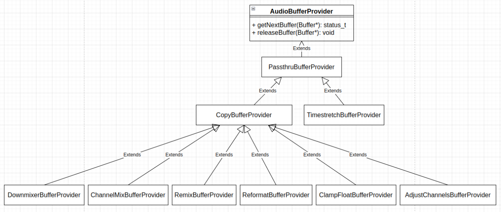
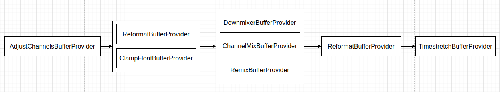
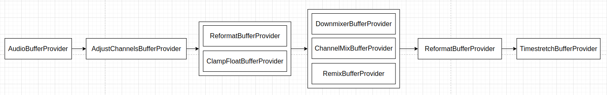
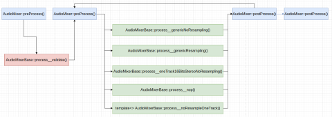

Android framework 的音频处理模库 **libaudioprocessing** (位于 *frameworks/av/media/libaudioprocessing*) 提供了混音器组件 `AudioMixer`，它主要用在 **audioflinger** 里，用来将多路音频源数据混音，以方便送进音频设备播放出来。

音频混音操作本身，一般是将各路音频源的采样数据加起来就可以了，但设计混音器的时候，一般还要考虑如何解决如下这样一些问题：

 * 如何表示要混音的一路音频源数据？
 * 如何为要混音的一路音频源设置音频数据来源？
 * 如何设置混音之后的数据输出的数据缓冲区，或如何获得混音之后的数据？
 * 如何确定混音器的输出数据格式和配置，即是外部使用者通过提供的接口设置，还是根据各路音频源的数据格式和配置动态计算获得？
 * 当音频源的数据格式和配置与输出的数据格式和配置不同时，怎么做数据格式和配置的转换？
 * 如何为混音器添加或创建一路音频源？
 * 如何修改混音器的一路音频源的参数？
 * 如何删除混音器的一路音频源？
 * 混音时，混音之后的数据越界了怎么处理？
 * 混音操作如何驱动？是混音器内部起线程执行混音操作并将结果通过回调抛出去，还是使用者主动调用混音操作？

这里主要从上面这些问题出发来看 Android 的混音器组件 `AudioMixer` 的实现。`AudioMixer` 类的定义 (位于 *frameworks/av/media/libaudioprocessing/include/media/AudioMixer.h*) 如下：
```
class AudioMixer : public AudioMixerBase
{
public:
    // maximum number of channels supported for the content
    static const uint32_t MAX_NUM_CHANNELS_TO_DOWNMIX = AUDIO_CHANNEL_COUNT_MAX;

    enum { // extension of AudioMixerBase parameters
        DOWNMIX_TYPE    = 0x4004,
        // for haptic
        HAPTIC_ENABLED  = 0x4007, // Set haptic data from this track should be played or not.
        HAPTIC_INTENSITY = 0x4008, // Set the intensity to play haptic data.
        HAPTIC_MAX_AMPLITUDE = 0x4009, // Set the max amplitude allowed for haptic data.
        // for target TIMESTRETCH
        PLAYBACK_RATE   = 0x4300, // Configure timestretch on this track name;
                                  // parameter 'value' is a pointer to the new playback rate.
    };

    AudioMixer(size_t frameCount, uint32_t sampleRate)
            : AudioMixerBase(frameCount, sampleRate) {
        pthread_once(&sOnceControl, &sInitRoutine);
    }

    bool isValidChannelMask(audio_channel_mask_t channelMask) const override;

    void setParameter(int name, int target, int param, void *value) override;
    void setBufferProvider(int name, AudioBufferProvider* bufferProvider);

private:
 . . . . . .
    inline std::shared_ptr<Track> getTrack(int name) {
        return std::static_pointer_cast<Track>(mTracks[name]);
    }

    std::shared_ptr<TrackBase> preCreateTrack() override;
    status_t postCreateTrack(TrackBase *track) override;

    void preProcess() override;
    void postProcess() override;

    bool setChannelMasks(int name,
            audio_channel_mask_t trackChannelMask, audio_channel_mask_t mixerChannelMask) override;

    static void sInitRoutine();

    static pthread_once_t sOnceControl; // initialized in constructor by first new
};
```

`AudioMixer` 类继承自类 `AudioMixerBase`，它包含一个内部 struct `struct Track`，`struct Track` 继承自 `AudioMixerBase::TrackBase`。`AudioMixerBase` 类的定义 (位于 *frameworks/av/media/libaudioprocessing/include/media/AudioMixerBase.h*) 如下：
```
class AudioMixerBase
{
public:
    // Do not change these unless underlying code changes.
    static constexpr uint32_t MAX_NUM_CHANNELS = FCC_LIMIT;
    static constexpr uint32_t MAX_NUM_VOLUMES = FCC_2; // stereo volume only

    static const uint16_t UNITY_GAIN_INT = 0x1000;
    static const CONSTEXPR float UNITY_GAIN_FLOAT = 1.0f;

    enum { // names
        // setParameter targets
        TRACK           = 0x3000,
        RESAMPLE        = 0x3001,
        RAMP_VOLUME     = 0x3002, // ramp to new volume
        VOLUME          = 0x3003, // don't ramp
        TIMESTRETCH     = 0x3004,

        // set Parameter names
        // for target TRACK
        CHANNEL_MASK    = 0x4000,
        FORMAT          = 0x4001,
        MAIN_BUFFER     = 0x4002,
        AUX_BUFFER      = 0x4003,
        // 0x4004 reserved
        MIXER_FORMAT    = 0x4005, // AUDIO_FORMAT_PCM_(FLOAT|16_BIT)
        MIXER_CHANNEL_MASK = 0x4006, // Channel mask for mixer output
        // for target RESAMPLE
        SAMPLE_RATE     = 0x4100, // Configure sample rate conversion on this track name;
                                  // parameter 'value' is the new sample rate in Hz.
                                  // Only creates a sample rate converter the first time that
                                  // the track sample rate is different from the mix sample rate.
                                  // If the new sample rate is the same as the mix sample rate,
                                  // and a sample rate converter already exists,
                                  // then the sample rate converter remains present but is a no-op.
        RESET           = 0x4101, // Reset sample rate converter without changing sample rate.
                                  // This clears out the resampler's input buffer.
        REMOVE          = 0x4102, // Remove the sample rate converter on this track name;
                                  // the track is restored to the mix sample rate.
        // for target RAMP_VOLUME and VOLUME (8 channels max)
        // FIXME use float for these 3 to improve the dynamic range
        VOLUME0         = 0x4200,
        VOLUME1         = 0x4201,
        AUXLEVEL        = 0x4210,
    };

    AudioMixerBase(size_t frameCount, uint32_t sampleRate)
        : mSampleRate(sampleRate)
        , mFrameCount(frameCount) {
    }

    virtual ~AudioMixerBase() {}

    virtual bool isValidFormat(audio_format_t format) const;
    virtual bool isValidChannelMask(audio_channel_mask_t channelMask) const;

    // Create a new track in the mixer.
    //
    // \param name        a unique user-provided integer associated with the track.
    //                    If name already exists, the function will abort.
    // \param channelMask output channel mask.
    // \param format      PCM format
    // \param sessionId   Session id for the track. Tracks with the same
    //                    session id will be submixed together.
    //
    // \return OK        on success.
    //         BAD_VALUE if the format does not satisfy isValidFormat()
    //                   or the channelMask does not satisfy isValidChannelMask().
    status_t    create(
            int name, audio_channel_mask_t channelMask, audio_format_t format, int sessionId);

    bool        exists(int name) const {
        return mTracks.count(name) > 0;
    }

    // Free an allocated track by name.
    void        destroy(int name);

    // Enable or disable an allocated track by name
    void        enable(int name);
    void        disable(int name);

    virtual void setParameter(int name, int target, int param, void *value);

    void        process() {
        preProcess();
        (this->*mHook)();
        postProcess();
    }

    size_t      getUnreleasedFrames(int name) const;

    std::string trackNames() const;

  protected:
    // Set kUseNewMixer to true to use the new mixer engine always. Otherwise the
    // original code will be used for stereo sinks, the new mixer for everything else.
    static constexpr bool kUseNewMixer = true;

    // Set kUseFloat to true to allow floating input into the mixer engine.
    // If kUseNewMixer is false, this is ignored or may be overridden internally
    static constexpr bool kUseFloat = true;

#ifdef FLOAT_AUX
    using TYPE_AUX = float;
    static_assert(kUseNewMixer && kUseFloat,
            "kUseNewMixer and kUseFloat must be true for FLOAT_AUX option");
#else
    using TYPE_AUX = int32_t; // q4.27
#endif

    /* For multi-format functions (calls template functions
     * in AudioMixerOps.h).  The template parameters are as follows:
     *
     *   MIXTYPE     (see AudioMixerOps.h MIXTYPE_* enumeration)
     *   USEFLOATVOL (set to true if float volume is used)
     *   ADJUSTVOL   (set to true if volume ramp parameters needs adjustment afterwards)
     *   TO: int32_t (Q4.27) or float
     *   TI: int32_t (Q4.27) or int16_t (Q0.15) or float
     *   TA: int32_t (Q4.27)
     */

    enum {
        // FIXME this representation permits up to 8 channels
        NEEDS_CHANNEL_COUNT__MASK   = 0x00000007,
    };

    enum {
        NEEDS_CHANNEL_1             = 0x00000000,   // mono
        NEEDS_CHANNEL_2             = 0x00000001,   // stereo

        // sample format is not explicitly specified, and is assumed to be AUDIO_FORMAT_PCM_16_BIT

        NEEDS_MUTE                  = 0x00000100,
        NEEDS_RESAMPLE              = 0x00001000,
        NEEDS_AUX                   = 0x00010000,
    };

    // hook types
    enum {
        PROCESSTYPE_NORESAMPLEONETRACK, // others set elsewhere
    };

    enum {
        TRACKTYPE_NOP,
        TRACKTYPE_RESAMPLE,
        TRACKTYPE_RESAMPLEMONO,
        TRACKTYPE_RESAMPLESTEREO,
        TRACKTYPE_NORESAMPLE,
        TRACKTYPE_NORESAMPLEMONO,
        TRACKTYPE_NORESAMPLESTEREO,
    };

    // process hook functionality
    using process_hook_t = void(AudioMixerBase::*)();

    static bool isAudioChannelPositionMask(audio_channel_mask_t channelMask) {
        return audio_channel_mask_get_representation(channelMask)
                == AUDIO_CHANNEL_REPRESENTATION_POSITION;
    }

    struct TrackBase;
    using hook_t = void(TrackBase::*)(
            int32_t* output, size_t numOutFrames, int32_t* temp, int32_t* aux);

    struct TrackBase {
        TrackBase()
            : bufferProvider(nullptr)
        {
            // TODO: move additional initialization here.
        }
        virtual ~TrackBase() {}

        virtual uint32_t getOutputChannelCount() { return channelCount; }
        virtual uint32_t getMixerChannelCount() { return mMixerChannelCount; }

        bool        needsRamp() { return (volumeInc[0] | volumeInc[1] | auxInc) != 0; }
        bool        setResampler(uint32_t trackSampleRate, uint32_t devSampleRate);
        bool        doesResample() const { return mResampler.get() != nullptr; }
        void        recreateResampler(uint32_t devSampleRate);
        void        resetResampler() { if (mResampler.get() != nullptr) mResampler->reset(); }
        void        adjustVolumeRamp(bool aux, bool useFloat = false);
        size_t      getUnreleasedFrames() const { return mResampler.get() != nullptr ?
                                                    mResampler->getUnreleasedFrames() : 0; };

        bool        useStereoVolume() const { return channelMask == AUDIO_CHANNEL_OUT_STEREO
                                        && isAudioChannelPositionMask(mMixerChannelMask); }

        static hook_t getTrackHook(int trackType, uint32_t channelCount,
                audio_format_t mixerInFormat, audio_format_t mixerOutFormat);

        void track__nop(int32_t* out, size_t numFrames, int32_t* temp, int32_t* aux);

        template <int MIXTYPE, bool USEFLOATVOL, bool ADJUSTVOL,
            typename TO, typename TI, typename TA>
        void volumeMix(TO *out, size_t outFrames, const TI *in, TA *aux, bool ramp);

        uint32_t    needs;

        // TODO: Eventually remove legacy integer volume settings
        union {
        int16_t     volume[MAX_NUM_VOLUMES]; // U4.12 fixed point (top bit should be zero)
        int32_t     volumeRL;
        };

        int32_t     prevVolume[MAX_NUM_VOLUMES];
        int32_t     volumeInc[MAX_NUM_VOLUMES];
        int32_t     auxInc;
        int32_t     prevAuxLevel;
        int16_t     auxLevel;       // 0 <= auxLevel <= MAX_GAIN_INT, but signed for mul performance

        uint16_t    frameCount;

        uint8_t     channelCount;   // 1 or 2, redundant with (needs & NEEDS_CHANNEL_COUNT__MASK)
        uint8_t     unused_padding; // formerly format, was always 16
        uint16_t    enabled;        // actually bool
        audio_channel_mask_t channelMask;

        // actual buffer provider used by the track hooks
        AudioBufferProvider*                bufferProvider;

        mutable AudioBufferProvider::Buffer buffer; // 8 bytes

        hook_t      hook;
        const void  *mIn;             // current location in buffer

        std::unique_ptr<AudioResampler> mResampler;
        uint32_t    sampleRate;
        int32_t*    mainBuffer;
        int32_t*    auxBuffer;

        int32_t     sessionId;

        audio_format_t mMixerFormat;     // output mix format: AUDIO_FORMAT_PCM_(FLOAT|16_BIT)
        audio_format_t mFormat;          // input track format
        audio_format_t mMixerInFormat;   // mix internal format AUDIO_FORMAT_PCM_(FLOAT|16_BIT)
                                         // each track must be converted to this format.

        float          mVolume[MAX_NUM_VOLUMES];     // floating point set volume
        float          mPrevVolume[MAX_NUM_VOLUMES]; // floating point previous volume
        float          mVolumeInc[MAX_NUM_VOLUMES];  // floating point volume increment

        float          mAuxLevel;                     // floating point set aux level
        float          mPrevAuxLevel;                 // floating point prev aux level
        float          mAuxInc;                       // floating point aux increment

        audio_channel_mask_t mMixerChannelMask;
        uint32_t             mMixerChannelCount;

      protected:

        // hooks
        void track__genericResample(int32_t* out, size_t numFrames, int32_t* temp, int32_t* aux);
        void track__16BitsStereo(int32_t* out, size_t numFrames, int32_t* temp, int32_t* aux);
        void track__16BitsMono(int32_t* out, size_t numFrames, int32_t* temp, int32_t* aux);

        void volumeRampStereo(int32_t* out, size_t frameCount, int32_t* temp, int32_t* aux);
        void volumeStereo(int32_t* out, size_t frameCount, int32_t* temp, int32_t* aux);

        // multi-format track hooks
        template <int MIXTYPE, typename TO, typename TI, typename TA>
        void track__Resample(TO* out, size_t frameCount, TO* temp __unused, TA* aux);
        template <int MIXTYPE, typename TO, typename TI, typename TA>
        void track__NoResample(TO* out, size_t frameCount, TO* temp __unused, TA* aux);
    };

    // preCreateTrack must create an instance of a proper TrackBase descendant.
    // postCreateTrack is called after filling out fields of TrackBase. It can
    // abort track creation by returning non-OK status. See the implementation
    // of create() for details.
    virtual std::shared_ptr<TrackBase> preCreateTrack();
    virtual status_t postCreateTrack(TrackBase *track __unused) { return OK; }

    // preProcess is called before the process hook, postProcess after,
    // see the implementation of process() method.
    virtual void preProcess() {}
    virtual void postProcess() {}

    virtual bool setChannelMasks(int name,
            audio_channel_mask_t trackChannelMask, audio_channel_mask_t mixerChannelMask);

    // Called when track info changes and a new process hook should be determined.
    void invalidate() {
        mHook = &AudioMixerBase::process__validate;
    }

    void process__validate();
    void process__nop();
    void process__genericNoResampling();
    void process__genericResampling();
    void process__oneTrack16BitsStereoNoResampling();

    template <int MIXTYPE, typename TO, typename TI, typename TA>
    void process__noResampleOneTrack();

    static process_hook_t getProcessHook(int processType, uint32_t channelCount,
            audio_format_t mixerInFormat, audio_format_t mixerOutFormat,
            bool useStereoVolume);

    static void convertMixerFormat(void *out, audio_format_t mixerOutFormat,
            void *in, audio_format_t mixerInFormat, size_t sampleCount);

    // initialization constants
    const uint32_t mSampleRate;
    const size_t mFrameCount;

    process_hook_t mHook = &AudioMixerBase::process__nop;   // one of process__*, never nullptr

    // the size of the type (int32_t) should be the largest of all types supported
    // by the mixer.
    std::unique_ptr<int32_t[]> mOutputTemp;
    std::unique_ptr<int32_t[]> mResampleTemp;

    // track names grouped by main buffer, in no particular order of main buffer.
    // however names for a particular main buffer are in order (by construction).
    std::unordered_map<void * /* mainBuffer */, std::vector<int /* name */>> mGroups;

    // track names that are enabled, in increasing order (by construction).
    std::vector<int /* name */> mEnabled;

    // track smart pointers, by name, in increasing order of name.
    std::map<int /* name */, std::shared_ptr<TrackBase>> mTracks;
};
```

`AudioMixer` 对象在构造时需要传入执行一次混音操作，期望的输出帧数和采样率，这些参数的具体值可以从设备获取。如在 `AudioFlinger::MixerThread` 和 `FastMixer::onStateChange()` 中，创建 `AudioMixer` 对象时，会从打开的音频输出流获得采样率等参数。**`AudioMixer` 的输出采样率是使用者通过提供的接口设置的。**

`AudioMixer` 用 `AudioMixer::Track`/`AudioMixerBase::TrackBase` 表示要混音的一路音频源数据。`AudioMixer::Track`/`AudioMixerBase::TrackBase` 维护一路音频源数据相关的各种信息，包括输入音频数据格式和参数，执行实际的混音操作前所需的格式转换用到的各个对象等。

## 一路音频源的创建、添加及删除

`AudioMixer`/`AudioMixerBase` 的 `create()` 操作用于为混音器创建并添加一路音频源，这个操作的定义 (位于 *frameworks/av/media/libaudioprocessing/AudioMixerBase.cpp*) 如下：
```
bool AudioMixerBase::isValidFormat(audio_format_t format) const
{
    switch (format) {
    case AUDIO_FORMAT_PCM_8_BIT:
    case AUDIO_FORMAT_PCM_16_BIT:
    case AUDIO_FORMAT_PCM_24_BIT_PACKED:
    case AUDIO_FORMAT_PCM_32_BIT:
    case AUDIO_FORMAT_PCM_FLOAT:
        return true;
    default:
        return false;
    }
}

bool AudioMixerBase::isValidChannelMask(audio_channel_mask_t channelMask) const
{
    return audio_channel_count_from_out_mask(channelMask) <= MAX_NUM_CHANNELS;
}

std::shared_ptr<AudioMixerBase::TrackBase> AudioMixerBase::preCreateTrack()
{
    return std::make_shared<TrackBase>();
}

status_t AudioMixerBase::create(
        int name, audio_channel_mask_t channelMask, audio_format_t format, int sessionId)
{
    LOG_ALWAYS_FATAL_IF(exists(name), "name %d already exists", name);

    if (!isValidChannelMask(channelMask)) {
        ALOGE("%s invalid channelMask: %#x", __func__, channelMask);
        return BAD_VALUE;
    }
    if (!isValidFormat(format)) {
        ALOGE("%s invalid format: %#x", __func__, format);
        return BAD_VALUE;
    }

    auto t = preCreateTrack();
    {
        // TODO: move initialization to the Track constructor.
        // assume default parameters for the track, except where noted below
        t->needs = 0;

        // Integer volume.
        // Currently integer volume is kept for the legacy integer mixer.
        // Will be removed when the legacy mixer path is removed.
        t->volume[0] = 0;
        t->volume[1] = 0;
        t->prevVolume[0] = 0 << 16;
        t->prevVolume[1] = 0 << 16;
        t->volumeInc[0] = 0;
        t->volumeInc[1] = 0;
        t->auxLevel = 0;
        t->auxInc = 0;
        t->prevAuxLevel = 0;

        // Floating point volume.
        t->mVolume[0] = 0.f;
        t->mVolume[1] = 0.f;
        t->mPrevVolume[0] = 0.f;
        t->mPrevVolume[1] = 0.f;
        t->mVolumeInc[0] = 0.;
        t->mVolumeInc[1] = 0.;
        t->mAuxLevel = 0.;
        t->mAuxInc = 0.;
        t->mPrevAuxLevel = 0.;

        // no initialization needed
        // t->frameCount
        t->channelCount = audio_channel_count_from_out_mask(channelMask);
        t->enabled = false;
        ALOGV_IF(audio_channel_mask_get_bits(channelMask) != AUDIO_CHANNEL_OUT_STEREO,
                "Non-stereo channel mask: %d\n", channelMask);
        t->channelMask = channelMask;
        t->sessionId = sessionId;
        // setBufferProvider(name, AudioBufferProvider *) is required before enable(name)
        t->bufferProvider = NULL;
        t->buffer.raw = NULL;
        // no initialization needed
        // t->buffer.frameCount
        t->hook = NULL;
        t->mIn = NULL;
        t->sampleRate = mSampleRate;
        // setParameter(name, TRACK, MAIN_BUFFER, mixBuffer) is required before enable(name)
        t->mainBuffer = NULL;
        t->auxBuffer = NULL;
        t->mMixerFormat = AUDIO_FORMAT_PCM_16_BIT;
        t->mFormat = format;
        t->mMixerInFormat = kUseFloat && kUseNewMixer ?
                AUDIO_FORMAT_PCM_FLOAT : AUDIO_FORMAT_PCM_16_BIT;
        t->mMixerChannelMask = audio_channel_mask_from_representation_and_bits(
                AUDIO_CHANNEL_REPRESENTATION_POSITION, AUDIO_CHANNEL_OUT_STEREO);
        t->mMixerChannelCount = audio_channel_count_from_out_mask(t->mMixerChannelMask);
        status_t status = postCreateTrack(t.get());
        if (status != OK) return status;
        mTracks[name] = t;
        return OK;
    }
}
```

调用 `create()` 操作时，需要传入作为音频源标识的 `name`，音频源输入数据的通道掩码（通道数）`channelMask`、采样格式 `format` 和会话 ID。这个操作的执行过程如下：

1. 根据 `name` 检查对应的音频源是否已经存在，如果已经存在则失败退出，否则继续执行；
2. 检查音频源的通道掩码（通道数）`channelMask` 是否有效，主要是检查通道数是否超出限制 12，如果无效则返回错误码，否则继续执行；
3. 检查采样格式 `format` 是否有效，如果无效则返回错误码，否则继续执行；
4. 调用 `preCreateTrack()` 创建 Track 对象；
5. 初始化 Track 对象，如初始化音频源输入数据的通道掩码、通道数、采样格式和会话 ID 为传入的参数，初始化单路音频源的采样率为 `AudioMixer` 的输出采样率，初始化混音器采样格式、混音器输入采样格式、混音器通道掩码和混音器通道数等，混音器采样格式只能为 `AUDIO_FORMAT_PCM_FLOAT` 或 `AUDIO_FORMAT_PCM_16_BIT`；
6. 调用 `postCreateTrack()` 对 Track 对象做进一步初始化；
7. 将创建并初始化完成的 Track 对象保存在一个 map 中。

***站在 `AudioMixer` 的视角，`create()` 操作由使用者传入音频源标识不是很合理，这破坏了 `AudioMixer` 的内聚性，不如在 `AudioMixer` 内部生成这个标识，并返回给使用者。***

`AudioMixer` 类覆写了上面看到的 `preCreateTrack()` 和 `postCreateTrack()` 函数，这两个函数在 `AudioMixer` 类中的定义 (位于 *frameworks/av/media/libaudioprocessing/AudioMixer.cpp*) 如下：
```
std::shared_ptr<AudioMixerBase::TrackBase> AudioMixer::preCreateTrack()
{
    return std::make_shared<Track>();
}

status_t AudioMixer::postCreateTrack(TrackBase *track)
{
    Track* t = static_cast<Track*>(track);

    audio_channel_mask_t channelMask = t->channelMask;
    t->mHapticChannelMask = static_cast<audio_channel_mask_t>(
            channelMask & AUDIO_CHANNEL_HAPTIC_ALL);
    t->mHapticChannelCount = audio_channel_count_from_out_mask(t->mHapticChannelMask);
    channelMask = static_cast<audio_channel_mask_t>(channelMask & ~AUDIO_CHANNEL_HAPTIC_ALL);
    t->channelCount = audio_channel_count_from_out_mask(channelMask);
    ALOGV_IF(audio_channel_mask_get_bits(channelMask) != AUDIO_CHANNEL_OUT_STEREO,
            "Non-stereo channel mask: %d\n", channelMask);
    t->channelMask = channelMask;
    t->mInputBufferProvider = NULL;
    t->mDownmixRequiresFormat = AUDIO_FORMAT_INVALID; // no format required
    t->mPlaybackRate = AUDIO_PLAYBACK_RATE_DEFAULT;
    // haptic
    t->mHapticPlaybackEnabled = false;
    t->mHapticIntensity = os::HapticScale::NONE;
    t->mHapticMaxAmplitude = NAN;
    t->mMixerHapticChannelMask = AUDIO_CHANNEL_NONE;
    t->mMixerHapticChannelCount = 0;
    t->mAdjustInChannelCount = t->channelCount + t->mHapticChannelCount;
    t->mAdjustOutChannelCount = t->channelCount;
    t->mKeepContractedChannels = false;
    // Check the downmixing (or upmixing) requirements.
    status_t status = t->prepareForDownmix();
    if (status != OK) {
        ALOGE("AudioMixer::getTrackName invalid channelMask (%#x)", channelMask);
        return BAD_VALUE;
    }
    // prepareForDownmix() may change mDownmixRequiresFormat
    ALOGVV("mMixerFormat:%#x  mMixerInFormat:%#x\n", t->mMixerFormat, t->mMixerInFormat);
    t->prepareForReformat();
    t->prepareForAdjustChannels(mFrameCount);
    return OK;
}
```

`AudioMixer::preCreateTrack()` 只是简单地创建对象。`AudioMixer::postCreateTrack()` 将会初始化 `AudioMixer::Track` 特有的一些字段，修正通道掩码为只包含音频数据通道掩码而不包含触觉通道，并为混音音频源搭建数据处理管线。

`AudioMixer`/`AudioMixerBase` 的 `destroy()` 操作用于从混音器中移除一路音频源，这个操作的定义 (位于 *frameworks/av/media/libaudioprocessing/AudioMixerBase.cpp*) 如下：
```
void AudioMixerBase::destroy(int name)
{
    LOG_ALWAYS_FATAL_IF(!exists(name), "invalid name: %d", name);
    ALOGV("deleteTrackName(%d)", name);

    if (mTracks[name]->enabled) {
        invalidate();
    }
    mTracks.erase(name); // deallocate track
}
```

当要移除的音频源已启用时，`AudioMixerBase::destroy(int name)` 执行 `invalidate()`，请求重新初始化混音处理。之后，将要移除的音频源简单地移除即可。

## 音频源数据处理管线

混音器 `AudioMixer` 的每一路音频源，也就是 Track，维护一个音频数据处理管线，将输入的音频源数据，转换为 `AudioMixer` 需要的可以用来执行混音操作的格式和配置的数据。Track 的音频数据处理管线的节点用 `AudioBufferProvider`/`PassthruBufferProvider` 来表示，上面我们看到 `AudioMixer::Track` 的定义中包含多个这一类型对象的成员变量：
```
        AudioBufferProvider* mInputBufferProvider;    // externally provided buffer provider.
        std::unique_ptr<PassthruBufferProvider> mAdjustChannelsBufferProvider;
        std::unique_ptr<PassthruBufferProvider> mReformatBufferProvider;
        std::unique_ptr<PassthruBufferProvider> mDownmixerBufferProvider;
        std::unique_ptr<PassthruBufferProvider> mPostDownmixReformatBufferProvider;
        std::unique_ptr<PassthruBufferProvider> mTimestretchBufferProvider;
```

**libaudioprocessing** 中 `AudioBufferProvider`/`PassthruBufferProvider` 相关类的继承层次结构如下图：



`AudioBufferProvider` 是个接口类，其包含的所有接口函数如上图所示。在 *frameworks/av/media/libaudioprocessing/include/media/BufferProviders.h* 中，`CopyBufferProvider` 和 `PassthruBufferProvider` 类的定义如下：
```
class PassthruBufferProvider : public AudioBufferProvider {
public:
    PassthruBufferProvider() : mTrackBufferProvider(NULL) { }

    virtual ~PassthruBufferProvider() { }

    // call this to release the buffer to the upstream provider.
    // treat it as an audio discontinuity for future samples.
    virtual void reset() { }

    // set the upstream buffer provider. Consider calling "reset" before this function.
    virtual void setBufferProvider(AudioBufferProvider *p) {
        mTrackBufferProvider = p;
    }

protected:
    AudioBufferProvider *mTrackBufferProvider;
};

// Base AudioBufferProvider class used for DownMixerBufferProvider, RemixBufferProvider,
// and ReformatBufferProvider.
// It handles a private buffer for use in converting format or channel masks from the
// input data to a form acceptable by the mixer.
// TODO: Make a ResamplerBufferProvider when integers are entirely removed from the
// processing pipeline.
class CopyBufferProvider : public PassthruBufferProvider {
public:
    // Use a private buffer of bufferFrameCount frames (each frame is outputFrameSize bytes).
    // If bufferFrameCount is 0, no private buffer is created and in-place modification of
    // the upstream buffer provider's buffers is performed by copyFrames().
    CopyBufferProvider(size_t inputFrameSize, size_t outputFrameSize,
            size_t bufferFrameCount);
    virtual ~CopyBufferProvider();

    // Overrides AudioBufferProvider methods
    virtual status_t getNextBuffer(Buffer *buffer);
    virtual void releaseBuffer(Buffer *buffer);

    // Overrides PassthruBufferProvider
    virtual void reset();
    void setBufferProvider(AudioBufferProvider *p) override;

    // this function should be supplied by the derived class.  It converts
    // #frames in the *src pointer to the *dst pointer.  It is public because
    // some providers will allow this to work on arbitrary buffers outside
    // of the internal buffers.
    virtual void copyFrames(void *dst, const void *src, size_t frames) = 0;

protected:
    const size_t         mInputFrameSize;
    const size_t         mOutputFrameSize;
private:
    AudioBufferProvider::Buffer mBuffer;
    const size_t         mLocalBufferFrameCount;
    void                *mLocalBufferData;
    size_t               mConsumed;
};
```

`PassthruBufferProvider` 类添加了 `setBufferProvider()` 函数以方便把不同音频数据处理管线节点连接起来，`CopyBufferProvider` 类添加了 `copyFrames()` 函数，以方便在不同音频数据处理管线节点之间传递数据。各个具体音频数据处理管线节点实现的 `copyFrames()` 函数实现对应的数据处理或格式转换操作。

`CopyBufferProvider` 类对象在构造时，根据需要分配内存缓冲区，在对象析构时，则释放用到的缓冲区，相关逻辑定义 (位于 *frameworks/av/media/libaudioprocessing/BufferProviders.cpp*) 如下：
```
CopyBufferProvider::CopyBufferProvider(size_t inputFrameSize,
        size_t outputFrameSize, size_t bufferFrameCount) :
        mInputFrameSize(inputFrameSize),
        mOutputFrameSize(outputFrameSize),
        mLocalBufferFrameCount(bufferFrameCount),
        mLocalBufferData(NULL),
        mConsumed(0)
{
    ALOGV("CopyBufferProvider(%p)(%zu, %zu, %zu)", this,
            inputFrameSize, outputFrameSize, bufferFrameCount);
    LOG_ALWAYS_FATAL_IF(inputFrameSize < outputFrameSize && bufferFrameCount == 0,
            "Requires local buffer if inputFrameSize(%zu) < outputFrameSize(%zu)",
            inputFrameSize, outputFrameSize);
    if (mLocalBufferFrameCount) {
        (void)posix_memalign(&mLocalBufferData, 32, mLocalBufferFrameCount * mOutputFrameSize);
    }
    mBuffer.frameCount = 0;
}

CopyBufferProvider::~CopyBufferProvider()
{
    ALOGV("%s(%p) %zu %p %p",
           __func__, this, mBuffer.frameCount, mTrackBufferProvider, mLocalBufferData);
    if (mBuffer.frameCount != 0) {
        mTrackBufferProvider->releaseBuffer(&mBuffer);
    }
    free(mLocalBufferData);
}
```

为了避免不必要的内存消耗，`CopyBufferProvider` 类对象构造时的内存分配不是必须的，但输入音频帧大小小于输出音频帧大小时，要求必须分配缓冲区。`CopyBufferProvider` 类的构造函数根据传入的本地缓冲区帧数和输出音频帧大小确定分配的缓冲区的大小。

Track 的音频数据处理管线由其最后一个节点的 `getNextBuffer()` 函数驱动，在 `CopyBufferProvider` 类中，这个函数的定义 (位于 *frameworks/av/media/libaudioprocessing/BufferProviders.cpp*) 如下：
```
status_t CopyBufferProvider::getNextBuffer(AudioBufferProvider::Buffer *pBuffer)
{
    //ALOGV("CopyBufferProvider(%p)::getNextBuffer(%p (%zu))",
    //        this, pBuffer, pBuffer->frameCount);
    if (mLocalBufferFrameCount == 0) {
        status_t res = mTrackBufferProvider->getNextBuffer(pBuffer);
        if (res == OK) {
            copyFrames(pBuffer->raw, pBuffer->raw, pBuffer->frameCount);
        }
        return res;
    }
    if (mBuffer.frameCount == 0) {
        mBuffer.frameCount = pBuffer->frameCount;
        status_t res = mTrackBufferProvider->getNextBuffer(&mBuffer);
        // At one time an upstream buffer provider had
        // res == OK and mBuffer.frameCount == 0, doesn't seem to happen now 7/18/2014.
        //
        // By API spec, if res != OK, then mBuffer.frameCount == 0.
        // but there may be improper implementations.
        ALOG_ASSERT(res == OK || mBuffer.frameCount == 0);
        if (res != OK || mBuffer.frameCount == 0) { // not needed by API spec, but to be safe.
            pBuffer->raw = NULL;
            pBuffer->frameCount = 0;
            return res;
        }
        mConsumed = 0;
    }
    ALOG_ASSERT(mConsumed < mBuffer.frameCount);
    size_t count = std::min(mLocalBufferFrameCount, mBuffer.frameCount - mConsumed);
    count = std::min(count, pBuffer->frameCount);
    pBuffer->raw = mLocalBufferData;
    pBuffer->frameCount = count;
    copyFrames(pBuffer->raw, (uint8_t*)mBuffer.raw + mConsumed * mInputFrameSize,
            pBuffer->frameCount);
    return OK;
}
```

如果对象构造时，传入的本地缓冲区帧数为 0，这通常意味着本地不会分配缓冲区，且 Track 的音频数据处理管线的当前节点所需要的缓冲区大小不会比前一个节点所需要的大，则从前一个节点获得它处理之后的数据，然后调用当前节点的 `copyFrames()` 函数执行当前节点的处理，并返回给调用者。***对于这种情况，需要具体的实现子类保证，它的音频数据处理不需要改变前一个节点处理之后的音频数据的采样率。***

如果对象构造时，传入的本地缓冲区帧数不为 0，则有一个缓冲区 `mBuffer` 用来保存从前一个节点获得数据。在 `CopyBufferProvider` 类的 `getNextBuffer()` 函数中，如果 `mBuffer` 中的帧数为 0，表示之前从前一个节点获得的数据已经消耗完，则再次从前一个节点获得一块数据。之后调用当前节点的 `copyFrames()` 函数处理从前一个节点获得的数据，并返回给调用者。***这里在直接比较当前节点的帧数 `mLocalBufferFrameCount` 和前一个节点的数据的帧数 `mBuffer.frameCount - mConsumed`，但两者是不应该直接比较的，如按照配置当前节点需要输出 48 kHz 采样率的音频数据，输出的帧数为 10 ms 的数据，即 480 帧，前一个节点按照配置输出 16 kHz 采样率的数据，则当前节点输出一次数据只需要前一个节点 160 帧的数据即可。或者说，这里同样暗含当前节点的数据处理不改变采样率。***

从 `CopyBufferProvider` 类的 `getNextBuffer()` 函数获得的音频数据在使用完了之后，需要释放，`CopyBufferProvider::releaseBuffer()` 函数定义如下：
```
void CopyBufferProvider::releaseBuffer(AudioBufferProvider::Buffer *pBuffer)
{
    //ALOGV("CopyBufferProvider(%p)::releaseBuffer(%p(%zu))",
    //        this, pBuffer, pBuffer->frameCount);
    if (mLocalBufferFrameCount == 0) {
        mTrackBufferProvider->releaseBuffer(pBuffer);
        return;
    }
    // LOG_ALWAYS_FATAL_IF(pBuffer->frameCount == 0, "Invalid framecount");
    mConsumed += pBuffer->frameCount; // TODO: update for efficiency to reuse existing content
    if (mConsumed != 0 && mConsumed >= mBuffer.frameCount) {
        mTrackBufferProvider->releaseBuffer(&mBuffer);
        ALOG_ASSERT(mBuffer.frameCount == 0);
    }
    pBuffer->raw = NULL;
    pBuffer->frameCount = 0;
}
```

缓冲区从哪里获取就在哪里释放。`mConsumed` 表示前一个节点的音频数据的帧数，`pBuffer->frameCount` 表示当前节点的音频数据的帧数，如果两个节点采样率不同，则这两个帧数具有不同的含义，因而不能直接相加。***这里同样暗含着当前节点的数据处理不改变采样率。***

`CopyBufferProvider` 类的 `reset()` 和 `setBufferProvider()` 操作定义如下：
```
void CopyBufferProvider::reset()
{
    if (mBuffer.frameCount != 0) {
        mTrackBufferProvider->releaseBuffer(&mBuffer);
    }
    mConsumed = 0;
}

void CopyBufferProvider::setBufferProvider(AudioBufferProvider *p) {
    ALOGV("%s(%p): mTrackBufferProvider:%p  mBuffer.frameCount:%zu",
            __func__, p, mTrackBufferProvider, mBuffer.frameCount);
    if (mTrackBufferProvider == p) {
        return;
    }
    mBuffer.frameCount = 0;
    PassthruBufferProvider::setBufferProvider(p);
}
```

上面我们看到的那些不同的 `PassthruBufferProvider` 和 `CopyBufferProvider` 子类提供不同的处理操作。`DownmixerBufferProvider` 用来对音频数据做通道掩码格式/通道数转换，音频数据的采样率和采样格式保持不变，它基于音效 HAL 实现。`DownmixerBufferProvider` 类各成员函数的实现如下：
```
DownmixerBufferProvider::DownmixerBufferProvider(
        audio_channel_mask_t inputChannelMask,
        audio_channel_mask_t outputChannelMask, audio_format_t format,
        uint32_t sampleRate, int32_t sessionId, size_t bufferFrameCount) :
        CopyBufferProvider(
            audio_bytes_per_sample(format) * audio_channel_count_from_out_mask(inputChannelMask),
            audio_bytes_per_sample(format) * audio_channel_count_from_out_mask(outputChannelMask),
            bufferFrameCount)  // set bufferFrameCount to 0 to do in-place
{
    ALOGV("DownmixerBufferProvider(%p)(%#x, %#x, %#x %u %d %d)",
            this, inputChannelMask, outputChannelMask, format,
            sampleRate, sessionId, (int)bufferFrameCount);
    if (!sIsMultichannelCapable) {
        ALOGE("DownmixerBufferProvider() error: not multichannel capable");
        return;
    }
    mEffectsFactory = EffectsFactoryHalInterface::create();
    if (mEffectsFactory == 0) {
        ALOGE("DownmixerBufferProvider() error: could not obtain the effects factory");
        return;
    }
    if (mEffectsFactory->createEffect(&sDwnmFxDesc.uuid,
                                      sessionId,
                                      SESSION_ID_INVALID_AND_IGNORED,
                                      AUDIO_PORT_HANDLE_NONE,
                                      &mDownmixInterface) != 0) {
         ALOGE("DownmixerBufferProvider() error creating downmixer effect");
         mDownmixInterface.clear();
         mEffectsFactory.clear();
         return;
     }
     // channel input configuration will be overridden per-track
     mDownmixConfig.inputCfg.channels = inputChannelMask;   // FIXME: Should be bits
     mDownmixConfig.outputCfg.channels = outputChannelMask; // FIXME: should be bits
     mDownmixConfig.inputCfg.format = format;
     mDownmixConfig.outputCfg.format = format;
     mDownmixConfig.inputCfg.samplingRate = sampleRate;
     mDownmixConfig.outputCfg.samplingRate = sampleRate;
     mDownmixConfig.inputCfg.accessMode = EFFECT_BUFFER_ACCESS_READ;
     mDownmixConfig.outputCfg.accessMode = EFFECT_BUFFER_ACCESS_WRITE;
     // input and output buffer provider, and frame count will not be used as the downmix effect
     // process() function is called directly (see DownmixerBufferProvider::getNextBuffer())
     mDownmixConfig.inputCfg.mask = EFFECT_CONFIG_SMP_RATE | EFFECT_CONFIG_CHANNELS |
             EFFECT_CONFIG_FORMAT | EFFECT_CONFIG_ACC_MODE;
     mDownmixConfig.outputCfg.mask = mDownmixConfig.inputCfg.mask;

     mInFrameSize =
             audio_bytes_per_sample(format) * audio_channel_count_from_out_mask(inputChannelMask);
     mOutFrameSize =
             audio_bytes_per_sample(format) * audio_channel_count_from_out_mask(outputChannelMask);
     status_t status;
     status = mEffectsFactory->mirrorBuffer(
             nullptr, mInFrameSize * bufferFrameCount, &mInBuffer);
     if (status != 0) {
         ALOGE("DownmixerBufferProvider() error %d while creating input buffer", status);
         mDownmixInterface.clear();
         mEffectsFactory.clear();
         return;
     }
     status = mEffectsFactory->mirrorBuffer(
             nullptr, mOutFrameSize * bufferFrameCount, &mOutBuffer);
     if (status != 0) {
         ALOGE("DownmixerBufferProvider() error %d while creating output buffer", status);
         mInBuffer.clear();
         mDownmixInterface.clear();
         mEffectsFactory.clear();
         return;
     }
     mDownmixInterface->setInBuffer(mInBuffer);
     mDownmixInterface->setOutBuffer(mOutBuffer);

     int cmdStatus;
     uint32_t replySize = sizeof(int);

     // Configure downmixer
     status = mDownmixInterface->command(
             EFFECT_CMD_SET_CONFIG /*cmdCode*/, sizeof(effect_config_t) /*cmdSize*/,
             &mDownmixConfig /*pCmdData*/,
             &replySize, &cmdStatus /*pReplyData*/);
     if (status != 0 || cmdStatus != 0) {
         ALOGE("DownmixerBufferProvider() error %d cmdStatus %d while configuring downmixer",
                 status, cmdStatus);
         mOutBuffer.clear();
         mInBuffer.clear();
         mDownmixInterface.clear();
         mEffectsFactory.clear();
         return;
     }

     // Enable downmixer
     replySize = sizeof(int);
     status = mDownmixInterface->command(
             EFFECT_CMD_ENABLE /*cmdCode*/, 0 /*cmdSize*/, NULL /*pCmdData*/,
             &replySize, &cmdStatus /*pReplyData*/);
     if (status != 0 || cmdStatus != 0) {
         ALOGE("DownmixerBufferProvider() error %d cmdStatus %d while enabling downmixer",
                 status, cmdStatus);
         mOutBuffer.clear();
         mInBuffer.clear();
         mDownmixInterface.clear();
         mEffectsFactory.clear();
         return;
     }

     // Set downmix type
     // parameter size rounded for padding on 32bit boundary
     const int psizePadded = ((sizeof(downmix_params_t) - 1)/sizeof(int) + 1) * sizeof(int);
     const int downmixParamSize =
             sizeof(effect_param_t) + psizePadded + sizeof(downmix_type_t);
     effect_param_t * const param = (effect_param_t *) malloc(downmixParamSize);
     param->psize = sizeof(downmix_params_t);
     const downmix_params_t downmixParam = DOWNMIX_PARAM_TYPE;
     memcpy(param->data, &downmixParam, param->psize);
     const downmix_type_t downmixType = DOWNMIX_TYPE_FOLD;
     param->vsize = sizeof(downmix_type_t);
     memcpy(param->data + psizePadded, &downmixType, param->vsize);
     replySize = sizeof(int);
     status = mDownmixInterface->command(
             EFFECT_CMD_SET_PARAM /* cmdCode */, downmixParamSize /* cmdSize */,
             param /*pCmdData*/, &replySize, &cmdStatus /*pReplyData*/);
     free(param);
     if (status != 0 || cmdStatus != 0) {
         ALOGE("DownmixerBufferProvider() error %d cmdStatus %d while setting downmix type",
                 status, cmdStatus);
         mOutBuffer.clear();
         mInBuffer.clear();
         mDownmixInterface.clear();
         mEffectsFactory.clear();
         return;
     }
     ALOGV("DownmixerBufferProvider() downmix type set to %d", (int) downmixType);
}

DownmixerBufferProvider::~DownmixerBufferProvider()
{
    ALOGV("~DownmixerBufferProvider (%p)", this);
    if (mDownmixInterface != 0) {
        mDownmixInterface->close();
    }
}

void DownmixerBufferProvider::copyFrames(void *dst, const void *src, size_t frames)
{
    mInBuffer->setExternalData(const_cast<void*>(src));
    mInBuffer->setFrameCount(frames);
    mInBuffer->update(mInFrameSize * frames);
    mOutBuffer->setFrameCount(frames);
    mOutBuffer->setExternalData(dst);
    if (dst != src) {
        // Downmix may be accumulating, need to populate the output buffer
        // with the dst data.
        mOutBuffer->update(mOutFrameSize * frames);
    }
    // may be in-place if src == dst.
    status_t res = mDownmixInterface->process();
    if (res == OK) {
        mOutBuffer->commit(mOutFrameSize * frames);
    } else {
        ALOGE("DownmixBufferProvider error %d", res);
    }
}

/* call once in a pthread_once handler. */
/*static*/ status_t DownmixerBufferProvider::init()
{
    // find multichannel downmix effect if we have to play multichannel content
    sp<EffectsFactoryHalInterface> effectsFactory = EffectsFactoryHalInterface::create();
    if (effectsFactory == 0) {
        ALOGE("AudioMixer() error: could not obtain the effects factory");
        return NO_INIT;
    }
    uint32_t numEffects = 0;
    int ret = effectsFactory->queryNumberEffects(&numEffects);
    if (ret != 0) {
        ALOGE("AudioMixer() error %d querying number of effects", ret);
        return NO_INIT;
    }
    ALOGV("EffectQueryNumberEffects() numEffects=%d", numEffects);

    for (uint32_t i = 0 ; i < numEffects ; i++) {
        if (effectsFactory->getDescriptor(i, &sDwnmFxDesc) == 0) {
            ALOGV("effect %d is called %s", i, sDwnmFxDesc.name);
            if (memcmp(&sDwnmFxDesc.type, EFFECT_UIID_DOWNMIX, sizeof(effect_uuid_t)) == 0) {
                ALOGI("found effect \"%s\" from %s",
                        sDwnmFxDesc.name, sDwnmFxDesc.implementor);
                sIsMultichannelCapable = true;
                break;
            }
        }
    }
    ALOGW_IF(!sIsMultichannelCapable, "unable to find downmix effect");
    return NO_INIT;
}

/*static*/ bool DownmixerBufferProvider::sIsMultichannelCapable = false;
/*static*/ effect_descriptor_t DownmixerBufferProvider::sDwnmFxDesc;
```

`DownmixerBufferProvider` 类封装音效 HAL 接口，实现音频数据通道数的转换。第一个 `AudioMixer` 对象创建时，执行 `DownmixerBufferProvider` 的类层面的初始化，主要是检查音效 HAL 是否支持对音频数据做通道掩码格式/通道数转换。`DownmixerBufferProvider` 类对象创建时，准备执行转换所需的  `sp<EffectsFactoryHalInterface>` 和 `sp<EffectHalInterface>` 等接口对象，以及音效 HAL 输出输入缓冲区，并给音效 HAL 发送命令进行配置并使能。`DownmixerBufferProvider` 类的 `copyFrames()` 对一块数据做转换。对音频数据做通道掩码格式/通道数转换时的具体策略，依赖音效 HAL 的具体实现。

`RemixBufferProvider` 用来对音频数据做通道掩码格式/通道数转换，音频数据的采样率和采样格式保持不变，`RemixBufferProvider` 类各成员函数的实现如下：
```
RemixBufferProvider::RemixBufferProvider(audio_channel_mask_t inputChannelMask,
        audio_channel_mask_t outputChannelMask, audio_format_t format,
        size_t bufferFrameCount) :
        CopyBufferProvider(
                audio_bytes_per_sample(format)
                    * audio_channel_count_from_out_mask(inputChannelMask),
                audio_bytes_per_sample(format)
                    * audio_channel_count_from_out_mask(outputChannelMask),
                bufferFrameCount),
        mFormat(format),
        mSampleSize(audio_bytes_per_sample(format)),
        mInputChannels(audio_channel_count_from_out_mask(inputChannelMask)),
        mOutputChannels(audio_channel_count_from_out_mask(outputChannelMask))
{
    ALOGV("RemixBufferProvider(%p)(%#x, %#x, %#x) %zu %zu",
            this, format, inputChannelMask, outputChannelMask,
            mInputChannels, mOutputChannels);
    (void) memcpy_by_index_array_initialization_from_channel_mask(
            mIdxAry, ARRAY_SIZE(mIdxAry), outputChannelMask, inputChannelMask);
}

void RemixBufferProvider::copyFrames(void *dst, const void *src, size_t frames)
{
    memcpy_by_index_array(dst, mOutputChannels,
            src, mInputChannels, mIdxAry, mSampleSize, frames);
}
```

`RemixBufferProvider` 对音频数据做通道掩码格式/通道数转换的方式为，先根据输入和输出音频通道掩码格式，找到音频输出数据各通道对应的每帧输入数据中的索引，再根据获得的索引数组，逐帧将输入音频数据拷贝到输出数据缓冲区中。用来获得索引数组的 `memcpy_by_index_array_initialization_from_channel_mask()` 函数在 *system/media/audio_utils/format.c* 文件中定义：
```
size_t memcpy_by_index_array_initialization_from_channel_mask(int8_t *idxary, size_t arysize,
        audio_channel_mask_t dst_channel_mask, audio_channel_mask_t src_channel_mask)
{
    const audio_channel_representation_t src_representation =
            audio_channel_mask_get_representation(src_channel_mask);
    const audio_channel_representation_t dst_representation =
            audio_channel_mask_get_representation(dst_channel_mask);
    const uint32_t src_bits = audio_channel_mask_get_bits(src_channel_mask);
    const uint32_t dst_bits = audio_channel_mask_get_bits(dst_channel_mask);

    switch (src_representation) {
    case AUDIO_CHANNEL_REPRESENTATION_POSITION:
        switch (dst_representation) {
        case AUDIO_CHANNEL_REPRESENTATION_POSITION:
            return memcpy_by_index_array_initialization(idxary, arysize,
                    dst_bits, src_bits);
        case AUDIO_CHANNEL_REPRESENTATION_INDEX:
            return memcpy_by_index_array_initialization_dst_index(idxary, arysize,
                    dst_bits, src_bits);
        default:
            return 0;
        }
        break;
    case AUDIO_CHANNEL_REPRESENTATION_INDEX:
        switch (dst_representation) {
        case AUDIO_CHANNEL_REPRESENTATION_POSITION:
            return memcpy_by_index_array_initialization_src_index(idxary, arysize,
                    dst_bits, src_bits);
        case AUDIO_CHANNEL_REPRESENTATION_INDEX:
            return memcpy_by_index_array_initialization(idxary, arysize,
                    dst_bits, src_bits);
        default:
            return 0;
        }
        break;
    default:
        return 0;
    }
}
```

`memcpy_by_index_array_initialization_from_channel_mask()` 函数根据输入输出数据的通道掩码格式，通过不同的函数创建索引数组。`audio_channel_mask_t` 表示的音频通道掩码有两种类型，对于 `POSITION` 型音频通道掩码，其中包含的是通道数；对于 `INDEX` 型音频通道掩码，每个音频通道被分配一个二进制位，当音频数据中包含对应的通道时，对应的位置 1，否则置 0，音频通道掩码通过各音频通道按位或运算获得；`audio_channel_mask_t` 可以表示最多 30 个通道，第 30 和 31 两位用来表示类型。这可以通过 *system/media/audio/include/system/audio.h* 中根据音频通道掩码获得通道数的函数 `audio_channel_count_from_out_mask()` 看出来：
```
static inline uint32_t audio_channel_count_from_out_mask(audio_channel_mask_t channel)
{
    uint32_t bits = audio_channel_mask_get_bits(channel);
    switch (audio_channel_mask_get_representation(channel)) {
    case AUDIO_CHANNEL_REPRESENTATION_POSITION:
        // TODO: We can now merge with from_in_mask and remove anding
        bits &= AUDIO_CHANNEL_OUT_ALL;
        FALLTHROUGH_INTENDED;
    case AUDIO_CHANNEL_REPRESENTATION_INDEX:
        return __builtin_popcount(bits);
    default:
        return 0;
    }
}
```

`memcpy_by_index_array_initialization_from_channel_mask()` 函数调用的几个函数在 *system/media/audio_utils/primitives.c* 文件中定义：
```
size_t memcpy_by_index_array_initialization(int8_t *idxary, size_t idxcount,
        uint32_t dst_mask, uint32_t src_mask)
{
    size_t n = 0;
    int srcidx = 0;
    uint32_t bit, ormask = src_mask | dst_mask;

    while (ormask && n < idxcount) {
        bit = ormask & -ormask;          /* get lowest bit */
        ormask ^= bit;                   /* remove lowest bit */
        if (src_mask & dst_mask & bit) { /* matching channel */
            idxary[n++] = srcidx++;
        } else if (src_mask & bit) {     /* source channel only */
            ++srcidx;
        } else {                         /* destination channel only */
            idxary[n++] = -1;
        }
    }
    return n + __builtin_popcount(ormask & dst_mask);
}

size_t memcpy_by_index_array_initialization_src_index(int8_t *idxary, size_t idxcount,
        uint32_t dst_mask, uint32_t src_mask) {
    size_t dst_count = __builtin_popcount(dst_mask);
    if (idxcount == 0) {
        return dst_count;
    }
    if (dst_count > idxcount) {
        dst_count = idxcount;
    }

    size_t src_idx, dst_idx;
    for (src_idx = 0, dst_idx = 0; dst_idx < dst_count; ++dst_idx) {
        if (src_mask & 1) {
            idxary[dst_idx] = src_idx++;
        } else {
            idxary[dst_idx] = -1;
        }
        src_mask >>= 1;
    }
    return dst_idx;
}

size_t memcpy_by_index_array_initialization_dst_index(int8_t *idxary, size_t idxcount,
        uint32_t dst_mask, uint32_t src_mask) {
    size_t src_idx, dst_idx;
    size_t dst_count = __builtin_popcount(dst_mask);
    size_t src_count = __builtin_popcount(src_mask);
    if (idxcount == 0) {
        return dst_count;
    }
    if (dst_count > idxcount) {
        dst_count = idxcount;
    }
    for (src_idx = 0, dst_idx = 0; dst_idx < dst_count; ++src_idx) {
        if (dst_mask & 1) {
            idxary[dst_idx++] = src_idx < src_count ? (signed)src_idx : -1;
        }
        dst_mask >>= 1;
    }
    return dst_idx;
}
```

***强烈怀疑这里实现的 `memcpy_by_index_array_initialization_src_index()` 和 `memcpy_by_index_array_initialization_dst_index()` 函数是错误的。对于 `memcpy_by_index_array_initialization_src_index()` 函数，其 `dst_mask` 参数即是通道数，因而不需要再调用 `__builtin_popcount()` 来计算输出通道数。对于 `memcpy_by_index_array_initialization_dst_index()` 函数，输入通道数不需要计算，输出通道数需要计算。此外，`memcpy_by_index_array_initialization_from_channel_mask()` 函数中，输入音频通道掩码和输出音频通道掩码都是 `POSITION` 类型时，调用 `memcpy_by_index_array_initialization()` 函数创建索引数组不太对。***

根据索引数组拷贝数据的 `memcpy_by_index_array()` 函数定义 (位于 *system/media/audio_utils/primitives.c*) 如下：
```
/*
 * C macro to do copying by index array, to rearrange samples
 * within a frame.  This is independent of src/dst sample type.
 * Don't pass in any expressions for the macro arguments here.
 */
#define copy_frame_by_idx(dst, dst_channels, src, src_channels, idxary, count, zero) \
{ \
    unsigned i; \
    int index; \
    for (; (count) > 0; --(count)) { \
        for (i = 0; i < (dst_channels); ++i) { \
            index = (idxary)[i]; \
            *(dst)++ = index < 0 ? (zero) : (src)[index]; \
        } \
        (src) += (src_channels); \
    } \
}

void memcpy_by_index_array(void *dst, uint32_t dst_channels,
        const void *src, uint32_t src_channels,
        const int8_t *idxary, size_t sample_size, size_t count)
{
    switch (sample_size) {
    case 1: {
        uint8_t *udst = (uint8_t*)dst;
        const uint8_t *usrc = (const uint8_t*)src;

        copy_frame_by_idx(udst, dst_channels, usrc, src_channels, idxary, count, 0);
    } break;
    case 2: {
        uint16_t *udst = (uint16_t*)dst;
        const uint16_t *usrc = (const uint16_t*)src;

        copy_frame_by_idx(udst, dst_channels, usrc, src_channels, idxary, count, 0);
    } break;
    case 3: { /* could be slow.  use a struct to represent 3 bytes of data. */
        uint8x3_t *udst = (uint8x3_t*)dst;
        const uint8x3_t *usrc = (const uint8x3_t*)src;
        static const uint8x3_t zero;

        copy_frame_by_idx(udst, dst_channels, usrc, src_channels, idxary, count, zero);
    } break;
    case 4: {
        uint32_t *udst = (uint32_t*)dst;
        const uint32_t *usrc = (const uint32_t*)src;

        copy_frame_by_idx(udst, dst_channels, usrc, src_channels, idxary, count, 0);
    } break;
    default:
        abort(); /* illegal value */
        break;
    }
}
```

`ChannelMixBufferProvider` 也用来对音频数据做通道掩码格式/通道数转换，音频数据的采样率和采样格式保持不变，`ChannelMixBufferProvider` 类各成员函数的实现如下：
```
ChannelMixBufferProvider::ChannelMixBufferProvider(audio_channel_mask_t inputChannelMask,
        audio_channel_mask_t outputChannelMask, audio_format_t format,
        size_t bufferFrameCount) :
        CopyBufferProvider(
                audio_bytes_per_sample(format)
                    * audio_channel_count_from_out_mask(inputChannelMask),
                audio_bytes_per_sample(format)
                    * audio_channel_count_from_out_mask(outputChannelMask),
                bufferFrameCount)
{
    ALOGV("ChannelMixBufferProvider(%p)(%#x, %#x, %#x)",
            this, format, inputChannelMask, outputChannelMask);
    if (outputChannelMask == AUDIO_CHANNEL_OUT_STEREO && format == AUDIO_FORMAT_PCM_FLOAT) {
        mIsValid = mChannelMix.setInputChannelMask(inputChannelMask);
    }
}

void ChannelMixBufferProvider::copyFrames(void *dst, const void *src, size_t frames)
{
    mChannelMix.process(static_cast<const float *>(src), static_cast<float *>(dst),
            frames, false /* accumulate */);
}
```

`ChannelMixBufferProvider` 基于 `audio_utils::channels::ChannelMix` 实现，且要求输出数据为双声道立体声的，采样格式为浮点型的。

`ReformatBufferProvider` 用来对音频数据的采样格式做转换，音频数据的采样率和通道掩码格式保持不变，`ReformatBufferProvider` 类各成员函数的实现如下：
```
ReformatBufferProvider::ReformatBufferProvider(int32_t channelCount,
        audio_format_t inputFormat, audio_format_t outputFormat,
        size_t bufferFrameCount) :
        CopyBufferProvider(
                channelCount * audio_bytes_per_sample(inputFormat),
                channelCount * audio_bytes_per_sample(outputFormat),
                bufferFrameCount),
        mChannelCount(channelCount),
        mInputFormat(inputFormat),
        mOutputFormat(outputFormat)
{
    ALOGV("ReformatBufferProvider(%p)(%u, %#x, %#x)",
            this, channelCount, inputFormat, outputFormat);
}

void ReformatBufferProvider::copyFrames(void *dst, const void *src, size_t frames)
{
    memcpy_by_audio_format(dst, mOutputFormat, src, mInputFormat, frames * mChannelCount);
}
```

`ClampFloatBufferProvider` 用来将音频数据的强度限制在 -3 dB 内，其它保持不变，`ClampFloatBufferProvider` 类各成员函数的实现如下：
```
ClampFloatBufferProvider::ClampFloatBufferProvider(int32_t channelCount, size_t bufferFrameCount) :
        CopyBufferProvider(
                channelCount * audio_bytes_per_sample(AUDIO_FORMAT_PCM_FLOAT),
                channelCount * audio_bytes_per_sample(AUDIO_FORMAT_PCM_FLOAT),
                bufferFrameCount),
        mChannelCount(channelCount)
{
    ALOGV("ClampFloatBufferProvider(%p)(%u)", this, channelCount);
}

void ClampFloatBufferProvider::copyFrames(void *dst, const void *src, size_t frames)
{
    memcpy_to_float_from_float_with_clamping((float*)dst, (const float*)src,
                                             frames * mChannelCount,
                                             FLOAT_NOMINAL_RANGE_HEADROOM);
}
```

`ClampFloatBufferProvider` 要求输入输出采样格式为浮点型。

`TimestretchBufferProvider` 用来对音频数据做时间拉伸，它基于三方库 ***sonic*** 实现。`TimestretchBufferProvider` 在倍速播放时会用到。

`AdjustChannelsBufferProvider` 用于调整采样数据，将采样数据从一种交错通道格式扩展或收缩到另一种格式。额外扩展的通道用零填充并放在每个音频帧的末尾。收缩通道被复制到输出缓冲区的末尾（应适当分配存储空间）。收缩通道可以写入输出缓冲区并进行调整。当收缩缓冲区中的收缩通道被调整时，输入通道计数将被计算为' inChannelCount - outChannelCount'。输出通道计数由调用者提供，它是 ' contractedOutChannelCount '。目前，音频耦合触觉回放主要采用调整收缩通道的方法。如果设备支持两个触觉通道，而应用程序只提供一个触觉通道，第二个触觉通道将与第一个触觉通道的数据重复。如果设备支持单个触觉通道，而应用程序提供两个触觉通道，则第二个通道将被收缩。

在 `AudioMixer::postCreateTrack()` 函数中，初始化了 Track 对象之后，会为音频数据处理管线创建节点，并搭建管线：
```
void AudioMixer::Track::unprepareForDownmix() {
    ALOGV("AudioMixer::unprepareForDownmix(%p)", this);

    if (mPostDownmixReformatBufferProvider.get() != nullptr) {
        // release any buffers held by the mPostDownmixReformatBufferProvider
        // before deallocating the mDownmixerBufferProvider.
        mPostDownmixReformatBufferProvider->reset();
    }

    mDownmixRequiresFormat = AUDIO_FORMAT_INVALID;
    if (mDownmixerBufferProvider.get() != nullptr) {
        // this track had previously been configured with a downmixer, delete it
        mDownmixerBufferProvider.reset(nullptr);
        reconfigureBufferProviders();
    } else {
        ALOGV(" nothing to do, no downmixer to delete");
    }
}

status_t AudioMixer::Track::prepareForDownmix()
{
    ALOGV("AudioMixer::prepareForDownmix(%p) with mask 0x%x",
            this, channelMask);

    // discard the previous downmixer if there was one
    unprepareForDownmix();
    // MONO_HACK Only remix (upmix or downmix) if the track and mixer/device channel masks
    // are not the same and not handled internally, as mono for channel position masks is.
    if (channelMask == mMixerChannelMask
            || (channelMask == AUDIO_CHANNEL_OUT_MONO
                    && isAudioChannelPositionMask(mMixerChannelMask))) {
        return NO_ERROR;
    }
    // DownmixerBufferProvider is only used for position masks.
    if (audio_channel_mask_get_representation(channelMask)
                == AUDIO_CHANNEL_REPRESENTATION_POSITION
            && DownmixerBufferProvider::isMultichannelCapable()) {

        // Check if we have a float or int16 downmixer, in that order.
        for (const audio_format_t format : { AUDIO_FORMAT_PCM_FLOAT, AUDIO_FORMAT_PCM_16_BIT }) {
            mDownmixerBufferProvider.reset(new DownmixerBufferProvider(
                    channelMask, mMixerChannelMask,
                    format,
                    sampleRate, sessionId, kCopyBufferFrameCount));
            if (static_cast<DownmixerBufferProvider *>(mDownmixerBufferProvider.get())
                    ->isValid()) {
                mDownmixRequiresFormat = format;
                reconfigureBufferProviders();
                return NO_ERROR;
            }
        }
        // mDownmixerBufferProvider reset below.
    }

    // See if we should use our built-in non-effect downmixer.
    if (mMixerInFormat == AUDIO_FORMAT_PCM_FLOAT
            && mMixerChannelMask == AUDIO_CHANNEL_OUT_STEREO
            && audio_channel_mask_get_representation(channelMask)
                    == AUDIO_CHANNEL_REPRESENTATION_POSITION) {
        mDownmixerBufferProvider.reset(new ChannelMixBufferProvider(channelMask,
                mMixerChannelMask, mMixerInFormat, kCopyBufferFrameCount));
        if (static_cast<ChannelMixBufferProvider *>(mDownmixerBufferProvider.get())
                ->isValid()) {
            mDownmixRequiresFormat = mMixerInFormat;
            reconfigureBufferProviders();
            ALOGD("%s: Fallback using ChannelMix", __func__);
            return NO_ERROR;
        } else {
            ALOGD("%s: ChannelMix not supported for channel mask %#x", __func__, channelMask);
        }
    }

    // Effect downmixer does not accept the channel conversion.  Let's use our remixer.
    mDownmixerBufferProvider.reset(new RemixBufferProvider(channelMask,
            mMixerChannelMask, mMixerInFormat, kCopyBufferFrameCount));
    // Remix always finds a conversion whereas Downmixer effect above may fail.
    reconfigureBufferProviders();
    return NO_ERROR;
}

void AudioMixer::Track::unprepareForReformat() {
    ALOGV("AudioMixer::unprepareForReformat(%p)", this);
    bool requiresReconfigure = false;
    if (mReformatBufferProvider.get() != nullptr) {
        mReformatBufferProvider.reset(nullptr);
        requiresReconfigure = true;
    }
    if (mPostDownmixReformatBufferProvider.get() != nullptr) {
        mPostDownmixReformatBufferProvider.reset(nullptr);
        requiresReconfigure = true;
    }
    if (requiresReconfigure) {
        reconfigureBufferProviders();
    }
}

status_t AudioMixer::Track::prepareForReformat()
{
    ALOGV("AudioMixer::prepareForReformat(%p) with format %#x", this, mFormat);
    // discard previous reformatters
    unprepareForReformat();
    // only configure reformatters as needed
    const audio_format_t targetFormat = mDownmixRequiresFormat != AUDIO_FORMAT_INVALID
            ? mDownmixRequiresFormat : mMixerInFormat;
    bool requiresReconfigure = false;
    if (mFormat != targetFormat) {
        mReformatBufferProvider.reset(new ReformatBufferProvider(
                audio_channel_count_from_out_mask(channelMask),
                mFormat,
                targetFormat,
                kCopyBufferFrameCount));
        requiresReconfigure = true;
    } else if (mFormat == AUDIO_FORMAT_PCM_FLOAT) {
        // Input and output are floats, make sure application did not provide > 3db samples
        // that would break volume application (b/68099072)
        // TODO: add a trusted source flag to avoid the overhead
        mReformatBufferProvider.reset(new ClampFloatBufferProvider(
                audio_channel_count_from_out_mask(channelMask),
                kCopyBufferFrameCount));
        requiresReconfigure = true;
    }
    if (targetFormat != mMixerInFormat) {
        mPostDownmixReformatBufferProvider.reset(new ReformatBufferProvider(
                audio_channel_count_from_out_mask(mMixerChannelMask),
                targetFormat,
                mMixerInFormat,
                kCopyBufferFrameCount));
        requiresReconfigure = true;
    }
    if (requiresReconfigure) {
        reconfigureBufferProviders();
    }
    return NO_ERROR;
}

void AudioMixer::Track::unprepareForAdjustChannels()
{
    ALOGV("AUDIOMIXER::unprepareForAdjustChannels");
    if (mAdjustChannelsBufferProvider.get() != nullptr) {
        mAdjustChannelsBufferProvider.reset(nullptr);
        reconfigureBufferProviders();
    }
}

status_t AudioMixer::Track::prepareForAdjustChannels(size_t frames)
{
    ALOGV("AudioMixer::prepareForAdjustChannels(%p) with inChannelCount: %u, outChannelCount: %u",
            this, mAdjustInChannelCount, mAdjustOutChannelCount);
    unprepareForAdjustChannels();
    if (mAdjustInChannelCount != mAdjustOutChannelCount) {
        uint8_t* buffer = mKeepContractedChannels
                ? (uint8_t*)mainBuffer + frames * audio_bytes_per_frame(
                        mMixerChannelCount, mMixerFormat)
                : nullptr;
        mAdjustChannelsBufferProvider.reset(new AdjustChannelsBufferProvider(
                mFormat, mAdjustInChannelCount, mAdjustOutChannelCount, frames,
                mKeepContractedChannels ? mMixerFormat : AUDIO_FORMAT_INVALID,
                buffer, mMixerHapticChannelCount));
        reconfigureBufferProviders();
    }
    return NO_ERROR;
}

void AudioMixer::Track::clearContractedBuffer()
{
    if (mAdjustChannelsBufferProvider.get() != nullptr) {
        static_cast<AdjustChannelsBufferProvider*>(
                mAdjustChannelsBufferProvider.get())->clearContractedFrames();
    }
}
```

为音频数据处理管线创建节点之后，通过 `AudioMixer::Track::reconfigureBufferProviders()` 搭建管线：
```
void AudioMixer::Track::reconfigureBufferProviders()
{
    // configure from upstream to downstream buffer providers.
    bufferProvider = mInputBufferProvider;
    if (mAdjustChannelsBufferProvider.get() != nullptr) {
        mAdjustChannelsBufferProvider->setBufferProvider(bufferProvider);
        bufferProvider = mAdjustChannelsBufferProvider.get();
    }
    if (mReformatBufferProvider.get() != nullptr) {
        mReformatBufferProvider->setBufferProvider(bufferProvider);
        bufferProvider = mReformatBufferProvider.get();
    }
    if (mDownmixerBufferProvider.get() != nullptr) {
        mDownmixerBufferProvider->setBufferProvider(bufferProvider);
        bufferProvider = mDownmixerBufferProvider.get();
    }
    if (mPostDownmixReformatBufferProvider.get() != nullptr) {
        mPostDownmixReformatBufferProvider->setBufferProvider(bufferProvider);
        bufferProvider = mPostDownmixReformatBufferProvider.get();
    }
    if (mTimestretchBufferProvider.get() != nullptr) {
        mTimestretchBufferProvider->setBufferProvider(bufferProvider);
        bufferProvider = mTimestretchBufferProvider.get();
    }
}
```

`AudioMixer::Track` 搭建的音频数据处理管线将如下图这样：



***`AudioMixer::Track` 搭建的音频数据处理管线不做重采样。***

`AudioMixer` 提供了 `setBufferProvider()` 函数来给混音器的一路音频源设置音频数据来源，这个函数的定义如下：
```
void AudioMixer::setBufferProvider(int name, AudioBufferProvider* bufferProvider)
{
    LOG_ALWAYS_FATAL_IF(!exists(name), "invalid name: %d", name);
    const std::shared_ptr<Track> &track = getTrack(name);

    if (track->mInputBufferProvider == bufferProvider) {
        return; // don't reset any buffer providers if identical.
    }
    // reset order from downstream to upstream buffer providers.
    if (track->mTimestretchBufferProvider.get() != nullptr) {
        track->mTimestretchBufferProvider->reset();
    } else if (track->mPostDownmixReformatBufferProvider.get() != nullptr) {
        track->mPostDownmixReformatBufferProvider->reset();
    } else if (track->mDownmixerBufferProvider != nullptr) {
        track->mDownmixerBufferProvider->reset();
    } else if (track->mReformatBufferProvider.get() != nullptr) {
        track->mReformatBufferProvider->reset();
    } else if (track->mAdjustChannelsBufferProvider.get() != nullptr) {
        track->mAdjustChannelsBufferProvider->reset();
    }

    track->mInputBufferProvider = bufferProvider;
    track->reconfigureBufferProviders();
}
```

`setBufferProvider()` 函数需要传入一路音频源的标识以及 `AudioBufferProvider` 对象。加上音频数据来源节点，这样 `AudioMixer::Track` 搭建的音频数据处理管线将如下图这样：



## 混音处理

`AudioMixer` 的使用者，调用其 `process()` 函数执行混音操作。混音时各个音频源的数据最终来自于为它设置的 `AudioBufferProvider` 对象，混音之后的数据，保存在为各个音频源设置的 `MAIN_BUFFER` 中。`AudioMixer` 中包含的各个音频源 Track 会按照其 `MAIN_BUFFER` 进行分组，共享相同 `MAIN_BUFFER` 的音频源的音频数据会被混音在一起。

`AudioMixer` 的 `process()` 函数，即其父类 `AudioMixerBase` 的 `process()` 函数，该函数定义 (位于 *frameworks/av/media/libaudioprocessing/include/media/AudioMixerBase.h*) 如下：
```
    void        process() {
        preProcess();
        (this->*mHook)();
        postProcess();
    }
 . . . . . .
    // preProcess is called before the process hook, postProcess after,
    // see the implementation of process() method.
    virtual void preProcess() {}
    virtual void postProcess() {}
 . . . . . .
    // Called when track info changes and a new process hook should be determined.
    void invalidate() {
        mHook = &AudioMixerBase::process__validate;
    }
 . . . . . .
    process_hook_t mHook = &AudioMixerBase::process__nop;   // one of process__*, never nullptr
```

`process()` 函数在不同情况下，通过类成员函数指针 `mHook` 调用不同的 `process__*` 函数执行处理操作，在 `mHook` 被调用之前调用 `preProcess()` 执行前处理，被调用之后调用 `postProcess()` 执行后处理。`AudioMixer` 的混音前处理和后处理如下面代码 (位于 *frameworks/av/media/libaudioprocessing/AudioMixer.cpp*) 所示：
```
void AudioMixer::preProcess()
{
    for (const auto &pair : mTracks) {
        // Clear contracted buffer before processing if contracted channels are saved
        const std::shared_ptr<TrackBase> &tb = pair.second;
        Track *t = static_cast<Track*>(tb.get());
        if (t->mKeepContractedChannels) {
            t->clearContractedBuffer();
        }
    }
}

void AudioMixer::postProcess()
{
    // Process haptic data.
    // Need to keep consistent with VibrationEffect.scale(int, float, int)
    for (const auto &pair : mGroups) {
        // process by group of tracks with same output main buffer.
        const auto &group = pair.second;
        for (const int name : group) {
            const std::shared_ptr<Track> &t = getTrack(name);
            if (t->mHapticPlaybackEnabled) {
                size_t sampleCount = mFrameCount * t->mMixerHapticChannelCount;
                uint8_t* buffer = (uint8_t*)pair.first + mFrameCount * audio_bytes_per_frame(
                        t->mMixerChannelCount, t->mMixerFormat);
                switch (t->mMixerFormat) {
                // Mixer format should be AUDIO_FORMAT_PCM_FLOAT.
                case AUDIO_FORMAT_PCM_FLOAT: {
                    os::scaleHapticData((float*) buffer, sampleCount, t->mHapticIntensity,
                                        t->mHapticMaxAmplitude);
                } break;
                default:
                    LOG_ALWAYS_FATAL("bad mMixerFormat: %#x", t->mMixerFormat);
                    break;
                }
                break;
            }
        }
    }
}
```

它们主要处理触觉通道。

`AudioMixerBase` 的 `mHook` 默认指向 `AudioMixerBase::process__nop()` 函数，`AudioMixerBase::process__nop()` 函数定义 (位于 *frameworks/av/media/libaudioprocessing/AudioMixerBase.cpp*) 如下：
```
void AudioMixerBase::process__nop()
{
    ALOGVV("process__nop\n");

    for (const auto &pair : mGroups) {
        // process by group of tracks with same output buffer to
        // avoid multiple memset() on same buffer
        const auto &group = pair.second;

        const std::shared_ptr<TrackBase> &t = mTracks[group[0]];
        memset(t->mainBuffer, 0,
                mFrameCount * audio_bytes_per_frame(t->getMixerChannelCount(), t->mMixerFormat));

        // now consume data
        for (const int name : group) {
            const std::shared_ptr<TrackBase> &t = mTracks[name];
            size_t outFrames = mFrameCount;
            while (outFrames) {
                t->buffer.frameCount = outFrames;
                t->bufferProvider->getNextBuffer(&t->buffer);
                if (t->buffer.raw == NULL) break;
                outFrames -= t->buffer.frameCount;
                t->bufferProvider->releaseBuffer(&t->buffer);
            }
        }
    }
}
```

`AudioMixerBase::process__nop()` 函数按照音频源分组来处理，它通过音频源分组的第一个元素将它们的 `MAIN_BUFFER` 清空，并从每一个音频源 Track 获得一块数据，防止因音频数据在 Track 的音频数据处理管线里堆积而造成时序问题。***参照 `AudioMixerBase::process__validate()` 函数的定义，`AudioMixerBase::process__nop()` 函数似乎也应该先做一下分组。***

当 `AudioMixer` 的音频源被启用、禁用，或被修改某些参数时，`AudioMixer` 的 `invalidate()` 函数会被调到，以重置 `mHook` 指向 `AudioMixerBase::process__validate()` 函数。如下面的代码 (位于 *frameworks/av/media/libaudioprocessing/AudioMixerBase.cpp*) 所示：
```
void AudioMixerBase::destroy(int name)
{
    LOG_ALWAYS_FATAL_IF(!exists(name), "invalid name: %d", name);
    ALOGV("deleteTrackName(%d)", name);

    if (mTracks[name]->enabled) {
        invalidate();
    }
    mTracks.erase(name); // deallocate track
}

void AudioMixerBase::enable(int name)
{
    LOG_ALWAYS_FATAL_IF(!exists(name), "invalid name: %d", name);
    const std::shared_ptr<TrackBase> &track = mTracks[name];

    if (!track->enabled) {
        track->enabled = true;
        ALOGV("enable(%d)", name);
        invalidate();
    }
}

void AudioMixerBase::disable(int name)
{
    LOG_ALWAYS_FATAL_IF(!exists(name), "invalid name: %d", name);
    const std::shared_ptr<TrackBase> &track = mTracks[name];

    if (track->enabled) {
        track->enabled = false;
        ALOGV("disable(%d)", name);
        invalidate();
    }
}
 . . . . . .
void AudioMixerBase::setParameter(int name, int target, int param, void *value)
{
    LOG_ALWAYS_FATAL_IF(!exists(name), "invalid name: %d", name);
    const std::shared_ptr<TrackBase> &track = mTracks[name];

    int valueInt = static_cast<int>(reinterpret_cast<uintptr_t>(value));
    int32_t *valueBuf = reinterpret_cast<int32_t*>(value);

    switch (target) {

    case TRACK:
        switch (param) {
        case CHANNEL_MASK: {
            const audio_channel_mask_t trackChannelMask =
                static_cast<audio_channel_mask_t>(valueInt);
            if (setChannelMasks(name, trackChannelMask, track->mMixerChannelMask)) {
                ALOGV("setParameter(TRACK, CHANNEL_MASK, %x)", trackChannelMask);
                invalidate();
            }
            } break;
        case MAIN_BUFFER:
            if (track->mainBuffer != valueBuf) {
                track->mainBuffer = valueBuf;
                ALOGV("setParameter(TRACK, MAIN_BUFFER, %p)", valueBuf);
                invalidate();
            }
            break;
        case AUX_BUFFER:
            if (track->auxBuffer != valueBuf) {
                track->auxBuffer = valueBuf;
                ALOGV("setParameter(TRACK, AUX_BUFFER, %p)", valueBuf);
                invalidate();
            }
            break;
        case FORMAT: {
            audio_format_t format = static_cast<audio_format_t>(valueInt);
            if (track->mFormat != format) {
                ALOG_ASSERT(audio_is_linear_pcm(format), "Invalid format %#x", format);
                track->mFormat = format;
                ALOGV("setParameter(TRACK, FORMAT, %#x)", format);
                invalidate();
            }
            } break;
```

`AudioMixerBase::process__validate()` 函数是实际的混音处理操作的入口，该函数定义 (位于 *frameworks/av/media/libaudioprocessing/AudioMixerBase.cpp*) 如下：
```
void AudioMixerBase::process__validate()
{
    // TODO: fix all16BitsStereNoResample logic to
    // either properly handle muted tracks (it should ignore them)
    // or remove altogether as an obsolete optimization.
    bool all16BitsStereoNoResample = true;
    bool resampling = false;
    bool volumeRamp = false;

    mEnabled.clear();
    mGroups.clear();
    for (const auto &pair : mTracks) {
        const int name = pair.first;
        const std::shared_ptr<TrackBase> &t = pair.second;
        if (!t->enabled) continue;

        mEnabled.emplace_back(name);  // we add to mEnabled in order of name.
        mGroups[t->mainBuffer].emplace_back(name); // mGroups also in order of name.

        uint32_t n = 0;
        // FIXME can overflow (mask is only 3 bits)
        n |= NEEDS_CHANNEL_1 + t->channelCount - 1;
        if (t->doesResample()) {
            n |= NEEDS_RESAMPLE;
        }
        if (t->auxLevel != 0 && t->auxBuffer != NULL) {
            n |= NEEDS_AUX;
        }

        if (t->volumeInc[0]|t->volumeInc[1]) {
            volumeRamp = true;
        } else if (!t->doesResample() && t->volumeRL == 0) {
            n |= NEEDS_MUTE;
        }
        t->needs = n;

        if (n & NEEDS_MUTE) {
            t->hook = &TrackBase::track__nop;
        } else {
            if (n & NEEDS_AUX) {
                all16BitsStereoNoResample = false;
            }
            if (n & NEEDS_RESAMPLE) {
                all16BitsStereoNoResample = false;
                resampling = true;
                if ((n & NEEDS_CHANNEL_COUNT__MASK) == NEEDS_CHANNEL_1
                        && t->channelMask == AUDIO_CHANNEL_OUT_MONO // MONO_HACK
                        && isAudioChannelPositionMask(t->mMixerChannelMask)) {
                    t->hook = TrackBase::getTrackHook(
                            TRACKTYPE_RESAMPLEMONO, t->mMixerChannelCount,
                            t->mMixerInFormat, t->mMixerFormat);
                } else if ((n & NEEDS_CHANNEL_COUNT__MASK) >= NEEDS_CHANNEL_2
                        && t->useStereoVolume()) {
                    t->hook = TrackBase::getTrackHook(
                            TRACKTYPE_RESAMPLESTEREO, t->mMixerChannelCount,
                            t->mMixerInFormat, t->mMixerFormat);
                } else {
                    t->hook = TrackBase::getTrackHook(
                            TRACKTYPE_RESAMPLE, t->mMixerChannelCount,
                            t->mMixerInFormat, t->mMixerFormat);
                }
                ALOGV_IF((n & NEEDS_CHANNEL_COUNT__MASK) > NEEDS_CHANNEL_2,
                        "Track %d needs downmix + resample", name);
            } else {
                if ((n & NEEDS_CHANNEL_COUNT__MASK) == NEEDS_CHANNEL_1){
                    t->hook = TrackBase::getTrackHook(
                            (isAudioChannelPositionMask(t->mMixerChannelMask)  // TODO: MONO_HACK
                                    && t->channelMask == AUDIO_CHANNEL_OUT_MONO)
                                ? TRACKTYPE_NORESAMPLEMONO : TRACKTYPE_NORESAMPLE,
                            t->mMixerChannelCount,
                            t->mMixerInFormat, t->mMixerFormat);
                    all16BitsStereoNoResample = false;
                }
                if ((n & NEEDS_CHANNEL_COUNT__MASK) >= NEEDS_CHANNEL_2){
                    t->hook = TrackBase::getTrackHook(
                            t->useStereoVolume() ? TRACKTYPE_NORESAMPLESTEREO
                                    : TRACKTYPE_NORESAMPLE,
                            t->mMixerChannelCount, t->mMixerInFormat,
                            t->mMixerFormat);
                    ALOGV_IF((n & NEEDS_CHANNEL_COUNT__MASK) > NEEDS_CHANNEL_2,
                            "Track %d needs downmix", name);
                }
            }
        }
    }

    // select the processing hooks
    mHook = &AudioMixerBase::process__nop;
    if (mEnabled.size() > 0) {
        if (resampling) {
            if (mOutputTemp.get() == nullptr) {
                mOutputTemp.reset(new int32_t[MAX_NUM_CHANNELS * mFrameCount]);
            }
            if (mResampleTemp.get() == nullptr) {
                mResampleTemp.reset(new int32_t[MAX_NUM_CHANNELS * mFrameCount]);
            }
            mHook = &AudioMixerBase::process__genericResampling;
        } else {
            // we keep temp arrays around.
            mHook = &AudioMixerBase::process__genericNoResampling;
            if (all16BitsStereoNoResample && !volumeRamp) {
                if (mEnabled.size() == 1) {
                    const std::shared_ptr<TrackBase> &t = mTracks[mEnabled[0]];
                    if ((t->needs & NEEDS_MUTE) == 0) {
                        // The check prevents a muted track from acquiring a process hook.
                        //
                        // This is dangerous if the track is MONO as that requires
                        // special case handling due to implicit channel duplication.
                        // Stereo or Multichannel should actually be fine here.
                        mHook = getProcessHook(PROCESSTYPE_NORESAMPLEONETRACK,
                                t->mMixerChannelCount, t->mMixerInFormat, t->mMixerFormat,
                                t->useStereoVolume());
                    }
                }
            }
        }
    }

    ALOGV("mixer configuration change: %zu "
        "all16BitsStereoNoResample=%d, resampling=%d, volumeRamp=%d",
        mEnabled.size(), all16BitsStereoNoResample, resampling, volumeRamp);

    process();

    // Now that the volume ramp has been done, set optimal state and
    // track hooks for subsequent mixer process
    if (mEnabled.size() > 0) {
        bool allMuted = true;

        for (const int name : mEnabled) {
            const std::shared_ptr<TrackBase> &t = mTracks[name];
            if (!t->doesResample() && t->volumeRL == 0) {
                t->needs |= NEEDS_MUTE;
                t->hook = &TrackBase::track__nop;
            } else {
                allMuted = false;
            }
        }
        if (allMuted) {
            mHook = &AudioMixerBase::process__nop;
        } else if (all16BitsStereoNoResample) {
            if (mEnabled.size() == 1) {
                //const int i = 31 - __builtin_clz(enabledTracks);
                const std::shared_ptr<TrackBase> &t = mTracks[mEnabled[0]];
                // Muted single tracks handled by allMuted above.
                mHook = getProcessHook(PROCESSTYPE_NORESAMPLEONETRACK,
                        t->mMixerChannelCount, t->mMixerInFormat, t->mMixerFormat,
                        t->useStereoVolume());
            }
        }
    }
}
```

`AudioMixerBase::process__validate()` 函数的执行过程如下：

1. 对所有启用的音频源按照它们的 `MAIN_BUFFER` 进行分组，并初始化各个音频源的 `hook`，后者用于将当前音频源的数据混音进输出数据中，同时检查是否有重采样的需要，是否有执行音量斜坡操作的需要，以及是否全部都是 16 位双声道立体声且不需要重采样，***这里大段初始化 `t->hook` 的代码，看起来专门为 `TrackBase` 定义一个函数，把这段代码放进去更合理一点***；
2. 根据混音器所有音频源整体情况，重置 `AudioMixer` 的 `mHook` 指向适当的处理函数，且根据需要分配重采样时用到的临时缓冲区和输出缓冲区；
3. 递归调用 `process()` 函数执行混音处理操作；
4. 此时音量斜坡操作已经执行完成，则根据需要重置混音器的音频源 Track 的 `hook` 和混音器的混音处理操作回调 `mHook`，以用于后续的混音操作。

如果将 `AudioMixer` 的混音处理操作展平，将具有类似下图的执行过程：



当 `AudioMixer` 的音频源被启用、禁用，或被修改某些参数时，`AudioMixerBase::process__validate()` 函数会首先被执行到，以根据混音器各个音频源的 `MAIN_BUFFER` 对它们进行分组，并根据它们的配置，初始化后续的混音处理操作，之后通过其它的 `AudioMixerBase::process__*` 函数执行混音处理。

当混音操作中，存在音频源需要重采样时，混音操作主要由 `AudioMixerBase::process__genericResampling()` 函数完成，该函数定义如下：
```
// generic code with resampling
void AudioMixerBase::process__genericResampling()
{
    ALOGVV("process__genericResampling\n");
    int32_t * const outTemp = mOutputTemp.get(); // naked ptr
    size_t numFrames = mFrameCount;

    for (const auto &pair : mGroups) {
        const auto &group = pair.second;
        const std::shared_ptr<TrackBase> &t1 = mTracks[group[0]];

        // clear temp buffer
        memset(outTemp, 0, sizeof(*outTemp) * t1->mMixerChannelCount * mFrameCount);
        for (const int name : group) {
            const std::shared_ptr<TrackBase> &t = mTracks[name];
            int32_t *aux = NULL;
            if (CC_UNLIKELY(t->needs & NEEDS_AUX)) {
                aux = t->auxBuffer;
            }

            // this is a little goofy, on the resampling case we don't
            // acquire/release the buffers because it's done by
            // the resampler.
            if (t->needs & NEEDS_RESAMPLE) {
                (t.get()->*t->hook)(outTemp, numFrames, mResampleTemp.get() /* naked ptr */, aux);
            } else {

                size_t outFrames = 0;

                while (outFrames < numFrames) {
                    t->buffer.frameCount = numFrames - outFrames;
                    t->bufferProvider->getNextBuffer(&t->buffer);
                    t->mIn = t->buffer.raw;
                    // t->mIn == nullptr can happen if the track was flushed just after having
                    // been enabled for mixing.
                    if (t->mIn == nullptr) break;

                    (t.get()->*t->hook)(
                            outTemp + outFrames * t->mMixerChannelCount, t->buffer.frameCount,
                            mResampleTemp.get() /* naked ptr */,
                            aux != nullptr ? aux + outFrames : nullptr);
                    outFrames += t->buffer.frameCount;

                    t->bufferProvider->releaseBuffer(&t->buffer);
                }
            }
        }
        convertMixerFormat(t1->mainBuffer, t1->mMixerFormat,
                outTemp, t1->mMixerInFormat, numFrames * t1->mMixerChannelCount);
    }
}
```

这个函数的执行过程大体为：
1. 针对混音器的每个音频源分组执行混音操作；
2. 对于音频源分组中的每个音频源，如果它需要重采样，则调用音频源 Track 的 `hook`，重采样音频源的音频数据并混音进一块临时的缓冲区，如果它不需要重采样，则反复从音频源 Track 获取一块音频数据，并混音进一块临时的缓冲区，直到获得的数据达到了混音器请求的输出音频帧个数为止，这里的代码暗含着每次从音频源 Track 获得的音频数据数量和混音器输出数据数量是对齐的，即后者是前者的整数倍，***这里可以看到，音频源 Track 的 `hook` 的接口语义是十分混乱且不一致的，当音频源需要重采样时，`hook` 操作一次性产生并混音混音器请求的所有音频帧，当音频源不需要重采样时，则每次调用只混音已经获取的一小块数据，实际上音频源不需要重采样时，这里的整个循环不如封装进 `TrackBase` 的一个函数里来得清晰整洁，类似需要混音的情况那样***；
3. 调用 `convertMixerFormat()` 函数将混音之后的数据，转换格式之后保存进音频源分组的 `MAIN_BUFFER` 中。

`AudioMixerBase::convertMixerFormat()` 函数定义如下：
```
void AudioMixerBase::convertMixerFormat(void *out, audio_format_t mixerOutFormat,
        void *in, audio_format_t mixerInFormat, size_t sampleCount)
{
    switch (mixerInFormat) {
    case AUDIO_FORMAT_PCM_FLOAT:
        switch (mixerOutFormat) {
        case AUDIO_FORMAT_PCM_FLOAT:
            memcpy(out, in, sampleCount * sizeof(float)); // MEMCPY. TODO optimize out
            break;
        case AUDIO_FORMAT_PCM_16_BIT:
            memcpy_to_i16_from_float((int16_t*)out, (float*)in, sampleCount);
            break;
        default:
            LOG_ALWAYS_FATAL("bad mixerOutFormat: %#x", mixerOutFormat);
            break;
        }
        break;
    case AUDIO_FORMAT_PCM_16_BIT:
        switch (mixerOutFormat) {
        case AUDIO_FORMAT_PCM_FLOAT:
            memcpy_to_float_from_q4_27((float*)out, (const int32_t*)in, sampleCount);
            break;
        case AUDIO_FORMAT_PCM_16_BIT:
            memcpy_to_i16_from_q4_27((int16_t*)out, (const int32_t*)in, sampleCount);
            break;
        default:
            LOG_ALWAYS_FATAL("bad mixerOutFormat: %#x", mixerOutFormat);
            break;
        }
        break;
    default:
        LOG_ALWAYS_FATAL("bad mixerInFormat: %#x", mixerInFormat);
        break;
    }
}
```

`AudioMixerBase::convertMixerFormat()` 函数通过不同的 `memcpy*` 函数执行格式转换。

当混音操作中，不存在音频源需要重采样时，混音操作主要由 `AudioMixerBase::process__genericNoResampling()` 函数完成，该函数定义如下：
```
void AudioMixerBase::process__genericNoResampling()
{
    ALOGVV("process__genericNoResampling\n");
    int32_t outTemp[BLOCKSIZE * MAX_NUM_CHANNELS] __attribute__((aligned(32)));

    for (const auto &pair : mGroups) {
        // process by group of tracks with same output main buffer to
        // avoid multiple memset() on same buffer
        const auto &group = pair.second;

        // acquire buffer
        for (const int name : group) {
            const std::shared_ptr<TrackBase> &t = mTracks[name];
            t->buffer.frameCount = mFrameCount;
            t->bufferProvider->getNextBuffer(&t->buffer);
            t->frameCount = t->buffer.frameCount;
            t->mIn = t->buffer.raw;
        }

        int32_t *out = (int *)pair.first;
        size_t numFrames = 0;
        do {
            const size_t frameCount = std::min((size_t)BLOCKSIZE, mFrameCount - numFrames);
            memset(outTemp, 0, sizeof(outTemp));
            for (const int name : group) {
                const std::shared_ptr<TrackBase> &t = mTracks[name];
                int32_t *aux = NULL;
                if (CC_UNLIKELY(t->needs & NEEDS_AUX)) {
                    aux = t->auxBuffer + numFrames;
                }
                for (int outFrames = frameCount; outFrames > 0; ) {
                    // t->in == nullptr can happen if the track was flushed just after having
                    // been enabled for mixing.
                    if (t->mIn == nullptr) {
                        break;
                    }
                    size_t inFrames = (t->frameCount > outFrames)?outFrames:t->frameCount;
                    if (inFrames > 0) {
                        (t.get()->*t->hook)(
                                outTemp + (frameCount - outFrames) * t->mMixerChannelCount,
                                inFrames, mResampleTemp.get() /* naked ptr */, aux);
                        t->frameCount -= inFrames;
                        outFrames -= inFrames;
                        if (CC_UNLIKELY(aux != NULL)) {
                            aux += inFrames;
                        }
                    }
                    if (t->frameCount == 0 && outFrames) {
                        t->bufferProvider->releaseBuffer(&t->buffer);
                        t->buffer.frameCount = (mFrameCount - numFrames) -
                                (frameCount - outFrames);
                        t->bufferProvider->getNextBuffer(&t->buffer);
                        t->mIn = t->buffer.raw;
                        if (t->mIn == nullptr) {
                            break;
                        }
                        t->frameCount = t->buffer.frameCount;
                    }
                }
            }

            const std::shared_ptr<TrackBase> &t1 = mTracks[group[0]];
            convertMixerFormat(out, t1->mMixerFormat, outTemp, t1->mMixerInFormat,
                    frameCount * t1->mMixerChannelCount);
            // TODO: fix ugly casting due to choice of out pointer type
            out = reinterpret_cast<int32_t*>((uint8_t*)out
                    + frameCount * t1->mMixerChannelCount
                    * audio_bytes_per_sample(t1->mMixerFormat));
            numFrames += frameCount;
        } while (numFrames < mFrameCount);

        // release each track's buffer
        for (const int name : group) {
            const std::shared_ptr<TrackBase> &t = mTracks[name];
            t->bufferProvider->releaseBuffer(&t->buffer);
        }
    }
}
```

这个函数的执行过程可以和 `AudioMixerBase::process__genericResampling()` 函数的执行过程对比着来看，它们都是针对混音器的每个音频源分组执行混音操作，但前者是每次从所有音频源都拿一小块数据做混音，一小块数据处理完之后，再拿一小块数据做处理，直到达到混音器请求的输出音频帧个数；后者则是每次处理一个音频源，将音频源足够数量的音频数据混音进输出数据，之后再混音下一个音频源的足够数量的音频数据，直到所有的音频源都处理完为止，此外后者每次最多处理 `BLOCKSIZE` 个，也就是 16 个音频帧。

***如果说 `AudioMixerBase::process__genericResampling()` 函数的实现看上去已经比较混乱了的话，`AudioMixerBase::process__genericNoResampling()` 函数的实现则还要更加混乱一点。如果仔细看看这两个函数，会让人觉得，分别定义这两个函数的意义到底在哪里？把它们合并起来看上去会更好一点。另外，看不出来 `AudioMixerBase::process__genericNoResampling()` 每次最多处理 16 个音频帧到底有什么必要？这两个函数分明大部分逻辑都是相同的，即使两个函数在写法上有一点点区别，也难以掩盖它们是重复代码的事实。***

***看到 Android AOSP 写的这么烂的代码，实在是让人怀疑，代码质量在 Android 的成功中到底起到了多大的作用。***

`AudioMixerBase` 还有两个对于混音器中只有一个音频源，且不需要重采样的情况的优化处理函数 `AudioMixerBase::process__oneTrack16BitsStereoNoResampling()` 和 `AudioMixerBase::process__noResampleOneTrack()`，这两个函数的使用条件如 `AudioMixerBase::getProcessHook()` 函数的定义所示：
```
/* Returns the proper process hook for mixing tracks. Currently works only for
 * PROCESSTYPE_NORESAMPLEONETRACK, a mix involving one track, no resampling.
 *
 * TODO: Due to the special mixing considerations of duplicating to
 * a stereo output track, the input track cannot be MONO.  This should be
 * prevented by the caller.
 */
/* static */
AudioMixerBase::process_hook_t AudioMixerBase::getProcessHook(
        int processType, uint32_t channelCount,
        audio_format_t mixerInFormat, audio_format_t mixerOutFormat,
        bool stereoVolume)
{
    if (processType != PROCESSTYPE_NORESAMPLEONETRACK) { // Only NORESAMPLEONETRACK
        LOG_ALWAYS_FATAL("bad processType: %d", processType);
        return NULL;
    }
    if (!kUseNewMixer && channelCount == FCC_2 && mixerInFormat == AUDIO_FORMAT_PCM_16_BIT) {
        return &AudioMixerBase::process__oneTrack16BitsStereoNoResampling;
    }
    LOG_ALWAYS_FATAL_IF(channelCount > MAX_NUM_CHANNELS);

    if (stereoVolume) { // templated arguments require explicit values.
        switch (mixerInFormat) {
        case AUDIO_FORMAT_PCM_FLOAT:
            switch (mixerOutFormat) {
            case AUDIO_FORMAT_PCM_FLOAT:
                return &AudioMixerBase::process__noResampleOneTrack<
                        MIXTYPE_MULTI_SAVEONLY_STEREOVOL, float /*TO*/,
                        float /*TI*/, TYPE_AUX>;
            case AUDIO_FORMAT_PCM_16_BIT:
                return &AudioMixerBase::process__noResampleOneTrack<
                        MIXTYPE_MULTI_SAVEONLY_STEREOVOL, int16_t /*TO*/,
                        float /*TI*/, TYPE_AUX>;
            default:
                LOG_ALWAYS_FATAL("bad mixerOutFormat: %#x", mixerOutFormat);
                break;
            }
            break;
        case AUDIO_FORMAT_PCM_16_BIT:
            switch (mixerOutFormat) {
            case AUDIO_FORMAT_PCM_FLOAT:
                return &AudioMixerBase::process__noResampleOneTrack<
                        MIXTYPE_MULTI_SAVEONLY_STEREOVOL, float /*TO*/,
                        int16_t /*TI*/, TYPE_AUX>;
            case AUDIO_FORMAT_PCM_16_BIT:
                return &AudioMixerBase::process__noResampleOneTrack<
                        MIXTYPE_MULTI_SAVEONLY_STEREOVOL, int16_t /*TO*/,
                        int16_t /*TI*/, TYPE_AUX>;
            default:
                LOG_ALWAYS_FATAL("bad mixerOutFormat: %#x", mixerOutFormat);
                break;
            }
            break;
        default:
            LOG_ALWAYS_FATAL("bad mixerInFormat: %#x", mixerInFormat);
            break;
        }
    } else {
          switch (mixerInFormat) {
          case AUDIO_FORMAT_PCM_FLOAT:
              switch (mixerOutFormat) {
              case AUDIO_FORMAT_PCM_FLOAT:
                  return &AudioMixerBase::process__noResampleOneTrack<
                          MIXTYPE_MULTI_SAVEONLY, float /*TO*/,
                          float /*TI*/, TYPE_AUX>;
              case AUDIO_FORMAT_PCM_16_BIT:
                  return &AudioMixerBase::process__noResampleOneTrack<
                          MIXTYPE_MULTI_SAVEONLY, int16_t /*TO*/,
                          float /*TI*/, TYPE_AUX>;
              default:
                  LOG_ALWAYS_FATAL("bad mixerOutFormat: %#x", mixerOutFormat);
                  break;
              }
              break;
          case AUDIO_FORMAT_PCM_16_BIT:
              switch (mixerOutFormat) {
              case AUDIO_FORMAT_PCM_FLOAT:
                  return &AudioMixerBase::process__noResampleOneTrack<
                          MIXTYPE_MULTI_SAVEONLY, float /*TO*/,
                          int16_t /*TI*/, TYPE_AUX>;
              case AUDIO_FORMAT_PCM_16_BIT:
                  return &AudioMixerBase::process__noResampleOneTrack<
                          MIXTYPE_MULTI_SAVEONLY, int16_t /*TO*/,
                          int16_t /*TI*/, TYPE_AUX>;
              default:
                  LOG_ALWAYS_FATAL("bad mixerOutFormat: %#x", mixerOutFormat);
                  break;
              }
              break;
          default:
              LOG_ALWAYS_FATAL("bad mixerInFormat: %#x", mixerInFormat);
              break;
          }
    }
    return NULL;
}
```

这里不再看这两个处理操作的详细过程。

前面我们看到，音频流 Track 的 `hook` 将当前流的音频数据混音进输出数据中，`hook` 的实际函数由 `TrackBase::getTrackHook()` 根据是否需要重采样，输入输出的采样格式和通道数等参数决定，具体策略如下列代码所示：
```
AudioMixerBase::hook_t AudioMixerBase::TrackBase::getTrackHook(int trackType, uint32_t channelCount,
        audio_format_t mixerInFormat, audio_format_t mixerOutFormat __unused)
{
    if (!kUseNewMixer && channelCount == FCC_2 && mixerInFormat == AUDIO_FORMAT_PCM_16_BIT) {
        switch (trackType) {
        case TRACKTYPE_NOP:
            return &TrackBase::track__nop;
        case TRACKTYPE_RESAMPLE:
            return &TrackBase::track__genericResample;
        case TRACKTYPE_NORESAMPLEMONO:
            return &TrackBase::track__16BitsMono;
        case TRACKTYPE_NORESAMPLE:
            return &TrackBase::track__16BitsStereo;
        default:
            LOG_ALWAYS_FATAL("bad trackType: %d", trackType);
            break;
        }
    }
    LOG_ALWAYS_FATAL_IF(channelCount > MAX_NUM_CHANNELS);
    switch (trackType) {
    case TRACKTYPE_NOP:
        return &TrackBase::track__nop;
    case TRACKTYPE_RESAMPLE:
        switch (mixerInFormat) {
        case AUDIO_FORMAT_PCM_FLOAT:
            return (AudioMixerBase::hook_t) &TrackBase::track__Resample<
                    MIXTYPE_MULTI, float /*TO*/, float /*TI*/, TYPE_AUX>;
        case AUDIO_FORMAT_PCM_16_BIT:
            return (AudioMixerBase::hook_t) &TrackBase::track__Resample<
                    MIXTYPE_MULTI, int32_t /*TO*/, int16_t /*TI*/, TYPE_AUX>;
        default:
            LOG_ALWAYS_FATAL("bad mixerInFormat: %#x", mixerInFormat);
            break;
        }
        break;
    case TRACKTYPE_RESAMPLESTEREO:
        switch (mixerInFormat) {
        case AUDIO_FORMAT_PCM_FLOAT:
            return (AudioMixerBase::hook_t) &TrackBase::track__Resample<
                    MIXTYPE_MULTI_STEREOVOL, float /*TO*/, float /*TI*/,
                    TYPE_AUX>;
        case AUDIO_FORMAT_PCM_16_BIT:
            return (AudioMixerBase::hook_t) &TrackBase::track__Resample<
                    MIXTYPE_MULTI_STEREOVOL, int32_t /*TO*/, int16_t /*TI*/,
                    TYPE_AUX>;
        default:
            LOG_ALWAYS_FATAL("bad mixerInFormat: %#x", mixerInFormat);
            break;
        }
        break;
    // RESAMPLEMONO needs MIXTYPE_STEREOEXPAND since resampler will upmix mono
    // track to stereo track
    case TRACKTYPE_RESAMPLEMONO:
        switch (mixerInFormat) {
        case AUDIO_FORMAT_PCM_FLOAT:
            return (AudioMixerBase::hook_t) &TrackBase::track__Resample<
                    MIXTYPE_STEREOEXPAND, float /*TO*/, float /*TI*/,
                    TYPE_AUX>;
        case AUDIO_FORMAT_PCM_16_BIT:
            return (AudioMixerBase::hook_t) &TrackBase::track__Resample<
                    MIXTYPE_STEREOEXPAND, int32_t /*TO*/, int16_t /*TI*/,
                    TYPE_AUX>;
        default:
            LOG_ALWAYS_FATAL("bad mixerInFormat: %#x", mixerInFormat);
            break;
        }
        break;
    case TRACKTYPE_NORESAMPLEMONO:
        switch (mixerInFormat) {
        case AUDIO_FORMAT_PCM_FLOAT:
            return (AudioMixerBase::hook_t) &TrackBase::track__NoResample<
                            MIXTYPE_MONOEXPAND, float /*TO*/, float /*TI*/, TYPE_AUX>;
        case AUDIO_FORMAT_PCM_16_BIT:
            return (AudioMixerBase::hook_t) &TrackBase::track__NoResample<
                            MIXTYPE_MONOEXPAND, int32_t /*TO*/, int16_t /*TI*/, TYPE_AUX>;
        default:
            LOG_ALWAYS_FATAL("bad mixerInFormat: %#x", mixerInFormat);
            break;
        }
        break;
    case TRACKTYPE_NORESAMPLE:
        switch (mixerInFormat) {
        case AUDIO_FORMAT_PCM_FLOAT:
            return (AudioMixerBase::hook_t) &TrackBase::track__NoResample<
                    MIXTYPE_MULTI, float /*TO*/, float /*TI*/, TYPE_AUX>;
        case AUDIO_FORMAT_PCM_16_BIT:
            return (AudioMixerBase::hook_t) &TrackBase::track__NoResample<
                    MIXTYPE_MULTI, int32_t /*TO*/, int16_t /*TI*/, TYPE_AUX>;
        default:
            LOG_ALWAYS_FATAL("bad mixerInFormat: %#x", mixerInFormat);
            break;
        }
        break;
    case TRACKTYPE_NORESAMPLESTEREO:
        switch (mixerInFormat) {
        case AUDIO_FORMAT_PCM_FLOAT:
            return (AudioMixerBase::hook_t) &TrackBase::track__NoResample<
                    MIXTYPE_MULTI_STEREOVOL, float /*TO*/, float /*TI*/,
                    TYPE_AUX>;
        case AUDIO_FORMAT_PCM_16_BIT:
            return (AudioMixerBase::hook_t) &TrackBase::track__NoResample<
                    MIXTYPE_MULTI_STEREOVOL, int32_t /*TO*/, int16_t /*TI*/,
                    TYPE_AUX>;
        default:
            LOG_ALWAYS_FATAL("bad mixerInFormat: %#x", mixerInFormat);
            break;
        }
        break;
    default:
        LOG_ALWAYS_FATAL("bad trackType: %d", trackType);
        break;
    }
    return NULL;
}
```

当混音器的音频源不需要混音时，音频源 Track 的 `hook` 为 `TrackBase::track__nop()`，它什么都不做，该函数定义 (位于 `frameworks/av/media/libaudioprocessing/AudioMixerBase.cpp`) 如下：
```
void AudioMixerBase::TrackBase::track__nop(int32_t* out __unused,
        size_t outFrameCount __unused, int32_t* temp __unused, int32_t* aux __unused)
{
}
```

当混音器的音频源 Track 需要重采样之后再混音，且音频源 Track 的输出采样格式为 `AUDIO_FORMAT_PCM_16_BIT`，混音器输出通道数为双通道立体声时，音频源 Track 的 `hook` 为 `TrackBase::track__genericResample()`，该函数定义 (位于 `frameworks/av/media/libaudioprocessing/AudioMixerBase.cpp`) 如下：
```
void AudioMixerBase::TrackBase::track__genericResample(
        int32_t* out, size_t outFrameCount, int32_t* temp, int32_t* aux)
{
    ALOGVV("track__genericResample\n");
    mResampler->setSampleRate(sampleRate);

    // ramp gain - resample to temp buffer and scale/mix in 2nd step
    if (aux != NULL) {
        // always resample with unity gain when sending to auxiliary buffer to be able
        // to apply send level after resampling
        mResampler->setVolume(UNITY_GAIN_FLOAT, UNITY_GAIN_FLOAT);
        memset(temp, 0, outFrameCount * mMixerChannelCount * sizeof(int32_t));
        mResampler->resample(temp, outFrameCount, bufferProvider);
        if (CC_UNLIKELY(volumeInc[0]|volumeInc[1]|auxInc)) {
            volumeRampStereo(out, outFrameCount, temp, aux);
        } else {
            volumeStereo(out, outFrameCount, temp, aux);
        }
    } else {
        if (CC_UNLIKELY(volumeInc[0]|volumeInc[1])) {
            mResampler->setVolume(UNITY_GAIN_FLOAT, UNITY_GAIN_FLOAT);
            memset(temp, 0, outFrameCount * MAX_NUM_CHANNELS * sizeof(int32_t));
            mResampler->resample(temp, outFrameCount, bufferProvider);
            volumeRampStereo(out, outFrameCount, temp, aux);
        }

        // constant gain
        else {
            mResampler->setVolume(mVolume[0], mVolume[1]);
            mResampler->resample(out, outFrameCount, bufferProvider);
        }
    }
}

void AudioMixerBase::TrackBase::track__nop(int32_t* out __unused,
        size_t outFrameCount __unused, int32_t* temp __unused, int32_t* aux __unused)
{
}

void AudioMixerBase::TrackBase::volumeRampStereo(
        int32_t* out, size_t frameCount, int32_t* temp, int32_t* aux)
{
    int32_t vl = prevVolume[0];
    int32_t vr = prevVolume[1];
    const int32_t vlInc = volumeInc[0];
    const int32_t vrInc = volumeInc[1];

    //ALOGD("[0] %p: inc=%f, v0=%f, v1=%d, final=%f, count=%d",
    //        t, vlInc/65536.0f, vl/65536.0f, volume[0],
    //       (vl + vlInc*frameCount)/65536.0f, frameCount);

    // ramp volume
    if (CC_UNLIKELY(aux != NULL)) {
        int32_t va = prevAuxLevel;
        const int32_t vaInc = auxInc;
        int32_t l;
        int32_t r;

        do {
            l = (*temp++ >> 12);
            r = (*temp++ >> 12);
            *out++ += (vl >> 16) * l;
            *out++ += (vr >> 16) * r;
            *aux++ += (va >> 17) * (l + r);
            vl += vlInc;
            vr += vrInc;
            va += vaInc;
        } while (--frameCount);
        prevAuxLevel = va;
    } else {
        do {
            *out++ += (vl >> 16) * (*temp++ >> 12);
            *out++ += (vr >> 16) * (*temp++ >> 12);
            vl += vlInc;
            vr += vrInc;
        } while (--frameCount);
    }
    prevVolume[0] = vl;
    prevVolume[1] = vr;
    adjustVolumeRamp(aux != NULL);
}

void AudioMixerBase::TrackBase::volumeStereo(
        int32_t* out, size_t frameCount, int32_t* temp, int32_t* aux)
{
    const int16_t vl = volume[0];
    const int16_t vr = volume[1];

    if (CC_UNLIKELY(aux != NULL)) {
        const int16_t va = auxLevel;
        do {
            int16_t l = (int16_t)(*temp++ >> 12);
            int16_t r = (int16_t)(*temp++ >> 12);
            out[0] = mulAdd(l, vl, out[0]);
            int16_t a = (int16_t)(((int32_t)l + r) >> 1);
            out[1] = mulAdd(r, vr, out[1]);
            out += 2;
            aux[0] = mulAdd(a, va, aux[0]);
            aux++;
        } while (--frameCount);
    } else {
        do {
            int16_t l = (int16_t)(*temp++ >> 12);
            int16_t r = (int16_t)(*temp++ >> 12);
            out[0] = mulAdd(l, vl, out[0]);
            out[1] = mulAdd(r, vr, out[1]);
            out += 2;
        } while (--frameCount);
    }
}
```

`TrackBase::track__genericResample()` 函数的基本处理流程大概是这样的：
1. 对音频源 Track 的音频数据做重采样；
2. 处理音量的同时做混音，如果有 Aux 数据，也同时处理，这里的处理音量有两个含义，即如果需要做音量斜坡的话则做音量斜坡，否则应用音量增益。

Android 重采样器支持重采样的同时应用音量增益，并把处理之后的音频数据混音进输出数据中。因此，如果不需要对音频源 Track 做音量斜坡且没有 Aux 数据，则可以直接由重采样器完成重采样、应用音量增益和混音。***`TrackBase::track__genericResample()` 函数的实现看上去有些重复代码，如果以更加贴合其整体执行流程的写法来写，可以写为类似下面这样：***
```
void AudioMixerBase::TrackBase::track__genericResample(
        int32_t* out, size_t outFrameCount, int32_t* temp, int32_t* aux)
{
    ALOGVV("track__genericResample\n");
    mResampler->setSampleRate(sampleRate);

    float left = mVolume[0];
    float right = mVolume[1];
    int32_t* out_inter = out;
    if (aux != NULL || CC_UNLIKELY(volumeInc[0]|volumeInc[1])) {
        left = UNITY_GAIN_FLOAT;
        right = UNITY_GAIN_FLOAT;

        memset(temp, 0, outFrameCount * mMixerChannelCount * sizeof(int32_t));
        out_inter = temp;
    }

    mResampler->setVolume(left, right);
    mResampler->resample(out_inter, outFrameCount, bufferProvider);

    if (CC_UNLIKELY(volumeInc[0]|volumeInc[1]) || (aux != NULL && auxInc)) {
        volumeRampStereo(out, outFrameCount, out_inter, aux);
    } else if (aux != NULL) {
        volumeStereo(out, outFrameCount, out_inter, aux);
    }
}
```

`TrackBase::track__genericResample()` 函数调用 `volumeRampStereo()` 和 `volumeStereo()` 来混音重采样之后的数据，前者在需要执行音量斜坡时调用，后者则在不需要时调用。AUX 数据由音频左右声道的数据生成。***这两个函数同样可以以更简洁的方式来写，如下面这样：***
```
void AudioMixerBase::TrackBase::volumeRampStereo(
        int32_t* out, size_t frameCount, int32_t* temp, int32_t* aux)
{
    int32_t vl = prevVolume[0];
    int32_t vr = prevVolume[1];
    const int32_t vlInc = volumeInc[0];
    const int32_t vrInc = volumeInc[1];

    //ALOGD("[0] %p: inc=%f, v0=%f, v1=%d, final=%f, count=%d",
    //        t, vlInc/65536.0f, vl/65536.0f, volume[0],
    //       (vl + vlInc*frameCount)/65536.0f, frameCount);

    // ramp volume
    int32_t va = prevAuxLevel;
    const int32_t vaInc = auxInc;
    int32_t l;
    int32_t r;

    do {
        l = (*temp++ >> 12);
        r = (*temp++ >> 12);
        *out++ += (vl >> 16) * l;
        *out++ += (vr >> 16) * r;
        vl += vlInc;
        vr += vrInc;
        if (CC_UNLIKELY(aux != NULL)) {
            *aux++ += (va >> 17) * (l + r);
            va += vaInc;
        }
    } while (--frameCount);
    prevAuxLevel = va;
    prevVolume[0] = vl;
    prevVolume[1] = vr;
    adjustVolumeRamp(aux != NULL);
}

void AudioMixerBase::TrackBase::volumeStereo(
        int32_t* out, size_t frameCount, int32_t* temp, int32_t* aux)
{
    const int16_t vl = volume[0];
    const int16_t vr = volume[1];
    const int16_t va = auxLevel;
    do {
        int16_t l = (int16_t)(*temp++ >> 12);
        int16_t r = (int16_t)(*temp++ >> 12);
        out[0] = mulAdd(l, vl, out[0]);
        out[1] = mulAdd(r, vr, out[1]);
        out += 2;

        if (CC_UNLIKELY(aux != NULL)) {
            int16_t a = (int16_t)(((int32_t)l + r) >> 1);
            aux[0] = mulAdd(a, va, aux[0]);
            aux++;
        }
    } while (--frameCount);
}
```

当混音器的音频源 Track 不需要重采样即可混音，且音频源 Track 的输出采样格式为 `AUDIO_FORMAT_PCM_16_BIT`，音频源 Track 的输出通道数为单声道，混音器输出通道数为双通道立体声时，音频源 Track 的 `hook` 为 `TrackBase::track__16BitsMono()`，该函数定义 (位于 `frameworks/av/media/libaudioprocessing/AudioMixerBase.cpp`) 如下：
```
void AudioMixerBase::TrackBase::track__16BitsMono(
        int32_t* out, size_t frameCount, int32_t* temp __unused, int32_t* aux)
{
    ALOGVV("track__16BitsMono\n");
    const int16_t *in = static_cast<int16_t const *>(mIn);

    if (CC_UNLIKELY(aux != NULL)) {
        // ramp gain
        if (CC_UNLIKELY(volumeInc[0]|volumeInc[1]|auxInc)) {
            int32_t vl = prevVolume[0];
            int32_t vr = prevVolume[1];
            int32_t va = prevAuxLevel;
            const int32_t vlInc = volumeInc[0];
            const int32_t vrInc = volumeInc[1];
            const int32_t vaInc = auxInc;

            // ALOGD("[2] %p: inc=%f, v0=%f, v1=%d, final=%f, count=%d",
            //         t, vlInc/65536.0f, vl/65536.0f, volume[0],
            //         (vl + vlInc*frameCount)/65536.0f, frameCount);

            do {
                int32_t l = *in++;
                *out++ += (vl >> 16) * l;
                *out++ += (vr >> 16) * l;
                *aux++ += (va >> 16) * l;
                vl += vlInc;
                vr += vrInc;
                va += vaInc;
            } while (--frameCount);

            prevVolume[0] = vl;
            prevVolume[1] = vr;
            prevAuxLevel = va;
            adjustVolumeRamp(true);
        }
        // constant gain
        else {
            const int16_t vl = volume[0];
            const int16_t vr = volume[1];
            const int16_t va = (int16_t)auxLevel;
            do {
                int16_t l = *in++;
                out[0] = mulAdd(l, vl, out[0]);
                out[1] = mulAdd(l, vr, out[1]);
                out += 2;
                aux[0] = mulAdd(l, va, aux[0]);
                aux++;
            } while (--frameCount);
        }
    } else {
        // ramp gain
        if (CC_UNLIKELY(volumeInc[0]|volumeInc[1])) {
            int32_t vl = prevVolume[0];
            int32_t vr = prevVolume[1];
            const int32_t vlInc = volumeInc[0];
            const int32_t vrInc = volumeInc[1];

            // ALOGD("[2] %p: inc=%f, v0=%f, v1=%d, final=%f, count=%d",
            //         t, vlInc/65536.0f, vl/65536.0f, volume[0],
            //         (vl + vlInc*frameCount)/65536.0f, frameCount);

            do {
                int32_t l = *in++;
                *out++ += (vl >> 16) * l;
                *out++ += (vr >> 16) * l;
                vl += vlInc;
                vr += vrInc;
            } while (--frameCount);

            prevVolume[0] = vl;
            prevVolume[1] = vr;
            adjustVolumeRamp(false);
        }
        // constant gain
        else {
            const int16_t vl = volume[0];
            const int16_t vr = volume[1];
            do {
                int16_t l = *in++;
                out[0] = mulAdd(l, vl, out[0]);
                out[1] = mulAdd(l, vr, out[1]);
                out += 2;
            } while (--frameCount);
        }
    }
    mIn = in;
}
```

这个函数主要分四种情况来处理：

1. 需要生成 Aux 数据，需要执行音量斜坡处理；
2. 需要生成 Aux 数据，不需要执行音量斜坡处理；
3. 不需要生成 Aux 数据，需要执行音量斜坡处理；
4. 不需要生成 Aux 数据，不需要执行音量斜坡处理。

***同样这个函数也可以以更简洁更清晰的方式来写，如下面这样：这***
```
void AudioMixerBase::TrackBase::track__16BitsMono(
        int32_t* out, size_t frameCount, int32_t* temp , int32_t* aux)
{
    ALOGVV("track__16BitsMono\n");
    const int16_t *in = static_cast<int16_t const *>(mIn);

    // ramp gain
    if (CC_UNLIKELY(volumeInc[0]|volumeInc[1]) || (CC_UNLIKELY(aux != NULL && auxInc))) {
        int32_t vl = prevVolume[0];
        int32_t vr = prevVolume[1];
        int32_t va = prevAuxLevel;
        const int32_t vlInc = volumeInc[0];
        const int32_t vrInc = volumeInc[1];
        const int32_t vaInc = auxInc;

        // ALOGD("[2] %p: inc=%f, v0=%f, v1=%d, final=%f, count=%d",
        //         t, vlInc/65536.0f, vl/65536.0f, volume[0],
        //         (vl + vlInc*frameCount)/65536.0f, frameCount);

        do {
            int32_t l = *in++;
            *out++ += (vl >> 16) * l;
            *out++ += (vr >> 16) * l;
            vl += vlInc;
            vr += vrInc;
            if (aux != NULL) {
                *aux++ += (va >> 16) * l;
                va += vaInc;
            }
        } while (--frameCount);

        prevVolume[0] = vl;
        prevVolume[1] = vr;
        prevAuxLevel = va;
        adjustVolumeRamp(true);
    }
    // constant gain
    else {
        const int16_t vl = volume[0];
        const int16_t vr = volume[1];
        const int16_t va = (int16_t)auxLevel;
        do {
            int16_t l = *in++;
            out[0] = mulAdd(l, vl, out[0]);
            out[1] = mulAdd(l, vr, out[1]);
            out += 2;
            if (aux != NULL) {
                aux[0] = mulAdd(l, va, aux[0]);
                aux++;
            }
        } while (--frameCount);
    }
    mIn = in;
}
```

即以是否需要执行音量斜坡为主要的逻辑划分维度，以是否需要生成 AUX 数据为次要的逻辑划分维度。

当混音器的音频源 Track 不需要重采样即可混音，且音频源 Track 的输出采样格式为 `AUDIO_FORMAT_PCM_16_BIT`，音频源 Track 的输出通道数为双声道立体声，混音器输出通道数为双通道立体声时，音频源 Track 的 `hook` 为 `TrackBase::track__16BitsStereo()`，该函数定义 (位于 `frameworks/av/media/libaudioprocessing/AudioMixerBase.cpp`) 如下：
```
void AudioMixerBase::TrackBase::track__16BitsStereo(
        int32_t* out, size_t frameCount, int32_t* temp __unused, int32_t* aux)
{
    ALOGVV("track__16BitsStereo\n");
    const int16_t *in = static_cast<const int16_t *>(mIn);

    if (CC_UNLIKELY(aux != NULL)) {
        int32_t l;
        int32_t r;
        // ramp gain
        if (CC_UNLIKELY(volumeInc[0]|volumeInc[1]|auxInc)) {
            int32_t vl = prevVolume[0];
            int32_t vr = prevVolume[1];
            int32_t va = prevAuxLevel;
            const int32_t vlInc = volumeInc[0];
            const int32_t vrInc = volumeInc[1];
            const int32_t vaInc = auxInc;
            // ALOGD("[1] %p: inc=%f, v0=%f, v1=%d, final=%f, count=%d",
            //        t, vlInc/65536.0f, vl/65536.0f, volume[0],
            //        (vl + vlInc*frameCount)/65536.0f, frameCount);

            do {
                l = (int32_t)*in++;
                r = (int32_t)*in++;
                *out++ += (vl >> 16) * l;
                *out++ += (vr >> 16) * r;
                *aux++ += (va >> 17) * (l + r);
                vl += vlInc;
                vr += vrInc;
                va += vaInc;
            } while (--frameCount);

            prevVolume[0] = vl;
            prevVolume[1] = vr;
            prevAuxLevel = va;
            adjustVolumeRamp(true);
        }

        // constant gain
        else {
            const uint32_t vrl = volumeRL;
            const int16_t va = (int16_t)auxLevel;
            do {
                uint32_t rl = *reinterpret_cast<const uint32_t *>(in);
                int16_t a = (int16_t)(((int32_t)in[0] + in[1]) >> 1);
                in += 2;
                out[0] = mulAddRL(1, rl, vrl, out[0]);
                out[1] = mulAddRL(0, rl, vrl, out[1]);
                out += 2;
                aux[0] = mulAdd(a, va, aux[0]);
                aux++;
            } while (--frameCount);
        }
    } else {
        // ramp gain
        if (CC_UNLIKELY(volumeInc[0]|volumeInc[1])) {
            int32_t vl = prevVolume[0];
            int32_t vr = prevVolume[1];
            const int32_t vlInc = volumeInc[0];
            const int32_t vrInc = volumeInc[1];

            // ALOGD("[1] %p: inc=%f, v0=%f, v1=%d, final=%f, count=%d",
            //        t, vlInc/65536.0f, vl/65536.0f, volume[0],
            //        (vl + vlInc*frameCount)/65536.0f, frameCount);

            do {
                *out++ += (vl >> 16) * (int32_t) *in++;
                *out++ += (vr >> 16) * (int32_t) *in++;
                vl += vlInc;
                vr += vrInc;
            } while (--frameCount);

            prevVolume[0] = vl;
            prevVolume[1] = vr;
            adjustVolumeRamp(false);
        }

        // constant gain
        else {
            const uint32_t vrl = volumeRL;
            do {
                uint32_t rl = *reinterpret_cast<const uint32_t *>(in);
                in += 2;
                out[0] = mulAddRL(1, rl, vrl, out[0]);
                out[1] = mulAddRL(0, rl, vrl, out[1]);
                out += 2;
            } while (--frameCount);
        }
    }
    mIn = in;
}
```

`TrackBase::track__16BitsStereo()` 函数与上面的 `TrackBase::track__16BitsMono()` 函数大体相同，但两者有如下两点差别：

1. 输出音频数据中两个通道数据的来源不同，对于前者，输出音频数据中两个通道的数据分别来自于输入数据中不同通道的数据，后者则是复制输入数据中单个通道的数据扩展成为输出数据中的双通道数据；
2. 前者在不需要执行音量斜坡操作时，使用了某些平台上可以借助机器的指令来优化性能的 `mulAddRL()` 操作，***不过，这个操作在需要执行音量斜坡操作时，明明也可以用***。

***看上去，将 `TrackBase::track__16BitsStereo()` 和 `TrackBase::track__16BitsMono()` 函数合并成一个函数也并非不可以，如下面这样，不使用 `mulAddRL()` 操作的版本：***
```
template<bool stereo>
void AudioMixerBase::TrackBase::track__16Bits(
        int32_t* out, size_t frameCount, int32_t* temp , int32_t* aux)
{
    ALOGVV("track__16BitsMono\n");
    const int16_t *in = static_cast<int16_t const *>(mIn);

    // ramp gain
    if (CC_UNLIKELY(volumeInc[0]|volumeInc[1]) || (CC_UNLIKELY(aux != NULL && auxInc))) {
        int32_t l;
        int32_t r;

        int32_t vl = prevVolume[0];
        int32_t vr = prevVolume[1];
        int32_t va = prevAuxLevel;
        const int32_t vlInc = volumeInc[0];
        const int32_t vrInc = volumeInc[1];
        const int32_t vaInc = auxInc;

        // ALOGD("[2] %p: inc=%f, v0=%f, v1=%d, final=%f, count=%d",
        //         t, vlInc/65536.0f, vl/65536.0f, volume[0],
        //         (vl + vlInc*frameCount)/65536.0f, frameCount);

        do {
            l = *in++;
            if (stereo) {
                r = *in++;
            } else {
                r = l;
            }
            *out++ += (vl >> 16) * l;
            *out++ += (vr >> 16) * r;
            vl += vlInc;
            vr += vrInc;
            if (aux != NULL) {
                if (stereo) {
                    *aux++ += (va >> 17) * (l + r);;
                } else {
                    *aux++ += (va >> 16) * l;
                }
                va += vaInc;
            }
        } while (--frameCount);

        prevVolume[0] = vl;
        prevVolume[1] = vr;
        prevAuxLevel = va;
        adjustVolumeRamp(true);
    }
    // constant gain
    else {
        const int16_t vl = volume[0];
        const int16_t vr = volume[1];
        const int16_t va = (int16_t)auxLevel;
        int16_t l;
        int16_t r;
        do {
            l = *in++;
            if (stereo) {
                r = *in++;
            } else {
                r = l;
            }
            out[0] = mulAdd(l, vl, out[0]);
            out[1] = mulAdd(r, vr, out[1]);
            out += 2;
            if (aux != NULL) {
                if (stereo) {
                    aux[0] = mulAdd((l + r) >> 1, va, aux[0]);
                } else {
                    aux[0] = mulAdd(l, va, aux[0]);
                }
                aux++;
            }
        } while (--frameCount);
    }

    mIn = in;
}
```

上面的各种音频源 Track 的混音操作函数，在不强制使用新混音器时可用。当强制使用新混音器，或混音器及音频源 Track 的配置参数不同于上面所列时，主要根据是否需要混音，分别使用模板函数 `AudioMixerBase::TrackBase::track__Resample()` 和 `AudioMixerBase::TrackBase::track__NoResample()`，这两个函数的定义 (位于 `frameworks/av/media/libaudioprocessing/AudioMixerBase.cpp`) 如下：
```
/* This track hook is called to do resampling then mixing,
 * pulling from the track's upstream AudioBufferProvider.
 *
 * MIXTYPE     (see AudioMixerOps.h MIXTYPE_* enumeration)
 * TO: int32_t (Q4.27) or float
 * TI: int32_t (Q4.27) or int16_t (Q0.15) or float
 * TA: int32_t (Q4.27) or float
 */
template <int MIXTYPE, typename TO, typename TI, typename TA>
void AudioMixerBase::TrackBase::track__Resample(TO* out, size_t outFrameCount, TO* temp, TA* aux)
{
    ALOGVV("track__Resample\n");
    mResampler->setSampleRate(sampleRate);
    const bool ramp = needsRamp();
    if (MIXTYPE == MIXTYPE_MONOEXPAND || MIXTYPE == MIXTYPE_STEREOEXPAND // custom volume handling
            || ramp || aux != NULL) {
        // if ramp:        resample with unity gain to temp buffer and scale/mix in 2nd step.
        // if aux != NULL: resample with unity gain to temp buffer then apply send level.

        mResampler->setVolume(UNITY_GAIN_FLOAT, UNITY_GAIN_FLOAT);
        memset(temp, 0, outFrameCount * mMixerChannelCount * sizeof(TO));
        mResampler->resample((int32_t*)temp, outFrameCount, bufferProvider);

        volumeMix<MIXTYPE, std::is_same_v<TI, float> /* USEFLOATVOL */, true /* ADJUSTVOL */>(
                out, outFrameCount, temp, aux, ramp);

    } else { // constant volume gain
        mResampler->setVolume(mVolume[0], mVolume[1]);
        mResampler->resample((int32_t*)out, outFrameCount, bufferProvider);
    }
}

/* This track hook is called to mix a track, when no resampling is required.
 * The input buffer should be present in in.
 *
 * MIXTYPE     (see AudioMixerOps.h MIXTYPE_* enumeration)
 * TO: int32_t (Q4.27) or float
 * TI: int32_t (Q4.27) or int16_t (Q0.15) or float
 * TA: int32_t (Q4.27) or float
 */
template <int MIXTYPE, typename TO, typename TI, typename TA>
void AudioMixerBase::TrackBase::track__NoResample(
        TO* out, size_t frameCount, TO* temp __unused, TA* aux)
{
    ALOGVV("track__NoResample\n");
    const TI *in = static_cast<const TI *>(mIn);

    volumeMix<MIXTYPE, std::is_same_v<TI, float> /* USEFLOATVOL */, true /* ADJUSTVOL */>(
            out, frameCount, in, aux, needsRamp());

    // MIXTYPE_MONOEXPAND reads a single input channel and expands to NCHAN output channels.
    // MIXTYPE_MULTI reads NCHAN input channels and places to NCHAN output channels.
    in += (MIXTYPE == MIXTYPE_MONOEXPAND) ? frameCount : frameCount * mMixerChannelCount;
    mIn = in;
}
```

`AudioMixerBase::TrackBase::track__Resample()` 函数与 `AudioMixerBase::TrackBase::track__genericResample()` 有几分相似，但前者是更通用的实现。

## 修改或设置混音器及其音频源参数

`AudioMixerBase` 和 `AudioMixer` 都提供了 `setParameter()` 函数，用来修改或设置混音器及其音频源参数，`AudioMixer::setParameter()` 函数定义 (位于 `frameworks/av/media/libaudioprocessing/AudioMixer.cpp`) 如下：
```
void AudioMixer::setParameter(int name, int target, int param, void *value)
{
    LOG_ALWAYS_FATAL_IF(!exists(name), "invalid name: %d", name);
    const std::shared_ptr<Track> &track = getTrack(name);

    int valueInt = static_cast<int>(reinterpret_cast<uintptr_t>(value));
    int32_t *valueBuf = reinterpret_cast<int32_t*>(value);

    switch (target) {

    case TRACK:
        switch (param) {
        case CHANNEL_MASK: {
            const audio_channel_mask_t trackChannelMask =
                static_cast<audio_channel_mask_t>(valueInt);
            if (setChannelMasks(name, trackChannelMask,
                    static_cast<audio_channel_mask_t>(
                            track->mMixerChannelMask | track->mMixerHapticChannelMask))) {
                ALOGV("setParameter(TRACK, CHANNEL_MASK, %x)", trackChannelMask);
                invalidate();
            }
            } break;
        case MAIN_BUFFER:
            if (track->mainBuffer != valueBuf) {
                track->mainBuffer = valueBuf;
                ALOGV("setParameter(TRACK, MAIN_BUFFER, %p)", valueBuf);
                if (track->mKeepContractedChannels) {
                    track->prepareForAdjustChannels(mFrameCount);
                }
                invalidate();
            }
            break;
        case AUX_BUFFER:
            AudioMixerBase::setParameter(name, target, param, value);
            break;
        case FORMAT: {
            audio_format_t format = static_cast<audio_format_t>(valueInt);
            if (track->mFormat != format) {
                ALOG_ASSERT(audio_is_linear_pcm(format), "Invalid format %#x", format);
                track->mFormat = format;
                ALOGV("setParameter(TRACK, FORMAT, %#x)", format);
                track->prepareForReformat();
                invalidate();
            }
            } break;
        // FIXME do we want to support setting the downmix type from AudioFlinger?
        //         for a specific track? or per mixer?
        /* case DOWNMIX_TYPE:
            break          */
        case MIXER_FORMAT: {
            audio_format_t format = static_cast<audio_format_t>(valueInt);
            if (track->mMixerFormat != format) {
                track->mMixerFormat = format;
                ALOGV("setParameter(TRACK, MIXER_FORMAT, %#x)", format);
                if (track->mKeepContractedChannels) {
                    track->prepareForAdjustChannels(mFrameCount);
                }
            }
            } break;
        case MIXER_CHANNEL_MASK: {
            const audio_channel_mask_t mixerChannelMask =
                    static_cast<audio_channel_mask_t>(valueInt);
            if (setChannelMasks(name, static_cast<audio_channel_mask_t>(
                                    track->channelMask | track->mHapticChannelMask),
                    mixerChannelMask)) {
                ALOGV("setParameter(TRACK, MIXER_CHANNEL_MASK, %#x)", mixerChannelMask);
                invalidate();
            }
            } break;
        case HAPTIC_ENABLED: {
            const bool hapticPlaybackEnabled = static_cast<bool>(valueInt);
            if (track->mHapticPlaybackEnabled != hapticPlaybackEnabled) {
                track->mHapticPlaybackEnabled = hapticPlaybackEnabled;
                track->mKeepContractedChannels = hapticPlaybackEnabled;
                track->prepareForAdjustChannels(mFrameCount);
            }
            } break;
        case HAPTIC_INTENSITY: {
            const os::HapticScale hapticIntensity = static_cast<os::HapticScale>(valueInt);
            if (track->mHapticIntensity != hapticIntensity) {
                track->mHapticIntensity = hapticIntensity;
            }
            } break;
        case HAPTIC_MAX_AMPLITUDE: {
            const float hapticMaxAmplitude = *reinterpret_cast<float*>(value);
            if (track->mHapticMaxAmplitude != hapticMaxAmplitude) {
                track->mHapticMaxAmplitude = hapticMaxAmplitude;
            }
            } break;
        default:
            LOG_ALWAYS_FATAL("setParameter track: bad param %d", param);
        }
        break;

    case RESAMPLE:
    case RAMP_VOLUME:
    case VOLUME:
        AudioMixerBase::setParameter(name, target, param, value);
        break;
    case TIMESTRETCH:
        switch (param) {
        case PLAYBACK_RATE: {
            const AudioPlaybackRate *playbackRate =
                    reinterpret_cast<AudioPlaybackRate*>(value);
            ALOGW_IF(!isAudioPlaybackRateValid(*playbackRate),
                    "bad parameters speed %f, pitch %f",
                    playbackRate->mSpeed, playbackRate->mPitch);
            if (track->setPlaybackRate(*playbackRate)) {
                ALOGV("setParameter(TIMESTRETCH, PLAYBACK_RATE, STRETCH_MODE, FALLBACK_MODE "
                        "%f %f %d %d",
                        playbackRate->mSpeed,
                        playbackRate->mPitch,
                        playbackRate->mStretchMode,
                        playbackRate->mFallbackMode);
                // invalidate();  (should not require reconfigure)
            }
        } break;
        default:
            LOG_ALWAYS_FATAL("setParameter timestretch: bad param %d", param);
        }
        break;

    default:
        LOG_ALWAYS_FATAL("setParameter: bad target %d", target);
    }
}
```

`AudioMixer::setParameter()` 函数支持设置的参数包括如下这些：
 * **TRACK**
     - **CHANNEL_MASK**：为混音器的单个音频源设置通道掩码格式；
     - **MAIN_BUFFER**：为混音器的单个音频源设置混音输出数据缓冲区，***这个值本不应该属于单个音频源***；
     - **AUX_BUFFER**：由 `AudioMixerBase::setParameter()` 处理；
     - **FORMAT**：为混音器的单个音频源设置采样格式；
     - **MIXER_FORMAT**：为混音器的单个音频源设置混音器采样格式，***这个值本不应该属于单个音频源***；
     - **MIXER_CHANNEL_MASK**：为混音器的单个音频源设置混音器通道掩码格式，***这个值本不应该属于单个音频源***；
     - **HAPTIC_ENABLED**：为混音器的单个音频源设置触觉开关；
     - **HAPTIC_INTENSITY**：为混音器的单个音频源设置触觉强度；
     - **HAPTIC_MAX_AMPLITUDE**：为混音器的单个音频源设置触觉最大振幅；
 * **RESAMPLE**/**RAMP_VOLUME**/**VOLUME**：由 `AudioMixerBase::setParameter()` 处理；
 * **TIMESTRETCH**
     - **PLAYBACK_RATE**：为混音器的单个音频源设置播放速率。

`AudioMixerBase::setParameter()` 函数定义 (位于 `frameworks/av/media/libaudioprocessing/AudioMixerBase.cpp`) 如下：
```
void AudioMixerBase::setParameter(int name, int target, int param, void *value)
{
    LOG_ALWAYS_FATAL_IF(!exists(name), "invalid name: %d", name);
    const std::shared_ptr<TrackBase> &track = mTracks[name];

    int valueInt = static_cast<int>(reinterpret_cast<uintptr_t>(value));
    int32_t *valueBuf = reinterpret_cast<int32_t*>(value);

    switch (target) {

    case TRACK:
        switch (param) {
        case CHANNEL_MASK: {
            const audio_channel_mask_t trackChannelMask =
                static_cast<audio_channel_mask_t>(valueInt);
            if (setChannelMasks(name, trackChannelMask, track->mMixerChannelMask)) {
                ALOGV("setParameter(TRACK, CHANNEL_MASK, %x)", trackChannelMask);
                invalidate();
            }
            } break;
        case MAIN_BUFFER:
            if (track->mainBuffer != valueBuf) {
                track->mainBuffer = valueBuf;
                ALOGV("setParameter(TRACK, MAIN_BUFFER, %p)", valueBuf);
                invalidate();
            }
            break;
        case AUX_BUFFER:
            if (track->auxBuffer != valueBuf) {
                track->auxBuffer = valueBuf;
                ALOGV("setParameter(TRACK, AUX_BUFFER, %p)", valueBuf);
                invalidate();
            }
            break;
        case FORMAT: {
            audio_format_t format = static_cast<audio_format_t>(valueInt);
            if (track->mFormat != format) {
                ALOG_ASSERT(audio_is_linear_pcm(format), "Invalid format %#x", format);
                track->mFormat = format;
                ALOGV("setParameter(TRACK, FORMAT, %#x)", format);
                invalidate();
            }
            } break;
        case MIXER_FORMAT: {
            audio_format_t format = static_cast<audio_format_t>(valueInt);
            if (track->mMixerFormat != format) {
                track->mMixerFormat = format;
                ALOGV("setParameter(TRACK, MIXER_FORMAT, %#x)", format);
            }
            } break;
        case MIXER_CHANNEL_MASK: {
            const audio_channel_mask_t mixerChannelMask =
                    static_cast<audio_channel_mask_t>(valueInt);
            if (setChannelMasks(name, track->channelMask, mixerChannelMask)) {
                ALOGV("setParameter(TRACK, MIXER_CHANNEL_MASK, %#x)", mixerChannelMask);
                invalidate();
            }
            } break;
        default:
            LOG_ALWAYS_FATAL("setParameter track: bad param %d", param);
        }
        break;

    case RESAMPLE:
        switch (param) {
        case SAMPLE_RATE:
            ALOG_ASSERT(valueInt > 0, "bad sample rate %d", valueInt);
            if (track->setResampler(uint32_t(valueInt), mSampleRate)) {
                ALOGV("setParameter(RESAMPLE, SAMPLE_RATE, %u)",
                        uint32_t(valueInt));
                invalidate();
            }
            break;
        case RESET:
            track->resetResampler();
            invalidate();
            break;
        case REMOVE:
            track->mResampler.reset(nullptr);
            track->sampleRate = mSampleRate;
            invalidate();
            break;
        default:
            LOG_ALWAYS_FATAL("setParameter resample: bad param %d", param);
        }
        break;

    case RAMP_VOLUME:
    case VOLUME:
        switch (param) {
        case AUXLEVEL:
            if (setVolumeRampVariables(*reinterpret_cast<float*>(value),
                    target == RAMP_VOLUME ? mFrameCount : 0,
                    &track->auxLevel, &track->prevAuxLevel, &track->auxInc,
                    &track->mAuxLevel, &track->mPrevAuxLevel, &track->mAuxInc)) {
                ALOGV("setParameter(%s, AUXLEVEL: %04x)",
                        target == VOLUME ? "VOLUME" : "RAMP_VOLUME", track->auxLevel);
                invalidate();
            }
            break;
        default:
            if ((unsigned)param >= VOLUME0 && (unsigned)param < VOLUME0 + MAX_NUM_VOLUMES) {
                if (setVolumeRampVariables(*reinterpret_cast<float*>(value),
                        target == RAMP_VOLUME ? mFrameCount : 0,
                        &track->volume[param - VOLUME0],
                        &track->prevVolume[param - VOLUME0],
                        &track->volumeInc[param - VOLUME0],
                        &track->mVolume[param - VOLUME0],
                        &track->mPrevVolume[param - VOLUME0],
                        &track->mVolumeInc[param - VOLUME0])) {
                    ALOGV("setParameter(%s, VOLUME%d: %04x)",
                            target == VOLUME ? "VOLUME" : "RAMP_VOLUME", param - VOLUME0,
                                    track->volume[param - VOLUME0]);
                    invalidate();
                }
            } else {
                LOG_ALWAYS_FATAL("setParameter volume: bad param %d", param);
            }
        }
        break;

    default:
        LOG_ALWAYS_FATAL("setParameter: bad target %d", target);
    }
}
```

`AudioMixerBase::setParameter()` 函数支持设置的参数包括如下这些：

 * **TRACK**
     - **CHANNEL_MASK**/**MAIN_BUFFER**/**FORMAT**/**MIXER_FORMAT**/**MIXER_CHANNEL_MASK**：***`AudioMixer::setParameter()` 函数中也处理了这些参数***；
     - **AUX_BUFFER**：为混音器的单个音频源设置辅助数据缓冲区；
 * **RESAMPLE**
     - **SAMPLE_RATE**：为混音器的单个音频源设置重采样器的输入采样率，也是音频源本身的采样率，输出采样率为混音器的输出采样率；
     - **RESET**：复位混音器的单个音频源的重采样器；
     - **REMOVE**：移除混音器的单个音频源的重采样器；
 * **RAMP_VOLUME**/**VOLUME**
     - **AUXLEVEL**：为混音器的单个音频源设置辅助数据音量；
     - **default**：为混音器的单个音频源设置音量。

这些参数，不管其本身在逻辑上是不是属于单个音频源，但全部都是设置给单个音频源的。修改单个音频源的部分参数，如通道掩码格式、采样格式和倍速播放等，可能会触发单个音频源音频数据处理管线的重新配置。许多参数的改变，都会导致混音器 `invalidate()` 的执行，会重新初始化混音过程，包括音频源的分组等。

这里来更细致地看下为混音器的单个音频源设置重采样器的输入采样率，这个设置由 `AudioMixerBase::TrackBase::setResampler()` 函数处理，该函数定义 (位于 `frameworks/av/media/libaudioprocessing/AudioMixerBase.cpp`) 如下：
```
bool AudioMixerBase::TrackBase::setResampler(uint32_t trackSampleRate, uint32_t devSampleRate)
{
    if (trackSampleRate != devSampleRate || mResampler.get() != nullptr) {
        if (sampleRate != trackSampleRate) {
            sampleRate = trackSampleRate;
            if (mResampler.get() == nullptr) {
                ALOGV("Creating resampler from track %d Hz to device %d Hz",
                        trackSampleRate, devSampleRate);
                AudioResampler::src_quality quality;
                // force lowest quality level resampler if use case isn't music or video
                // FIXME this is flawed for dynamic sample rates, as we choose the resampler
                // quality level based on the initial ratio, but that could change later.
                // Should have a way to distinguish tracks with static ratios vs. dynamic ratios.
                if (isMusicRate(trackSampleRate)) {
                    quality = AudioResampler::DEFAULT_QUALITY;
                } else {
                    quality = AudioResampler::DYN_LOW_QUALITY;
                }

                // TODO: Remove MONO_HACK. Resampler sees #channels after the downmixer
                // but if none exists, it is the channel count (1 for mono).
                const int resamplerChannelCount = getOutputChannelCount();
                ALOGVV("Creating resampler:"
                        " format(%#x) channels(%d) devSampleRate(%u) quality(%d)\n",
                        mMixerInFormat, resamplerChannelCount, devSampleRate, quality);
                mResampler.reset(AudioResampler::create(
                        mMixerInFormat,
                        resamplerChannelCount,
                        devSampleRate, quality));
            }
            return true;
        }
    }
    return false;
}
```

`AudioMixerBase::TrackBase::setResampler()` 函数接收两个参数，一个是音频源的采样率，另一个是设备采样率，也即重采样器的输出采样率。`AudioMixerBase::TrackBase::setResampler()` 函数被调用时，设备采样率传入的始终是混音器的输出采样率，对于特定的混音器，它将保持不变，也就是说 `AudioMixerBase::TrackBase::setResampler()` 函数的设备采样率参数将是一个固定的值。

当音频源的采样率和设备采样率不同时，表示需要重采样器。如果重采样器不存在，会创建重采样器。创建重采样器时，只需传入输出采样率即可，不需要传入输入采样率。创建重采样器时，输入的 quality 参数根据音频源的采样率，即输入采样率计算获得。创建重采样器时，输入的音频数据通道数从音频源配置获得。

对于设置的音频源的采样率，在重采样器创建之后，只是做简单的记录。在混音操作处理过程中，`AudioMixerBase::TrackBase` 的相关函数会为重采样器设置输入采样率。

***`AudioMixerBase::TrackBase::setResampler()` 函数的实现存在一些问题：***
1.  从接口来看，通道数和 quality 等参数在重采样器创建之后是可能改变的，但 Android 的重采样器在创建之后，这些参数都不再改变；
2. 传入基本上固定的设备采样率参数显得十分蹩脚。

另外，重采样是一个开始就不能结束的操作。如音频源采样率最初与设备采样率不同，但后来变得与设备采样率相同，此时重采样器也不会销毁。

设置音量由 `setVolumeRampVariables()` 函数完成，该函数定义 (位于 `frameworks/av/media/libaudioprocessing/AudioMixerBase.cpp`) 如下：
```
static inline bool setVolumeRampVariables(float newVolume, int32_t ramp,
        int16_t *pIntSetVolume, int32_t *pIntPrevVolume, int32_t *pIntVolumeInc,
        float *pSetVolume, float *pPrevVolume, float *pVolumeInc) {
    // check floating point volume to see if it is identical to the previously
    // set volume.
    // We do not use a tolerance here (and reject changes too small)
    // as it may be confusing to use a different value than the one set.
    // If the resulting volume is too small to ramp, it is a direct set of the volume.
    if (newVolume == *pSetVolume) {
        return false;
    }
    if (newVolume < 0) {
        newVolume = 0; // should not have negative volumes
    } else {
        switch (fpclassify(newVolume)) {
        case FP_SUBNORMAL:
        case FP_NAN:
            newVolume = 0;
            break;
        case FP_ZERO:
            break; // zero volume is fine
        case FP_INFINITE:
            // Infinite volume could be handled consistently since
            // floating point math saturates at infinities,
            // but we limit volume to unity gain float.
            // ramp = 0; break;
            //
            newVolume = AudioMixerBase::UNITY_GAIN_FLOAT;
            break;
        case FP_NORMAL:
        default:
            // Floating point does not have problems with overflow wrap
            // that integer has.  However, we limit the volume to
            // unity gain here.
            // TODO: Revisit the volume limitation and perhaps parameterize.
            if (newVolume > AudioMixerBase::UNITY_GAIN_FLOAT) {
                newVolume = AudioMixerBase::UNITY_GAIN_FLOAT;
            }
            break;
        }
    }

    // set floating point volume ramp
    if (ramp != 0) {
        // when the ramp completes, *pPrevVolume is set to *pSetVolume, so there
        // is no computational mismatch; hence equality is checked here.
        ALOGD_IF(*pPrevVolume != *pSetVolume, "previous float ramp hasn't finished,"
                " prev:%f  set_to:%f", *pPrevVolume, *pSetVolume);
        const float inc = (newVolume - *pPrevVolume) / ramp; // could be inf, nan, subnormal
        // could be inf, cannot be nan, subnormal
        const float maxv = std::max(newVolume, *pPrevVolume);

        if (isnormal(inc) // inc must be a normal number (no subnormals, infinite, nan)
                && maxv + inc != maxv) { // inc must make forward progress
            *pVolumeInc = inc;
            // ramp is set now.
            // Note: if newVolume is 0, then near the end of the ramp,
            // it may be possible that the ramped volume may be subnormal or
            // temporarily negative by a small amount or subnormal due to floating
            // point inaccuracies.
        } else {
            ramp = 0; // ramp not allowed
        }
    }

    // compute and check integer volume, no need to check negative values
    // The integer volume is limited to "unity_gain" to avoid wrapping and other
    // audio artifacts, so it never reaches the range limit of U4.28.
    // We safely use signed 16 and 32 bit integers here.
    const float scaledVolume = newVolume * AudioMixerBase::UNITY_GAIN_INT; // not neg, subnormal, nan
    const int32_t intVolume = (scaledVolume >= (float)AudioMixerBase::UNITY_GAIN_INT) ?
            AudioMixerBase::UNITY_GAIN_INT : (int32_t)scaledVolume;

    // set integer volume ramp
    if (ramp != 0) {
        // integer volume is U4.12 (to use 16 bit multiplies), but ramping uses U4.28.
        // when the ramp completes, *pIntPrevVolume is set to *pIntSetVolume << 16, so there
        // is no computational mismatch; hence equality is checked here.
        ALOGD_IF(*pIntPrevVolume != *pIntSetVolume << 16, "previous int ramp hasn't finished,"
                " prev:%d  set_to:%d", *pIntPrevVolume, *pIntSetVolume << 16);
        const int32_t inc = ((intVolume << 16) - *pIntPrevVolume) / ramp;

        if (inc != 0) { // inc must make forward progress
            *pIntVolumeInc = inc;
        } else {
            ramp = 0; // ramp not allowed
        }
    }

    // if no ramp, or ramp not allowed, then clear float and integer increments
    if (ramp == 0) {
        *pVolumeInc = 0;
        *pPrevVolume = newVolume;
        *pIntVolumeInc = 0;
        *pIntPrevVolume = intVolume << 16;
    }
    *pSetVolume = newVolume;
    *pIntSetVolume = intVolume;
    return true;
}
```

混音器的使用者设置 float 型的音量增益值，这个函数可以处理音量斜坡，并生成整型的音量值。

## 最后

回过头来，再看文章开头的问题，并基于文中内容对它们做一些回答。

**如何表示要混音的一路音频源数据？**
Android 的混音器用 `AudioMixerBase::TrackBase`/`AudioMixer::Track` 表示要混音的一路音频源数据。

**如何为要混音的一路音频源设置音频数据来源？**
要混音的一路音频源的音频数据来源由 `AudioBufferProvider` 表示，`AudioMixer::setBufferProvider(int name, AudioBufferProvider* bufferProvider)` 函数可以为要混音的一路音频源设置音频数据来源。

**如何设置混音之后的数据输出的缓冲区，或如何获得混音之后的数据？**
混音之后的数据输出的缓冲区被称为 main buffer，通过 `AudioMixer::setParameter(int name, int target, int param, void *value)` 可以为要混音的一路音频源设置 main buffer。从 `setParameter()` 接口来看，main buffer 好像是特定于要混音的一路音频源的，但实际可能是给多个要混音的音频源设置相同的 main buffer。具有相同 main buffer 的音频源会放在一起混音。main buffer 由混音器的使用者维护，混音器的使用者驱动混音器执行了混音之后，从 main buffer 读取数据做进一步的处理，如丢给设备播放。

**如何确定混音器的输出数据格式和配置，即是外部使用者通过提供的接口设置，还是根据各路音频源的数据格式和配置动态计算获得？**
这些信息通过各种各样的设置接口设置。如采样率，在 `AudioMixer` 对象构造的时候传入。对于混音器的输出通道数和采样格式，与对 main buffer 的处理类似，是设置给要混音的一路音频源的。

**当音频源的数据格式和配置与输出的数据格式和配置不同时，怎么做数据格式和配置的转换？**
`AudioMixer::Track` 维护了一个音频数据处理流水线，用来执行包括音频数据格式转换、音量限制和变速播放等在内的多种音频数据处理。重采样不是 `AudioMixer::Track` 的音频数据处理流水线处理的，但它有一个重采样器来处理重采样。

**如何为混音器添加或创建一路音频源？**
`AudioMixerBase::create()` 函数可以用来为混音器创建并添加一路音频源。

**如何修改混音器的一路音频源的参数？**
`AudioMixerBase::TrackBase`/`AudioMixer::Track` 提供的接口比较少，一般通过 `AudioMixerBase::setParameter(int name, int target, int param, void *value)` 函数和 `AudioMixer::setParameter(int name, int target, int param, void *value)` 函数设置。Android 混音器的这些组件封装的不太好，甚至可以说比较差。

**如何删除混音器的一路音频源？**
`AudioMixerBase::disable(int name)` 函数可以禁用一路音频源，但不把它从混音器中移除。`AudioMixerBase::destroy(int name)` 函数会将一路音频源从混音器中移除。

**混音时，混音之后的数据越界了怎么处理？**
简单限制上限。

**混音操作如何驱动？是混音器内部起线程执行混音操作并将结果通过回调抛出去，还是使用者主动调用混音操作？**
`AudioMixerBase` 类有个 `process()` 函数，混音器的使用者调用这个方法驱动混音操作的执行，这个函数执行之后，混音器的使用者从 main buffer 获得混音之后的数据。

Android 的混音器同时可以执行多组混音操作，也就是同时可以产生多个输出。

Done.
