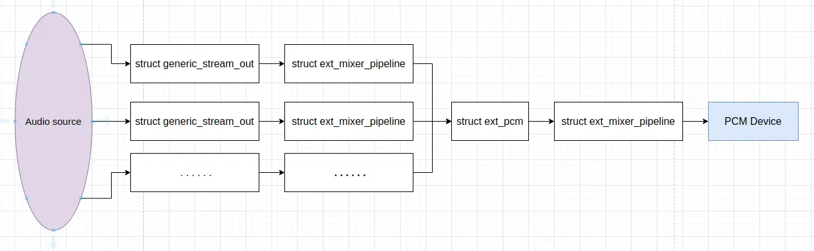

## Audio HAL 操作接口

Audio HAL 本身主要包括接口服务层，和硬件模块层。接口服务层的接口一般在 HIDL 文件中定义，代码通过工具自动生成。接口服务层封装了硬件模块层，它们提供的操作最终还是要由硬件模块层完成。Audio HAL 硬件模块层相关的结构及其关系大体如下图所示：


`struct hw_module_t` 的定义 (位于 *hardware/libhardware/include/hardware/hardware.h*) 如下：
```
typedef struct hw_module_t {
    /** tag must be initialized to HARDWARE_MODULE_TAG */
    uint32_t tag;

    /**
     * The API version of the implemented module. The module owner is
     * responsible for updating the version when a module interface has
     * changed.
     *
     * The derived modules such as gralloc and audio own and manage this field.
     * The module user must interpret the version field to decide whether or
     * not to inter-operate with the supplied module implementation.
     * For example, SurfaceFlinger is responsible for making sure that
     * it knows how to manage different versions of the gralloc-module API,
     * and AudioFlinger must know how to do the same for audio-module API.
     *
     * The module API version should include a major and a minor component.
     * For example, version 1.0 could be represented as 0x0100. This format
     * implies that versions 0x0100-0x01ff are all API-compatible.
     *
     * In the future, libhardware will expose a hw_get_module_version()
     * (or equivalent) function that will take minimum/maximum supported
     * versions as arguments and would be able to reject modules with
     * versions outside of the supplied range.
     */
    uint16_t module_api_version;
#define version_major module_api_version
    /**
     * version_major/version_minor defines are supplied here for temporary
     * source code compatibility. They will be removed in the next version.
     * ALL clients must convert to the new version format.
     */

    /**
     * The API version of the HAL module interface. This is meant to
     * version the hw_module_t, hw_module_methods_t, and hw_device_t
     * structures and definitions.
     *
     * The HAL interface owns this field. Module users/implementations
     * must NOT rely on this value for version information.
     *
     * Presently, 0 is the only valid value.
     */
    uint16_t hal_api_version;
#define version_minor hal_api_version

    /** Identifier of module */
    const char *id;

    /** Name of this module */
    const char *name;

    /** Author/owner/implementor of the module */
    const char *author;

    /** Modules methods */
    struct hw_module_methods_t* methods;

    /** module's dso */
    void* dso;

#ifdef __LP64__
    uint64_t reserved[32-7];
#else
    /** padding to 128 bytes, reserved for future use */
    uint32_t reserved[32-7];
#endif

} hw_module_t;
```

每个硬件模块都必须有一个名为 `HAL_MODULE_INFO_SYM` 的数据结构，且该数据结构的字段必须以 `hw_module_t` 开始，然后是模块自己特有的信息。

其中的 `struct hw_module_methods_t` 定义 (位于 *hardware/libhardware/include/hardware/hardware.h*) 如下：
```
typedef struct hw_module_methods_t {
    /** Open a specific device */
    int (*open)(const struct hw_module_t* module, const char* id,
            struct hw_device_t** device);

} hw_module_methods_t;
```

`hw_module_methods_t` 仅有的操作是 `open()`，主要用以打开设备，获得 `struct hw_device_t` 对象。`struct hw_device_t` 的定义 (位于 *hardware/libhardware/include/hardware/hardware.h*) 如下：
```
typedef struct hw_device_t {
    /** tag must be initialized to HARDWARE_DEVICE_TAG */
    uint32_t tag;

    /**
     * Version of the module-specific device API. This value is used by
     * the derived-module user to manage different device implementations.
     *
     * The module user is responsible for checking the module_api_version
     * and device version fields to ensure that the user is capable of
     * communicating with the specific module implementation.
     *
     * One module can support multiple devices with different versions. This
     * can be useful when a device interface changes in an incompatible way
     * but it is still necessary to support older implementations at the same
     * time. One such example is the Camera 2.0 API.
     *
     * This field is interpreted by the module user and is ignored by the
     * HAL interface itself.
     */
    uint32_t version;

    /** reference to the module this device belongs to */
    struct hw_module_t* module;

    /** padding reserved for future use */
#ifdef __LP64__
    uint64_t reserved[12];
#else
    uint32_t reserved[12];
#endif

    /** Close this device */
    int (*close)(struct hw_device_t* device);

} hw_device_t;
```

`struct hw_device_t` 提供的仅有的操作是 `close()`，它用以关闭自身。一般来说，`struct hw_module_t` 是静态定义的全局对象，`struct hw_device_t` 对象的创建和销毁则有了更大的灵活性。每个设备数据结构必须以 `hw_device_t` 开始，然后是模块特有的公共方法和属性。

为音频模块定义的 `struct audio_module`，它与 `struct hw_module_t` 基本一致，其定义 (位于 *hardware/libhardware/include/hardware/audio.h*) 如下：
```
struct audio_module {
    struct hw_module_t common;
};
```

`struct audio_module` 相对于 `struct hw_module_t` 没有特有的字段。

为音频设备定义的 `struct hw_device_t` 子结构体 `struct audio_hw_device` 添加了不少方法，其定义 (位于 *hardware/libhardware/include/hardware/audio.h*) 如下：
```
struct audio_hw_device {
    /**
     * Common methods of the audio device.  This *must* be the first member of audio_hw_device
     * as users of this structure will cast a hw_device_t to audio_hw_device pointer in contexts
     * where it's known the hw_device_t references an audio_hw_device.
     */
    struct hw_device_t common;

    /**
     * used by audio flinger to enumerate what devices are supported by
     * each audio_hw_device implementation.
     *
     * Return value is a bitmask of 1 or more values of audio_devices_t
     *
     * NOTE: audio HAL implementations starting with
     * AUDIO_DEVICE_API_VERSION_2_0 do not implement this function.
     * All supported devices should be listed in audio_policy.conf
     * file and the audio policy manager must choose the appropriate
     * audio module based on information in this file.
     */
    uint32_t (*get_supported_devices)(const struct audio_hw_device *dev);

    /**
     * check to see if the audio hardware interface has been initialized.
     * returns 0 on success, -ENODEV on failure.
     */
    int (*init_check)(const struct audio_hw_device *dev);

    /** set the audio volume of a voice call. Range is between 0.0 and 1.0 */
    int (*set_voice_volume)(struct audio_hw_device *dev, float volume);

    /**
     * set the audio volume for all audio activities other than voice call.
     * Range between 0.0 and 1.0. If any value other than 0 is returned,
     * the software mixer will emulate this capability.
     */
    int (*set_master_volume)(struct audio_hw_device *dev, float volume);

    /**
     * Get the current master volume value for the HAL, if the HAL supports
     * master volume control.  AudioFlinger will query this value from the
     * primary audio HAL when the service starts and use the value for setting
     * the initial master volume across all HALs.  HALs which do not support
     * this method may leave it set to NULL.
     */
    int (*get_master_volume)(struct audio_hw_device *dev, float *volume);

    /**
     * set_mode is called when the audio mode changes. AUDIO_MODE_NORMAL mode
     * is for standard audio playback, AUDIO_MODE_RINGTONE when a ringtone is
     * playing, and AUDIO_MODE_IN_CALL when a call is in progress.
     */
    int (*set_mode)(struct audio_hw_device *dev, audio_mode_t mode);

    /* mic mute */
    int (*set_mic_mute)(struct audio_hw_device *dev, bool state);
    int (*get_mic_mute)(const struct audio_hw_device *dev, bool *state);

    /* set/get global audio parameters */
    int (*set_parameters)(struct audio_hw_device *dev, const char *kv_pairs);

    /*
     * Returns a pointer to a heap allocated string. The caller is responsible
     * for freeing the memory for it using free().
     */
    char * (*get_parameters)(const struct audio_hw_device *dev,
                             const char *keys);

    /* Returns audio input buffer size according to parameters passed or
     * 0 if one of the parameters is not supported.
     * See also get_buffer_size which is for a particular stream.
     */
    size_t (*get_input_buffer_size)(const struct audio_hw_device *dev,
                                    const struct audio_config *config);

    /** This method creates and opens the audio hardware output stream.
     * The "address" parameter qualifies the "devices" audio device type if needed.
     * The format format depends on the device type:
     * - Bluetooth devices use the MAC address of the device in the form "00:11:22:AA:BB:CC"
     * - USB devices use the ALSA card and device numbers in the form  "card=X;device=Y"
     * - Other devices may use a number or any other string.
     */

    int (*open_output_stream)(struct audio_hw_device *dev,
                              audio_io_handle_t handle,
                              audio_devices_t devices,
                              audio_output_flags_t flags,
                              struct audio_config *config,
                              struct audio_stream_out **stream_out,
                              const char *address);

    void (*close_output_stream)(struct audio_hw_device *dev,
                                struct audio_stream_out* stream_out);

    /** This method creates and opens the audio hardware input stream */
    int (*open_input_stream)(struct audio_hw_device *dev,
                             audio_io_handle_t handle,
                             audio_devices_t devices,
                             struct audio_config *config,
                             struct audio_stream_in **stream_in,
                             audio_input_flags_t flags,
                             const char *address,
                             audio_source_t source);

    void (*close_input_stream)(struct audio_hw_device *dev,
                               struct audio_stream_in *stream_in);

    /**
     * Called by the framework to read available microphones characteristics.
     *
     * \param[in] dev the hw_device object.
     * \param[out] mic_array Pointer to first element on array with microphone info
     * \param[out] mic_count When called, this holds the value of the max number of elements
     *                       allowed in the mic_array. The actual number of elements written
     *                       is returned here.
     *                       if mic_count is passed as zero, mic_array will not be populated,
     *                       and mic_count will return the actual number of microphones in the
     *                       system.
     *
     * \return 0 if the microphone array is successfully filled.
     *         -ENOSYS if there is an error filling the data
     */
    int (*get_microphones)(const struct audio_hw_device *dev,
                           struct audio_microphone_characteristic_t *mic_array,
                           size_t *mic_count);

    /** This method dumps the state of the audio hardware */
    int (*dump)(const struct audio_hw_device *dev, int fd);

    /**
     * set the audio mute status for all audio activities.  If any value other
     * than 0 is returned, the software mixer will emulate this capability.
     */
    int (*set_master_mute)(struct audio_hw_device *dev, bool mute);

    /**
     * Get the current master mute status for the HAL, if the HAL supports
     * master mute control.  AudioFlinger will query this value from the primary
     * audio HAL when the service starts and use the value for setting the
     * initial master mute across all HALs.  HALs which do not support this
     * method may leave it set to NULL.
     */
    int (*get_master_mute)(struct audio_hw_device *dev, bool *mute);

    /**
     * Routing control
     */

    /* Creates an audio patch between several source and sink ports.
     * The handle is allocated by the HAL and should be unique for this
     * audio HAL module. */
    int (*create_audio_patch)(struct audio_hw_device *dev,
                               unsigned int num_sources,
                               const struct audio_port_config *sources,
                               unsigned int num_sinks,
                               const struct audio_port_config *sinks,
                               audio_patch_handle_t *handle);

    /* Release an audio patch */
    int (*release_audio_patch)(struct audio_hw_device *dev,
                               audio_patch_handle_t handle);

    /* Fills the list of supported attributes for a given audio port.
     * As input, "port" contains the information (type, role, address etc...)
     * needed by the HAL to identify the port.
     * As output, "port" contains possible attributes (sampling rates, formats,
     * channel masks, gain controllers...) for this port.
     */
    int (*get_audio_port)(struct audio_hw_device *dev,
                          struct audio_port *port);

    /* Set audio port configuration */
    int (*set_audio_port_config)(struct audio_hw_device *dev,
                         const struct audio_port_config *config);

    /**
     * Applies an audio effect to an audio device.
     *
     * @param dev the audio HAL device context.
     * @param device identifies the sink or source device the effect must be applied to.
     *               "device" is the audio_port_handle_t indicated for the device when
     *               the audio patch connecting that device was created.
     * @param effect effect interface handle corresponding to the effect being added.
     * @return retval operation completion status.
     */
    int (*add_device_effect)(struct audio_hw_device *dev,
                        audio_port_handle_t device, effect_handle_t effect);

    /**
     * Stops applying an audio effect to an audio device.
     *
     * @param dev the audio HAL device context.
     * @param device identifies the sink or source device this effect was applied to.
     *               "device" is the audio_port_handle_t indicated for the device when
     *               the audio patch is created.
     * @param effect effect interface handle corresponding to the effect being removed.
     * @return retval operation completion status.
     */
    int (*remove_device_effect)(struct audio_hw_device *dev,
                        audio_port_handle_t device, effect_handle_t effect);

    /**
     * Fills the list of supported attributes for a given audio port.
     * As input, "port" contains the information (type, role, address etc...)
     * needed by the HAL to identify the port.
     * As output, "port" contains possible attributes (sampling rates, formats,
     * channel masks, gain controllers...) for this port. The possible attributes
     * are saved as audio profiles, which contains audio format and the supported
     * sampling rates and channel masks.
     */
    int (*get_audio_port_v7)(struct audio_hw_device *dev,
                             struct audio_port_v7 *port);
};
typedef struct audio_hw_device audio_hw_device_t;
```

`struct audio_hw_device` 提供了许多操作，我们可以从设备控制和数据流两个方面来看待这些操作，更具体地，这些操作可以分为如下这样一些功能类别：

 * 设备信息及状态查询和设置。如 `get_supported_devices`，`init_check`，`get_input_buffer_size`，`get_microphones`，`get_audio_port`，`set_audio_port_config` 和 `get_audio_port_v7`；
 * 音量设置和获取，如 `set_voice_volume`，`set_master_volume`，`get_master_volume`，`set_mic_mute`，`get_mic_mute`，`set_master_mute` 和 `get_master_mute`；
 * 设备工作模式设置，如 `set_mode`；
 * 参数设置和获取，如 `set_parameters` 和 `get_parameters`；
 * **音频输入输出流管理**，如 `open_output_stream`，`close_output_stream`，`open_input_stream` 和`close_input_stream`；
 * 调试相关功能，如 `dump`；
 * ***Audio patch 相关功能***，如 `create_audio_patch` 和 `release_audio_patch`；
 * ***音效***，如 `add_device_effect` 和 `remove_device_effect`。

**音频输入输出流管理** 是最重要最基本的数据处理功能，***Audio patch 相关功能*** 和 ***音效*** 是高级数据处理功能。

在 Audio HAL 中，输入输出流分别用来描述麦克风采集和扬声器播放的数据流，Audio HAL 的使用者通过输入流 `struct audio_stream_in` 和输出流 `struct audio_stream_out` 从音频采集设备获得数据或将播放数据送进音频播放设备。输入流 `struct audio_stream_in` 和输出流 `struct audio_stream_out` 都继承自 `struct audio_stream`，`struct audio_stream` 定义了一些共有的音频流参数和操作，其详细定义 (位于 *hardware/libhardware/include/hardware/audio.h*) 如下：
```
/* common audio stream parameters and operations */
struct audio_stream {

    /**
     * Return the sampling rate in Hz - eg. 44100.
     */
    uint32_t (*get_sample_rate)(const struct audio_stream *stream);

    /* currently unused - use set_parameters with key
     *    AUDIO_PARAMETER_STREAM_SAMPLING_RATE
     */
    int (*set_sample_rate)(struct audio_stream *stream, uint32_t rate);

    /**
     * Return size of input/output buffer in bytes for this stream - eg. 4800.
     * It should be a multiple of the frame size.  See also get_input_buffer_size.
     */
    size_t (*get_buffer_size)(const struct audio_stream *stream);

    /**
     * Return the channel mask -
     *  e.g. AUDIO_CHANNEL_OUT_STEREO or AUDIO_CHANNEL_IN_STEREO
     */
    audio_channel_mask_t (*get_channels)(const struct audio_stream *stream);

    /**
     * Return the audio format - e.g. AUDIO_FORMAT_PCM_16_BIT
     */
    audio_format_t (*get_format)(const struct audio_stream *stream);

    /* currently unused - use set_parameters with key
     *     AUDIO_PARAMETER_STREAM_FORMAT
     */
    int (*set_format)(struct audio_stream *stream, audio_format_t format);

    /**
     * Put the audio hardware input/output into standby mode.
     * Driver should exit from standby mode at the next I/O operation.
     * Returns 0 on success and <0 on failure.
     */
    int (*standby)(struct audio_stream *stream);

    /** dump the state of the audio input/output device */
    int (*dump)(const struct audio_stream *stream, int fd);

    /** Return the set of device(s) which this stream is connected to */
    audio_devices_t (*get_device)(const struct audio_stream *stream);

    /**
     * Currently unused - set_device() corresponds to set_parameters() with key
     * AUDIO_PARAMETER_STREAM_ROUTING for both input and output.
     * AUDIO_PARAMETER_STREAM_INPUT_SOURCE is an additional information used by
     * input streams only.
     */
    int (*set_device)(struct audio_stream *stream, audio_devices_t device);

    /**
     * set/get audio stream parameters. The function accepts a list of
     * parameter key value pairs in the form: key1=value1;key2=value2;...
     *
     * Some keys are reserved for standard parameters (See AudioParameter class)
     *
     * If the implementation does not accept a parameter change while
     * the output is active but the parameter is acceptable otherwise, it must
     * return -ENOSYS.
     *
     * The audio flinger will put the stream in standby and then change the
     * parameter value.
     */
    int (*set_parameters)(struct audio_stream *stream, const char *kv_pairs);

    /*
     * Returns a pointer to a heap allocated string. The caller is responsible
     * for freeing the memory for it using free().
     */
    char * (*get_parameters)(const struct audio_stream *stream,
                             const char *keys);
    int (*add_audio_effect)(const struct audio_stream *stream,
                             effect_handle_t effect);
    int (*remove_audio_effect)(const struct audio_stream *stream,
                             effect_handle_t effect);
};
typedef struct audio_stream audio_stream_t;
```

音频流 `struct audio_stream` 的操作按照功能可以分为如下几个类别：

 * 基本的音频参数的设置和获取，如 `get_sample_rate`，`set_sample_rate`，`get_channels`，`get_format`，`set_format`；
 * 缓冲区大小的获取，如 `get_buffer_size`；
 * 设置进入待命模式，如 `standby`；
 * 调试相关功能，如 `dump`；
 * 与流关联的设备的获取和设置，如 `get_device` 和 `set_device`；
 * 针对流的参数设置和获取，如 `set_parameters` 和 `get_parameters`；
 * ***针对流的音效功能***，如 `add_audio_effect` 和 `remove_audio_effect`。

***音效*** 可以针对音频流来添加和移除。

`struct audio_stream_in` 提供了更加丰富的操作，其定义 (位于 *hardware/libhardware/include/hardware/audio.h*) 如下：
```
struct audio_stream_in {
    /**
     * Common methods of the audio stream in.  This *must* be the first member of audio_stream_in
     * as users of this structure will cast a audio_stream to audio_stream_in pointer in contexts
     * where it's known the audio_stream references an audio_stream_in.
     */
    struct audio_stream common;

    /** set the input gain for the audio driver. This method is for
     *  for future use */
    int (*set_gain)(struct audio_stream_in *stream, float gain);

    /** Read audio buffer in from audio driver. Returns number of bytes read, or a
     *  negative status_t. If at least one frame was read prior to the error,
     *  read should return that byte count and then return an error in the subsequent call.
     */
    ssize_t (*read)(struct audio_stream_in *stream, void* buffer,
                    size_t bytes);

    /**
     * Return the amount of input frames lost in the audio driver since the
     * last call of this function.
     * Audio driver is expected to reset the value to 0 and restart counting
     * upon returning the current value by this function call.
     * Such loss typically occurs when the user space process is blocked
     * longer than the capacity of audio driver buffers.
     *
     * Unit: the number of input audio frames
     */
    uint32_t (*get_input_frames_lost)(struct audio_stream_in *stream);

    /**
     * Return a recent count of the number of audio frames received and
     * the clock time associated with that frame count.
     *
     * frames is the total frame count received. This should be as early in
     *     the capture pipeline as possible. In general,
     *     frames should be non-negative and should not go "backwards".
     *
     * time is the clock MONOTONIC time when frames was measured. In general,
     *     time should be a positive quantity and should not go "backwards".
     *
     * The status returned is 0 on success, -ENOSYS if the device is not
     * ready/available, or -EINVAL if the arguments are null or otherwise invalid.
     */
    int (*get_capture_position)(const struct audio_stream_in *stream,
                                int64_t *frames, int64_t *time);

    /**
     * Called by the framework to start a stream operating in mmap mode.
     * create_mmap_buffer must be called before calling start()
     *
     * \note Function only implemented by streams operating in mmap mode.
     *
     * \param[in] stream the stream object.
     * \return 0 in case off success.
     *         -ENOSYS if called out of sequence or on non mmap stream
     */
    int (*start)(const struct audio_stream_in* stream);

    /**
     * Called by the framework to stop a stream operating in mmap mode.
     *
     * \note Function only implemented by streams operating in mmap mode.
     *
     * \param[in] stream the stream object.
     * \return 0 in case of success.
     *         -ENOSYS if called out of sequence or on non mmap stream
     */
    int (*stop)(const struct audio_stream_in* stream);

    /**
     * Called by the framework to retrieve information on the mmap buffer used for audio
     * samples transfer.
     *
     * \note Function only implemented by streams operating in mmap mode.
     *
     * \param[in] stream the stream object.
     * \param[in] min_size_frames minimum buffer size requested. The actual buffer
     *        size returned in struct audio_mmap_buffer_info can be larger.
     * \param[out] info address at which the mmap buffer information should be returned.
     *
     * \return 0 if the buffer was allocated.
     *         -ENODEV in case of initialization error
     *         -EINVAL if the requested buffer size is too large
     *         -ENOSYS if called out of sequence (e.g. buffer already allocated)
     */
    int (*create_mmap_buffer)(const struct audio_stream_in *stream,
                              int32_t min_size_frames,
                              struct audio_mmap_buffer_info *info);

    /**
     * Called by the framework to read current read/write position in the mmap buffer
     * with associated time stamp.
     *
     * \note Function only implemented by streams operating in mmap mode.
     *
     * \param[in] stream the stream object.
     * \param[out] position address at which the mmap read/write position should be returned.
     *
     * \return 0 if the position is successfully returned.
     *         -ENODATA if the position cannot be retreived
     *         -ENOSYS if called before mmap_read_position()
     */
    int (*get_mmap_position)(const struct audio_stream_in *stream,
                             struct audio_mmap_position *position);

    /**
     * Called by the framework to read active microphones
     *
     * \param[in] stream the stream object.
     * \param[out] mic_array Pointer to first element on array with microphone info
     * \param[out] mic_count When called, this holds the value of the max number of elements
     *                       allowed in the mic_array. The actual number of elements written
     *                       is returned here.
     *                       if mic_count is passed as zero, mic_array will not be populated,
     *                       and mic_count will return the actual number of active microphones.
     *
     * \return 0 if the microphone array is successfully filled.
     *         -ENOSYS if there is an error filling the data
     */
    int (*get_active_microphones)(const struct audio_stream_in *stream,
                                  struct audio_microphone_characteristic_t *mic_array,
                                  size_t *mic_count);

    /**
     * Called by the framework to instruct the HAL to optimize the capture stream in the
     * specified direction.
     *
     * \param[in] stream    the stream object.
     * \param[in] direction The direction constant (from audio-base.h)
     *   MIC_DIRECTION_UNSPECIFIED  Don't do any directionality processing of the
     *      activated microphone(s).
     *   MIC_DIRECTION_FRONT        Optimize capture for audio coming from the screen-side
     *      of the device.
     *   MIC_DIRECTION_BACK         Optimize capture for audio coming from the side of the
     *      device opposite the screen.
     *   MIC_DIRECTION_EXTERNAL     Optimize capture for audio coming from an off-device
     *      microphone.
     * \return OK if the call is successful, an error code otherwise.
     */
    int (*set_microphone_direction)(const struct audio_stream_in *stream,
                                    audio_microphone_direction_t direction);

    /**
     * Called by the framework to specify to the HAL the desired zoom factor for the selected
     * microphone(s).
     *
     * \param[in] stream    the stream object.
     * \param[in] zoom      the zoom factor.
     * \return OK if the call is successful, an error code otherwise.
     */
    int (*set_microphone_field_dimension)(const struct audio_stream_in *stream,
                                          float zoom);

    /**
     * Called when the metadata of the stream's sink has been changed.
     * @param sink_metadata Description of the audio that is recorded by the clients.
     */
    void (*update_sink_metadata)(struct audio_stream_in *stream,
                                 const struct sink_metadata* sink_metadata);

    /**
     * Called when the metadata of the stream's sink has been changed.
     * HAL version 3.2 and higher only.
     * @param sink_metadata Description of the audio that is recorded by the clients.
     */
    void (*update_sink_metadata_v7)(struct audio_stream_in *stream,
                                    const struct sink_metadata_v7* sink_metadata);
};
typedef struct audio_stream_in audio_stream_in_t;
```

音频输入流 `struct audio_stream_in` 相对于 `struct audio_stream` 增加的这些操作，按照功能可以分为如下几个类别：

 * 音量调节，如 `set_gain`；
 * 数据读取，如 `read`；
 * 状态查询，如 `get_input_frames_lost`，`get_capture_position`；
 * ***支持 MMAP 模式***，`start`，`stop`，`create_mmap_buffer`，`get_mmap_position`；
 * 与流关联的设备信息查询，`get_active_microphones`；
 * 麦克风控制操作，`set_microphone_direction` 和 `set_microphone_field_dimension`；
 * 更新 stream 的 sink 的 metadata，`update_sink_metadata` 和 `update_sink_metadata_v7`。

`struct audio_stream_out` 是音频输出设备的抽象接口，它提供了关于音频输出硬件驱动的各种属性的信息，同样提供了更加丰富的操作，其定义 (位于 *hardware/libhardware/include/hardware/audio.h*) 如下：
```
/**
 * audio_stream_out is the abstraction interface for the audio output hardware.
 *
 * It provides information about various properties of the audio output
 * hardware driver.
 */
struct audio_stream_out {
    /**
     * Common methods of the audio stream out.  This *must* be the first member of audio_stream_out
     * as users of this structure will cast a audio_stream to audio_stream_out pointer in contexts
     * where it's known the audio_stream references an audio_stream_out.
     */
    struct audio_stream common;

    /**
     * Return the audio hardware driver estimated latency in milliseconds.
     */
    uint32_t (*get_latency)(const struct audio_stream_out *stream);

    /**
     * Use this method in situations where audio mixing is done in the
     * hardware. This method serves as a direct interface with hardware,
     * allowing you to directly set the volume as apposed to via the framework.
     * This method might produce multiple PCM outputs or hardware accelerated
     * codecs, such as MP3 or AAC.
     */
    int (*set_volume)(struct audio_stream_out *stream, float left, float right);

    /**
     * Write audio buffer to driver. Returns number of bytes written, or a
     * negative status_t. If at least one frame was written successfully prior to the error,
     * it is suggested that the driver return that successful (short) byte count
     * and then return an error in the subsequent call.
     *
     * If set_callback() has previously been called to enable non-blocking mode
     * the write() is not allowed to block. It must write only the number of
     * bytes that currently fit in the driver/hardware buffer and then return
     * this byte count. If this is less than the requested write size the
     * callback function must be called when more space is available in the
     * driver/hardware buffer.
     */
    ssize_t (*write)(struct audio_stream_out *stream, const void* buffer,
                     size_t bytes);

    /* return the number of audio frames written by the audio dsp to DAC since
     * the output has exited standby
     */
    int (*get_render_position)(const struct audio_stream_out *stream,
                               uint32_t *dsp_frames);

    /**
     * get the local time at which the next write to the audio driver will be presented.
     * The units are microseconds, where the epoch is decided by the local audio HAL.
     */
    int (*get_next_write_timestamp)(const struct audio_stream_out *stream,
                                    int64_t *timestamp);

    /**
     * set the callback function for notifying completion of non-blocking
     * write and drain.
     * Calling this function implies that all future write() and drain()
     * must be non-blocking and use the callback to signal completion.
     */
    int (*set_callback)(struct audio_stream_out *stream,
            stream_callback_t callback, void *cookie);

    /**
     * Notifies to the audio driver to stop playback however the queued buffers are
     * retained by the hardware. Useful for implementing pause/resume. Empty implementation
     * if not supported however should be implemented for hardware with non-trivial
     * latency. In the pause state audio hardware could still be using power. User may
     * consider calling suspend after a timeout.
     *
     * Implementation of this function is mandatory for offloaded playback.
     */
    int (*pause)(struct audio_stream_out* stream);

    /**
     * Notifies to the audio driver to resume playback following a pause.
     * Returns error if called without matching pause.
     *
     * Implementation of this function is mandatory for offloaded playback.
     */
    int (*resume)(struct audio_stream_out* stream);

    /**
     * Requests notification when data buffered by the driver/hardware has
     * been played. If set_callback() has previously been called to enable
     * non-blocking mode, the drain() must not block, instead it should return
     * quickly and completion of the drain is notified through the callback.
     * If set_callback() has not been called, the drain() must block until
     * completion.
     * If type==AUDIO_DRAIN_ALL, the drain completes when all previously written
     * data has been played.
     * If type==AUDIO_DRAIN_EARLY_NOTIFY, the drain completes shortly before all
     * data for the current track has played to allow time for the framework
     * to perform a gapless track switch.
     *
     * Drain must return immediately on stop() and flush() call
     *
     * Implementation of this function is mandatory for offloaded playback.
     */
    int (*drain)(struct audio_stream_out* stream, audio_drain_type_t type );

    /**
     * Notifies to the audio driver to flush the queued data. Stream must already
     * be paused before calling flush().
     *
     * Implementation of this function is mandatory for offloaded playback.
     */
   int (*flush)(struct audio_stream_out* stream);

    /**
     * Return a recent count of the number of audio frames presented to an external observer.
     * This excludes frames which have been written but are still in the pipeline.
     * The count is not reset to zero when output enters standby.
     * Also returns the value of CLOCK_MONOTONIC as of this presentation count.
     * The returned count is expected to be 'recent',
     * but does not need to be the most recent possible value.
     * However, the associated time should correspond to whatever count is returned.
     * Example:  assume that N+M frames have been presented, where M is a 'small' number.
     * Then it is permissible to return N instead of N+M,
     * and the timestamp should correspond to N rather than N+M.
     * The terms 'recent' and 'small' are not defined.
     * They reflect the quality of the implementation.
     *
     * 3.0 and higher only.
     */
    int (*get_presentation_position)(const struct audio_stream_out *stream,
                               uint64_t *frames, struct timespec *timestamp);

    /**
     * Called by the framework to start a stream operating in mmap mode.
     * create_mmap_buffer must be called before calling start()
     *
     * \note Function only implemented by streams operating in mmap mode.
     *
     * \param[in] stream the stream object.
     * \return 0 in case of success.
     *         -ENOSYS if called out of sequence or on non mmap stream
     */
    int (*start)(const struct audio_stream_out* stream);

    /**
     * Called by the framework to stop a stream operating in mmap mode.
     * Must be called after start()
     *
     * \note Function only implemented by streams operating in mmap mode.
     *
     * \param[in] stream the stream object.
     * \return 0 in case of success.
     *         -ENOSYS if called out of sequence or on non mmap stream
     */
    int (*stop)(const struct audio_stream_out* stream);

    /**
     * Called by the framework to retrieve information on the mmap buffer used for audio
     * samples transfer.
     *
     * \note Function only implemented by streams operating in mmap mode.
     *
     * \param[in] stream the stream object.
     * \param[in] min_size_frames minimum buffer size requested. The actual buffer
     *        size returned in struct audio_mmap_buffer_info can be larger.
     * \param[out] info address at which the mmap buffer information should be returned.
     *
     * \return 0 if the buffer was allocated.
     *         -ENODEV in case of initialization error
     *         -EINVAL if the requested buffer size is too large
     *         -ENOSYS if called out of sequence (e.g. buffer already allocated)
     */
    int (*create_mmap_buffer)(const struct audio_stream_out *stream,
                              int32_t min_size_frames,
                              struct audio_mmap_buffer_info *info);

    /**
     * Called by the framework to read current read/write position in the mmap buffer
     * with associated time stamp.
     *
     * \note Function only implemented by streams operating in mmap mode.
     *
     * \param[in] stream the stream object.
     * \param[out] position address at which the mmap read/write position should be returned.
     *
     * \return 0 if the position is successfully returned.
     *         -ENODATA if the position cannot be retrieved
     *         -ENOSYS if called before create_mmap_buffer()
     */
    int (*get_mmap_position)(const struct audio_stream_out *stream,
                             struct audio_mmap_position *position);

    /**
     * Called when the metadata of the stream's source has been changed.
     * @param source_metadata Description of the audio that is played by the clients.
     */
    void (*update_source_metadata)(struct audio_stream_out *stream,
                                   const struct source_metadata* source_metadata);

    /**
     * Set the callback function for notifying events for an output stream.
     */
    int (*set_event_callback)(struct audio_stream_out *stream,
                              stream_event_callback_t callback,
                              void *cookie);

    /**
     * Called when the metadata of the stream's source has been changed.
     * HAL version 3.2 and higher only.
     * @param source_metadata Description of the audio that is played by the clients.
     */
    void (*update_source_metadata_v7)(struct audio_stream_out *stream,
                                      const struct source_metadata_v7* source_metadata);

    /**
     * Returns the Dual Mono mode presentation setting.
     *
     * \param[in] stream the stream object.
     * \param[out] mode current setting of Dual Mono mode.
     *
     * \return 0 if the position is successfully returned.
     *         -EINVAL if the arguments are invalid
     *         -ENOSYS if the function is not available
     */
    int (*get_dual_mono_mode)(struct audio_stream_out *stream, audio_dual_mono_mode_t *mode);

    /**
     * Sets the Dual Mono mode presentation on the output device.
     *
     * \param[in] stream the stream object.
     * \param[in] mode selected Dual Mono mode.
     *
     * \return 0 in case of success.
     *         -EINVAL if the arguments are invalid
     *         -ENOSYS if the function is not available
     */
    int (*set_dual_mono_mode)(struct audio_stream_out *stream, const audio_dual_mono_mode_t mode);

    /**
     * Returns the Audio Description Mix level in dB.
     *
     * \param[in] stream the stream object.
     * \param[out] leveldB the current Audio Description Mix Level in dB.
     *
     * \return 0 in case of success.
     *         -EINVAL if the arguments are invalid
     *         -ENOSYS if the function is not available
     */
    int (*get_audio_description_mix_level)(struct audio_stream_out *stream, float *leveldB);

    /**
     * Sets the Audio Description Mix level in dB.
     *
     * \param[in] stream the stream object.
     * \param[in] leveldB Audio Description Mix Level in dB.
     *
     * \return 0 in case of success.
     *         -EINVAL if the arguments are invalid
     *         -ENOSYS if the function is not available
     */
    int (*set_audio_description_mix_level)(struct audio_stream_out *stream, const float leveldB);

    /**
     * Retrieves current playback rate parameters.
     *
     * \param[in] stream the stream object.
     * \param[out] playbackRate current playback parameters.
     *
     * \return 0 in case of success.
     *         -EINVAL if the arguments are invalid
     *         -ENOSYS if the function is not available
     */
    int (*get_playback_rate_parameters)(struct audio_stream_out *stream,
                                        audio_playback_rate_t *playbackRate);

    /**
     * Sets the playback rate parameters that control playback behavior.
     *
     * \param[in] stream the stream object.
     * \param[in] playbackRate playback parameters.
     *
     * \return 0 in case of success.
     *         -EINVAL if the arguments are invalid
     *         -ENOSYS if the function is not available
     */
    int (*set_playback_rate_parameters)(struct audio_stream_out *stream,
                                        const audio_playback_rate_t *playbackRate);
};
typedef struct audio_stream_out audio_stream_out_t;
```

音频输出流 `struct audio_stream_out` 相对于 `struct audio_stream` 增加的这些操作，按照功能可以分为如下几个类别：

 * 状态查询和设置，如 `get_latency`，`get_render_position`，`get_next_write_timestamp`，`get_presentation_position`；
 * 音量调节，如 `set_volume`；
 * **数据写入**，如 `write`；
 * 支持异步模式，如 `set_callback`，
 * ***支持 offload playback 模式***，如 `pause`，`resume`，`drain` 和 `flush`；
 * ***支持 MMAP 数据传输模式***，如 `start`，`stop`，`create_mmap_buffer` 和 `get_mmap_position`；
 * 更新 stream 的 source 的 metadata，如 `update_source_metadata` 和 `update_source_metadata_v7`。
 * 事件通知，如 `set_event_callback`;
 * ***双单声道模式支持***，如 `get_dual_mono_mode` 和 `set_dual_mono_mode`；
 * ***音频描述混合支持***，如 `get_audio_description_mix_level` 和 `set_audio_description_mix_level`。
 * ***播放速率控制***，如 `get_playback_rate_parameters`，和 `set_playback_rate_parameters`。

Audio HAL 硬件模块层相关的结构和接口及其关系更完整的描述如下图所示：


Audio HAL 接口中的许多高级功能不是必须的，模拟器版的 Audio HAL 实现只提供了一些基本操作的实现，高通设备的 Audio HAL 则有着更为完整的实现，其相关代码位于 `hardware/qcom/audio`。

## AAOS 版模拟器的 Audio HAL 操作

AAOS 版模拟器的 `struct audio_module` 对象实例定义 (位于 *device/generic/car/emulator/audio/driver/audio_hw.c*) 如下：
```
static struct hw_module_methods_t hal_module_methods = {
    .open = adev_open,
};

struct audio_module HAL_MODULE_INFO_SYM = {
    .common = {
        .tag = HARDWARE_MODULE_TAG,
        .module_api_version = AUDIO_MODULE_API_VERSION_0_1,
        .hal_api_version = HARDWARE_HAL_API_VERSION,
        .id = AUDIO_HARDWARE_MODULE_ID,
        .name = "Generic car audio HW HAL",
        .author = "The Android Open Source Project",
        .methods = &hal_module_methods,
    },
};
```

`struct hw_module_t` 的 `open()` 操作的定义 (位于 *device/generic/car/emulator/audio/driver/audio_hw.c*) 如下：
```
/* copied from libcutils/str_parms.c */
static bool str_eq(void *key_a, void *key_b) {
    return !strcmp((const char *)key_a, (const char *)key_b);
}

/**
 * use djb hash unless we find it inadequate.
 * copied from libcutils/str_parms.c
 */
#ifdef __clang__
__attribute__((no_sanitize("integer")))
#endif
static int str_hash_fn(void *str) {
    uint32_t hash = 5381;
    char *p;
    for (p = str; p && *p; p++) {
        hash = ((hash << 5) + hash) + *p;
    }
    return (int)hash;
}

static int adev_open(const hw_module_t *module,
        const char *name, hw_device_t **device) {
    static struct generic_audio_device *adev;
    ALOGD("%s:%s: name %s", __FILE__, __func__, name);

    if (strcmp(name, AUDIO_HARDWARE_INTERFACE) != 0)
        return -EINVAL;

    pthread_mutex_lock(&lock);
    if (audio_device_ref_count != 0) {
        *device = &adev->device.common;
        audio_device_ref_count++;
        ALOGV("%s: returning existing instance of adev", __func__);
        ALOGV("%s: exit", __func__);
        goto unlock;
    }

    pcm_config_in.period_count = get_in_period_count();
    pcm_config_out.period_count = get_out_period_count();

    adev = calloc(1, sizeof(struct generic_audio_device));

    pthread_mutex_init(&adev->lock, (const pthread_mutexattr_t *) NULL);

    adev->device.common.tag = HARDWARE_DEVICE_TAG;
    adev->device.common.version = AUDIO_DEVICE_API_VERSION_3_0;
    adev->device.common.module = (struct hw_module_t *) module;
    adev->device.common.close = adev_close;

    adev->device.init_check = adev_init_check;               // no op
    adev->device.set_voice_volume = adev_set_voice_volume;   // no op
    adev->device.set_master_volume = adev_set_master_volume; // no op
    adev->device.get_master_volume = adev_get_master_volume; // no op
    adev->device.set_master_mute = adev_set_master_mute;
    adev->device.get_master_mute = adev_get_master_mute;
    adev->device.set_mode = adev_set_mode;                   // no op
    adev->device.set_mic_mute = adev_set_mic_mute;
    adev->device.get_mic_mute = adev_get_mic_mute;
    adev->device.set_parameters = adev_set_parameters;       // no op
    adev->device.get_parameters = adev_get_parameters;       // no op
    adev->device.get_input_buffer_size = adev_get_input_buffer_size;
    adev->device.open_output_stream = adev_open_output_stream;
    adev->device.close_output_stream = adev_close_output_stream;
    adev->device.open_input_stream = adev_open_input_stream;
    adev->device.close_input_stream = adev_close_input_stream;
    adev->device.dump = adev_dump;

    // New in AUDIO_DEVICE_API_VERSION_3_0
    adev->device.set_audio_port_config = adev_set_audio_port_config;
    adev->device.create_audio_patch = adev_create_audio_patch;
    adev->device.release_audio_patch = adev_release_audio_patch;

    *device = &adev->device.common;

    adev->mixer = mixer_open(PCM_CARD);

    ALOGD("%s Mixer name %s", __func__, mixer_get_name(adev->mixer));
    struct mixer_ctl *ctl;

    // Set default mixer ctls
    // Enable channels and set volume
    for (int i = 0; i < (int)mixer_get_num_ctls(adev->mixer); i++) {
        ctl = mixer_get_ctl(adev->mixer, i);
        ALOGD("mixer %d name %s", i, mixer_ctl_get_name(ctl));
        if (!strcmp(mixer_ctl_get_name(ctl), "Master Playback Volume") ||
            !strcmp(mixer_ctl_get_name(ctl), "Capture Volume")) {
            for (int z = 0; z < (int)mixer_ctl_get_num_values(ctl); z++) {
                ALOGD("set ctl %d to %d", z, 100);
                mixer_ctl_set_percent(ctl, z, 100);
            }
            continue;
        }
        if (!strcmp(mixer_ctl_get_name(ctl), "Master Playback Switch") ||
            !strcmp(mixer_ctl_get_name(ctl), "Capture Switch")) {
            for (int z = 0; z < (int)mixer_ctl_get_num_values(ctl); z++) {
                ALOGD("set ctl %d to %d", z, 1);
                mixer_ctl_set_value(ctl, z, 1);
            }
            continue;
        }
    }

    // Initialize the bus address to output stream map
    adev->out_bus_stream_map = hashmapCreate(5, str_hash_fn, str_eq);

    // Initialize the bus address to input stream map
    adev->in_bus_tone_frequency_map = hashmapCreate(5, str_hash_fn, str_eq);

    adev->next_tone_frequency_to_assign = DEFAULT_FREQUENCY;

    adev->last_zone_selected_to_play = DEFAULT_ZONE_TO_LEFT_SPEAKER;

    device_handle = adev;

    audio_device_ref_count++;

unlock:
    pthread_mutex_unlock(&lock);
    return 0;
}
```

这个操作完成的主要的事情为创建一个单实例的定制版的 `struct audio_hw_device` 对象，即 `struct generic_audio_device` 对象。`struct generic_audio_device` 结构的定义 (位于 *device/generic/car/emulator/audio/driver/audio_hw.h*) 如下：
```
struct generic_audio_device {
  struct audio_hw_device device;  // Constant after init
  pthread_mutex_t lock;
  unsigned int last_patch_id;   // Protected by this->lock
  bool master_mute;             // Protected by this->lock
  bool mic_mute;                // Protected by this->lock
  struct mixer *mixer;          // Protected by this->lock
  Hashmap *out_bus_stream_map;  // Extended field. Constant after init
  Hashmap *in_bus_tone_frequency_map;  // Extended field. Constant after init
  int next_tone_frequency_to_assign; // Protected by this->lock
  // Play on Speaker zone selection
  int last_zone_selected_to_play; // Protected by this->lock
};

static struct generic_audio_device *device_handle;
```

操作完成的主要动作如下：

1. 如果 `struct generic_audio_device` 对象已经创建，则增加引用计数并返回；
2. `struct generic_audio_device` 对象还没有创建，则初始化 `pcm_config_in` 和 `pcm_config_out`；
3. 动态分配一个 `struct generic_audio_device` 对象，并初始化其各个字段；
4. 调用 tinyalsa 的 `mixer_open()` 函数打开 mixer 设备；
5. 设置默认的 mixer 控制；
6. 创建总线到输出流的映射；
7. 初始化其它一些成员变量；
8. 增加引用计数，并返回。

`struct hw_device_t` 提供的`close()` 操作是上面这个 `open()` 操作的你操作：
```
static int adev_close(hw_device_t *dev) {
    struct generic_audio_device *adev = (struct generic_audio_device *)dev;
    int ret = 0;
    if (!adev)
        return 0;

    pthread_mutex_lock(&lock);

    if (audio_device_ref_count == 0) {
        ALOGE("adev_close called when ref_count 0");
        ret = -EINVAL;
        goto error;
    }

    if ((--audio_device_ref_count) == 0) {
        if (adev->mixer) {
            mixer_close(adev->mixer);
        }
        if (adev->out_bus_stream_map) {
            hashmapFree(adev->out_bus_stream_map);
        }
        if (adev->in_bus_tone_frequency_map) {
            hashmapFree(adev->in_bus_tone_frequency_map);
        }

        device_handle = 0;
        free(adev);
    }

error:
    pthread_mutex_unlock(&lock);
    return ret;
}
```

它首先递减 `struct generic_audio_device` 对象的引用计数。如果引用计数为 0，则释放上面 `open()` 操作分配或打开的所有资源。

接着来看下数据相关的操作。用于打开音频输出流的 `adev_open_output_stream()` 函数的定义如下：
```
static int adev_open_output_stream(struct audio_hw_device *dev,
        audio_io_handle_t handle, audio_devices_t devices, audio_output_flags_t flags,
        struct audio_config *config, struct audio_stream_out **stream_out, const char *address) {
    struct generic_audio_device *adev = (struct generic_audio_device *)dev;
    struct generic_stream_out *out;
    int ret = 0;

    if (refine_output_parameters(&config->sample_rate, &config->format, &config->channel_mask)) {
        ALOGE("Error opening output stream format %d, channel_mask %04x, sample_rate %u",
              config->format, config->channel_mask, config->sample_rate);
        ret = -EINVAL;
        goto error;
    }

    out = (struct generic_stream_out *)calloc(1, sizeof(struct generic_stream_out));

    if (!out)
        return -ENOMEM;

    out->stream.common.get_sample_rate = out_get_sample_rate;
    out->stream.common.set_sample_rate = out_set_sample_rate;
    out->stream.common.get_buffer_size = out_get_buffer_size;
    out->stream.common.get_channels = out_get_channels;
    out->stream.common.get_format = out_get_format;
    out->stream.common.set_format = out_set_format;
    out->stream.common.standby = out_standby;
    out->stream.common.dump = out_dump;
    out->stream.common.set_parameters = out_set_parameters;
    out->stream.common.get_parameters = out_get_parameters;
    out->stream.common.add_audio_effect = out_add_audio_effect;
    out->stream.common.remove_audio_effect = out_remove_audio_effect;
    out->stream.get_latency = out_get_latency;
    out->stream.set_volume = out_set_volume;
    out->stream.write = out_write;
    out->stream.get_render_position = out_get_render_position;
    out->stream.get_presentation_position = out_get_presentation_position;
    out->stream.get_next_write_timestamp = out_get_next_write_timestamp;

    pthread_mutex_init(&out->lock, (const pthread_mutexattr_t *) NULL);
    out->dev = adev;
    out->device = devices;
    memcpy(&out->req_config, config, sizeof(struct audio_config));
    memcpy(&out->pcm_config, &pcm_config_out, sizeof(struct pcm_config));
    out->pcm_config.rate = config->sample_rate;
    out->pcm_config.period_size = out->pcm_config.rate * get_out_period_ms() / 1000;

    out->standby = true;
    out->underrun_position = 0;
    out->underrun_time.tv_sec = 0;
    out->underrun_time.tv_nsec = 0;
    out->last_write_time_us = 0;
    out->frames_total_buffered = 0;
    out->frames_written = 0;
    out->frames_rendered = 0;

    ret = audio_vbuffer_init(&out->buffer,
            out->pcm_config.period_size*out->pcm_config.period_count,
            out->pcm_config.channels *
            pcm_format_to_bits(out->pcm_config.format) >> 3);
    if (ret == 0) {
        pthread_cond_init(&out->worker_wake, NULL);
        out->worker_standby = true;
        out->worker_exit = false;
        pthread_create(&out->worker_thread, NULL, out_write_worker, out);
    }

    out->enabled_channels = BOTH_CHANNELS;
    // For targets where output streams are closed regularly, currently ducked/muted addresses
    // should be tracked so that the address of new streams can be checked to determine the
    // default state
    out->is_ducked = 0;
    out->is_muted = 0;
    if (address) {
        out->bus_address = calloc(strlen(address) + 1, sizeof(char));
        strncpy(out->bus_address, address, strlen(address));
        hashmapPut(adev->out_bus_stream_map, out->bus_address, out);
        /* TODO: read struct audio_gain from audio_policy_configuration */
        out->gain_stage = (struct audio_gain) {
            .min_value = -3200,
            .max_value = 600,
            .step_value = 100,
        };
        out->amplitude_ratio = 1.0;
        if (property_get_bool(PROP_KEY_SIMULATE_MULTI_ZONE_AUDIO, false)) {
            out->enabled_channels = strstr(out->bus_address, AUDIO_ZONE_KEYWORD)
                ? RIGHT_CHANNEL: LEFT_CHANNEL;
            ALOGD("%s Routing %s to %s channel", __func__,
             out->bus_address, out->enabled_channels == RIGHT_CHANNEL ? "Right" : "Left");
        }
    }
    *stream_out = &out->stream;
    ALOGD("%s bus: %s", __func__, out->bus_address);

error:
    return ret;
}
```

`adev_open_output_stream()` 创建 `struct generic_stream_out` 对象，并初始化其各个成员的状态；初始化用于数据交换的数据缓冲区；创建一个线程将送进来要播放的数据继续往设备送；如果 `address` 非空，则会将创建的 `struct generic_stream_out` 对象放进一个以 `address` 为键的映射里；最后返回。

为输出音频流创建的线程执行的任务如下：
```
static void *out_write_worker(void *args) {
    struct generic_stream_out *out = (struct generic_stream_out *)args;
    struct ext_pcm *ext_pcm = NULL;
    uint8_t *buffer = NULL;
    int buffer_frames;
    int buffer_size;
    bool restart = false;
    bool shutdown = false;
    int zone_id = PRIMARY_ZONE_ID;
    // If it is a audio zone keyword bus address then get zone id
    if (strstr(out->bus_address, AUDIO_ZONE_KEYWORD)) {
        zone_id = get_zone_id_from_address(out->bus_address);
        if (zone_id == INVALID_ZONE_ID) {
            ALOGE("%s Found invalid zone id, defaulting device %s to zone %d", __func__,
                out->bus_address, DEFAULT_ZONE_TO_LEFT_SPEAKER);
            zone_id = DEFAULT_ZONE_TO_LEFT_SPEAKER;
        }
    }
    ALOGD("Out worker:%s zone id %d", out->bus_address, zone_id);

    while (true) {
        pthread_mutex_lock(&out->lock);
        while (out->worker_standby || restart) {
            restart = false;
            if (ext_pcm) {
                ext_pcm_close(ext_pcm); // Frees pcm
                ext_pcm = NULL;
                free(buffer);
                buffer=NULL;
            }
            if (out->worker_exit) {
                break;
            }
            pthread_cond_wait(&out->worker_wake, &out->lock);
        }

        if (out->worker_exit) {
            if (!out->worker_standby) {
                ALOGE("Out worker:%s not in standby before exiting", out->bus_address);
            }
            shutdown = true;
        }

        while (!shutdown && audio_vbuffer_live(&out->buffer) == 0) {
            pthread_cond_wait(&out->worker_wake, &out->lock);
        }

        if (shutdown) {
            pthread_mutex_unlock(&out->lock);
            break;
        }

        if (!ext_pcm) {
            ext_pcm = ext_pcm_open(PCM_CARD, PCM_DEVICE,
                    PCM_OUT | PCM_MONOTONIC, &out->pcm_config);
            if (!ext_pcm_is_ready(ext_pcm)) {
                ALOGE("pcm_open(out) failed: %s: address %s channels %d format %d rate %d",
                        ext_pcm_get_error(ext_pcm),
                        out->bus_address,
                        out->pcm_config.channels,
                        out->pcm_config.format,
                        out->pcm_config.rate);
                pthread_mutex_unlock(&out->lock);
                break;
            }
            buffer_frames = out->pcm_config.period_size;
            buffer_size = ext_pcm_frames_to_bytes(ext_pcm, buffer_frames);
            buffer = malloc(buffer_size);
            if (!buffer) {
                ALOGE("could not allocate write buffer");
                pthread_mutex_unlock(&out->lock);
                break;
            }
        }
        int frames = audio_vbuffer_read(&out->buffer, buffer, buffer_frames);
        pthread_cond_signal(&out->write_wake);
        pthread_mutex_unlock(&out->lock);

        if (is_zone_selected_to_play(out->dev, zone_id)) {
            int write_error = ext_pcm_write(ext_pcm, out->bus_address,
                buffer, ext_pcm_frames_to_bytes(ext_pcm, frames));
            if (write_error) {
                ALOGE("pcm_write failed %s address %s",
                    ext_pcm_get_error(ext_pcm), out->bus_address);
                restart = true;
            } else {
                ALOGV("pcm_write succeed address %s", out->bus_address);
            }
        }
    }
    if (buffer) {
        free(buffer);
    }

    return NULL;
}
```

这个线程做的事情如下：
1. 获得音区 ID；
2. 如果是待机状态，即首次有数据送进来之前的状态，或需要重启，则根据需要释放 `ext_pcm`，并等待结束这种状态；
3. 等待音频缓冲区中进来音频数据；
4. 在 ext_pcm 为空时，打开 pcm 设备获得 ext_pcm，并分配中间缓冲区；
5. 从 `struct generic_stream_out` 的音频数据缓冲区读取送进来的音频数据；
6. 如果音频输出流的音区是要播放的音区，则将音频数据写入 ext_pcm 播放出来；
7. 重复上面的第 2 至第 6 步，直到结束，并释放资源。

上面看到的 `ext_pcm_open()` 函数，其定义 (位于 *device/generic/car/emulator/audio/driver/ext_pcm.c*) 如下：
```
/* copied from libcutils/str_parms.c */
static bool str_eq(void *key_a, void *key_b) {
  return !strcmp((const char *)key_a, (const char *)key_b);
}

/**
 * use djb hash unless we find it inadequate.
 * copied from libcutils/str_parms.c
 */
#ifdef __clang__
__attribute__((no_sanitize("integer")))
#endif
static int str_hash_fn(void *str) {
  uint32_t hash = 5381;
  char *p;
  for (p = str; p && *p; p++) {
    hash = ((hash << 5) + hash) + *p;
  }
  return (int)hash;
}
 . . . . . .
struct ext_pcm *ext_pcm_open(unsigned int card, unsigned int device,
                             unsigned int flags, struct pcm_config *config) {
  pthread_mutex_lock(&ext_pcm_init_lock);
  if (shared_ext_pcm == NULL) {
    shared_ext_pcm = calloc(1, sizeof(struct ext_pcm));
    pthread_mutex_init(&shared_ext_pcm->lock, (const pthread_mutexattr_t *) NULL);
    shared_ext_pcm->pcm = pcm_open(card, device, flags, config);
    pthread_mutex_init(&shared_ext_pcm->mixer_lock, (const pthread_mutexattr_t *)NULL);
    pthread_create(&shared_ext_pcm->mixer_thread, (const pthread_attr_t *)NULL,
            mixer_thread_loop, shared_ext_pcm);
    shared_ext_pcm->mixer_pipeline_map = hashmapCreate(8, str_hash_fn, str_eq);
  }
  pthread_mutex_unlock(&ext_pcm_init_lock);

  pthread_mutex_lock(&shared_ext_pcm->lock);
  shared_ext_pcm->ref_count += 1;
  pthread_mutex_unlock(&shared_ext_pcm->lock);

  return shared_ext_pcm;
}
```

这个函数用于获取或创建一个 `struct ext_pcm` 单例对象。其中 `struct ext_pcm` 是 ALSA `struct pcm` 封装，其定义 (位于 *device/generic/car/emulator/audio/driver/ext_pcm.h*) 如下：
```
struct ext_pcm {
  struct pcm *pcm;
  pthread_mutex_t lock;
  pthread_cond_t mixer_wake;
  unsigned int ref_count;
  pthread_mutex_t mixer_lock;
  struct ext_mixer_pipeline mixer_pipeline;
  pthread_t mixer_thread;
  Hashmap *mixer_pipeline_map;
};
```

`ext_pcm_open()` 函数在实际创建 `struct ext_pcm` 单例对象时，会起一个线程，用于将各个输出流的音频数据，通过 ALSA 的接口写入设备；在不需要实际创建`struct ext_pcm` 单例对象时，则增加引计数；返回 `struct ext_pcm` 单例对象。

`ext_pcm_open()` 创建的线程执行的任务如下：
```
static bool mixer_thread_mix(__unused void *key, void *value, void *context) {
  struct ext_mixer_pipeline *pipeline_out = (struct ext_mixer_pipeline *)context;
  struct ext_mixer_pipeline *pipeline_in = (struct ext_mixer_pipeline *)value;
  pipeline_out->position = MAX(pipeline_out->position, pipeline_in->position);
  for (int i = 0; i < pipeline_out->position; i++) {
    float mixed = pipeline_out->buffer[i] + pipeline_in->buffer[i];
    if (mixed > INT16_MAX) pipeline_out->buffer[i] = INT16_MAX;
    else if (mixed < INT16_MIN) pipeline_out->buffer[i] = INT16_MIN;
    else pipeline_out->buffer[i] = (int16_t)mixed;
  }
  memset(pipeline_in, 0, sizeof(struct ext_mixer_pipeline));
  return true;
}

static void *mixer_thread_loop(void *context) {
  ALOGD("%s: __enter__", __func__);
  struct ext_pcm *ext_pcm = (struct ext_pcm *)context;
  do {
    pthread_mutex_lock(&ext_pcm->mixer_lock);
    ext_pcm->mixer_pipeline.position = 0;
    // Combine the output from every pipeline into one output buffer
    hashmapForEach(ext_pcm->mixer_pipeline_map, mixer_thread_mix,
        &ext_pcm->mixer_pipeline);
    if (ext_pcm->mixer_pipeline.position > 0) {
      pcm_write(ext_pcm->pcm, (void *)ext_pcm->mixer_pipeline.buffer,
          ext_pcm->mixer_pipeline.position * sizeof(int16_t));
    }
    memset(&ext_pcm->mixer_pipeline, 0, sizeof(struct ext_mixer_pipeline));
    pthread_cond_broadcast(&ext_pcm->mixer_wake);
    pthread_mutex_unlock(&ext_pcm->mixer_lock);
    usleep(MIXER_INTERVAL_MS * 1000);
  } while (1);
}
```

这个线程执行的主要任务为，周期性地唤醒，遍历所有的输出音频流的数据，把它们做混音，并将混音之后的数据通过 ALSA 的接口写入设备 。这里输出音频流的数据和混音之后的音频数据都用 `struct ext_mixer_pipeline` 结构来描述，这个结构的定义 (位于 *device/generic/car/emulator/audio/driver/ext_pcm.h*) 如下：
```
struct ext_mixer_pipeline {
  int16_t buffer[MIXER_BUFFER_SIZE];
  unsigned int position;
};
```

向 `struct ext_pcm` 写入音频数据的 `ext_pcm_write()` 函数，其定义 (位于 *device/generic/car/emulator/audio/driver/ext_pcm.c*) 如下：
```
static int mixer_pipeline_write(struct ext_pcm *ext_pcm, const char *bus_address,
                                const void *data, unsigned int count) {
  pthread_mutex_lock(&ext_pcm->mixer_lock);
  struct ext_mixer_pipeline *pipeline = hashmapGet(
      ext_pcm->mixer_pipeline_map, bus_address);
  if (!pipeline) {
    pipeline = calloc(1, sizeof(struct ext_mixer_pipeline));
    hashmapPut(ext_pcm->mixer_pipeline_map, bus_address, pipeline);
  }
  unsigned int byteWritten = 0;
  bool write_incomplete = true;
  do {
    const unsigned int byteCount = MIN(count - byteWritten,
        (MIXER_BUFFER_SIZE - pipeline->position) * sizeof(int16_t));
    const unsigned int int16Count = byteCount / sizeof(int16_t);
    if (int16Count > 0) {
      memcpy(&pipeline->buffer[pipeline->position], (const char*)data + byteWritten, byteCount);
      pipeline->position += int16Count;
    }
    byteWritten += byteCount;
    write_incomplete = byteWritten < count;
    if (write_incomplete) {
      // wait for mixer thread to consume the pipeline buffer
      pthread_cond_wait(&ext_pcm->mixer_wake, &ext_pcm->mixer_lock);
    }
  } while (write_incomplete);
  pthread_mutex_unlock(&ext_pcm->mixer_lock);
  return 0;
}

 . . . . . .
int ext_pcm_write(struct ext_pcm *ext_pcm, const char *address,
                  const void *data, unsigned int count) {
  if (ext_pcm == NULL || ext_pcm->pcm == NULL) {
    return -EINVAL;
  }

  return mixer_pipeline_write(ext_pcm, address, data, count);
}
```

这里写入数据时，获得或创建一个音频输出流数据缓冲区 `struct ext_mixer_pipeline` 对象，将要写入的数据复制进缓冲区。

Audio HAL 的使用者，通过 `out_write()` 函数向 `struct generic_stream_out` 写入数据，该函数定义如下：
```
static ssize_t out_write(struct audio_stream_out *stream, const void *buffer, size_t bytes) {
    struct generic_stream_out *out = (struct generic_stream_out *)stream;
    ALOGV("%s: to device %s", __func__, out->bus_address);
    const size_t frame_size = audio_stream_out_frame_size(stream);
    const size_t frames =  bytes / frame_size;

    pthread_mutex_lock(&out->lock);

    if (out->worker_standby) {
        out->worker_standby = false;
    }

    uint64_t current_position;
    struct timespec current_time;

    get_current_output_position(out, &current_position, &current_time);
    if (out->standby) {
        out->standby = false;
        out->underrun_time = current_time;
        out->frames_rendered = 0;
        out->frames_total_buffered = 0;
    }

    size_t frames_written = frames;

    const int available_frames_in_buffer = audio_vbuffer_dead(&out->buffer);
    const int frames_sleep =
        available_frames_in_buffer > frames ? 0 : frames - available_frames_in_buffer;
    const uint64_t sleep_time_us =
        frames_sleep * 1000000LL / out_get_sample_rate(&stream->common);

    if (sleep_time_us > 0) {
        pthread_mutex_unlock(&out->lock);
        usleep(sleep_time_us);
        pthread_mutex_lock(&out->lock);
    }

    if (out->dev->master_mute || out->is_muted) {
        ALOGV("%s: ignored due to mute", __func__);
    } else {
        out_apply_gain(out, buffer, bytes);
        frames_written = 0;

        bool write_incomplete = true;
        do {
            frames_written += audio_vbuffer_write(
                    &out->buffer,
                    (const char *)buffer + frames_written * frame_size,
                    frames - frames_written);
            pthread_cond_signal(&out->worker_wake);
            write_incomplete = frames_written < frames;
            if (write_incomplete) {
                // Wait for write worker to consume the buffer
                pthread_cond_wait(&out->write_wake, &out->lock);
            }
        } while (write_incomplete);
    }

    /* Implementation just consumes bytes if we start getting backed up */
    out->frames_written += frames;
    out->frames_rendered += frames;
    out->frames_total_buffered += frames;

    pthread_mutex_unlock(&out->lock);

    if (frames_written < frames) {
        ALOGW("%s Hardware backing HAL too slow, could only write %zu of %zu frames",
            __func__, frames_written, frames);
    }

    /* Always consume all bytes */
    return bytes;
}
```

这个函数的执行过程如下：

1. 在这次写入为第一次向流中写入音频数据时，更新一些状态；
2. 获得 `struct generic_stream_out` 的数据缓冲区还可以写入数据的数量；
3. 根据要写入的数据的数量和缓冲区中可以写入的数据的数量计算要休眠等待的时间；
4. 要休眠等待的时间大于 0 时，则休眠等待；
5. 流被静音时，什么也不做；
6. 流没有被静音时，首先对传入的音频数据应用音量增益，然后将要写入的音频数据写入输出流的缓冲区，且会一直尝试，直到写完所有传入的音频数据；
7. 更新音频输出流的状态；
8. 返回写入的字节数。

这样在 Audio HAL 中，播放方向的音频数据流如下图所示：



接着来看下 Audio HAL 中，麦克风采集的数据流。`adev_open_input_stream()` 函数用于打开音频输入流，其定义如下：
```
static int adev_open_input_stream(struct audio_hw_device *dev,
        audio_io_handle_t handle, audio_devices_t devices, struct audio_config *config,
        struct audio_stream_in **stream_in, audio_input_flags_t flags __unused, const char *address,
        audio_source_t source) {
    ALOGV("%s: audio_source_t: %d", __func__, source);
    struct generic_audio_device *adev = (struct generic_audio_device *)dev;
    struct generic_stream_in *in;
    int ret = 0;
    if (refine_input_parameters(&config->sample_rate, &config->format, &config->channel_mask)) {
        ALOGE("Error opening input stream format %d, channel_mask %04x, sample_rate %u",
              config->format, config->channel_mask, config->sample_rate);
        ret = -EINVAL;
        goto error;
    }

    in = (struct generic_stream_in *)calloc(1, sizeof(struct generic_stream_in));
    if (!in) {
        ret = -ENOMEM;
        goto error;
    }

    in->stream.common.get_sample_rate = in_get_sample_rate;
    in->stream.common.set_sample_rate = in_set_sample_rate;         // no op
    in->stream.common.get_buffer_size = in_get_buffer_size;
    in->stream.common.get_channels = in_get_channels;
    in->stream.common.get_format = in_get_format;
    in->stream.common.set_format = in_set_format;                   // no op
    in->stream.common.standby = in_standby;
    in->stream.common.dump = in_dump;
    in->stream.common.set_parameters = in_set_parameters;
    in->stream.common.get_parameters = in_get_parameters;
    in->stream.common.add_audio_effect = in_add_audio_effect;       // no op
    in->stream.common.remove_audio_effect = in_remove_audio_effect; // no op
    in->stream.set_gain = in_set_gain;                              // no op
    in->stream.read = in_read;
    in->stream.get_input_frames_lost = in_get_input_frames_lost;    // no op
    in->stream.get_capture_position = in_get_capture_position;

    pthread_mutex_init(&in->lock, (const pthread_mutexattr_t *) NULL);
    in->dev = adev;
    in->device = devices;
    memcpy(&in->req_config, config, sizeof(struct audio_config));
    memcpy(&in->pcm_config, &pcm_config_in, sizeof(struct pcm_config));
    in->pcm_config.rate = config->sample_rate;
    in->pcm_config.period_size = in->pcm_config.rate * get_in_period_ms() / 1000;

    in->stereo_to_mono_buf = NULL;
    in->stereo_to_mono_buf_size = 0;

    in->standby = true;
    in->standby_position = 0;
    in->standby_exit_time.tv_sec = 0;
    in->standby_exit_time.tv_nsec = 0;
    in->standby_frames_read = 0;

    ret = audio_vbuffer_init(&in->buffer,
            in->pcm_config.period_size*in->pcm_config.period_count,
            in->pcm_config.channels *
            pcm_format_to_bits(in->pcm_config.format) >> 3);
    if (ret == 0) {
        pthread_cond_init(&in->worker_wake, NULL);
        in->worker_standby = true;
        in->worker_exit = false;
        pthread_create(&in->worker_thread, NULL, in_read_worker, in);
    }

    if (address) {
        in->bus_address = strdup(address);
        if (is_tone_generator_device(in)) {
            int update_frequency = adev->next_tone_frequency_to_assign;
            int frequency = create_or_fetch_tone_frequency(adev, address, update_frequency);
            if (update_frequency == frequency) {
                increase_next_tone_frequency(adev);
            }
            in->oscillator.phase = 0.0f;
            in->oscillator.phase_increment = (TWO_PI*(frequency))
                / ((float) in_get_sample_rate(&in->stream.common));
        }
    }

    *stream_in = &in->stream;

error:
    return ret;
}
```

`adev_open_input_stream()` 函数与 `adev_open_output_stream()` 函数比较相似，它创建 `struct generic_stream_in` 对象，并初始化其各个成员的状态；初始化用于数据交换的数据缓冲区；创建一个线程从设备读取数据；如果 `address` 非空，则复制 `address` 内容进 `struct generic_stream_in` 对象，且如果输入音频流的数据来源指定为音频发生器设备，则初始化相关的状态；最后返回创建的音频输入流对象。

为输入音频流创建的线程执行的任务如下：
```
static void *in_read_worker(void *args) {
    struct generic_stream_in *in = (struct generic_stream_in *)args;
    struct pcm *pcm = NULL;
    uint8_t *buffer = NULL;
    size_t buffer_frames;
    int buffer_size;

    bool restart = false;
    bool shutdown = false;
    while (true) {
        pthread_mutex_lock(&in->lock);
        while (in->worker_standby || restart) {
            restart = false;
            if (pcm) {
                pcm_close(pcm); // Frees pcm
                pcm = NULL;
                free(buffer);
                buffer=NULL;
            }
            if (in->worker_exit) {
                break;
            }
            pthread_cond_wait(&in->worker_wake, &in->lock);
        }

        if (in->worker_exit) {
            if (!in->worker_standby) {
                ALOGE("In worker not in standby before exiting");
            }
            shutdown = true;
        }
        if (shutdown) {
            pthread_mutex_unlock(&in->lock);
            break;
        }
        if (!pcm) {
            pcm = pcm_open(PCM_CARD, PCM_DEVICE,
                    PCM_IN | PCM_MONOTONIC, &in->pcm_config);
            if (!pcm_is_ready(pcm)) {
                ALOGE("pcm_open(in) failed: %s: channels %d format %d rate %d",
                        pcm_get_error(pcm),
                        in->pcm_config.channels,
                        in->pcm_config.format,
                        in->pcm_config.rate);
                pthread_mutex_unlock(&in->lock);
                break;
            }
            buffer_frames = in->pcm_config.period_size;
            buffer_size = pcm_frames_to_bytes(pcm, buffer_frames);
            buffer = malloc(buffer_size);
            if (!buffer) {
                ALOGE("could not allocate worker read buffer");
                pthread_mutex_unlock(&in->lock);
                break;
            }
        }
        pthread_mutex_unlock(&in->lock);
        int ret = pcm_read(pcm, buffer, pcm_frames_to_bytes(pcm, buffer_frames));
        if (ret != 0) {
            ALOGW("pcm_read failed %s", pcm_get_error(pcm));
            restart = true;
        }

        pthread_mutex_lock(&in->lock);
        size_t frames_written = audio_vbuffer_write(&in->buffer, buffer, buffer_frames);
        pthread_mutex_unlock(&in->lock);

        if (frames_written != buffer_frames) {
            ALOGW("in_read_worker only could write %zu / %zu frames",
                    frames_written, buffer_frames);
        }
    }
    if (buffer) {
        free(buffer);
    }
    return NULL;
}
```

这个线程做的事情如下：
1. 如果是待机状态，即首次有数据送进来之前的状态，或需要重启，则根据需要释放 `struct pcm`，并等待结束这种状态；
2. 根据需要处理退出；
3. 在 `struct pcm` 对象为空时，打开 pcm 设备获得 `struct pcm` 对象，并分配中间缓冲区，不像输出音频流那样需要多个流共享设备，而不得不创建 `struct ext_pcm`，这里直接通过 ALSA 的接口访问硬件设备；
4. 直接通过 ALSA 的接口读取硬件设备中的数据，并将读取的数据写入 `struct generic_stream_in` 的缓冲区；
5. 重复上面的第 1 至第 4 步，直到结束，并释放资源。

Audio HAL 的使用者，通过 `in_read()` 函数将 `struct generic_stream_in` 的数据读取出来，该函数定义如下：
```
// Generates pure tone for FM_TUNER and bus_device
static int pseudo_pcm_read(void *data, unsigned int count, struct oscillator *oscillator) {
    unsigned int length = count / sizeof(int16_t);
    int16_t *sdata = (int16_t *)data;
    for (int index = 0; index < length; index++) {
        sdata[index] = (int16_t)(sin(oscillator->phase) * 4096);
        oscillator->phase += oscillator->phase_increment;
        oscillator->phase = oscillator->phase > TWO_PI ?
            oscillator->phase - TWO_PI : oscillator->phase;
    }

    return count;
}
 . . . . . .
static bool address_has_tone_keyword(char * address) {
    return strstr(address, TONE_ADDRESS_KEYWORD) != NULL;
}

static bool is_tone_generator_device(struct generic_stream_in *in) {
    return in->device == AUDIO_DEVICE_IN_FM_TUNER || ((in->device == AUDIO_DEVICE_IN_BUS) &&
        address_has_tone_keyword(in->bus_address));
}

static ssize_t in_read(struct audio_stream_in *stream, void *buffer, size_t bytes) {
    struct generic_stream_in *in = (struct generic_stream_in *)stream;
    struct generic_audio_device *adev = in->dev;
    const size_t frames =  bytes / audio_stream_in_frame_size(stream);
    int ret = 0;
    bool mic_mute = false;
    size_t read_bytes = 0;

    adev_get_mic_mute(&adev->device, &mic_mute);
    pthread_mutex_lock(&in->lock);

    if (in->worker_standby) {
        in->worker_standby = false;
    }

    // Tone generators fill the buffer via pseudo_pcm_read directly
    if (!is_tone_generator_device(in)) {
        pthread_cond_signal(&in->worker_wake);
    }

    int64_t current_position;
    struct timespec current_time;

    get_current_input_position(in, &current_position, &current_time);
    if (in->standby) {
        in->standby = false;
        in->standby_exit_time = current_time;
        in->standby_frames_read = 0;
    }

    const int64_t frames_available =
        current_position - in->standby_position - in->standby_frames_read;
    assert(frames_available >= 0);

    const size_t frames_wait =
        ((uint64_t)frames_available > frames) ? 0 : frames - frames_available;

    int64_t sleep_time_us  = frames_wait * 1000000LL / in_get_sample_rate(&stream->common);

    pthread_mutex_unlock(&in->lock);

    if (sleep_time_us > 0) {
        usleep(sleep_time_us);
    }

    pthread_mutex_lock(&in->lock);
    int read_frames = 0;
    if (in->standby) {
        ALOGW("Input put to sleep while read in progress");
        goto exit;
    }
    in->standby_frames_read += frames;

    if (is_tone_generator_device(in)) {
        int read_bytes = pseudo_pcm_read(buffer, bytes, &in->oscillator);
        read_frames = read_bytes / audio_stream_in_frame_size(stream);
    } else if (popcount(in->req_config.channel_mask) == 1 &&
        in->pcm_config.channels == 2) {
        // Need to resample to mono
        if (in->stereo_to_mono_buf_size < bytes*2) {
            in->stereo_to_mono_buf = realloc(in->stereo_to_mono_buf, bytes*2);
            if (!in->stereo_to_mono_buf) {
                ALOGE("Failed to allocate stereo_to_mono_buff");
                goto exit;
            }
        }

        read_frames = audio_vbuffer_read(&in->buffer, in->stereo_to_mono_buf, frames);

        // Currently only pcm 16 is supported.
        uint16_t *src = (uint16_t *)in->stereo_to_mono_buf;
        uint16_t *dst = (uint16_t *)buffer;
        size_t i;
        // Resample stereo 16 to mono 16 by dropping one channel.
        // The stereo stream is interleaved L-R-L-R
        for (i = 0; i < frames; i++) {
            *dst = *src;
            src += 2;
            dst += 1;
        }
    } else {
        read_frames = audio_vbuffer_read(&in->buffer, buffer, frames);
    }

exit:
    read_bytes = read_frames*audio_stream_in_frame_size(stream);

    if (mic_mute) {
        read_bytes = 0;
    }

    if (read_bytes < bytes) {
        memset (&((uint8_t *)buffer)[read_bytes], 0, bytes-read_bytes);
    }

    pthread_mutex_unlock(&in->lock);

    return bytes;
}
```

这个函数的执行过程如下：

1. 在这次读取为第一次从流中读取音频数据时，更新一些状态；
2. 获得可以从 `struct generic_stream_in` 的数据缓冲区中读取的数据的数量；
3. 根据要读取的数据的数量和缓冲区中可以读取的数据的数量计算要休眠等待的时间；
4. 要休眠等待的时间大于 0 时，则休眠等待；
5. 音频数据流的数据来源设备为音频发生器时，则自动生成一些数据返回给调用者；
6. 请求的音频数据通道数为 1，设备配置的音频数据通道数为 2 时，从 `struct generic_stream_in` 的数据缓冲区中读取数据，并将双声道的数据转换为单声道的数据返回给调用者；
7. 其它情况则直接从 `struct generic_stream_in` 的数据缓冲区中读取数据返回给调用者；
8. 计算读取的字节数；
9. 读取的数据量小于请求读取的数据量时，将传入的缓冲区中最后对应数量的空间清零；
10. 返回读取的音频数据字节数。

Audio HAL 提供的操作大概是这样。
