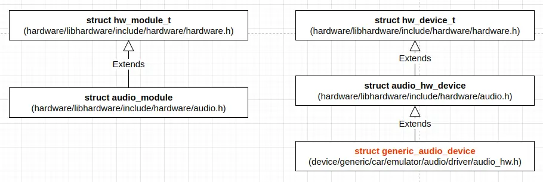
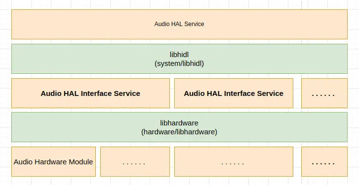
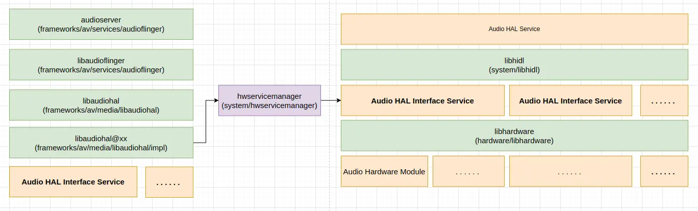

在 Android 系统中，Audio HAL 服务用于管理对音频硬件的访问，AudioFlinger 通过 Audio HAL 服务访问音频硬件。这里以 Android Automotive (AAOS) 版模拟器为例，来看 Audio HAL 服务的设计、实现和访问，代码分析基于 android-12.1.0_r27 进行。

AAOS 版模拟器的 Audio HAL 服务的实现位于 *device/generic/car/emulator/audio/halservice*，在 android 设备中，它将以名为 **android.hardware.audio.service-caremu** 的进程存在，这个进程的主函数定义 (位于 *device/generic/car/emulator/audio/halservice/service.cpp*) 如下：
```
int main(int /* argc */, char* /* argv */ []) {
    // Setup HIDL Audio HAL
    configureRpcThreadpool(16, false /*callerWillJoin*/);
    android::status_t status;
    status = registerPassthroughServiceImplementation<IDevicesFactory>();
    LOG_ALWAYS_FATAL_IF(status != OK, "Error while registering audio service: %d", status);
    status = registerPassthroughServiceImplementation<IEffectsFactory>();
    LOG_ALWAYS_FATAL_IF(status != OK, "Error while registering audio effects service: %d", status);

    // Setup AudioControl HAL
    ABinderProcess_setThreadPoolMaxThreadCount(0);
    std::shared_ptr<AudioControl> audioControl = ::ndk::SharedRefBase::make<AudioControl>();

    const std::string instance = std::string() + AudioControl::descriptor + "/default";
    binder_status_t aidlStatus =
            AServiceManager_addService(audioControl->asBinder().get(), instance.c_str());
    CHECK(aidlStatus == STATUS_OK);

    ABinderProcess_joinThreadPool();
    return EXIT_FAILURE;  // should not reach
}
```

Audio HAL 服务由三个子服务组成，分别是 ***IDevicesFactory***、***IEffectsFactory*** 和 ***AudioControl***，其中前两个为 hardware 服务，它们由实现于 *system/hwservicemanager* 的 **hwservicemanager** 管理，另外的 ***AudioControl*** 由实现于 *frameworks/native/cmds/servicemanager* 的 **servicemanager** 管理。

对于 ***AudioControl*** 服务的注册，相对比较容易理解，它和系统中其它各种服务，如 activity manager service、audio service 之类的，没有什么区别。这里看一下 ***IDevicesFactory*** 和 ***IEffectsFactory*** 服务的注册。它们都通过模板函数 `registerPassthroughServiceImplementation()` 注册，该函数的定义 (位于 *system/libhidl/transport/include/hidl/LegacySupport.h*) 如下 ：
```
template <class Interface, class ExpectInterface = Interface>
__attribute__((warn_unused_result)) status_t registerPassthroughServiceImplementation(
        const std::string& name = "default") {
    return registerPassthroughServiceImplementation(Interface::descriptor,
                                                    ExpectInterface::descriptor, name);
}
```

这个函数注册接口服务的名为 `default` 的版本，也就是默认版本。

这里调用的 `registerPassthroughServiceImplementation()` 函数定义 (位于 *system/libhidl/transport/LegacySupport.cpp*) 如下：
```
namespace details {

__attribute__((warn_unused_result)) status_t registerPassthroughServiceImplementation(
        const std::string& interfaceName, const std::string& expectInterfaceName,
        RegisterServiceCb registerServiceCb, const std::string& serviceName) {
    sp<IBase> service =
            getRawServiceInternal(interfaceName, serviceName, true /*retry*/, true /*getStub*/);

    if (service == nullptr) {
        ALOGE("Could not get passthrough implementation for %s/%s.", interfaceName.c_str(),
              serviceName.c_str());
        return EXIT_FAILURE;
    }
    if (service->isRemote()) {
        ALOGE("Implementation of %s/%s is remote!", interfaceName.c_str(), serviceName.c_str());
        return EXIT_FAILURE;
    }

    std::string actualName;
    Return<void> result = service->interfaceDescriptor(
            [&actualName](const hidl_string& descriptor) { actualName = descriptor; });
    if (!result.isOk()) {
        ALOGE("Error retrieving interface name from %s/%s: %s", interfaceName.c_str(),
              serviceName.c_str(), result.description().c_str());
        return EXIT_FAILURE;
    }
    if (actualName != expectInterfaceName) {
        ALOGE("Implementation of %s/%s is actually %s, not a %s!", interfaceName.c_str(),
              serviceName.c_str(), actualName.c_str(), expectInterfaceName.c_str());
        return EXIT_FAILURE;
    }

    status_t status = registerServiceCb(service, serviceName);
    if (status == OK) {
        ALOGI("Registration complete for %s/%s.", interfaceName.c_str(), serviceName.c_str());
    } else {
        ALOGE("Could not register service %s/%s (%d).", interfaceName.c_str(), serviceName.c_str(),
              status);
    }

    return status;
}

}  // namespace details

__attribute__((warn_unused_result)) status_t registerPassthroughServiceImplementation(
        const std::string& interfaceName, const std::string& expectInterfaceName,
        const std::string& serviceName) {
    return details::registerPassthroughServiceImplementation(
            interfaceName, expectInterfaceName,
            [](const sp<IBase>& service, const std::string& name) {
                return details::registerAsServiceInternal(service, name);
            },
            serviceName);
}
```

`IDevicesFactory` 和 `IEffectsFactory` 在 hidl 中声明，其代码由工具自动生成，如对于 `IDevicesFactory`，这里的 `registerPassthroughServiceImplementation()` 接收到的接口名称 `interfaceName` 为 `android.hardware.audio@6.0::IDevicesFactory`，对于 `IEffectsFactory`，接口名称为 `android.hardware.audio.effect@6.0::IEffectsFactory`，服务名称 `serviceName` 都为 `default`。

这里的 `registerPassthroughServiceImplementation()` 函数的主要执行过程可分为三步：

1. 根据接口名称和服务名称获得原始服务对象，这主要通过 `getRawServiceInternal(interfaceName, serviceName, true /*retry*/, true /*getStub*/)` 完成；
2. 对获得的服务对象做一些检查，包括是否为远程的，descriptor 的值等，android 的 HIDL 框架允许传入的服务名称和期望的服务名称不一致，***大概是允许通过父服务的接口来实际访问子服务***；
3. 向 **hwservicemanager** 注册服务，这主要通过 `registerAsServiceInternal(service, name)` 完成。

`getRawServiceInternal()` 函数的定义 (位于 *system/libhidl/transport/ServiceManagement.cpp*) 如下：
```
sp<::android::hidl::base::V1_0::IBase> getRawServiceInternal(const std::string& descriptor,
                                                             const std::string& instance,
                                                             bool retry, bool getStub) {
    using Transport = IServiceManager1_0::Transport;
    sp<Waiter> waiter;

    sp<IServiceManager1_1> sm;
    Transport transport = Transport::EMPTY;
    if (kIsRecovery) {
        transport = Transport::PASSTHROUGH;
    } else {
        sm = defaultServiceManager1_1();
        if (sm == nullptr) {
            ALOGE("getService: defaultServiceManager() is null");
            return nullptr;
        }

        Return<Transport> transportRet = sm->getTransport(descriptor, instance);

        if (!transportRet.isOk()) {
            ALOGE("getService: defaultServiceManager()->getTransport returns %s",
                  transportRet.description().c_str());
            return nullptr;
        }
        transport = transportRet;
    }

    const bool vintfHwbinder = (transport == Transport::HWBINDER);
    const bool vintfPassthru = (transport == Transport::PASSTHROUGH);
    const bool trebleTestingOverride = isTrebleTestingOverride();
    const bool allowLegacy = !kEnforceVintfManifest || (trebleTestingOverride && isDebuggable());
    const bool vintfLegacy = (transport == Transport::EMPTY) && allowLegacy;

    if (!kEnforceVintfManifest) {
        ALOGE("getService: Potential race detected. The VINTF manifest is not being enforced. If "
              "a HAL server has a delay in starting and it is not in the manifest, it will not be "
              "retrieved. Please make sure all HALs on this device are in the VINTF manifest and "
              "enable PRODUCT_ENFORCE_VINTF_MANIFEST on this device (this is also enabled by "
              "PRODUCT_FULL_TREBLE). PRODUCT_ENFORCE_VINTF_MANIFEST will ensure that no race "
              "condition is possible here.");
        sleep(1);
    }

    for (int tries = 0; !getStub && (vintfHwbinder || vintfLegacy); tries++) {
        if (waiter == nullptr && tries > 0) {
            waiter = new Waiter(descriptor, instance, sm);
        }
        if (waiter != nullptr) {
            waiter->reset();  // don't reorder this -- see comments on reset()
        }
        Return<sp<IBase>> ret = sm->get(descriptor, instance);
        if (!ret.isOk()) {
            ALOGE("getService: defaultServiceManager()->get returns %s for %s/%s.",
                  ret.description().c_str(), descriptor.c_str(), instance.c_str());
            break;
        }
        sp<IBase> base = ret;
        if (base != nullptr) {
            Return<bool> canCastRet =
                details::canCastInterface(base.get(), descriptor.c_str(), true /* emitError */);

            if (canCastRet.isOk() && canCastRet) {
                if (waiter != nullptr) {
                    waiter->done();
                }
                return base; // still needs to be wrapped by Bp class.
            }

            if (!handleCastError(canCastRet, descriptor, instance)) break;
        }

        // In case of legacy or we were not asked to retry, don't.
        if (vintfLegacy || !retry) break;

        if (waiter != nullptr) {
            ALOGI("getService: Trying again for %s/%s...", descriptor.c_str(), instance.c_str());
            waiter->wait(true /* timeout */);
        }
    }

    if (waiter != nullptr) {
        waiter->done();
    }

    if (getStub || vintfPassthru || vintfLegacy) {
        const sp<IServiceManager1_0> pm = getPassthroughServiceManager();
        if (pm != nullptr) {
            sp<IBase> base = pm->get(descriptor, instance).withDefault(nullptr);
            if (!getStub || trebleTestingOverride) {
                base = wrapPassthrough(base);
            }
            return base;
        }
    }

    return nullptr;
}
```

这个函数的主要执行过程如下：

1. 获得接口服务相应的实例的 transport 类型，当 `kIsRecovery` 为 `true` 时，直接为 `Transport::PASSTHROUGH`，否则从 **hwservicemanager** 获取。HIDL 接口服务的 Transport 类型的含义后面将会看到。
2. 在某些情况下，主要是 Transport 类型为 `Transport::HWBINDER` ，且非获取 stub (`getStub`) 的情况，尝试从 **hwservicemanager** 获取原始服务对象，如果成功则直接返回获得的原始服务对象；否则，继续执行；这里的从 **hwservicemanager** 获取原始服务对象会尝试多次。`getStub` 用于控制是否强制获取非包装接口服务对象，对于要注册服务的 `registerPassthroughServiceImplementation()` 函数来说，`getStub` 为 `true`，因为它需要在当前进程中创建接口服务实例的对象然后注册给 **hwservicemanager**。
3. 从 passthrough service manager 获得原始服务对象，如果成功则返回获得的原始服务对象；否则，返回空值。Passthrough service manager 的定义，一定程度上阐释了 `Transport::PASSTHROUGH` 的含义。

在 **hwservicemanager** 中，收到获取某个接口服务的实例的 transport 类型的请求时，它会从清单文件中获取这些信息，`ServiceManager::getTransport()` 函数的定义 (位于 *system/hwservicemanager/ServiceManager.cpp*) 如下：
```
Return<ServiceManager::Transport> ServiceManager::getTransport(const hidl_string& fqName,
                                                               const hidl_string& name) {
    using ::android::hardware::getTransport;

    if (!mAcl.canGet(fqName, getBinderCallingContext())) {
        return Transport::EMPTY;
    }

    switch (getTransport(fqName, name)) {
        case vintf::Transport::HWBINDER:
             return Transport::HWBINDER;
        case vintf::Transport::PASSTHROUGH:
             return Transport::PASSTHROUGH;
        case vintf::Transport::EMPTY:
        default:
             return Transport::EMPTY;
    }
}
```

这里主要通过 `::android::hardware::getTransport()` 函数获取接口服务的实例的 transport 类型，这个函数的定义 (位于 *system/hwservicemanager/Vintf.cpp*) 如下：
```
vintf::Transport getTransportFromManifest(
        const FQName &fqName, const std::string &instanceName,
        const std::shared_ptr<const vintf::HalManifest>& vm) {
    if (vm == nullptr) {
        return vintf::Transport::EMPTY;
    }
    return vm->getHidlTransport(fqName.package(), fqName.getVersion(),
                                fqName.name(), instanceName);
}

vintf::Transport getTransport(const std::string &interfaceName, const std::string &instanceName) {
    FQName fqName;

    if (!FQName::parse(interfaceName, &fqName)) {
        LOG(ERROR) << __FUNCTION__ << ": " << interfaceName
                   << " is not a valid fully-qualified name.";
        return vintf::Transport::EMPTY;
    }
    if (!fqName.hasVersion()) {
        LOG(ERROR) << __FUNCTION__ << ": " << fqName.string()
                   << " does not specify a version.";
        return vintf::Transport::EMPTY;
    }
    if (fqName.name().empty()) {
        LOG(ERROR) << __FUNCTION__ << ": " << fqName.string()
                   << " does not specify an interface name.";
        return vintf::Transport::EMPTY;
    }

    vintf::Transport tr = getTransportFromManifest(fqName, instanceName,
            vintf::VintfObject::GetFrameworkHalManifest());
    if (tr != vintf::Transport::EMPTY) {
        return tr;
    }
    tr = getTransportFromManifest(fqName, instanceName,
            vintf::VintfObject::GetDeviceHalManifest());
    if (tr != vintf::Transport::EMPTY) {
        return tr;
    }

    LOG(INFO) << __FUNCTION__ << ": Cannot find entry " << fqName.string() << "/" << instanceName
              << " in either framework or device VINTF manifest.";
    return vintf::Transport::EMPTY;
}
```

`::android::hardware::getTransport()` 从清单文件中获取接口服务的 transport 类型。它首先尝试从 Framework Hal 清单文件获取，如果失败，则尝试从 Device Hal 清单文件获取。Framework Hal 清单文件，按优先级排序包括如下这些：
```
1. /system/etc/vintf/manifest.xml
   + /system/etc/vintf/manifest/*.xml if they exist
   + /product/etc/vintf/manifest.xml if it exists
   + /product/etc/vintf/manifest/*.xml if they exist
2. (deprecated) /system/manifest.xml
```

Device Hal 清单文件，按优先级排序包括如下这些：
```
1. Vendor manifest + device fragments + ODM manifest (optional) + odm fragments
2. Vendor manifest + device fragments
3. ODM manifest (optional) + odm fragments
4. /vendor/manifest.xml (legacy, no fragments) where:
   A + B means unioning <hal> tags from A and B. If B declares an override, then this takes priority over A.
```

从 `vintf::VintfObject` 的函数的定义 (位于 *system/libvintf/VintfObject.cpp*) 可以看出来：
```
std::shared_ptr<const HalManifest> VintfObject::GetDeviceHalManifest() {
    return GetInstance()->getDeviceHalManifest();
}

std::shared_ptr<const HalManifest> VintfObject::getDeviceHalManifest() {
    return Get(__func__, &mDeviceManifest,
               std::bind(&VintfObject::fetchDeviceHalManifest, this, _1, _2));
}

std::shared_ptr<const HalManifest> VintfObject::GetFrameworkHalManifest() {
    return GetInstance()->getFrameworkHalManifest();
}

std::shared_ptr<const HalManifest> VintfObject::getFrameworkHalManifest() {
    return Get(__func__, &mFrameworkManifest,
               std::bind(&VintfObject::fetchFrameworkHalManifest, this, _1, _2));
}
 . . . . . .
// Priority for loading vendor manifest:
// 1. Vendor manifest + device fragments + ODM manifest (optional) + odm fragments
// 2. Vendor manifest + device fragments
// 3. ODM manifest (optional) + odm fragments
// 4. /vendor/manifest.xml (legacy, no fragments)
// where:
// A + B means unioning <hal> tags from A and B. If B declares an override, then this takes priority
// over A.
status_t VintfObject::fetchDeviceHalManifest(HalManifest* out, std::string* error) {
    HalManifest vendorManifest;
    status_t vendorStatus = fetchVendorHalManifest(&vendorManifest, error);
    if (vendorStatus != OK && vendorStatus != NAME_NOT_FOUND) {
        return vendorStatus;
    }

    if (vendorStatus == OK) {
        *out = std::move(vendorManifest);
        status_t fragmentStatus = addDirectoryManifests(kVendorManifestFragmentDir, out, error);
        if (fragmentStatus != OK) {
            return fragmentStatus;
        }
    }

    HalManifest odmManifest;
    status_t odmStatus = fetchOdmHalManifest(&odmManifest, error);
    if (odmStatus != OK && odmStatus != NAME_NOT_FOUND) {
        return odmStatus;
    }

    if (vendorStatus == OK) {
        if (odmStatus == OK) {
            if (!out->addAll(&odmManifest, error)) {
                if (error) {
                    error->insert(0, "Cannot add ODM manifest :");
                }
                return UNKNOWN_ERROR;
            }
        }
        return addDirectoryManifests(kOdmManifestFragmentDir, out, error);
    }

    // vendorStatus != OK, "out" is not changed.
    if (odmStatus == OK) {
        *out = std::move(odmManifest);
        return addDirectoryManifests(kOdmManifestFragmentDir, out, error);
    }

    // Use legacy /vendor/manifest.xml
    return out->fetchAllInformation(getFileSystem().get(), kVendorLegacyManifest, error);
}
 . . . . . .
// Priority:
// 1. /system/etc/vintf/manifest.xml
//    + /system/etc/vintf/manifest/*.xml if they exist
//    + /product/etc/vintf/manifest.xml if it exists
//    + /product/etc/vintf/manifest/*.xml if they exist
// 2. (deprecated) /system/manifest.xml
status_t VintfObject::fetchUnfilteredFrameworkHalManifest(HalManifest* out, std::string* error) {
    auto systemEtcStatus = fetchOneHalManifest(kSystemManifest, out, error);
    if (systemEtcStatus == OK) {
        auto dirStatus = addDirectoryManifests(kSystemManifestFragmentDir, out, error);
        if (dirStatus != OK) {
            return dirStatus;
        }

        std::vector<std::pair<const char*, const char*>> extensions{
            {kProductManifest, kProductManifestFragmentDir},
            {kSystemExtManifest, kSystemExtManifestFragmentDir},
        };
        for (auto&& [manifestPath, frags] : extensions) {
            HalManifest halManifest;
            auto status = fetchOneHalManifest(manifestPath, &halManifest, error);
            if (status != OK && status != NAME_NOT_FOUND) {
                return status;
            }
            if (status == OK) {
                if (!out->addAll(&halManifest, error)) {
                    if (error) {
                        error->insert(0, "Cannot add "s + manifestPath + ":");
                    }
                    return UNKNOWN_ERROR;
                }
            }

            auto fragmentStatus = addDirectoryManifests(frags, out, error);
            if (fragmentStatus != OK) {
                return fragmentStatus;
            }
        }

        return OK;
    } else {
        LOG(WARNING) << "Cannot fetch " << kSystemManifest << ": "
                     << (error ? *error : strerror(-systemEtcStatus));
    }

    return out->fetchAllInformation(getFileSystem().get(), kSystemLegacyManifest, error);
}

status_t VintfObject::fetchFrameworkHalManifest(HalManifest* out, std::string* error) {
    status_t status = fetchUnfilteredFrameworkHalManifest(out, error);
    if (status != OK) {
        return status;
    }
    filterHalsByDeviceManifestLevel(out);
    return OK;
}
```

对于 AAOS 版模拟器来说，`IDevicesFactory` 的清单文件为 *device/generic/car/emulator/audio/driver/android.hardware.audio@6.0-impl.xml*，其主要内容为：
```
<manifest version="1.0" type="device">
    <hal format="hidl">
        <name>android.hardware.audio</name>
        <transport>hwbinder</transport>
        <version>6.0</version>
        <interface>
            <name>IDevicesFactory</name>
            <instance>default</instance>
        </interface>
    </hal>
</manifest>
```

即这个接口服务的 Tansport 类型为 `Transport::HWBINDER`。在设备中，这个文件的路径为 */vendor/etc/vintf/manifest/android.hardware.audio@6.0-impl.xml*。

`IEffectsFactory` 的清单文件为 *device/generic/car/emulator/audio/android.hardware.audio.effects@6.0.xml*，其主要内容为：
```
<manifest version="1.0" type="device">
    <hal format="hidl">
        <name>android.hardware.audio.effect</name>
        <transport>hwbinder</transport>
        <version>6.0</version>
        <interface>
            <name>IEffectsFactory</name>
            <instance>default</instance>
        </interface>
    </hal>
</manifest>
```

这个接口服务的 Tansport 类型同样为 `Transport::HWBINDER`。在设备中，这个文件的内容将被合并之后放在 */vendor/etc/vintf/manifest.xml*。

对于 Audio HAL 服务，由于它需要自己创建接口服务的实例的对象，因而它将绕过从 **hwservicemanager** 获取接口服务的实例的对象的动作，将由 passthrough service manager 在当前进程中加载并创建，以获得原始服务对象。

`PassthroughServiceManager` 的定义 (位于 *system/libhidl/transport/ServiceManagement.cpp*) 如下：
```
struct PassthroughServiceManager : IServiceManager1_1 {
    static void openLibs(
        const std::string& fqName,
        const std::function<bool /* continue */ (void* /* handle */, const std::string& /* lib */,
                                                 const std::string& /* sym */)>& eachLib) {
        //fqName looks like android.hardware.foo@1.0::IFoo
        size_t idx = fqName.find("::");

        if (idx == std::string::npos ||
                idx + strlen("::") + 1 >= fqName.size()) {
            LOG(ERROR) << "Invalid interface name passthrough lookup: " << fqName;
            return;
        }

        std::string packageAndVersion = fqName.substr(0, idx);
        std::string ifaceName = fqName.substr(idx + strlen("::"));

        const std::string prefix = packageAndVersion + "-impl";
        const std::string sym = "HIDL_FETCH_" + ifaceName;
        LOG(INFO) << "Symbol " << sym;

        constexpr int dlMode = RTLD_LAZY;
        void* handle = nullptr;

        dlerror(); // clear

        static std::string halLibPathVndkSp = details::getVndkSpHwPath();
        std::vector<std::string> paths = {
            HAL_LIBRARY_PATH_ODM, HAL_LIBRARY_PATH_VENDOR, halLibPathVndkSp,
#ifndef __ANDROID_VNDK__
            HAL_LIBRARY_PATH_SYSTEM,
#endif
        };

        if (details::isTrebleTestingOverride()) {
            // Load HAL implementations that are statically linked
            handle = dlopen(nullptr, dlMode);
            if (handle == nullptr) {
                const char* error = dlerror();
                LOG(ERROR) << "Failed to dlopen self: "
                           << (error == nullptr ? "unknown error" : error);
            } else if (!eachLib(handle, "SELF", sym)) {
                return;
            }
        }

        for (const std::string& path : paths) {
            std::vector<std::string> libs = findFiles(path, prefix, ".so");

            for (const std::string &lib : libs) {
                const std::string fullPath = path + lib;

                if (kIsRecovery || path == HAL_LIBRARY_PATH_SYSTEM) {
                    handle = dlopen(fullPath.c_str(), dlMode);
                } else {
#if !defined(__ANDROID_RECOVERY__) && defined(__ANDROID__)
                    handle = android_load_sphal_library(fullPath.c_str(), dlMode);
#endif
                }

                if (handle == nullptr) {
                    const char* error = dlerror();
                    LOG(ERROR) << "Failed to dlopen " << lib << ": "
                               << (error == nullptr ? "unknown error" : error);
                    continue;
                }

                if (!eachLib(handle, lib, sym)) {
                    return;
                }
            }
        }
    }

    Return<sp<IBase>> get(const hidl_string& fqName,
                          const hidl_string& name) override {
        sp<IBase> ret = nullptr;

        openLibs(fqName, [&](void* handle, const std::string &lib, const std::string &sym) {
            IBase* (*generator)(const char* name);
            *(void **)(&generator) = dlsym(handle, sym.c_str());
            if(!generator) {
                const char* error = dlerror();
                LOG(ERROR) << "Passthrough lookup opened " << lib << " but could not find symbol "
                           << sym << ": " << (error == nullptr ? "unknown error" : error)
                           << ". Keeping library open.";

                // dlclose too problematic in multi-threaded environment
                // dlclose(handle);

                return true;  // continue
            }

            ret = (*generator)(name.c_str());

            if (ret == nullptr) {
                LOG(ERROR) << "Could not find instance '" << name.c_str() << "' in library " << lib
                           << ". Keeping library open.";

                // dlclose too problematic in multi-threaded environment
                // dlclose(handle);

                // this module doesn't provide this particular instance
                return true;  // continue
            }

            // Actual fqname might be a subclass.
            // This assumption is tested in vts_treble_vintf_test
            using ::android::hardware::details::getDescriptor;
            std::string actualFqName = getDescriptor(ret.get());
            CHECK(actualFqName.size() > 0);
            registerReference(actualFqName, name);
            return false;
        });

        return ret;
    }

    Return<bool> add(const hidl_string& /* name */,
                     const sp<IBase>& /* service */) override {
        LOG(FATAL) << "Cannot register services with passthrough service manager.";
        return false;
    }

    Return<Transport> getTransport(const hidl_string& /* fqName */,
                                   const hidl_string& /* name */) {
        LOG(FATAL) << "Cannot getTransport with passthrough service manager.";
        return Transport::EMPTY;
    }

    Return<void> list(list_cb /* _hidl_cb */) override {
        LOG(FATAL) << "Cannot list services with passthrough service manager.";
        return Void();
    }
    Return<void> listByInterface(const hidl_string& /* fqInstanceName */,
                                 listByInterface_cb /* _hidl_cb */) override {
        // TODO: add this functionality
        LOG(FATAL) << "Cannot list services with passthrough service manager.";
        return Void();
    }

    Return<bool> registerForNotifications(const hidl_string& /* fqName */,
                                          const hidl_string& /* name */,
                                          const sp<IServiceNotification>& /* callback */) override {
        // This makes no sense.
        LOG(FATAL) << "Cannot register for notifications with passthrough service manager.";
        return false;
    }

    Return<void> debugDump(debugDump_cb _hidl_cb) override {
        using Arch = ::android::hidl::base::V1_0::DebugInfo::Architecture;
        using std::literals::string_literals::operator""s;
        static std::string halLibPathVndkSp64 = details::getVndkSpHwPath("lib64");
        static std::string halLibPathVndkSp32 = details::getVndkSpHwPath("lib");
        static std::vector<std::pair<Arch, std::vector<const char*>>> sAllPaths{
            {Arch::IS_64BIT,
             {
                 HAL_LIBRARY_PATH_ODM_64BIT, HAL_LIBRARY_PATH_VENDOR_64BIT,
                 halLibPathVndkSp64.c_str(),
#ifndef __ANDROID_VNDK__
                 HAL_LIBRARY_PATH_SYSTEM_64BIT,
#endif
             }},
            {Arch::IS_32BIT,
             {
                 HAL_LIBRARY_PATH_ODM_32BIT, HAL_LIBRARY_PATH_VENDOR_32BIT,
                 halLibPathVndkSp32.c_str(),
#ifndef __ANDROID_VNDK__
                 HAL_LIBRARY_PATH_SYSTEM_32BIT,
#endif
             }}};
        std::map<std::string, InstanceDebugInfo> map;
        for (const auto &pair : sAllPaths) {
            Arch arch = pair.first;
            for (const auto &path : pair.second) {
                std::vector<std::string> libs = findFiles(path, "", ".so");
                for (const std::string &lib : libs) {
                    std::string matchedName;
                    std::string implName;
                    if (matchPackageName(lib, &matchedName, &implName)) {
                        std::string instanceName{"* ("s + path + ")"s};
                        if (!implName.empty()) instanceName += " ("s + implName + ")"s;
                        map.emplace(path + lib, InstanceDebugInfo{.interfaceName = matchedName,
                                                                  .instanceName = instanceName,
                                                                  .clientPids = {},
                                                                  .arch = arch});
                    }
                }
            }
        }
        fetchPidsForPassthroughLibraries(&map);
        hidl_vec<InstanceDebugInfo> vec;
        vec.resize(map.size());
        size_t idx = 0;
        for (auto&& pair : map) {
            vec[idx++] = std::move(pair.second);
        }
        _hidl_cb(vec);
        return Void();
    }

    Return<void> registerPassthroughClient(const hidl_string &, const hidl_string &) override {
        // This makes no sense.
        LOG(FATAL) << "Cannot call registerPassthroughClient on passthrough service manager. "
                   << "Call it on defaultServiceManager() instead.";
        return Void();
    }

    Return<bool> unregisterForNotifications(const hidl_string& /* fqName */,
                                            const hidl_string& /* name */,
                                            const sp<IServiceNotification>& /* callback */) override {
        // This makes no sense.
        LOG(FATAL) << "Cannot unregister for notifications with passthrough service manager.";
        return false;
    }

};

sp<IServiceManager1_0> getPassthroughServiceManager() {
    return getPassthroughServiceManager1_1();
}
sp<IServiceManager1_1> getPassthroughServiceManager1_1() {
    static sp<PassthroughServiceManager> manager(new PassthroughServiceManager());
    return manager;
}
```

`PassthroughServiceManager` 加载并创建，以获得原始服务对象的过程如下：

1. 根据接口名称拼接动态链接库的文件名，如对于 `IDevicesFactory` 为 *android.hardware.audio@6.0-impl*，对于 `IEffectsFactory` 为 *android.hardware.audio.effect@6.0-impl*；
2. 尝试从几个路径查找对应的动态链接库文件，包括 */odm/lib/hw/* 和 */vendor/lib/hw/* 等；
3. 通过 `dlopen()` 动态加载找到的动态连接库文件；
4. 在动态链接库里查找接口的 FETCH 函数，如对于 `IDevicesFactory` 为 `HIDL_FETCH_IDevicesFactory`，对于 `IEffectsFactory` 为 `HIDL_FETCH_IEffectsFactory`；
5. 调用找到的 FETCH 函数获取或创建对象；
6. 向 **hwservicemanager** 注册引用。

`registerPassthroughServiceImplementation()` 获取或创建了原始服务对象之后，会向 `hwservicemanager` 注册原始服务对象：
```
static void onRegistrationImpl(const std::string& descriptor, const std::string& instanceName) {
    LOG(INFO) << "Registered " << descriptor << "/" << instanceName;
    tryShortenProcessName(descriptor);
}
 . . . . . .
status_t registerAsServiceInternal(const sp<IBase>& service, const std::string& name) {
    if (service == nullptr) {
        return UNEXPECTED_NULL;
    }

    sp<IServiceManager1_2> sm = defaultServiceManager1_2();
    if (sm == nullptr) {
        return INVALID_OPERATION;
    }

    const std::string descriptor = getDescriptor(service.get());

    if (kEnforceVintfManifest && !isTrebleTestingOverride()) {
        using Transport = IServiceManager1_0::Transport;
        Return<Transport> transport = sm->getTransport(descriptor, name);

        if (!transport.isOk()) {
            LOG(ERROR) << "Could not get transport for " << descriptor << "/" << name << ": "
                       << transport.description();
            return UNKNOWN_ERROR;
        }

        if (transport != Transport::HWBINDER) {
            LOG(ERROR) << "Service " << descriptor << "/" << name
                       << " must be in VINTF manifest in order to register/get.";
            return UNKNOWN_ERROR;
        }
    }

    bool registered = false;
    Return<void> ret = service->interfaceChain([&](const auto& chain) {
        registered = sm->addWithChain(name.c_str(), service, chain).withDefault(false);
    });

    if (!ret.isOk()) {
        LOG(ERROR) << "Could not retrieve interface chain: " << ret.description();
    }

    if (registered) {
        onRegistrationImpl(descriptor, name);
    }

    return registered ? OK : UNKNOWN_ERROR;
}
```

`registerAsServiceInternal()` 通过 **hwservicemanager** 的 `ServiceManager` 的 `addWithChain()` 接口注册服务，随后还会尝试缩短进程的进程名。这里注册 HIDL 服务的细节不去深究。

## FETCH 函数

实现了 HAL 接口服务的动态链接库定义对应的 FETCH 函数。对于 `IDevicesFactory` 接口服务，核心 Android 系统有一个默认实现，位于 *hardware/interfaces/audio/core/all-versions/default/DevicesFactory.cpp*：
```
IDevicesFactory* HIDL_FETCH_IDevicesFactory(const char* name) {
    return strcmp(name, "default") == 0 ? new DevicesFactory() : nullptr;
}
```

这个函数创建默认的原始服务对象 `DevicesFactory`。

对于 `IEffectsFactory` 接口服务， 核心 Android 系统同样有一个默认实现，位于 *hardware/interfaces/audio/effect/all-versions/default/EffectsFactory.cpp*：
```
IEffectsFactory* HIDL_FETCH_IEffectsFactory(const char* name) {
    return strcmp(name, "default") == 0 ? new EffectsFactory() : nullptr;
}
```

这个函数创建默认的原始服务对象 `EffectsFactory`。

这些 FETCH 函数创建 `default` 实例的接口服务对象。

## DevicesFactory 加载音频硬件模块

当 DevicesFactory 接口服务的客户，也就是 Audio flinger 请求打开设备时，DevicesFactory 加载音频硬件模块 (位于 *hardware/interfaces/audio/core/all-versions/default/DevicesFactory.cpp*)：
```
#if MAJOR_VERSION == 2
Return<void> DevicesFactory::openDevice(IDevicesFactory::Device device, openDevice_cb _hidl_cb) {
    switch (device) {
        case IDevicesFactory::Device::PRIMARY:
            return openDevice<PrimaryDevice>(AUDIO_HARDWARE_MODULE_ID_PRIMARY, _hidl_cb);
        case IDevicesFactory::Device::A2DP:
            return openDevice(AUDIO_HARDWARE_MODULE_ID_A2DP, _hidl_cb);
        case IDevicesFactory::Device::USB:
            return openDevice(AUDIO_HARDWARE_MODULE_ID_USB, _hidl_cb);
        case IDevicesFactory::Device::R_SUBMIX:
            return openDevice(AUDIO_HARDWARE_MODULE_ID_REMOTE_SUBMIX, _hidl_cb);
        case IDevicesFactory::Device::STUB:
            return openDevice(AUDIO_HARDWARE_MODULE_ID_STUB, _hidl_cb);
    }
    _hidl_cb(Result::INVALID_ARGUMENTS, nullptr);
    return Void();
}
#elif MAJOR_VERSION >= 4
Return<void> DevicesFactory::openDevice(const hidl_string& moduleName, openDevice_cb _hidl_cb) {
    if (moduleName == AUDIO_HARDWARE_MODULE_ID_PRIMARY) {
        return openDevice<PrimaryDevice>(moduleName.c_str(), _hidl_cb);
    }
    return openDevice(moduleName.c_str(), _hidl_cb);
}
Return<void> DevicesFactory::openPrimaryDevice(openPrimaryDevice_cb _hidl_cb) {
    return openDevice<PrimaryDevice>(AUDIO_HARDWARE_MODULE_ID_PRIMARY, _hidl_cb);
}
#endif

Return<void> DevicesFactory::openDevice(const char* moduleName, openDevice_cb _hidl_cb) {
    return openDevice<implementation::Device>(moduleName, _hidl_cb);
}

template <class DeviceShim, class Callback>
Return<void> DevicesFactory::openDevice(const char* moduleName, Callback _hidl_cb) {
    audio_hw_device_t* halDevice;
    Result retval(Result::INVALID_ARGUMENTS);
    sp<DeviceShim> result;
    int halStatus = loadAudioInterface(moduleName, &halDevice);
    if (halStatus == OK) {
        result = new DeviceShim(halDevice);
        retval = Result::OK;
    } else if (halStatus == -EINVAL) {
        retval = Result::NOT_INITIALIZED;
    }
    _hidl_cb(retval, result);
    return Void();
}

// static
int DevicesFactory::loadAudioInterface(const char* if_name, audio_hw_device_t** dev) {
    const hw_module_t* mod;
    int rc;

    rc = hw_get_module_by_class(AUDIO_HARDWARE_MODULE_ID, if_name, &mod);
    if (rc) {
        ALOGE("%s couldn't load audio hw module %s.%s (%s)", __func__, AUDIO_HARDWARE_MODULE_ID,
              if_name, strerror(-rc));
        goto out;
    }
    rc = audio_hw_device_open(mod, dev);
    if (rc) {
        ALOGE("%s couldn't open audio hw device in %s.%s (%s)", __func__, AUDIO_HARDWARE_MODULE_ID,
              if_name, strerror(-rc));
        goto out;
    }
    if ((*dev)->common.version < AUDIO_DEVICE_API_VERSION_MIN) {
        ALOGE("%s wrong audio hw device version %04x", __func__, (*dev)->common.version);
        rc = -EINVAL;
        audio_hw_device_close(*dev);
        goto out;
    }
    return OK;

out:
    *dev = NULL;
    return rc;
}
```

DevicesFactory 加载音频硬件模块的过程大体如下：

1. 调用 `hw_get_module_by_class()`，根据硬件模块 ID 和模块名称加载硬件模块，创建 `hw_module_t`，对于音频来说，硬件模块 ID 为 `audio`，模块名称则来自于策略配置文件；
2. 打开设备得到 `audio_hw_device_t` 结构。执行 `hw_module_t` 的 `open()` 函数，这里实际获得的可能是音频硬件模块自定义的继承自 `audio_hw_device_t` 的结构，如对于 AAOS 版模拟器来说，是定义于 *device/generic/car/emulator/audio/driver/audio_hw.h* 的 `struct generic_audio_device` 结构对象；
3. 检查音频硬件模块的版本，如果小于设备 API 最小版本，则关闭设备；
4. 根据得到的 `audio_hw_device_t` 创建 `implementation::Device` 对象；
5. 通过回调，返回创建的 `implementation::Device` 对象。

libhardware 中根据硬件模块 ID 和模块名称加载硬件模块的过程 (位于 *hardware/libhardware/hardware.c*) 如下：
```
#if !defined(__ANDROID_RECOVERY__)
#include <vndksupport/linker.h>
#endif

/** Base path of the hal modules */
#if defined(__LP64__)
#define HAL_LIBRARY_PATH1 "/system/lib64/hw"
#define HAL_LIBRARY_PATH2 "/vendor/lib64/hw"
#define HAL_LIBRARY_PATH3 "/odm/lib64/hw"
#else
#define HAL_LIBRARY_PATH1 "/system/lib/hw"
#define HAL_LIBRARY_PATH2 "/vendor/lib/hw"
#define HAL_LIBRARY_PATH3 "/odm/lib/hw"
#endif

/**
 * There are a set of variant filename for modules. The form of the filename
 * is "<MODULE_ID>.variant.so" so for the led module the Dream variants 
 * of base "ro.product.board", "ro.board.platform" and "ro.arch" would be:
 *
 * led.trout.so
 * led.msm7k.so
 * led.ARMV6.so
 * led.default.so
 */

static const char *variant_keys[] = {
    "ro.hardware",  /* This goes first so that it can pick up a different
                       file on the emulator. */
    "ro.product.board",
    "ro.board.platform",
    "ro.arch"
};

static const int HAL_VARIANT_KEYS_COUNT =
    (sizeof(variant_keys)/sizeof(variant_keys[0]));

/**
 * Load the file defined by the variant and if successful
 * return the dlopen handle and the hmi.
 * @return 0 = success, !0 = failure.
 */
static int load(const char *id,
        const char *path,
        const struct hw_module_t **pHmi)
{
    int status = -EINVAL;
    void *handle = NULL;
    struct hw_module_t *hmi = NULL;
#ifdef __ANDROID_VNDK__
    const bool try_system = false;
#else
    const bool try_system = true;
#endif

    /*
     * load the symbols resolving undefined symbols before
     * dlopen returns. Since RTLD_GLOBAL is not or'd in with
     * RTLD_NOW the external symbols will not be global
     */
    if (try_system &&
        strncmp(path, HAL_LIBRARY_PATH1, strlen(HAL_LIBRARY_PATH1)) == 0) {
        /* If the library is in system partition, no need to check
         * sphal namespace. Open it with dlopen.
         */
        handle = dlopen(path, RTLD_NOW);
    } else {
#if defined(__ANDROID_RECOVERY__)
        handle = dlopen(path, RTLD_NOW);
#else
        handle = android_load_sphal_library(path, RTLD_NOW);
#endif
    }
    if (handle == NULL) {
        char const *err_str = dlerror();
        ALOGE("load: module=%s\n%s", path, err_str?err_str:"unknown");
        status = -EINVAL;
        goto done;
    }

    /* Get the address of the struct hal_module_info. */
    const char *sym = HAL_MODULE_INFO_SYM_AS_STR;
    hmi = (struct hw_module_t *)dlsym(handle, sym);
    if (hmi == NULL) {
        ALOGE("load: couldn't find symbol %s", sym);
        status = -EINVAL;
        goto done;
    }

    /* Check that the id matches */
    if (strcmp(id, hmi->id) != 0) {
        ALOGE("load: id=%s != hmi->id=%s", id, hmi->id);
        status = -EINVAL;
        goto done;
    }

    hmi->dso = handle;

    /* success */
    status = 0;

    done:
    if (status != 0) {
        hmi = NULL;
        if (handle != NULL) {
            dlclose(handle);
            handle = NULL;
        }
    } else {
        ALOGV("loaded HAL id=%s path=%s hmi=%p handle=%p",
                id, path, hmi, handle);
    }

    *pHmi = hmi;

    return status;
}

/*
 * If path is in in_path.
 */
static bool path_in_path(const char *path, const char *in_path) {
    char real_path[PATH_MAX];
    if (realpath(path, real_path) == NULL) return false;

    char real_in_path[PATH_MAX];
    if (realpath(in_path, real_in_path) == NULL) return false;

    const size_t real_in_path_len = strlen(real_in_path);
    if (strncmp(real_path, real_in_path, real_in_path_len) != 0) {
        return false;
    }

    return strlen(real_path) > real_in_path_len &&
        real_path[real_in_path_len] == '/';
}

/*
 * Check if a HAL with given name and subname exists, if so return 0, otherwise
 * otherwise return negative.  On success path will contain the path to the HAL.
 */
static int hw_module_exists(char *path, size_t path_len, const char *name,
                            const char *subname)
{
    snprintf(path, path_len, "%s/%s.%s.so",
             HAL_LIBRARY_PATH3, name, subname);
    if (path_in_path(path, HAL_LIBRARY_PATH3) && access(path, R_OK) == 0)
        return 0;

    snprintf(path, path_len, "%s/%s.%s.so",
             HAL_LIBRARY_PATH2, name, subname);
    if (path_in_path(path, HAL_LIBRARY_PATH2) && access(path, R_OK) == 0)
        return 0;

#ifndef __ANDROID_VNDK__
    snprintf(path, path_len, "%s/%s.%s.so",
             HAL_LIBRARY_PATH1, name, subname);
    if (path_in_path(path, HAL_LIBRARY_PATH1) && access(path, R_OK) == 0)
        return 0;
#endif

    return -ENOENT;
}

int hw_get_module_by_class(const char *class_id, const char *inst,
                           const struct hw_module_t **module)
{
    int i = 0;
    char prop[PATH_MAX] = {0};
    char path[PATH_MAX] = {0};
    char name[PATH_MAX] = {0};
    char prop_name[PATH_MAX] = {0};


    if (inst)
        snprintf(name, PATH_MAX, "%s.%s", class_id, inst);
    else
        strlcpy(name, class_id, PATH_MAX);

    /*
     * Here we rely on the fact that calling dlopen multiple times on
     * the same .so will simply increment a refcount (and not load
     * a new copy of the library).
     * We also assume that dlopen() is thread-safe.
     */

    /* First try a property specific to the class and possibly instance */
    snprintf(prop_name, sizeof(prop_name), "ro.hardware.%s", name);
    if (property_get(prop_name, prop, NULL) > 0) {
        if (hw_module_exists(path, sizeof(path), name, prop) == 0) {
            goto found;
        }
    }

    /* Loop through the configuration variants looking for a module */
    for (i=0 ; i<HAL_VARIANT_KEYS_COUNT; i++) {
        if (property_get(variant_keys[i], prop, NULL) == 0) {
            continue;
        }
        if (hw_module_exists(path, sizeof(path), name, prop) == 0) {
            goto found;
        }
    }

    /* Nothing found, try the default */
    if (hw_module_exists(path, sizeof(path), name, "default") == 0) {
        goto found;
    }

    return -ENOENT;

found:
    /* load the module, if this fails, we're doomed, and we should not try
     * to load a different variant. */
    return load(class_id, path, module);
}

int hw_get_module(const char *id, const struct hw_module_t **module)
{
    return hw_get_module_by_class(id, NULL, module);
}
```

这个过程主要包括这样一些步骤：

1. 获得硬件模块名称。当实例名称不为空时，其构成为 `硬件模块 ID.实例名称`，如对于音频来说，实例名称可能为 `primary`、`a2dp`、`usb` 和 `r_submix`，但 `a2dp` 不由 Audio HAL 服务处理，而是由 Audio a2dp HAL 处理，则这里获得的名称可能为 `audio.primary`、`audio.usb` 和 `audio.r_submix`；当实例名称为空时，其构成为 `硬件模块 ID`，对于音频来说，即为 `audio`。
2. 根据硬件模块名称，构造对应的系统属性名称，用于获得子名称，对于音频来说，可能为 `ro.hardware.audio.primary`、`ro.hardware.audio.usb` 、`ro.hardware.audio.r_submix` 和 `ro.hardware.audio`；
3. 根据第 2 步中构造的系统属性名称，获得硬件模块子名称，对于 AAOS 版的模拟器而言，只定义了 `ro.hardware.audio.primary`，且其值为 `caremu`；
4. 根据硬件模块名称和硬件模块子名称构造动态链接库文件名，对于 AAOS 版模拟器而言，构造出来的文件名将为 `audio.primary.caremu.so` 等，然后依次检查这些文件在 */odm/lib64/hw*、*/vendor/lib64/hw* 和 */system/lib64/hw* 等目录下是否存在，若存在则加载动态链接库，否则继续查找；
5. 依次尝试从 `ro.hardware`、`ro.product.board`、`ro.board.platform` 和 `ro.arch` 系统属性获得硬件模块子名称，若成功则同样根据硬件模块名称和硬件模块子名称构造动态链接库文件名，并检查文件在 */odm/lib64/hw*、*/vendor/lib64/hw* 和 */system/lib64/hw* 等目录下是否存在；若存在则加载动态链接库，否则继续查找；
6. 检查以 `default` 为硬件模块子名称的模块动态链接库文件是否存在，若存在则加载动态链接库，否则返回错误；
7. 加载硬件模块的实例的动态链接库文件。

从语义上来说，这里的过程如下：

1. 构造硬件模块名称，其中包含硬件模块 ID 和实例名称；
2. 获得硬件模块子名称，主要为尝试从多种系统属性中获取，系统属性中都找不到时使用 `default` 为子名称；
3. 根据硬件模块名称和硬件模块子名称构造硬件模块的实例的动态链接库文件名；
4. 依次检查硬件模块的实例的动态链接库文件在 */odm/lib64/hw*、*/vendor/lib64/hw* 和 */system/lib64/hw* 等目录下是否存在；
5. 如果存在，就加载文件；如果都不存在，则返回错误。

对于 AAOS 版的模拟器来说，加载的音频硬件模块实例的动态链接库主要有 */vendor/lib/hw/audio.primary.caremu.so*、*/system/lib64/hw/audio.a2dp.default.so* 和 */vendor/lib/hw/audio.r_submix.default.so*。

加载硬件模块的实例的动态链接库文件的过程如下：

1. 通过 `dlopen()` 或 `android_load_sphal_library()` 打开动态链接库文件；
2. 找到其中定义的名为 `HAL_MODULE_INFO_SYM_AS_STR`，即 `"HMI"` 的 `struct hw_module_t` 结构；
3. 检查 ID 是否匹配；
4. 通过传入的参数，返回找到的 `struct hw_module_t` 结构，对于音频硬件模块来说，这里实际获取的是 `struct audio_module` 对象。

尽管硬件模块主要使用 C 代码来定义接口并实现，但这些 C 代码同样采用了 OO 的思想，音频硬件模块实现相关的几个结构之间的关系如下：



Android Audio HAL 服务的整体结构如下：



## Audio HAL 接口服务的访问

**IDevicesFactory** 和 **IEffectsFactory** 接口服务主要在 AudioFlinger 中访问。AudioFlinger 访问这些接口服务时，首先创建它们的客户端代理对象，如下面的代码 (位于 *frameworks/av/services/audioflinger/AudioFlinger.cpp*) 所示：
```
    mDevicesFactoryHal = DevicesFactoryHalInterface::create();
    mEffectsFactoryHal = EffectsFactoryHalInterface::create();
```

这里的 `DevicesFactoryHalInterface::create()` 函数的定义 (位于 *frameworks/av/media/libaudiohal/DevicesFactoryHalInterface.cpp*) 如下：
```
namespace android {

// static
sp<DevicesFactoryHalInterface> DevicesFactoryHalInterface::create() {
    return createPreferredImpl<DevicesFactoryHalInterface>(
            "android.hardware.audio", "IDevicesFactory");
}

} // namespace android
```

这里调用的模板函数 `createPreferredImpl()` 的定义 (位于 *frameworks/av/media/libaudiohal/include/media/audiohal/FactoryHalHidl.h*) 如下：
```
namespace android {

namespace detail {

void* createPreferredImpl(const std::string& package, const std::string& interface);

}  // namespace detail

/** @Return the preferred available implementation or nullptr if none are available. */
template <class Interface>
static sp<Interface> createPreferredImpl(const std::string& package, const std::string& interface) {
    return sp<Interface>{static_cast<Interface*>(detail::createPreferredImpl(package, interface))};
}

} // namespace android
```

继续来看 `detail::createPreferredImpl()` 函数的定义 (位于 *frameworks/av/media/libaudiohal/FactoryHalHidl.cpp*)：
```
namespace android::detail {

namespace {
/** Supported HAL versions, in order of preference.
 */
const char* sAudioHALVersions[] = {
    "7.0",
    "6.0",
    "5.0",
    "4.0",
    nullptr
};

bool createHalService(const std::string& version, const std::string& interface,
        void** rawInterface) {
    const std::string libName = "libaudiohal@" + version + ".so";
    const std::string factoryFunctionName = "create" + interface;
    constexpr int dlMode = RTLD_LAZY;
    void* handle = nullptr;
    dlerror(); // clear
    handle = dlopen(libName.c_str(), dlMode);
    if (handle == nullptr) {
        const char* error = dlerror();
        ALOGE("Failed to dlopen %s: %s", libName.c_str(),
                error != nullptr ? error : "unknown error");
        return false;
    }
    void* (*factoryFunction)();
    *(void **)(&factoryFunction) = dlsym(handle, factoryFunctionName.c_str());
    if (!factoryFunction) {
        const char* error = dlerror();
        ALOGE("Factory function %s not found in library %s: %s",
                factoryFunctionName.c_str(), libName.c_str(),
                error != nullptr ? error : "unknown error");
        dlclose(handle);
        return false;
    }
    *rawInterface = (*factoryFunction)();
    ALOGW_IF(!*rawInterface, "Factory function %s from %s returned nullptr",
            factoryFunctionName.c_str(), libName.c_str());
    return true;
}

bool hasHalService(const std::string& package, const std::string& version,
        const std::string& interface) {
    using ::android::hidl::manager::V1_0::IServiceManager;
    sp<IServiceManager> sm = ::android::hardware::defaultServiceManager();
    if (!sm) {
        ALOGE("Failed to obtain HIDL ServiceManager");
        return false;
    }
    // Since audio HAL doesn't support multiple clients, avoid instantiating
    // the interface right away. Instead, query the transport type for it.
    using ::android::hardware::Return;
    using Transport = IServiceManager::Transport;
    const std::string fqName = package + "@" + version + "::" + interface;
    const std::string instance = "default";
    Return<Transport> transport = sm->getTransport(fqName, instance);
    if (!transport.isOk()) {
        ALOGE("Failed to obtain transport type for %s/%s: %s",
                fqName.c_str(), instance.c_str(), transport.description().c_str());
        return false;
    }
    return transport != Transport::EMPTY;
}

}  // namespace

void* createPreferredImpl(const std::string& package, const std::string& interface) {
    for (auto version = detail::sAudioHALVersions; version != nullptr; ++version) {
        void* rawInterface = nullptr;
        if (hasHalService(package, *version, interface)
                && createHalService(*version, interface, &rawInterface)) {
            return rawInterface;
        }
    }
    return nullptr;
}

}  // namespace android::detail
```

`createPreferredImpl()` 函数的执行过程如下：

1. 按照版本号，从高到低依次检查要创建的 HAL 服务是否存在，具体的方法是传入包名、版本、接口名称和实例名称等信息，向 hwservicemanager 请求获得相应的 transport 信息，如果可以获得有效的 transport 信息则说明相应的 HAL 服务存在，否则说明 HAL 不存在，这里向 hwservicemanager 请求获得相应的 transport 信息的方法，与我们前面看到的注册 HAL 接口服务对象时使用到的方法基本相同；
2. 没有任何一个版本的要创建的 HAL 服务存在，则返回空值；
3. 存在一个或多个版本的要创建的 HAL 服务，则创建版本最高的 HAL 服务；

创建 HAL 服务即创建相应的 HAL 接口服务的客户端代理，这个过程大体如下：

1. 根据版本号获得相应版本的 **libaudiohal@xx** 动态链接库的文件名，如版本号是 `7.0`，则获得的动态链接库文件名为 **libaudiohal@7.0.so**；
2. 根据接口名称获得相应的创建函数的函数名，如对于 **IDevicesFactory**，获得的函数名为 **createIDevicesFactory**；
3. 使用 `dlopen()` 函数动态加载 **libaudiohal@** 动态链接库；
4. 在 **libaudiohal@** 动态链接库中查找创建函数的函数名；
5. 调用创建函数创建接口对象。

在 **libaudiohal@xx** 中 `createIDevicesFactory` 的定义 (位于 *frameworks/av/media/libaudiohal/impl/DevicesFactoryHalHybrid.cpp*) 如下：
```
extern "C" __attribute__((visibility("default"))) void* createIDevicesFactory() {
    auto service = hardware::audio::CPP_VERSION::IDevicesFactory::getService();
    return service ? new CPP_VERSION::DevicesFactoryHalHybrid(service) : nullptr;
}
```

即 `IDevicesFactory` 接口服务的客户端代理为 `DevicesFactoryHalHybrid`。顾名思义，这个类称为 HAL 混合接口，它混合了用于直接访问当前进程中的接口服务，和在 hwservicemanager 中注册的接口服务。在 `DevicesFactoryHalHybrid` 对象创建前，先获得了 hwservicemanager 中注册的接口服务的句柄。

`DevicesFactoryHalHybrid` 类的定义 (位于 *frameworks/av/media/libaudiohal/impl/DevicesFactoryHalHybrid.cpp*) 如下：
```
namespace CPP_VERSION {

DevicesFactoryHalHybrid::DevicesFactoryHalHybrid(sp<IDevicesFactory> hidlFactory)
        : mLocalFactory(new DevicesFactoryHalLocal()),
          mHidlFactory(new DevicesFactoryHalHidl(hidlFactory)) {
}

status_t DevicesFactoryHalHybrid::openDevice(const char *name, sp<DeviceHalInterface> *device) {
    if (mHidlFactory != 0 && strcmp(AUDIO_HARDWARE_MODULE_ID_A2DP, name) != 0 &&
        strcmp(AUDIO_HARDWARE_MODULE_ID_HEARING_AID, name) != 0) {
        return mHidlFactory->openDevice(name, device);
    }
    return mLocalFactory->openDevice(name, device);
}

status_t DevicesFactoryHalHybrid::getHalPids(std::vector<pid_t> *pids) {
    if (mHidlFactory != 0) {
        return mHidlFactory->getHalPids(pids);
    }
    return INVALID_OPERATION;
}

status_t DevicesFactoryHalHybrid::setCallbackOnce(sp<DevicesFactoryHalCallback> callback) {
    if (mHidlFactory) {
        return mHidlFactory->setCallbackOnce(callback);
    }
    return INVALID_OPERATION;
}

} // namespace CPP_VERSION
```

`getHalPids()` 和 `setCallbackOnce()` 主要是针对远程接口服务的。这里特别关注一下 `openDevice()` 函数。在要打开的音频硬件模块为 A2DP ("a2dp") 或时 HEARING_AID ("hearing_aid")，通过 `DevicesFactoryHalLocal` 在当前进程中本地加载音频硬件模块并打开对应的设备；否则，通过 `DevicesFactoryHalHidl` 访问远程的接口服务。

来看下 `DevicesFactoryHalLocal` 类的定义 (位于 *frameworks/av/media/libaudiohal/impl/DevicesFactoryHalLocal.cpp*)：
```
static status_t load_audio_interface(const char *if_name, audio_hw_device_t **dev)
{
    const hw_module_t *mod;
    int rc;

    rc = hw_get_module_by_class(AUDIO_HARDWARE_MODULE_ID, if_name, &mod);
    if (rc) {
        ALOGE("%s couldn't load audio hw module %s.%s (%s)", __func__,
                AUDIO_HARDWARE_MODULE_ID, if_name, strerror(-rc));
        goto out;
    }
    rc = audio_hw_device_open(mod, dev);
    if (rc) {
        ALOGE("%s couldn't open audio hw device in %s.%s (%s)", __func__,
                AUDIO_HARDWARE_MODULE_ID, if_name, strerror(-rc));
        goto out;
    }
    if ((*dev)->common.version < AUDIO_DEVICE_API_VERSION_MIN) {
        ALOGE("%s wrong audio hw device version %04x", __func__, (*dev)->common.version);
        rc = BAD_VALUE;
        audio_hw_device_close(*dev);
        goto out;
    }
    return OK;

out:
    *dev = NULL;
    return rc;
}

status_t DevicesFactoryHalLocal::openDevice(const char *name, sp<DeviceHalInterface> *device) {
    audio_hw_device_t *dev;
    status_t rc = load_audio_interface(name, &dev);
    if (rc == OK) {
        *device = new DeviceHalLocal(dev);
    }
    return rc;
}
```

`DevicesFactoryHalLocal` 在 `openDevice()` 时，加载音频硬件模块，打开设备以创建或获得 `audio_hw_device_t` 对象，与我们前面看到的的远程访问的 IDevicesFactory 接口服务实现中的`load_audio_interface()` 完全一样，并基于 `audio_hw_device_t` 对象创建 `DeviceHalLocal`，即硬件设备的本地代理。

再来看下 `DevicesFactoryHalHidl` 类的 `openDevice()` 函数的定义 (位于 *frameworks/av/media/libaudiohal/impl/DevicesFactoryHalHidl.cpp*)：
```
DevicesFactoryHalHidl::DevicesFactoryHalHidl(sp<IDevicesFactory> devicesFactory) {
    ALOG_ASSERT(devicesFactory != nullptr, "Provided default IDevicesFactory service is NULL");
    addDeviceFactory(devicesFactory, false /*needToNotify*/);
}

void DevicesFactoryHalHidl::onFirstRef() {
    sp<IServiceManager> sm = IServiceManager::getService();
    ALOG_ASSERT(sm != nullptr, "Hardware service manager is not running");
    sp<ServiceNotificationListener> listener = new ServiceNotificationListener(this);
    Return<bool> result = sm->registerForNotifications(
            IDevicesFactory::descriptor, "", listener);
    if (result.isOk()) {
        ALOGE_IF(!static_cast<bool>(result),
                "Hardware service manager refused to register listener");
    } else {
        ALOGE("Failed to register for hardware service manager notifications: %s",
                result.description().c_str());
    }
}

#if MAJOR_VERSION == 2
static IDevicesFactory::Device idFromHal(const char *name, status_t* status) {
    *status = OK;
    if (strcmp(name, AUDIO_HARDWARE_MODULE_ID_PRIMARY) == 0) {
        return IDevicesFactory::Device::PRIMARY;
    } else if(strcmp(name, AUDIO_HARDWARE_MODULE_ID_A2DP) == 0) {
        return IDevicesFactory::Device::A2DP;
    } else if(strcmp(name, AUDIO_HARDWARE_MODULE_ID_USB) == 0) {
        return IDevicesFactory::Device::USB;
    } else if(strcmp(name, AUDIO_HARDWARE_MODULE_ID_REMOTE_SUBMIX) == 0) {
        return IDevicesFactory::Device::R_SUBMIX;
    } else if(strcmp(name, AUDIO_HARDWARE_MODULE_ID_STUB) == 0) {
        return IDevicesFactory::Device::STUB;
    }
    ALOGE("Invalid device name %s", name);
    *status = BAD_VALUE;
    return {};
}
#elif MAJOR_VERSION >= 4
static const char* idFromHal(const char *name, status_t* status) {
    *status = OK;
    return name;
}
#endif

status_t DevicesFactoryHalHidl::openDevice(const char *name, sp<DeviceHalInterface> *device) {
    auto factories = copyDeviceFactories();
    if (factories.empty()) return NO_INIT;
    status_t status;
    auto hidlId = idFromHal(name, &status);
    if (status != OK) return status;
    Result retval = Result::NOT_INITIALIZED;
    for (const auto& factory : factories) {
        Return<void> ret = factory->openDevice(
                hidlId,
                [&](Result r, const sp<IDevice>& result) {
                    retval = r;
                    if (retval == Result::OK) {
                        *device = new DeviceHalHidl(result);
                    }
                });
        if (!ret.isOk()) return FAILED_TRANSACTION;
        switch (retval) {
            // Device was found and was initialized successfully.
            case Result::OK: return OK;
            // Device was found but failed to initalize.
            case Result::NOT_INITIALIZED: return NO_INIT;
            // Otherwise continue iterating.
            default: ;
        }
    }
    ALOGW("The specified device name is not recognized: \"%s\"", name);
    return BAD_VALUE;
}
```

`DevicesFactoryHalHidl` 通过远程接口服务打开设备，获得远程设备的本地句柄，并基于该代理创建 `DeviceHalHidl`，即远程设备的本地代理。

Android Audio HAL 服务相关的各个角色的关系如下图：



更具体一点来说，Android Audio HAL 服务的主要组成大体如下：

**Audio HAL 服务独立进程**

1. android.hardware.audio.service
代码位置：*hardware/interfaces/audio/common/all-versions/default/service*
说明：Audio HAL 服务默认实现，其中强制包含 `IDevicesFactory` 和 `IEffectsFactory` 两个接口服务，可能包含 `ISoundTriggerHw`、`IBluetoothAudioProvidersFactory` 和 `IBluetoothAudioOffload` 三个接口服务。

2. android.hardware.audio.service-caremu
代码位置：*device/generic/car/emulator/audio/halservice*
设备中文件路径：*/vendor/bin/hw/android.hardware.audio.service-caremu*
说明：AAOS 版模拟器中实际采用的 Audio HAL 服务，其中包含 `IAudioControl`、`IDevicesFactory` 和 `IEffectsFactory` 三个接口服务。

**IDevicesFactory 接口服务**

1. android.hardware.audio@x.x-impl
代码位置：*hardware/interfaces/audio/core/all-versions/default*
设备中文件路径：*/vendor/lib/hw/android.hardware.audio@x.x-impl.so*
说明：默认实现，可为设备定制实现，如模拟器 goldfish 的实现 *device/generic/goldfish/audio*。

**音频硬件模块实例**

1. audio.primary.default
代码位置：*hardware/libhardware/modules/audio*
设备中文件路径：*/vendor/lib64/hw/audio.primary.default.so*
说明：AudioFlinger 通过 **IDevicesFactory 接口服务** 远程访问，音频硬件模块 `primary` 实例的默认实现。

2. audio.primary.caremu
代码位置：*device/generic/car/emulator/audio/driver*
设备中文件路径：*/vendor/lib64/hw/audio.primary.caremu.so*
说明：AAOS 模拟器的定制实现，基于 tinyalsa 实现。AudioFlinger 通过 **IDevicesFactory 接口服务** 远程访问，音频硬件模块 `primary` 实例的实现。

3. audio.a2dp.default
代码位置：*system/bt/audio_a2dp_hw*
设备中文件路径：*/system/lib64/hw/audio.a2dp.default.so*
说明：AudioFlinger 通过 **IDevicesFactory 接口服务** 本地访问，音频硬件模块 `a2dp` 实例的默认实现。基于 OSI local socket 及 A2DP 控制命令实现。

4. audio.r_submix.default
代码位置：*hardware/libhardware/modules/audio_remote_submix*
设备中文件路径：*/vendor/lib/hw/audio.r_submix.default.so*
说明：AudioFlinger 通过 **IDevicesFactory 接口服务** 远程访问，音频硬件模块 `r_submix` 实例的默认实现。

**IEffectsFactory 接口服务**

1. android.hardware.audio.effect@x.x-impl
代码位置：*hardware/interfaces/audio/effect/all-versions/default*
设备中文件路径：*/vendor/lib/hw/android.hardware.audio.effect@x.x-impl.so*
说明：**IEffectsFactory 接口服务** 的默认实现，主要基于位于 *frameworks/av/media/libeffects* 的 libeffects 实现。

**AudioControl 接口服务**

代码位置：*device/generic/car/emulator/audio/halservice*
说明：**AudioControl 服务** 的 automotive 版模拟器实现，如同系统其它服务一样，通过 service manager 访问。

Done.
