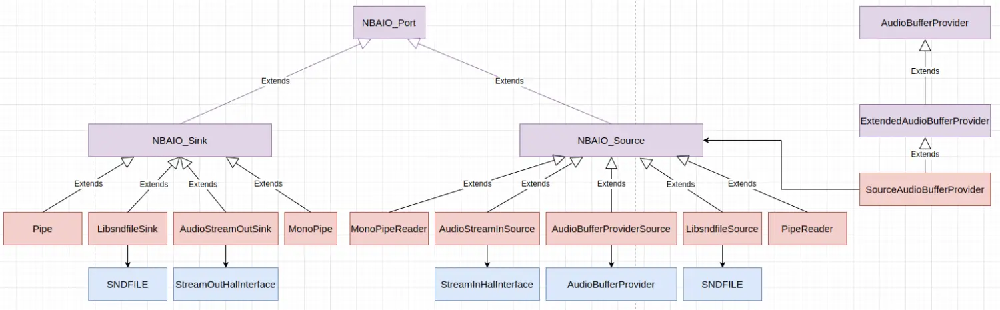
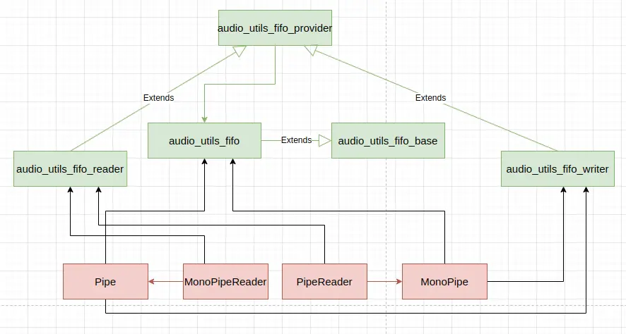
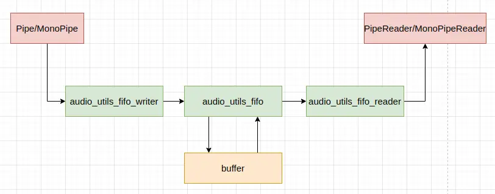

Android 中的 **libnbaio** (**Non-Blocking Audio I/O** 的缩写) 库主要是为非阻塞的音频 I/O 设计的，但现在它也包含了一些接口的阻塞实现，因而它的主要作用也变成了为各种音频 I/O 设施提供统一的读写接口。**libnbaio** 库主要用在 **audioflinger** 和一些音频 HAL 模块的实现中。**libnbaio** 库提供的主要组件是 `Pipe` 和 `MonoPipe`，其中 `Pipe` 支持单个写者，和 N 个读者，`MonoPipe` 支持单个写者和单个读者。

`Pipe` 支持的特性如下：

没有互斥量，在 SCHED_NORMAL 和 SCHED_FIFO 的线程之间使用是安全的。

 * 写入：
    - 非阻塞
    - 如果没有足够的数据则返回实际传输的帧数
    - 如果消费数据的速度不够块，则覆盖数据

 * 读取：
    - 非阻塞
    - 如果没有足够的数据则返回实际传输的帧数
    - 如果读取速度跟不上，将会丢失数据

`MonoPipe` 支持的特性如下：

没有互斥量，在 SCHED_NORMAL 和 SCHED_FIFO 的线程之间使用是安全的。

 * 写入：
    - 是否阻塞是可选的
    - 如果配置为阻塞，则在返回前将等待，直到空间可用
    - 如果配置为非阻塞，则将返回实际传输的帧数，并且不会覆盖数据

 * 读取：
    - 非阻塞
    - 如果没有足够的数据则返回实际传输的帧数
    - 从不丢失数据

这里看一下 **libnbaio** 库的设计和实现，代码分析基于 android-12.1.0_r27 版进行。

**libnbaio** 库提供的主要抽象是 `NBAIO_Sink` 和 `NBAIO_Source`，它们分别用于写入音频数据和读取音频数据。**libnbaio** 库各个部分的继承层次结构如下图：



`LibsndfileSource` 和 `LibsndfileSink` 分别封装了 **libsndfile** 以 `SFM_READ` 和 `SFM_WRITE` 模式打开的文件来实现 `NBAIO_Source` 和 `NBAIO_Sink`。这两个组件，由于 **libsndfile** 许可证不兼容，默认不会被编进 Android 系统中。在整个 Android 系统中，找不到使用它们的地方，随着 Android 系统的发展，它们大概已处于年久失修不可用的状态。

`AudioStreamInSource` 和 `AudioStreamOutSink` 分别封装了 Audio HAL 的 `StreamInHalInterface` 和 `StreamOutHalInterface` 接口实现 `NBAIO_Source` 和 `NBAIO_Sink`，它们不是多线程安全的。

`Pipe` 和 `PipeReader` 配合使用，分别用于写入音频数据和读取音频数据。`MonoPipe` 和 `MonoPipeReader` 配合使用，分别用于写入音频数据和读取音频数据。

`SourceAudioBufferProvider` 封装 `NBAIO_Source` 并最终继承自 `AudioBufferProvider`，它主要用于将 **libnbaio** 库的那些组件接进 Android 系统的其它音频模块里，如混音器等。

`MonoPipe`、`MonoPipeReader`、`Pipe` 和 `PipeReader` 实现相关组件的结构如下图：



在基本结构方面，`MonoPipe` 和 `MonoPipeReader` 及 `Pipe` 和 `PipeReader` 基本相同，但它们分别实现不同的读写策略。`Pipe` 分配一块内存来给 `audio_utils_fifo` 管理，用于交换数据；读写数据最终都通过 `audio_utils_fifo` 进行；`Pipe` 包含一个 `audio_utils_fifo_writer` 对象，`audio_utils_fifo_writer` 对象持有对 `audio_utils_fifo` 对象的引用，`audio_utils_fifo_writer` 用于向 `audio_utils_fifo` 写入音频数据；`PipeReader` 持有 `Pipe` 对象的引用，且包含一个 `audio_utils_fifo_reader` 对象；`audio_utils_fifo_reader` 对象持有对 `Pipe` 的 `audio_utils_fifo` 对象的引用，用于从 `audio_utils_fifo` 读取音频数据；`Pipe` 和 `PipeReader` 通过共用的 `audio_utils_fifo` 对象交换数据，它们分别扮演音频数据的写者和读者角色。`MonoPipe` 和 `MonoPipeReader` 与 `Pipe` 和 `PipeReader` 有着相同的基本结构和数据交换方式。从数据流的角度来看，这些组件有如下这样的结构：



来看一下 `MonoPipe` 和 `MonoPipeReader` 与 `Pipe` 和 `PipeReader` 等的具体实现。`Pipe` 类的定义 (位于 `frameworks/av/media/libnbaio/include/media/nbaio/Pipe.h`) 如下：
```
class Pipe : public NBAIO_Sink {

    friend class PipeReader;

public:
    // maxFrames will be rounded up to a power of 2, and all slots are available. Must be >= 2.
    // buffer is an optional parameter specifying the virtual address of the pipe buffer,
    // which must be of size roundup(maxFrames) * Format_frameSize(format) bytes.
    Pipe(size_t maxFrames, const NBAIO_Format& format, void *buffer = NULL);

    // If a buffer was specified in the constructor, it is not automatically freed by destructor.
    virtual ~Pipe();

    // NBAIO_Port interface

    //virtual ssize_t negotiate(const NBAIO_Format offers[], size_t numOffers,
    //                          NBAIO_Format counterOffers[], size_t& numCounterOffers);
    //virtual NBAIO_Format format() const;

    // NBAIO_Sink interface

    //virtual int64_t framesWritten() const;
    //virtual int64_t framesUnderrun() const;
    //virtual int64_t underruns() const;

    // The write side of a pipe permits overruns; flow control is the caller's responsibility.
    // It doesn't return +infinity because that would guarantee an overrun.
    virtual ssize_t availableToWrite() { return mMaxFrames; }

    virtual ssize_t write(const void *buffer, size_t count);
    //virtual ssize_t writeVia(writeVia_t via, size_t total, void *user, size_t block);

private:
    const size_t    mMaxFrames;     // always a power of 2
    void * const    mBuffer;
    audio_utils_fifo        mFifo;
    audio_utils_fifo_writer mFifoWriter;
    volatile int32_t mReaders;      // number of PipeReader clients currently attached to this Pipe
    const bool      mFreeBufferInDestructor;
};
```

`Pipe` 对象在构造时，需要传入最大帧数，音频数据格式，和可选的一块用于交换数据的缓冲区。最大帧数将被向上对齐到 2 的次幂。数据缓冲区的大小必须是 **向上对齐之后的最大帧数 roundup(maxFrames) * 帧大小 Format_frameSize(format)** 个字节。`Pipe` 对象构造时，如果没有传分配好的内存块进来，则会分配一块内存，在 `Pipe` 对象析构时，释放分配的内存。`Pipe` 的构造和析构函数定义 (位于 `frameworks/av/media/libnbaio/Pipe.cpp`) 如下：
```
Pipe::Pipe(size_t maxFrames, const NBAIO_Format& format, void *buffer) :
        NBAIO_Sink(format),
        // TODO fifo now supports non-power-of-2 buffer sizes, so could remove the roundup
        mMaxFrames(roundup(maxFrames)),
        mBuffer(buffer == NULL ? malloc(mMaxFrames * Format_frameSize(format)) : buffer),
        mFifo(mMaxFrames, Format_frameSize(format), mBuffer, false /*throttlesWriter*/),
        mFifoWriter(mFifo),
        mReaders(0),
        mFreeBufferInDestructor(buffer == NULL)
{
}

Pipe::~Pipe()
{
    ALOG_ASSERT(android_atomic_acquire_load(&mReaders) == 0);
    if (mFreeBufferInDestructor) {
        free(mBuffer);
    }
}
```

`Pipe` 和 `PipeReader` 的读写操作的线程安全语义，主要由底层的 `audio_utils_fifo_reader`、`audio_utils_fifo_writer` 和 `audio_utils_fifo` 实现。`Pipe` 的 `write()` 函数实现 (位于 `frameworks/av/media/libnbaio/Pipe.cpp`) 如下：
```
ssize_t Pipe::write(const void *buffer, size_t count)
{
    // count == 0 is unlikely and not worth checking for
    if (CC_UNLIKELY(!mNegotiated)) {
        return NEGOTIATE;
    }
    ssize_t actual = mFifoWriter.write(buffer, count);
    ALOG_ASSERT(actual <= count);
    if (actual <= 0) {
        return actual;
    }
    mFramesWritten += (size_t) actual;
    return actual;
}
```

用于从 `Pipe` 写入数据的缓冲区中读取数据的 `PipeReader` 类的定义 (位于 `frameworks/av/media/libnbaio/include/media/nbaio/PipeReader.h`) 如下：
```
class PipeReader : public NBAIO_Source {

public:

    // Construct a PipeReader and associate it with a Pipe
    // FIXME make this constructor a factory method of Pipe.
    PipeReader(Pipe& pipe);
    virtual ~PipeReader();

    // NBAIO_Port interface

    //virtual ssize_t negotiate(const NBAIO_Format offers[], size_t numOffers,
    //                          NBAIO_Format counterOffers[], size_t& numCounterOffers);
    //virtual NBAIO_Format format() const;

    // NBAIO_Source interface

    //virtual size_t framesRead() const;
    virtual int64_t framesOverrun() { return mFramesOverrun; }
    virtual int64_t overruns()  { return mOverruns; }

    virtual ssize_t availableToRead();

    virtual ssize_t read(void *buffer, size_t count);

    virtual ssize_t flush();

    // NBAIO_Source end

#if 0   // until necessary
    Pipe& pipe() const { return mPipe; }
#endif

private:
    Pipe&       mPipe;
    audio_utils_fifo_reader mFifoReader;
    int64_t     mFramesOverrun;
    int64_t     mOverruns;
};
```

`PipeReader` 只对单个线程是安全的。不同的线程可以通过不同的 `PipeReader` 对象读取相同 `Pipe` 的数据，但不同线程不能通过相同的 `PipeReader` 对象读取数据。`PipeReader` 的各个成员函数定义 (位于 `frameworks/av/media/libnbaio/PipeReader.cpp`) 如下：
```
PipeReader::PipeReader(Pipe& pipe) :
        NBAIO_Source(pipe.mFormat),
        mPipe(pipe), mFifoReader(mPipe.mFifo, false /*throttlesWriter*/, false /*flush*/),
        mFramesOverrun(0),
        mOverruns(0)
{
    android_atomic_inc(&pipe.mReaders);
}

PipeReader::~PipeReader()
{
#if !LOG_NDEBUG
    int32_t readers =
#else
    (void)
#endif
            android_atomic_dec(&mPipe.mReaders);
    ALOG_ASSERT(readers > 0);
}

ssize_t PipeReader::availableToRead()
{
    if (CC_UNLIKELY(!mNegotiated)) {
        return NEGOTIATE;
    }
    size_t lost;
    ssize_t avail = mFifoReader.available(&lost);
    if (avail == -EOVERFLOW || lost > 0) {
        mFramesOverrun += lost;
        ++mOverruns;
        avail = OVERRUN;
    }
    return avail;
}

ssize_t PipeReader::read(void *buffer, size_t count)
{
    size_t lost;
    ssize_t actual = mFifoReader.read(buffer, count, NULL /*timeout*/, &lost);
    ALOG_ASSERT(actual <= count);
    if (actual == -EOVERFLOW || lost > 0) {
        mFramesOverrun += lost;
        ++mOverruns;
        actual = OVERRUN;
    }
    if (actual <= 0) {
        return actual;
    }
    mFramesRead += (size_t) actual;
    return actual;
}

ssize_t PipeReader::flush()
{
    if (CC_UNLIKELY(!mNegotiated)) {
        return NEGOTIATE;
    }
    size_t lost;
    ssize_t flushed = mFifoReader.flush(&lost);
    if (flushed == -EOVERFLOW || lost > 0) {
        mFramesOverrun += lost;
        ++mOverruns;
        flushed = OVERRUN;
    }
    if (flushed <= 0) {
        return flushed;
    }
    mFramesRead += (size_t) flushed;  // we consider flushed frames as read, but not lost frames
    return flushed;
}
```

`PipeReader` 的读取操作发现写入数据有溢出时，即使读取到了一部分数据，也会返回错误，它获得可读取数据量和 `flush()` 操作也有类似语义。

`MonoPipe` 的音频数据写入语义在其 `write()` 操作中实现，该函数定义 (位于 `frameworks/av/media/libnbaio/MonoPipe.cpp`) 如下：
```
ssize_t MonoPipe::write(const void *buffer, size_t count)
{
    if (CC_UNLIKELY(!mNegotiated)) {
        return NEGOTIATE;
    }
    size_t totalFramesWritten = 0;
    while (count > 0) {
        ssize_t actual = mFifoWriter.write(buffer, count);
        ALOG_ASSERT(actual <= count);
        if (actual < 0) {
            if (totalFramesWritten == 0) {
                return actual;
            }
            break;
        }
        size_t written = (size_t) actual;
        totalFramesWritten += written;
        if (!mWriteCanBlock || mIsShutdown) {
            break;
        }
        count -= written;
        buffer = (char *) buffer + (written * mFrameSize);
        // TODO Replace this whole section by audio_util_fifo's setpoint feature.
        // Simulate blocking I/O by sleeping at different rates, depending on a throttle.
        // The throttle tries to keep the mean pipe depth near the setpoint, with a slight jitter.
        uint32_t ns;
        if (written > 0) {
            ssize_t avail = mFifoWriter.available();
            ALOG_ASSERT(avail <= mMaxFrames);
            if (avail < 0) {
                // don't return avail as status, because totalFramesWritten > 0
                break;
            }
            size_t filled = mMaxFrames - (size_t) avail;
            // FIXME cache these values to avoid re-computation
            if (filled <= mSetpoint / 2) {
                // pipe is (nearly) empty, fill quickly
                ns = written * ( 500000000 / Format_sampleRate(mFormat));
            } else if (filled <= (mSetpoint * 3) / 4) {
                // pipe is below setpoint, fill at slightly faster rate
                ns = written * ( 750000000 / Format_sampleRate(mFormat));
            } else if (filled <= (mSetpoint * 5) / 4) {
                // pipe is at setpoint, fill at nominal rate
                ns = written * (1000000000 / Format_sampleRate(mFormat));
            } else if (filled <= (mSetpoint * 3) / 2) {
                // pipe is above setpoint, fill at slightly slower rate
                ns = written * (1150000000 / Format_sampleRate(mFormat));
            } else if (filled <= (mSetpoint * 7) / 4) {
                // pipe is overflowing, fill slowly
                ns = written * (1350000000 / Format_sampleRate(mFormat));
            } else {
                // pipe is severely overflowing
                ns = written * (1750000000 / Format_sampleRate(mFormat));
            }
        } else {
            ns = count * (1350000000 / Format_sampleRate(mFormat));
        }
        if (ns > 999999999) {
            ns = 999999999;
        }
        struct timespec nowTs;
        bool nowTsValid = !clock_gettime(CLOCK_MONOTONIC, &nowTs);
        // deduct the elapsed time since previous write() completed
        if (nowTsValid && mWriteTsValid) {
            time_t sec = nowTs.tv_sec - mWriteTs.tv_sec;
            long nsec = nowTs.tv_nsec - mWriteTs.tv_nsec;
            ALOGE_IF(sec < 0 || (sec == 0 && nsec < 0),
                    "clock_gettime(CLOCK_MONOTONIC) failed: was %ld.%09ld but now %ld.%09ld",
                    mWriteTs.tv_sec, mWriteTs.tv_nsec, nowTs.tv_sec, nowTs.tv_nsec);
            if (nsec < 0) {
                --sec;
                nsec += 1000000000;
            }
            if (sec == 0) {
                if ((long) ns > nsec) {
                    ns -= nsec;
                } else {
                    ns = 0;
                }
            }
        }
        if (ns > 0) {
            const struct timespec req = {0, static_cast<long>(ns)};
            nanosleep(&req, NULL);
        }
        // record the time that this write() completed
        if (nowTsValid) {
            mWriteTs = nowTs;
            if ((mWriteTs.tv_nsec += ns) >= 1000000000) {
                mWriteTs.tv_nsec -= 1000000000;
                ++mWriteTs.tv_sec;
            }
        }
        mWriteTsValid = nowTsValid;
    }
    mFramesWritten += totalFramesWritten;
    return totalFramesWritten;
}
```

如果是同步写入，没有足够的空间写入全部数据时，会根据当前缓冲区中已经写入的数据的水位计算休眠时间，并休眠等待，否则返回实际写入的音频帧个数。`MonoPipeReader` 的读取操作不关心写入数据的溢出，相关操作实现 (位于 `frameworks/av/media/libnbaio/MonoPipeReader.cpp`) 如下：
```
ssize_t MonoPipeReader::availableToRead()
{
    if (CC_UNLIKELY(!mNegotiated)) {
        return NEGOTIATE;
    }
    ssize_t ret = mFifoReader.available();
    ALOG_ASSERT(ret <= mPipe->mMaxFrames);
    return ret;
}

ssize_t MonoPipeReader::read(void *buffer, size_t count)
{
    // count == 0 is unlikely and not worth checking for explicitly; will be handled automatically
    ssize_t actual = mFifoReader.read(buffer, count);
    ALOG_ASSERT(actual <= count);
    if (CC_UNLIKELY(actual <= 0)) {
        return actual;
    }
    mFramesRead += (size_t) actual;
    return actual;
}
```

`AudioStreamInSource` 是对 `StreamInHalInterface` 的封装，它通过后者读取数据，读取的数据格式会按照从 `StreamInHalInterface` 获得的数据格式进行。`AudioStreamInSource` 各个成员函数的定义 (位于 `frameworks/av/media/libnbaio/AudioStreamInSource.cpp`) 如下：
```
AudioStreamInSource::AudioStreamInSource(sp<StreamInHalInterface> stream) :
        NBAIO_Source(),
        mStream(stream),
        mStreamBufferSizeBytes(0),
        mFramesOverrun(0),
        mOverruns(0)
{
    ALOG_ASSERT(stream != 0);
}

AudioStreamInSource::~AudioStreamInSource()
{
    mStream.clear();
}

ssize_t AudioStreamInSource::negotiate(const NBAIO_Format offers[], size_t numOffers,
                                      NBAIO_Format counterOffers[], size_t& numCounterOffers)
{
    if (!Format_isValid(mFormat)) {
        status_t result;
        result = mStream->getBufferSize(&mStreamBufferSizeBytes);
        if (result != OK) return result;
        audio_config_base_t config = AUDIO_CONFIG_BASE_INITIALIZER;
        result = mStream->getAudioProperties(&config);
        if (result != OK) return result;
        mFormat = Format_from_SR_C(config.sample_rate,
                audio_channel_count_from_in_mask(config.channel_mask), config.format);
        mFrameSize = Format_frameSize(mFormat);
    }
    return NBAIO_Source::negotiate(offers, numOffers, counterOffers, numCounterOffers);
}

int64_t AudioStreamInSource::framesOverrun()
{
    uint32_t framesOverrun;
    status_t result = mStream->getInputFramesLost(&framesOverrun);
    if (result == OK && framesOverrun > 0) {
        mFramesOverrun += framesOverrun;
        // FIXME only increment for contiguous ranges
        ++mOverruns;
    } else if (result != OK) {
        ALOGE("Error when retrieving lost frames count from HAL: %d", result);
    }
    return mFramesOverrun;
}

ssize_t AudioStreamInSource::read(void *buffer, size_t count)
{
    if (CC_UNLIKELY(!Format_isValid(mFormat))) {
        return NEGOTIATE;
    }
    size_t bytesRead;
    status_t result = mStream->read(buffer, count * mFrameSize, &bytesRead);
    if (result == OK && bytesRead > 0) {
        size_t framesRead = bytesRead / mFrameSize;
        mFramesRead += framesRead;
        return framesRead;
    } else {
        ALOGE_IF(result != OK, "Error while reading data from HAL: %d", result);
        return bytesRead;
    }
}
```

`AudioStreamInSource` 提供接口从 Audio HAL 获得溢出数据的数量。`AudioStreamInSource` 的可写入数据量总是 Audio HAL 流整个缓冲区的大小。

`AudioStreamOutSink` 是对 `StreamOutHalInterface` 的封装，它通过后者写入数据，写入的数据格式会按照从 `StreamOutHalInterface` 获得的数据格式进行。`AudioStreamOutSink` 各个成员函数的定义 (位于 `frameworks/av/media/libnbaio/AudioStreamOutSink.cpp`) 如下：
```
AudioStreamOutSink::AudioStreamOutSink(sp<StreamOutHalInterface> stream) :
        NBAIO_Sink(),
        mStream(stream),
        mStreamBufferSizeBytes(0)
{
    ALOG_ASSERT(stream != 0);
}

AudioStreamOutSink::~AudioStreamOutSink()
{
    mStream.clear();
}

ssize_t AudioStreamOutSink::negotiate(const NBAIO_Format offers[], size_t numOffers,
                                      NBAIO_Format counterOffers[], size_t& numCounterOffers)
{
    if (!Format_isValid(mFormat)) {
        status_t result;
        result = mStream->getBufferSize(&mStreamBufferSizeBytes);
        if (result != OK) return result;
        audio_config_base_t config = AUDIO_CONFIG_BASE_INITIALIZER;
        result = mStream->getAudioProperties(&config);
        if (result != OK) return result;
        mFormat = Format_from_SR_C(config.sample_rate,
                audio_channel_count_from_out_mask(config.channel_mask), config.format);
        mFrameSize = Format_frameSize(mFormat);
    }
    return NBAIO_Sink::negotiate(offers, numOffers, counterOffers, numCounterOffers);
}

ssize_t AudioStreamOutSink::write(const void *buffer, size_t count)
{
    if (!mNegotiated) {
        return NEGOTIATE;
    }
    ALOG_ASSERT(Format_isValid(mFormat));
    size_t written;
    status_t ret = mStream->write(buffer, count * mFrameSize, &written);
    if (ret == OK && written > 0) {
        written /= mFrameSize;
        mFramesWritten += written;
        return written;
    } else {
        // FIXME verify HAL implementations are returning the correct error codes e.g. WOULD_BLOCK
        ALOGE_IF(ret != OK, "Error while writing data to HAL: %d", ret);
        return ret;
    }
}

status_t AudioStreamOutSink::getTimestamp(ExtendedTimestamp &timestamp)
{
    uint64_t position64;
    struct timespec time;
    if (mStream->getPresentationPosition(&position64, &time) != OK) {
        return INVALID_OPERATION;
    }
    timestamp.mPosition[ExtendedTimestamp::LOCATION_KERNEL] = position64;
    timestamp.mTimeNs[ExtendedTimestamp::LOCATION_KERNEL] = audio_utils_ns_from_timespec(&time);
    return OK;
}
```

`AudioStreamInSource` 和 `AudioStreamOutSink` 提供了 `negotiate()` 操作，它主要用来完成一些初始化动作，并与使用者协商具体使用的音频数据的格式。

Done.
