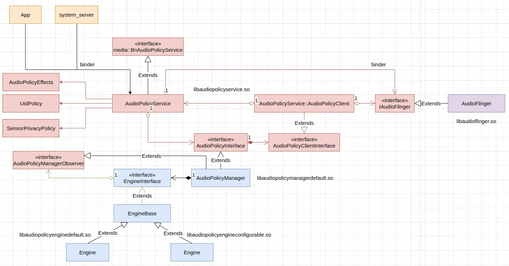
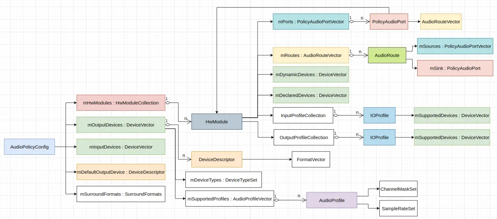
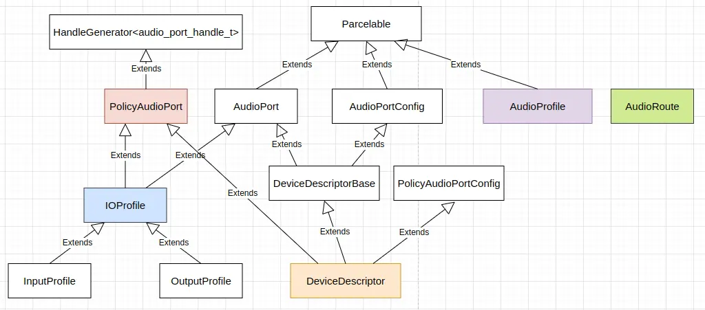
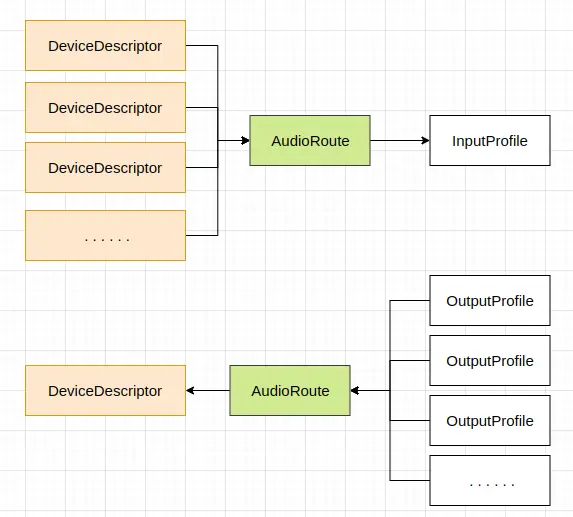

Android 系统的守护进程 audioserver 中运行着多个与音频相关的系统服务，主要包括 `AudioFlinger` 和 `AudioPolicyService`，当需要支持 AAudio 的 MMap 模式时，会运行 `AAudioService`。需要启动  `MediaLogService` 服务时，audioserver 程序会 fork 一个进程运行其它那些系统服务，在父进程中运行 `MediaLogService`，并将进程名修改为 **media.log**。audioserver 程序的主函数代码如下 (位于 *frameworks/av/media/audioserver/main_audioserver.cpp*) 所示：
```
int main(int argc __unused, char **argv)
{
    // TODO: update with refined parameters
    limitProcessMemory(
        "audio.maxmem", /* "ro.audio.maxmem", property that defines limit */
        (size_t)512 * (1 << 20), /* SIZE_MAX, upper limit in bytes */
        20 /* upper limit as percentage of physical RAM */);

    signal(SIGPIPE, SIG_IGN);

#if 1
    // FIXME See bug 165702394 and bug 168511485
    const bool doLog = false;
#else
    bool doLog = (bool) property_get_bool("ro.test_harness", 0);
#endif

    pid_t childPid;
    // FIXME The advantage of making the process containing media.log service the parent process of
    // the process that contains the other audio services, is that it allows us to collect more
    // detailed information such as signal numbers, stop and continue, resource usage, etc.
    // But it is also more complex.  Consider replacing this by independent processes, and using
    // binder on death notification instead.
    if (doLog && (childPid = fork()) != 0) {
        // media.log service
        //prctl(PR_SET_NAME, (unsigned long) "media.log", 0, 0, 0);
        // unfortunately ps ignores PR_SET_NAME for the main thread, so use this ugly hack
        strcpy(argv[0], "media.log");
        sp<ProcessState> proc(ProcessState::self());
        MediaLogService::instantiate();
        ProcessState::self()->startThreadPool();
        IPCThreadState::self()->joinThreadPool();
        for (;;) {
            siginfo_t info;
            int ret = waitid(P_PID, childPid, &info, WEXITED | WSTOPPED | WCONTINUED);
            if (ret == EINTR) {
                continue;
            }
            if (ret < 0) {
                break;
            }
            char buffer[32];
            const char *code;
            switch (info.si_code) {
            case CLD_EXITED:
                code = "CLD_EXITED";
                break;
            case CLD_KILLED:
                code = "CLD_KILLED";
                break;
            case CLD_DUMPED:
                code = "CLD_DUMPED";
                break;
            case CLD_STOPPED:
                code = "CLD_STOPPED";
                break;
            case CLD_TRAPPED:
                code = "CLD_TRAPPED";
                break;
            case CLD_CONTINUED:
                code = "CLD_CONTINUED";
                break;
            default:
                snprintf(buffer, sizeof(buffer), "unknown (%d)", info.si_code);
                code = buffer;
                break;
            }
            struct rusage usage;
            getrusage(RUSAGE_CHILDREN, &usage);
            ALOG(LOG_ERROR, "media.log", "pid %d status %d code %s user %ld.%03lds sys %ld.%03lds",
                    info.si_pid, info.si_status, code,
                    usage.ru_utime.tv_sec, usage.ru_utime.tv_usec / 1000,
                    usage.ru_stime.tv_sec, usage.ru_stime.tv_usec / 1000);
            sp<IServiceManager> sm = defaultServiceManager();
            sp<IBinder> binder = sm->getService(String16("media.log"));
            if (binder != 0) {
                Vector<String16> args;
                binder->dump(-1, args);
            }
            switch (info.si_code) {
            case CLD_EXITED:
            case CLD_KILLED:
            case CLD_DUMPED: {
                ALOG(LOG_INFO, "media.log", "exiting");
                _exit(0);
                // not reached
                }
            default:
                break;
            }
        }
    } else {
        // all other services
        if (doLog) {
            prctl(PR_SET_PDEATHSIG, SIGKILL);   // if parent media.log dies before me, kill me also
            setpgid(0, 0);                      // but if I die first, don't kill my parent
        }
        android::hardware::configureRpcThreadpool(4, false /*callerWillJoin*/);
        sp<ProcessState> proc(ProcessState::self());
        sp<IServiceManager> sm = defaultServiceManager();
        ALOGI("ServiceManager: %p audio server", sm.get());
        AudioFlinger::instantiate();
        AudioPolicyService::instantiate();

        // AAudioService should only be used in OC-MR1 and later.
        // And only enable the AAudioService if the system MMAP policy explicitly allows it.
        // This prevents a client from misusing AAudioService when it is not supported.
        aaudio_policy_t mmapPolicy = property_get_int32(AAUDIO_PROP_MMAP_POLICY,
                                                        AAUDIO_POLICY_NEVER);
        if (mmapPolicy == AAUDIO_POLICY_AUTO || mmapPolicy == AAUDIO_POLICY_ALWAYS) {
            ALOGI("Start aaudio service");
            AAudioService::instantiate();
        } else {
            ALOGI("Donnot start aaudio service");
        }

        ProcessState::self()->startThreadPool();
        IPCThreadState::self()->joinThreadPool();
    }
}
```

## AudioPolicyService 加载音频设备信息

`AudioPolicyService` 在创建及启动过程中会从 XML 文件中加载音频设备的信息，并请求 `AudioFlinger` 加载硬件模块，打开设备等。`AudioPolicyService` 的实现大概如下图这样：



更具体地说，`AudioPolicyService` 在初始化阶段，会创建并初始化 `AudioPolicyManager` 对象，默认的 `AudioPolicyManager` 对象在创建时，会加载音频策略配置信息，其中包含关于音频硬件模块和设备的配置信息，相关代码如下 (位于 *frameworks/av/services/audiopolicy/managerdefault/AudioPolicyManager.cpp*) 所示：
```
AudioPolicyManager::AudioPolicyManager(AudioPolicyClientInterface *clientInterface,
                                       bool /*forTesting*/)
    :
    mUidCached(AID_AUDIOSERVER), // no need to call getuid(), there's only one of us running.
    mpClientInterface(clientInterface),
    mLimitRingtoneVolume(false), mLastVoiceVolume(-1.0f),
    mA2dpSuspended(false),
    mConfig(mHwModulesAll, mOutputDevicesAll, mInputDevicesAll, mDefaultOutputDevice),
    mAudioPortGeneration(1),
    mBeaconMuteRefCount(0),
    mBeaconPlayingRefCount(0),
    mBeaconMuted(false),
    mTtsOutputAvailable(false),
    mMasterMono(false),
    mMusicEffectOutput(AUDIO_IO_HANDLE_NONE)
{
}

AudioPolicyManager::AudioPolicyManager(AudioPolicyClientInterface *clientInterface)
        : AudioPolicyManager(clientInterface, false /*forTesting*/)
{
    loadConfig();
}

void AudioPolicyManager::loadConfig() {
    if (deserializeAudioPolicyXmlConfig(getConfig()) != NO_ERROR) {
        ALOGE("could not load audio policy configuration file, setting defaults");
        getConfig().setDefault();
    }
    //TODO: b/193496180 use spatializer flag at audio HAL when available
    getConfig().convertSpatializerFlag();
}
```

在 `AudioPolicyManager::loadConfig()` 中：

1. 反序列化音频策略 XML 配置文件，解析的结果保存在 `AudioPolicyConfig` 对象中；
2. 如果解析音频策略 XML 配置文件失败，`AudioPolicyConfig` 的各项配置被设置为默认值；
2. 转换 `AudioPolicyConfig` 中各个硬件模块的各个输出设备的空间音频标记。

`AudioPolicyConfig::setDefault()` 函数设置默认的音频策略配置，其定义 (位于 *frameworks/av/services/audiopolicy/common/managerdefinitions/include/AudioPolicyConfig.h*) 如下：
```
    void setDefault(void)
    {
        mSource = "AudioPolicyConfig::setDefault";
        mEngineLibraryNameSuffix = kDefaultEngineLibraryNameSuffix;
        mDefaultOutputDevice = new DeviceDescriptor(AUDIO_DEVICE_OUT_SPEAKER);
        mDefaultOutputDevice->addAudioProfile(AudioProfile::createFullDynamic(gDynamicFormat));
        sp<DeviceDescriptor> defaultInputDevice = new DeviceDescriptor(AUDIO_DEVICE_IN_BUILTIN_MIC);
        defaultInputDevice->addAudioProfile(AudioProfile::createFullDynamic(gDynamicFormat));
        sp<AudioProfile> micProfile = new AudioProfile(
                AUDIO_FORMAT_PCM_16_BIT, AUDIO_CHANNEL_IN_MONO, 8000);
        defaultInputDevice->addAudioProfile(micProfile);
        mOutputDevices.add(mDefaultOutputDevice);
        mInputDevices.add(defaultInputDevice);

        sp<HwModule> module = new HwModule(AUDIO_HARDWARE_MODULE_ID_PRIMARY, 2 /*halVersionMajor*/);
        mHwModules.add(module);

        sp<OutputProfile> outProfile = new OutputProfile("primary");
        outProfile->addAudioProfile(
                new AudioProfile(AUDIO_FORMAT_PCM_16_BIT, AUDIO_CHANNEL_OUT_STEREO, 44100));
        outProfile->addSupportedDevice(mDefaultOutputDevice);
        outProfile->setFlags(AUDIO_OUTPUT_FLAG_PRIMARY);
        module->addOutputProfile(outProfile);

        sp<InputProfile> inProfile = new InputProfile("primary");
        inProfile->addAudioProfile(micProfile);
        inProfile->addSupportedDevice(defaultInputDevice);
        module->addInputProfile(inProfile);

        setDefaultSurroundFormats();
    }

    // Surround formats, with an optional list of subformats that are equivalent from users' POV.
    using SurroundFormats = std::unordered_map<audio_format_t, std::unordered_set<audio_format_t>>;

    const SurroundFormats &getSurroundFormats() const
    {
        return mSurroundFormats;
    }

    void setSurroundFormats(const SurroundFormats &surroundFormats)
    {
        mSurroundFormats = surroundFormats;
    }

    void setDefaultSurroundFormats()
    {
        mSurroundFormats = {
            {AUDIO_FORMAT_AC3, {}},
            {AUDIO_FORMAT_E_AC3, {}},
            {AUDIO_FORMAT_DTS, {}},
            {AUDIO_FORMAT_DTS_HD, {}},
            {AUDIO_FORMAT_AAC_LC, {
                    AUDIO_FORMAT_AAC_HE_V1, AUDIO_FORMAT_AAC_HE_V2, AUDIO_FORMAT_AAC_ELD,
                    AUDIO_FORMAT_AAC_XHE}},
            {AUDIO_FORMAT_DOLBY_TRUEHD, {}},
            {AUDIO_FORMAT_E_AC3_JOC, {}},
            {AUDIO_FORMAT_AC4, {}}};
    }
```

音频策略配置的结构如下图：



图中各个类之间的层次继承结构如下图：



转换 `AudioPolicyConfig` 中各个硬件模块的各个输出设备的空间音频标记的方法 (位于 *frameworks/av/services/audiopolicy/common/managerdefinitions/include/AudioPolicyConfig.h*) 如下：
```
    void convertSpatializerFlag()
    {
        for (const auto& hwModule : mHwModules) {
            for (const auto& curProfile : hwModule->getOutputProfiles()) {
                if (curProfile->getFlags()
                        == (AUDIO_OUTPUT_FLAG_FAST | AUDIO_OUTPUT_FLAG_DEEP_BUFFER)) {
                    curProfile->setFlags(AUDIO_OUTPUT_FLAG_SPATIALIZER);
                }
            }
        }
    }
```

`deserializeAudioPolicyXmlConfig()` 函数解析音频策略 XML 配置文件，填充 `AudioPolicyConfig` 对象，这个函数定义 (位于 *frameworks/av/services/audiopolicy/managerdefault/AudioPolicyManager.cpp*) 如下：
```
static status_t deserializeAudioPolicyXmlConfig(AudioPolicyConfig &config) {
    if (std::string audioPolicyXmlConfigFile = audio_get_audio_policy_config_file();
            !audioPolicyXmlConfigFile.empty()) {
        status_t ret = deserializeAudioPolicyFile(audioPolicyXmlConfigFile.c_str(), &config);
        if (ret == NO_ERROR) {
            config.setSource(audioPolicyXmlConfigFile);
        }
        return ret;
    }
    return BAD_VALUE;
}
```

`deserializeAudioPolicyXmlConfig()` 函数首先获得音频策略 XML 配置文件的路径，然后解析文件，最后为 `AudioPolicyConfig` 对象设置内容来源。上面调用的 `deserializeAudioPolicyFile()` 函数定义 (位于 *frameworks/av/services/audiopolicy/common/managerdefinitions/src/Serializer.cpp*) 如下：
```
status_t PolicySerializer::deserialize(const char *configFile, AudioPolicyConfig *config,
                                       bool ignoreVendorExtensions)
{
    mIgnoreVendorExtensions = ignoreVendorExtensions;
    auto doc = make_xmlUnique(xmlParseFile(configFile));
    if (doc == nullptr) {
        ALOGE("%s: Could not parse %s document.", __func__, configFile);
        return BAD_VALUE;
    }
    xmlNodePtr root = xmlDocGetRootElement(doc.get());
    if (root == NULL) {
        ALOGE("%s: Could not parse %s document: empty.", __func__, configFile);
        return BAD_VALUE;
    }
    if (xmlXIncludeProcess(doc.get()) < 0) {
        ALOGE("%s: libxml failed to resolve XIncludes on %s document.", __func__, configFile);
    }

    if (xmlStrcmp(root->name, reinterpret_cast<const xmlChar*>(rootName)))  {
        ALOGE("%s: No %s root element found in xml data %s.", __func__, rootName,
                reinterpret_cast<const char*>(root->name));
        return BAD_VALUE;
    }

    std::string version = getXmlAttribute(root, versionAttribute);
    if (version.empty()) {
        ALOGE("%s: No version found in root node %s", __func__, rootName);
        return BAD_VALUE;
    }
    if (version == "7.0") {
        mChannelMasksSeparator = mSamplingRatesSeparator = mFlagsSeparator = " ";
    } else if (version != "1.0") {
        ALOGE("%s: Version does not match; expected \"1.0\" or \"7.0\" got \"%s\"",
                __func__, version.c_str());
        return BAD_VALUE;
    }
    // Let's deserialize children
    // Modules
    ModuleTraits::Collection modules;
    status_t status = deserializeCollection<ModuleTraits>(root, &modules, config);
    if (status != NO_ERROR) {
        return status;
    }
    config->setHwModules(modules);

    // Global Configuration
    deserialize<GlobalConfigTraits>(root, config);

    // Surround configuration
    deserialize<SurroundSoundTraits>(root, config);

    return android::OK;
}

}  // namespace

status_t deserializeAudioPolicyFile(const char *fileName, AudioPolicyConfig *config)
{
    PolicySerializer serializer;
    status_t status = serializer.deserialize(fileName, config);
    if (status != OK) config->clear();
    return status;
}
```

这里解析音频策略 XML 配置文件时，先解析音频硬件模块信息，再解析全局配置信息，最后解析环绕声信息。

`audio_get_audio_policy_config_file()` 函数用于获得音频策略 XML 配置文件的路径，其定义 (位于 *system/media/audio/include/system/audio_config.h*) 如下：
```
namespace android {

// Returns a vector of paths where audio configuration files
// must be searched, in the provided order.
static inline std::vector<std::string> audio_get_configuration_paths() {
    static const std::vector<std::string> paths = []() {
        char value[PROPERTY_VALUE_MAX] = {};
        if (property_get("ro.boot.product.vendor.sku", value, "") <= 0) {
            return std::vector<std::string>({"/odm/etc", "/vendor/etc", "/system/etc"});
        } else {
            return std::vector<std::string>({
                    "/odm/etc", std::string("/vendor/etc/audio/sku_") + value,
                    "/vendor/etc", "/system/etc"});
        }
    }();
    return paths;
}

static inline std::string audio_find_readable_configuration_file(const char* fileName) {
    for (const auto& path : audio_get_configuration_paths()) {
        std::string tryPath = path + "/" + fileName;
        if (access(tryPath.c_str(), R_OK) == 0) {
            return tryPath;
        }
    }
    return {};
}

static inline std::string audio_get_audio_policy_config_file() {
    static constexpr const char *apmXmlConfigFileName = "audio_policy_configuration.xml";
    static constexpr const char *apmA2dpOffloadDisabledXmlConfigFileName =
            "audio_policy_configuration_a2dp_offload_disabled.xml";
    static constexpr const char *apmBluetoothLegacyHalXmlConfigFileName =
            "audio_policy_configuration_bluetooth_legacy_hal.xml";

    std::string audioPolicyXmlConfigFile;
    // First try alternative files if needed
    if (property_get_bool("ro.bluetooth.a2dp_offload.supported", false)) {
        if (property_get_bool("persist.bluetooth.bluetooth_audio_hal.disabled", false) &&
            property_get_bool("persist.bluetooth.a2dp_offload.disabled", false)) {
            // Both BluetoothAudio@2.0 and BluetoothA2dp@1.0 (Offload) are disabled, and uses
            // the legacy hardware module for A2DP and hearing aid.
            audioPolicyXmlConfigFile = audio_find_readable_configuration_file(
                    apmBluetoothLegacyHalXmlConfigFileName);
        } else if (property_get_bool("persist.bluetooth.a2dp_offload.disabled", false)) {
            // A2DP offload supported but disabled: try to use special XML file
            audioPolicyXmlConfigFile = audio_find_readable_configuration_file(
                    apmA2dpOffloadDisabledXmlConfigFileName);
        }
    } else if (property_get_bool("persist.bluetooth.bluetooth_audio_hal.disabled", false)) {
        audioPolicyXmlConfigFile = audio_find_readable_configuration_file(
                apmBluetoothLegacyHalXmlConfigFileName);
    }
    return audioPolicyXmlConfigFile.empty() ?
            audio_find_readable_configuration_file(apmXmlConfigFileName) : audioPolicyXmlConfigFile;
}

}  // namespace android
```

`audio_get_audio_policy_config_file()` 函数根据系统属性的配置，按一定的文件优先级，依次按优先级顺序在一组目录下查找音频策略 XML 配置文件。

对于 AAOS 版的模拟器，主要的音频策略 XML 配置文件为 *device/generic/car/emulator/audio/audio_policy_configuration.xml*，这个文件的主要内容为：
```
<audioPolicyConfiguration version="1.0" xmlns:xi="http://www.w3.org/2001/XInclude">
    <!-- version section contains a “version” tag in the form “major.minor” e.g version=”1.0” -->

    <!-- Global configuration Decalaration -->
    <globalConfiguration speaker_drc_enabled="true"/>

    <!-- Modules section:
        There is one section per audio HW module present on the platform.
        Each module section will contains two mandatory tags for audio HAL “halVersion” and “name”.
        The module names are the same as in current .conf file:
                “primary”, “A2DP”, “remote_submix”, “USB”
        Each module will contain the following sections:
        “devicePorts”: a list of device descriptors for all input and output devices accessible via this
        module.
        This contains both permanently attached devices and removable devices.
            "gain": constraints applied to the millibel values:
                - maxValueMB >= minValueMB
                - defaultValueMB >= minValueMB && defaultValueMB <= maxValueMB
                - (maxValueMB - minValueMB) % stepValueMB == 0
                - (defaultValueMB - minValueMB) % stepValueMB == 0
        “mixPorts”: listing all output and input streams exposed by the audio HAL
        “routes”: list of possible connections between input and output devices or between stream and
        devices.
            "route": is defined by an attribute:
                -"type": <mux|mix> means all sources are mutual exclusive (mux) or can be mixed (mix)
                -"sink": the sink involved in this route
                -"sources": all the sources than can be connected to the sink via vis route
        “attachedDevices”: permanently attached devices.
        The attachedDevices section is a list of devices names. The names correspond to device names
        defined in <devicePorts> section.
        “defaultOutputDevice”: device to be used by default when no policy rule applies
    -->
    <modules>
        <!-- Primary Audio HAL -->
        <module name="primary" halVersion="3.0">
            <attachedDevices>
                <!-- One bus per context -->
                <item>bus0_media_out</item>
                <item>bus1_navigation_out</item>
                <item>bus2_voice_command_out</item>
                <item>bus3_call_ring_out</item>
                <item>bus4_call_out</item>
                <item>bus5_alarm_out</item>
                <item>bus6_notification_out</item>
                <item>bus7_system_sound_out</item>
                <!-- names with _audio_zone_# are used for defined an emulator rear seat audio zone
                    where each number # is the zone id number -->
                <item>bus100_audio_zone_1</item>
                <item>bus200_audio_zone_2</item>
                <item>Built-In Mic</item>
                <item>Built-In Back Mic</item>
                <item>Echo-Reference Mic</item>
                <item>FM Tuner</item>
                <item>Tone Generator 0</item>
                <item>Tone Generator 1</item>
            </attachedDevices>
            <defaultOutputDevice>bus0_media_out</defaultOutputDevice>
            <mixPorts>
                <mixPort name="mixport_bus0_media_out" role="source"
                        flags="AUDIO_OUTPUT_FLAG_PRIMARY">
                    <profile name="" format="AUDIO_FORMAT_PCM_16_BIT"
                             samplingRates="48000"
                             channelMasks="AUDIO_CHANNEL_OUT_STEREO"/>
                </mixPort>
                <mixPort name="mixport_bus1_navigation_out" role="source">
                    <profile name="" format="AUDIO_FORMAT_PCM_16_BIT"
                             samplingRates="48000"
                             channelMasks="AUDIO_CHANNEL_OUT_STEREO"/>
                </mixPort>
                <mixPort name="mixport_bus2_voice_command_out" role="source">
                    <profile name="" format="AUDIO_FORMAT_PCM_16_BIT"
                             samplingRates="48000"
                             channelMasks="AUDIO_CHANNEL_OUT_STEREO"/>
                </mixPort>
                <mixPort name="mixport_bus3_call_ring_out" role="source">
                    <profile name="" format="AUDIO_FORMAT_PCM_16_BIT"
                             samplingRates="48000"
                             channelMasks="AUDIO_CHANNEL_OUT_STEREO"/>
                </mixPort>
                <mixPort name="mixport_bus4_call_out" role="source">
                    <profile name="" format="AUDIO_FORMAT_PCM_16_BIT"
                             samplingRates="48000"
                             channelMasks="AUDIO_CHANNEL_OUT_STEREO"/>
                </mixPort>
                <mixPort name="mixport_bus5_alarm_out" role="source">
                    <profile name="" format="AUDIO_FORMAT_PCM_16_BIT"
                             samplingRates="48000"
                             channelMasks="AUDIO_CHANNEL_OUT_STEREO"/>
                </mixPort>
                <mixPort name="mixport_bus6_notification_out" role="source">
                    <profile name="" format="AUDIO_FORMAT_PCM_16_BIT"
                             samplingRates="48000"
                             channelMasks="AUDIO_CHANNEL_OUT_STEREO"/>
                </mixPort>
                <mixPort name="mixport_bus7_system_sound_out" role="source">
                    <profile name="" format="AUDIO_FORMAT_PCM_16_BIT"
                             samplingRates="48000"
                             channelMasks="AUDIO_CHANNEL_OUT_STEREO"/>
                </mixPort>
                <mixPort name="mixport_bus100_audio_zone_1" role="source">
                    <profile name="" format="AUDIO_FORMAT_PCM_16_BIT"
                             samplingRates="48000"
                             channelMasks="AUDIO_CHANNEL_OUT_STEREO"/>
                </mixPort>
                <mixPort name="mixport_bus200_audio_zone_2" role="source">
                    <profile name="" format="AUDIO_FORMAT_PCM_16_BIT"
                             samplingRates="48000"
                             channelMasks="AUDIO_CHANNEL_OUT_STEREO"/>
                </mixPort>
                <mixPort name="primary input" role="sink">
                    <profile name="" format="AUDIO_FORMAT_PCM_16_BIT"
                             samplingRates="8000,11025,12000,16000,22050,24000,32000,44100,48000"
                             channelMasks="AUDIO_CHANNEL_IN_MONO,AUDIO_CHANNEL_IN_STEREO,AUDIO_CHANNEL_IN_FRONT_BACK"/>
                </mixPort>
                <mixPort name="mixport_tuner0" role="sink">
                    <profile name="" format="AUDIO_FORMAT_PCM_16_BIT"
                             samplingRates="48000"
                             channelMasks="AUDIO_CHANNEL_IN_STEREO"/>
                </mixPort>
                <mixPort name="mixport_input_bus_tone_zone_0" role="sink">
                    <profile name="" format="AUDIO_FORMAT_PCM_16_BIT"
                             samplingRates="48000"
                             channelMasks="AUDIO_CHANNEL_IN_STEREO"/>
                </mixPort>
                <mixPort name="mixport_input_bus_tone_zone_1" role="sink">
                    <profile name="" format="AUDIO_FORMAT_PCM_16_BIT"
                             samplingRates="48000"
                             channelMasks="AUDIO_CHANNEL_IN_STEREO"/>
                </mixPort>
            </mixPorts>
            <devicePorts>
                <devicePort tagName="bus0_media_out" role="sink" type="AUDIO_DEVICE_OUT_BUS"
                        address="bus0_media_out">
                    <profile name="" format="AUDIO_FORMAT_PCM_16_BIT"
                            samplingRates="48000" channelMasks="AUDIO_CHANNEL_OUT_STEREO"/>
                    <gains>
                        <gain name="" mode="AUDIO_GAIN_MODE_JOINT"
                                minValueMB="-3200" maxValueMB="600" defaultValueMB="0" stepValueMB="100"/>
                    </gains>
                </devicePort>
                <devicePort tagName="bus1_navigation_out" role="sink" type="AUDIO_DEVICE_OUT_BUS"
                        address="bus1_navigation_out">
                    <profile name="" format="AUDIO_FORMAT_PCM_16_BIT"
                            samplingRates="48000" channelMasks="AUDIO_CHANNEL_OUT_STEREO"/>
                    <gains>
                        <gain name="" mode="AUDIO_GAIN_MODE_JOINT"
                                minValueMB="-3200" maxValueMB="600" defaultValueMB="0" stepValueMB="100"/>
                    </gains>
                </devicePort>
                <devicePort tagName="bus2_voice_command_out" role="sink" type="AUDIO_DEVICE_OUT_BUS"
                        address="bus2_voice_command_out">
                    <profile name="" format="AUDIO_FORMAT_PCM_16_BIT"
                            samplingRates="48000" channelMasks="AUDIO_CHANNEL_OUT_STEREO"/>
                    <gains>
                        <gain name="" mode="AUDIO_GAIN_MODE_JOINT"
                                minValueMB="-3200" maxValueMB="600" defaultValueMB="0" stepValueMB="100"/>
                    </gains>
                </devicePort>
                <devicePort tagName="bus3_call_ring_out" role="sink" type="AUDIO_DEVICE_OUT_BUS"
                        address="bus3_call_ring_out">
                    <profile name="" format="AUDIO_FORMAT_PCM_16_BIT"
                            samplingRates="48000" channelMasks="AUDIO_CHANNEL_OUT_STEREO"/>
                    <gains>
                        <gain name="" mode="AUDIO_GAIN_MODE_JOINT"
                                minValueMB="-3200" maxValueMB="600" defaultValueMB="0" stepValueMB="100"/>
                    </gains>
                </devicePort>
                <devicePort tagName="bus4_call_out" role="sink" type="AUDIO_DEVICE_OUT_BUS"
                        address="bus4_call_out">
                    <profile name="" format="AUDIO_FORMAT_PCM_16_BIT"
                            samplingRates="48000" channelMasks="AUDIO_CHANNEL_OUT_STEREO"/>
                    <gains>
                        <gain name="" mode="AUDIO_GAIN_MODE_JOINT"
                                minValueMB="-3200" maxValueMB="600" defaultValueMB="0" stepValueMB="100"/>
                    </gains>
                </devicePort>
                <devicePort tagName="bus5_alarm_out" role="sink" type="AUDIO_DEVICE_OUT_BUS"
                        address="bus5_alarm_out">
                    <profile name="" format="AUDIO_FORMAT_PCM_16_BIT"
                            samplingRates="48000" channelMasks="AUDIO_CHANNEL_OUT_STEREO"/>
                    <gains>
                        <gain name="" mode="AUDIO_GAIN_MODE_JOINT"
                                minValueMB="-3200" maxValueMB="600" defaultValueMB="0" stepValueMB="100"/>
                    </gains>
                </devicePort>
                <devicePort tagName="bus6_notification_out" role="sink" type="AUDIO_DEVICE_OUT_BUS"
                        address="bus6_notification_out">
                    <profile name="" format="AUDIO_FORMAT_PCM_16_BIT"
                            samplingRates="48000" channelMasks="AUDIO_CHANNEL_OUT_STEREO"/>
                    <gains>
                        <gain name="" mode="AUDIO_GAIN_MODE_JOINT"
                                minValueMB="-3200" maxValueMB="600" defaultValueMB="0" stepValueMB="100"/>
                    </gains>
                </devicePort>
                <devicePort tagName="bus7_system_sound_out" role="sink" type="AUDIO_DEVICE_OUT_BUS"
                        address="bus7_system_sound_out">
                    <profile name="" format="AUDIO_FORMAT_PCM_16_BIT"
                            samplingRates="48000" channelMasks="AUDIO_CHANNEL_OUT_STEREO"/>
                    <gains>
                        <gain name="" mode="AUDIO_GAIN_MODE_JOINT"
                                minValueMB="-3200" maxValueMB="600" defaultValueMB="0" stepValueMB="100"/>
                    </gains>
                </devicePort>
                <devicePort tagName="bus100_audio_zone_1" role="sink" type="AUDIO_DEVICE_OUT_BUS"
                        address="bus100_audio_zone_1">
                    <profile name="" format="AUDIO_FORMAT_PCM_16_BIT"
                            samplingRates="48000" channelMasks="AUDIO_CHANNEL_OUT_STEREO"/>
                    <gains>
                        <gain name="" mode="AUDIO_GAIN_MODE_JOINT"
                                minValueMB="-3200" maxValueMB="600" defaultValueMB="0" stepValueMB="100"/>
                    </gains>
                </devicePort>
                <devicePort tagName="bus200_audio_zone_2" role="sink" type="AUDIO_DEVICE_OUT_BUS"
                            address="bus200_audio_zone_2">
                    <profile name="" format="AUDIO_FORMAT_PCM_16_BIT"
                             samplingRates="48000" channelMasks="AUDIO_CHANNEL_OUT_STEREO"/>
                    <gains>
                        <gain name="" mode="AUDIO_GAIN_MODE_JOINT"
                              minValueMB="-3200" maxValueMB="600" defaultValueMB="0" stepValueMB="100"/>
                    </gains>
                </devicePort>
                <devicePort tagName="Built-In Mic" type="AUDIO_DEVICE_IN_BUILTIN_MIC" role="source">
                    <profile name="" format="AUDIO_FORMAT_PCM_16_BIT"
                            samplingRates="8000,11025,12000,16000,22050,24000,32000,44100,48000"
                            channelMasks="AUDIO_CHANNEL_IN_MONO,AUDIO_CHANNEL_IN_STEREO,AUDIO_CHANNEL_IN_FRONT_BACK"/>
                </devicePort>
                <devicePort tagName="Built-In Back Mic" type="AUDIO_DEVICE_IN_BACK_MIC" role="source">
                    <profile name="" format="AUDIO_FORMAT_PCM_16_BIT"
                            samplingRates="8000,11025,12000,16000,22050,24000,32000,44100,48000"
                            channelMasks="AUDIO_CHANNEL_IN_MONO,AUDIO_CHANNEL_IN_STEREO,AUDIO_CHANNEL_IN_FRONT_BACK"/>
                </devicePort>
                <devicePort tagName="Echo-Reference Mic" type="AUDIO_DEVICE_IN_ECHO_REFERENCE" role="source">
                    <profile name="" format="AUDIO_FORMAT_PCM_16_BIT"
                            samplingRates="8000,11025,12000,16000,22050,24000,32000,44100,48000"
                            channelMasks="AUDIO_CHANNEL_IN_MONO,AUDIO_CHANNEL_IN_STEREO,AUDIO_CHANNEL_IN_FRONT_BACK"/>
                </devicePort>
                <devicePort tagName="FM Tuner" type="AUDIO_DEVICE_IN_FM_TUNER" role="source"
                        address="tuner0">
                    <profile name="" format="AUDIO_FORMAT_PCM_16_BIT"
                            samplingRates="48000" channelMasks="AUDIO_CHANNEL_IN_STEREO"/>
                    <gains>
                        <gain name="" mode="AUDIO_GAIN_MODE_JOINT"
                                minValueMB="-3200" maxValueMB="600" defaultValueMB="0" stepValueMB="100"/>
                    </gains>
                </devicePort>
                <devicePort tagName="Tone Generator 0" type="AUDIO_DEVICE_IN_BUS" role="source"
                            address="input_bus_tone_zone_0">
                    <profile name="" format="AUDIO_FORMAT_PCM_16_BIT"
                             samplingRates="48000" channelMasks="AUDIO_CHANNEL_IN_STEREO"/>
                    <gains>
                        <gain name="" mode="AUDIO_GAIN_MODE_JOINT"
                              minValueMB="-3200" maxValueMB="600" defaultValueMB="0" stepValueMB="100"/>
                    </gains>
                </devicePort>
                <devicePort tagName="Tone Generator 1" type="AUDIO_DEVICE_IN_BUS" role="source"
                            address="input_bus_tone_zone_1">
                    <profile name="" format="AUDIO_FORMAT_PCM_16_BIT"
                             samplingRates="48000" channelMasks="AUDIO_CHANNEL_IN_STEREO"/>
                    <gains>
                        <gain name="" mode="AUDIO_GAIN_MODE_JOINT"
                              minValueMB="-3200" maxValueMB="600" defaultValueMB="0" stepValueMB="100"/>
                    </gains>
                </devicePort>
            </devicePorts>
            <!-- route declaration, i.e. list all available sources for a given sink -->
            <routes>
                <route type="mix" sink="bus0_media_out" sources="mixport_bus0_media_out"/>
                <route type="mix" sink="bus1_navigation_out" sources="mixport_bus1_navigation_out"/>
                <route type="mix" sink="bus2_voice_command_out" sources="mixport_bus2_voice_command_out"/>
                <route type="mix" sink="bus3_call_ring_out" sources="mixport_bus3_call_ring_out"/>
                <route type="mix" sink="bus4_call_out" sources="mixport_bus4_call_out"/>
                <route type="mix" sink="bus5_alarm_out" sources="mixport_bus5_alarm_out"/>
                <route type="mix" sink="bus6_notification_out" sources="mixport_bus6_notification_out"/>
                <route type="mix" sink="bus7_system_sound_out" sources="mixport_bus7_system_sound_out"/>
                <route type="mix" sink="bus100_audio_zone_1" sources="mixport_bus100_audio_zone_1"/>
                <route type="mix" sink="bus200_audio_zone_2" sources="mixport_bus200_audio_zone_2"/>
                <route type="mix" sink="primary input" sources="Built-In Mic,Built-In Back Mic,Echo-Reference Mic"/>
                <route type="mix" sink="mixport_tuner0" sources="FM Tuner"/>
                <route type="mix" sink="mixport_input_bus_tone_zone_0" sources="Tone Generator 0"/>
                <route type="mix" sink="mixport_input_bus_tone_zone_1" sources="Tone Generator 1"/>
            </routes>

        </module>

        <!-- A2dp Audio HAL -->
        <xi:include href="a2dp_audio_policy_configuration.xml"/>

        <!-- Usb Audio HAL -->
        <xi:include href="usb_audio_policy_configuration.xml"/>

        <!-- Remote Submix Audio HAL -->
        <xi:include href="r_submix_audio_policy_configuration.xml"/>

    </modules>
    <!-- End of Modules section -->

    <!-- Volume section -->

    <xi:include href="audio_policy_volumes.xml"/>
    <xi:include href="default_volume_tables.xml"/>

    <!-- End of Volume section -->
    <!-- End of Modules section -->

</audioPolicyConfiguration>
```

这个文件还包含了几个其它的配置文件，在 *device/generic/car/emulator/audio/car_emulator_audio.mk* 文件中可以看到这些文件在源码库及设备的文件系统中的位置：
```
PRODUCT_COPY_FILES += \
    frameworks/native/data/etc/android.hardware.broadcastradio.xml:system/etc/permissions/android.hardware.broadcastradio.xml \
    frameworks/av/services/audiopolicy/config/a2dp_audio_policy_configuration.xml:$(TARGET_COPY_OUT_VENDOR)/etc/a2dp_audio_policy_configuration.xml \
    frameworks/av/services/audiopolicy/config/usb_audio_policy_configuration.xml:$(TARGET_COPY_OUT_VENDOR)/etc/usb_audio_policy_configuration.xml \
    frameworks/av/services/audiopolicy/config/r_submix_audio_policy_configuration.xml:$(TARGET_COPY_OUT_VENDOR)/etc/r_submix_audio_policy_configuration.xml \
    frameworks/av/services/audiopolicy/config/audio_policy_volumes.xml:$(TARGET_COPY_OUT_VENDOR)/etc/audio_policy_volumes.xml \
    frameworks/av/services/audiopolicy/config/default_volume_tables.xml:$(TARGET_COPY_OUT_VENDOR)/etc/default_volume_tables.xml \
    device/generic/car/emulator/audio/audio_policy_configuration.xml:$(TARGET_COPY_OUT_VENDOR)/etc/audio_policy_configuration.xml \
    device/generic/car/emulator/audio/car_audio_configuration.xml:$(TARGET_COPY_OUT_VENDOR)/etc/car_audio_configuration.xml \
```

加载的这些音频策略 XML 配置文件中，共描述了 4 个音频硬件模块。我们再来看音频策略 XML 配置文件模块信息解析这部分 (位于 *frameworks/av/services/audiopolicy/common/managerdefinitions/src/Serializer.cpp*)：
```
template <class Trait>
status_t PolicySerializer::deserializeCollection(const xmlNode *cur,
        typename Trait::Collection *collection,
        typename Trait::PtrSerializingCtx serializingContext)
{
    for (cur = cur->xmlChildrenNode; cur != NULL; cur = cur->next) {
        const xmlNode *child = NULL;
        if (!xmlStrcmp(cur->name, reinterpret_cast<const xmlChar*>(Trait::collectionTag))) {
            child = cur->xmlChildrenNode;
        } else if (!xmlStrcmp(cur->name, reinterpret_cast<const xmlChar*>(Trait::tag))) {
            child = cur;
        }
        for (; child != NULL; child = child->next) {
            if (!xmlStrcmp(child->name, reinterpret_cast<const xmlChar*>(Trait::tag))) {
                auto maybeElement = deserialize<Trait>(child, serializingContext);
                if (maybeElement.index() == 1) {
                    status_t status = Trait::addElementToCollection(
                            std::get<1>(maybeElement), collection);
                    if (status != NO_ERROR) {
                        ALOGE("%s: could not add element to %s collection", __func__,
                            Trait::collectionTag);
                        return status;
                    }
                } else if (mIgnoreVendorExtensions && std::get<status_t>(maybeElement) == NO_INIT) {
                    // Skip a vendor extension element.
                } else {
                    return BAD_VALUE;
                }
            }
        }
        if (!xmlStrcmp(cur->name, reinterpret_cast<const xmlChar*>(Trait::tag))) {
            return NO_ERROR;
        }
    }
    return NO_ERROR;
}
 . . . . . .
template<>
std::variant<status_t, ModuleTraits::Element> PolicySerializer::deserialize<ModuleTraits>(
        const xmlNode *cur, ModuleTraits::PtrSerializingCtx ctx)
{
    using Attributes = ModuleTraits::Attributes;
    auto& tag = ModuleTraits::tag;
    auto& childAttachedDevicesTag = ModuleTraits::childAttachedDevicesTag;
    auto& childAttachedDeviceTag = ModuleTraits::childAttachedDeviceTag;
    auto& childDefaultOutputDeviceTag = ModuleTraits::childDefaultOutputDeviceTag;

    std::string name = getXmlAttribute(cur, Attributes::name);
    if (name.empty()) {
        ALOGE("%s: No %s found", __func__, Attributes::name);
        return BAD_VALUE;
    }
    uint32_t versionMajor = 0, versionMinor = 0;
    std::string versionLiteral = getXmlAttribute(cur, Attributes::version);
    if (!versionLiteral.empty()) {
        sscanf(versionLiteral.c_str(), "%u.%u", &versionMajor, &versionMinor);
        ALOGV("%s: mHalVersion = major %u minor %u",  __func__,
              versionMajor, versionMajor);
    }

    ALOGV("%s: %s %s=%s", __func__, ModuleTraits::tag, Attributes::name, name.c_str());

    ModuleTraits::Element module = new HwModule(name.c_str(), versionMajor, versionMinor);

    // Deserialize children: Audio Mix Port, Audio Device Ports (Source/Sink), Audio Routes
    MixPortTraits::Collection mixPorts;
    status_t status = deserializeCollection<MixPortTraits>(cur, &mixPorts, NULL);
    if (status != NO_ERROR) {
        return status;
    }
    module->setProfiles(mixPorts);

    DevicePortTraits::Collection devicePorts;
    status = deserializeCollection<DevicePortTraits>(cur, &devicePorts, NULL);
    if (status != NO_ERROR) {
        return status;
    }
    module->setDeclaredDevices(devicePorts);

    RouteTraits::Collection routes;
    status = deserializeCollection<RouteTraits>(cur, &routes, module.get());
    if (status != NO_ERROR) {
        return status;
    }
    module->setRoutes(routes);

    for (const xmlNode *children = cur->xmlChildrenNode; children != NULL;
         children = children->next) {
        if (!xmlStrcmp(children->name, reinterpret_cast<const xmlChar*>(childAttachedDevicesTag))) {
            ALOGV("%s: %s %s found", __func__, tag, childAttachedDevicesTag);
            for (const xmlNode *child = children->xmlChildrenNode; child != NULL;
                 child = child->next) {
                if (!xmlStrcmp(child->name,
                                reinterpret_cast<const xmlChar*>(childAttachedDeviceTag))) {
                    auto attachedDevice = make_xmlUnique(xmlNodeListGetString(
                                    child->doc, child->xmlChildrenNode, 1));
                    if (attachedDevice != nullptr) {
                        ALOGV("%s: %s %s=%s", __func__, tag, childAttachedDeviceTag,
                                reinterpret_cast<const char*>(attachedDevice.get()));
                        sp<DeviceDescriptor> device = module->getDeclaredDevices().
                                getDeviceFromTagName(std::string(reinterpret_cast<const char*>(
                                                        attachedDevice.get())));
                        if (device == nullptr && mIgnoreVendorExtensions) {
                            ALOGW("Skipped attached device \"%s\" because it likely uses a vendor"
                                    "extension type",
                                    reinterpret_cast<const char*>(attachedDevice.get()));
                            continue;
                        }
                        ctx->addDevice(device);
                    }
                }
            }
        }
        if (!xmlStrcmp(children->name,
                        reinterpret_cast<const xmlChar*>(childDefaultOutputDeviceTag))) {
            auto defaultOutputDevice = make_xmlUnique(xmlNodeListGetString(
                            children->doc, children->xmlChildrenNode, 1));
            if (defaultOutputDevice != nullptr) {
                ALOGV("%s: %s %s=%s", __func__, tag, childDefaultOutputDeviceTag,
                        reinterpret_cast<const char*>(defaultOutputDevice.get()));
                sp<DeviceDescriptor> device = module->getDeclaredDevices().getDeviceFromTagName(
                        std::string(reinterpret_cast<const char*>(defaultOutputDevice.get())));
                if (device != 0 && ctx->getDefaultOutputDevice() == 0) {
                    ctx->setDefaultOutputDevice(device);
                    ALOGV("%s: default is %08x",
                            __func__, ctx->getDefaultOutputDevice()->type());
                }
            }
        }
    }
    return module;
}
```

音频策略的音频硬件模块相关的这些 Traits 的定义 (位于 *frameworks/av/services/audiopolicy/common/managerdefinitions/src/Serializer.cpp*) 如下：
```
// A profile section contains a name,  one audio format and the list of supported sampling rates
// and channel masks for this format
struct AudioProfileTraits : public AndroidCollectionTraits<AudioProfile, AudioProfileVector>
{
    static constexpr const char *tag = "profile";
    static constexpr const char *collectionTag = "profiles";

    struct Attributes
    {
        static constexpr const char *samplingRates = "samplingRates";
        static constexpr const char *format = "format";
        static constexpr const char *channelMasks = "channelMasks";
    };
};

struct MixPortTraits : public AndroidCollectionTraits<IOProfile, IOProfileCollection>
{
    static constexpr const char *tag = "mixPort";
    static constexpr const char *collectionTag = "mixPorts";

    struct Attributes
    {
        static constexpr const char *name = "name";
        static constexpr const char *role = "role";
        static constexpr const char *roleSource = "source"; /**< <attribute role source value>. */
        static constexpr const char *flags = "flags";
        static constexpr const char *maxOpenCount = "maxOpenCount";
        static constexpr const char *maxActiveCount = "maxActiveCount";
    };

    // Children: GainTraits
};

struct DevicePortTraits : public AndroidCollectionTraits<DeviceDescriptor, DeviceVector>
{
    static constexpr const char *tag = "devicePort";
    static constexpr const char *collectionTag = "devicePorts";

    struct Attributes
    {
        /**  <device tag name>: any string without space. */
        static constexpr const char *tagName = "tagName";
        static constexpr const char *type = "type"; /**< <device type>. */
        static constexpr const char *role = "role"; /**< <device role: sink or source>. */
        static constexpr const char *roleSource = "source"; /**< <attribute role source value>. */
        /** optional: device address, char string less than 64. */
        static constexpr const char *address = "address";
        /** optional: the list of encoded audio formats that are known to be supported. */
        static constexpr const char *encodedFormats = "encodedFormats";
    };

    // Children: GainTraits (optional)
};

struct RouteTraits : public AndroidCollectionTraits<AudioRoute, AudioRouteVector>
{
    static constexpr const char *tag = "route";
    static constexpr const char *collectionTag = "routes";

    struct Attributes
    {
        static constexpr const char *type = "type"; /**< <route type>: mix or mux. */
        static constexpr const char *typeMix = "mix"; /**< type attribute mix value. */
        static constexpr const char *sink = "sink"; /**< <sink: involved in this route>. */
        /** sources: all source that can be involved in this route. */
        static constexpr const char *sources = "sources";
    };

    typedef HwModule *PtrSerializingCtx;
};

struct ModuleTraits : public AndroidCollectionTraits<HwModule, HwModuleCollection>
{
    static constexpr const char *tag = "module";
    static constexpr const char *collectionTag = "modules";

    static constexpr const char *childAttachedDevicesTag = "attachedDevices";
    static constexpr const char *childAttachedDeviceTag = "item";
    static constexpr const char *childDefaultOutputDeviceTag = "defaultOutputDevice";

    struct Attributes
    {
        static constexpr const char *name = "name";
        static constexpr const char *version = "halVersion";
    };

    typedef AudioPolicyConfig *PtrSerializingCtx;

    // Children: mixPortTraits, devicePortTraits, and routeTraits
    // Need to call deserialize on each child
};
```

这样不难理解音频策略 XML 配置文件中的元素和 AudioPolicyConfig 包含的结构体之间具有这样的对应关系：

**modules** <--------------------> `HwModuleCollection`
**module** <--------------------> `HwModule`
**mixPorts** <--------------------> `IOProfileCollection`
**mixPort** <--------------------> `IOProfile`
**gains** <--------------------> `AudioGains`
**gain** <--------------------> `AudioGain`
**devicePorts** <--------------------> `DeviceVector`
**devicePort** <--------------------> `DeviceDescriptor`
**profiles** <--------------------> `AudioProfileVector`
**profile** <--------------------> `AudioProfile`
**routes** <--------------------> `AudioRouteVector`
**route** <--------------------> `AudioRoute`

音频策略 XML 配置文件中 **attachedDevices** 部分所列的设备，不直接解析为 AudioPolicyConfig 中的元素，它们主要用于对直接解析出来的，即声明的 `DeviceDescriptor` 做过滤。向 `HwModule` 添加 **mixPorts** 的方法如下：
```
status_t HwModule::addOutputProfile(const sp<IOProfile> &profile)
{
    profile->attach(this);
    mOutputProfiles.add(profile);
    mPorts.add(profile);
    return NO_ERROR;
}

status_t HwModule::addInputProfile(const sp<IOProfile> &profile)
{
    profile->attach(this);
    mInputProfiles.add(profile);
    mPorts.add(profile);
    return NO_ERROR;
}

status_t HwModule::addProfile(const sp<IOProfile> &profile)
{
    switch (profile->getRole()) {
    case AUDIO_PORT_ROLE_SOURCE:
        return addOutputProfile(profile);
    case AUDIO_PORT_ROLE_SINK:
        return addInputProfile(profile);
    case AUDIO_PORT_ROLE_NONE:
        return BAD_VALUE;
    }
    return BAD_VALUE;
}

void HwModule::setProfiles(const IOProfileCollection &profiles)
{
    for (size_t i = 0; i < profiles.size(); i++) {
        addProfile(profiles[i]);
    }
}
```

**mixPort** 和 **devicePort** 都是既包含 **profiles**，又包含 **gains**，即 `IOProfile` 和 `DeviceDescriptor` 都是既包含 `AudioProfileVector`，又包含 `AudioGains`。

音频策略 XML 配置文件中的 **route** 元素的解析过程如下：
```
template<>
std::variant<status_t, RouteTraits::Element> PolicySerializer::deserialize<RouteTraits>(
        const xmlNode *cur, RouteTraits::PtrSerializingCtx ctx)
{
    using Attributes = RouteTraits::Attributes;

    std::string type = getXmlAttribute(cur, Attributes::type);
    if (type.empty()) {
        ALOGE("%s: No %s found", __func__, Attributes::type);
        return BAD_VALUE;
    }
    audio_route_type_t routeType = (type == Attributes::typeMix) ?
                AUDIO_ROUTE_MIX : AUDIO_ROUTE_MUX;

    ALOGV("%s: %s %s=%s", __func__, RouteTraits::tag, Attributes::type, type.c_str());
    RouteTraits::Element route = new AudioRoute(routeType);

    std::string sinkAttr = getXmlAttribute(cur, Attributes::sink);
    if (sinkAttr.empty()) {
        ALOGE("%s: No %s found", __func__, Attributes::sink);
        return BAD_VALUE;
    }
    // Convert Sink name to port pointer
    sp<PolicyAudioPort> sink = ctx->findPortByTagName(sinkAttr);
    if (sink == NULL && !mIgnoreVendorExtensions) {
        ALOGE("%s: no sink found with name=%s", __func__, sinkAttr.c_str());
        return BAD_VALUE;
    } else if (sink == NULL) {
        ALOGW("Skipping route to sink \"%s\" as it likely has vendor extension type",
                sinkAttr.c_str());
        return NO_INIT;
    }
    route->setSink(sink);

    std::string sourcesAttr = getXmlAttribute(cur, Attributes::sources);
    if (sourcesAttr.empty()) {
        ALOGE("%s: No %s found", __func__, Attributes::sources);
        return BAD_VALUE;
    }
    // Tokenize and Convert Sources name to port pointer
    PolicyAudioPortVector sources;
    UniqueCPtr<char> sourcesLiteral{strndup(
                sourcesAttr.c_str(), strlen(sourcesAttr.c_str()))};
    char *devTag = strtok(sourcesLiteral.get(), ",");
    while (devTag != NULL) {
        if (strlen(devTag) != 0) {
            sp<PolicyAudioPort> source = ctx->findPortByTagName(devTag);
            if (source == NULL && !mIgnoreVendorExtensions) {
                ALOGE("%s: no source found with name=%s", __func__, devTag);
                return BAD_VALUE;
            } else if (source == NULL) {
                ALOGW("Skipping route source \"%s\" as it likely has vendor extension type",
                        devTag);
            } else {
                sources.add(source);
            }
        }
        devTag = strtok(NULL, ",");
    }

    sink->addRoute(route);
    for (size_t i = 0; i < sources.size(); i++) {
        sp<PolicyAudioPort> source = sources.itemAt(i);
        source->addRoute(route);
    }
    route->setSources(sources);
    return route;
}
```

`AudioRoute` 将 source 和 sink 连接起来，对于音频播放来说，**devicePort** 是 sink，**mixPort** 是 source，对于音频数据采集来说，**devicePort** 是 source，**mixPort** 是 sink。解析 **route** 元素时，会根据 source 和 sink 的名称，找出前面解析出来的匹配的 `IOProfile` 和 `DeviceDescriptor` 对象，source 可能会有多个。此时 `AudioRoute` 分别建立与 `IOProfile` 和 `DeviceDescriptor` 的关联。

**routes** 和所有 **route** 元素解析完成，设置给 `HwModule` 时，会建立 `IOProfile` 和 `DeviceDescriptor` 之间的关联，相关的 `HwModule::setRoutes(const AudioRouteVector &routes)` 函数的定义 (位于 *frameworks/av/services/audiopolicy/common/managerdefinitions/src/HwModule.cpp*) 如下：
```
void HwModule::setRoutes(const AudioRouteVector &routes)
{
    mRoutes = routes;
    // Now updating the streams (aka IOProfile until now) supported devices
    refreshSupportedDevices();
}

void HwModule::refreshSupportedDevices()
{
    // Now updating the streams (aka IOProfile until now) supported devices
    for (const auto& stream : mInputProfiles) {
        DeviceVector sourceDevices;
        for (const auto& route : stream->getRoutes()) {
            sp<PolicyAudioPort> sink = route->getSink();
            if (sink == 0 || stream != sink) {
                ALOGE("%s: Invalid route attached to input stream", __FUNCTION__);
                continue;
            }
            DeviceVector sourceDevicesForRoute = getRouteSourceDevices(route);
            if (sourceDevicesForRoute.isEmpty()) {
                ALOGE("%s: invalid source devices for %s", __FUNCTION__, stream->getName().c_str());
                continue;
            }
            sourceDevices.add(sourceDevicesForRoute);
        }
        if (sourceDevices.isEmpty()) {
            ALOGE("%s: invalid source devices for %s", __FUNCTION__, stream->getName().c_str());
            continue;
        }
        stream->setSupportedDevices(sourceDevices);
    }
    for (const auto& stream : mOutputProfiles) {
        DeviceVector sinkDevices;
        for (const auto& route : stream->getRoutes()) {
            sp<PolicyAudioPort> source = findByTagName(route->getSources(), stream->getTagName());
            if (source == 0 || stream != source) {
                ALOGE("%s: Invalid route attached to output stream", __FUNCTION__);
                continue;
            }
            sp<DeviceDescriptor> sinkDevice = getRouteSinkDevice(route);
            if (sinkDevice == 0) {
                ALOGE("%s: invalid sink device for %s", __FUNCTION__, stream->getName().c_str());
                continue;
            }
            sinkDevices.add(sinkDevice);
        }
        stream->setSupportedDevices(sinkDevices);
    }
}
```

对于采集输入 `IOProfile` (**mixPort**) 来说，它是与它关联的 `AudioRoute` 的 sink，设备是该 `AudioRoute` 的 source，这里找到与它关联的所有 `AudioRoute`，进而找到与该 `AudioRoute` 关联的所有 source，即为该 `IOProfile` (**mixPort**) 的所有支持的设备。

对于播放输出 `IOProfile` (**mixPort**) 来说，它是与它关联的 `AudioRoute` 的 source，设备是该 `AudioRoute` 的 sink，这里找到与它关联的所有 `AudioRoute`，进而找到与该 `AudioRoute` 关联的那个 sink，即为该 `IOProfile` (**mixPort**) 的支持的设备。

整个音频策略配置 XML 文件解析过程，为硬件模块 `HwModule` 中的 `IOProfile`、`AudioRoute` 和 `DeviceDescriptor` 这些对象建立了如下这样的关联：



默认的 `AudioPolicyManager` 对象在初始化时，会根据加载的音频策略配置信息，执行更多的初始化动作，`AudioPolicyManager::initialize()` 函数的定义 (位于 *frameworks/av/services/audiopolicy/managerdefault/AudioPolicyManager.cpp*) 如下：
```
status_t AudioPolicyManager::initialize() {
    {
        auto engLib = EngineLibrary::load(
                        "libaudiopolicyengine" + getConfig().getEngineLibraryNameSuffix() + ".so");
        if (!engLib) {
            ALOGE("%s: Failed to load the engine library", __FUNCTION__);
            return NO_INIT;
        }
        mEngine = engLib->createEngine();
        if (mEngine == nullptr) {
            ALOGE("%s: Failed to instantiate the APM engine", __FUNCTION__);
            return NO_INIT;
        }
    }
    mEngine->setObserver(this);
    status_t status = mEngine->initCheck();
    if (status != NO_ERROR) {
        LOG_FATAL("Policy engine not initialized(err=%d)", status);
        return status;
    }

    mCommunnicationStrategy = mEngine->getProductStrategyForAttributes(
        mEngine->getAttributesForStreamType(AUDIO_STREAM_VOICE_CALL));

    // after parsing the config, mOutputDevicesAll and mInputDevicesAll contain all known devices;
    // open all output streams needed to access attached devices
    onNewAudioModulesAvailableInt(nullptr /*newDevices*/);

    // make sure default device is reachable
    if (mDefaultOutputDevice == 0 || !mAvailableOutputDevices.contains(mDefaultOutputDevice)) {
        ALOGE_IF(mDefaultOutputDevice != 0, "Default device %s is unreachable",
                 mDefaultOutputDevice->toString().c_str());
        status = NO_INIT;
    }
    // If microphones address is empty, set it according to device type
    for (size_t i = 0; i < mAvailableInputDevices.size(); i++) {
        if (mAvailableInputDevices[i]->address().empty()) {
            if (mAvailableInputDevices[i]->type() == AUDIO_DEVICE_IN_BUILTIN_MIC) {
                mAvailableInputDevices[i]->setAddress(AUDIO_BOTTOM_MICROPHONE_ADDRESS);
            } else if (mAvailableInputDevices[i]->type() == AUDIO_DEVICE_IN_BACK_MIC) {
                mAvailableInputDevices[i]->setAddress(AUDIO_BACK_MICROPHONE_ADDRESS);
            }
        }
    }

    ALOGW_IF(mPrimaryOutput == nullptr, "The policy configuration does not declare a primary output");

    // Silence ALOGV statements
    property_set("log.tag." LOG_TAG, "D");

    updateDevicesAndOutputs();
    return status;
}
```

`AudioPolicyManager::initialize()` 函数做了这样一些事情：

1. 加载音频策略引擎，其中引擎库文件名后缀从音频策略配置获取；
2. 创建音频策略引擎；
3. 为音频策略引擎设置观察者，这里的 **观察者** 这个名称用的实际上不是很贴切，直观上会让人以为是 `AudioPolicyManager` 要监听音频策略引擎的事件通知或状态变化，实际上这里是要让音频策略引擎可以获得设备相关的信息；
4. 初始化音频策略引擎；
5. 初始化语音通话流类型的产品策略；
6. 调用 `onNewAudioModulesAvailableInt(nullptr /*newDevices*/)` 函数打开访问各个硬件模块的设备的输出音频流；
7. 确认默认输出设备可用；
8. 如果麦克风地址为空，则根据设备类型设置它；
9. 更新设备和输出。

上面为音频策略引擎注册的观察者接口 `AudioPolicyManagerObserver` 的定义 (位于 *frameworks/av/services/audiopolicy/engine/interface/AudioPolicyManagerObserver.h*) 如下：
```
class AudioPolicyManagerObserver
{
public:
    virtual const AudioPatchCollection &getAudioPatches() const = 0;

    virtual const SoundTriggerSessionCollection &getSoundTriggerSessionCollection() const = 0;

    virtual const AudioPolicyMixCollection &getAudioPolicyMixCollection() const = 0;

    virtual const SwAudioOutputCollection &getOutputs() const = 0;

    virtual const AudioInputCollection &getInputs() const = 0;

    virtual const DeviceVector getAvailableOutputDevices() const = 0;

    virtual const DeviceVector getAvailableInputDevices() const = 0;

    virtual const sp<DeviceDescriptor> &getDefaultOutputDevice() const = 0;

protected:
    virtual ~AudioPolicyManagerObserver() {}
};
```

这个 `Observer` 的名字用的，即使不能说是非常不贴切，也可以说是十分不贴切了。

`onNewAudioModulesAvailableInt(nullptr /*newDevices*/)` 函数的定义 (位于 *frameworks/av/services/audiopolicy/managerdefault/AudioPolicyManager.cpp*) 如下：
```
void AudioPolicyManager::onNewAudioModulesAvailableInt(DeviceVector *newDevices)
{
    for (const auto& hwModule : mHwModulesAll) {
        if (std::find(mHwModules.begin(), mHwModules.end(), hwModule) != mHwModules.end()) {
            continue;
        }
        hwModule->setHandle(mpClientInterface->loadHwModule(hwModule->getName()));
        if (hwModule->getHandle() == AUDIO_MODULE_HANDLE_NONE) {
            ALOGW("could not open HW module %s", hwModule->getName());
            continue;
        }
        mHwModules.push_back(hwModule);
        // open all output streams needed to access attached devices
        // except for direct output streams that are only opened when they are actually
        // required by an app.
        // This also validates mAvailableOutputDevices list
        for (const auto& outProfile : hwModule->getOutputProfiles()) {
            if (!outProfile->canOpenNewIo()) {
                ALOGE("Invalid Output profile max open count %u for profile %s",
                      outProfile->maxOpenCount, outProfile->getTagName().c_str());
                continue;
            }
            if (!outProfile->hasSupportedDevices()) {
                ALOGW("Output profile contains no device on module %s", hwModule->getName());
                continue;
            }
            if ((outProfile->getFlags() & AUDIO_OUTPUT_FLAG_TTS) != 0) {
                mTtsOutputAvailable = true;
            }

            const DeviceVector &supportedDevices = outProfile->getSupportedDevices();
            DeviceVector availProfileDevices = supportedDevices.filter(mOutputDevicesAll);
            sp<DeviceDescriptor> supportedDevice = 0;
            if (supportedDevices.contains(mDefaultOutputDevice)) {
                supportedDevice = mDefaultOutputDevice;
            } else {
                // choose first device present in profile's SupportedDevices also part of
                // mAvailableOutputDevices.
                if (availProfileDevices.isEmpty()) {
                    continue;
                }
                supportedDevice = availProfileDevices.itemAt(0);
            }
            if (!mOutputDevicesAll.contains(supportedDevice)) {
                continue;
            }
            sp<SwAudioOutputDescriptor> outputDesc = new SwAudioOutputDescriptor(outProfile,
                                                                                 mpClientInterface);
            audio_io_handle_t output = AUDIO_IO_HANDLE_NONE;
            status_t status = outputDesc->open(nullptr /* halConfig */, nullptr /* mixerConfig */,
                                               DeviceVector(supportedDevice),
                                               AUDIO_STREAM_DEFAULT,
                                               AUDIO_OUTPUT_FLAG_NONE, &output);
            if (status != NO_ERROR) {
                ALOGW("Cannot open output stream for devices %s on hw module %s",
                      supportedDevice->toString().c_str(), hwModule->getName());
                continue;
            }
            for (const auto &device : availProfileDevices) {
                // give a valid ID to an attached device once confirmed it is reachable
                if (!device->isAttached()) {
                    device->attach(hwModule);
                    mAvailableOutputDevices.add(device);
                    device->setEncapsulationInfoFromHal(mpClientInterface);
                    if (newDevices) newDevices->add(device);
                    setEngineDeviceConnectionState(device, AUDIO_POLICY_DEVICE_STATE_AVAILABLE);
                }
            }
            if (mPrimaryOutput == nullptr &&
                    outProfile->getFlags() & AUDIO_OUTPUT_FLAG_PRIMARY) {
                mPrimaryOutput = outputDesc;
            }
            if ((outProfile->getFlags() & AUDIO_OUTPUT_FLAG_DIRECT) != 0) {
                outputDesc->close();
            } else {
                addOutput(output, outputDesc);
                setOutputDevices(outputDesc,
                                 DeviceVector(supportedDevice),
                                 true,
                                 0,
                                 NULL);
            }
        }
        // open input streams needed to access attached devices to validate
        // mAvailableInputDevices list
        for (const auto& inProfile : hwModule->getInputProfiles()) {
            if (!inProfile->canOpenNewIo()) {
                ALOGE("Invalid Input profile max open count %u for profile %s",
                      inProfile->maxOpenCount, inProfile->getTagName().c_str());
                continue;
            }
            if (!inProfile->hasSupportedDevices()) {
                ALOGW("Input profile contains no device on module %s", hwModule->getName());
                continue;
            }
            // chose first device present in profile's SupportedDevices also part of
            // available input devices
            const DeviceVector &supportedDevices = inProfile->getSupportedDevices();
            DeviceVector availProfileDevices = supportedDevices.filter(mInputDevicesAll);
            if (availProfileDevices.isEmpty()) {
                ALOGV("%s: Input device list is empty! for profile %s",
                    __func__, inProfile->getTagName().c_str());
                continue;
            }
            sp<AudioInputDescriptor> inputDesc =
                    new AudioInputDescriptor(inProfile, mpClientInterface);

            audio_io_handle_t input = AUDIO_IO_HANDLE_NONE;
            status_t status = inputDesc->open(nullptr,
                                              availProfileDevices.itemAt(0),
                                              AUDIO_SOURCE_MIC,
                                              AUDIO_INPUT_FLAG_NONE,
                                              &input);
            if (status != NO_ERROR) {
                ALOGW("Cannot open input stream for device %s on hw module %s",
                      availProfileDevices.toString().c_str(),
                      hwModule->getName());
                continue;
            }
            for (const auto &device : availProfileDevices) {
                // give a valid ID to an attached device once confirmed it is reachable
                if (!device->isAttached()) {
                    device->attach(hwModule);
                    device->importAudioPortAndPickAudioProfile(inProfile, true);
                    mAvailableInputDevices.add(device);
                    if (newDevices) newDevices->add(device);
                    setEngineDeviceConnectionState(device, AUDIO_POLICY_DEVICE_STATE_AVAILABLE);
                }
            }
            inputDesc->close();
        }
    }
}
```

`onNewAudioModulesAvailableInt(nullptr /*newDevices*/)` 函数遍历前面加载的所有音频硬件模块的信息，针对每个音频硬件模块，执行如下这样的处理：

1. 传入名称，请求加载音频硬件模块，这最终会请求 `AudioFlinger`， 继而请求 Audio HAL 服务加载音频硬件模块，返回音频硬件模块的句柄，更多相关内容可以参考 [Android Audio HAL 服务](https://www.jianshu.com/p/22172e959776)；
2. 加载音频硬件模块失败，则继续处理下一个，成功则为音频硬件模块设置句柄，在一个专门的集合中保存音频硬件模块并继续；
3. 遍历音频硬件模块的所有输出 `IOProfile`，针对其中的每一个 `IOProfile` 执行下面这样的操作：
3.1 检查是否可以打开新 IO，如果不行，则跳过当前的 `IOProfile`，开始处理下一个，否则继续执行；
3.2 检查当前的 `IOProfile` 是否有支持的设备，如果没有，则跳过当前的 `IOProfile`，开始处理下一个，否则继续执行；
3.3 检查 `IOProfile` 的标记，如果设置了 TTS 标记，则设置 TTS 可用；
3.4 获取 `IOProfile` 的支持的设备，并过滤一下得到可用设备列表，`IOProfile` 的支持的设备是直接从音频策略配置文件里解析出来的，这里的 `mOutputDevicesAll` 中的设备是经过了音频策略配置文件中硬件模块的 **attachedDevices** 中的设备列表过滤的；
3.5 选择一个支持的设备，选择的方法为，如果 `IOProfile` 的支持的设备包含默认输出设备，则选择默认输出设备，否则选择可用设备中的第一个，***这里多少给人一点脱裤子放屁的感觉，我们知道输出 `IOProfile` 的支持的设备一般最多有一个***；
3.6 创建并打开音频输出描述符，这将会请求 AudioFlinger 打开一条音频流；
3.7 将设备与音频硬件模块挂接起来；
3.8 更新 primary 音频输出描述符；
3.7 如果 `IOProfile` 设置了 DIRECT 标记，则关闭音频输出描述符，否则，添加并设置它；
4. 遍历音频硬件模块的所有输入 `IOProfile`，针对其中的每一个 `IOProfile` 执行下面这样的操作：
4.1 检查是否可以打开新 IO，如果不行，则跳过当前的 `IOProfile`，开始处理下一个，否则继续执行；
4.2 检查当前的 `IOProfile` 是否有支持的设备，如果没有，则跳过当前的 `IOProfile`，开始处理下一个，否则继续执行；
4.3 获取 `IOProfile` 的支持的设备，并过滤一下得到可用设备列表，`IOProfile` 的支持的设备是直接从音频策略配置文件里解析出来的，这里的 `mInputDevicesAll` 中的设备是经过了音频策略配置文件中硬件模块的 **attachedDevices** 中的设备列表过滤的；
4.4 如果可用设备列表为空，则跳过当前的 `IOProfile`，开始处理下一个，否则继续执行；
4.5 创建并打开音频输入描述符，这将会请求 AudioFlinger 打开一条音频流；
4.6 将设备与音频硬件模块挂接起来；
4.7 关闭音频输入描述符。

可以看到，播放输出设备在 `AudioPolicyManager` 初始化期间被打开，并保持打开状态；输入设备则会做一次打开动作，但随后会被关闭。

音频输出描述符 `SwAudioOutputDescriptor` 的 `open()` 操作定义 (位于 *frameworks/av/services/audiopolicy/common/managerdefinitions/src/AudioOutputDescriptor.cpp*) 如下：
```
status_t SwAudioOutputDescriptor::open(const audio_config_t *halConfig,
                                       const audio_config_base_t *mixerConfig,
                                       const DeviceVector &devices,
                                       audio_stream_type_t stream,
                                       audio_output_flags_t flags,
                                       audio_io_handle_t *output)
{
    mDevices = devices;
    sp<DeviceDescriptor> device = devices.getDeviceForOpening();
    LOG_ALWAYS_FATAL_IF(device == nullptr,
                        "%s failed to get device descriptor for opening "
                        "with the requested devices, all device types: %s",
                        __func__, dumpDeviceTypes(devices.types()).c_str());

    audio_config_t lHalConfig;
    if (halConfig == nullptr) {
        lHalConfig = AUDIO_CONFIG_INITIALIZER;
        lHalConfig.sample_rate = mSamplingRate;
        lHalConfig.channel_mask = mChannelMask;
        lHalConfig.format = mFormat;
    } else {
        lHalConfig = *halConfig;
    }

    // if the selected profile is offloaded and no offload info was specified,
    // create a default one
    if ((mProfile->getFlags() & AUDIO_OUTPUT_FLAG_COMPRESS_OFFLOAD) &&
            lHalConfig.offload_info.format == AUDIO_FORMAT_DEFAULT) {
        flags = (audio_output_flags_t)(flags | AUDIO_OUTPUT_FLAG_COMPRESS_OFFLOAD);
        lHalConfig.offload_info = AUDIO_INFO_INITIALIZER;
        lHalConfig.offload_info.sample_rate = lHalConfig.sample_rate;
        lHalConfig.offload_info.channel_mask = lHalConfig.channel_mask;
        lHalConfig.offload_info.format = lHalConfig.format;
        lHalConfig.offload_info.stream_type = stream;
        lHalConfig.offload_info.duration_us = -1;
        lHalConfig.offload_info.has_video = true; // conservative
        lHalConfig.offload_info.is_streaming = true; // likely
        lHalConfig.offload_info.encapsulation_mode = lHalConfig.offload_info.encapsulation_mode;
        lHalConfig.offload_info.content_id = lHalConfig.offload_info.content_id;
        lHalConfig.offload_info.sync_id = lHalConfig.offload_info.sync_id;
    }

    audio_config_base_t lMixerConfig;
    if (mixerConfig == nullptr) {
        lMixerConfig = AUDIO_CONFIG_BASE_INITIALIZER;
        lMixerConfig.sample_rate = lHalConfig.sample_rate;
        lMixerConfig.channel_mask = lHalConfig.channel_mask;
        lMixerConfig.format = lHalConfig.format;
    } else {
        lMixerConfig = *mixerConfig;
    }

    mFlags = (audio_output_flags_t)(mFlags | flags);

    //TODO: b/193496180 use spatializer flag at audio HAL when available
    audio_output_flags_t halFlags = mFlags;
    if ((mFlags & AUDIO_OUTPUT_FLAG_SPATIALIZER) != 0) {
        halFlags = (audio_output_flags_t)(AUDIO_OUTPUT_FLAG_FAST | AUDIO_OUTPUT_FLAG_DEEP_BUFFER);
    }

    ALOGV("opening output for device %s profile %p name %s",
          mDevices.toString().c_str(), mProfile.get(), mProfile->getName().c_str());

    status_t status = mClientInterface->openOutput(mProfile->getModuleHandle(),
                                                   output,
                                                   &lHalConfig,
                                                   &lMixerConfig,
                                                   device,
                                                   &mLatency,
                                                   halFlags);

    if (status == NO_ERROR) {
        LOG_ALWAYS_FATAL_IF(*output == AUDIO_IO_HANDLE_NONE,
                            "%s openOutput returned output handle %d for device %s, "
                            "selected device %s for opening",
                            __FUNCTION__, *output, devices.toString().c_str(),
                            device->toString().c_str());
        mSamplingRate = lHalConfig.sample_rate;
        mChannelMask = lHalConfig.channel_mask;
        mFormat = lHalConfig.format;
        mMixerChannelMask = lMixerConfig.channel_mask;
        mId = PolicyAudioPort::getNextUniqueId();
        mIoHandle = *output;
        mProfile->curOpenCount++;
    }

    return status;
}
```

`SwAudioOutputDescriptor` 在 `open()` 操作中做的事情如下：

1. 从可能的多个设备中选择一个；
2. 构造打开输出设备时请求的参数，许多参数项会被配置一个默认值；
3. 请求 `AudioPolicyClientInterface` 打开输出设备，这最终将请求 `AudioFlinger` 打开输出设备，输出设备请求参数既是输入参数也是输出参数，在请求结束时，参数中将包含音频硬件输出流所使用的实际的参数；
4. 根据返回的参数，更新本地的一些参数配置。

从可能的多个设备中选择一个的方法 (位于 *frameworks/av/services/audiopolicy/common/managerdefinitions/src/DeviceDescriptor.cpp*) 如下：
```
sp<DeviceDescriptor> DeviceVector::getDevice(audio_devices_t type, const String8& address,
                                             audio_format_t format) const
{
    sp<DeviceDescriptor> device;
    for (size_t i = 0; i < size(); i++) {
        if (itemAt(i)->type() == type) {
            // If format is specified, match it and ignore address
            // Otherwise if address is specified match it
            // Otherwise always match
            if (((address == "" || (itemAt(i)->address().compare(address.c_str()) == 0)) &&
                 format == AUDIO_FORMAT_DEFAULT) ||
                (itemAt(i)->supportsFormat(format) && format != AUDIO_FORMAT_DEFAULT)) {
                device = itemAt(i);
                if (itemAt(i)->address().compare(address.c_str()) == 0) {
                    break;
                }
            }
        }
    }
    ALOGV("DeviceVector::%s() for type %08x address \"%s\" found %p format %08x",
            __func__, type, address.string(), device.get(), format);
    return device;
}
 . . . . . .
sp<DeviceDescriptor> DeviceVector::getDeviceForOpening() const
{
    if (isEmpty()) {
        // Return nullptr if this collection is empty.
        return nullptr;
    } else if (areAllOfSameDeviceType(types(), audio_call_is_input_device)) {
        // For input case, return the first one when there is only one device.
        return size() > 1 ? nullptr : *begin();
    } else if (areAllOfSameDeviceType(types(), audio_is_output_device)) {
        // For output case, return the device descriptor according to apm strategy.
        audio_devices_t deviceType = apm_extract_one_audio_device(types());
        return deviceType == AUDIO_DEVICE_NONE ? nullptr :
                getDevice(deviceType, String8(""), AUDIO_FORMAT_DEFAULT);
    }
    // Return null pointer if the devices are not all input/output device.
    return nullptr;
}
```

对于输入设备来说，用列表中的第一个；对于输出设备来说，则先选择一个设备列表中包含的优先级最高的设备类型，再找到列表中第一个该设备类型的设备。输出设备类型的优先级排序从 `apm_extract_one_audio_device()` 函数的定义中可以看出来，这个函数定义 (位于 *frameworks/av/services/audiopolicy/common/include/policy.h*) 如下：
```
static inline audio_devices_t apm_extract_one_audio_device(
        const android::DeviceTypeSet& deviceTypes) {
    if (deviceTypes.empty()) {
        return AUDIO_DEVICE_NONE;
    } else if (deviceTypes.size() == 1) {
        return *(deviceTypes.begin());
    } else {
        // Multiple device selection is either:
        //  - speaker + one other device: give priority to speaker in this case.
        //  - one A2DP device + another device: happens with duplicated output. In this case
        // retain the device on the A2DP output as the other must not correspond to an active
        // selection if not the speaker.
        //  - HDMI-CEC system audio mode only output: give priority to available item in order.
        if (deviceTypes.count(AUDIO_DEVICE_OUT_SPEAKER) != 0) {
            return AUDIO_DEVICE_OUT_SPEAKER;
        } else if (deviceTypes.count(AUDIO_DEVICE_OUT_SPEAKER_SAFE) != 0) {
            return AUDIO_DEVICE_OUT_SPEAKER_SAFE;
        } else if (deviceTypes.count(AUDIO_DEVICE_OUT_HDMI_ARC) != 0) {
            return AUDIO_DEVICE_OUT_HDMI_ARC;
        } else if (deviceTypes.count(AUDIO_DEVICE_OUT_HDMI_EARC) != 0) {
            return AUDIO_DEVICE_OUT_HDMI_EARC;
        } else if (deviceTypes.count(AUDIO_DEVICE_OUT_AUX_LINE) != 0) {
            return AUDIO_DEVICE_OUT_AUX_LINE;
        } else if (deviceTypes.count(AUDIO_DEVICE_OUT_SPDIF) != 0) {
            return AUDIO_DEVICE_OUT_SPDIF;
        } else {
            std::vector<audio_devices_t> a2dpDevices = android::Intersection(
                    deviceTypes, android::getAudioDeviceOutAllA2dpSet());
            if (a2dpDevices.empty() || a2dpDevices.size() > 1) {
                ALOGW("%s invalid device combination: %s",
                      __func__, android::dumpDeviceTypes(deviceTypes).c_str());
            }
            return a2dpDevices.empty() ? AUDIO_DEVICE_NONE : a2dpDevices[0];
        }
    }
}
```

`AudioPolicyClientInterface` 请求 `AudioFlinger` 打开输出设备的详细定义 (位于 *frameworks/av/services/audiopolicy/service/AudioPolicyClientImpl.cpp*) 如下：
```
status_t AudioPolicyService::AudioPolicyClient::openOutput(audio_module_handle_t module,
                                                           audio_io_handle_t *output,
                                                           audio_config_t *halConfig,
                                                           audio_config_base_t *mixerConfig,
                                                           const sp<DeviceDescriptorBase>& device,
                                                           uint32_t *latencyMs,
                                                           audio_output_flags_t flags)
{
    sp<IAudioFlinger> af = AudioSystem::get_audio_flinger();
    if (af == 0) {
        ALOGW("%s: could not get AudioFlinger", __func__);
        return PERMISSION_DENIED;
    }

    media::OpenOutputRequest request;
    media::OpenOutputResponse response;

    request.module = VALUE_OR_RETURN_STATUS(legacy2aidl_audio_module_handle_t_int32_t(module));
    request.halConfig = VALUE_OR_RETURN_STATUS(legacy2aidl_audio_config_t_AudioConfig(*halConfig));
    request.mixerConfig =
            VALUE_OR_RETURN_STATUS(legacy2aidl_audio_config_base_t_AudioConfigBase(*mixerConfig));
    request.device = VALUE_OR_RETURN_STATUS(legacy2aidl_DeviceDescriptorBase(device));
    request.flags = VALUE_OR_RETURN_STATUS(legacy2aidl_audio_output_flags_t_int32_t_mask(flags));

    status_t status = af->openOutput(request, &response);
    if (status == OK) {
        *output = VALUE_OR_RETURN_STATUS(aidl2legacy_int32_t_audio_io_handle_t(response.output));
        *halConfig =
                VALUE_OR_RETURN_STATUS(aidl2legacy_AudioConfig_audio_config_t(response.config));
        *latencyMs = VALUE_OR_RETURN_STATUS(convertIntegral<uint32_t>(response.latencyMs));
    }
    return status;
}
```

这个函数基本上就是构造输入，转换输出。

音频输入描述符 `AudioInputDescriptor` 的 `open()` 操作定义 (位于 *frameworks/av/services/audiopolicy/common/managerdefinitions/src/AudioInputDescriptor.cpp*) 大体类似：
```
status_t AudioInputDescriptor::open(const audio_config_t *config,
                                       const sp<DeviceDescriptor> &device,
                                       audio_source_t source,
                                       audio_input_flags_t flags,
                                       audio_io_handle_t *input)
{
    audio_config_t lConfig;
    if (config == nullptr) {
        lConfig = AUDIO_CONFIG_INITIALIZER;
        lConfig.sample_rate = mSamplingRate;
        lConfig.channel_mask = mChannelMask;
        lConfig.format = mFormat;
    } else {
        lConfig = *config;
    }

    mDevice = device;

    ALOGV("opening input for device %s profile %p name %s",
          mDevice->toString().c_str(), mProfile.get(), mProfile->getName().c_str());

    audio_devices_t deviceType = mDevice->type();

    status_t status = mClientInterface->openInput(mProfile->getModuleHandle(),
                                                  input,
                                                  &lConfig,
                                                  &deviceType,
                                                  String8(mDevice->address().c_str()),
                                                  source,
                                                  flags);
    LOG_ALWAYS_FATAL_IF(mDevice->type() != deviceType,
                        "%s openInput returned device %08x when given device %08x",
                        __FUNCTION__, mDevice->type(), deviceType);

    if (status == NO_ERROR) {
        LOG_ALWAYS_FATAL_IF(*input == AUDIO_IO_HANDLE_NONE,
                            "%s openInput returned input handle %d for device %s",
                            __FUNCTION__, *input, mDevice->toString().c_str());
        mSamplingRate = lConfig.sample_rate;
        mChannelMask = lConfig.channel_mask;
        mFormat = lConfig.format;
        mId = PolicyAudioPort::getNextUniqueId();
        mIoHandle = *input;
        mProfile->curOpenCount++;
    }

    return status;
}
```

这里无需做过多解释。

## AudioFlinger 加载硬件模块和打开输入输出设备

前面我们看到，`AudioPolicyService` 的 `AudioPolicyManager` 最终请求 `AudioFlinger` 加载音频硬件模块。`AudioFlinger` 加载音频硬件模块的操作定义 (位于 *frameworks/av/services/audiopolicy/common/managerdefinitions/src/AudioInputDescriptor.cpp*) 如下：
```
audio_module_handle_t AudioFlinger::loadHwModule(const char *name)
{
    if (name == NULL) {
        return AUDIO_MODULE_HANDLE_NONE;
    }
    if (!settingsAllowed()) {
        return AUDIO_MODULE_HANDLE_NONE;
    }
    Mutex::Autolock _l(mLock);
    AutoMutex lock(mHardwareLock);
    return loadHwModule_l(name);
}

// loadHwModule_l() must be called with AudioFlinger::mLock and AudioFlinger::mHardwareLock held
audio_module_handle_t AudioFlinger::loadHwModule_l(const char *name)
{
    for (size_t i = 0; i < mAudioHwDevs.size(); i++) {
        if (strncmp(mAudioHwDevs.valueAt(i)->moduleName(), name, strlen(name)) == 0) {
            ALOGW("loadHwModule() module %s already loaded", name);
            return mAudioHwDevs.keyAt(i);
        }
    }

    sp<DeviceHalInterface> dev;

    int rc = mDevicesFactoryHal->openDevice(name, &dev);
    if (rc) {
        ALOGE("loadHwModule() error %d loading module %s", rc, name);
        return AUDIO_MODULE_HANDLE_NONE;
    }

    mHardwareStatus = AUDIO_HW_INIT;
    rc = dev->initCheck();
    mHardwareStatus = AUDIO_HW_IDLE;
    if (rc) {
        ALOGE("loadHwModule() init check error %d for module %s", rc, name);
        return AUDIO_MODULE_HANDLE_NONE;
    }

    // Check and cache this HAL's level of support for master mute and master
    // volume.  If this is the first HAL opened, and it supports the get
    // methods, use the initial values provided by the HAL as the current
    // master mute and volume settings.

    AudioHwDevice::Flags flags = static_cast<AudioHwDevice::Flags>(0);
    if (0 == mAudioHwDevs.size()) {
        mHardwareStatus = AUDIO_HW_GET_MASTER_VOLUME;
        float mv;
        if (OK == dev->getMasterVolume(&mv)) {
            mMasterVolume = mv;
        }

        mHardwareStatus = AUDIO_HW_GET_MASTER_MUTE;
        bool mm;
        if (OK == dev->getMasterMute(&mm)) {
            mMasterMute = mm;
        }
    }

    mHardwareStatus = AUDIO_HW_SET_MASTER_VOLUME;
    if (OK == dev->setMasterVolume(mMasterVolume)) {
        flags = static_cast<AudioHwDevice::Flags>(flags |
                AudioHwDevice::AHWD_CAN_SET_MASTER_VOLUME);
    }

    mHardwareStatus = AUDIO_HW_SET_MASTER_MUTE;
    if (OK == dev->setMasterMute(mMasterMute)) {
        flags = static_cast<AudioHwDevice::Flags>(flags |
                AudioHwDevice::AHWD_CAN_SET_MASTER_MUTE);
    }

    mHardwareStatus = AUDIO_HW_IDLE;

    if (strcmp(name, AUDIO_HARDWARE_MODULE_ID_MSD) == 0) {
        // An MSD module is inserted before hardware modules in order to mix encoded streams.
        flags = static_cast<AudioHwDevice::Flags>(flags | AudioHwDevice::AHWD_IS_INSERT);
    }

    audio_module_handle_t handle = (audio_module_handle_t) nextUniqueId(AUDIO_UNIQUE_ID_USE_MODULE);
    AudioHwDevice *audioDevice = new AudioHwDevice(handle, name, dev, flags);
    if (strcmp(name, AUDIO_HARDWARE_MODULE_ID_PRIMARY) == 0) {
        mPrimaryHardwareDev = audioDevice;
        mHardwareStatus = AUDIO_HW_SET_MODE;
        mPrimaryHardwareDev->hwDevice()->setMode(mMode);
        mHardwareStatus = AUDIO_HW_IDLE;
    }

    mAudioHwDevs.add(handle, audioDevice);

    ALOGI("loadHwModule() Loaded %s audio interface, handle %d", name, handle);

    return handle;

}
```

这个操作的执行过程如下：

1. 检查要打开的音频硬件模块是否已经打开，如果已经打开，则直接返回模块句柄，否则继续执行；
2. 请求 Audio HAL 服务，打开音频硬件模块，获得设备 HAL 接口对象，关于 Audio HAL 更详细的内容，可以参考 [Android Audio HAL 服务](https://www.jianshu.com/p/22172e959776)；
3. 初始化设备 HAL 接口对象；
4. 如果打开的音频硬件模块是第一个，则初始化主音量 `mMasterVolume` 和主静音 `mMasterMute`；
5. 为打开的设备 HAL 接口对象设置主音量和主静音；
6. 基于设备 HAL 接口对象为要打开的音频硬件模块创建 `AudioHwDevice` 对象，在 `AudioFlinger` 中，`AudioHwDevice` 对象用来描述打开的音频硬件模块；
7. 如果要打开的音频硬件模块名称为 `AUDIO_HARDWARE_MODULE_ID_PRIMARY`，即 **primary**，则初始化主硬件设备等；
8. 保存为音频硬件模块创建的 `AudioHwDevice` 对象，并返回模块句柄。

相同的实体在不同模块中的抽象不同，在不同模块间的概念不统一，`AudioPolicyService` 中的音频硬件模块在 `AudioFlinger` 中被称为设备 Device，`AudioPolicyService` 中的音频设备，在 `AudioFlinger` 中则被称为流 Stream。

音频输出描述符 `SwAudioOutputDescriptor` 在 `open()` 操作中请求 `AudioFlinger` 打开音频输出设备，打开音频输出设备的 `AudioFlinger::openOutput()` 函数定义 (位于 *frameworks/av/services/audiopolicy/common/managerdefinitions/src/AudioInputDescriptor.cpp*) 如下：
```
sp<AudioFlinger::ThreadBase> AudioFlinger::openOutput_l(audio_module_handle_t module,
                                                        audio_io_handle_t *output,
                                                        audio_config_t *halConfig,
                                                        audio_config_base_t *mixerConfig __unused,
                                                        audio_devices_t deviceType,
                                                        const String8& address,
                                                        audio_output_flags_t flags)
{
    AudioHwDevice *outHwDev = findSuitableHwDev_l(module, deviceType);
    if (outHwDev == NULL) {
        return 0;
    }

    if (*output == AUDIO_IO_HANDLE_NONE) {
        *output = nextUniqueId(AUDIO_UNIQUE_ID_USE_OUTPUT);
    } else {
        // Audio Policy does not currently request a specific output handle.
        // If this is ever needed, see openInput_l() for example code.
        ALOGE("openOutput_l requested output handle %d is not AUDIO_IO_HANDLE_NONE", *output);
        return 0;
    }

    mHardwareStatus = AUDIO_HW_OUTPUT_OPEN;

    // FOR TESTING ONLY:
    // This if statement allows overriding the audio policy settings
    // and forcing a specific format or channel mask to the HAL/Sink device for testing.
    if (!(flags & (AUDIO_OUTPUT_FLAG_COMPRESS_OFFLOAD | AUDIO_OUTPUT_FLAG_DIRECT))) {
        // Check only for Normal Mixing mode
        if (kEnableExtendedPrecision) {
            // Specify format (uncomment one below to choose)
            //halConfig->format = AUDIO_FORMAT_PCM_FLOAT;
            //halConfig->format = AUDIO_FORMAT_PCM_24_BIT_PACKED;
            //halConfig->format = AUDIO_FORMAT_PCM_32_BIT;
            //halConfig->format = AUDIO_FORMAT_PCM_8_24_BIT;
            // ALOGV("openOutput_l() upgrading format to %#08x", halConfig->format);
        }
        if (kEnableExtendedChannels) {
            // Specify channel mask (uncomment one below to choose)
            //halConfig->channel_mask = audio_channel_out_mask_from_count(4);  // for USB 4ch
            //halConfig->channel_mask = audio_channel_mask_from_representation_and_bits(
            //        AUDIO_CHANNEL_REPRESENTATION_INDEX, (1 << 4) - 1);  // another 4ch example
        }
    }

    AudioStreamOut *outputStream = NULL;
    status_t status = outHwDev->openOutputStream(
            &outputStream,
            *output,
            deviceType,
            flags,
            halConfig,
            address.string());

    mHardwareStatus = AUDIO_HW_IDLE;

    if (status == NO_ERROR) {
        if (flags & AUDIO_OUTPUT_FLAG_MMAP_NOIRQ) {
            sp<MmapPlaybackThread> thread =
                    new MmapPlaybackThread(this, *output, outHwDev, outputStream, mSystemReady);
            mMmapThreads.add(*output, thread);
            ALOGV("openOutput_l() created mmap playback thread: ID %d thread %p",
                  *output, thread.get());
            return thread;
        } else {
            sp<PlaybackThread> thread;
            //TODO: b/193496180 use spatializer flag at audio HAL when available
            if (flags == (audio_output_flags_t)(AUDIO_OUTPUT_FLAG_FAST
                                                    | AUDIO_OUTPUT_FLAG_DEEP_BUFFER)) {
#ifdef MULTICHANNEL_EFFECT_CHAIN
                thread = new SpatializerThread(this, outputStream, *output,
                                                    mSystemReady, mixerConfig);
                ALOGD("openOutput_l() created spatializer output: ID %d thread %p",
                      *output, thread.get());
#else
                ALOGE("openOutput_l() cannot create spatializer thread "
                        "without #define MULTICHANNEL_EFFECT_CHAIN");
#endif
            } else if (flags & AUDIO_OUTPUT_FLAG_COMPRESS_OFFLOAD) {
                thread = new OffloadThread(this, outputStream, *output, mSystemReady);
                ALOGV("openOutput_l() created offload output: ID %d thread %p",
                      *output, thread.get());
            } else if ((flags & AUDIO_OUTPUT_FLAG_DIRECT)
                    || !isValidPcmSinkFormat(halConfig->format)
                    || !isValidPcmSinkChannelMask(halConfig->channel_mask)) {
                thread = new DirectOutputThread(this, outputStream, *output, mSystemReady);
                ALOGV("openOutput_l() created direct output: ID %d thread %p",
                      *output, thread.get());
            } else {
                thread = new MixerThread(this, outputStream, *output, mSystemReady);
                ALOGV("openOutput_l() created mixer output: ID %d thread %p",
                      *output, thread.get());
            }
            mPlaybackThreads.add(*output, thread);
            struct audio_patch patch;
            mPatchPanel.notifyStreamOpened(outHwDev, *output, &patch);
            if (thread->isMsdDevice()) {
                thread->setDownStreamPatch(&patch);
            }
            return thread;
        }
    }

    return 0;
}

status_t AudioFlinger::openOutput(const media::OpenOutputRequest& request,
                                media::OpenOutputResponse* response)
{
    audio_module_handle_t module = VALUE_OR_RETURN_STATUS(
            aidl2legacy_int32_t_audio_module_handle_t(request.module));
    audio_config_t halConfig = VALUE_OR_RETURN_STATUS(
            aidl2legacy_AudioConfig_audio_config_t(request.halConfig));
    audio_config_base_t mixerConfig = VALUE_OR_RETURN_STATUS(
            aidl2legacy_AudioConfigBase_audio_config_base_t(request.mixerConfig));
    sp<DeviceDescriptorBase> device = VALUE_OR_RETURN_STATUS(
            aidl2legacy_DeviceDescriptorBase(request.device));
    audio_output_flags_t flags = VALUE_OR_RETURN_STATUS(
            aidl2legacy_int32_t_audio_output_flags_t_mask(request.flags));

    audio_io_handle_t output;
    uint32_t latencyMs;

    ALOGI("openOutput() this %p, module %d Device %s, SamplingRate %d, Format %#08x, "
              "Channels %#x, flags %#x",
              this, module,
              device->toString().c_str(),
              halConfig.sample_rate,
              halConfig.format,
              halConfig.channel_mask,
              flags);

    audio_devices_t deviceType = device->type();
    const String8 address = String8(device->address().c_str());

    if (deviceType == AUDIO_DEVICE_NONE) {
        return BAD_VALUE;
    }

    Mutex::Autolock _l(mLock);

    sp<ThreadBase> thread = openOutput_l(module, &output, &halConfig,
            &mixerConfig, deviceType, address, flags);
    if (thread != 0) {
        if ((flags & AUDIO_OUTPUT_FLAG_MMAP_NOIRQ) == 0) {
            PlaybackThread *playbackThread = (PlaybackThread *)thread.get();
            latencyMs = playbackThread->latency();

            // notify client processes of the new output creation
            playbackThread->ioConfigChanged(AUDIO_OUTPUT_OPENED);

            // the first primary output opened designates the primary hw device if no HW module
            // named "primary" was already loaded.
            AutoMutex lock(mHardwareLock);
            if ((mPrimaryHardwareDev == nullptr) && (flags & AUDIO_OUTPUT_FLAG_PRIMARY)) {
                ALOGI("Using module %d as the primary audio interface", module);
                mPrimaryHardwareDev = playbackThread->getOutput()->audioHwDev;

                mHardwareStatus = AUDIO_HW_SET_MODE;
                mPrimaryHardwareDev->hwDevice()->setMode(mMode);
                mHardwareStatus = AUDIO_HW_IDLE;
            }
        } else {
            MmapThread *mmapThread = (MmapThread *)thread.get();
            mmapThread->ioConfigChanged(AUDIO_OUTPUT_OPENED);
        }
        response->output = VALUE_OR_RETURN_STATUS(legacy2aidl_audio_io_handle_t_int32_t(output));
        response->config =
                VALUE_OR_RETURN_STATUS(legacy2aidl_audio_config_t_AudioConfig(halConfig));
        response->latencyMs = VALUE_OR_RETURN_STATUS(convertIntegral<int32_t>(latencyMs));
        response->flags = VALUE_OR_RETURN_STATUS(
                legacy2aidl_audio_output_flags_t_int32_t_mask(flags));
        return NO_ERROR;
    }

    return NO_INIT;
}
```

这个操作的执行过程如下：

1. 根据音频硬件模块句柄和设备类型查找适当的音频硬件模块；
2. 构造音频输出设备 ID；
3. 请求音频硬件模块打开音频输出流，`AudioFlinger` 中的流等价于 `AudioPolicyService` 中的设备；
4. 根据音频硬件设备的标记配置创建不同的 Thread，这些标记主要来自于音频策略 XML 配置文件。

根据音频硬件模块句柄和设备类型查找适当的音频硬件模块的 `findSuitableHwDev_l()` 函数定义 (位于 *frameworks/av/services/audiopolicy/common/managerdefinitions/src/AudioInputDescriptor.cpp*) 如下：
```
static const char * const audio_interfaces[] = {
    AUDIO_HARDWARE_MODULE_ID_PRIMARY,
    AUDIO_HARDWARE_MODULE_ID_A2DP,
    AUDIO_HARDWARE_MODULE_ID_USB,
};

AudioHwDevice* AudioFlinger::findSuitableHwDev_l(
        audio_module_handle_t module,
        audio_devices_t deviceType)
{
    // if module is 0, the request comes from an old policy manager and we should load
    // well known modules
    AutoMutex lock(mHardwareLock);
    if (module == 0) {
        ALOGW("findSuitableHwDev_l() loading well know audio hw modules");
        for (size_t i = 0; i < arraysize(audio_interfaces); i++) {
            loadHwModule_l(audio_interfaces[i]);
        }
        // then try to find a module supporting the requested device.
        for (size_t i = 0; i < mAudioHwDevs.size(); i++) {
            AudioHwDevice *audioHwDevice = mAudioHwDevs.valueAt(i);
            sp<DeviceHalInterface> dev = audioHwDevice->hwDevice();
            uint32_t supportedDevices;
            if (dev->getSupportedDevices(&supportedDevices) == OK &&
                    (supportedDevices & deviceType) == deviceType) {
                return audioHwDevice;
            }
        }
    } else {
        // check a match for the requested module handle
        AudioHwDevice *audioHwDevice = mAudioHwDevs.valueFor(module);
        if (audioHwDevice != NULL) {
            return audioHwDevice;
        }
    }

    return NULL;
}
```

在这个函数中，如果音频硬件模块句柄为 0，则会先加载几个音频硬件模块，然后找到第一个支持请求的音频设备类型的音频硬件模块，并返回；如果音频硬件模块句柄不为 0，则根据句柄查找并返回。

加载音频硬件模块不只会在 `AudioPolicyService` 中发起，当向 `AudioFlinger` 请求打开输入输出音频设备，查找音频硬件模块时也可能发起。

在音频硬件模块 `AudioHwDevice` 中打开音频输出流的操作定义 (位于 *frameworks/av/services/audioflinger/AudioHwDevice.cpp*) 如下：
```
status_t AudioHwDevice::openOutputStream(
        AudioStreamOut **ppStreamOut,
        audio_io_handle_t handle,
        audio_devices_t deviceType,
        audio_output_flags_t flags,
        struct audio_config *config,
        const char *address)
{

    struct audio_config originalConfig = *config;
    AudioStreamOut *outputStream = new AudioStreamOut(this, flags);

    // Try to open the HAL first using the current format.
    ALOGV("openOutputStream(), try "
            " sampleRate %d, Format %#x, "
            "channelMask %#x",
            config->sample_rate,
            config->format,
            config->channel_mask);
    status_t status = outputStream->open(handle, deviceType, config, address);

    if (status != NO_ERROR) {
        delete outputStream;
        outputStream = NULL;

        // FIXME Look at any modification to the config.
        // The HAL might modify the config to suggest a wrapped format.
        // Log this so we can see what the HALs are doing.
        ALOGI("openOutputStream(), HAL returned"
            " sampleRate %d, Format %#x, "
            "channelMask %#x, status %d",
            config->sample_rate,
            config->format,
            config->channel_mask,
            status);

        // If the data is encoded then try again using wrapped PCM.
        bool wrapperNeeded = !audio_has_proportional_frames(originalConfig.format)
                && ((flags & AUDIO_OUTPUT_FLAG_DIRECT) != 0)
                && ((flags & AUDIO_OUTPUT_FLAG_COMPRESS_OFFLOAD) == 0);

        if (wrapperNeeded) {
            if (SPDIFEncoder::isFormatSupported(originalConfig.format)) {
                outputStream = new SpdifStreamOut(this, flags, originalConfig.format);
                status = outputStream->open(handle, deviceType, &originalConfig, address);
                if (status != NO_ERROR) {
                    ALOGE("ERROR - openOutputStream(), SPDIF open returned %d",
                        status);
                    delete outputStream;
                    outputStream = NULL;
                }
            } else {
                ALOGE("ERROR - openOutputStream(), SPDIFEncoder does not support format 0x%08x",
                    originalConfig.format);
            }
        }
    }

    *ppStreamOut = outputStream;
    return status;
}
```

这里创建 `AudioStreamOut` 对象并执行其 `open()` 操作。当 `open()` 执行失败时，则可能会根据配置的音频数据格式，尝试创建 `SpdifStreamOut` 对象并执行其 `open()` 操作。

`AudioStreamOut` 的 `open()` 操作定义 (位于 *frameworks/av/services/audioflinger/AudioStreamOut.cpp*) 如下：
```
status_t AudioStreamOut::open(
        audio_io_handle_t handle,
        audio_devices_t deviceType,
        struct audio_config *config,
        const char *address)
{
    sp<StreamOutHalInterface> outStream;

    audio_output_flags_t customFlags = (config->format == AUDIO_FORMAT_IEC61937)
                ? (audio_output_flags_t)(flags | AUDIO_OUTPUT_FLAG_IEC958_NONAUDIO)
                : flags;

    int status = hwDev()->openOutputStream(
            handle,
            deviceType,
            customFlags,
            config,
            address,
            &outStream);
    ALOGD("AudioStreamOut::open(), HAL returned "
            " stream %p, sampleRate %d, Format %#x, "
            "channelMask %#x, status %d",
            outStream.get(),
            config->sample_rate,
            config->format,
            config->channel_mask,
            status);

    // Some HALs may not recognize AUDIO_FORMAT_IEC61937. But if we declare
    // it as PCM then it will probably work.
    if (status != NO_ERROR && config->format == AUDIO_FORMAT_IEC61937) {
        struct audio_config customConfig = *config;
        customConfig.format = AUDIO_FORMAT_PCM_16_BIT;

        status = hwDev()->openOutputStream(
                handle,
                deviceType,
                customFlags,
                &customConfig,
                address,
                &outStream);
        ALOGV("AudioStreamOut::open(), treat IEC61937 as PCM, status = %d", status);
    }

    if (status == NO_ERROR) {
        stream = outStream;
        mHalFormatHasProportionalFrames = audio_has_proportional_frames(config->format);
        status = stream->getFrameSize(&mHalFrameSize);
        LOG_ALWAYS_FATAL_IF(status != OK, "Error retrieving frame size from HAL: %d", status);
        LOG_ALWAYS_FATAL_IF(mHalFrameSize <= 0, "Error frame size was %zu but must be greater than"
                " zero", mHalFrameSize);

    }

    return status;
}
```

这里请求 Audio HAL 服务打开音频输出流，当失败时，根据配置的音频数据格式，则可能会尝试换一种音频数据格式再打开一次。

`AudioFlinger` 在打开音频输入输出设备时，创建的各种 Thread 具有如下这样的继承层次结构：


音频输入描述符 `AudioInputDescriptor` 在 `open()` 操作中请求 `AudioFlinger` 打开音频输入设备，打开音频输入设备的 `AudioFlinger::openInput()` 函数定义 (位于 *frameworks/av/services/audiopolicy/common/managerdefinitions/src/AudioInputDescriptor.cpp*) 如下：
```
status_t AudioFlinger::openInput(const media::OpenInputRequest& request,
                                 media::OpenInputResponse* response)
{
    Mutex::Autolock _l(mLock);

    if (request.device.type == AUDIO_DEVICE_NONE) {
        return BAD_VALUE;
    }

    audio_io_handle_t input = VALUE_OR_RETURN_STATUS(
            aidl2legacy_int32_t_audio_io_handle_t(request.input));
    audio_config_t config = VALUE_OR_RETURN_STATUS(
            aidl2legacy_AudioConfig_audio_config_t(request.config));
    AudioDeviceTypeAddr device = VALUE_OR_RETURN_STATUS(
            aidl2legacy_AudioDeviceTypeAddress(request.device));

    sp<ThreadBase> thread = openInput_l(
            VALUE_OR_RETURN_STATUS(aidl2legacy_int32_t_audio_module_handle_t(request.module)),
            &input,
            &config,
            device.mType,
            device.address().c_str(),
            VALUE_OR_RETURN_STATUS(aidl2legacy_AudioSourceType_audio_source_t(request.source)),
            VALUE_OR_RETURN_STATUS(aidl2legacy_int32_t_audio_input_flags_t_mask(request.flags)),
            AUDIO_DEVICE_NONE,
            String8{});

    response->input = VALUE_OR_RETURN_STATUS(legacy2aidl_audio_io_handle_t_int32_t(input));
    response->config = VALUE_OR_RETURN_STATUS(legacy2aidl_audio_config_t_AudioConfig(config));
    response->device = request.device;

    if (thread != 0) {
        // notify client processes of the new input creation
        thread->ioConfigChanged(AUDIO_INPUT_OPENED);
        return NO_ERROR;
    }
    return NO_INIT;
}

sp<AudioFlinger::ThreadBase> AudioFlinger::openInput_l(audio_module_handle_t module,
                                                         audio_io_handle_t *input,
                                                         audio_config_t *config,
                                                         audio_devices_t devices,
                                                         const char* address,
                                                         audio_source_t source,
                                                         audio_input_flags_t flags,
                                                         audio_devices_t outputDevice,
                                                         const String8& outputDeviceAddress)
{
    AudioHwDevice *inHwDev = findSuitableHwDev_l(module, devices);
    if (inHwDev == NULL) {
        *input = AUDIO_IO_HANDLE_NONE;
        return 0;
    }

    // Audio Policy can request a specific handle for hardware hotword.
    // The goal here is not to re-open an already opened input.
    // It is to use a pre-assigned I/O handle.
    if (*input == AUDIO_IO_HANDLE_NONE) {
        *input = nextUniqueId(AUDIO_UNIQUE_ID_USE_INPUT);
    } else if (audio_unique_id_get_use(*input) != AUDIO_UNIQUE_ID_USE_INPUT) {
        ALOGE("openInput_l() requested input handle %d is invalid", *input);
        return 0;
    } else if (mRecordThreads.indexOfKey(*input) >= 0) {
        // This should not happen in a transient state with current design.
        ALOGE("openInput_l() requested input handle %d is already assigned", *input);
        return 0;
    }

    audio_config_t halconfig = *config;
    sp<DeviceHalInterface> inHwHal = inHwDev->hwDevice();
    sp<StreamInHalInterface> inStream;
    status_t status = inHwHal->openInputStream(
            *input, devices, &halconfig, flags, address, source,
            outputDevice, outputDeviceAddress, &inStream);
    ALOGV("openInput_l() openInputStream returned input %p, devices %#x, SamplingRate %d"
           ", Format %#x, Channels %#x, flags %#x, status %d addr %s",
            inStream.get(),
            devices,
            halconfig.sample_rate,
            halconfig.format,
            halconfig.channel_mask,
            flags,
            status, address);

    // If the input could not be opened with the requested parameters and we can handle the
    // conversion internally, try to open again with the proposed parameters.
    if (status == BAD_VALUE &&
        audio_is_linear_pcm(config->format) &&
        audio_is_linear_pcm(halconfig.format) &&
        (halconfig.sample_rate <= AUDIO_RESAMPLER_DOWN_RATIO_MAX * config->sample_rate) &&
        (audio_channel_count_from_in_mask(halconfig.channel_mask) <= FCC_LIMIT) &&
        (audio_channel_count_from_in_mask(config->channel_mask) <= FCC_LIMIT)) {
        // FIXME describe the change proposed by HAL (save old values so we can log them here)
        ALOGV("openInput_l() reopening with proposed sampling rate and channel mask");
        inStream.clear();
        status = inHwHal->openInputStream(
                *input, devices, &halconfig, flags, address, source,
                outputDevice, outputDeviceAddress, &inStream);
        // FIXME log this new status; HAL should not propose any further changes
    }

    if (status == NO_ERROR && inStream != 0) {
        AudioStreamIn *inputStream = new AudioStreamIn(inHwDev, inStream, flags);
        if ((flags & AUDIO_INPUT_FLAG_MMAP_NOIRQ) != 0) {
            sp<MmapCaptureThread> thread =
                    new MmapCaptureThread(this, *input, inHwDev, inputStream, mSystemReady);
            mMmapThreads.add(*input, thread);
            ALOGV("openInput_l() created mmap capture thread: ID %d thread %p", *input,
                    thread.get());
            return thread;
        } else {
            // Start record thread
            // RecordThread requires both input and output device indication to forward to audio
            // pre processing modules
            sp<RecordThread> thread = new RecordThread(this, inputStream, *input, mSystemReady);
            mRecordThreads.add(*input, thread);
            ALOGV("openInput_l() created record thread: ID %d thread %p", *input, thread.get());
            return thread;
        }
    }

    *input = AUDIO_IO_HANDLE_NONE;
    return 0;
}
```

这个操作的执行过程如下：

1. 根据音频硬件模块句柄和设备类型查找适当的音频硬件模块；
2. 构造音频输入设备 ID；
3. 直接请求设备 HAL 接口对象打开音频输入流；
4. 上一步中以请求的参数打开音频输入流失败时，还会处理内部转换，并尝试再次以适当的参数打开；
5. 为音频输入流创建 `AudioStreamIn` 对象；
6. 根据音频硬件设备的标记配置创建不同的 Thread，这些标记主要来自于音频策略 XML 配置文件。
