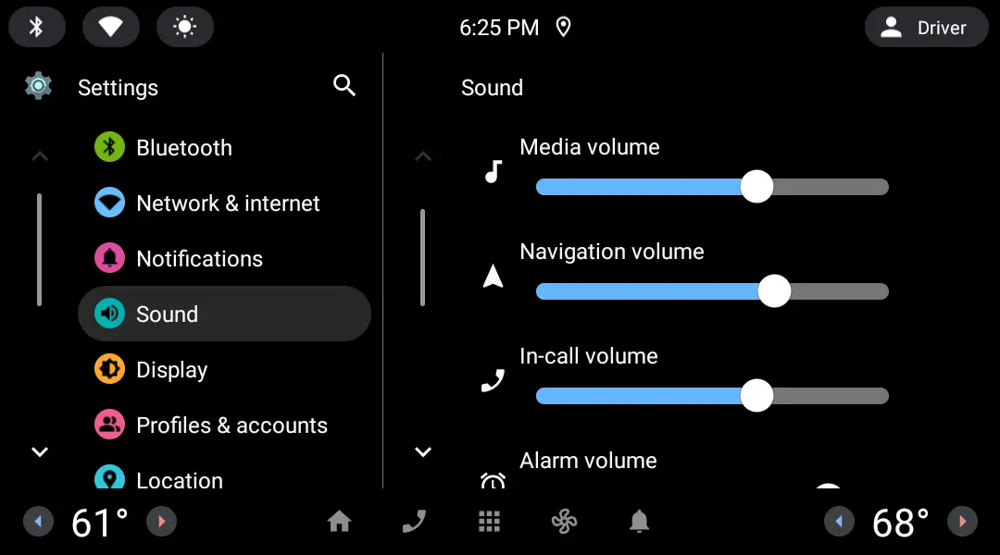
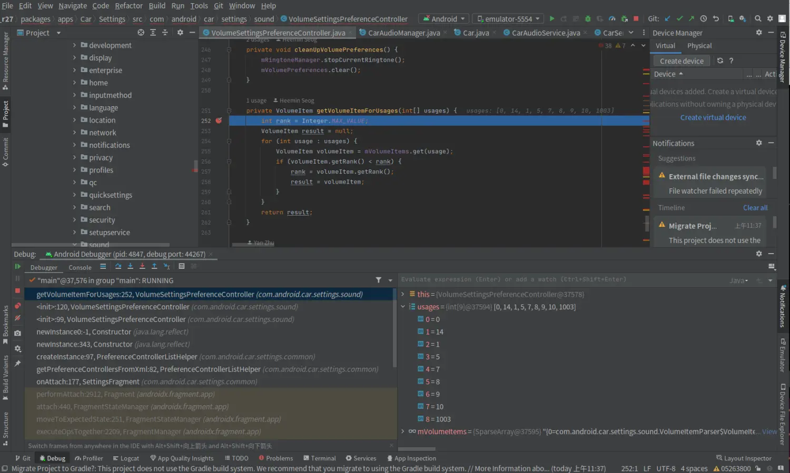
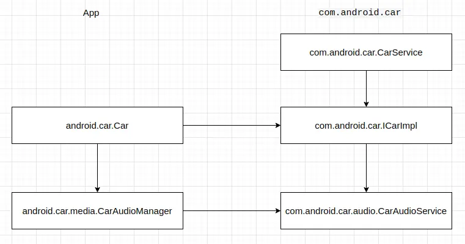

Android Automotive OS (AAOS) 是在核心 Android 系统的基础之上打造而成，以支持将 Android 系统用作车辆信息娱乐系统的场景。AAOS 的音频系统对核心 Android 音频系统做了扩充，创建了新的概念和抽象，如音区等，提供了新的 API 接口，添加了的新的服务，以支持智能座舱的特殊需要。Google Android 官方文档 [Automotive](https://source.android.com/docs/devices/automotive?hl=zh-cn) 和 [车载音频](https://source.android.com/docs/devices/automotive/audio?hl=zh-cn) 提供了对 AAOS 系统架构和 AAOS 音频子系统架构的清晰而权威描述。

这里从 AAOS 的系统应用 Settings 中调节音量的部分入手，来看下 AAOS 中调节音量操作的实现。即 Settings 系统应用 UI 中如下的这个部分：



下文中的代码分析基于 android-12.1.0_r27 版进行。

## 在 App 中调节音量

AAOS 实现了不同于手机版和平板版的 Settings 系统应用，其代码位于 *packages/apps/Car/Settings*。声音设置相关逻辑的代码入口为 `VolumeSettingsPreferenceController` (*packages/apps/Car/Settings/src/com/android/car/settings/sound/VolumeSettingsPreferenceController.java*)。当用户点击左边的 **Sound** 项时，`VolumeSettingsPreferenceController` 对象被创建，在该对象创建过程中，做了如下这些事：

1. 从 `Car` 获得 `CarAudioManager`；
2. 加载配置文件中描述的所有音量项，每个音量项描述一个音量组的信息；
3. 从 `CarAudioManager` 获得主音区中音量组的个数；
4. 对于音区中的每个音量组，从 `CarAudioManager` 获得音量组的 usage 信息，并根据 usage 信息，获得对应的音量项，之后根据获得的关于音量组的所有信息，为音量组创建 `VolumeSeekBarPreference`，也就是我们在 UI 中看到的一个拖动音量调节项，音量调节在这里针对某个音区中的某个音量组进行；
5. 向 `CarAudioManager` 注册音量变动回调，监听系统的音量变化事件。Settings 系统应用本身或其它应用调节了音量之后，这里的回调被调用，以最终更新 UI。

上面所述过程的具体代码如下：
```
    public VolumeSettingsPreferenceController(Context context, String preferenceKey,
            FragmentController fragmentController,
            CarUxRestrictions uxRestrictions) {
        this(context, preferenceKey, fragmentController, uxRestrictions, Car.createCar(context),
                new VolumeSettingsRingtoneManager(context));
    }

    @VisibleForTesting
    VolumeSettingsPreferenceController(Context context, String preferenceKey,
            FragmentController fragmentController,
            CarUxRestrictions uxRestrictions, Car car,
            VolumeSettingsRingtoneManager ringtoneManager) {
        super(context, preferenceKey, fragmentController, uxRestrictions);
        mCar = car;
        mRingtoneManager = ringtoneManager;
        mVolumeItems = VolumeItemParser.loadAudioUsageItems(context, carVolumeItemsXml());
        mUiHandler = new Handler(Looper.getMainLooper());

        mCarAudioManager = (CarAudioManager) mCar.getCarManager(Car.AUDIO_SERVICE);
        if (mCarAudioManager != null) {
            int volumeGroupCount = mCarAudioManager.getVolumeGroupCount();
            cleanUpVolumePreferences();
            // Populates volume slider items from volume groups to UI.
            for (int groupId = 0; groupId < volumeGroupCount; groupId++) {
                VolumeItem volumeItem = getVolumeItemForUsages(
                        mCarAudioManager.getUsagesForVolumeGroupId(groupId));
                VolumeSeekBarPreference volumePreference = createVolumeSeekBarPreference(
                        groupId, volumeItem.getUsage(), volumeItem.getIcon(),
                        volumeItem.getMuteIcon(), volumeItem.getTitle());
                setClickableWhileDisabled(volumePreference, /* clickable= */ true, p -> {
                    if (hasUserRestrictionByDpm(getContext(), DISALLOW_ADJUST_VOLUME)) {
                        showActionDisabledByAdminDialog();
                    } else {
                        Toast.makeText(getContext(),
                                getContext().getString(R.string.action_unavailable),
                                Toast.LENGTH_LONG).show();
                    }
                });
                mVolumePreferences.add(volumePreference);
            }
            mCarAudioManager.registerCarVolumeCallback(mVolumeChangeCallback);
        }
    }
```

上面第 2 步中，我们提到的配置文件为 *car_volume_items.xml*：
```
    @XmlRes
    @VisibleForTesting
    int carVolumeItemsXml() {
        return R.xml.car_volume_items;
    }
```

**car_volume_items.xml** 配置文件位于 *packages/apps/Car/Settings/res/xml/car_volume_items.xml*，其内容为：
```
<?xml version="1.0" encoding="utf-8"?>
<!--
    Copyright 2018 The Android Open Source Project

    Licensed under the Apache License, Version 2.0 (the "License");
    you may not use this file except in compliance with the License.
    You may obtain a copy of the License at

         http://www.apache.org/licenses/LICENSE-2.0

    Unless required by applicable law or agreed to in writing, software
    distributed under the License is distributed on an "AS IS" BASIS,
    WITHOUT WARRANTIES OR CONDITIONS OF ANY KIND, either express or implied.
    See the License for the specific language governing permissions and
    limitations under the License.
-->

<!--
  Defines all possible items on car volume settings UI, keyed by usage.

  This enables the CarSettings UI to associate VolumeGroups surfaced by
  CarAudioManager.getVolumeGroupCount with renderable assets (ie: title, icon)
  for presentation.

  Order matters in this configuration. If one volume group contains multiple
  audio usages, the first one appears in this file would be picked to be
  presented on UI.

  When overriding this configuration, please consult also the
  car_volume_groups.xml, which is read by car audio service.
-->
<carVolumeItems xmlns:car="http://schemas.android.com/apk/res-auto">
    <item
        car:icon="@drawable/car_ic_phone_volume"
        car:mute_icon="@drawable/car_ic_phone_volume_mute"
        car:titleText="@*android:string/volume_call"
        car:usage="voice_communication"/>
    <item
        car:icon="@drawable/car_ic_phone_volume"
        car:mute_icon="@drawable/car_ic_phone_volume_mute"
        car:titleText="@*android:string/volume_call"
        car:usage="voice_communication_signalling"/>
    <item
        car:icon="@*android:drawable/ic_audio_media"
        car:mute_icon="@*android:drawable/ic_audio_media_mute"
        car:titleText="@*android:string/volume_music"
        car:usage="media"/>
    <item
        car:icon="@*android:drawable/ic_audio_media"
        car:mute_icon="@*android:drawable/ic_audio_media_mute"
        car:titleText="@*android:string/volume_music"
        car:usage="game"/>
    <item
        car:icon="@*android:drawable/ic_audio_alarm"
        car:mute_icon="@*android:drawable/ic_audio_alarm_mute"
        car:titleText="@*android:string/volume_alarm"
        car:usage="alarm"/>
    <item
        car:icon="@drawable/car_ic_navigation"
        car:mute_icon="@drawable/car_ic_navigation_mute"
        car:titleText="@string/navi_volume_title"
        car:usage="assistance_navigation_guidance"/>
    <item
        car:icon="@*android:drawable/ic_audio_ring_notif"
        car:mute_icon="@*android:drawable/ic_audio_ring_notif_mute"
        car:titleText="@*android:string/volume_ringtone"
        car:usage="notification_ringtone"/>
    <item
        car:icon="@*android:drawable/ic_audio_vol"
        car:mute_icon="@*android:drawable/ic_audio_vol_mute"
        car:titleText="@*android:string/volume_unknown"
        car:usage="assistant"/>
    <item
        car:icon="@*android:drawable/ic_audio_ring_notif"
        car:mute_icon="@*android:drawable/ic_audio_ring_notif_mute"
        car:titleText="@*android:string/volume_notification"
        car:usage="notification"/>
    <item
        car:icon="@*android:drawable/ic_audio_ring_notif"
        car:mute_icon="@*android:drawable/ic_audio_ring_notif_mute"
        car:titleText="@*android:string/volume_notification"
        car:usage="notification_communication_request"/>
    <item
        car:icon="@*android:drawable/ic_audio_ring_notif"
        car:mute_icon="@*android:drawable/ic_audio_ring_notif_mute"
        car:titleText="@*android:string/volume_notification"
        car:usage="notification_communication_instant"/>
    <item
        car:icon="@*android:drawable/ic_audio_ring_notif"
        car:mute_icon="@*android:drawable/ic_audio_ring_notif_mute"
        car:titleText="@*android:string/volume_notification"
        car:usage="notification_communication_delayed"/>
    <item
        car:icon="@*android:drawable/ic_audio_ring_notif"
        car:mute_icon="@*android:drawable/ic_audio_ring_notif_mute"
        car:titleText="@*android:string/volume_notification"
        car:usage="notification_event"/>
    <item
        car:icon="@*android:drawable/ic_audio_ring_notif"
        car:mute_icon="@*android:drawable/ic_audio_ring_notif_mute"
        car:titleText="@*android:string/volume_notification"
        car:usage="assistance_accessibility"/>
    <item
        car:icon="@*android:drawable/ic_audio_vol"
        car:mute_icon="@*android:drawable/ic_audio_vol_mute"
        car:titleText="@*android:string/volume_unknown"
        car:usage="assistance_sonification"/>
    <item
        car:icon="@*android:drawable/ic_audio_vol"
        car:mute_icon="@*android:drawable/ic_audio_vol_mute"
        car:titleText="@*android:string/volume_unknown"
        car:usage="unknown"/>
    <item
        car:icon="@*android:drawable/ic_audio_vol"
        car:mute_icon="@*android:drawable/ic_audio_vol_mute"
        car:titleText="@*android:string/volume_unknown"
        car:usage="call_assistant"/>
    <item
        car:icon="@*android:drawable/ic_audio_vol"
        car:mute_icon="@*android:drawable/ic_audio_vol_mute"
        car:titleText="@*android:string/volume_unknown"
        car:usage="emergency"/>
    <item
        car:icon="@*android:drawable/ic_audio_vol"
        car:mute_icon="@*android:drawable/ic_audio_vol_mute"
        car:titleText="@*android:string/volume_unknown"
        car:usage="safety"/>
    <item
        car:icon="@*android:drawable/ic_audio_vol"
        car:mute_icon="@*android:drawable/ic_audio_vol_mute"
        car:titleText="@*android:string/volume_unknown"
        car:usage="vehicle_status"/>
    <item
        car:icon="@*android:drawable/ic_audio_vol"
        car:mute_icon="@*android:drawable/ic_audio_vol_mute"
        car:titleText="@*android:string/volume_unknown"
        car:usage="announcement"/>
</carVolumeItems>
```

*car_volume_items.xml* 文件的 item 针对于特定 usage，而不包含任何关于音区和音量组的任何信息，音量组通过其 usage 与音量项关联起来，其中 usage 与 `AudioAttributes.USAGE_*` 对齐。`VolumeItemParser` 解析 xml 资源文件，并创建 `VolumeItemParser.VolumeItem` 列表：
```
package com.android.car.settings.sound;

import android.content.Context;
import android.content.res.TypedArray;
import android.content.res.XmlResourceParser;
import android.media.AudioAttributes;
import android.util.AttributeSet;
import android.util.SparseArray;
import android.util.Xml;

import androidx.annotation.DrawableRes;
import androidx.annotation.StringRes;
import androidx.annotation.XmlRes;

import com.android.car.settings.R;
import com.android.car.settings.common.Logger;

import org.xmlpull.v1.XmlPullParserException;

import java.io.IOException;

/**
 * Parses the xml file which specifies which Audio usages should be considered by sound settings.
 */
public class VolumeItemParser {
    private static final Logger LOG = new Logger(VolumeItemParser.class);

    private static final String XML_TAG_VOLUME_ITEMS = "carVolumeItems";
    private static final String XML_TAG_VOLUME_ITEM = "item";

    /**
     * Parses the volume items listed in the xml resource provided. This is returned as a sparse
     * array which is keyed by the rank (the order in which the volume item appears in the xml
     * resrouce).
     */
    public static SparseArray<VolumeItem> loadAudioUsageItems(Context context,
            @XmlRes int volumeItemsXml) {
        SparseArray<VolumeItem> volumeItems = new SparseArray<>();
        try (XmlResourceParser parser = context.getResources().getXml(volumeItemsXml)) {
            AttributeSet attrs = Xml.asAttributeSet(parser);
            int type;
            // Traverse to the first start tag.
            while ((type = parser.next()) != XmlResourceParser.END_DOCUMENT
                    && type != XmlResourceParser.START_TAG) {
                continue;
            }

            if (!XML_TAG_VOLUME_ITEMS.equals(parser.getName())) {
                throw new RuntimeException("Meta-data does not start with carVolumeItems tag");
            }
            int outerDepth = parser.getDepth();
            int rank = 0;
            while ((type = parser.next()) != XmlResourceParser.END_DOCUMENT
                    && (type != XmlResourceParser.END_TAG || parser.getDepth() > outerDepth)) {
                if (type == XmlResourceParser.END_TAG) {
                    continue;
                }
                if (XML_TAG_VOLUME_ITEM.equals(parser.getName())) {
                    TypedArray item = context.getResources().obtainAttributes(
                            attrs, R.styleable.carVolumeItems_item);
                    int usage = item.getInt(R.styleable.carVolumeItems_item_usage, -1);
                    if (usage >= 0) {
                        volumeItems.put(usage, new VolumeItemParser.VolumeItem(
                                usage, rank,
                                item.getResourceId(R.styleable.carVolumeItems_item_titleText, 0),
                                item.getResourceId(R.styleable.carVolumeItems_item_icon, 0),
                                item.getResourceId(R.styleable.carVolumeItems_item_mute_icon, 0)));
                        rank++;
                    }
                    item.recycle();
                }
            }
        } catch (XmlPullParserException | IOException e) {
            LOG.e("Error parsing volume groups configuration", e);
        }
        return volumeItems;
    }

    /**
     * Wrapper class which contains information to render volume item on UI.
     */
    public static class VolumeItem {
        @AudioAttributes.AttributeUsage
        private final int mUsage;
        private final int mRank;
        @StringRes
        private final int mTitle;
        @DrawableRes
        private final int mIcon;
        @DrawableRes
        private final int mMuteIcon;

        /** Constructs the VolumeItem container with the given values. */
        public VolumeItem(@AudioAttributes.AttributeUsage int usage, int rank,
                @StringRes int title, @DrawableRes int icon, @DrawableRes int muteIcon) {
            mUsage = usage;
            mRank = rank;
            mTitle = title;
            mIcon = icon;
            mMuteIcon = muteIcon;
        }

        /**
         * Usage is used to represent what purpose the sound is used for. The values should be
         * defined within AudioAttributes.USAGE_*.
         */
        public int getUsage() {
            return mUsage;
        }

        /**
         * Rank represents the order in which the usage appears in
         * {@link R.xml#car_volume_items}. This order is used to determine which title and icon
         * should be used for each audio group. The lowest rank has the highest precedence.
         */
        public int getRank() {
            return mRank;
        }

        /** Title which should be used for the seek bar preference. */
        public int getTitle() {
            return mTitle;
        }

        /** Icon which should be used for the seek bar preference. */
        public int getIcon() {
            return mIcon;
        }

        /** Icon which should be used for the seek bar preference when muted. */
        public int getMuteIcon() {
            return mMuteIcon;
        }
    }
}
```

通过 `CarAudioManager` 获得的示例音量组 usage 信息如下：


根据音量组的 usage 查找音量项的过程为，找到各个 usage 的音量项中排序最靠前的那个：
```
    private VolumeItem getVolumeItemForUsages(int[] usages) {
        int rank = Integer.MAX_VALUE;
        VolumeItem result = null;
        for (int usage : usages) {
            VolumeItem volumeItem = mVolumeItems.get(usage);
            if (volumeItem.getRank() < rank) {
                rank = volumeItem.getRank();
                result = volumeItem;
            }
        }
        return result;
    }
```

**后面我们再来了解通过 `CarAudioManager` 获得主音区中音量组的个数，以及获得某个音区的特定音量组的 usage 的过程。**

为音量组创建 `VolumeSeekBarPreference`，也会定义用户调节音量时要执行的动作：
```
    private VolumeSeekBarPreference createVolumeSeekBarPreference(
            int volumeGroupId, int usage, @DrawableRes int primaryIconResId,
            @DrawableRes int secondaryIconResId, @StringRes int titleId) {
        VolumeSeekBarPreference preference = new VolumeSeekBarPreference(getContext());
        preference.setTitle(getContext().getString(titleId));
        preference.setUnMutedIcon(getContext().getDrawable(primaryIconResId));
        preference.getUnMutedIcon().setTintList(
                getContext().getColorStateList(R.color.icon_color_default));
        preference.setMutedIcon(getContext().getDrawable(secondaryIconResId));
        preference.getMutedIcon().setTintList(
                getContext().getColorStateList(R.color.icon_color_default));
        try {
            preference.setValue(mCarAudioManager.getGroupVolume(volumeGroupId));
            preference.setMin(mCarAudioManager.getGroupMinVolume(volumeGroupId));
            preference.setMax(mCarAudioManager.getGroupMaxVolume(volumeGroupId));
            if (mCarAudioManager.isAudioFeatureEnabled(AUDIO_FEATURE_VOLUME_GROUP_MUTING)) {
                preference.setIsMuted(mCarAudioManager.isVolumeGroupMuted(PRIMARY_AUDIO_ZONE,
                        volumeGroupId));
            }
        } catch (CarNotConnectedException e) {
            LOG.e("Car is not connected!", e);
        }
        preference.setContinuousUpdate(true);
        preference.setShowSeekBarValue(false);
        Bundle bundle = preference.getExtras();
        bundle.putInt(VOLUME_GROUP_KEY, volumeGroupId);
        bundle.putInt(VOLUME_USAGE_KEY, usage);
        preference.setOnPreferenceChangeListener((pref, newValue) -> {
            int prefGroup = pref.getExtras().getInt(VOLUME_GROUP_KEY);
            int prefUsage = pref.getExtras().getInt(VOLUME_USAGE_KEY);
            int newVolume = (Integer) newValue;
            setGroupVolume(prefGroup, newVolume);
            mRingtoneManager.playAudioFeedback(prefGroup, prefUsage);
            return true;
        });
        return preference;
    }
```

为音量组创建 `VolumeSeekBarPreference` 时，会根据音量项为它设置标题，图标等，并从 `CarAudioManager` 获得音量组的音量值及其取之范围。从为 `VolumeSeekBarPreference` 设置的回调 (`setOnPreferenceChangeListener()`) 可以看到，在用户调整音量时，实际会执行的动作。具体来说，主要是通过 `CarAudioManager` 设置音区的音量组中的 usage 的音量，并播放铃声：
```
    private void setGroupVolume(int volumeGroupId, int newVolume) {
        try {
            mCarAudioManager.setGroupVolume(volumeGroupId, newVolume, /* flags= */ 0);
        } catch (CarNotConnectedException e) {
            LOG.w("Ignoring volume change event because the car isn't connected", e);
        }
    }
```

***这里可以看到，Settings 仅能用于调整主音区中各个音量组的音量。当多屏多音区时，Settings 可能需要多开，可能需要能够调整不同音区的音量。此时是否需要有某种机制，传参数给 Settings 以支持多音区的音量调整？？？***

## `Car` 和 `CarAudioManager`

上面我们看到 Settings 从 `Car` 获得了 `CarAudioManager`，后续从 `CarAudioManager` 获得音区和音量组的信息，并通过 `CarAudioManager` 设置音量组的 usage 的音量。`Car` 通过 `Car.createCar(context)` 创建，它主要是 "car_service" 服务的客户端代理。"car_service" binder 服务运行于 `com.android.car` 进程中，它的生命周期受同进程中的 `Service` 组件 `CarService` 的管理。当 `CarService` 创建时，"car_service" binder 服务对象被创建，并被注册进 service manager 中，如 (*packages/services/Car/service/src/com/android/car/CarService.java*)：
```
    @Override
    public void onCreate() {
        LimitedTimingsTraceLog initTiming = new LimitedTimingsTraceLog(CAR_SERVICE_INIT_TIMING_TAG,
                Trace.TRACE_TAG_SYSTEM_SERVER, CAR_SERVICE_INIT_TIMING_MIN_DURATION_MS);
        initTiming.traceBegin("CarService.onCreate");

        initTiming.traceBegin("getVehicle");
        mVehicle = getVehicle();
        initTiming.traceEnd();

        EventLog.writeEvent(EventLogTags.CAR_SERVICE_CREATE, mVehicle == null ? 0 : 1);

        if (mVehicle == null) {
            throw new IllegalStateException("Vehicle HAL service is not available.");
        }
        try {
            mVehicleInterfaceName = mVehicle.interfaceDescriptor();
        } catch (RemoteException e) {
            throw new IllegalStateException("Unable to get Vehicle HAL interface descriptor", e);
        }

        Slog.i(CarLog.TAG_SERVICE, "Connected to " + mVehicleInterfaceName);
        EventLog.writeEvent(EventLogTags.CAR_SERVICE_CONNECTED, mVehicleInterfaceName);

        mICarImpl = new ICarImpl(this,
                mVehicle,
                SystemInterface.Builder.defaultSystemInterface(this).build(),
                mVehicleInterfaceName);
        mICarImpl.init();

        linkToDeath(mVehicle, mVehicleDeathRecipient);

        ServiceManager.addService("car_service", mICarImpl);
        SystemProperties.set("boot.car_service_created", "1");

        super.onCreate();

        initTiming.traceEnd(); // "CarService.onCreate"
    }
```

`Car.createCar(context)` 创建 `Car` 时：

 * 首先尝试从 ServiceManager 获得 "car_service" 服务，然后创建 `Car` 对象，如果 "car_service" 服务获取成功，则调用 `car.startCarService()` 绑定 `Service` 组件 `CarService`，以防止 "car_service" 服务意外由于其它进程或组件的动作，`Service` 组件 `CarService` 生命周期结束，而被销毁掉，并返回；
 * 如果 "car_service" 服务获取失败，则说明 `Service` 组件 `CarService` 和 "car_service" 服务可能都还没有创建，此时调用 `car.startCarService()` 绑定 `Service` 组件 `CarService`，并再次尝试从 ServiceManager 获得 "car_service" 服务，之后为 "car_service" 服务创建客户端代理对象，并提供给 `Car`；
 * 从 ServiceManager 获得 "car_service" 服务可能会尝试执行多次。

上述过程详细执行 (*packages/services/Car/car-lib/src/android/car/Car.java*) 如下：
```
    /**
     * Creates new {@link Car} object which connected synchronously to Car Service and ready to use.
     *
     * <p>Instance created with this should be disconnected from car service by calling
     * {@link #disconnect()} before the passed {code Context} is released.
     *
     * @param context application's context
     *
     * @return Car object if operation succeeded, otherwise null.
     */
    @Nullable
    public static Car createCar(Context context) {
        return createCar(context, (Handler) null);
    }

    /**
     * Creates new {@link Car} object which connected synchronously to Car Service and ready to use.
     *
     * <p>Instance created with this should be disconnected from car service by calling
     * {@link #disconnect()} before the passed {code Context} is released.
     *
     * @param context App's Context. This should not be null. If you are passing
     *                {@link ContextWrapper}, make sure that its base Context is non-null as well.
     *                Otherwise it will throw {@link java.lang.NullPointerException}.
     * @param handler the handler on which the manager's callbacks will be executed, or null to
     * execute on the application's main thread.
     *
     * @return Car object if operation succeeded, otherwise null.
     */
    @Nullable
    public static Car createCar(Context context, @Nullable Handler handler) {
        assertNonNullContext(context);
        Car car = null;
        IBinder service = null;
        boolean started = false;
        int retryCount = 0;
        while (true) {
            service = ServiceManager.getService(CAR_SERVICE_BINDER_SERVICE_NAME);
            if (car == null) {
                // service can be still null. The constructor is safe for null service.
                car = new Car(context, ICar.Stub.asInterface(service),
                        null /*serviceConnectionListener*/, null /*statusChangeListener*/, handler);
            }
            if (service != null) {
                if (!started) {  // specialization for most common case.
                    // Do this to crash client when car service crashes.
                    car.startCarService();
                    return car;
                }
                break;
            }
            if (!started) {
                car.startCarService();
                started = true;
            }
            retryCount++;
            if (retryCount > CAR_SERVICE_BINDER_POLLING_MAX_RETRY) {
                Log.e(TAG_CAR, "cannot get car_service, waited for car service (ms):"
                                + CAR_SERVICE_BINDER_POLLING_INTERVAL_MS
                                * CAR_SERVICE_BINDER_POLLING_MAX_RETRY,
                        new RuntimeException());
                return null;
            }
            try {
                Thread.sleep(CAR_SERVICE_BINDER_POLLING_INTERVAL_MS);
            } catch (InterruptedException e) {
                Log.e(CarLibLog.TAG_CAR, "interrupted while waiting for car_service",
                        new RuntimeException());
                return null;
            }
        }
        // Can be accessed from mServiceConnectionListener in main thread.
        synchronized (car) {
            if (car.mService == null) {
                car.mService = ICar.Stub.asInterface(service);
                Log.w(TAG_CAR,
                        "waited for car_service (ms):"
                                + CAR_SERVICE_BINDER_POLLING_INTERVAL_MS * retryCount,
                        new RuntimeException());
            }
            car.mConnectionState = STATE_CONNECTED;
        }
        return car;
    }
. . . . . .
    private Car(Context context, @Nullable ICar service,
            @Nullable ServiceConnection serviceConnectionListener,
            @Nullable CarServiceLifecycleListener statusChangeListener,
            @Nullable Handler handler) {
        mContext = context;
        mEventHandler = determineEventHandler(handler);
        mMainThreadEventHandler = determineMainThreadEventHandler(mEventHandler);

        mService = service;
        if (service != null) {
            mConnectionState = STATE_CONNECTED;
        } else {
            mConnectionState = STATE_DISCONNECTED;
        }
        mServiceConnectionListenerClient = serviceConnectionListener;
        mStatusChangeCallback = statusChangeListener;
        // Store construction stack so that client can get help when it crashes when car service
        // crashes.
        if (serviceConnectionListener == null && statusChangeListener == null) {
            mConstructionStack = new RuntimeException();
        } else {
            mConstructionStack = null;
        }
    }
```

上面的 `startCarService()` 绑定绑定 `Service` 组件 `CarService`：
```
    private void startCarService() {
        Intent intent = new Intent();
        intent.setPackage(CAR_SERVICE_PACKAGE);
        intent.setAction(Car.CAR_SERVICE_INTERFACE_NAME);
        boolean bound = mContext.bindServiceAsUser(intent, mServiceConnectionListener,
                Context.BIND_AUTO_CREATE, UserHandle.CURRENT_OR_SELF);
        synchronized (mLock) {
            if (!bound) {
                mConnectionRetryCount++;
                if (mConnectionRetryCount > CAR_SERVICE_BIND_MAX_RETRY) {
                    Log.w(TAG_CAR, "cannot bind to car service after max retry");
                    mMainThreadEventHandler.post(mConnectionRetryFailedRunnable);
                } else {
                    mEventHandler.postDelayed(mConnectionRetryRunnable,
                            CAR_SERVICE_BIND_RETRY_INTERVAL_MS);
                }
            } else {
                mEventHandler.removeCallbacks(mConnectionRetryRunnable);
                mMainThreadEventHandler.removeCallbacks(mConnectionRetryFailedRunnable);
                mConnectionRetryCount = 0;
                mServiceBound = true;
            }
        }
    }
```

`CarAudioManager` 主要是运行于 `com.android.car` 进程中的 `CarAudioService` 在客户端的代理对象，它的创建过程 (*packages/services/Car/car-lib/src/android/car/Car.java*) 如下：
```
    /**
     * Get car specific service as in {@link Context#getSystemService(String)}. Returned
     * {@link Object} should be type-casted to the desired service.
     * For example, to get sensor service,
     * SensorManagerService sensorManagerService = car.getCarManager(Car.SENSOR_SERVICE);
     * @param serviceName Name of service that should be created like {@link #SENSOR_SERVICE}.
     * @return Matching service manager or null if there is no such service.
     */
    @Nullable
    public Object getCarManager(String serviceName) {
        CarManagerBase manager;
        synchronized (mLock) {
            if (mService == null) {
                Log.w(TAG_CAR, "getCarManager not working while car service not ready");
                return null;
            }
            manager = mServiceMap.get(serviceName);
            if (manager == null) {
                try {
                    IBinder binder = mService.getCarService(serviceName);
                    if (binder == null) {
                        Log.w(TAG_CAR, "getCarManager could not get binder for service:"
                                + serviceName);
                        return null;
                    }
                    manager = createCarManagerLocked(serviceName, binder);
                    if (manager == null) {
                        Log.w(TAG_CAR, "getCarManager could not create manager for service:"
                                        + serviceName);
                        return null;
                    }
                    mServiceMap.put(serviceName, manager);
                } catch (RemoteException e) {
                    handleRemoteExceptionFromCarService(e);
                }
            }
        }
        return manager;
    }
 . . . . . . 
    @Nullable
    private CarManagerBase createCarManagerLocked(String serviceName, IBinder binder) {
        CarManagerBase manager = null;
        switch (serviceName) {
            case AUDIO_SERVICE:
                manager = new CarAudioManager(this, binder);
                break;
            case SENSOR_SERVICE:
                manager = new CarSensorManager(this, binder);
                break;
            case INFO_SERVICE:
                manager = new CarInfoManager(this, binder);
                break;
            case APP_FOCUS_SERVICE:
                manager = new CarAppFocusManager(this, binder);
                break;
            case PACKAGE_SERVICE:
                manager = new CarPackageManager(this, binder);
                break;
            case CAR_OCCUPANT_ZONE_SERVICE:
                manager = new CarOccupantZoneManager(this, binder);
                break;
            case CAR_NAVIGATION_SERVICE:
                manager = new CarNavigationStatusManager(this, binder);
                break;
            case CABIN_SERVICE:
                manager = new CarCabinManager(this, binder);
                break;
            case DIAGNOSTIC_SERVICE:
                manager = new CarDiagnosticManager(this, binder);
                break;
            case HVAC_SERVICE:
                manager = new CarHvacManager(this, binder);
                break;
            case POWER_SERVICE:
                manager = new CarPowerManager(this, binder);
                break;
            case PROJECTION_SERVICE:
                manager = new CarProjectionManager(this, binder);
                break;
            case PROPERTY_SERVICE:
                manager = new CarPropertyManager(this, ICarProperty.Stub.asInterface(binder));
                break;
            case VENDOR_EXTENSION_SERVICE:
                manager = new CarVendorExtensionManager(this, binder);
                break;
            case CAR_INSTRUMENT_CLUSTER_SERVICE:
                manager = new CarInstrumentClusterManager(this, binder);
                break;
            case TEST_SERVICE:
                /* CarTestManager exist in static library. So instead of constructing it here,
                 * only pass binder wrapper so that CarTestManager can be constructed outside. */
                manager = new CarTestManagerBinderWrapper(this, binder);
                break;
            case VEHICLE_MAP_SERVICE:
                manager = new VmsClientManager(this, binder);
                break;
            case VMS_SUBSCRIBER_SERVICE:
                manager = VmsSubscriberManager.wrap(this,
                        (VmsClientManager) getCarManager(VEHICLE_MAP_SERVICE));
                break;
            case BLUETOOTH_SERVICE:
                manager = new CarBluetoothManager(this, binder);
                break;
            case STORAGE_MONITORING_SERVICE:
                manager = new CarStorageMonitoringManager(this, binder);
                break;
            case CAR_DRIVING_STATE_SERVICE:
                manager = new CarDrivingStateManager(this, binder);
                break;
            case CAR_UX_RESTRICTION_SERVICE:
                manager = new CarUxRestrictionsManager(this, binder);
                break;
            case OCCUPANT_AWARENESS_SERVICE:
                manager = new OccupantAwarenessManager(this, binder);
                break;
            case CAR_MEDIA_SERVICE:
                manager = new CarMediaManager(this, binder);
                break;
            case CAR_BUGREPORT_SERVICE:
                manager = new CarBugreportManager(this, binder);
                break;
            case CAR_USER_SERVICE:
                manager = new CarUserManager(this, binder);
                break;
            case CAR_WATCHDOG_SERVICE:
                manager = new CarWatchdogManager(this, binder);
                break;
            case CAR_INPUT_SERVICE:
                manager = new CarInputManager(this, binder);
                break;
            case CAR_DEVICE_POLICY_SERVICE:
                manager = new CarDevicePolicyManager(this, binder);
                break;
            case CLUSTER_HOME_SERVICE:
                manager = new ClusterHomeManager(this, binder);
                break;
            case CAR_EVS_SERVICE:
                manager = new CarEvsManager(this, binder);
                break;
            case CAR_TELEMETRY_SERVICE:
                manager = new CarTelemetryManager(this, binder);
                break;
            case CAR_ACTIVITY_SERVICE:
                manager = new CarActivityManager(this, binder);
                break;
            default:
                // Experimental or non-existing
                String className = null;
                try {
                    className = mService.getCarManagerClassForFeature(serviceName);
                } catch (RemoteException e) {
                    handleRemoteExceptionFromCarService(e);
                    return null;
                }
                if (className == null) {
                    Log.e(TAG_CAR, "Cannot construct CarManager for service:" + serviceName
                            + " : no class defined");
                    return null;
                }
                manager = constructCarManager(className, binder);
                break;
        }
        return manager;
    }
```

`Car` 从 "car_service" 服务获得对应管理器的 service 的 binder 对象，并创建相应的管理器。这里还可以看到，AAOS 还是创建了不少新 service 的。

从上面的 `CarService` 代码，可以看到 "car_service" 服务的实现为 `com.android.car.ICarImpl` (*packages/services/Car/service/src/com/android/car/ICarImpl.java*)，从中可以看到获取具体服务的逻辑：
```
    @Override
    public IBinder getCarService(String serviceName) {
        if (!mFeatureController.isFeatureEnabled(serviceName)) {
            Slog.w(CarLog.TAG_SERVICE, "getCarService for disabled service:" + serviceName);
            return null;
        }
        switch (serviceName) {
            case Car.AUDIO_SERVICE:
                return mCarAudioService;
            case Car.APP_FOCUS_SERVICE:
                return mAppFocusService;
            case Car.PACKAGE_SERVICE:
                return mCarPackageManagerService;
            case Car.DIAGNOSTIC_SERVICE:
                assertAnyDiagnosticPermission(mContext);
                return mCarDiagnosticService;
            case Car.POWER_SERVICE:
                return mCarPowerManagementService;
            case Car.CABIN_SERVICE:
            case Car.HVAC_SERVICE:
            case Car.INFO_SERVICE:
            case Car.PROPERTY_SERVICE:
            case Car.SENSOR_SERVICE:
            case Car.VENDOR_EXTENSION_SERVICE:
                return mCarPropertyService;
            case Car.CAR_NAVIGATION_SERVICE:
                assertNavigationManagerPermission(mContext);
                return mClusterNavigationService;
            case Car.CAR_INSTRUMENT_CLUSTER_SERVICE:
                assertClusterManagerPermission(mContext);
                return mInstrumentClusterService.getManagerService();
            case Car.PROJECTION_SERVICE:
                return mCarProjectionService;
            case Car.VEHICLE_MAP_SERVICE:
                assertAnyVmsPermission(mContext);
                return mVmsBrokerService;
            case Car.VMS_SUBSCRIBER_SERVICE:
                assertVmsSubscriberPermission(mContext);
                return mVmsBrokerService;
            case Car.TEST_SERVICE: {
                assertPermission(mContext, Car.PERMISSION_CAR_TEST_SERVICE);
                synchronized (mLock) {
                    if (mCarTestService == null) {
                        mCarTestService = new CarTestService(mContext, this);
                    }
                    return mCarTestService;
                }
            }
            case Car.BLUETOOTH_SERVICE:
                return mCarBluetoothService;
            case Car.STORAGE_MONITORING_SERVICE:
                assertPermission(mContext, Car.PERMISSION_STORAGE_MONITORING);
                return mCarStorageMonitoringService;
            case Car.CAR_DRIVING_STATE_SERVICE:
                assertDrivingStatePermission(mContext);
                return mCarDrivingStateService;
            case Car.CAR_UX_RESTRICTION_SERVICE:
                return mCarUXRestrictionsService;
            case Car.OCCUPANT_AWARENESS_SERVICE:
                return mOccupantAwarenessService;
            case Car.CAR_MEDIA_SERVICE:
                return mCarMediaService;
            case Car.CAR_OCCUPANT_ZONE_SERVICE:
                return mCarOccupantZoneService;
            case Car.CAR_BUGREPORT_SERVICE:
                return mCarBugreportManagerService;
            case Car.CAR_USER_SERVICE:
                return mCarUserService;
            case Car.CAR_WATCHDOG_SERVICE:
                return mCarWatchdogService;
            case Car.CAR_INPUT_SERVICE:
                return mCarInputService;
            case Car.CAR_DEVICE_POLICY_SERVICE:
                return mCarDevicePolicyService;
            case Car.CLUSTER_HOME_SERVICE:
                return mClusterHomeService;
            case Car.CAR_EVS_SERVICE:
                return mCarEvsService;
            case Car.CAR_TELEMETRY_SERVICE:
                return mCarTelemetryService;
            case Car.CAR_ACTIVITY_SERVICE:
                return mCarActivityService;
            default:
                IBinder service = null;
                if (mCarExperimentalFeatureServiceController != null) {
                    service = mCarExperimentalFeatureServiceController.getCarService(serviceName);
                }
                if (service == null) {
                    Slog.w(CarLog.TAG_SERVICE, "getCarService for unknown service:"
                            + serviceName);
                }
                return service;
        }
    }
```

总结一下，`Car` 主要是运行于 `com.android.car` 进程中的 "car_service" 服务在客户端的代理对象，`CarAudioManager` 则主要是运行于相同进程中的 `CarAudioService` 服务在客户端的代理对象。尽管通过 `Car` 创建 `CarAudioManager` 传入的服务名称，与通过 `Context` 的 `getSystemService()` 获得 `AudioManager` 时传入的服务名称相同，但它们是完全不同的服务。如下图：



## `CarAudioManager` 的音频操作

这里来看一下 `CarAudioManager` 的音频操作的实现 (*packages/services/Car/car-lib/src/android/car/media/CarAudioManager.java*)：
```
    private final ICarVolumeCallback mCarVolumeCallbackImpl =
            new android.car.media.ICarVolumeCallback.Stub() {
        @Override
        public void onGroupVolumeChanged(int zoneId, int groupId, int flags) {
            mEventHandler.dispatchOnGroupVolumeChanged(zoneId, groupId, flags);
        }

        @Override
        public void onGroupMuteChanged(int zoneId, int groupId, int flags) {
            mEventHandler.dispatchOnGroupMuteChanged(zoneId, groupId, flags);
        }

        @Override
        public void onMasterMuteChanged(int zoneId, int flags) {
            mEventHandler.dispatchOnMasterMuteChanged(zoneId, flags);
        }
    };
 . . . . . .
    /**
     * Sets the volume index for a volume group in primary zone.
     *
     * @see {@link #setGroupVolume(int, int, int, int)}
     * @hide
     */
    @SystemApi
    @RequiresPermission(Car.PERMISSION_CAR_CONTROL_AUDIO_VOLUME)
    public void setGroupVolume(int groupId, int index, int flags) {
        setGroupVolume(PRIMARY_AUDIO_ZONE, groupId, index, flags);
    }

    /**
     * Sets the volume index for a volume group.
     *
     * @param zoneId The zone id whose volume group is affected.
     * @param groupId The volume group id whose volume index should be set.
     * @param index The volume index to set. See
     *            {@link #getGroupMaxVolume(int, int)} for the largest valid value.
     * @param flags One or more flags (e.g., {@link android.media.AudioManager#FLAG_SHOW_UI},
     *              {@link android.media.AudioManager#FLAG_PLAY_SOUND})
     * @hide
     */
    @SystemApi
    @RequiresPermission(Car.PERMISSION_CAR_CONTROL_AUDIO_VOLUME)
    public void setGroupVolume(int zoneId, int groupId, int index, int flags) {
        try {
            mService.setGroupVolume(zoneId, groupId, index, flags);
        } catch (RemoteException e) {
            handleRemoteExceptionFromCarService(e);
        }
    }

    /**
     * Returns the maximum volume index for a volume group in primary zone.
     *
     * @see {@link #getGroupMaxVolume(int, int)}
     * @hide
     */
    @SystemApi
    @RequiresPermission(Car.PERMISSION_CAR_CONTROL_AUDIO_VOLUME)
    public int getGroupMaxVolume(int groupId) {
        return getGroupMaxVolume(PRIMARY_AUDIO_ZONE, groupId);
    }

    /**
     * Returns the maximum volume index for a volume group.
     *
     * @param zoneId The zone id whose volume group is queried.
     * @param groupId The volume group id whose maximum volume index is returned.
     * @return The maximum valid volume index for the given group.
     * @hide
     */
    @SystemApi
    @RequiresPermission(Car.PERMISSION_CAR_CONTROL_AUDIO_VOLUME)
    public int getGroupMaxVolume(int zoneId, int groupId) {
        try {
            return mService.getGroupMaxVolume(zoneId, groupId);
        } catch (RemoteException e) {
            return handleRemoteExceptionFromCarService(e, 0);
        }
    }

    /**
     * Returns the minimum volume index for a volume group in primary zone.
     *
     * @see {@link #getGroupMinVolume(int, int)}
     * @hide
     */
    @SystemApi
    @RequiresPermission(Car.PERMISSION_CAR_CONTROL_AUDIO_VOLUME)
    public int getGroupMinVolume(int groupId) {
        return getGroupMinVolume(PRIMARY_AUDIO_ZONE, groupId);
    }

    /**
     * Returns the minimum volume index for a volume group.
     *
     * @param zoneId The zone id whose volume group is queried.
     * @param groupId The volume group id whose minimum volume index is returned.
     * @return The minimum valid volume index for the given group, non-negative
     * @hide
     */
    @SystemApi
    @RequiresPermission(Car.PERMISSION_CAR_CONTROL_AUDIO_VOLUME)
    public int getGroupMinVolume(int zoneId, int groupId) {
        try {
            return mService.getGroupMinVolume(zoneId, groupId);
        } catch (RemoteException e) {
            return handleRemoteExceptionFromCarService(e, 0);
        }
    }

    /**
     * Returns the current volume index for a volume group in primary zone.
     *
     * @see {@link #getGroupVolume(int, int)}
     * @hide
     */
    @SystemApi
    @RequiresPermission(Car.PERMISSION_CAR_CONTROL_AUDIO_VOLUME)
    public int getGroupVolume(int groupId) {
        return getGroupVolume(PRIMARY_AUDIO_ZONE, groupId);
    }

    /**
     * Returns the current volume index for a volume group.
     *
     * @param zoneId The zone id whose volume groups is queried.
     * @param groupId The volume group id whose volume index is returned.
     * @return The current volume index for the given group.
     *
     * @see #getGroupMaxVolume(int, int)
     * @see #setGroupVolume(int, int, int, int)
     * @hide
     */
    @SystemApi
    @RequiresPermission(Car.PERMISSION_CAR_CONTROL_AUDIO_VOLUME)
    public int getGroupVolume(int zoneId, int groupId) {
        try {
            return mService.getGroupVolume(zoneId, groupId);
        } catch (RemoteException e) {
            return handleRemoteExceptionFromCarService(e, 0);
        }
    }
 . . . . . .
    /**
     * Gets the count of available volume groups in primary zone.
     *
     * @see {@link #getVolumeGroupCount(int)}
     * @hide
     */
    @SystemApi
    @RequiresPermission(Car.PERMISSION_CAR_CONTROL_AUDIO_VOLUME)
    public int getVolumeGroupCount() {
        return getVolumeGroupCount(PRIMARY_AUDIO_ZONE);
    }

    /**
     * Gets the count of available volume groups in the system.
     *
     * @param zoneId The zone id whois count of volume groups is queried.
     * @return Count of volume groups
     * @hide
     */
    @SystemApi
    @RequiresPermission(Car.PERMISSION_CAR_CONTROL_AUDIO_VOLUME)
    public int getVolumeGroupCount(int zoneId) {
        try {
            return mService.getVolumeGroupCount(zoneId);
        } catch (RemoteException e) {
            return handleRemoteExceptionFromCarService(e, 0);
        }
    }
 . . . . . .
    /**
     * Gets array of {@link AudioAttributes} usages for a volume group in primary zone.
     *
     * @see {@link #getUsagesForVolumeGroupId(int, int)}
     * @hide
     */
    @SystemApi
    @RequiresPermission(Car.PERMISSION_CAR_CONTROL_AUDIO_VOLUME)
    public @NonNull int[] getUsagesForVolumeGroupId(int groupId) {
        return getUsagesForVolumeGroupId(PRIMARY_AUDIO_ZONE, groupId);
    }

    /**
     * Gets array of {@link AudioAttributes} usages for a volume group in a zone.
     *
     * @param zoneId The zone id whose volume group is queried.
     * @param groupId The volume group id whose associated audio usages is returned.
     * @return Array of {@link AudioAttributes} usages for a given volume group id
     * @hide
     */
    @SystemApi
    @RequiresPermission(Car.PERMISSION_CAR_CONTROL_AUDIO_VOLUME)
    public @NonNull int[] getUsagesForVolumeGroupId(int zoneId, int groupId) {
        try {
            return mService.getUsagesForVolumeGroupId(zoneId, groupId);
        } catch (RemoteException e) {
            return handleRemoteExceptionFromCarService(e, new int[0]);
        }
    }
 . . . . . .
    /** @hide */
    public CarAudioManager(Car car, IBinder service) {
        super(car);
        mService = ICarAudio.Stub.asInterface(service);
        mAudioManager = getContext().getSystemService(AudioManager.class);
        mCarVolumeCallbacks = new CopyOnWriteArrayList<>();
        mEventHandler = new EventHandler(getEventHandler().getLooper());
    }

    /**
     * Registers a {@link CarVolumeCallback} to receive volume change callbacks
     * @param callback {@link CarVolumeCallback} instance, can not be null
     * <p>
     * Requires permission Car.PERMISSION_CAR_CONTROL_AUDIO_VOLUME
     */
    public void registerCarVolumeCallback(@NonNull CarVolumeCallback callback) {
        Objects.requireNonNull(callback);

        if (mCarVolumeCallbacks.isEmpty()) {
            registerVolumeCallback();
        }

        mCarVolumeCallbacks.add(callback);
    }

    /**
     * Unregisters a {@link CarVolumeCallback} from receiving volume change callbacks
     * @param callback {@link CarVolumeCallback} instance previously registered, can not be null
     * <p>
     * Requires permission Car.PERMISSION_CAR_CONTROL_AUDIO_VOLUME
     */
    public void unregisterCarVolumeCallback(@NonNull CarVolumeCallback callback) {
        Objects.requireNonNull(callback);
        if (mCarVolumeCallbacks.remove(callback) && mCarVolumeCallbacks.isEmpty()) {
            unregisterVolumeCallback();
        }
    }

    private void registerVolumeCallback() {
        try {
            mService.registerVolumeCallback(mCarVolumeCallbackImpl.asBinder());
        } catch (RemoteException e) {
            Log.e(CarLibLog.TAG_CAR, "registerVolumeCallback failed", e);
        }
    }

    private void unregisterVolumeCallback() {
        try {
            mService.unregisterVolumeCallback(mCarVolumeCallbackImpl.asBinder());
        } catch (RemoteException e) {
            handleRemoteExceptionFromCarService(e);
        }
    }
```

`CarAudioManager` 的音频操作基本上最终都会转给 `CarAudioService` 执行。这里看几个音频操作在 `CarAudioService` 中的实现。

### 获得音区中音量组的个数

获得音区中音频组的个数在 `CarAudioManager` 中由 `getVolumeGroupCount()` 和 `getVolumeGroupCount(int zoneId)` 完成。在 `CarAudioService` 中实际执行的详细过程 (*packages/services/Car/service/src/com/android/car/audio/CarAudioService.java*) 如下：
```
    @GuardedBy("mImplLock")
    private SparseArray<CarAudioZone> mCarAudioZones;
 . . . . . .
    @Override
    public int getVolumeGroupCount(int zoneId) {
        synchronized (mImplLock) {
            enforcePermission(Car.PERMISSION_CAR_CONTROL_AUDIO_VOLUME);
            // For legacy stream type based volume control
            if (!mUseDynamicRouting) return CarAudioDynamicRouting.STREAM_TYPES.length;

            return getCarAudioZoneLocked(zoneId).getVolumeGroupCount();
        }
    }
 . . . . . .
    @GuardedBy("mImplLock")
    private CarAudioZone getCarAudioZoneLocked(int zoneId) {
        checkAudioZoneIdLocked(zoneId);
        return mCarAudioZones.get(zoneId);
    }
```

获取音区的音量组个数分两种情况，一是不使用动态路由的情况，此时总是返回一个固定值，即 stream type 的个数；二是使用动态路由的情况，此时 `CarAudioService` 根据音区 ID 从一组预先加载好的音区信息表中获得音区的描述信息 `CarAudioZone`，并从中获得音区中音量组的个数。

是否使用动态路由由 *config.xml* 文件中的 "audioUseDynamicRouting" 属性决定：
```
    public CarAudioService(Context context) {
        mContext = context;
        mTelephonyManager = (TelephonyManager) mContext.getSystemService(Context.TELEPHONY_SERVICE);
        mAudioManager = (AudioManager) mContext.getSystemService(Context.AUDIO_SERVICE);

        mUseDynamicRouting = mContext.getResources().getBoolean(R.bool.audioUseDynamicRouting);
```

在 *packages/services/Car/service/res/values/config.xml* 文件中这个属性的默认值为 `false`。但对于模拟器，默认值会被设备的 `device/generic/car/emulator/audio/overlay/packages/services/Car/service/res/values/config.xml` 文件覆盖为 `true`。音区的信息在 `CarAudioService` 初始化时 (`init()` -> `setupDynamicRoutingLocked()` -> `loadCarAudioZonesLocked()`) 加载：
```
    @GuardedBy("mImplLock")
    private void loadCarAudioZonesLocked() {
        List<CarAudioDeviceInfo> carAudioDeviceInfos = generateCarAudioDeviceInfos();
        AudioDeviceInfo[] inputDevices = getAllInputDevices();

        mCarAudioConfigurationPath = getAudioConfigurationPath();
        if (mCarAudioConfigurationPath != null) {
            mCarAudioZones = loadCarAudioConfigurationLocked(carAudioDeviceInfos, inputDevices);
        } else {
            mCarAudioZones =
                    loadVolumeGroupConfigurationWithAudioControlLocked(carAudioDeviceInfos,
                            inputDevices);
        }

        CarAudioZonesValidator.validate(mCarAudioZones);
    }
```

加载音区信息的过程如下：

1. 获取所有输出和输入设备的信息；
2. 获得车载音频配置文件的路径；
3. 获得了有效车载音频配置文件路径时，则从文件加载音区信息；
4. 无法获得有效车载音频配置文件路径时，则从 HAL audio control 服务加载音区信息；
5. 验证音区信息。

`CarAudioService` 从 `AudioManager` 获取输出和输入设备的信息：
```
    private List<CarAudioDeviceInfo> generateCarAudioDeviceInfos() {
        AudioDeviceInfo[] deviceInfos = mAudioManager.getDevices(
                AudioManager.GET_DEVICES_OUTPUTS);

        return Arrays.stream(deviceInfos)
                .filter(info -> info.getType() == AudioDeviceInfo.TYPE_BUS)
                .map(CarAudioDeviceInfo::new)
                .collect(Collectors.toList());
    }

    private AudioDeviceInfo[] getAllInputDevices() {
        return mAudioManager.getDevices(
                AudioManager.GET_DEVICES_INPUTS);
    }
```

`CarAudioService` 检查两个预定义的位置来查找音频配置文件的路径：
```
    // CarAudioService reads configuration from the following paths respectively.
    // If the first one is found, all others are ignored.
    // If no one is found, it fallbacks to car_volume_groups.xml resource file.
    private static final String[] AUDIO_CONFIGURATION_PATHS = new String[] {
            "/vendor/etc/car_audio_configuration.xml",
            "/system/etc/car_audio_configuration.xml"
    };
 . . . . . .
    /**
     * Read from {@link #AUDIO_CONFIGURATION_PATHS} respectively.
     * @return File path of the first hit in {@link #AUDIO_CONFIGURATION_PATHS}
     */
    @Nullable
    private String getAudioConfigurationPath() {
        for (String path : AUDIO_CONFIGURATION_PATHS) {
            File configuration = new File(path);
            if (configuration.exists()) {
                return path;
            }
        }
        return null;
    }
```

音频配置文件路径列表中的各个路径，按优先级排序，`CarAudioService` 将使用列表中最早找到的存在的文件。对于模拟器来说，不存在 */system/etc/car_audio_configuration.xml* 文件，但存在 */vendor/etc/car_audio_configuration.xml*，它来源于 *device/generic/car/emulator/audio/car_audio_configuration.xml*，这个文件的内容为：
```
<!--
  Defines the audio configuration in a car, including
    - Audio zones
    - Context to audio bus mappings
    - Volume groups
  in the car environment.
-->
<carAudioConfiguration version="2">
    <zones>
        <zone name="primary zone" isPrimary="true" occupantZoneId="0">
            <volumeGroups>
                <group>
                    <device address="bus0_media_out">
                        <context context="music"/>
                        <context context="announcement"/>
                    </device>
                    <device address="bus6_notification_out">
                        <context context="notification"/>
                    </device>
                </group>
                <group>
                    <device address="bus1_navigation_out">
                        <context context="navigation"/>
                    </device>
                    <device address="bus2_voice_command_out">
                        <context context="voice_command"/>
                    </device>
                </group>
                <group>
                    <device address="bus4_call_out">
                        <context context="call"/>
                    </device>
                    <device address="bus3_call_ring_out">
                        <context context="call_ring"/>
                    </device>
                </group>
                <group>
                    <device address="bus5_alarm_out">
                        <context context="alarm"/>
                    </device>
                    <device address="bus7_system_sound_out">
                        <context context="system_sound"/>
                        <context context="emergency"/>
                        <context context="safety"/>
                        <context context="vehicle_status"/>
                    </device>
                </group>
            </volumeGroups>
        </zone>
        <zone name="rear seat zone 1" audioZoneId="1">
            <volumeGroups>
                <group>
                    <device address="bus100_audio_zone_1">
                        <context context="music"/>
                        <context context="navigation"/>
                        <context context="voice_command"/>
                        <context context="call_ring"/>
                        <context context="call"/>
                        <context context="alarm"/>
                        <context context="notification"/>
                        <context context="system_sound"/>
                        <context context="emergency"/>
                        <context context="safety"/>
                        <context context="vehicle_status"/>
                        <context context="announcement"/>
                    </device>
                </group>
            </volumeGroups>
        </zone>
        <zone name="rear seat zone 2"  audioZoneId="2">
            <volumeGroups>
                <group>
                    <device address="bus200_audio_zone_2">
                        <context context="music"/>
                        <context context="navigation"/>
                        <context context="voice_command"/>
                        <context context="call_ring"/>
                        <context context="call"/>
                        <context context="alarm"/>
                        <context context="notification"/>
                        <context context="system_sound"/>
                        <context context="emergency"/>
                        <context context="safety"/>
                        <context context="vehicle_status"/>
                        <context context="announcement"/>
                    </device>
                </group>
            </volumeGroups>
        </zone>
    </zones>
</carAudioConfiguration>
```

`CarAudioService` 主要借助于 `CarAudioZonesHelper` 从文件中加载音区信息：
```
    @GuardedBy("mImplLock")
    private SparseArray<CarAudioZone> loadCarAudioConfigurationLocked(
            List<CarAudioDeviceInfo> carAudioDeviceInfos, AudioDeviceInfo[] inputDevices) {
        try (InputStream inputStream = new FileInputStream(mCarAudioConfigurationPath)) {
            CarAudioZonesHelper zonesHelper = new CarAudioZonesHelper(mCarAudioSettings,
                    inputStream, carAudioDeviceInfos, inputDevices, mUseCarVolumeGroupMuting);
            mAudioZoneIdToOccupantZoneIdMapping =
                    zonesHelper.getCarAudioZoneIdToOccupantZoneIdMapping();
            return zonesHelper.loadAudioZones();
        } catch (IOException | XmlPullParserException e) {
            throw new RuntimeException("Failed to parse audio zone configuration", e);
        }
    }
```

这个过程主要建立了音区、音频组和音频组的 context 和输出音频设备，以及音区及其输入设备的关联。我们前面看到的模拟器的 *car_audio_configuration.xml* 中没有定义输入设备，但 `CarAudioService` 支持为音区定义输入音频设备。对于没有在 *car_audio_configuration.xml* 中定义其所属音区的输入音频设备，会被放进主音区。描述音区的 `CarAudioZone` 的成员变量主要包括如下这些：
```
/* package */ class CarAudioZone {

    private final int mId;
    private final String mName;
    private final List<CarVolumeGroup> mVolumeGroups;
    private final Set<String> mDeviceAddresses;
    private List<AudioDeviceAttributes> mInputAudioDevice;
```

音区、音频组和音频组的 context 和输出音频设备的关联主要借助于 `CarVolumeGroup` 描述，音区及其输入设备的关联则主要借助于 `AudioDeviceAttributes` 描述。

无法获得有效车载音频配置文件路径时，通过 audio control hal 服务加载音量组信息：
```
    @GuardedBy("mImplLock")
    private SparseArray<CarAudioZone> loadVolumeGroupConfigurationWithAudioControlLocked(
            List<CarAudioDeviceInfo> carAudioDeviceInfos, AudioDeviceInfo[] inputDevices) {
        AudioControlWrapper audioControlWrapper = getAudioControlWrapperLocked();
        if (!(audioControlWrapper instanceof AudioControlWrapperV1)) {
            throw new IllegalStateException(
                    "Updated version of IAudioControl no longer supports CarAudioZonesHelperLegacy."
                    + " Please provide car_audio_configuration.xml.");
        }
        CarAudioZonesHelperLegacy legacyHelper = new CarAudioZonesHelperLegacy(mContext,
                R.xml.car_volume_groups, carAudioDeviceInfos,
                (AudioControlWrapperV1) audioControlWrapper, mCarAudioSettings, inputDevices);
        return legacyHelper.loadAudioZones();
    }
```

这时只有一个主音区，会从 `car_volume_groups.xml` 加载音量组的信息，这个加载过程主要借助于 `CarAudioZonesHelperLegacy` 完成。

`car_volume_groups.xml` 的内容要简单一些：
```
<volumeGroups xmlns:car="http://schemas.android.com/apk/res-auto"
        car:isDeprecated="true">
    <group>
        <context car:context="music"/>
        <context car:context="call_ring"/>
        <context car:context="notification"/>
        <context car:context="system_sound"/>
    </group>
    <group>
        <context car:context="navigation"/>
        <context car:context="voice_command"/>
    </group>
    <group>
        <context car:context="call"/>
    </group>
    <group>
        <context car:context="alarm"/>
    </group>
</volumeGroups>
```

`car_volume_groups.xml` 中包含各个音量组所包含的 context，从 `AudioManager` 获得的各个音频输入和输出设备信息的 address 中包含设备的总线信息，可以根据 context 从 audio control hal 服务获得它对应的总线，这样就将音量组和 context 以及对应的设备关联起来了。

有了音区及音量组信息之后，获得特定音区的音量组个数就顺理成章了。

### 获得音区的音量组的 usage

这个操作在 `CarAudioManager` 中由 `getUsagesForVolumeGroupId()` 完成：
```
    @SystemApi
    @RequiresPermission(Car.PERMISSION_CAR_CONTROL_AUDIO_VOLUME)
    public @NonNull int[] getUsagesForVolumeGroupId(int groupId) {
        return getUsagesForVolumeGroupId(PRIMARY_AUDIO_ZONE, groupId);
    }

    /**
     * Gets array of {@link AudioAttributes} usages for a volume group in a zone.
     *
     * @param zoneId The zone id whose volume group is queried.
     * @param groupId The volume group id whose associated audio usages is returned.
     * @return Array of {@link AudioAttributes} usages for a given volume group id
     * @hide
     */
    @SystemApi
    @RequiresPermission(Car.PERMISSION_CAR_CONTROL_AUDIO_VOLUME)
    public @NonNull int[] getUsagesForVolumeGroupId(int zoneId, int groupId) {
        try {
            return mService.getUsagesForVolumeGroupId(zoneId, groupId);
        } catch (RemoteException e) {
            return handleRemoteExceptionFromCarService(e, new int[0]);
        }
    }
```

这个操作在 `CarAudioService` 中的实现是这样的：
```
    @Override
    public @NonNull int[] getUsagesForVolumeGroupId(int zoneId, int groupId) {
        synchronized (mImplLock) {
            enforcePermission(Car.PERMISSION_CAR_CONTROL_AUDIO_VOLUME);

            // For legacy stream type based volume control
            if (!mUseDynamicRouting) {
                return new int[] { CarAudioDynamicRouting.STREAM_TYPE_USAGES[groupId] };
            }

            CarVolumeGroup group = getCarVolumeGroupLocked(zoneId, groupId);
            Set<Integer> contexts =
                    Arrays.stream(group.getContexts()).boxed().collect(Collectors.toSet());
            final List<Integer> usages = new ArrayList<>();
            for (@AudioContext int context : contexts) {
                int[] usagesForContext = CarAudioContext.getUsagesForContext(context);
                for (@AttributeUsage int usage : usagesForContext) {
                    usages.add(usage);
                }
            }
            return usages.stream().mapToInt(i -> i).toArray();
        }
    }
```

在 `CarAudioService` 中维护的是音区的音频组的 context 信息。在获取音区的音量组的 usage 时，先获得它的 context，再根据预先创建的映射获得 context 对应的 usage，把音量组的所有 context 对应的 usage 合并起来返回回去。

context 到 usage 的映射由 `CarAudioContext.getUsagesForContext(context)` 完成：
```
    private static final SparseArray<int[]> CONTEXT_TO_USAGES = new SparseArray<>();

    static {
        CONTEXT_TO_USAGES.put(MUSIC,
                new int[]{
                        AudioAttributes.USAGE_UNKNOWN,
                        AudioAttributes.USAGE_GAME,
                        AudioAttributes.USAGE_MEDIA
                });

        CONTEXT_TO_USAGES.put(NAVIGATION,
                new int[]{
                        AudioAttributes.USAGE_ASSISTANCE_NAVIGATION_GUIDANCE
                });

        CONTEXT_TO_USAGES.put(VOICE_COMMAND,
                new int[]{
                        AudioAttributes.USAGE_ASSISTANCE_ACCESSIBILITY,
                        AudioAttributes.USAGE_ASSISTANT
                });

        CONTEXT_TO_USAGES.put(CALL_RING,
                new int[]{
                        AudioAttributes.USAGE_NOTIFICATION_RINGTONE
                });

        CONTEXT_TO_USAGES.put(CALL,
                new int[]{
                        AudioAttributes.USAGE_VOICE_COMMUNICATION,
                        AudioAttributes.USAGE_VOICE_COMMUNICATION_SIGNALLING
                });

        CONTEXT_TO_USAGES.put(ALARM,
                new int[]{
                        AudioAttributes.USAGE_ALARM
                });

        CONTEXT_TO_USAGES.put(NOTIFICATION,
                new int[]{
                        AudioAttributes.USAGE_NOTIFICATION,
                        AudioAttributes.USAGE_NOTIFICATION_COMMUNICATION_REQUEST,
                        AudioAttributes.USAGE_NOTIFICATION_COMMUNICATION_INSTANT,
                        AudioAttributes.USAGE_NOTIFICATION_COMMUNICATION_DELAYED,
                        AudioAttributes.USAGE_NOTIFICATION_EVENT
                });

        CONTEXT_TO_USAGES.put(SYSTEM_SOUND,
                new int[]{
                        AudioAttributes.USAGE_ASSISTANCE_SONIFICATION
                });

        CONTEXT_TO_USAGES.put(EMERGENCY,
                new int[]{
                        AudioAttributes.USAGE_EMERGENCY
                });

        CONTEXT_TO_USAGES.put(SAFETY,
                new int[]{
                        AudioAttributes.USAGE_SAFETY
                });

        CONTEXT_TO_USAGES.put(VEHICLE_STATUS,
                new int[]{
                        AudioAttributes.USAGE_VEHICLE_STATUS
                });

        CONTEXT_TO_USAGES.put(ANNOUNCEMENT,
                new int[]{
                        AudioAttributes.USAGE_ANNOUNCEMENT
                });

        CONTEXT_TO_USAGES.put(INVALID,
                new int[]{
                        AudioAttributes.USAGE_VIRTUAL_SOURCE
                });
    }
 . . . . . .
    static @AttributeUsage int[] getUsagesForContext(@AudioContext int carAudioContext) {
        preconditionCheckAudioContext(carAudioContext);
        return CONTEXT_TO_USAGES.get(carAudioContext);
    }
```

这样即实现了获得音区的音量组的 usage。

### 获得音区的音量组的音量

获得音区的音量组的音量，包括获得其最小值、最大值和当前值。这些操作在 `CarAudioManager` 中由如下这些方法完成：
```
    /**
     * Returns the maximum volume index for a volume group in primary zone.
     *
     * @see {@link #getGroupMaxVolume(int, int)}
     * @hide
     */
    @SystemApi
    @RequiresPermission(Car.PERMISSION_CAR_CONTROL_AUDIO_VOLUME)
    public int getGroupMaxVolume(int groupId) {
        return getGroupMaxVolume(PRIMARY_AUDIO_ZONE, groupId);
    }

    /**
     * Returns the maximum volume index for a volume group.
     *
     * @param zoneId The zone id whose volume group is queried.
     * @param groupId The volume group id whose maximum volume index is returned.
     * @return The maximum valid volume index for the given group.
     * @hide
     */
    @SystemApi
    @RequiresPermission(Car.PERMISSION_CAR_CONTROL_AUDIO_VOLUME)
    public int getGroupMaxVolume(int zoneId, int groupId) {
        try {
            return mService.getGroupMaxVolume(zoneId, groupId);
        } catch (RemoteException e) {
            return handleRemoteExceptionFromCarService(e, 0);
        }
    }

    /**
     * Returns the minimum volume index for a volume group in primary zone.
     *
     * @see {@link #getGroupMinVolume(int, int)}
     * @hide
     */
    @SystemApi
    @RequiresPermission(Car.PERMISSION_CAR_CONTROL_AUDIO_VOLUME)
    public int getGroupMinVolume(int groupId) {
        return getGroupMinVolume(PRIMARY_AUDIO_ZONE, groupId);
    }

    /**
     * Returns the minimum volume index for a volume group.
     *
     * @param zoneId The zone id whose volume group is queried.
     * @param groupId The volume group id whose minimum volume index is returned.
     * @return The minimum valid volume index for the given group, non-negative
     * @hide
     */
    @SystemApi
    @RequiresPermission(Car.PERMISSION_CAR_CONTROL_AUDIO_VOLUME)
    public int getGroupMinVolume(int zoneId, int groupId) {
        try {
            return mService.getGroupMinVolume(zoneId, groupId);
        } catch (RemoteException e) {
            return handleRemoteExceptionFromCarService(e, 0);
        }
    }

    /**
     * Returns the current volume index for a volume group in primary zone.
     *
     * @see {@link #getGroupVolume(int, int)}
     * @hide
     */
    @SystemApi
    @RequiresPermission(Car.PERMISSION_CAR_CONTROL_AUDIO_VOLUME)
    public int getGroupVolume(int groupId) {
        return getGroupVolume(PRIMARY_AUDIO_ZONE, groupId);
    }

    /**
     * Returns the current volume index for a volume group.
     *
     * @param zoneId The zone id whose volume groups is queried.
     * @param groupId The volume group id whose volume index is returned.
     * @return The current volume index for the given group.
     *
     * @see #getGroupMaxVolume(int, int)
     * @see #setGroupVolume(int, int, int, int)
     * @hide
     */
    @SystemApi
    @RequiresPermission(Car.PERMISSION_CAR_CONTROL_AUDIO_VOLUME)
    public int getGroupVolume(int zoneId, int groupId) {
        try {
            return mService.getGroupVolume(zoneId, groupId);
        } catch (RemoteException e) {
            return handleRemoteExceptionFromCarService(e, 0);
        }
    }
```

这几个方法在 `CarAudioService` 中对应的实现如下
```
    /**
     * @see {@link android.car.media.CarAudioManager#getGroupMaxVolume(int, int)}
     */
    @Override
    public int getGroupMaxVolume(int zoneId, int groupId) {
        synchronized (mImplLock) {
            enforcePermission(Car.PERMISSION_CAR_CONTROL_AUDIO_VOLUME);

            // For legacy stream type based volume control
            if (!mUseDynamicRouting) {
                return mAudioManager.getStreamMaxVolume(
                        CarAudioDynamicRouting.STREAM_TYPES[groupId]);
            }

            CarVolumeGroup group = getCarVolumeGroupLocked(zoneId, groupId);
            return group.getMaxGainIndex();
        }
    }

    /**
     * @see {@link android.car.media.CarAudioManager#getGroupMinVolume(int, int)}
     */
    @Override
    public int getGroupMinVolume(int zoneId, int groupId) {
        synchronized (mImplLock) {
            enforcePermission(Car.PERMISSION_CAR_CONTROL_AUDIO_VOLUME);

            // For legacy stream type based volume control
            if (!mUseDynamicRouting) {
                return mAudioManager.getStreamMinVolume(
                        CarAudioDynamicRouting.STREAM_TYPES[groupId]);
            }

            CarVolumeGroup group = getCarVolumeGroupLocked(zoneId, groupId);
            return group.getMinGainIndex();
        }
    }

    /**
     * @see {@link android.car.media.CarAudioManager#getGroupVolume(int, int)}
     */
    @Override
    public int getGroupVolume(int zoneId, int groupId) {
        synchronized (mImplLock) {
            enforcePermission(Car.PERMISSION_CAR_CONTROL_AUDIO_VOLUME);

            // For legacy stream type based volume control
            if (!mUseDynamicRouting) {
                return mAudioManager.getStreamVolume(
                        CarAudioDynamicRouting.STREAM_TYPES[groupId]);
            }

            CarVolumeGroup group = getCarVolumeGroupLocked(zoneId, groupId);
            return group.getCurrentGainIndex();
        }
    }
```

当不使用动态路由时，也就没有车载的音区等概念，音量信息也不在 `CarAudioService` 中维护，这些方法将音量组映射到 STREAM_TYPE，并从 `AudioManager` 获取对应的音量。

当使用动态路由时，音量信息在 `CarAudioService` 中维护，这些方法根据音区 ID 和音量组 ID 获得音量组信息，并从音量组 (`packages/services/Car/service/src/com/android/car/audio/CarVolumeGroup.java`) 获取对应的音量：
```
    int getMaxGainIndex() {
        synchronized (mLock) {
            return getIndexForGain(mMaxGain);
        }
    }

    int getMinGainIndex() {
        synchronized (mLock) {
            return getIndexForGain(mMinGain);
        }
    }

    int getCurrentGainIndex() {
        synchronized (mLock) {
            if (mIsMuted) {
                return getIndexForGain(mMinGain);
            }
            return getCurrentGainIndexLocked();
        }
    }

    private int getCurrentGainIndexLocked() {
        return mCurrentGainIndex;
    }
 . . . . . .
    private int getIndexForGain(int gainInMillibel) {
        return (gainInMillibel - mMinGain) / mStepSize;
    }
```

音区的音量组的最大最小音量值，及调节时的步进值来自于设备：
```
    private CarVolumeGroup(int zoneId, int id, CarAudioSettings settingsManager, int stepSize,
            int defaultGain, int minGain, int maxGain, SparseArray<String> contextToAddress,
            Map<String, CarAudioDeviceInfo> addressToCarAudioDeviceInfo,
            boolean useCarVolumeGroupMute) {

        mSettingsManager = settingsManager;
        mZoneId = zoneId;
        mId = id;
        mStepSize = stepSize;
        mDefaultGain = defaultGain;
        mMinGain = minGain;
        mMaxGain = maxGain;
        mContextToAddress = contextToAddress;
        mAddressToCarAudioDeviceInfo = addressToCarAudioDeviceInfo;
        mUseCarVolumeGroupMute = useCarVolumeGroupMute;

        mHasCriticalAudioContexts = containsCriticalAudioContext(contextToAddress);
    }
 . . . . . .
    static final class Builder {
        private static final int UNSET_STEP_SIZE = -1;

        private final int mId;
        private final int mZoneId;
        private final boolean mUseCarVolumeGroupMute;
        private final CarAudioSettings mCarAudioSettings;
        private final SparseArray<String> mContextToAddress = new SparseArray<>();
        private final Map<String, CarAudioDeviceInfo> mAddressToCarAudioDeviceInfo =
                new HashMap<>();

        @VisibleForTesting
        int mStepSize = UNSET_STEP_SIZE;
        @VisibleForTesting
        int mDefaultGain = Integer.MIN_VALUE;
        @VisibleForTesting
        int mMaxGain = Integer.MIN_VALUE;
        @VisibleForTesting
        int mMinGain = Integer.MAX_VALUE;

        Builder(int zoneId, int id, CarAudioSettings carAudioSettings,
                boolean useCarVolumeGroupMute) {
            mZoneId = zoneId;
            mId = id;
            mCarAudioSettings = carAudioSettings;
            mUseCarVolumeGroupMute = useCarVolumeGroupMute;
        }

        Builder setDeviceInfoForContext(int carAudioContext, CarAudioDeviceInfo info) {
            Preconditions.checkArgument(mContextToAddress.get(carAudioContext) == null,
                    "Context %s has already been set to %s",
                    CarAudioContext.toString(carAudioContext),
                    mContextToAddress.get(carAudioContext));

            if (mAddressToCarAudioDeviceInfo.isEmpty()) {
                mStepSize = info.getStepValue();
            } else {
                Preconditions.checkArgument(
                        info.getStepValue() == mStepSize,
                        "Gain controls within one group must have same step value");
            }

            mAddressToCarAudioDeviceInfo.put(info.getAddress(), info);
            mContextToAddress.put(carAudioContext, info.getAddress());

            if (info.getDefaultGain() > mDefaultGain) {
                // We're arbitrarily selecting the highest
                // device default gain as the group's default.
                mDefaultGain = info.getDefaultGain();
            }
            if (info.getMaxGain() > mMaxGain) {
                mMaxGain = info.getMaxGain();
            }
            if (info.getMinGain() < mMinGain) {
                mMinGain = info.getMinGain();
            }

            return this;
        }

        CarVolumeGroup build() {
            Preconditions.checkArgument(mStepSize != UNSET_STEP_SIZE,
                    "setDeviceInfoForContext has to be called at least once before building");
            CarVolumeGroup group = new CarVolumeGroup(mZoneId, mId, mCarAudioSettings, mStepSize,
                    mDefaultGain, mMinGain, mMaxGain, mContextToAddress,
                    mAddressToCarAudioDeviceInfo, mUseCarVolumeGroupMute);
            group.init();
            return group;
        }
    }
```

音量的默认值也来自于设备。

当前音量值，在初始化时会尝试从 Settings 里获取，获取不到时会使用默认值：
```
    void init() {
        mStoredGainIndex = mSettingsManager.getStoredVolumeGainIndexForUser(mUserId, mZoneId, mId);
        updateCurrentGainIndexLocked();
    }
 . . . . . .
    @GuardedBy("mLock")
    private void updateCurrentGainIndexLocked() {
        if (isValidGainIndex(mStoredGainIndex)) {
            mCurrentGainIndex = mStoredGainIndex;
        } else {
            mCurrentGainIndex = getIndexForGain(mDefaultGain);
        }
    }
```

从 Settings 里获取音量值的方法 (`packages/services/Car/service/src/com/android/car/audio/CarAudioSettings.java`) 如下：
```
    int getStoredVolumeGainIndexForUser(int userId, int zoneId, int groupId) {
        return Settings.System.getIntForUser(mContentResolver,
                getVolumeSettingsKeyForGroup(zoneId, groupId), -1, userId);
    }
```

### 设置音区的音量组的音量

设置音区的音量组的音量在 `CarAudioManager` 中由如下这些方法完成：
```
    /**
     * Sets the volume index for a volume group in primary zone.
     *
     * @see {@link #setGroupVolume(int, int, int, int)}
     * @hide
     */
    @SystemApi
    @RequiresPermission(Car.PERMISSION_CAR_CONTROL_AUDIO_VOLUME)
    public void setGroupVolume(int groupId, int index, int flags) {
        setGroupVolume(PRIMARY_AUDIO_ZONE, groupId, index, flags);
    }

    /**
     * Sets the volume index for a volume group.
     *
     * @param zoneId The zone id whose volume group is affected.
     * @param groupId The volume group id whose volume index should be set.
     * @param index The volume index to set. See
     *            {@link #getGroupMaxVolume(int, int)} for the largest valid value.
     * @param flags One or more flags (e.g., {@link android.media.AudioManager#FLAG_SHOW_UI},
     *              {@link android.media.AudioManager#FLAG_PLAY_SOUND})
     * @hide
     */
    @SystemApi
    @RequiresPermission(Car.PERMISSION_CAR_CONTROL_AUDIO_VOLUME)
    public void setGroupVolume(int zoneId, int groupId, int index, int flags) {
        try {
            mService.setGroupVolume(zoneId, groupId, index, flags);
        } catch (RemoteException e) {
            handleRemoteExceptionFromCarService(e);
        }
    }
```

这里的音量是用 index 描述的。

在 `CarAudioService` 中，这个操作的实现如下：
```
    /**
     * @see {@link android.car.media.CarAudioManager#setGroupVolume(int, int, int, int)}
     */
    @Override
    public void setGroupVolume(int zoneId, int groupId, int index, int flags) {
        enforcePermission(Car.PERMISSION_CAR_CONTROL_AUDIO_VOLUME);
        callbackGroupVolumeChange(zoneId, groupId, flags);
        // For legacy stream type based volume control
        if (!mUseDynamicRouting) {
            mAudioManager.setStreamVolume(
                    CarAudioDynamicRouting.STREAM_TYPES[groupId], index, flags);
            return;
        }
        synchronized (mImplLock) {
            CarVolumeGroup group = getCarVolumeGroupLocked(zoneId, groupId);
            group.setCurrentGainIndex(index);
        }
    }
```

这里同样分了两种情况，一是不使用动态路由的情况，此时将音量组 ID 映射到 STREAM_TYPE，并通过 `AudioManager` 为 STREAM_TYPE 设置音量；二是使用动态路由时，则根据音区 ID 和音量组 ID 获得音量组，并通过音量组设置音量。

在 `CarVolumeGroup` 中，先从 index 描述的音量获得增益形式的音量，并为音量组中的每个设备设置音量，最后更新当前音量且以 index 的形式保存音量值：
```
    void setCurrentGainIndex(int gainIndex) {
        Preconditions.checkArgument(isValidGainIndex(gainIndex),
                "Gain out of range (%d:%d) index %d", mMinGain, mMaxGain, gainIndex);
        synchronized (mLock) {
            if (mIsMuted) {
                setMuteLocked(false);
            }
            setCurrentGainIndexLocked(gainIndex);
        }
    }

    private void setCurrentGainIndexLocked(int gainIndex) {
        int gainInMillibels = getGainForIndex(gainIndex);
        for (String address : mAddressToCarAudioDeviceInfo.keySet()) {
            CarAudioDeviceInfo info = mAddressToCarAudioDeviceInfo.get(address);
            info.setCurrentGain(gainInMillibels);
        }

        mCurrentGainIndex = gainIndex;

        storeGainIndexForUserLocked(mCurrentGainIndex, mUserId);
    }
 . . . . . .
    @GuardedBy("mLock")
    private void storeGainIndexForUserLocked(int gainIndex, @UserIdInt int userId) {
        mSettingsManager.storeVolumeGainIndexForUser(userId,
                mZoneId, mId, gainIndex);
    }

    private int getGainForIndex(int gainIndex) {
        return mMinGain + gainIndex * mStepSize;
    }
```

在 `CarAudioDeviceInfo` 中 (`packages/services/Car/service/src/com/android/car/audio/CarAudioDeviceInfo.java`) 通过 `AudioManager` 为设备设置音量：
```
    // Input is in millibels
    void setCurrentGain(int gainInMillibels) {
        // Clamp the incoming value to our valid range.  Out of range values ARE legal input
        if (gainInMillibels < mMinGain) {
            gainInMillibels = mMinGain;
        } else if (gainInMillibels > mMaxGain) {
            gainInMillibels = mMaxGain;
        }

        // Push the new gain value down to our underlying port which will cause it to show up
        // at the HAL.
        AudioGain audioGain = getAudioGain();
        if (audioGain == null) {
            Slog.e(CarLog.TAG_AUDIO, "getAudioGain() returned null.");
            return;
        }

        // size of gain values is 1 in MODE_JOINT
        AudioGainConfig audioGainConfig = audioGain.buildConfig(
                AudioGain.MODE_JOINT,
                audioGain.channelMask(),
                new int[] { gainInMillibels },
                0);
        if (audioGainConfig == null) {
            Slog.e(CarLog.TAG_AUDIO, "Failed to construct AudioGainConfig");
            return;
        }

        int r = AudioManager.setAudioPortGain(getAudioDevicePort(), audioGainConfig);
        if (r == AudioManager.SUCCESS) {
            // Since we can't query for the gain on a device port later,
            // we have to remember what we asked for
            mCurrentGain = gainInMillibels;
        } else {
            Slog.e(CarLog.TAG_AUDIO, "Failed to setAudioPortGain: " + r);
        }
    }
```

AAOS 中车载特有的音量调节过程大概就是这样的。

Done.
