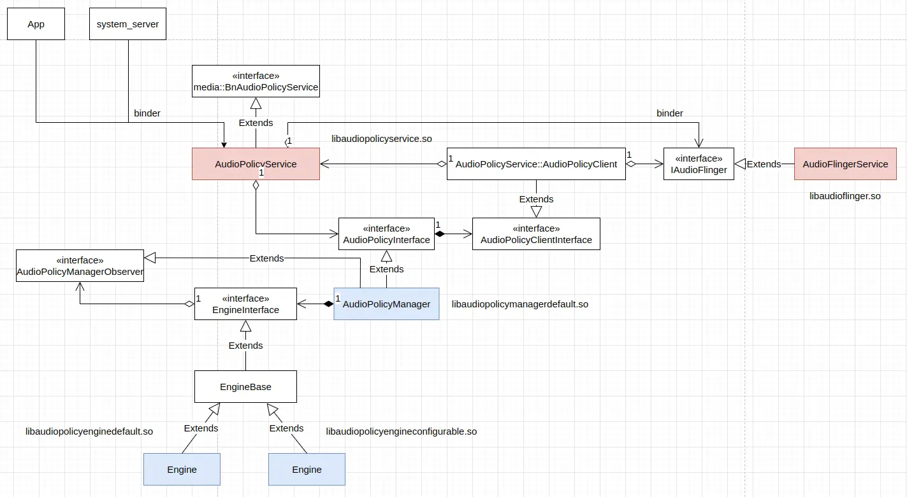
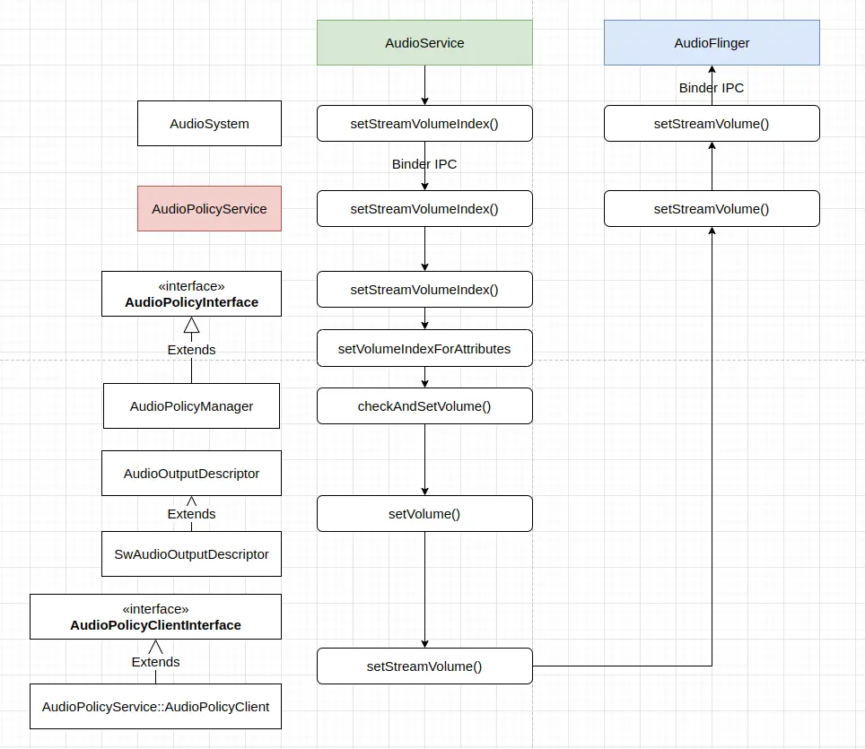
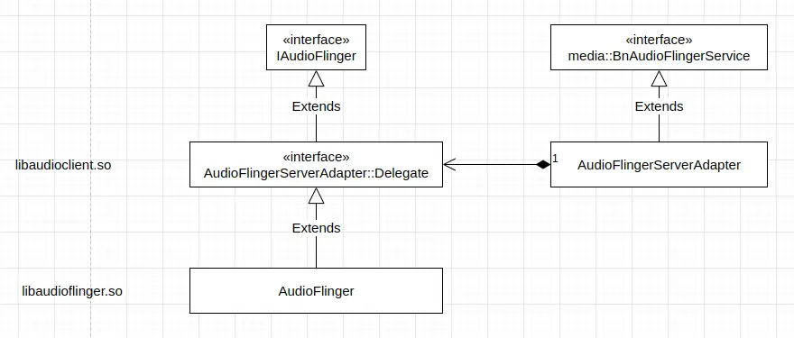

## 核心 Android 系统提供的调节音量的方法

核心 Android 系统提供了多种调节音量的方法，这些方法主要包括如下这些。

1. 如在 **Android Automotive 调节音量的过程** 中我们看到的，`CarAudioService` 最终在 `CarAudioDeviceInfo` 中 (`packages/services/Car/service/src/com/android/car/audio/CarAudioDeviceInfo.java`) 通过 `AudioManager` 直接为设备设置音量：
```
    // Input is in millibels
    void setCurrentGain(int gainInMillibels) {
        // Clamp the incoming value to our valid range.  Out of range values ARE legal input
        if (gainInMillibels < mMinGain) {
            gainInMillibels = mMinGain;
        } else if (gainInMillibels > mMaxGain) {
            gainInMillibels = mMaxGain;
        }

        // Push the new gain value down to our underlying port which will cause it to show up
        // at the HAL.
        AudioGain audioGain = getAudioGain();
        if (audioGain == null) {
            Slog.e(CarLog.TAG_AUDIO, "getAudioGain() returned null.");
            return;
        }

        // size of gain values is 1 in MODE_JOINT
        AudioGainConfig audioGainConfig = audioGain.buildConfig(
                AudioGain.MODE_JOINT,
                audioGain.channelMask(),
                new int[] { gainInMillibels },
                0);
        if (audioGainConfig == null) {
            Slog.e(CarLog.TAG_AUDIO, "Failed to construct AudioGainConfig");
            return;
        }

        int r = AudioManager.setAudioPortGain(getAudioDevicePort(), audioGainConfig);
        if (r == AudioManager.SUCCESS) {
            // Since we can't query for the gain on a device port later,
            // we have to remember what we asked for
            mCurrentGain = gainInMillibels;
        } else {
            Slog.e(CarLog.TAG_AUDIO, "Failed to setAudioPortGain: " + r);
        }
    }
```

这里看到的 `AudioManager` 的 `setAudioPortGain(getAudioDevicePort(), audioGainConfig)` 方法可以用于调节特定设备的音量，在 `AudioManager` 中，这个方法的实现 (*frameworks/base/media/java/android/media/AudioManager.java*) 为：
```
    /**
     * Set the gain on the specified AudioPort. The AudioGainConfig config is build by
     * AudioGain.buildConfig()
     * @hide
     */
    public static int setAudioPortGain(AudioPort port, AudioGainConfig gain) {
        if (port == null || gain == null) {
            return ERROR_BAD_VALUE;
        }
        AudioPortConfig activeConfig = port.activeConfig();
        AudioPortConfig config = new AudioPortConfig(port, activeConfig.samplingRate(),
                                        activeConfig.channelMask(), activeConfig.format(), gain);
        config.mConfigMask = AudioPortConfig.GAIN;
        return AudioSystem.setAudioPortConfig(config);
    }
```

`AudioManager` 的 `setAudioPortGain(getAudioDevicePort(), audioGainConfig)` 方法通过 `AudioSystem` 的静态方法 `setAudioPortConfig(config)` 来给设备设置音量，`AudioSystem.setAudioPortConfig(config)` 是一个在 *frameworks/base/media/java/android/media/AudioSystem.java* 中声明，并最终在 *frameworks/base/core/jni/android_media_AudioSystem.cpp* 中定义的 JNI 本地层方法：
```
static jint
android_media_AudioSystem_setAudioPortConfig(JNIEnv *env, jobject clazz,
                                 jobject jAudioPortConfig)
{
    ALOGV("setAudioPortConfig");
    if (jAudioPortConfig == NULL) {
        return AUDIO_JAVA_BAD_VALUE;
    }
    if (!env->IsInstanceOf(jAudioPortConfig, gAudioPortConfigClass)) {
        return AUDIO_JAVA_BAD_VALUE;
    }
    struct audio_port_config nAudioPortConfig = {};
    jint jStatus = convertAudioPortConfigToNative(env, &nAudioPortConfig, jAudioPortConfig, true);
    if (jStatus != AUDIO_JAVA_SUCCESS) {
        return jStatus;
    }
    status_t status = AudioSystem::setAudioPortConfig(&nAudioPortConfig);
    ALOGV("AudioSystem::setAudioPortConfig() returned %d", status);
    jStatus = nativeToJavaStatus(status);
    return jStatus;
}
```

2. App 可以通过 `AudioManager` 调节某个 `STREAM_TYPE` 的音量，如：
```
    private boolean setStreamVolume(int volume) {
        Logging.d(TAG, "setStreamVolume(" + volume + ")");
        assertTrue(audioManager != null);
        if (isVolumeFixed()) {
            Logging.e(TAG, "The device implements a fixed volume policy.");
            return false;
        }
        audioManager.setStreamVolume(AudioManager.STREAM_VOICE_CALL, volume, 0);
        return true;
    }
```

这里看到的 `setStreamVolume()` 方法在 `AudioManager` 中的实现如下：
```
    /**
     * Sets the volume index for a particular stream.
     * <p>This method has no effect if the device implements a fixed volume policy
     * as indicated by {@link #isVolumeFixed()}.
     * <p>From N onward, volume adjustments that would toggle Do Not Disturb are not allowed unless
     * the app has been granted Do Not Disturb Access.
     * See {@link NotificationManager#isNotificationPolicyAccessGranted()}.
     * @param streamType The stream whose volume index should be set.
     * @param index The volume index to set. See
     *            {@link #getStreamMaxVolume(int)} for the largest valid value.
     * @param flags One or more flags.
     * @see #getStreamMaxVolume(int)
     * @see #getStreamVolume(int)
     * @see #isVolumeFixed()
     * @throws SecurityException if the volume change triggers a Do Not Disturb change
     *   and the caller is not granted notification policy access.
     */
    public void setStreamVolume(int streamType, int index, int flags) {
        final IAudioService service = getService();
        try {
            service.setStreamVolume(streamType, index, flags, getContext().getOpPackageName());
        } catch (RemoteException e) {
            throw e.rethrowFromSystemServer();
        }
    }
```

3. `AudioManager` 中单步地调大或者调小特定流类型的 `adjustStreamVolume()`：
```
    /**
     * Adjusts the volume of a particular stream by one step in a direction.
     * <p>
     * This method should only be used by applications that replace the platform-wide
     * management of audio settings or the main telephony application.
     * <p>This method has no effect if the device implements a fixed volume policy
     * as indicated by {@link #isVolumeFixed()}.
     * <p>From N onward, ringer mode adjustments that would toggle Do Not Disturb are not allowed
     * unless the app has been granted Do Not Disturb Access.
     * See {@link NotificationManager#isNotificationPolicyAccessGranted()}.
     *
     * @param streamType The stream type to adjust. One of {@link #STREAM_VOICE_CALL},
     * {@link #STREAM_SYSTEM}, {@link #STREAM_RING}, {@link #STREAM_MUSIC},
     * {@link #STREAM_ALARM} or {@link #STREAM_ACCESSIBILITY}.
     * @param direction The direction to adjust the volume. One of
     *            {@link #ADJUST_LOWER}, {@link #ADJUST_RAISE}, or
     *            {@link #ADJUST_SAME}.
     * @param flags One or more flags.
     * @see #adjustVolume(int, int)
     * @see #setStreamVolume(int, int, int)
     * @throws SecurityException if the adjustment triggers a Do Not Disturb change
     *   and the caller is not granted notification policy access.
     */
    public void adjustStreamVolume(int streamType, int direction, int flags) {
        final IAudioService service = getService();
        try {
            service.adjustStreamVolume(streamType, direction, flags,
                    getContext().getOpPackageName());
        } catch (RemoteException e) {
            throw e.rethrowFromSystemServer();
        }
    }
```

4. `AudioManager` 中调节最相关的流的音量的 `adjustVolume()` 和 `adjustSuggestedStreamVolume()`：
```
    /**
     * Adjusts the volume of the most relevant stream. For example, if a call is
     * active, it will have the highest priority regardless of if the in-call
     * screen is showing. Another example, if music is playing in the background
     * and a call is not active, the music stream will be adjusted.
     * <p>
     * This method should only be used by applications that replace the
     * platform-wide management of audio settings or the main telephony
     * application.
     * <p>
     * This method has no effect if the device implements a fixed volume policy
     * as indicated by {@link #isVolumeFixed()}.
     *
     * @param direction The direction to adjust the volume. One of
     *            {@link #ADJUST_LOWER}, {@link #ADJUST_RAISE},
     *            {@link #ADJUST_SAME}, {@link #ADJUST_MUTE},
     *            {@link #ADJUST_UNMUTE}, or {@link #ADJUST_TOGGLE_MUTE}.
     * @param flags One or more flags.
     * @see #adjustSuggestedStreamVolume(int, int, int)
     * @see #adjustStreamVolume(int, int, int)
     * @see #setStreamVolume(int, int, int)
     * @see #isVolumeFixed()
     */
    public void adjustVolume(int direction, int flags) {
        MediaSessionLegacyHelper helper = MediaSessionLegacyHelper.getHelper(getContext());
        helper.sendAdjustVolumeBy(USE_DEFAULT_STREAM_TYPE, direction, flags);
    }

    /**
     * Adjusts the volume of the most relevant stream, or the given fallback
     * stream.
     * <p>
     * This method should only be used by applications that replace the
     * platform-wide management of audio settings or the main telephony
     * application.
     * <p>
     * This method has no effect if the device implements a fixed volume policy
     * as indicated by {@link #isVolumeFixed()}.
     *
     * @param direction The direction to adjust the volume. One of
     *            {@link #ADJUST_LOWER}, {@link #ADJUST_RAISE},
     *            {@link #ADJUST_SAME}, {@link #ADJUST_MUTE},
     *            {@link #ADJUST_UNMUTE}, or {@link #ADJUST_TOGGLE_MUTE}.
     * @param suggestedStreamType The stream type that will be used if there
     *            isn't a relevant stream. {@link #USE_DEFAULT_STREAM_TYPE} is
     *            valid here.
     * @param flags One or more flags.
     * @see #adjustVolume(int, int)
     * @see #adjustStreamVolume(int, int, int)
     * @see #setStreamVolume(int, int, int)
     * @see #isVolumeFixed()
     */
    public void adjustSuggestedStreamVolume(int direction, int suggestedStreamType, int flags) {
        MediaSessionLegacyHelper helper = MediaSessionLegacyHelper.getHelper(getContext());
        helper.sendAdjustVolumeBy(suggestedStreamType, direction, flags);
    }
```

这两个方法最终通过 media session 服务调节音量 (*frameworks/base/media/java/android/media/session/MediaSessionLegacyHelper.java*) ：
```
    private MediaSessionLegacyHelper(Context context) {
        mContext = context;
        mSessionManager = (MediaSessionManager) context
                .getSystemService(Context.MEDIA_SESSION_SERVICE);
    }

    public void sendAdjustVolumeBy(int suggestedStream, int delta, int flags) {
        mSessionManager.dispatchAdjustVolume(suggestedStream, delta, flags);
        if (DEBUG) {
            Log.d(TAG, "dispatched volume adjustment");
        }
    }
```

5. `AudioManager` 中为特定 `AudioAttributes` 设置音量的 `setVolumeIndexForAttributes()`。
```
    /**
     * Sets the volume index for a particular {@link AudioAttributes}.
     * @param attr The {@link AudioAttributes} whose volume index should be set.
     * @param index The volume index to set. See
     *          {@link #getMaxVolumeIndexForAttributes(AudioAttributes)} for the largest valid value
     *          {@link #getMinVolumeIndexForAttributes(AudioAttributes)} for the lowest valid value.
     * @param flags One or more flags.
     * @see #getMaxVolumeIndexForAttributes(AudioAttributes)
     * @see #getMinVolumeIndexForAttributes(AudioAttributes)
     * @see #isVolumeFixed()
     * @hide
     */
    @SystemApi
    @RequiresPermission(android.Manifest.permission.MODIFY_AUDIO_ROUTING)
    public void setVolumeIndexForAttributes(@NonNull AudioAttributes attr, int index, int flags) {
        Preconditions.checkNotNull(attr, "attr must not be null");
        final IAudioService service = getService();
        try {
            service.setVolumeIndexForAttributes(attr, index, flags,
                                                getContext().getOpPackageName());
        } catch (RemoteException e) {
            throw e.rethrowFromSystemServer();
        }
    }
```

6. `AudioManager` 中调节最相关流的音量，且会基于所提供的组件名、uid 和 pid 值检查调用者是否有必要权限的 `adjustSuggestedStreamVolumeForUid()`。
```
    /**
     * Adjusts the volume of the most relevant stream, or the given fallback
     * stream.
     * <p>
     * This method should only be used by applications that replace the
     * platform-wide management of audio settings or the main telephony
     * application.
     * <p>
     * This method has no effect if the device implements a fixed volume policy
     * as indicated by {@link #isVolumeFixed()}.
     * <p>This API checks if the caller has the necessary permissions based on the provided
     * component name, uid, and pid values.
     * See {@link #adjustSuggestedStreamVolume(int, int, int)}.
     *
     * @param suggestedStreamType The stream type that will be used if there
     *         isn't a relevant stream. {@link #USE_DEFAULT_STREAM_TYPE} is
     *         valid here.
     * @param direction The direction to adjust the volume. One of
     *         {@link #ADJUST_LOWER}, {@link #ADJUST_RAISE},
     *         {@link #ADJUST_SAME}, {@link #ADJUST_MUTE},
     *         {@link #ADJUST_UNMUTE}, or {@link #ADJUST_TOGGLE_MUTE}.
     * @param flags One or more flags.
     * @param packageName the package name of client application
     * @param uid the uid of client application
     * @param pid the pid of client application
     * @param targetSdkVersion the target sdk version of client application
     * @see #adjustVolume(int, int)
     * @see #adjustStreamVolume(int, int, int)
     * @see #setStreamVolume(int, int, int)
     * @see #isVolumeFixed()
     *
     * @hide
     */
    @SystemApi(client = SystemApi.Client.MODULE_LIBRARIES)
    public void adjustSuggestedStreamVolumeForUid(int suggestedStreamType, int direction, int flags,
            @NonNull String packageName, int uid, int pid, int targetSdkVersion) {
        try {
            getService().adjustSuggestedStreamVolumeForUid(suggestedStreamType, direction, flags,
                    packageName, uid, pid, UserHandle.getUserHandleForUid(uid), targetSdkVersion);
        } catch (RemoteException e) {
            throw e.rethrowFromSystemServer();
        }
    }
```

7. `AudioManager` 中单步地调大或者调小特定流类型的音量，且会基于所提供的组件名、uid 和 pid 值检查调用者是否有必要权限的 `adjustStreamVolumeForUid()`：
```
    /**
     * Adjusts the volume of a particular stream by one step in a direction.
     * <p>
     * This method should only be used by applications that replace the platform-wide
     * management of audio settings or the main telephony application.
     * <p>This method has no effect if the device implements a fixed volume policy
     * as indicated by {@link #isVolumeFixed()}.
     * <p>From N onward, ringer mode adjustments that would toggle Do Not Disturb are not allowed
     * unless the app has been granted Do Not Disturb Access.
     * See {@link NotificationManager#isNotificationPolicyAccessGranted()}.
     * <p>This API checks if the caller has the necessary permissions based on the provided
     * component name, uid, and pid values.
     * See {@link #adjustStreamVolume(int, int, int)}.
     *
     * @param streamType The stream type to adjust. One of {@link #STREAM_VOICE_CALL},
     *         {@link #STREAM_SYSTEM}, {@link #STREAM_RING}, {@link #STREAM_MUSIC},
     *         {@link #STREAM_ALARM} or {@link #STREAM_ACCESSIBILITY}.
     * @param direction The direction to adjust the volume. One of
     *         {@link #ADJUST_LOWER}, {@link #ADJUST_RAISE}, or
     *         {@link #ADJUST_SAME}.
     * @param flags One or more flags.
     * @param packageName the package name of client application
     * @param uid the uid of client application
     * @param pid the pid of client application
     * @param targetSdkVersion the target sdk version of client application
     * @see #adjustVolume(int, int)
     * @see #setStreamVolume(int, int, int)
     * @throws SecurityException if the adjustment triggers a Do Not Disturb change
     *         and the caller is not granted notification policy access.
     *
     * @hide
     */
    @SystemApi(client = SystemApi.Client.MODULE_LIBRARIES)
    public void adjustStreamVolumeForUid(int streamType, int direction, int flags,
            @NonNull String packageName, int uid, int pid, int targetSdkVersion) {
        try {
            getService().adjustStreamVolumeForUid(streamType, direction, flags, packageName, uid,
                    pid, UserHandle.getUserHandleForUid(uid), targetSdkVersion);
        } catch (RemoteException e) {
            throw e.rethrowFromSystemServer();
        }
    }
```

8. `AudioManager` 中调节某个 `STREAM_TYPE` 的音量，且会基于所提供的组件名、uid 和 pid 值检查调用者是否有必要权限的 `setStreamVolumeForUid()`：
```
    /**
     * Sets the volume index for a particular stream.
     * <p>This method has no effect if the device implements a fixed volume policy
     * as indicated by {@link #isVolumeFixed()}.
     * <p>From N onward, volume adjustments that would toggle Do Not Disturb are not allowed unless
     * the app has been granted Do Not Disturb Access.
     * See {@link NotificationManager#isNotificationPolicyAccessGranted()}.
     * <p>This API checks if the caller has the necessary permissions based on the provided
     * component name, uid, and pid values.
     * See {@link #setStreamVolume(int, int, int)}.
     *
     * @param streamType The stream whose volume index should be set.
     * @param index The volume index to set. See
     *         {@link #getStreamMaxVolume(int)} for the largest valid value.
     * @param flags One or more flags.
     * @param packageName the package name of client application
     * @param uid the uid of client application
     * @param pid the pid of client application
     * @param targetSdkVersion the target sdk version of client application
     * @see #getStreamMaxVolume(int)
     * @see #getStreamVolume(int)
     * @see #isVolumeFixed()
     * @throws SecurityException if the volume change triggers a Do Not Disturb change
     *         and the caller is not granted notification policy access.
     *
     * @hide
     */
    @SystemApi(client = SystemApi.Client.MODULE_LIBRARIES)
    public void setStreamVolumeForUid(int streamType, int index, int flags,
            @NonNull String packageName, int uid, int pid, int targetSdkVersion) {
        try {
            getService().setStreamVolumeForUid(streamType, index, flags, packageName, uid, pid,
                    UserHandle.getUserHandleForUid(uid), targetSdkVersion);
        } catch (RemoteException e) {
            throw e.rethrowFromSystemServer();
        }
    }
```

总结一下，上面这些方法，从功能上来看主要包括这样一些：

1. 直接给设备设置音量；
2. 调节某个 `STREAM_TYPE` 的音量；
3. 单步地调大或者调小特定流类型的音量；
4. 调节最相关的流的音量；
5. 为特定 `AudioAttributes` 设置音量；
6. 调节最相关的流的音量，且会基于所提供的组件名、uid 和 pid 值检查调用者是否有必要权限；
7. 单步地调大或者调小特定流类型的音量，且会基于所提供的组件名、uid 和 pid 值检查调用者是否有必要权限；
8. 调节某个 `STREAM_TYPE` 的音量，且会基于所提供的组件名、uid 和 pid 值检查调用者是否有必要权限。

`AudioManager` 主要是运行于 system_server 中的 audio 服务的客户端代理，但其中封装的一些操作也会直接通过 media session 服务或者 audio policy 服务等完成。上面除了第 1 和 第 4 项功能外，其它功能基本上都通过调用 audio 服务的同名方法完成。

接下来，逐个看下上面调用的 `AudioService` 的方法的实现。

2. 在 `AudioService` 中 (`frameworks/base/services/core/java/com/android/server/audio/AudioService.java`)，与 `AudioManager` 中的方法对应的 `setStreamVolume()` 方法实现如下：
```
    /** @see AudioManager#setStreamVolume(int, int, int)
     * Part of service interface, check permissions here */
    public void setStreamVolume(int streamType, int index, int flags, String callingPackage) {
        if ((streamType == AudioManager.STREAM_ACCESSIBILITY) && !canChangeAccessibilityVolume()) {
            Log.w(TAG, "Trying to call setStreamVolume() for a11y without"
                    + " CHANGE_ACCESSIBILITY_VOLUME  callingPackage=" + callingPackage);
            return;
        }
        if ((streamType == AudioManager.STREAM_VOICE_CALL) && (index == 0)
                && (mContext.checkCallingOrSelfPermission(
                    android.Manifest.permission.MODIFY_PHONE_STATE)
                    != PackageManager.PERMISSION_GRANTED)) {
            Log.w(TAG, "Trying to call setStreamVolume() for STREAM_VOICE_CALL and index 0 without"
                    + " MODIFY_PHONE_STATE  callingPackage=" + callingPackage);
            return;
        }
        if ((streamType == AudioManager.STREAM_ASSISTANT)
            && (mContext.checkCallingOrSelfPermission(
                    android.Manifest.permission.MODIFY_AUDIO_ROUTING)
                    != PackageManager.PERMISSION_GRANTED)) {
            Log.w(TAG, "Trying to call setStreamVolume() for STREAM_ASSISTANT without"
                    + " MODIFY_AUDIO_ROUTING  callingPackage=" + callingPackage);
            return;
        }

        sVolumeLogger.log(new VolumeEvent(VolumeEvent.VOL_SET_STREAM_VOL, streamType,
                index/*val1*/, flags/*val2*/, callingPackage));
        setStreamVolume(streamType, index, flags, callingPackage, callingPackage,
                Binder.getCallingUid(), callingOrSelfHasAudioSettingsPermission());
    }
```

这个操作执行的过程大体为：

(1). 确保调用方具有足够的修改 stream type 的音量的权限；
(2). 为 stream type 设置音量。

这个操作最终回到了为 stream type 设置音量。

3. 单步地调大或者调小特定流类型的音量
```
    /** @see AudioManager#adjustStreamVolume(int, int, int)
     * Part of service interface, check permissions here */
    public void adjustStreamVolume(int streamType, int direction, int flags,
            String callingPackage) {
        if ((streamType == AudioManager.STREAM_ACCESSIBILITY) && !canChangeAccessibilityVolume()) {
            Log.w(TAG, "Trying to call adjustStreamVolume() for a11y without"
                    + "CHANGE_ACCESSIBILITY_VOLUME / callingPackage=" + callingPackage);
            return;
        }

        sVolumeLogger.log(new VolumeEvent(VolumeEvent.VOL_ADJUST_STREAM_VOL, streamType,
                direction/*val1*/, flags/*val2*/, callingPackage));
        adjustStreamVolume(streamType, direction, flags, callingPackage, callingPackage,
                Binder.getCallingUid(), Binder.getCallingPid(),
                callingHasAudioSettingsPermission(), VOL_ADJUST_NORMAL);
    }
```

这个操作执行的过程大体为：

(1). 确保调用方具有足够的修改 stream type 的音量的权限；
(2). 调整 stream type 的音量。

这个操作最终回到了调整 stream type 的音量。

4. 调节最相关的流的音量的 `adjustVolume()` 和 `adjustSuggestedStreamVolume()` 将经 media session 服务绕一道，最终回到调整 stream type 的音量或设置 stream type 的音量。

5. 为特定 `AudioAttributes` 设置音量
```
    /** @see AudioManager#setVolumeIndexForAttributes(attr, int, int) */
    public void setVolumeIndexForAttributes(@NonNull AudioAttributes attr, int index, int flags,
                                            String callingPackage) {
        enforceModifyAudioRoutingPermission();
        Objects.requireNonNull(attr, "attr must not be null");
        final int volumeGroup = getVolumeGroupIdForAttributes(attr);
        if (sVolumeGroupStates.indexOfKey(volumeGroup) < 0) {
            Log.e(TAG, ": no volume group found for attributes " + attr.toString());
            return;
        }
        final VolumeGroupState vgs = sVolumeGroupStates.get(volumeGroup);

        sVolumeLogger.log(new VolumeEvent(VolumeEvent.VOL_SET_GROUP_VOL, attr, vgs.name(),
                index/*val1*/, flags/*val2*/, callingPackage));

        vgs.setVolumeIndex(index, flags);

        // For legacy reason, propagate to all streams associated to this volume group
        for (final int groupedStream : vgs.getLegacyStreamTypes()) {
            try {
                ensureValidStreamType(groupedStream);
            } catch (IllegalArgumentException e) {
                Log.d(TAG, "volume group " + volumeGroup + " has internal streams (" + groupedStream
                        + "), do not change associated stream volume");
                continue;
            }
            setStreamVolume(groupedStream, index, flags, callingPackage, callingPackage,
                            Binder.getCallingUid(), true /*hasModifyAudioSettings*/);
        }
    }
```

这个过程大体为：

(1). 确保调用方具有足够的修改 audio routing 的权限；
(2). 根据传入的 AudioAttributes 获得音量组；
(3). 为音量组本身设置音量；
(4). 为音量组中的每个 stream type 设置音量。

这个操作最终回到了为 stream type 设置音量。

6. 调节最相关的流的音量，且会基于所提供的组件名、uid 和 pid 值检查调用者是否有必要权限

```
    private void adjustSuggestedStreamVolume(int direction, int suggestedStreamType, int flags,
            String callingPackage, String caller, int uid, int pid, boolean hasModifyAudioSettings,
            int keyEventMode) {
        if (DEBUG_VOL) Log.d(TAG, "adjustSuggestedStreamVolume() stream=" + suggestedStreamType
                + ", flags=" + flags + ", caller=" + caller
                + ", volControlStream=" + mVolumeControlStream
                + ", userSelect=" + mUserSelectedVolumeControlStream);
        if (direction != AudioManager.ADJUST_SAME) {
            sVolumeLogger.log(new VolumeEvent(VolumeEvent.VOL_ADJUST_SUGG_VOL, suggestedStreamType,
                    direction/*val1*/, flags/*val2*/, new StringBuilder(callingPackage)
                    .append("/").append(caller).append(" uid:").append(uid).toString()));
        }

        boolean hasExternalVolumeController = notifyExternalVolumeController(direction);

        new MediaMetrics.Item(mMetricsId + "adjustSuggestedStreamVolume")
                .setUid(Binder.getCallingUid())
                .set(MediaMetrics.Property.CALLING_PACKAGE, callingPackage)
                .set(MediaMetrics.Property.CLIENT_NAME, caller)
                .set(MediaMetrics.Property.DIRECTION, direction > 0
                        ? MediaMetrics.Value.UP : MediaMetrics.Value.DOWN)
                .set(MediaMetrics.Property.EXTERNAL, hasExternalVolumeController
                        ? MediaMetrics.Value.YES : MediaMetrics.Value.NO)
                .set(MediaMetrics.Property.FLAGS, flags)
                .record();

        if (hasExternalVolumeController) {
            return;
        }

        final int streamType;
        synchronized (mForceControlStreamLock) {
            // Request lock in case mVolumeControlStream is changed by other thread.
            if (mUserSelectedVolumeControlStream) { // implies mVolumeControlStream != -1
                streamType = mVolumeControlStream;
            } else {
                final int maybeActiveStreamType = getActiveStreamType(suggestedStreamType);
                final boolean activeForReal;
                if (maybeActiveStreamType == AudioSystem.STREAM_RING
                        || maybeActiveStreamType == AudioSystem.STREAM_NOTIFICATION) {
                    activeForReal = wasStreamActiveRecently(maybeActiveStreamType, 0);
                } else {
                    activeForReal = mAudioSystem.isStreamActive(maybeActiveStreamType, 0);
                }
                if (activeForReal || mVolumeControlStream == -1) {
                    streamType = maybeActiveStreamType;
                } else {
                    streamType = mVolumeControlStream;
                }
            }
        }

        final boolean isMute = isMuteAdjust(direction);

        ensureValidStreamType(streamType);
        final int resolvedStream = mStreamVolumeAlias[streamType];

        // Play sounds on STREAM_RING only.
        if ((flags & AudioManager.FLAG_PLAY_SOUND) != 0 &&
                resolvedStream != AudioSystem.STREAM_RING) {
            flags &= ~AudioManager.FLAG_PLAY_SOUND;
        }

        // For notifications/ring, show the ui before making any adjustments
        // Don't suppress mute/unmute requests
        // Don't suppress adjustments for single volume device
        if (mVolumeController.suppressAdjustment(resolvedStream, flags, isMute)
                && !mIsSingleVolume) {
            direction = 0;
            flags &= ~AudioManager.FLAG_PLAY_SOUND;
            flags &= ~AudioManager.FLAG_VIBRATE;
            if (DEBUG_VOL) Log.d(TAG, "Volume controller suppressed adjustment");
        }

        adjustStreamVolume(streamType, direction, flags, callingPackage, caller, uid, pid,
                hasModifyAudioSettings, keyEventMode);
    }
 . . . . . .
    /** @see AudioManager#adjustSuggestedStreamVolumeForUid(int, int, int, String, int, int, int) */
    @Override
    public void adjustSuggestedStreamVolumeForUid(int streamType, int direction, int flags,
            @NonNull String packageName, int uid, int pid, UserHandle userHandle,
            int targetSdkVersion) {
        if (Binder.getCallingUid() != Process.SYSTEM_UID) {
            throw new SecurityException("Should only be called from system process");
        }

        // direction and stream type swap here because the public
        // adjustSuggested has a different order than the other methods.
        adjustSuggestedStreamVolume(direction, streamType, flags, packageName, packageName,
                uid, pid, hasAudioSettingsPermission(uid, pid), VOL_ADJUST_NORMAL);
    }
```

这个操作执行的过程大体为：

(1). 确保调用方的 UID 为 Process.SYSTEM_UID；
(2). 找到合适的 stream type；
(3). 调整 stream type 的音量。

这个操作最终回到了调整 stream type 的音量。

7. 单步地调大或者调小特定流类型的音量，且会基于所提供的组件名、uid 和 pid 值检查调用者是否有必要权限；
```
    /** @see AudioManager#adjustStreamVolumeForUid(int, int, int, String, int, int, int) */
    @Override
    public void adjustStreamVolumeForUid(int streamType, int direction, int flags,
            @NonNull String packageName, int uid, int pid, UserHandle userHandle,
            int targetSdkVersion) {
        if (Binder.getCallingUid() != Process.SYSTEM_UID) {
            throw new SecurityException("Should only be called from system process");
        }

        if (direction != AudioManager.ADJUST_SAME) {
            sVolumeLogger.log(new VolumeEvent(VolumeEvent.VOL_ADJUST_VOL_UID, streamType,
                    direction/*val1*/, flags/*val2*/,
                    new StringBuilder(packageName).append(" uid:").append(uid)
                    .toString()));
        }

        adjustStreamVolume(streamType, direction, flags, packageName, packageName, uid, pid,
                hasAudioSettingsPermission(uid, pid), VOL_ADJUST_NORMAL);
    }
```

这个操作执行的过程大体为：

(1). 确保调用方的 UID 为 Process.SYSTEM_UID；
(2). 调整 stream type 的音量。

这个操作最终回到了调整 stream type 的音量。

8. 调节某个 `STREAM_TYPE` 的音量，且会基于所提供的组件名、uid 和 pid 值检查调用者是否有必要权限
```
    /** @see AudioManager#setStreamVolumeForUid(int, int, int, String, int, int, int) */
    @Override
    public void setStreamVolumeForUid(int streamType, int index, int flags,
            @NonNull String packageName, int uid, int pid, UserHandle userHandle,
            int targetSdkVersion) {
        if (Binder.getCallingUid() != Process.SYSTEM_UID) {
            throw new SecurityException("Should only be called from system process");
        }

        setStreamVolume(streamType, index, flags, packageName, packageName, uid,
                hasAudioSettingsPermission(uid, pid));
    }
```

这个操作执行的过程大体为：

(1). 确保调用方的 UID 为 Process.SYSTEM_UID；
(2). 为 stream type 设置音量，传入的 uid 和 pid 用于检查权限。

这个操作最终回到了为 stream type 设置音量。

总体来看，`AudioManager` 除了直接调节设备音量的接口之外的其它接口，最终都会回到为 stream type 设置音量或调整 stream type 的音量。这里看一下为 stream type 设置音量的过程。

由上面这些调节音量的方法可以看到，Android Automotive 调节音量的动作有意在 Car 服务中直接对设备调节了音量，而没有继续经过核心 Android 系统的 audio 服务。

这里不再继续深入跟踪调整 stream type 的音量的过程，但可以看一下为 stream type 设置音量的过程。

## 为 stream type 设置音量

为 stream type 设置音量的 `setStreamVolume()` 方法定义如下：
```
    private void setStreamVolume(int streamType, int index, int flags, String callingPackage,
            String caller, int uid, boolean hasModifyAudioSettings) {
        if (DEBUG_VOL) {
            Log.d(TAG, "setStreamVolume(stream=" + streamType+", index=" + index
                    + ", calling=" + callingPackage + ")");
        }
        if (mUseFixedVolume) {
            return;
        }

        ensureValidStreamType(streamType);
        int streamTypeAlias = mStreamVolumeAlias[streamType];
        VolumeStreamState streamState = mStreamStates[streamTypeAlias];

        final int device = getDeviceForStream(streamType);
        int oldIndex;

        // skip a2dp absolute volume control request when the device
        // is not an a2dp device
        if (!AudioSystem.DEVICE_OUT_ALL_A2DP_SET.contains(device)
                && (flags & AudioManager.FLAG_BLUETOOTH_ABS_VOLUME) != 0) {
            return;
        }
        // If we are being called by the system (e.g. hardware keys) check for current user
        // so we handle user restrictions correctly.
        if (uid == android.os.Process.SYSTEM_UID) {
            uid = UserHandle.getUid(getCurrentUserId(), UserHandle.getAppId(uid));
        }
        if (!checkNoteAppOp(STREAM_VOLUME_OPS[streamTypeAlias], uid, callingPackage)) {
            return;
        }

        if (isAndroidNPlus(callingPackage)
                && wouldToggleZenMode(getNewRingerMode(streamTypeAlias, index, flags))
                && !mNm.isNotificationPolicyAccessGrantedForPackage(callingPackage)) {
            throw new SecurityException("Not allowed to change Do Not Disturb state");
        }

        if (!volumeAdjustmentAllowedByDnd(streamTypeAlias, flags)) {
            return;
        }

        synchronized (mSafeMediaVolumeStateLock) {
            // reset any pending volume command
            mPendingVolumeCommand = null;

            oldIndex = streamState.getIndex(device);

            index = rescaleIndex(index * 10, streamType, streamTypeAlias);

            if (streamTypeAlias == AudioSystem.STREAM_MUSIC
                    && AudioSystem.DEVICE_OUT_ALL_A2DP_SET.contains(device)
                    && (flags & AudioManager.FLAG_BLUETOOTH_ABS_VOLUME) == 0) {
                if (DEBUG_VOL) {
                    Log.d(TAG, "setStreamVolume postSetAvrcpAbsoluteVolumeIndex index=" + index
                            + "stream=" + streamType);
                }
                mDeviceBroker.postSetAvrcpAbsoluteVolumeIndex(index / 10);
            }

            if (device == AudioSystem.DEVICE_OUT_HEARING_AID
                    && streamType == getHearingAidStreamType()) {
                Log.i(TAG, "setStreamVolume postSetHearingAidVolumeIndex index=" + index
                        + " stream=" + streamType);
                mDeviceBroker.postSetHearingAidVolumeIndex(index, streamType);
            }


            if (streamTypeAlias == AudioSystem.STREAM_MUSIC) {
                setSystemAudioVolume(oldIndex, index, getStreamMaxVolume(streamType), flags);
            }

            flags &= ~AudioManager.FLAG_FIXED_VOLUME;
            if (streamTypeAlias == AudioSystem.STREAM_MUSIC && isFixedVolumeDevice(device)) {
                flags |= AudioManager.FLAG_FIXED_VOLUME;

                // volume is either 0 or max allowed for fixed volume devices
                if (index != 0) {
                    if (mSafeMediaVolumeState == SAFE_MEDIA_VOLUME_ACTIVE &&
                            mSafeMediaVolumeDevices.contains(device)) {
                        index = safeMediaVolumeIndex(device);
                    } else {
                        index = streamState.getMaxIndex();
                    }
                }
            }

            if (!checkSafeMediaVolume(streamTypeAlias, index, device)) {
                mVolumeController.postDisplaySafeVolumeWarning(flags);
                mPendingVolumeCommand = new StreamVolumeCommand(
                                                    streamType, index, flags, device);
            } else {
                onSetStreamVolume(streamType, index, flags, device, caller, hasModifyAudioSettings);
                index = mStreamStates[streamType].getIndex(device);
            }
        }
        synchronized (mHdmiClientLock) {
            if (streamTypeAlias == AudioSystem.STREAM_MUSIC
                    && (oldIndex != index)) {
                maybeSendSystemAudioStatusCommand(false);
            }
        }
        sendVolumeUpdate(streamType, oldIndex, index, flags, device);
    }
```

这个方法首先检查了是否配置使用固定音频策略 `mUseFixedVolume`，这个值来自于配置文件：*frameworks/base/core/res/res/values/config.xml*：
```
        mUseFixedVolume = mContext.getResources().getBoolean(
                com.android.internal.R.bool.config_useFixedVolume);
```

这个值可以被专门为设备定义的值覆盖掉。如对于车载版的模拟器，*device/generic/car/emulator/audio/overlay/frameworks/base/core/res/res/values/config.xml* 文件中定义的值覆盖了 framework 中定义的值。

这个是音频策略执行的主要的地方。

之后根据 stream type 通过 `AudioSystem` 获得 device 号 (*frameworks/base/services/core/java/com/android/server/audio/AudioSystemAdapter.java*) ：
```
    public int getDevicesForStream(int stream) {
        if (!ENABLE_GETDEVICES_STATS) {
            return getDevicesForStreamImpl(stream);
        }
        mMethodCallCounter[METHOD_GETDEVICESFORSTREAM]++;
        final long startTime = SystemClock.uptimeNanos();
        final int res = getDevicesForStreamImpl(stream);
        mMethodTimeNs[METHOD_GETDEVICESFORSTREAM] += SystemClock.uptimeNanos() - startTime;
        return res;
    }

    private int getDevicesForStreamImpl(int stream) {
        if (USE_CACHE_FOR_GETDEVICES) {
            Integer res;
            synchronized (mDevicesForStreamCache) {
                res = mDevicesForStreamCache.get(stream);
                if (res == null) {
                    res = AudioSystem.getDevicesForStream(stream);
                    mDevicesForStreamCache.put(stream, res);
                    if (DEBUG_CACHE) {
                        Log.d(TAG, mMethodNames[METHOD_GETDEVICESFORSTREAM]
                                + streamDeviceToDebugString(stream, res));
                    }
                    return res;
                }
                // cache hit
                mMethodCacheHit[METHOD_GETDEVICESFORSTREAM]++;
                if (DEBUG_CACHE) {
                    final int real = AudioSystem.getDevicesForStream(stream);
                    if (res == real) {
                        Log.d(TAG, mMethodNames[METHOD_GETDEVICESFORSTREAM]
                                + streamDeviceToDebugString(stream, res) + " CACHE");
                    } else {
                        Log.e(TAG, mMethodNames[METHOD_GETDEVICESFORSTREAM]
                                + streamDeviceToDebugString(stream, res)
                                + " CACHE ERROR real dev=0x" + Integer.toHexString(real));
                    }
                }
            }
            return res;
        }
        // not using cache
        return AudioSystem.getDevicesForStream(stream);
    }
```

这个调用堆栈如下：
```
getDevicesForStreamImpl:164, AudioSystemAdapter (com.android.server.audio)
getDevicesForStream:151, AudioSystemAdapter (com.android.server.audio)
observeDevicesForStream_syncVSS:6838, AudioService$VolumeStreamState (com.android.server.audio)
getDevicesForStreamInt:6111, AudioService (com.android.server.audio)
getDeviceForStream:6063, AudioService (com.android.server.audio)
setStreamVolume:3576, AudioService (com.android.server.audio)
setStreamVolume:3327, AudioService (com.android.server.audio)
onTransact:1529, IAudioService$Stub (android.media)
execTransactInternal:1179, Binder (android.os)
execTransact:1143, Binder (android.os)
```

通过 `AudioSystem` 获得的 device 号可能包含多个设备，每个具体的设备在这里的设备号中用一个二进制位表示，此时需要从这些设备中按优先级对具体的设备进行选择，这个过程 (*frameworks/base/services/core/java/com/android/server/audio/AudioService.java*) 如下：
```
    /** only public for mocking/spying, do not call outside of AudioService */
    @VisibleForTesting
    public int getDeviceForStream(int stream) {
        int device = getDevicesForStreamInt(stream);
        if ((device & (device - 1)) != 0) {
            // Multiple device selection is either:
            //  - speaker + one other device: give priority to speaker in this case.
            //  - one A2DP device + another device: happens with duplicated output. In this case
            // retain the device on the A2DP output as the other must not correspond to an active
            // selection if not the speaker.
            //  - HDMI-CEC system audio mode only output: give priority to available item in order.
            // FIXME: Haven't applied audio device type refactor to this API
            //  as it is going to be deprecated.
            if ((device & AudioSystem.DEVICE_OUT_SPEAKER) != 0) {
                device = AudioSystem.DEVICE_OUT_SPEAKER;
            } else if ((device & AudioSystem.DEVICE_OUT_HDMI_ARC) != 0) {
                // FIXME(b/184944421): DEVICE_OUT_HDMI_EARC has two bits set,
                // so it must be handled correctly as it aliases
                // with DEVICE_OUT_HDMI_ARC | DEVICE_OUT_EARPIECE.
                device = AudioSystem.DEVICE_OUT_HDMI_ARC;
            } else if ((device & AudioSystem.DEVICE_OUT_SPDIF) != 0) {
                device = AudioSystem.DEVICE_OUT_SPDIF;
            } else if ((device & AudioSystem.DEVICE_OUT_AUX_LINE) != 0) {
                device = AudioSystem.DEVICE_OUT_AUX_LINE;
            } else {
                for (int deviceType : AudioSystem.DEVICE_OUT_ALL_A2DP_SET) {
                    if ((deviceType & device) == deviceType) {
                        return deviceType;
                    }
                }
            }
        }
        return device;
    }
```

之后对传入的音量值进行归一化 (*frameworks/base/services/core/java/com/android/server/audio/AudioService.java*)：
```
    private int rescaleIndex(int index, int srcStream, int dstStream) {
        int srcRange = getIndexRange(srcStream);
        int dstRange = getIndexRange(dstStream);
        if (srcRange == 0) {
            Log.e(TAG, "rescaleIndex : index range should not be zero");
            return mStreamStates[dstStream].getMinIndex();
        }

        return mStreamStates[dstStream].getMinIndex()
                + ((index - mStreamStates[srcStream].getMinIndex()) * dstRange + srcRange / 2)
                / srcRange;
    }
```

之后处理 stream type 为 `AudioSystem.STREAM_MUSIC`，使用了蓝牙，且设置绝对音量时的情况，即发送消息来设置音量值。

之后处理设备为 `AudioSystem.DEVICE_OUT_HEARING_AID`，且 stream type 为辅助听力时的情况，即发送消息给蓝牙设置音量。

之后，当 stream type 为 `AudioSystem.STREAM_MUSIC`，还会设置系统音频音量，主要是根据需要设置 HDMI 音量。

之后，如果 stream type 为 `AudioSystem.STREAM_MUSIC`，且设备为固定音量设备，则修正传入的音量值。

之后，检查修正后的音量值是否为安全音量，如果不是，则发送 stream 音量命令；如果是，则通过 `onSetStreamVolume()` 设置流音量。

`onSetStreamVolume()` 的实现如下：
```
    private void onSetStreamVolume(int streamType, int index, int flags, int device,
            String caller, boolean hasModifyAudioSettings) {
        final int stream = mStreamVolumeAlias[streamType];
        setStreamVolumeInt(stream, index, device, false, caller, hasModifyAudioSettings);
        // setting volume on ui sounds stream type also controls silent mode
        if (((flags & AudioManager.FLAG_ALLOW_RINGER_MODES) != 0) ||
                (stream == getUiSoundsStreamType())) {
            setRingerMode(getNewRingerMode(stream, index, flags),
                    TAG + ".onSetStreamVolume", false /*external*/);
        }
        // setting non-zero volume for a muted stream unmutes the stream and vice versa,
        // except for BT SCO stream where only explicit mute is allowed to comply to BT requirements
        if (streamType != AudioSystem.STREAM_BLUETOOTH_SCO) {
            mStreamStates[stream].mute(index == 0);
        }
    }
 . . . . . .
    /**
     * Sets the stream state's index, and posts a message to set system volume.
     * This will not call out to the UI. Assumes a valid stream type.
     *
     * @param streamType Type of the stream
     * @param index Desired volume index of the stream
     * @param device the device whose volume must be changed
     * @param force If true, set the volume even if the desired volume is same
     * @param caller
     * @param hasModifyAudioSettings true if the caller is granted MODIFY_AUDIO_SETTINGS or
     *                              MODIFY_AUDIO_ROUTING permission
     * as the current volume.
     */
    private void setStreamVolumeInt(int streamType,
                                    int index,
                                    int device,
                                    boolean force,
                                    String caller, boolean hasModifyAudioSettings) {
        if (isFullVolumeDevice(device)) {
            return;
        }
        VolumeStreamState streamState = mStreamStates[streamType];

        if (streamState.setIndex(index, device, caller, hasModifyAudioSettings) || force) {
            // Post message to set system volume (it in turn will post a message
            // to persist).
            sendMsg(mAudioHandler,
                    MSG_SET_DEVICE_VOLUME,
                    SENDMSG_QUEUE,
                    device,
                    0,
                    streamState,
                    0);
        }
    }
```

这里首先会更新维护的关于 stream 的音量的信息，当音量真的发生改变时，还会发出 broadcast；然后发送消息去设置设备的音量。设置设备音量的方法如下：
```
    /*package*/ void setDeviceVolume(VolumeStreamState streamState, int device) {

        synchronized (VolumeStreamState.class) {
            // Apply volume
            streamState.applyDeviceVolume_syncVSS(device);

            // Apply change to all streams using this one as alias
            int numStreamTypes = AudioSystem.getNumStreamTypes();
            for (int streamType = numStreamTypes - 1; streamType >= 0; streamType--) {
                if (streamType != streamState.mStreamType &&
                        mStreamVolumeAlias[streamType] == streamState.mStreamType) {
                    // Make sure volume is also maxed out on A2DP device for aliased stream
                    // that may have a different device selected
                    int streamDevice = getDeviceForStream(streamType);
                    if ((device != streamDevice) && mAvrcpAbsVolSupported
                            && AudioSystem.DEVICE_OUT_ALL_A2DP_SET.contains(device)) {
                        mStreamStates[streamType].applyDeviceVolume_syncVSS(device);
                    }
                    mStreamStates[streamType].applyDeviceVolume_syncVSS(streamDevice);
                }
            }
        }
        // Post a persist volume msg
        sendMsg(mAudioHandler,
                MSG_PERSIST_VOLUME,
                SENDMSG_QUEUE,
                device,
                0,
                streamState,
                PERSIST_DELAY);

    }
```

设置设备的音量时，先设置传入的设备的音量，然后设置别名设备的音量，之后发送消息将音量设置持久化。设置设备音量，最终还是要通过 `AudioSystem` 执行：
```
        private void setStreamVolumeIndex(int index, int device) {
            // Only set audio policy BT SCO stream volume to 0 when the stream is actually muted.
            // This allows RX path muting by the audio HAL only when explicitly muted but not when
            // index is just set to 0 to repect BT requirements
            if (mStreamType == AudioSystem.STREAM_BLUETOOTH_SCO && index == 0
                    && !isFullyMuted()) {
                index = 1;
            }
            AudioSystem.setStreamVolumeIndexAS(mStreamType, index, device);
        }

        // must be called while synchronized VolumeStreamState.class
        /*package*/ void applyDeviceVolume_syncVSS(int device) {
            int index;
            if (isFullyMuted()) {
                index = 0;
            } else if (AudioSystem.DEVICE_OUT_ALL_A2DP_SET.contains(device)
                    && mAvrcpAbsVolSupported) {
                index = getAbsoluteVolumeIndex((getIndex(device) + 5)/10);
            } else if (isFullVolumeDevice(device)) {
                index = (mIndexMax + 5)/10;
            } else if (device == AudioSystem.DEVICE_OUT_HEARING_AID) {
                index = (mIndexMax + 5)/10;
            } else {
                index = (getIndex(device) + 5)/10;
            }
            setStreamVolumeIndex(index, device);
        }
```

`AudioSystem` 的 `AudioSystem.setStreamVolumeIndexAS(mStreamType, index, device)` 方法定义如下：
```
    /** @hide Wrapper for native methods called from AudioService */
    public static int setStreamVolumeIndexAS(int stream, int index, int device) {
        if (DEBUG_VOLUME) {
            Log.i(TAG, "setStreamVolumeIndex: " + STREAM_NAMES[stream]
                    + " dev=" + Integer.toHexString(device) + " idx=" + index);
        }
        return setStreamVolumeIndex(stream, index, device);
    }
 . . . . . .
    @UnsupportedAppUsage
    private static native int setStreamVolumeIndex(int stream, int index, int device);
```

最终，通过在 *frameworks/base/core/jni/android_media_AudioSystem.cpp* 中定义的静态 JNI 本地层方法来完成：
```
static jint
android_media_AudioSystem_setStreamVolumeIndex(JNIEnv *env,
                                               jobject thiz,
                                               jint stream,
                                               jint index,
                                               jint device)
{
    return (jint) check_AudioSystem_Command(
            AudioSystem::setStreamVolumeIndex(static_cast <audio_stream_type_t>(stream),
                                              index,
                                              (audio_devices_t)device));
}
```

再回到 `setStreamVolume()`，之后，如果 stream type 为 `AudioSystem.STREAM_MUSIC`，且音量发生了改变，则向 HDMI service 发送报告。

最后，向 volume controller 发送音量更新报告。

我们看到了 `AudioSystem` 的 `setAudioPortConfig(config)` 和 `AudioSystem.setStreamVolumeIndex(stream, index, device)` 这两种给设备设置音量的方法，在这两个方法中，它们都通过 `frameworks/av/media/libaudioclient/AudioSystem.cpp` 定义的函数完成操作。在这个过程中，也可以看到 stream type 是本地层维护的概念。

## Audio policy service 中的音量设置

接着上面的过程，继续来看 `AudioSystem::setStreamVolumeIndex()` 的实现。本地层的 `AudioSystem` 在 `libaudioclient`   中实现。`AudioSystem::setStreamVolumeIndex()` 函数的定义 (*frameworks/av/media/libaudioclient/AudioSystem.cpp*) 如下：
```
// establish binder interface to AudioPolicy service
const sp<IAudioPolicyService> AudioSystem::get_audio_policy_service() {
    sp<IAudioPolicyService> ap;
    sp<AudioPolicyServiceClient> apc;
    {
        Mutex::Autolock _l(gLockAPS);
        if (gAudioPolicyService == 0) {
            sp<IServiceManager> sm = defaultServiceManager();
            sp<IBinder> binder;
            do {
                binder = sm->getService(String16("media.audio_policy"));
                if (binder != 0)
                    break;
                ALOGW("AudioPolicyService not published, waiting...");
                usleep(500000); // 0.5 s
            } while (true);
            if (gAudioPolicyServiceClient == NULL) {
                gAudioPolicyServiceClient = new AudioPolicyServiceClient();
            }
            binder->linkToDeath(gAudioPolicyServiceClient);
            gAudioPolicyService = interface_cast<IAudioPolicyService>(binder);
            LOG_ALWAYS_FATAL_IF(gAudioPolicyService == 0);
            apc = gAudioPolicyServiceClient;
            // Make sure callbacks can be received by gAudioPolicyServiceClient
            ProcessState::self()->startThreadPool();
        }
        ap = gAudioPolicyService;
    }
    if (apc != 0) {
        int64_t token = IPCThreadState::self()->clearCallingIdentity();
        ap->registerClient(apc);
        ap->setAudioPortCallbacksEnabled(apc->isAudioPortCbEnabled());
        ap->setAudioVolumeGroupCallbacksEnabled(apc->isAudioVolumeGroupCbEnabled());
        IPCThreadState::self()->restoreCallingIdentity(token);
    }

    return ap;
}
 . . . . . .
status_t AudioSystem::setStreamVolumeIndex(audio_stream_type_t stream,
                                           int index,
                                           audio_devices_t device) {
    const sp<IAudioPolicyService>& aps = AudioSystem::get_audio_policy_service();
    if (aps == 0) return PERMISSION_DENIED;

    media::AudioStreamType streamAidl = VALUE_OR_RETURN_STATUS(
            legacy2aidl_audio_stream_type_t_AudioStreamType(stream));
    int32_t indexAidl = VALUE_OR_RETURN_STATUS(convertIntegral<int32_t>(index));
    int32_t deviceAidl = VALUE_OR_RETURN_STATUS(legacy2aidl_audio_devices_t_int32_t(device));
    return statusTFromBinderStatus(
            aps->setStreamVolumeIndex(streamAidl, deviceAidl, indexAidl));
}
```

`AudioSystem` 通过 binder 机制，访问 audio policy service 来设置 stream 的音量。

Audio policy service 是一个运行于 audioserver 中 (*frameworks/av/media/audioserver*) 的系统服务，其实现由多个组件及动态链接库组成，整体的结构如下：



`AudioPolicyService` 类是 audio policy service 的 IPC 接口层，是服务端的代理，它直接接收客户端发过来的请求，同时也封装其它一些组件，协助完成一些具体操作。`AudioPolicyService` 类成员函数的具体实现主要分布在两个文件中，一是 *frameworks/av/services/audiopolicy/service/AudioPolicyInterfaceImpl.cpp*，如其文件名所指示的那样，主要是接口函数的实现；二是 *frameworks/av/services/audiopolicy/service/AudioPolicyService.cpp*，包含其它成员函数的实现。

`AudioPolicyService` 类封装的 `AudioPolicyInterface`，也就是 `AudioPolicyManager` 协助其完成主要的音频策略逻辑。`AudioPolicyManager` 的具体定制版实现可以被动态加载加载起来，具体定制版实现的动态链接库文件名需要是 *libaudiopolicymanagercustom.so*，android 系统提供了默认的实现，在定制版实现不存在，会采用这个默认实现。相关逻辑实现如下：
```
static AudioPolicyInterface* createAudioPolicyManager(AudioPolicyClientInterface *clientInterface)
{
    AudioPolicyManager *apm = new AudioPolicyManager(clientInterface);
    status_t status = apm->initialize();
    if (status != NO_ERROR) {
        delete apm;
        apm = nullptr;
    }
    return apm;
}

static void destroyAudioPolicyManager(AudioPolicyInterface *interface)
{
    delete interface;
}
// ----------------------------------------------------------------------------

AudioPolicyService::AudioPolicyService()
    : BnAudioPolicyService(),
      mAudioPolicyManager(NULL),
      mAudioPolicyClient(NULL),
      mPhoneState(AUDIO_MODE_INVALID),
      mCaptureStateNotifier(false),
      mCreateAudioPolicyManager(createAudioPolicyManager),
      mDestroyAudioPolicyManager(destroyAudioPolicyManager) {
}

void AudioPolicyService::loadAudioPolicyManager()
{
    mLibraryHandle = dlopen(kAudioPolicyManagerCustomPath, RTLD_NOW);
    if (mLibraryHandle != nullptr) {
        ALOGI("%s loading %s", __func__, kAudioPolicyManagerCustomPath);
        mCreateAudioPolicyManager = reinterpret_cast<CreateAudioPolicyManagerInstance>
                                            (dlsym(mLibraryHandle, "createAudioPolicyManager"));
        const char *lastError = dlerror();
        ALOGW_IF(mCreateAudioPolicyManager == nullptr, "%s createAudioPolicyManager is null %s",
                    __func__, lastError != nullptr ? lastError : "no error");

        mDestroyAudioPolicyManager = reinterpret_cast<DestroyAudioPolicyManagerInstance>(
                                        dlsym(mLibraryHandle, "destroyAudioPolicyManager"));
        lastError = dlerror();
        ALOGW_IF(mDestroyAudioPolicyManager == nullptr, "%s destroyAudioPolicyManager is null %s",
                    __func__, lastError != nullptr ? lastError : "no error");
        if (mCreateAudioPolicyManager == nullptr || mDestroyAudioPolicyManager == nullptr){
            unloadAudioPolicyManager();
            LOG_ALWAYS_FATAL("could not find audiopolicymanager interface methods");
        }
    }
}

void AudioPolicyService::onFirstRef()
{
    {
        Mutex::Autolock _l(mLock);

        // start audio commands thread
        mAudioCommandThread = new AudioCommandThread(String8("ApmAudio"), this);
        // start output activity command thread
        mOutputCommandThread = new AudioCommandThread(String8("ApmOutput"), this);

        mAudioPolicyClient = new AudioPolicyClient(this);

        loadAudioPolicyManager();
        mAudioPolicyManager = mCreateAudioPolicyManager(mAudioPolicyClient);
    }

    // load audio processing modules
    sp<AudioPolicyEffects> audioPolicyEffects = new AudioPolicyEffects();
    sp<UidPolicy> uidPolicy = new UidPolicy(this);
    sp<SensorPrivacyPolicy> sensorPrivacyPolicy = new SensorPrivacyPolicy(this);
    {
        Mutex::Autolock _l(mLock);
        mAudioPolicyEffects = audioPolicyEffects;
        mUidPolicy = uidPolicy;
        mSensorPrivacyPolicy = sensorPrivacyPolicy;
    }
    uidPolicy->registerSelf();
    sensorPrivacyPolicy->registerSelf();

    // Create spatializer if supported
    if (mAudioPolicyManager != nullptr) {
        Mutex::Autolock _l(mLock);
        const audio_attributes_t attr = attributes_initializer(AUDIO_USAGE_MEDIA);
        AudioDeviceTypeAddrVector devices;
        bool hasSpatializer = mAudioPolicyManager->canBeSpatialized(&attr, nullptr, devices);
        if (hasSpatializer) {
            mSpatializer = Spatializer::create(this);
        }
    }
    AudioSystem::audioPolicyReady();
}

void AudioPolicyService::unloadAudioPolicyManager()
{
    ALOGV("%s ", __func__);
    if (mLibraryHandle != nullptr) {
        dlclose(mLibraryHandle);
    }
    mLibraryHandle = nullptr;
    mCreateAudioPolicyManager = nullptr;
    mDestroyAudioPolicyManager = nullptr;
}
```

`AudioPolicyManager` 会从 *audio_policy_configuration.xml* 等文件中加载配置信息，它借助于 `EngineInterface` 维护 stream type 和设备之间的关系之类的信息，同样 `EngineInterface` 也是动态加载获得的：
```
status_t AudioPolicyManager::initialize() {
    {
        std::string path = "libaudiopolicyengine" + getConfig().getEngineLibraryNameSuffix() + ".so";
        ALOGD("%s: libaudiopolicyengine file path %s", __FUNCTION__, path.c_str());
        auto engLib = EngineLibrary::load(path);
        if (!engLib) {
            ALOGE("%s: Failed to load the engine library", __FUNCTION__);
            return NO_INIT;
        }
        mEngine = engLib->createEngine();
        if (mEngine == nullptr) {
            ALOGE("%s: Failed to instantiate the APM engine", __FUNCTION__);
            return NO_INIT;
        }
    }
    mEngine->setObserver(this);
    status_t status = mEngine->initCheck();
    if (status != NO_ERROR) {
        LOG_FATAL("Policy engine not initialized(err=%d)", status);
        return status;
    }

    mCommunnicationStrategy = mEngine->getProductStrategyForAttributes(
        mEngine->getAttributesForStreamType(AUDIO_STREAM_VOICE_CALL));

    // after parsing the config, mOutputDevicesAll and mInputDevicesAll contain all known devices;
    // open all output streams needed to access attached devices
    onNewAudioModulesAvailableInt(nullptr /*newDevices*/);

    // make sure default device is reachable
    if (mDefaultOutputDevice == 0 || !mAvailableOutputDevices.contains(mDefaultOutputDevice)) {
        ALOGE_IF(mDefaultOutputDevice != 0, "Default device %s is unreachable",
                 mDefaultOutputDevice->toString().c_str());
        status = NO_INIT;
    }
    // If microphones address is empty, set it according to device type
    for (size_t i = 0; i < mAvailableInputDevices.size(); i++) {
        if (mAvailableInputDevices[i]->address().empty()) {
            if (mAvailableInputDevices[i]->type() == AUDIO_DEVICE_IN_BUILTIN_MIC) {
                mAvailableInputDevices[i]->setAddress(AUDIO_BOTTOM_MICROPHONE_ADDRESS);
            } else if (mAvailableInputDevices[i]->type() == AUDIO_DEVICE_IN_BACK_MIC) {
                mAvailableInputDevices[i]->setAddress(AUDIO_BACK_MICROPHONE_ADDRESS);
            }
        }
    }

    ALOGW_IF(mPrimaryOutput == nullptr, "The policy configuration does not declare a primary output");

    // Silence ALOGV statements
    property_set("log.tag." LOG_TAG, "D");

    updateDevicesAndOutputs();
    return status;
}
```

android 提供了两个 `EngineInterface` 的实现，分别是位于 *frameworks/av/services/audiopolicy/enginedefault* 的 *libaudiopolicyenginedefault.so* 和位于 *frameworks/av/services/audiopolicy/engineconfigurable* 的 *libaudiopolicyengineconfigurable.so*，具体使用哪个由 *audio_policy_configuration.xml* 等配置文件中的 `engine_library` 配置项决定，默认使用 *libaudiopolicyenginedefault.so*。

*libaudiopolicyenginedefault.so* 等从配置文件 */vendor/etc/audio_policy_engine_configuration.xml* 加载 audio policy engine 配置信息，其中主要包括产品策略，音量组等信息及其内容类型、usage 等信息。`EngineInterface` 的具体实现所需的设备信息从 `AudioPolicyManager` 获取。

我们回到设置音量的操作上来。在 audio policy service 中，这个操作请求首先来到 `AudioPolicyService::setStreamVolumeIndex()`：
```
Status AudioPolicyService::setStreamVolumeIndex(media::AudioStreamType streamAidl,
                                                int32_t deviceAidl, int32_t indexAidl) {
    audio_stream_type_t stream = VALUE_OR_RETURN_BINDER_STATUS(
            aidl2legacy_AudioStreamType_audio_stream_type_t(streamAidl));
    int index = VALUE_OR_RETURN_BINDER_STATUS(convertIntegral<int>(indexAidl));
    audio_devices_t device = VALUE_OR_RETURN_BINDER_STATUS(
            aidl2legacy_int32_t_audio_devices_t(deviceAidl));

    if (mAudioPolicyManager == NULL) {
        return binderStatusFromStatusT(NO_INIT);
    }
    if (!settingsAllowed()) {
        return binderStatusFromStatusT(PERMISSION_DENIED);
    }
    if (uint32_t(stream) >= AUDIO_STREAM_PUBLIC_CNT) {
        return binderStatusFromStatusT(BAD_VALUE);
    }
    Mutex::Autolock _l(mLock);
    AutoCallerClear acc;
    return binderStatusFromStatusT(mAudioPolicyManager->setStreamVolumeIndex(stream,
                                                                             index,
                                                                             device));
}
```

在这里，首先转换传入的参数，随后操作被传给 `AudioPolicyManager::setStreamVolumeIndex()`：
```
status_t AudioPolicyManager::setStreamVolumeIndex(audio_stream_type_t stream,
                                                  int index,
                                                  audio_devices_t device)
{
    auto attributes = mEngine->getAttributesForStreamType(stream);
    if (attributes == AUDIO_ATTRIBUTES_INITIALIZER) {
        ALOGW("%s: no group for stream %s, bailing out", __func__, toString(stream).c_str());
        return NO_ERROR;
    }
    ALOGD("%s: stream %s attributes=%s", __func__,
          toString(stream).c_str(), toString(attributes).c_str());
    return setVolumeIndexForAttributes(attributes, index, device);
}

status_t AudioPolicyManager::getStreamVolumeIndex(audio_stream_type_t stream,
                                                  int *index,
                                                  audio_devices_t device)
{
    // if device is AUDIO_DEVICE_OUT_DEFAULT_FOR_VOLUME, return volume for device selected for this
    // stream by the engine.
    DeviceTypeSet deviceTypes = {device};
    if (device == AUDIO_DEVICE_OUT_DEFAULT_FOR_VOLUME) {
        deviceTypes = mEngine->getOutputDevicesForStream(
                stream, true /*fromCache*/).types();
    }
    return getVolumeIndex(getVolumeCurves(stream), *index, deviceTypes);
}

status_t AudioPolicyManager::setVolumeIndexForAttributes(const audio_attributes_t &attributes,
                                                         int index,
                                                         audio_devices_t device)
{
    // Get Volume group matching the Audio Attributes
    auto group = mEngine->getVolumeGroupForAttributes(attributes);
    if (group == VOLUME_GROUP_NONE) {
        ALOGD("%s: no group matching with %s", __FUNCTION__, toString(attributes).c_str());
        return BAD_VALUE;
    }
    ALOGD("%s: group %d matching with %s", __FUNCTION__, group, toString(attributes).c_str());
    status_t status = NO_ERROR;
    IVolumeCurves &curves = getVolumeCurves(attributes);
    VolumeSource vs = toVolumeSource(group);
    product_strategy_t strategy = mEngine->getProductStrategyForAttributes(attributes);

    status = setVolumeCurveIndex(index, device, curves);
    if (status != NO_ERROR) {
        ALOGE("%s failed to set curve index for group %d device 0x%X", __func__, group, device);
        return status;
    }

    DeviceTypeSet curSrcDevices;
    auto curCurvAttrs = curves.getAttributes();
    if (!curCurvAttrs.empty() && curCurvAttrs.front() != defaultAttr) {
        auto attr = curCurvAttrs.front();
        curSrcDevices = mEngine->getOutputDevicesForAttributes(attr, nullptr, false).types();
    } else if (!curves.getStreamTypes().empty()) {
        auto stream = curves.getStreamTypes().front();
        curSrcDevices = mEngine->getOutputDevicesForStream(stream, false).types();
    } else {
        ALOGE("%s: Invalid src %d: no valid attributes nor stream",__func__, vs);
        return BAD_VALUE;
    }
    audio_devices_t curSrcDevice = Volume::getDeviceForVolume(curSrcDevices);
    resetDeviceTypes(curSrcDevices, curSrcDevice);

    // update volume on all outputs and streams matching the following:
    // - The requested stream (or a stream matching for volume control) is active on the output
    // - The device (or devices) selected by the engine for this stream includes
    // the requested device
    // - For non default requested device, currently selected device on the output is either the
    // requested device or one of the devices selected by the engine for this stream
    // - For default requested device (AUDIO_DEVICE_OUT_DEFAULT_FOR_VOLUME), apply volume only if
    // no specific device volume value exists for currently selected device.
    for (size_t i = 0; i < mOutputs.size(); i++) {
        sp<SwAudioOutputDescriptor> desc = mOutputs.valueAt(i);
        DeviceTypeSet curDevices = desc->devices().types();

        if (curDevices.erase(AUDIO_DEVICE_OUT_SPEAKER_SAFE)) {
            curDevices.insert(AUDIO_DEVICE_OUT_SPEAKER);
        }
        if (!(desc->isActive(vs) || isInCall())) {
            continue;
        }
        if (device != AUDIO_DEVICE_OUT_DEFAULT_FOR_VOLUME &&
                curDevices.find(device) == curDevices.end()) {
            continue;
        }
        bool applyVolume = false;
        if (device != AUDIO_DEVICE_OUT_DEFAULT_FOR_VOLUME) {
            curSrcDevices.insert(device);
            applyVolume = (curSrcDevices.find(
                    Volume::getDeviceForVolume(curDevices)) != curSrcDevices.end());
        } else {
            applyVolume = !curves.hasVolumeIndexForDevice(curSrcDevice);
        }
        if (!applyVolume) {
            continue; // next output
        }
        // Inter / intra volume group priority management: Loop on strategies arranged by priority
        // If a higher priority strategy is active, and the output is routed to a device with a
        // HW Gain management, do not change the volume
        if (desc->useHwGain()) {
            applyVolume = false;
            for (const auto &productStrategy : mEngine->getOrderedProductStrategies()) {
                auto activeClients = desc->clientsList(true /*activeOnly*/, productStrategy,
                                                       false /*preferredDevice*/);
                if (activeClients.empty()) {
                    continue;
                }
                bool isPreempted = false;
                bool isHigherPriority = productStrategy < strategy;
                for (const auto &client : activeClients) {
                    if (isHigherPriority && (client->volumeSource() != vs)) {
                        ALOGV("%s: Strategy=%d (\nrequester:\n"
                              " group %d, volumeGroup=%d attributes=%s)\n"
                              " higher priority source active:\n"
                              " volumeGroup=%d attributes=%s) \n"
                              " on output %zu, bailing out", __func__, productStrategy,
                              group, group, toString(attributes).c_str(),
                              client->volumeSource(), toString(client->attributes()).c_str(), i);
                        applyVolume = false;
                        isPreempted = true;
                        break;
                    }
                    // However, continue for loop to ensure no higher prio clients running on output
                    if (client->volumeSource() == vs) {
                        applyVolume = true;
                    }
                }
                if (isPreempted || applyVolume) {
                    break;
                }
            }
            if (!applyVolume) {
                continue; // next output
            }
        }
        //FIXME: workaround for truncated touch sounds
        // delayed volume change for system stream to be removed when the problem is
        // handled by system UI
        status_t volStatus = checkAndSetVolume(
                    curves, vs, index, desc, curDevices,
                    ((vs == toVolumeSource(AUDIO_STREAM_SYSTEM))?
                         TOUCH_SOUND_FIXED_DELAY_MS : 0));
        if (volStatus != NO_ERROR) {
            status = volStatus;
        }
    }
    mpClientInterface->onAudioVolumeGroupChanged(group, 0 /*flags*/);
    return status;
}

status_t AudioPolicyManager::setVolumeCurveIndex(int index,
                                                 audio_devices_t device,
                                                 IVolumeCurves &volumeCurves)
{
    // VOICE_CALL stream has minVolumeIndex > 0  but can be muted directly by an
    // app that has MODIFY_PHONE_STATE permission.
    bool hasVoice = hasVoiceStream(volumeCurves.getStreamTypes());
    if (((index < volumeCurves.getVolumeIndexMin()) && !(hasVoice && index == 0)) ||
            (index > volumeCurves.getVolumeIndexMax())) {
        ALOGD("%s: wrong index %d min=%d max=%d", __FUNCTION__, index,
              volumeCurves.getVolumeIndexMin(), volumeCurves.getVolumeIndexMax());
        return BAD_VALUE;
    }
    if (!audio_is_output_device(device)) {
        return BAD_VALUE;
    }

    // Force max volume if stream cannot be muted
    if (!volumeCurves.canBeMuted()) index = volumeCurves.getVolumeIndexMax();

    ALOGD("%s device %08x, index %d", __FUNCTION__ , device, index);
    volumeCurves.addCurrentVolumeIndex(device, index);
    return NO_ERROR;
}
 . . . . . .
status_t AudioPolicyManager::checkAndSetVolume(IVolumeCurves &curves,
                                               VolumeSource volumeSource,
                                               int index,
                                               const sp<AudioOutputDescriptor>& outputDesc,
                                               DeviceTypeSet deviceTypes,
                                               int delayMs,
                                               bool force)
{
    // do not change actual attributes volume if the attributes is muted
    if (outputDesc->isMuted(volumeSource)) {
        ALOGVV("%s: volume source %d muted count %d active=%d", __func__, volumeSource,
               outputDesc->getMuteCount(volumeSource), outputDesc->isActive(volumeSource));
        return NO_ERROR;
    }
    VolumeSource callVolSrc = toVolumeSource(AUDIO_STREAM_VOICE_CALL);
    VolumeSource btScoVolSrc = toVolumeSource(AUDIO_STREAM_BLUETOOTH_SCO);
    bool isVoiceVolSrc = callVolSrc == volumeSource;
    bool isBtScoVolSrc = btScoVolSrc == volumeSource;

    bool isScoRequested = isScoRequestedForComm();
    // do not change in call volume if bluetooth is connected and vice versa
    // if sco and call follow same curves, bypass forceUseForComm
    if ((callVolSrc != btScoVolSrc) &&
            ((isVoiceVolSrc && isScoRequested) ||
             (isBtScoVolSrc && !isScoRequested))) {
        ALOGV("%s cannot set volume group %d volume when is%srequested for comm", __func__,
             volumeSource, isScoRequested ? " " : "n ot ");
        // Do not return an error here as AudioService will always set both voice call
        // and bluetooth SCO volumes due to stream aliasing.
        return NO_ERROR;
    }
    if (deviceTypes.empty()) {
        deviceTypes = outputDesc->devices().types();
    }

    float volumeDb = computeVolume(curves, volumeSource, index, deviceTypes);
    if (outputDesc->isFixedVolume(deviceTypes) ||
            // Force VoIP volume to max for bluetooth SCO device except if muted
            (index != 0 && (isVoiceVolSrc || isBtScoVolSrc) &&
                    isSingleDeviceType(deviceTypes, audio_is_bluetooth_out_sco_device))) {
        volumeDb = 0.0f;
    }
    outputDesc->setVolume(
            volumeDb, volumeSource, curves.getStreamTypes(), deviceTypes, delayMs, force);

    if (outputDesc == mPrimaryOutput && (isVoiceVolSrc || isBtScoVolSrc)) {
        float voiceVolume;
        // Force voice volume to max or mute for Bluetooth SCO as other attenuations are managed by the headset
        if (isVoiceVolSrc) {
            voiceVolume = (float)index/(float)curves.getVolumeIndexMax();
        } else {
            voiceVolume = index == 0 ? 0.0 : 1.0;
        }
        if (voiceVolume != mLastVoiceVolume) {
            mpClientInterface->setVoiceVolume(voiceVolume, delayMs);
            mLastVoiceVolume = voiceVolume;
        }
    }
    return NO_ERROR;
}
```

`AudioPolicyManager` 根据音量的 index 值，计算 db 值，随后通过 `AudioOutputDescriptor` 设置音量。`AudioOutputDescriptor` 在 android 中有两个实现，分别是 `SwAudioOutputDescriptor` 和 `HwAudioOutputDescriptor`，音量设置的执行来到 `SwAudioOutputDescriptor::setVolume()`：
```
bool SwAudioOutputDescriptor::setVolume(float volumeDb,
                                        VolumeSource vs, const StreamTypeVector &streamTypes,
                                        const DeviceTypeSet& deviceTypes,
                                        uint32_t delayMs,
                                        bool force)
{
    ALOGD("SwAudioOutputDescriptor::%s: volumeDb %f", __FUNCTION__, volumeDb);
    StreamTypeVector streams = streamTypes;
    if (!AudioOutputDescriptor::setVolume(volumeDb, vs, streamTypes, deviceTypes, delayMs, force)) {
        return false;
    }
    if (streams.empty()) {
        streams.push_back(AUDIO_STREAM_MUSIC);
    }
    for (const auto& devicePort : devices()) {
        // APM loops on all group, so filter on active group to set the port gain,
        // let the other groups set the stream volume as per legacy
        // TODO: Pass in the device address and check against it.
        if (isSingleDeviceType(deviceTypes, devicePort->type()) &&
                devicePort->hasGainController(true) && isActive(vs)) {
            ALOGV("%s: device %s has gain controller", __func__, devicePort->toString().c_str());
            // @todo: here we might be in trouble if the SwOutput has several active clients with
            // different Volume Source (or if we allow several curves within same volume group)
            //
            // @todo: default stream volume to max (0) when using HW Port gain?
            float volumeAmpl = Volume::DbToAmpl(0);
            for (const auto &stream : streams) {
                mClientInterface->setStreamVolume(stream, volumeAmpl, mIoHandle, delayMs);
            }

            AudioGains gains = devicePort->getGains();
            int gainMinValueInMb = gains[0]->getMinValueInMb();
            int gainMaxValueInMb = gains[0]->getMaxValueInMb();
            int gainStepValueInMb = gains[0]->getStepValueInMb();
            int gainValueMb = ((volumeDb * 100)/ gainStepValueInMb) * gainStepValueInMb;
            gainValueMb = std::max(gainMinValueInMb, std::min(gainValueMb, gainMaxValueInMb));

            audio_port_config config = {};
            devicePort->toAudioPortConfig(&config);
            config.config_mask = AUDIO_PORT_CONFIG_GAIN;
            config.gain.values[0] = gainValueMb;
            return mClientInterface->setAudioPortConfig(&config, 0) == NO_ERROR;
        }
    }
    // Force VOICE_CALL to track BLUETOOTH_SCO stream volume when bluetooth audio is enabled
    float volumeAmpl = Volume::DbToAmpl(getCurVolume(vs));
    if (hasStream(streams, AUDIO_STREAM_BLUETOOTH_SCO)) {
        mClientInterface->setStreamVolume(AUDIO_STREAM_VOICE_CALL, volumeAmpl, mIoHandle, delayMs);
    }
    for (const auto &stream : streams) {
        ALOGD("%s output %d for volumeSource %d, volume %f, delay %d stream=%s", __func__,
              mIoHandle, vs, volumeDb, delayMs, toString(stream).c_str());
        mClientInterface->setStreamVolume(stream, volumeAmpl, mIoHandle, delayMs);
    }
    return true;
}
```

`SwAudioOutputDescriptor` 又通过 `AudioPolicyClientInterface` 设置音量；`AudioPolicyClientInterface` 的实现为 `AudioPolicyService::AudioPolicyClient`，设置音量的动作经 `AudioPolicyService::AudioPolicyClient` 转回 `AudioPolicyService`，只是这次调用的是 `AudioPolicyService::setStreamVolume()`；在 `AudioPolicyService::setStreamVolume()` 中， 会构造音频命令，并发送命令给音频命令线程；音频命令线程在其命令执行循环中，通过 `AudioSystem::setStreamVolume()` 设置音量：
```
                case SET_VOLUME: {
                    VolumeData *data = (VolumeData *)command->mParam.get();
                    ALOGD("AudioCommandThread() processing set volume stream %d, \
                            volume %f, output %d", data->mStream, data->mVolume, data->mIO);
                    mLock.unlock();
                    command->mStatus = AudioSystem::setStreamVolume(data->mStream,
                                                                    data->mVolume,
                                                                    data->mIO);
                    mLock.lock();
                    }break;
```

`AudioSystem::setStreamVolume()` 将请求 `AudioFlinger` 设置音量：
```
status_t AudioSystem::setStreamVolume(audio_stream_type_t stream, float value,
                                      audio_io_handle_t output) {
    if (uint32_t(stream) >= AUDIO_STREAM_CNT) return BAD_VALUE;
    const sp<IAudioFlinger>& af = AudioSystem::get_audio_flinger();
    if (af == 0) return PERMISSION_DENIED;
    af->setStreamVolume(stream, value, output);
    return NO_ERROR;
}
```

这样，调节音量的动作在 audio policy service 中流转的过程如下图：



Audio policy service 接收 index 形式的音量值，将音量的 index 值转为db 值，又转为增益值，最后将音量增益设置给 audio flinger。

## Audio flinger 中的音量设置

先来看一下 AudioFlinger 服务 IPC 接口层的实现结构：



如上图所示，AudioFlinger 服务 IPC 接口层实现为 `AudioFlingerServerAdapter`，它的代码其实在动态链接库 *libaudioclient.so* 中，它接收请求，并在收到请求之后，将请求传给服务的真正实现者，也就是位于 *frameworks/av/services/audioflinger/AudioFlinger.cpp* 的 `AudioFlinger`。

接着上面的过程，`AudioFlinger::setStreamVolume()` 的实现如下：
```
status_t AudioFlinger::setStreamVolume(audio_stream_type_t stream, float value,
        audio_io_handle_t output)
{
    ALOGD("AudioFlinger::%s, stream %d, volume %f, output %d", __func__,
        static_cast<int>(stream), value, static_cast<int>(output));
    // check calling permissions
    if (!settingsAllowed()) {
        return PERMISSION_DENIED;
    }

    status_t status = checkStreamType(stream);
    if (status != NO_ERROR) {
        return status;
    }
    if (output == AUDIO_IO_HANDLE_NONE) {
        return BAD_VALUE;
    }
    LOG_ALWAYS_FATAL_IF(stream == AUDIO_STREAM_PATCH && value != 1.0f,
                        "AUDIO_STREAM_PATCH must have full scale volume");

    AutoMutex lock(mLock);
    VolumeInterface *volumeInterface = getVolumeInterface_l(output);
    if (volumeInterface == NULL) {
        return BAD_VALUE;
    }
    volumeInterface->setStreamVolume(stream, value);

    return NO_ERROR;
}
 . . . . . .
// checkPlaybackThread_l() must be called with AudioFlinger::mLock held
AudioFlinger::VolumeInterface *AudioFlinger::getVolumeInterface_l(audio_io_handle_t output) const
{
    VolumeInterface *volumeInterface = mPlaybackThreads.valueFor(output).get();
    if (volumeInterface == nullptr) {
        MmapThread *mmapThread = mMmapThreads.valueFor(output).get();
        if (mmapThread != nullptr) {
            if (mmapThread->isOutput()) {
                MmapPlaybackThread *mmapPlaybackThread =
                        static_cast<MmapPlaybackThread *>(mmapThread);
                volumeInterface = mmapPlaybackThread;
            }
        }
    }
    return volumeInterface;
}
```

`AudioFlinger` 根据 `audio_io_handle_t` 获得 `AudioFlinger::VolumeInterface`，随后将 stream 的音量设置给它。`AudioFlinger` 中的这些 `Thread` 的结构如下：


*frameworks/av/services/audioflinger/Threads.cpp* 中 `AudioFlinger::PlaybackThread` 的 `setStreamVolume()` 的定义如下：
```
void AudioFlinger::PlaybackThread::setStreamVolume(audio_stream_type_t stream, float value)
{
    Mutex::Autolock _l(mLock);
    mStreamTypes[stream].volume = value;
    broadcast_l();
}
```

`AudioFlinger::MmapPlaybackThread` 的 `setStreamVolume()` 的定义如下：
```
void AudioFlinger::MmapPlaybackThread::setStreamVolume(audio_stream_type_t stream, float value)
{
    Mutex::Autolock _l(mLock);
    if (stream == mStreamType) {
        mStreamVolume = value;
        broadcast_l();
    }
}
```

即流的音量增益值被保存起来，后续在处理数据时，用来对音频数据做增益。

核心 Android 系统调节音量的过程到 Audio flinger 这一层大体如此。

参考文档：

[Android音量控制曲线](https://blog.csdn.net/u011006622/article/details/51263162)

Done.
