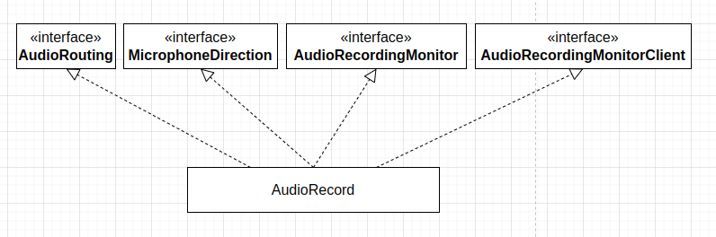
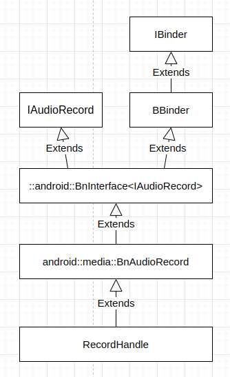
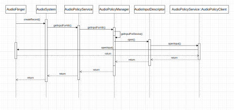

在 Android Java 应用中，一般用 `AudioRecord` 管理从平台的音频输入设备采集音频数据所需的资源。音频采集和音频播放密切关系，Android 系统中 Java `AudioRecord` 和 `AudioTrack` 在许多方面，都有着很高的相似性，无论是代码的目录组织，还是整个类的接口设计和实现结构，但它们也有着不小的区别。对比来看 Java `AudioRecord` 和 `AudioTrack` 的实现，有助于我们对音频的播放和采集做更好地理解。`AudioRecord` 的 Java 代码位于 *frameworks/base/media/java/android/media*，它的 JNI 代码位于 *frameworks/base/core/jni*。Java 层 `AudioRecord` 类实现基于 ***libaudioclient*** 库，该库位于 *frameworks/av/media/libaudioclient*。

## Java AudioRecord 基本使用

Java `AudioRecord` 的基本用法是这样的：

1. 计算缓冲区大小、分配缓冲区并创建 Java `AudioRecord` 对象
```
    private int initRecording(int sampleRate, int channels) {
        Logging.d(TAG, "initRecording(sampleRate=" + sampleRate + ", channels=" + channels + ")");
        if (audioRecord != null) {
            reportAwAudioRecordInitError("InitRecording called twice without StopRecording.");
            return -1;
        }
        final int bytesPerFrame = channels * (BITS_PER_SAMPLE / 8);
        final int framesPerBuffer = sampleRate / BUFFERS_PER_SECOND;
        byteBuffer = ByteBuffer.allocateDirect(bytesPerFrame * framesPerBuffer);
        Logging.d(TAG, "byteBuffer.capacity: " + byteBuffer.capacity());
        emptyBytes = new byte[byteBuffer.capacity()];
        // Rather than passing the ByteBuffer with every callback (requiring
        // the potentially expensive GetDirectBufferAddress) we simply have the
        // the native class cache the address to the memory once.
        nativeCacheDirectBufferAddress(byteBuffer, nativeAudioRecord);

        // Get the minimum buffer size required for the successful creation of
        // an AudioRecord object, in byte units.
        // Note that this size doesn't guarantee a smooth recording under load.
        final int channelConfig = channelCountToConfiguration(channels);
        int minBufferSize =
                AudioRecord.getMinBufferSize(sampleRate, channelConfig, AudioFormat.ENCODING_PCM_16BIT);
        if (minBufferSize == AudioRecord.ERROR || minBufferSize == AudioRecord.ERROR_BAD_VALUE) {
            reportAwAudioRecordInitError("AudioRecord.getMinBufferSize failed: " + minBufferSize);
            return -1;
        }
        Logging.d(TAG, "AudioRecord.getMinBufferSize: " + minBufferSize);

        // Use a larger buffer size than the minimum required when creating the
        // AudioRecord instance to ensure smooth recording under load. It has been
        // verified that it does not increase the actual recording latency.
        int bufferSizeInBytes = Math.max(BUFFER_SIZE_FACTOR * minBufferSize, byteBuffer.capacity());
        Logging.d(TAG, "bufferSizeInBytes: " + bufferSizeInBytes);
        try {
            audioRecord = new AudioRecord(audioSource, sampleRate, channelConfig,
                    AudioFormat.ENCODING_PCM_16BIT, bufferSizeInBytes);
        } catch (IllegalArgumentException e) {
            reportAwAudioRecordInitError("AudioRecord ctor error: " + e.getMessage());
            releaseAudioResources();
            return -1;
        }
        if (audioRecord == null || audioRecord.getState() != AudioRecord.STATE_INITIALIZED) {
            reportAwAudioRecordInitError("Failed to create a new AudioRecord instance");
            releaseAudioResources();
            return -1;
        }
        if (effects != null) {
            effects.enable(audioRecord.getAudioSessionId());
        }
        logMainParameters();
        logMainParametersExtended();
        return framesPerBuffer;
    }
```

2. 启动音频采集
```
    private boolean startRecording() {
        Logging.d(TAG, "startRecording");
        assertTrue(audioRecord != null);
        assertTrue(audioThread == null);
        try {
            audioRecord.startRecording();
        } catch (IllegalStateException e) {
            reportAwAudioRecordStartError(AudioRecordStartErrorCode.AUDIO_RECORD_START_EXCEPTION,
                    "AudioRecord.startRecording failed: " + e.getMessage());
            return false;
        }
        if (audioRecord.getRecordingState() != AudioRecord.RECORDSTATE_RECORDING) {
            reportAwAudioRecordStartError(
                    AudioRecordStartErrorCode.AUDIO_RECORD_START_STATE_MISMATCH,
                    "AudioRecord.startRecording failed - incorrect state :"
                            + audioRecord.getRecordingState());
            return false;
        }
        audioThread = new AudioRecordThread("AudioRecordJavaThread");
        audioThread.start();
        return true;
    }
```

3. 循环从 `AudioRecord` 读出采集的音频 PCM 数据
```
        public void run() {
            Process.setThreadPriority(Process.THREAD_PRIORITY_URGENT_AUDIO);
            Logging.d(TAG, "AudioRecordThread" + AwAudioUtils.getThreadInfo());
            assertTrue(audioRecord.getRecordingState() == AudioRecord.RECORDSTATE_RECORDING);

            long lastTime = System.nanoTime();
            while (keepAlive) {
                int bytesRead = audioRecord.read(byteBuffer, byteBuffer.capacity());
                if (bytesRead == byteBuffer.capacity()) {
                    if (microphoneMute) {
                        byteBuffer.clear();
                        byteBuffer.put(emptyBytes);
                    }
                    // It's possible we've been shut down during the read, and stopRecording() tried and
                    // failed to join this thread. To be a bit safer, try to avoid calling any native methods
                    // in case they've been unregistered after stopRecording() returned.
                    if (keepAlive) {
                        nativeDataIsRecorded(bytesRead, nativeAudioRecord);
                    }
                    if (audioSamplesReadyCallback != null) {
                        // Copy the entire byte buffer array.  Assume that the start of the byteBuffer is
                        // at index 0.
                        byte[] data = Arrays.copyOf(byteBuffer.array(), byteBuffer.capacity());
                        audioSamplesReadyCallback.onAwAudioRecordSamplesReady(
                                new AudioSamples(audioRecord, data));
                    }
                } else {
                    String errorMessage = "AudioRecord.read failed: " + bytesRead;
                    Logging.e(TAG, errorMessage);
                    if (bytesRead == AudioRecord.ERROR_INVALID_OPERATION) {
                        keepAlive = false;
                        reportAwAudioRecordError(errorMessage);
                    }
                }
                if (DEBUG) {
                    long nowTime = System.nanoTime();
                    long durationInMs = TimeUnit.NANOSECONDS.toMillis((nowTime - lastTime));
                    lastTime = nowTime;
                    Logging.d(TAG, "bytesRead[" + durationInMs + "] " + bytesRead);
                }
            }

            try {
                if (audioRecord != null) {
                    audioRecord.stop();
                }
            } catch (IllegalStateException e) {
                Logging.e(TAG, "AudioRecord.stop failed: " + e.getMessage());
            }
        }
```

4. 音频数据采集结束之后，停止采集
```
    private boolean stopRecording() {
        Logging.d(TAG, "stopRecording");
        assertTrue(audioThread != null);
        audioThread.stopThread();
        if (!ThreadUtils.joinUninterruptibly(audioThread, AUDIO_RECORD_THREAD_JOIN_TIMEOUT_MS)) {
            Logging.e(TAG, "Join of AudioRecordJavaThread timed out");
            AwAudioUtils.logAudioState(TAG);
        }
        audioThread = null;
        if (effects != null) {
            effects.release();
        }
        releaseAudioResources();
        return true;
    }
```

5. 释放音频资源
```
    private void releaseAudioResources() {
        Logging.d(TAG, "releaseAudioResources");
        if (audioRecord != null) {
            audioRecord.release();
            audioRecord = null;
        }
    }
```

在用户接口设计上，`AudioRecord` 与 `AudioTrack` 高度相似，仅有的差别在于数据传递，使用者从 `AudioRecord` 读取数据，而向 `AudioTrack` 写入数据。`AudioRecord` 对象在应用程序中表示一条音频输入流，管理相关的音频资源。

这里的代码分析基于 ***android-security-12.0.0_r43*** 进行。

## AudioRecord 对象构造过程

`AudioRecord` Java 类继承层次结构如下图：



`AudioRecord` Java 类构造函数定义 (位于 *frameworks/base/media/java/android/media/AudioRecord.java*) 如下：
```
    @RequiresPermission(android.Manifest.permission.RECORD_AUDIO)
    public AudioRecord(int audioSource, int sampleRateInHz, int channelConfig, int audioFormat,
            int bufferSizeInBytes)
    throws IllegalArgumentException {
        this((new AudioAttributes.Builder())
                    .setInternalCapturePreset(audioSource)
                    .build(),
                (new AudioFormat.Builder())
                    .setChannelMask(getChannelMaskFromLegacyConfig(channelConfig,
                                        true/*allow legacy configurations*/))
                    .setEncoding(audioFormat)
                    .setSampleRate(sampleRateInHz)
                    .build(),
                bufferSizeInBytes,
                AudioManager.AUDIO_SESSION_ID_GENERATE);
    }

 . . . . . .
    @SystemApi
    @RequiresPermission(android.Manifest.permission.RECORD_AUDIO)
    public AudioRecord(AudioAttributes attributes, AudioFormat format, int bufferSizeInBytes,
            int sessionId) throws IllegalArgumentException {
        this(attributes, format, bufferSizeInBytes, sessionId,
                ActivityThread.currentApplication(), 0 /*maxSharedAudioHistoryMs*/);
    }
 . . . . . .
    private AudioRecord(AudioAttributes attributes, AudioFormat format, int bufferSizeInBytes,
            int sessionId, @Nullable Context context,
            int maxSharedAudioHistoryMs) throws IllegalArgumentException {
        mRecordingState = RECORDSTATE_STOPPED;

        if (attributes == null) {
            throw new IllegalArgumentException("Illegal null AudioAttributes");
        }
        if (format == null) {
            throw new IllegalArgumentException("Illegal null AudioFormat");
        }

        // remember which looper is associated with the AudioRecord instanciation
        if ((mInitializationLooper = Looper.myLooper()) == null) {
            mInitializationLooper = Looper.getMainLooper();
        }

        // is this AudioRecord using REMOTE_SUBMIX at full volume?
        if (attributes.getCapturePreset() == MediaRecorder.AudioSource.REMOTE_SUBMIX) {
            final AudioAttributes.Builder filteredAttr = new AudioAttributes.Builder();
            final Iterator<String> tagsIter = attributes.getTags().iterator();
            while (tagsIter.hasNext()) {
                final String tag = tagsIter.next();
                if (tag.equalsIgnoreCase(SUBMIX_FIXED_VOLUME)) {
                    mIsSubmixFullVolume = true;
                    Log.v(TAG, "Will record from REMOTE_SUBMIX at full fixed volume");
                } else { // SUBMIX_FIXED_VOLUME: is not to be propagated to the native layers
                    filteredAttr.addTag(tag);
                }
            }
            filteredAttr.setInternalCapturePreset(attributes.getCapturePreset());
            mAudioAttributes = filteredAttr.build();
        } else {
            mAudioAttributes = attributes;
        }

        int rate = format.getSampleRate();
        if (rate == AudioFormat.SAMPLE_RATE_UNSPECIFIED) {
            rate = 0;
        }

        int encoding = AudioFormat.ENCODING_DEFAULT;
        if ((format.getPropertySetMask() & AudioFormat.AUDIO_FORMAT_HAS_PROPERTY_ENCODING) != 0)
        {
            encoding = format.getEncoding();
        }

        audioParamCheck(attributes.getCapturePreset(), rate, encoding);

        if ((format.getPropertySetMask()
                & AudioFormat.AUDIO_FORMAT_HAS_PROPERTY_CHANNEL_INDEX_MASK) != 0) {
            mChannelIndexMask = format.getChannelIndexMask();
            mChannelCount = format.getChannelCount();
        }
        if ((format.getPropertySetMask()
                & AudioFormat.AUDIO_FORMAT_HAS_PROPERTY_CHANNEL_MASK) != 0) {
            mChannelMask = getChannelMaskFromLegacyConfig(format.getChannelMask(), false);
            mChannelCount = format.getChannelCount();
        } else if (mChannelIndexMask == 0) {
            mChannelMask = getChannelMaskFromLegacyConfig(AudioFormat.CHANNEL_IN_DEFAULT, false);
            mChannelCount =  AudioFormat.channelCountFromInChannelMask(mChannelMask);
        }

        audioBuffSizeCheck(bufferSizeInBytes);

        AttributionSource attributionSource = (context != null)
                ? context.getAttributionSource() : AttributionSource.myAttributionSource();
        if (attributionSource.getPackageName() == null) {
            // Command line utility
            attributionSource = attributionSource.withPackageName("uid:" + Binder.getCallingUid());
        }

        int[] sampleRate = new int[] {mSampleRate};
        int[] session = new int[1];
        session[0] = sessionId;

        //TODO: update native initialization when information about hardware init failure
        //      due to capture device already open is available.
        try (ScopedParcelState attributionSourceState = attributionSource.asScopedParcelState()) {
            int initResult = native_setup(new WeakReference<AudioRecord>(this), mAudioAttributes,
                    sampleRate, mChannelMask, mChannelIndexMask, mAudioFormat,
                    mNativeBufferSizeInBytes, session, attributionSourceState.getParcel(),
                    0 /*nativeRecordInJavaObj*/, maxSharedAudioHistoryMs);
            if (initResult != SUCCESS) {
                loge("Error code " + initResult + " when initializing native AudioRecord object.");
                return; // with mState == STATE_UNINITIALIZED
            }
        }

        mSampleRate = sampleRate[0];
        mSessionId = session[0];

        mState = STATE_INITIALIZED;
    }
```

`AudioRecord` Java 类对象构造时，需要传入音频源、采样率、通道配置、采样格式和缓冲区大小等关于音频流的配置参数。*frameworks/base/media/java/android/media/MediaRecorder.java* 中定义的可选音频源包括如下这些：
 * **MediaRecorder.AudioSource.DEFAULT**
 * **MediaRecorder.AudioSource.MIC**
 * **MediaRecorder.AudioSource.VOICE_UPLINK**
 * **MediaRecorder.AudioSource.VOICE_DOWNLINK**
 * **MediaRecorder.AudioSource.VOICE_CALL**
 * **MediaRecorder.AudioSource.CAMCORDER**
 * **MediaRecorder.AudioSource.VOICE_RECOGNITION**
 * **MediaRecorder.AudioSource.VOICE_COMMUNICATION**
 * **MediaRecorder.AudioSource.REMOTE_SUBMIX**
 * **MediaRecorder.AudioSource.UNPROCESSED**
 * **MediaRecorder.AudioSource.ECHO_REFERENCE**
 * **MediaRecorder.AudioSource.RADIO_TUNER**
 * **MediaRecorder.AudioSource.HOTWORD**

`AudioRecord` Java 类对象构造过程如下：
1. 立即将状态设置为 `RECORDSTATE_STOPPED`；
2. 初始化 `mInitializationLooper`；
3. 检查采样率、采样格式和缓冲区大小等参数，初始化通道掩码格式和通道数；
4. 创建缓冲区，用于本地层代码返回数据，如会话 ID 和采样率；
5. 执行本地层方法 `native_setup()` 创建本地层资源；
6. 根据本地层返回的值初始化一些状态，如会话 ID 和采样率；
7. 更新状态为 `STATE_INITIALIZED`。

`AudioRecord` 的本地层方法 `native_setup()` 定义 (位于 *frameworks/base/core/jni/android_media_AudioRecord.cpp*) 如下：
```
static jint android_media_AudioRecord_setup(JNIEnv *env, jobject thiz, jobject weak_this,
                                            jobject jaa, jintArray jSampleRate, jint channelMask,
                                            jint channelIndexMask, jint audioFormat,
                                            jint buffSizeInBytes, jintArray jSession,
                                            jobject jAttributionSource, jlong nativeRecordInJavaObj,
                                            jint sharedAudioHistoryMs) {
    //ALOGV(">> Entering android_media_AudioRecord_setup");
    //ALOGV("sampleRate=%d, audioFormat=%d, channel mask=%x, buffSizeInBytes=%d "
    //     "nativeRecordInJavaObj=0x%llX",
    //     sampleRateInHertz, audioFormat, channelMask, buffSizeInBytes, nativeRecordInJavaObj);
    audio_channel_mask_t localChanMask = inChannelMaskToNative(channelMask);

    if (jSession == NULL) {
        ALOGE("Error creating AudioRecord: invalid session ID pointer");
        return (jint) AUDIO_JAVA_ERROR;
    }

    jint* nSession = (jint *) env->GetPrimitiveArrayCritical(jSession, NULL);
    if (nSession == NULL) {
        ALOGE("Error creating AudioRecord: Error retrieving session id pointer");
        return (jint) AUDIO_JAVA_ERROR;
    }
    audio_session_t sessionId = (audio_session_t) nSession[0];
    env->ReleasePrimitiveArrayCritical(jSession, nSession, 0);
    nSession = NULL;

    sp<AudioRecord> lpRecorder = 0;
    audiorecord_callback_cookie *lpCallbackData = NULL;

    jclass clazz = env->GetObjectClass(thiz);
    if (clazz == NULL) {
        ALOGE("Can't find %s when setting up callback.", kClassPathName);
        return (jint) AUDIORECORD_ERROR_SETUP_NATIVEINITFAILED;
    }

    // if we pass in an existing *Native* AudioRecord, we don't need to create/initialize one.
    if (nativeRecordInJavaObj == 0) {
        if (jaa == 0) {
            ALOGE("Error creating AudioRecord: invalid audio attributes");
            return (jint) AUDIO_JAVA_ERROR;
        }

        if (jSampleRate == 0) {
            ALOGE("Error creating AudioRecord: invalid sample rates");
            return (jint) AUDIO_JAVA_ERROR;
        }
        jint elements[1];
        env->GetIntArrayRegion(jSampleRate, 0, 1, elements);
        int sampleRateInHertz = elements[0];

        // channel index mask takes priority over channel position masks.
        if (channelIndexMask) {
            // Java channel index masks need the representation bits set.
            localChanMask = audio_channel_mask_from_representation_and_bits(
                    AUDIO_CHANNEL_REPRESENTATION_INDEX,
                    channelIndexMask);
        }
        // Java channel position masks map directly to the native definition

        if (!audio_is_input_channel(localChanMask)) {
            ALOGE("Error creating AudioRecord: channel mask %#x is not valid.", localChanMask);
            return (jint) AUDIORECORD_ERROR_SETUP_INVALIDCHANNELMASK;
        }
        uint32_t channelCount = audio_channel_count_from_in_mask(localChanMask);

        // compare the format against the Java constants
        audio_format_t format = audioFormatToNative(audioFormat);
        if (format == AUDIO_FORMAT_INVALID) {
            ALOGE("Error creating AudioRecord: unsupported audio format %d.", audioFormat);
            return (jint) AUDIORECORD_ERROR_SETUP_INVALIDFORMAT;
        }

        size_t bytesPerSample = audio_bytes_per_sample(format);

        if (buffSizeInBytes == 0) {
            ALOGE("Error creating AudioRecord: frameCount is 0.");
            return (jint) AUDIORECORD_ERROR_SETUP_ZEROFRAMECOUNT;
        }
        size_t frameSize = channelCount * bytesPerSample;
        size_t frameCount = buffSizeInBytes / frameSize;

        // create an uninitialized AudioRecord object
        Parcel* parcel = parcelForJavaObject(env, jAttributionSource);
        android::content::AttributionSourceState attributionSource;
        attributionSource.readFromParcel(parcel);

        lpRecorder = new AudioRecord(attributionSource);

        // read the AudioAttributes values
        auto paa = JNIAudioAttributeHelper::makeUnique();
        jint jStatus = JNIAudioAttributeHelper::nativeFromJava(env, jaa, paa.get());
        if (jStatus != (jint)AUDIO_JAVA_SUCCESS) {
            return jStatus;
        }
        ALOGV("AudioRecord_setup for source=%d tags=%s flags=%08x", paa->source, paa->tags, paa->flags);

        audio_input_flags_t flags = AUDIO_INPUT_FLAG_NONE;
        if (paa->flags & AUDIO_FLAG_HW_HOTWORD) {
            flags = AUDIO_INPUT_FLAG_HW_HOTWORD;
        }
        // create the callback information:
        // this data will be passed with every AudioRecord callback
        lpCallbackData = new audiorecord_callback_cookie;
        lpCallbackData->audioRecord_class = (jclass)env->NewGlobalRef(clazz);
        // we use a weak reference so the AudioRecord object can be garbage collected.
        lpCallbackData->audioRecord_ref = env->NewGlobalRef(weak_this);
        lpCallbackData->busy = false;

        const status_t status =
                lpRecorder->set(paa->source, sampleRateInHertz,
                                format, // word length, PCM
                                localChanMask, frameCount,
                                recorderCallback, // callback_t
                                lpCallbackData,   // void* user
                                0,                // notificationFrames,
                                true,             // threadCanCallJava
                                sessionId, AudioRecord::TRANSFER_DEFAULT, flags, -1,
                                -1, // default uid, pid
                                paa.get(), AUDIO_PORT_HANDLE_NONE, MIC_DIRECTION_UNSPECIFIED,
                                MIC_FIELD_DIMENSION_DEFAULT, sharedAudioHistoryMs);

        if (status != NO_ERROR) {
            ALOGE("Error creating AudioRecord instance: initialization check failed with status %d.",
                    status);
            goto native_init_failure;
        }
        // Set caller name so it can be logged in destructor.
        // MediaMetricsConstants.h: AMEDIAMETRICS_PROP_CALLERNAME_VALUE_JAVA
        lpRecorder->setCallerName("java");
    } else { // end if nativeRecordInJavaObj == 0)
        lpRecorder = (AudioRecord*)nativeRecordInJavaObj;
        // TODO: We need to find out which members of the Java AudioRecord might need to be
        // initialized from the Native AudioRecord
        // these are directly returned from getters:
        //  mSampleRate
        //  mRecordSource
        //  mAudioFormat
        //  mChannelMask
        //  mChannelCount
        //  mState (?)
        //  mRecordingState (?)
        //  mPreferredDevice

        // create the callback information:
        // this data will be passed with every AudioRecord callback
        lpCallbackData = new audiorecord_callback_cookie;
        lpCallbackData->audioRecord_class = (jclass)env->NewGlobalRef(clazz);
        // we use a weak reference so the AudioRecord object can be garbage collected.
        lpCallbackData->audioRecord_ref = env->NewGlobalRef(weak_this);
        lpCallbackData->busy = false;
    }

    nSession = (jint *) env->GetPrimitiveArrayCritical(jSession, NULL);
    if (nSession == NULL) {
        ALOGE("Error creating AudioRecord: Error retrieving session id pointer");
        goto native_init_failure;
    }
    // read the audio session ID back from AudioRecord in case a new session was created during set()
    nSession[0] = lpRecorder->getSessionId();
    env->ReleasePrimitiveArrayCritical(jSession, nSession, 0);
    nSession = NULL;

    {
        const jint elements[1] = { (jint) lpRecorder->getSampleRate() };
        env->SetIntArrayRegion(jSampleRate, 0, 1, elements);
    }

    {   // scope for the lock
        Mutex::Autolock l(sLock);
        sAudioRecordCallBackCookies.add(lpCallbackData);
    }
    // save our newly created C++ AudioRecord in the "nativeRecorderInJavaObj" field
    // of the Java object
    setAudioRecord(env, thiz, lpRecorder);

    // save our newly created callback information in the "nativeCallbackCookie" field
    // of the Java object (in mNativeCallbackCookie) so we can free the memory in finalize()
    env->SetLongField(thiz, javaAudioRecordFields.nativeCallbackCookie, (jlong)lpCallbackData);

    return (jint) AUDIO_JAVA_SUCCESS;

    // failure:
native_init_failure:
    env->DeleteGlobalRef(lpCallbackData->audioRecord_class);
    env->DeleteGlobalRef(lpCallbackData->audioRecord_ref);
    delete lpCallbackData;
    env->SetLongField(thiz, javaAudioRecordFields.nativeCallbackCookie, 0);

    // lpRecorder goes out of scope, so reference count drops to zero
    return (jint) AUDIORECORD_ERROR_SETUP_NATIVEINITFAILED;
}
```

`native_setup()` 函数为 `AudioRecord` Java 类对象分配并初始化必要的本地层对象。`AudioRecord` Java 类基于本地层 C++ 类 `android::AudioRecord` 实现。`native_setup()` 函数允许传入一个 `android::AudioRecord` 类对象的指针，当传入的指针非空时，`native_setup()` 函数为 `AudioRecord` Java 类对象创建一个 `audiorecord_callback_cookie` 对象，该对象主要用于从本地层向 Java 层回调事件；随后通过 JNI 机制，调用 Java 方法向 `AudioRecord` Java 类对象返回音频参数，如会话 ID、采样率、`android::AudioRecord` 类对象的指针，和 `audiorecord_callback_cookie` 对象的指针。

`native_setup()` 函数允许传入非空的 `android::AudioRecord` 类对象的指针主要因为，在某些场景下，需要将一个已经创建好的 `android::AudioRecord` 类对象与 Java 对象连接起来，`AudioRecord` Java 类提供了一个以指向本地层 `android::AudioRecord` 类对象的指针为参数的构造函数，如：
```
    /*package*/ AudioRecord(long nativeRecordInJavaObj) {
        mNativeRecorderInJavaObj = 0;
        mNativeCallbackCookie = 0;
        mNativeDeviceCallback = 0;

        // other initialization...
        if (nativeRecordInJavaObj != 0) {
            deferred_connect(nativeRecordInJavaObj);
        } else {
            mState = STATE_UNINITIALIZED;
        }
    }
 . . . . . .
    /**
     * @hide
     */
    /* package */ void deferred_connect(long  nativeRecordInJavaObj) {
        if (mState != STATE_INITIALIZED) {
            int[] session = {0};
            int[] rates = {0};
            //TODO: update native initialization when information about hardware init failure
            //      due to capture device already open is available.
            // Note that for this native_setup, we are providing an already created/initialized
            // *Native* AudioRecord, so the attributes parameters to native_setup() are ignored.
            final int initResult;
            try (ScopedParcelState attributionSourceState = AttributionSource.myAttributionSource()
                    .asScopedParcelState()) {
                initResult = native_setup(new WeakReference<>(this),
                        null /*mAudioAttributes*/,
                        rates /*mSampleRates*/,
                        0 /*mChannelMask*/,
                        0 /*mChannelIndexMask*/,
                        0 /*mAudioFormat*/,
                        0 /*mNativeBufferSizeInBytes*/,
                        session,
                        attributionSourceState.getParcel(),
                        nativeRecordInJavaObj,
                        0);
            }
            if (initResult != SUCCESS) {
                loge("Error code "+initResult+" when initializing native AudioRecord object.");
                return; // with mState == STATE_UNINITIALIZED
            }

            mSessionId = session[0];

            mState = STATE_INITIALIZED;
        }
    }
```

一般情况下，`native_setup()` 函数收到的 `android::AudioRecord` 类对象指针为空，此时该函数的执行过程如下：

1. 检查音频配置参数，如会话 ID、采样率、通道掩码和通道数，采样格式等，；
2. 根据缓冲区的大小和音频格式计算每个音频帧的字节数和帧数；
3. 创建 `android::AudioRecord` 对象；
4. 创建 `audiorecord_callback_cookie` 对象；
5. 调用 `android::AudioRecord` 对象的 `set()` 函数执行初始化；
6. 与收到的 `android::AudioRecord` 类对象指针非空的情况相同，通过 JNI 机制调用 Java 方法向 `AudioRecord` Java 类对象返回音频参数。

***native_setup() 函数收到的 `android::AudioRecord` 类对象指针为空和非空两种情况，从代码上看，不是很有必要放在同一个函数中，将这个函数一拆为三比较好，一个用于处理收到的 `android::AudioRecord` 类对象指针为空的情况，一个用于处理非空的情况，还有一个用于向 Java 层返回值。对照收到的 `android::AudioRecord` 类对象指针为空的情况的处理，从名字来看， `audiorecord_callback_cookie` 用于保存回调相关数据，收到的 `android::AudioRecord` 类对象指针非空时，没有向 `android::AudioRecord` 对象注册回调，是否是合理的，是否是遗漏了什么？*** 

调用 `android::AudioRecord` 对象的 `set()` 函数时，传入了回调函数 `recorderCallback`，传入的该回调函数的 user data 为 `audiorecord_callback_cookie` 对象，`android::AudioRecord` 将会创建线程，通过这个回调函数向 Java 层传递事件，如：
```
static void recorderCallback(int event, void* user, void *info) {

    audiorecord_callback_cookie *callbackInfo = (audiorecord_callback_cookie *)user;
    {
        Mutex::Autolock l(sLock);
        if (sAudioRecordCallBackCookies.indexOf(callbackInfo) < 0) {
            return;
        }
        callbackInfo->busy = true;
    }

    switch (event) {
    case AudioRecord::EVENT_MARKER: {
        JNIEnv *env = AndroidRuntime::getJNIEnv();
        if (user != NULL && env != NULL) {
            env->CallStaticVoidMethod(
                callbackInfo->audioRecord_class,
                javaAudioRecordFields.postNativeEventInJava,
                callbackInfo->audioRecord_ref, event, 0,0, NULL);
            if (env->ExceptionCheck()) {
                env->ExceptionDescribe();
                env->ExceptionClear();
            }
        }
        } break;

    case AudioRecord::EVENT_NEW_POS: {
        JNIEnv *env = AndroidRuntime::getJNIEnv();
        if (user != NULL && env != NULL) {
            env->CallStaticVoidMethod(
                callbackInfo->audioRecord_class,
                javaAudioRecordFields.postNativeEventInJava,
                callbackInfo->audioRecord_ref, event, 0,0, NULL);
            if (env->ExceptionCheck()) {
                env->ExceptionDescribe();
                env->ExceptionClear();
            }
        }
        } break;
    }

    {
        Mutex::Autolock l(sLock);
        callbackInfo->busy = false;
        callbackInfo->cond.broadcast();
    }
}
```

`android::AudioRecord` 对象构造过程 (位于 *frameworks/av/media/libaudioclient/AudioRecord.cpp*) 如下：
```
AudioRecord::AudioRecord(const AttributionSourceState &client)
    : mActive(false), mStatus(NO_INIT), mClientAttributionSource(client),
      mSessionId(AUDIO_SESSION_ALLOCATE), mPreviousPriority(ANDROID_PRIORITY_NORMAL),
      mPreviousSchedulingGroup(SP_DEFAULT), mSelectedDeviceId(AUDIO_PORT_HANDLE_NONE),
      mRoutedDeviceId(AUDIO_PORT_HANDLE_NONE), mSelectedMicDirection(MIC_DIRECTION_UNSPECIFIED),
      mSelectedMicFieldDimension(MIC_FIELD_DIMENSION_DEFAULT)
{
}

AudioRecord::AudioRecord(
        audio_source_t inputSource,
        uint32_t sampleRate,
        audio_format_t format,
        audio_channel_mask_t channelMask,
        const AttributionSourceState& client,
        size_t frameCount,
        callback_t cbf,
        void* user,
        uint32_t notificationFrames,
        audio_session_t sessionId,
        transfer_type transferType,
        audio_input_flags_t flags,
        const audio_attributes_t* pAttributes,
        audio_port_handle_t selectedDeviceId,
        audio_microphone_direction_t selectedMicDirection,
        float microphoneFieldDimension)
    : mActive(false),
      mStatus(NO_INIT),
      mClientAttributionSource(client),
      mSessionId(AUDIO_SESSION_ALLOCATE),
      mPreviousPriority(ANDROID_PRIORITY_NORMAL),
      mPreviousSchedulingGroup(SP_DEFAULT),
      mProxy(NULL)
{
    uid_t uid = VALUE_OR_FATAL(aidl2legacy_int32_t_uid_t(mClientAttributionSource.uid));
    pid_t pid = VALUE_OR_FATAL(aidl2legacy_int32_t_pid_t(mClientAttributionSource.pid));
    (void)set(inputSource, sampleRate, format, channelMask, frameCount, cbf, user,
            notificationFrames, false /*threadCanCallJava*/, sessionId, transferType, flags,
            uid, pid, pAttributes, selectedDeviceId, selectedMicDirection,
            microphoneFieldDimension);
}
```

`android::AudioRecord` 的 `set()` 函数用于执行初始化，这个函数定义 (位于 *frameworks/av/media/libaudioclient/AudioRecord.cpp*) 如下：
```
status_t AudioRecord::set(
        audio_source_t inputSource,
        uint32_t sampleRate,
        audio_format_t format,
        audio_channel_mask_t channelMask,
        size_t frameCount,
        callback_t cbf,
        void* user,
        uint32_t notificationFrames,
        bool threadCanCallJava,
        audio_session_t sessionId,
        transfer_type transferType,
        audio_input_flags_t flags,
        uid_t uid,
        pid_t pid,
        const audio_attributes_t* pAttributes,
        audio_port_handle_t selectedDeviceId,
        audio_microphone_direction_t selectedMicDirection,
        float microphoneFieldDimension,
        int32_t maxSharedAudioHistoryMs)
{
    status_t status = NO_ERROR;
    uint32_t channelCount;

    // Note mPortId is not valid until the track is created, so omit mPortId in ALOG for set.
    ALOGV("%s(): inputSource %d, sampleRate %u, format %#x, channelMask %#x, frameCount %zu, "
          "notificationFrames %u, sessionId %d, transferType %d, flags %#x, attributionSource %s"
          "uid %d, pid %d",
          __func__,
          inputSource, sampleRate, format, channelMask, frameCount, notificationFrames,
          sessionId, transferType, flags, mClientAttributionSource.toString().c_str(), uid, pid);

    // TODO b/182392553: refactor or remove
    pid_t callingPid = IPCThreadState::self()->getCallingPid();
    pid_t myPid = getpid();
    pid_t adjPid = pid;
    if (pid == -1 || (callingPid != myPid)) {
        adjPid = callingPid;
    }
    mClientAttributionSource.pid = VALUE_OR_FATAL(legacy2aidl_pid_t_int32_t(adjPid));

    uid_t adjUid = uid;
    if (uid == -1 || (callingPid != myPid)) {
        adjUid = IPCThreadState::self()->getCallingUid();
    }
    mClientAttributionSource.uid = VALUE_OR_FATAL(legacy2aidl_uid_t_int32_t(adjUid));

    mTracker.reset(new RecordingActivityTracker());

    mSelectedDeviceId = selectedDeviceId;
    mSelectedMicDirection = selectedMicDirection;
    mSelectedMicFieldDimension = microphoneFieldDimension;
    mMaxSharedAudioHistoryMs = maxSharedAudioHistoryMs;

    switch (transferType) {
    case TRANSFER_DEFAULT:
        if (cbf == NULL || threadCanCallJava) {
            transferType = TRANSFER_SYNC;
        } else {
            transferType = TRANSFER_CALLBACK;
        }
        break;
    case TRANSFER_CALLBACK:
        if (cbf == NULL) {
            ALOGE("%s(): Transfer type TRANSFER_CALLBACK but cbf == NULL", __func__);
            status = BAD_VALUE;
            goto exit;
        }
        break;
    case TRANSFER_OBTAIN:
    case TRANSFER_SYNC:
        break;
    default:
        ALOGE("%s(): Invalid transfer type %d", __func__, transferType);
        status = BAD_VALUE;
        goto exit;
    }
    mTransfer = transferType;

    // invariant that mAudioRecord != 0 is true only after set() returns successfully
    if (mAudioRecord != 0) {
        ALOGE("%s(): Track already in use", __func__);
        status = INVALID_OPERATION;
        goto exit;
    }

    if (pAttributes == NULL) {
        mAttributes = AUDIO_ATTRIBUTES_INITIALIZER;
        mAttributes.source = inputSource;
        if (inputSource == AUDIO_SOURCE_VOICE_COMMUNICATION
                || inputSource == AUDIO_SOURCE_CAMCORDER) {
            mAttributes.flags = static_cast<audio_flags_mask_t>(
                    mAttributes.flags | AUDIO_FLAG_CAPTURE_PRIVATE);
        }
    } else {
        // stream type shouldn't be looked at, this track has audio attributes
        memcpy(&mAttributes, pAttributes, sizeof(audio_attributes_t));
        ALOGV("%s(): Building AudioRecord with attributes: source=%d flags=0x%x tags=[%s]",
                __func__, mAttributes.source, mAttributes.flags, mAttributes.tags);
    }

    mSampleRate = sampleRate;

    // these below should probably come from the audioFlinger too...
    if (format == AUDIO_FORMAT_DEFAULT) {
        format = AUDIO_FORMAT_PCM_16_BIT;
    }

    // validate parameters
    // AudioFlinger capture only supports linear PCM
    if (!audio_is_valid_format(format) || !audio_is_linear_pcm(format)) {
        ALOGE("%s(): Format %#x is not linear pcm", __func__, format);
        status = BAD_VALUE;
        goto exit;
    }
    mFormat = format;

    if (!audio_is_input_channel(channelMask)) {
        ALOGE("%s(): Invalid channel mask %#x", __func__, channelMask);
        status = BAD_VALUE;
        goto exit;
    }
    mChannelMask = channelMask;
    channelCount = audio_channel_count_from_in_mask(channelMask);
    mChannelCount = channelCount;

    if (audio_is_linear_pcm(format)) {
        mFrameSize = channelCount * audio_bytes_per_sample(format);
    } else {
        mFrameSize = sizeof(uint8_t);
    }

    // mFrameCount is initialized in createRecord_l
    mReqFrameCount = frameCount;

    mNotificationFramesReq = notificationFrames;
    // mNotificationFramesAct is initialized in createRecord_l

    mSessionId = sessionId;
    ALOGV("%s(): mSessionId %d", __func__, mSessionId);

    mOrigFlags = mFlags = flags;
    mCbf = cbf;

    if (cbf != NULL) {
        mAudioRecordThread = new AudioRecordThread(*this);
        mAudioRecordThread->run("AudioRecord", ANDROID_PRIORITY_AUDIO);
        // thread begins in paused state, and will not reference us until start()
    }

    // create the IAudioRecord
    {
        AutoMutex lock(mLock);
        status = createRecord_l(0 /*epoch*/);
    }

    ALOGV("%s(%d): status %d", __func__, mPortId, status);

    if (status != NO_ERROR) {
        if (mAudioRecordThread != 0) {
            mAudioRecordThread->requestExit();   // see comment in AudioRecord.h
            mAudioRecordThread->requestExitAndWait();
            mAudioRecordThread.clear();
        }
        goto exit;
    }

    mUserData = user;
    // TODO: add audio hardware input latency here
    mLatency = (1000LL * mFrameCount) / mSampleRate;
    mMarkerPosition = 0;
    mMarkerReached = false;
    mNewPosition = 0;
    mUpdatePeriod = 0;
    AudioSystem::acquireAudioSessionId(mSessionId, adjPid, adjUid);
    mSequence = 1;
    mObservedSequence = mSequence;
    mInOverrun = false;
    mFramesRead = 0;
    mFramesReadServerOffset = 0;

exit:
    mStatus = status;
    if (status != NO_ERROR) {
        mMediaMetrics.markError(status, __FUNCTION__);
    }
    return status;
}
```

这个函数的执行过程如下：
1. 检查并初始化音频配置参数，如设备 ID，传输类型，采样率，采样格式，通道掩码和通道数，帧大小，请求帧数，会话 ID，标记，回调函数等；
2. 传入的回调函数非空时，创建 `AudioRecordThread` 线程；
3. 请求 AudioFlinger 创建 RecordTrack，RecordTrack 用于在 AudioFlinger 端管理应用程序与 AudioFlinger 之间采集的音频数据的传输和同步；
4. 初始化其它状态。

`AudioRecord::createRecord_l()` 函数请求 AudioFlinger 创建 RecordTrack，该函数定义 (位于 *frameworks/av/media/libaudioclient/AudioRecord.cpp*) 如下：
```
// must be called with mLock held
status_t AudioRecord::createRecord_l(const Modulo<uint32_t> &epoch)
{
    const int64_t beginNs = systemTime();
    const sp<IAudioFlinger>& audioFlinger = AudioSystem::get_audio_flinger();
    IAudioFlinger::CreateRecordInput input;
    IAudioFlinger::CreateRecordOutput output;
    audio_session_t originalSessionId;
    void *iMemPointer;
    audio_track_cblk_t* cblk;
    status_t status;
    static const int32_t kMaxCreateAttempts = 3;
    int32_t remainingAttempts = kMaxCreateAttempts;

    if (audioFlinger == 0) {
        ALOGE("%s(%d): Could not get audioflinger", __func__, mPortId);
        status = NO_INIT;
        goto exit;
    }

    // mFlags (not mOrigFlags) is modified depending on whether fast request is accepted.
    // After fast request is denied, we will request again if IAudioRecord is re-created.

    // Now that we have a reference to an I/O handle and have not yet handed it off to AudioFlinger,
    // we must release it ourselves if anything goes wrong.

    // Client can only express a preference for FAST.  Server will perform additional tests.
    if (mFlags & AUDIO_INPUT_FLAG_FAST) {
        bool useCaseAllowed =
            // any of these use cases:
            // use case 1: callback transfer mode
            (mTransfer == TRANSFER_CALLBACK) ||
            // use case 2: blocking read mode
            // The default buffer capacity at 48 kHz is 2048 frames, or ~42.6 ms.
            // That's enough for double-buffering with our standard 20 ms rule of thumb for
            // the minimum period of a non-SCHED_FIFO thread.
            // This is needed so that AAudio apps can do a low latency non-blocking read from a
            // callback running with SCHED_FIFO.
            (mTransfer == TRANSFER_SYNC) ||
            // use case 3: obtain/release mode
            (mTransfer == TRANSFER_OBTAIN);
        if (!useCaseAllowed) {
            ALOGD("%s(%d): AUDIO_INPUT_FLAG_FAST denied, incompatible transfer = %s",
                  __func__, mPortId,
                  convertTransferToText(mTransfer));
            mFlags = (audio_input_flags_t) (mFlags & ~(AUDIO_INPUT_FLAG_FAST |
                    AUDIO_INPUT_FLAG_RAW));
        }
    }

    input.attr = mAttributes;
    input.config.sample_rate = mSampleRate;
    input.config.channel_mask = mChannelMask;
    input.config.format = mFormat;
    input.clientInfo.attributionSource = mClientAttributionSource;
    input.clientInfo.clientTid = -1;
    if (mFlags & AUDIO_INPUT_FLAG_FAST) {
        if (mAudioRecordThread != 0) {
            input.clientInfo.clientTid = mAudioRecordThread->getTid();
        }
    }
    input.riid = mTracker->getRiid();

    input.flags = mFlags;
    // The notification frame count is the period between callbacks, as suggested by the client
    // but moderated by the server.  For record, the calculations are done entirely on server side.
    input.frameCount = mReqFrameCount;
    input.notificationFrameCount = mNotificationFramesReq;
    input.selectedDeviceId = mSelectedDeviceId;
    input.sessionId = mSessionId;
    originalSessionId = mSessionId;
    input.maxSharedAudioHistoryMs = mMaxSharedAudioHistoryMs;

    do {
        media::CreateRecordResponse response;
        status = audioFlinger->createRecord(VALUE_OR_FATAL(input.toAidl()), response);
        output = VALUE_OR_FATAL(IAudioFlinger::CreateRecordOutput::fromAidl(response));
        if (status == NO_ERROR) {
            break;
        }
        if (status != FAILED_TRANSACTION || --remainingAttempts <= 0) {
            ALOGE("%s(%d): AudioFlinger could not create record track, status: %d",
                  __func__, mPortId, status);
            goto exit;
        }
        // FAILED_TRANSACTION happens under very specific conditions causing a state mismatch
        // between audio policy manager and audio flinger during the input stream open sequence
        // and can be recovered by retrying.
        // Leave time for race condition to clear before retrying and randomize delay
        // to reduce the probability of concurrent retries in locked steps.
        usleep((20 + rand() % 30) * 10000);
    } while (1);

    ALOG_ASSERT(output.audioRecord != 0);

    // AudioFlinger now owns the reference to the I/O handle,
    // so we are no longer responsible for releasing it.

    mAwaitBoost = false;
    if (output.flags & AUDIO_INPUT_FLAG_FAST) {
        ALOGI("%s(%d): AUDIO_INPUT_FLAG_FAST successful; frameCount %zu -> %zu",
              __func__, mPortId,
              mReqFrameCount, output.frameCount);
        mAwaitBoost = true;
    }
    mFlags = output.flags;
    mRoutedDeviceId = output.selectedDeviceId;
    mSessionId = output.sessionId;
    mSampleRate = output.sampleRate;

    if (output.cblk == 0) {
        ALOGE("%s(%d): Could not get control block", __func__, mPortId);
        status = NO_INIT;
        goto exit;
    }
    // TODO: Using unsecurePointer() has some associated security pitfalls
    //       (see declaration for details).
    //       Either document why it is safe in this case or address the
    //       issue (e.g. by copying).
    iMemPointer = output.cblk ->unsecurePointer();
    if (iMemPointer == NULL) {
        ALOGE("%s(%d): Could not get control block pointer", __func__, mPortId);
        status = NO_INIT;
        goto exit;
    }
    cblk = static_cast<audio_track_cblk_t*>(iMemPointer);

    // Starting address of buffers in shared memory.
    // The buffers are either immediately after the control block,
    // or in a separate area at discretion of server.
    void *buffers;
    if (output.buffers == 0) {
        buffers = cblk + 1;
    } else {
        // TODO: Using unsecurePointer() has some associated security pitfalls
        //       (see declaration for details).
        //       Either document why it is safe in this case or address the
        //       issue (e.g. by copying).
        buffers = output.buffers->unsecurePointer();
        if (buffers == NULL) {
            ALOGE("%s(%d): Could not get buffer pointer", __func__, mPortId);
            status = NO_INIT;
            goto exit;
        }
    }

    // invariant that mAudioRecord != 0 is true only after set() returns successfully
    if (mAudioRecord != 0) {
        IInterface::asBinder(mAudioRecord)->unlinkToDeath(mDeathNotifier, this);
        mDeathNotifier.clear();
    }
    mAudioRecord = output.audioRecord;
    mCblkMemory = output.cblk;
    mBufferMemory = output.buffers;
    IPCThreadState::self()->flushCommands();

    mCblk = cblk;
    // note that output.frameCount is the (possibly revised) value of mReqFrameCount
    if (output.frameCount < mReqFrameCount || (mReqFrameCount == 0 && output.frameCount == 0)) {
        ALOGW("%s(%d): Requested frameCount %zu but received frameCount %zu",
              __func__, output.portId,
              mReqFrameCount,  output.frameCount);
    }

    // Make sure that application is notified with sufficient margin before overrun.
    // The computation is done on server side.
    if (mNotificationFramesReq > 0 && output.notificationFrameCount != mNotificationFramesReq) {
        ALOGW("%s(%d): Server adjusted notificationFrames from %u to %zu for frameCount %zu",
                __func__, output.portId,
                mNotificationFramesReq, output.notificationFrameCount, output.frameCount);
    }
    mNotificationFramesAct = (uint32_t)output.notificationFrameCount;

    //mInput != input includes the case where mInput == AUDIO_IO_HANDLE_NONE for first creation
    if (mDeviceCallback != 0) {
        if (mInput != AUDIO_IO_HANDLE_NONE) {
            AudioSystem::removeAudioDeviceCallback(this, mInput, mPortId);
        }
        AudioSystem::addAudioDeviceCallback(this, output.inputId, output.portId);
    }

    if (!mSharedAudioPackageName.empty()) {
        mAudioRecord->shareAudioHistory(mSharedAudioPackageName, mSharedAudioStartMs);
    }

    mPortId = output.portId;
    // We retain a copy of the I/O handle, but don't own the reference
    mInput = output.inputId;
    mRefreshRemaining = true;

    mFrameCount = output.frameCount;
    // If IAudioRecord is re-created, don't let the requested frameCount
    // decrease.  This can confuse clients that cache frameCount().
    if (mFrameCount > mReqFrameCount) {
        mReqFrameCount = mFrameCount;
    }

    // update proxy
    mProxy = new AudioRecordClientProxy(cblk, buffers, mFrameCount, mFrameSize);
    mProxy->setEpoch(epoch);
    mProxy->setMinimum(mNotificationFramesAct);

    mDeathNotifier = new DeathNotifier(this);
    IInterface::asBinder(mAudioRecord)->linkToDeath(mDeathNotifier, this);

    mMetricsId = std::string(AMEDIAMETRICS_KEY_PREFIX_AUDIO_RECORD) + std::to_string(mPortId);
    mediametrics::LogItem(mMetricsId)
        .set(AMEDIAMETRICS_PROP_EVENT, AMEDIAMETRICS_PROP_EVENT_VALUE_CREATE)
        .set(AMEDIAMETRICS_PROP_EXECUTIONTIMENS, (int64_t)(systemTime() - beginNs))
        // the following are immutable (at least until restore)
        .set(AMEDIAMETRICS_PROP_FLAGS, toString(mFlags).c_str())
        .set(AMEDIAMETRICS_PROP_ORIGINALFLAGS, toString(mOrigFlags).c_str())
        .set(AMEDIAMETRICS_PROP_SESSIONID, (int32_t)mSessionId)
        .set(AMEDIAMETRICS_PROP_TRACKID, mPortId)
        .set(AMEDIAMETRICS_PROP_LOGSESSIONID, mLogSessionId)
        .set(AMEDIAMETRICS_PROP_SOURCE, toString(mAttributes.source).c_str())
        .set(AMEDIAMETRICS_PROP_THREADID, (int32_t)output.inputId)
        .set(AMEDIAMETRICS_PROP_SELECTEDDEVICEID, (int32_t)mSelectedDeviceId)
        .set(AMEDIAMETRICS_PROP_ROUTEDDEVICEID, (int32_t)mRoutedDeviceId)
        .set(AMEDIAMETRICS_PROP_ENCODING, toString(mFormat).c_str())
        .set(AMEDIAMETRICS_PROP_CHANNELMASK, (int32_t)mChannelMask)
        .set(AMEDIAMETRICS_PROP_FRAMECOUNT, (int32_t)mFrameCount)
        .set(AMEDIAMETRICS_PROP_SAMPLERATE, (int32_t)mSampleRate)
        // the following are NOT immutable
        .set(AMEDIAMETRICS_PROP_STATE, stateToString(mActive))
        .set(AMEDIAMETRICS_PROP_SELECTEDMICDIRECTION, (int32_t)mSelectedMicDirection)
        .set(AMEDIAMETRICS_PROP_SELECTEDMICFIELDDIRECTION, (double)mSelectedMicFieldDimension)
        .record();

exit:
    mStatus = status;
    // sp<IAudioTrack> track destructor will cause releaseOutput() to be called by AudioFlinger
    return status;
}
```

`AudioRecord::createRecord_l()` 函数的执行过程如下：
1. 根据传入的参数构造创建 RecordTrack 的请求 `IAudioFlinger::CreateRecordInput`；
2. `IAudioFlinger::CreateRecordInput` 对象会先被转为 `android::media::CreateRecordRequest` 对象，然后请求 AudioFlinger 创建 RecordTrack，获得输出 `android::media::CreateRecordResponse` 对象， 后被转为 `IAudioFlinger::CreateRecordOutput` 对象。请求 AudioFlinger 创建 RecordTrack 时传入的参数表示应用程序请求的配置，部分配置参数可以为默认值或缺省值，如设备 ID 和会话 ID等，AudioFlinger 可能会根据最终选择的设备的实际配置确定一些配置并通过 `android::media::CreateRecordResponse` 对象返回；
3. 请求 AudioFlinger 创建 RecordTrack 最多可以尝试 3 次，或创建成功；
4. 根据 AudioFlinger 返回的值重新设置一些配置参数，如标记、设备 ID、会话 ID，和采样率等；
5. 从 AudioFlinger 返回的值中获得用于应用程序和 AudioFlinger 同步的 `audio_track_cblk_t` 对象和用于数据交换的数据缓冲区。如我们在 `android::AudioTrack` 的实现中看到的，应用程序通过两个基于共享内存的结构实现和 AudioFlinger 的数据交换和同步，这两个结构可以一个由应用程序分配，一个由 AudioFlinger 分配。对于 `android::AudioRecord`，同样需要这两个结构和 AudioFlinger 进行数据交换和同步，不过这两个结构都是由 AudioFlinger 分配的，AudioFlinger 可以基于完全不同的两块共享内存创建这两个结构，也可以基于同一块共享内存创建，对应地，这两个结构在 `android::media::CreateRecordResponse` 对象中，可以由一个字段返回也可以由两个字段返回。此外 `android::AudioTrack` 的共享内存块是从 `android::media::IAudioTrack` 对象获取的，而 `android::AudioRecord` 则是 AudioFlinger 直接返回的。与 `android::AudioTrack` 的实现类似地是，使用了 `IMemory`/`IMemoryHeap`，但都没有使用它们跨进程传递共享内存块的能力，共享内存块依然是通过 `android::media::SharedFileRegion` 对象传递的，应用程序和 AudioFlinger 使用的都是 `MemoryBase`/`MemoryHeapBase`，都没有使用 `BpMemory`/`BpMemoryHeap`；
6. AudioFlinger 会返回一个 `android::media::IAudioRecord` 对象，保存这个对象；
7. 检查返回的帧数等参数
8. 根据需要注册音频设备回调；
9. 重新设置 port ID、输入 I/O handle，帧数等；
10. 基于前面获得的 `audio_track_cblk_t` 结构对象和用于应用程序与 AudioFlinger 之间数据交换的缓冲区 `buffers`，以及帧数和帧大小等信息构造代理对象 `AudioRecordClientProxy`；
11. 通过代理对象设置共享的 `audio_track_cblk_t` 结构体；
12. 更新状态并返回。

## AudioFlinger 创建 RecordTrack

`android::AudioRecord` 请求 AudioFlinger 创建 RecordTrack，请求由 `AudioFlinger::createRecord()` 函数处理，该函数定义 (位于 *frameworks/av/services/audioflinger/AudioFlinger.cpp*) 如下：
```
status_t AudioFlinger::createRecord(const media::CreateRecordRequest& _input,
                                    media::CreateRecordResponse& _output)
{
    CreateRecordInput input = VALUE_OR_RETURN_STATUS(CreateRecordInput::fromAidl(_input));
    CreateRecordOutput output;

    sp<RecordThread::RecordTrack> recordTrack;
    sp<RecordHandle> recordHandle;
    sp<Client> client;
    status_t lStatus;
    audio_session_t sessionId = input.sessionId;
    audio_port_handle_t portId = AUDIO_PORT_HANDLE_NONE;

    output.cblk.clear();
    output.buffers.clear();
    output.inputId = AUDIO_IO_HANDLE_NONE;

    // TODO b/182392553: refactor or clean up
    AttributionSourceState adjAttributionSource = input.clientInfo.attributionSource;
    bool updatePid = (adjAttributionSource.pid == -1);
    const uid_t callingUid = IPCThreadState::self()->getCallingUid();
    const uid_t currentUid = VALUE_OR_RETURN_STATUS(legacy2aidl_uid_t_int32_t(
           adjAttributionSource.uid));
    if (!isAudioServerOrMediaServerUid(callingUid)) {
        ALOGW_IF(currentUid != callingUid,
                "%s uid %d tried to pass itself off as %d",
                __FUNCTION__, callingUid, currentUid);
        adjAttributionSource.uid = VALUE_OR_RETURN_STATUS(legacy2aidl_uid_t_int32_t(callingUid));
        updatePid = true;
    }
    const pid_t callingPid = IPCThreadState::self()->getCallingPid();
    const pid_t currentPid = VALUE_OR_RETURN_STATUS(aidl2legacy_int32_t_pid_t(
            adjAttributionSource.pid));
    if (updatePid) {
        ALOGW_IF(currentPid != (pid_t)-1 && currentPid != callingPid,
                 "%s uid %d pid %d tried to pass itself off as pid %d",
                 __func__, callingUid, callingPid, currentPid);
        adjAttributionSource.pid = VALUE_OR_RETURN_STATUS(legacy2aidl_pid_t_int32_t(callingPid));
    }

    // we don't yet support anything other than linear PCM
    if (!audio_is_valid_format(input.config.format) || !audio_is_linear_pcm(input.config.format)) {
        ALOGE("createRecord() invalid format %#x", input.config.format);
        lStatus = BAD_VALUE;
        goto Exit;
    }

    // further channel mask checks are performed by createRecordTrack_l()
    if (!audio_is_input_channel(input.config.channel_mask)) {
        ALOGE("createRecord() invalid channel mask %#x", input.config.channel_mask);
        lStatus = BAD_VALUE;
        goto Exit;
    }

    if (sessionId == AUDIO_SESSION_ALLOCATE) {
        sessionId = (audio_session_t) newAudioUniqueId(AUDIO_UNIQUE_ID_USE_SESSION);
    } else if (audio_unique_id_get_use(sessionId) != AUDIO_UNIQUE_ID_USE_SESSION) {
        lStatus = BAD_VALUE;
        goto Exit;
    }

    output.sessionId = sessionId;
    output.selectedDeviceId = input.selectedDeviceId;
    output.flags = input.flags;

    client = registerPid(VALUE_OR_FATAL(aidl2legacy_int32_t_pid_t(adjAttributionSource.pid)));

    // Not a conventional loop, but a retry loop for at most two iterations total.
    // Try first maybe with FAST flag then try again without FAST flag if that fails.
    // Exits loop via break on no error of got exit on error
    // The sp<> references will be dropped when re-entering scope.
    // The lack of indentation is deliberate, to reduce code churn and ease merges.
    for (;;) {
    // release previously opened input if retrying.
    if (output.inputId != AUDIO_IO_HANDLE_NONE) {
        recordTrack.clear();
        AudioSystem::releaseInput(portId);
        output.inputId = AUDIO_IO_HANDLE_NONE;
        output.selectedDeviceId = input.selectedDeviceId;
        portId = AUDIO_PORT_HANDLE_NONE;
    }
    lStatus = AudioSystem::getInputForAttr(&input.attr, &output.inputId,
                                      input.riid,
                                      sessionId,
                                    // FIXME compare to AudioTrack
                                      adjAttributionSource,
                                      &input.config,
                                      output.flags, &output.selectedDeviceId, &portId);
    if (lStatus != NO_ERROR) {
        ALOGE("createRecord() getInputForAttr return error %d", lStatus);
        goto Exit;
    }

    {
        Mutex::Autolock _l(mLock);
        RecordThread *thread = checkRecordThread_l(output.inputId);
        if (thread == NULL) {
            ALOGW("createRecord() checkRecordThread_l failed, input handle %d", output.inputId);
            lStatus = FAILED_TRANSACTION;
            goto Exit;
        }

        ALOGV("createRecord() lSessionId: %d input %d", sessionId, output.inputId);

        output.sampleRate = input.config.sample_rate;
        output.frameCount = input.frameCount;
        output.notificationFrameCount = input.notificationFrameCount;

        recordTrack = thread->createRecordTrack_l(client, input.attr, &output.sampleRate,
                                                  input.config.format, input.config.channel_mask,
                                                  &output.frameCount, sessionId,
                                                  &output.notificationFrameCount,
                                                  callingPid, adjAttributionSource, &output.flags,
                                                  input.clientInfo.clientTid,
                                                  &lStatus, portId, input.maxSharedAudioHistoryMs);
        LOG_ALWAYS_FATAL_IF((lStatus == NO_ERROR) && (recordTrack == 0));

        // lStatus == BAD_TYPE means FAST flag was rejected: request a new input from
        // audio policy manager without FAST constraint
        if (lStatus == BAD_TYPE) {
            continue;
        }

        if (lStatus != NO_ERROR) {
            goto Exit;
        }

        // Check if one effect chain was awaiting for an AudioRecord to be created on this
        // session and move it to this thread.
        sp<EffectChain> chain = getOrphanEffectChain_l(sessionId);
        if (chain != 0) {
            Mutex::Autolock _l(thread->mLock);
            thread->addEffectChain_l(chain);
        }
        break;
    }
    // End of retry loop.
    // The lack of indentation is deliberate, to reduce code churn and ease merges.
    }

    output.cblk = recordTrack->getCblk();
    output.buffers = recordTrack->getBuffers();
    output.portId = portId;

    output.audioRecord = new RecordHandle(recordTrack);
    _output = VALUE_OR_FATAL(output.toAidl());

Exit:
    if (lStatus != NO_ERROR) {
        // remove local strong reference to Client before deleting the RecordTrack so that the
        // Client destructor is called by the TrackBase destructor with mClientLock held
        // Don't hold mClientLock when releasing the reference on the track as the
        // destructor will acquire it.
        {
            Mutex::Autolock _cl(mClientLock);
            client.clear();
        }
        recordTrack.clear();
        if (output.inputId != AUDIO_IO_HANDLE_NONE) {
            AudioSystem::releaseInput(portId);
        }
    }

    return lStatus;
}
```

AudioFlinger 创建 RecordTrack 的 `createRecord()` 函数的过程如下：
1. 将传入的 `android::media::CreateRecordRequest` 对象转为 `android::IAudioFlinger::CreateRecordInput` 对象；
2. 当调用进程不是 audioserver 或 mediaserver 时，更新 `AttributionSourceState` 信息的 UID 为调用进程的 UID。当调用进程不是 audioserver 或 mediaserver，或传入的 PID 为无效值时，更新 PID 为调用进程的 PID；
3. 检查采样格式和通道掩码格式等参数；
4. 传入的会话 ID 为 `AUDIO_SESSION_ALLOCATE` 时生成会话 ID；
5. 注册 PID，根据需要创建每个客户进程一个的 `AudioFlinger::Client` 对象。如我们在 AudioFlinger 创建 Track 的过程中看到的，`AudioFlinger::Client` 对象主要管理一大块共享内存，AudioFlinger 与应用程序之间进行同步和数据交换的数据结构都从这块共享内存中分配；
6. 通过 `AudioSystem::getInputForAttr()` 请求 `AudioPolicyService` 选择音频设备，及音频配置等。这个函数与创建 Track 时调用的 `AudioSystem::getOutputForAttr()` 函数有很大的不同，这个函数可能会打开输入设备，并创建 `AudioFlinger::RecordThread`；
7. 根据获得的输入设备句柄获得 `AudioFlinger::RecordThread` 对象；
8. 请求 `AudioFlinger::RecordThread` 创建 `RecordThread::RecordTrack` 对象；
9. 添加对应会话 ID 的孤儿音效；
10. 上面第 6 至 9 步可能会循环执行尝试打开音频输入设备并创建 `RecordThread::RecordTrack` 对象，由于 FAST 标记而失败时会再次尝试；
11. 把创建的 `RecordThread::RecordTrack` 对象用 `RecordHandle` 对象包一下，和`audio_track_cblk_t`、port ID 及数据缓冲区等一起返回给调用方。`RecordHandle` 对象和 `AudioFlinger::RecordThread::RecordTrack` 对象之间的关系与 `TrackHandle` 对象和 `AudioFlinger::PlaybackThread::Track` 对象之间的关系相同，`RecordHandle` 主要负责跨进程通信。

`RecordHandle` 对象是 binder 对象，这个类的继承层次结构如下：



`RecordHandle` 对象是一个 binder 服务，应用程序中的 `android::AudioRecord` 拿到基于返回的句柄创建的它的客户端代理 `android::media::BpAudioRecord` 对象，并通过该代理对象控制 AudioFlinger 中 `RecordHandle` 包装的 `AudioFlinger::RecordThread::RecordTrack` 对象。`RecordHandle` 对象是 `AudioFlinger::RecordThread::RecordTrack` 对象的服务端代理。`AudioFlinger::RecordThread::RecordTrack` 类定义 (位于 `frameworks/av/services/audioflinger/AudioFlinger.h`) 如下：
```
    class RecordHandle : public android::media::BnAudioRecord {
    public:
        explicit RecordHandle(const sp<RecordThread::RecordTrack>& recordTrack);
        virtual             ~RecordHandle();
        virtual binder::Status    start(int /*AudioSystem::sync_event_t*/ event,
                int /*audio_session_t*/ triggerSession);
        virtual binder::Status   stop();
        virtual binder::Status   getActiveMicrophones(
                std::vector<media::MicrophoneInfoData>* activeMicrophones);
        virtual binder::Status   setPreferredMicrophoneDirection(
                int /*audio_microphone_direction_t*/ direction);
        virtual binder::Status   setPreferredMicrophoneFieldDimension(float zoom);
        virtual binder::Status   shareAudioHistory(const std::string& sharedAudioPackageName,
                                                   int64_t sharedAudioStartMs);

    private:
        const sp<RecordThread::RecordTrack> mRecordTrack;

        // for use from destructor
        void                stop_nonvirtual();
    };
```

AudioFlinger 请求 `RecordThread` 创建 RecordTrack，创建 `AudioFlinger::RecordThread::RecordTrack` 对象通过  `AudioFlinger::RecordThread::createRecordTrack_l()` 函数完成，该函数定义 (位于 *frameworks/av/services/audioflinger/Threads.cpp*) 如下：
```
// RecordThread::createRecordTrack_l() must be called with AudioFlinger::mLock held
sp<AudioFlinger::RecordThread::RecordTrack> AudioFlinger::RecordThread::createRecordTrack_l(
        const sp<AudioFlinger::Client>& client,
        const audio_attributes_t& attr,
        uint32_t *pSampleRate,
        audio_format_t format,
        audio_channel_mask_t channelMask,
        size_t *pFrameCount,
        audio_session_t sessionId,
        size_t *pNotificationFrameCount,
        pid_t creatorPid,
        const AttributionSourceState& attributionSource,
        audio_input_flags_t *flags,
        pid_t tid,
        status_t *status,
        audio_port_handle_t portId,
        int32_t maxSharedAudioHistoryMs)
{
    size_t frameCount = *pFrameCount;
    size_t notificationFrameCount = *pNotificationFrameCount;
    sp<RecordTrack> track;
    status_t lStatus;
    audio_input_flags_t inputFlags = mInput->flags;
    audio_input_flags_t requestedFlags = *flags;
    uint32_t sampleRate;
    AttributionSourceState checkedAttributionSource = AudioFlinger::checkAttributionSourcePackage(
            attributionSource);

    lStatus = initCheck();
    if (lStatus != NO_ERROR) {
        ALOGE("createRecordTrack_l() audio driver not initialized");
        goto Exit;
    }

    if (!audio_is_linear_pcm(mFormat) && (*flags & AUDIO_INPUT_FLAG_DIRECT) == 0) {
        ALOGE("createRecordTrack_l() on an encoded stream requires AUDIO_INPUT_FLAG_DIRECT");
        lStatus = BAD_VALUE;
        goto Exit;
    }

    if (maxSharedAudioHistoryMs != 0) {
        if (!captureHotwordAllowed(checkedAttributionSource)) {
            lStatus = PERMISSION_DENIED;
            goto Exit;
        }
        if (maxSharedAudioHistoryMs < 0
                || maxSharedAudioHistoryMs > AudioFlinger::kMaxSharedAudioHistoryMs) {
            lStatus = BAD_VALUE;
            goto Exit;
        }
    }
    if (*pSampleRate == 0) {
        *pSampleRate = mSampleRate;
    }
    sampleRate = *pSampleRate;

    // special case for FAST flag considered OK if fast capture is present and access to
    // audio history is not required
    if (hasFastCapture() && mMaxSharedAudioHistoryMs == 0) {
        inputFlags = (audio_input_flags_t)(inputFlags | AUDIO_INPUT_FLAG_FAST);
    }

    // Check if requested flags are compatible with input stream flags
    if ((*flags & inputFlags) != *flags) {
        ALOGW("createRecordTrack_l(): mismatch between requested flags (%08x) and"
                " input flags (%08x)",
              *flags, inputFlags);
        *flags = (audio_input_flags_t)(*flags & inputFlags);
    }

    // client expresses a preference for FAST and no access to audio history,
    // but we get the final say
    if (*flags & AUDIO_INPUT_FLAG_FAST && maxSharedAudioHistoryMs == 0) {
      if (
            // we formerly checked for a callback handler (non-0 tid),
            // but that is no longer required for TRANSFER_OBTAIN mode
            //
            // Frame count is not specified (0), or is less than or equal the pipe depth.
            // It is OK to provide a higher capacity than requested.
            // We will force it to mPipeFramesP2 below.
            (frameCount <= mPipeFramesP2) &&
            // PCM data
            audio_is_linear_pcm(format) &&
            // hardware format
            (format == mFormat) &&
            // hardware channel mask
            (channelMask == mChannelMask) &&
            // hardware sample rate
            (sampleRate == mSampleRate) &&
            // record thread has an associated fast capture
            hasFastCapture() &&
            // there are sufficient fast track slots available
            mFastTrackAvail
        ) {
          // check compatibility with audio effects.
          Mutex::Autolock _l(mLock);
          // Do not accept FAST flag if the session has software effects
          sp<EffectChain> chain = getEffectChain_l(sessionId);
          if (chain != 0) {
              audio_input_flags_t old = *flags;
              chain->checkInputFlagCompatibility(flags);
              if (old != *flags) {
                  ALOGV("%p AUDIO_INPUT_FLAGS denied by effect old=%#x new=%#x",
                          this, (int)old, (int)*flags);
              }
          }
          ALOGV_IF((*flags & AUDIO_INPUT_FLAG_FAST) != 0,
                   "%p AUDIO_INPUT_FLAG_FAST accepted: frameCount=%zu mFrameCount=%zu",
                   this, frameCount, mFrameCount);
      } else {
        ALOGV("%p AUDIO_INPUT_FLAG_FAST denied: frameCount=%zu mFrameCount=%zu mPipeFramesP2=%zu "
                "format=%#x isLinear=%d mFormat=%#x channelMask=%#x sampleRate=%u mSampleRate=%u "
                "hasFastCapture=%d tid=%d mFastTrackAvail=%d",
                this, frameCount, mFrameCount, mPipeFramesP2,
                format, audio_is_linear_pcm(format), mFormat, channelMask, sampleRate, mSampleRate,
                hasFastCapture(), tid, mFastTrackAvail);
        *flags = (audio_input_flags_t)(*flags & ~AUDIO_INPUT_FLAG_FAST);
      }
    }

    // If FAST or RAW flags were corrected, ask caller to request new input from audio policy
    if ((*flags & AUDIO_INPUT_FLAG_FAST) !=
            (requestedFlags & AUDIO_INPUT_FLAG_FAST)) {
        *flags = (audio_input_flags_t) (*flags & ~(AUDIO_INPUT_FLAG_FAST | AUDIO_INPUT_FLAG_RAW));
        lStatus = BAD_TYPE;
        goto Exit;
    }

    // compute track buffer size in frames, and suggest the notification frame count
    if (*flags & AUDIO_INPUT_FLAG_FAST) {
        // fast track: frame count is exactly the pipe depth
        frameCount = mPipeFramesP2;
        // ignore requested notificationFrames, and always notify exactly once every HAL buffer
        notificationFrameCount = mFrameCount;
    } else {
        // not fast track: max notification period is resampled equivalent of one HAL buffer time
        //                 or 20 ms if there is a fast capture
        // TODO This could be a roundupRatio inline, and const
        size_t maxNotificationFrames = ((int64_t) (hasFastCapture() ? mSampleRate/50 : mFrameCount)
                * sampleRate + mSampleRate - 1) / mSampleRate;
        // minimum number of notification periods is at least kMinNotifications,
        // and at least kMinMs rounded up to a whole notification period (minNotificationsByMs)
        static const size_t kMinNotifications = 3;
        static const uint32_t kMinMs = 30;
        // TODO This could be a roundupRatio inline
        const size_t minFramesByMs = (sampleRate * kMinMs + 1000 - 1) / 1000;
        // TODO This could be a roundupRatio inline
        const size_t minNotificationsByMs = (minFramesByMs + maxNotificationFrames - 1) /
                maxNotificationFrames;
        const size_t minFrameCount = maxNotificationFrames *
                max(kMinNotifications, minNotificationsByMs);
        frameCount = max(frameCount, minFrameCount);
        if (notificationFrameCount == 0 || notificationFrameCount > maxNotificationFrames) {
            notificationFrameCount = maxNotificationFrames;
        }
    }
    *pFrameCount = frameCount;
    *pNotificationFrameCount = notificationFrameCount;

    { // scope for mLock
        Mutex::Autolock _l(mLock);
        int32_t startFrames = -1;
        if (!mSharedAudioPackageName.empty()
                && mSharedAudioPackageName == checkedAttributionSource.packageName
                && mSharedAudioSessionId == sessionId
                && captureHotwordAllowed(checkedAttributionSource)) {
            startFrames = mSharedAudioStartFrames;
        }

        track = new RecordTrack(this, client, attr, sampleRate,
                      format, channelMask, frameCount,
                      nullptr /* buffer */, (size_t)0 /* bufferSize */, sessionId, creatorPid,
                      checkedAttributionSource, *flags, TrackBase::TYPE_DEFAULT, portId,
                      startFrames);

        lStatus = track->initCheck();
        if (lStatus != NO_ERROR) {
            ALOGE("createRecordTrack_l() initCheck failed %d; no control block?", lStatus);
            // track must be cleared from the caller as the caller has the AF lock
            goto Exit;
        }
        mTracks.add(track);

        if ((*flags & AUDIO_INPUT_FLAG_FAST) && (tid != -1)) {
            pid_t callingPid = IPCThreadState::self()->getCallingPid();
            // we don't have CAP_SYS_NICE, nor do we want to have it as it's too powerful,
            // so ask activity manager to do this on our behalf
            sendPrioConfigEvent_l(callingPid, tid, kPriorityAudioApp, true /*forApp*/);
        }

        if (maxSharedAudioHistoryMs != 0) {
            sendResizeBufferConfigEvent_l(maxSharedAudioHistoryMs);
        }
    }

    lStatus = NO_ERROR;

Exit:
    *status = lStatus;
    return track;
}
```

`AudioFlinger::PlaybackThread::createTrack_l()` 函数执行过程如下：
1. 返回采样率；
2. 计算并返回 flags；
3. 计算并返回 frameCount；
4. 计算并返回 notificationFrameCount；
5. 当共享音频包名非空时，计算起始帧；
6. 创建 `AudioFlinger::RecordThread::RecordTrack` 对象，初始化并保存它；
7. 发送配置命令。

`AudioFlinger::RecordThread::RecordTrack` 及 `AudioFlinger::PlaybackThread::Track` 类完整的继承层次结构如下图：

[图片上传失败...(image-ed6489-1682076112228)]

`AudioFlinger::RecordThread::RecordTrack` 对象构造过程 (位于 *frameworks/av/services/audioflinger/Tracks.cpp*) 如下：
```
// RecordTrack constructor must be called with AudioFlinger::mLock and ThreadBase::mLock held
AudioFlinger::RecordThread::RecordTrack::RecordTrack(
            RecordThread *thread,
            const sp<Client>& client,
            const audio_attributes_t& attr,
            uint32_t sampleRate,
            audio_format_t format,
            audio_channel_mask_t channelMask,
            size_t frameCount,
            void *buffer,
            size_t bufferSize,
            audio_session_t sessionId,
            pid_t creatorPid,
            const AttributionSourceState& attributionSource,
            audio_input_flags_t flags,
            track_type type,
            audio_port_handle_t portId,
            int32_t startFrames)
    :   TrackBase(thread, client, attr, sampleRate, format,
                  channelMask, frameCount, buffer, bufferSize, sessionId,
                  creatorPid,
                  VALUE_OR_FATAL(aidl2legacy_int32_t_uid_t(attributionSource.uid)),
                  false /*isOut*/,
                  (type == TYPE_DEFAULT) ?
                          ((flags & AUDIO_INPUT_FLAG_FAST) ? ALLOC_PIPE : ALLOC_CBLK) :
                          ((buffer == NULL) ? ALLOC_LOCAL : ALLOC_NONE),
                  type, portId,
                  std::string(AMEDIAMETRICS_KEY_PREFIX_AUDIO_RECORD) + std::to_string(portId)),
        mOverflow(false),
        mFramesToDrop(0),
        mResamplerBufferProvider(NULL), // initialize in case of early constructor exit
        mRecordBufferConverter(NULL),
        mFlags(flags),
        mSilenced(false),
        mStartFrames(startFrames)
{
    if (mCblk == NULL) {
        return;
    }

    if (!isDirect()) {
        mRecordBufferConverter = new RecordBufferConverter(
                thread->mChannelMask, thread->mFormat, thread->mSampleRate,
                channelMask, format, sampleRate);
        // Check if the RecordBufferConverter construction was successful.
        // If not, don't continue with construction.
        //
        // NOTE: It would be extremely rare that the record track cannot be created
        // for the current device, but a pending or future device change would make
        // the record track configuration valid.
        if (mRecordBufferConverter->initCheck() != NO_ERROR) {
            ALOGE("%s(%d): RecordTrack unable to create record buffer converter", __func__, mId);
            return;
        }
    }

    mServerProxy = new AudioRecordServerProxy(mCblk, mBuffer, frameCount,
            mFrameSize, !isExternalTrack());

    mResamplerBufferProvider = new ResamplerBufferProvider(this);

    if (flags & AUDIO_INPUT_FLAG_FAST) {
        ALOG_ASSERT(thread->mFastTrackAvail);
        thread->mFastTrackAvail = false;
    } else {
        // TODO: only Normal Record has timestamps (Fast Record does not).
        mServerLatencySupported = checkServerLatencySupported(mFormat, flags);
    }
#ifdef TEE_SINK
    mTee.setId(std::string("_") + std::to_string(mThreadIoHandle)
            + "_" + std::to_string(mId)
            + "_R");
#endif

    // Once this item is logged by the server, the client can add properties.
    mTrackMetrics.logConstructor(creatorPid, uid(), id());
}
```

`AudioFlinger::RecordThread::RecordTrack` 与 `AudioFlinger::PlaybackThread::Track` 有着共同的父类 `AudioFlinger::ThreadBase::TrackBase`，`AudioFlinger::ThreadBase::TrackBase` 的对象构造过程中，会从 `AudioFlinger::Client` 管理的共享内存块中分配一块内存，具体的大小，将根据数据缓冲区是否为空来定，当然对于 `AudioFlinger::RecordThread::RecordTrack` 来说，数据缓冲区为空，需要从 `AudioFlinger::Client` 管理的共享内存块中分配；在这块内存上构造 `audio_track_cblk_t` 对象；初始化用于数据交换的数据缓冲区 `mBuffer`。

在 `AudioFlinger::createRecord()` 函数中，我们看到它获得 Cblk 和 Buffers 返回给调用者：
```
    output.cblk = recordTrack->getCblk();
    output.buffers = recordTrack->getBuffers();
```

 Cblk 和 Buffers 具体为：
```
            sp<IMemory> getCblk() const { return mCblkMemory; }
. . . . . .
            sp<IMemory> getBuffers() const { return mBufferMemory; }
```

 Cblk 和 Buffers 在 `AudioFlinger::ThreadBase::TrackBase` 的对象构造过程中初始化。特定应用程序创建的所有 Track 和 RecordTrack，即 AudioTrack 和 AudioRecord 在同一块共享内存上分配数据结构，用于应用程序和 AudioFlinger 之间的同步和数据交换。

如果不是 Direct 模式，`AudioFlinger::RecordThread::RecordTrack` 类的构造函数创建 `RecordBufferConverter` 对象并初始化，用于在设备的音频配置格式与请求的格式不同时做格式转换；基于 `audio_track_cblk_t` 和用于数据交换的共享内存块 `mBuffer` 创建 `AudioRecordServerProxy` 对象；创建一个 `ResamplerBufferProvider` 对象。`AudioFlinger::RecordThread::RecordTrack` 维护了音频数据处理管线，将设备返回的数据按照请求的格式做转换，之后再返回给应用程序。

## 打开音频输入设备

与创建 Track 的过程不同，音频输出设备在音频系统初始化时打开，尽管音频系统初始化时也会打开音频输入设备，但打开的输入设备会立即被关闭。AudioFlinger 创建 RecordTrack 时，可能会打开音频输入设备，这个过程大体如下图所示：



AudioFlinger 打开输入设备时，请求 Audio HAL Device 打开音频输出流，并基于音频输出流创建 RecordThread 或 MmapCaptureThread，详细代码如下：
```
status_t AudioFlinger::openInput(const media::OpenInputRequest& request,
                                 media::OpenInputResponse* response)
{
    Mutex::Autolock _l(mLock);

    if (request.device.type == AUDIO_DEVICE_NONE) {
        return BAD_VALUE;
    }

    audio_io_handle_t input = VALUE_OR_RETURN_STATUS(
            aidl2legacy_int32_t_audio_io_handle_t(request.input));
    audio_config_t config = VALUE_OR_RETURN_STATUS(
            aidl2legacy_AudioConfig_audio_config_t(request.config));
    AudioDeviceTypeAddr device = VALUE_OR_RETURN_STATUS(
            aidl2legacy_AudioDeviceTypeAddress(request.device));

    sp<ThreadBase> thread = openInput_l(
            VALUE_OR_RETURN_STATUS(aidl2legacy_int32_t_audio_module_handle_t(request.module)),
            &input,
            &config,
            device.mType,
            device.address().c_str(),
            VALUE_OR_RETURN_STATUS(aidl2legacy_AudioSourceType_audio_source_t(request.source)),
            VALUE_OR_RETURN_STATUS(aidl2legacy_int32_t_audio_input_flags_t_mask(request.flags)),
            AUDIO_DEVICE_NONE,
            String8{});

    response->input = VALUE_OR_RETURN_STATUS(legacy2aidl_audio_io_handle_t_int32_t(input));
    response->config = VALUE_OR_RETURN_STATUS(legacy2aidl_audio_config_t_AudioConfig(config));
    response->device = request.device;

    if (thread != 0) {
        // notify client processes of the new input creation
        thread->ioConfigChanged(AUDIO_INPUT_OPENED);
        return NO_ERROR;
    }
    return NO_INIT;
}

sp<AudioFlinger::ThreadBase> AudioFlinger::openInput_l(audio_module_handle_t module,
                                                         audio_io_handle_t *input,
                                                         audio_config_t *config,
                                                         audio_devices_t devices,
                                                         const char* address,
                                                         audio_source_t source,
                                                         audio_input_flags_t flags,
                                                         audio_devices_t outputDevice,
                                                         const String8& outputDeviceAddress)
{
    AudioHwDevice *inHwDev = findSuitableHwDev_l(module, devices);
    if (inHwDev == NULL) {
        *input = AUDIO_IO_HANDLE_NONE;
        return 0;
    }

    // Audio Policy can request a specific handle for hardware hotword.
    // The goal here is not to re-open an already opened input.
    // It is to use a pre-assigned I/O handle.
    if (*input == AUDIO_IO_HANDLE_NONE) {
        *input = nextUniqueId(AUDIO_UNIQUE_ID_USE_INPUT);
    } else if (audio_unique_id_get_use(*input) != AUDIO_UNIQUE_ID_USE_INPUT) {
        ALOGE("openInput_l() requested input handle %d is invalid", *input);
        return 0;
    } else if (mRecordThreads.indexOfKey(*input) >= 0) {
        // This should not happen in a transient state with current design.
        ALOGE("openInput_l() requested input handle %d is already assigned", *input);
        return 0;
    }

    audio_config_t halconfig = *config;
    sp<DeviceHalInterface> inHwHal = inHwDev->hwDevice();
    sp<StreamInHalInterface> inStream;
    status_t status = inHwHal->openInputStream(
            *input, devices, &halconfig, flags, address, source,
            outputDevice, outputDeviceAddress, &inStream);
    ALOGV("openInput_l() openInputStream returned input %p, devices %#x, SamplingRate %d"
           ", Format %#x, Channels %#x, flags %#x, status %d addr %s",
            inStream.get(),
            devices,
            halconfig.sample_rate,
            halconfig.format,
            halconfig.channel_mask,
            flags,
            status, address);

    // If the input could not be opened with the requested parameters and we can handle the
    // conversion internally, try to open again with the proposed parameters.
    if (status == BAD_VALUE &&
        audio_is_linear_pcm(config->format) &&
        audio_is_linear_pcm(halconfig.format) &&
        (halconfig.sample_rate <= AUDIO_RESAMPLER_DOWN_RATIO_MAX * config->sample_rate) &&
        (audio_channel_count_from_in_mask(halconfig.channel_mask) <= FCC_LIMIT) &&
        (audio_channel_count_from_in_mask(config->channel_mask) <= FCC_LIMIT)) {
        // FIXME describe the change proposed by HAL (save old values so we can log them here)
        ALOGI("openInput_l() reopening with proposed sampling rate and channel mask");
        inStream.clear();
        status = inHwHal->openInputStream(
                *input, devices, &halconfig, flags, address, source,
                outputDevice, outputDeviceAddress, &inStream);
        // FIXME log this new status; HAL should not propose any further changes
    }

    if (status == NO_ERROR && inStream != 0) {
        AudioStreamIn *inputStream = new AudioStreamIn(inHwDev, inStream, flags);
        if ((flags & AUDIO_INPUT_FLAG_MMAP_NOIRQ) != 0) {
            sp<MmapCaptureThread> thread =
                    new MmapCaptureThread(this, *input, inHwDev, inputStream, mSystemReady);
            mMmapThreads.add(*input, thread);
            ALOGI("openInput_l() created mmap capture thread: ID %d thread %p", *input,
                    thread.get());
            return thread;
        } else {
            // Start record thread
            // RecordThread requires both input and output device indication to forward to audio
            // pre processing modules
            sp<RecordThread> thread = new RecordThread(this, inputStream, *input, mSystemReady);
            mRecordThreads.add(*input, thread);
            ALOGI("openInput_l() created record thread: ID %d thread %p", *input, thread.get());
            return thread;
        }
    }

    *input = AUDIO_IO_HANDLE_NONE;
    return 0;
}
```

## 应用程序和 AudioFlinger 之间的音频数据传递

如我们前面看到的，应用程序和 AudioFlinger 之间通过共享内存上创建的两个数据结构交换数据及同步。在整个数据传递过程中，AudioFlinger 向数据缓冲区中写入数据，应用程序端的 `android::AudioRecord` 则读取数据。

在 AudioFlinger 中，`AudioFlinger::RecordThread` 线程循环通过打开的音频输入流中读取数据，如下面 `AudioFlinger::RecordThread::threadLoop()` 的代码 (位于 *frameworks/av/services/audioflinger/Threads.cpp*) 所示：
```
        // If an NBAIO source is present, use it to read the normal capture's data
        if (mPipeSource != 0) {
            size_t framesToRead = min(mRsmpInFramesOA - rear, mRsmpInFramesP2 / 2);

            // The audio fifo read() returns OVERRUN on overflow, and advances the read pointer
            // to the full buffer point (clearing the overflow condition).  Upon OVERRUN error,
            // we immediately retry the read() to get data and prevent another overflow.
            for (int retries = 0; retries <= 2; ++retries) {
                ALOGW_IF(retries > 0, "overrun on read from pipe, retry #%d", retries);
                framesRead = mPipeSource->read((uint8_t*)mRsmpInBuffer + rear * mFrameSize,
                        framesToRead);
                if (framesRead != OVERRUN) break;
            }

            const ssize_t availableToRead = mPipeSource->availableToRead();
            if (availableToRead >= 0) {
                // PipeSource is the primary clock.  It is up to the AudioRecord client to keep up.
                LOG_ALWAYS_FATAL_IF((size_t)availableToRead > mPipeFramesP2,
                        "more frames to read than fifo size, %zd > %zu",
                        availableToRead, mPipeFramesP2);
                const size_t pipeFramesFree = mPipeFramesP2 - availableToRead;
                const size_t sleepFrames = min(pipeFramesFree, mRsmpInFramesP2) / 2;
                ALOGVV("mPipeFramesP2:%zu mRsmpInFramesP2:%zu sleepFrames:%zu availableToRead:%zd",
                        mPipeFramesP2, mRsmpInFramesP2, sleepFrames, availableToRead);
                sleepUs = (sleepFrames * 1000000LL) / mSampleRate;
            }
            if (framesRead < 0) {
                status_t status = (status_t) framesRead;
                switch (status) {
                case OVERRUN:
                    ALOGW("overrun on read from pipe");
                    framesRead = 0;
                    break;
                case NEGOTIATE:
                    ALOGE("re-negotiation is needed");
                    framesRead = -1;  // Will cause an attempt to recover.
                    break;
                default:
                    ALOGE("unknown error %d on read from pipe", status);
                    break;
                }
            }
        // otherwise use the HAL / AudioStreamIn directly
        } else {
            ATRACE_BEGIN("read");
            size_t bytesRead;
            status_t result = mSource->read(
                    (uint8_t*)mRsmpInBuffer + rear * mFrameSize, mBufferSize, &bytesRead);
            ATRACE_END();
            if (result < 0) {
                framesRead = result;
            } else {
                framesRead = bytesRead / mFrameSize;
            }
        }
. . . . . .
        {
            size_t part1 = mRsmpInFramesP2 - rear;
            if ((size_t) framesRead > part1) {
                memcpy(mRsmpInBuffer, (uint8_t*)mRsmpInBuffer + mRsmpInFramesP2 * mFrameSize,
                        (framesRead - part1) * mFrameSize);
            }
        }

```

读取的音频数据会先被放进一个数据缓冲区中。之后，`AudioFlinger::RecordThread` 对每个 RecordTrack 做处理，对于每个 RecordTrack，`AudioFlinger::RecordThread` 从中获得一块与应用程序共享的缓冲区，更具体地，通过 `AudioRecordServerProxy` 对象获得缓冲区，之后，通过 `ResamplerBufferProvider` 或 `ResamplerBufferProvider` 和 `RecordBufferConverter` 将采集的音频数据的格式转为请求的格式，这样音频数据就传给了应用程序，这个过程的具体代码 (位于 *frameworks/av/services/audioflinger/Threads.cpp*) 如下：
```
            // loop over getNextBuffer to handle circular sink
            for (;;) {

                activeTrack->mSink.frameCount = ~0;
                status_t status = activeTrack->getNextBuffer(&activeTrack->mSink);
                size_t framesOut = activeTrack->mSink.frameCount;
                LOG_ALWAYS_FATAL_IF((status == OK) != (framesOut > 0));

                // check available frames and handle overrun conditions
                // if the record track isn't draining fast enough.
                bool hasOverrun;
                size_t framesIn;
                activeTrack->mResamplerBufferProvider->sync(&framesIn, &hasOverrun);
                if (hasOverrun) {
                    overrun = OVERRUN_TRUE;
                }
                if (framesOut == 0 || framesIn == 0) {
                    break;
                }

                // Don't allow framesOut to be larger than what is possible with resampling
                // from framesIn.
                // This isn't strictly necessary but helps limit buffer resizing in
                // RecordBufferConverter.  TODO: remove when no longer needed.
                framesOut = min(framesOut,
                        destinationFramesPossible(
                                framesIn, mSampleRate, activeTrack->mSampleRate));

                if (activeTrack->isDirect()) {
                    // No RecordBufferConverter used for direct streams. Pass
                    // straight from RecordThread buffer to RecordTrack buffer.
                    AudioBufferProvider::Buffer buffer;
                    buffer.frameCount = framesOut;
                    status_t status = activeTrack->mResamplerBufferProvider->getNextBuffer(&buffer);
                    if (status == OK && buffer.frameCount != 0) {
                        ALOGV_IF(buffer.frameCount != framesOut,
                                "%s() read less than expected (%zu vs %zu)",
                                __func__, buffer.frameCount, framesOut);
                        framesOut = buffer.frameCount;
                        memcpy(activeTrack->mSink.raw, buffer.raw, buffer.frameCount * mFrameSize);
                        activeTrack->mResamplerBufferProvider->releaseBuffer(&buffer);
                    } else {
                        framesOut = 0;
                        ALOGE("%s() cannot fill request, status: %d, frameCount: %zu",
                            __func__, status, buffer.frameCount);
                    }
                } else {
                    // process frames from the RecordThread buffer provider to the RecordTrack
                    // buffer
                    framesOut = activeTrack->mRecordBufferConverter->convert(
                            activeTrack->mSink.raw,
                            activeTrack->mResamplerBufferProvider,
                            framesOut);
                }

                if (framesOut > 0 && (overrun == OVERRUN_UNKNOWN)) {
                    overrun = OVERRUN_FALSE;
                }

                if (activeTrack->mFramesToDrop == 0) {
                    if (framesOut > 0) {
                        activeTrack->mSink.frameCount = framesOut;
                        // Sanitize before releasing if the track has no access to the source data
                        // An idle UID receives silence from non virtual devices until active
                        if (activeTrack->isSilenced()) {
                            memset(activeTrack->mSink.raw, 0, framesOut * activeTrack->frameSize());
                        }
                        activeTrack->releaseBuffer(&activeTrack->mSink);
                    }
                } else {
                    // FIXME could do a partial drop of framesOut
                    if (activeTrack->mFramesToDrop > 0) {
                        activeTrack->mFramesToDrop -= (ssize_t)framesOut;
                        if (activeTrack->mFramesToDrop <= 0) {
                            activeTrack->clearSyncStartEvent();
                        }
                    } else {
                        activeTrack->mFramesToDrop += framesOut;
                        if (activeTrack->mFramesToDrop >= 0 || activeTrack->mSyncStartEvent == 0 ||
                                activeTrack->mSyncStartEvent->isCancelled()) {
                            ALOGW("Synced record %s, session %d, trigger session %d",
                                  (activeTrack->mFramesToDrop >= 0) ? "timed out" : "cancelled",
                                  activeTrack->sessionId(),
                                  (activeTrack->mSyncStartEvent != 0) ?
                                          activeTrack->mSyncStartEvent->triggerSession() :
                                          AUDIO_SESSION_NONE);
                            activeTrack->clearSyncStartEvent();
                        }
                    }
                }

                if (framesOut == 0) {
                    break;
                }
            }

            switch (overrun) {
            case OVERRUN_TRUE:
                // client isn't retrieving buffers fast enough
                if (!activeTrack->setOverflow()) {
                    nsecs_t now = systemTime();
                    // FIXME should lastWarning per track?
                    if ((now - lastWarning) > kWarningThrottleNs) {
                        ALOGW("RecordThread: buffer overflow");
                        lastWarning = now;
                    }
                }
                break;
            case OVERRUN_FALSE:
                activeTrack->clearOverflow();
                break;
            case OVERRUN_UNKNOWN:
                break;
            }

            // update frame information and push timestamp out
            activeTrack->updateTrackFrameInfo(
                    activeTrack->mServerProxy->framesReleased(),
                    mTimestamp.mPosition[ExtendedTimestamp::LOCATION_SERVER],
                    mSampleRate, mTimestamp);
        }
```

这意味着，同一时刻可以有多个应用程序，以相同或不同的格式获得采集的音频数据。在应用程序中，可以通过 `AudioRecord::read()` 函数读取采集到的音频数据。`AudioRecord::read()` 函数定义如下：
```
status_t AudioRecord::obtainBuffer(Buffer* audioBuffer, const struct timespec *requested,
        struct timespec *elapsed, size_t *nonContig)
{
    // previous and new IAudioRecord sequence numbers are used to detect track re-creation
    uint32_t oldSequence = 0;

    Proxy::Buffer buffer;
    status_t status = NO_ERROR;

    static const int32_t kMaxTries = 5;
    int32_t tryCounter = kMaxTries;

    do {
        // obtainBuffer() is called with mutex unlocked, so keep extra references to these fields to
        // keep them from going away if another thread re-creates the track during obtainBuffer()
        sp<AudioRecordClientProxy> proxy;
        sp<IMemory> iMem;
        sp<IMemory> bufferMem;
        {
            // start of lock scope
            AutoMutex lock(mLock);

            uint32_t newSequence = mSequence;
            // did previous obtainBuffer() fail due to media server death or voluntary invalidation?
            if (status == DEAD_OBJECT) {
                // re-create track, unless someone else has already done so
                if (newSequence == oldSequence) {
                    status = restoreRecord_l("obtainBuffer");
                    if (status != NO_ERROR) {
                        buffer.mFrameCount = 0;
                        buffer.mRaw = NULL;
                        buffer.mNonContig = 0;
                        break;
                    }
                }
            }
            oldSequence = newSequence;

            // Keep the extra references
            proxy = mProxy;
            iMem = mCblkMemory;
            bufferMem = mBufferMemory;

            // Non-blocking if track is stopped
            if (!mActive) {
                requested = &ClientProxy::kNonBlocking;
            }

        }   // end of lock scope

        buffer.mFrameCount = audioBuffer->frameCount;
        // FIXME starts the requested timeout and elapsed over from scratch
        status = proxy->obtainBuffer(&buffer, requested, elapsed);

    } while ((status == DEAD_OBJECT) && (tryCounter-- > 0));

    audioBuffer->frameCount = buffer.mFrameCount;
    audioBuffer->size = buffer.mFrameCount * mFrameSize;
    audioBuffer->raw = buffer.mRaw;
    audioBuffer->sequence = oldSequence;
    if (nonContig != NULL) {
        *nonContig = buffer.mNonContig;
    }
    return status;
}

void AudioRecord::releaseBuffer(const Buffer* audioBuffer)
{
    // FIXME add error checking on mode, by adding an internal version

    size_t stepCount = audioBuffer->size / mFrameSize;
    if (stepCount == 0) {
        return;
    }

    Proxy::Buffer buffer;
    buffer.mFrameCount = stepCount;
    buffer.mRaw = audioBuffer->raw;

    AutoMutex lock(mLock);
    if (audioBuffer->sequence != mSequence) {
        // This Buffer came from a different IAudioRecord instance, so ignore the releaseBuffer
        ALOGD("%s is no-op due to IAudioRecord sequence mismatch %u != %u",
                __func__, audioBuffer->sequence, mSequence);
        return;
    }
    mInOverrun = false;
    mProxy->releaseBuffer(&buffer);

    // the server does not automatically disable recorder on overrun, so no need to restart
}

audio_io_handle_t AudioRecord::getInputPrivate() const
{
    AutoMutex lock(mLock);
    return mInput;
}

// -------------------------------------------------------------------------

ssize_t AudioRecord::read(void* buffer, size_t userSize, bool blocking)
{
    if (mTransfer != TRANSFER_SYNC) {
        return INVALID_OPERATION;
    }

    if (ssize_t(userSize) < 0 || (buffer == NULL && userSize != 0)) {
        // Validation. user is most-likely passing an error code, and it would
        // make the return value ambiguous (actualSize vs error).
        ALOGE("%s(%d) (buffer=%p, size=%zu (%zu)",
                __func__, mPortId, buffer, userSize, userSize);
        return BAD_VALUE;
    }

    ssize_t read = 0;
    Buffer audioBuffer;

    while (userSize >= mFrameSize) {
        audioBuffer.frameCount = userSize / mFrameSize;

        status_t err = obtainBuffer(&audioBuffer,
                blocking ? &ClientProxy::kForever : &ClientProxy::kNonBlocking);
        if (err < 0) {
            if (read > 0) {
                break;
            }
            if (err == TIMED_OUT || err == -EINTR) {
                err = WOULD_BLOCK;
            }
            return ssize_t(err);
        }

        size_t bytesRead = audioBuffer.size;
        memcpy(buffer, audioBuffer.i8, bytesRead);
        buffer = ((char *) buffer) + bytesRead;
        userSize -= bytesRead;
        read += bytesRead;

        releaseBuffer(&audioBuffer);
    }
    if (read > 0) {
        mFramesRead += read / mFrameSize;
        // mFramesReadTime = systemTime(SYSTEM_TIME_MONOTONIC); // not provided at this time.
    }
    return read;
}
```

这个过程大体为：
1. 通过 `AudioRecordClientProxy` 获得共享缓冲区；
2. 将获得的缓冲区中的数据拷贝到传入的缓冲区中；
3. 释放共享缓冲区；
4. 更新读取的帧数。

参考文档：

[Android10 AudioRecord简单解析](https://blog.csdn.net/weixin_44737975/article/details/128019583)

Done.
