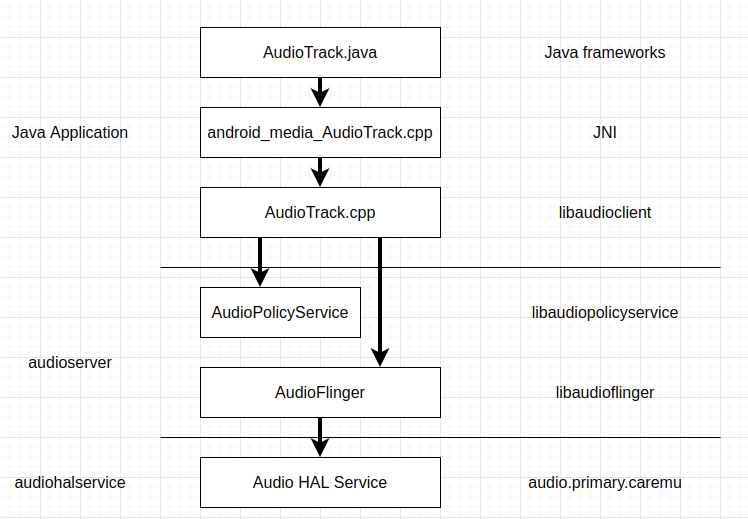
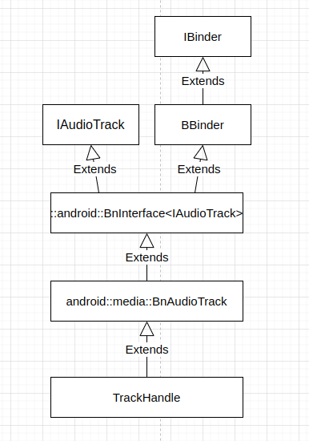
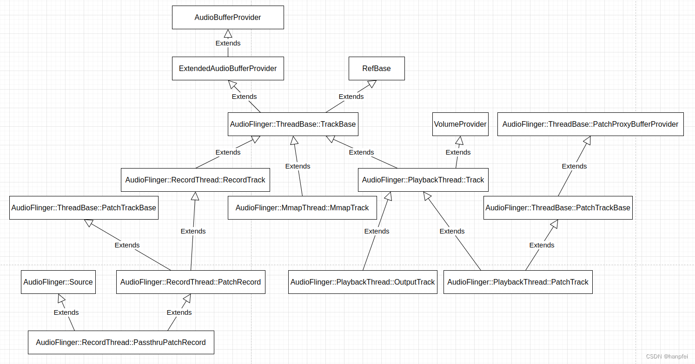
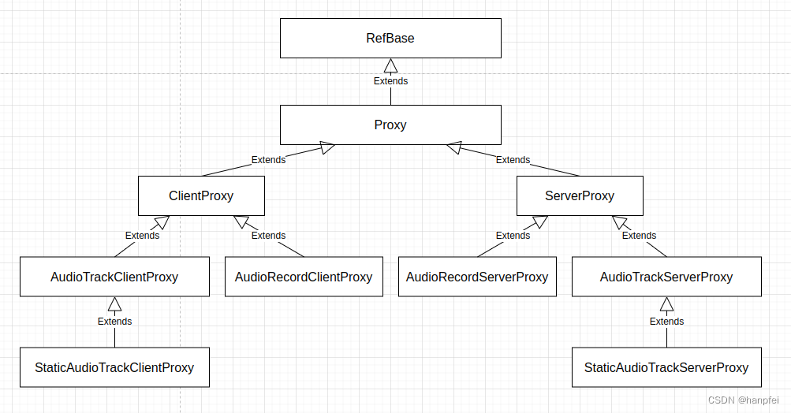

【很多同学读 Android 系统的源码时感觉比较费力，一定会觉得是自己水平不够见识有限认知水平不足，觉得自己需要多学习多努力多下功夫，但 Android 系统源码质量之烂简直超乎想象。尽管 Android 系统确实实现了很多功能、特性，提供了很多亮点，但不可否认，把 Android 系统的代码称为屎山，可能都有点侮辱屎山了。】

关于 Android 的音频数据处理，音频播放和采集是两个紧密相关的过程，但这两个过程又有着巨大的差别。播放过程的特别之处在于，Android 音频子系统支持多个应用程序共享音频输出设备，多个应用程序的音频数据可以被混音之后再播放出来，Android 音频子系统支持应用程序独占并直接输出音频数据到音频输出设备，此外，Android 音频子系统支持应用程序传入一个编码的音频流，由 Android 音频子系统通过硬件的能力解码并播放出来。音频采集设备则总是应用程序独占的，应用程序要么抢到设备，可以采集音频数据，要么没抢到，什么都做不了。Android 音频子系统音频数据播放部分的数据处理管线形态要更加复杂一点。

在 Android Java 应用中，一般用 `AudioTrack` 管理并播放单个音频资源，用 `AudioRecord` 管理从平台的音频输入设备录制音频所需的音频资源。`AudioTrack` 和 `AudioRecord` 的 Java 代码位于 *frameworks/base/media/java/android/media*，它们的 JNI 代码位于 *frameworks/base/core/jni*，而不是 *frameworks/base/media/jni*。***这样的代码目录组织显得颇为奇怪，令人困扰***。

`AudioTrack` 和 `AudioRecord` 的实现基于 ***libaudioclient*** 库完成，***libaudioclient*** 库的代码位于 *frameworks/av/media/libaudioclient*。

Java `AudioTrack` 的基本使用过程是这样的：
1. 创建 `AudioTrack` 对象实例
```
    @TargetApi(21)
    private static AudioTrack createAudioTrackOnLollipopOrHigher(
            int sampleRateInHz, int channelConfig, int bufferSizeInBytes, int streamType) {
        Logging.d(TAG, "createAudioTrackOnLollipopOrHigher");
        // TODO(henrika): use setPerformanceMode(int) with PERFORMANCE_MODE_LOW_LATENCY to control
        // performance when Android O is supported. Add some logging in the mean time.
        final int nativeOutputSampleRate = AudioTrack.getNativeOutputSampleRate(streamType);
        Logging.d(TAG, "nativeOutputSampleRate: " + nativeOutputSampleRate);
        if (sampleRateInHz != nativeOutputSampleRate) {
            Logging.w(TAG, "Unable to use fast mode since requested sample rate is not native");
        }
        if (usageAttribute != DEFAULT_USAGE) {
            Logging.w(TAG, "A non default usage attribute is used: " + usageAttribute);
        }

        int contentType = AudioAttributes.CONTENT_TYPE_SPEECH;
        if (streamType == AudioManager.STREAM_MUSIC) {
            contentType = AudioAttributes.CONTENT_TYPE_MUSIC;
        }

        // Create an audio track where the audio usage is for VoIP and the content type is speech.
        return new AudioTrack(
                new AudioAttributes.Builder()
                        .setUsage(usageAttribute)
                        .setContentType(contentType)
                        .build(),
                new AudioFormat.Builder()
                        .setEncoding(AudioFormat.ENCODING_PCM_16BIT)
                        .setSampleRate(sampleRateInHz)
                        .setChannelMask(channelConfig)
                        .build(),
                bufferSizeInBytes,
                AudioTrack.MODE_STREAM,
                AudioManager.AUDIO_SESSION_ID_GENERATE);
    }

    @SuppressWarnings("deprecation") // Deprecated in API level 25.
    private static AudioTrack createAudioTrackOnLowerThanLollipop(
            int sampleRateInHz, int channelConfig, int bufferSizeInBytes, int streamType) {
        return new AudioTrack(streamType, sampleRateInHz, channelConfig,
                AudioFormat.ENCODING_PCM_16BIT, bufferSizeInBytes, AudioTrack.MODE_STREAM);
    }
```

2. 启动播放
```
        try {
            audioTrack.play();
        } catch (IllegalStateException e) {
            reportAwAudioTrackStartError(AudioTrackStartErrorCode.AUDIO_TRACK_START_EXCEPTION,
                    "AudioTrack.play failed: " + e.getMessage());
            releaseAudioResources();
            return false;
        }
```

3. 循环向 `AudioTrack` 写入要播放的音频 PCM 数据
```
        private int writeBytes(AudioTrack audioTrack, ByteBuffer byteBuffer, int sizeInBytes) {
            if (Build.VERSION.SDK_INT >= 21) {
                return audioTrack.write(byteBuffer, sizeInBytes, AudioTrack.WRITE_BLOCKING);
            } else {
                return audioTrack.write(byteBuffer.array(), byteBuffer.arrayOffset(), sizeInBytes);
            }
        }
```

4. 音频数据播放结束之后，停止播放
```
            if (audioTrack != null) {
                Logging.d(TAG, "Calling AudioTrack.stop...");
                try {
                    audioTrack.stop();
                    Logging.d(TAG, "AudioTrack.stop is done.");
                } catch (IllegalStateException e) {
                    Logging.e(TAG, "AudioTrack.stop failed: " + e.getMessage());
                }
            }
```

5. 释放音频资源
```
    private void releaseAudioResources() {
        Logging.d(TAG, "releaseAudioResources");
        if (audioTrack != null) {
            audioTrack.release();
            audioTrack = null;
        }
    }
```

`AudioTrack` 对象用来在应用程序中表示一条音频输出流。`AudioTrack` 的实现中，会与 AudioFlinger 建立一条跨进程的数据通路，应用程序向 `AudioTrack` 写入的数据会先给到 AudioFlinger，AudioFlinger 对这些数据做一些处理，如和其它应用程序的音频数据混音，可能再通过另一条跨进程的数据通路，将音频数据送给 Audio HAL 服务进程，之后再由 Audio HAL 服务进程送给音频输出设备播放出来。`AudioTrack` 实现的整体结构如下图：


这里的代码分析基于 ***android-security-12.0.0_r43*** 版进行。

## AudioTrack 对象构造过程

`AudioTrack` Java 类继承层次结构如下图：


`AudioTrack` Java 类构造函数定义 (位于 *frameworks/base/media/java/android/media/AudioTrack.java*) 如下：
```
    public AudioTrack(AudioAttributes attributes, AudioFormat format, int bufferSizeInBytes,
            int mode, int sessionId)
                    throws IllegalArgumentException {
        this(attributes, format, bufferSizeInBytes, mode, sessionId, false /*offload*/,
                ENCAPSULATION_MODE_NONE, null /* tunerConfiguration */);
    }

    private AudioTrack(AudioAttributes attributes, AudioFormat format, int bufferSizeInBytes,
            int mode, int sessionId, boolean offload, int encapsulationMode,
            @Nullable TunerConfiguration tunerConfiguration)
                    throws IllegalArgumentException {
        super(attributes, AudioPlaybackConfiguration.PLAYER_TYPE_JAM_AUDIOTRACK);
        // mState already == STATE_UNINITIALIZED

        mConfiguredAudioAttributes = attributes; // object copy not needed, immutable.

        if (format == null) {
            throw new IllegalArgumentException("Illegal null AudioFormat");
        }

        // Check if we should enable deep buffer mode
        if (shouldEnablePowerSaving(mAttributes, format, bufferSizeInBytes, mode)) {
            mAttributes = new AudioAttributes.Builder(mAttributes)
                .replaceFlags((mAttributes.getAllFlags()
                        | AudioAttributes.FLAG_DEEP_BUFFER)
                        & ~AudioAttributes.FLAG_LOW_LATENCY)
                .build();
        }

        // remember which looper is associated with the AudioTrack instantiation
        Looper looper;
        if ((looper = Looper.myLooper()) == null) {
            looper = Looper.getMainLooper();
        }

        int rate = format.getSampleRate();
        if (rate == AudioFormat.SAMPLE_RATE_UNSPECIFIED) {
            rate = 0;
        }

        int channelIndexMask = 0;
        if ((format.getPropertySetMask()
                & AudioFormat.AUDIO_FORMAT_HAS_PROPERTY_CHANNEL_INDEX_MASK) != 0) {
            channelIndexMask = format.getChannelIndexMask();
        }
        int channelMask = 0;
        if ((format.getPropertySetMask()
                & AudioFormat.AUDIO_FORMAT_HAS_PROPERTY_CHANNEL_MASK) != 0) {
            channelMask = format.getChannelMask();
        } else if (channelIndexMask == 0) { // if no masks at all, use stereo
            channelMask = AudioFormat.CHANNEL_OUT_FRONT_LEFT
                    | AudioFormat.CHANNEL_OUT_FRONT_RIGHT;
        }
        int encoding = AudioFormat.ENCODING_DEFAULT;
        if ((format.getPropertySetMask() & AudioFormat.AUDIO_FORMAT_HAS_PROPERTY_ENCODING) != 0) {
            encoding = format.getEncoding();
        }
        audioParamCheck(rate, channelMask, channelIndexMask, encoding, mode);
        mOffloaded = offload;
        mStreamType = AudioSystem.STREAM_DEFAULT;

        audioBuffSizeCheck(bufferSizeInBytes);

        mInitializationLooper = looper;

        if (sessionId < 0) {
            throw new IllegalArgumentException("Invalid audio session ID: "+sessionId);
        }

        int[] sampleRate = new int[] {mSampleRate};
        int[] session = new int[1];
        session[0] = sessionId;
        // native initialization
        int initResult = native_setup(new WeakReference<AudioTrack>(this), mAttributes,
                sampleRate, mChannelMask, mChannelIndexMask, mAudioFormat,
                mNativeBufferSizeInBytes, mDataLoadMode, session, 0 /*nativeTrackInJavaObj*/,
                offload, encapsulationMode, tunerConfiguration,
                getCurrentOpPackageName());
        if (initResult != SUCCESS) {
            loge("Error code "+initResult+" when initializing AudioTrack.");
            return; // with mState == STATE_UNINITIALIZED
        }

        mSampleRate = sampleRate[0];
        mSessionId = session[0];

        // TODO: consider caching encapsulationMode and tunerConfiguration in the Java object.

        if ((mAttributes.getFlags() & AudioAttributes.FLAG_HW_AV_SYNC) != 0) {
            int frameSizeInBytes;
            if (AudioFormat.isEncodingLinearFrames(mAudioFormat)) {
                frameSizeInBytes = mChannelCount * AudioFormat.getBytesPerSample(mAudioFormat);
            } else {
                frameSizeInBytes = 1;
            }
            mOffset = ((int) Math.ceil(HEADER_V2_SIZE_BYTES / frameSizeInBytes)) * frameSizeInBytes;
        }

        if (mDataLoadMode == MODE_STATIC) {
            mState = STATE_NO_STATIC_DATA;
        } else {
            mState = STATE_INITIALIZED;
        }

        baseRegisterPlayer(mSessionId);
        native_setPlayerIId(mPlayerIId); // mPlayerIId now ready to send to native AudioTrack.
    }
```

`AudioTrack` Java 类对象构造时，需要传入这样一些关于音频流的配置参数：
 * Usage
 * ContentType
 * PCM 编码格式
 * 以赫兹为单位的采样率
 * 音频通道配置格式
 * 以字节为单位的数据缓冲区大小
 * 内存模式，可选值为 MODE_STATIC 或 MODE_STREAM，一般是 MODE_STREAM
 * 会话 ID

`AudioTrack` Java 类对象构造过程如下：
1. 检查是否启用 deep buffer 模式；
2. 检查音频流的配置参数，如采样率，通道配置格式，PCM 编码格式，缓冲区大小等；
3. 初始化部分状态，如 offload 模式，stream type 等；
4. 创建一些缓冲区，以便于本地层代码返回数据，如会话 ID 和采样率；
5. 执行本底层方法 `native_setup()` 创建本地层资源；
6. 根据本底层返回的值初始化一些状态，如会话 ID 和采样率；
7. 更新状态。

本底层方法 `native_setup()` 定义 (位于 *frameworks/base/core/jni/android_media_AudioTrack.cpp*) 如下：
```
static sp<AudioTrack> setAudioTrack(JNIEnv* env, jobject thiz, const sp<AudioTrack>& at)
{
    Mutex::Autolock l(sLock);
    sp<AudioTrack> old =
            (AudioTrack*)env->GetLongField(thiz, javaAudioTrackFields.nativeTrackInJavaObj);
    if (at.get()) {
        at->incStrong((void*)setAudioTrack);
    }
    if (old != 0) {
        old->decStrong((void*)setAudioTrack);
    }
    env->SetLongField(thiz, javaAudioTrackFields.nativeTrackInJavaObj, (jlong)at.get());
    return old;
}

// ----------------------------------------------------------------------------
sp<AudioTrack> android_media_AudioTrack_getAudioTrack(JNIEnv* env, jobject audioTrackObj) {
    return getAudioTrack(env, audioTrackObj);
}

// ----------------------------------------------------------------------------
static jint android_media_AudioTrack_setup(JNIEnv *env, jobject thiz, jobject weak_this,
                                           jobject jaa, jintArray jSampleRate,
                                           jint channelPositionMask, jint channelIndexMask,
                                           jint audioFormat, jint buffSizeInBytes, jint memoryMode,
                                           jintArray jSession, jlong nativeAudioTrack,
                                           jboolean offload, jint encapsulationMode,
                                           jobject tunerConfiguration, jstring opPackageName) {
    ALOGV("sampleRates=%p, channel mask=%x, index mask=%x, audioFormat(Java)=%d, buffSize=%d,"
          " nativeAudioTrack=0x%" PRIX64 ", offload=%d encapsulationMode=%d tuner=%p",
          jSampleRate, channelPositionMask, channelIndexMask, audioFormat, buffSizeInBytes,
          nativeAudioTrack, offload, encapsulationMode, tunerConfiguration);

    if (jSession == NULL) {
        ALOGE("Error creating AudioTrack: invalid session ID pointer");
        return (jint) AUDIO_JAVA_ERROR;
    }

    const TunerConfigurationHelper tunerHelper(env, tunerConfiguration);

    jint* nSession = (jint *) env->GetPrimitiveArrayCritical(jSession, NULL);
    if (nSession == NULL) {
        ALOGE("Error creating AudioTrack: Error retrieving session id pointer");
        return (jint) AUDIO_JAVA_ERROR;
    }
    audio_session_t sessionId = (audio_session_t) nSession[0];
    env->ReleasePrimitiveArrayCritical(jSession, nSession, 0);
    nSession = NULL;

    AudioTrackJniStorage* lpJniStorage = NULL;

    jclass clazz = env->GetObjectClass(thiz);
    if (clazz == NULL) {
        ALOGE("Can't find %s when setting up callback.", kClassPathName);
        return (jint) AUDIOTRACK_ERROR_SETUP_NATIVEINITFAILED;
    }

    // if we pass in an existing *Native* AudioTrack, we don't need to create/initialize one.
    sp<AudioTrack> lpTrack;
    if (nativeAudioTrack == 0) {
        if (jaa == 0) {
            ALOGE("Error creating AudioTrack: invalid audio attributes");
            return (jint) AUDIO_JAVA_ERROR;
        }

        if (jSampleRate == 0) {
            ALOGE("Error creating AudioTrack: invalid sample rates");
            return (jint) AUDIO_JAVA_ERROR;
        }

        int* sampleRates = env->GetIntArrayElements(jSampleRate, NULL);
        int sampleRateInHertz = sampleRates[0];
        env->ReleaseIntArrayElements(jSampleRate, sampleRates, JNI_ABORT);

        // Invalid channel representations are caught by !audio_is_output_channel() below.
        audio_channel_mask_t nativeChannelMask = nativeChannelMaskFromJavaChannelMasks(
                channelPositionMask, channelIndexMask);
        if (!audio_is_output_channel(nativeChannelMask)) {
            ALOGE("Error creating AudioTrack: invalid native channel mask %#x.", nativeChannelMask);
            return (jint) AUDIOTRACK_ERROR_SETUP_INVALIDCHANNELMASK;
        }

        uint32_t channelCount = audio_channel_count_from_out_mask(nativeChannelMask);

        // check the format.
        // This function was called from Java, so we compare the format against the Java constants
        audio_format_t format = audioFormatToNative(audioFormat);
        if (format == AUDIO_FORMAT_INVALID) {
            ALOGE("Error creating AudioTrack: unsupported audio format %d.", audioFormat);
            return (jint) AUDIOTRACK_ERROR_SETUP_INVALIDFORMAT;
        }

        // compute the frame count
        size_t frameCount;
        if (audio_has_proportional_frames(format)) {
            const size_t bytesPerSample = audio_bytes_per_sample(format);
            frameCount = buffSizeInBytes / (channelCount * bytesPerSample);
        } else {
            frameCount = buffSizeInBytes;
        }

        // create the native AudioTrack object
        ScopedUtfChars opPackageNameStr(env, opPackageName);
        // TODO b/182469354: make consistent with AudioRecord
        AttributionSourceState attributionSource;
        attributionSource.packageName = std::string(opPackageNameStr.c_str());
        attributionSource.token = sp<BBinder>::make();
        lpTrack = new AudioTrack(attributionSource);

        // read the AudioAttributes values
        auto paa = JNIAudioAttributeHelper::makeUnique();
        jint jStatus = JNIAudioAttributeHelper::nativeFromJava(env, jaa, paa.get());
        if (jStatus != (jint)AUDIO_JAVA_SUCCESS) {
            return jStatus;
        }
        ALOGV("AudioTrack_setup for usage=%d content=%d flags=0x%#x tags=%s",
                paa->usage, paa->content_type, paa->flags, paa->tags);

        // initialize the callback information:
        // this data will be passed with every AudioTrack callback
        lpJniStorage = new AudioTrackJniStorage();
        lpJniStorage->mCallbackData.audioTrack_class = (jclass)env->NewGlobalRef(clazz);
        // we use a weak reference so the AudioTrack object can be garbage collected.
        lpJniStorage->mCallbackData.audioTrack_ref = env->NewGlobalRef(weak_this);
        lpJniStorage->mCallbackData.isOffload = offload;
        lpJniStorage->mCallbackData.busy = false;

        audio_offload_info_t offloadInfo;
        if (offload == JNI_TRUE) {
            offloadInfo = AUDIO_INFO_INITIALIZER;
            offloadInfo.format = format;
            offloadInfo.sample_rate = sampleRateInHertz;
            offloadInfo.channel_mask = nativeChannelMask;
            offloadInfo.has_video = false;
            offloadInfo.stream_type = AUDIO_STREAM_MUSIC; //required for offload
        }

        if (encapsulationMode != 0) {
            offloadInfo = AUDIO_INFO_INITIALIZER;
            offloadInfo.format = format;
            offloadInfo.sample_rate = sampleRateInHertz;
            offloadInfo.channel_mask = nativeChannelMask;
            offloadInfo.stream_type = AUDIO_STREAM_MUSIC;
            offloadInfo.encapsulation_mode =
                    static_cast<audio_encapsulation_mode_t>(encapsulationMode);
            offloadInfo.content_id = tunerHelper.getContentId();
            offloadInfo.sync_id = tunerHelper.getSyncId();
        }

        // initialize the native AudioTrack object
        status_t status = NO_ERROR;
        switch (memoryMode) {
        case MODE_STREAM:
            status = lpTrack->set(AUDIO_STREAM_DEFAULT, // stream type, but more info conveyed
                                                        // in paa (last argument)
                                  sampleRateInHertz,
                                  format, // word length, PCM
                                  nativeChannelMask, offload ? 0 : frameCount,
                                  offload ? AUDIO_OUTPUT_FLAG_COMPRESS_OFFLOAD
                                          : AUDIO_OUTPUT_FLAG_NONE,
                                  audioCallback,
                                  &(lpJniStorage->mCallbackData), // callback, callback data (user)
                                  0,    // notificationFrames == 0 since not using EVENT_MORE_DATA
                                        // to feed the AudioTrack
                                  0,    // shared mem
                                  true, // thread can call Java
                                  sessionId, // audio session ID
                                  offload ? AudioTrack::TRANSFER_SYNC_NOTIF_CALLBACK
                                          : AudioTrack::TRANSFER_SYNC,
                                  (offload || encapsulationMode) ? &offloadInfo : NULL,
                                  AttributionSourceState(), // default uid, pid values
                                  paa.get());
            break;

        case MODE_STATIC:
            // AudioTrack is using shared memory

            if (!lpJniStorage->allocSharedMem(buffSizeInBytes)) {
                ALOGE("Error creating AudioTrack in static mode: error creating mem heap base");
                goto native_init_failure;
            }

            status = lpTrack->set(AUDIO_STREAM_DEFAULT, // stream type, but more info conveyed
                                                        // in paa (last argument)
                                  sampleRateInHertz,
                                  format, // word length, PCM
                                  nativeChannelMask, frameCount, AUDIO_OUTPUT_FLAG_NONE,
                                  audioCallback,
                                  &(lpJniStorage->mCallbackData), // callback, callback data (user)
                                  0, // notificationFrames == 0 since not using EVENT_MORE_DATA
                                     // to feed the AudioTrack
                                  lpJniStorage->mMemBase, // shared mem
                                  true,                   // thread can call Java
                                  sessionId,              // audio session ID
                                  AudioTrack::TRANSFER_SHARED,
                                  NULL,       // default offloadInfo
                                  AttributionSourceState(), // default uid, pid values
                                  paa.get());
            break;

        default:
            ALOGE("Unknown mode %d", memoryMode);
            goto native_init_failure;
        }

        if (status != NO_ERROR) {
            ALOGE("Error %d initializing AudioTrack", status);
            goto native_init_failure;
        }
        // Set caller name so it can be logged in destructor.
        // MediaMetricsConstants.h: AMEDIAMETRICS_PROP_CALLERNAME_VALUE_JAVA
        lpTrack->setCallerName("java");
    } else {  // end if (nativeAudioTrack == 0)
        lpTrack = (AudioTrack*)nativeAudioTrack;
        // TODO: We need to find out which members of the Java AudioTrack might
        // need to be initialized from the Native AudioTrack
        // these are directly returned from getters:
        //  mSampleRate
        //  mAudioFormat
        //  mStreamType
        //  mChannelConfiguration
        //  mChannelCount
        //  mState (?)
        //  mPlayState (?)
        // these may be used internally (Java AudioTrack.audioParamCheck():
        //  mChannelMask
        //  mChannelIndexMask
        //  mDataLoadMode

        // initialize the callback information:
        // this data will be passed with every AudioTrack callback
        lpJniStorage = new AudioTrackJniStorage();
        lpJniStorage->mCallbackData.audioTrack_class = (jclass)env->NewGlobalRef(clazz);
        // we use a weak reference so the AudioTrack object can be garbage collected.
        lpJniStorage->mCallbackData.audioTrack_ref = env->NewGlobalRef(weak_this);
        lpJniStorage->mCallbackData.busy = false;
    }
    lpJniStorage->mAudioTrackCallback =
            new JNIAudioTrackCallback(env, thiz, lpJniStorage->mCallbackData.audioTrack_ref,
                                      javaAudioTrackFields.postNativeEventInJava);
    lpTrack->setAudioTrackCallback(lpJniStorage->mAudioTrackCallback);

    nSession = (jint *) env->GetPrimitiveArrayCritical(jSession, NULL);
    if (nSession == NULL) {
        ALOGE("Error creating AudioTrack: Error retrieving session id pointer");
        goto native_init_failure;
    }
    // read the audio session ID back from AudioTrack in case we create a new session
    nSession[0] = lpTrack->getSessionId();
    env->ReleasePrimitiveArrayCritical(jSession, nSession, 0);
    nSession = NULL;

    {
        const jint elements[1] = { (jint) lpTrack->getSampleRate() };
        env->SetIntArrayRegion(jSampleRate, 0, 1, elements);
    }

    {   // scope for the lock
        Mutex::Autolock l(sLock);
        sAudioTrackCallBackCookies.add(&lpJniStorage->mCallbackData);
    }
    // save our newly created C++ AudioTrack in the "nativeTrackInJavaObj" field
    // of the Java object (in mNativeTrackInJavaObj)
    setAudioTrack(env, thiz, lpTrack);

    // save the JNI resources so we can free them later
    //ALOGV("storing lpJniStorage: %x\n", (long)lpJniStorage);
    env->SetLongField(thiz, javaAudioTrackFields.jniData, (jlong)lpJniStorage);

    // since we had audio attributes, the stream type was derived from them during the
    // creation of the native AudioTrack: push the same value to the Java object
    env->SetIntField(thiz, javaAudioTrackFields.fieldStreamType, (jint) lpTrack->streamType());

    return (jint) AUDIO_JAVA_SUCCESS;

    // failures:
native_init_failure:
    if (nSession != NULL) {
        env->ReleasePrimitiveArrayCritical(jSession, nSession, 0);
    }
    env->DeleteGlobalRef(lpJniStorage->mCallbackData.audioTrack_class);
    env->DeleteGlobalRef(lpJniStorage->mCallbackData.audioTrack_ref);
    delete lpJniStorage;
    env->SetLongField(thiz, javaAudioTrackFields.jniData, 0);

    // lpTrack goes out of scope, so reference count drops to zero
    return (jint) AUDIOTRACK_ERROR_SETUP_NATIVEINITFAILED;
}
```

`AudioTrack` Java 类提供了一个以指向本底层 `AudioTrack` 对象的指针为参数的构造函数，如：
```
    /*package*/ AudioTrack(long nativeTrackInJavaObj) {
        super(new AudioAttributes.Builder().build(),
                AudioPlaybackConfiguration.PLAYER_TYPE_JAM_AUDIOTRACK);
        // "final"s
        mNativeTrackInJavaObj = 0;
        mJniData = 0;

        // remember which looper is associated with the AudioTrack instantiation
        Looper looper;
        if ((looper = Looper.myLooper()) == null) {
            looper = Looper.getMainLooper();
        }
        mInitializationLooper = looper;

        // other initialization...
        if (nativeTrackInJavaObj != 0) {
            baseRegisterPlayer(AudioSystem.AUDIO_SESSION_ALLOCATE);
            deferred_connect(nativeTrackInJavaObj);
        } else {
            mState = STATE_UNINITIALIZED;
        }
    }
```

这个构造函数也将调用本底层方法 `native_setup()` 创建一些本地层资源，因而可以看到 `native_setup()` 中指向本底层 `AudioTrack` 对象的指针非空的分支，这里忽略这个分支，则 `native_setup()` 方法执行过程如下：
1. 检查音频配置参数，如采样率，通道掩码和通道数，采样格式等；
2. 根据缓冲区的大小和音频格式计算帧数；
3. 创建 `android::AudioTrack` 对象；
4. 创建 `AudioTrackJniStorage` 对象；
5. 构造 offload 配置信息；
6. 调用 `android::AudioTrack` 对象的 `set()` 函数执行初始化；
7. 将本地层创建的资源等返回给 Java 层，通过设置 Java 对象的字段等方法实现，如采样率、会话 ID、`android::AudioTrack` 对象、`AudioTrackJniStorage` 对象和 stream type 等。

由于 `native_setup()` 方法总是在 Java 类 `AudioTrack` 的构造函数中调用的，因而不用担心直接返回本底层创建的资源，而没有销毁之前的会造成本底层资源泄漏。

`AudioTrackJniStorage` 用于保存一些与 Java 类 `AudioTrack` 对象关联的本地层资源，主要是用来让本底层向 Java 层回调事件的对象，以及用来跨进程传输音频数据的对象，这个类的定义 (位于 *frameworks/base/core/jni/android_media_AudioTrack.cpp*) 如下：
```
struct audiotrack_callback_cookie {
    jclass      audioTrack_class;
    jobject     audioTrack_ref;
    bool        busy;
    Condition   cond;
    bool        isOffload;
};

// keep these values in sync with AudioTrack.java
#define MODE_STATIC 0
#define MODE_STREAM 1

// ----------------------------------------------------------------------------
class AudioTrackJniStorage {
public:
    sp<MemoryHeapBase> mMemHeap;
    sp<MemoryBase> mMemBase;
    audiotrack_callback_cookie mCallbackData{};
    sp<JNIDeviceCallback> mDeviceCallback;
    sp<JNIAudioTrackCallback> mAudioTrackCallback;

    bool allocSharedMem(int sizeInBytes) {
        mMemHeap = new MemoryHeapBase(sizeInBytes, 0, "AudioTrack Heap Base");
        if (mMemHeap->getHeapID() < 0) {
            return false;
        }
        mMemBase = new MemoryBase(mMemHeap, 0, sizeInBytes);
        return true;
    }
};
```

`JNIDeviceCallback` 和 `JNIAudioTrackCallback` 实现本底层定义的回调接口，并封装 Java 对象，它们的对象被注册给 `android::AudioTrack` 对象，在回调接口被调用时，它们通过 JNI 将事件传至 Java 层。如 `JNIAudioTrackCallback`，其类定义 (位于 *frameworks/base/core/jni/android_media_AudioTrackCallback.h*) 如下：
```
namespace android {

#define AUDIO_NATIVE_EVENT_CODEC_FORMAT_CHANGE 100

// TODO(b/149870866) : Extract common part for JNIAudioTrackCallback and JNIDeviceCallback
class JNIAudioTrackCallback : public media::BnAudioTrackCallback {
public:
    JNIAudioTrackCallback(JNIEnv* env, jobject thiz, jobject weak_thiz,
                          jmethodID postEventFromNative);
    ~JNIAudioTrackCallback() override;

    binder::Status onCodecFormatChanged(const std::vector<uint8_t>& audioMetadata) override;

private:
    jclass mClass;                   // Reference to AudioTrack class
    jobject mObject;                 // Weak ref to AudioTrack Java object to call on
    jmethodID mPostEventFromNative;  // postEventFromNative method ID
    jclass mByteBufferClass;         // Reference to ByteBuffer class
    jmethodID mAllocateDirectMethod; // ByteBuffer.allocateDirect method ID
};

}; // namespace android
```

它实现 `media::BnAudioTrackCallback` 接口，其接口实现中，通过 JNI 将事件传给 Java 层，相关代码 (位于 *frameworks/base/core/jni/android_media_AudioTrackCallback.cpp*) 如下：
```
using namespace android;

#define BYTE_BUFFER_NAME "java/nio/ByteBuffer"
#define BYTE_BUFFER_ALLOCATE_DIRECT_NAME "allocateDirect"

JNIAudioTrackCallback::JNIAudioTrackCallback(JNIEnv* env, jobject thiz, jobject weak_thiz,
                                             jmethodID postEventFromNative) {
    // Hold onto the AudioTrack class for use in calling the static method
    // that posts events to the application thread.
    jclass clazz = env->GetObjectClass(thiz);
    if (clazz == nullptr) {
        return;
    }
    mClass = (jclass)env->NewGlobalRef(clazz);

    // We use a weak reference so the AudioTrack object can be garbage collected.
    // The reference is only used as a proxy for callbacks.
    mObject = env->NewGlobalRef(weak_thiz);

    mPostEventFromNative = postEventFromNative;

    jclass byteBufferClass = FindClassOrDie(env, BYTE_BUFFER_NAME);
    mByteBufferClass = (jclass)env->NewGlobalRef(byteBufferClass);
    mAllocateDirectMethod =
            GetStaticMethodIDOrDie(env, mByteBufferClass, BYTE_BUFFER_ALLOCATE_DIRECT_NAME,
                                   "(I)Ljava/nio/ByteBuffer;");
}

JNIAudioTrackCallback::~JNIAudioTrackCallback() {
    // remove global references
    JNIEnv* env = AndroidRuntime::getJNIEnv();
    if (env == nullptr) {
        return;
    }
    env->DeleteGlobalRef(mObject);
    env->DeleteGlobalRef(mClass);
    env->DeleteGlobalRef(mByteBufferClass);
}

binder::Status JNIAudioTrackCallback::onCodecFormatChanged(
        const std::vector<uint8_t>& audioMetadata) {
    JNIEnv* env = AndroidRuntime::getJNIEnv();
    if (env == nullptr) {
        return binder::Status::ok();
    }

    jobject byteBuffer = env->CallStaticObjectMethod(mByteBufferClass, mAllocateDirectMethod,
                                                     (jint)audioMetadata.size());
    if (env->ExceptionCheck()) {
        ALOGW("An exception occurred while allocating direct buffer");
        env->ExceptionDescribe();
        env->ExceptionClear();
    }
    if (byteBuffer == nullptr) {
        ALOGE("Failed allocating a direct ByteBuffer");
        return binder::Status::fromStatusT(NO_MEMORY);
    }

    uint8_t* byteBufferAddr = (uint8_t*)env->GetDirectBufferAddress(byteBuffer);
    std::copy(audioMetadata.begin(), audioMetadata.end(), byteBufferAddr);
    env->CallStaticVoidMethod(mClass, mPostEventFromNative, mObject,
                              AUDIO_NATIVE_EVENT_CODEC_FORMAT_CHANGE, 0, 0, byteBuffer);
    if (env->ExceptionCheck()) {
        ALOGW("An exception occurred while notifying codec format changed.");
        env->ExceptionDescribe();
        env->ExceptionClear();
    }

    return binder::Status::ok();
}
```

`android::AudioTrack` 对象构造过程 (位于 *frameworks/av/media/libaudioclient/AudioTrack.cpp*) 如下：
```
AudioTrack::AudioTrack(const AttributionSourceState& attributionSource)
    : mStatus(NO_INIT),
      mState(STATE_STOPPED),
      mPreviousPriority(ANDROID_PRIORITY_NORMAL),
      mPreviousSchedulingGroup(SP_DEFAULT),
      mPausedPosition(0),
      mSelectedDeviceId(AUDIO_PORT_HANDLE_NONE),
      mRoutedDeviceId(AUDIO_PORT_HANDLE_NONE),
      mClientAttributionSource(attributionSource),
      mAudioTrackCallback(new AudioTrackCallback())
{
    mAttributes.content_type = AUDIO_CONTENT_TYPE_UNKNOWN;
    mAttributes.usage = AUDIO_USAGE_UNKNOWN;
    mAttributes.flags = AUDIO_FLAG_NONE;
    strcpy(mAttributes.tags, "");
}
```

`android::AudioTrack` 的 `set()` 函数用于执行初始化，这个函数定义 (位于 *frameworks/av/media/libaudioclient/AudioTrack.cpp*) 如下：
```
status_t AudioTrack::set(
        audio_stream_type_t streamType,
        uint32_t sampleRate,
        audio_format_t format,
        audio_channel_mask_t channelMask,
        size_t frameCount,
        audio_output_flags_t flags,
        callback_t cbf,
        void* user,
        int32_t notificationFrames,
        const sp<IMemory>& sharedBuffer,
        bool threadCanCallJava,
        audio_session_t sessionId,
        transfer_type transferType,
        const audio_offload_info_t *offloadInfo,
        const AttributionSourceState& attributionSource,
        const audio_attributes_t* pAttributes,
        bool doNotReconnect,
        float maxRequiredSpeed,
        audio_port_handle_t selectedDeviceId)
{
    status_t status;
    uint32_t channelCount;
    pid_t callingPid;
    pid_t myPid;
    uid_t uid = VALUE_OR_FATAL(aidl2legacy_int32_t_uid_t(attributionSource.uid));
    pid_t pid = VALUE_OR_FATAL(aidl2legacy_int32_t_pid_t(attributionSource.pid));

    // Note mPortId is not valid until the track is created, so omit mPortId in ALOG for set.
    ALOGV("%s(): streamType %d, sampleRate %u, format %#x, channelMask %#x, frameCount %zu, "
          "flags #%x, notificationFrames %d, sessionId %d, transferType %d, uid %d, pid %d",
          __func__,
          streamType, sampleRate, format, channelMask, frameCount, flags, notificationFrames,
          sessionId, transferType, attributionSource.uid, attributionSource.pid);

    mThreadCanCallJava = threadCanCallJava;
    mSelectedDeviceId = selectedDeviceId;
    mSessionId = sessionId;

    switch (transferType) {
    case TRANSFER_DEFAULT:
        if (sharedBuffer != 0) {
            transferType = TRANSFER_SHARED;
        } else if (cbf == NULL || threadCanCallJava) {
            transferType = TRANSFER_SYNC;
        } else {
            transferType = TRANSFER_CALLBACK;
        }
        break;
    case TRANSFER_CALLBACK:
    case TRANSFER_SYNC_NOTIF_CALLBACK:
        if (cbf == NULL || sharedBuffer != 0) {
            ALOGE("%s(): Transfer type %s but cbf == NULL || sharedBuffer != 0",
                    convertTransferToText(transferType), __func__);
            status = BAD_VALUE;
            goto exit;
        }
        break;
    case TRANSFER_OBTAIN:
    case TRANSFER_SYNC:
        if (sharedBuffer != 0) {
            ALOGE("%s(): Transfer type TRANSFER_OBTAIN but sharedBuffer != 0", __func__);
            status = BAD_VALUE;
            goto exit;
        }
        break;
    case TRANSFER_SHARED:
        if (sharedBuffer == 0) {
            ALOGE("%s(): Transfer type TRANSFER_SHARED but sharedBuffer == 0", __func__);
            status = BAD_VALUE;
            goto exit;
        }
        break;
    default:
        ALOGE("%s(): Invalid transfer type %d",
                __func__, transferType);
        status = BAD_VALUE;
        goto exit;
    }
    mSharedBuffer = sharedBuffer;
    mTransfer = transferType;
    mDoNotReconnect = doNotReconnect;

    ALOGV_IF(sharedBuffer != 0, "%s(): sharedBuffer: %p, size: %zu",
            __func__, sharedBuffer->unsecurePointer(), sharedBuffer->size());

    ALOGV("%s(): streamType %d frameCount %zu flags %04x",
            __func__, streamType, frameCount, flags);

    // invariant that mAudioTrack != 0 is true only after set() returns successfully
    if (mAudioTrack != 0) {
        ALOGE("%s(): Track already in use", __func__);
        status = INVALID_OPERATION;
        goto exit;
    }

    // handle default values first.
    if (streamType == AUDIO_STREAM_DEFAULT) {
        streamType = AUDIO_STREAM_MUSIC;
    }
    if (pAttributes == NULL) {
        if (uint32_t(streamType) >= AUDIO_STREAM_PUBLIC_CNT) {
            ALOGE("%s(): Invalid stream type %d", __func__, streamType);
            status = BAD_VALUE;
            goto exit;
        }
        mOriginalStreamType = streamType;

    } else {
        // stream type shouldn't be looked at, this track has audio attributes
        memcpy(&mAttributes, pAttributes, sizeof(audio_attributes_t));
        ALOGV("%s(): Building AudioTrack with attributes:"
                " usage=%d content=%d flags=0x%x tags=[%s]",
                __func__,
                 mAttributes.usage, mAttributes.content_type, mAttributes.flags, mAttributes.tags);
        mOriginalStreamType = AUDIO_STREAM_DEFAULT;
        audio_flags_to_audio_output_flags(mAttributes.flags, &flags);
    }

    // these below should probably come from the audioFlinger too...
    if (format == AUDIO_FORMAT_DEFAULT) {
        format = AUDIO_FORMAT_PCM_16_BIT;
    } else if (format == AUDIO_FORMAT_IEC61937) { // HDMI pass-through?
        flags = static_cast<audio_output_flags_t>(flags | AUDIO_OUTPUT_FLAG_IEC958_NONAUDIO);
    }

    // validate parameters
    if (!audio_is_valid_format(format)) {
        ALOGE("%s(): Invalid format %#x", __func__, format);
        status = BAD_VALUE;
        goto exit;
    }
    mFormat = format;

    if (!audio_is_output_channel(channelMask)) {
        ALOGE("%s(): Invalid channel mask %#x",  __func__, channelMask);
        status = BAD_VALUE;
        goto exit;
    }
    mChannelMask = channelMask;
    channelCount = audio_channel_count_from_out_mask(channelMask);
    mChannelCount = channelCount;

    // force direct flag if format is not linear PCM
    // or offload was requested
    if ((flags & AUDIO_OUTPUT_FLAG_COMPRESS_OFFLOAD)
            || !audio_is_linear_pcm(format)) {
        ALOGV( (flags & AUDIO_OUTPUT_FLAG_COMPRESS_OFFLOAD)
                    ? "%s(): Offload request, forcing to Direct Output"
                    : "%s(): Not linear PCM, forcing to Direct Output",
                    __func__);
        flags = (audio_output_flags_t)
                // FIXME why can't we allow direct AND fast?
                ((flags | AUDIO_OUTPUT_FLAG_DIRECT) & ~AUDIO_OUTPUT_FLAG_FAST);
    }

    // force direct flag if HW A/V sync requested
    if ((flags & AUDIO_OUTPUT_FLAG_HW_AV_SYNC) != 0) {
        flags = (audio_output_flags_t)(flags | AUDIO_OUTPUT_FLAG_DIRECT);
    }

    if (flags & AUDIO_OUTPUT_FLAG_DIRECT) {
        if (audio_has_proportional_frames(format)) {
            mFrameSize = channelCount * audio_bytes_per_sample(format);
        } else {
            mFrameSize = sizeof(uint8_t);
        }
    } else {
        ALOG_ASSERT(audio_has_proportional_frames(format));
        mFrameSize = channelCount * audio_bytes_per_sample(format);
        // createTrack will return an error if PCM format is not supported by server,
        // so no need to check for specific PCM formats here
    }

    // sampling rate must be specified for direct outputs
    if (sampleRate == 0 && (flags & AUDIO_OUTPUT_FLAG_DIRECT) != 0) {
        status = BAD_VALUE;
        goto exit;
    }
    mSampleRate = sampleRate;
    mOriginalSampleRate = sampleRate;
    mPlaybackRate = AUDIO_PLAYBACK_RATE_DEFAULT;
    // 1.0 <= mMaxRequiredSpeed <= AUDIO_TIMESTRETCH_SPEED_MAX
    mMaxRequiredSpeed = min(max(maxRequiredSpeed, 1.0f), AUDIO_TIMESTRETCH_SPEED_MAX);

    // Make copy of input parameter offloadInfo so that in the future:
    //  (a) createTrack_l doesn't need it as an input parameter
    //  (b) we can support re-creation of offloaded tracks
    if (offloadInfo != NULL) {
        mOffloadInfoCopy = *offloadInfo;
        mOffloadInfo = &mOffloadInfoCopy;
    } else {
        mOffloadInfo = NULL;
        memset(&mOffloadInfoCopy, 0, sizeof(audio_offload_info_t));
        mOffloadInfoCopy = AUDIO_INFO_INITIALIZER;
    }

    mVolume[AUDIO_INTERLEAVE_LEFT] = 1.0f;
    mVolume[AUDIO_INTERLEAVE_RIGHT] = 1.0f;
    mSendLevel = 0.0f;
    // mFrameCount is initialized in createTrack_l
    mReqFrameCount = frameCount;
    if (notificationFrames >= 0) {
        mNotificationFramesReq = notificationFrames;
        mNotificationsPerBufferReq = 0;
    } else {
        if (!(flags & AUDIO_OUTPUT_FLAG_FAST)) {
            ALOGE("%s(): notificationFrames=%d not permitted for non-fast track",
                    __func__, notificationFrames);
            status = BAD_VALUE;
            goto exit;
        }
        if (frameCount > 0) {
            ALOGE("%s(): notificationFrames=%d not permitted with non-zero frameCount=%zu",
                    __func__, notificationFrames, frameCount);
            status = BAD_VALUE;
            goto exit;
        }
        mNotificationFramesReq = 0;
        const uint32_t minNotificationsPerBuffer = 1;
        const uint32_t maxNotificationsPerBuffer = 8;
        mNotificationsPerBufferReq = min(maxNotificationsPerBuffer,
                max((uint32_t) -notificationFrames, minNotificationsPerBuffer));
        ALOGW_IF(mNotificationsPerBufferReq != (uint32_t) -notificationFrames,
                "%s(): notificationFrames=%d clamped to the range -%u to -%u",
                __func__,
                notificationFrames, minNotificationsPerBuffer, maxNotificationsPerBuffer);
    }
    mNotificationFramesAct = 0;
    // TODO b/182392553: refactor or remove
    mClientAttributionSource = AttributionSourceState(attributionSource);
    callingPid = IPCThreadState::self()->getCallingPid();
    myPid = getpid();
    if (uid == -1 || (callingPid != myPid)) {
        mClientAttributionSource.uid = VALUE_OR_FATAL(legacy2aidl_uid_t_int32_t(
            IPCThreadState::self()->getCallingUid()));
    }
    if (pid == (pid_t)-1 || (callingPid != myPid)) {
        mClientAttributionSource.pid = VALUE_OR_FATAL(legacy2aidl_uid_t_int32_t(callingPid));
    }
    mAuxEffectId = 0;
    mOrigFlags = mFlags = flags;
    mCbf = cbf;

    if (cbf != NULL) {
        mAudioTrackThread = new AudioTrackThread(*this);
        mAudioTrackThread->run("AudioTrack", ANDROID_PRIORITY_AUDIO, 0 /*stack*/);
        // thread begins in paused state, and will not reference us until start()
    }

    // create the IAudioTrack
    {
        AutoMutex lock(mLock);
        status = createTrack_l();
    }
    if (status != NO_ERROR) {
        if (mAudioTrackThread != 0) {
            mAudioTrackThread->requestExit();   // see comment in AudioTrack.h
            mAudioTrackThread->requestExitAndWait();
            mAudioTrackThread.clear();
        }
        goto exit;
    }

    mUserData = user;
    mLoopCount = 0;
    mLoopStart = 0;
    mLoopEnd = 0;
    mLoopCountNotified = 0;
    mMarkerPosition = 0;
    mMarkerReached = false;
    mNewPosition = 0;
    mUpdatePeriod = 0;
    mPosition = 0;
    mReleased = 0;
    mStartNs = 0;
    mStartFromZeroUs = 0;
    AudioSystem::acquireAudioSessionId(mSessionId, pid, uid);
    mSequence = 1;
    mObservedSequence = mSequence;
    mInUnderrun = false;
    mPreviousTimestampValid = false;
    mTimestampStartupGlitchReported = false;
    mTimestampRetrogradePositionReported = false;
    mTimestampRetrogradeTimeReported = false;
    mTimestampStallReported = false;
    mTimestampStaleTimeReported = false;
    mPreviousLocation = ExtendedTimestamp::LOCATION_INVALID;
    mStartTs.mPosition = 0;
    mUnderrunCountOffset = 0;
    mFramesWritten = 0;
    mFramesWrittenServerOffset = 0;
    mFramesWrittenAtRestore = -1; // -1 is a unique initializer.
    mVolumeHandler = new media::VolumeHandler();

exit:
    mStatus = status;
    return status;
}


status_t AudioTrack::set(
        audio_stream_type_t streamType,
        uint32_t sampleRate,
        audio_format_t format,
        uint32_t channelMask,
        size_t frameCount,
        audio_output_flags_t flags,
        callback_t cbf,
        void* user,
        int32_t notificationFrames,
        const sp<IMemory>& sharedBuffer,
        bool threadCanCallJava,
        audio_session_t sessionId,
        transfer_type transferType,
        const audio_offload_info_t *offloadInfo,
        uid_t uid,
        pid_t pid,
        const audio_attributes_t* pAttributes,
        bool doNotReconnect,
        float maxRequiredSpeed,
        audio_port_handle_t selectedDeviceId)
{
    AttributionSourceState attributionSource;
    attributionSource.uid = VALUE_OR_FATAL(legacy2aidl_uid_t_int32_t(uid));
    attributionSource.pid = VALUE_OR_FATAL(legacy2aidl_pid_t_int32_t(pid));
    attributionSource.token = sp<BBinder>::make();
    return set(streamType, sampleRate, format,
            static_cast<audio_channel_mask_t>(channelMask),
            frameCount, flags, cbf, user, notificationFrames, sharedBuffer,
            threadCanCallJava, sessionId, transferType, offloadInfo, attributionSource,
            pAttributes, doNotReconnect, maxRequiredSpeed, selectedDeviceId);
}
```

这个函数的执行过程如下：
1. 检查并处理参数，如共享缓冲区，传输类型，stream type，采样格式，标记，通道掩码和通道数，帧大小，采样率，播放速率，offload 信息等；
2. 传入的回调非空时，创建 `AudioTrackThread` 线程；
3. 请求 AudioFlinger 创建 Track，Track 用于管理应用程序与 AudioFlinger 之间的通信；
4. 初始化其它状态。

`AudioTrack::createTrack_l()` 函数用于请求 AudioFlinger 创建 Track，该函数定义 (位于 *frameworks/av/media/libaudioclient/AudioTrack.cpp*) 如下：
```
status_t AudioTrack::createTrack_l()
{
    status_t status;
    bool callbackAdded = false;

    const sp<IAudioFlinger>& audioFlinger = AudioSystem::get_audio_flinger();
    if (audioFlinger == 0) {
        ALOGE("%s(%d): Could not get audioflinger",
                __func__, mPortId);
        status = NO_INIT;
        goto exit;
    }

    {
    // mFlags (not mOrigFlags) is modified depending on whether fast request is accepted.
    // After fast request is denied, we will request again if IAudioTrack is re-created.
    // Client can only express a preference for FAST.  Server will perform additional tests.
    if (mFlags & AUDIO_OUTPUT_FLAG_FAST) {
        // either of these use cases:
        // use case 1: shared buffer
        bool sharedBuffer = mSharedBuffer != 0;
        bool transferAllowed =
            // use case 2: callback transfer mode
            (mTransfer == TRANSFER_CALLBACK) ||
            // use case 3: obtain/release mode
            (mTransfer == TRANSFER_OBTAIN) ||
            // use case 4: synchronous write
            ((mTransfer == TRANSFER_SYNC || mTransfer == TRANSFER_SYNC_NOTIF_CALLBACK)
                    && mThreadCanCallJava);

        bool fastAllowed = sharedBuffer || transferAllowed;
        if (!fastAllowed) {
            ALOGW("%s(%d): AUDIO_OUTPUT_FLAG_FAST denied by client,"
                  " not shared buffer and transfer = %s",
                  __func__, mPortId,
                  convertTransferToText(mTransfer));
            mFlags = (audio_output_flags_t) (mFlags & ~AUDIO_OUTPUT_FLAG_FAST);
        }
    }

    IAudioFlinger::CreateTrackInput input;
    if (mOriginalStreamType != AUDIO_STREAM_DEFAULT) {
        // Legacy: This is based on original parameters even if the track is recreated.
        input.attr = AudioSystem::streamTypeToAttributes(mOriginalStreamType);
    } else {
        input.attr = mAttributes;
    }
    input.config = AUDIO_CONFIG_INITIALIZER;
    input.config.sample_rate = mSampleRate;
    input.config.channel_mask = mChannelMask;
    input.config.format = mFormat;
    input.config.offload_info = mOffloadInfoCopy;
    input.clientInfo.attributionSource = mClientAttributionSource;
    input.clientInfo.clientTid = -1;
    if (mFlags & AUDIO_OUTPUT_FLAG_FAST) {
        // It is currently meaningless to request SCHED_FIFO for a Java thread.  Even if the
        // application-level code follows all non-blocking design rules, the language runtime
        // doesn't also follow those rules, so the thread will not benefit overall.
        if (mAudioTrackThread != 0 && !mThreadCanCallJava) {
            input.clientInfo.clientTid = mAudioTrackThread->getTid();
        }
    }
    input.sharedBuffer = mSharedBuffer;
    input.notificationsPerBuffer = mNotificationsPerBufferReq;
    input.speed = 1.0;
    if (audio_has_proportional_frames(mFormat) && mSharedBuffer == 0 &&
            (mFlags & AUDIO_OUTPUT_FLAG_FAST) == 0) {
        input.speed  = !isPurePcmData_l() || isOffloadedOrDirect_l() ? 1.0f :
                        max(mMaxRequiredSpeed, mPlaybackRate.mSpeed);
    }
    input.flags = mFlags;
    input.frameCount = mReqFrameCount;
    input.notificationFrameCount = mNotificationFramesReq;
    input.selectedDeviceId = mSelectedDeviceId;
    input.sessionId = mSessionId;
    input.audioTrackCallback = mAudioTrackCallback;

    media::CreateTrackResponse response;
    status = audioFlinger->createTrack(VALUE_OR_FATAL(input.toAidl()), response);

    IAudioFlinger::CreateTrackOutput output{};
    if (status == NO_ERROR) {
        output = VALUE_OR_FATAL(IAudioFlinger::CreateTrackOutput::fromAidl(response));
    }

    if (status != NO_ERROR || output.outputId == AUDIO_IO_HANDLE_NONE) {
        ALOGE("%s(%d): AudioFlinger could not create track, status: %d output %d",
                __func__, mPortId, status, output.outputId);
        if (status == NO_ERROR) {
            status = NO_INIT;
        }
        goto exit;
    }
    ALOG_ASSERT(output.audioTrack != 0);

    mFrameCount = output.frameCount;
    mNotificationFramesAct = (uint32_t)output.notificationFrameCount;
    mRoutedDeviceId = output.selectedDeviceId;
    mSessionId = output.sessionId;
    mStreamType = output.streamType;

    mSampleRate = output.sampleRate;
    if (mOriginalSampleRate == 0) {
        mOriginalSampleRate = mSampleRate;
    }

    mAfFrameCount = output.afFrameCount;
    mAfSampleRate = output.afSampleRate;
    mAfLatency = output.afLatencyMs;

    mLatency = mAfLatency + (1000LL * mFrameCount) / mSampleRate;

    // AudioFlinger now owns the reference to the I/O handle,
    // so we are no longer responsible for releasing it.

    // FIXME compare to AudioRecord
    std::optional<media::SharedFileRegion> sfr;
    output.audioTrack->getCblk(&sfr);
    sp<IMemory> iMem = VALUE_OR_FATAL(aidl2legacy_NullableSharedFileRegion_IMemory(sfr));
    if (iMem == 0) {
        ALOGE("%s(%d): Could not get control block", __func__, mPortId);
        status = NO_INIT;
        goto exit;
    }
    // TODO: Using unsecurePointer() has some associated security pitfalls
    //       (see declaration for details).
    //       Either document why it is safe in this case or address the
    //       issue (e.g. by copying).
    void *iMemPointer = iMem->unsecurePointer();
    if (iMemPointer == NULL) {
        ALOGE("%s(%d): Could not get control block pointer", __func__, mPortId);
        status = NO_INIT;
        goto exit;
    }
    // invariant that mAudioTrack != 0 is true only after set() returns successfully
    if (mAudioTrack != 0) {
        IInterface::asBinder(mAudioTrack)->unlinkToDeath(mDeathNotifier, this);
        mDeathNotifier.clear();
    }
    mAudioTrack = output.audioTrack;
    mCblkMemory = iMem;
    IPCThreadState::self()->flushCommands();

    audio_track_cblk_t* cblk = static_cast<audio_track_cblk_t*>(iMemPointer);
    mCblk = cblk;

    mAwaitBoost = false;
    if (mFlags & AUDIO_OUTPUT_FLAG_FAST) {
        if (output.flags & AUDIO_OUTPUT_FLAG_FAST) {
            ALOGI("%s(%d): AUDIO_OUTPUT_FLAG_FAST successful; frameCount %zu -> %zu",
                  __func__, mPortId, mReqFrameCount, mFrameCount);
            if (!mThreadCanCallJava) {
                mAwaitBoost = true;
            }
        } else {
            ALOGD("%s(%d): AUDIO_OUTPUT_FLAG_FAST denied by server; frameCount %zu -> %zu",
                  __func__, mPortId, mReqFrameCount, mFrameCount);
        }
    }
    mFlags = output.flags;

    //mOutput != output includes the case where mOutput == AUDIO_IO_HANDLE_NONE for first creation
    if (mDeviceCallback != 0) {
        if (mOutput != AUDIO_IO_HANDLE_NONE) {
            AudioSystem::removeAudioDeviceCallback(this, mOutput, mPortId);
        }
        AudioSystem::addAudioDeviceCallback(this, output.outputId, output.portId);
        callbackAdded = true;
    }

    mPortId = output.portId;
    // We retain a copy of the I/O handle, but don't own the reference
    mOutput = output.outputId;
    mRefreshRemaining = true;

    // Starting address of buffers in shared memory.  If there is a shared buffer, buffers
    // is the value of pointer() for the shared buffer, otherwise buffers points
    // immediately after the control block.  This address is for the mapping within client
    // address space.  AudioFlinger::TrackBase::mBuffer is for the server address space.
    void* buffers;
    if (mSharedBuffer == 0) {
        buffers = cblk + 1;
    } else {
        // TODO: Using unsecurePointer() has some associated security pitfalls
        //       (see declaration for details).
        //       Either document why it is safe in this case or address the
        //       issue (e.g. by copying).
        buffers = mSharedBuffer->unsecurePointer();
        if (buffers == NULL) {
            ALOGE("%s(%d): Could not get buffer pointer", __func__, mPortId);
            status = NO_INIT;
            goto exit;
        }
    }

    mAudioTrack->attachAuxEffect(mAuxEffectId, &status);

    // If IAudioTrack is re-created, don't let the requested frameCount
    // decrease.  This can confuse clients that cache frameCount().
    if (mFrameCount > mReqFrameCount) {
        mReqFrameCount = mFrameCount;
    }

    // reset server position to 0 as we have new cblk.
    mServer = 0;

    // update proxy
    if (mSharedBuffer == 0) {
        mStaticProxy.clear();
        mProxy = new AudioTrackClientProxy(cblk, buffers, mFrameCount, mFrameSize);
    } else {
        mStaticProxy = new StaticAudioTrackClientProxy(cblk, buffers, mFrameCount, mFrameSize);
        mProxy = mStaticProxy;
    }

    mProxy->setVolumeLR(gain_minifloat_pack(
            gain_from_float(mVolume[AUDIO_INTERLEAVE_LEFT]),
            gain_from_float(mVolume[AUDIO_INTERLEAVE_RIGHT])));

    mProxy->setSendLevel(mSendLevel);
    const uint32_t effectiveSampleRate = adjustSampleRate(mSampleRate, mPlaybackRate.mPitch);
    const float effectiveSpeed = adjustSpeed(mPlaybackRate.mSpeed, mPlaybackRate.mPitch);
    const float effectivePitch = adjustPitch(mPlaybackRate.mPitch);
    mProxy->setSampleRate(effectiveSampleRate);

    AudioPlaybackRate playbackRateTemp = mPlaybackRate;
    playbackRateTemp.mSpeed = effectiveSpeed;
    playbackRateTemp.mPitch = effectivePitch;
    mProxy->setPlaybackRate(playbackRateTemp);
    mProxy->setMinimum(mNotificationFramesAct);

    if (mDualMonoMode != AUDIO_DUAL_MONO_MODE_OFF) {
        setDualMonoMode_l(mDualMonoMode);
    }
    if (mAudioDescriptionMixLeveldB != -std::numeric_limits<float>::infinity()) {
        setAudioDescriptionMixLevel_l(mAudioDescriptionMixLeveldB);
    }

    mDeathNotifier = new DeathNotifier(this);
    IInterface::asBinder(mAudioTrack)->linkToDeath(mDeathNotifier, this);

    // This is the first log sent from the AudioTrack client.
    // The creation of the audio track by AudioFlinger (in the code above)
    // is the first log of the AudioTrack and must be present before
    // any AudioTrack client logs will be accepted.

    mMetricsId = std::string(AMEDIAMETRICS_KEY_PREFIX_AUDIO_TRACK) + std::to_string(mPortId);
    mediametrics::LogItem(mMetricsId)
        .set(AMEDIAMETRICS_PROP_EVENT, AMEDIAMETRICS_PROP_EVENT_VALUE_CREATE)
        // the following are immutable
        .set(AMEDIAMETRICS_PROP_FLAGS, toString(mFlags).c_str())
        .set(AMEDIAMETRICS_PROP_ORIGINALFLAGS, toString(mOrigFlags).c_str())
        .set(AMEDIAMETRICS_PROP_SESSIONID, (int32_t)mSessionId)
        .set(AMEDIAMETRICS_PROP_LOGSESSIONID, mLogSessionId)
        .set(AMEDIAMETRICS_PROP_PLAYERIID, mPlayerIId)
        .set(AMEDIAMETRICS_PROP_TRACKID, mPortId) // dup from key
        .set(AMEDIAMETRICS_PROP_CONTENTTYPE, toString(mAttributes.content_type).c_str())
        .set(AMEDIAMETRICS_PROP_USAGE, toString(mAttributes.usage).c_str())
        .set(AMEDIAMETRICS_PROP_THREADID, (int32_t)output.outputId)
        .set(AMEDIAMETRICS_PROP_SELECTEDDEVICEID, (int32_t)mSelectedDeviceId)
        .set(AMEDIAMETRICS_PROP_ROUTEDDEVICEID, (int32_t)mRoutedDeviceId)
        .set(AMEDIAMETRICS_PROP_ENCODING, toString(mFormat).c_str())
        .set(AMEDIAMETRICS_PROP_CHANNELMASK, (int32_t)mChannelMask)
        .set(AMEDIAMETRICS_PROP_FRAMECOUNT, (int32_t)mFrameCount)
        // the following are NOT immutable
        .set(AMEDIAMETRICS_PROP_VOLUME_LEFT, (double)mVolume[AUDIO_INTERLEAVE_LEFT])
        .set(AMEDIAMETRICS_PROP_VOLUME_RIGHT, (double)mVolume[AUDIO_INTERLEAVE_RIGHT])
        .set(AMEDIAMETRICS_PROP_STATE, stateToString(mState))
        .set(AMEDIAMETRICS_PROP_AUXEFFECTID, (int32_t)mAuxEffectId)
        .set(AMEDIAMETRICS_PROP_SAMPLERATE, (int32_t)mSampleRate)
        .set(AMEDIAMETRICS_PROP_PLAYBACK_SPEED, (double)mPlaybackRate.mSpeed)
        .set(AMEDIAMETRICS_PROP_PLAYBACK_PITCH, (double)mPlaybackRate.mPitch)
        .set(AMEDIAMETRICS_PROP_PREFIX_EFFECTIVE
                AMEDIAMETRICS_PROP_SAMPLERATE, (int32_t)effectiveSampleRate)
        .set(AMEDIAMETRICS_PROP_PREFIX_EFFECTIVE
                AMEDIAMETRICS_PROP_PLAYBACK_SPEED, (double)effectiveSpeed)
        .set(AMEDIAMETRICS_PROP_PREFIX_EFFECTIVE
                AMEDIAMETRICS_PROP_PLAYBACK_PITCH, (double)effectivePitch)
        .record();

    // mSendLevel
    // mReqFrameCount?
    // mNotificationFramesAct, mNotificationFramesReq, mNotificationsPerBufferReq
    // mLatency, mAfLatency, mAfFrameCount, mAfSampleRate

    }

exit:
    if (status != NO_ERROR && callbackAdded) {
        // note: mOutput is always valid is callbackAdded is true
        AudioSystem::removeAudioDeviceCallback(this, mOutput, mPortId);
    }

    mStatus = status;

    // sp<IAudioTrack> track destructor will cause releaseOutput() to be called by AudioFlinger
    return status;
}
```

`AudioTrack::createTrack_l()` 函数的执行过程如下：
1. 根据传入的参数构造创建 Track 的请求 `IAudioFlinger::CreateTrackInput`；
2. 请求 AudioFlinger 创建 Track，获得输出 `IAudioFlinger::CreateTrackOutput`，请求 AudioFlinger 创建 Track 时传入的参数表示应用程序的请求配置，部分配置参数可以为默认值或缺省值，AudioFlinger 可能会根据最终选择的设备的实际配置确定一些配置，这些配置由 `IAudioFlinger::CreateTrackOutput` 返回；
3. 根据 AudioFlinger 返回的值重新设置一些配置参数，如会话 ID，帧数，stream type，采样率等；
4. AudioFlinger 会返回一个 `android::media::IAudioTrack` 对象，`AudioTrack` 从该对象获得一块用于应用程序和 AudioFlinger 跨进程通信的共享内存块，并基于相关信息创建 `IMemory` 对象；
5. 保存 AudioFlinger 返回的 `android::media::IAudioTrack` 对象；
6. 应用程序和 AudioFlinger 通过共享内存块上建立的 `audio_track_cblk_t` 结构对象进行通信和同步，将共享内存块在当前进程中映射的内存地址转换为 `audio_track_cblk_t` 结构对象指针；
7. 根据 AudioFlinger 返回的值设置 flags，端口 ID，输出 ID 等；
8. 应用程序与 AudioFlinger 通过共享内存块进行数据交换。当执行 `AudioTrack::set()` 函数时，传入的共享缓冲区非空，也就是内存模式为 `MODE_STATIC` 的情况，则用于应用程序与 AudioFlinger 之间数据交换的缓冲区 `buffers`，将被初始化为传入的共享缓冲区；否则，初始化为 `android::media::IAudioTrack` 对象返回的共享内存块中，大小为 `audio_track_cblk_t` 结构体之后的内存地址。也就是说，内存模式为 `MODE_STATIC` 时，应用程序与 AudioFlinger 进行通信及同步和数据传递时，用的是两块不同的共享内存块，这两个共享内存块分别由 AudioFlinger 和应用程序创建，其中应用程序创建的共享内存块用于传递数据，AudioFlinger 创建的共享内存块用于同步；内存模式不为 `MODE_STATIC` 时，应用程序与 AudioFlinger 之间通过一个内存块，既进行通信和同步，又进行数据传递，这个共享内存块由 AudioFlinger 创建；
9. 添加 Aux 音效；
10. 基于前面获得的 `audio_track_cblk_t` 结构对象和用于应用程序与 AudioFlinger 之间数据交换的缓冲区 `buffers`，以及帧数和帧大小等信息构造代理对象；
11. 通过代理对象初始化共享的 `audio_track_cblk_t` 结构体；
12. 更新状态并返回。

## AudioFlinger 创建 Track

`AudioTrack` 请求 AudioFlinger 创建 Track，请求由 `AudioFlinger::createTrack()` 函数处理，该函数定义 (位于 *frameworks/av/services/audioflinger/AudioFlinger.cpp*) 如下：
```
status_t AudioFlinger::createTrack(const media::CreateTrackRequest& _input,
                                   media::CreateTrackResponse& _output)
{
    // Local version of VALUE_OR_RETURN, specific to this method's calling conventions.
    CreateTrackInput input = VALUE_OR_RETURN_STATUS(CreateTrackInput::fromAidl(_input));
    CreateTrackOutput output;

    sp<PlaybackThread::Track> track;
    sp<TrackHandle> trackHandle;
    sp<Client> client;
    status_t lStatus;
    audio_stream_type_t streamType;
    audio_port_handle_t portId = AUDIO_PORT_HANDLE_NONE;
    std::vector<audio_io_handle_t> secondaryOutputs;

    // TODO b/182392553: refactor or make clearer
    pid_t clientPid =
        VALUE_OR_RETURN_STATUS(aidl2legacy_int32_t_pid_t(input.clientInfo.attributionSource.pid));
    bool updatePid = (clientPid == (pid_t)-1);
    const uid_t callingUid = IPCThreadState::self()->getCallingUid();
    uid_t clientUid =
        VALUE_OR_RETURN_STATUS(aidl2legacy_int32_t_uid_t(input.clientInfo.attributionSource.uid));
    audio_io_handle_t effectThreadId = AUDIO_IO_HANDLE_NONE;
    std::vector<int> effectIds;
    audio_attributes_t localAttr = input.attr;

    AttributionSourceState adjAttributionSource = input.clientInfo.attributionSource;
    if (!isAudioServerOrMediaServerUid(callingUid)) {
        ALOGW_IF(clientUid != callingUid,
                "%s uid %d tried to pass itself off as %d",
                __FUNCTION__, callingUid, clientUid);
        adjAttributionSource.uid = VALUE_OR_RETURN_STATUS(legacy2aidl_uid_t_int32_t(callingUid));
        clientUid = callingUid;
        updatePid = true;
    }
    const pid_t callingPid = IPCThreadState::self()->getCallingPid();
    if (updatePid) {
        ALOGW_IF(clientPid != (pid_t)-1 && clientPid != callingPid,
                 "%s uid %d pid %d tried to pass itself off as pid %d",
                 __func__, callingUid, callingPid, clientPid);
        clientPid = callingPid;
        adjAttributionSource.pid = VALUE_OR_RETURN_STATUS(legacy2aidl_pid_t_int32_t(callingPid));
    }

    audio_session_t sessionId = input.sessionId;
    if (sessionId == AUDIO_SESSION_ALLOCATE) {
        sessionId = (audio_session_t) newAudioUniqueId(AUDIO_UNIQUE_ID_USE_SESSION);
    } else if (audio_unique_id_get_use(sessionId) != AUDIO_UNIQUE_ID_USE_SESSION) {
        lStatus = BAD_VALUE;
        goto Exit;
    }

    output.sessionId = sessionId;
    output.outputId = AUDIO_IO_HANDLE_NONE;
    output.selectedDeviceId = input.selectedDeviceId;
    lStatus = AudioSystem::getOutputForAttr(&localAttr, &output.outputId, sessionId, &streamType,
                                            adjAttributionSource, &input.config, input.flags,
                                            &output.selectedDeviceId, &portId, &secondaryOutputs);

    if (lStatus != NO_ERROR || output.outputId == AUDIO_IO_HANDLE_NONE) {
        ALOGE("createTrack() getOutputForAttr() return error %d or invalid output handle", lStatus);
        goto Exit;
    }
    // client AudioTrack::set already implements AUDIO_STREAM_DEFAULT => AUDIO_STREAM_MUSIC,
    // but if someone uses binder directly they could bypass that and cause us to crash
    if (uint32_t(streamType) >= AUDIO_STREAM_CNT) {
        ALOGE("createTrack() invalid stream type %d", streamType);
        lStatus = BAD_VALUE;
        goto Exit;
    }

    // further channel mask checks are performed by createTrack_l() depending on the thread type
    if (!audio_is_output_channel(input.config.channel_mask)) {
        ALOGE("createTrack() invalid channel mask %#x", input.config.channel_mask);
        lStatus = BAD_VALUE;
        goto Exit;
    }

    // further format checks are performed by createTrack_l() depending on the thread type
    if (!audio_is_valid_format(input.config.format)) {
        ALOGE("createTrack() invalid format %#x", input.config.format);
        lStatus = BAD_VALUE;
        goto Exit;
    }

    {
        Mutex::Autolock _l(mLock);
        PlaybackThread *thread = checkPlaybackThread_l(output.outputId);
        if (thread == NULL) {
            ALOGE("no playback thread found for output handle %d", output.outputId);
            lStatus = BAD_VALUE;
            goto Exit;
        }

        client = registerPid(clientPid);

        PlaybackThread *effectThread = NULL;
        // check if an effect chain with the same session ID is present on another
        // output thread and move it here.
        for (size_t i = 0; i < mPlaybackThreads.size(); i++) {
            sp<PlaybackThread> t = mPlaybackThreads.valueAt(i);
            if (mPlaybackThreads.keyAt(i) != output.outputId) {
                uint32_t sessions = t->hasAudioSession(sessionId);
                if (sessions & ThreadBase::EFFECT_SESSION) {
                    effectThread = t.get();
                    break;
                }
            }
        }
        ALOGV("createTrack() sessionId: %d", sessionId);

        output.sampleRate = input.config.sample_rate;
        output.frameCount = input.frameCount;
        output.notificationFrameCount = input.notificationFrameCount;
        output.flags = input.flags;
        output.streamType = streamType;

        track = thread->createTrack_l(client, streamType, localAttr, &output.sampleRate,
                                      input.config.format, input.config.channel_mask,
                                      &output.frameCount, &output.notificationFrameCount,
                                      input.notificationsPerBuffer, input.speed,
                                      input.sharedBuffer, sessionId, &output.flags,
                                      callingPid, adjAttributionSource, input.clientInfo.clientTid,
                                      &lStatus, portId, input.audioTrackCallback);
        LOG_ALWAYS_FATAL_IF((lStatus == NO_ERROR) && (track == 0));
        // we don't abort yet if lStatus != NO_ERROR; there is still work to be done regardless

        output.afFrameCount = thread->frameCount();
        output.afSampleRate = thread->sampleRate();
        output.afLatencyMs = thread->latency();
        output.portId = portId;

        if (lStatus == NO_ERROR) {
            // Connect secondary outputs. Failure on a secondary output must not imped the primary
            // Any secondary output setup failure will lead to a desync between the AP and AF until
            // the track is destroyed.
            updateSecondaryOutputsForTrack_l(track.get(), thread, secondaryOutputs);
        }

        // move effect chain to this output thread if an effect on same session was waiting
        // for a track to be created
        if (lStatus == NO_ERROR && effectThread != NULL) {
            // no risk of deadlock because AudioFlinger::mLock is held
            Mutex::Autolock _dl(thread->mLock);
            Mutex::Autolock _sl(effectThread->mLock);
            if (moveEffectChain_l(sessionId, effectThread, thread) == NO_ERROR) {
                effectThreadId = thread->id();
                effectIds = thread->getEffectIds_l(sessionId);
            }
        }

        // Look for sync events awaiting for a session to be used.
        for (size_t i = 0; i < mPendingSyncEvents.size(); i++) {
            if (mPendingSyncEvents[i]->triggerSession() == sessionId) {
                if (thread->isValidSyncEvent(mPendingSyncEvents[i])) {
                    if (lStatus == NO_ERROR) {
                        (void) track->setSyncEvent(mPendingSyncEvents[i]);
                    } else {
                        mPendingSyncEvents[i]->cancel();
                    }
                    mPendingSyncEvents.removeAt(i);
                    i--;
                }
            }
        }

        setAudioHwSyncForSession_l(thread, sessionId);
    }

    if (lStatus != NO_ERROR) {
        // remove local strong reference to Client before deleting the Track so that the
        // Client destructor is called by the TrackBase destructor with mClientLock held
        // Don't hold mClientLock when releasing the reference on the track as the
        // destructor will acquire it.
        {
            Mutex::Autolock _cl(mClientLock);
            client.clear();
        }
        track.clear();
        goto Exit;
    }

    // effectThreadId is not NONE if an effect chain corresponding to the track session
    // was found on another thread and must be moved on this thread
    if (effectThreadId != AUDIO_IO_HANDLE_NONE) {
        AudioSystem::moveEffectsToIo(effectIds, effectThreadId);
    }

    output.audioTrack = new TrackHandle(track);
    _output = VALUE_OR_FATAL(output.toAidl());

Exit:
    if (lStatus != NO_ERROR && output.outputId != AUDIO_IO_HANDLE_NONE) {
        AudioSystem::releaseOutput(portId);
    }
    return lStatus;
}
```

AudioFlinger 创建 Track 的过程如下：
1. 将传入的 `android::media::CreateTrackRequest` 对象转为 `android::IAudioFlinger::CreateTrackInput` 对象，如果传入的共享内存块非空，则此时会将其 `android::media::SharedFileRegion` 的描述，转换为 `MemoryBase`/`MemoryHeapBase` 的描述；
2. 根据需要更新输入的调用者 UID 和 PID 等 `AttributionSourceState` 信息，获得输入的音频属性信息 `audio_attributes_t`，根据需要生成会话 ID；
3. 通过 `AudioSystem::getOutputForAttr()` 请求 `AudioPolicyService` 选择音频设备，stream type，port id等；
4. 检查 `AudioPolicyService` 选择的 stream type、IO handle 等，以及输入的音频配置；
5. 根据找到的 IO handle 获得对应的 `PlaybackThread`，`AudioPolicyService` 初始化时请求 AudioFlinger 打开音频输出设备并给它们创建 `PlaybackThread`，这些 `PlaybackThread` 对象保存在一个以 IO handle 为键的映射中；
6. 注册 PID，根据需要创建每个进程一个的 `AudioFlinger::Client` 对象；
7. 找到具有相同会话 ID 的音效链的其它输出线程；
8. 请求 `PlaybackThread` 创建 Track，`PlaybackThread` 返回一个 `AudioFlinger::PlaybackThread::Track` 对象；
9. 设置输出的帧数，采样率，port ID 等；
10. 将其它输出线程上，具有相同会话 ID 的音效链移动到当前输出线程上；
11. 包装 `AudioFlinger::PlaybackThread::Track` 对象创建 `TrackHandle` 对象，并设置给返回值；
12. 将 `android::IAudioFlinger::CreateTrackOutput` 描述的输出转为 `android::media::CreateTrackResponse` 描述的输出并返回。

AudioFlinger 创建 Track 的过程更精简的描述大概如下面这样：
1. 根据请求配置信息请求 `AudioPolicyService` 选择音频设备，stream type，port id 等；
2. 请求 `PlaybackThread` 创建 Track，创建一个 `AudioFlinger::PlaybackThread::Track` 对象；
3. 包装 `AudioFlinger::PlaybackThread::Track` 对象创建 `TrackHandle` 对象，并返回给应用程序。

`TrackHandle` 对象是 binder 对象，这个类的继承层次结构如下：



`TrackHandle` 对象是一个 binder 服务，应用程序中的 `android::AudioTrack` 拿到它的客户端代理 `android::media::BpAudioTrack` 对象，并通过该代理对象控制 AudioFlinger 中 `TrackHandle` 包装的 `AudioFlinger::PlaybackThread::Track` 对象。`TrackHandle` 与 `AudioFlinger::PlaybackThread::Track` 对象的关系类似于 `android::AudioFlingerServerAdapter` 与 `android::AudioFlinger` 对象的关系。

AudioFlinger 通过 `AudioSystem` 请求 `AudioPolicyService` 选择音频设备等配置，具体的 `AudioSystem::getOutputForAttr()` 函数定义 (位于 *frameworks/av/media/libaudioclient/AudioSystem.cpp*) 如下：
```
status_t AudioSystem::getOutputForAttr(audio_attributes_t* attr,
                                       audio_io_handle_t* output,
                                       audio_session_t session,
                                       audio_stream_type_t* stream,
                                       const AttributionSourceState& attributionSource,
                                       const audio_config_t* config,
                                       audio_output_flags_t flags,
                                       audio_port_handle_t* selectedDeviceId,
                                       audio_port_handle_t* portId,
                                       std::vector<audio_io_handle_t>* secondaryOutputs) {
    if (attr == nullptr) {
        ALOGE("%s NULL audio attributes", __func__);
        return BAD_VALUE;
    }
    if (output == nullptr) {
        ALOGE("%s NULL output - shouldn't happen", __func__);
        return BAD_VALUE;
    }
    if (selectedDeviceId == nullptr) {
        ALOGE("%s NULL selectedDeviceId - shouldn't happen", __func__);
        return BAD_VALUE;
    }
    if (portId == nullptr) {
        ALOGE("%s NULL portId - shouldn't happen", __func__);
        return BAD_VALUE;
    }
    if (secondaryOutputs == nullptr) {
        ALOGE("%s NULL secondaryOutputs - shouldn't happen", __func__);
        return BAD_VALUE;
    }

    const sp<IAudioPolicyService>& aps = AudioSystem::get_audio_policy_service();
    if (aps == 0) return NO_INIT;

    media::AudioAttributesInternal attrAidl = VALUE_OR_RETURN_STATUS(
            legacy2aidl_audio_attributes_t_AudioAttributesInternal(*attr));
    int32_t sessionAidl = VALUE_OR_RETURN_STATUS(legacy2aidl_audio_session_t_int32_t(session));
    media::AudioConfig configAidl = VALUE_OR_RETURN_STATUS(
            legacy2aidl_audio_config_t_AudioConfig(*config));
    int32_t flagsAidl = VALUE_OR_RETURN_STATUS(
            legacy2aidl_audio_output_flags_t_int32_t_mask(flags));
    int32_t selectedDeviceIdAidl = VALUE_OR_RETURN_STATUS(
            legacy2aidl_audio_port_handle_t_int32_t(*selectedDeviceId));

    media::GetOutputForAttrResponse responseAidl;

    RETURN_STATUS_IF_ERROR(statusTFromBinderStatus(
            aps->getOutputForAttr(attrAidl, sessionAidl, attributionSource, configAidl, flagsAidl,
                                  selectedDeviceIdAidl, &responseAidl)));

    *output = VALUE_OR_RETURN_STATUS(
            aidl2legacy_int32_t_audio_io_handle_t(responseAidl.output));

    if (stream != nullptr) {
        *stream = VALUE_OR_RETURN_STATUS(
                aidl2legacy_AudioStreamType_audio_stream_type_t(responseAidl.stream));
    }
    *selectedDeviceId = VALUE_OR_RETURN_STATUS(
            aidl2legacy_int32_t_audio_port_handle_t(responseAidl.selectedDeviceId));
    *portId = VALUE_OR_RETURN_STATUS(aidl2legacy_int32_t_audio_port_handle_t(responseAidl.portId));
    *secondaryOutputs = VALUE_OR_RETURN_STATUS(convertContainer<std::vector<audio_io_handle_t>>(
            responseAidl.secondaryOutputs, aidl2legacy_int32_t_audio_io_handle_t));

    return OK;
}
```

注册 PID 时，`AudioFlinger::registerPid(pid_t pid)` 函数根据需要创建每个进程一个的 `AudioFlinger::Client` 对象，该函数定义 (位于 *frameworks/av/services/audioflinger/AudioFlinger.cpp*) 如下：
```
sp<AudioFlinger::Client> AudioFlinger::registerPid(pid_t pid)
{
    Mutex::Autolock _cl(mClientLock);
    // If pid is already in the mClients wp<> map, then use that entry
    // (for which promote() is always != 0), otherwise create a new entry and Client.
    sp<Client> client = mClients.valueFor(pid).promote();
    if (client == 0) {
        client = new Client(this, pid);
        mClients.add(pid, client);
    }

    return client;
}
```

`AudioFlinger` 使用了一个以 PID 为键的映射来保存 `AudioFlinger::Client` 对象，当映射中不存在对应 PID 的 `AudioFlinger::Client` 对象时，则会创建一个。

`AudioFlinger::Client` 类定义 (位于 *frameworks/av/services/audioflinger/AudioFlinger.h*) 如下：
```
    class Client : public RefBase {
    public:
                            Client(const sp<AudioFlinger>& audioFlinger, pid_t pid);
        virtual             ~Client();
        sp<MemoryDealer>    heap() const;
        pid_t               pid() const { return mPid; }
        sp<AudioFlinger>    audioFlinger() const { return mAudioFlinger; }

    private:
        DISALLOW_COPY_AND_ASSIGN(Client);

        const sp<AudioFlinger> mAudioFlinger;
              sp<MemoryDealer> mMemoryDealer;
        const pid_t         mPid;
    };
```

`AudioFlinger::Client` 类各成员函数实现如下：
```
AudioFlinger::Client::Client(const sp<AudioFlinger>& audioFlinger, pid_t pid)
    :   RefBase(),
        mAudioFlinger(audioFlinger),
        mPid(pid)
{
    mMemoryDealer = new MemoryDealer(
            audioFlinger->getClientSharedHeapSize(),
            (std::string("AudioFlinger::Client(") + std::to_string(pid) + ")").c_str());
}

// Client destructor must be called with AudioFlinger::mClientLock held
AudioFlinger::Client::~Client()
{
    mAudioFlinger->removeClient_l(mPid);
}

sp<MemoryDealer> AudioFlinger::Client::heap() const
{
    return mMemoryDealer;
}
```

`AudioFlinger::Client` 对象主要维护了一个 `MemoryDealer` 对象和对 `AudioFlinger` 的引用。`MemoryDealer` 对象管理一块用于 AudioFlinger 与应用程序跨进程通信的共享内存，共享内存块的大小从 `AudioFlinger::getClientSharedHeapSize()` 函数获得。`AudioFlinger::getClientSharedHeapSize()` 函数定义如下：
```
status_t AudioFlinger::setLowRamDevice(bool isLowRamDevice, int64_t totalMemory)
{
    uid_t uid = IPCThreadState::self()->getCallingUid();
    if (!isAudioServerOrSystemServerUid(uid)) {
        return PERMISSION_DENIED;
    }
    Mutex::Autolock _l(mLock);
    if (mIsDeviceTypeKnown) {
        return INVALID_OPERATION;
    }
    mIsLowRamDevice = isLowRamDevice;
    mTotalMemory = totalMemory;
    // mIsLowRamDevice and mTotalMemory are obtained through ActivityManager;
    // see ActivityManager.isLowRamDevice() and ActivityManager.getMemoryInfo().
    // mIsLowRamDevice generally represent devices with less than 1GB of memory,
    // though actual setting is determined through device configuration.
    constexpr int64_t GB = 1024 * 1024 * 1024;
    mClientSharedHeapSize =
            isLowRamDevice ? kMinimumClientSharedHeapSizeBytes
                    : mTotalMemory < 2 * GB ? 4 * kMinimumClientSharedHeapSizeBytes
                    : mTotalMemory < 3 * GB ? 8 * kMinimumClientSharedHeapSizeBytes
                    : mTotalMemory < 4 * GB ? 16 * kMinimumClientSharedHeapSizeBytes
                    : 32 * kMinimumClientSharedHeapSizeBytes;
    mIsDeviceTypeKnown = true;

    // TODO: Cache the client shared heap size in a persistent property.
    // It's possible that a native process or Java service or app accesses audioserver
    // after it is registered by system server, but before AudioService updates
    // the memory info.  This would occur immediately after boot or an audioserver
    // crash and restore. Before update from AudioService, the client would get the
    // minimum heap size.

    ALOGD("isLowRamDevice:%s totalMemory:%lld mClientSharedHeapSize:%zu",
            (isLowRamDevice ? "true" : "false"),
            (long long)mTotalMemory,
            mClientSharedHeapSize.load());
    return NO_ERROR;
}

size_t AudioFlinger::getClientSharedHeapSize() const
{
    size_t heapSizeInBytes = property_get_int32("ro.af.client_heap_size_kbyte", 0) * 1024;
    if (heapSizeInBytes != 0) { // read-only property overrides all.
        return heapSizeInBytes;
    }
    return mClientSharedHeapSize;
}
```

`AudioFlinger::getClientSharedHeapSize()` 函数首先尝试从系统属性 `ro.af.client_heap_size_kbyte` 获得共享内存块大小，失败时则返回成员变量 `mClientSharedHeapSize` 的值。在 `AudioFlinger` 对象构造时，`mClientSharedHeapSize` 被初始化为 1MB；当 `AudioFlinger::setLowRamDevice()` 被调用时，`mClientSharedHeapSize` 的值会根据系统的内存大小来调整，具体来说，规则如下：
 * 设备为低内存设备，为 1MB；
 * 设备内存小于 2GB，为 4MB；
 * 设备内存小于 3GB，为 8MB；
 * 设备内存小于 4GB，为 16MB；
 * 设备内存大于等于 4GB，为 32MB。

`AudioFlinger` 中，用于与应用程序进行跨进程通信的共享内存块，是针对进程一次性创建的，而不是针对 `AudioTrack` 和 `AudioRecord` 来创建的。特定应用进程的所有 `AudioTrack` 和 `AudioRecord` 都从这块共享内存中分配一块内存，用以进行与 `AudioFlinger` 的同步和数据传递。

AudioFlinger 请求 `PlaybackThread` 创建 Track，创建一个 `AudioFlinger::PlaybackThread::Track` 对象通过  `AudioFlinger::PlaybackThread::createTrack_l()` 函数完成，该函数定义 (位于 *frameworks/av/services/audioflinger/Threads.cpp*) 如下：
```
sp<AudioFlinger::PlaybackThread::Track> AudioFlinger::PlaybackThread::createTrack_l(
        const sp<AudioFlinger::Client>& client,
        audio_stream_type_t streamType,
        const audio_attributes_t& attr,
        uint32_t *pSampleRate,
        audio_format_t format,
        audio_channel_mask_t channelMask,
        size_t *pFrameCount,
        size_t *pNotificationFrameCount,
        uint32_t notificationsPerBuffer,
        float speed,
        const sp<IMemory>& sharedBuffer,
        audio_session_t sessionId,
        audio_output_flags_t *flags,
        pid_t creatorPid,
        const AttributionSourceState& attributionSource,
        pid_t tid,
        status_t *status,
        audio_port_handle_t portId,
        const sp<media::IAudioTrackCallback>& callback)
{
    size_t frameCount = *pFrameCount;
    size_t notificationFrameCount = *pNotificationFrameCount;
    sp<Track> track;
    status_t lStatus;
    audio_output_flags_t outputFlags = mOutput->flags;
    audio_output_flags_t requestedFlags = *flags;
    uint32_t sampleRate;

    if (sharedBuffer != 0 && checkIMemory(sharedBuffer) != NO_ERROR) {
        lStatus = BAD_VALUE;
        goto Exit;
    }

    if (*pSampleRate == 0) {
        *pSampleRate = mSampleRate;
    }
    sampleRate = *pSampleRate;

    // special case for FAST flag considered OK if fast mixer is present
    if (hasFastMixer()) {
        outputFlags = (audio_output_flags_t)(outputFlags | AUDIO_OUTPUT_FLAG_FAST);
    }

    // Check if requested flags are compatible with output stream flags
    if ((*flags & outputFlags) != *flags) {
        ALOGW("createTrack_l(): mismatch between requested flags (%08x) and output flags (%08x)",
              *flags, outputFlags);
        *flags = (audio_output_flags_t)(*flags & outputFlags);
    }

    // client expresses a preference for FAST, but we get the final say
    if (*flags & AUDIO_OUTPUT_FLAG_FAST) {
      if (
            // PCM data
            audio_is_linear_pcm(format) &&
            // TODO: extract as a data library function that checks that a computationally
            // expensive downmixer is not required: isFastOutputChannelConversion()
            (channelMask == (mChannelMask | mHapticChannelMask) ||
                    mChannelMask != AUDIO_CHANNEL_OUT_STEREO ||
                    (channelMask == AUDIO_CHANNEL_OUT_MONO
                            /* && mChannelMask == AUDIO_CHANNEL_OUT_STEREO */)) &&
            // hardware sample rate
            (sampleRate == mSampleRate) &&
            // normal mixer has an associated fast mixer
            hasFastMixer() &&
            // there are sufficient fast track slots available
            (mFastTrackAvailMask != 0)
            // FIXME test that MixerThread for this fast track has a capable output HAL
            // FIXME add a permission test also?
        ) {
        // static tracks can have any nonzero framecount, streaming tracks check against minimum.
        if (sharedBuffer == 0) {
            // read the fast track multiplier property the first time it is needed
            int ok = pthread_once(&sFastTrackMultiplierOnce, sFastTrackMultiplierInit);
            if (ok != 0) {
                ALOGE("%s pthread_once failed: %d", __func__, ok);
            }
            frameCount = max(frameCount, mFrameCount * sFastTrackMultiplier); // incl framecount 0
        }

        // check compatibility with audio effects.
        { // scope for mLock
            Mutex::Autolock _l(mLock);
            for (audio_session_t session : {
                    AUDIO_SESSION_DEVICE,
                    AUDIO_SESSION_OUTPUT_STAGE,
                    AUDIO_SESSION_OUTPUT_MIX,
                    sessionId,
                }) {
                sp<EffectChain> chain = getEffectChain_l(session);
                if (chain.get() != nullptr) {
                    audio_output_flags_t old = *flags;
                    chain->checkOutputFlagCompatibility(flags);
                    if (old != *flags) {
                        ALOGV("AUDIO_OUTPUT_FLAGS denied by effect, session=%d old=%#x new=%#x",
                                (int)session, (int)old, (int)*flags);
                    }
                }
            }
        }
        ALOGV_IF((*flags & AUDIO_OUTPUT_FLAG_FAST) != 0,
                 "AUDIO_OUTPUT_FLAG_FAST accepted: frameCount=%zu mFrameCount=%zu",
                 frameCount, mFrameCount);
      } else {
        ALOGV("AUDIO_OUTPUT_FLAG_FAST denied: sharedBuffer=%p frameCount=%zu "
                "mFrameCount=%zu format=%#x mFormat=%#x isLinear=%d channelMask=%#x "
                "sampleRate=%u mSampleRate=%u "
                "hasFastMixer=%d tid=%d fastTrackAvailMask=%#x",
                sharedBuffer.get(), frameCount, mFrameCount, format, mFormat,
                audio_is_linear_pcm(format), channelMask, sampleRate,
                mSampleRate, hasFastMixer(), tid, mFastTrackAvailMask);
        *flags = (audio_output_flags_t)(*flags & ~AUDIO_OUTPUT_FLAG_FAST);
      }
    }

    if (!audio_has_proportional_frames(format)) {
        if (sharedBuffer != 0) {
            // Same comment as below about ignoring frameCount parameter for set()
            frameCount = sharedBuffer->size();
        } else if (frameCount == 0) {
            frameCount = mNormalFrameCount;
        }
        if (notificationFrameCount != frameCount) {
            notificationFrameCount = frameCount;
        }
    } else if (sharedBuffer != 0) {
        // FIXME: Ensure client side memory buffers need
        // not have additional alignment beyond sample
        // (e.g. 16 bit stereo accessed as 32 bit frame).
        size_t alignment = audio_bytes_per_sample(format);
        if (alignment & 1) {
            // for AUDIO_FORMAT_PCM_24_BIT_PACKED (not exposed through Java).
            alignment = 1;
        }
        uint32_t channelCount = audio_channel_count_from_out_mask(channelMask);
        size_t frameSize = channelCount * audio_bytes_per_sample(format);
        if (channelCount > 1) {
            // More than 2 channels does not require stronger alignment than stereo
            alignment <<= 1;
        }
        if (((uintptr_t)sharedBuffer->unsecurePointer() & (alignment - 1)) != 0) {
            ALOGE("Invalid buffer alignment: address %p, channel count %u",
                  sharedBuffer->unsecurePointer(), channelCount);
            lStatus = BAD_VALUE;
            goto Exit;
        }

        // When initializing a shared buffer AudioTrack via constructors,
        // there's no frameCount parameter.
        // But when initializing a shared buffer AudioTrack via set(),
        // there _is_ a frameCount parameter.  We silently ignore it.
        frameCount = sharedBuffer->size() / frameSize;
    } else {
        size_t minFrameCount = 0;
        // For fast tracks we try to respect the application's request for notifications per buffer.
        if (*flags & AUDIO_OUTPUT_FLAG_FAST) {
            if (notificationsPerBuffer > 0) {
                // Avoid possible arithmetic overflow during multiplication.
                if (notificationsPerBuffer > SIZE_MAX / mFrameCount) {
                    ALOGE("Requested notificationPerBuffer=%u ignored for HAL frameCount=%zu",
                          notificationsPerBuffer, mFrameCount);
                } else {
                    minFrameCount = mFrameCount * notificationsPerBuffer;
                }
            }
        } else {
            // For normal PCM streaming tracks, update minimum frame count.
            // Buffer depth is forced to be at least 2 x the normal mixer frame count and
            // cover audio hardware latency.
            // This is probably too conservative, but legacy application code may depend on it.
            // If you change this calculation, also review the start threshold which is related.
            uint32_t latencyMs = latency_l();
            if (latencyMs == 0) {
                ALOGE("Error when retrieving output stream latency");
                lStatus = UNKNOWN_ERROR;
                goto Exit;
            }

            minFrameCount = AudioSystem::calculateMinFrameCount(latencyMs, mNormalFrameCount,
                                mSampleRate, sampleRate, speed /*, 0 mNotificationsPerBufferReq*/);

        }
        if (frameCount < minFrameCount) {
            frameCount = minFrameCount;
        }
    }

    // Make sure that application is notified with sufficient margin before underrun.
    // The client can divide the AudioTrack buffer into sub-buffers,
    // and expresses its desire to server as the notification frame count.
    if (sharedBuffer == 0 && audio_is_linear_pcm(format)) {
        size_t maxNotificationFrames;
        if (*flags & AUDIO_OUTPUT_FLAG_FAST) {
            // notify every HAL buffer, regardless of the size of the track buffer
            maxNotificationFrames = mFrameCount;
        } else {
            // Triple buffer the notification period for a triple buffered mixer period;
            // otherwise, double buffering for the notification period is fine.
            //
            // TODO: This should be moved to AudioTrack to modify the notification period
            // on AudioTrack::setBufferSizeInFrames() changes.
            const int nBuffering =
                    (uint64_t{frameCount} * mSampleRate)
                            / (uint64_t{mNormalFrameCount} * sampleRate) == 3 ? 3 : 2;

            maxNotificationFrames = frameCount / nBuffering;
            // If client requested a fast track but this was denied, then use the smaller maximum.
            if (requestedFlags & AUDIO_OUTPUT_FLAG_FAST) {
                size_t maxNotificationFramesFastDenied = FMS_20 * sampleRate / 1000;
                if (maxNotificationFrames > maxNotificationFramesFastDenied) {
                    maxNotificationFrames = maxNotificationFramesFastDenied;
                }
            }
        }
        if (notificationFrameCount == 0 || notificationFrameCount > maxNotificationFrames) {
            if (notificationFrameCount == 0) {
                ALOGD("Client defaulted notificationFrames to %zu for frameCount %zu",
                    maxNotificationFrames, frameCount);
            } else {
                ALOGW("Client adjusted notificationFrames from %zu to %zu for frameCount %zu",
                      notificationFrameCount, maxNotificationFrames, frameCount);
            }
            notificationFrameCount = maxNotificationFrames;
        }
    }

    *pFrameCount = frameCount;
    *pNotificationFrameCount = notificationFrameCount;

    switch (mType) {

    case DIRECT:
        if (audio_is_linear_pcm(format)) { // TODO maybe use audio_has_proportional_frames()?
            if (sampleRate != mSampleRate || format != mFormat || channelMask != mChannelMask) {
                ALOGE("createTrack_l() Bad parameter: sampleRate %u format %#x, channelMask 0x%08x "
                        "for output %p with format %#x",
                        sampleRate, format, channelMask, mOutput, mFormat);
                lStatus = BAD_VALUE;
                goto Exit;
            }
        }
        break;

    case OFFLOAD:
        if (sampleRate != mSampleRate || format != mFormat || channelMask != mChannelMask) {
            ALOGE("createTrack_l() Bad parameter: sampleRate %d format %#x, channelMask 0x%08x \""
                    "for output %p with format %#x",
                    sampleRate, format, channelMask, mOutput, mFormat);
            lStatus = BAD_VALUE;
            goto Exit;
        }
        break;

    default:
        if (!audio_is_linear_pcm(format)) {
                ALOGE("createTrack_l() Bad parameter: format %#x \""
                        "for output %p with format %#x",
                        format, mOutput, mFormat);
                lStatus = BAD_VALUE;
                goto Exit;
        }
        if (sampleRate > mSampleRate * AUDIO_RESAMPLER_DOWN_RATIO_MAX) {
            ALOGE("Sample rate out of range: %u mSampleRate %u", sampleRate, mSampleRate);
            lStatus = BAD_VALUE;
            goto Exit;
        }
        break;

    }

    lStatus = initCheck();
    if (lStatus != NO_ERROR) {
        ALOGE("createTrack_l() audio driver not initialized");
        goto Exit;
    }

    { // scope for mLock
        Mutex::Autolock _l(mLock);

        // all tracks in same audio session must share the same routing strategy otherwise
        // conflicts will happen when tracks are moved from one output to another by audio policy
        // manager
        product_strategy_t strategy = AudioSystem::getStrategyForStream(streamType);
        for (size_t i = 0; i < mTracks.size(); ++i) {
            sp<Track> t = mTracks[i];
            if (t != 0 && t->isExternalTrack()) {
                product_strategy_t actual = AudioSystem::getStrategyForStream(t->streamType());
                if (sessionId == t->sessionId() && strategy != actual) {
                    ALOGE("createTrack_l() mismatched strategy; expected %u but found %u",
                            strategy, actual);
                    lStatus = BAD_VALUE;
                    goto Exit;
                }
            }
        }

        // Set DIRECT flag if current thread is DirectOutputThread. This can
        // happen when the playback is rerouted to direct output thread by
        // dynamic audio policy.
        // Do NOT report the flag changes back to client, since the client
        // doesn't explicitly request a direct flag.
        audio_output_flags_t trackFlags = *flags;
        if (mType == DIRECT) {
            trackFlags = static_cast<audio_output_flags_t>(trackFlags | AUDIO_OUTPUT_FLAG_DIRECT);
        }

        track = new Track(this, client, streamType, attr, sampleRate, format,
                          channelMask, frameCount,
                          nullptr /* buffer */, (size_t)0 /* bufferSize */, sharedBuffer,
                          sessionId, creatorPid, attributionSource, trackFlags,
                          TrackBase::TYPE_DEFAULT, portId, SIZE_MAX /*frameCountToBeReady*/, speed);

        lStatus = track != 0 ? track->initCheck() : (status_t) NO_MEMORY;
        if (lStatus != NO_ERROR) {
            ALOGE("createTrack_l() initCheck failed %d; no control block?", lStatus);
            // track must be cleared from the caller as the caller has the AF lock
            goto Exit;
        }
        mTracks.add(track);
        {
            Mutex::Autolock _atCbL(mAudioTrackCbLock);
            if (callback.get() != nullptr) {
                mAudioTrackCallbacks.emplace(track, callback);
            }
        }

        sp<EffectChain> chain = getEffectChain_l(sessionId);
        if (chain != 0) {
            ALOGV("createTrack_l() setting main buffer %p", chain->inBuffer());
            track->setMainBuffer(chain->inBuffer());
            chain->setStrategy(AudioSystem::getStrategyForStream(track->streamType()));
            chain->incTrackCnt();
        }

        if ((*flags & AUDIO_OUTPUT_FLAG_FAST) && (tid != -1)) {
            pid_t callingPid = IPCThreadState::self()->getCallingPid();
            // we don't have CAP_SYS_NICE, nor do we want to have it as it's too powerful,
            // so ask activity manager to do this on our behalf
            sendPrioConfigEvent_l(callingPid, tid, kPriorityAudioApp, true /*forApp*/);
        }
    }

    lStatus = NO_ERROR;

Exit:
    *status = lStatus;
    return track;
}
```

`AudioFlinger::PlaybackThread::createTrack_l()` 函数执行过程如下：
1. 返回采样率；
2. 计算并返回 flags；
3. 计算并返回 frameCount；
4. 计算并返回 notificationFrameCount；
5. 针对 `DIRECT` 和 `OFFLOAD` 两种设备类型检查采样率、采样格式和通道掩码格式等；
6. 检查 stream type 的 strategy；
7. 创建 `AudioFlinger::PlaybackThread::Track` 对象，初始化并保存它；
8. 处理音效链。

`AudioFlinger::PlaybackThread::Track` 类的继承层次结构如下图：

`AudioFlinger::PlaybackThread::Track` 对象构造过程 (位于 *frameworks/av/services/audioflinger/Tracks.cpp*) 如下：
```
// TrackBase constructor must be called with AudioFlinger::mLock held
AudioFlinger::ThreadBase::TrackBase::TrackBase(
            ThreadBase *thread,
            const sp<Client>& client,
            const audio_attributes_t& attr,
            uint32_t sampleRate,
            audio_format_t format,
            audio_channel_mask_t channelMask,
            size_t frameCount,
            void *buffer,
            size_t bufferSize,
            audio_session_t sessionId,
            pid_t creatorPid,
            uid_t clientUid,
            bool isOut,
            alloc_type alloc,
            track_type type,
            audio_port_handle_t portId,
            std::string metricsId)
    :   RefBase(),
        mThread(thread),
        mClient(client),
        mCblk(NULL),
        // mBuffer, mBufferSize
        mState(IDLE),
        mAttr(attr),
        mSampleRate(sampleRate),
        mFormat(format),
        mChannelMask(channelMask),
        mChannelCount(isOut ?
                audio_channel_count_from_out_mask(channelMask) :
                audio_channel_count_from_in_mask(channelMask)),
        mFrameSize(audio_has_proportional_frames(format) ?
                mChannelCount * audio_bytes_per_sample(format) : sizeof(int8_t)),
        mFrameCount(frameCount),
        mSessionId(sessionId),
        mIsOut(isOut),
        mId(android_atomic_inc(&nextTrackId)),
        mTerminated(false),
        mType(type),
        mThreadIoHandle(thread ? thread->id() : AUDIO_IO_HANDLE_NONE),
        mPortId(portId),
        mIsInvalid(false),
        mTrackMetrics(std::move(metricsId), isOut),
        mCreatorPid(creatorPid)
{
    const uid_t callingUid = IPCThreadState::self()->getCallingUid();
    if (!isAudioServerOrMediaServerUid(callingUid) || clientUid == AUDIO_UID_INVALID) {
        ALOGW_IF(clientUid != AUDIO_UID_INVALID && clientUid != callingUid,
                "%s(%d): uid %d tried to pass itself off as %d",
                 __func__, mId, callingUid, clientUid);
        clientUid = callingUid;
    }
    // clientUid contains the uid of the app that is responsible for this track, so we can blame
    // battery usage on it.
    mUid = clientUid;

    // ALOGD("Creating track with %d buffers @ %d bytes", bufferCount, bufferSize);

    size_t minBufferSize = buffer == NULL ? roundup(frameCount) : frameCount;
    // check overflow when computing bufferSize due to multiplication by mFrameSize.
    if (minBufferSize < frameCount  // roundup rounds down for values above UINT_MAX / 2
            || mFrameSize == 0   // format needs to be correct
            || minBufferSize > SIZE_MAX / mFrameSize) {
        android_errorWriteLog(0x534e4554, "34749571");
        return;
    }
    minBufferSize *= mFrameSize;

    if (buffer == nullptr) {
        bufferSize = minBufferSize; // allocated here.
    } else if (minBufferSize > bufferSize) {
        android_errorWriteLog(0x534e4554, "38340117");
        return;
    }

    size_t size = sizeof(audio_track_cblk_t);
    if (buffer == NULL && alloc == ALLOC_CBLK) {
        // check overflow when computing allocation size for streaming tracks.
        if (size > SIZE_MAX - bufferSize) {
            android_errorWriteLog(0x534e4554, "34749571");
            return;
        }
        size += bufferSize;
    }

    if (client != 0) {
        mCblkMemory = client->heap()->allocate(size);
        if (mCblkMemory == 0 ||
                (mCblk = static_cast<audio_track_cblk_t *>(mCblkMemory->unsecurePointer())) == NULL) {
            ALOGE("%s(%d): not enough memory for AudioTrack size=%zu", __func__, mId, size);
            client->heap()->dump("AudioTrack");
            mCblkMemory.clear();
            return;
        }
    } else {
        mCblk = (audio_track_cblk_t *) malloc(size);
        if (mCblk == NULL) {
            ALOGE("%s(%d): not enough memory for AudioTrack size=%zu", __func__, mId, size);
            return;
        }
    }

    // construct the shared structure in-place.
    if (mCblk != NULL) {
        new(mCblk) audio_track_cblk_t();
        switch (alloc) {
        case ALLOC_READONLY: {
            const sp<MemoryDealer> roHeap(thread->readOnlyHeap());
            if (roHeap == 0 ||
                    (mBufferMemory = roHeap->allocate(bufferSize)) == 0 ||
                    (mBuffer = mBufferMemory->unsecurePointer()) == NULL) {
                ALOGE("%s(%d): not enough memory for read-only buffer size=%zu",
                        __func__, mId, bufferSize);
                if (roHeap != 0) {
                    roHeap->dump("buffer");
                }
                mCblkMemory.clear();
                mBufferMemory.clear();
                return;
            }
            memset(mBuffer, 0, bufferSize);
            } break;
        case ALLOC_PIPE:
            mBufferMemory = thread->pipeMemory();
            // mBuffer is the virtual address as seen from current process (mediaserver),
            // and should normally be coming from mBufferMemory->unsecurePointer().
            // However in this case the TrackBase does not reference the buffer directly.
            // It should references the buffer via the pipe.
            // Therefore, to detect incorrect usage of the buffer, we set mBuffer to NULL.
            mBuffer = NULL;
            bufferSize = 0;
            break;
        case ALLOC_CBLK:
            // clear all buffers
            if (buffer == NULL) {
                mBuffer = (char*)mCblk + sizeof(audio_track_cblk_t);
                memset(mBuffer, 0, bufferSize);
            } else {
                mBuffer = buffer;
#if 0
                mCblk->mFlags = CBLK_FORCEREADY;    // FIXME hack, need to fix the track ready logic
#endif
            }
            break;
        case ALLOC_LOCAL:
            mBuffer = calloc(1, bufferSize);
            break;
        case ALLOC_NONE:
            mBuffer = buffer;
            break;
        default:
            LOG_ALWAYS_FATAL("%s(%d): invalid allocation type: %d", __func__, mId, (int)alloc);
        }
        mBufferSize = bufferSize;

#ifdef TEE_SINK
        mTee.set(sampleRate, mChannelCount, format, NBAIO_Tee::TEE_FLAG_TRACK);
#endif

    }
}
 . . . . . .
 // Track constructor must be called with AudioFlinger::mLock and ThreadBase::mLock held
AudioFlinger::PlaybackThread::Track::Track(
            PlaybackThread *thread,
            const sp<Client>& client,
            audio_stream_type_t streamType,
            const audio_attributes_t& attr,
            uint32_t sampleRate,
            audio_format_t format,
            audio_channel_mask_t channelMask,
            size_t frameCount,
            void *buffer,
            size_t bufferSize,
            const sp<IMemory>& sharedBuffer,
            audio_session_t sessionId,
            pid_t creatorPid,
            const AttributionSourceState& attributionSource,
            audio_output_flags_t flags,
            track_type type,
            audio_port_handle_t portId,
            size_t frameCountToBeReady,
            float speed)
    :   TrackBase(thread, client, attr, sampleRate, format, channelMask, frameCount,
                  // TODO: Using unsecurePointer() has some associated security pitfalls
                  //       (see declaration for details).
                  //       Either document why it is safe in this case or address the
                  //       issue (e.g. by copying).
                  (sharedBuffer != 0) ? sharedBuffer->unsecurePointer() : buffer,
                  (sharedBuffer != 0) ? sharedBuffer->size() : bufferSize,
                  sessionId, creatorPid,
                  VALUE_OR_FATAL(aidl2legacy_int32_t_uid_t(attributionSource.uid)), true /*isOut*/,
                  (type == TYPE_PATCH) ? ( buffer == NULL ? ALLOC_LOCAL : ALLOC_NONE) : ALLOC_CBLK,
                  type,
                  portId,
                  std::string(AMEDIAMETRICS_KEY_PREFIX_AUDIO_TRACK) + std::to_string(portId)),
    mFillingUpStatus(FS_INVALID),
    // mRetryCount initialized later when needed
    mSharedBuffer(sharedBuffer),
    mStreamType(streamType),
    mMainBuffer(thread->sinkBuffer()),
    mAuxBuffer(NULL),
    mAuxEffectId(0), mHasVolumeController(false),
    mFrameMap(16 /* sink-frame-to-track-frame map memory */),
    mVolumeHandler(new media::VolumeHandler(sampleRate)),
    mOpPlayAudioMonitor(OpPlayAudioMonitor::createIfNeeded(attributionSource, attr, id(),
        streamType)),
    // mSinkTimestamp
    mFastIndex(-1),
    mCachedVolume(1.0),
    /* The track might not play immediately after being active, similarly as if its volume was 0.
     * When the track starts playing, its volume will be computed. */
    mFinalVolume(0.f),
    mResumeToStopping(false),
    mFlushHwPending(false),
    mFlags(flags),
    mSpeed(speed),
    mResetDone(false),
    mRetryCount(0) {
    // client == 0 implies sharedBuffer == 0
    ALOG_ASSERT(!(client == 0 && sharedBuffer != 0));

    ALOGV_IF(sharedBuffer != 0, "%s(%d): sharedBuffer: %p, size: %zu",
            __func__, mId, sharedBuffer->unsecurePointer(), sharedBuffer->size());

    if (mCblk == NULL) {
        return;
    }

    uid_t uid = VALUE_OR_FATAL(aidl2legacy_int32_t_uid_t(attributionSource.uid));
    if (!thread->isTrackAllowed_l(channelMask, format, sessionId, uid)) {
        ALOGE("%s(%d): no more tracks available", __func__, mId);
        releaseCblk(); // this makes the track invalid.
        return;
    }

    if (sharedBuffer == 0) {
        mAudioTrackServerProxy = new AudioTrackServerProxy(mCblk, mBuffer, frameCount,
                mFrameSize, !isExternalTrack(), sampleRate);
    } else {
        mAudioTrackServerProxy = new StaticAudioTrackServerProxy(mCblk, mBuffer, frameCount,
                mFrameSize, sampleRate);
    }
    mServerProxy = mAudioTrackServerProxy;
    mServerProxy->setStartThresholdInFrames(frameCountToBeReady); // update the Cblk value

    // only allocate a fast track index if we were able to allocate a normal track name
    if (flags & AUDIO_OUTPUT_FLAG_FAST) {
        // FIXME: Not calling framesReadyIsCalledByMultipleThreads() exposes a potential
        // race with setSyncEvent(). However, if we call it, we cannot properly start
        // static fast tracks (SoundPool) immediately after stopping.
        //mAudioTrackServerProxy->framesReadyIsCalledByMultipleThreads();
        ALOG_ASSERT(thread->mFastTrackAvailMask != 0);
        int i = __builtin_ctz(thread->mFastTrackAvailMask);
        ALOG_ASSERT(0 < i && i < (int)FastMixerState::sMaxFastTracks);
        // FIXME This is too eager.  We allocate a fast track index before the
        //       fast track becomes active.  Since fast tracks are a scarce resource,
        //       this means we are potentially denying other more important fast tracks from
        //       being created.  It would be better to allocate the index dynamically.
        mFastIndex = i;
        thread->mFastTrackAvailMask &= ~(1 << i);
    }

    mServerLatencySupported = thread->type() == ThreadBase::MIXER
            || thread->type() == ThreadBase::DUPLICATING;
#ifdef TEE_SINK
    mTee.setId(std::string("_") + std::to_string(mThreadIoHandle)
            + "_" + std::to_string(mId) + "_T");
#endif

    if (thread->supportsHapticPlayback()) {
        // If the track is attached to haptic playback thread, it is potentially to have
        // HapticGenerator effect, which will generate haptic data, on the track. In that case,
        // external vibration is always created for all tracks attached to haptic playback thread.
        mAudioVibrationController = new AudioVibrationController(this);
        std::string packageName = attributionSource.packageName.has_value() ?
            attributionSource.packageName.value() : "";
        mExternalVibration = new os::ExternalVibration(
                mUid, packageName, mAttr, mAudioVibrationController);
    }

    // Once this item is logged by the server, the client can add properties.
    const char * const traits = sharedBuffer == 0 ? "" : "static";
    mTrackMetrics.logConstructor(creatorPid, uid, id(), traits, streamType);
}
```

在 `AudioFlinger::PlaybackThread::Track` 父类 `AudioFlinger::ThreadBase::TrackBase` 的对象构造过程中，会从 `AudioFlinger::Client` 管理的共享内存块中分配一块内存，具体的大小，将根据用于数据交换的共享内存块是否由应用程序分配来定；会在这块内存上构造 `audio_track_cblk_t` 对象；会初始化用于数据交换的共享内存块 `mBuffer`。

`AudioFlinger::PlaybackThread::Track` 类的构造函数主要是基于 `audio_track_cblk_t` 和用于数据交换的共享内存块 `mBuffer` 创建了 `ServerProxy` 对象，当内存模式为 `MODE_STREAM` 时，创建 `AudioTrackServerProxy` 对象，否则创建 `StaticAudioTrackServerProxy` 对象。

## 应用程序和 AudioFlinger 之间的音频数据传递

应用程序和 AudioFlinger 通过 `Proxy` 进行音频数据的传递及同步。相关类的继承层次结构如下图：

`Proxy` 封装在共享内存块上创建的 `audio_track_cblk_t` 对象和数据缓冲区。应用程序通过 `AudioTrackClientProxy`/`StaticAudioTrackClientProxy`/`AudioRecordClientProxy` 传递数据，AudioFlinger 则通过  `AudioTrackServerProxy`/`StaticAudioTrackServerProxy`/`AudioRecordServerProxy` 传递数据。

对于 `audio_track_cblk_t` 对象，`android::AudioTrack` 在请求 AudioFlinger 创建 Track 之后，会通过 `android::media::IAudioTrack` 获得 AudioFlinger 创建的共享内存块：
```
    std::optional<media::SharedFileRegion> sfr;
    output.audioTrack->getCblk(&sfr);
    sp<IMemory> iMem = VALUE_OR_FATAL(aidl2legacy_NullableSharedFileRegion_IMemory(sfr));
    if (iMem == 0) {
        ALOGE("%s(%d): Could not get control block", __func__, mPortId);
        status = NO_INIT;
        goto exit;
    }
```

这个调用将由 `AudioFlinger::TrackHandle::getCblk()` 函数处理，该函数定义 (位于 *frameworks/av/services/audioflinger/Tracks.cpp*) 如下：
```
Status AudioFlinger::TrackHandle::getCblk(
        std::optional<media::SharedFileRegion>* _aidl_return) {
    *_aidl_return = legacy2aidl_NullableIMemory_SharedFileRegion(mTrack->getCblk()).value();
    return Status::ok();
}
```

如我们前面看到的，`AudioFlinger::TrackHandle` 是 `AudioFlinger::PlaybackThread::Track` 的壳。这里 `AudioFlinger::TrackHandle` 从 `AudioFlinger::PlaybackThread::Track` 获得共享内存块，并将其从 `IMemory`/`IMemoryHeap` 的形式转换为 `android::media::SharedFileRegion` 的形式。这里实际调用的 `AudioFlinger::ThreadBase::TrackBase::getCblk()` 函数定义 (位于 *frameworks/av/services/audioflinger/TrackBase.h*) 如下：
```
              sp<IMemory> getCblk() const { return mCblkMemory; }
```

如我们在前面看到的，`mCblkMemory` 在 `AudioFlinger::PlaybackThread::Track` 对象构造过程中创建。

`Proxy` 基于共享内存块实现了环形缓冲区的语义。对于音频播放，`android::AudioTrack` 通过 `Proxy` 向共享内存块中写入数据。应用程序通过 Java 的 AudioTrack 写入音频数据，并继而调用 `android::AudioTrack::write()` 函数写入数据，该函数定义 (位于 *frameworks/av/media/libaudioclient/AudioTrack.cpp*) 如下：
```
status_t AudioTrack::obtainBuffer(Buffer* audioBuffer, const struct timespec *requested,
        struct timespec *elapsed, size_t *nonContig)
{
    // previous and new IAudioTrack sequence numbers are used to detect track re-creation
    uint32_t oldSequence = 0;

    Proxy::Buffer buffer;
    status_t status = NO_ERROR;

    static const int32_t kMaxTries = 5;
    int32_t tryCounter = kMaxTries;

    do {
        // obtainBuffer() is called with mutex unlocked, so keep extra references to these fields to
        // keep them from going away if another thread re-creates the track during obtainBuffer()
        sp<AudioTrackClientProxy> proxy;
        sp<IMemory> iMem;

        {   // start of lock scope
            AutoMutex lock(mLock);

            uint32_t newSequence = mSequence;
            // did previous obtainBuffer() fail due to media server death or voluntary invalidation?
            if (status == DEAD_OBJECT) {
                // re-create track, unless someone else has already done so
                if (newSequence == oldSequence) {
                    status = restoreTrack_l("obtainBuffer");
                    if (status != NO_ERROR) {
                        buffer.mFrameCount = 0;
                        buffer.mRaw = NULL;
                        buffer.mNonContig = 0;
                        break;
                    }
                }
            }
            oldSequence = newSequence;

            if (status == NOT_ENOUGH_DATA) {
                restartIfDisabled();
            }

            // Keep the extra references
            proxy = mProxy;
            iMem = mCblkMemory;

            if (mState == STATE_STOPPING) {
                status = -EINTR;
                buffer.mFrameCount = 0;
                buffer.mRaw = NULL;
                buffer.mNonContig = 0;
                break;
            }

            // Non-blocking if track is stopped or paused
            if (mState != STATE_ACTIVE) {
                requested = &ClientProxy::kNonBlocking;
            }

        }   // end of lock scope

        buffer.mFrameCount = audioBuffer->frameCount;
        // FIXME starts the requested timeout and elapsed over from scratch
        status = proxy->obtainBuffer(&buffer, requested, elapsed);
    } while (((status == DEAD_OBJECT) || (status == NOT_ENOUGH_DATA)) && (tryCounter-- > 0));

    audioBuffer->frameCount = buffer.mFrameCount;
    audioBuffer->size = buffer.mFrameCount * mFrameSize;
    audioBuffer->raw = buffer.mRaw;
    audioBuffer->sequence = oldSequence;
    if (nonContig != NULL) {
        *nonContig = buffer.mNonContig;
    }
    return status;
}

void AudioTrack::releaseBuffer(const Buffer* audioBuffer)
{
    // FIXME add error checking on mode, by adding an internal version
    if (mTransfer == TRANSFER_SHARED) {
        return;
    }

    size_t stepCount = audioBuffer->size / mFrameSize;
    if (stepCount == 0) {
        return;
    }

    Proxy::Buffer buffer;
    buffer.mFrameCount = stepCount;
    buffer.mRaw = audioBuffer->raw;

    AutoMutex lock(mLock);
    if (audioBuffer->sequence != mSequence) {
        // This Buffer came from a different IAudioTrack instance, so ignore the releaseBuffer
        ALOGD("%s is no-op due to IAudioTrack sequence mismatch %u != %u",
                __func__, audioBuffer->sequence, mSequence);
        return;
    }
    mReleased += stepCount;
    mInUnderrun = false;
    mProxy->releaseBuffer(&buffer);

    // restart track if it was disabled by audioflinger due to previous underrun
    restartIfDisabled();
}
 . . . . . .
ssize_t AudioTrack::write(const void* buffer, size_t userSize, bool blocking)
{
    if (mTransfer != TRANSFER_SYNC && mTransfer != TRANSFER_SYNC_NOTIF_CALLBACK) {
        return INVALID_OPERATION;
    }

    if (isDirect()) {
        AutoMutex lock(mLock);
        int32_t flags = android_atomic_and(
                            ~(CBLK_UNDERRUN | CBLK_LOOP_CYCLE | CBLK_LOOP_FINAL | CBLK_BUFFER_END),
                            &mCblk->mFlags);
        if (flags & CBLK_INVALID) {
            return DEAD_OBJECT;
        }
    }

    if (ssize_t(userSize) < 0 || (buffer == NULL && userSize != 0)) {
        // Validation: user is most-likely passing an error code, and it would
        // make the return value ambiguous (actualSize vs error).
        ALOGE("%s(%d): AudioTrack::write(buffer=%p, size=%zu (%zd)",
                __func__, mPortId, buffer, userSize, userSize);
        return BAD_VALUE;
    }

    size_t written = 0;
    Buffer audioBuffer;

    while (userSize >= mFrameSize) {
        audioBuffer.frameCount = userSize / mFrameSize;

        status_t err = obtainBuffer(&audioBuffer,
                blocking ? &ClientProxy::kForever : &ClientProxy::kNonBlocking);
        if (err < 0) {
            if (written > 0) {
                break;
            }
            if (err == TIMED_OUT || err == -EINTR) {
                err = WOULD_BLOCK;
            }
            return ssize_t(err);
        }

        size_t toWrite = audioBuffer.size;
        memcpy(audioBuffer.i8, buffer, toWrite);
        buffer = ((const char *) buffer) + toWrite;
        userSize -= toWrite;
        written += toWrite;

        releaseBuffer(&audioBuffer);
    }

    if (written > 0) {
        mFramesWritten += written / mFrameSize;

        if (mTransfer == TRANSFER_SYNC_NOTIF_CALLBACK) {
            const sp<AudioTrackThread> t = mAudioTrackThread;
            if (t != 0) {
                // causes wake up of the playback thread, that will callback the client for
                // more data (with EVENT_CAN_WRITE_MORE_DATA) in processAudioBuffer()
                t->wake();
            }
        }
    }

    return written;
}
```

`android::AudioTrack` 循环从 `AudioTrackClientProxy` 获得一块数据缓冲区，向其中写入音频数据，并释放缓冲区，直到写入了所有音频数据。

在 AudioFlinger 中，从共享内存块中获取音频数据。AudioFlinger 以 `AudioBufferProvider` 的形式给 `AudioMixer` 的一路音频源 `AudioMixer::Track` 设置音频数据来源。`AudioFlinger::PlaybackThread::Track` 继承自 `AudioBufferProvider`，它会被设置给 `AudioMixer`。当混音器 `AudioMixer` 执行混音时，它通过 `AudioBufferProvider` 的 `getNextBuffer(AudioBufferProvider::Buffer* buffer)` 函数获得音频数据，以用于混音。`AudioFlinger::PlaybackThread::Track` 的 `getNextBuffer(AudioBufferProvider::Buffer* buffer)` 函数定义 (位于 *frameworks/av/services/audioflinger/Tracks.cpp*) 如下：
```
status_t AudioFlinger::PlaybackThread::Track::getNextBuffer(AudioBufferProvider::Buffer* buffer)
{
    ServerProxy::Buffer buf;
    size_t desiredFrames = buffer->frameCount;
    buf.mFrameCount = desiredFrames;
    status_t status = mServerProxy->obtainBuffer(&buf);
    buffer->frameCount = buf.mFrameCount;
    buffer->raw = buf.mRaw;
    if (buf.mFrameCount == 0 && !isStopping() && !isStopped() && !isPaused() && !isOffloaded()) {
        ALOGV("%s(%d): underrun,  framesReady(%zu) < framesDesired(%zd), state: %d",
                __func__, mId, buf.mFrameCount, desiredFrames, mState);
        mAudioTrackServerProxy->tallyUnderrunFrames(desiredFrames);
    } else {
        mAudioTrackServerProxy->tallyUnderrunFrames(0);
    }
    return status;
}
```

`AudioFlinger::PlaybackThread::Track` 通过 `AudioTrackServerProxy` 获得音频数据缓冲区。当 `AudioMixer` 执行混音处理结束后，它会释放缓冲区。相应的函数定义 (位于 *frameworks/av/services/audioflinger/Tracks.cpp*) 如下：
```
void AudioFlinger::ThreadBase::TrackBase::releaseBuffer(AudioBufferProvider::Buffer* buffer)
{
#ifdef TEE_SINK
    mTee.write(buffer->raw, buffer->frameCount);
#endif

    ServerProxy::Buffer buf;
    buf.mFrameCount = buffer->frameCount;
    buf.mRaw = buffer->raw;
    buffer->frameCount = 0;
    buffer->raw = NULL;
    mServerProxy->releaseBuffer(&buf);
}
 . . . . . .
void AudioFlinger::PlaybackThread::Track::releaseBuffer(AudioBufferProvider::Buffer* buffer)
{
    interceptBuffer(*buffer);
    TrackBase::releaseBuffer(buffer);
}
```

`AudioFlinger::PlaybackThread::Track` 通过 `AudioTrackServerProxy` 释放音频数据缓冲区。

在各个 `Proxy` 类实现内部，基于共享内存上创建的 `audio_track_cblk_t` 对象的字段创建 futex 来实现 AudioFlinger 和应用程序之间的同步，包括等待和唤醒等。

参考文档：

[Android系统Audio框架介绍](https://blog.csdn.net/yangwen123/article/details/39502689)
[深入剖析Android音频之AudioTrack](https://blog.csdn.net/yangwen123/article/details/39989751)

Done.
