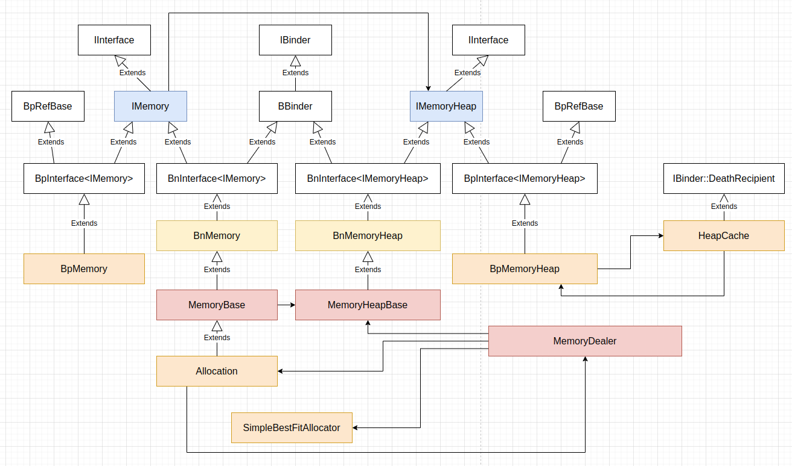

Android 的 Binder 进程间通信机制主要用于实现远程过程调用 RPC，Android 系统中进程之间的大块数据传递，如音频数据，出于效率等原因，一般不直接用 Binder 机制。Binder 库提供了基于共享内存外加 Binder 机制的跨进程文件描述符传递能力实现的跨进程大块数据传递组件，这些组件的整体结构如下图：



## IMemoryHeap

`IMemoryHeap` 类表示一大块共享内存块，这个类定义 (位于 `frameworks/native/libs/binder/include/binder/IMemory.h`) 如下：
```
class IMemoryHeap : public IInterface
{
public:
    DECLARE_META_INTERFACE(MemoryHeap)

    // flags returned by getFlags()
    enum {
        READ_ONLY   = 0x00000001
    };

    virtual int         getHeapID() const = 0;
    virtual void*       getBase() const = 0;
    virtual size_t      getSize() const = 0;
    virtual uint32_t    getFlags() const = 0;
    virtual off_t       getOffset() const = 0;

    // these are there just for backward source compatibility
    int32_t heapID() const { return getHeapID(); }
    void*   base() const  { return getBase(); }
    size_t  virtualSize() const { return getSize(); }
};
```

共享内存块主要由文件描述符、偏移量、大小和标记描述，内存基地址是共享内存块在当前进程中内存映射之后的虚拟内存地址。

`MemoryHeapBase` 类可以在某个设备上分配并管理一大块共享内存块，这个类定义 (位于 `frameworks/native/libs/binder/include/binder/MemoryHeapBase.h`) 如下：
```
namespace android {

// ---------------------------------------------------------------------------

class MemoryHeapBase : public virtual BnMemoryHeap
{
public:
    enum {
        READ_ONLY = IMemoryHeap::READ_ONLY,
        // memory won't be mapped locally, but will be mapped in the remote
        // process.
        DONT_MAP_LOCALLY = 0x00000100,
        NO_CACHING = 0x00000200
    };

    /*
     * maps the memory referenced by fd. but DOESN'T take ownership
     * of the filedescriptor (it makes a copy with dup()
     */
    MemoryHeapBase(int fd, size_t size, uint32_t flags = 0, off_t offset = 0);

    /*
     * maps memory from the given device
     */
    explicit MemoryHeapBase(const char* device, size_t size = 0, uint32_t flags = 0);

    /*
     * maps memory from ashmem, with the given name for debugging
     * if the READ_ONLY flag is set, the memory will be writeable by the calling process,
     * but not by others. this is NOT the case with the other ctors.
     */
    explicit MemoryHeapBase(size_t size, uint32_t flags = 0, char const* name = nullptr);

    virtual ~MemoryHeapBase();

    /* implement IMemoryHeap interface */
    int         getHeapID() const override;

    /* virtual address of the heap. returns MAP_FAILED in case of error */
    void*       getBase() const override;

    size_t      getSize() const override;
    uint32_t    getFlags() const override;
    off_t       getOffset() const override;

    const char*         getDevice() const;

    /* this closes this heap -- use carefully */
    void dispose();

protected:
            MemoryHeapBase();
    // init() takes ownership of fd
    status_t init(int fd, void *base, size_t size,
            int flags = 0, const char* device = nullptr);

private:
    status_t mapfd(int fd, bool writeableByCaller, size_t size, off_t offset = 0);

    int         mFD;
    size_t      mSize;
    void*       mBase;
    uint32_t    mFlags;
    const char* mDevice;
    bool        mNeedUnmap;
    off_t       mOffset;
};

// ---------------------------------------------------------------------------
} // namespace android
```

共享内存块所在的具体设备，可以用设备的文件系统路径或设备打开的文件描述符来描述，也可以选择在默认设备上分配。`MemoryHeapBase` 类各成员函数的实现 (位于 `frameworks/native/libs/binder/MemoryHeapBase.cpp`) 如下：
```
namespace android {

// ---------------------------------------------------------------------------

MemoryHeapBase::MemoryHeapBase()
    : mFD(-1), mSize(0), mBase(MAP_FAILED),
      mDevice(nullptr), mNeedUnmap(false), mOffset(0)
{
}

MemoryHeapBase::MemoryHeapBase(size_t size, uint32_t flags, char const * name)
    : mFD(-1), mSize(0), mBase(MAP_FAILED), mFlags(flags),
      mDevice(nullptr), mNeedUnmap(false), mOffset(0)
{
    const size_t pagesize = getpagesize();
    size = ((size + pagesize-1) & ~(pagesize-1));
    int fd = ashmem_create_region(name == nullptr ? "MemoryHeapBase" : name, size);
    ALOGE_IF(fd<0, "error creating ashmem region: %s", strerror(errno));
    if (fd >= 0) {
        if (mapfd(fd, true, size) == NO_ERROR) {
            if (flags & READ_ONLY) {
                ashmem_set_prot_region(fd, PROT_READ);
            }
        }
    }
}

MemoryHeapBase::MemoryHeapBase(const char* device, size_t size, uint32_t flags)
    : mFD(-1), mSize(0), mBase(MAP_FAILED), mFlags(flags),
      mDevice(nullptr), mNeedUnmap(false), mOffset(0)
{
    int open_flags = O_RDWR;
    if (flags & NO_CACHING)
        open_flags |= O_SYNC;

    int fd = open(device, open_flags);
    ALOGE_IF(fd<0, "error opening %s: %s", device, strerror(errno));
    if (fd >= 0) {
        const size_t pagesize = getpagesize();
        size = ((size + pagesize-1) & ~(pagesize-1));
        if (mapfd(fd, false, size) == NO_ERROR) {
            mDevice = device;
        }
    }
}

MemoryHeapBase::MemoryHeapBase(int fd, size_t size, uint32_t flags, off_t offset)
    : mFD(-1), mSize(0), mBase(MAP_FAILED), mFlags(flags),
      mDevice(nullptr), mNeedUnmap(false), mOffset(0)
{
    const size_t pagesize = getpagesize();
    size = ((size + pagesize-1) & ~(pagesize-1));
    mapfd(fcntl(fd, F_DUPFD_CLOEXEC, 0), false, size, offset);
}

status_t MemoryHeapBase::init(int fd, void *base, size_t size, int flags, const char* device)
{
    if (mFD != -1) {
        return INVALID_OPERATION;
    }
    mFD = fd;
    mBase = base;
    mSize = size;
    mFlags = flags;
    mDevice = device;
    return NO_ERROR;
}

status_t MemoryHeapBase::mapfd(int fd, bool writeableByCaller, size_t size, off_t offset)
{
    if (size == 0) {
        // try to figure out the size automatically
        struct stat sb;
        if (fstat(fd, &sb) == 0) {
            size = (size_t)sb.st_size;
            // sb.st_size is off_t which on ILP32 may be 64 bits while size_t is 32 bits.
            if ((off_t)size != sb.st_size) {
                ALOGE("%s: size of file %lld cannot fit in memory",
                        __func__, (long long)sb.st_size);
                return INVALID_OPERATION;
            }
        }
        // if it didn't work, let mmap() fail.
    }

    if ((mFlags & DONT_MAP_LOCALLY) == 0) {
        int prot = PROT_READ;
        if (writeableByCaller || (mFlags & READ_ONLY) == 0) {
            prot |= PROT_WRITE;
        }
        void* base = (uint8_t*)mmap(nullptr, size,
                prot, MAP_SHARED, fd, offset);
        if (base == MAP_FAILED) {
            ALOGE("mmap(fd=%d, size=%zu) failed (%s)",
                    fd, size, strerror(errno));
            close(fd);
            return -errno;
        }
        //ALOGD("mmap(fd=%d, base=%p, size=%zu)", fd, base, size);
        mBase = base;
        mNeedUnmap = true;
    } else  {
        mBase = nullptr; // not MAP_FAILED
        mNeedUnmap = false;
    }
    mFD = fd;
    mSize = size;
    mOffset = offset;
    return NO_ERROR;
}

MemoryHeapBase::~MemoryHeapBase()
{
    dispose();
}

void MemoryHeapBase::dispose()
{
    int fd = android_atomic_or(-1, &mFD);
    if (fd >= 0) {
        if (mNeedUnmap) {
            //ALOGD("munmap(fd=%d, base=%p, size=%zu)", fd, mBase, mSize);
            munmap(mBase, mSize);
        }
        mBase = nullptr;
        mSize = 0;
        close(fd);
    }
}

int MemoryHeapBase::getHeapID() const {
    return mFD;
}

void* MemoryHeapBase::getBase() const {
    return mBase;
}

size_t MemoryHeapBase::getSize() const {
    return mSize;
}

uint32_t MemoryHeapBase::getFlags() const {
    return mFlags;
}

const char* MemoryHeapBase::getDevice() const {
    return mDevice;
}

off_t MemoryHeapBase::getOffset() const {
    return mOffset;
}

// ---------------------------------------------------------------------------
} // namespace android
```

构造 `MemoryHeapBase` 类对象时，如果不提供设备的文件系统路径或设备打开的文件描述符，则将会在默认设备上创建共享内存块，且共享内存块大小会被调整为向上对齐到内存页大小的整数倍。`MemoryHeapBase` 类调用 `ashmem_create_region()` 函数在默认设备上创建共享内存块，并获得相应的文件描述符，这个函数定义 (位于 `system/core/libcutils/ashmem-dev.cpp`) 如下：
```
#define F_SEAL_FUTURE_WRITE 0x0010

/*
 * The minimum vendor API level at and after which it is safe to use memfd.
 * This is to facilitate deprecation of ashmem.
 */
#define MIN_MEMFD_VENDOR_API_LEVEL 29
#define MIN_MEMFD_VENDOR_API_LEVEL_CHAR 'Q'

/* ashmem identity */
static dev_t __ashmem_rdev;
/*
 * If we trigger a signal handler in the middle of locked activity and the
 * signal handler calls ashmem, we could get into a deadlock state.
 */
static pthread_mutex_t __ashmem_lock = PTHREAD_MUTEX_INITIALIZER;

/*
 * has_memfd_support() determines if the device can use memfd. memfd support
 * has been there for long time, but certain things in it may be missing.  We
 * check for needed support in it. Also we check if the VNDK version of
 * libcutils being used is new enough, if its not, then we cannot use memfd
 * since the older copies may be using ashmem so we just use ashmem. Once all
 * Android devices that are getting updates are new enough (ex, they were
 * originally shipped with Android release > P), then we can just use memfd and
 * delete all ashmem code from libcutils (while preserving the interface).
 *
 * NOTE:
 * The sys.use_memfd property is set by default to false in Android
 * to temporarily disable memfd, till vendor and apps are ready for it.
 * The main issue: either apps or vendor processes can directly make ashmem
 * IOCTLs on FDs they receive by assuming they are ashmem, without going
 * through libcutils. Such fds could have very well be originally created with
 * libcutils hence they could be memfd. Thus the IOCTLs will break.
 *
 * Set default value of sys.use_memfd property to true once the issue is
 * resolved, so that the code can then self-detect if kernel support is present
 * on the device. The property can also set to true from adb shell, for
 * debugging.
 */

static bool debug_log = false;            /* set to true for verbose logging and other debug  */
static bool pin_deprecation_warn = true; /* Log the pin deprecation warning only once */

/* Determine if vendor processes would be ok with memfd in the system:
 *
 * If VNDK is using older libcutils, don't use memfd. This is so that the
 * same shared memory mechanism is used across binder transactions between
 * vendor partition processes and system partition processes.
 */
static bool check_vendor_memfd_allowed() {
    std::string vndk_version = android::base::GetProperty("ro.vndk.version", "");

    if (vndk_version == "") {
        ALOGE("memfd: ro.vndk.version not defined or invalid (%s), this is mandated since P.\n",
              vndk_version.c_str());
        return false;
    }

    /* No issues if vendor is targetting current Dessert */
    if (vndk_version == "current") {
        return false;
    }

    /* Check if VNDK version is a number and act on it */
    char* p;
    long int vers = strtol(vndk_version.c_str(), &p, 10);
    if (*p == 0) {
        if (vers < MIN_MEMFD_VENDOR_API_LEVEL) {
            ALOGI("memfd: device VNDK version (%s) is < Q so using ashmem.\n",
                  vndk_version.c_str());
            return false;
        }

        return true;
    }

    // Non-numeric should be a single ASCII character. Characters after the
    // first are ignored.
    if (tolower(vndk_version[0]) < 'a' || tolower(vndk_version[0]) > 'z') {
        ALOGE("memfd: ro.vndk.version not defined or invalid (%s), this is mandated since P.\n",
              vndk_version.c_str());
        return false;
    }

    if (tolower(vndk_version[0]) < tolower(MIN_MEMFD_VENDOR_API_LEVEL_CHAR)) {
        ALOGI("memfd: device is using VNDK version (%s) which is less than Q. Use ashmem only.\n",
              vndk_version.c_str());
        return false;
    }

    return true;
}


/* Determine if memfd can be supported. This is just one-time hardwork
 * which will be cached by the caller.
 */
static bool __has_memfd_support() {
    if (check_vendor_memfd_allowed() == false) {
        return false;
    }

    /* Used to turn on/off the detection at runtime, in the future this
     * property will be removed once we switch everything over to ashmem.
     * Currently it is used only for debugging to switch the system over.
     */
    if (!android::base::GetBoolProperty("sys.use_memfd", false)) {
        if (debug_log) {
            ALOGD("sys.use_memfd=false so memfd disabled\n");
        }
        return false;
    }

    // Check if kernel support exists, otherwise fall back to ashmem.
    // This code needs to build on old API levels, so we can't use the libc
    // wrapper.
    android::base::unique_fd fd(
            syscall(__NR_memfd_create, "test_android_memfd", MFD_CLOEXEC | MFD_ALLOW_SEALING));
    if (fd == -1) {
        ALOGE("memfd_create failed: %s, no memfd support.\n", strerror(errno));
        return false;
    }

    if (fcntl(fd, F_ADD_SEALS, F_SEAL_FUTURE_WRITE) == -1) {
        ALOGE("fcntl(F_ADD_SEALS) failed: %s, no memfd support.\n", strerror(errno));
        return false;
    }

    if (debug_log) {
        ALOGD("memfd: device has memfd support, using it\n");
    }
    return true;
}

static bool has_memfd_support() {
    /* memfd_supported is the initial global per-process state of what is known
     * about memfd.
     */
    static bool memfd_supported = __has_memfd_support();

    return memfd_supported;
}

static std::string get_ashmem_device_path() {
    static const std::string boot_id_path = "/proc/sys/kernel/random/boot_id";
    std::string boot_id;
    if (!android::base::ReadFileToString(boot_id_path, &boot_id)) {
        ALOGE("Failed to read %s: %s.\n", boot_id_path.c_str(), strerror(errno));
        return "";
    };
    boot_id = android::base::Trim(boot_id);

    return "/dev/ashmem" + boot_id;
}

/* logistics of getting file descriptor for ashmem */
static int __ashmem_open_locked()
{
    static const std::string ashmem_device_path = get_ashmem_device_path();

    if (ashmem_device_path.empty()) {
        return -1;
    }

    int fd = TEMP_FAILURE_RETRY(open(ashmem_device_path.c_str(), O_RDWR | O_CLOEXEC));

    // fallback for APEX w/ use_vendor on Q, which would have still used /dev/ashmem
    if (fd < 0) {
        int saved_errno = errno;
        fd = TEMP_FAILURE_RETRY(open("/dev/ashmem", O_RDWR | O_CLOEXEC));
        if (fd < 0) {
            /* Q launching devices and newer must not reach here since they should have been
             * able to open ashmem_device_path */
            ALOGE("Unable to open ashmem device %s (error = %s) and /dev/ashmem(error = %s)",
                  ashmem_device_path.c_str(), strerror(saved_errno), strerror(errno));
            return fd;
        }
    }
    struct stat st;
    int ret = TEMP_FAILURE_RETRY(fstat(fd, &st));
    if (ret < 0) {
        int save_errno = errno;
        close(fd);
        errno = save_errno;
        return ret;
    }
    if (!S_ISCHR(st.st_mode) || !st.st_rdev) {
        close(fd);
        errno = ENOTTY;
        return -1;
    }

    __ashmem_rdev = st.st_rdev;
    return fd;
}

static int __ashmem_open()
{
    int fd;

    pthread_mutex_lock(&__ashmem_lock);
    fd = __ashmem_open_locked();
    pthread_mutex_unlock(&__ashmem_lock);

    return fd;
}
 . . . . . .
static int memfd_create_region(const char* name, size_t size) {
    // This code needs to build on old API levels, so we can't use the libc
    // wrapper.
    android::base::unique_fd fd(syscall(__NR_memfd_create, name, MFD_CLOEXEC | MFD_ALLOW_SEALING));

    if (fd == -1) {
        ALOGE("memfd_create(%s, %zd) failed: %s\n", name, size, strerror(errno));
        return -1;
    }

    if (ftruncate(fd, size) == -1) {
        ALOGE("ftruncate(%s, %zd) failed for memfd creation: %s\n", name, size, strerror(errno));
        return -1;
    }

    if (debug_log) {
        ALOGE("memfd_create(%s, %zd) success. fd=%d\n", name, size, fd.get());
    }
    return fd.release();
}

/*
 * ashmem_create_region - creates a new ashmem region and returns the file
 * descriptor, or <0 on error
 *
 * `name' is an optional label to give the region (visible in /proc/pid/maps)
 * `size' is the size of the region, in page-aligned bytes
 */
int ashmem_create_region(const char *name, size_t size)
{
    int ret, save_errno;

    if (has_memfd_support()) {
        return memfd_create_region(name ? name : "none", size);
    }

    int fd = __ashmem_open();
    if (fd < 0) {
        return fd;
    }

    if (name) {
        char buf[ASHMEM_NAME_LEN] = {0};

        strlcpy(buf, name, sizeof(buf));
        ret = TEMP_FAILURE_RETRY(ioctl(fd, ASHMEM_SET_NAME, buf));
        if (ret < 0) {
            goto error;
        }
    }

    ret = TEMP_FAILURE_RETRY(ioctl(fd, ASHMEM_SET_SIZE, size));
    if (ret < 0) {
        goto error;
    }

    return fd;

error:
    save_errno = errno;
    close(fd);
    errno = save_errno;
    return ret;
}
```

`ashmem_create_region()` 函数首先检查系统是否支持 memfd，如果支持则通过 memfd 机制创建共享内存块。系统是否支持 memfd 机制的判断方法为，首先检查从系统属性 ***ro.vndk.version*** 获得的 VNDK 版本，如果无法获取该版本或版本低于 Android Q，则认为不支持，否则继续检查；检查系统属性 ***sys.use_memfd***，如果无法获取或值为 `false`，则认为不支持，否则继续检查；调用 `memfd_create` 系统调用，如果调用失败，则认为不支持，否则继续检查；尝试为文件描述符设置 `F_ADD_SEALS`，如果失败，则认为不支持；否则认为支持 memfd 机制。

系统不支持 memfd 机制时，则使用 Android 的匿名内存共享机制创建共享内存块。具体的方法为，打开匿名共享内存设备文件，设置名称，及设置大小。匿名共享内存设备文件的路径会先尝试 `/dev/ashmem$boot_id`，如果这个路径不存在，则会尝试 `/dev/ashmem`。

`MemoryHeapBase` 类中，调用 `ashmem_create_region()` 函数在默认设备上创建共享内存块之后，则将它内存映射到当前进程中，并为它设置保护模式。

构造 `MemoryHeapBase` 类对象时，如果提供了设备的文件系统路径，同样将共享内存块大小调整为向上对齐到内存页大小的整数倍，打开设备文件，并将它内存映射到当前进程中。

构造 `MemoryHeapBase` 类对象时，如果提供了设备打开的文件描述符，则直接将它内存映射到当前进程中。

在类继承层次结构中，位于 `MemoryHeapBase` 和 `IMemoryHeap` 之间的 `BnMemoryHeap` 类，主要用于共享内存块信息的跨进程传递，这个类定义 (位于 `frameworks/native/libs/binder/include/binder/IMemory.h`) 如下：
```
class BnMemoryHeap : public BnInterface<IMemoryHeap>
{
public:
    // NOLINTNEXTLINE(google-default-arguments)
    virtual status_t onTransact(
            uint32_t code,
            const Parcel& data,
            Parcel* reply,
            uint32_t flags = 0);
    
    BnMemoryHeap();
protected:
    virtual ~BnMemoryHeap();
};
```

`BnMemoryHeap` 类只有 `onTransact()` 一个主要的成员函数。`BnMemoryHeap` 类各成员函数实现 (位于 `frameworks/native/libs/binder/IMemory.cpp`) 如下：
```
IMPLEMENT_META_INTERFACE(MemoryHeap, "android.utils.IMemoryHeap")

BnMemoryHeap::BnMemoryHeap() {
}

BnMemoryHeap::~BnMemoryHeap() {
}

// NOLINTNEXTLINE(google-default-arguments)
status_t BnMemoryHeap::onTransact(
        uint32_t code, const Parcel& data, Parcel* reply, uint32_t flags)
{
    switch(code) {
       case HEAP_ID: {
            CHECK_INTERFACE(IMemoryHeap, data, reply);
            reply->writeFileDescriptor(getHeapID());
            reply->writeUint64(getSize());
            reply->writeInt64(getOffset());
            reply->writeUint32(getFlags());
            return NO_ERROR;
        } break;
        default:
            return BBinder::onTransact(code, data, reply, flags);
    }
}
```

`BnMemoryHeap`/`MemoryHeapBase` 对象是与 `ActivityManagerService` 和 `AudioPolicyService` 对象类似的 Binder 服务，只不过它提供的服务内容比较单一，仅仅能够返回共享内存块的信息。

`BpMemoryHeap` 类是 `BnMemoryHeap`/`MemoryHeapBase` binder 服务的客户端，它实现 `IMemoryHeap` 接口，并封装 `BnMemoryHeap`/`MemoryHeapBase` binder 服务的客户端句柄，这个类定义 (位于 `frameworks/native/libs/binder/IMemory.cpp`) 如下：
```
enum {
    HEAP_ID = IBinder::FIRST_CALL_TRANSACTION
};

class BpMemoryHeap : public BpInterface<IMemoryHeap>
{
public:
    explicit BpMemoryHeap(const sp<IBinder>& impl);
    virtual ~BpMemoryHeap();

    int getHeapID() const override;
    void* getBase() const override;
    size_t getSize() const override;
    uint32_t getFlags() const override;
    off_t getOffset() const override;

private:
    friend class IMemory;
    friend class HeapCache;

    // for debugging in this module
    static inline sp<IMemoryHeap> find_heap(const sp<IBinder>& binder) {
        return gHeapCache->find_heap(binder);
    }
    static inline void free_heap(const sp<IBinder>& binder) {
        gHeapCache->free_heap(binder);
    }
    static inline sp<IMemoryHeap> get_heap(const sp<IBinder>& binder) {
        return gHeapCache->get_heap(binder);
    }
    static inline void dump_heaps() {
        gHeapCache->dump_heaps();
    }

    void assertMapped() const;
    void assertReallyMapped() const;

    mutable std::atomic<int32_t> mHeapId;
    mutable void*       mBase;
    mutable size_t      mSize;
    mutable uint32_t    mFlags;
    mutable off_t       mOffset;
    mutable bool        mRealHeap;
    mutable Mutex       mLock;
};
```

`BpMemoryHeap` 类发送请求获得共享内存块的文件描述、大小、偏移量和标记等信息，并将共享内存块映射到当前进程。`BpMemoryHeap` 类各成员函数实现 (位于 `frameworks/native/libs/binder/IMemory.cpp`) 如下：
```
BpMemoryHeap::BpMemoryHeap(const sp<IBinder>& impl)
    : BpInterface<IMemoryHeap>(impl),
        mHeapId(-1), mBase(MAP_FAILED), mSize(0), mFlags(0), mOffset(0), mRealHeap(false)
{
}

BpMemoryHeap::~BpMemoryHeap() {
    int32_t heapId = mHeapId.load(memory_order_relaxed);
    if (heapId != -1) {
        close(heapId);
        if (mRealHeap) {
            // by construction we're the last one
            if (mBase != MAP_FAILED) {
                sp<IBinder> binder = IInterface::asBinder(this);

                if (VERBOSE) {
                    ALOGD("UNMAPPING binder=%p, heap=%p, size=%zu, fd=%d",
                            binder.get(), this, mSize, heapId);
                }

                munmap(mBase, mSize);
            }
        } else {
            // remove from list only if it was mapped before
            sp<IBinder> binder = IInterface::asBinder(this);
            free_heap(binder);
        }
    }
}

void BpMemoryHeap::assertMapped() const
{
    int32_t heapId = mHeapId.load(memory_order_acquire);
    if (heapId == -1) {
        sp<IBinder> binder(IInterface::asBinder(const_cast<BpMemoryHeap*>(this)));
        sp<BpMemoryHeap> heap = sp<BpMemoryHeap>::cast(find_heap(binder));
        heap->assertReallyMapped();
        if (heap->mBase != MAP_FAILED) {
            Mutex::Autolock _l(mLock);
            if (mHeapId.load(memory_order_relaxed) == -1) {
                mBase   = heap->mBase;
                mSize   = heap->mSize;
                mOffset = heap->mOffset;
                int fd = fcntl(heap->mHeapId.load(memory_order_relaxed), F_DUPFD_CLOEXEC, 0);
                ALOGE_IF(fd==-1, "cannot dup fd=%d",
                        heap->mHeapId.load(memory_order_relaxed));
                mHeapId.store(fd, memory_order_release);
            }
        } else {
            // something went wrong
            free_heap(binder);
        }
    }
}

void BpMemoryHeap::assertReallyMapped() const
{
    int32_t heapId = mHeapId.load(memory_order_acquire);
    if (heapId == -1) {

        // remote call without mLock held, worse case scenario, we end up
        // calling transact() from multiple threads, but that's not a problem,
        // only mmap below must be in the critical section.

        Parcel data, reply;
        data.writeInterfaceToken(IMemoryHeap::getInterfaceDescriptor());
        status_t err = remote()->transact(HEAP_ID, data, &reply);
        int parcel_fd = reply.readFileDescriptor();
        const uint64_t size64 = reply.readUint64();
        const int64_t offset64 = reply.readInt64();
        const uint32_t flags = reply.readUint32();
        const size_t size = (size_t)size64;
        const off_t offset = (off_t)offset64;
        if (err != NO_ERROR || // failed transaction
                size != size64 || offset != offset64) { // ILP32 size check
            ALOGE("binder=%p transaction failed fd=%d, size=%zu, err=%d (%s)",
                    IInterface::asBinder(this).get(),
                    parcel_fd, size, err, strerror(-err));
            return;
        }

        Mutex::Autolock _l(mLock);
        if (mHeapId.load(memory_order_relaxed) == -1) {
            int fd = fcntl(parcel_fd, F_DUPFD_CLOEXEC, 0);
            ALOGE_IF(fd == -1, "cannot dup fd=%d, size=%zu, err=%d (%s)",
                    parcel_fd, size, err, strerror(errno));

            int access = PROT_READ;
            if (!(flags & READ_ONLY)) {
                access |= PROT_WRITE;
            }
            mRealHeap = true;
            mBase = mmap(nullptr, size, access, MAP_SHARED, fd, offset);
            if (mBase == MAP_FAILED) {
                ALOGE("cannot map BpMemoryHeap (binder=%p), size=%zu, fd=%d (%s)",
                        IInterface::asBinder(this).get(), size, fd, strerror(errno));
                close(fd);
            } else {
                mSize = size;
                mFlags = flags;
                mOffset = offset;
                mHeapId.store(fd, memory_order_release);
            }
        }
    }
}

int BpMemoryHeap::getHeapID() const {
    assertMapped();
    // We either stored mHeapId ourselves, or loaded it with acquire semantics.
    return mHeapId.load(memory_order_relaxed);
}

void* BpMemoryHeap::getBase() const {
    assertMapped();
    return mBase;
}

size_t BpMemoryHeap::getSize() const {
    assertMapped();
    return mSize;
}

uint32_t BpMemoryHeap::getFlags() const {
    assertMapped();
    return mFlags;
}

off_t BpMemoryHeap::getOffset() const {
    assertMapped();
    return mOffset;
}
```

`BpMemoryHeap` 类基于 `BnMemoryHeap`/`MemoryHeapBase` binder 服务的客户端句柄创建，当它的接口成员函数被调用时，它们通过 `assertMapped()` 函数确保共享内存块已经映射进当前进程。`assertMapped()` 函数向服务端发送请求，获得共享内存块的信息，将共享内存块映射进当前进程，并在 `HeapCache` 中保存共享内存块相关信息。

## IMemory

`IMemory` 类表示从一大块共享内存块，即 `IMemoryHeap` 中分配的一小块内存，这个类定义 (位于 `frameworks/native/libs/binder/include/binder/IMemory.h`) 如下：
```
class IMemory : public IInterface
{
public:
    DECLARE_META_INTERFACE(Memory)

    // NOLINTNEXTLINE(google-default-arguments)
    virtual sp<IMemoryHeap> getMemory(ssize_t* offset=nullptr, size_t* size=nullptr) const = 0;

    // helpers

    // Accessing the underlying pointer must be done with caution, as there are
    // some inherent security risks associated with it. When receiving an
    // IMemory from an untrusted process, there is currently no way to guarantee
    // that this process would't change the content after the fact. This may
    // lead to TOC/TOU class of security bugs. In most cases, when performance
    // is not an issue, the recommended practice is to immediately copy the
    // buffer upon reception, then work with the copy, e.g.:
    //
    // std::string private_copy(mem.size(), '\0');
    // memcpy(private_copy.data(), mem.unsecurePointer(), mem.size());
    //
    // In cases where performance is an issue, this matter must be addressed on
    // an ad-hoc basis.
    void* unsecurePointer() const;

    size_t size() const;
    ssize_t offset() const;

private:
    // These are now deprecated and are left here for backward-compatibility
    // with prebuilts that may reference these symbol at runtime.
    // Instead, new code should use unsecurePointer()/unsecureFastPointer(),
    // which do the same thing, but make it more obvious that there are some
    // security-related pitfalls associated with them.
    void* pointer() const;
    void* fastPointer(const sp<IBinder>& heap, ssize_t offset) const;
};
```

`IMemoryHeap` 类管理的内存一般可以认为是无结构的，`IMemory` 管理的内存则一般用于创建某些结构。`IMemory` 类各个成员函数定义 (位于 `frameworks/native/libs/binder/IMemory.cpp`) 如下：
```
void* IMemory::fastPointer(const sp<IBinder>& binder, ssize_t offset) const
{
    sp<IMemoryHeap> realHeap = BpMemoryHeap::get_heap(binder);
    void* const base = realHeap->base();
    if (base == MAP_FAILED)
        return nullptr;
    return static_cast<char*>(base) + offset;
}

void* IMemory::unsecurePointer() const {
    ssize_t offset;
    sp<IMemoryHeap> heap = getMemory(&offset);
    void* const base = heap!=nullptr ? heap->base() : MAP_FAILED;
    if (base == MAP_FAILED)
        return nullptr;
    return static_cast<char*>(base) + offset;
}

void* IMemory::pointer() const { return unsecurePointer(); }

size_t IMemory::size() const {
    size_t size;
    getMemory(nullptr, &size);
    return size;
}

ssize_t IMemory::offset() const {
    ssize_t offset;
    getMemory(&offset);
    return offset;
}
```

`IMemory` 类主要从其子类获得特定的一小块内存相关的信息，包括这块内存所在的共享内存块 `IMemoryHeap`，以及偏移量和大小，并可返回这一小块内存的基地址用于读写。

`MemoryBase` 类维护特定的一小块内存相关的信息，这个类的定义 (位于 `frameworks/native/libs/binder/include/binder/MemoryBase.h`) 如下：
```
class MemoryBase : public BnMemory 
{
public:
    MemoryBase(const sp<IMemoryHeap>& heap, ssize_t offset, size_t size);
    virtual ~MemoryBase();
    virtual sp<IMemoryHeap> getMemory(ssize_t* offset, size_t* size) const;

protected:
    size_t getSize() const { return mSize; }
    ssize_t getOffset() const { return mOffset; }
    const sp<IMemoryHeap>& getHeap() const { return mHeap; }

private:
    size_t          mSize;
    ssize_t         mOffset;
    sp<IMemoryHeap> mHeap;
};
```

这个类各成员函数实现 (位于 `frameworks/native/libs/binder/MemoryBase.cpp`) 如下：
```
MemoryBase::MemoryBase(const sp<IMemoryHeap>& heap,
        ssize_t offset, size_t size)
    : mSize(size), mOffset(offset), mHeap(heap)
{
}

sp<IMemoryHeap> MemoryBase::getMemory(ssize_t* offset, size_t* size) const
{
    if (offset) *offset = mOffset;
    if (size)   *size = mSize;
    return mHeap;
}

MemoryBase::~MemoryBase()
{
}
```

`MemoryBase` 类维护的特定一小块内存相关信息全部在构造函数中传入。

在类继承层次结构中，位于 `MemoryBase` 和 `IMemory` 之间的 `BnMemory` 类，主要用于一小块共享内存块信息的跨进程传递，这个类定义 (位于 `frameworks/native/libs/binder/include/binder/IMemory.h`) 如下：
```
class BnMemory : public BnInterface<IMemory>
{
public:
    // NOLINTNEXTLINE(google-default-arguments)
    virtual status_t onTransact(
            uint32_t code,
            const Parcel& data,
            Parcel* reply,
            uint32_t flags = 0);

    BnMemory();
protected:
    virtual ~BnMemory();
};
```

与 `BnMemoryHeap` 类类似，`BnMemory` 类也只有 `onTransact()` 一个主要的成员函数。`BnMemory` 类各成员函数实现 (位于 `frameworks/native/libs/binder/IMemory.cpp`) 如下：
```
IMPLEMENT_META_INTERFACE(Memory, "android.utils.IMemory")

BnMemory::BnMemory() {
}

BnMemory::~BnMemory() {
}

// NOLINTNEXTLINE(google-default-arguments)
status_t BnMemory::onTransact(
    uint32_t code, const Parcel& data, Parcel* reply, uint32_t flags)
{
    switch(code) {
        case GET_MEMORY: {
            CHECK_INTERFACE(IMemory, data, reply);
            ssize_t offset;
            size_t size;
            reply->writeStrongBinder( IInterface::asBinder(getMemory(&offset, &size)) );
            reply->writeInt64(offset);
            reply->writeUint64(size);
            return NO_ERROR;
        } break;
        default:
            return BBinder::onTransact(code, data, reply, flags);
    }
}
```

`BnMemory`/`MemoryBase` 对象同样是 Binder 服务，它仅仅能够返回一小块共享内存块相关的信息，主要是一个 `IMemoryHeap` 对象，以及偏移量和大小。

`BnMemory`/`MemoryBase` binder 服务的客户端则为 `BpMemory`，它实现 `IMemory` 接口，并封装 `BnMemory`/`MemoryBase` binder 服务的客户端句柄，这个类定义 (位于 `frameworks/native/libs/binder/IMemory.cpp`) 如下：
```
class BpMemory : public BpInterface<IMemory>
{
public:
    explicit BpMemory(const sp<IBinder>& impl);
    virtual ~BpMemory();
    // NOLINTNEXTLINE(google-default-arguments)
    virtual sp<IMemoryHeap> getMemory(ssize_t* offset=nullptr, size_t* size=nullptr) const;

private:
    mutable sp<IMemoryHeap> mHeap;
    mutable ssize_t mOffset;
    mutable size_t mSize;
};
```

与 `MemoryBase` 类似，`BpMemory` 管理一小块共享内存块，只是它管理的一小块共享内存块的相关信息是请求 `BnMemory`/`MemoryBase` binder 服务获得的，其中最重要的 `IMemoryHeap`。`BpMemory` 类各成员函数实现 (位于 `frameworks/native/libs/binder/IMemory.cpp`) 如下：
```
BpMemory::BpMemory(const sp<IBinder>& impl)
    : BpInterface<IMemory>(impl), mOffset(0), mSize(0)
{
}

BpMemory::~BpMemory()
{
}

// NOLINTNEXTLINE(google-default-arguments)
sp<IMemoryHeap> BpMemory::getMemory(ssize_t* offset, size_t* size) const
{
    if (mHeap == nullptr) {
        Parcel data, reply;
        data.writeInterfaceToken(IMemory::getInterfaceDescriptor());
        if (remote()->transact(GET_MEMORY, data, &reply) == NO_ERROR) {
            sp<IBinder> heap = reply.readStrongBinder();
            if (heap != nullptr) {
                mHeap = interface_cast<IMemoryHeap>(heap);
                if (mHeap != nullptr) {
                    const int64_t offset64 = reply.readInt64();
                    const uint64_t size64 = reply.readUint64();
                    const ssize_t o = (ssize_t)offset64;
                    const size_t s = (size_t)size64;
                    size_t heapSize = mHeap->getSize();
                    if (s == size64 && o == offset64 // ILP32 bounds check
                            && s <= heapSize
                            && o >= 0
                            && (static_cast<size_t>(o) <= heapSize - s)) {
                        mOffset = o;
                        mSize = s;
                    } else {
                        // Hm.
                        android_errorWriteWithInfoLog(0x534e4554,
                            "26877992", -1, nullptr, 0);
                        mOffset = 0;
                        mSize = 0;
                    }
                }
            }
        }
    }
    if (offset) *offset = mOffset;
    if (size) *size = mSize;
    return (mSize > 0) ? mHeap : nullptr;
}
```

在 `BpMemory` 类的 `getMemory()` 函数中，请求 `BnMemory`/`MemoryBase` binder 服务获得 `BnMemoryHeap` 的客户端句柄，基于该句柄创建 `BpMemoryHeap` 对象，并获得大小和偏移量。

`HeapCache` 类用于缓存一块共享内存在当前进程中的映射信息，即在某个进程中可以为同一个 `BnMemoryHeap`/`MemoryHeapBase` binder 服务创建多个客户端代理对象 `BpMemoryHeap`，`HeapCache` 用于帮助进程只执行一次共享内存块的内存映射。`HeapCache` 类定义 (位于 `frameworks/native/libs/binder/IMemory.cpp`) 如下：
```
class HeapCache : public IBinder::DeathRecipient
{
public:
    HeapCache();
    virtual ~HeapCache();

    virtual void binderDied(const wp<IBinder>& who);

    sp<IMemoryHeap> find_heap(const sp<IBinder>& binder);
    void free_heap(const sp<IBinder>& binder);
    sp<IMemoryHeap> get_heap(const sp<IBinder>& binder);
    void dump_heaps();

private:
    // For IMemory.cpp
    struct heap_info_t {
        sp<IMemoryHeap> heap;
        int32_t         count;
        // Note that this cannot be meaningfully copied.
    };

    void free_heap(const wp<IBinder>& binder);

    Mutex mHeapCacheLock;  // Protects entire vector below.
    KeyedVector< wp<IBinder>, heap_info_t > mHeapCache;
    // We do not use the copy-on-write capabilities of KeyedVector.
    // TODO: Reimplemement based on standard C++ container?
};

static sp<HeapCache> gHeapCache = sp<HeapCache>::make();
```

`HeapCache` 缓存以 `wp<IBinder>` 为键，以共享内存块信息 `heap_info_t` 为值，`heap_info_t` 只包含 `BpMemoryHeap` 和引用计数。`HeapCache` 类各成员函数实现 (位于 `frameworks/native/libs/binder/IMemory.cpp`) 如下：
```
HeapCache::HeapCache()
    : DeathRecipient()
{
}

HeapCache::~HeapCache()
{
}

void HeapCache::binderDied(const wp<IBinder>& binder)
{
    //ALOGD("binderDied binder=%p", binder.unsafe_get());
    free_heap(binder);
}

sp<IMemoryHeap> HeapCache::find_heap(const sp<IBinder>& binder)
{
    Mutex::Autolock _l(mHeapCacheLock);
    ssize_t i = mHeapCache.indexOfKey(binder);
    if (i>=0) {
        heap_info_t& info = mHeapCache.editValueAt(i);
        ALOGD_IF(VERBOSE,
                "found binder=%p, heap=%p, size=%zu, fd=%d, count=%d",
                binder.get(), info.heap.get(),
                static_cast<BpMemoryHeap*>(info.heap.get())->mSize,
                static_cast<BpMemoryHeap*>(info.heap.get())
                    ->mHeapId.load(memory_order_relaxed),
                info.count);
        ++info.count;
        return info.heap;
    } else {
        heap_info_t info;
        info.heap = interface_cast<IMemoryHeap>(binder);
        info.count = 1;
        //ALOGD("adding binder=%p, heap=%p, count=%d",
        //      binder.get(), info.heap.get(), info.count);
        mHeapCache.add(binder, info);
        return info.heap;
    }
}

void HeapCache::free_heap(const sp<IBinder>& binder)  {
    free_heap( wp<IBinder>(binder) );
}

void HeapCache::free_heap(const wp<IBinder>& binder)
{
    sp<IMemoryHeap> rel;
    {
        Mutex::Autolock _l(mHeapCacheLock);
        ssize_t i = mHeapCache.indexOfKey(binder);
        if (i>=0) {
            heap_info_t& info(mHeapCache.editValueAt(i));
            if (--info.count == 0) {
                ALOGD_IF(VERBOSE,
                        "removing binder=%p, heap=%p, size=%zu, fd=%d, count=%d",
                        binder.unsafe_get(), info.heap.get(),
                        static_cast<BpMemoryHeap*>(info.heap.get())->mSize,
                        static_cast<BpMemoryHeap*>(info.heap.get())
                            ->mHeapId.load(memory_order_relaxed),
                        info.count);
                rel = mHeapCache.valueAt(i).heap;
                mHeapCache.removeItemsAt(i);
            }
        } else {
            ALOGE("free_heap binder=%p not found!!!", binder.unsafe_get());
        }
    }
}

sp<IMemoryHeap> HeapCache::get_heap(const sp<IBinder>& binder)
{
    sp<IMemoryHeap> realHeap;
    Mutex::Autolock _l(mHeapCacheLock);
    ssize_t i = mHeapCache.indexOfKey(binder);
    if (i>=0)   realHeap = mHeapCache.valueAt(i).heap;
    else        realHeap = interface_cast<IMemoryHeap>(binder);
    return realHeap;
}
```

对于特定 `BnMemoryHeap`/`MemoryHeapBase` binder 服务，无论在一个进程中为其创建了多少客户端代理 `BpMemoryHeap` 对象，只有 `HeapCache` 缓存中的那个真正执行了共享内存块在当前进程中的内存映射，也只有它的 `mRealHeap` 字段为 `true`。

向 `HeapCache` 缓存放入共享内存块信息的一个过程大体为：
1. `BpMemory` 类对象创建；
2. `BpMemory` 类对象的 `getMemory()` 函数被调用；
3. `BpMemory` 类对象的 `getMemory()` 函数请求 `BnMemory`/`MemoryBase` binder 服务，和获得 `BnMemoryHeap`/`MemoryHeapBase` binder 服务的客户端句柄；
4. `BpMemory` 类对象的 `getMemory()` 函数创建一个 `BpMemoryHeap` 对象；
5. `BpMemoryHeap` 对象的接口函数被调用，接口函数调用 `assertMapped()` 函数确保共享内存块在当前进程中的映射；
6. `assertMapped()` 函数查询 `HeapCache` 缓存，如果对应键的共享内存块信息 `heap_info_t` 不存在，则另外创建一个 `BpMemoryHeap` 对象，并把它放进缓存中，当然，如前面看到的，`assertMapped()` 函数还会请求 `HeapCache` 缓存中的 `BpMemoryHeap` 对象执行共享内存块在当前进程中的映射，并把共享内存块大小、偏移量、内存基地址和文件描述符复制到当前对象中。

当需要从一个 `sp<IBinder>` 对象和偏移量快速获得一小块共享内存块的基地址时，也会查询 `HeapCache` 缓存，如在 `IMemory::fastPointer()` 中看到的那样。

`BpMemoryHeap` 对象的析构可以看作两种对象的销毁，一种是 `HeapCache` 缓存中的 `BpMemoryHeap` 对象的销毁，此时会取消映射；另一种是其它的 `BpMemoryHeap` 对象的销毁，此时会尝试释放 `HeapCache` 缓存中 `BpMemoryHeap` 对象，`HeapCache` 缓存会减小 `BpMemoryHeap` 对象的引用计数，引用计数减为 0 时，会销毁 `HeapCache` 缓存中的 `BpMemoryHeap` 对象。

## MemoryDealer

`MemoryDealer` 类实现了一个内存管理系统，它会创建一个共享内存块，并从这个共享内存块上面分配一小块共享内存，共享内存块由 `IMemoryHeap` 描述，一小块共享内存由 `IMemory` 描述。

`MemoryDealer` 类定义 (位于 `frameworks/native/libs/binder/include/binder/MemoryDealer.h`) 如下：
```
class MemoryDealer : public RefBase
{
public:
    explicit MemoryDealer(size_t size, const char* name = nullptr,
            uint32_t flags = 0 /* or bits such as MemoryHeapBase::READ_ONLY */ );

    virtual sp<IMemory> allocate(size_t size);
    virtual void        deallocate(size_t offset);
    virtual void        dump(const char* what) const;

    // allocations are aligned to some value. return that value so clients can account for it.
    static size_t      getAllocationAlignment();

    sp<IMemoryHeap> getMemoryHeap() const { return heap(); }

protected:
    virtual ~MemoryDealer();

private:
    const sp<IMemoryHeap>&      heap() const;
    SimpleBestFitAllocator*     allocator() const;

    sp<IMemoryHeap>             mHeap;
    SimpleBestFitAllocator*     mAllocator;
};
```

`MemoryDealer` 类各成员函数实现 (位于 `frameworks/native/libs/binder/MemoryDealer.cpp`) 如下：
```
MemoryDealer::MemoryDealer(size_t size, const char* name, uint32_t flags)
      : mHeap(sp<MemoryHeapBase>::make(size, flags, name)),
        mAllocator(new SimpleBestFitAllocator(size)) {}

MemoryDealer::~MemoryDealer()
{
    delete mAllocator;
}

sp<IMemory> MemoryDealer::allocate(size_t size)
{
    sp<IMemory> memory;
    const ssize_t offset = allocator()->allocate(size);
    if (offset >= 0) {
        memory = sp<Allocation>::make(sp<MemoryDealer>::fromExisting(this), heap(), offset, size);
    }
    return memory;
}

void MemoryDealer::deallocate(size_t offset)
{
    allocator()->deallocate(offset);
}

void MemoryDealer::dump(const char* what) const
{
    allocator()->dump(what);
}

const sp<IMemoryHeap>& MemoryDealer::heap() const {
    return mHeap;
}

SimpleBestFitAllocator* MemoryDealer::allocator() const {
    return mAllocator;
}

// static
size_t MemoryDealer::getAllocationAlignment()
{
    return SimpleBestFitAllocator::getAllocationAlignment();
}
```

`MemoryDealer` 类管理的内存在其构造函数中创建。在实现中，`MemoryDealer` 用 `SimpleBestFitAllocator` 作为内存分配算法，`SimpleBestFitAllocator` 的内存分配接口返回分配的内存的偏移量。`MemoryDealer` 类分配的一小块共享内存实际由 `Allocation` 类表示。`Allocation` 继承自 `MemoryBase`，相对于 `MemoryBase`，它增加了在析构时，自动向 `MemoryDealer` 请求释放内存的动作。

对应到 C 语言的动态内存分配系统，`MemoryHeapBase` 可以看作是 `malloc()`/`free()` 管理的所有的内存，`MemoryBase` 可以看作是 `malloc()` 返回的一小块分配好的内存块，`Allocation`  的角色有点类似于 `std::unique_ptr`，`SimpleBestFitAllocator` 可以看作 `malloc()`/`free()` 实现中所用的内存分配和释放算法，它实现了一个最佳大小适配算法。

## Android 中音频数据的跨进程传递

在 `android::AudioTrack` 的实现中，共享内存块信息的传递，不是通过传递 `MemoryHeapBase` 和 `MemoryBase` 对象来实现的，而是通过传递 `android::media::SharedFileRegion` 对象实现的。

`AudioTrack::createTrack_l()` 函数中创建的 `IAudioFlinger::CreateTrackInput` 对象，会被转换为 `android::media::CreateTrackRequest` 对象，如 `IAudioFlinger::CreateTrackInput::toAidl()` 函数的定义 (位于 `frameworks/av/media/libaudioclient/IAudioFlinger.cpp`)：
```
ConversionResult<media::CreateTrackRequest> IAudioFlinger::CreateTrackInput::toAidl() const {
    media::CreateTrackRequest aidl;
    aidl.attr = VALUE_OR_RETURN(legacy2aidl_audio_attributes_t_AudioAttributesInternal(attr));
    aidl.config = VALUE_OR_RETURN(legacy2aidl_audio_config_t_AudioConfig(config));
    aidl.clientInfo = VALUE_OR_RETURN(legacy2aidl_AudioClient_AudioClient(clientInfo));
    aidl.sharedBuffer = VALUE_OR_RETURN(legacy2aidl_NullableIMemory_SharedFileRegion(sharedBuffer));
    aidl.notificationsPerBuffer = VALUE_OR_RETURN(convertIntegral<int32_t>(notificationsPerBuffer));
    aidl.speed = speed;
    aidl.audioTrackCallback = audioTrackCallback;
    aidl.flags = VALUE_OR_RETURN(legacy2aidl_audio_output_flags_t_int32_t_mask(flags));
    aidl.frameCount = VALUE_OR_RETURN(convertIntegral<int64_t>(frameCount));
    aidl.notificationFrameCount = VALUE_OR_RETURN(convertIntegral<int64_t>(notificationFrameCount));
    aidl.selectedDeviceId = VALUE_OR_RETURN(
            legacy2aidl_audio_port_handle_t_int32_t(selectedDeviceId));
    aidl.sessionId = VALUE_OR_RETURN(legacy2aidl_audio_session_t_int32_t(sessionId));
    return aidl;
}
```

对于 `IMemory` 描述的共享内存块，它会由 `legacy2aidl_NullableIMemory_SharedFileRegion()` 函数转换为 `android::media::SharedFileRegion` 对象，该函数定义 (位于 `frameworks/av/media/libaudioclient/AidlConversion.cpp`) 如下：
```
ConversionResult<std::optional<media::SharedFileRegion>>
legacy2aidl_NullableIMemory_SharedFileRegion(const sp<IMemory>& legacy) {
    std::optional<media::SharedFileRegion> aidl;
    if (!convertNullableIMemoryToSharedFileRegion(legacy, &aidl)) {
        return unexpected(BAD_VALUE);
    }
    return aidl;
}
```

`convertNullableIMemoryToSharedFileRegion()` 函数将 `IMemory` 指向的共享内存块相关信息，如文件描述符、偏移量、大小等信息和标记等信息复制到 `android::media::SharedFileRegion` 对象，该函数定义 (位于 `frameworks/av/media/libshmem/ShmemCompat.cpp`) 如下：
```
bool convertIMemoryToSharedFileRegion(const sp<IMemory>& mem,
                                      SharedFileRegion* result) {
    assert(mem != nullptr);
    assert(result != nullptr);

    *result = SharedFileRegion();

    ssize_t offset;
    size_t size;

    sp<IMemoryHeap> heap = mem->getMemory(&offset, &size);
    if (size > 0) {
        if (heap == nullptr) {
            return false;
        }
        // Make sure the offset and size do not overflow from int64 boundaries.
        if (size > std::numeric_limits<int64_t>::max() ||
                offset > std::numeric_limits<int64_t>::max() ||
                heap->getOffset() > std::numeric_limits<int64_t>::max() ||
                static_cast<uint64_t>(heap->getOffset()) +
                static_cast<uint64_t>(offset)
                        > std::numeric_limits<int64_t>::max()) {
            return false;
        }

        const int fd = fcntl(heap->getHeapID(), F_DUPFD_CLOEXEC, 0);
        if (fd < 0) {
            return false;
        }
        result->fd.reset(base::unique_fd(fd));
        result->size = size;
        result->offset = heap->getOffset() + offset;
        result->writeable = (heap->getFlags() & IMemoryHeap::READ_ONLY) == 0;
    }
    return true;
}
 . . . . . .
bool convertNullableIMemoryToSharedFileRegion(const sp<IMemory>& mem,
                                              std::optional<SharedFileRegion>* result) {
    assert(result != nullptr);

    if (mem == nullptr) {
        result->reset();
        return true;
    }

    result->emplace();
    return convertIMemoryToSharedFileRegion(mem, &result->value());
}
```

对应的，收到由 `android::media::SharedFileRegion` 对象描述的共享内存块的进程，也可以将它转换为 `IMemory` 对象。同样是在 `AudioTrack::createTrack_l()` 函数中，可以看到下面这样一段代码：
```
    std::optional<media::SharedFileRegion> sfr;
    output.audioTrack->getCblk(&sfr);
    sp<IMemory> iMem = VALUE_OR_FATAL(aidl2legacy_NullableSharedFileRegion_IMemory(sfr));
    if (iMem == 0) {
        ALOGE("%s(%d): Could not get control block", __func__, mPortId);
        status = NO_INIT;
        goto exit;
    }
```

`aidl2legacy_NullableSharedFileRegion_IMemory()` 函数将 `android::media::SharedFileRegion` 对象描述的共享内存块转换为 `IMemory` 的描述，该函数定义 (位于 `frameworks/av/media/libaudioclient/AidlConversion.cpp`) 如下：
```
ConversionResult<sp<IMemory>>
aidl2legacy_NullableSharedFileRegion_IMemory(const std::optional<media::SharedFileRegion>& aidl) {
    sp<IMemory> legacy;
    if (!convertNullableSharedFileRegionToIMemory(aidl, &legacy)) {
        return unexpected(BAD_VALUE);
    }
    return legacy;
}
```

`convertNullableSharedFileRegionToIMemory()` 基于共享内存块所在设备的打开文件描述符、偏移量、大小和标记，创建 `MemoryHeapBase` 和 `MemoryBase` 对象，该函数定义 (位于 `frameworks/av/media/libshmem/ShmemCompat.cpp`) 如下：
```
bool convertSharedFileRegionToIMemory(const SharedFileRegion& shmem,
                                      sp<IMemory>* result) {
    assert(result != nullptr);

    if (!validateSharedFileRegion(shmem)) {
        return false;
    }

    // Heap offset and size must be page aligned.
    const size_t pageSize = getpagesize();
    const size_t pageMask = ~(pageSize - 1);

    // OK if this wraps.
    const uint64_t endOffset = static_cast<uint64_t>(shmem.offset) +
            static_cast<uint64_t>(shmem.size);

    // Round down to page boundary.
    const uint64_t heapStartOffset = shmem.offset & pageMask;
    // Round up to page boundary.
    const uint64_t heapEndOffset = (endOffset + pageSize - 1) & pageMask;
    const uint64_t heapSize = heapEndOffset - heapStartOffset;

    if (heapStartOffset > std::numeric_limits<size_t>::max() ||
        heapSize > std::numeric_limits<size_t>::max()) {
        return false;
    }

    uint32_t flags = !shmem.writeable ? IMemoryHeap::READ_ONLY : 0;

    const sp<MemoryHeapBase> heap =
            new MemoryHeapBase(shmem.fd.get(), heapSize, flags, heapStartOffset);
    *result = sp<MemoryBase>::make(heap,
                                   shmem.offset - heapStartOffset,
                                   shmem.size);
    return true;
}
 . . . . . .
bool convertNullableSharedFileRegionToIMemory(const std::optional<SharedFileRegion>& shmem,
                                              sp<IMemory>* result) {
    assert(result != nullptr);

    if (!shmem.has_value()) {
        result->clear();
        return true;
    }

    return convertSharedFileRegionToIMemory(shmem.value(), result);
}
```

Done.
