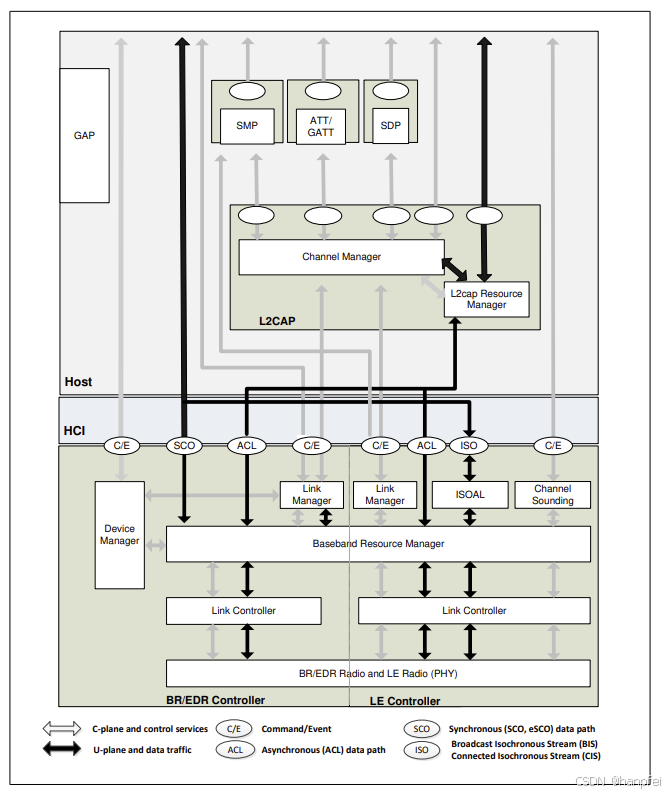
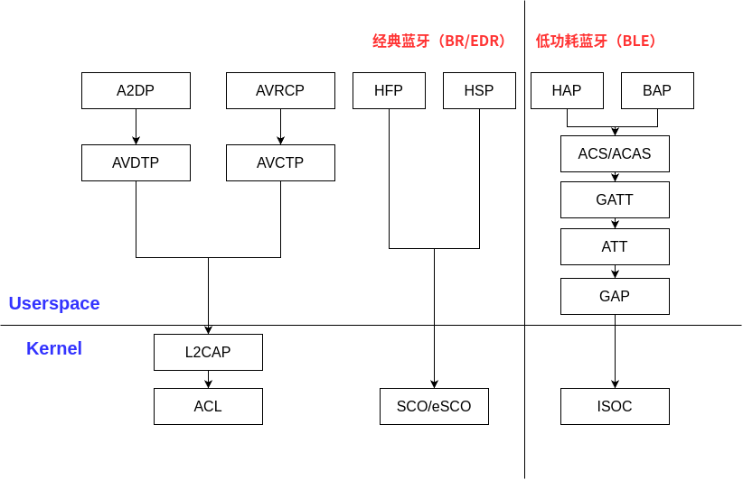
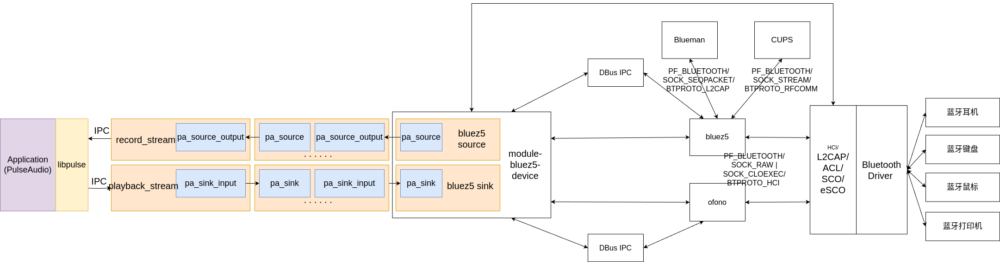

@[TOC](Linux 蓝牙音频软件栈实现分析)

## 蓝牙音频协议栈简介

**蓝牙协议栈**是实现蓝牙通信功能的软件架构，它由多个层次组成，每一层负责特定的功能。蓝牙协议栈的设计遵循蓝牙标准 (由**蓝牙技术联盟**，**Bluetooth SIG** 定义），支持多种蓝牙配置文件 (Profiles），以满足不同的应用场景 (如音频传输、文件传输、健康设备、键盘鼠标这样的输入输出设备等）。

蓝牙各个应用场景的实现，如音频传输、文件传输和键盘鼠标这样的输入设备，与系统中常规的这些功能的实现大为不同。如对于音频播放和录制，通过 USB 连接的音频设备，或通过 audio codec 实现的音频播放和录制，在 Linux 中，基于 ALSA 框架实现，内核通过导出设备文件向用户空间暴露相应的硬件能力。USB 键盘鼠标，在 Linux 中，基于输入设备框架实现，内核同样通过导出设备文件向用户空间暴露相应的硬件能力。

可与**蓝牙协议栈**类比的不是系统中常规的各个功能的实现，而是 TCP/IP 网络协议栈。在实现上，与 TCP/IP 网络协议栈类似，**蓝牙协议栈**不同功能的各个协议层次，它们的实现分布于硬件、Linux 操作系统内核、BlueZ 这样的蓝牙系统服务和 PulseAudio 这样的系统服务等不同的系统组件中。

**Bluetooth SIG** 官方的蓝牙核心规范 ([蓝牙核心规范 6.0](https://www.bluetooth.com/specifications/specs/core-specification-6-0/)) 给出的蓝牙核心系统架构如下图所示：


蓝牙协议栈的分层结构如下图所示：
```
+--------------------------------------------------------------------------------------------+
|                   Application Layer                                                        |
|  (Profiles: A2DP, HFP, HSP, AVRCP, HAP, BAP, ACS, ACAS, GAP, GATT, FTP, OPP, etc.)         |
+--------------------------------------------------------------------------------------------+
|                   Middleware Layer                                                         |
|  (Protocols: AVDTP, AVCTP, SDP, ATT, RFCOMM, OBEX, TCS, BNEP, etc.)                        |
+--------------------------------------------------------------------------------------------+
|                   Host Controller Interface (HCI)                                          |
|  (Protocols: HCI Commands, Events, and Data)                                               |
+--------------------------------------------------------------------------------------------+
|                   Logical Link Control and                                                 |
|                   Adaptation Protocol (L2CAP)                                              |
+--------------------------------------------------------------------------------------------+
|                   Baseband Layer                                                           |
|  (Protocols: Link Manager Protocol (LMP), SCO, eSCO, ACL, ISOC, etc.)                      |
+--------------------------------------------------------------------------------------------+
|                   Radio Layer                                                              |
|  (Physical Layer: Bluetooth Radio)                                                         |
+--------------------------------------------------------------------------------------------+
```

蓝牙协议栈各层次简单说明如下：

 * **应用层**：实现具体的蓝牙应用功能 (如音频传输、文件传输）。通过蓝牙配置文件 (Profiles) 定义设备的行为。常见的应用层协议/配置文件有 **A2DP** (Advanced Audio Distribution Profile，高质量音频传输)，**HFP** (Hands-Free Profile，免提通话），**HSP** (Headset Profile，耳机通话），**AVRCP** (Audio/Video Remote Control Profile，远程控制音频/视频设备），**HAP** (Hearing Aid Profile，用于助听器设备)，**BAP** (Bluetooth Audio Profile，用于通用音频设备)，**ACS** (Audio Control Service，提供音频控制功能（如音量调节、播放控制），基于 GATT/ATT 实现，通过暴露特性（Characteristics）供应用程序使用)，**ACAS** (Audio Stream Control Service，提供音频流管理功能（如流的创建、配置、删除），基于 GATT/ATT 实现，与 Isochronous Channels（ISOC） 协作，实现低延迟音频流传输)，**GATT** (Generic Attribute Profile，定义基于 ATT 的服务和特性，用于数据传输，提供逻辑信道管理，支持客户端-服务器模型)，**GAP** (Generic Access Profile，定义设备角色 (如广播者、观察者、中心设备、外围设备) 和连接流程，负责设备发现、连接建立和安全控制)，**FTP** (File Transfer Profile，文件传输），**OPP** (Object Push Profile，对象推送 (如联系人、图片）），**PAN** (Personal Area Network Profile，个人局域网），**HID** (Human Interface Device Profile，人机接口设备 (如键盘、鼠标) 等。

 * **中间件层**：提供高层协议和服务，支持应用层的功能实现。常见的中间件层协议有，**SDP** (Service Discovery Protocol，服务发现协议，用于查找设备支持的服务），**RFCOMM** (Radio Frequency Communication，串口仿真协议，用于模拟 RS-232 串口通信），**OBEX** (Object Exchange Protocol，对象交换协议，用于文件传输和数据同步），**TCS** (Telephony Control Protocol Specification，电话控制协议，用于语音通话），**BNEP** (Bluetooth Network Encapsulation Protocol，网络封装协议，用于蓝牙网络共享），**AVDTP** (Audio/Video Distribution Transport Protocol，音频/视频传输协议，负责音频流的传输和控制，它定义了音频流的建立、配置、启动、暂停和停止等操作），**AVCTP** (Audio/Video Remote Control Profile，音频/视频远程控制协议，蓝牙协议栈中的控制传输协议，负责音频/视频控制命令的传输，它定义了控制命令的封装和传输机制），**ATT** (Attribute Protocol，用于在 BLE 设备之间传输属性数据，提供基于客户端-服务器的数据访问机制) 等。

 * **HCI 层**：提供主机和蓝牙控制器之间的通信接口。负责传输命令、事件和数据。

 * **L2CAP 层**：提供多路复用、分段和重组功能，支持上层协议的数据传输。管理逻辑链路，提供可靠的数据传输服务。

 * **基带层**：管理物理链路，处理蓝牙设备的连接和通信。负责频率跳变、数据包格式化和错误检测。常见的基带层协议有 **LMP** (Link Manager Protocol，链路管理协议，负责设备之间的连接建立和维护），**SCO** (Synchronous Connection-Oriented link，同步面向连接链路，用于语音传输），**ACL** (Asynchronous Connectionless link，异步无连接链路，用于数据传输），**ISOC** (Isochronous Channels，提供同步数据传输通道，支持低延迟的音频流传输）。

 * **射频层**：负责蓝牙无线电信号的发送和接收。处理频率跳变、调制和解调。使用蓝牙无线电协议，主要工作在 2.4 GHz ISM 频段。

蓝牙协议栈相对于 TCP/IP 网络协议栈，其各层次之间并不是那么的各自独立松散耦合，而是紧密相关密切协作的。蓝牙协议栈中与音频相关的有 4 个用于不同场景的子协议栈，它们分别是用于传输高质量音频流的 **A2DP**，包括 **A2DP** -> **AVDTP** -> **L2CAP** -> **ACL**；用于通过蓝牙远程控制音频/视频设备的 **AVRCP**，包括 **AVRCP** -> **AVCTP** -> **L2CAP** -> **ACL**，**A2DP** 和 **AVRCP** 常协作实现蓝牙音频；用于语音通话的 **HFP**/**HSP**，包括 **HFP**/**HSP** -> **SCO**/**eSCO**；用于低功耗蓝牙的 **HAP**/**BAP**，包括 **HAP**/**BAP** -> **ACS**/**ACAS** -> **GATT**  -> **ATT** -> **GAP** -> **ISOC**，其中除 **HAP**/**BAP** 协议栈外，其它的都是经典蓝牙的协议栈。

蓝牙音频协议栈的结构如下图所示：


类比于 TCP/IP 网络协议栈中的 RTP/RTCP 协议，**A2DP**/**AVDTP** 协议类似于 **RTP** 协议，**AVRCP**/**AVCTP** 协议类似于 **RTCP** 协议，**L2CAP**/**ACL** 协议类似于 **UDP** 协议，只是它们是可靠传输协议。

在实现上，HCI 及更下层的协议无疑由 Linux 内核或硬件实现。应用层和中间件层协议的实现则常随着时间的流逝而变化。低功耗蓝牙是比较新的蓝牙标准，对低功耗蓝牙的支持是从 BlueZ 5.55 版本开始逐步添加的。对于 Linux 内核，则是从 Linux 5.13 版本开始，逐步支持 Isochronous Channels。

在早期的 BlueZ 版本中，PulseAudio 这样的音频服务器需要将音频流数据通过 Unix Domain Socket 发送给 BlueZ，再由 BlueZ 通过 A2DP 协议发送给蓝牙硬件设备。从 BlueZ 5.0 开始，BlueZ 的音频功能 (如 A2DP) 逐渐被移出 BlueZ 核心代码库，转而由 PipeWire 或 PulseAudio 这样的系统音频服务器直接处理音频流的传输。BlueZ 不再直接处理音频流数据，而是通过 D-Bus 接口与音频服务器 (如 PipeWire 或 PulseAudio) 交互。AVDTP 的实现由 BlueZ 和音频服务器 (如 PipeWire 或 PulseAudio) 共同协作完成，BlueZ 提供蓝牙协议栈的核心功能 (如设备管理、连接管理），负责音频流的建立、配置、启动、暂停和停止等操作，并通过 D-Bus 接口与音频服务器交互，传递音频流的配置和控制信息。PipeWire 或 PulseAudio 这样的音频服务器通过 BlueZ 的 D-Bus 接口管理蓝牙设备，负责音频流的编码、解码和传输，直接与蓝牙硬件交互，处理音频流数据。

以 PulseAudio 作为 Linux 系统的音频服务器时，Linux 蓝牙音频的完整软件栈，看起来大概如下图：


通过蓝牙音频播放或录音时，应用程序和 PulseAudio 通过 IPC 机制交换音频数据，这些音频数据在 PulseAudio 内部经过内部的音频处理流水线的处理，这与一般的通过 PulseAudio 播放音频或录音并没有什么区别。播放的音频数据最终流向蓝牙音频设备的 bluez5 sink，录音数据最终来自蓝牙音频设备的 bluez5 source，bluez5 sink 和 bluez5 source 都由 PulseAudio 内部的 **module-bluez5-device** 插件模块提供。**module-bluez5-device** 插件模块的实现中，一方面通过 BlueZ 提供的 DBus API 管理蓝牙音频设备和音频流，另一方面通过蓝牙音频流的 socket 和蓝牙硬件设备交换音频数据。

## 蓝牙控制器探测

BlueZ 是 Linux 官方蓝牙协议栈，提供对蓝牙无线通信标准的全面支持。核心协议方面，它支持 **L2CAP**（逻辑链路控制与适配协议），**RFCOMM**（串口仿真协议），**SDP**（服务发现协议），**HCI**（主机控制器接口）。配置文件方面，它支持 **A2DP**（高级音频分发），**AVRCP**（音视频远程控制），**HFP**（免提协议），**HID**（人机接口设备），**PAN**（个人局域网）等。硬件设备类型方面，它支持音频设备，如蓝牙耳机、音箱；输入设备，如键盘、鼠标；网络连接，如蓝牙 PAN；物联网，如智能家居设备。它还提供一系列与蓝牙设备管理控制有关的工具程序，如 **bluetoothd**，蓝牙守护进程，管理设备和服务；**bluetoothctl**，命令行工具，用于设备配对、连接等操作；**hcitool**，配置蓝牙适配器及查询设备信息；**sdptool**，浏览和发布 SDP 服务记录。BlueZ 整个项目的代码丰富而复杂，这里主要关注与蓝牙音频有关的逻辑。

蓝牙控制器/适配器是蓝牙相关硬件的中心，各个蓝牙设备通过蓝牙控制器/适配器连接进系统。

BlueZ 系统服务 **bluetoothd** 启动时，执行 `adapter_init()` 函数初始化蓝牙适配器，这个调用过程如下：
```
#0  adapter_init () at src/adapter.c:10337
#1  0x0000aaaaaaac3398 in main (argc=<optimized out>, argv=<optimized out>) at src/main.c:1216
```

`adapter_init()` 函数定义 (位于 *src/adapter.c*) 如下：
```
int adapter_init(void)
{
	dbus_conn = btd_get_dbus_connection();

	mgmt_primary = mgmt_new_default();
	if (!mgmt_primary) {
		error("Failed to access management interface");
		return -EIO;
	}

	if (getenv("MGMT_DEBUG"))
		mgmt_set_debug(mgmt_primary, mgmt_debug, "mgmt: ", NULL);

	DBG("sending read version command");

	if (mgmt_send(mgmt_primary, MGMT_OP_READ_VERSION,
				MGMT_INDEX_NONE, 0, NULL,
				read_version_complete, NULL, NULL) > 0)
		return 0;

	error("Failed to read management version information");

	return -EIO;
}
```

`adapter_init()` 函数访问一下 DBus 连接，调用 `mgmt_new_default()` 函数创建并初始化 `struct mgmt` 对象，设置 `struct mgmt` 的调试配置，并调用 `mgmt_send()` 函数向 `struct mgmt` 发送一个读取版本号的请求。

`mgmt_new_default()` 函数定义 (位于 *src/shared/mgmt.c*) 如下：
```
struct mgmt {
	int ref_count;
	int fd;
	bool close_on_unref;
	struct io *io;
	bool writer_active;
	struct queue *request_queue;
	struct queue *reply_queue;
	struct queue *pending_list;
	struct queue *notify_list;
	unsigned int next_request_id;
	unsigned int next_notify_id;
	bool need_notify_cleanup;
	bool in_notify;
	void *buf;
	uint16_t len;
	uint16_t mtu;
	mgmt_debug_func_t debug_callback;
	mgmt_destroy_func_t debug_destroy;
	void *debug_data;
};
 . . . . . .
static void mgmt_set_mtu(struct mgmt *mgmt)
{
	socklen_t len = 0;

	/* Check if kernel support BT_SNDMTU to read the current MTU set */
	if (getsockopt(mgmt->fd, SOL_BLUETOOTH, BT_SNDMTU, &mgmt->mtu,
							&len) < 0) {
		/* If BT_SNDMTU is not supported then MTU cannot be changed and
		 * MTU is fixed to HCI_MAX_ACL_SIZE.
		 */
		mgmt->mtu = HCI_MAX_ACL_SIZE;
		return;
	}

	if (mgmt->mtu < UINT16_MAX) {
		uint16_t mtu = UINT16_MAX;

		/* Try increasing the MTU since some commands may go
		 * over HCI_MAX_ACL_SIZE (1024)
		 */
		if (!setsockopt(mgmt->fd, SOL_BLUETOOTH, BT_SNDMTU, &mtu,
							sizeof(mtu)))
			mgmt->mtu = mtu;
	}
}

struct mgmt *mgmt_new(int fd)
{
	struct mgmt *mgmt;

	if (fd < 0)
		return NULL;

	mgmt = new0(struct mgmt, 1);
	mgmt->fd = fd;
	mgmt->close_on_unref = false;

	mgmt->len = 512;
	mgmt->buf = malloc(mgmt->len);
	if (!mgmt->buf) {
		free(mgmt);
		return NULL;
	}

	mgmt->io = io_new(fd);
	if (!mgmt->io) {
		free(mgmt->buf);
		free(mgmt);
		return NULL;
	}

	mgmt->request_queue = queue_new();
	mgmt->reply_queue = queue_new();
	mgmt->pending_list = queue_new();
	mgmt->notify_list = queue_new();

	if (!io_set_read_handler(mgmt->io, can_read_data, mgmt, NULL)) {
		queue_destroy(mgmt->notify_list, NULL);
		queue_destroy(mgmt->pending_list, NULL);
		queue_destroy(mgmt->reply_queue, NULL);
		queue_destroy(mgmt->request_queue, NULL);
		io_destroy(mgmt->io);
		free(mgmt->buf);
		free(mgmt);
		return NULL;
	}

	mgmt->writer_active = false;

	mgmt_set_mtu(mgmt);

	return mgmt_ref(mgmt);
}

struct mgmt *mgmt_new_default(void)
{
	struct mgmt *mgmt;
	union {
		struct sockaddr common;
		struct sockaddr_hci hci;
	} addr;
	int fd;

	fd = socket(PF_BLUETOOTH, SOCK_RAW | SOCK_CLOEXEC | SOCK_NONBLOCK,
								BTPROTO_HCI);
	if (fd < 0)
		return NULL;

	memset(&addr, 0, sizeof(addr));
	addr.hci.hci_family = AF_BLUETOOTH;
	addr.hci.hci_dev = HCI_DEV_NONE;
	addr.hci.hci_channel = HCI_CHANNEL_CONTROL;

	if (bind(fd, &addr.common, sizeof(addr.hci)) < 0) {
		close(fd);
		return NULL;
	}

	mgmt = mgmt_new(fd);
	if (!mgmt) {
		close(fd);
		return NULL;
	}

	mgmt->close_on_unref = true;

	return mgmt;
}
```

在 BlueZ 中，`struct mgmt` 是一个与管理蓝牙控制器相关的结构体，用于处理与蓝牙控制器的通信和管理操作。具体实现上，BlueZ 通过协议为 **BTPROTO_HCI** 的蓝牙 **PF_BLUETOOTH** socket 与蓝牙控制器通信。`mgmt_new_default()` 函数新建一个 socket，绑定到地址 (hci_family:AF_BLUETOOTH, hci_dev:HCI_DEV_NONE, hci_channel:HCI_CHANNEL_CONTROL)，创建 `struct mgmt` 对象，为 socket 设置读取回调函数 `can_read_data()`，并设置 MTU。Socket 不绑定到任何设备，用户传递控制消息，MTU 会被设置的尽可能大，默认为 1024，最大为 65535。

BlueZ 使用事件驱动 I/O，使用 polling 机制监听 socket 状态变化，并在 socket 可读或可写时执行读或写操作。为 socket 设置的读取回调函数 `can_read_data()` 是控制消息读取和处理的入口，这个函数定义 (位于 *src/shared/mgmt.c*) 如下：
```
static bool match_request_index(const void *a, const void *b)
{
	const struct mgmt_request *request = a;
	uint16_t index = PTR_TO_UINT(b);

	return request->index == index;
}
 . . . . . .
static bool can_write_data(struct io *io, void *user_data)
{
	struct mgmt *mgmt = user_data;
	struct mgmt_request *request;
	bool can_write;

	request = queue_pop_head(mgmt->reply_queue);
	if (!request) {
		/* only reply commands can jump the queue */
		if (!queue_isempty(mgmt->pending_list))
			return false;

		request = queue_pop_head(mgmt->request_queue);
		if (!request)
			return false;

		can_write = false;
	} else {
		/* allow multiple replies to jump the queue */
		can_write = !queue_isempty(mgmt->reply_queue);
	}

	if (!send_request(mgmt, request))
		return true;

	return can_write;
}

static void wakeup_writer(struct mgmt *mgmt)
{
	if (!queue_isempty(mgmt->pending_list)) {
		/* only queued reply commands trigger wakeup */
		if (queue_isempty(mgmt->reply_queue))
			return;
	}

	if (mgmt->writer_active)
		return;

	mgmt->writer_active = true;

	io_set_write_handler(mgmt->io, can_write_data, mgmt,
						write_watch_destroy);
}

struct opcode_index {
	uint16_t opcode;
	uint16_t index;
};

static bool match_request_opcode_index(const void *a, const void *b)
{
	const struct mgmt_request *request = a;
	const struct opcode_index *match = b;

	return request->opcode == match->opcode &&
					request->index == match->index;
}

static void request_complete(struct mgmt *mgmt, uint8_t status,
					uint16_t opcode, uint16_t index,
					uint16_t length, const void *param)
{
	struct opcode_index match = { .opcode = opcode, .index = index };
	struct mgmt_request *request;

	request = queue_remove_if(mgmt->pending_list,
					match_request_opcode_index, &match);
	if (!request) {
		util_debug(mgmt->debug_callback, mgmt->debug_data,
				"Unable to find request for opcode 0x%04x",
				opcode);

		/* Attempt to remove with no opcode */
		request = queue_remove_if(mgmt->pending_list,
						match_request_index,
						UINT_TO_PTR(index));
	}

	if (request) {
		if (request->callback)
			request->callback(status, length, param,
							request->user_data);

		destroy_request(request);
	}

	wakeup_writer(mgmt);
}

struct event_index {
	uint16_t event;
	uint16_t index;
	uint16_t length;
	const void *param;
};

static void notify_handler(void *data, void *user_data)
{
	struct mgmt_notify *notify = data;
	struct event_index *match = user_data;

	if (notify->removed)
		return;

	if (notify->event != match->event)
		return;

	if (notify->index != match->index && notify->index != MGMT_INDEX_NONE)
		return;

	if (notify->callback)
		notify->callback(match->index, match->length, match->param,
							notify->user_data);
}

static void process_notify(struct mgmt *mgmt, uint16_t event, uint16_t index,
					uint16_t length, const void *param)
{
	struct event_index match = { .event = event, .index = index,
					.length = length, .param = param };

	mgmt->in_notify = true;

	queue_foreach(mgmt->notify_list, notify_handler, &match);

	mgmt->in_notify = false;

	if (mgmt->need_notify_cleanup) {
		queue_remove_all(mgmt->notify_list, match_notify_removed,
							NULL, destroy_notify);
		mgmt->need_notify_cleanup = false;
	}
}

static bool can_read_data(struct io *io, void *user_data)
{
	struct mgmt *mgmt = user_data;
	struct mgmt_hdr *hdr;
	struct mgmt_ev_cmd_complete *cc;
	struct mgmt_ev_cmd_status *cs;
	ssize_t bytes_read;
	uint16_t opcode, event, index, length;

	bytes_read = read(mgmt->fd, mgmt->buf, mgmt->len);
	if (bytes_read < 0)
		return false;

	util_hexdump('>', mgmt->buf, bytes_read,
				mgmt->debug_callback, mgmt->debug_data);

	if (bytes_read < MGMT_HDR_SIZE)
		return true;

	hdr = mgmt->buf;
	event = btohs(hdr->opcode);
	index = btohs(hdr->index);
	length = btohs(hdr->len);

	if (bytes_read < length + MGMT_HDR_SIZE)
		return true;

	mgmt_ref(mgmt);

	switch (event) {
	case MGMT_EV_CMD_COMPLETE:
		cc = mgmt->buf + MGMT_HDR_SIZE;
		opcode = btohs(cc->opcode);

		util_debug(mgmt->debug_callback, mgmt->debug_data,
				"[0x%04x] command 0x%04x complete: 0x%02x",
						index, opcode, cc->status);

		request_complete(mgmt, cc->status, opcode, index, length - 3,
						mgmt->buf + MGMT_HDR_SIZE + 3);
		break;
	case MGMT_EV_CMD_STATUS:
		cs = mgmt->buf + MGMT_HDR_SIZE;
		opcode = btohs(cs->opcode);

		util_debug(mgmt->debug_callback, mgmt->debug_data,
				"[0x%04x] command 0x%02x status: 0x%02x",
						index, opcode, cs->status);

		request_complete(mgmt, cs->status, opcode, index, 0, NULL);
		break;
	default:
		util_debug(mgmt->debug_callback, mgmt->debug_data,
				"[0x%04x] event 0x%04x", index, event);

		process_notify(mgmt, event, index, length,
						mgmt->buf + MGMT_HDR_SIZE);
		break;
	}

	mgmt_unref(mgmt);

	return true;
}
```

**BTPROTO_HCI** 协议的蓝牙 **PF_BLUETOOTH** socket 可以读取到的消息分为 3 种类型，分别为带返回数据的命令完成响应，不带返回数据仅包含状态的命令完成响应，通知消息。对于前两种消息类型，在待处理请求队列中找到对应的请求，通过请求的回调，通知请求的发起方，并唤醒 socket 上的写者。对于通知消息，在通知队列中查找注册的通知，找到注册的匹配的通知，并将消息通过通知的回调通知给注册方，并根据需要清理需要清理的通知。消息读取没有做数据缓存，BlueZ 通过 socket 执行的消息交换是面向消息的，而不是流式，类似于 UDP，每次收发操作一个完整的消息。

`adapter_init()` 调用 `mgmt_send()` 函数向 `struct mgmt` 发送一个读取版本号的请求，`mgmt_send()` 函数定义如下：
```
static struct mgmt_request *create_request(struct mgmt *mgmt, uint16_t opcode,
				uint16_t index, uint16_t length,
				const void *param, mgmt_request_func_t callback,
				void *user_data, mgmt_destroy_func_t destroy,
				int timeout)
{
	struct mgmt_request *request;
	struct mgmt_hdr *hdr;

	if (!opcode)
		return NULL;

	if (length > 0 && !param)
		return NULL;

	if (length > mgmt->mtu) {
		printf("length %u > %u mgmt->mtu", length, mgmt->mtu);
		return NULL;
	}

	request = new0(struct mgmt_request, 1);
	request->len = length + MGMT_HDR_SIZE;
	request->buf = malloc(request->len);
	if (!request->buf) {
		free(request);
		return NULL;
	}

	if (length > 0)
		memcpy(request->buf + MGMT_HDR_SIZE, param, length);

	hdr = request->buf;
	hdr->opcode = htobs(opcode);
	hdr->index = htobs(index);
	hdr->len = htobs(length);

	/* Use a weak reference so requests don't prevent mgmt_unref to
	 * cancel requests and free in case of the last reference is dropped by
	 * the user.
	 */
	request->mgmt = mgmt;
	request->opcode = opcode;
	request->index = index;

	request->callback = callback;
	request->destroy = destroy;
	request->user_data = user_data;
	request->timeout = timeout;

	return request;
}
 . . . . . .
unsigned int mgmt_send_timeout(struct mgmt *mgmt, uint16_t opcode,
				uint16_t index, uint16_t length,
				const void *param, mgmt_request_func_t callback,
				void *user_data, mgmt_destroy_func_t destroy,
				int timeout)
{
	struct mgmt_request *request;

	if (!mgmt)
		return 0;

	request = create_request(mgmt, opcode, index, length, param,
					callback, user_data, destroy, timeout);
	if (!request)
		return 0;

	if (mgmt->next_request_id < 1)
		mgmt->next_request_id = 1;

	request->id = mgmt->next_request_id++;

	if (!queue_push_tail(mgmt->request_queue, request)) {
		free(request->buf);
		free(request);
		return 0;
	}

	wakeup_writer(mgmt);

	return request->id;
}

unsigned int mgmt_send(struct mgmt *mgmt, uint16_t opcode, uint16_t index,
				uint16_t length, const void *param,
				mgmt_request_func_t callback,
				void *user_data, mgmt_destroy_func_t destroy)
{
	return mgmt_send_timeout(mgmt, opcode, index, length, param, callback,
					user_data, destroy, 0);
}
```

`mgmt_send()` 函数为要发送的请求创建一个 `struct mgmt_request` 对象，将这个对象放进请求队列，并根据需要，为 socket 设置可写处理函数。

读取版本号的请求可以看作是一个握手消息。读取版本号结束之后，将会执行更多地初始化动作，这从读取版本号的请求完成处理函数 `read_version_complete()` 中可以看出。这个函数定义 (位于 *src/adapter.c*) 如下：
```
static void read_version_complete(uint8_t status, uint16_t length,
					const void *param, void *user_data)
{
	const struct mgmt_rp_read_version *rp = param;

	if (status != MGMT_STATUS_SUCCESS) {
		error("Failed to read version information: %s (0x%02x)",
						mgmt_errstr(status), status);
		return;
	}

	if (length < sizeof(*rp)) {
		error("Wrong size of read version response");
		return;
	}

	mgmt_version = rp->version;
	mgmt_revision = btohs(rp->revision);

	info("Bluetooth management interface %u.%u initialized",
						mgmt_version, mgmt_revision);

	if (mgmt_version < 1) {
		error("Version 1.0 or later of management interface required");
		abort();
	}

	DBG("sending read supported commands command");

	/*
	 * It is irrelevant if this command succeeds or fails. In case of
	 * failure safe settings are assumed.
	 */
	mgmt_send(mgmt_primary, MGMT_OP_READ_COMMANDS,
				MGMT_INDEX_NONE, 0, NULL,
				read_commands_complete, NULL, NULL);

	mgmt_register(mgmt_primary, MGMT_EV_INDEX_ADDED, MGMT_INDEX_NONE,
						index_added, NULL, NULL);
	mgmt_register(mgmt_primary, MGMT_EV_INDEX_REMOVED, MGMT_INDEX_NONE,
						index_removed, NULL, NULL);

	DBG("sending read index list command");

	if (mgmt_send(mgmt_primary, MGMT_OP_READ_INDEX_LIST,
				MGMT_INDEX_NONE, 0, NULL,
				read_index_list_complete, NULL, NULL) > 0)
		return;

	error("Failed to read controller index list");
}
```

`read_version_complete()` 函数简单检查得到的版本号。随后向 **BTPROTO_HCI** 协议的蓝牙 **PF_BLUETOOTH** socket 发送了命令读取命令 **MGMT_OP_READ_COMMANDS**，通过 `mgmt_register()` 函数注册了对 **MGMT_EV_INDEX_ADDED** 和 **MGMT_EV_INDEX_REMOVED** 事件的通知，并发送了 **MGMT_OP_READ_INDEX_LIST** 命令。

用户空间应用程序，和 **BTPROTO_HCI** 协议的蓝牙 **PF_BLUETOOTH** socket 之间交换的这些消息的格式定义位于 *lib/mgmt.h*，大概 Linux 官方认为，Linux 永远不需要一个除 BlueZ 外的蓝牙协议栈系统服务。

`mgmt_register()` 函数定义 (位于 *src/shared/mgmt.c*) 如下：
```
struct mgmt_notify {
	unsigned int id;
	uint16_t event;
	uint16_t index;
	bool removed;
	mgmt_notify_func_t callback;
	mgmt_destroy_func_t destroy;
	void *user_data;
};
 . . . . . .
unsigned int mgmt_register(struct mgmt *mgmt, uint16_t event, uint16_t index,
				mgmt_notify_func_t callback,
				void *user_data, mgmt_destroy_func_t destroy)
{
	struct mgmt_notify *notify;

	if (!mgmt || !event)
		return 0;

	notify = new0(struct mgmt_notify, 1);
	notify->event = event;
	notify->index = index;

	notify->callback = callback;
	notify->destroy = destroy;
	notify->user_data = user_data;

	if (mgmt->next_notify_id < 1)
		mgmt->next_notify_id = 1;

	notify->id = mgmt->next_notify_id++;

	if (!queue_push_tail(mgmt->notify_list, notify)) {
		free(notify);
		return 0;
	}

	return notify->id;
}
```

`mgmt_register()` 函数为注册的通知创建 `struct mgmt_notify` 对象，其中 `id` 根据注册通知的顺序自动分配，要监听的事件通过事件码 `event` 和索引 `index` 标识，或单独由事件码 `event` 标识，回调函数和用户私有数据 `user_data` 用于通知事件的处理。

命令读取命令 **MGMT_OP_READ_COMMANDS** 的返回值由 `read_commands_complete()` 函数处理，这个函数定义 (位于 *src/adapter.c*) 如下：
```
static uint32_t kernel_features = 0;
 . . . . . .
static void read_commands_complete(uint8_t status, uint16_t length,
					const void *param, void *user_data)
{
	const struct mgmt_rp_read_commands *rp = param;
	uint16_t num_commands, num_events;
	size_t expected_len;
	int i;

	if (status != MGMT_STATUS_SUCCESS) {
		error("Failed to read supported commands: %s (0x%02x)",
						mgmt_errstr(status), status);
		return;
	}

	if (length < sizeof(*rp)) {
		error("Wrong size of read commands response");
		return;
	}

	num_commands = btohs(rp->num_commands);
	num_events = btohs(rp->num_events);

	DBG("Number of commands: %d", num_commands);
	DBG("Number of events: %d", num_events);

	expected_len = sizeof(*rp) + num_commands * sizeof(uint16_t) +
						num_events * sizeof(uint16_t);

	if (length < expected_len) {
		error("Too small reply for supported commands: (%u != %zu)",
							length, expected_len);
		return;
	}

	for (i = 0; i < num_commands; i++) {
		uint16_t op = get_le16(rp->opcodes + i);

		switch (op) {
		case MGMT_OP_ADD_DEVICE:
			DBG("enabling kernel-side connection control");
			kernel_features |= KERNEL_CONN_CONTROL;
			break;
		case MGMT_OP_SET_BLOCKED_KEYS:
			DBG("kernel supports the set_blocked_keys op");
			kernel_features |= KERNEL_BLOCKED_KEYS_SUPPORTED;
			break;
		case MGMT_OP_SET_DEF_SYSTEM_CONFIG:
			DBG("kernel supports set system confic");
			kernel_features |= KERNEL_SET_SYSTEM_CONFIG;
			break;
		case MGMT_OP_READ_EXP_FEATURES_INFO:
			DBG("kernel supports exp features");
			kernel_features |= KERNEL_EXP_FEATURES;
			break;
		case MGMT_OP_ADD_EXT_ADV_PARAMS:
			DBG("kernel supports ext adv commands");
			kernel_features |= KERNEL_HAS_EXT_ADV_ADD_CMDS;
			break;
		case MGMT_OP_READ_CONTROLLER_CAP:
			DBG("kernel supports controller cap command");
			kernel_features |= KERNEL_HAS_CONTROLLER_CAP_CMD;
			break;
		default:
			break;
		}
	}

	for (i = 0; i < num_events; i++) {
		uint16_t ev = get_le16(rp->opcodes + num_commands + i);

		switch(ev) {
		case MGMT_EV_CONTROLLER_RESUME:
			DBG("kernel supports suspend/resume events");
			kernel_features |= KERNEL_HAS_RESUME_EVT;
			break;
		}
	}
}
```

BlueZ 和 Linux 内核的蓝牙子系统可以各自以向后兼容的方式相对独立地发展。**MGMT_OP_READ_COMMANDS** 命令返回 Linux 内核的蓝牙子系统支持的所有命令类型和事件类型，如笔者的 Linux 6.6 版内核，支持 88 个命令类型，和 44 个事件类型，笔者的 BlueZ 5.64 版，支持 86 个命令类型，和 48 个事件类型。`read_commands_complete()` 函数检查其中的部分关键命令类型和事件类型，并将结果保存在全局的 **kernel_features**。

BlueZ 的 `read_version_complete()` 函数发送**索引**列表读取命令 **MGMT_OP_READ_INDEX_LIST**，**索引** 在这里指蓝牙控制器/蓝牙适配器的索引，读取**索引**列表即读取蓝牙控制器/蓝牙适配器列表。**索引**列表读取命令 **MGMT_OP_READ_INDEX_LIST** 的返回值由 `read_index_list_complete()` 函数处理，这个函数定义 (位于 *src/adapter.c*) 如下：
```
static GList *adapter_list = NULL;
 . . . . . .
struct btd_adapter {
	int ref_count;

	uint16_t dev_id;
	struct mgmt *mgmt;

	bdaddr_t bdaddr;		/* controller Bluetooth address */
	uint8_t bdaddr_type;		/* address type */
	uint32_t dev_class;		/* controller class of device */
	char *name;			/* controller device name */
	char *short_name;		/* controller short name */
	uint32_t supported_settings;	/* controller supported settings */
	uint32_t pending_settings;	/* pending controller settings */
	uint32_t current_settings;	/* current controller settings */

	char *path;			/* adapter object path */
	uint16_t manufacturer;		/* adapter manufacturer */
	uint8_t major_class;		/* configured major class */
	uint8_t minor_class;		/* configured minor class */
	char *system_name;		/* configured system name */
	char *modalias;			/* device id (modalias) */
	bool stored_discoverable;	/* stored discoverable mode */
	uint32_t discoverable_timeout;	/* discoverable time(sec) */
	uint32_t pairable_timeout;	/* pairable time(sec) */

	char *current_alias;		/* current adapter name alias */
	char *stored_alias;		/* stored adapter name alias */

	bool discovering;		/* discovering property state */
	bool filtered_discovery;	/* we are doing filtered discovery */
	bool no_scan_restart_delay;	/* when this flag is set, restart scan
					 * without delay */
	uint8_t discovery_type;		/* current active discovery type */
	uint8_t discovery_enable;	/* discovery enabled/disabled */
	bool discovery_suspended;	/* discovery has been suspended */
	bool discovery_discoverable;	/* discoverable while discovering */
	GSList *discovery_list;		/* list of discovery clients */
	GSList *set_filter_list;	/* list of clients that specified
					 * filter, but don't scan yet
					 */
	/* current discovery filter, if any */
	struct mgmt_cp_start_service_discovery *current_discovery_filter;
	struct discovery_client *client;	/* active discovery client */

	GSList *discovery_found;	/* list of found devices */
	unsigned int discovery_idle_timeout; /* timeout between discovery
					      * runs
					      */
	unsigned int passive_scan_timeout; /* timeout between passive scans */

	unsigned int pairable_timeout_id;	/* pairable timeout id */
	guint auth_idle_id;		/* Pending authorization dequeue */
	GQueue *auths;			/* Ongoing and pending auths */
	bool pincode_requested;		/* PIN requested during last bonding */
	GSList *connections;		/* Connected devices */
	GSList *devices;		/* Devices structure pointers */
	GSList *connect_list;		/* Devices to connect when found */
	struct btd_device *connect_le;	/* LE device waiting to be connected */
	sdp_list_t *services;		/* Services associated to adapter */

	struct btd_gatt_database *database;
	struct btd_adv_manager *adv_manager;

	struct btd_adv_monitor_manager *adv_monitor_manager;

	struct btd_battery_provider_manager *battery_provider_manager;

	GHashTable *allowed_uuid_set;	/* Set of allowed service UUIDs */

	gboolean initialized;

	GSList *pin_callbacks;
	GSList *msd_callbacks;

	GSList *drivers;
	GSList *profiles;

	struct oob_handler *oob_handler;

	unsigned int db_id;		/* Service event handler for GATT db */

	bool is_default;		/* true if adapter is default one */

	struct queue *exps;
};
 . . . . . .
static struct btd_adapter *btd_adapter_lookup(uint16_t index)
{
	GList *list;

	for (list = g_list_first(adapter_list); list;
						list = g_list_next(list)) {
		struct btd_adapter *adapter = list->data;

		if (adapter->dev_id == index)
			return adapter;
	}

	return NULL;
}
 . . . . . .
static struct btd_adapter *btd_adapter_new(uint16_t index)
{
	struct btd_adapter *adapter;

	adapter = g_try_new0(struct btd_adapter, 1);
	if (!adapter)
		return NULL;

	adapter->dev_id = index;
	adapter->mgmt = mgmt_ref(mgmt_primary);
	adapter->pincode_requested = false;

	/*
	 * Setup default configuration values. These are either adapter
	 * defaults or from a system wide configuration file.
	 *
	 * Some value might be overwritten later on by adapter specific
	 * configuration. This is to make sure that sane defaults are
	 * always present.
	 */
	adapter->system_name = g_strdup(btd_opts.name);
	adapter->major_class = (btd_opts.class & 0x001f00) >> 8;
	adapter->minor_class = (btd_opts.class & 0x0000fc) >> 2;
	adapter->modalias = bt_modalias(btd_opts.did_source,
						btd_opts.did_vendor,
						btd_opts.did_product,
						btd_opts.did_version);
	adapter->discoverable_timeout = btd_opts.discovto;
	adapter->pairable_timeout = btd_opts.pairto;

	DBG("System name: %s", adapter->system_name);
	DBG("Major class: %u", adapter->major_class);
	DBG("Minor class: %u", adapter->minor_class);
	DBG("Modalias: %s", adapter->modalias);
	DBG("Discoverable timeout: %u seconds", adapter->discoverable_timeout);
	DBG("Pairable timeout: %u seconds", adapter->pairable_timeout);

	adapter->auths = g_queue_new();
	adapter->exps = queue_new();

	return btd_adapter_ref(adapter);
}
 . . . . . .
static void index_added(uint16_t index, uint16_t length, const void *param,
							void *user_data)
{
	struct btd_adapter *adapter;

	DBG("index %u", index);

	adapter = btd_adapter_lookup(index);
	if (adapter) {
		btd_warn(adapter->dev_id,
			"Ignoring index added for an already existing adapter");
		return;
	}

	/* Check if at maximum adapters allowed in the system then ignore the
	 * adapter.
	 */
	if (btd_opts.max_adapters &&
			btd_opts.max_adapters == g_slist_length(adapters))
		return;

	reset_adv_monitors(index);

	adapter = btd_adapter_new(index);
	if (!adapter) {
		btd_error(index,
			"Unable to create new adapter for index %u", index);
		return;
	}

	if (btd_has_kernel_features(KERNEL_EXP_FEATURES))
		read_exp_features(adapter);

	/*
	 * Protect against potential two executions of read controller info.
	 *
	 * In case the start of the daemon and the action of adding a new
	 * controller coincide this function might be called twice.
	 *
	 * To avoid the double execution of reading the controller info,
	 * add the adapter already to the list. If an adapter is already
	 * present, the second notification will cause a warning. If the
	 * command fails the adapter is removed from the list again.
	 */
	adapter_list = g_list_append(adapter_list, adapter);

	DBG("sending read info command for index %u", index);

	if (mgmt_send(mgmt_primary, MGMT_OP_READ_INFO, index, 0, NULL,
					read_info_complete, adapter, NULL) > 0)
		return;

	btd_error(adapter->dev_id,
			"Failed to read controller info for index %u", index);

	adapter_list = g_list_remove(adapter_list, adapter);

	btd_adapter_unref(adapter);
}

static void index_removed(uint16_t index, uint16_t length, const void *param,
							void *user_data)
{
	struct btd_adapter *adapter;

	DBG("index %u", index);

	adapter = btd_adapter_lookup(index);
	if (!adapter) {
		warn("Ignoring index removal for a non-existent adapter");
		return;
	}

	adapter_unregister(adapter);
}

static void read_index_list_complete(uint8_t status, uint16_t length,
					const void *param, void *user_data)
{
	const struct mgmt_rp_read_index_list *rp = param;
	uint16_t num;
	int i;

	if (status != MGMT_STATUS_SUCCESS) {
		error("Failed to read index list: %s (0x%02x)",
						mgmt_errstr(status), status);
		return;
	}

	if (length < sizeof(*rp)) {
		error("Wrong size of read index list response");
		return;
	}

	num = btohs(rp->num_controllers);

	DBG("Number of controllers: %d", num);

	if (num * sizeof(uint16_t) + sizeof(*rp) != length) {
		error("Incorrect packet size for index list response");
		return;
	}

	for (i = 0; i < num; i++) {
		uint16_t index;

		index = btohs(rp->index[i]);

		DBG("Found index %u", index);

		/*
		 * Pretend to be index added event notification.
		 *
		 * It is safe to just trigger the procedure for index
		 * added notification. It does check against itself.
		 */
		index_added(index, 0, NULL, NULL);
	}
}
```

通过 **MGMT_OP_READ_INDEX_LIST** 命令读取的 **索引**列表，的确用一个 16 位的整型值，也就是一个索引，或者设备 ID，描述或标识蓝牙控制器/蓝牙适配器。在 BlueZ 中，蓝牙控制器/蓝牙适配器由 `struct btd_adapter` 对象描述，BlueZ 用一个全局列表维护它们。`read_index_list_complete()` 函数遍历各个蓝牙控制器/蓝牙适配器，调用 `index_added()` 函数，为它们创建 `struct btd_adapter` 对象，并把它添加进蓝牙控制器/蓝牙适配器列表，为它们发出 `MGMT_OP_READ_INFO` 命令，以获得蓝牙控制器/蓝牙适配器的详细信息。

`MGMT_OP_READ_INFO` 命令的返回值为 `struct mgmt_rp_read_info` 对象，这个结构在 *lib/mgmt.h* 中定义如下：
```
struct mgmt_rp_read_info {
	bdaddr_t bdaddr;
	uint8_t version;
	uint16_t manufacturer;
	uint32_t supported_settings;
	uint32_t current_settings;
	uint8_t dev_class[3];
	uint8_t name[MGMT_MAX_NAME_LENGTH];
	uint8_t short_name[MGMT_MAX_SHORT_NAME_LENGTH];
} __packed;
```

`MGMT_OP_READ_INFO` 命令的返回值由 `read_info_complete()` 函数处理，这个函数定义 (位于 *src/adapter.c*) 如下：
```
static void read_info_complete(uint8_t status, uint16_t length,
					const void *param, void *user_data)
{
	struct btd_adapter *adapter = user_data;
	const struct mgmt_rp_read_info *rp = param;
	uint32_t missing_settings;
	int err;

	DBG("index %u status 0x%02x", adapter->dev_id, status);

	if (status != MGMT_STATUS_SUCCESS) {
		btd_error(adapter->dev_id,
				"Failed to read info for index %u: %s (0x%02x)",
				adapter->dev_id, mgmt_errstr(status), status);
		goto failed;
	}

	if (length < sizeof(*rp)) {
		btd_error(adapter->dev_id,
				"Too small read info complete response");
		goto failed;
	}

	/*
	 * Store controller information for class of device, device
	 * name, short name and settings.
	 *
	 * During the lifetime of the controller these will be updated by
	 * events and the information is required to keep the current
	 * state of the controller.
	 */
	adapter->dev_class = rp->dev_class[0] | (rp->dev_class[1] << 8) |
						(rp->dev_class[2] << 16);
	adapter->name = g_strdup((const char *) rp->name);
	adapter->short_name = g_strdup((const char *) rp->short_name);

	adapter->manufacturer = btohs(rp->manufacturer);

	adapter->supported_settings = btohl(rp->supported_settings);
	adapter->current_settings = btohl(rp->current_settings);

	clear_uuids(adapter);
	clear_devices(adapter);

	if (bacmp(&rp->bdaddr, BDADDR_ANY) == 0) {
		if (!set_static_addr(adapter)) {
			btd_error(adapter->dev_id,
					"No Bluetooth address for index %u",
					adapter->dev_id);
			goto failed;
		}
	} else {
		struct btd_adapter *tmp;

		tmp = adapter_find(&rp->bdaddr);
		if (tmp) {
			btd_error(adapter->dev_id,
				"Bluetooth address for index %u match index %u",
				adapter->dev_id, tmp->dev_id);
			goto failed;
		}

		bacpy(&adapter->bdaddr, &rp->bdaddr);
		if (!(adapter->supported_settings & MGMT_SETTING_LE))
			adapter->bdaddr_type = BDADDR_BREDR;
		else
			adapter->bdaddr_type = BDADDR_LE_PUBLIC;
	}

	missing_settings = adapter->current_settings ^
						adapter->supported_settings;

	switch (btd_opts.mode) {
	case BT_MODE_DUAL:
		if (missing_settings & MGMT_SETTING_SSP)
			set_mode(adapter, MGMT_OP_SET_SSP, 0x01);
		if (missing_settings & MGMT_SETTING_LE)
			set_mode(adapter, MGMT_OP_SET_LE, 0x01);
		if (missing_settings & MGMT_SETTING_BREDR)
			set_mode(adapter, MGMT_OP_SET_BREDR, 0x01);
		break;
	case BT_MODE_BREDR:
		if (!(adapter->supported_settings & MGMT_SETTING_BREDR)) {
			btd_error(adapter->dev_id,
				"Ignoring adapter withouth BR/EDR support");
			goto failed;
		}

		if (missing_settings & MGMT_SETTING_SSP)
			set_mode(adapter, MGMT_OP_SET_SSP, 0x01);
		if (missing_settings & MGMT_SETTING_BREDR)
			set_mode(adapter, MGMT_OP_SET_BREDR, 0x01);
		if (adapter->current_settings & MGMT_SETTING_LE)
			set_mode(adapter, MGMT_OP_SET_LE, 0x00);
		break;
	case BT_MODE_LE:
		if (!(adapter->supported_settings & MGMT_SETTING_LE)) {
			btd_error(adapter->dev_id,
				"Ignoring adapter withouth LE support");
			goto failed;
		}

		if (missing_settings & MGMT_SETTING_LE)
			set_mode(adapter, MGMT_OP_SET_LE, 0x01);
		if (adapter->current_settings & MGMT_SETTING_BREDR)
			set_mode(adapter, MGMT_OP_SET_BREDR, 0x00);
		break;
	}

	if (missing_settings & MGMT_SETTING_SECURE_CONN)
		set_mode(adapter, MGMT_OP_SET_SECURE_CONN, 0x01);

	if (adapter->supported_settings & MGMT_SETTING_PRIVACY)
		set_privacy(adapter, btd_opts.privacy);

	if (btd_opts.fast_conn &&
			(missing_settings & MGMT_SETTING_FAST_CONNECTABLE))
		set_mode(adapter, MGMT_OP_SET_FAST_CONNECTABLE, 0x01);

	err = adapter_register(adapter);
	if (err < 0) {
		btd_error(adapter->dev_id, "Unable to register new adapter");
		goto failed;
	}

	/*
	 * Register all event notification handlers for controller.
	 *
	 * The handlers are registered after a succcesful read of the
	 * controller info. From now on they can track updates and
	 * notifications.
	 */
	mgmt_register(adapter->mgmt, MGMT_EV_NEW_SETTINGS, adapter->dev_id,
					new_settings_callback, adapter, NULL);

	mgmt_register(adapter->mgmt, MGMT_EV_CLASS_OF_DEV_CHANGED,
						adapter->dev_id,
						dev_class_changed_callback,
						adapter, NULL);
	mgmt_register(adapter->mgmt, MGMT_EV_LOCAL_NAME_CHANGED,
						adapter->dev_id,
						local_name_changed_callback,
						adapter, NULL);

	mgmt_register(adapter->mgmt, MGMT_EV_DISCOVERING,
						adapter->dev_id,
						discovering_callback,
						adapter, NULL);

	mgmt_register(adapter->mgmt, MGMT_EV_DEVICE_FOUND,
						adapter->dev_id,
						device_found_callback,
						adapter, NULL);

	mgmt_register(adapter->mgmt, MGMT_EV_DEVICE_DISCONNECTED,
						adapter->dev_id,
						disconnected_callback,
						adapter, NULL);

	mgmt_register(adapter->mgmt, MGMT_EV_DEVICE_CONNECTED,
						adapter->dev_id,
						connected_callback,
						adapter, NULL);

	mgmt_register(adapter->mgmt, MGMT_EV_CONNECT_FAILED,
						adapter->dev_id,
						connect_failed_callback,
						adapter, NULL);

	mgmt_register(adapter->mgmt, MGMT_EV_DEVICE_UNPAIRED,
						adapter->dev_id,
						unpaired_callback,
						adapter, NULL);

	mgmt_register(adapter->mgmt, MGMT_EV_AUTH_FAILED,
						adapter->dev_id,
						auth_failed_callback,
						adapter, NULL);

	mgmt_register(adapter->mgmt, MGMT_EV_NEW_LINK_KEY,
						adapter->dev_id,
						new_link_key_callback,
						adapter, NULL);

	mgmt_register(adapter->mgmt, MGMT_EV_NEW_LONG_TERM_KEY,
						adapter->dev_id,
						new_long_term_key_callback,
						adapter, NULL);

	mgmt_register(adapter->mgmt, MGMT_EV_NEW_CSRK,
						adapter->dev_id,
						new_csrk_callback,
						adapter, NULL);

	mgmt_register(adapter->mgmt, MGMT_EV_NEW_IRK,
						adapter->dev_id,
						new_irk_callback,
						adapter, NULL);

	mgmt_register(adapter->mgmt, MGMT_EV_NEW_CONN_PARAM,
						adapter->dev_id,
						new_conn_param,
						adapter, NULL);

	mgmt_register(adapter->mgmt, MGMT_EV_DEVICE_BLOCKED,
						adapter->dev_id,
						device_blocked_callback,
						adapter, NULL);
	mgmt_register(adapter->mgmt, MGMT_EV_DEVICE_UNBLOCKED,
						adapter->dev_id,
						device_unblocked_callback,
						adapter, NULL);

	mgmt_register(adapter->mgmt, MGMT_EV_PIN_CODE_REQUEST,
						adapter->dev_id,
						pin_code_request_callback,
						adapter, NULL);

	mgmt_register(adapter->mgmt, MGMT_EV_USER_CONFIRM_REQUEST,
						adapter->dev_id,
						user_confirm_request_callback,
						adapter, NULL);

	mgmt_register(adapter->mgmt, MGMT_EV_USER_PASSKEY_REQUEST,
						adapter->dev_id,
						user_passkey_request_callback,
						adapter, NULL);

	mgmt_register(adapter->mgmt, MGMT_EV_PASSKEY_NOTIFY,
						adapter->dev_id,
						user_passkey_notify_callback,
						adapter, NULL);

	mgmt_register(adapter->mgmt, MGMT_EV_CONTROLLER_RESUME,
						adapter->dev_id,
						controller_resume_callback,
						adapter, NULL);

	set_dev_class(adapter);

	set_name(adapter, btd_adapter_get_name(adapter));

	if (btd_has_kernel_features(KERNEL_BLOCKED_KEYS_SUPPORTED) &&
	    !set_blocked_keys(adapter)) {
		btd_error(adapter->dev_id,
				"Failed to set blocked keys for index %u",
				adapter->dev_id);
		goto failed;
	}

	if (btd_opts.pairable &&
			!(adapter->current_settings & MGMT_SETTING_BONDABLE))
		set_mode(adapter, MGMT_OP_SET_BONDABLE, 0x01);

	if (!btd_has_kernel_features(KERNEL_CONN_CONTROL))
		set_mode(adapter, MGMT_OP_SET_CONNECTABLE, 0x01);
	else if (adapter->current_settings & MGMT_SETTING_CONNECTABLE)
		set_mode(adapter, MGMT_OP_SET_CONNECTABLE, 0x00);

	if (adapter->stored_discoverable && !adapter->discoverable_timeout)
		set_discoverable(adapter, 0x01, 0);

	if (btd_adapter_get_powered(adapter))
		adapter_start(adapter);

	return;

failed:
	/*
	 * Remove adapter from list in case of a failure.
	 *
	 * Leaving an adapter structure around for a controller that can
	 * not be initilized makes no sense at the moment.
	 *
	 * This is a simplification to avoid constant checks if the
	 * adapter is ready to do anything.
	 */
	adapter_list = g_list_remove(adapter_list, adapter);

	btd_adapter_unref(adapter);
}
```

`read_info_complete()` 函数的处理过程如下：

1. 将获得的信息拷贝进蓝牙控制器/蓝牙适配器的 `struct btd_adapter` 对象。
2. 清除蓝牙控制器/蓝牙适配器的 UUIDs 和 设备。
3. 处理蓝牙控制器/蓝牙适配器的地址。如果获得的地址为空，会随机生成一个地址，并向 **mgmt** 发送 **MGMT_OP_SET_STATIC_ADDRESS** 命令，将地址设置给蓝牙控制器/蓝牙适配器，地址类型设置为 **BDADDR_LE_RANDOM**。否则，首先拷贝获得的地址，并根据获得的设置信息，设置地址类型为 **BDADDR_BREDR** 或**BDADDR_LE_PUBLIC**，分别表示经典蓝牙和低功耗蓝牙。
4. 根据获得的设置信息，设置蓝牙控制器/蓝牙适配器的模式，如安全简单配对 **MGMT_SETTING_SSP**，传统蓝牙模式 **MGMT_SETTING_BREDR**，低功耗蓝牙模式 **MGMT_SETTING_LE** 等。
5. 调用 `adapter_register()` 函数注册蓝牙控制器/蓝牙适配器。注册的含义包括为蓝牙控制器/蓝牙适配器向 DBus 注册 methods、属性；为低功耗蓝牙启动 GATT 数据库和广告管理器 (advertising managers，用于管理蓝牙设备的广告功能的组件。蓝牙广告是一种设备广播信息的方式，允许其它设备在不建立连接的情况下接收这些信息。这在低功耗蓝牙（Bluetooth Low Energy, BLE）中尤为重要，用于设备发现、广播服务信息等。)；为蓝牙控制器/蓝牙适配器注册标记改变通知；加载配置，位于 */var/lib/bluetooth/[蓝牙适配器设备地址]/settings*，如 */var/lib/bluetooth/28\:D0\:43\:9A\:CB\:EF/settings*；加载驱动；加载设备，配对过的蓝牙设备，在蓝牙控制器的目录下，有一个以它的设备地址命名的目录，其中包含设备的相关信息，如 */var/lib/bluetooth/28\:D0\:43\:9A\:CB\:EF/24\:D0\:DF\:96\:AD\:6E* 目录；加载连接。
6. 为蓝牙控制器/蓝牙适配器向 **mgmt** 注册事件通知，监听的事件包括 **MGMT_EV_NEW_SETTINGS**、**MGMT_EV_CLASS_OF_DEV_CHANGED**、、**MGMT_EV_LOCAL_NAME_CHANGED**、**MGMT_EV_DISCOVERING**、**MGMT_EV_DEVICE_FOUND**、**MGMT_EV_DEVICE_DISCONNECTED**、**MGMT_EV_DEVICE_CONNECTED**、**MGMT_EV_CONNECT_FAILED**、**MGMT_EV_DEVICE_UNPAIRED**、**MGMT_EV_AUTH_FAILED**、**MGMT_EV_NEW_LINK_KEY**、**MGMT_EV_NEW_LONG_TERM_KEY**、**MGMT_EV_NEW_CSRK**、**MGMT_EV_NEW_IRK**、**MGMT_EV_NEW_CONN_PARAM**、**MGMT_EV_DEVICE_BLOCKED**、**MGMT_EV_DEVICE_UNBLOCKED**、**MGMT_EV_PIN_CODE_REQUEST**、**MGMT_EV_USER_CONFIRM_REQUEST**、**MGMT_EV_USER_PASSKEY_REQUEST**、**MGMT_EV_PASSKEY_NOTIFY**、**MGMT_EV_CONTROLLER_RESUME** 共 22 个事件。
7. 设置蓝牙控制器/蓝牙适配器类别和名称。
8. 设置蓝牙控制器/蓝牙适配器的可配对状态和可连接状态。
9. 根据设置配置可发现状态。根据设置启动设备扫描。

`read_info_complete()` 函数执行完成之后，蓝牙控制器对整个系统可用，其中的含义包括，硬件被适当的初始化，硬件的特性和能力通过 DBus 广播到整个系统，系统中需要访问蓝牙的应用程序，如 PulseAudio 可以访问蓝牙控制器。
## BlueZ 插件系统及音频插件
BlueZ 中，有一个简单的插件系统，支持通过插件提供一些功能模块，如 profile 和蓝牙控制器/蓝牙适配器驱动等。BlueZ 中用于描述插件的 `struct bluetooth_plugin_desc` 结构定义 (位于 *src/plugin.h*) 如下：
```
struct bluetooth_plugin_desc {
	const char *name;
	const char *version;
	int priority;
	int (*init) (void);
	void (*exit) (void);
	void *debug_start;
	void *debug_stop;
};
```

插件的定义者定义这个结构的对象，在 `init` 回调中，向 BlueZ 注册具体的功能模块。BlueZ 的插件分为内置插件和独立插件。内置插件和 BlueZ 核心编译在一起，独立插件编译为单独的动态链接库 **.so** 文件。BlueZ 的插件系统提供了一个方便的宏 `BLUETOOTH_PLUGIN_DEFINE` 用于定义 `struct bluetooth_plugin_desc` 结构对象，这个宏定义 (位于 *src/plugin.h*) 如下：
```
#ifdef BLUETOOTH_PLUGIN_BUILTIN
#define BLUETOOTH_PLUGIN_DEFINE(name, version, priority, init, exit) \
		struct bluetooth_plugin_desc __bluetooth_builtin_ ## name = { \
			#name, version, priority, init, exit \
		};
#else
#define BLUETOOTH_PLUGIN_DEFINE(name, version, priority, init, exit) \
		extern struct btd_debug_desc __start___debug[] \
				__attribute__ ((weak, visibility("hidden"))); \
		extern struct btd_debug_desc __stop___debug[] \
				__attribute__ ((weak, visibility("hidden"))); \
		extern struct bluetooth_plugin_desc bluetooth_plugin_desc \
				__attribute__ ((visibility("default"))); \
		struct bluetooth_plugin_desc bluetooth_plugin_desc = { \
			#name, version, priority, init, exit, \
			__start___debug, __stop___debug \
		};
#endif
```

在分别被用于定义 BlueZ 内置插件和独立插件时，`BLUETOOTH_PLUGIN_DEFINE` 宏定义不同。用于定义内置插件时，`BLUETOOTH_PLUGIN_DEFINE` 宏定义一个名为 `__bluetooth_builtin_[name]` 的 `struct bluetooth_plugin_desc` 对象，如 `__bluetooth_builtin_a2dp`。

BlueZ 有一个脚本 *src/genbuiltin*，在构建时为所有内置插件声明其 `struct bluetooth_plugin_desc` 对象，并定义一个包含所有内置插件的名为 `__bluetooth_builtin` 的列表，这个脚本定义如下：
```
#!/bin/sh

for i in $*
do
	echo "extern struct bluetooth_plugin_desc __bluetooth_builtin_$i;"
done

echo
echo "static struct bluetooth_plugin_desc *__bluetooth_builtin[] = {"

for i in $*
do
	echo "  &__bluetooth_builtin_$i,"
done

echo "  NULL"
echo "};"
```

*src/genbuiltin* 脚本生成的头文件内容大致像下面这样：
```
extern struct bluetooth_plugin_desc __bluetooth_builtin_hostname;
extern struct bluetooth_plugin_desc __bluetooth_builtin_wiimote;
extern struct bluetooth_plugin_desc __bluetooth_builtin_autopair;
extern struct bluetooth_plugin_desc __bluetooth_builtin_policy;
extern struct bluetooth_plugin_desc __bluetooth_builtin_a2dp;
extern struct bluetooth_plugin_desc __bluetooth_builtin_avrcp;
extern struct bluetooth_plugin_desc __bluetooth_builtin_network;
extern struct bluetooth_plugin_desc __bluetooth_builtin_input;
extern struct bluetooth_plugin_desc __bluetooth_builtin_hog;
extern struct bluetooth_plugin_desc __bluetooth_builtin_gap;
extern struct bluetooth_plugin_desc __bluetooth_builtin_scanparam;
extern struct bluetooth_plugin_desc __bluetooth_builtin_deviceinfo;
extern struct bluetooth_plugin_desc __bluetooth_builtin_battery;

static struct bluetooth_plugin_desc *__bluetooth_builtin[] = {
  &__bluetooth_builtin_hostname,
  &__bluetooth_builtin_wiimote,
  &__bluetooth_builtin_autopair,
  &__bluetooth_builtin_policy,
  &__bluetooth_builtin_a2dp,
  &__bluetooth_builtin_avrcp,
  &__bluetooth_builtin_network,
  &__bluetooth_builtin_input,
  &__bluetooth_builtin_hog,
  &__bluetooth_builtin_gap,
  &__bluetooth_builtin_scanparam,
  &__bluetooth_builtin_deviceinfo,
  &__bluetooth_builtin_battery,
  NULL
};
```

插件系统在 BlueZ 系统服务启动时，通过调用 `plugin_init()` 函数初始化，这个函数定义 (位于 *src/plugin.c*) 如下：
```
static GSList *plugins = NULL;

struct bluetooth_plugin {
	void *handle;
	gboolean active;
	struct bluetooth_plugin_desc *desc;
};

static int compare_priority(gconstpointer a, gconstpointer b)
{
	const struct bluetooth_plugin *plugin1 = a;
	const struct bluetooth_plugin *plugin2 = b;

	return plugin2->desc->priority - plugin1->desc->priority;
}

static gboolean add_plugin(void *handle, struct bluetooth_plugin_desc *desc)
{
	struct bluetooth_plugin *plugin;

	if (desc->init == NULL)
		return FALSE;

	if (g_str_equal(desc->version, VERSION) == FALSE) {
		error("Version mismatch for %s", desc->name);
		return FALSE;
	}

	DBG("Loading %s plugin", desc->name);

	plugin = g_try_new0(struct bluetooth_plugin, 1);
	if (plugin == NULL)
		return FALSE;

	plugin->handle = handle;
	plugin->active = FALSE;
	plugin->desc = desc;

	__btd_enable_debug(desc->debug_start, desc->debug_stop);

	plugins = g_slist_insert_sorted(plugins, plugin, compare_priority);

	return TRUE;
}

static gboolean enable_plugin(const char *name, char **cli_enable,
							char **cli_disable)
{
	if (cli_disable) {
		for (; *cli_disable; cli_disable++)
			if (g_pattern_match_simple(*cli_disable, name))
				break;
		if (*cli_disable) {
			info("Excluding (cli) %s", name);
			return FALSE;
		}
	}

	if (cli_enable) {
		for (; *cli_enable; cli_enable++)
			if (g_pattern_match_simple(*cli_enable, name))
				break;
		if (!*cli_enable) {
			info("Ignoring (cli) %s", name);
			return FALSE;
		}
	}

	return TRUE;
}

#include "src/builtin.h"

gboolean plugin_init(const char *enable, const char *disable)
{
	GSList *list;
	GDir *dir;
	const char *file;
	char **cli_disabled, **cli_enabled;
	unsigned int i;

	/* Make a call to BtIO API so its symbols got resolved before the
	 * plugins are loaded. */
	bt_io_error_quark();

	if (enable)
		cli_enabled = g_strsplit_set(enable, ", ", -1);
	else
		cli_enabled = NULL;

	if (disable)
		cli_disabled = g_strsplit_set(disable, ", ", -1);
	else
		cli_disabled = NULL;

	DBG("Loading builtin plugins");

	for (i = 0; __bluetooth_builtin[i]; i++) {
		if (!enable_plugin(__bluetooth_builtin[i]->name, cli_enabled,
								cli_disabled))
			continue;

		add_plugin(NULL,  __bluetooth_builtin[i]);
	}

	if (strlen(PLUGINDIR) == 0)
		goto start;

	DBG("Loading plugins %s", PLUGINDIR);

	dir = g_dir_open(PLUGINDIR, 0, NULL);
	if (!dir)
		goto start;

	while ((file = g_dir_read_name(dir)) != NULL) {
		struct bluetooth_plugin_desc *desc;
		void *handle;
		char *filename;

		if (g_str_has_prefix(file, "lib") == TRUE ||
				g_str_has_suffix(file, ".so") == FALSE)
			continue;

		filename = g_build_filename(PLUGINDIR, file, NULL);

		handle = dlopen(filename, RTLD_NOW);
		if (handle == NULL) {
			error("Can't load plugin %s: %s", filename,
								dlerror());
			g_free(filename);
			continue;
		}

		g_free(filename);

		desc = dlsym(handle, "bluetooth_plugin_desc");
		if (desc == NULL) {
			error("Can't load plugin description: %s", dlerror());
			dlclose(handle);
			continue;
		}

		if (!enable_plugin(desc->name, cli_enabled, cli_disabled)) {
			dlclose(handle);
			continue;
		}

		if (add_plugin(handle, desc) == FALSE)
			dlclose(handle);
	}

	g_dir_close(dir);

start:
	for (list = plugins; list; list = list->next) {
		struct bluetooth_plugin *plugin = list->data;
		int err;

		err = plugin->desc->init();
		if (err < 0) {
			if (err == -ENOSYS)
				warn("System does not support %s plugin",
							plugin->desc->name);
			else
				error("Failed to init %s plugin",
							plugin->desc->name);
			continue;
		}

		plugin->active = TRUE;
	}

	g_strfreev(cli_enabled);
	g_strfreev(cli_disabled);

	return TRUE;
}
```

考虑到对于独立插件，需要维护其动态链接库的句柄，且需要跟踪插件的激活状态，BlueZ 用 `struct bluetooth_plugin` 对象维护添加的插件的状态。所有添加的插件组织成 `struct bluetooth_plugin` 对象的列表。

`plugin_init()` 函数接收插件黑名单和白名单作为参数，插件黑名单和白名单是以逗号 (",") 分割的插件名称列表。`plugin_init()` 函数执行过程如下：

 * 解析插件黑名单和白名单，将它们转换为字符串数组的形式。
 * 添加内置插件。遍历所有内置插件，添加那些不在黑名单中，而在白名单中的插件。具体来说，黑名单和白名单的工作方式为，只有黑名单，没有白名单，添加那些不在黑名单中的插件；只有白名单，没有黑名单，添加那些在白名单中的插件；既有黑名单，又有白名单，添加那些不在黑名单，且在白名单中的插件；既没有黑名单，又没有白名单，添加所有插件。
 * 添加独立插件。在 **PLUGINDIR** 目录下，如 */usr/lib/aarch64-linux-gnu/bluetooth/plugins/* 目录下，查找动态连接库，并添加插件。独立插件受到与内置插件相同的插件黑名单和白名单机制的过滤。所谓添加插件，指的是为插件的 `struct bluetooth_plugin_desc` 对象创建 `struct bluetooth_plugin` 对象，并将其添加到插件列表中。
 * 初始化所有添加的插件。这主要是指执行各插件的 `init` 回调。

BlueZ 中蓝牙音频相关的内置插件有两个，分别为 **a2dp** 和 **avrcp**。**A2DP** 插件负责高质量音频流的传输，支持多种编解码器。**AVRCP** 插件负责远程控制功能，支持多种控制命令和媒体元数据传输。这两个插件在 BlueZ 中协同工作，为用户提供完整的蓝牙音频体验。

**A2DP** 插件定义 (位于 *profiles/audio/a2dp.c*) 如下：
```
static int media_server_probe(struct btd_adapter *adapter)
{
	DBG("path %s", adapter_get_path(adapter));

	return media_register(adapter);
}

static void media_server_remove(struct btd_adapter *adapter)
{
	DBG("path %s", adapter_get_path(adapter));

	media_unregister(adapter);
}

static struct btd_profile a2dp_source_profile = {
	.name		= "a2dp-source",
	.priority	= BTD_PROFILE_PRIORITY_MEDIUM,

	.remote_uuid	= A2DP_SOURCE_UUID,
	.device_probe	= a2dp_source_probe,
	.device_remove	= a2dp_source_remove,

	.auto_connect	= true,
	.connect	= a2dp_source_connect,
	.disconnect	= a2dp_source_disconnect,

	.adapter_probe	= a2dp_sink_server_probe,
	.adapter_remove	= a2dp_sink_server_remove,
};

static struct btd_profile a2dp_sink_profile = {
	.name		= "a2dp-sink",
	.priority	= BTD_PROFILE_PRIORITY_MEDIUM,

	.remote_uuid	= A2DP_SINK_UUID,
	.device_probe	= a2dp_sink_probe,
	.device_remove	= a2dp_sink_remove,

	.auto_connect	= true,
	.connect	= a2dp_sink_connect,
	.disconnect	= a2dp_sink_disconnect,

	.adapter_probe	= a2dp_source_server_probe,
	.adapter_remove	= a2dp_source_server_remove,
};

static struct btd_adapter_driver media_driver = {
	.name		= "media",
	.probe		= media_server_probe,
	.remove		= media_server_remove,
};

static int a2dp_init(void)
{
	btd_register_adapter_driver(&media_driver);
	btd_profile_register(&a2dp_source_profile);
	btd_profile_register(&a2dp_sink_profile);

	return 0;
}

static void a2dp_exit(void)
{
	btd_unregister_adapter_driver(&media_driver);
	btd_profile_unregister(&a2dp_source_profile);
	btd_profile_unregister(&a2dp_sink_profile);
}

BLUETOOTH_PLUGIN_DEFINE(a2dp, VERSION, BLUETOOTH_PLUGIN_PRIORITY_DEFAULT,
		a2dp_init, a2dp_exit)
```

**A2DP** 插件向 BlueZ 核心注册了一个蓝牙控制器/适配器驱动，和两个 profile。

**AVRCP** 插件定义 (位于 *profiles/audio/avrcp.c*) 如下：
```
static struct btd_profile avrcp_target_profile = {
	.name		= "audio-avrcp-target",

	.remote_uuid	= AVRCP_TARGET_UUID,
	.device_probe	= avrcp_target_probe,
	.device_remove	= avrcp_target_remove,

	.connect	= avrcp_connect,
	.disconnect	= avrcp_disconnect,

	.adapter_probe	= avrcp_target_server_probe,
	.adapter_remove = avrcp_target_server_remove,
};
 . . . . . .
static struct btd_profile avrcp_controller_profile = {
	.name		= "avrcp-controller",

	.remote_uuid	= AVRCP_REMOTE_UUID,
	.device_probe	= avrcp_controller_probe,
	.device_remove	= avrcp_controller_remove,

	.connect	= avrcp_connect,
	.disconnect	= avrcp_disconnect,

	.adapter_probe	= avrcp_controller_server_probe,
	.adapter_remove = avrcp_controller_server_remove,
};

static int avrcp_init(void)
{
	btd_profile_register(&avrcp_controller_profile);
	btd_profile_register(&avrcp_target_profile);

	populate_default_features();

	return 0;
}

static void avrcp_exit(void)
{
	btd_profile_unregister(&avrcp_controller_profile);
	btd_profile_unregister(&avrcp_target_profile);
}

BLUETOOTH_PLUGIN_DEFINE(avrcp, VERSION, BLUETOOTH_PLUGIN_PRIORITY_DEFAULT,
							avrcp_init, avrcp_exit)
```

**AVRCP** 插件向 BlueZ 核心注册了两个 profile。
## 蓝牙设备、配置文件 (Profile) 和服务

adapter，driver，device，profile，service，stream，session


