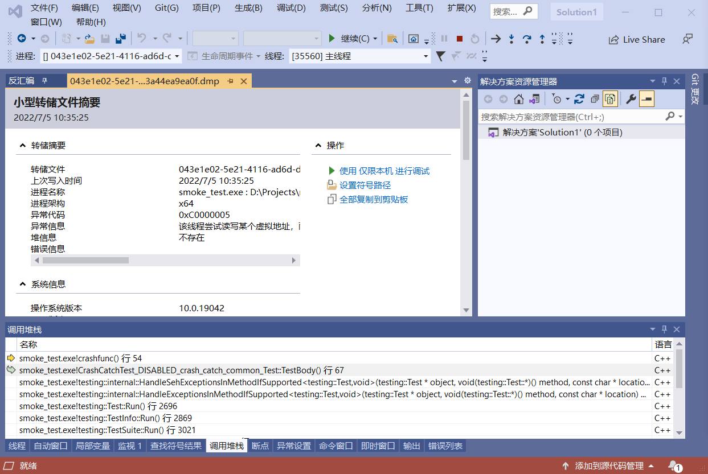
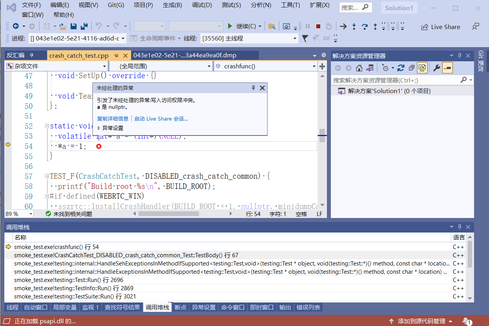

## Windows 客户端代码

Windows 客户端代码位于 `src/client/windows` 目录树中。由于头文件的注释相当好，因此本文档有意省略了一些细节。
<!--more-->
## minidump 生成的集成

一旦你编译了 `src/client/windows` 内的 visual studio solution，则将会生成名为 `exception_handler.lib` 的输出文件。你可以将其签入项目目录或直接从源代码构建，就像项目本身一样。

在你的应用程序中启用 Breakpad 需要你 `#include "exception_handler.h"`，并实例化 `ExceptionHandler` 对象，就像这样：

```
  handler = new ExceptionHandler(const wstring& dump_path,
                                 FilterCallback filter,
                                 MinidumpCallback callback,
                                 void* callback_context,
                                 int handler_types,
                                 MINIDUMP_TYPE dump_type,
                                 const wchar_t* pipe_name,
                                 const CustomClientInfo* custom_info);
```

参数依次为：

 * 写入 minidumps 文件的路径名 - 如果使用了 OOP 转储生成，则这个参数将被忽略
 * 一个将在异常第一次被处理时调用的回调 - 这里你可以返回 true/false 来继续/停止异常处理
 * minidumps 写入之后被调用的回调
 * 回调的上下文
 * 处理哪些异常 - 参考 `exception_handler.h` 中的 `HandlerType` 枚举
 * 要生成的 minidump 的类型，使用 `DbgHelp.h` 中的 `MINIDUMP_TYPE` 定义
 * 可用于与崩溃生成服务器通信的管道名称
 * 指向 `CustomClientInfo` 类的指针，当使用 OOP 生成时，它可以用于与 minidump 一起发送定制数据

你也可以参考 `src/client/windows/tests/crash_generation_app/*` 下的示例 app，它使用了 OOP 生成。

## OOP Minidump 生成

对于进程外 minidump 生成，需要完成更多工作。如果你深入 `src/client/windows/crash_generation`，你将可以看到一个称为 `crash_generation_server.h` 的文件。这个文件是崩溃生成服务器的接口，其实例化时传入的管道名称必须与上面给客户端传入的相同。但是，运行一个单独的进程来实例化崩溃生成服务器的准备工作由你决定。

## 构建过程细节（符号生成，上传）

符号创建步骤在一般概述文档中进行了讨论，因为它不会因平台而异。你需要确保这些符号在 minidumps 上传到处理的任何地方都可用。这里简单看下这个过程。以 WebRTC/[OpenRTCClient](https://github.com/hanpfei/OpenRTCClient) 中集成的 breakpad 为例。生成符号通过 `dump_syms` 工具，这个工具的编译生成方法如下：

```
PS D:\Projects\OpenRTCClient> webrtc_build build:dump_syms win x64 debug
D:/Projects/OpenRTCClient/build_system/gn/bin/win/ninja.exe -C D:\Projects\OpenRTCClient\build\win\x64\debug dump_syms
ninja: Entering directory `D:\Projects\OpenRTCClient\build\win\x64\debug'
ninja: no work to do.
build success
```

编译可执行文件 `smoke_test`：
```
PS D:\Projects\OpenRTCClient> webrtc_build build:smoke_test win x64 debug
D:/Projects/OpenRTCClient/build_system/gn/bin/win/ninja.exe -C D:\Projects\OpenRTCClient\build\win\x64\debug smoke_test
ninja: Entering directory `D:\Projects\OpenRTCClient\build\win\x64\debug'
ninja: no work to do.
build success
```

为生成的可执行文件 `smoke_test` 生成符号：

```
PS D:\Projects\OpenRTCClient> .\build\win\x64\debug\dump_syms.exe .\build\win\x64\debug\smoke_test.exe > .\build\win\x64\debug\smoke_test.sym
```

## 其它内容 - 上传 minidump

在 `src/client/windows/sender` 内有一个类实现，称为 `CrashReportSender`。这个类可以被编译为一个专门的独立 CLI，或者编译进崩溃生成服务器，并用于上传报告；它可以通过 `CrashGenerationServer` 或 `ExceptionHandler` 对象提供的用于进程内生成的回调之一知道何时执行此操作。

## 将崩溃栈转为符号

WebRTC/[OpenRTCClient](https://github.com/hanpfei/OpenRTCClient) 没有为集成的 breakpad 创建编译 `minidump_stackwalk` 的调用栈。但崩溃时生成的 minidump 文件，Visual Studio 是可以直接解析的。

以 [OpenRTCClient](https://github.com/hanpfei/OpenRTCClient) 中 `smoke_test` 里的 test case 为例：

```
PS D:\Projects\OpenRTCClient> .\build\win\x64\debug\smoke_test.exe --gtest_filter=CrashCatchTest.* --gtest_also_run_disabled_tests
Note: Google Test filter = CrashCatchTest.*
[==========] Running 2 tests from 1 test suite.
[----------] Global test environment set-up.
[----------] 2 tests from CrashCatchTest
[ RUN      ] CrashCatchTest.DISABLED_crash_catch_common
Build root /D:/Projects/OpenRTCClient/build/win/x64/debug
Dump path: D:/Projects/OpenRTCClient/build/win/x64/debug, minidump_id 043e1e02-5e21-4116-ad6d-d3a44ea9ea0f
```

这些 test case 有意生成一个崩溃。同时在编译 `smoke_test` 之前，注释掉 `webrtc/third_party/googletest/src/googletest/src/gtest.cc` 中运行 test case 时捕获异常的代码，则在运行这些 test case 时将如上面所示，生成 minidump 文件。

把 minidump 文件和对应的 exe 可执行文件及对应的 pdb 文件放在同一个目录下，打开 Visual Studio，并把 minidump 文件拖进 Visual Studio，如下图：



点击 `使用 仅限本机 进行调试`，则 Visual Studio 将解析出崩溃调用栈，打开崩溃位置对应的源文件，并指向崩溃的行：



## 为 Windows 平台编译 minidump_stackwalk

获取并安装 gyp：

```
PS D:\Projects> git clone https://chromium.googlesource.com/external/gyp

PS D:\Projects> cd gyp
PS D:\Projects\gyp> python setup.py install
```

获取 breakpad：

```
PS D:\Projects> git clone https://chromium.googlesource.com/breakpad/breakpad
```

获取 googletest 放进 breakpad/src 目录下，并把目录名重命名为 `\src`：

```
PS D:\Projects> cd .\breakpad\
PS D:\Projects\breakpad>  cd .\src\
PS D:\Projects\breakpad\src> git clone https://github.com/google/googletest.git
PS D:\Projects\breakpad\src> mv .\googletest\ testing
```

否则在后面执行 `gyp` 时会报错：

```
PS D:\Projects\breakpad\gyp> .\gyp.bat ../src/processor/processor.gyp
Warning: Missing input files:
..\src\common\android\ucontext_constants.h
..\src\build\..\testing\googlemock\src\gmock_main.cc
..\src\build\..\testing\googlemock\src\gmock-all.cc
..\src\build\..\testing\googletest\src\gtest_main.cc
..\src\build\..\testing\googletest\src\gtest-all.cc
```

把 `breakpad\src\common\linux\ucontext_constants.h` 文件拷贝到 `breakpad\src\common\android` 目录下：

```
PS D:\Projects\breakpad> cp .\src\common\linux\ucontext_constants.h .\src\common\android\
```

否则在后面执行 `gyp` 时会报错：

```
PS D:\Projects\breakpad\gyp> .\gyp.bat ../src/processor/processor.gyp
Warning: Missing input files:
..\src\common\android\ucontext_constants.h
```

把 `breakpad\src/build/common.gypi` 文件中的 `'WarnAsError': 'true'` 都改为 `'WarnAsError': 'false'`：

```
PS D:\Projects\breakpad> git diff src/build/common.gypi
diff --git a/src/build/common.gypi b/src/build/common.gypi
index 29990c65..447639f2 100644
--- a/src/build/common.gypi
+++ b/src/build/common.gypi
@@ -328,7 +328,7 @@
         'msvs_disabled_warnings': [4800],
         'msvs_settings': {
           'VCCLCompilerTool': {
-            'WarnAsError': 'true',
+            'WarnAsError': 'false',
             'Detect64BitPortabilityProblems': 'false',
           },
         },
@@ -904,7 +904,7 @@
             'EnableFunctionLevelLinking': 'true',
             'RuntimeTypeInfo': 'false',
             'WarningLevel': '4',
-            'WarnAsError': 'true',
+            'WarnAsError': 'false',
             'DebugInformationFormat': '3',
             'conditions': [
               [ 'msvs_multi_core_compile', {
```

否则后面在 Visual Studio 中将无法成功编译 processor 和 libdisasm。

拷贝 gyp 文件夹到 breakpad 文件夹下，并生成 minidump_stackwalk 的 sln 文件。进入刚刚拷贝的 gyp 目录，然后执行：
 
```
PS D:\Projects\breakpad\gyp> .\gyp.bat ../src/processor/processor.gyp
```

gyp 将生成 visual studio 工程配置 sln 文件。通过 Visual Studio 打开 sln 文件，并编译。

**参考文档**

[Windows Integration overview](https://github.com/hanpfei/OpenRTCClient/blob/m98_4758/webrtc/third_party/breakpad/breakpad/docs/windows_client_integration.md)

[windows系统，google breakpad中minidump_stackwalk的编译](https://codeantenna.com/a/vbAbbZqaux)
