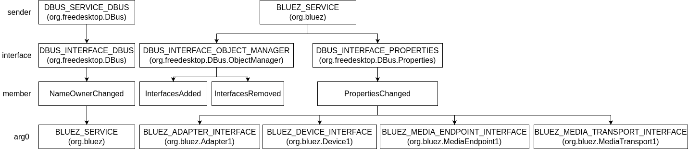

@[TOC](Linux 系统蓝牙音频服务实现分析)

Linux 系统中，蓝牙音频服务实现为系统音频服务 PulseAudio 的可加载模块，它用来以 PulseAudio 标准的方式描述蓝牙音频设备，将其嵌入 PulseAudio 的音频处理流水线，并呈现给用户，支持用户切换音频设备，如蓝牙耳机。

## 蓝牙音频设备连接变化监听
Linux 系统蓝牙音频服务的入口点是 **module-bluetooth-discover** 和 **module-bluetooth-policy** 模块，Linux 系统音频服务 PulseAudio 启动时加载 */etc/pulse/default.pa* 配置文件，以确定要加载的模块，与蓝牙相关的模块如下：
```
### Automatically load driver modules for Bluetooth hardware
.ifexists module-bluetooth-policy.so
load-module module-bluetooth-policy
.endif

.ifexists module-bluetooth-discover.so
load-module module-bluetooth-discover
.endif
```

**module-bluetooth-discover** 模块用来处理蓝牙音频设备。bluez 是 Linux 系统的官方蓝牙协议栈实现，**module-bluetooth-discover** 模块是 **module-bluez5-discover** 模块壳。**module-bluetooth-discover** 模块的全部实现 (位于 *pulseaudio/src/modules/bluetooth/module-bluetooth-discover.c*) 如下：
```
PA_MODULE_USAGE(
    "headset=ofono|native|auto"
    "autodetect_mtu=<boolean>"
);

struct userdata {
    uint32_t bluez5_module_idx;
};

int pa__init(pa_module* m) {
    struct userdata *u;
    pa_module *mm;

    pa_assert(m);

    m->userdata = u = pa_xnew0(struct userdata, 1);
    u->bluez5_module_idx = PA_INVALID_INDEX;

    if (pa_module_exists("module-bluez5-discover")) {
        pa_module_load(&mm, m->core, "module-bluez5-discover", m->argument);
        if (mm)
            u->bluez5_module_idx = mm->index;
    }

    if (u->bluez5_module_idx == PA_INVALID_INDEX) {
        pa_xfree(u);
        return -1;
    }

    return 0;
}

void pa__done(pa_module* m) {
    struct userdata *u;

    pa_assert(m);

    if (!(u = m->userdata))
        return;

    if (u->bluez5_module_idx != PA_INVALID_INDEX)
        pa_module_unload_by_index(m->core, u->bluez5_module_idx, true);

    pa_xfree(u);
}
```

**module-bluetooth-discover** 模块仅被用来加载 **module-bluez5-discover** 模块。

Linux 系统蓝牙音频服务的中心是一个 `pa_bluetooth_discovery` 对象，在系统音频服务 PulseAudio 中，它用来管理蓝牙音频相关的各种对象，包括 dbus 连接、蓝牙适配器/控制器、蓝牙设备、传输和蓝牙后端等。`pa_bluetooth_discovery` 结构定义 (位于 *pulseaudio/src/modules/bluetooth/bluez5-util.c*) 如下：
```
struct pa_bluetooth_discovery {
    PA_REFCNT_DECLARE;

    pa_core *core;
    pa_dbus_connection *connection;
    bool filter_added;
    bool matches_added;
    bool objects_listed;
    pa_hook hooks[PA_BLUETOOTH_HOOK_MAX];
    pa_hashmap *adapters;
    pa_hashmap *devices;
    pa_hashmap *transports;
    pa_bluetooth_profile_status_t profiles_status[PA_BLUETOOTH_PROFILE_COUNT];

    int headset_backend;
    pa_bluetooth_backend *ofono_backend, *native_backend;
    PA_LLIST_HEAD(pa_dbus_pending, pending);
    bool enable_native_hsp_hs;
    bool enable_native_hfp_hf;
    bool enable_msbc;
};
```

**module-bluez5-discover** 模块本身所做的主要工作有两个，一是解析传入的模块参数，并创建 `pa_bluetooth_discovery` 对象；二是向 `pa_bluetooth_discovery` 对象注册蓝牙设备连接变化回调函数，在回调函数里，**module-bluez5-discover** 模块为蓝牙音频设备加载 **module-bluez5-device** 模块。**module-bluez5-device** 模块为蓝牙音频设备创建 sink 和 source 对象，之后蓝牙音频设备对用户可用。

**module-bluez5-discover** 模块的加载和卸载函数定义 (位于 *pulseaudio/src/modules/bluetooth/module-bluez5-discover.c*) 如下：
```
PA_MODULE_LOAD_ONCE(true);
PA_MODULE_USAGE(
    "headset=ofono|native|auto"
    "autodetect_mtu=<boolean>"
    "enable_msbc=<boolean, enable mSBC support in native and oFono backends, default is true>"
    "output_rate_refresh_interval_ms=<interval between attempts to improve output rate in milliseconds>"
    "enable_native_hsp_hs=<boolean, enable HSP support in native backend>"
    "enable_native_hfp_hf=<boolean, enable HFP support in native backend>"
    "avrcp_absolute_volume=<synchronize volume with peer, true by default>"
);

static const char* const valid_modargs[] = {
    "headset",
    "autodetect_mtu",
    "enable_msbc",
    "output_rate_refresh_interval_ms",
    "enable_native_hsp_hs",
    "enable_native_hfp_hf",
    "avrcp_absolute_volume",
    NULL
};

struct userdata {
    pa_module *module;
    pa_core *core;
    pa_hashmap *loaded_device_paths;
    pa_hook_slot *device_connection_changed_slot;
    pa_bluetooth_discovery *discovery;
    bool autodetect_mtu;
    bool avrcp_absolute_volume;
    uint32_t output_rate_refresh_interval_ms;
};
 . . . . . .
#ifdef HAVE_BLUEZ_5_NATIVE_HEADSET
const char *default_headset_backend = "native";
#else
const char *default_headset_backend = "ofono";
#endif

int pa__init(pa_module *m) {
    struct userdata *u;
    pa_modargs *ma;
    const char *headset_str;
    int headset_backend;
    bool autodetect_mtu;
    bool enable_msbc;
    bool avrcp_absolute_volume;
    uint32_t output_rate_refresh_interval_ms;
    bool enable_native_hsp_hs;
    bool enable_native_hfp_hf;

    pa_assert(m);

    if (!(ma = pa_modargs_new(m->argument, valid_modargs))) {
        pa_log("failed to parse module arguments.");
        goto fail;
    }

    pa_assert_se(headset_str = pa_modargs_get_value(ma, "headset", default_headset_backend));
    if (pa_streq(headset_str, "ofono"))
        headset_backend = HEADSET_BACKEND_OFONO;
    else if (pa_streq(headset_str, "native"))
        headset_backend = HEADSET_BACKEND_NATIVE;
    else if (pa_streq(headset_str, "auto"))
        headset_backend = HEADSET_BACKEND_AUTO;
    else {
        pa_log("headset parameter must be either ofono, native or auto (found %s)", headset_str);
        goto fail;
    }

    /* default value if no module parameter */
    enable_native_hfp_hf = (headset_backend == HEADSET_BACKEND_NATIVE);

    autodetect_mtu = false;
    if (pa_modargs_get_value_boolean(ma, "autodetect_mtu", &autodetect_mtu) < 0) {
        pa_log("Invalid boolean value for autodetect_mtu parameter");
    }
    enable_msbc = true;
    if (pa_modargs_get_value_boolean(ma, "enable_msbc", &enable_msbc) < 0) {
        pa_log("Invalid boolean value for enable_msbc parameter");
    }
    enable_native_hfp_hf = true;
    if (pa_modargs_get_value_boolean(ma, "enable_native_hfp_hf", &enable_native_hfp_hf) < 0) {
        pa_log("enable_native_hfp_hf must be true or false");
        goto fail;
    }
    enable_native_hsp_hs = !enable_native_hfp_hf;
    if (pa_modargs_get_value_boolean(ma, "enable_native_hsp_hs", &enable_native_hsp_hs) < 0) {
        pa_log("enable_native_hsp_hs must be true or false");
        goto fail;
    }

    avrcp_absolute_volume = true;
    if (pa_modargs_get_value_boolean(ma, "avrcp_absolute_volume", &avrcp_absolute_volume) < 0) {
        pa_log("avrcp_absolute_volume must be true or false");
        goto fail;
    }

    output_rate_refresh_interval_ms = DEFAULT_OUTPUT_RATE_REFRESH_INTERVAL_MS;
    if (pa_modargs_get_value_u32(ma, "output_rate_refresh_interval_ms", &output_rate_refresh_interval_ms) < 0) {
        pa_log("Invalid value for output_rate_refresh_interval parameter.");
        goto fail;
    }

    m->userdata = u = pa_xnew0(struct userdata, 1);
    u->module = m;
    u->core = m->core;
    u->autodetect_mtu = autodetect_mtu;
    u->avrcp_absolute_volume = avrcp_absolute_volume;
    u->output_rate_refresh_interval_ms = output_rate_refresh_interval_ms;
    u->loaded_device_paths = pa_hashmap_new(pa_idxset_string_hash_func, pa_idxset_string_compare_func);

    if (!(u->discovery = pa_bluetooth_discovery_get(u->core, headset_backend, enable_native_hsp_hs, enable_native_hfp_hf, enable_msbc)))
        goto fail;

    u->device_connection_changed_slot =
        pa_hook_connect(pa_bluetooth_discovery_hook(u->discovery, PA_BLUETOOTH_HOOK_DEVICE_CONNECTION_CHANGED),
                        PA_HOOK_NORMAL, (pa_hook_cb_t) device_connection_changed_cb, u);

    pa_modargs_free(ma);
    return 0;

fail:
    if (ma)
        pa_modargs_free(ma);
    pa__done(m);
    return -1;
}

void pa__done(pa_module *m) {
    struct userdata *u;

    pa_assert(m);

    if (!(u = m->userdata))
        return;

    if (u->device_connection_changed_slot)
        pa_hook_slot_free(u->device_connection_changed_slot);

    if (u->loaded_device_paths)
        pa_hashmap_free(u->loaded_device_paths);

    if (u->discovery)
        pa_bluetooth_discovery_unref(u->discovery);

    pa_xfree(u);
}
```

**module-bluez5-discover** 模块调用 `pa_bluetooth_discovery_get()` 函数创建 `pa_bluetooth_discovery` 对象。`pa_bluetooth_discovery_get()` 函数定义 (位于 *pulseaudio/src/modules/bluetooth/bluez5-util.c*) 如下：
```
static pa_dbus_pending* send_and_add_to_pending(pa_bluetooth_discovery *y, DBusMessage *m,
                                                                  DBusPendingCallNotifyFunction func, void *call_data) {
    pa_dbus_pending *p;
    DBusPendingCall *call;

    pa_assert(y);
    pa_assert(m);

    pa_assert_se(dbus_connection_send_with_reply(pa_dbus_connection_get(y->connection), m, &call, -1));

    p = pa_dbus_pending_new(pa_dbus_connection_get(y->connection), m, call, y, call_data);
    PA_LLIST_PREPEND(pa_dbus_pending, y->pending, p);
    dbus_pending_call_set_notify(call, func, p, NULL);

    return p;
}
 . . . . . .
static void get_managed_objects(pa_bluetooth_discovery *y) {
    DBusMessage *m;

    pa_assert(y);

    pa_assert_se(m = dbus_message_new_method_call(BLUEZ_SERVICE, "/", DBUS_INTERFACE_OBJECT_MANAGER,
                                                  "GetManagedObjects"));
    send_and_add_to_pending(y, m, get_managed_objects_reply, NULL);
}
 . . . . . .
static void endpoint_init(pa_bluetooth_discovery *y, const char *endpoint) {
    static const DBusObjectPathVTable vtable_endpoint = {
        .message_function = endpoint_handler,
    };

    pa_assert(y);
    pa_assert(endpoint);

    pa_assert_se(dbus_connection_register_object_path(pa_dbus_connection_get(y->connection), endpoint,
                                                      &vtable_endpoint, y));
}
 . . . . . .
static void object_manager_init(pa_bluetooth_discovery *y) {
    static const DBusObjectPathVTable vtable = {
        .message_function = object_manager_handler,
    };

    pa_assert(y);
    pa_assert_se(dbus_connection_register_object_path(pa_dbus_connection_get(y->connection),
                A2DP_OBJECT_MANAGER_PATH, &vtable, y));
}
 . . . . . .
pa_bluetooth_discovery* pa_bluetooth_discovery_get(pa_core *c, int headset_backend, bool enable_native_hsp_hs, bool enable_native_hfp_hf, bool enable_msbc) {
    pa_bluetooth_discovery *y;
    DBusError err;
    DBusConnection *conn;
    unsigned i, count;
    const pa_a2dp_endpoint_conf *endpoint_conf;
    char *endpoint;

    pa_bluetooth_a2dp_codec_gst_init();
    y = pa_xnew0(pa_bluetooth_discovery, 1);
    PA_REFCNT_INIT(y);
    y->core = c;
    y->headset_backend = headset_backend;
    y->enable_native_hsp_hs = enable_native_hsp_hs;
    y->enable_native_hfp_hf = enable_native_hfp_hf;
    y->enable_msbc = enable_msbc;
    y->adapters = pa_hashmap_new_full(pa_idxset_string_hash_func, pa_idxset_string_compare_func, NULL,
                                      (pa_free_cb_t) adapter_free);
    y->devices = pa_hashmap_new_full(pa_idxset_string_hash_func, pa_idxset_string_compare_func, NULL,
                                     (pa_free_cb_t) device_free);
    y->transports = pa_hashmap_new(pa_idxset_string_hash_func, pa_idxset_string_compare_func);
    PA_LLIST_HEAD_INIT(pa_dbus_pending, y->pending);

    for (i = 0; i < PA_BLUETOOTH_HOOK_MAX; i++)
        pa_hook_init(&y->hooks[i], y);

    pa_shared_set(c, "bluetooth-discovery", y);

    dbus_error_init(&err);

    if (!(y->connection = pa_dbus_bus_get(y->core, DBUS_BUS_SYSTEM, &err))) {
        pa_log_error("Failed to get D-Bus connection: %s", err.message);
        goto fail;
    }

    conn = pa_dbus_connection_get(y->connection);

    /* dynamic detection of bluetooth audio devices */
    if (!dbus_connection_add_filter(conn, filter_cb, y, NULL)) {
        pa_log_error("Failed to add filter function");
        goto fail;
    }
    y->filter_added = true;

    if (pa_dbus_add_matches(conn, &err,
            "type='signal',sender='" DBUS_SERVICE_DBUS "',interface='" DBUS_INTERFACE_DBUS "',member='NameOwnerChanged'"
            ",arg0='" BLUEZ_SERVICE "'",
            "type='signal',sender='" BLUEZ_SERVICE "',interface='" DBUS_INTERFACE_OBJECT_MANAGER "',member='InterfacesAdded'",
            "type='signal',sender='" BLUEZ_SERVICE "',interface='" DBUS_INTERFACE_OBJECT_MANAGER "',"
            "member='InterfacesRemoved'",
            "type='signal',sender='" BLUEZ_SERVICE "',interface='" DBUS_INTERFACE_PROPERTIES "',member='PropertiesChanged'"
            ",arg0='" BLUEZ_ADAPTER_INTERFACE "'",
            "type='signal',sender='" BLUEZ_SERVICE "',interface='" DBUS_INTERFACE_PROPERTIES "',member='PropertiesChanged'"
            ",arg0='" BLUEZ_DEVICE_INTERFACE "'",
            "type='signal',sender='" BLUEZ_SERVICE "',interface='" DBUS_INTERFACE_PROPERTIES "',member='PropertiesChanged'"
            ",arg0='" BLUEZ_MEDIA_ENDPOINT_INTERFACE "'",
            "type='signal',sender='" BLUEZ_SERVICE "',interface='" DBUS_INTERFACE_PROPERTIES "',member='PropertiesChanged'"
            ",arg0='" BLUEZ_MEDIA_TRANSPORT_INTERFACE "'",
            NULL) < 0) {
        pa_log_error("Failed to add D-Bus matches: %s", err.message);
        goto fail;
    }
    y->matches_added = true;

    object_manager_init(y);

    count = pa_bluetooth_a2dp_endpoint_conf_count();
    for (i = 0; i < count; i++) {
        endpoint_conf = pa_bluetooth_a2dp_endpoint_conf_iter(i);
        if (endpoint_conf->can_be_supported(false)) {
            endpoint = pa_sprintf_malloc("%s/%s", A2DP_SINK_ENDPOINT, endpoint_conf->bt_codec.name);
            endpoint_init(y, endpoint);
            pa_xfree(endpoint);
        }

        if (endpoint_conf->can_be_supported(true)) {
            endpoint = pa_sprintf_malloc("%s/%s", A2DP_SOURCE_ENDPOINT, endpoint_conf->bt_codec.name);
            endpoint_init(y, endpoint);
            pa_xfree(endpoint);
        }
    }

    get_managed_objects(y);

    return y;

fail:
    pa_bluetooth_discovery_unref(y);
    dbus_error_free(&err);

    return NULL;
}
```

`pa_bluetooth_discovery_get()` 函数的执行过程如下：

1. 初始化 GStreamer 的蓝牙 A2DP codec。
2. 新建 `pa_bluetooth_discovery` 对象，初始化其各个字段，并将其以 **bluetooth-discovery** 键放进 PulseAudio 核心 `pa_core`。
3. 获得 dbus 连接。PulseAudio 中需要访问 dbus 连接的地方有多个，dbus 连接在 PulseAudio 核心 `pa_core` 中管理，需要 dbus 连接的地方传入所需连接的类型获得 dbus 连接，这里获得 **DBUS_BUS_SYSTEM** 类型的 dbus 连接。
4. 为 dbus 连接添加 filter 回调 `filter_cb()`，为 dbus 连接添加 matches，即添加要监听的消息或通知类型。
5. 初始化对象管理器。具体是指向 DBUS 注册 **/MediaEndpoint** 路径的处理函数 `object_manager_handler()`。注册的处理函数在 bluez 蓝牙服务中访问。
6. 初始化蓝牙 A2DP endpoint 配置。具体是指向 DBUS 注册 **/MediaEndpoint/A2DPSink/[codec_name]** 和 **/MediaEndpoint/A2DPSource/[codec_name]** 路径，如 **/MediaEndpoint/A2DPSink/sbc** 和 **/MediaEndpoint/A2DPSource/sbc** 的处理函数 `endpoint_handler()`。
7. 向蓝牙服务发起方法调用请求，获取蓝牙音频相关对象，响应消息由 `get_managed_objects_reply()` 函数处理。

`pa_bluetooth_discovery` 对象的创建过程，主要初始化了 dbus 通信相关的逻辑，通信是双向的，通信的方式有多种，有远程过程调用和消息信号。通过为 dbus 连接添加 matches 注册要处理的消息信号类型，收到的 dbus 消息由 `filter_cb()` 回调处理，这些消息信号由 bluez 蓝牙服务发出。这些消息信号主要有如下这些：

这些消息信号来自 2 个发送者，共有 7 种。注册了 **/MediaEndpoint** 等多个路径的远程过程调用服务，它们由 bluez 蓝牙服务调用。最后发起了一个对 bluez 蓝牙服务的远程过程调用，获取蓝牙音频相关对象。

**module-bluez5-discover** 模块提供蓝牙设备连接变化回调函数 `device_connection_changed_cb()`，这个函数定义 (位于 *pulseaudio/src/modules/bluetooth/module-bluez5-discover.c*) 如下：
```
static pa_hook_result_t device_connection_changed_cb(pa_bluetooth_discovery *y, const pa_bluetooth_device *d, struct userdata *u) {
    bool module_loaded;

    pa_assert(d);
    pa_assert(u);

    module_loaded = pa_hashmap_get(u->loaded_device_paths, d->path) ? true : false;

    /* When changing A2DP codec there is no transport connected, ensure that no module is unloaded */
    if (module_loaded && !pa_bluetooth_device_any_transport_connected(d) &&
            !d->codec_switching_in_progress) {
        /* disconnection, the module unloads itself */
        pa_log_debug("Unregistering module for %s", d->path);
        pa_hashmap_remove(u->loaded_device_paths, d->path);
        return PA_HOOK_OK;
    }

    if (!module_loaded && pa_bluetooth_device_any_transport_connected(d)) {
        /* a new device has been connected */
        pa_module *m;
        char *args = pa_sprintf_malloc("path=%s autodetect_mtu=%i output_rate_refresh_interval_ms=%u"
                                       " avrcp_absolute_volume=%i",
                                       d->path,
                                       (int)u->autodetect_mtu,
                                       u->output_rate_refresh_interval_ms,
                                       (int)u->avrcp_absolute_volume);

        pa_log_debug("Loading module-bluez5-device %s", args);
        pa_module_load(&m, u->module->core, "module-bluez5-device", args);
        pa_xfree(args);

        if (m)
            /* No need to duplicate the path here since the device object will
             * exist for the whole hashmap entry lifespan */
            pa_hashmap_put(u->loaded_device_paths, d->path, d->path);
        else
            pa_log_warn("Failed to load module for device %s", d->path);

        return PA_HOOK_OK;
    }

    return PA_HOOK_OK;
}
```

回调函数 `device_connection_changed_cb()` 处理两种情况：

 * 蓝牙设备路径在已加载蓝牙设备路径列表中，且蓝牙设备上没有任何已连接的 transport，将蓝牙设备路径从已加载蓝牙设备路径列表移出。
 * 蓝牙设备路径不在已加载蓝牙设备路径列表中，且蓝牙设备上存在已连接的 transport，则为蓝牙音频设备加载 **module-bluez5-device** 模块，模块加载成功时，将蓝牙设备路径添加进已加载蓝牙设备路径列表。

**module-bluez5-discover** 模块在蓝牙音频服务中扮演的角色，和 **module-udev-detect** 及 **module-alsa-card** 模块在 ALSA 中扮演的角色一样。


