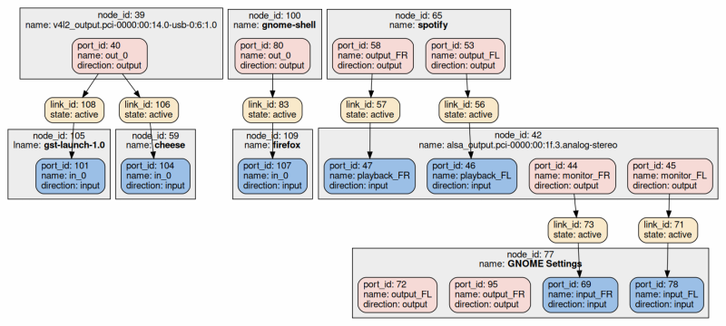

十多年来，[PulseAudio](https://www.freedesktop.org/wiki/Software/PulseAudio/) 一直服务于 Linux 桌面，作为其主要的音频混音和路由守护程序 - 以及它的音频 API。不幸的是，PulseAudio 的内部架构并不适合日益增长的沙盒化的应用程序用例，尽管已经有人尝试对其进行修改。[PipeWire](https://pipewire.org/)，一个新的守护进程从这些尝试中横空而出，将在即将到来的 Fedora 34 发行版中[替换 PulseAudio](https://fedoraproject.org/wiki/Releases/34/ChangeSet#Route_all_Audio_to_PipeWire)。这是一个即将到来的转变，值得一看。

说到转换，2007 年末 Fedora 8 自己向 PulseAudio 的转换并不顺利。长期使用 Linux 的用户仍然记得，这个守护进程被[标记为](https://lwn.net/Articles/299211/)会破坏音频的软件。在一段崎岖的启动之旅之后，PulseAudio 成为 Linux 声音服务器斗争的[赢家](https://lwn.net/Articles/355542/)。它提供了一个本地客户端音频 API，但也[支持](https://www.freedesktop.org/wiki/Software/PulseAudio/Documentation/User/PerfectSetup/#thirdpartyapplications)使用当时常见的音频 API 的应用程序 —— 包括原始的Linux ALSA 声音 API，它通常只允许一个应用程序访问声卡。PulseAudio 混合不同应用程序的音频流，并为音频管理、细粒度配置和无缝路由到蓝牙、USB 或 HDMI 提供了一个中心点。它将自己定位为 Linux 桌面中的 Windows Vista 用户模式音频引擎和 macOS CoreAudio 守护进程。

## PulseAudio 的裂纹

到 2015 年，PulseAudio 仍然享受着它作为 Linux 音频守护进程的地位，但裂缝开始出现。逐渐转向沙盒化的桌面应用程序可能会对其设计造成致命的影响：通过 PulseAudio，应用程序可以窥探其它应用程序的音频，对麦克风进行无中介访问，或者加载可能干扰其它应用程序的服务器模块。尝试修复 PulseAudio，主要是通过[访问控制](https://lists.freedesktop.org/archives/pulseaudio-discuss/2015-April/023596.html)层和每个客户端 [memfd 支持](https://www.freedesktop.org/wiki/Software/PulseAudio/Notes/9.0/#memfd-backedsharedmemorytransport) 的传输。对于隔离客户端音频，这些都是必要的，[但还不够](https://lists.freedesktop.org/archives/pulseaudio-discuss/2017-December/029181.html)。

大约在那个时候，PulseAudio 的核心开发者之一 David Henningson 从项目中[辞职](https://lists.freedesktop.org/archives/pulseaudio-discuss/2016-March/025896.html)了。他提到了这个守护进程不适合沙盒化的应用程序用例，以及它混合了音频路由决策的机制和策略等问题。在他的消息的最后，他想知道这些问题的组合是否可能是一个新的和急需的 Linux 音频守护进程的产痛：

> 软件中没有什么是不可能的，但要以良好的 (而不是“在上面构建另一个层”[…]) 方式重新架构 PulseAudio 以支持所有这些需求将非常困难，因而我的判断是，从头开始写一个新的将更简单。
>  
> 我认为我们有可能将 PulseAudio、JACK 和 AudioFlinger 的精华融合在一起，并创造出能够同时适用于移动端和桌面的东西；用于专业音频，游戏，低功耗音乐播放等[…]我认为，作为一个开源社区，我们可以很好地使用这样一个声音服务器。

## 从 PulseVideo 到 Pinos

与此同时，[GStreamer](https://gstreamer.freedesktop.org/) 的共同创造者 Wim Taymans 被要求开发一个 Linux 服务，以协调网络浏览器对相机设备的访问。最初，他称这个项目为 PulseVideo。这个名字背后的想法很简单：与创建 PulseAudio 以协调对 ALSA 声音设备的访问类似，创建 PulseVideo 以协调对 Video4Linux2 摄像头设备节点的多路访问。

不久之后，Taymans 发现了一个类似命名的 [PulseVideo 原型[视频]](https://gstconf.ubicast.tv/videos/zero-copy-video-with-file-descriptor-passing/)，由 William Manley 创建，并帮助其代码所需的 GStreamer 功能上传代码。为了避免与 PulseVideo 名称冲突，并且由于范围扩展超出了相机访问，Taymans 后来将该项目重命名为 Pinos — 他在西班牙居住的小镇的名字。

Pinos 基于 GStreamer 流水线构建，使用了一些早期为 Manley 的原型改进的基础设施。带有文件描述符传递的 [D-Bus](https://www.freedesktop.org/wiki/Software/dbus/) 用于进程间通信。在 GStreamer 2015 大会上，Taymans 向与会者[描述了 Pinos 架构[PDF]](https://gstreamer.freedesktop.org/data/events/gstreamer-conference/2015/Wim%20Taymans%20-%20Camera%20Sharing%20and%20Sandboxing%20with%20Pinos.pdf)，并演示了多个应用程序并发访问系统相机的场景。

由于其灵活的、基于流水线的、文件描述符传递的架构，Pinos 还支持另一个方向的媒体广播：应用程序可以通过传递一个 memfd 或 [dma-buf](https://www.kernel.org/doc/html/v5.11/driver-api/dma-buf.html) 文件描述符来“上传”媒体流。然后，媒体流可以进一步处理并分发到其它应用程序和 系统多媒体 [sinks](https://gstreamer.freedesktop.org/documentation/additional/design/element-sink.html)，如 ALSA 声音设备。

虽然只是随便讨论一下，但在两个方向和跨应用程序发送流的能力允许 Pinos 充当通用的音频/视频总线 - 有效地在孤立的和可能的沙盒化用户进程之间输送媒体。因此，Pinos 的范围（如果适当扩展）可能与PulseAudio 重叠，并可能取代它。Taymans 被明确地[问到这个问题 [video, 31:35]](https://gstconf.ubicast.tv/videos/camera-sharing-and-sandboxing-with-pinos/)，他回答说：“取代 PulseAudio 不是一件容易的事；这不在议程上……但它 [Pinos] 非常宽泛，所以以后还可以做得更多。”

随着前面小节中讨论的 PulseAudio 的缺陷变得越来越成问题，“以后可以做得更多”并不是一个遥远的目标。

## PipeWire

到 2016 年，Taymans 开始重新思考 Pinos 的基础，将其范围扩展到成为标准的 Linux 音频/视频守护程序。这包括通常由 [JACK](https://jackaudio.org/) 覆盖的“大量微小缓冲区”的低延迟音频用例。有两个主要领域需要解决。

首先，事实证明，核心守护进程和客户端库对 GStreamer 元素和管道的硬依赖是有问题的。GStreamer 有大量的幕后逻辑来实现它的灵活性。在处理 GStreamer 流水线期间，在 Pinos 实时线程上下文中完成，这种灵活性是以隐式内存分配、线程创建和锁定为代价的。众所周知，这些操作都会对硬实时代码所需的[可预测性产生负面影响](https://lwn.net/Articles/837019/)。

为了实现 GStreamer 流水线的部分灵活性，同时仍然满足硬实时要求，Taymans 创建了一个更简单的多媒体流水线框架，并称它为 SPA — [Simple Plugin API [PDF]](https://gstreamer.freedesktop.org/data/events/gstreamer-conference/2016/Wim%20Taymans%20-%20Simple%20Plugin%20API%20(SPA).pdf)。该框架被设计为从实时线程（例如 Pinos 媒体处理线程）安全执行，具有永远不应超过的特定时间预算。SPA 不执行内存分配；相反，这些是 SPA 框架应用程序的唯一责任。

每个节点都有一组定义良好的状态。有一种状态用于配置节点的端口、格式和缓冲区——由主 (非实时) 线程完成；有一种状态用于主机在配置节点后分配节点所需的所有必要缓冲区；还有一种单独的状态，实际处理在实时线程中完成。在流处理过程中，如果任何媒体流水线节点改变状态（例如由于事件），可以通知实时线程，以便将控制切换回主线程进行重新配置。

其次，把 D-Bus 替换为 IPC 协议。相反，受 Wayland 启发的本地完全异步协议（没有 XML 序列化部分）基于 Unix 域套接字实现。Taymans 想要一种简单且硬实时安全的协议。

当 SPA 框架被集成并开发出本地 IPC 协议时，该项目早已超出了其最初的目的：
从一个用于共享相机访问的 D-Bus 守护进程到一个具有完整的实时能力的音频/视频总线。因此，它又被重新命名为 PipeWire —— 这反映了它作为一个杰出的基于流水线的多媒体共享和处理引擎的新地位。

## 经验教训

从一开始，PipeWire 开发人员就从现有的音频守护进程，如 JACK、PulseAudio 和 [Chromium OS audio Server](http://www.chromium.org/chromium-os/chromiumos-design-docs/cras-chromeos-audio-server) (CRAS) 中，吸取了一些重要的经验教训。与 PulseAudio 有意将 Linux 音频领域划分为消费级和专业级实时音频不同，PipeWire 从一开始就设计为同时处理两者。为了避免 PulseAudio 的沙箱限制，安全性被嵌入：每客户端权限位字段附加到每个 PipeWire 节点 - 其中包装一个或多个 SPA 节点。这种具有安全意识的设计允许与 [Flatpak portals](https://flatpak.github.io/xdg-desktop-portal/portal-docs.html) 轻松安全地集成；沙盒应用程序权限接口现在被提升为自由桌面 XDG 标准。

与 CRAS 和 PulseAudio 一样，但与 JACK 不同的是，PipeWire 使用[基于定时器的音频调度](http://0pointer.de/blog/projects/pulse-glitch-free.html)。动态可重新配置的定时器用于调度唤醒以填充音频缓冲区，而不是依赖于声卡中断的恒定速率。除了省电的好处外，这允许音频守护进程提供动态延迟：更高的延迟用于节能和消费级音频，如音乐播放；低延迟用于延迟敏感的工作负载，如专业音频。

与 CRAS 类似，但与 PulseAudio 不同，PipeWire 不是在音频缓冲倒绕的基础上建模的。当基于定时器的音频调度与巨大的缓冲区一起使用时（如在 PulseAudio 中那样），需要支持重写声卡的缓冲区，以提供对不可预测事件（如新的音频流或流的音量变化）的低延迟响应。必须撤销已经发送到音频设备的大缓冲区，并且需要提交一个新的缓冲区。这导致了显著的[代码复杂性和极端情况[PDF]](http://lac.linuxaudio.org/2015/papers/10.pdf)。PipeWire 和 CRAS 都将最大延迟/缓冲区限制在更低的值，从而完全消除了缓冲区倒绕的需要。

与 JACK 一样，PipeWire 选择了外部会话管理器设置。专业的音频用户通常在 [Catia](https://kx.studio/Applications:Catia) 或 [QjackCtl](https://qjackctl.sourceforge.io/) 这样的会话管理器应用程序中构建他们自己的音频流水线，然后让音频守护进程执行最终的结果。这样做的好处是将策略（如何构建媒体流水线）从机制（音频守护进程如何执行流水线）中分离出来。在 GUADEC 2018 上，开发者明确地[请求 Taymans [video, 23:15]](http://videos.guadec.org/2018/GUADEC%202018%20-%20Wim%20Taymans%20-%20PipeWire-0g4c6q2-hgw.mp4) 让 GNOME，和可能的其它外部守护进程，控制音频栈的这个部分。由于 PulseAudio 在其内部模块代码中深度嵌入音频路由策略决定逻辑，一些系统集成商已经遇到了问题。这也是 Henningson 在辞职邮件中提到的痛点之一。

最后，跟随过去十年中创建的多个有影响力的系统守护进程的趋势，PipeWire 广泛使用 linux 内核特有的API。这包括 memfd、eventfd、timerfd、signalfd、epoll 和 dma-buf —— 所有这些都使“文件描述符”成为系统中事件和共享缓冲区的主要标识符。PipeWire 支持导入 dma-buf 文件描述符是实现高效的 Wayland [屏幕采集和录制](https://gitlab.gnome.org/GNOME/mutter/-/merge_requests/1086)的关键。对于大的 4K 和 8K 屏幕，CPU 不需要触碰任何庞大的 GPU 缓冲区：GNOME mutter（或类似的应用程序）传递一个 dma-buf 描述符，然后可以将其集成到 PipeWire 的 SPA 流水线中进行进一步的处理和采集。

## 采用

自项目的 [0.3 主版本发布](https://gitlab.freedesktop.org/pipewire/pipewire/-/blob/0.3.0/NEWS)以来，原生的 PipeWire API 已经被宣布为稳定的。现有的原始 ALSA 应用程序通过一个 PipeWire ALSA 插件支持。JACK 应用程序通过一个重新实现的 JACK 客户端库和 [pw-jack](https://man.archlinux.org/man/pw-jack.1) 工具支持，如果 JACK 本地库和 PipeWire JACK 库同时安装了的话。PulseAudio 应用程序通过 `pipewire-pulse` 守护进程支持，它监听 PulseAudio 自己的 socket 并实现它的本地通信协议。通过这种方式，使用它们自己的本地 PulseAudio 客户端库拷贝的容器化桌面应用程序依然得到支持。[WebRTC](https://webrtc.org/)，所有主要浏览器使用的通信框架（和[代码](https://webrtc.googlesource.com/src)），包括[用于 Wayland 屏幕共享的本地 PipeWire 支持](https://webrtc-review.googlesource.com/c/src/+/103504) — 通过一个 Flatpak portal 来协调。

下图展示了一个 PipeWire 媒体流水线，在一台 Arch Linux 系统上，使用 [pw-dot](https://man.archlinux.org/man/pw-dot.1) 生成，然后经过轻微美化。展示了 PipeWire 本地和 PulseAudio 本地应用程序的组合：

在左边，GNOME [Cheese](https://wiki.gnome.org/Apps/Cheese) 和一个通过 [gst-launch-1.0](https://man.archlinux.org/man/gst-launch-1.0.1) 创建的 GStreamer 流水线实例在并发访问相同的相机。中间，Firefox 在使用 WebRTC 和 Flatpak portals 共享系统屏幕（用于 [Jitsi](https://meet.jit.si/) 会议）。在右边，Spotify 音乐播放器（一个 PulseAudio 应用程序）正在播放音频，它被路由到系统的默认 ALSA sink —— 同时 GNOME Settings（另一个 PulseAudio 应用程序）在实时监视这个 sink 的左/右声道状态。

在 Linux 发行版方面，Fedora 自其 [Fedora 27](https://fedoraproject.org/wiki/Fedora_27_talking_points#Changes_to_talk_about_for_developers) 发布以来一直在提供 PipeWire 守护进程（仅用于 Wayland 屏幕采集）。Debian [提供](https://wiki.debian.org/PipeWire) 包，但替换 PulseAudio 或 JACK 是“不支持的用例”。Arch Linux 在它的中央仓库中提供了 [PipeWire](https://wiki.archlinux.org/index.php/PipeWire)，并官方地提供额外的包来替换 PulseAudio 和 JACK，如果需要的话。类似地，Gentoo 提供了[扩展文档](https://wiki.gentoo.org/wiki/PipeWire)来替换这两个守护进程。即将发布的 Fedora 34 将是第一个默认使用 PipeWire 完全替代 PulseAudio 的 Linux 发行版，且开箱即用。

总的来说，这是 Linux 多媒体场景的关键时期。虽然开源是一个关于技术的故事，但它也是一个关于努力创造它的人们的故事。[PulseAudio](https://blogs.gnome.org/uraeus/2018/10/30/pipewire-hackfest/) 和 [JACK](https://librearts.org/2020/07/podcast-episode-003-paul-davis-part-2/) 的开发者一致认为，PipeWire 及其作者的做法是正确的。即将发布的 Fedora 34 版本应该会为 PipeWire 在 Linux 发行版中的采用提供试金石。

原文作者：Ahmed S. Darwish，March 2, 2021

[原文](https://lwn.net/Articles/847412/)
