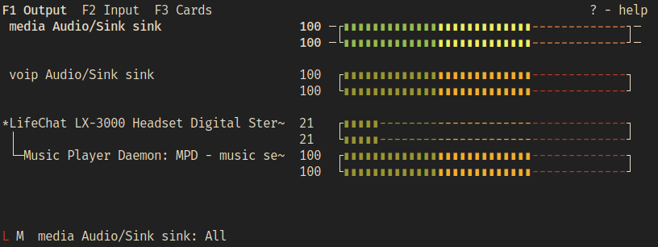

## 简介

随着它的成熟，PipeWire 项目正在慢慢地变得流行。它的[文档](https://docs.pipewire.org/index.html)依然相对稀少，但正在逐渐增长。然而，让项目外部的人尝试用他们自己的语言来理解和解释它总是一个好主意，重申想法，从他们自己的角度来看待它。

在之前的一篇[文章](https://venam.net/blog/unix/2021/02/07/audio-stack.html)中，我讨论了 Unix 上的通用音频栈，并有一节提到了 PipeWire。不幸的是，因为当时我没有找到足够的文档，并且无法理解一些概念，我认为我没有对项目进行公正的处理，甚至可能混淆了某些部分。

在这篇文章中，我将尝试用可能的最简单的方式来解释 PipeWire，让那些想要追随这个很酷的新项目，但又不知道从哪里开始的人能够接触到它。尤其重要的是，这样做可以为更多的人打开一扇门，可以让他们加入并关注当前的发展，这正在快速进行。

*免责声明*：首先我想说的是，我并不是参与这个项目的开发者，只是一个感兴趣的互联网旅行者。我可能仍然犯了错误，没有涵盖所有内容，所以一定要留下评论或电子邮件，以便我可以纠正或添加信息。

*PS*：如果你喜欢深入研究和类似的讨论，那就去 [nixers](https://nixers.net/) 社区看看，那里有很多喜欢这样做的人。

*PPS*：我在这篇文章中使用了一个与令人难以置信的 [PulseAudio Under the Hood](https://gavv.github.io/articles/pulseaudio-under-the-hood/) 一文类似的名字，但我不认为我能像 PulseAudio 的作者所做的那样详细介绍 PulseAudio。

## 什么是 PipeWire —— 快速试运行

PipeWire 是一个媒体处理图引擎，这可能不太清晰，所以让我重新表述一下。PipeWire 是一个守护进程，它提供了类似于 shell 管道的东西，但是用于媒体：音频和视频。

在这个图中存放的是可以代表多种事物的节点，从耳机或网络摄像头等真实设备到音频过滤器等虚拟事物。这些节点具有端口，这些端口可以链接在一起，媒体数据从第一个节点的 **source** 流向下一个节点的 **sink**。每个节点中发生的事情取决于它们以及它们提供的接口或功能。

实际上，节点、链接、端口和其它都是扩展基本类型的不同对象，并且存在于此图中。这些对象也不一定是与媒体相关的，它们可以做很多其它的事情。我们将看到它们使用特殊的类型系统、插件系统和序列化格式/存储。

总而言之，PipeWire 是一个图，“它是机制而不是策略”。这意味着要创建图并与之交互，我们需要另一个软件。标准的方法是依赖 PipeWire 称为**会话管理器**或策略管理器的东西。这种软件的角色是依赖于环境创建并管理图中的实体，比如当设备插入时，或者设置了恢复音量策略，或者在允许一个客户端访问设备之前需要检查权限。

目前，有两个这样的会话管理器实现：默认的称为 **pipewire-media-session**，还有一个还在开发中，但非常有前途和有趣的，称为**WirePlumber**。而且，你可以选择依赖外部工具来管理 PipeWire 图中的内容来构建自己的会话管理工作流。

让我们到此为止，并看看如何运行 PipeWire。从你的包管理器获取它，并在终端中执行如下命令。
```
$ pipewire
```

在另一个终端中执行如下命令：
```
$ pipewire-media-session
```

在某些情况下，正如我们将在 pipewire 的配置中看到的，你可能不需要执行第二个命令，pipewire 可以被设置为自动启动 `pipewire-media-session`。事先试一试 `ps` 以防万一。

如果没有应用程序可以与 PipeWire 对话，那么上述操作也不会让你有所收获 —— 目前只有少数应用程序可以。此外，PipeWire GUI 和工具仍然缺乏，我们将看到。这也就是为什么 PipeWire 要提供三个兼容层：通过一个 PCM 设备与 **ALSA** 兼容，通过 pipewire-pulse 服务器与 **PulseAudio** 兼容，通过 `pw-jack` 命令与 **JACK** 兼容。

要确保你获得了 ALSA 的兼容性，请检查 */etc/alsa/conf.d/50-pipewire.conf* 文件，它应该为 pipewire 定义了一个 pcm，它通常在安装 **pipewire-alsa** 包时创建。然后通过 `alsactl dump-cfg` 或 [aconfdump](https://github.com/venam/aconfdump) 查看 ALSA 配置，来检查它是否已经变为了默认 pcm，并验证 `pcm.default` 项（通常通过 *99-pipewire-default.conf* 这样的东西）。然而，如果你仍然想要依赖 PulseAudio，它就不需要了，在这种情况下，它将是 `type pulse`。

对于 PulseAudio 层，它允许使用 PulseAudio 工具来与 PipeWire 通信，安装 `pipewire-pulse` 并启动它。你的发行版甚至可能通过 init/service 管理器与会话管理器一起自动启动它。

最后，对于 JACK，安装 `pipewire-jack` 包并在任何 JACK 相关的命令之前发出 `pw-jack`，则它们将自动地使用 PipeWire。比如：
```
$ pw-jack qjackctl
```

此外，对于视频功能，你应该安装桌面 portal，它是一个实现了 [xdg-desktop-portal](https://flatpak.github.io/xdg-desktop-portal/portal-docs.html) 规范的 D-Bus 服务，它的工作是检查是否允许客户端请求访问视频。有许多这样的软件：

 * xdg-desktop-portal-gtk
 * xdg-desktop-portal-kde
 * xdg-desktop-portal-wlr

如果你正在运行 Wayland 合成器，你应该熟悉这些，因为这是在 Wayland 上访问视频 (网络摄像头，屏幕共享，截屏) 的唯一方法。

自此，PipeWire 运行起来了！然而，还有更多东西要看，比如如何配置 PipeWire 和会话管理器，如何编写依赖 PipeWire 的软件，其中蕴含的思想，如何管理图和依赖工具，以及大量其它示例。

## 与 GStreamer 的关系

理解 PipeWire 背后的想法的最好方法是看看 GStreamer，它的灵感来自于GStreamer，并且由同一个领导开发者（一个和蔼可亲的人）维护。尽管作者[想与 JACK 进行比较](https://gitlab.freedesktop.org/pipewire/pipewire/-/wikis/FAQ#is-pipewire-just-another-gstreamer)。你可以看一下 JACK 并从中提取你想要的概念，但在本文中我们将使用 GStreamer。

Streamer 围绕着流水线的概念，流水线由在 “bin” 中添加的对象创建，这是它的图版本。像 PipeWire 一样，媒体数据从一端流向另一端。在 Gstreamer 的世界中，代替节点的是 GstElements，代替端口的是附加到 GstElements 的 pads，链接是 pads 之间的连接。

相似之处在于，GStreamer 依赖于 [GObject](http://library.gnome.org/devel/gobject/stable/)，如果你不知道，它是一种使开发更容易的 C 框架/编程模型。它允许做许多事情，诸如注册 GstElements 出现在流水线中时会触发的异步事件 (称为信号)。GObject 还具有主循环管理、类型系统、内部调查机制和其它优点。

GStreamer 提供不同类型的 GstElements 作为插件，它们通过 “工厂” 创建。事实上，这些是扩展公共 GstElement 类型的 GObjects，以提供有用的功能。GStreamer 文档中有一个可用插件的列表。例如 [aasink](https://gstreamer.freedesktop.org/documentation/aasink/index.html?gi-language=c)。一些用于视频，一些用于音频，一些用于日志，一些用于在格式和协商之间做转换，等等等。

这些元素还可以在命令行上通过 `gst-inspect-1.0` 工具来分析。这使得使用 GStreamer 进行编程非常容易。

类似地，PipeWire 有扩展基本节点元素类型的插件。然而，它不依赖于 GObject/GstElement，而是依赖于它自己的更简单的插件系统，适当地命名为 SPA（简单插件 API）。它也有工厂、循环管理系统、异步事件，和称为 POD (Plain Old Data) 的消息传递格式。把 PipeWire 想象成一个以守护进程运行的更简单的 Gstreamer，具有完全可控的循环，并依赖一个会话管理器根据出现的流和设备自动创建图/流水线。

然而，PipeWire 仍然缺少像 GStreamer 那样优秀的文档和内部调查工具。插件几乎还没有文档。我不得不说，GStreamer 确实是一个做得很好的项目，我希望 PipeWire 很快也能做到这一点。

你可以看看如下这些有用的命令行工具：

 *  `gst-discover-1.0`
 *  `gst-inspect-1.0`
 *  `gst-launch-1.0`

创建流水线的一个应用示例：
```
gst-launch-1.0 videotestsrc pattern=1 ! optv ! videoconvert ! autovideosink
```

GStreamer 仍然与 PipeWire 相关，因为 GStreamer 现在可以与它集成。“GStreamer 意在成为多媒体处理的瑞士军刀。” 可用的 PipeWire 新插件名称如下：

 * `pipewiresrc`：PipeWire source
 * `pipewiresink`：PipeWire sink
 * `pipewiredeviceprovider`：PipeWire Device Provider

学习 GStreamer 是更好地理解 PipeWire 的非常好的方法，至少对我来说是这样。

## 构建块：POD/SPA

GObject，即 GLib 对象系统，是众所周知的，并且经过了实战测试，但由于它太重，PipeWire 没有使用它。PipeWire 依赖 SPA 和 POD。但什么是 SPA (Simple Plugin API) 和 POD (Plain Old Data)？

### POD —— Plain Old Data

POD，即 Plain Old Data (不要与 [Perl 的 Plain Old Documentation](https://perldoc.perl.org/perlpod) 混淆)，是一个通用的数据容器格式，以用于数据编组/数据解组、序列化/反序列化、存储和传输。它是通常的平坦[被动数据结构](https://en.wikipedia.org/wiki/Passive_data_structure)。

可以把它看作是另一种格式，类似于 XML、JSON、ASN.1、protobuf 等。它从 [D-bus Variant](https://dbus.freedesktop.org/doc/dbus-java/api/org/freedesktop/dbus/Variant.html) 和 [LV2 Atom](http://lv2plug.in/ns/ext/atom) 等格式中获得灵感。

实际上，它是一种 LTV (长度-类型-值) 格式，因此使用 8 字节计数帧，其中长度和类型是固定的 32 位值，帧总是 8 字节对齐。所以填充常常被添加到不对齐的值上。(*NB*：帧是指数据值从起始到结束，即如何划分数据边界。) 32 位的 `T` 所指向的类型系统，称为 SPA 类型系统，具有复合/容器类型和基本/原始类型。整个范围从容器（如数组、结构体、对象、序列、指针、文件描述符、选择）到原语（如 bool、int、string 等）。这种格式的优点是它是一种“原样”格式，它可以直接在网络上传输，从内存中读取，存储在堆栈或磁盘上，而无需额外的编组。

*NB*：如果你想了解更多关于协议/格式设计的信息，请参考 [RFC 3117](https://datatracker.ietf.org/doc/html/rfc3117)。

POD 库不是专门为 PipeWire 设计的，它可以用于任何其它项目，尽管为什么使用这种格式而不是另一种格式的问题仍然存在。该库是一个小型的 [header-only](https://en.wikipedia.org/wiki/Header-only) 的 C 库，没有任何依赖，这使得对它进行测试变得轻而易举。我已经发布了一个基于[官方教程](https://gitlab.freedesktop.org/pipewire/pipewire/-/blob/master/doc/spa-pod.dox)的[使用示例](https://github.com/venam/SPA-And-PipeWire-Tests/blob/main/test_pod.c)，但让我们仍然回顾一下它的一般方面。

POD 的最佳文档是查阅头文件本身，因为许多辅助函数在其它任何地方都没有文档。你通常可以在 */usr/include/spa/pod/* 或 */usr/include/spa-<version>/pod/* (确保是最新的版本)。它与 SPA 捆绑在同一个目录中，因为它依赖于 */usr/include/spa/utils/type.h* 和 *defs.h* 中的类型 ID 系统。

在 */spa/pod/pod.h* 中定义了 pod 结构 `struct spa_pod` 以及原语和容器值。构造它们的构建者位于 */spa/pod/builder.h*，解析器位于 */spa/pod/parser.h*，对于它们的管理可以通过 */spa/pod/iter.h*、*/spa/pod/filter.h* 和其它文件中的辅助函数完成。

实际上，要创建 pod，我们需要初始化一块内存，在堆上或栈上，并使用构建者辅助函数初始化它。然后我们必须依靠帧来设置容器对象的开始和结束，基本上是在完成后设置对象的最终大小（如我们所说的LTV）。帧在我们选择的内存段上充当一种值的 push 和 pop 工具。

下面看一下它是什么样的，你可以参考[我的示例](https://github.com/venam/SPA-And-PipeWire-Tests/blob/main/test_pod.c)、官方文档或头文件直接了解更多信息。编译应该像这样简单 `cc pod-test.c -o pod-test`。

我们定义任何类型的存储，这里是 256B 的栈上存储，并告诉 pod 构建器我们将使用它来存储 pod。
```
uint8_t buffer[256];
struct spa_pod_builder b = SPA_POD_BUILDER_INIT(buffer, sizeof(buffer));
```

然后我们可以为容器对象定义一个帧，这是一个简单的结构体，但它可以是对象（键/值，称为属性，也有它们自己的 IDs）或其它复杂类型。
```
struct spa_pod_frame f;
spa_pod_builder_push_struct(&b, &f);
```

一旦帧开始，我们就可以给结构体添加值。
```
spa_pod_builder_int(&b, 5);
spa_pod_builder_float(&b, 3.1415f);
```

最后，我们关闭帧，表示我们完成了结构体，它返回 `struct spa_pod` 基本类型，稍后可以将其转换为适当的类型。
```
struct spa_pod *pod = spa_pod_builder_pop(&b, &f);
struct spa_pod_struct *example_struct = (struct spa_pod_struct*)pod;
```

这在内存中看起来是这样的 (小端格式)：
```
length = 00000020 = 32
type   = 0000000e = 14 = SPA_TYPE_Struct
value  =
	length   = 00000004 = 4
	type     = 00000004 = SPA_TYPE_Int
	value    = 00000005 = 5
	_padding = 00000000 (always align to 8 bytes)

	length   = 00000004 = 4
	type     = 00000006 = SPA_TYPE_Float
	value    = 40490e56 = 3.1415
	_padding = 00000000 (always align to 8 bytes)
```

可以在 */spa/utils/type.h* 和其它文件中找到类型。我们还可以注意到对齐的填充，这是由构建器自动添加的。

一旦我们创建了特定类型的 pod，我们就可以用相关的辅助函数来处理它了。在 *iter.h* 头文件中我们可以找到循环遍历 `struct spa_pod_struct` 或验证pod 确实是结构体的方法。
```
struct spa_pod *entry;
SPA_POD_STRUCT_FOREACH(example_struct, entry) {
	printf("field type:%d\n", entry->type);
	// two ways to get the value, casting or using spa_pod_get_..
	if (spa_pod_is_int(entry)) {
		int32_t ival;
		spa_pod_get_int(entry, &ival);
		printf("found int, pod_int: %d\n", ival);
	}
	if (spa_pod_is_float(entry)) {
		struct spa_pod_float *pod_float = (struct spa_pod_float*)entry;
		printf("found float, pod_float: %f\n", pod_float->value);
	}
}
```

正如你所注意到的，`struct spa_pod` 是通用的，并且只包含 pod 的前两个 32 位值，即大小和类型。因此，我们必须查询它的类型以找出它实际是什么，然后手动对其进行强制转换，或使用辅助函数，如在 *iter.h* 中找到的`spa_pod_get_*`。

相反，我们可以依赖 `spa_pod_parser` 和其它辅助函数来验证和检查原始数据 (例如，查看 *iter.h* 中的 `spa_pod_from_data`)。

然而，当你只想看一眼其格式时，手动检查值会很烦人。这也就是为什么调试函数会出现在 */spa/debug/pod.h* 中。`spa_debug_pod_value` 对于打印 pod 中的内容特别有用。我们也可以使用 */spa/utils/json.h* 和 */spa/utils/ansi.h* 把结构打印为 json，就像 [这里](https://gitlab.freedesktop.org/pipewire/pipewire/-/blob/master/src/tools/pw-dump.c) 展示的，但是还没有简单的函数来实现。

POD 远不止于此，它是一个完整的对象格式，但让我们停下来，转到 SPA。

### SPA —— Simple Plugin API

POD 只是关于数据表示，而 SPA 是关于功能的。SPA，即 Simple Plugin API，是一个 header-only 且没有依赖的框架，它提供了加载库的能力，其中库具有特定的格式，迭代工厂，创建它们，以及它们提供的可分析调查内部情况和使用的接口，所有这些都在运行时进行。

像 POD 一样，它并不一定要绑定到 PipeWire，但可以在任何地方使用，尽管 PipeWire 使用 SPA 获得了自己的插件。

SPA 中的工厂创建的对象具有特定的格式，常常内部依赖于 POD，SPA 工厂接口让我们了解与它们关联的功能。

实际上，使用 SPA 的插件采用动态链接库 (.so) 的形式，通常位于 */usr/lib/spa/* 或环境变量 `SPA_PLUGIN_PATH` 指向的路径，并使用 `dlopen(3)` 动态打开。SPA 库至少有一个公共的符号 `spa_handle_factory_enum`，在 */spa/support/plugin.h* 中定义，像下面这样加载：
```
#define SPA_PLUGIN_PATH "/usr/lib/spa-0.2/"
void *hnd = dlopen(
	SPA_PLUGIN_PATH"/support/libspa-support.so",
	RTLD_NOW);
spa_handle_factory_enum_func_t enum_func = dlsym(
	hnd,
	SPA_HANDLE_FACTORY_ENUM_FUNC_NAME);
```

我也编写了一个 [简单的示例](https://github.com/venam/SPA-And-PipeWire-Tests/blob/main/test_spa.c) 来展示 SPA 的用法，但让我们快速检查一下这种机制，因为它对于掌握 PipeWire 配置很重要。编译也应该像这样简单 `cc test-spa.c -ldl -o test-spa`。

插件是由一系列工厂组成的，而在每个工厂中，我们都有一系列可用的接口。其思想是，工厂是围绕特定类型的结构体使用的一系列方法，从它的创建到与它的不同交互。接口是关于任何可以捆绑在一起的东西。

工厂具有广为人知的名字，其中的接口也有名字，它们在 */spa/utils/names.h* 中定义，接口名称以 `SPA_TYPE_INTERFACE_*` 的形式存储在插件本身的头文件中。工厂还具有额外的信息，比如版本号、作者、描述等等。

这是我们在加载库后使用它时所需要知道的。然而，我们必须查阅头文件和库位置 `/usr/lib/spa-<version>`，以了解当前可用的工厂以及如何使用它们。在该库目录中，文件夹名称显示了插件的类别，其中大多数与 PipeWire 有关。如果我们看看 *support/libspa-support.so*，我们会看到它与我们得到的 *support* 头文件有关。我们可以在 `SPA_TYPE_INTERFACE_` 上查找有插件的头文件来确定。让我们以 *support/log.h* 为例。

工厂的名称是 `SPA_NAME_SUPPORT_LOG`，唯一定义的接口是 `SPA_TYPE_INTERFACE_Log`。在内部，我们看到所有使用 SPA 的插件都定义了两个东西：包含 `struct spa_interface` 的结构体，包含与该接口相关的方法及版本号的另一个结构体，另外它可以定义事件和回调。如果你感到好奇，`struct spa_interface` 在 */spa/utils/hook.h* 中定义。然而，内部工作并不重要，重要的是我们可以看看接口中有哪些函数，这些函数决定了我们可以用插件做什么。

一系列以 `spa-` 开头的命令行工具可以用来与插件交互。其中一个特别的称为 `spa-inspect` 的工具，可用于转储 .so 文件中存在的工厂和接口。然而，它不是很可靠，也没有提供太多关于我们可以用插件做什么的信息。

示例输出如下：
```
factory version:     1
factory name:     'support.log'
factory info:
  none
factory interfaces:
 interface: 'Spa:Pointer:Interface:Log'
factory instance:
 interface: 'Spa:Pointer:Interface:Log'
```

这样，加载了 `.so` 并获得了 `enum_func` 函数之后，我们可以循环遍历工厂，查找我们感兴趣的名字，然后循环遍历它的接口来看它是否有我们想要的，然后获得工厂的实例来使用它。

```
uint32_t i;
const struct spa_handle_factory *factory = NULL;
for (i = 0;;) {
	if (enum_func(&factory, &i) <= 0)
		break;
	printf("factory name: %s, version: %d\n",
			factory->name,
			factory->version);
	if (strcmp(factory->name, SPA_NAME_SUPPORT_LOG) == 0) {
		const struct spa_interface_info *info = NULL;
		uint32_t index = 0;
		// get interface at position 0
		int interface_available = 
			spa_handle_factory_enum_interface_info(
			factory,
			&info,
			&index);
		if (strcmp(info->type, SPA_TYPE_INTERFACE_Log) == 0) {
			// allocate a handle (struct) pointing
			// to this factory's interfaces
			size_t size = spa_handle_factory_get_size(
				factory, NULL);
			struct spa_handle *handle = calloc(1, size);
			spa_handle_factory_init(factory, handle,
				NULL, // info
				NULL, // support
				0     // n_support
			);
			// fetch the interface by name from the factory handle
			void *iface;
			int interface_exists =
				spa_handle_get_interface(
					handle,
					SPA_TYPE_INTERFACE_Log,
					&iface);
			// finally get something useful by casting it
			struct spa_log *log = iface;
			// use the methods in the interface of the factory
			spa_log_warn(log, "Hello World!");
			spa_log_info(log, "version: %i", log->iface.version);
			// clear the handle to the factory
			spa_handle_clear(handle);
		}
	}
}
```

这个长例子包含了我们讨论过的所有部分以及更多内容：

 * 循环遍历库中存在的工厂并匹配名字
 * 获得第一个接口 (尽管我们可以循环遍历 `spa_handle_factory_enum_interface_info` 直到返回 0) 的名字并匹配名字
 * 分配一个 `struct spa_handle *`，它是指向工厂中所有接口的指针，是构造工厂的一种方法。(我们必须获取它的大小来做这个，我相信将来会有更好的辅助函数来简化这个)。创建工厂可能需要参数。
 * 使用 `spa_handle_get_interface` 从创建的工厂获得我们的接口，然后将其转换为我们之前讨论过的 `struct spa_log`。
 * 最后，使用与该结构关联的方法。

有大量插件及使用它们的不同方法。有些接口是异步的，通过注册的事件处理程序和钩子使用回调，有些是同步的。

这是 SPA 的大致概念。这可能看起来很麻烦，而且有点平淡无奇：头文件中定义的固定工厂名称，以及固定的接口，和从动态链接库手动获取它们的常用方法，然后根据信息使用其中的方法。现在让我们看看 POD 和 SPA 是如何在 PipeWire 中实际使用的。

### PipeWire Lib，来自 Wayland 的灵感

## 配置

并不是每个人都会编写客户端，但是很多人都对配置 PipeWire 服务器和会话管理器感兴趣。在 PipeWire 方程中有三或四个块可以配置：

 * PipeWire 守护进程运行 core 并托管处理图
 * 根据配置文件自动设置其特性的客户端
 * 会话管理器将节点添加到图中，发现并适当地设置它们
 * PipeWire PulseAudio 服务器和 JACK 向后兼容层及其配置

PipeWire 守护进程配置，客户端配置，及 pipewire-media-session，pipewire-pulse 和 WirePlumber 配置都具有相同的格式。虽然手册中的 `pipewire.conf(5)` 已经简要地解释了它，但它可能仍然令人困惑，所以让我们试着弄清楚它的意义。格式是一系列 `name = value` 形式的赋值语句。值可以是另一个简单的赋值，一个字典 `{ key1=val1 key2=val2 }`，一个数组 `[ val1 val2 ]`，或一个组合，如一个字典的数组。你可能已经注意到，在这种格式中没有逗号。

出现的初始名称列表及其含义取决于我们正在配置什么。然而，正如我所发现的，它们中的大多数都有以下一些：
 * `context.properties`
   包含通用属性的字典
 * `context.spa-libs`
   告诉程序当匹配到一个 SPA 工厂名字时到哪里去查找 `.so` 的字典
 * `context.modules`
   一个字典数组，其中包含启动时要加载的模块
 * `context.objects`
   一个字典数组，其中包含将要使用 SPA 工厂自动创建的对象
 * `context.exec`
   一个字典数组 (不适用于客户端配置)，其中包含启动之后要顺序执行的其他命令。

### PipeWire 服务器配置

PipeWire 守护进程的配置位于多个地方，全局的位于 */etc/pipewire/pipewire.conf* 和 */usr/share/pipewire/pipewire.conf*，本地的位于 *$XDG_CONFIG_HOME*，通常是 *.config/pipewire/pipewire.conf*。因此，在进行修改之前，请确保将其复制到本地用户目录，因为全局配置可能会随着当前的开发速度而迅速变化。

在此之前，最好知道 PipeWire 受到几个环境变量的调控，包括 `PIPEWIRE_DEBUG`，它的值为用于调试范围为 1 到 5 的冗长级别 (5 是最冗长的)，且在它旁边可以有一个可选的类别来过滤记录的内容，`PIPEWIRE_LOG` 和 `PIPEWIRE_LOG_SYSTEMD` 用来在特定文件中记录日志，分别用来禁用或启用 systemd 日志，`PIPEWIRE_LATENCY` 用来配置默认的延迟（`buffer-size/sample-rate` 或 `samples in buffer/samplerate`，参考 [前面的文章](https://venam.net/blog/unix/2021/02/07/audio-stack.html) 了解它们的含义）。

`pipewire.conf` 包含我们前面提到的所有配置名称。特别是，它的 `context.properties` 具有关于处理图的默认方面的信息。让我们回顾一下每个部分以及每个部分的特点。
```
# Daemon config file for PipeWire version "0.3.48" #
#
# Copy and edit this file in /etc/pipewire for system-wide changes
# or in ~/.config/pipewire for local changes.
#
# It is also possible to place a file with an updated section in
# /etc/pipewire/pipewire.conf.d/ for system-wide changes or in
# ~/.config/pipewire/pipewire.conf.d/ for local changes.
#

context.properties = {
    ## Configure properties in the system.
    #library.name.system                   = support/libspa-support
    #context.data-loop.library.name.system = support/libspa-support
    #support.dbus                          = true
    #link.max-buffers                      = 64
    link.max-buffers                       = 16                       # version < 3 clients can't handle more
    #mem.warn-mlock                        = false
    #mem.allow-mlock                       = true
    #mem.mlock-all                         = false
    #clock.power-of-two-quantum            = true
    #log.level                             = 2
    #cpu.zero.denormals                    = false

    core.daemon = true              # listening for socket connections
    core.name   = pipewire-0        # core name and socket name

    ## Properties for the DSP configuration.
    #default.clock.rate          = 48000
    #default.clock.allowed-rates = [ 48000 ]
    #default.clock.quantum       = 1024
    default.clock.min-quantum   = 16
    #default.clock.max-quantum   = 2048
    #default.clock.quantum-limit = 8192
    #default.video.width         = 640
    #default.video.height        = 480
    #default.video.rate.num      = 25
    #default.video.rate.denom    = 1
    #
    #settings.check-quantum      = false
    #settings.check-rate         = false
    #
    # These overrides are only applied when running in a vm.
    vm.overrides = {
        default.clock.min-quantum = 1024
    }
}

context.spa-libs = {
    #<factory-name regex> = <library-name>
    #
    # Used to find spa factory names. It maps an spa factory name
    # regular expression to a library name that should contain
    # that factory.
    #
    audio.convert.* = audioconvert/libspa-audioconvert
    api.alsa.*      = alsa/libspa-alsa
    api.v4l2.*      = v4l2/libspa-v4l2
    api.libcamera.* = libcamera/libspa-libcamera
    api.bluez5.*    = bluez5/libspa-bluez5
    api.vulkan.*    = vulkan/libspa-vulkan
    api.jack.*      = jack/libspa-jack
    support.*       = support/libspa-support
    #videotestsrc   = videotestsrc/libspa-videotestsrc
    #audiotestsrc   = audiotestsrc/libspa-audiotestsrc
}

context.modules = [
    #{ name = <module-name>
    #    [ args  = { <key> = <value> ... } ]
    #    [ flags = [ [ ifexists ] [ nofail ] ]
    #}
    #
    # Loads a module with the given parameters.
    # If ifexists is given, the module is ignored when it is not found.
    # If nofail is given, module initialization failures are ignored.
    #

    # Uses realtime scheduling to boost the audio thread priorities. This uses
    # RTKit if the user doesn't have permission to use regular realtime
    # scheduling.
    { name = libpipewire-module-rt
        args = {
            nice.level    = -11
            #rt.prio      = 88
            #rt.time.soft = -1
            #rt.time.hard = -1
        }
        flags = [ ifexists nofail ]
    }

    # The native communication protocol.
    { name = libpipewire-module-protocol-native }

    # The profile module. Allows application to access profiler
    # and performance data. It provides an interface that is used
    # by pw-top and pw-profiler.
    { name = libpipewire-module-profiler }

    # Allows applications to create metadata objects. It creates
    # a factory for Metadata objects.
    { name = libpipewire-module-metadata }

    # Creates a factory for making devices that run in the
    # context of the PipeWire server.
    { name = libpipewire-module-spa-device-factory }

    # Creates a factory for making nodes that run in the
    # context of the PipeWire server.
    { name = libpipewire-module-spa-node-factory }

    # Allows creating nodes that run in the context of the
    # client. Is used by all clients that want to provide
    # data to PipeWire.
    { name = libpipewire-module-client-node }

    # Allows creating devices that run in the context of the
    # client. Is used by the session manager.
    { name = libpipewire-module-client-device }

    # The portal module monitors the PID of the portal process
    # and tags connections with the same PID as portal
    # connections.
    { name = libpipewire-module-portal
        flags = [ ifexists nofail ]
    }

    # The access module can perform access checks and block
    # new clients.
    { name = libpipewire-module-access
        args = {
            # access.allowed to list an array of paths of allowed
            # apps.
            #access.allowed = [
            #    /usr/bin/pipewire-media-session
            #]

            # An array of rejected paths.
            #access.rejected = [ ]

            # An array of paths with restricted access.
            #access.restricted = [ ]

            # Anything not in the above lists gets assigned the
            # access.force permission.
            #access.force = flatpak
        }
    }

    # Makes a factory for wrapping nodes in an adapter with a
    # converter and resampler.
    { name = libpipewire-module-adapter }

    # Makes a factory for creating links between ports.
    { name = libpipewire-module-link-factory }

    # Provides factories to make session manager objects.
    { name = libpipewire-module-session-manager }

    # Use libcanberra to play X11 Bell
    #{ name = libpipewire-module-x11-bell
    #  args = {
    #      #sink.name = ""
    #      #sample.name = "bell-window-system"
    #      #x11.display = null
    #      #x11.xauthority = null
    #  }
    #}
]

context.objects = [
    #{ factory = <factory-name>
    #    [ args  = { <key> = <value> ... } ]
    #    [ flags = [ [ nofail ] ]
    #}
    #
    # Creates an object from a PipeWire factory with the given parameters.
    # If nofail is given, errors are ignored (and no object is created).
    #
    #{ factory = spa-node-factory   args = { factory.name = videotestsrc node.name = videotestsrc Spa:Pod:Object:Param:Props:patternType = 1 } }
    #{ factory = spa-device-factory args = { factory.name = api.jack.device foo=bar } flags = [ nofail ] }
    #{ factory = spa-device-factory args = { factory.name = api.alsa.enum.udev } }
    #{ factory = spa-node-factory   args = { factory.name = api.alsa.seq.bridge node.name = Internal-MIDI-Bridge } }
    #{ factory = adapter            args = { factory.name = audiotestsrc node.name = my-test } }
    #{ factory = spa-node-factory   args = { factory.name = api.vulkan.compute.source node.name = my-compute-source } }

    # A default dummy driver. This handles nodes marked with the "node.always-driver"
    # property when no other driver is currently active. JACK clients need this.
    { factory = spa-node-factory
        args = {
            factory.name    = support.node.driver
            node.name       = Dummy-Driver
            node.group      = pipewire.dummy
            priority.driver = 20000
        }
    }
    { factory = spa-node-factory
        args = {
            factory.name    = support.node.driver
            node.name       = Freewheel-Driver
            priority.driver = 19000
            node.group      = pipewire.freewheel
            node.freewheel  = true
        }
    }
    # This creates a new Source node. It will have input ports
    # that you can link, to provide audio for this source.
    #{ factory = adapter
    #    args = {
    #        factory.name     = support.null-audio-sink
    #        node.name        = "my-mic"
    #        node.description = "Microphone"
    #        media.class      = "Audio/Source/Virtual"
    #        audio.position   = "FL,FR"
    #    }
    #}

    # This creates a single PCM source device for the given
    # alsa device path hw:0. You can change source to sink
    # to make a sink in the same way.
    #{ factory = adapter
    #    args = {
    #        factory.name           = api.alsa.pcm.source
    #        node.name              = "alsa-source"
    #        node.description       = "PCM Source"
    #        media.class            = "Audio/Source"
    #        api.alsa.path          = "hw:0"
    #        api.alsa.period-size   = 1024
    #        api.alsa.headroom      = 0
    #        api.alsa.disable-mmap  = false
    #        api.alsa.disable-batch = false
    #        audio.format           = "S16LE"
    #        audio.rate             = 48000
    #        audio.channels         = 2
    #        audio.position         = "FL,FR"
    #    }
    #}
]

context.exec = [
    #{ path = <program-name> [ args = "<arguments>" ] }
    #
    # Execute the given program with arguments.
    #
    # You can optionally start the session manager here,
    # but it is better to start it as a systemd service.
    # Run the session manager with -h for options.
    #
    #{ path = "/usr/bin/pipewire-media-session" args = "" }
    #
    # You can optionally start the pulseaudio-server here as well
    # but it is better to start it as a systemd service.
    # It can be interesting to start another daemon here that listens
    # on another address with the -a option (eg. -a tcp:4713).
    #
    #{ path = "/usr/bin/pipewire" args = "-c pipewire-pulse.conf" }
]
```

`context.properties` 包含 core 的通用方面：日志等级，调度设置，默认的全局采样率，默认量子最小值和最大值（缓冲区）等等。流水线中的数据将默认为此采样率，每个节点将相应地自动协商自己的延迟 (在配置中设置的量子内的缓冲区大小)，当最终到达设备时，信号将转换为其采样率。节点可以自己通过设置 `node.latency` 属性设置一个想要的缓冲区大小。

`context.spa-libs` 包含，如前所述，将正则表达式形式的工厂名称映射到磁盘上库的位置的字典 (.so 文件)。还记得在上一节中，我们是如何执行 `dlopen(3)` 并查找可用工厂的吗？在这里，快速查找如何在正确的库中使用工厂创建元素是很有用的，或者直接从 `context.objects` 中的配置创建元素，通过命令行工具，或其它。比如，我们注意到 `support.* = support/libspa-support`，这就是说，任何使用以 *support.* 开始的工厂的调用将使用位于 */usr/lib/spa-0.2/support/libspa-support.so* 的库。

`context.modules` 包含一个要按顺序加载的模块的数组，该数组包含一系列字典，字典中至少有一个 `name` 字段和可选的 `args` 和 `flags`。`name` 用于指出要从系统加载的库，通常位于 */usr/lib/pipewire-<version>/*。`args` 是一个字典，包含特定的每模块设置，而 `flags` 当前是一个数组，其中可以有两个值：`ifexists`，只有当库在磁盘上时才加载模块，和 `nofail`，如果出错，不停止加载其它模块或崩溃。

有相当多的模块可用，每个都做不同的事情，有些扩展核心功能，有些提供创建过滤器的方法，有些更改调度，有些添加性能分析机制，有些进行访问控制，有些提供围绕重采样的节点的适配器，有些提供工厂，等等。你通常可以通过执行 `pw-cli dump Module` 并检查 `module.description` 和 `module.usage` 属性，找到已加载模块的描述和用法，尽管很少。我目前不知道有一种方法可以在不首先加载模块的情况下转储模块的可能参数，类似于 `spa-inspect` 所做的。你可以随时查阅 [source](https://gitlab.freedesktop.org/pipewire/pipewire/-/tree/master/src/modules) 并找到 `PW_KEY_MODULE_USAGE`，就像这里的 [module-filter-chain](https://gitlab.freedesktop.org/pipewire/pipewire/-/blob/master/src/modules/module-filter-chain.c#L54) 一样。

*NB*：从技术上讲，模块是动态客户端，它有一个具有如下签名的导出函数：
```
SPA_EXPORT int pipewire__module_init(struct pw_impl_module *module, const char *args);
```

这个有趣的插件，`libpipewire-module-filter-chain`，在 [这里](https://gitlab.freedesktop.org/pipewire/pipewire/-/wikis/Filter-Chain) 描述，它允许创建 LADSPA 和内建插件 (SPA) 的子图，然后稍后将该子图的 sources 和 sinks 暴露给全局 PipeWire 图（它是否是在客户端运行的图的一部分的实例，我不确定）。相对于依赖单独的软件，这使得插入过滤器更简单，但你需要熟悉如何配置 LADSPA 库控制（这块我不熟）。

`context.objects`，包含一个将在 PipeWire 启动时自动创建的对象的列表。它接收至少一个 SPA 工厂名字参数 `factory`，和可选的以字典传递的 `args`，以及 `flags` 参数，可以被设置为 `nofail` 以忽略创建对象时遇到的错误。

这部分配置对于在图中自动创建虚拟节点或手动设置设备非常有用。例如：
```
{
	factory = spa-node-factory
	args = {
		factory.name = videotestsrc
		node.name = videotestsrc
		Spa:Pod:Object:Param:Props:patternType = 1
	}
}
```

*NB*：在本例中，请确保取消 SPA 工厂 `videotestsrc` 的注释。

这将创建一个具有固定模式的示例视频，类似于 GStreamer 的 `videotestsrc`。有一个 [Wiki 页面](https://gitlab.freedesktop.org/pipewire/pipewire/-/wikis/Virtual-Devices) 介绍了虚拟设备的概念，它解释了可以给播放和采集设置的一些常见属性。

*NB*：尽管它应该与前面的 `gst-launch-1.0` 的例子相同，使用 `gst-launch-1.0 pipewiresrc client-name=hello ! videoconvert ! autovideosink` 并把 `videotestsrc` 连接到 `hello` 只显示了个空屏幕（然而，直接连接网络摄像头确实能正确显示屏幕）。它确实可以与 `audiotestsrc` 一起工作，使用 `gst-launch-1.0 pipewiresrc client-name=hello3 ! audioconvert ! autoaudiosink`。

最后，`context.exec` 包含一个将会在启动之后由 PipeWire 启动的程序的数组。它至少接收一个程序的 `path` 参数，及传递给它的可选的 `args` 参数。我实际上不确定为什么会出现这个部分，而我所看到的似乎都是建议依赖服务管理器而不是启动其它软件。我认为不应该由 PipeWire 守护进程来管理其它服务。然而，它就在那里，知道它就好。

请注意，`pipewire-pulse` 是 `pipewire` 二进制文件的拷贝，唯一的区别是它有一个不同的名称。PipeWire 基于它的名称加载它的配置，因此它将加载 `pipewire-pulse.conf`，这将激活 `libpipewire-module-protocol-pulse`。

### PipeWire 客户端配置

正如守护进程配置一样，客户端配置位于相同的目录下，但名字为 `client.conf` 和 `client-rt.conf`。两者的区别是一个加载 `libpipewire-module-rtkit` 模块而另一个不加载。

PipeWire 客户端或者加载一个特定的配置文件，或者默认加载 `client.conf`。它们在加入图并被会话管理器的策略连接到其它节点之前执行这个配置步骤。

这些文件包含我们前面已经看到的常规部分，但还有两个其它部分 `fitler.properties` 和 `stream.properties`，它们配置内部应该如何处理过滤器和流。客户端是做大部分样本转换、混合和重采样的地方，所以这些部分是关于如何完成这些的。从缓冲区大小，到样本质量，到通道混音，等等。

在 [这里](https://gitlab.freedesktop.org/pipewire/pipewire/-/wikis/Config-client) 的官方文档中可以找到属性中的一部分的快速解释。

### PipeWire 会话管理器配置

会话管理器是负责策略的软件：查找和配置设备，将它们适当地附加到图上，如果需要设置和恢复它们的属性，将流路由到正确的设备，设置它们的音量等等。它可以在 PipeWire 的图中创建与会话管理有关的它自己的对象，比如端点和它们之间的链接，一种 PipeWire 节点之上的抽象。

目前有两种会话管理器的实现：pipewire-media session 和 WirePlumber。每个都有不同的策略格式，pipewire-media-session 具有静态匹配规则，而 WirePlumber 为策略提供动态的 lua 脚本。

然而，整体的想法是一样的：根据设备的来源查找和设置设备

### pipewire-media-session 配置

### WirePlumber 配置

## 工具 & 调试

### 本地 PipeWire 工具

PipeWire 带有一系列工具，可以用来执行常见的任务，如与服务器交互，调试或性能调优。如果你熟悉 PulseAudio 带的工具集，你将发现它们很相似。

下面是其中一些有趣的工具：

 * `pw-cat`：用于播放音频
 * `pw-play`，`pw-record`，`pw-midirecord`，`pw-midiplay`：指向 `pw-cat` 的符号链接
 * `pw-record`：用于录制音频
 * `pw-loopback`：创建虚拟环回节点
 * `pw-link`：端口和链接管理器，用于列出端口，监视它们，并创建链接
 * `pw-dump`：用于转储图中的节点或整个图
 * `pw-dot`：与 `pw-dump` 类似，但以 graphviz 格式转储
 * `pw-top`，`pw-profiler`：用于监视图中对象之间的流量效率
 * `pw-mon`：用于监视图中发生的任何事件
 * `pw-metadata`：用于修改图中的元数据，它当前被用于存储默认的节点信息
 * `pw-cli`：与 PipeWire 守护进程交互的通用命令行工具，允许用来转储，加载和卸载模块，列出对象，创建链接和节点，设置参数，等等。

这些工具，特别是 `pw-cli`，可以被用来创建对象并管理运行中的图，或调查图中发生的事。

这里有一个在两个节点的两个左前端口间创建链接的例子：
```
$ pw-cli create-link "TestSink" 'monitor_FL' \
"alsa_output.usb-C-Media_Electronics_Inc.device.iec958-stereo" \
'playback_FL'
```

或者转储所有可用的工厂：
```
$ pw-cli dump Factory
```

或者创建一个虚拟节点：
```
pw-cli create-node adapter { \
factory.name=support.null-audio-sink node.name=my-mic \
media.class=Audio/Duplex object.linger=1 \
audio.position=FL,FR }
```

除了命令行工具之外，目前还存在一个名为 [helvum](https://gitlab.freedesktop.org/pipewire/helvum) 的基于 Rust-Gtk 的本地 GUI。它仍然是一个 WIP 项目，提供通过点击两个边的端口连接节点的基本功能。除此之外，PipeWire 还缺乏前端，特别是那些允许适当地操纵/表示任何类型媒体（包括音频和视频）的图的前端。

helvum 看起来像这样：


（*更新*：现在有一个新的 QT GUI 称为 [qpwgraph](https://gitlab.freedesktop.org/rncbc/qpwgraph)）

我自己也尝试过用 Rust 构建一些东西，但是 [Rust 绑定](https://pipewire.pages.freedesktop.org/pipewire-rs/pipewire/index.html)，特别是与 POD 和 SPA 相关的绑定，仍然是一个正在进行的工作。很难绑定到 rust，因为 PipeWire 库大多只有 `static inline` 函数。

然而，有一些有趣的工具，如 [PulseEffects](https://github.com/wwmm/pulseeffects)，允许创建过滤器节点来动态添加音频效果。

另一方面，当谈到会话管理器时，pipewire-media-session 目前还没有客户端，而 WirePlumber 确实提供了一组命令行工具。

我们已经看到 `wpexec` 执行 lua 脚本。还有 `wpctl`，它是另一个调查工具，用来询问 WirePlumber 关于可用的设备、节点、它们的属性和它们的音量的信息。它可用于与“端点”的概念进行交互，“端点”是会话管理器的媒体开始和结束位置的抽象表示。

`wpctl status` 可被用于列出已知的端点，其中默认的设备前面会展示一颗星字符。这个默认设备可以使用 `set-default` 选项传递节点 ID 来修改。其它选项，如 `set-volume`，`set-mute`，`set-profile` 都很容易理解。

### 依赖于 PulseAudio 的工具

pipewire-pulse，正如我们所说的，是加载 `libpipewire-module-protocol-pulse` 模块的包装器，它允许在 PipeWire 兼容层之上使用大多数 PulseAudio 功能和软件。模块本身可以在 `pipewire-pulse.conf` 文件中通过一些选项配置，如 [这里](https://gitlab.freedesktop.org/pipewire/pipewire/-/wikis/Config-PulseAudio) 所示。它甚至涵盖了网络协议支持的模块。

因此，它允许我们使用任何我们已经习惯使用于 PulseAudio 的用户接口，如 pavucontrol， pulsemixer， pamixer 等。这还包括命令行工具，如 `pactl`，它给了我们除 `pw-cli` 外的另一种与 PipeWire 交互的方式。
```
$ pactl info

Server String: /run/user/1000/pulse/native
Library Protocol Version: 34
Server Protocol Version: 35
Is Local: yes
Client Index: 106
Tile Size: 65472
User Name: vnm
Host Name: identity
Server Name: PulseAudio (on PipeWire 0.3.30)
Server Version: 14.0.0
Default Sample Specification: float32le 2ch 48000Hz
Default Channel Map: front-left,front-right
Default Sink: alsa_output.pci-0000_00_14.2.analog-stereo
Default Source: alsa_input.pci-0000_00_14.2.analog-stereo
Cookie: daad:fd8f
```

虽然 `pactl` 应该与 PulseAudio 一起使用，但其功能在某种程度上映射到了 PipeWire。这包括模块的加载，这可被用于在图中创建节点。
```
pactl load-module module-null-sink object.linger=1 \
media.class=Audio/Sink \
sink_name=my-sink \
channel_map=surround-51
```

正如你可能注意到的，`module-null-sink` 的语法与你在 PulseAudio 中使用的语法完全不同。这相同的模块也可以被用于创建全双工或 source 节点。更多关于创建虚拟设备的信息请点击 [这里](https://gitlab.freedesktop.org/pipewire/pipewire/-/wikis/Virtual-Devices)。

映射甚至对于通过 `pactl list modules` 列出模块也能工作，只是列出的是 PipeWire 的模块。很明显，我们可以列出对象，或特定的东西，比如通过 `pactl list sinks` 列出 sinks。

[这个有用的指南](https://gitlab.freedesktop.org/pipewire/pipewire/-/wikis/Migrate-PulseAudio) 显示了 PulseAudio 和 PipeWire 之间特性的映射，包括我们展示的 pactl 和特定于 PulseAudio 的某些配置。

下面是 pulsemixer 在 PipeWire 上运行的截图：



### 依赖于 Jack 的工具

正如 PulseAudio 一样，PipeWire 提供了一个 JACK 的兼容层。它是通过在 JACK 命令前加上 `pw-jack` 来启动的，例如：
```
$ pw-jack jack-plumbing
$ pw-jack qjackctl
```

*NB*：你可以在 [这里](http://archive.ubuntu.com/ubuntu/pool/universe/j/jack-tools/jack-tools_20131226.orig.tar.bz2) 找到 `jack-plumbing`，这是一个创建 jack 规则连接规则的非常好的工具。

`pw-jack` 是一个 shell 脚本，它设置了一些环境变量，并修改了 `LD_LIBRARY_PATH` 以在全局的那个之前指向 PipeWire 的 jack lib。你可以通过以下操作注意到这一点：
```
pw-jack ldd /usr/bin/qjackctl| grep -i libjack

libjack.so.0 => /usr/lib/pipewire-0.3/jack/libjack.so.0 (0x00007f65c9fa0000)
```

与 PulseAudio 的类似，这允许我们使用大多数基于 JACK 的 GUI 工具，如 qjackctl，carla，catia，和所有漂亮的可视化工具。与 PulseAudio 工具相比，JACK 工具的优势在于，它已经默认显示了一个图，可以很好地映射到 PipeWire 的概念，但它只映射音频设备，而不映射视频设备。PipeWire 也允许在运行时修改图，效果是即时的，不像JACK，这是很棒。

[文档](https://gitlab.freedesktop.org/pipewire/pipewire/-/wikis/Config-JACK)还列出了与 JACK 有关的特有配置，通常位于 `jack.conf`。

下面是 qjackctl 在 PipeWire 上运行的截图：


### 依赖于 GStreamer 的工具

最后，正如我们前面提到的，我们可以依赖使用 gstreamer 的任何程序和 gstreamer 命令行工具来处理媒体。再次，通过如下插件：

 * `pipewiresrc`：PipeWire source
 * `pipewiresink`：PipeWire sink
 * `pipewiredeviceprovider`：PipeWire Device Provider

我们可以创建一个 PipeWire sink，它将提供来自网络的音频：
```
gst-launch-1.0 \
uridecodebin 'uri=http://podcast.nixers.net/feed/download.php?filename=nixers-podcast-2020-07-221.mp3' ! \
pipewiresink mode=provide \
stream-properties="props,media.class=Audio/Source,node.description=podcast"
```

然后将端口链接到一个音频设备，通过命令行工具或 helvum 这样的 GUI。
```
pw-link gst-launch-1.0:capture_1 \
alsa_output.usb-C-Media_Electronics_Inc._Microsoft_LifeChat_LX-3000-00.iec958-stereo:playback_FL
pw-link gst-launch-1.0:capture_2 \
alsa_output.usb-C-Media_Electronics_Inc._Microsoft_LifeChat_LX-3000-00.iec958-stereo:playback_FR
```

理论上，这也应该允许我们管理视频，然而，正如我上面提到的，我遇到了一些问题。我已经测试了如下命令，并尝试通过 `cheese` 网络摄像头应用打开它，但视频只展示了 2s 就停止了：
```
gst-launch-1.0 \
uridecodebin uri=https://venam.net/workflow-compil-venam-2020.webm ! \
pipewiresink mode=provide \
stream-properties="props,media.class=Video/Source,node.description=compilation"
```

尽管如此，这种可能性还是很吸引人的：在运行中轻松地对视频（包括相机）进行修改和添加滤镜。

## 结论


[原文](https://venam.net/blog/unix/2021/06/23/pipewire-under-the-hood.html)。

Done.
