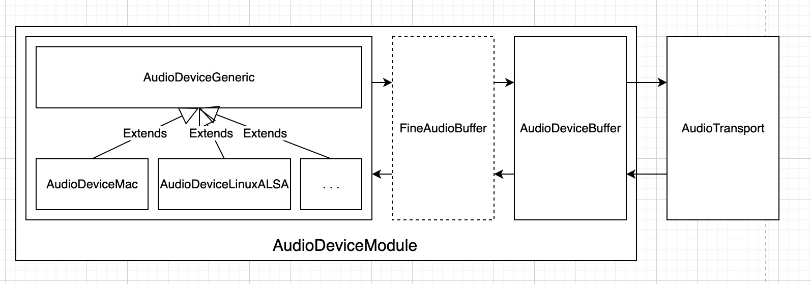
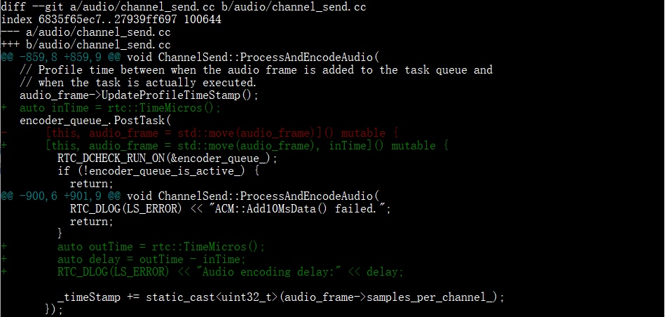
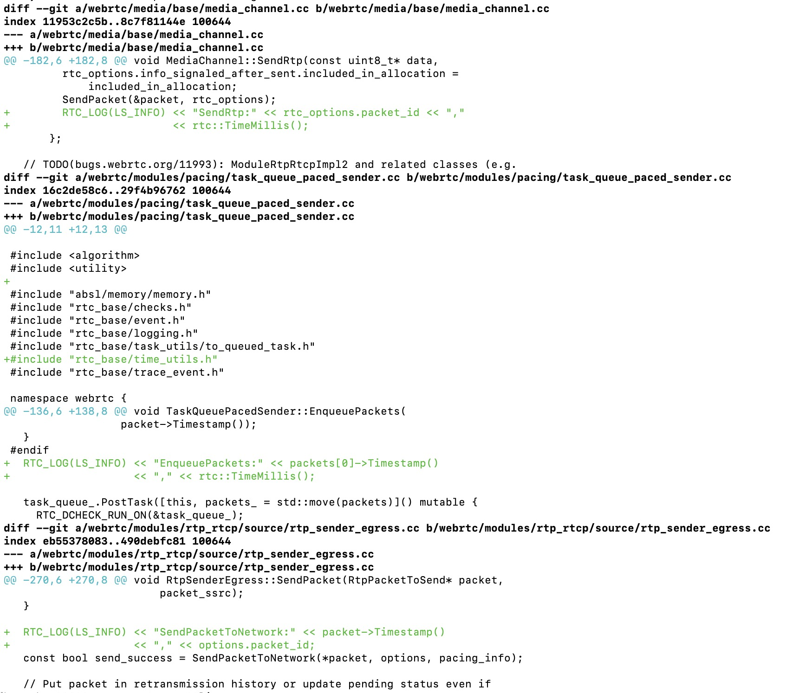
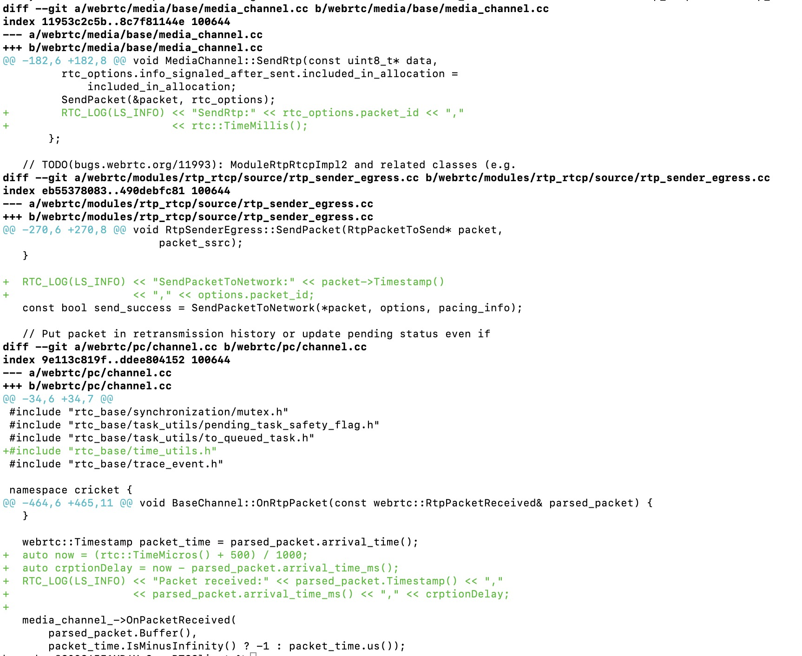
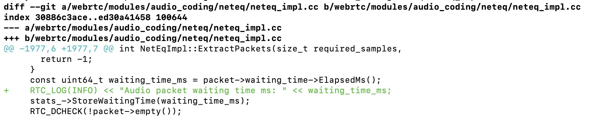
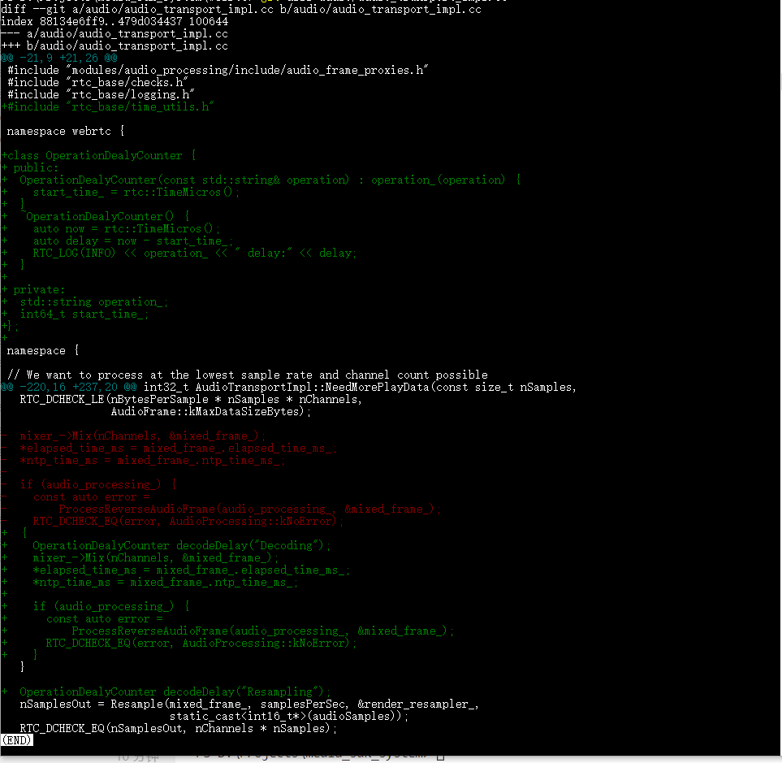

WebRTC 一对一语音通话中的音频端到端延迟指从一个音频信号被发送端采集，到同一个信号被接收端播放出来这整个过程的时间。音频端到端延迟由多个阶段组成。音频端到端处理的冲采样、混音、回声和降噪等操作会使音频数据在数值上变得面目全非，变得难以比较。真正的音频端到端延迟一般使用专业的声卡设备配上专门的音频处理软件来测，这种测试在线上环境中是难以实现的。音频端到端分段延迟常常也能在很大程度上反应音频端到端延迟，分段延迟的分析甚至可以帮我找到造成延迟的瓶颈所在。
<!--more-->
## WebRTC 一对一语音通话中音频处理的主要过程

WebRTC 一对一语音通话中音频的处理主要经过了如下的过程：

1. 音频采集；
2. 音频数据处理，也称为音频的前处理，主要包括回声消除、降噪和自动增益控制等；
3. 音频编码；
4. 编码音频包的发送；
5. 编码音频包在网络中的传输；
6. 从网络中接收音频包；
7. 音频包在缓冲区中等待被解码处理；
8. 音频解码及播放。

这里分析这其中每个阶段的延迟。

## 音频采集延迟

当启动设备的音频采集时，开发者可能可以对系统的音频采集数据缓冲区大小做一些配置，也可能系统有一些自动的配置。当采集数据缓冲区满时，应用层代码可以通过系统的回调，或者主动调用获取音频采集数据的接口获取采集的音频数据。

在 WebRTC 中，通过 `webrtc::AudioDeviceModule` 与音频设备交互，这包括与音频采集设备的交互。WebRTC 为不同的操作系统平台，甚至是同一操作系统平台的不同音频接口提供不同的 `webrtc::AudioDeviceModule` 的具体实现。`webrtc::AudioDeviceModule` 屏蔽不同操作系统平台及各种音频接口获取采集的音频数据的方式的差异，用一种统一的方式，也就是回调接口 `webrtc::AudioTransport`，将采集的音频数据送出去。`webrtc::AudioDeviceModule` 每次通过 `webrtc::AudioTransport` 送出去 10 ms 的音频采集数据，比如，如果音频采集设备的采样率是 48 kHz，则每次送出每通道 480 个采样点的音频数据，进一步如果音频采集设备的通道数是 1，则每次共送出 480 个采样点的数据，而如果音频采集设备的通道数是 2，则每次共送出 2 * 480 = 960 个采样点的数据。

以 Mac 平台为例，`webrtc::AudioDeviceModule` 将数据送到 `webrtc::AudioTransport` 的调用过程大体如下：
```
  * frame #0: webrtc::AudioTransportImpl::RecordedDataIsAvailable(audio_data=0x0000000106f450d0, number_of_frames=480, bytes_per_sample=2, number_of_channels=1, sample_rate=48000, audio_delay_milliseconds=2147981, (null)=0, (null)=0, key_pressed=false, (null)=0x000070000d2366ac) at audio_transport_impl.cc:118:3
    frame #1: webrtc::AudioDeviceBuffer::DeliverRecordedData() at audio_device_buffer.cc:271:38
    frame #2: webrtc::AudioDeviceMac::CaptureWorkerThread() at audio_device_mac.cc:2495:22
    frame #3: webrtc::AudioDeviceMac::StartRecording()::$_1::operator()() const at audio_device_mac.cc:1314:16
```

音频采集在 WebRTC 一对一语音通话中造成延迟，主要在于音频采集数据缓冲区大小的设置，和 10 ms 数据帧格式的对齐。不难理解，采集数据缓冲区越大，填满缓冲区所需的数据量就越多，所需时间越长，整体消耗的系统 CPU 资源更少，但音频采集延迟更大；而采集数据缓冲区越小，则填满缓冲区所需数据量越少，所需时间越短，整体消耗的系统 CPU 资源更多，但采集延迟更小。采集数据缓冲区大小决定通过系统接口获取音频采集数据的最小间隔。

`webrtc::AudioDeviceModule` 每次通过 `webrtc::AudioTransport` 送出 10 ms 的音频采集数据，因而小于 10 ms 的获取系统音频采集数据的周期没有太大意义。不同操作系统平台及不同的音频 API 接口，甚至运行相同操作系统相同音频 API 接口的不同具体设备，其获取系统音频采集数据的周期都会有一些差异。比如 Windows、Linux 和 Mac 一般都支持 10 ms 的获取系统音频采集数据周期，就像上面看到的 Mac 的那样，iOS 支持每次通过系统接口获取 512 或 1024 的每通道采样数的音频数据，Android 平台支持基于 AudioTrack/AudioRecord Java 接口、OpenSL ES 接口和 AAudio 接口实现的多种类型的 `webrtc::AudioDeviceModule`，不同的 Android 系统版本、不同的 `webrtc::AudioDeviceModule` 类型和不同的具体 Android 设备，获取系统音频采集数据的周期从 10 ms 到接近 200 ms 不等。

音频采集在 WebRTC 一对一语音通话中造成延迟，还可能出于 10 ms 音频数据帧的对齐。这主要发生在 iOS 操作系统平台。iOS 一般支持采样率 48kHz、32kHz 和 16kHz 等，其每个音频采集数据获取周期吐 512 或 1024 的每通道采样数难以和这些采样率下 10 ms 音频数据的整数倍的数据对齐，如采样率为 48kHz，10 ms 的数据为每通道 480 个样本数，512 的每通道采样数在吐出一个 10 ms 的音频数据帧之后，会多出 32 个采样数，这会造成额外的对齐延迟。

WebRTC 中 `webrtc::AudioDeviceModule` 的内部实现如下：



`webrtc::AudioDeviceGeneric` 的各个操作系统平台和音频 API 接口的子类，实现通过各个操作系统平台和音频 API 提供的接口，与音频设备交互。当获得的系统音频采集数据不是 10 ms 的数据时，如 iOS 和部分 Android 系统的一些实现，需要先把采集的数据放进一个缓冲区中，缓冲区的数据达到或超过 10 ms 的数据时，送 10 ms 的数据出去，直到缓冲区中的数据不足 10 ms，剩余的数据则等待下次有数据到达时，和下次到达的数据一起拼成 10 ms 的音频数据帧再送出去。这里的缓冲区在 WebRTC 中是 `webrtc::FineAudioBuffer`。

WebRTC 的 `webrtc::AudioDeviceModule` 中，先把采集数据通过 `webrtc::FineAudioBuffer::DeliverRecordedData()` 送进 `webrtc::FineAudioBuffer`，`webrtc::FineAudioBuffer` 将送进来的音频采集数据切成 10 ms 数据的音频帧，并通过 `webrtc::AudioDeviceBuffer::SetRecordedBuffer()` 和 `webrtc::AudioDeviceBuffer::DeliverRecordedData()` 送给 `webrtc::AudioDeviceBuffer`，`webrtc::AudioDeviceBuffer` 将 10 ms 数据的音频帧，借助于 `webrtc::AudioTransport::RecordedDataIsAvailable()` 通过 `webrtc::AudioTransport` 送出去。

对于音频采集延迟，两次获得系统音频采集数据的时间间隔是比较重要的指标。获得的系统音频采集数据不是 10 ms 的数据时，可以将 `webrtc::FineAudioBuffer::DeliverRecordedData()` 的两次调用间隔视作获得系统音频采集数据的间隔；平台支持获得 10 ms 的系统音频采集数据时，可以将 `webrtc::AudioDeviceBuffer::DeliverRecordedData()` 的两次调用间隔视作获得系统音频采集数据的间隔。

笔者在 `webrtc::AudioDeviceBuffer` 中加了一点点代码，来测 Windows 平台的两次获得系统音频采集数据的间隔，相关代码改动如下图：


笔者用 Debug 版的二进制文件，在一台 Windows 10 笔记本电脑上跑简单的 WebRTC 一对一语音通话测试，跑了大概 10 分钟，总共获得 58491 条数据。对 WebRTC 一对一语音通话中音频端到端延迟影响比较大的，不仅仅是各个阶段的平均耗时，各个阶段耗时的异常值常常也会有比较大的影响。因而，这里统计音频采集延迟的数值分布，这些数据的数值分布统计结果如下表（延迟数据单位为 ms）：

|Delay (ms)          |Item Count          |The percentage      |
|--------------------|--------------------|--------------------|
|0                   |53                  |0.000906            |
|1                   |10                  |0.000171            |
|2                   |5                   |0.000085            |
|3                   |9                   |0.000154            |
|5                   |1587                |0.027132            |
|6                   |11015               |0.188320            |
|7                   |2593                |0.044332            |
|8                   |778                 |0.013301            |
|9                   |219                 |0.003744            |
|10                  |4677                |0.079961            |
|11                  |16504               |0.282163            |
|12                  |18447               |0.315382            |
|13                  |2143                |0.036638            |
|14                  |308                 |0.005266            |
|15                  |40                  |0.000684            |
|16                  |19                  |0.000325            |
|17                  |9                   |0.000154            |
|18                  |6                   |0.000103            |
|19                  |8                   |0.000137            |
|20                  |16                  |0.000274            |
|21                  |10                  |0.000171            |
|22                  |9                   |0.000154            |
|23                  |10                  |0.000171            |
|24                  |9                   |0.000154            |
|25                  |3                   |0.000051            |
|27                  |1                   |0.000017            |
|28                  |1                   |0.000017            |
|29                  |2                   |0.000034            |

从表中可以看到，在大多数情况下，两次获得系统音频采集数据的间隔都在 10 ms 左右，更准确地说，是集中在 5 ～ 14 ms 之间，但偶尔会有一些比较大的波动，这个间隔最大的时候可以达到 30 ms。

## 音频数据信号处理延迟

在 WebRTC 中，音频采集数据被送去编码的调用过程如下：
```
  * frame #0: webrtc::voe::(anonymous namespace)::ChannelSend::ProcessAndEncodeAudio(this=0x0000000107b1d810, audio_frame=<unavailable>) at channel_send.cc:809:3
    frame #1: webrtc::internal::AudioSendStream::SendAudioData(this=0x000000010f854200, audio_frame=nullptr) at audio_send_stream.cc:403:18
    frame #2: webrtc::AudioTransportImpl::SendProcessedData(this=0x0000000109024f10, audio_frame=nullptr) at audio_transport_impl.cc:190:30
    frame #3: webrtc::AudioTransportImpl::RecordedDataIsAvailable(this=0x0000000109024f10, audio_data=0x00000001079206b0, number_of_frames=480, bytes_per_sample=2, number_of_channels=1, sample_rate=48000, audio_delay_milliseconds=61, (null)=0, (null)=0, key_pressed=false, (null)=0x000070000db196ac) at audio_transport_impl.cc:171:5
    frame #4: webrtc::AudioDeviceBuffer::DeliverRecordedData(this=0x000000010790c678) at audio_device_buffer.cc:271:38
    frame #5: webrtc::AudioDeviceMac::CaptureWorkerThread(this=0x000000010800d200) at audio_device_mac.cc:2495:22
    frame #6: webrtc::AudioDeviceMac::StartRecording(this=0x0000000107c0a008)::$_1::operator()() const at audio_device_mac.cc:1314:16
```

采集的音频数据在被送去编码之前，还需要进行音频信号处理。在 `webrtc::AudioTransport` 实现的 `RecordedDataIsAvailable()` 函数中，把采集的音频数据送进 `webrtc::AudioSendStream` 编码之前，会先进行音频数据的信号处理，这也称为音频前处理。音频数据的信号处理主要包括回声消除（AEC）、降噪（ANS）和自动增益控制（AGC）等。

`AudioTransportImpl::RecordedDataIsAvailable()` 函数实现如下：
```
// Not used in Chromium. Process captured audio and distribute to all sending
// streams, and try to do this at the lowest possible sample rate.
int32_t AudioTransportImpl::RecordedDataIsAvailable(
    const void* audio_data,
    const size_t number_of_frames,
    const size_t bytes_per_sample,
    const size_t number_of_channels,
    const uint32_t sample_rate,
    const uint32_t audio_delay_milliseconds,
    const int32_t /*clock_drift*/,
    const uint32_t /*volume*/,
    const bool key_pressed,
    uint32_t& /*new_mic_volume*/) {  // NOLINT: to avoid changing APIs
  RTC_DCHECK(audio_data);
  RTC_DCHECK_GE(number_of_channels, 1);
  RTC_DCHECK_LE(number_of_channels, 2);
  RTC_DCHECK_EQ(2 * number_of_channels, bytes_per_sample);
  RTC_DCHECK_GE(sample_rate, AudioProcessing::NativeRate::kSampleRate8kHz);
  // 100 = 1 second / data duration (10 ms).
  RTC_DCHECK_EQ(number_of_frames * 100, sample_rate);
  RTC_DCHECK_LE(bytes_per_sample * number_of_frames * number_of_channels,
                AudioFrame::kMaxDataSizeBytes);

  int send_sample_rate_hz = 0;
  size_t send_num_channels = 0;
  bool swap_stereo_channels = false;
  {
    MutexLock lock(&capture_lock_);
    send_sample_rate_hz = send_sample_rate_hz_;
    send_num_channels = send_num_channels_;
    swap_stereo_channels = swap_stereo_channels_;
  }

  std::unique_ptr<AudioFrame> audio_frame(new AudioFrame());
  InitializeCaptureFrame(sample_rate, send_sample_rate_hz, number_of_channels,
                         send_num_channels, audio_frame.get());
  voe::RemixAndResample(static_cast<const int16_t*>(audio_data),
                        number_of_frames, number_of_channels, sample_rate,
                        &capture_resampler_, audio_frame.get());
  ProcessCaptureFrame(audio_delay_milliseconds, key_pressed,
                      swap_stereo_channels, audio_processing_,
                      audio_frame.get());

  // Typing detection (utilizes the APM/VAD decision). We let the VAD determine
  // if we're using this feature or not.
  // TODO(solenberg): GetConfig() takes a lock. Work around that.
  bool typing_detected = false;
  if (audio_processing_ &&
      audio_processing_->GetConfig().voice_detection.enabled) {
    if (audio_frame->vad_activity_ != AudioFrame::kVadUnknown) {
      bool vad_active = audio_frame->vad_activity_ == AudioFrame::kVadActive;
      typing_detected = typing_detection_.Process(key_pressed, vad_active);
    }
  }

  // Copy frame and push to each sending stream. The copy is required since an
  // encoding task will be posted internally to each stream.
  {
    MutexLock lock(&capture_lock_);
    typing_noise_detected_ = typing_detected;
  }

  RTC_DCHECK_GT(audio_frame->samples_per_channel_, 0);
  if (async_audio_processing_)
    async_audio_processing_->Process(std::move(audio_frame));
  else
    SendProcessedData(std::move(audio_frame));

  return 0;
}

void AudioTransportImpl::SendProcessedData(
    std::unique_ptr<AudioFrame> audio_frame) {
  RTC_DCHECK_GT(audio_frame->samples_per_channel_, 0);
  MutexLock lock(&capture_lock_);
  if (audio_senders_.empty())
    return;

  auto it = audio_senders_.begin();
  while (++it != audio_senders_.end()) {
    auto audio_frame_copy = std::make_unique<AudioFrame>();
    audio_frame_copy->CopyFrom(*audio_frame);
    (*it)->SendAudioData(std::move(audio_frame_copy));
  }
  // Send the original frame to the first stream w/o copying.
  (*audio_senders_.begin())->SendAudioData(std::move(audio_frame));
}
```

这里的音频数据信号处理为软件音频数据信号处理，如软件 AEC 等，即这些信号处理主要由集成的软件算法和库实现。这里的这些软件音频数据信号处理，常常是音频数据流水线上的 CPU 和内存资源消耗大户。音频数据信号处理造成的延迟，主要来源于这些信号处理繁重的 CPU 数据运算。然而许多设备和系统，本身为了支持电话/通话等场景，在系统集成了回声消除等音频数据信号处理。对于硬件音频数据信号处理，在实现上，设备和系统可能是在内部集成了软件音频数据信号处理的库，也可能设备本身带有专门的数字信号处理芯片。设备和系统支持的回声消除、降噪等音频数据信号处理，称为硬件 AEC 和硬件 ANS。Windows、Android 和 iOS 等系统都具有硬件 AEC 等功能。

设备和系统的硬件音频数字信号处理的优点是，比较高效，资源消耗较少，硬件 AEC 消除回声比较彻底，比如多个进程同时在播放声音，麦克风录制的声音经过硬件 AEC 可以消除掉这所有的回声，而对于软件 AEC，则只有当前进程播放的音频数据才有可能被消除等。硬件音频数字信号处理的缺点则是，难以调试分析和优化更新，对多场景的适应性一般，比如硬件 AEC 大多针对语音通话做优化，但在处理录制的音乐时，这种回声消除处理会对音质造成不太好的影响。相对的软件音频数据信号处理的优劣势也比较明显。

**音频数据信号处理延迟与操作系统、具体的设备及 WebRTC 的配置有关。当操作系统及设备支持并开启了硬件的回声消除、硬件的降噪等硬件音频数据信号处理，并关闭了软件的音频数据信号处理时，可以认为音频数据信号处理造成的延迟为 0。而开启了软件的音频数据信号处理，音频数据信号处理延迟则受设备的运算能力影响较大，但一般不会超过 5 ms。**笔者做测试的 Windows 10 笔记本电脑支持硬件音频数据信号处理，且配置了开启硬件音频数据信号处理，这里忽略音频数据信号处理的延迟。

## 音频编码延迟

在 WebRTC 中，采集到的音频数据由 `webrtc::AudioDeviceModule` 的采集线程一直送到 `webrtc::voe::(anonymous namespace)::ChannelSend::ProcessAndEncodeAudio()`，这个函数将音频数据转到一个专门的编码任务队列，异步地进行音频编码：
```
void ChannelSend::ProcessAndEncodeAudio(
    std::unique_ptr<AudioFrame> audio_frame) {
  RTC_DCHECK_RUNS_SERIALIZED(&audio_thread_race_checker_);
  RTC_DCHECK_GT(audio_frame->samples_per_channel_, 0);
  RTC_DCHECK_LE(audio_frame->num_channels_, 8);

  // Profile time between when the audio frame is added to the task queue and
  // when the task is actually executed.
  audio_frame->UpdateProfileTimeStamp();
  encoder_queue_.PostTask(
      [this, audio_frame = std::move(audio_frame)]() mutable {
        RTC_DCHECK_RUN_ON(&encoder_queue_);
        if (!encoder_queue_is_active_) {
          if (fixing_timestamp_stall_) {
            _timeStamp +=
                static_cast<uint32_t>(audio_frame->samples_per_channel_);
          }
          return;
        }
        // Measure time between when the audio frame is added to the task queue
        // and when the task is actually executed. Goal is to keep track of
        // unwanted extra latency added by the task queue.
        RTC_HISTOGRAM_COUNTS_10000("WebRTC.Audio.EncodingTaskQueueLatencyMs",
                                   audio_frame->ElapsedProfileTimeMs());

        bool is_muted = InputMute();
        AudioFrameOperations::Mute(audio_frame.get(), previous_frame_muted_,
                                   is_muted);

        if (_includeAudioLevelIndication) {
          size_t length =
              audio_frame->samples_per_channel_ * audio_frame->num_channels_;
          RTC_CHECK_LE(length, AudioFrame::kMaxDataSizeBytes);
          if (is_muted && previous_frame_muted_) {
            rms_level_.AnalyzeMuted(length);
          } else {
            rms_level_.Analyze(
                rtc::ArrayView<const int16_t>(audio_frame->data(), length));
          }
        }
        previous_frame_muted_ = is_muted;

        // Add 10ms of raw (PCM) audio data to the encoder @ 32kHz.

        // The ACM resamples internally.
        audio_frame->timestamp_ = _timeStamp;
        // This call will trigger AudioPacketizationCallback::SendData if
        // encoding is done and payload is ready for packetization and
        // transmission. Otherwise, it will return without invoking the
        // callback.
        if (audio_coding_->Add10MsData(*audio_frame) < 0) {
          RTC_DLOG(LS_ERROR) << "ACM::Add10MsData() failed.";
          return;
        }

        _timeStamp += static_cast<uint32_t>(audio_frame->samples_per_channel_);
      });
}
```

编码之后的音频帧，被打上 timestamp，被打包为音频 RTP 包，并被送进 pacing 模块等待发送，这个调用过程如下：
```
  * frame #0: webrtc::TaskQueuePacedSender::EnqueuePackets(this=0x000000010f823a00, packets=size=1) at task_queue_paced_sender.cc:130:3
    frame #1: webrtc::voe::(anonymous namespace)::RtpPacketSenderProxy::EnqueuePackets(this=0x000000010785e9e0, packets=size=0) at channel_send.cc:267:24
    frame #2: webrtc::RTPSender::SendToNetwork(this=0x000000010f83bc50, packet=nullptr) at rtp_sender.cc:491:18
    frame #3: webrtc::RTPSenderAudio::SendAudio(this=0x0000000107860b30, frame_type=kAudioFrameSpeech, payload_type='?', rtp_timestamp=2577682277, payload_data="ox", payload_size=69, absolute_capture_timestamp_ms=-1) at
rtp_sender_audio.cc:316:35
    frame #4: webrtc::voe::(anonymous namespace)::ChannelSend::SendRtpAudio(this=0x000000010785e6e0, frameType=kAudioFrameSpeech, payloadType='?', rtp_timestamp=0, payload=ArrayView<const unsigned char, -4711L> @ 0x00007000020f1b08, absolute_capture_timestamp_ms=-1) at channel_send.cc:439:27
    frame #5: webrtc::voe::(anonymous namespace)::ChannelSend::SendData(this=0x000000010785e6e0, frameType=kAudioFrameSpeech, payloadType='?', rtp_timestamp=0, payloadData="ox", payloadSize=69, absolute_capture_timestamp_ms=-1) at channel_send.cc:367:10
    frame #6:  webrtc::voe::(anonymous namespace)::ChannelSend::SendData(webrtc::AudioFrameType, unsigned char, unsigned int, unsigned char const*, unsigned long, long long) at channel_send.cc:0
    frame #7: webrtc::(anonymous namespace)::AudioCodingModuleImpl::Encode(this=0x000000010f83d200, input_data=0x000000010f83d208, absolute_capture_timestamp_ms=optional<long long> @ 0x00007000020f2290)::AudioCodingModuleImpl::InputData const&, absl::optional<long long>) at audio_coding_module.cc:304:32
    frame #8: webrtc::(anonymous namespace)::AudioCodingModuleImpl::Add10MsData(this=0x000000010f83d200, audio_frame=0x000000011580da00) at audio_coding_module.cc:341:16
    frame #9: webrtc::voe::(anonymous namespace)::ChannelSend::ProcessAndEncodeAudio(this=0x0000000107e0b3c8)::$_7::operator()() at channel_send.cc:857:28
```

音频编码延迟主要包括音频数据编码任务被丢进编码任务队列等待执行的时间，和音频编码操作的耗时。音频编码延迟可以通过统计音频数据编码任务对象的生命周期获得，我们可以对 `webrtc/audio/channel_send.cc` 做类似下面这样的修改来实现：



对于音频编码，还需要注意的一个点是，`webrtc::AudioDeviceModule` 每次给 `webrtc::AudioTransport` 送 10 ms 的音频数据，但 WebRTC 默认的音频编码器 OPUS 的默认配置是，每次编码 20 ms 的数据，也就是每两帧的采集音频帧编码一帧的编码帧，`webrtc::voe::(anonymous namespace)::ChannelSend::ProcessAndEncodeAudio()` 中统计的编码延迟，有一半的统计记录，由于创建的音频数据编码任务只是把采集的音频数据放进音频编码器的缓冲区，而没有真正地执行编码操作，是没什么太大意义的。

笔者用 debug 版的二进制文件，在一台 Windows 10 笔记本电脑上，执行与上面测音频采集延迟时相同的测试用例，测 Windows 平台的音频编码延迟。测试用例跑了大概 10 分钟，总共获得了 58494 条数据，统计数据时将耗时超过 1 ms 或真正地执行了编码操作的记录统计进来，这些记录总共有 30764 条。我们同样主要关注音频编码延迟的数值分布，而不是简单的平均值。数据统计结果如下表（延迟数据单位为 us）：

|Delay (us)          |Item Count          |The percentage      |
|--------------------|--------------------|--------------------|
|0                   |7722                |0.251008            |
|1000                |22421               |0.728806            |
|2000                |604                 |0.019633            |
|3000                |14                  |0.000455            |
|4000                |3                   |0.000098            |

从表中可以看到，98% 以上的情况中，音频编码延迟小于 2 ms，极少数情况会达到 4 ms，没有超过 5 ms 的记录。

## 编码音频包的发送延迟

前面我们看到，编码之后的音频包被送进 pacing 模块来做平滑发送。Pacing 模块中有两个 `webrtc::RtpPacketPacer`/`webrtc::RtpPacketSender` 的实现，分别为 `webrtc::TaskQueuePacedSender` 和 `webrtc::PacedSender`，默认为 `webrtc::TaskQueuePacedSender`。

以使用 `webrtc::TaskQueuePacedSender` 控制平滑发送为例，来看编码音频包的发送过程。音频编码模块通过 `TaskQueuePacedSender::EnqueuePackets()` 将编码音频包送进 `webrtc::TaskQueuePacedSender`，`webrtc::TaskQueuePacedSender` 立即在名为 **TaskQueuePacedSender** 的任务队列中起一个异步任务，将编码音频包送进 `webrtc::PacingController` 的包队列中，`TaskQueuePacedSender::EnqueuePackets()` 的实现如下：
```
void TaskQueuePacedSender::EnqueuePackets(
    std::vector<std::unique_ptr<RtpPacketToSend>> packets) {
#if RTC_TRACE_EVENTS_ENABLED
  TRACE_EVENT0(TRACE_DISABLED_BY_DEFAULT("webrtc"),
               "TaskQueuePacedSender::EnqueuePackets");
  for (auto& packet : packets) {
    TRACE_EVENT2(TRACE_DISABLED_BY_DEFAULT("webrtc"),
                 "TaskQueuePacedSender::EnqueuePackets::Loop",
                 "sequence_number", packet->SequenceNumber(), "rtp_timestamp",
                 packet->Timestamp());
  }
#endif

  task_queue_.PostTask([this, packets_ = std::move(packets)]() mutable {
    RTC_DCHECK_RUN_ON(&task_queue_);
    for (auto& packet : packets_) {
      packet_size_.Apply(1, packet->size());
      RTC_DCHECK_GE(packet->capture_time_ms(), 0);
      pacing_controller_.EnqueuePacket(std::move(packet));
    }
    MaybeProcessPackets(Timestamp::MinusInfinity());
  });
}
```

`webrtc::TaskQueuePacedSender` 将编码音频包送进 `webrtc::PacingController` 的包队列的调用过程如下：
```
  * frame #0: webrtc::PacingController::EnqueuePacketInternal(this=0x000000010f058e28, packet=webrtc::RtpPacketToSend @ 0x0000000106f24070, priority=1) at pacing_controller.cc:291:3
    frame #1: webrtc::PacingController::EnqueuePacket(this=0x000000010f058e28, packet=nullptr) at pacing_controller.cc:242:3
    frame #2: webrtc::TaskQueuePacedSender::EnqueuePackets(this=0x0000000107817d28)::$_9::operator()() at task_queue_paced_sender.cc:145:26
```

随后，在 **TaskQueuePacedSender** 任务队列中处理编码音频包并发送出去，这个调用过程如下：
```
  * frame #0: cricket::MediaChannel::SendRtp(this=0x00000001078162b0, data="\x90\xbfB", len=101, options=0x000070000db31220) at media_channel.cc:170:8
    frame #1: cricket::WebRtcVoiceMediaChannel::SendRtp(this=0x00000001078162b0, data="\x90\xbfB", len=101, options=0x000070000db31220) at webrtc_voice_engine.cc:2571:17
    frame #2: webrtc::RtpSenderEgress::SendPacketToNetwork(this=0x000000010e82bd78, packet=0x0000000106f24070, options=0x000070000db31220, pacing_info=0x000070000db32270) at rtp_sender_egress.cc:553:30
    frame #3: webrtc::RtpSenderEgress::SendPacket(this=0x000000010e82bd78, packet=0x0000000106f24070, pacing_info=0x000070000db32270) at rtp_sender_egress.cc:273:29
    frame #4: webrtc::ModuleRtpRtcpImpl2::TrySendPacket(this=0x000000010e82b400, packet=0x0000000106f24070, pacing_info=0x000070000db32270) at rtp_rtcp_impl2.cc:376:30
    frame #5: webrtc::PacketRouter::SendPacket(this=0x000000010f0586a0, packet=webrtc::RtpPacketToSend @ 0x0000000106f24070, cluster_info=0x000070000db32270) at packet_router.cc:160:20
    frame #6: webrtc::PacingController::ProcessPackets(this=0x000000010f058e28) at pacing_controller.cc:585:21
    frame #7: webrtc::TaskQueuePacedSender::MaybeProcessPackets(this=0x000000010f058e00, scheduled_process_time=Timestamp @ 0x000070000db32738) at task_queue_paced_sender.cc:234:24
    frame #8: webrtc::TaskQueuePacedSender::MaybeProcessPackets(this=0x0000000107d04098)::$_14::operator()() const at task_queue_paced_sender.cc:275:39
```

在 `cricket::MediaChannel` 中，编码音频包被转到网络线程 **pc_network_thread** 并发送出去：
```
void MediaChannel::SendRtp(const uint8_t* data,
                           size_t len,
                           const webrtc::PacketOptions& options) {
  auto send =
      [this, packet_id = options.packet_id,
       included_in_feedback = options.included_in_feedback,
       included_in_allocation = options.included_in_allocation,
       packet = rtc::CopyOnWriteBuffer(data, len, kMaxRtpPacketLen)]() mutable {
        rtc::PacketOptions rtc_options;
        rtc_options.packet_id = packet_id;
        if (DscpEnabled()) {
          rtc_options.dscp = PreferredDscp();
        }
        rtc_options.info_signaled_after_sent.included_in_feedback =
            included_in_feedback;
        rtc_options.info_signaled_after_sent.included_in_allocation =
            included_in_allocation;
        SendPacket(&packet, rtc_options);
      };

  // TODO(bugs.webrtc.org/11993): ModuleRtpRtcpImpl2 and related classes (e.g.
  // RTCPSender) aren't aware of the network thread and may trigger calls to
  // this function from different threads. Update those classes to keep
  // network traffic on the network thread.
  if (network_thread_->IsCurrent()) {
    send();
  } else {
    network_thread_->PostTask(ToQueuedTask(network_safety_, std::move(send)));
  }
}

void MediaChannel::SendRtcp(const uint8_t* data, size_t len) {
  auto send = [this, packet = rtc::CopyOnWriteBuffer(
                         data, len, kMaxRtpPacketLen)]() mutable {
    rtc::PacketOptions rtc_options;
    if (DscpEnabled()) {
      rtc_options.dscp = PreferredDscp();
    }
    SendRtcp(&packet, rtc_options);
  };

  if (network_thread_->IsCurrent()) {
    send();
  } else {
    network_thread_->PostTask(ToQueuedTask(network_safety_, std::move(send)));
  }
}
```

最终在网络线程 **pc_network_thread** 中，编码音频包被发送到网络：
```
  * frame #0: rtc::PhysicalSocket::DoSendTo(this=0x000000010781adc0, socket=7, buf="\x90\xbfB", len=111, flags=0, dest_addr=0x000070000dbb2bf8, addrlen=16) at physical_socket_server.cc:510:19
    frame #1: rtc::PhysicalSocket::SendTo(this=0x000000010781adc0, buffer=0x000000011200a000, length=111, addr=0x000000011480c9c8) at physical_socket_server.cc:375:7
    frame #2: rtc::AsyncUDPSocket::SendTo(this=0x000000010781b6c0, pv=0x000000011200a000, cb=111, addr=0x000000011480c9c8, options=0x000070000dbb33a8) at async_udp_socket.cc:84:22
    frame #3: cricket::UDPPort::SendTo(this=0x000000010e819600, data=0x000000011200a000, size=111, addr=0x000000011480c9c8, options=0x000070000dbb37a8, payload=true) at stun_port.cc:281:23
    frame #4: cricket::ProxyConnection::Send(this=0x000000011480c800, data=0x000000011200a000, size=111, options=0x000070000dbb37a8) at connection.cc:1371:14
    frame #5: cricket::P2PTransportChannel::SendPacket(this=0x000000010e815600, data="\x90\xbfB", len=111, options=0x000070000dbb44e8, flags=0) at p2p_transport_channel.cc:1616:36
    frame #6: cricket::DtlsTransport::SendPacket(this=0x0000000107814880, data="\x90\xbfB", size=111, options=0x000070000dbb44e8, flags=1) at dtls_transport.cc:417:32
    frame #7: webrtc::RtpTransport::SendPacket(this=0x000000010e817c00, rtcp=false, packet=0x0000000107b08608, options=0x000070000dbb44e8, flags=1) at rtp_transport.cc:147:24
    frame #8: webrtc::SrtpTransport::SendRtpPacket(this=0x000000010e817c00, packet=0x0000000107b08608, options=0x000070000dbb56d0, flags=1) at srtp_transport.cc:173:10
    frame #9: cricket::BaseChannel::SendPacket(this=0x00000001078168c0, rtcp=false, packet=0x0000000107b08608, options=0x000070000dbb56d0) at channel.cc:437:33
    frame #10: cricket::BaseChannel::SendPacket(this=0x00000001078168c0, packet=0x0000000107b08608, options=0x000070000dbb56d0) at channel.cc:318:10
    frame #11: cricket::MediaChannel::DoSendPacket(this=0x00000001078162b0, packet=0x0000000107b08608, rtcp=false, options=0x000070000dbb56d0) at media_channel.cc:163:40
    frame #12: cricket::MediaChannel::SendPacket(this=0x00000001078162b0, packet=0x0000000107b08608, options=0x000070000dbb56d0) at media_channel.cc:71:10
    frame #13: cricket::MediaChannel::SendRtp(this=0x0000000107b085f8)::$_2::operator()() at media_channel.cc:184:9
```

在逻辑上，编码音频包的发送过程可以看作包含 5 个阶段，这 5 个阶段由两个线程接力完成：

1. 编码音频包被送进 `webrtc::TaskQueuePacedSender`，`webrtc::TaskQueuePacedSender` 在 **TaskQueuePacedSender** 任务队列中起任务将编码音频包放进 `webrtc::PacingController` 的包队列中；
2. 编码音频包在 `webrtc::PacingController` 的包队列中待一段时间等着被处理；
3. `webrtc::PacingController` 的包队列中的编码音频包在 **TaskQueuePacedSender** 任务队列中被处理，并被转到网络线程 **pc_network_thread** 中等待被发送；
4. 编码音频包在网络线程 **pc_network_thread** 的任务队列中待一段时间；
5. 编码音频包被网络线程 **pc_network_thread** 发送到网络。

编码音频包的发送延迟可以认为是编码音频包进入 `webrtc::TaskQueuePacedSender` 到 `cricket::MediaChannel` 向网络线程 **pc_network_thread** 中抛的编码音频包发送任务执行结束的时长。这个时长可以通过打多个点来计算：在 `TaskQueuePacedSender::EnqueuePackets()` 打点记录编码音频包的 timestamp 和时间戳，这个时候编码音频包还没有有效的 sequence number；在 `RtpSenderEgress::SendPacket()` 打点记录编码音频包的 timestamp 和 sequence number，以建立编码音频包的 timestamp 和 sequence number 之间的关联；在 `MediaChannel::SendRtp()` 中，编码音频包发送任务执行结束后，打点记录编码音频包的 sequence number 和时间戳。

由于在 `TaskQueuePacedSender::EnqueuePackets()` 中，编码音频包还没有有效的 sequence number 而只能访问编码音频包的 timestamp，在 `MediaChannel::SendRtp()` 中，访问编码音频包的 sequence number 比较方便，故需要在 `RtpSenderEgress::SendPacket()` 打点建立编码音频包的 timestamp 和 sequence number 之间的关联。

统计编码音频包发送延迟相关的具体改动如下：



笔者用 debug 版的二进制文件，在笔者的一台 Mac 笔记本电脑上跑简单的 WebRTC 一对一语音通话用例，运行大概 10 分钟，总共获得 24483 条数据。同样，我们主要关注编码音频包发送延迟的数值分布，对这些数据的统计结果如下表（延迟数据单位为 ms）：

|Delay               |Item Count          |The percentage      |
|--------------------|--------------------|--------------------|
|0                   |15035               |0.604228            |
|1                   |9485                |0.381184            |
|2                   |44                  |0.001768            |
|3                   |50                  |0.002009            |
|4                   |56                  |0.002251            |
|5                   |27                  |0.001085            |
|6                   |23                  |0.000924            |
|7                   |24                  |0.000965            |
|8                   |25                  |0.001005            |
|9                   |16                  |0.000643            |
|10                  |10                  |0.000402            |
|11                  |5                   |0.000201            |
|12                  |4                   |0.000161            |
|13                  |11                  |0.000442            |
|14                  |4                   |0.000161            |
|15                  |12                  |0.000482            |
|16                  |17                  |0.000683            |
|17                  |14                  |0.000563            |
|18                  |15                  |0.000603            |
|19                  |1                   |0.000040            |
|20                  |3                   |0.000121            |
|23                  |1                   |0.000040            |
|41                  |1                   |0.000040            |

在表中可以看到，98% 以上的情况中，编码音频包发送延迟小于 2 ms，但这一延迟也会有一些波动，这一延迟的最大值甚至可以达到 41 ms。

## 编码音频包网络传输延迟

由于互联网环境的错综复杂，编码音频包网络传输延迟常常是音频端到端延迟比较重要的组成部分。这部分延迟，可以认为是在 `cricket::MediaChannel` 中，创建的网络线程 **pc_network_thread** 上的编码音频包发送任务执行结束，到接收端从网络上收到编码音频包之间的时间。

如果发送端和接收端运行于不同的机器，则两台机器的时钟难以保持绝对同步，这会给网络传输延迟的统计造成一些障碍。即使两台机器通过相同的时钟源来校准，基于编码音频包的发送 NTP 时间和接收 NTP 时间来统计网络传输延迟，也会由于校准的精度问题，而使统计的网络传输延迟存在一定的可见的误差。

统计网络传输延迟，最好的方法还是在同一台机器上既运行发送端，也运行接收端，从而基于同一个时钟来计算。

编码音频包在整个发送、传输和接收过程中，timestamp 保持不变，因而可以通过编码音频包的 timestamp 来关联发送的包和接收的包。

接收端编码音频包的接收过程主要为，在网络线程中，从网络上接收编码音频包，随后在 worker thread 中把编码音频包放进 NetEq 的 PacketBuffer 里。

网络线程 **pc_network_thread** 中，从网络接收编码音频包并向 NetEQ 传递的调用过程为：
```
* thread #6, name = 'pc_network_thread', stop reason = breakpoint 2.1
  * frame #0: cricket::WebRtcVoiceMediaChannel::OnPacketReceived(this=0x0000000107d07040, packet=<unavailable>, packet_time_us=6039635487554) at webrtc_voice_engine.cc:2216:3
    frame #1: cricket::BaseChannel::OnRtpPacket(this=0x0000000107d060b0, parsed_packet=0x000070000361acd0) at channel.cc:467:19
    frame #2: webrtc::RtpDemuxer::OnRtpPacket(this=0x000000010882cb70, packet=0x000070000361acd0) at rtp_demuxer.cc:249:11
    frame #3: webrtc::RtpTransport::DemuxPacket(this=0x000000010882ca00, packet=CopyOnWriteBuffer @ 0x000070000361b2e0, packet_time_us=6039635487554) at rtp_transport.cc:194:21
    frame #4: webrtc::SrtpTransport::OnRtpPacketReceived(this=0x000000010882ca00, packet=CopyOnWriteBuffer @ 0x000070000361b820, packet_time_us=6039635487554) at srtp_transport.cc:226:3
    frame #5: webrtc::RtpTransport::OnReadPacket(this=0x000000010882ca00, transport=0x0000000107839470, data="\x90?", len=147, packet_time_us=0x000070000361d078, flags=1) at rtp_transport.cc:268:5
    frame #10: cricket::DtlsTransport::OnReadPacket(this=0x0000000107839470, transport=0x0000000108826c00, data="\x90?", size=147, packet_time_us=0x000070000361d078, flags=0) at dtls_transport.cc:627:9
    frame #15: cricket::P2PTransportChannel::OnReadPacket(this=0x0000000108826c00, connection=0x0000000114008800, data="\x90?", len=147, packet_time_us=6039635487554) at p2p_transport_channel.cc:2215:5
    frame #20: cricket::Connection::OnReadPacket(this=0x0000000114008800, data="\x90?", size=147, packet_time_us=6039635487554) at connection.cc:465:5
    frame #21: cricket::UDPPort::OnReadPacket(this=0x000000010f06f800, socket=0x0000000107b4cfb0, data="\x90?", size=147, remote_addr=0x000070000361e480, packet_time_us=0x000070000361dd30) at stun_port.cc:389:11
    frame #22: cricket::UDPPort::HandleIncomingPacket(this=0x000000010f06f800, socket=0x0000000107b4cfb0, data="\x90?", size=147, remote_addr=0x000070000361e480, packet_time_us=6039635487554) at stun_port.cc:330:3
    frame #23: cricket::AllocationSequence::OnReadPacket(this=0x0000000107b4cbe0, socket=0x0000000107b4cfb0, data="\x90?", size=147, remote_addr=0x000070000361e480, packet_time_us=0x000070000361e2d8) at basic_port_allocator.cc:1639:18
    frame #28: rtc::AsyncUDPSocket::OnReadEvent(this=0x0000000107b4cfb0, socket=0x0000000107b4cd70) at async_udp_socket.cc:132:3
    frame #33: rtc::SocketDispatcher::OnEvent(this=0x0000000107b4cd70, ff=1, err=0) at physical_socket_server.cc:842:5
    frame #34: rtc::ProcessEvents(dispatcher=0x0000000107b4cd70, readable=true, writable=false, error_event=false, check_error=true) at physical_socket_server.cc:1249:17
    frame #35: rtc::PhysicalSocketServer::WaitSelect(this=0x0000000106f08570, cmsWait=32, process_io=true) at physical_socket_server.cc:1357:9
    frame #36: rtc::PhysicalSocketServer::Wait(this=0x0000000106f08570, cmsWait=32, process_io=true) at physical_socket_server.cc:1183:10
```

`WebRtcVoiceMediaChannel::OnPacketReceived()` 将接收到的编码音频包转到 worker thread，并送进 NetEQ：
```
void WebRtcVoiceMediaChannel::OnPacketReceived(rtc::CopyOnWriteBuffer packet,
                                               int64_t packet_time_us) {
  RTC_DCHECK_RUN_ON(&network_thread_checker_);
  // TODO(bugs.webrtc.org/11993): This code is very similar to what
  // WebRtcVideoChannel::OnPacketReceived does. For maintainability and
  // consistency it would be good to move the interaction with call_->Receiver()
  // to a common implementation and provide a callback on the worker thread
  // for the exception case (DELIVERY_UNKNOWN_SSRC) and how retry is attempted.
  worker_thread_->PostTask(ToQueuedTask(task_safety_, [this, packet,
                                                       packet_time_us] {
    RTC_DCHECK_RUN_ON(worker_thread_);

    webrtc::PacketReceiver::DeliveryStatus delivery_result =
        call_->Receiver()->DeliverPacket(webrtc::MediaType::AUDIO, packet,
                                         packet_time_us);

    if (delivery_result != webrtc::PacketReceiver::DELIVERY_UNKNOWN_SSRC) {
      return;
    }

    // Create an unsignaled receive stream for this previously not received
    // ssrc. If there already is N unsignaled receive streams, delete the
    // oldest. See: https://bugs.chromium.org/p/webrtc/issues/detail?id=5208
    uint32_t ssrc = ParseRtpSsrc(packet);
    RTC_DCHECK(!absl::c_linear_search(unsignaled_recv_ssrcs_, ssrc));

    // Add new stream.
    StreamParams sp = unsignaled_stream_params_;
    sp.ssrcs.push_back(ssrc);
    RTC_LOG(LS_INFO) << "Creating unsignaled receive stream for SSRC=" << ssrc;
    if (!AddRecvStream(sp)) {
      RTC_LOG(LS_WARNING) << "Could not create unsignaled receive stream.";
      return;
    }
    unsignaled_recv_ssrcs_.push_back(ssrc);
    RTC_HISTOGRAM_COUNTS_LINEAR("WebRTC.Audio.NumOfUnsignaledStreams",
                                unsignaled_recv_ssrcs_.size(), 1, 100, 101);

    // Remove oldest unsignaled stream, if we have too many.
    if (unsignaled_recv_ssrcs_.size() > kMaxUnsignaledRecvStreams) {
      uint32_t remove_ssrc = unsignaled_recv_ssrcs_.front();
      RTC_DLOG(LS_INFO) << "Removing unsignaled receive stream with SSRC="
                        << remove_ssrc;
      RemoveRecvStream(remove_ssrc);
    }
    RTC_DCHECK_GE(kMaxUnsignaledRecvStreams, unsignaled_recv_ssrcs_.size());

    SetOutputVolume(ssrc, default_recv_volume_);
    SetBaseMinimumPlayoutDelayMs(ssrc, default_recv_base_minimum_delay_ms_);

    // The default sink can only be attached to one stream at a time, so we hook
    // it up to the *latest* unsignaled stream we've seen, in order to support
    // the case where the SSRC of one unsignaled stream changes.
    if (default_sink_) {
      for (uint32_t drop_ssrc : unsignaled_recv_ssrcs_) {
        auto it = recv_streams_.find(drop_ssrc);
        it->second->SetRawAudioSink(nullptr);
      }
      std::unique_ptr<webrtc::AudioSinkInterface> proxy_sink(
          new ProxySink(default_sink_.get()));
      SetRawAudioSink(ssrc, std::move(proxy_sink));
    }

    delivery_result = call_->Receiver()->DeliverPacket(webrtc::MediaType::AUDIO,
                                                       packet, packet_time_us);
    RTC_DCHECK_NE(webrtc::PacketReceiver::DELIVERY_UNKNOWN_SSRC,
                  delivery_result);
  }));
}
```

`WebRtcVoiceMediaChannel::OnPacketReceived()` 将接收到的编码音频包在 worker thread 上送进 NetEQ 的调用过程如下：
```
* thread #5, name = 'Thread 0x0x10780af20', stop reason = breakpoint 1.1
  * frame #0: webrtc::PacketBuffer::InsertPacket(this=0x0000000107b49080, packet=0x0000000106f9cea0, stats=0x0000000107b48de0, last_decoded_length=480, sample_rate=16000, target_level_ms=80, decoder_database=0x0000000107b49030) at packet_buffer.cc:140:7
    frame #1: webrtc::PacketBuffer::InsertPacketList(this=0x0000000107b49080, packet_list=0x0000700003598948 size=1, decoder_database=0x0000000107b49030, current_rtp_payload_type=0x0000000107b498ad, current_cng_rtp_payload_type=0x0000000107b498af, stats=0x0000000107b48de0, last_decoded_length=480, sample_rate=16000, target_level_ms=80) at packet_buffer.cc:243:9
    frame #2: webrtc::NetEqImpl::InsertPacketInternal(this=0x0000000107b49750, rtp_header=0x0000700003599ea0, payload=ArrayView<const unsigned char, -4711L> @ 0x0000700003598af0) at neteq_impl.cc:690:35
    frame #3: webrtc::NetEqImpl::InsertPacket(this=0x0000000107b49750, rtp_header=0x0000700003599ea0, payload=ArrayView<const unsigned char, -4711L> @ 0x0000700003598d48) at neteq_impl.cc:170:7
    frame #4: webrtc::acm2::AcmReceiver::InsertPacket(this=0x000000010f067210, rtp_header=0x0000700003599ea0, incoming_payload=ArrayView<const unsigned char, -4711L> @ 0x00007000035993f8) at acm_receiver.cc:136:15
    frame #5: webrtc::voe::(anonymous namespace)::ChannelReceive::OnReceivedPayloadData(this=0x000000010f067000, payload=ArrayView<const unsigned char, -4711L> @ 0x0000700003599758, rtpHeader=0x0000700003599ea0) at channel_receive.cc:340:21
    frame #6: webrtc::voe::(anonymous namespace)::ChannelReceive::ReceivePacket(this=0x000000010f067000, packet="\x90\xbf", packet_length=99, header=0x0000700003599ea0) at channel_receive.cc:719:5
    frame #7: webrtc::voe::(anonymous namespace)::ChannelReceive::OnRtpPacket(this=0x000000010f067000, packet=0x000070000359a7a0) at channel_receive.cc:669:3
    frame #8: webrtc::RtpDemuxer::OnRtpPacket(this=0x00000001070122b0, packet=0x000070000359a7a0) at rtp_demuxer.cc:249:11
    frame #9: webrtc::RtpStreamReceiverController::OnRtpPacket(this=0x0000000107012238, packet=0x000070000359a7a0) at rtp_stream_receiver_controller.cc:52:19
    frame #10: webrtc::internal::Call::DeliverRtp(this=0x0000000107012000, media_type=AUDIO, packet=CopyOnWriteBuffer @ 0x000070000359aa18, packet_time_us=6039178656533) at call.cc:1606:36
    frame #11: webrtc::internal::Call::DeliverPacket(this=0x0000000107012000, media_type=AUDIO, packet=CopyOnWriteBuffer @ 0x000070000359b4a8, packet_time_us=6039178656533) at call.cc:1637:10
    frame #12: cricket::WebRtcVoiceMediaChannel::OnPacketReceived(this=0x0000000106f9cc48)::$_3::operator()() const at webrtc_voice_engine.cc:2227:28
```

编码音频包网络传输延迟通过编码音频包的发送完成时间和接收开始时间来统计。为了能将发送的编码音频包和接收的编码音频包关联起来，需要获得编码音频包的 timestamp，timestamp 在编码音频包经过解密和解析之后访问起来比较方便。由上面的编码音频包接收过程可以看到，`cricket::BaseChannel::OnRtpPacket()` 无疑是做这种统计最合适的点。

统计编码音频包的发送时间点的方法如上面那样，这里在 `cricket::BaseChannel::OnRtpPacket()` 加上统计编码音频包的接收时间的逻辑。整体的改动如下：



笔者用 debug 版的二进制文件，在一台 Windows 10 笔记本电脑上跑简单的 WebRTC 一对一语音通话用例，发送端和接收端跑在同一台机器上，跑了大概 10 分钟，总共获得 27111 条数据。同样主要关注编码音频包网络传输延迟的数值分布，对这些数据的统计结果如下表（延迟数据单位为 ms）：

|Delay               |Item Count          |The percentage      |
|--------------------|--------------------|--------------------|
|(0-5]               |132                 |0.004869            |
|(5-10]              |5408                |0.199476            |
|(10-15]             |7362                |0.271550            |
|(15-20]             |4644                |0.171296            |
|(20-35]             |6650                |0.245288            |
|(35-60]             |2476                |0.091328            |
|(60-100]            |382                 |0.014090            |
|(100-...]           |57                  |0.002102            |

在笔者的网络环境中，绝大部分的编码音频包网络端到端传输延迟在 5 ～ 60 ms。

`WebRtcVoiceMediaChannel::OnPacketReceived()` 将接收到的编码音频包转到 worker thread 上，这是让控制线程干了一些数据流的活。***接收到的编码音频包的转线程及将编码音频包送进 NetEQ 的过程，一般来说对于音频端到端延迟不会造成可见的影响，因而这个过程的时间忽略不计。***

## 解码等待延迟

解码过程是由 `webrtc::AudioDeviceModule` 内的播放线程驱动的。`webrtc::AudioDeviceModule` 内会起一个播放线程，它定时地通过回调从 NetEQ 拿解码后的音频数据。送进 NetEQ 的编码音频包不会立即被拿去解码，而是要等播放线程的回调请求时，才会真正的解码。

在编码音频包被插入 NetEQ 的包队列，到编码音频包被拿来解码，通常需要经过一段时间。WebRTC 在 NetEQ 中会统计编码音频包从接收到解码经过的等待时间，并会计算编码音频包的平均等待时间。我们主要关注的还是这个等待时间的分布，及不同延迟值范围的分布和比例，而不仅仅是平均等待时间。我们可以在 NetEQ 中把各个编码音频包的等待解码时间吐出来。相关改动如下：



笔者用 debug 版的二进制文件，在笔者的一台 Windows 10 笔记本电脑上跑简单的 WebRTC 一对一语音通话用例，跑了大概 10 分钟，在接收端总共获得 27123 条数据，各个编码音频包等待解码时间分布如下表（延迟数据单位为 ms）：

|Delay               |Item Count          |The percentage      |
|--------------------|--------------------|--------------------|
|10                  |214                 |0.007890            |
|20                  |260                 |0.009586            |
|30                  |816                 |0.030085            |
|40                  |1796                |0.066217            |
|50                  |4149                |0.152970            |
|60                  |8162                |0.300925            |
|70                  |7775                |0.286657            |
|80                  |2409                |0.088818            |
|90                  |767                 |0.028279            |
|100                 |298                 |0.010987            |
|110                 |186                 |0.006858            |
|120                 |63                  |0.002323            |
|130                 |73                  |0.002691            |
|140                 |32                  |0.001180            |
|150                 |22                  |0.000811            |
|160                 |22                  |0.000811            |
|170                 |17                  |0.000627            |
|180                 |7                   |0.000258            |
|190                 |3                   |0.000111            |
|200                 |4                   |0.000147            |
|210                 |8                   |0.000295            |
|220                 |12                  |0.000442            |
|230                 |4                   |0.000147            |
|240                 |7                   |0.000258            |
|250                 |5                   |0.000184            |
|260                 |2                   |0.000074            |
|270                 |3                   |0.000111            |
|280                 |4                   |0.000147            |
|290                 |2                   |0.000074            |
|310                 |1                   |0.000037            |

编码音频包等待解码时间大多在 20 ～ 100 ms，但也会有一些比较大的值，最大的甚至达到了 310 ms。

## 音频解码及播放延迟

播放线程的回调调上来时，会完成一系列操作：

1. 对所有的远端音频流做解码、PLC；
2. 根据各个远端音频流的采样率计算获得一个音频采样率；
3. 将所有的远端音频流重采样到计算获得的音频采样率；
4. 统一各个远端音频流的通道数，选择音强最强的几个音频流，做混音；
5. 将混音之后的音频数据重采样到音频设备支持的采样率和通道数；
6. 将重采样之后的数据送进设备播放出来。

上面的整个过程可以认为是在 `AudioTransportImpl::NeedMorePlayData()` 中串起来的，其中的第 1 ~ 4 步可以认为是藉由 AudioMixer 串起来的：
```
// Mix all received streams, feed the result to the AudioProcessing module, then
// resample the result to the requested output rate.
int32_t AudioTransportImpl::NeedMorePlayData(const size_t nSamples,
                                             const size_t nBytesPerSample,
                                             const size_t nChannels,
                                             const uint32_t samplesPerSec,
                                             void* audioSamples,
                                             size_t& nSamplesOut,
                                             int64_t* elapsed_time_ms,
                                             int64_t* ntp_time_ms) {
  RTC_DCHECK_EQ(sizeof(int16_t) * nChannels, nBytesPerSample);
  RTC_DCHECK_GE(nChannels, 1);
  RTC_DCHECK_LE(nChannels, 2);
  RTC_DCHECK_GE(
      samplesPerSec,
      static_cast<uint32_t>(AudioProcessing::NativeRate::kSampleRate8kHz));

  // 100 = 1 second / data duration (10 ms).
  RTC_DCHECK_EQ(nSamples * 100, samplesPerSec);
  RTC_DCHECK_LE(nBytesPerSample * nSamples * nChannels,
                AudioFrame::kMaxDataSizeBytes);

  mixer_->Mix(nChannels, &mixed_frame_);
  *elapsed_time_ms = mixed_frame_.elapsed_time_ms_;
  *ntp_time_ms = mixed_frame_.ntp_time_ms_;

  if (audio_processing_) {
    const auto error =
        ProcessReverseAudioFrame(audio_processing_, &mixed_frame_);
    RTC_DCHECK_EQ(error, AudioProcessing::kNoError);
  }

  nSamplesOut = Resample(mixed_frame_, samplesPerSec, &render_resampler_,
                         static_cast<int16_t*>(audioSamples));
  RTC_DCHECK_EQ(nSamplesOut, nChannels * nSamples);
  return 0;
}
```

音频播放延迟的来源，与我们前面在 **音频采集延迟** 中见到的类似，主要来源于两次播放数据请求的回调之间的时间间隔。音频播放延迟的统计方法也与音频采集延迟的统计方法类似，前面看到的音频采集延迟统计的相关改动中也包含了统计音频播放延迟相关的逻辑。

这里我们增加统计 AudioMixer 中的各种操作的耗时，和混音之后的音频数据重采样的耗时的逻辑。相关的改动如：



笔者用 debug 版的二进制文件，在笔者的一台 Windows 10 笔记本电脑上跑简单的 WebRTC 一对一语音通话用例，跑了大概 10 分钟，在接收端总共获得 52956 条两次播放回调间时间间隔的数据，这些时间间隔的分布如下表（延迟数据单位为 ms）：

|Delay               |Item Count          |The percentage      |
|--------------------|--------------------|--------------------|
|0                   |5                   |0.000094            |
|1                   |52                  |0.000982            |
|2                   |43                  |0.000812            |
|3                   |108                 |0.002039            |
|4                   |182                 |0.003437            |
|5                   |275                 |0.005193            |
|6                   |291                 |0.005495            |
|7                   |324                 |0.006118            |
|8                   |1562                |0.029496            |
|9                   |12318               |0.232608            |
|10                  |22554               |0.425901            |
|11                  |12362               |0.233439            |
|12                  |1569                |0.029628            |
|13                  |365                 |0.006893            |
|14                  |321                 |0.006062            |
|15                  |277                 |0.005231            |
|16                  |149                 |0.002814            |
|17                  |89                  |0.001681            |
|18                  |55                  |0.001039            |
|19                  |35                  |0.000661            |
|20                  |12                  |0.000227            |
|21                  |3                   |0.000057            |
|22                  |2                   |0.000038            |
|23                  |1                   |0.000019            |
|29                  |1                   |0.000019            |
|35                  |1                   |0.000019            |

从表中可以看到，绝大部分的时间间隔在 8 ~ 12 ms 之间。偶尔会有一些超过的，最高的在 35 ms。
 
相同的测试获得 52957 条 AudioMixer 的一系列操作的耗时的数据，我们主要关注这些数据的数值分布，这些数据统计结果如下表（延迟数据单位为 us）：

|Delay               |Item Count          |The percentage      |
|--------------------|--------------------|--------------------|
|0                   |37538               |0.708839            |
|1000                |14400               |0.271919            |
|2000                |601                 |0.011349            |
|3000                |127                 |0.002398            |
|4000                |75                  |0.001416            |
|5000                |76                  |0.001435            |
|6000                |49                  |0.000925            |
|7000                |47                  |0.000888            |
|8000                |21                  |0.000397            |
|9000                |18                  |0.000340            |
|10000               |3                   |0.000057            |
|11000               |2                   |0.000038            |

从表中可以看到，超过 98% 的耗时都在 2000 us，也就是 2 ms 以内。（受限于系统时间接口的精度，延迟时间的精度只能达到 ms 级）。

然后是混音之后的音频数据的重采样耗时。相同测试中获得 52957 条数据记录，统计结果如下表（延迟数据单位为 us）：

|Delay               |Item Count          |The percentage      |
|--------------------|--------------------|--------------------|
|0                   |52889               |0.998716            |
|1000                |68                  |0.001284            |

尽管重采样属于语音通话中音频端到端数据处理过程中比较消耗资源的操作，但耗时基本上都没有超过 1 ms。

从上面获得的 WebRTC 一对一语音通话中音频端到端分段延迟的数据可以看到，对于端到端延迟影响比较大的过程包括：音频采集，编码音频包在网络中的传输，音频包在缓冲区中等待被解码处理，音频播放等。但其它过程，如编码音频包的发送，偶尔会出现一些比较大的异常延迟值。音频编码成为音频端到端延迟瓶颈的可能性在于，编码音频帧时长的配置，音频编码操作本身耗时有限。

尽管笔者这里的分析都基于 debug 版的二进制文件进行，这可能会造成一些额外的资源消耗，但统计数据的数量级上是不会有什么差别的。

WebRTC 一对一语音通话中音频端到端分段延迟大体如上。

这里的分析的代码基于 WebRTC M98 版的代码进行（**[OpenRTCClient](https://github.com/hanpfei/OpenRTCClient)**），文中所用的数据分析脚本，可以参考 [e2e_delay_analysis.py](https://github.com/hanpfei/OpenRTCClient/blob/m98_4758/build_system/e2e_delay_analysis.py)

Done。
