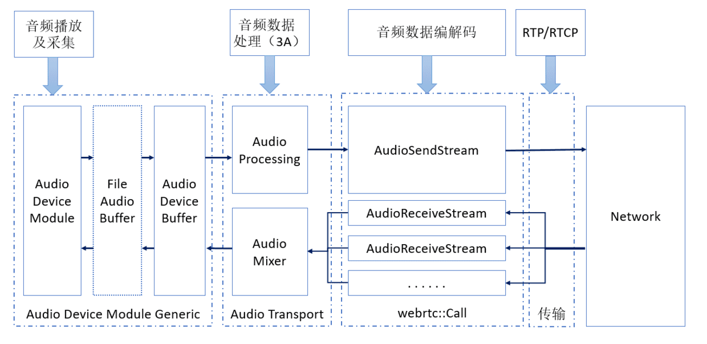

基于 RTC 场景下要解决的声音的问题，WebRTC 有一个大体如下图所示的音频处理流水线：



<!--more-->

WebRTC 的音频处理流水线，不是一次性建立起来的，而是分阶段分步骤建立的。整体而言，可以认为这个流水线分两个阶段建立，或者可以认为这个流水线分为两部分：一部分可称为静态流水线，另一部分可称为动态流水线，或者也可以称为前端和后端。静态流水线，在某个时间点建立一次，随后在整个 WebRTC 通信过程中基本保持不变；动态流水线则在通信过程中，可能出现较为频繁的变动，如本地打开或禁用录制启动发送或停止发送音频数据，远端发送者加入或退出频道等，都会改变动态流水线。

如此，WebRTC 的音频处理流水线大致如下图所示：


WebRTC 音频的静态流水线，建立之后，其相关节点状态由 `AudioState` 维护和管理。WebRTC 音频的静态流水线，主要包括 `AudioDeviceModule`，`AudioProcessing`，和 `AudioMixer` 等，其中 `AudioDeviceModule` 用于采集和播放音频数据，`AudioProcessing` 主要用于对录制的音频数据做初始处理，如回声消除，降噪等，`AudioMixer` 主要用于对远端发送过来的音频数据做混音。

WebRTC 音频的静态流水线在 `WebRtcVoiceEngine` 初始化时建立：
```
void WebRtcVoiceEngine::Init() {
  RTC_DCHECK(worker_thread_checker_.IsCurrent());
  RTC_LOG(LS_INFO) << "WebRtcVoiceEngine::Init";

  // TaskQueue expects to be created/destroyed on the same thread.
  low_priority_worker_queue_.reset(
      new rtc::TaskQueue(task_queue_factory_->CreateTaskQueue(
          "rtc-low-prio", webrtc::TaskQueueFactory::Priority::LOW)));

  // Load our audio codec lists.
  RTC_LOG(LS_INFO) << "Supported send codecs in order of preference:";
  send_codecs_ = CollectCodecs(encoder_factory_->GetSupportedEncoders());
  for (const AudioCodec& codec : send_codecs_) {
    RTC_LOG(LS_INFO) << ToString(codec);
  }

  RTC_LOG(LS_INFO) << "Supported recv codecs in order of preference:";
  recv_codecs_ = CollectCodecs(decoder_factory_->GetSupportedDecoders());
  for (const AudioCodec& codec : recv_codecs_) {
    RTC_LOG(LS_INFO) << ToString(codec);
  }

#if defined(WEBRTC_INCLUDE_INTERNAL_AUDIO_DEVICE)
  // No ADM supplied? Create a default one.
  if (!adm_) {
    adm_ = webrtc::AudioDeviceModule::Create(
        webrtc::AudioDeviceModule::kPlatformDefaultAudio, task_queue_factory_);
  }
#endif  // WEBRTC_INCLUDE_INTERNAL_AUDIO_DEVICE
  RTC_CHECK(adm());
  webrtc::adm_helpers::Init(adm());
  webrtc::apm_helpers::Init(apm());

  // Set up AudioState.
  {
    webrtc::AudioState::Config config;
    if (audio_mixer_) {
      config.audio_mixer = audio_mixer_;
    } else {
      config.audio_mixer = webrtc::AudioMixerImpl::Create();
    }
    config.audio_processing = apm_;
    config.audio_device_module = adm_;
    audio_state_ = webrtc::AudioState::Create(config);
  }

  // Connect the ADM to our audio path.
  adm()->RegisterAudioCallback(audio_state()->audio_transport());

  // Set default engine options.
  {
    AudioOptions options;
    options.echo_cancellation = true;
    options.auto_gain_control = true;
    options.noise_suppression = true;
    options.highpass_filter = true;
    options.stereo_swapping = false;
    options.audio_jitter_buffer_max_packets = 200;
    options.audio_jitter_buffer_fast_accelerate = false;
    options.audio_jitter_buffer_min_delay_ms = 0;
    options.audio_jitter_buffer_enable_rtx_handling = false;
    options.typing_detection = true;
    options.experimental_agc = false;
    options.extended_filter_aec = false;
    options.delay_agnostic_aec = false;
    options.experimental_ns = false;
    options.residual_echo_detector = true;
    bool error = ApplyOptions(options);
    RTC_DCHECK(error);
  }

  initialized_ = true;
}
```

WebRTC 音频静态流水线的几个节点，由外部创建好注入进来，并通过 `AudioState` 创建的 `AudioTransport` 连接起来：`WebRtcVoiceEngine::Init()` 
 根据需要创建 `AudioDeviceModule`，然后创建 `AudioState`，`AudioState` 用注入的 `AudioMixer` 和 `AudioProcessing` 创建 `AudioTransport`，`WebRtcVoiceEngine::Init()` 随后将 `AudioState` 创建的 `AudioTransport` 作为 AudioCallback 注册给 `AudioDeviceModule`。WebRTC 音频静态流水线在 `WebRtcVoiceEngine::Init()` 中建立。动态流水线和静态流水线在 `AudioState` 和 `AudioTransport` 处交汇。

## AudioTransport

`AudioDeviceModule` 在录到音频数据时，将音频数据送给 `AudioTransport`，在播放音频时，也向 `AudioTransport` 拿要播放的音频数据。`AudioTransport` 是录制的音频数据和播放的音频数据的交汇点。

`AudioTransport` 接口的定义 (位于 `webrtc/src/modules/audio_device/include/audio_device_defines.h`) 如下：
```
class AudioTransport {
 public:
  virtual int32_t RecordedDataIsAvailable(const void* audioSamples,
                                          const size_t nSamples,
                                          const size_t nBytesPerSample,
                                          const size_t nChannels,
                                          const uint32_t samplesPerSec,
                                          const uint32_t totalDelayMS,
                                          const int32_t clockDrift,
                                          const uint32_t currentMicLevel,
                                          const bool keyPressed,
                                          uint32_t& newMicLevel) = 0;  // NOLINT

  // Implementation has to setup safe values for all specified out parameters.
  virtual int32_t NeedMorePlayData(const size_t nSamples,
                                   const size_t nBytesPerSample,
                                   const size_t nChannels,
                                   const uint32_t samplesPerSec,
                                   void* audioSamples,
                                   size_t& nSamplesOut,  // NOLINT
                                   int64_t* elapsed_time_ms,
                                   int64_t* ntp_time_ms) = 0;  // NOLINT

  // Method to pull mixed render audio data from all active VoE channels.
  // The data will not be passed as reference for audio processing internally.
  virtual void PullRenderData(int bits_per_sample,
                              int sample_rate,
                              size_t number_of_channels,
                              size_t number_of_frames,
                              void* audio_data,
                              int64_t* elapsed_time_ms,
                              int64_t* ntp_time_ms) = 0;

 protected:
  virtual ~AudioTransport() {}
};
```

WebRTC 中的 `AudioTransport` 接口实现 `AudioTransportImpl` 定义 (位于 `webrtc/src/audio/audio_transport_impl.h`) 如下：
```
namespace webrtc {

class AudioSendStream;

class AudioTransportImpl : public AudioTransport {
 public:
  AudioTransportImpl(AudioMixer* mixer, AudioProcessing* audio_processing);
  ~AudioTransportImpl() override;

  int32_t RecordedDataIsAvailable(const void* audioSamples,
                                  const size_t nSamples,
                                  const size_t nBytesPerSample,
                                  const size_t nChannels,
                                  const uint32_t samplesPerSec,
                                  const uint32_t totalDelayMS,
                                  const int32_t clockDrift,
                                  const uint32_t currentMicLevel,
                                  const bool keyPressed,
                                  uint32_t& newMicLevel) override;

  int32_t NeedMorePlayData(const size_t nSamples,
                           const size_t nBytesPerSample,
                           const size_t nChannels,
                           const uint32_t samplesPerSec,
                           void* audioSamples,
                           size_t& nSamplesOut,
                           int64_t* elapsed_time_ms,
                           int64_t* ntp_time_ms) override;

  void PullRenderData(int bits_per_sample,
                      int sample_rate,
                      size_t number_of_channels,
                      size_t number_of_frames,
                      void* audio_data,
                      int64_t* elapsed_time_ms,
                      int64_t* ntp_time_ms) override;

  void UpdateSendingStreams(std::vector<AudioSendStream*> streams,
                            int send_sample_rate_hz,
                            size_t send_num_channels);
  void SetStereoChannelSwapping(bool enable);
  bool typing_noise_detected() const;
  const voe::AudioLevel& audio_level() const { return audio_level_; }

 private:
  // Shared.
  AudioProcessing* audio_processing_ = nullptr;

  // Capture side.
  rtc::CriticalSection capture_lock_;
  std::vector<AudioSendStream*> sending_streams_ RTC_GUARDED_BY(capture_lock_);
  int send_sample_rate_hz_ RTC_GUARDED_BY(capture_lock_) = 8000;
  size_t send_num_channels_ RTC_GUARDED_BY(capture_lock_) = 1;
  bool typing_noise_detected_ RTC_GUARDED_BY(capture_lock_) = false;
  bool swap_stereo_channels_ RTC_GUARDED_BY(capture_lock_) = false;
  PushResampler<int16_t> capture_resampler_;
  voe::AudioLevel audio_level_;
  TypingDetection typing_detection_;

  // Render side.
  rtc::scoped_refptr<AudioMixer> mixer_;
  AudioFrame mixed_frame_;
  // Converts mixed audio to the audio device output rate.
  PushResampler<int16_t> render_resampler_;

  RTC_DISALLOW_IMPLICIT_CONSTRUCTORS(AudioTransportImpl);
};
}  // namespace webrtc
```

`AudioTransportImpl` 实现的 `AudioTransport` 接口的要求的操作：将录制的音频数据送出去，及获取播放的音频数据。

`AudioTransportImpl` 对象创建时保存注入的 `AudioMixer` 和 `AudioProcessing` 对象指针：
```
AudioTransportImpl::AudioTransportImpl(AudioMixer* mixer,
                                       AudioProcessing* audio_processing)
    : audio_processing_(audio_processing), mixer_(mixer) {
  RTC_DCHECK(mixer);
  RTC_DCHECK(audio_processing);
}

AudioTransportImpl::~AudioTransportImpl() {}
```

### 播放
`AudioDeviceModule` 可以通过 `AudioTransportImpl` 的 `NeedMorePlayData()` 和 `PullRenderData()` 获取用于播放的音频数据：
```
// Resample audio in |frame| to given sample rate preserving the
// channel count and place the result in |destination|.
int Resample(const AudioFrame& frame,
             const int destination_sample_rate,
             PushResampler<int16_t>* resampler,
             int16_t* destination) {
  const int number_of_channels = static_cast<int>(frame.num_channels_);
  const int target_number_of_samples_per_channel =
      destination_sample_rate / 100;
  resampler->InitializeIfNeeded(frame.sample_rate_hz_, destination_sample_rate,
                                number_of_channels);

  // TODO(yujo): make resampler take an AudioFrame, and add special case
  // handling of muted frames.
  return resampler->Resample(
      frame.data(), frame.samples_per_channel_ * number_of_channels,
      destination, number_of_channels * target_number_of_samples_per_channel);
}
. . . . . . 
// Mix all received streams, feed the result to the AudioProcessing module, then
// resample the result to the requested output rate.
int32_t AudioTransportImpl::NeedMorePlayData(const size_t nSamples,
                                             const size_t nBytesPerSample,
                                             const size_t nChannels,
                                             const uint32_t samplesPerSec,
                                             void* audioSamples,
                                             size_t& nSamplesOut,
                                             int64_t* elapsed_time_ms,
                                             int64_t* ntp_time_ms) {
  RTC_DCHECK_EQ(sizeof(int16_t) * nChannels, nBytesPerSample);
  RTC_DCHECK_GE(nChannels, 1);
  RTC_DCHECK_LE(nChannels, 2);
  RTC_DCHECK_GE(
      samplesPerSec,
      static_cast<uint32_t>(AudioProcessing::NativeRate::kSampleRate8kHz));

  // 100 = 1 second / data duration (10 ms).
  RTC_DCHECK_EQ(nSamples * 100, samplesPerSec);
  RTC_DCHECK_LE(nBytesPerSample * nSamples * nChannels,
                AudioFrame::kMaxDataSizeBytes);

  mixer_->Mix(nChannels, &mixed_frame_);
  *elapsed_time_ms = mixed_frame_.elapsed_time_ms_;
  *ntp_time_ms = mixed_frame_.ntp_time_ms_;

  const auto error = audio_processing_->ProcessReverseStream(&mixed_frame_);
  RTC_DCHECK_EQ(error, AudioProcessing::kNoError);

  nSamplesOut = Resample(mixed_frame_, samplesPerSec, &render_resampler_,
                         static_cast<int16_t*>(audioSamples));
  RTC_DCHECK_EQ(nSamplesOut, nChannels * nSamples);
  return 0;
}

// Used by Chromium - same as NeedMorePlayData() but because Chrome has its
// own APM instance, does not call audio_processing_->ProcessReverseStream().
void AudioTransportImpl::PullRenderData(int bits_per_sample,
                                        int sample_rate,
                                        size_t number_of_channels,
                                        size_t number_of_frames,
                                        void* audio_data,
                                        int64_t* elapsed_time_ms,
                                        int64_t* ntp_time_ms) {
  RTC_DCHECK_EQ(bits_per_sample, 16);
  RTC_DCHECK_GE(number_of_channels, 1);
  RTC_DCHECK_GE(sample_rate, AudioProcessing::NativeRate::kSampleRate8kHz);

  // 100 = 1 second / data duration (10 ms).
  RTC_DCHECK_EQ(number_of_frames * 100, sample_rate);

  // 8 = bits per byte.
  RTC_DCHECK_LE(bits_per_sample / 8 * number_of_frames * number_of_channels,
                AudioFrame::kMaxDataSizeBytes);
  mixer_->Mix(number_of_channels, &mixed_frame_);
  *elapsed_time_ms = mixed_frame_.elapsed_time_ms_;
  *ntp_time_ms = mixed_frame_.ntp_time_ms_;

  auto output_samples = Resample(mixed_frame_, sample_rate, &render_resampler_,
                                 static_cast<int16_t*>(audio_data));
  RTC_DCHECK_EQ(output_samples, number_of_channels * number_of_frames);
}
```

`NeedMorePlayData()` 执行如下操作：
 1. 通过 `AudioMixer` 对远端的音频流做混音。`AudioTransportImpl` 没有直接与 `AudioReceiveStream` 建立连接，但 `AudioMixer` 的 source 实际上是 `AudioReceiveStream`。
 2. 把混音后的音频数据送进 `AudioProcessing`。主要用于回声消除。
 3. 对混音后的音频数据重采样。如我们前面看到的 `AudioMixerImpl` 的实现，它的混音输出采样率有它自己的决定逻辑，可能与 `AudioDeviceModule` 设备需要的不一致，这里需要按照设备的需要，将混音后的数据重采样到设备需要的采样率。
 4. 返回重采样的数据。

`PullRenderData()` 的操作与 `NeedMorePlayData()` 仅有的区别在于，没有上面的第 2 步。如注释中所说，在某些情况下，混音之后的数据无需送进 `AudioProcessing`。此外，`PullRenderData()` 要求调用者只能请求单通道的音频数据，`NeedMorePlayData()` 的调用者则可以请求单通道或立体声的。

重采样和混音的更多细节，这里不再赘述。

### 录制
`AudioDeviceModule` 可以通过 `AudioTransport` 的 `RecordedDataIsAvailable()` 把录制的数据送出去：
```
// We want to process at the lowest sample rate and channel count possible
// without losing information. Choose the lowest native rate at least equal to
// the minimum of input and codec rates, choose lowest channel count, and
// configure the audio frame.
void InitializeCaptureFrame(int input_sample_rate,
                            int send_sample_rate_hz,
                            size_t input_num_channels,
                            size_t send_num_channels,
                            AudioFrame* audio_frame) {
  RTC_DCHECK(audio_frame);
  int min_processing_rate_hz = std::min(input_sample_rate, send_sample_rate_hz);
  for (int native_rate_hz : AudioProcessing::kNativeSampleRatesHz) {
    audio_frame->sample_rate_hz_ = native_rate_hz;
    if (audio_frame->sample_rate_hz_ >= min_processing_rate_hz) {
      break;
    }
  }
  audio_frame->num_channels_ = std::min(input_num_channels, send_num_channels);
}

void ProcessCaptureFrame(uint32_t delay_ms,
                         bool key_pressed,
                         bool swap_stereo_channels,
                         AudioProcessing* audio_processing,
                         AudioFrame* audio_frame) {
  RTC_DCHECK(audio_processing);
  RTC_DCHECK(audio_frame);
  audio_processing->set_stream_delay_ms(delay_ms);
  audio_processing->set_stream_key_pressed(key_pressed);
  int error = audio_processing->ProcessStream(audio_frame);
  RTC_DCHECK_EQ(0, error) << "ProcessStream() error: " << error;
  if (swap_stereo_channels) {
    AudioFrameOperations::SwapStereoChannels(audio_frame);
  }
}
. . . . . . 
// Not used in Chromium. Process captured audio and distribute to all sending
// streams, and try to do this at the lowest possible sample rate.
int32_t AudioTransportImpl::RecordedDataIsAvailable(
    const void* audio_data,
    const size_t number_of_frames,
    const size_t bytes_per_sample,
    const size_t number_of_channels,
    const uint32_t sample_rate,
    const uint32_t audio_delay_milliseconds,
    const int32_t /*clock_drift*/,
    const uint32_t /*volume*/,
    const bool key_pressed,
    uint32_t& /*new_mic_volume*/) {  // NOLINT: to avoid changing APIs
  RTC_DCHECK(audio_data);
  RTC_DCHECK_GE(number_of_channels, 1);
  RTC_DCHECK_LE(number_of_channels, 2);
  RTC_DCHECK_EQ(2 * number_of_channels, bytes_per_sample);
  RTC_DCHECK_GE(sample_rate, AudioProcessing::NativeRate::kSampleRate8kHz);
  // 100 = 1 second / data duration (10 ms).
  RTC_DCHECK_EQ(number_of_frames * 100, sample_rate);
  RTC_DCHECK_LE(bytes_per_sample * number_of_frames * number_of_channels,
                AudioFrame::kMaxDataSizeBytes);

  int send_sample_rate_hz = 0;
  size_t send_num_channels = 0;
  bool swap_stereo_channels = false;
  {
    rtc::CritScope lock(&capture_lock_);
    send_sample_rate_hz = send_sample_rate_hz_;
    send_num_channels = send_num_channels_;
    swap_stereo_channels = swap_stereo_channels_;
  }

  std::unique_ptr<AudioFrame> audio_frame(new AudioFrame());
  InitializeCaptureFrame(sample_rate, send_sample_rate_hz, number_of_channels,
                         send_num_channels, audio_frame.get());
  voe::RemixAndResample(static_cast<const int16_t*>(audio_data),
                        number_of_frames, number_of_channels, sample_rate,
                        &capture_resampler_, audio_frame.get());
  ProcessCaptureFrame(audio_delay_milliseconds, key_pressed,
                      swap_stereo_channels, audio_processing_,
                      audio_frame.get());

  // Typing detection (utilizes the APM/VAD decision). We let the VAD determine
  // if we're using this feature or not.
  // TODO(solenberg): GetConfig() takes a lock. Work around that.
  bool typing_detected = false;
  if (audio_processing_->GetConfig().voice_detection.enabled) {
    if (audio_frame->vad_activity_ != AudioFrame::kVadUnknown) {
      bool vad_active = audio_frame->vad_activity_ == AudioFrame::kVadActive;
      typing_detected = typing_detection_.Process(key_pressed, vad_active);
    }
  }

  // Measure audio level of speech after all processing.
  double sample_duration = static_cast<double>(number_of_frames) / sample_rate;
  audio_level_.ComputeLevel(*audio_frame, sample_duration);

  // Copy frame and push to each sending stream. The copy is required since an
  // encoding task will be posted internally to each stream.
  {
    rtc::CritScope lock(&capture_lock_);
    typing_noise_detected_ = typing_detected;

    RTC_DCHECK_GT(audio_frame->samples_per_channel_, 0);
    if (!sending_streams_.empty()) {
      auto it = sending_streams_.begin();
      while (++it != sending_streams_.end()) {
        std::unique_ptr<AudioFrame> audio_frame_copy(new AudioFrame());
        audio_frame_copy->CopyFrom(*audio_frame);
        (*it)->SendAudioData(std::move(audio_frame_copy));
      }
      // Send the original frame to the first stream w/o copying.
      (*sending_streams_.begin())->SendAudioData(std::move(audio_frame));
    }
  }

  return 0;
}
. . . . . . 
void AudioTransportImpl::UpdateSendingStreams(
    std::vector<AudioSendStream*> streams,
    int send_sample_rate_hz,
    size_t send_num_channels) {
  rtc::CritScope lock(&capture_lock_);
  sending_streams_ = std::move(streams);
  send_sample_rate_hz_ = send_sample_rate_hz;
  send_num_channels_ = send_num_channels;
}
```

`AudioTransportImpl` 的 `RecordedDataIsAvailable()` 拿到录音得到的音频数据，对音频数据执行如下操作：
 1. 重采样。`AudioDeviceModule` 送进来的音频数据的采样率是设备采集的原始采样率，这里需要把采集的音频数据转换为适合 WebRTC 的音频处理模块如降噪和回声消除等模块及编码器处理的采样率。
 2. 对音频数据做回声消除，降噪等处理。
 3. 把音频数据送出去，给注入的 `AudioSendStream`。

## AudioState

`AudioState` 既是 WebRTC 音频流水线节点的容器，也可用于对这些节点做一些管理和控制，以及将不同节点粘起来构成流水线。`AudioState` 接口的定义 (位于 `webrtc/src/call/audio_state.h`) 如下：
```
namespace webrtc {

class AudioTransport;

// AudioState holds the state which must be shared between multiple instances of
// webrtc::Call for audio processing purposes.
class AudioState : public rtc::RefCountInterface {
 public:
  struct Config {
    Config();
    ~Config();

    // The audio mixer connected to active receive streams. One per
    // AudioState.
    rtc::scoped_refptr<AudioMixer> audio_mixer;

    // The audio processing module.
    rtc::scoped_refptr<webrtc::AudioProcessing> audio_processing;

    // TODO(solenberg): Temporary: audio device module.
    rtc::scoped_refptr<webrtc::AudioDeviceModule> audio_device_module;
  };

  struct Stats {
    // Audio peak level (max(abs())), linearly on the interval [0,32767].
    int32_t audio_level = -1;
    // See:
    // https://w3c.github.io/webrtc-stats/#dom-rtcmediastreamtrackstats-totalaudioenergy
    double total_energy = 0.0f;
    double total_duration = 0.0f;
  };

  virtual AudioProcessing* audio_processing() = 0;
  virtual AudioTransport* audio_transport() = 0;

  // Enable/disable playout of the audio channels. Enabled by default.
  // This will stop playout of the underlying audio device but start a task
  // which will poll for audio data every 10ms to ensure that audio processing
  // happens and the audio stats are updated.
  virtual void SetPlayout(bool enabled) = 0;

  // Enable/disable recording of the audio channels. Enabled by default.
  // This will stop recording of the underlying audio device and no audio
  // packets will be encoded or transmitted.
  virtual void SetRecording(bool enabled) = 0;

  virtual Stats GetAudioInputStats() const = 0;
  virtual void SetStereoChannelSwapping(bool enable) = 0;

  static rtc::scoped_refptr<AudioState> Create(
      const AudioState::Config& config);

  ~AudioState() override {}
};
}  // namespace webrtc
```

作为音频处理流水线的容器，`AudioState` 接口主要包含了 `AudioMixer`、`AudioProcessing` 和 `AudioDeviceModule`。`AudioState` 对象的创建主要通过静态工厂方法完成。

WebRTC 提供了 `AudioState` 接口的实现，该实现的定义 (位于 `webrtc/src/audio/audio_state.h` ) 如下：
```
namespace webrtc {

class AudioSendStream;
class AudioReceiveStream;

namespace internal {

class AudioState : public webrtc::AudioState {
 public:
  explicit AudioState(const AudioState::Config& config);
  ~AudioState() override;

  AudioProcessing* audio_processing() override;
  AudioTransport* audio_transport() override;

  void SetPlayout(bool enabled) override;
  void SetRecording(bool enabled) override;

  Stats GetAudioInputStats() const override;
  void SetStereoChannelSwapping(bool enable) override;

  AudioDeviceModule* audio_device_module() {
    RTC_DCHECK(config_.audio_device_module);
    return config_.audio_device_module.get();
  }

  bool typing_noise_detected() const;

  void AddReceivingStream(webrtc::AudioReceiveStream* stream);
  void RemoveReceivingStream(webrtc::AudioReceiveStream* stream);

  void AddSendingStream(webrtc::AudioSendStream* stream,
                        int sample_rate_hz,
                        size_t num_channels);
  void RemoveSendingStream(webrtc::AudioSendStream* stream);

 private:
  void UpdateAudioTransportWithSendingStreams();

  rtc::ThreadChecker thread_checker_;
  rtc::ThreadChecker process_thread_checker_;
  const webrtc::AudioState::Config config_;
  bool recording_enabled_ = true;
  bool playout_enabled_ = true;

  // Transports mixed audio from the mixer to the audio device and
  // recorded audio to the sending streams.
  AudioTransportImpl audio_transport_;

  // Null audio poller is used to continue polling the audio streams if audio
  // playout is disabled so that audio processing still happens and the audio
  // stats are still updated.
  std::unique_ptr<NullAudioPoller> null_audio_poller_;

  std::unordered_set<webrtc::AudioReceiveStream*> receiving_streams_;
  struct StreamProperties {
    int sample_rate_hz = 0;
    size_t num_channels = 0;
  };
  std::map<webrtc::AudioSendStream*, StreamProperties> sending_streams_;

  RTC_DISALLOW_IMPLICIT_CONSTRUCTORS(AudioState);
};
}  // namespace internal
```

如上面看到的，`AudioState` 对象在 `WebRtcVoiceEngine::Init()` 创建。`AudioState` 的 `Create()` 函数定义 (位于 `webrtc/src/audio/audio_state.cpp`) 如下：
```
rtc::scoped_refptr<AudioState> AudioState::Create(
    const AudioState::Config& config) {
  return new rtc::RefCountedObject<internal::AudioState>(config);
}
```

WebRTC 中实际在用的 `AudioState` 对象为 `webrtc::internal::AudioState` 的对象。

`AudioState` 完成的工作主要为：

 1. 音频流水线的节点的 Getter
 2. 管理音频静态流水线和动态流水线的连接，也就是添加和移除 `AudioSendStream` 和 `AudioReceiveStream`：把 `AudioSendStream` 注入给 `AudioTransportImpl` 或从中移除，把 `AudioReceiveStream` 添加到 `AudioMixer` 或从中移除。这些接口主要由 `webrtc::Call` 使用。
 3. 控制播放和录制的启动和停止。

`webrtc::internal::AudioState` 的具体实现 (位于 `webrtc/src/audio/audio_state.cpp`) 如下：
```
namespace webrtc {
namespace internal {

AudioState::AudioState(const AudioState::Config& config)
    : config_(config),
      audio_transport_(config_.audio_mixer, config_.audio_processing.get()) {
  process_thread_checker_.Detach();
  RTC_DCHECK(config_.audio_mixer);
  RTC_DCHECK(config_.audio_device_module);
}

AudioState::~AudioState() {
  RTC_DCHECK(thread_checker_.IsCurrent());
  RTC_DCHECK(receiving_streams_.empty());
  RTC_DCHECK(sending_streams_.empty());
}

AudioProcessing* AudioState::audio_processing() {
  RTC_DCHECK(config_.audio_processing);
  return config_.audio_processing.get();
}

AudioTransport* AudioState::audio_transport() {
  return &audio_transport_;
}

bool AudioState::typing_noise_detected() const {
  RTC_DCHECK(thread_checker_.IsCurrent());
  return audio_transport_.typing_noise_detected();
}

void AudioState::AddReceivingStream(webrtc::AudioReceiveStream* stream) {
  RTC_DCHECK(thread_checker_.IsCurrent());
  RTC_DCHECK_EQ(0, receiving_streams_.count(stream));
  receiving_streams_.insert(stream);
  if (!config_.audio_mixer->AddSource(
          static_cast<internal::AudioReceiveStream*>(stream))) {
    RTC_DLOG(LS_ERROR) << "Failed to add source to mixer.";
  }

  // Make sure playback is initialized; start playing if enabled.
  auto* adm = config_.audio_device_module.get();
  if (!adm->Playing()) {
    if (adm->InitPlayout() == 0) {
      if (playout_enabled_) {
        adm->StartPlayout();
      }
    } else {
      RTC_DLOG_F(LS_ERROR) << "Failed to initialize playout.";
    }
  }
}

void AudioState::RemoveReceivingStream(webrtc::AudioReceiveStream* stream) {
  RTC_DCHECK(thread_checker_.IsCurrent());
  auto count = receiving_streams_.erase(stream);
  RTC_DCHECK_EQ(1, count);
  config_.audio_mixer->RemoveSource(
      static_cast<internal::AudioReceiveStream*>(stream));
  if (receiving_streams_.empty()) {
    config_.audio_device_module->StopPlayout();
  }
}

void AudioState::AddSendingStream(webrtc::AudioSendStream* stream,
                                  int sample_rate_hz,
                                  size_t num_channels) {
  RTC_DCHECK(thread_checker_.IsCurrent());
  auto& properties = sending_streams_[stream];
  properties.sample_rate_hz = sample_rate_hz;
  properties.num_channels = num_channels;
  UpdateAudioTransportWithSendingStreams();

  // Make sure recording is initialized; start recording if enabled.
  auto* adm = config_.audio_device_module.get();
  if (!adm->Recording()) {
    if (adm->InitRecording() == 0) {
      if (recording_enabled_) {
        adm->StartRecording();
      }
    } else {
      RTC_DLOG_F(LS_ERROR) << "Failed to initialize recording.";
    }
  }
}

void AudioState::RemoveSendingStream(webrtc::AudioSendStream* stream) {
  RTC_DCHECK(thread_checker_.IsCurrent());
  auto count = sending_streams_.erase(stream);
  RTC_DCHECK_EQ(1, count);
  UpdateAudioTransportWithSendingStreams();
  if (sending_streams_.empty()) {
    config_.audio_device_module->StopRecording();
  }
}

void AudioState::SetPlayout(bool enabled) {
  RTC_LOG(INFO) << "SetPlayout(" << enabled << ")";
  RTC_DCHECK(thread_checker_.IsCurrent());
  if (playout_enabled_ != enabled) {
    playout_enabled_ = enabled;
    if (enabled) {
      null_audio_poller_.reset();
      if (!receiving_streams_.empty()) {
        config_.audio_device_module->StartPlayout();
      }
    } else {
      config_.audio_device_module->StopPlayout();
      null_audio_poller_ =
          absl::make_unique<NullAudioPoller>(&audio_transport_);
    }
  }
}

void AudioState::SetRecording(bool enabled) {
  RTC_LOG(INFO) << "SetRecording(" << enabled << ")";
  RTC_DCHECK(thread_checker_.IsCurrent());
  if (recording_enabled_ != enabled) {
    recording_enabled_ = enabled;
    if (enabled) {
      if (!sending_streams_.empty()) {
        config_.audio_device_module->StartRecording();
      }
    } else {
      config_.audio_device_module->StopRecording();
    }
  }
}

AudioState::Stats AudioState::GetAudioInputStats() const {
  RTC_DCHECK(thread_checker_.IsCurrent());
  const voe::AudioLevel& audio_level = audio_transport_.audio_level();
  Stats result;
  result.audio_level = audio_level.LevelFullRange();
  RTC_DCHECK_LE(0, result.audio_level);
  RTC_DCHECK_GE(32767, result.audio_level);
  result.total_energy = audio_level.TotalEnergy();
  result.total_duration = audio_level.TotalDuration();
  return result;
}

void AudioState::SetStereoChannelSwapping(bool enable) {
  RTC_DCHECK(thread_checker_.IsCurrent());
  audio_transport_.SetStereoChannelSwapping(enable);
}

void AudioState::UpdateAudioTransportWithSendingStreams() {
  RTC_DCHECK(thread_checker_.IsCurrent());
  std::vector<webrtc::AudioSendStream*> sending_streams;
  int max_sample_rate_hz = 8000;
  size_t max_num_channels = 1;
  for (const auto& kv : sending_streams_) {
    sending_streams.push_back(kv.first);
    max_sample_rate_hz = std::max(max_sample_rate_hz, kv.second.sample_rate_hz);
    max_num_channels = std::max(max_num_channels, kv.second.num_channels);
  }
  audio_transport_.UpdateSendingStreams(std::move(sending_streams),
                                        max_sample_rate_hz, max_num_channels);
}
}  // namespace internal
```

总结一下：
 * `WebRtcVoiceEngine::Init()` 建立了 WebRTC 音频处理的静态流水线。
 * `AudioTransport` 将音频处理静态流水线的各个节点粘起来。
 * `webrtc::Call` 使用 `AudioState` 将音频处理流水线的静态部分和动态部分连接起来。
