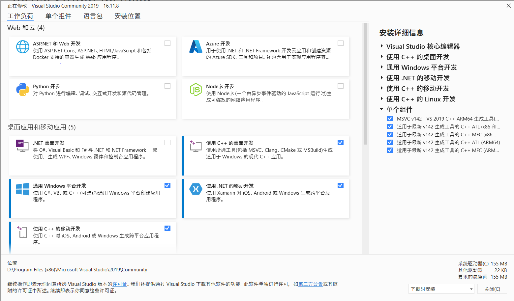
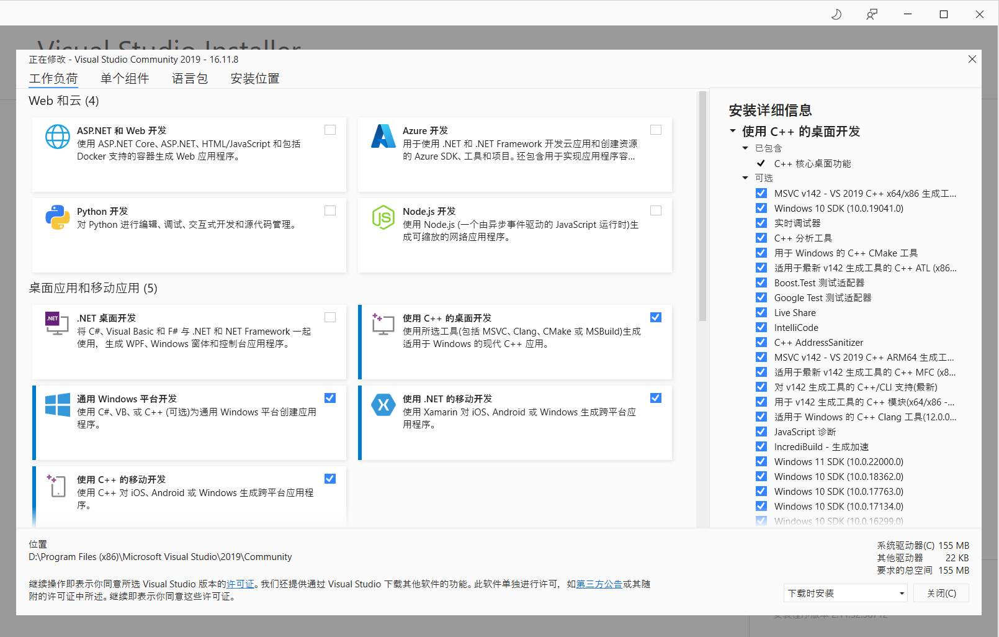
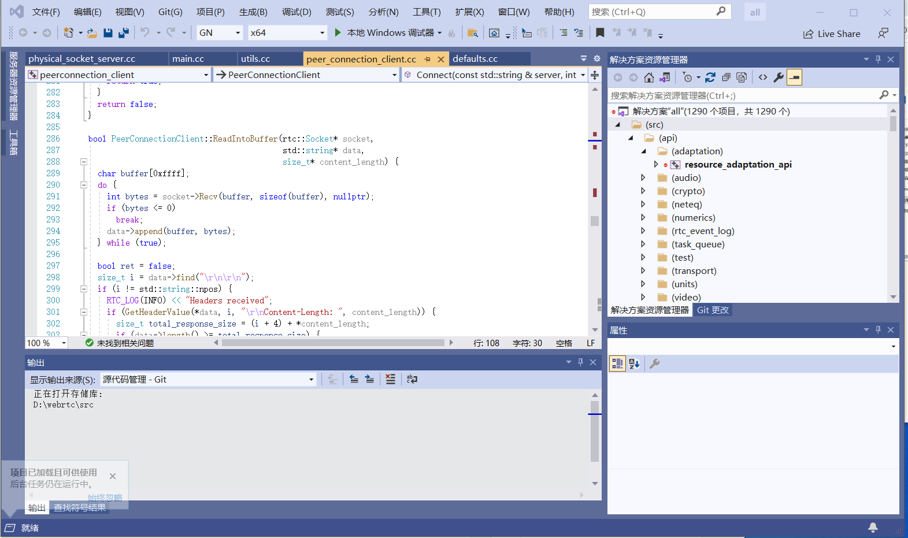

Windows 平台编译 WebRTC 的过程，包括安装依赖的开发工具等，主要要参考 chromium 浏览器的 Windows 平台编译文档，[Checking out and Building Chromium for Windows](https://chromium.googlesource.com/chromium/src/+/main/docs/windows_build_instructions.md)。这里编译 WebRTC 的 M96 版。
<!--more-->
## 系统要求

 * 具有至少 8GB 内存的 64 位 Intel 机器。强烈建议内存大于 16GB。
 * 至少 100GB 的空余磁盘空间，且用 NTFS 格式化的分区。不能用 FAT32，因为某些 Git 打包文件可能大于 4GB。
 * 一个合适版本的 Visual Studio，如下面的描述。
 * Windows 10 或更新的 Windows 系统。

## 设置 Windows
### Visual Studio
Chromium/WebRTC 需要 [Visual Studio 2017](https://docs.microsoft.com/en-us/visualstudio/releasenotes/vs2017-relnotes) (>=15.7.2) 来编译，但  [Visual Studio 2019](https://docs.microsoft.com/en-us/visualstudio/releases/2019/release-notes) (>=16.0.0) 更好。 Visual Studio 也可以被用于调试 Chromium，但版本 2019 更好是由于它处理 Chromium 巨大的调试信息做的更好。尽管使用了 clang-cl 编译器，但 Visual Studio 的头文件、库，及一些工具会被用到。如果 Visual Studio 社区版Visual Studio Community Edition 的许可证合适，用它就可以了。

在 [Visual Studio 官网](https://visualstudio.microsoft.com/zh-hans/) 可以找到[下载页面](https://visualstudio.microsoft.com/zh-hans/downloads/)，在最新版的下载信息左下角有个 “发行说明”：


点开 “发行说明”，可以看到所有版本的发行说明：


点开 Visual Studio 2019 的 “当前发行说明” 页可以看到 Visual Studio 2019 的下载地址：


必须安装 “Desktop development with C++” 组件，及  “MFC/ATL support” 子组件。这可以通过在命令行上给 Visual Studio 安装器传递参数来实现（参考下面 ARM64 指导）：
```
$ PATH_TO_INSTALLER.EXE ^
--add Microsoft.VisualStudio.Workload.NativeDesktop ^
--add Microsoft.VisualStudio.Component.VC.ATLMFC ^
--includeRecommended
```

如果想要给 ARM64 Win32 编译，则需要一些额外的参数。完整的命令行参数如下：
```
$ PATH_TO_INSTALLER.EXE ^
--add Microsoft.VisualStudio.Workload.NativeDesktop ^
--add Microsoft.VisualStudio.Component.VC.ATLMFC ^
--add Microsoft.VisualStudio.Component.VC.Tools.ARM64 ^
--add Microsoft.VisualStudio.Component.VC.MFC.ARM64 ^
--includeRecommended
```

还必须安装版本 10.0.19041 或更高版本的 [Windows 10 SDK](https://developer.microsoft.com/en-us/windows/downloads/sdk-archive/)。这可以通过单独安装，或选中 Visual Studio Installer 中适当的选项来实现。如我们上面下载的 Visual Studio 2019 社区版的安装器为 `vs_community__de2da9e0d3114609b6724eaa8f0e96c4.exe`，打开 Windows PowerShell，切换到安装器的下载目录，并输入如下命令：
```
PS D:\Users\asdfgh\Downloads> ./vs_community__de2da9e0d3114609b6724eaa8f0e96c4.exe  --add Microsoft.VisualStudio.Workload.NativeDesktop --add Microsoft.VisualStudio.Component.VC.ATLMFC --add Microsoft.VisualStudio.Component.VC.Tools.ARM64 --add Microsoft.VisualStudio.Component.VC.MFC.ARM64 --includeRecommended
```

打开 Visual Studio Installer，选中所有需要安装的依赖：



我这里安装了 “Desktop development with C++” 组件下的所有子组件，包括各种版本的 [Windows 10 SDK](https://developer.microsoft.com/en-us/windows/downloads/sdk-archive/)：


将 Visual Studio 安装在 C: 盘是一个比较方便的选择，但一般来说，C: 盘空间比较有限，我这里将 Visual Studio 安装在了 D: 盘。这种安装位置的非默认安装位置的改变，后面需要专门做一些额外的配置。

SDK Debugging Tools 也必须安装。如果 Windows 10 SDK 是通过 Visual Studio installer 安装的，则可以通过如下步骤安装：控制面板 → 程序 → 程序和功能 → 选择 “Windows Software Development Kit” （对应版本） → 鼠标右键单击，选择 “更改” → 更改 → 选中  “Debugging Tools For Windows” → Change。或者也可以下载单独的 SDK 安装器并使用它安装 Debugging Tools。

### 安装 depot_tools

下载 [depot_tools 包](https://storage.googleapis.com/chrome-infra/depot_tools.zip) 并将它解压到某个位置。

> 警告：**不要** 使用 drag-n-drop 或从 Explorer copy-n-paste，这可能不会提取隐藏的 “.git” 目录，这对 depot_tools 自身的自动更新是必须的。可以使用 “Extract all…”。

将 depot_tools 的路径添加到 PATH 环境变量的前面（必须在安装的 Python 的路径的前面）。假设将 depot_tools 包解压在了 `C:\src\depot_tools`，则打开：
右键单击 “此电脑” → 属性 → 高级系统设置 → 环境变量

如果有管理员权限，则修改 PATH 环境变量，并将 `C:\src\depot_tools` 放在前面（至少也要把它放在安装了 Python 或 Git 的目录的前面）。

如果没有管理员权限，可以添加一个用户级 PATH 环境变量，并把 `C:\src\depot_tools` 放在前面，如果你的系统 PATH 环境变量有 Python 的路径，就有点背了。

然后，还需要以相同方式添加一个 DEPOT_TOOLS_WIN_TOOLCHAIN 系统环境变量，并把它设置为 0。这告诉 depot_tools 使用本地安装的 Visual Studio 版本（默认情况下，depot_tools 将尝试使用一个 Google 内部的版本）。

可能还需要添加环境变量 `vs2017_install` 或 `vs2019_install` 或 `vs2022_install` 指向安装的 Visual Studio 2017 或 19 或 22，如对于 Visual Studio 2019 设置 `set vs2019_install=C:\Program Files (x86)\Microsoft Visual Studio\2019\Professional`，对于 Visual Studio 2022 设置 `set vs2022_install=C:\Program Files\Microsoft Visual Studio\2022\Professional`。

然后从 cmd.exe 命令行，运行：
```
$ gclient
```

在第一次运行时，gclient 将会安装所有 Windows 特有的与代码一起工作的东西，包括 msysgit 和 python。

 * 如果从一个 非 cmd shell （如，cygwin，PowerShell）运行 gclient，它可能看上去正常运行了，但 msysgit，python 和其它工具可能不会被正确安装。
 * 如果你在第一次运行 gclient 时看到了关于文件系统的奇怪的错误，可能想要 [禁用 Windows Indexing](http://tortoisesvn.tigris.org/faq.html#cantmove2)。

## 获取代码

创建一个工作目录，在命令行中切换到该目录，并运行 `fetch webrtc`：
```
$ mkdir webrtc-checkout
$ cd webrtc-checkout
$ fetch --nohooks webrtc
$ gclient sync
```

在同步代码期间，需要接受 Google Play Services SDK 的许可协议。这个过程时间有点长。

## 构建

[Ninja](https://ninja-build.org/) 是所有平台的默认构建系统。

### 生成 Ninja 工程文件

Ninja工程文件通过 [GN](https://gn.googlesource.com/gn/+/master/README.md)生成，由于我们需要使用 Visual Studio 进行代码编辑调试等，所以使用 GN 生成 Ninja 工程时需要配置 `--ide=vs` 生成 Visual Studio 的工程文件。通过如下命令生成工程文件（Debug 编译，工程文件位于`out\Default`目录下）：
```
PS D:\> cd .\webrtc\src
PS D:\webrtc\src> gn gen --ide=vs out/Default
```

上面的 `vs2017_install` 或 `vs2019_install` 或 `vs2022_install` 这些环境变量不设置的话，这里在执行 `gn gen` 时会报错：
```
PS D:\webrtc\src> gn gen .\out\Default\
Traceback (most recent call last):
  File "D:/webrtc/src/build/vs_toolchain.py", line 573, in <module>
    sys.exit(main())
  File "D:/webrtc/src/build/vs_toolchain.py", line 569, in main
    return commands[sys.argv[1]](*sys.argv[2:])
  File "D:/webrtc/src/build/vs_toolchain.py", line 546, in GetToolchainDir
    runtime_dll_dirs = SetEnvironmentAndGetRuntimeDllDirs()
  File "D:/webrtc/src/build/vs_toolchain.py", line 106, in SetEnvironmentAndGetRuntimeDllDirs
    os.environ['GYP_MSVS_OVERRIDE_PATH'] = DetectVisualStudioPath()
  File "D:/webrtc/src/build/vs_toolchain.py", line 197, in DetectVisualStudioPath
    version_as_year = GetVisualStudioVersion()
  File "D:/webrtc/src/build/vs_toolchain.py", line 186, in GetVisualStudioVersion
    raise Exception('No supported Visual Studio can be found.'
Exception: No supported Visual Studio can be found. Supported versions are: 16.0 (2019), 15.0 (2017).
ERROR at //build/config/win/visual_studio_version.gni:27:7: Script returned non-zero exit code.
      exec_script("../../vs_toolchain.py", [ "get_toolchain_dir" ], "scope")
      ^----------
Current dir: D:/webrtc/src/out/Default/
Command: D:/tools/depot_tools/bootstrap-2@3_8_10_chromium_23_bin/python3/bin/python3.exe D:/webrtc/src/build/vs_toolchain.py get_toolchain_dir
Returned 1.
See //build/toolchain/win/BUILD.gn:9:1: whence it was imported.
import("//build/config/win/visual_studio_version.gni")
^----------------------------------------------------
See //BUILD.gn:30:3: which caused the file to be included.
  group("default") {
  ^-----------------
```

GN 构建系统的 Python 脚本报错说，找不到支持 Visual Studio，报错的这段 Python 脚本代码位于 `D:/webrtc/src/build/vs_toolchain.py`，如：
```
def GetVisualStudioVersion():
  """Return best available version of Visual Studio.
  """
  supported_versions = list(MSVS_VERSIONS.keys())

  # VS installed in depot_tools for Googlers
  if bool(int(os.environ.get('DEPOT_TOOLS_WIN_TOOLCHAIN', '1'))):
    return supported_versions[0]

  # VS installed in system for external developers
  supported_versions_str = ', '.join('{} ({})'.format(v,k)
      for k,v in MSVS_VERSIONS.items())
  available_versions = []
  for version in supported_versions:
    # Checking vs%s_install environment variables.
    # For example, vs2019_install could have the value
    # "C:\Program Files (x86)\Microsoft Visual Studio\2019\Community".
    # Only vs2017_install and vs2019_install are supported.
    path = os.environ.get('vs%s_install' % version)
    if path and os.path.exists(path):
      available_versions.append(version)
      break
    # Detecting VS under possible paths.
    path = os.path.expandvars('%ProgramFiles(x86)%' +
                              '/Microsoft Visual Studio/%s' % version)
    if path and any(
        os.path.exists(os.path.join(path, edition))
        for edition in ('Enterprise', 'Professional', 'Community', 'Preview',
                        'BuildTools')):
      available_versions.append(version)
      break

  if not available_versions:
    raise Exception('No supported Visual Studio can be found.'
                    ' Supported versions are: %s.' % supported_versions_str)
  return available_versions[0]
```

构建系统的 Python 脚本在不设置 `vs2017_install` 或 `vs2019_install` 或 `vs2022_install` 这些环境变量时，会在 C: 盘找安装的 Visual Studio，由于我们的 Visual Studio 没有安装在默认位置，导致这里报错。这段代码也向我们指示了解决这个问题的方法，即设置 `vs2017_install` 或 `vs2019_install` 或 `vs2022_install` 这些环境变量中的一个。

在设置了环境变量之后，重启命令行之后设置才会生效。

设置了 `vs2019_install` 环境变量之后，遇到了另外一个错误：
```
PS D:\webrtc\src> gn gen .\out\Default\
Traceback (most recent call last):
  File "D:/webrtc/src/build/vs_toolchain.py", line 573, in <module>
    sys.exit(main())
  File "D:/webrtc/src/build/vs_toolchain.py", line 569, in main
    return commands[sys.argv[1]](*sys.argv[2:])
  File "D:/webrtc/src/build/vs_toolchain.py", line 547, in GetToolchainDir
    win_sdk_dir = SetEnvironmentAndGetSDKDir()
  File "D:/webrtc/src/build/vs_toolchain.py", line 540, in SetEnvironmentAndGetSDKDir
    return NormalizePath(os.environ['WINDOWSSDKDIR'])
  File "D:\tools\depot_tools\bootstrap-2@3_8_10_chromium_23_bin\python3\bin\lib\os.py", line 675, in __getitem__
    raise KeyError(key) from None
KeyError: 'WINDOWSSDKDIR'
ERROR at //build/config/win/visual_studio_version.gni:27:7: Script returned non-zero exit code.
      exec_script("../../vs_toolchain.py", [ "get_toolchain_dir" ], "scope")
      ^----------
Current dir: D:/webrtc/src/out/Default/
Command: D:/tools/depot_tools/bootstrap-2@3_8_10_chromium_23_bin/python3/bin/python3.exe D:/webrtc/src/build/vs_toolchain.py get_toolchain_dir
Returned 1.
See //build/toolchain/win/BUILD.gn:9:1: whence it was imported.
import("//build/config/win/visual_studio_version.gni")
^----------------------------------------------------
See //BUILD.gn:30:3: which caused the file to be included.
  group("default") {
  ^-----------------
```

这段报错是说，找不到 Windows 10 SDK，这个报错也是由于我们在非标准位置安装 Visual Studio 和 Windows 10 SDK 引起的，抛出这段错误的 Python 脚本代码同样位于 `D:/webrtc/src/build/vs_toolchain.py`：
```
def SetEnvironmentAndGetSDKDir():
  """Gets location information about the current sdk (must have been
  previously updated by 'update'). This is used for the GN build."""
  SetEnvironmentAndGetRuntimeDllDirs()

  # If WINDOWSSDKDIR is not set, search the default SDK path and set it.
  if not 'WINDOWSSDKDIR' in os.environ:
    default_sdk_path = os.path.expandvars('%ProgramFiles(x86)%'
                                          '\\Windows Kits\\10')
    if os.path.isdir(default_sdk_path):
      os.environ['WINDOWSSDKDIR'] = default_sdk_path

  return NormalizePath(os.environ['WINDOWSSDKDIR'])
```

这段代码在环境变量和默认的 C: 盘寻找 Windows 10 SDK 的安装位置，找不到时就会报错。这段代码告诉我们，应该设置 `WINDOWSSDKDIR` 环境变量来解决这个问题。

如果需要 Release 编译，通过如下命令生成工程文件：
```
PS D:\webrtc\src> gn gen --ide=vs out/Default --args="is_debug=false"
```

> 如果不想使用默认编译参数，可以使用 `gn args out/Default --list` 查看当前编译参数，通过类似如下方式设置：
```
PS D:\webrtc\src> gn gen --ide=vs out/Default --args="use_rtti=true is_clang=false rtc_build_tools=false rtc_include_tests=false rtc_build_examples=false"
```

`gn gen` 在 `args.gn` 文件不存在时，会生成这个文件，并将配置参数写入这个文件，随后生成 ninja 所需的文件。要对编译做配置，也可以不在命令行参数中加这些编译参数，而是直接改 `D:\webrtc\src\out\Default\args.gn` 文件，如将文件的内容改为下面这样：
```
is_debug = true
use_rtti=true
is_clang=false
rtc_build_tools=false
rtc_include_tests=false
rtc_build_examples=false
```

### 编译
生成工程文件后，就可以在 src 目录下执行编译命令：
```
PS D:\webrtc\src> ninja -C .\out\Default\
```

编译生成：


用 Visual Studio 2019 打开：


可以通过 Visual Studio 调试编译出来的各种可执行文件。

### 代码更新

后续如果需要更新代码，则可按照如下步骤执行：
```
PS D:\webrtc\src> git checkout master
PS D:\webrtc\src> git pull origin master
PS D:\webrtc\src> gclient sync
```

然后参考前面步骤重新生成工程文件，编译即可。

### 引用 WebRTC 库
WebRTC 编译后会在 `src\out\Default\obj` 目录下生成整个 WebRTC 工程的静态库：webrtc.lib，链接下这个就可以了，需要的头文件可以在 `src\api` 目录下找。

> 如果 Visual Studio 应用没配置 Clang 编译器，链接这个 webrtc.lib，生成工程文件时需要配置如下参数：`gn gen --ide=vs out/Default --args="is_clang=false use_lld=false"`，禁用 clang 与 lld。

参考文档：
[WebRTC development](https://webrtc.googlesource.com/src/+/main/docs/native-code/development/index.md)
[Checking out and Building Chromium for Windows](https://chromium.googlesource.com/chromium/src/+/main/docs/windows_build_instructions.md)
[Windows平台WebRTC编译（持续更新）](https://blog.jianchihu.net/windows-webrtc-build.html)
[Getting Started with WinRTC](https://docs.microsoft.com/en-us/winrtc/getting-started)

Done
