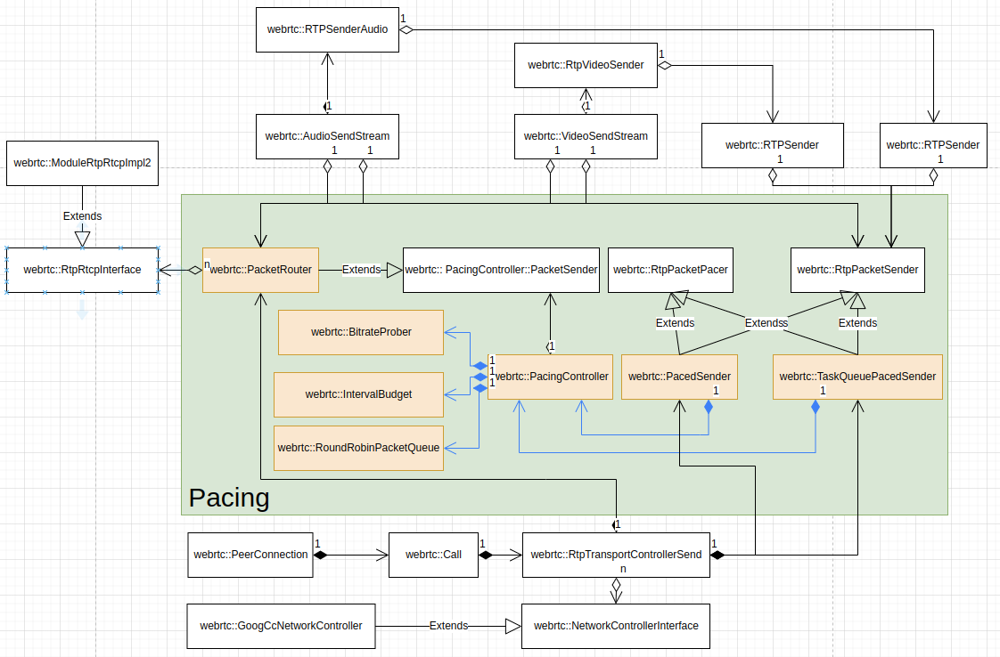
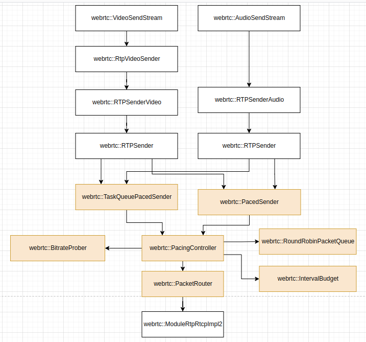
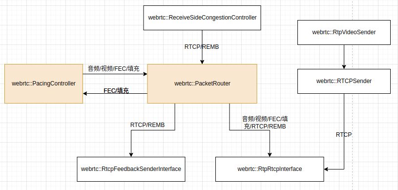

WebRTC 的平滑发送 pacer 模块用于更有节奏地发送音视频媒体数据及音视频媒体传输控制数据，更具体地说，由于音频数据包大多比较小，一般不会超过 MTU，因而 pacer 模块主要用于控制视频数据包的发送。WebRTC 官方有一份文档对 pacer 的背景及主要设计思路做了简要介绍，其中文版翻译可以参考 [WebRTC 的平滑发送](https://github.com/hanpfei/OpenRTCClient/blob/m98_4758/docs/webrtc_pacer.md)。这里分析 WebRTC pacer 模块的实现。
<!--more-->
## Pacer 在 WebRTC 模块结构中的位置

在 WebRTC 中，`PeerConnection` 是用于传输媒体流、数据流和控制数据包的连接的抽象，`webrtc::Call` 对象属于 `PeerConnection`。`webrtc::PeerConnectionFactory` 在创建 `PeerConnection` 对象时，会为其创建 `webrtc::Call` 对象。`webrtc::Call` 对象创建时，会创建 `webrtc::RtpTransportControllerSend` 对象。`webrtc::RtpTransportControllerSend` 管理 `PeerConnection` 的 RTP 传输控制，包括管理 `PacedSender`、`PacketRouter` 和 CC 等模块。`PacedSender` 是 pacer 模块的入口，接收音视频 RTP 数据包和 pacer 发送控制参数；`PacketRouter` 则是 pacer 模块的出口，音视频 RTP 数据包从这里流出到后面的传输模块。`PacedSender` 有两个实现，一个是 `webrtc::PacedSender`，另一个是 `webrtc::TaskQueuePacedSender`，具体采用的 `PacedSender` 实现可以通过配置选项配置， 默认采用的 `PacedSender` 实现为 `webrtc::TaskQueuePacedSender`。

`webrtc::TaskQueuePacedSender` 对象的创建过程（`webrtc/modules/pacer/task_queue_paced_sender.cc`）如下：

```
#0  webrtc::TaskQueuePacedSender::TaskQueuePacedSender (this=0x61a000017480, clock=0x602000003b90, packet_sender=0x61c000060108, event_log=0x613000011300, 
    field_trials=0x602000002110, task_queue_factory=0x6020000020d0, max_hold_back_window=..., max_hold_back_window_in_packets=-1)
    at webrtc/modules/pacer/task_queue_paced_sender.cc:24
#1  webrtc::RtpTransportControllerSend::RtpTransportControllerSend (this=0x61c000060080, clock=0x602000003b90, event_log=0x613000011300, 
    predictor_factory=0x0, controller_factory=0x0, bitrate_config=..., process_thread=..., task_queue_factory=0x6020000020d0, trials=0x602000002110)
    at webrtc/call/rtp_transport_controller_send.cc:111
#3  webrtc::RtpTransportControllerSendFactory::Create (this=0x602000002450, config=..., clock=0x602000003b90, process_thread=...)
    at webrtc/call/rtp_transport_controller_send_factory.h:28
#4  webrtc::CallFactory::CreateCall (this=0x60b000005840, config=...) at webrtc/call/call_factory.cc:110
#5  webrtc::PeerConnectionFactory::CreateCall_w (this=0x60b000005d10, event_log=0x613000011300)
    at webrtc/pc/peer_connection_factory.cc:351
#6  webrtc::PeerConnectionFactory::CreatePeerConnectionOrError(webrtc::PeerConnectionInterface::RTCConfiguration const&, webrtc::PeerConnectionDependencies)::$_3::operator()() const (this=0x7ffff3709430) at webrtc/pc/peer_connection_factory.cc:247
```

`webrtc::AudioSendStream` 和 `webrtc::VideoSendStream` 从 `webrtc::RtpTransportControllerSend` 获得 `PacedSender`，并分别通过 `webrtc::RTPSenderAudio` 和 `webrtc::RtpVideoSender`/`webrtc::RTPSenderVideo`，把 `PacedSender` 和 pacer 逻辑接进整个音视频媒体数据发送处理流水线。`webrtc::AudioSendStream` 和 `webrtc::VideoSendStream` 从 `webrtc::RtpTransportControllerSend` 获得 `webrtc::PacketRouter`，并把 RTP/RTCP 模块及 `webrtc::Transport` 接进 `webrtc::PacketRouter`，把传输逻辑接进 pacer。Pacer 主要用于执行发送控制，它不直接执行网络数据传输操作。

`webrtc::AudioReceiveStream`/`webrtc::VideoReceiveStream` 通过从 `webrtc::RtpTransportControllerSend` 获得 `webrtc::PacketRouter`，把接收端各个媒体流的反馈消息发送通道 RTP/RTCP 模块及 `webrtc::Transport` 接进 pacer。

`webrtc::Call` 对象属于 PeerConnection，由其管理的 `webrtc::RtpTransportControllerSend` 和 pacer 也属于 PeerConnection。特定 PeerConnection 的所有音频流和视频流共用相同的 pacer 对象。

音频数据包发送过程如下：
```
#0  webrtc::TaskQueuePacedSender::EnqueuePackets(std::vector<std::unique_ptr<webrtc::RtpPacketToSend, std::default_delete<webrtc::RtpPacketToSend> >, std::allocator<std::unique_ptr<webrtc::RtpPacketToSend, std::default_delete<webrtc::RtpPacketToSend> > > >) (this=0x61a000017480, packets=std::vector of length 1, capacity 1 = {...})
    at webrtc/modules/pacer/task_queue_paced_sender.cc:130
#1  webrtc::voe::(anonymous namespace)::RtpPacketSenderProxy::EnqueuePackets(std::vector<std::unique_ptr<webrtc::RtpPacketToSend, std::default_delete<webrtc::RtpPacketToSend> >, std::allocator<std::unique_ptr<webrtc::RtpPacketToSend, std::default_delete<webrtc::RtpPacketToSend> > > >)
    (this=0x60e000007d60, packets=std::vector of length 0, capacity 0) at webrtc/audio/channel_send.cc:267
#2  webrtc::RTPSender::SendToNetwork(std::unique_ptr<webrtc::RtpPacketToSend, std::default_delete<webrtc::RtpPacketToSend> >)
    (this=0x61b0000066c0, packet=std::unique_ptr<webrtc::RtpPacketToSend> = {...}) at webrtc/modules/rtp_rtcp/source/rtp_sender.cc:491
#3  webrtc::RTPSenderAudio::SendAudio(webrtc::AudioFrameType, signed char, unsigned int, unsigned char const*, unsigned long, long)
    (this=0x614000011a40, frame_type=webrtc::AudioFrameType::kAudioFrameSpeech, payload_type=111 'o', rtp_timestamp=3800543004, payload_data=0x6110000aa040 "x", payload_size=66, absolute_capture_timestamp_ms=-1) at webrtc/modules/rtp_rtcp/source/rtp_sender_audio.cc:316
#4  webrtc::voe::(anonymous namespace)::ChannelSend::SendRtpAudio(webrtc::AudioFrameType, unsigned char, unsigned int, rtc::ArrayView<unsigned char const, -4711l>, long)
    (this=0x61600005a080, frameType=webrtc::AudioFrameType::kAudioFrameSpeech, payloadType=111 'o', rtp_timestamp=0, payload=..., absolute_capture_timestamp_ms=-1)
    at webrtc/audio/channel_send.cc:439
#5  webrtc::voe::(anonymous namespace)::ChannelSend::SendData(webrtc::AudioFrameType, unsigned char, unsigned int, unsigned char const*, unsigned long, long)
    (this=0x61600005a080, frameType=webrtc::AudioFrameType::kAudioFrameSpeech, payloadType=111 'o', rtp_timestamp=0, payloadData=0x6110000aa040 "x", payloadSize=66, absolute_capture_timestamp_ms=-1) at webrtc/audio/channel_send.cc:367
```

视频数据包发送过程如下：
```
#0  webrtc::TaskQueuePacedSender::EnqueuePackets(std::vector<std::unique_ptr<webrtc::RtpPacketToSend, std::default_delete<webrtc::RtpPacketToSend> >, std::allocator<std::unique_ptr<webrtc::RtpPacketToSend, std::default_delete<webrtc::RtpPacketToSend> > > >) (this=0x61a000017480, packets=std::vector of length 1, capacity 1 = {...})
    at webrtc/modules/pacer/task_queue_paced_sender.cc:130
#1  webrtc::RTPSender::EnqueuePackets(std::vector<std::unique_ptr<webrtc::RtpPacketToSend, std::default_delete<webrtc::RtpPacketToSend> >, std::allocator<std::unique_ptr<webrtc::RtpPacketToSend, std::default_delete<webrtc::RtpPacketToSend> > > >) (this=0x61b0000727c0, packets=std::vector of length 0, capacity 0)
    at webrtc/modules/rtp_rtcp/source/rtp_sender.cc:509
#2  webrtc::RTPSenderVideo::LogAndSendToNetwork(std::vector<std::unique_ptr<webrtc::RtpPacketToSend, std::default_delete<webrtc::RtpPacketToSend> >, std::allocator<std::unique_ptr<webrtc::RtpPacketToSend, std::default_delete<webrtc::RtpPacketToSend> > > >, unsigned long)
    (this=0x61a000064e80, packets=std::vector of length 0, capacity 0, unpacketized_payload_size=958)
    at webrtc/modules/rtp_rtcp/source/rtp_sender_video.cc:210
#3  webrtc::RTPSenderVideo::SendVideo(int, absl::optional<webrtc::VideoCodecType>, unsigned int, long, rtc::ArrayView<unsigned char const, -4711l>, webrtc::RTPVideoHeader, absl::optional<long>)
    (this=0x61a000064e80, payload_type=102, codec_type=..., rtp_timestamp=1316507095, capture_time_ms=202856794, payload=..., video_header=..., expected_retransmission_time_ms=...) at webrtc/modules/rtp_rtcp/source/rtp_sender_video.cc:732
#4  webrtc::RTPSenderVideo::SendEncodedImage(int, absl::optional<webrtc::VideoCodecType>, unsigned int, webrtc::EncodedImage const&, webrtc::RTPVideoHeader, absl::optional<long>)
    (this=0x61a000064e80, payload_type=102, codec_type=..., rtp_timestamp=1316507095, encoded_image=..., video_header=..., expected_retransmission_time_ms=...)
    at webrtc/modules/rtp_rtcp/source/rtp_sender_video.cc:774
#5  webrtc::RtpVideoSender::OnEncodedImage(webrtc::EncodedImage const&, webrtc::CodecSpecificInfo const*)
    (this=0x6160000b0180, encoded_image=..., codec_specific_info=0x7fffd4f01f10) at webrtc/call/rtp_video_sender.cc:600
#6  webrtc::internal::VideoSendStreamImpl::OnEncodedImage(webrtc::EncodedImage const&, webrtc::CodecSpecificInfo const*)
    (this=0x61e00001dc30, encoded_image=..., codec_specific_info=0x7fffd4f01f10) at webrtc/video/video_send_stream_impl.cc:566
#7  webrtc::internal::VideoSendStreamImpl::OnEncodedImage(webrtc::EncodedImage const&, webrtc::CodecSpecificInfo const*) ()
    at webrtc/rtc_base/task_utils/repeating_task.h:137
#8  webrtc::VideoStreamEncoder::OnEncodedImage(webrtc::EncodedImage const&, webrtc::CodecSpecificInfo const*)
    (this=0x62200002a100, encoded_image=..., codec_specific_info=0x7fffd4f01f10) at webrtc/video/video_stream_encoder.cc:1904
#9  webrtc::VideoStreamEncoder::OnEncodedImage(webrtc::EncodedImage const&, webrtc::CodecSpecificInfo const*) ()
    at webrtc/rtc_base/task_queue.h:114
#10 webrtc::H264EncoderImpl::Encode(webrtc::VideoFrame const&, std::vector<webrtc::VideoFrameType, std::allocator<webrtc::VideoFrameType> > const*) (this=0x6170000fff80, input_frame=..., frame_types=0x62200002a8b8) at webrtc/modules/video_coding/codecs/h264/h264_encoder_impl.cc:522
#11 webrtc::EncoderSimulcastProxy::Encode(webrtc::VideoFrame const&, std::vector<webrtc::VideoFrameType, std::allocator<webrtc::VideoFrameType> > const*) (this=0x60b000035830, input_image=..., frame_types=0x62200002a8b8) at webrtc/media/engine/encoder_simulcast_proxy.cc:53
#12 webrtc::VideoStreamEncoder::EncodeVideoFrame(webrtc::VideoFrame const&, long)
    (this=0x62200002a100, video_frame=..., time_when_posted_us=202856794824) at webrtc/video/video_stream_encoder.cc:1760
#13 webrtc::VideoStreamEncoder::MaybeEncodeVideoFrame(webrtc::VideoFrame const&, long)
    (this=0x62200002a100, video_frame=..., time_when_posted_us=202856794824) at webrtc/video/video_stream_encoder.cc:1619
#14 webrtc::VideoStreamEncoder::OnFrame(webrtc::Timestamp, int, webrtc::VideoFrame const&)
    (this=0x62200002a100, post_time=..., frames_scheduled_for_processing=1, video_frame=...) at webrtc/video/video_stream_encoder.cc:1316
#15 webrtc::VideoStreamEncoder::CadenceCallback::OnFrame(webrtc::Timestamp, int, webrtc::VideoFrame const&)
    (this=0x62200002a1d8, post_time=..., frames_scheduled_for_processing=1, frame=...) at webrtc/video/video_stream_encoder.h:152
#16 webrtc::(anonymous namespace)::PassthroughAdapterMode::OnFrame(webrtc::Timestamp, int, webrtc::VideoFrame const&)
    (this=0x61500007b028, post_time=..., frames_scheduled_for_processing=1, frame=...) at webrtc/video/frame_cadence_adapter.cc:64
#17 webrtc::(anonymous namespace)::FrameCadenceAdapterImpl::OnFrameOnMainQueue(webrtc::Timestamp, int, webrtc::VideoFrame const&)
    (this=0x61500007b000, post_time=..., frames_scheduled_for_processing=1, frame=...) at webrtc/video/frame_cadence_adapter.cc:269
#18 webrtc::(anonymous namespace)::FrameCadenceAdapterImpl::OnFrame(webrtc::VideoFrame const&)::$_0::operator()() const (this=0x6110000b0808)
    at webrtc/video/frame_cadence_adapter.cc:245
```

从上面音频数据包和视频包发送过程的调用堆栈中各个对象的 this 指针可以看到，同一个 `PeerConnection` 的音频数据包发送和视频数据包发送走相同的 pacer。

从 `PacedSender` 对象的创建和音视频数据包的发送过程，可以看到 pacer 相关的类组件结构大体如下图所示：



Pacer 模块的数据和控制入口是 `webrtc::PacedSender`/`webrtc::TaskQueuePacedSender`，数据出口为 `webrtc::PacketRouter`，整个 pacer 模块实现的中心为 `webrtc::PacerController`。`webrtc::PacedSender`/`webrtc::TaskQueuePacedSender` 采用了控制面和数据面分离的设计，它们都继承了 `webrtc::RtpPacketPacer` 和 `webrtc::RtpPacketSender` 接口，这两个接口分别定义了控制接口和数据接口。

`webrtc::RtpPacketPacer` 接口的定义（位于 `webrtc/modules/pacer/rtp_packet_pacer.h`）如下：

```
namespace webrtc {

class RtpPacketPacer {
 public:
  virtual ~RtpPacketPacer() = default;

  virtual void CreateProbeCluster(DataRate bitrate, int cluster_id) = 0;

  // Temporarily pause all sending.
  virtual void Pause() = 0;

  // Resume sending packets.
  virtual void Resume() = 0;

  virtual void SetCongestionWindow(DataSize congestion_window_size) = 0;
  virtual void UpdateOutstandingData(DataSize outstanding_data) = 0;

  // Sets the pacer rates. Must be called once before packets can be sent.
  virtual void SetPacerRates(DataRate pacer_rate, DataRate padding_rate) = 0;

  // Time since the oldest packet currently in the queue was added.
  virtual TimeDelta OldestPacketWaitTime() const = 0;

  // Sum of payload + padding bytes of all packets currently in the pacer queue.
  virtual DataSize QueueSizeData() const = 0;

  // Returns the time when the first packet was sent.
  virtual absl::optional<Timestamp> FirstSentPacketTime() const = 0;

  // Returns the expected number of milliseconds it will take to send the
  // current packets in the queue, given the current size and bitrate, ignoring
  // priority.
  virtual TimeDelta ExpectedQueueTime() const = 0;

  // Set the average upper bound on pacer queuing delay. The pacer may send at
  // a higher rate than what was configured via SetPacerRates() in order to
  // keep ExpectedQueueTimeMs() below `limit_ms` on average.
  virtual void SetQueueTimeLimit(TimeDelta limit) = 0;

  // Currently audio traffic is not accounted by pacer and passed through.
  // With the introduction of audio BWE audio traffic will be accounted for
  // the pacer budget calculation. The audio traffic still will be injected
  // at high priority.
  virtual void SetAccountForAudioPackets(bool account_for_audio) = 0;
  virtual void SetIncludeOverhead() = 0;
  virtual void SetTransportOverhead(DataSize overhead_per_packet) = 0;
};

}  // namespace webrtc
```

这里可以看到，能对 pacer 模块施加的控制包括配置拥塞窗口大小等。

`webrtc::RtpPacketSender` 接口的定义（位于 `webrtc/modules/rtp_rtcp/include/rtp_packet_sender.h`）如下：

```
namespace webrtc {

class RtpPacketSender {
 public:
  virtual ~RtpPacketSender() = default;

  // Insert a set of packets into queue, for eventual transmission. Based on the
  // type of packets, they will be prioritized and scheduled relative to other
  // packets and the current target send rate.
  virtual void EnqueuePackets(
      std::vector<std::unique_ptr<RtpPacketToSend>> packets) = 0;
};

}  // namespace webrtc
```

`webrtc::RtpPacketSender` 接口的定义位于 `rtp_rtcp` 模块，pacer 模块通过实现这个接口，可以方便地被接进 `rtp_rtcp` 模块。Pacer 模块的使用者（如 `webrtc::AudioSendStream` 和 `webrtc::VideoSendStream` 及其 `webrtc::RTPSenderAudio` 和 `webrtc::RtpVideoSender`/`webrtc::RTPSenderVideo`）通过这个接口将 RTP 包送进 pacer 模块中，由 pacer 模块平滑地发送出去。

Pacer 模块的使用者（如 `webrtc::RtpTransportControllerSend`）通过 `webrtc::RtpPacketPacer` 接口控制 pacer 模块平滑发送过程中所需的参数，如拥塞窗口大小，初始发送码率等。

Pacer 模块通过注册进来的 `webrtc::RtpRtcpInterface` 和 `webrtc::RtcpFeedbackSenderInterface` 接口将媒体和控制数据包发送出去。`webrtc::RtpRtcpInterface` 和 `webrtc::RtcpFeedbackSenderInterface` 接口的实现对象被注册给 `webrtc::PacketRouter`，媒体数据包经过发送调节，从 `webrtc::PacketRouter` 流出到 `webrtc::RtpRtcpInterface` 和 `webrtc::RtcpFeedbackSenderInterface`。`webrtc::PacketRouter` 类继承了 `webrtc::PacerController::PacketSender`，一个纯粹的 pacer 模块的内部接口。

再来看下 pacer 在 webrtc 的数据流中的位置：



其中的 `webrtc::PacedSender` 和 `webrtc::TaskQueuePacedSender` 不同时出现。

**Pacer 模块的接口设计的并不是很干净。纯粹的 pacer 模块的内部接口大量地暴露给 `webrtc::PacketRouter` 的引用者，`webrtc::PacketRouter` 的许多本应作为整个 pacer 模块接口的接口函数并没有被定义接口。有两种改进方法：**
                                                                                                                                                                                                                                                                                                                                                                                                                                                                                                                                                                                                                                                                                                                                                                                                                                                                                                                                                                                                                                                                                                                                                                                                                                                                                                                                                                                                                                                                                                                                                                
**1. 将 `webrtc::PacketRouter` 的几个添加/删除 `webrtc::RtpRtcpInterface` 对象的接口放进 `webrtc::RtpPacketPacer`，整个 pacer 模块保持一个干净的对外接口类。`webrtc::PacerController` 及 `webrtc::PacerController::PacketSender` 都被干干净净地封装起来。**

**2. 要将 `webrtc::PacketRouter` 和 `webrtc::PacedSender`/`webrtc::TaskQueuePacedSender` 分开为两个接口的话，可以将`webrtc::PacerController::PacketSender` 提升为 pacer 模块的接口，而不是 `webrtc::PacerController` 一个内部实现类的接口，同时将 `webrtc::PacketRouter` 的几个添加/删除 `webrtc::RtpRtcpInterface` 对象的接口放进这个接口，直接引用 `webrtc::PacketRouter` 的地方尽可能改为引用这个接口。**

## webrtc::PacedSender 和 webrtc::TaskQueuePacedSender

Pacer 的使用者通过 `webrtc::PacedSender` 和 `webrtc::TaskQueuePacedSender` 来设置平滑发送控制的一些参数，它们同时也实现接口，接收媒体数据流水线传进来的 RTP 数据包。WebRTC 媒体 RTP 数据包平滑发送控制的中心在 `webrtc::PacerController`，平滑发送控制的策略主要也在 `webrtc::PacerController` 完成。`webrtc::PacedSender` 和 `webrtc::TaskQueuePacedSender` 更多时候用于接收控制参数和 RTP 数据包，传给 `webrtc::PacerController`，由后者执行媒体 RTP 数据包的平滑发送控制。

`webrtc::PacedSender` 和 `webrtc::TaskQueuePacedSender` 的实现差别不是很大。

`webrtc::PacedSender` 的构造函数中会传入一个线程 `process_thread`。当 `webrtc::PacedSender` 的传输控制配置接口被调用，或者有数据包进来时，`webrtc::PacedSender` 在调用者的线程中同步地将将操作转给 `webrtc::PacerController`，由后者执行该操作，并尝试唤醒 `process_thread` 线程，在 `process_thread` 线程中执行 **数据包处理操作**，也就是执行数据包的平滑发送。

`webrtc::PacedSender` 可以运行于两种处理模式下，分别为 `kDynamic` 和 `kPeriodic`。

`process_thread` 总是在被唤醒时，从注册给它的各个模块取得该模块的下次处理时间，如果当前时刻已经达到或超过这个被处理时间，则执行该模块的处理动作。随后 `process_thread` 从注册给它的各个模块取得该模块期望的下次被处理的时间，并综合这些期望的下次处理的时间，计算获得应该休眠等待下次执行，并进入休眠等待状态。

`webrtc::PacedSender` 运行于 `kDynamic` 处理模式下时，`webrtc::PacedSender` 的传输控制配置接口被调用，或者有数据包进来时，在尝试唤醒 `process_thread` 线程之前，会先将 `webrtc::PacedSender` 的下次处理时间设置为立即执行，之后 `process_thread` 线程被唤醒，`webrtc::PacedSender` 的处理数据包的操作会立即被执行。

`webrtc::PacedSender` 运行于 `kPeriodic` 处理模式下时，`webrtc::PacedSender` 的传输控制配置接口被调用，或者有数据包进来时，并不会真正地去尝试唤醒 `process_thread` 线程。`webrtc::PacedSender` 执行数据包处理的时间，主要受它返回给 `process_thread` 线程的期望的下次处理时间影响。

**`webrtc::PacedSender` 中，在需要访问 `process_thread` 线程时，都检查了 `process_thread` 线程的有效性，因而即使是给 `webrtc::PacedSender` 传了空的 `process_thread` 线程，对 `webrtc::PacedSender` 的所有调用也不会崩溃，但唤醒 `process_thread` 线程去执行数据包处理操作会默默地失败。一种对 `webrtc::PacedSender` 实现的优化，似乎可以是，在 `process_thread` 线程为空，但需要唤醒 `process_thread` 线程去执行数据包处理操作的地方，同步地在调用者的线程中执行数据包处理操作。**

`webrtc::TaskQueuePacedSender` 的实现与 `webrtc::PacedSender` 的实现稍微有一点区别。`webrtc::TaskQueuePacedSender` 的构造函数中会创建一个任务队列。`webrtc::TaskQueuePacedSender` 的传输控制配置接口被调用，或者有数据包进来时，`webrtc::TaskQueuePacedSender` 会向任务队列中抛一个异步任务，在这个异步任务中通过 `webrtc::PacerController` 执行相应的操作，并执行处理数据包的操作。

此外，由于没有了 `process_thread` 线程来控制数据包处理的启动时间和数据包处理操作的调度，则 `webrtc::TaskQueuePacedSender` 会执行一些数据包处理的调度操作。更具体地说，在没有上面提到的那些传输控制配置接口被调用，同时没有数据包进来时，如何确定下次执行数据包处理操作的时间，并调度数据包处理操作的下次执行。这也是 `webrtc::TaskQueuePacedSender` 与 `webrtc::PacedSender` 最大的不同点之一。`webrtc::TaskQueuePacedSender` 中的这段逻辑主要在 `MaybeProcessPackets()`：

```
void TaskQueuePacedSender::MaybeProcessPackets(
    Timestamp scheduled_process_time) {
  RTC_DCHECK_RUN_ON(&task_queue_);

  if (is_shutdown_ || !is_started_) {
    return;
  }

  // Normally, run ProcessPackets() only if this is the scheduled task.
  // If it is not but it is already time to process and there either is
  // no scheduled task or the schedule has shifted forward in time, run
  // anyway and clear any schedule.
  Timestamp next_process_time = pacing_controller_.NextSendTime();
  const Timestamp now = clock_->CurrentTime();
  const bool is_scheduled_call = next_process_time_ == scheduled_process_time;
  if (is_scheduled_call) {
    // Indicate no pending scheduled call.
    next_process_time_ = Timestamp::MinusInfinity();
  }
  if (is_scheduled_call ||
      (now >= next_process_time && (next_process_time_.IsInfinite() ||
                                    next_process_time < next_process_time_))) {
    pacing_controller_.ProcessPackets();
    next_process_time = pacing_controller_.NextSendTime();
  }

  TimeDelta hold_back_window = max_hold_back_window_;
  DataRate pacing_rate = pacing_controller_.pacing_rate();
  DataSize avg_packet_size = DataSize::Bytes(packet_size_.filtered());
  if (max_hold_back_window_in_packets_ > 0 && !pacing_rate.IsZero() &&
      !avg_packet_size.IsZero()) {
    TimeDelta avg_packet_send_time = avg_packet_size / pacing_rate;
    hold_back_window =
        std::min(hold_back_window,
                 avg_packet_send_time * max_hold_back_window_in_packets_);
  }

  absl::optional<TimeDelta> time_to_next_process;
  if (pacing_controller_.IsProbing() &&
      next_process_time != next_process_time_) {
    // If we're probing and there isn't already a wakeup scheduled for the next
    // process time, always post a task and just round sleep time down to
    // nearest millisecond.
    if (next_process_time.IsMinusInfinity()) {
      time_to_next_process = TimeDelta::Zero();
    } else {
      time_to_next_process =
          std::max(TimeDelta::Zero(),
                   (next_process_time - now).RoundDownTo(TimeDelta::Millis(1)));
    }
  } else if (next_process_time_.IsMinusInfinity() ||
             next_process_time <= next_process_time_ - hold_back_window) {
    // Schedule a new task since there is none currently scheduled
    // (`next_process_time_` is infinite), or the new process time is at least
    // one holdback window earlier than whatever is currently scheduled.
    time_to_next_process = std::max(next_process_time - now, hold_back_window);
  }

  if (time_to_next_process) {
    // Set a new scheduled process time and post a delayed task.
    next_process_time_ = next_process_time;

    task_queue_.PostDelayedTask(
        [this, next_process_time]() { MaybeProcessPackets(next_process_time); },
        time_to_next_process->ms<uint32_t>());
  }

  UpdateStats();
}
```

在 `MaybeProcessPackets()` 中，下列情况下，`webrtc::TaskQueuePacedSender` 会通过 `webrtc::PacerController` 处理数据包：

 * 被调度的调用中，而不是传输控制配置接口被调用，或者有数据包进来时触发的调用；
 * `webrtc::PacerController` 的期望下次发送时间更新了，提前了，且当前时间晚于更新后的期望下次发送时间。

`webrtc::TaskQueuePacedSender` 通过 `webrtc::PacerController` 处理数据包之后会再次获取一下 `webrtc::PacerController` 的期望下次发送时间。

`webrtc::TaskQueuePacedSender` 引入了称为 hold back 窗口的机制，它用于限制两次数据包处理之间的最小间隔。

在 `MaybeProcessPackets()` 中，下列情况下，`webrtc::TaskQueuePacedSender` 会去调度下一次数据包处理任务：

 * 在码率探测过程中，`webrtc::PacerController` 的期望下次发送时间更新；
 * 前一次更新的 `webrtc::PacerController` 的期望下次发送时间为负无穷大，或 `webrtc::PacerController` 的期望下次发送时间更新，新的时间比老的时间早的时间超过 hold back 窗口大小。`webrtc::PacerController` 的期望下次发送时间更新，但之前向任务队列中抛的数据包处理任务不会被取消，它们总会在某个时刻被执行。

可以通过一段日志来看 `webrtc::TaskQueuePacedSender` 中数据包处理调度和执行这段代码的行为：

```
(task_queue_paced_sender.cc:313): MaybeProcessPackets()
(task_queue_paced_sender.cc:243): MaybeProcessPackets at 370330196, next_process_time is 370330196, next_process_time_ is 370330196, scheduled_process_time is 370330196
(packet_router.cc:160): SendPacket at 370330197, 993 bytes
(task_queue_paced_sender.cc:261): MaybeProcessPackets update next_process_time 370330697
(task_queue_paced_sender.cc:295): hold_back_window is 1, next_process_time_ 0, next_process_time 370330697
(task_queue_paced_sender.cc:306): Scheduled time_to_next_process 500, at 370330697

. . . . . .

(task_queue_paced_sender.cc:158): EnqueuePackets() packet num 3, total bytes 2525
(task_queue_paced_sender.cc:243): MaybeProcessPackets at 370330694, next_process_time is 370330694, next_process_time_ is 370331170, scheduled_process_time is 0
(packet_router.cc:160): SendPacket at 370330694, 841 bytes
(task_queue_paced_sender.cc:261): MaybeProcessPackets update next_process_time 370330699
(task_queue_paced_sender.cc:295): hold_back_window is 1, next_process_time_ 370331170, next_process_time 370330699
(task_queue_paced_sender.cc:306): Scheduled time_to_next_process 5, at 370330699

(task_queue_paced_sender.cc:120): UpdateOutstandingData(869)
(task_queue_paced_sender.cc:243): MaybeProcessPackets at 370330695, next_process_time is 370330699, next_process_time_ is 370330699, scheduled_process_time is 0

(task_queue_paced_sender.cc:313): MaybeProcessPackets()
(task_queue_paced_sender.cc:243): MaybeProcessPackets at 370330697, next_process_time is 370330699, next_process_time_ is 370330699, scheduled_process_time is 370330697

(task_queue_paced_sender.cc:313): MaybeProcessPackets()
(task_queue_paced_sender.cc:243): MaybeProcessPackets at 370330699, next_process_time is 370330699, next_process_time_ is 370330699, scheduled_process_time is 370330699
(packet_router.cc:160): SendPacket at 370330699, 842 bytes
(task_queue_paced_sender.cc:261): MaybeProcessPackets update next_process_time 370330704
(task_queue_paced_sender.cc:295): hold_back_window is 1, next_process_time_ 0, next_process_time 370330704
(task_queue_paced_sender.cc:306): Scheduled time_to_next_process 5, at 370330704

(task_queue_paced_sender.cc:120): UpdateOutstandingData(1739)
(task_queue_paced_sender.cc:243): MaybeProcessPackets at 370330700, next_process_time is 370330704, next_process_time_ is 370330704, scheduled_process_time is 0

(task_queue_paced_sender.cc:313): MaybeProcessPackets()
(task_queue_paced_sender.cc:243): MaybeProcessPackets at 370330705, next_process_time is 370330704, next_process_time_ is 370330704, scheduled_process_time is 370330704
(packet_router.cc:160): SendPacket at 370330705, 842 bytes
(task_queue_paced_sender.cc:261): MaybeProcessPackets update next_process_time 370331205
(task_queue_paced_sender.cc:295): hold_back_window is 1, next_process_time_ 0, next_process_time 370331205
(task_queue_paced_sender.cc:306): Scheduled time_to_next_process 500, at 370331205

(task_queue_paced_sender.cc:120): UpdateOutstandingData(2609)
(task_queue_paced_sender.cc:243): MaybeProcessPackets at 370330706, next_process_time is 370331205, next_process_time_ is 370331205, scheduled_process_time is 0

(task_queue_paced_sender.cc:130): SetPacingRates(1329200, 0)
(task_queue_paced_sender.cc:243): MaybeProcessPackets at 370330719, next_process_time is 370331205, next_process_time_ is 370331205, scheduled_process_time is 0

(task_queue_paced_sender.cc:158): EnqueuePackets() packet num 2, total bytes 2207
(task_queue_paced_sender.cc:243): MaybeProcessPackets at 370330726, next_process_time is 370330726, next_process_time_ is 370331205, scheduled_process_time is 0
(packet_router.cc:160): SendPacket at 370330726, 1103 bytes
(task_queue_paced_sender.cc:261): MaybeProcessPackets update next_process_time 370330733
(task_queue_paced_sender.cc:295): hold_back_window is 1, next_process_time_ 370331205, next_process_time 370330733
(task_queue_paced_sender.cc:306): Scheduled time_to_next_process 7, at 370330733

. . . . . .

(task_queue_paced_sender.cc:313): MaybeProcessPackets()
(task_queue_paced_sender.cc:243): MaybeProcessPackets at 370331206, next_process_time is 370331703, next_process_time_ is 370331703, scheduled_process_time is 370331205
(task_queue_paced_sender.cc:130): SetPacingRates(1329200, 0)
```

上面这段日志展示了这样的一个过程：

 * 在时刻 370330694 进来了 3 个数据包，`webrtc::TaskQueuePacedSender` 立即开始执行数据包处理操作，发送了其中的第一个数据包；
 * 调度在 5 ms 之后执行下一次数据包处理操作；
 * 更新在途数据大小，并尝试执行数据包处理操作，但实际不需要做什么事情；
 * 执行一个被调度数据包处理操作，这个任务是 > 500 ms 之前发送数据包之后抛出的；
 * 再发送一个数据包，并调度在 5 ms 之后执行下一次数据包处理操作；
 * 更新在途数据大小，并尝试执行数据包处理操作，但实际不需要做什么事情；
 * 再发送一个数据包，并调度在 500 ms 之后执行下一次数据包处理操作；
 * 上面被调度执行的这个任务在大约 500 ms 之后被执行。

为什么发送数据包时，两次发送之间的间隔大约为 5 ms，以及数据包发送结束之后，要调度在 500 ms 之后执行一次数据包处理操作，将在后面 pacer 传输控制策略的分析中更详细地说明。

`webrtc::TaskQueuePacedSender` 和 `webrtc::PacedSender` 每次执行数据包处理操作时，未必会真正地发送数据包，数据包处理操作根据发送控制策略和参数配置，检查是否到达了发送时间，到达发送时间时才会真正地发送数据包。数据包处理操作是一个数据包发送的检查点。

## webrtc::PacketRouter

Pacer 模块的设计主要关注这样一些问题：怎么发送数据包、什么时候发送数据包、每次发送什么样的数据包，以及每次发送多少数据量。

`webrtc::PacketRouter` 作为 pacer 模块的出口，用于将 pacer 的平滑传输控制策略和具体的传输机制连接起来，解决如何发送数据包的问题。

WebRTC 中有许多数据包的发送会走 pacer，包括音频、视频、FEC、填充、REMB 和部分 RTCP 等，但 NACK 不走 pacer。走 pacer 的不同类型的数据包，其路径也不完全一样。

WebRTC 的 pacer 支持为 *发送 RTP 模块* 和 *接收 RTP 模块* 发送各种支持的数据包，支持为 *发送 RTP 模块* 发送音频、视频、FEC、填充、REMB 和部分 RTCP 包，支持为 *接收 RTP 模块* 发送 REMB 和部分 RTCP 包。

`webrtc::PacketRouter` 的接口主要分为几个部分，一是控制接口，用于添加或移除 *发送 RTP 模块* 和 *接收 RTP 模块*，这些接口主要包括：

```
  void AddSendRtpModule(RtpRtcpInterface* rtp_module, bool remb_candidate);
  void RemoveSendRtpModule(RtpRtcpInterface* rtp_module);

  void AddReceiveRtpModule(RtcpFeedbackSenderInterface* rtcp_sender,
                           bool remb_candidate);
  void RemoveReceiveRtpModule(RtcpFeedbackSenderInterface* rtcp_sender);
```

二是媒体数据接口，也就是从 `webrtc::PacingController::PacketSender` 继承的接口，这些接口主要包括：

```
  void SendPacket(std::unique_ptr<RtpPacketToSend> packet,
                  const PacedPacketInfo& cluster_info) override;
  std::vector<std::unique_ptr<RtpPacketToSend>> FetchFec() override;
  std::vector<std::unique_ptr<RtpPacketToSend>> GeneratePadding(
      DataSize size) override;
```

三是传输控制数据发送接口，这些接口主要包括：

```
  // Send REMB feedback.
  void SendRemb(int64_t bitrate_bps, std::vector<uint32_t> ssrcs);

  // Sends `packets` in one or more IP packets.
  void SendCombinedRtcpPacket(
      std::vector<std::unique_ptr<rtcp::RtcpPacket>> packets);
```

`webrtc::PacketRouter` 通过几个数据结构来维护 *发送 RTP 模块* 和 *接收 RTP 模块*：

 * *发送 RTP 模块* 会被存放于 *发送 RTP 模块* 列表中，并会被存放于一个以 SSRC 为键的映射表中，*发送 RTP 模块* 支持 RTX 或 FLEX FEC 时，这两个表中也会有 RTX 或 FLEX FEC 相对应的条目；
 * 根据需要，*发送 RTP 模块* 会被放进发送端 REMB 候选者列表；
 * *接收 RTP 模块* 会被放进 RTCP 反馈者列表；
 * 根据需要，*接收 RTP 模块* 会被放进接收端 REMB 候选者列表。

`webrtc::PacketRouter` 的几个关键的数据相关操作包括：发送媒体数据包（包括 FEC 数据包和填充数据包），获取 FEC 数据包，生成填充数据包，发送 RTCP 数据包和 REMB 数据包。

`webrtc::PacketRouter` 发送媒体数据包：

 - 根据数据包的 SSRC 找到对应的 *发送 RTP 模块*；
 - 通过 *发送 RTP 模块* 发送数据包；
 - *发送 RTP 模块* 支持 RTX 载荷填充时，就把它记录下来，方便后面生成填充；
 - 从 *发送 RTP 模块* 获取 FEC 数据包，保存起来。

`webrtc::PacketRouter` 获取 FEC 数据包：

 - 返回 **发送媒体数据包** 时保存下来的 FEC 数据包，并清空 FEC 数据包列表。

`webrtc::PacketRouter` 生成填充数据包：

 - 尝试从 **发送媒体数据包** 时记录下来的 *发送 RTP 模块* 生成填充数据包，成功则返回；
 - 从 **发送媒体数据包** 时记录下来的 *发送 RTP 模块* 生成填充数据包失败，遍历 *发送 RTP 模块* 列表，找到第一个可以生成填充数据包的 *发送 RTP 模块* 生成填充数据包，并把该 *发送 RTP 模块* 记录下来。
 - 返回生成的填充数据包。

`webrtc::PacketRouter` 发送 RTCP 数据包：

 - 遍历 *发送 RTP 模块* 列表，找到一个支持 RTCP 的 *发送 RTP 模块*，能找到的话，就通过这个 *发送 RTP 模块* 将 RTCP 数据包发送出去，然后返回；
 - 在 *发送 RTP 模块* 列表找不到一个合适的 *发送 RTP 模块*，则当 RTCP 反馈者列表非空时，就通过第一个 *接收 RTP 模块* 将 RTCP 数据包发送出去，否则什么也不做。

`webrtc::PacketRouter` 发送 REMB 数据包：

 - 激活的 REMB 模块非空时，通过激活的 REMB 模块发送 REMB 数据包。

但激活的 REMB 模块的决定过程是这样的：

 - 发送端 REMB 候选者列表非空时，选择最前面的 *发送 RTP 模块* 作为激活的 REMB 模块，否则继续执行；
 - 接收端 REMB 候选者列表非空时，选择最前面的 *接收 RTP 模块* 作为激活的 REMB 模块，否则继续执行；
 - 设置激活的 REMB 模块为空。

对于 pacer/`webrtc::PacketRouter` 支持发送的所有这些数据包，音频、视频、FEC 的发送是和 *发送 RTP 模块* 强关联的，而填充、REMB 和 RTCP 的发送则更多是将 *发送 RTP 模块* 或 *接收 RTP 模块* 作为传输通道在用。

`webrtc::PacketRouter` 发送数据包的相关结构如下图：



RTCP 主要不是通过 `webrtc::PacketRouter` 发送的。

## Pacer 媒体数据发送控制

Pacer 媒体数据发送控制是整个 pacer 模块的核心，主要由它来处理媒体数据的平滑发送，它解决每次发送什么样的数据包、什么时候发送数据包，以及每次发送多少数据量等问题。

Pacer 媒体数据发送控制主要由 `webrtc::PacingController` 及其辅助组件 `webrtc::RoundRobinPacketQueue`、`webrtc::IntervalBudget` 和 `webrtc::BitrateProber` 等完成。

### 每次发送什么样的数据包？

Pacer 发送的媒体相关数据包包括音频、视频、FEC 和填充数据包，音频和视频数据包分别由音频和视频的编码组件传进来，FEC 和填充数据包则由 *发送 RTP 模块* 生成。

Pacer 根据各个数据包的类型给每个数据包分配一个优先级，优先级分配的规则如下：

```
int GetPriorityForType(RtpPacketMediaType type) {
  // Lower number takes priority over higher.
  switch (type) {
    case RtpPacketMediaType::kAudio:
      // Audio is always prioritized over other packet types.
      return kFirstPriority + 1;
    case RtpPacketMediaType::kRetransmission:
      // Send retransmissions before new media.
      return kFirstPriority + 2;
    case RtpPacketMediaType::kVideo:
    case RtpPacketMediaType::kForwardErrorCorrection:
      // Video has "normal" priority, in the old speak.
      // Send redundancy concurrently to video. If it is delayed it might have a
      // lower chance of being useful.
      return kFirstPriority + 3;
    case RtpPacketMediaType::kPadding:
      // Packets that are in themselves likely useless, only sent to keep the
      // BWE high.
      return kFirstPriority + 4;
  }
  RTC_CHECK_NOTREACHED();
}
```

数据包的优先级数值越小则优先级越高。Pacer 通过 `webrtc::RoundRobinPacketQueue` 用一个两级优先队列来维护所有的媒体数据包。`webrtc::RoundRobinPacketQueue` 根据各个数据包的 SSRC 将它们分为不同的流，各个流有自己的保存媒体数据包的优先队列。各个流的媒体数据包优先队列中数据包的排序规则如下：

 * 优先级高的数据包排在前面，否则
 * 重传包排在前面，否则
 * 入队在前的数据包排在前面。

具体的相关代码如下：

```
bool RoundRobinPacketQueue::QueuedPacket::operator<(
    const RoundRobinPacketQueue::QueuedPacket& other) const {
  if (priority_ != other.priority_)
    return priority_ > other.priority_;
  if (is_retransmission_ != other.is_retransmission_)
    return other.is_retransmission_;

  return enqueue_order_ > other.enqueue_order_;
}
```

`webrtc::RoundRobinPacketQueue` 也会将各个流按照优先级进行排序，流的排序根据各个流中优先级最高的数据包的优先级和这个流已经发送的数据量的大小来进行：

 * 流中优先级最高的数据包的优先级更高的流排在前面，否则
 * 已经发送的数据量较小的流排在前面。

具体的相关代码如下：

```
  struct StreamPrioKey {
    StreamPrioKey(int priority, DataSize size)
        : priority(priority), size(size) {}

    bool operator<(const StreamPrioKey& other) const {
      if (priority != other.priority)
        return priority < other.priority;
      return size < other.size;
    }

    const int priority;
    const DataSize size;
  };
```

由于各种各样的原因，各个流的媒体数据包队列时时刻刻都在发生着插入和移除媒体数据包的操作，这会影响各个流的相对优先级的变化。**每次向流的媒体数据包队列中插入或移除媒体数据包时，都会调整该流在流的优先级队列中的位置。**

各个流已经发送的数据量事关各个流的相对优先级。在从流中取出媒体数据包时会更新流的已经发送的数据量。在这里 WebRTC 的 pacer 有一个优化措施，以防止低速发送的流具有过大的计划发送数据量。具体地说，流的已经发送的数据量的最小值，会被设置为不小于发送了最多数据的流发送的数据量减去 1400 字节。

Pacer 每次发送数据包时，从优先级最高的流中取出优先级最高的数据包进行发送。

此外，`webrtc::RoundRobinPacketQueue` 针对媒体数据包的低频率发送做了一点优化。当 `webrtc::RoundRobinPacketQueue` 中只有一个数据包时，它会用一个由 `absl::optional<QueuedPacket>` 描述的单包队列来保存数据包，以方便对这个数据包的快速存取。当有更多数据包入队时，单包队列中的数据包会重新被插入按流和各个数据包的优先级排序的多级优先队列中。

### WebRTC pacer 中的码率探测

码率探测是一个常常发生在音视频传输启动初期，从创建到结束一般不超过 5s 的过程。码率探测过程希望在短时间内，快速发送一些媒体数据包，来迅速获取关于网络状况的信息，这些数据包中的数据可能来自于音视频编码器，也可能是为了满足码率探测最小包大小配置而生成的填充之类的数据。

WebRTC pacer 需要在数据包发送调度上为码率探测提供支持。WebRTC pacer 为码率探测确定什么时候发送数据包及每次发送多少数据量，并在需要的时候生成填充，最后将数据包发送出去。

**WebRTC pacer 的码率探测支持，是确定它什么时候发送媒体数据包的优先级最高的决定因素。** WebRTC pacer 的码率探测支持主要 `webrtc::BitrateProber`。一次码率探测过程称为一个探测簇，`webrtc::BitrateProber` 支持创建多个探测簇。

`webrtc::BitrateProber` 被使能之后即可创建探测簇：

```
void BitrateProber::SetEnabled(bool enable) {
  if (enable) {
    if (probing_state_ == ProbingState::kDisabled) {
      probing_state_ = ProbingState::kInactive;
      RTC_LOG(LS_INFO) << "Bandwidth probing enabled, set to inactive";
    }
  } else {
    probing_state_ = ProbingState::kDisabled;
    RTC_LOG(LS_INFO) << "Bandwidth probing disabled";
  }
}
```

通过 `webrtc::BitrateProber` 创建探测簇的过程如下：

```
void BitrateProber::CreateProbeCluster(DataRate bitrate,
                                       Timestamp now,
                                       int cluster_id) {
  RTC_DCHECK(probing_state_ != ProbingState::kDisabled);
  RTC_DCHECK_GT(bitrate, DataRate::Zero());

  total_probe_count_++;
  while (!clusters_.empty() &&
         now - clusters_.front().created_at > kProbeClusterTimeout) {
    clusters_.pop();
    total_failed_probe_count_++;
  }

  ProbeCluster cluster;
  cluster.created_at = now;
  cluster.pace_info.probe_cluster_min_probes = config_.min_probe_packets_sent;
  cluster.pace_info.probe_cluster_min_bytes =
      (bitrate * config_.min_probe_duration.Get()).bytes();
  RTC_DCHECK_GE(cluster.pace_info.probe_cluster_min_bytes, 0);
  cluster.pace_info.send_bitrate_bps = bitrate.bps();
  cluster.pace_info.probe_cluster_id = cluster_id;
  clusters_.push(cluster);

  RTC_LOG(LS_INFO) << "Probe cluster (bitrate:min bytes:min packets): ("
                   << cluster.pace_info.send_bitrate_bps << ":"
                   << cluster.pace_info.probe_cluster_min_bytes << ":"
                   << cluster.pace_info.probe_cluster_min_probes << ")";
  // If we are already probing, continue to do so. Otherwise set it to
  // kInactive and wait for OnIncomingPacket to start the probing.
  if (probing_state_ != ProbingState::kActive)
    probing_state_ = ProbingState::kInactive;
}
```

探测簇的创建是一个探测簇生命周期的开始。探测簇创建之后，pacer 第一次媒体数据包的入队，促使码率探测进入激活状态，并期待能立即发送数据包（通过 `next_probe_time_` 的设置来体现）：

```
void BitrateProber::OnIncomingPacket(DataSize packet_size) {
  // Don't initialize probing unless we have something large enough to start
  // probing.
  if (probing_state_ == ProbingState::kInactive && !clusters_.empty() &&
      packet_size >= std::min(RecommendedMinProbeSize(), kMinProbePacketSize)) {
    // Send next probe right away.
    next_probe_time_ = Timestamp::MinusInfinity();
    probing_state_ = ProbingState::kActive;
  }
}
```

`webrtc::BitrateProber` 返回它期待的下次媒体数据包发送时间：

```
Timestamp BitrateProber::NextProbeTime(Timestamp now) const {
  // Probing is not active or probing is already complete.
  if (probing_state_ != ProbingState::kActive || clusters_.empty()) {
    return Timestamp::PlusInfinity();
  }

  // Legacy behavior, just warn about late probe and return as if not probing.
  if (!config_.abort_delayed_probes && next_probe_time_.IsFinite() &&
      now - next_probe_time_ > config_.max_probe_delay.Get()) {
    RTC_DLOG(LS_WARNING) << "Probe delay too high"
                            " (next_ms:"
                         << next_probe_time_.ms() << ", now_ms: " << now.ms()
                         << ")";
    return Timestamp::PlusInfinity();
  }

  return next_probe_time_;
}
```

`webrtc::BitrateProber` 根据配置，计算并返回它期待的下次媒体数据包发送的最小数据量，这通常是一个固定值：

```
DataSize BitrateProber::RecommendedMinProbeSize() const {
  if (clusters_.empty()) {
    return DataSize::Zero();
  }
  DataRate send_rate =
      DataRate::BitsPerSec(clusters_.front().pace_info.send_bitrate_bps);
  return 2 * send_rate * config_.min_probe_delta;
}
```

在 `webrtc::PacingController` 中，每次处理媒体数据包结束之后，发送的媒体数据量会反馈给 `webrtc::BitrateProber`，以计算媒体数据包下次发送的时间：

```
void BitrateProber::ProbeSent(Timestamp now, DataSize size) {
  RTC_DCHECK(probing_state_ == ProbingState::kActive);
  RTC_DCHECK(!size.IsZero());

  if (!clusters_.empty()) {
    ProbeCluster* cluster = &clusters_.front();
    if (cluster->sent_probes == 0) {
      RTC_DCHECK(cluster->started_at.IsInfinite());
      cluster->started_at = now;
    }
    cluster->sent_bytes += size.bytes<int>();
    cluster->sent_probes += 1;
    next_probe_time_ = CalculateNextProbeTime(*cluster);
    if (cluster->sent_bytes >= cluster->pace_info.probe_cluster_min_bytes &&
        cluster->sent_probes >= cluster->pace_info.probe_cluster_min_probes) {
      RTC_HISTOGRAM_COUNTS_100000("WebRTC.BWE.Probing.ProbeClusterSizeInBytes",
                                  cluster->sent_bytes);
      RTC_HISTOGRAM_COUNTS_100("WebRTC.BWE.Probing.ProbesPerCluster",
                               cluster->sent_probes);
      RTC_HISTOGRAM_COUNTS_10000("WebRTC.BWE.Probing.TimePerProbeCluster",
                                 (now - cluster->started_at).ms());

      clusters_.pop();
    }
    if (clusters_.empty()) {
      probing_state_ = ProbingState::kSuspended;
    }
  }
}

Timestamp BitrateProber::CalculateNextProbeTime(
    const ProbeCluster& cluster) const {
  RTC_CHECK_GT(cluster.pace_info.send_bitrate_bps, 0);
  RTC_CHECK(cluster.started_at.IsFinite());

  // Compute the time delta from the cluster start to ensure probe bitrate stays
  // close to the target bitrate. Result is in milliseconds.
  DataSize sent_bytes = DataSize::Bytes(cluster.sent_bytes);
  DataRate send_bitrate =
      DataRate::BitsPerSec(cluster.pace_info.send_bitrate_bps);
  TimeDelta delta = sent_bytes / send_bitrate;
  return cluster.started_at + delta;
}
```

当发送的媒体数量及发送的媒体数据包个数超出码率探测的期望值之后，一个探测簇的生命周期正常结束。当没有探测簇存在时，码率探测进入挂起状态。

码率探测用已经发送的字节数除以探测码率获得预计的传输总耗时，并用传输总耗时加上探测簇的开始时间获得期望的下次发送时间。

### 什么时候发送媒体数据包

前面我们看到 `webrtc::PacedSender` 可以运行于两种处理模式下，分别为 `kDynamic` 和 `kPeriodic`。`webrtc::TaskQueuePacedSender` 不需要指定处理模式，但它其实运行于 `kDynamic` 处理模式下。

从整个 WebRTC pacer 模块的角度来看，它支持两种处理模式，分别为 `kDynamic` 和 `kPeriodic`。根据配置，`webrtc::PacedSender` 可以采用 `kDynamic` 和 `kPeriodic` 两种模式中的任意一种，`webrtc::TaskQueuePacedSender` 则仅支持 `kDynamic` 处理模式。关于处理模式，除了需要 `webrtc::PacedSender` 和 `webrtc::TaskQueuePacedSender` 中数据包处理的调度支持外，更重要的控制策略还是在 `webrtc::PacingController` 中。

`kDynamic` 处理模式的总体思路是，每次发送一些数据包，根据这些数据包的数据量和目标发送码率计算这些数据包预计所需的传输时间，这个传输时间即为预期的下次发送时间和前一次数据包发送时间之间的时间间隔。这和码率探测器 `webrtc::BitrateProber` 决定下次媒体数据包发送时间的过程类似。

`kPeriodic` 处理模式的总体思路是，调度处理数据包的时间间隔基本保持不变，根据目标码率，以及距上次发送数据包以来经过的时间，计算获得下次数据包处理时应该发送的大致的数据量。

数据包发送节奏的控制，主要由 `webrtc::PacingController::NextSendTime() const` 完成。它要支持 `kDynamic` 和 `kPeriodic` 处理模式，同时还要支持码率探测，音频优先，拥塞避免等。`webrtc::PacingController::NextSendTime() const` 根据各种各样的数据包发送节奏影响因素来控制发送节奏，这些不同的数据包发送节奏影响因素在决定数据包发送节奏时具有不同的优先级：

```
Timestamp PacingController::NextSendTime() const {
  const Timestamp now = CurrentTime();

  if (paused_) {
    return last_send_time_ + kPausedProcessInterval;
  }

  // If probing is active, that always takes priority.
  if (prober_.is_probing()) {
    RTC_LOG(LS_INFO) << "Prober is probing";
    Timestamp probe_time = prober_.NextProbeTime(now);
    // `probe_time` == PlusInfinity indicates no probe scheduled.
    if (probe_time != Timestamp::PlusInfinity() && !probing_send_failure_) {
      return probe_time;
    }
  }

  if (mode_ == ProcessMode::kPeriodic) {
    // In periodic non-probing mode, we just have a fixed interval.
    return last_process_time_ + min_packet_limit_;
  }

  // In dynamic mode, figure out when the next packet should be sent,
  // given the current conditions.

  if (!pace_audio_) {
    // Not pacing audio, if leading packet is audio its target send
    // time is the time at which it was enqueued.
    absl::optional<Timestamp> audio_enqueue_time =
        packet_queue_.LeadingAudioPacketEnqueueTime();
    if (audio_enqueue_time.has_value()) {
      return *audio_enqueue_time;
    }
  }

  if (Congested() || packet_counter_ == 0) {
    // We need to at least send keep-alive packets with some interval.
    return last_send_time_ + kCongestedPacketInterval;
  }

  // Check how long until we can send the next media packet.
  if (media_rate_ > DataRate::Zero() && !packet_queue_.Empty()) {
    return std::min(last_send_time_ + kPausedProcessInterval,
                    last_process_time_ + media_debt_ / media_rate_);
  }

  // If we _don't_ have pending packets, check how long until we have
  // bandwidth for padding packets. Both media and padding debts must
  // have been drained to do this.
  if (padding_rate_ > DataRate::Zero() && packet_queue_.Empty()) {
    TimeDelta drain_time =
        std::max(media_debt_ / media_rate_, padding_debt_ / padding_rate_);
    return std::min(last_send_time_ + kPausedProcessInterval,
                    last_process_time_ + drain_time);
  }

  if (send_padding_if_silent_) {
    return last_send_time_ + kPausedProcessInterval;
  }
  return last_process_time_ + kPausedProcessInterval;
}
```

这些不同的数据包发送节奏影响因素在决定数据包发送节奏时的优先级如下：

1. `webrtc::PacingController` 的状态。如果 `webrtc::PacingController` 处于暂停状态，则下次发送时间为上次发送时间之后经过了 500 ms 时；
2. 码率探测。码率探测开启时，从码率探测器 `webrtc::BitrateProber` 获取下次发送时间；
3. 处理模式。`webrtc::PacingController` 的数据包处理模式是 `kPeriodic`，则下次发送时间是上次处理时间之后一个周期的时间点；
4. 是否要 pace 音频。不 pace 音频时，获取媒体数据包优先级队列中优先级最高的流的媒体数据包优先级队列中队首的音频包的入队时间；
5. 媒体发送码率大于 0，且媒体数据包优先级队列非空时，根据自上次处理媒体数据包以来，已经发送的媒体数据量和媒体发送码率计算已发送媒体数据预期的传输时间，并用该传输时间加上上次处理时间，作为期望的下次发送时间；
6. 填充发送码率大于 0，且媒体数据包优先级队列为空时，根据自上次处理媒体数据包以来，已经发送的填充数据量和填充发送码率计算已发送填充数据预期的传输时间，并用该传输时间加上上次处理时间，作为期望的下次发送时间；
7. 需要静默时发送填充包，则将上次发送时间之后 500 ms 的时间点作为期望的下次发送时间；
8. 将上次处理时间之后 500 ms 的时间点作为期望的下次发送时间。

### 媒体数据包处理

WebRTC pacer 媒体数据包的处理由 `webrtc::PacingController::ProcessPackets()` 完成。如前面我们在分析 `webrtc::PacedSender` 和 `webrtc::TaskQueuePacedSender` 时所看到的那样，`webrtc::PacingController::ProcessPackets()` 可能出于多个原因被调度执行，包括传输控制参数的变化，也包括 `webrtc::PacingController` 自己返回的期望被调度的时间。

`webrtc::PacingController::ProcessPackets()` 的处理过程如下：

1. 如果媒体数据包处理模式是 `kDynamic`，则检查期望的发送时间和当前时间的对比，当前时间比期望的发送时间提早的过多时，则仅更新 **上次处理时间**，并根据自 **上次处理时间** 以来的时长更新用于数据包发送调度和发送控制的参数，之后返回退出，否则继续执行：

```
void PacingController::ProcessPackets() {
  Timestamp now = CurrentTime();
  Timestamp target_send_time = now;
  if (mode_ == ProcessMode::kDynamic) {
    target_send_time = NextSendTime();
    TimeDelta early_execute_margin =
        prober_.is_probing() ? kMaxEarlyProbeProcessing : TimeDelta::Zero();
    if (target_send_time.IsMinusInfinity()) {
      target_send_time = now;
    } else if (now < target_send_time - early_execute_margin) {
      // We are too early, but if queue is empty still allow draining some debt.
      // Probing is allowed to be sent up to kMinSleepTime early.
      TimeDelta elapsed_time = UpdateTimeAndGetElapsed(now);
      UpdateBudgetWithElapsedTime(elapsed_time);
      return;
    }

    if (target_send_time < last_process_time_) {
      // After the last process call, at time X, the target send time
      // shifted to be earlier than X. This should normally not happen
      // but we want to make sure rounding errors or erratic behavior
      // of NextSendTime() does not cause issue. In particular, if the
      // buffer reduction of
      // rate * (target_send_time - previous_process_time)
      // in the main loop doesn't clean up the existing debt we may not
      // be able to send again. We don't want to check this reordering
      // there as it is the normal exit condtion when the buffer is
      // exhausted and there are packets in the queue.
      UpdateBudgetWithElapsedTime(last_process_time_ - target_send_time);
      target_send_time = last_process_time_;
    }
  }
```

`UpdateTimeAndGetElapsed()` 更新 **上次处理时间** 并计算自 **上次处理时间** 以来的时长：

```
TimeDelta PacingController::UpdateTimeAndGetElapsed(Timestamp now) {
  // If no previous processing, or last process was "in the future" because of
  // early probe processing, then there is no elapsed time to add budget for.
  if (last_process_time_.IsMinusInfinity() || now < last_process_time_) {
    return TimeDelta::Zero();
  }
  RTC_DCHECK_GE(now, last_process_time_);
  TimeDelta elapsed_time = now - last_process_time_;
  last_process_time_ = now;
  if (elapsed_time > kMaxElapsedTime) {
    RTC_LOG(LS_WARNING) << "Elapsed time (" << elapsed_time.ms()
                        << " ms) longer than expected, limiting to "
                        << kMaxElapsedTime.ms();
    elapsed_time = kMaxElapsedTime;
  }
  return elapsed_time;
}
```

所谓的 *用于数据包发送调度和发送控制的参数*，对于 `kDynamic` 数据包处理模式和 `kPeriodic` 数据包处理模式是不同的：

```
void PacingController::UpdateBudgetWithElapsedTime(TimeDelta delta) {
  if (mode_ == ProcessMode::kPeriodic) {
    delta = std::min(kMaxProcessingInterval, delta);
    media_budget_.IncreaseBudget(delta.ms());
    padding_budget_.IncreaseBudget(delta.ms());
  } else {
    media_debt_ -= std::min(media_debt_, media_rate_ * delta);
    padding_debt_ -= std::min(padding_debt_, padding_rate_ * delta);
  }
}
```

对于 `kDynamic` 数据包处理模式，`webrtc::PacingController` 用 `media_debt_` 和 `padding_debt_` 分别记录预计还在传输中，没有传输完成的媒体数据量和填充数据量。随着时间的流逝，这两个值将以媒体数据发送码率和填充数据发送码率的速率递减。这两个值除以对应的发送码率，可用以获取预期的下次发送时间。`UpdateBudgetWithElapsedTime()` 根据自 **上次处理时间** 以来的时长更新这两个值。

这里顺便看下用于 `kPeriodic` 数据包处理模式的 `webrtc::IntervalBudget`。它用于协助计算 `kPeriodic` 数据包处理模式下，发送数据包的时刻到来时，pacer 应该发送多少数据。它的执行逻辑很简单，给它设置一个目标发送码率；随着时间的流逝，下次发送时刻到来时，pacer 应该发送的数据量不断增加；发送数据包之后，则下次发送时刻到来时，pacer 应该发送的数据量不断减小；发送时刻到来时，`webrtc::PacingController` 从 `webrtc::IntervalBudget` 中获取还可以发送的数据量：

```
void IntervalBudget::set_target_rate_kbps(int target_rate_kbps) {
  target_rate_kbps_ = target_rate_kbps;
  max_bytes_in_budget_ = (kWindowMs * target_rate_kbps_) / 8;
  bytes_remaining_ = std::min(std::max(-max_bytes_in_budget_, bytes_remaining_),
                              max_bytes_in_budget_);
}

void IntervalBudget::IncreaseBudget(int64_t delta_time_ms) {
  int64_t bytes = target_rate_kbps_ * delta_time_ms / 8;
  if (bytes_remaining_ < 0 || can_build_up_underuse_) {
    // We overused last interval, compensate this interval.
    bytes_remaining_ = std::min(bytes_remaining_ + bytes, max_bytes_in_budget_);
  } else {
    // If we underused last interval we can't use it this interval.
    bytes_remaining_ = std::min(bytes, max_bytes_in_budget_);
  }
}

void IntervalBudget::UseBudget(size_t bytes) {
  bytes_remaining_ = std::max(bytes_remaining_ - static_cast<int>(bytes),
                              -max_bytes_in_budget_);
}

size_t IntervalBudget::bytes_remaining() const {
  return rtc::saturated_cast<size_t>(std::max<int64_t>(0, bytes_remaining_));
}
```

此外，还会处理以下时间翻转的问题。

2. 保存 **上次处理时间**，更新 **上次处理时间**，计算自 **上次处理时间** 以来的时长并保存。

3. 处理连接保活。长时间没有发送过数据包时，会生成一些填充包并发送出去，以实现连接保活：

```
bool PacingController::ShouldSendKeepalive(Timestamp now) const {
  if (send_padding_if_silent_ || paused_ || Congested() ||
      packet_counter_ == 0) {
    // We send a padding packet every 500 ms to ensure we won't get stuck in
    // congested state due to no feedback being received.
    TimeDelta elapsed_since_last_send = now - last_send_time_;
    if (elapsed_since_last_send >= kCongestedPacketInterval) {
      return true;
    }
  }
  return false;
}
 . . . . . .
void PacingController::ProcessPackets() {
 . . . . . .
  if (ShouldSendKeepalive(now)) {
    // We can not send padding unless a normal packet has first been sent. If
    // we do, timestamps get messed up.
    if (packet_counter_ == 0) {
      last_send_time_ = now;
    } else {
      DataSize keepalive_data_sent = DataSize::Zero();
      std::vector<std::unique_ptr<RtpPacketToSend>> keepalive_packets =
          packet_sender_->GeneratePadding(DataSize::Bytes(1));
      for (auto& packet : keepalive_packets) {
        keepalive_data_sent +=
            DataSize::Bytes(packet->payload_size() + packet->padding_size());
        packet_sender_->SendPacket(std::move(packet), PacedPacketInfo());
        for (auto& packet : packet_sender_->FetchFec()) {
          EnqueuePacket(std::move(packet));
        }
      }
      OnPaddingSent(keepalive_data_sent);
    }
  }
```

每次发送数据包（不管是媒体数据包，还是填充包）之后，都会尝试获取 FEC 数据包，并将获得的 FEC 数据包放进媒体数据包优先级队列。

4. 根据设置的发送码率和当前的发送情况更新媒体数据发送码率。获取媒体数据包优先级队列中数据量的大小，通过设置的数据包入队时长限制和媒体数据包优先级队列中数据包的平均入队时长，计算媒体数据包优先级队列中数据包的平均剩余时间，并计算所需的最小发送码率，并进一步计算新的目标发送码率。这里对目标发送码率的更新将影响后续发送的数据。

```
  if (elapsed_time > TimeDelta::Zero()) {
    DataRate target_rate = pacing_bitrate_;
    DataSize queue_size_data = packet_queue_.Size();
    if (queue_size_data > DataSize::Zero()) {
      // Assuming equal size packets and input/output rate, the average packet
      // has avg_time_left_ms left to get queue_size_bytes out of the queue, if
      // time constraint shall be met. Determine bitrate needed for that.
      packet_queue_.UpdateQueueTime(now);
      if (drain_large_queues_) {
        TimeDelta avg_time_left =
            std::max(TimeDelta::Millis(1),
                     queue_time_limit - packet_queue_.AverageQueueTime());
        DataRate min_rate_needed = queue_size_data / avg_time_left;
        if (min_rate_needed > target_rate) {
          target_rate = min_rate_needed;
          RTC_LOG(LS_VERBOSE) << "bwe:large_pacing_queue pacing_rate_kbps="
                              << target_rate.kbps();
        }
      }
    }

    if (mode_ == ProcessMode::kPeriodic) {
      // In periodic processing mode, the IntevalBudget allows positive budget
      // up to (process interval duration) * (target rate), so we only need to
      // update it once before the packet sending loop.
      media_budget_.set_target_rate_kbps(target_rate.kbps());
      UpdateBudgetWithElapsedTime(elapsed_time);
    } else {
      media_rate_ = target_rate;
    }
  }
```

5. 正在执行码率探测时，计算获取码率探测器 `webrtc::BitrateProber` 建议发送的最小探测数据量。当媒体数据包优先级队列中的媒体数据包数据量小于这个建议的最小探测数据量时，可能会生成填充包并发送。

```
  bool first_packet_in_probe = false;
  PacedPacketInfo pacing_info;
  DataSize recommended_probe_size = DataSize::Zero();
  bool is_probing = prober_.is_probing();
  if (is_probing) {
    // Probe timing is sensitive, and handled explicitly by BitrateProber, so
    // use actual send time rather than target.
    pacing_info = prober_.CurrentCluster(now).value_or(PacedPacketInfo());
    if (pacing_info.probe_cluster_id != PacedPacketInfo::kNotAProbe) {
      first_packet_in_probe = pacing_info.probe_cluster_bytes_sent == 0;
      recommended_probe_size = prober_.RecommendedMinProbeSize();
      RTC_DCHECK_GT(recommended_probe_size, DataSize::Zero());
    } else {
      // No valid probe cluster returned, probe might have timed out.
      is_probing = false;
    }
  }
```

6. 发送媒体数据包。`webrtc::PacingController::ProcessPackets()` 用一个循环发送媒体数据包：

```
  // The paused state is checked in the loop since it leaves the critical
  // section allowing the paused state to be changed from other code.
  while (!paused_) {
    if (first_packet_in_probe) {
      // If first packet in probe, insert a small padding packet so we have a
      // more reliable start window for the rate estimation.
      auto padding = packet_sender_->GeneratePadding(DataSize::Bytes(1));
      // If no RTP modules sending media are registered, we may not get a
      // padding packet back.
      if (!padding.empty()) {
        // Insert with high priority so larger media packets don't preempt it.
        EnqueuePacketInternal(std::move(padding[0]), kFirstPriority);
        // We should never get more than one padding packets with a requested
        // size of 1 byte.
        RTC_DCHECK_EQ(padding.size(), 1u);
      }
      first_packet_in_probe = false;
    }

    if (mode_ == ProcessMode::kDynamic &&
        previous_process_time < target_send_time) {
      // Reduce buffer levels with amount corresponding to time between last
      // process and target send time for the next packet.
      // If the process call is late, that may be the time between the optimal
      // send times for two packets we should already have sent.
      UpdateBudgetWithElapsedTime(target_send_time - previous_process_time);
      previous_process_time = target_send_time;
    }

    // Fetch the next packet, so long as queue is not empty or budget is not
    // exhausted.
    std::unique_ptr<RtpPacketToSend> rtp_packet =
        GetPendingPacket(pacing_info, target_send_time, now);

    if (rtp_packet == nullptr) {
      // No packet available to send, check if we should send padding.
      DataSize padding_to_add = PaddingToAdd(recommended_probe_size, data_sent);
      if (padding_to_add > DataSize::Zero()) {
        std::vector<std::unique_ptr<RtpPacketToSend>> padding_packets =
            packet_sender_->GeneratePadding(padding_to_add);
        if (padding_packets.empty()) {
          // No padding packets were generated, quite send loop.
          break;
        }
        for (auto& packet : padding_packets) {
          EnqueuePacket(std::move(packet));
        }
        // Continue loop to send the padding that was just added.
        continue;
      }

      // Can't fetch new packet and no padding to send, exit send loop.
      break;
    }

    RTC_DCHECK(rtp_packet);
    RTC_DCHECK(rtp_packet->packet_type().has_value());
    const RtpPacketMediaType packet_type = *rtp_packet->packet_type();
    DataSize packet_size = DataSize::Bytes(rtp_packet->payload_size() +
                                           rtp_packet->padding_size());

    if (include_overhead_) {
      packet_size += DataSize::Bytes(rtp_packet->headers_size()) +
                     transport_overhead_per_packet_;
    }

    packet_sender_->SendPacket(std::move(rtp_packet), pacing_info);
    for (auto& packet : packet_sender_->FetchFec()) {
      EnqueuePacket(std::move(packet));
    }
    data_sent += packet_size;

    // Send done, update send/process time to the target send time.
    OnPacketSent(packet_type, packet_size, target_send_time);

    // If we are currently probing, we need to stop the send loop when we have
    // reached the send target.
    if (is_probing && data_sent >= recommended_probe_size) {
      break;
    }

    if (mode_ == ProcessMode::kDynamic) {
      // Update target send time in case that are more packets that we are late
      // in processing.
      Timestamp next_send_time = NextSendTime();
      if (next_send_time.IsMinusInfinity()) {
        target_send_time = now;
      } else {
        target_send_time = std::min(now, next_send_time);
      }
    }
  }
```

这里基本的过程是：

(1). 如果媒体数据包处理模式是 `kDynamic`，则检查期望的发送时间和 *前一次数据包处理时间* 的对比，当前者大于后者时，则根据两者的差值更新预计仍在传输中的数据量，以及 *前一次数据包处理时间*；

(2). 从媒体数据包优先级队列中取一个数据包出来；

(3). 第 (2) 步中取出的数据包为空，但已经发送的媒体数据的量还没有达到码率探测器 `webrtc::BitrateProber` 建议发送的最小探测数据量，则创建一些填充数据包放入媒体数据包优先级队列，并继续下一轮处理；

(4). 发送取出的媒体数据包；

(5). 获取 FEC 数据包，并放入媒体数据包优先级队列；

(6). 根据发送的数据包的数据量，更新预计仍在传输中的数据量等信息；

(7). 如果是在码率探测期间，且发送的数据量超出码率探测器 `webrtc::BitrateProber` 建议发送的最小探测数据量，则结束发送过程；

(8). 如果媒体数据包处理模式是 `kDynamic`，则更新目标发送时间。

从媒体数据包优先级队列中取数据包对这整个过程具有决定性的影响，它也是发送控制决策的关键点：

```
std::unique_ptr<RtpPacketToSend> PacingController::GetPendingPacket(
    const PacedPacketInfo& pacing_info,
    Timestamp target_send_time,
    Timestamp now) {
  if (packet_queue_.Empty()) {
    return nullptr;
  }

  // First, check if there is any reason _not_ to send the next queued packet.

  // Unpaced audio packets and probes are exempted from send checks.
  bool unpaced_audio_packet =
      !pace_audio_ && packet_queue_.LeadingAudioPacketEnqueueTime().has_value();
  bool is_probe = pacing_info.probe_cluster_id != PacedPacketInfo::kNotAProbe;
  if (!unpaced_audio_packet && !is_probe) {
    if (Congested()) {
      // Don't send anything if congested.
      return nullptr;
    }

    if (mode_ == ProcessMode::kPeriodic) {
      if (media_budget_.bytes_remaining() <= 0) {
        // Not enough budget.
        return nullptr;
      }
    } else {
      // Dynamic processing mode.
      if (now <= target_send_time) {
        // We allow sending slightly early if we think that we would actually
        // had been able to, had we been right on time - i.e. the current debt
        // is not more than would be reduced to zero at the target sent time.
        TimeDelta flush_time = media_debt_ / media_rate_;
        if (now + flush_time > target_send_time) {
          return nullptr;
        }
      }
    }
  }

  return packet_queue_.Pop();
}
```

7. 当处于码率探测阶段时，发送的数据包的数据量会通知到码率探测器 `webrtc::BitrateProber`。

WebRTC 媒体数据传输控制之平滑发送实现大体如此。

这里的分析的代码基于 WebRTC M98 版的代码进行（**[OpenRTCClient](https://github.com/hanpfei/OpenRTCClient)**）。

参考文档：
[WebRTC QoS方法之PacedSender实现](https://blog.csdn.net/m0_60259116/article/details/124272751)

[WebRTC 拥塞控制之 REMB - 接收方带宽估计](https://www.jianshu.com/p/69f6111eb3e5)

Done.
