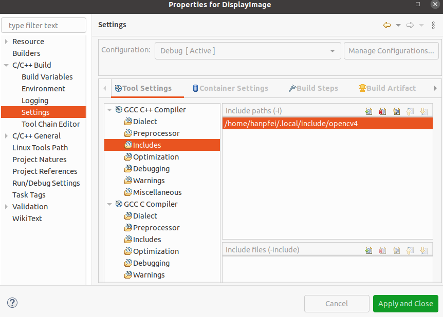
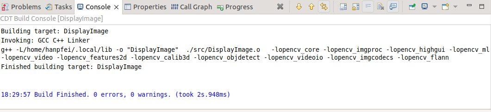
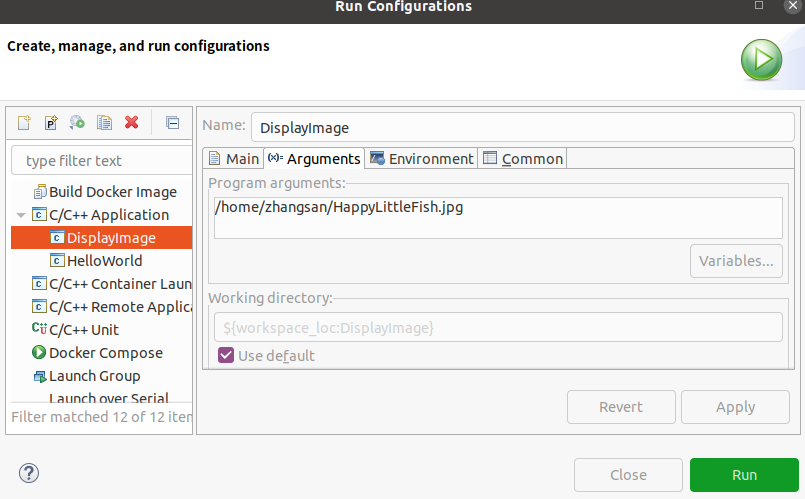
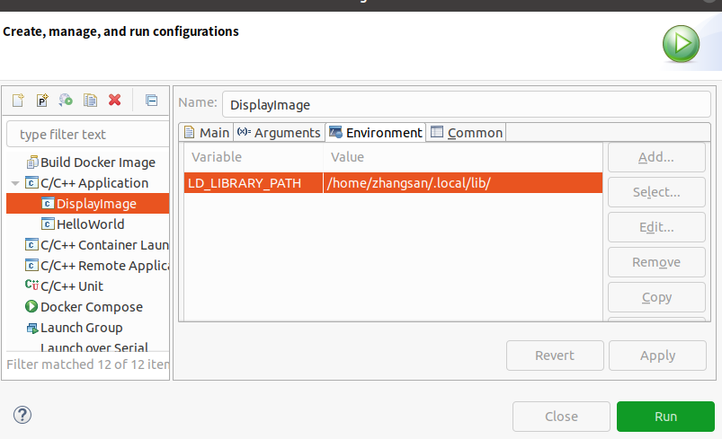

这篇文章将说明在 Ubuntu Linux 系统上搭建 OpenCV 开发环境的过程，以支持 Python 和 C++ 编程语言开发基于 OpenCV 的应用，或学习 OpenCV。本文说明的过程在 Ubuntu 20.04 版本的系统上经过测试验证。
<!--more-->
# 在 Ubuntu 系统上安装 OpenCV-Python

在 Ubuntu 系统中安装 OpenCV-Python 有两种方式：

 * 从 Ubuntu 仓库安装可用的预编译二进制文件
 * 由源码编译。

这里这两种方式都会介绍。

另一个非常重要的问题是必须的附加库。OpenCV-Python 只需要 **Numpy**。但在这个教程中，我们还使用 **Matplotlib** 进行一些简单而漂亮的绘图。**Matplotlib** 是可选的，但强烈建议安装它。类似地，我们也将看到 **IPython**，一个交互式 Python 终端，同样强烈建议安装它。

## 从预编译二进制文件安装 OpenCV-Python

在仅仅想要编程和开发 OpenCV 应用程序时，这个方法最好。

在终端中通过如下命令安装 [python3-opencv](https://packages.ubuntu.com/focal/python3-opencv) 包（以 root 用户）：
```
$ sudo apt-get install python3-opencv
正在读取软件包列表... 完成
正在分析软件包的依赖关系树       
正在读取状态信息... 完成       
下列软件包是自动安装的并且现在不需要了：
  ibus-data python3-ibus-1.0
使用'sudo apt autoremove'来卸载它(它们)。
将会同时安装下列软件：
  cpp-8 gcc-8 gcc-8-base gdal-data gfortran gfortran-8 gfortran-9 ibverbs-providers libaec0 libarmadillo9 libarpack2 libcaf-openmpi-3
  libcfitsio8 libcharls2 libcoarrays-dev libcoarrays-openmpi-dev libdap25 libdapclient6v5 libepsilon1 libevent-core-2.1-7 libevent-dev
  libevent-extra-2.1-7 libevent-openssl-2.1-7 libevent-pthreads-2.1-7 libfabric1 libfreexl1 libfyba0 libgcc-8-dev libgdal26 libgdcm3.0
  libgeos-3.8.0 libgeos-c1v5 libgeotiff5 libgfortran-8-dev libgfortran-9-dev libgl2ps1.4 libhdf4-0-alt libhdf5-103 libhdf5-openmpi-103
  libhwloc-dev libhwloc-plugins libhwloc15 libibverbs-dev libibverbs1 libilmbase24 libkmlbase1 libkmldom1 libkmlengine1 liblept5 libminizip1
  libmpx2 libnetcdf-c++4 libnetcdf15 libnl-3-dev libnl-route-3-dev libnuma-dev libodbc1 libogdi4.1 libopencv-calib3d4.2 libopencv-contrib4.2
  libopencv-core4.2 libopencv-dnn4.2 libopencv-features2d4.2 libopencv-flann4.2 libopencv-highgui4.2 libopencv-imgcodecs4.2
  libopencv-imgproc4.2 libopencv-ml4.2 libopencv-objdetect4.2 libopencv-photo4.2 libopencv-shape4.2 libopencv-stitching4.2
  libopencv-superres4.2 libopencv-video4.2 libopencv-videoio4.2 libopencv-videostab4.2 libopencv-viz4.2 libopenexr24 libopenmpi-dev libopenmpi3
  libpmix2 libpq5 libproj15 libpsm-infinipath1 libpsm2-2 libqhull7 librdmacm1 libsocket++1 libspatialite7 libsuperlu5 libsz2 libtbb2
  libtesseract4 liburiparser1 libvtk6.3 libxerces-c3.2 libxnvctrl0 odbcinst odbcinst1debian2 openmpi-bin openmpi-common proj-bin proj-data
  python3-numpy
建议安装：
  gcc-8-locales gcc-8-multilib gcc-8-doc gfortran-multilib gfortran-doc gfortran-8-multilib gfortran-8-doc gfortran-9-multilib gfortran-9-doc
  geotiff-bin gdal-bin libgeotiff-epsg libhdf4-doc libhdf4-alt-dev hdf4-tools libhwloc-contrib-plugins libmyodbc odbc-postgresql tdsodbc
  unixodbc-bin ogdi-bin openmpi-doc mpi-default-bin python-numpy-doc python3-pytest python3-numpy-dbg
下列【新】软件包将被安装：
  cpp-8 gcc-8 gcc-8-base gdal-data gfortran gfortran-8 gfortran-9 ibverbs-providers libaec0 libarmadillo9 libarpack2 libcaf-openmpi-3
  libcfitsio8 libcharls2 libcoarrays-dev libcoarrays-openmpi-dev libdap25 libdapclient6v5 libepsilon1 libevent-core-2.1-7 libevent-dev
  libevent-extra-2.1-7 libevent-openssl-2.1-7 libevent-pthreads-2.1-7 libfabric1 libfreexl1 libfyba0 libgcc-8-dev libgdal26 libgdcm3.0
  libgeos-3.8.0 libgeos-c1v5 libgeotiff5 libgfortran-8-dev libgfortran-9-dev libgl2ps1.4 libhdf4-0-alt libhdf5-103 libhdf5-openmpi-103
  libhwloc-dev libhwloc-plugins libhwloc15 libibverbs-dev libibverbs1 libilmbase24 libkmlbase1 libkmldom1 libkmlengine1 liblept5 libminizip1
  libmpx2 libnetcdf-c++4 libnetcdf15 libnl-3-dev libnl-route-3-dev libnuma-dev libodbc1 libogdi4.1 libopencv-calib3d4.2 libopencv-contrib4.2
  libopencv-core4.2 libopencv-dnn4.2 libopencv-features2d4.2 libopencv-flann4.2 libopencv-highgui4.2 libopencv-imgcodecs4.2
  libopencv-imgproc4.2 libopencv-ml4.2 libopencv-objdetect4.2 libopencv-photo4.2 libopencv-shape4.2 libopencv-stitching4.2
  libopencv-superres4.2 libopencv-video4.2 libopencv-videoio4.2 libopencv-videostab4.2 libopencv-viz4.2 libopenexr24 libopenmpi-dev libopenmpi3
  libpmix2 libpq5 libproj15 libpsm-infinipath1 libpsm2-2 libqhull7 librdmacm1 libsocket++1 libspatialite7 libsuperlu5 libsz2 libtbb2
  libtesseract4 liburiparser1 libvtk6.3 libxerces-c3.2 libxnvctrl0 odbcinst odbcinst1debian2 openmpi-bin openmpi-common proj-bin proj-data
  python3-numpy python3-opencv
升级了 0 个软件包，新安装了 105 个软件包，要卸载 0 个软件包，有 70 个软件包未被升级。
需要下载 104 MB 的归档。
解压缩后会消耗 397 MB 的额外空间。
您希望继续执行吗？ [Y/n] y
获取:1 http://cn.archive.ubuntu.com/ubuntu focal/universe amd64 gcc-8-base amd64 8.4.0-3ubuntu2 [18.7 kB]
. . . . . .
```

它会安装非常多在 Python 中调用 OpenCV 接口所需的依赖，如 `libopencv-core4.2`、`libopencv-superres4.2`、`libopencv-objdetect4.2` 和 `libopencv-features2d4.2` 等。**注意**，安装的这些 OpenCV 依赖库的包只包含了动态链接库二进制文件，而没有 C++ OpenCV 开发所需要的头文件等内容。

打开一个 Python IDLE （或者 IPython）并在 Python 终端中输入如下代码：
```
import cv2 as cv
print(cv.__version__)
```

执行这段代码，输出了适当的 OpenCV 版本号而没有任何报错，则恭喜你！！！你已经成功地安装了 OpenCV-Python。

这很简单。但这有一个问题。Apt 仓库可能总是不包含最新版本的 OpenCV。比如笔者在 Ubuntu 20.04 上通过上面的操作安装 OpenCV，得到的版本为 4.2.0，最新的版本则为 4.5.5：
```
$ python3
Python 3.8.10 (default, Nov 26 2021, 20:14:08) 
[GCC 9.3.0] on linux
Type "help", "copyright", "credits" or "license" for more information.
>>> import cv2
>>> print(cv2.__version__)
4.2.0
```

对于 Python API，最新版本将始终包含更好的支持和最新的错误修复。

因此，获取最新源代码的下一个方法，即从源代码编译。同时，如果在某个时间点，你想为 OpenCV 贡献代码，你也将需要这个。

## 从源码构建

乍一看去，从源码编译可能有点复杂，但一旦你成功了，你会发现其实也没什么复杂的。

首先我们将安装一些依赖。有些是必须的，有些是可选的。如果你不需要，可以跳过可选的依赖。

### 必须的构建依赖

我们需要 **CMake** 来配置安装，需要 **GCC** 来编译。需要 **Python-devel** 和 **Numpy** 来构建 Python 绑定等。
```
sudo apt-get install cmake
sudo apt-get install gcc g++
```

要支持 python2：
```
sudo apt-get install python-dev python-numpy
```

要支持 python3：
```
sudo apt-get install python3-dev python3-numpy
```

接着，需要 **GTK** 来支持 GUI 功能，Camera 支持 (v4l)，媒体支持 (ffmpeg，gstreamer) 等等。
```
sudo apt-get install libavcodec-dev libavformat-dev libswscale-dev
sudo apt-get install libgstreamer-plugins-base1.0-dev libgstreamer1.0-dev
```

要支持 gtk2：
```
sudo apt-get install libgtk2.0-dev
```

要支持 gtk3：
```
sudo apt-get install libgtk-3-dev
```

### 可选的依赖

对于在 Ubuntu 机器上安装 OpenCV，上面的依赖已经足够了。但根据你的需求，你可能需要一些额外的依赖。这样的额外依赖列表如下。你可以根据你的需求把它们留在那里或安装它们。

OpenCV 附带了对图像格式的支持，如 PNG、JPEG、JPEG2000、TIFF、WebP 等。但它可能有点老。如果你想获得最新的库，你可以为这些格式的系统库安装开发文件。
```
sudo apt-get install libpng-dev
sudo apt-get install libjpeg-dev
sudo apt-get install libopenexr-dev
sudo apt-get install libtiff-dev
sudo apt-get install libwebp-dev
```

> **注意：** 如果你正在使用 Ubuntu 16.04，也可以安装 `libjasper-dev` 来给你的系统添加对 JPEG2000 格式的系统级支持。

 ### 下载 OpenCV

获得 OpenCV 的源码有两种方式：

 * 从 OpenCV 的 [Github 仓库](https://github.com/opencv/opencv) 下载最新的源码。（如果你想要给 OpenCV 贡献代码也可以通过它。要下载源码，首先需要安装 **Git**。）
```
$ sudo apt-get install git
$ git clone https://github.com/opencv/opencv.git
```

这将在当前目录创建一个名为 "opencv" 的目录。代码克隆过程可能需要一些时间，这依赖于你的网络连接情况。

 * 除了直接克隆 OpenCV 的 [Github 仓库](https://github.com/opencv/opencv) 之外，还有另外一种获取 OpenCV 源码的方法。OpenCV 官方提供了已经打包好的发行版源码的压缩包，可以下载这些压缩包获取源码，如：
```
# Install minimal prerequisites
$ sudo apt update && sudo apt install -y wget unzip

# Download and unpack sources
$ wget -O opencv.zip https://github.com/opencv/opencv/archive/4.x.zip
$ unzip opencv.zip
$ mv opencv-4.x opencv
```

解压之后并重命名源码目录，OpenCV 源码将位于 opencv 目录下。

现在打开一个终端窗口，切换到下载的 "opencv" 目录。创建一个名为 "build" 的目录并切换到它下面。
```
$ mkdir build
$ cd build
```

当然也可以在 OpenCV 源码目录的同级目录中创建 "build" 目录，这同样需要切换到新建的目录下。注意，后面执行 CMake 配置构建时，需要正确引用 OpenCV 源码目录。

### 配置和安装

现在我们已经拥有了所有必须的依赖，让我们开始安装 OpenCV 吧。安装必须通过 CMake 来配置。它指定了将要安装哪些模块、安装路径、将使用哪些附加库、是否要编译文档和示例等。这些工作中的大部分将通过默认参数的良好配置自动完成。

以下命令通常用于配置 OpenCV 库构建（在 "build" 目录中执行）：
```
$ cmake ../
```

OpenCV 默认假设构建类型为 "Release"，安装路径为 "/usr/local"。关于 CMake 选项的其它信息请参考 OpenCV  [C++ 编译指南](https://docs.opencv.org/4.5.5/d7/d9f/tutorial_linux_install.html)。

你应该能够在你的 CMake 输出中看到如下这些行（它们意味着已经发现了适当的 Python）：
```
--   Other third-party libraries:
--     VA:                          YES
--     Lapack:                      NO
--     Eigen:                       NO
--     Custom HAL:                  NO
--     Protobuf:                    build (3.19.1)
-- 
--   OpenCL:                        YES (INTELVA)
--     Include path:                /media/data/my_multimedia/opencv-4.x/3rdparty/include/opencl/1.2
--     Link libraries:              Dynamic load
-- 
--   Python 2:
--     Interpreter:                 /usr/bin/python2.7 (ver 2.7.18)
--     Libraries:                   /usr/lib/x86_64-linux-gnu/libpython2.7.so (ver 2.7.18)
--     numpy:                       /usr/lib/python2.7/dist-packages/numpy/core/include (ver 1.16.5)
--     install path:                lib/python2.7/dist-packages/cv2/python-2.7
-- 
--   Python 3:
--     Interpreter:                 /usr/bin/python3 (ver 3.8.10)
--     Libraries:                   /usr/lib/x86_64-linux-gnu/libpython3.8.so (ver 3.8.10)
--     numpy:                       /usr/lib/python3/dist-packages/numpy/core/include (ver 1.17.4)
--     install path:                lib/python3.8/site-packages/cv2/python-3.8
-- 
--   Python (for build):            /usr/bin/python2.7
-- 
--   Java:                          
--     ant:                         NO
--     JNI:                         /usr/lib/jvm/default-java/include /usr/lib/jvm/default-java/include/linux /usr/lib/jvm/default-java/include
--     Java wrappers:               NO
--     Java tests:                  NO
-- 
--   Install to:                    /usr/local
```


`cmake` 命令的参数是包含 *CMakelists.txt* 文件的目录的路径，即源码目录。如果 "build" 目录在 "opencv" 源码目录的同级目录中创建，则为（在 "build" 目录中执行）：
```
# Configure
$ cmake ../opencv
```

现在可以使用 "make" 命令来构建文件：
```
$ make
. . . . . .
Scanning dependencies of target opencv_version
[100%] Building CXX object apps/version/CMakeFiles/opencv_version.dir/opencv_version.cpp.o
[100%] Linking CXX executable ../../bin/opencv_version
[100%] Built target opencv_version
Scanning dependencies of target opencv_model_diagnostics
[100%] Building CXX object apps/model-diagnostics/CMakeFiles/opencv_model_diagnostics.dir/model_diagnostics.cpp.o
[100%] Linking CXX executable ../../bin/opencv_model_diagnostics
[100%] Built target opencv_model_diagnostics
```

构建也可以通过 `cmake` 命令完成：
```
$ cmake --build .
```

成功构建之后，可以在 `build/lib`目录下找到库文件，并在 `build/bin` 目录下找到可执行文件（测试，示例，和 apps）：
```
build$ ls bin
opencv_annotation               opencv_perf_optflow      opencv_test_bgsegm        opencv_test_intensity_transform  opencv_test_stitching
opencv_interactive-calibration  opencv_perf_photo        opencv_test_bioinspired   opencv_test_line_descriptor      opencv_test_structured_light
opencv_model_diagnostics        opencv_perf_reg          opencv_test_calib3d       opencv_test_mcc                  opencv_test_superres
opencv_perf_aruco               opencv_perf_rgbd         opencv_test_core          opencv_test_ml                   opencv_test_text
opencv_perf_bioinspired         opencv_perf_stereo       opencv_test_dnn           opencv_test_objdetect            opencv_test_tracking
opencv_perf_calib3d             opencv_perf_stitching    opencv_test_dnn_superres  opencv_test_optflow              opencv_test_video
opencv_perf_core                opencv_perf_superres     opencv_test_face          opencv_test_phase_unwrapping     opencv_test_videoio
opencv_perf_dnn                 opencv_perf_tracking     opencv_test_features2d    opencv_test_photo                opencv_test_videostab
opencv_perf_dnn_superres        opencv_perf_video        opencv_test_flann         opencv_test_quality              opencv_test_wechat_qrcode
opencv_perf_features2d          opencv_perf_videoio      opencv_test_fuzzy         opencv_test_rapid                opencv_test_xfeatures2d
opencv_perf_gapi                opencv_perf_xfeatures2d  opencv_test_gapi          opencv_test_reg                  opencv_test_ximgproc
opencv_perf_imgcodecs           opencv_perf_ximgproc     opencv_test_highgui       opencv_test_rgbd                 opencv_test_xphoto
opencv_perf_imgproc             opencv_perf_xphoto       opencv_test_imgcodecs     opencv_test_saliency             opencv_version
opencv_perf_line_descriptor     opencv_test_aruco        opencv_test_img_hash      opencv_test_shape                opencv_visualisation
opencv_perf_objdetect           opencv_test_barcode      opencv_test_imgproc       opencv_test_stereo               opencv_waldboost_detector
build$ ls lib
cv2.so                            libopencv_features2d.so.405             libopencv_objdetect.so               libopencv_structured_light.so.4.5.5
libopencv_aruco.so                libopencv_features2d.so.4.5.5           libopencv_objdetect.so.405           libopencv_superres.so
libopencv_aruco.so.405            libopencv_flann.so                      libopencv_objdetect.so.4.5.5         libopencv_superres.so.405
libopencv_aruco.so.4.5.5          libopencv_flann.so.405                  libopencv_optflow.so                 libopencv_superres.so.4.5.5
libopencv_barcode.so              libopencv_flann.so.4.5.5                libopencv_optflow.so.405             libopencv_surface_matching.so
libopencv_barcode.so.405          libopencv_freetype.so                   libopencv_optflow.so.4.5.5           libopencv_surface_matching.so.405
libopencv_barcode.so.4.5.5        libopencv_freetype.so.405               libopencv_phase_unwrapping.so        libopencv_surface_matching.so.4.5.5
libopencv_bgsegm.so               libopencv_freetype.so.4.5.5             libopencv_phase_unwrapping.so.405    libopencv_text.so
libopencv_bgsegm.so.405           libopencv_fuzzy.so                      libopencv_phase_unwrapping.so.4.5.5  libopencv_text.so.405
libopencv_bgsegm.so.4.5.5         libopencv_fuzzy.so.405                  libopencv_photo.so                   libopencv_text.so.4.5.5
libopencv_bioinspired.so          libopencv_fuzzy.so.4.5.5                libopencv_photo.so.405               libopencv_tracking.so
libopencv_bioinspired.so.405      libopencv_gapi.so                       libopencv_photo.so.4.5.5             libopencv_tracking.so.405
libopencv_bioinspired.so.4.5.5    libopencv_gapi.so.405                   libopencv_plot.so                    libopencv_tracking.so.4.5.5
libopencv_calib3d.so              libopencv_gapi.so.4.5.5                 libopencv_plot.so.405                libopencv_ts.a
libopencv_calib3d.so.405          libopencv_hfs.so                        libopencv_plot.so.4.5.5              libopencv_videoio.so
libopencv_calib3d.so.4.5.5        libopencv_hfs.so.405                    libopencv_quality.so                 libopencv_videoio.so.405
libopencv_ccalib.so               libopencv_hfs.so.4.5.5                  libopencv_quality.so.405             libopencv_videoio.so.4.5.5
libopencv_ccalib.so.405           libopencv_highgui.so                    libopencv_quality.so.4.5.5           libopencv_video.so
libopencv_ccalib.so.4.5.5         libopencv_highgui.so.405                libopencv_rapid.so                   libopencv_video.so.405
libopencv_core.so                 libopencv_highgui.so.4.5.5              libopencv_rapid.so.405               libopencv_video.so.4.5.5
libopencv_core.so.405             libopencv_imgcodecs.so                  libopencv_rapid.so.4.5.5             libopencv_videostab.so
libopencv_core.so.4.5.5           libopencv_imgcodecs.so.405              libopencv_reg.so                     libopencv_videostab.so.405
libopencv_datasets.so             libopencv_imgcodecs.so.4.5.5            libopencv_reg.so.405                 libopencv_videostab.so.4.5.5
libopencv_datasets.so.405         libopencv_img_hash.so                   libopencv_reg.so.4.5.5               libopencv_wechat_qrcode.so
libopencv_datasets.so.4.5.5       libopencv_img_hash.so.405               libopencv_rgbd.so                    libopencv_wechat_qrcode.so.405
libopencv_dnn_objdetect.so        libopencv_img_hash.so.4.5.5             libopencv_rgbd.so.405                libopencv_wechat_qrcode.so.4.5.5
libopencv_dnn_objdetect.so.405    libopencv_imgproc.so                    libopencv_rgbd.so.4.5.5              libopencv_xfeatures2d.so
libopencv_dnn_objdetect.so.4.5.5  libopencv_imgproc.so.405                libopencv_saliency.so                libopencv_xfeatures2d.so.405
libopencv_dnn.so                  libopencv_imgproc.so.4.5.5              libopencv_saliency.so.405            libopencv_xfeatures2d.so.4.5.5
libopencv_dnn.so.405              libopencv_intensity_transform.so        libopencv_saliency.so.4.5.5          libopencv_ximgproc.so
libopencv_dnn.so.4.5.5            libopencv_intensity_transform.so.405    libopencv_shape.so                   libopencv_ximgproc.so.405
libopencv_dnn_superres.so         libopencv_intensity_transform.so.4.5.5  libopencv_shape.so.405               libopencv_ximgproc.so.4.5.5
libopencv_dnn_superres.so.405     libopencv_line_descriptor.so            libopencv_shape.so.4.5.5             libopencv_xobjdetect.so
libopencv_dnn_superres.so.4.5.5   libopencv_line_descriptor.so.405        libopencv_stereo.so                  libopencv_xobjdetect.so.405
libopencv_dpm.so                  libopencv_line_descriptor.so.4.5.5      libopencv_stereo.so.405              libopencv_xobjdetect.so.4.5.5
libopencv_dpm.so.405              libopencv_mcc.so                        libopencv_stereo.so.4.5.5            libopencv_xphoto.so
libopencv_dpm.so.4.5.5            libopencv_mcc.so.405                    libopencv_stitching.so               libopencv_xphoto.so.405
libopencv_face.so                 libopencv_mcc.so.4.5.5                  libopencv_stitching.so.405           libopencv_xphoto.so.4.5.5
libopencv_face.so.405             libopencv_ml.so                         libopencv_stitching.so.4.5.5         python3
libopencv_face.so.4.5.5           libopencv_ml.so.405                     libopencv_structured_light.so
libopencv_features2d.so           libopencv_ml.so.4.5.5                   libopencv_structured_light.so.405
```

编译出来的可执行文件和库文件非常多。

CMake 包文件位于构建根目录：
```
build$ ls OpenCVConfig*.cmake
OpenCVConfig.cmake  OpenCVConfig-version.cmake
build$ ls OpenCVModules.cmake 
OpenCVModules.cmake
```

它们用于支持 CMake 的 find_library。

默认情况，OpenCV 将安装在 `/usr/local` 目录下，所有文件将被拷贝如下位置：

 * `/usr/local/bin` - 可执行文件
 * `/usr/local/lib` - 库文件 (.so)
 * `/usr/local/cmake/opencv4` - cmake 包
 * `/usr/local/include/opencv4` - 头文件
 * `/usr/local/share/opencv4` - 其它文件（比如 XML 格式的训练的级联）

由于 `/usr/local` 为 root 用户所有，因而安装应该以超级用户特权执行 (`sudo`)，使用 "make install" 命令来安装它：
```
$ sudo make install
```

安装结束。所有的文件都被安装在了 "/usr/local/" 目录下。打开一个终端并尝试导入 "cv2"：
```
import cv2 as cv
print(cv.__version__)
```

### 构建配置和安装过程的进一步说明

这一部分将提供更多构建过程的细节说明，并描述了其它可选的方法和工具。请参考 [OpenCV 安装概述](https://docs.opencv.org/4.5.5/d0/d3d/tutorial_general_install.html) 了解一般的安装细节说明，并参考 [OpenCV 配置选项参考](https://docs.opencv.org/4.5.5/db/d05/tutorial_config_reference.html) 了解配置选项文档。

#### 编译器和构建工具

要编译 OpenCV，我们就需要 C++ 编译器。通常是 G++/GCC 或 Clang/LLVM。上面我们看到了 G++/GCC 的安装方法，这里给出安装 Clang/LLVM 的命令：
```
$ sudo apt install -y clang
```

无论何种编译工具，构建 OpenCV 都需要用 CMake 来执行构建配置。

CMake 可以为不同的构建系统生成构建脚本，除了上面看到的 *make*，在 Ubuntu 上还可以用 *ninja* 来构建。Ninja 的安装命令如下：
```
$ sudo apt install -y ninja-build
```

#### 配置和构建

CMake 默认为 *make* 构建系统生成构建脚本，如上面那样。但我们可以通过 CMake 命令行参数强制为 *ninja* 构建系统生成构建脚本，如：
```
$ cmake -GNinja ../opencv
```

再提一点关于安装目标目录配置的问题。

安装过程仅将文件复制到预定义的位置并进行少量修补。使用这种方法，无论是通过 *make*，还是通过 *ninja*，安装都不会将 opencv 集成到系统包注册表中，如无法通过 apt 来管理这些安装。因此，也无法自动卸载 opencv。一般来说，最好不要进行系统范围的安装，因为可能与系统包冲突。

安装根目录可以通过 `CMAKE_INSTALL_PREFIX` 配置参数改变，比如 `-DCMAKE_INSTALL_PREFIX=$HOME/.local` 指明安装到当前用户的本地目录。安装布局可以通过 `OPENCV_*_INSTALL_PATH` 参数修改。详情请参考 [OpenCV 配置选项参考](https://docs.opencv.org/4.5.5/db/d05/tutorial_config_reference.html)。

另外，OpenCV 有一些所谓的 "extra" 模块，它们也提供了一些功能，源码位于单独的 git 仓库内。新模块常常不具有稳定的 API，且还没经过良好地测试。由于 OpenCV 库想要提供良好的二进制兼容性，并尝试提供良好的性能和稳定性，这样，新模块不应该作为正式的 OpenCV 分发版的一部分发型。

所有的新模块单独开发，并首先发布到 `opencv_contrib` 仓库中。随后模块变得成熟并流行时，再被移入 OpenCV 主仓库中，开发团队再为这个模块提供产品级质量的支持。在构建时，想要一起编译 `opencv_contrib` 的话，首先需要下载 `opencv_contrib` 的源码。方法同样有两个，一是下载官方发布的源码包：
```
$ wget -O opencv_contrib.zip https://github.com/opencv/opencv_contrib/archive/4.x.zip
$ unzip opencv_contrib.zip
```

二是克隆 Github 仓库：
```
$ git clone https://github.com/opencv/opencv_contrib.git
```

假设 `opencv_contrib` 的源码被下载到了 `opencv` 源码的同级目录中。

在通过 CMake 执行构建配置时，通过 `-DOPENCV_EXTRA_MODULES_PATH` 参数选项指定 `opencv_contrib` 的模块的路径。

这样，配置通过 ninja 构建，连同 `opencv_contrib` 一起构建，并将 OpenCV 安装在用户本地目录的命令如下：
```
$ cmake -GNinja -DCMAKE_INSTALL_PREFIX=$HOME/.local -DOPENCV_EXTRA_MODULES_PATH=../opencv_contrib-4.x/modules ../opencv
```

对于构建，在使用 *make* 构建系统时，可以给 *make* 传参数，以启用多线程构建，如：
```
$ make -j4
```

运行 *ninja* 执行构建的命令如下：
```
$ ninja
```

运行 *ninja* 执行安装的命令如下：
```
$ ninja install
[0/1] Install the project...
-- Install configuration: "Release"
-- Installing: /home/zhangsan/.local/share/licenses/opencv4/opencl-headers-LICENSE.txt
-- Installing: /home/zhangsan/.local/share/licenses/opencv4/ade-LICENSE
-- Installing: /home/zhangsan/.local/include/opencv4/opencv2/cvconfig.h
-- Installing: /home/zhangsan/.local/include/opencv4/opencv2/opencv_modules.hpp
-- Installing: /home/zhangsan/.local/lib/cmake/opencv4/OpenCVModules.cmake
-- Installing: /home/zhangsan/.local/lib/cmake/opencv4/OpenCVModules-release.cmake
-- Installing: /home/zhangsan/.local/lib/cmake/opencv4/OpenCVConfig-version.cmake
-- Installing: /home/zhangsan/.local/lib/cmake/opencv4/OpenCVConfig.cmake
-- Installing: /home/zhangsan/.local/bin/setup_vars_opencv4.sh
-- Installing: /home/zhangsan/.local/share/opencv4/valgrind.supp
-- Installing: /home/zhangsan/.local/share/opencv4/valgrind_3rdparty.supp
-- Installing: /home/zhangsan/.local/share/licenses/opencv4/libopenjp2-README.md
-- Installing: /home/zhangsan/.local/share/licenses/opencv4/libopenjp2-LICENSE
-- Installing: /home/zhangsan/.local/share/licenses/opencv4/protobuf-LICENSE
-- Installing: /home/zhangsan/.local/share/licenses/opencv4/protobuf-README.md
-- Installing: /home/zhangsan/.local/share/licenses/opencv4/quirc-LICENSE
-- Installing: /home/zhangsan/.local/share/licenses/opencv4/ittnotify-LICENSE.BSD
-- Installing: /home/zhangsan/.local/share/licenses/opencv4/ittnotify-LICENSE.GPL
-- Installing: /home/zhangsan/.local/include/opencv4/opencv2/opencv.hpp
. . . . . .
-- Installing: /home/zhangsan/.local/lib/libopencv_optflow.so.4.5.5
-- Installing: /home/zhangsan/.local/lib/libopencv_optflow.so.405
-- Set runtime path of "/home/zhangsan/.local/lib/libopencv_optflow.so.4.5.5" to "/home/zhangsan/.local/lib"
-- Installing: /home/zhangsan/.local/lib/libopencv_optflow.so
-- Installing: /home/zhangsan/.local/include/opencv4/opencv2/optflow.hpp
-- Installing: /home/zhangsan/.local/include/opencv4/opencv2/optflow/motempl.hpp
-- Installing: /home/zhangsan/.local/include/opencv4/opencv2/optflow/pcaflow.hpp
-- Installing: /home/zhangsan/.local/include/opencv4/opencv2/optflow/rlofflow.hpp
-- Installing: /home/zhangsan/.local/include/opencv4/opencv2/optflow/sparse_matching_gpc.hpp
-- Installing: /home/zhangsan/.local/lib/libopencv_stitching.so.4.5.5
-- Installing: /home/zhangsan/.local/lib/libopencv_stitching.so.405
. . . . . .
-- Installing: /home/zhangsan/.local/include/opencv4/opencv2/stereo/stereo.hpp
-- Installing: /home/zhangsan/.local/lib/python2.7/dist-packages/cv2/__init__.py
-- Installing: /home/zhangsan/.local/lib/python2.7/dist-packages/cv2/load_config_py2.py
-- Installing: /home/zhangsan/.local/lib/python2.7/dist-packages/cv2/load_config_py3.py
-- Installing: /home/zhangsan/.local/lib/python2.7/dist-packages/cv2/config.py
-- Installing: /home/zhangsan/.local/lib/python2.7/dist-packages/cv2/misc/__init__.py
-- Installing: /home/zhangsan/.local/lib/python2.7/dist-packages/cv2/misc/version.py
-- Installing: /home/zhangsan/.local/lib/python2.7/dist-packages/cv2/mat_wrapper/__init__.py
-- Installing: /home/zhangsan/.local/lib/python2.7/dist-packages/cv2/utils/__init__.py
-- Installing: /home/zhangsan/.local/lib/python2.7/dist-packages/cv2/gapi/__init__.py
-- Installing: /home/zhangsan/.local/lib/python2.7/dist-packages/cv2/python-2.7/cv2.so
-- Set runtime path of "/home/zhangsan/.local/lib/python2.7/dist-packages/cv2/python-2.7/cv2.so" to "/home/zhangsan/.local/lib"
-- Installing: /home/zhangsan/.local/lib/python2.7/dist-packages/cv2/config-2.7.py
-- Installing: /home/zhangsan/.local/lib/python3.8/site-packages/cv2/__init__.py
-- Installing: /home/zhangsan/.local/lib/python3.8/site-packages/cv2/load_config_py2.py
-- Installing: /home/zhangsan/.local/lib/python3.8/site-packages/cv2/load_config_py3.py
-- Installing: /home/zhangsan/.local/lib/python3.8/site-packages/cv2/config.py
-- Installing: /home/zhangsan/.local/lib/python3.8/site-packages/cv2/misc/__init__.py
-- Installing: /home/zhangsan/.local/lib/python3.8/site-packages/cv2/misc/version.py
-- Installing: /home/zhangsan/.local/lib/python3.8/site-packages/cv2/mat_wrapper/__init__.py
-- Installing: /home/zhangsan/.local/lib/python3.8/site-packages/cv2/utils/__init__.py
-- Installing: /home/zhangsan/.local/lib/python3.8/site-packages/cv2/gapi/__init__.py
-- Installing: /home/zhangsan/.local/lib/python3.8/site-packages/cv2/python-3.8/cv2.cpython-38-x86_64-linux-gnu.so
-- Set runtime path of "/home/zhangsan/.local/lib/python3.8/site-packages/cv2/python-3.8/cv2.cpython-38-x86_64-linux-gnu.so" to "/home/zhangsan/.local/lib"
-- Installing: /home/zhangsan/.local/lib/python3.8/site-packages/cv2/config-3.8.py
. . . . . .
-- Installing: /home/zhangsan/.local/share/opencv4/haarcascades/haarcascade_smile.xml
-- Installing: /home/zhangsan/.local/share/opencv4/haarcascades/haarcascade_upperbody.xml
-- Installing: /home/zhangsan/.local/share/opencv4/lbpcascades/lbpcascade_frontalcatface.xml
-- Installing: /home/zhangsan/.local/share/opencv4/lbpcascades/lbpcascade_frontalface.xml
-- Installing: /home/zhangsan/.local/share/opencv4/lbpcascades/lbpcascade_frontalface_improved.xml
-- Installing: /home/zhangsan/.local/share/opencv4/lbpcascades/lbpcascade_profileface.xml
-- Installing: /home/zhangsan/.local/share/opencv4/lbpcascades/lbpcascade_silverware.xml
-- Installing: /home/zhangsan/.local/bin/opencv_annotation
-- Set runtime path of "/home/zhangsan/.local/bin/opencv_annotation" to "/home/zhangsan/.local/lib"
-- Installing: /home/zhangsan/.local/bin/opencv_visualisation
-- Set runtime path of "/home/zhangsan/.local/bin/opencv_visualisation" to "/home/zhangsan/.local/lib"
-- Installing: /home/zhangsan/.local/bin/opencv_interactive-calibration
-- Set runtime path of "/home/zhangsan/.local/bin/opencv_interactive-calibration" to "/home/zhangsan/.local/lib"
-- Installing: /home/zhangsan/.local/bin/opencv_version
-- Set runtime path of "/home/zhangsan/.local/bin/opencv_version" to "/home/zhangsan/.local/lib"
-- Installing: /home/zhangsan/.local/bin/opencv_model_diagnostics
-- Set runtime path of "/home/zhangsan/.local/bin/opencv_model_diagnostics" to "/home/zhangsan/.local/lib"
```

由于指定的安装路径为用户本地路径，因而不需要 `sudo`。在安装过程的输出中，还是能发现不少信息，如 Python 绑定的安装路径，头文件的具体安装路径等。

# 在 Ubuntu 系统上搭建 OpenCV 的 C++ 开发环境

这里说明配置 CMake 和 Eclipse 构建基于 OpenCV 的 C++ 项目的方法。

## 准备依赖

构建依赖可以分为两部分：

 * (1). 开发和构建工具，包括 Eclipse，CMake，GCC/G++，Clang/LLVM，Git 等。如果还没有安装 Eclipse（含 CDT），可以到 Eclipse 的网站上，下载 [Eclipse IDE for C/C++ Developers](https://www.eclipse.org/downloads/packages/eclipse-ide-cc-developers/heliossr2)。根据自己的系统平台类型选择下载的版本。其它工具可以参考上面的说明进行安装，这里不再赘述。

 * (2). 用于 C/C++ 开发的 OpenCV 库开发包，主要包括动态链接库，静态链接库和头文件。

对于 OpenCV 库开发包安装，有两种方法：

 * 从源码构建安装。如上面从源码构建安装 OpenCV-Python 的过程，该过程除了可以构建安装 OpenCV 的 Python 绑定之外，也同样会构建安装C/C++ 开发所需要的所有库文件、头文件等内容。对于这种方法，这里不再赘述。

 * 从 Apt 仓库安装预编译的二进制安装包。同样，用这种方式安装的 OpenCV 库开发包版本可能比较老。但这种方法更简单，对于只想利用 OpenCV 的 API 开发应用，而无心研究 OpenCV 的 源码或向 OpenCV 项目贡献源码的同学，这种方法比较方便。

对于从从 Apt 仓库安装预编译的二进制安装包，搜索 Apt 仓库中的 OpenCV 开发包，可以看到如下内容：
```
build$ sudo apt-cache search libopencv
libopencv-apps-dev - Opencv_apps Robot OS package - development files
libopencv-apps1d - opencv_apps Robot OS package - runtime files
libopencv-calib3d-dev - development files for libopencv-calib3d4.2
libopencv-calib3d4.2 - computer vision Camera Calibration library
libopencv-contrib-dev - development files for libopencv-contrib4.2
libopencv-contrib4.2 - computer vision contrlib library
libopencv-core-dev - development files for libopencv-core4.2
libopencv-core4.2 - computer vision core library
libopencv-dev - development files for opencv
libopencv-dnn-dev - development files for libopencv-dnn4.2
libopencv-dnn4.2 - computer vision Deep neural network module
libopencv-features2d-dev - development files for libopencv-features2d4.2
libopencv-features2d4.2 - computer vision Feature Detection and Descriptor Extraction library
libopencv-flann-dev - development files for libopencv-flann4.2
libopencv-flann4.2 - computer vision Clustering and Search in Multi-Dimensional spaces library
libopencv-highgui-dev - development files for libopencv-highgui4.2
libopencv-highgui4.2 - computer vision High-level GUI and Media I/O library
libopencv-imgcodecs-dev - development files for libopencv-imgcodecs4.2
libopencv-imgcodecs4.2 - computer vision Image Codecs library
libopencv-imgproc-dev - development files for libopencv-imgproc4.2
libopencv-imgproc4.2 - computer vision Image Processing library
libopencv-ml-dev - development files for libopencv-ml4.2
libopencv-ml4.2 - computer vision Machine Learning library
libopencv-objdetect-dev - development files for libopencv-objdetect4.2
libopencv-objdetect4.2 - computer vision Object Detection library
libopencv-photo-dev - development files for libopencv-photo4.2
libopencv-photo4.2 - computer vision computational photography library
libopencv-shape-dev - development files for libopencv-shape4.2
libopencv-shape4.2 - computer vision shape descriptors and matchers library
libopencv-stitching-dev - development files for libopencv-stitching4.2
libopencv-stitching4.2 - computer vision image stitching library
libopencv-superres-dev - development files for libopencv-superres4.2
libopencv-superres4.2 - computer vision Super Resolution library
libopencv-ts-dev - development files for TS library of OpenCV (Open Computer Vision)
libopencv-video-dev - development files for libopencv-video4.2
libopencv-video4.2 - computer vision Video analysis library
libopencv-videoio-dev - development files for libopencv-videoio4.2
libopencv-videoio4.2 - computer vision Video I/O library
libopencv-videostab-dev - development files for libopencv-videostab4.2
libopencv-videostab4.2 - computer vision video stabilization library
libopencv-viz-dev - development files for libopencv-viz4.2
libopencv-viz4.2 - computer vision 3D data visualization library
libopencv4.2-java - Java bindings for the computer vision library
libopencv4.2-jni - Java jni library for the computer vision library
```

上面找到的这些包中，包名含有 "libopencv" 字样，后缀为 "-dev" 的包即为我们需要安装的 OpenCV 库开发包。可以按需安装这些包，也可以一次性安装所有这些包。在终端中通过如下命令安装所有 OpenCV 库开发包（以 root 用户）：
```
$ sudo apt install libopencv-apps-dev libopencv-calib3d-dev libopencv-contrib-dev libopencv-core-dev libopencv-dev libopencv-dnn-dev libopencv-features2d-dev libopencv-flann-dev libopencv-highgui-dev libopencv-imgcodecs-dev libopencv-imgproc-dev libopencv-ml-dev libopencv-objdetect-dev libopencv-photo-dev libopencv-shape-dev libopencv-stitching-dev libopencv-superres-dev libopencv-ts-dev libopencv-video-dev libopencv-videoio-dev libopencv-videostab-dev libopencv-viz-dev
```

这里随便找一个包，看下它安装的文件及各个文件的安装路径：
```
$ dpkg -L libopencv-core-dev 
/.
/usr
/usr/include
/usr/include/opencv4
/usr/include/opencv4/opencv2
/usr/include/opencv4/opencv2/core
/usr/include/opencv4/opencv2/core/affine.hpp
/usr/include/opencv4/opencv2/core/async.hpp
/usr/include/opencv4/opencv2/core/base.hpp
/usr/include/opencv4/opencv2/core/bindings_utils.hpp
/usr/include/opencv4/opencv2/core/bufferpool.hpp
/usr/include/opencv4/opencv2/core/check.hpp
/usr/include/opencv4/opencv2/core/core.hpp
/usr/include/opencv4/opencv2/core/core_c.h
/usr/include/opencv4/opencv2/core/cuda
/usr/include/opencv4/opencv2/core/cuda/block.hpp
/usr/include/opencv4/opencv2/core/cuda/border_interpolate.hpp
/usr/include/opencv4/opencv2/core/cuda/color.hpp
/usr/include/opencv4/opencv2/core/cuda/common.hpp
/usr/include/opencv4/opencv2/core/cuda/datamov_utils.hpp
/usr/include/opencv4/opencv2/core/cuda/detail
/usr/include/opencv4/opencv2/core/cuda/detail/color_detail.hpp
/usr/include/opencv4/opencv2/core/cuda/detail/reduce.hpp
/usr/include/opencv4/opencv2/core/cuda/detail/reduce_key_val.hpp
/usr/include/opencv4/opencv2/core/cuda/detail/transform_detail.hpp
/usr/include/opencv4/opencv2/core/cuda/detail/type_traits_detail.hpp
/usr/include/opencv4/opencv2/core/cuda/detail/vec_distance_detail.hpp
/usr/include/opencv4/opencv2/core/cuda/dynamic_smem.hpp
/usr/include/opencv4/opencv2/core/cuda/emulation.hpp
/usr/include/opencv4/opencv2/core/cuda/filters.hpp
/usr/include/opencv4/opencv2/core/cuda/funcattrib.hpp
/usr/include/opencv4/opencv2/core/cuda/functional.hpp
/usr/include/opencv4/opencv2/core/cuda/limits.hpp
/usr/include/opencv4/opencv2/core/cuda/reduce.hpp
/usr/include/opencv4/opencv2/core/cuda/saturate_cast.hpp
/usr/include/opencv4/opencv2/core/cuda/scan.hpp
/usr/include/opencv4/opencv2/core/cuda/simd_functions.hpp
/usr/include/opencv4/opencv2/core/cuda/transform.hpp
/usr/include/opencv4/opencv2/core/cuda/type_traits.hpp
/usr/include/opencv4/opencv2/core/cuda/utility.hpp
/usr/include/opencv4/opencv2/core/cuda/vec_distance.hpp
/usr/include/opencv4/opencv2/core/cuda/vec_math.hpp
/usr/include/opencv4/opencv2/core/cuda/vec_traits.hpp
/usr/include/opencv4/opencv2/core/cuda/warp.hpp
/usr/include/opencv4/opencv2/core/cuda/warp_reduce.hpp
/usr/include/opencv4/opencv2/core/cuda/warp_shuffle.hpp
/usr/include/opencv4/opencv2/core/cuda.hpp
/usr/include/opencv4/opencv2/core/cuda.inl.hpp
/usr/include/opencv4/opencv2/core/cuda_stream_accessor.hpp
/usr/include/opencv4/opencv2/core/cuda_types.hpp
/usr/include/opencv4/opencv2/core/cv_cpu_dispatch.h
/usr/include/opencv4/opencv2/core/cv_cpu_helper.h
/usr/include/opencv4/opencv2/core/cvdef.h
/usr/include/opencv4/opencv2/core/cvstd.hpp
/usr/include/opencv4/opencv2/core/cvstd.inl.hpp
/usr/include/opencv4/opencv2/core/cvstd_wrapper.hpp
/usr/include/opencv4/opencv2/core/detail
/usr/include/opencv4/opencv2/core/detail/async_promise.hpp
/usr/include/opencv4/opencv2/core/detail/exception_ptr.hpp
/usr/include/opencv4/opencv2/core/directx.hpp
/usr/include/opencv4/opencv2/core/eigen.hpp
/usr/include/opencv4/opencv2/core/fast_math.hpp
/usr/include/opencv4/opencv2/core/hal
/usr/include/opencv4/opencv2/core/hal/hal.hpp
/usr/include/opencv4/opencv2/core/hal/interface.h
/usr/include/opencv4/opencv2/core/hal/intrin.hpp
/usr/include/opencv4/opencv2/core/hal/intrin_avx.hpp
/usr/include/opencv4/opencv2/core/hal/intrin_avx512.hpp
/usr/include/opencv4/opencv2/core/hal/intrin_cpp.hpp
/usr/include/opencv4/opencv2/core/hal/intrin_forward.hpp
/usr/include/opencv4/opencv2/core/hal/intrin_msa.hpp
/usr/include/opencv4/opencv2/core/hal/intrin_neon.hpp
/usr/include/opencv4/opencv2/core/hal/intrin_sse.hpp
/usr/include/opencv4/opencv2/core/hal/intrin_sse_em.hpp
/usr/include/opencv4/opencv2/core/hal/intrin_vsx.hpp
/usr/include/opencv4/opencv2/core/hal/intrin_wasm.hpp
/usr/include/opencv4/opencv2/core/hal/msa_macros.h
/usr/include/opencv4/opencv2/core/hal/simd_utils.impl.hpp
/usr/include/opencv4/opencv2/core/mat.hpp
/usr/include/opencv4/opencv2/core/mat.inl.hpp
/usr/include/opencv4/opencv2/core/matx.hpp
/usr/include/opencv4/opencv2/core/neon_utils.hpp
/usr/include/opencv4/opencv2/core/ocl.hpp
/usr/include/opencv4/opencv2/core/ocl_genbase.hpp
/usr/include/opencv4/opencv2/core/opencl
/usr/include/opencv4/opencv2/core/opencl/ocl_defs.hpp
/usr/include/opencv4/opencv2/core/opencl/opencl_info.hpp
/usr/include/opencv4/opencv2/core/opencl/opencl_svm.hpp
/usr/include/opencv4/opencv2/core/opencl/runtime
/usr/include/opencv4/opencv2/core/opencl/runtime/autogenerated
/usr/include/opencv4/opencv2/core/opencl/runtime/autogenerated/opencl_clamdblas.hpp
/usr/include/opencv4/opencv2/core/opencl/runtime/autogenerated/opencl_clamdfft.hpp
/usr/include/opencv4/opencv2/core/opencl/runtime/autogenerated/opencl_core.hpp
/usr/include/opencv4/opencv2/core/opencl/runtime/autogenerated/opencl_core_wrappers.hpp
/usr/include/opencv4/opencv2/core/opencl/runtime/autogenerated/opencl_gl.hpp
/usr/include/opencv4/opencv2/core/opencl/runtime/autogenerated/opencl_gl_wrappers.hpp
/usr/include/opencv4/opencv2/core/opencl/runtime/opencl_clamdblas.hpp
/usr/include/opencv4/opencv2/core/opencl/runtime/opencl_clamdfft.hpp
/usr/include/opencv4/opencv2/core/opencl/runtime/opencl_core.hpp
/usr/include/opencv4/opencv2/core/opencl/runtime/opencl_core_wrappers.hpp
/usr/include/opencv4/opencv2/core/opencl/runtime/opencl_gl.hpp
/usr/include/opencv4/opencv2/core/opencl/runtime/opencl_gl_wrappers.hpp
/usr/include/opencv4/opencv2/core/opencl/runtime/opencl_svm_20.hpp
/usr/include/opencv4/opencv2/core/opencl/runtime/opencl_svm_definitions.hpp
/usr/include/opencv4/opencv2/core/opencl/runtime/opencl_svm_hsa_extension.hpp
/usr/include/opencv4/opencv2/core/opengl.hpp
/usr/include/opencv4/opencv2/core/operations.hpp
/usr/include/opencv4/opencv2/core/optim.hpp
/usr/include/opencv4/opencv2/core/ovx.hpp
/usr/include/opencv4/opencv2/core/persistence.hpp
/usr/include/opencv4/opencv2/core/saturate.hpp
/usr/include/opencv4/opencv2/core/simd_intrinsics.hpp
/usr/include/opencv4/opencv2/core/softfloat.hpp
/usr/include/opencv4/opencv2/core/sse_utils.hpp
/usr/include/opencv4/opencv2/core/traits.hpp
/usr/include/opencv4/opencv2/core/types.hpp
/usr/include/opencv4/opencv2/core/types_c.h
/usr/include/opencv4/opencv2/core/utility.hpp
/usr/include/opencv4/opencv2/core/utils
/usr/include/opencv4/opencv2/core/utils/allocator_stats.hpp
/usr/include/opencv4/opencv2/core/utils/allocator_stats.impl.hpp
/usr/include/opencv4/opencv2/core/utils/filesystem.hpp
/usr/include/opencv4/opencv2/core/utils/instrumentation.hpp
/usr/include/opencv4/opencv2/core/utils/logger.defines.hpp
/usr/include/opencv4/opencv2/core/utils/logger.hpp
/usr/include/opencv4/opencv2/core/utils/logtag.hpp
/usr/include/opencv4/opencv2/core/utils/tls.hpp
/usr/include/opencv4/opencv2/core/utils/trace.hpp
/usr/include/opencv4/opencv2/core/va_intel.hpp
/usr/include/opencv4/opencv2/core/version.hpp
/usr/include/opencv4/opencv2/core/vsx_utils.hpp
/usr/include/opencv4/opencv2/core.hpp
/usr/include/opencv4/opencv2/cvconfig.h
/usr/include/opencv4/opencv2/opencv.hpp
/usr/include/opencv4/opencv2/opencv_modules.hpp
/usr/lib
/usr/lib/x86_64-linux-gnu
/usr/lib/x86_64-linux-gnu/libopencv_core.a
/usr/share
/usr/share/doc
/usr/share/doc/libopencv-core-dev
/usr/share/doc/libopencv-core-dev/README.Debian
/usr/share/doc/libopencv-core-dev/copyright
/usr/lib/x86_64-linux-gnu/libopencv_core.so
/usr/share/doc/libopencv-core-dev/changelog.Debian.gz
```

注意，头文件是安装在 `/usr/include/opencv4/` 目录下的，但这个目录通常不是编译工具默认的头文件搜索目录。包含头文件时，要么写成 `<opencv4/opencv2/opencv.hpp>` 这样，要么写成 `<opencv2/opencv.hpp>` 并定制头文件的搜索路径。

## 在 Eclipse 中构建使用 OpenCV（CDT 插件）的应用

首先要创建一个工程。具体过程如下：

1. 启动 Eclipse。在 Eclipse 的安装目录中运行可执行文件。

2. 转到 **File -> New -> C/C++ Project**


3. 为这个工程选择一个名字，比如 DisplayImage。对于这个例子来说一个 **Empty Project** 应该就可以了。


4. 其它配置保持默认值。点击 **Finish**。

5. 新建的工程（在这种情况下是 DisplayImage）应该出现在 **Project Navigator**（通常出现在窗口的左侧）。


6. 现在来给工程添加一个使用 OpenCV 的源文件：
   * 鼠标右键点击 **DisplayImage** （在 Navigator 中）。**New -> Folder**。


   * 将目录命名为 **src**，然后点击 **Finish**。

   * 右键点击新创建的 目录。选择 **New source file**。

   * 将其命名为 **DisplayImage.cpp**。点击 **Finish**。


7. 现在我们有了一个包含一个空 .cpp 文件的工程。让我们在这个源文件中添加我们的示例代码（换句话说，把下面的代码片段拷贝过去）：
```
#include <iostream>
using namespace std;

#include <opencv2/opencv.hpp>

int main(int argc, char **argv) {
  cv::Mat image;
  image = cv::imread(argv[1], 1);
  if (argc != 2 || !image.data) {
    printf("No image data \n");
    return -1;
  }
  cv::namedWindow("Display Image", cv::WINDOW_AUTOSIZE);
  imshow("Display Image", image);
  cv::waitKey(0);
  return 0;
}
```

8. 我们只差最后一步了：告诉 Eclipse OpenCV 的头文件和库文件在哪儿。要做到这一点，执行如下操作：

 * 转到 **Project–>Properties**

 * 在 **C/C++ Build** 中，点中 **Settings**。在右边，选择 **Tool Settings** 标签。这里我们进入头文件和库信息设置：
    a. 在 **GCC C++ Compiler** 中，切换到 **Includes**。在 **Include paths(-l)** 中，应该包含安装 opencv 的头文件的目录的路径。对于默认的安装，一般来说是 **/usr/include/opencv4**，对于上面将 OpenCV 库安装到用户本地目录的情况，则是 **/home/zhangsan/.local/include/opencv4**。



b. 现在切换到 **GCC C++ Linker**，在这里需要填两个地方：
首先是必须在 **Library search path (-L)** 写入 opencv 库所在的目录的路径，默认情况下这个路径为：
```
/usr/local/lib
```
这个路径一般都是链接器默认的库文件搜索路径，因而一般不用填写。
在 **Libraries(-l)** 中添加需要的 OpenCV 库。通常只需要添加下面列表中的前 4 个就够了（对于简单的应用程序来说）。这里我们把所有计划要使用的库都加上。
opencv_core opencv_imgproc opencv_imgcodecs opencv_highgui opencv_ml opencv_videoio opencv_video opencv_features2d opencv_calib3d opencv_objdetect opencv_flann


现在点击 **OK**。

 * 这个工程应该已经准备好构建了。转到 **Project->Build Project**
在终端中应该能看到类似这样的内容：



检查你的目录的话，应该能够看到可执行文件。

## 运行应用

现在，我们已经有可执行文件可以运行了。如果是把 OpenCV 安装在默认的 `/usr/local` 目录的话，则一般情况下 OpenCV 库文件的安装目录已经在动态链接器的库文件搜索路径了。使用终端，我们可以像这样做运行它：
```
$ cd ~/workspace/DisplayImage
$ ./Debug/DisplayImage ~/HappyLittleFish.jpg
```

如果我们将 OpenCV 安装在了用户本地目录的话，像上面那样执行可执行文件会报错，找不到动态链接库，如：
```
$ ./Debug/DisplayImage ~/HappyLittleFish.jpg
Debug/DisplayImage: error while loading shared libraries: libopencv_core.so.405: cannot open shared object file: No such file or directory
```

此时我们可以将 OpenCV 库文件的安装路径添加进 `/etc/ld.so.conf` 并执行 `sudo ldconfig` 以更新动态链接器的库文件搜索路径；也可以设置 `LD_LIBRARY_PATH` 指向 OpenCV 库文件的安装路径，然后再执行可执行文件，如：
```
$ export LD_LIBRARY_PATH=~/.local/lib
$ ./Debug/DisplayImage ~/HappyLittleFish.jpg
```

假设要使用作为路径参数的图片位于 `~/HappyLittleFish.jpg`。我们也可以在 Eclipse 中执行可执行文件：

 1. 转到 **Run->Run Configurations**

 2. 在 **C/C++ Application** 下，将看到可执行文件的名字（如果没有，则鼠标左键双击 **C/C++ Application**）。选择该名字（在这个例子中是 **DisplayImage**）。

3. 现在在窗口的右侧，选择 **Arguments** 标签。把我们想打开的图片的路径（可以写绝对路径，也可以写相对于 **workspace/DisplayImage** 目录的相对路径）写进去。让我们使用 **~/HappyLittleFish.jpg**：



4. 如果我们没有把 OpenCV 安装在默认位置，同样需要设置环境变量 `LD_LIBRARY_PATH` 指向 OpenCV 库文件的安装路径。同样是在上面的窗口中，选中 **Environment** 标签。添加环境变量 `LD_LIBRARY_PATH`，如：



5. 点击 **Apply** 按钮，然后运行。这将弹出一个 OpenCV 窗口并显示一张鱼图（或其它你想显示的）：


6. 现在已经完全做好了使用 Eclipse 开发 OpenCV 应用的准备了。

## V2：在 Eclipse （包含 CDT 插件）中使用 CMake+OpenCV

比如已经在一个称为 *helloopencv* 的目录下创建了一个名为 *helloworld.cpp* 的新文件，其内容如下：
```
#include <opencv2/opencv.hpp>
using namespace cv;
int main ( int argc, char **argv )
{
  Mat img(480, 640, CV_8U);
  putText(img, "Hello World!", Point( 200, 400 ), FONT_HERSHEY_SIMPLEX | FONT_ITALIC, 1.0, Scalar( 255, 255, 0 ));
  imshow("My Window", img);
  waitKey();
  return 0;
}
```

1. 在 *helloopencv* 目录下放一个 `CMakeLists.txt` 文件，其内容如下：
```
cmake_minimum_required(VERSION 3.6)

PROJECT( helloworld_proj )
FIND_PACKAGE( OpenCV REQUIRED )
ADD_EXECUTABLE( helloworld helloworld.cpp )
TARGET_LINK_LIBRARIES(helloworld 
                      ${OpenCV_LIBS})
```

2. 在 *helloopencv* 目录下创建 *build* 目录，并切换进去，执行 `cmake` 命令生成构建脚本：
```
$ cd helloopencv
$ mkdir build
$ cd build
$ cmake -DOpenCV_DIR=/home/zhangsan/.local/lib/cmake/opencv4 ..
-- Configuring done
-- Generating done
-- Build files have been written to: /home/zhangsan/workspace/helloopencv/build
```

这里定义 **OpenCV_DIR** 指向 opencv 库的 cmake 文件安装路径。

3. 运行 `make -j4`（-j4 是可选的，它只是告诉编译器用 4 个线程来编译），或者 `cmake --build .`。确保它构建完成。

4. 启动 Eclipse。把 workspace 放在某些目录下，但 **不能** 在 `helloopencv` 或 `helloopencv\build` 下。

5. 转到 **File -> Import...**。然后打开 C/C++ filter。选中 *Existing Code as a Makefile Project*。

6. 命名这个工程，比如 *helloworld*。浏览到代码目录位置 *helloopencv* 目录。在 *"Toolchain for Indexer Settings"* 中选择 *Linux GCC* 并按下 *Finish*。

7. 在 *Project Explorer* 部分选中工程，右键单击。选择 *Properties*。在 C/C++ Build 下，在 *Builder Settings* 标签中，设置 *Build directory:*：从类似于 `${workspace_loc:/helloopencv}` 改为 `${workspace_loc:/helloopencv}/build`，即执行 cmake 并生成 Makefile 文件的目录。
也可以选择修改构建命令 *Build command:*，反选 *Use default build command*，然后在 *Build command:* 中填入自己需要的构建命令。在 *Behavior* 标签中，选择 *Use custom build arguments*，还可以输入想要的构建参数，比如加上 `VERBOSE=1 -j4` 参数，告诉编译器生成详细的符号文件用于调试，并且以 4 个并发线程来编译。

8. 转到 **Project->Build Project** 构建工程。

在命令行及 Eclipse 中运行编译出来的二进制可执行的方法如上文所述。

## 通过 GCC 和 CMake 使用 OpenCV

在自己的代码中使用 OpenCV 最简单的方式就是使用 [CMake](https://www.cmake.org/) 了。这有这样一些优势（摘自 Wiki）：

1. 当在 Linux 和 Windows 之间移植时，不需要修改任何东西。
2. 可以通过 CMake 简单地与其它工具结合使用（比如 Qt，ITK 和 VTK）

如果你还不熟悉 CMake，可以参考它的网站上的 [教程](https://www.cmake.org/cmake/help/cmake_tutorial.html)。

### 步骤

#### 创建一个使用 OpenCV 的程序

随便使用任何一个你所熟悉的喜欢的编辑器，或者集成开发环境，创建一个类似于名为 DisplayImage.cpp 的源文件，并输入如下这样简单程序的源码：
```
#include <stdio.h>
#include <opencv2/opencv.hpp>
using namespace cv;
int main(int argc, char **argv) {
  if (argc != 2) {
    printf("usage: DisplayImage.out <Image_Path>\n");
    return -1;
  }
  Mat image;
  image = imread(argv[1], 1);
  if (!image.data) {
    printf("No image data \n");
    return -1;
  }
  namedWindow("Display Image", WINDOW_AUTOSIZE);
  imshow("Display Image", image);
  waitKey(0);
  return 0;
}
```

把这个源文件放在某个目录下，如 `DisplayImage/src`。

#### 创建一个 CMake 文件

然后必须创建你的 CMakeLists.txt，比如在 `DisplayImage` 目录下。它看起来像这样：
```
cmake_minimum_required(VERSION 3.8)

project(DisplayImage)

find_package(OpenCV REQUIRED)

include_directories(${OpenCV_INCLUDE_DIRS})

add_executable(DisplayImage 
               src/DisplayImage.cpp)

target_link_libraries(DisplayImage ${OpenCV_LIBS})
```

#### 生成可执行文件

这个部分很简单，就像在任何其它使用 CMake 的项目里那样处理：
```
$ cd DisplayImage
$ cmake -Bbuild -DOpenCV_DIR=/home/zhangsan/.local/lib/cmake/opencv4 .
$ cmake --build build
```

CMake 的 `-B` 选项用于指定生成构建脚本的目录。

#### 结果

现在应该有了可执行文件（在这个例子中称为 DisplayImage）。只需要给它传入一个图片文件的路径作为参数来运行它，比如：
```
$ build/DisplayImage ..opencv/samples/data/lena.jpg
```

这应该能得到一个漂亮的窗口，就像下面展示的这个：


# 参考文档

[OpenCV Releases](https://opencv.org/releases/)
[OpenCV 4.5.5 文档](https://docs.opencv.org/4.5.5/)
[OpenCV-Python Tutorials](https://docs.opencv.org/4.5.5/d6/d00/tutorial_py_root.html)
[OpenCV-Python Tutorials - Introduction to OpenCV](https://docs.opencv.org/4.5.5/da/df6/tutorial_py_table_of_contents_setup.html)
[OpenCV-Python Tutorials - Introduction to OpenCV-Python Tutorials](https://docs.opencv.org/4.5.5/d0/de3/tutorial_py_intro.html)
[OpenCV-Python Tutorials - Install OpenCV-Python in Ubuntu](https://docs.opencv.org/4.5.5/d2/de6/tutorial_py_setup_in_ubuntu.html)

[OpenCV Tutorials](https://docs.opencv.org/4.5.5/d9/df8/tutorial_root.html)
[OpenCV Tutorials - Introduction to OpenCV](https://docs.opencv.org/4.5.5/df/d65/tutorial_table_of_content_introduction.html)
[OpenCV Tutorials - Installation in Linux](https://docs.opencv.org/4.5.5/d7/d9f/tutorial_linux_install.html)
[OpenCV Tutorials - Using OpenCV with Eclipse (plugin CDT)](https://docs.opencv.org/4.5.5/d7/d16/tutorial_linux_eclipse.html)
[OpenCV Tutorials - Using OpenCV with gcc and CMake](https://docs.opencv.org/4.5.5/db/df5/tutorial_linux_gcc_cmake.html)

[opencv_contrib](https://github.com/opencv/opencv_contrib)

Done.
