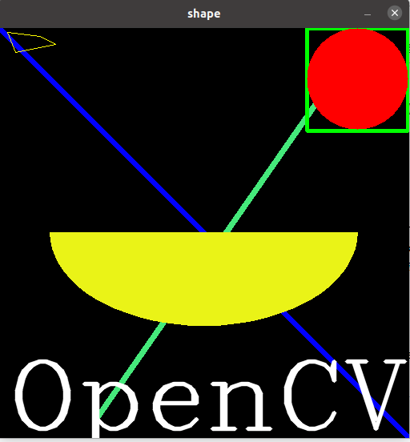

本文主要内容来自于 [OpenCV-Python 教程](https://docs.opencv.org/4.5.5/d6/d00/tutorial_py_root.html) 的 [OpenCV 中的 GUI 功能](https://docs.opencv.org/4.5.5/dc/d4d/tutorial_py_table_of_contents_gui.html) 部分，这个部分的主要内容如下：
<!--more-->
*   [图像操作入门](https://docs.opencv.org/4.5.5/db/deb/tutorial_display_image.html)
    学习加载一幅图像，显示它，并保存它
*   [视频入门](https://docs.opencv.org/4.5.5/dd/d43/tutorial_py_video_display.html)
    学习播放视频，从摄像头捕捉视频，以及写入视频
*   [OpenCV 中的绘制功能](https://docs.opencv.org/4.5.5/dc/da5/tutorial_py_drawing_functions.html)
    学习通过 OpenCV 绘制线、矩形、椭圆形和圆形等等
*   [鼠标作为画笔](https://docs.opencv.org/4.5.5/db/d5b/tutorial_py_mouse_handling.html)
    用鼠标画东西
*   [轨迹栏作为调色板](https://docs.opencv.org/4.5.5/d9/dc8/tutorial_py_trackbar.html)
    创建轨迹栏以控制某些参数

## 目标

 * 学习通过 OpenCV 绘制不同的几何形状
 * 我们将学习这些函数：**[cv.line()](https://docs.opencv.org/4.5.5/d6/d6e/group__imgproc__draw.html#ga7078a9fae8c7e7d13d24dac2520ae4a2 "Draws a line segment connecting two points. ")**、**[cv.circle()](https://docs.opencv.org/4.5.5/d6/d6e/group__imgproc__draw.html#gaf10604b069374903dbd0f0488cb43670 "Draws a circle. ")**、**[cv.rectangle()](https://docs.opencv.org/4.5.5/d6/d6e/group__imgproc__draw.html#ga07d2f74cadcf8e305e810ce8eed13bc9 "Draws a simple, thick, or filled up-right rectangle. ")**、**[cv.ellipse()](https://docs.opencv.org/4.5.5/d6/d6e/group__imgproc__draw.html#ga28b2267d35786f5f890ca167236cbc69 "Draws a simple or thick elliptic arc or fills an ellipse sector. ")**、**[cv.putText()](https://docs.opencv.org/4.5.5/d6/d6e/group__imgproc__draw.html#ga5126f47f883d730f633d74f07456c576 "Draws a text string. ")** 等等。

## 代码

在上面所有这些函数中，我们将看到一些公共的参数，这些参数如下：

 * img：要绘制几何形状的图像。
 * color：几何形状的颜色。对于 BGR，传入一个元组，比如 (255,0,0) 绘制蓝色的。对于灰度图，则只需传递标量值。
 * thickness：线或圆等的粗细。如果为圆这样的闭合图形传入 **-1**，则它将填充形状。默认 *thickness = 1*
 * lineType：线的类型，是否是 8 连接，抗锯齿线等。默认情况下，它是 8 连接。[**cv.LINE_AA**](https://docs.opencv.org/4.5.5/d6/d6e/group__imgproc__draw.html#ggaf076ef45de481ac96e0ab3dc2c29a777a85fdabe5335c9e6656563dfd7c94fb4f "antialiased line ") 指定以抗锯齿线绘制，这看起来对曲线非常好。

## 绘制线

为了绘制线，我们需要传入线的起点和终点坐标。我们创建一幅黑色的图像，并在它上面绘制一条从左上角到右下角的蓝色的线。
```
import numpy as np
import cv2 as cv

def create_black_color_image(width, height):
    # Create a black image
    img = np.zeros((width, height, 3), np.uint8)
    return img


def draw_line(img, start, end, color=(255, 0, 0)):
    # Draw a diagonal blue line with thickness of 5 px
    cv.line(img, start, end, color, 5)


if __name__ == "__main__":
    img = create_black_color_image(512, 512)
    draw_line(img, (0, 0), (512, 512))
    draw_line(img, (122, 486), (423, 54), (123, 233, 69))

    cv.imshow('shape', img)
    cv.waitKey(0)
    cv.destroyAllWindows()
```

## 绘制矩形

要绘制一个矩形，我们需要矩形的左上角和右下角的坐标。这次我们将在图像的右上角绘制一个绿色的矩形。
```
cv.rectangle(img, (384, 0), (510, 128), (0, 255, 0), 3)
```

## 绘制圆形

要绘制圆形，我们需要它的圆心坐标和半径。我们将在上面的矩形中绘制一个圆形。
```
cv.circle(img,(447,63), 63, (0,0,255), -1)
```

## 绘制椭圆形

要绘制椭圆，我们需要传入多个参数。一个参数是中心位置 (x,y)。下一个参数是轴长（横轴长和纵轴长）。angle 是椭圆沿逆时针方向旋转的角度。startAngle 和 endAngle 表示从主轴顺时针方向测量的椭圆弧的起点和终点。即给出值 0 和 360 绘出完整的椭圆。更多细节，请参考 **[cv.ellipse()](https://docs.opencv.org/4.5.5/d6/d6e/group__imgproc__draw.html#ga28b2267d35786f5f890ca167236cbc69 "Draws a simple or thick elliptic arc or fills an ellipse sector. ")** 的文档。下面的例子在图像的中心绘制了半个椭圆。
```
cv.ellipse(img, (255, 255), (192, 116), 0, 0, 180, (23, 243, 234), -1)
```

## 绘制多边形

要绘制多边形，首先我们需要顶点的坐标。将这些点放入一个形状为 ROWSx1x2 的数组中，其中 ROWS 是顶点数，它应该是 int32 类型。这里我们用黄色绘制一个具有四个顶点的多边形。
```
pts = np.array([[10,5],[20,30],[70,20],[50,10]], np.int32)
pts = pts.reshape((-1,1,2))
cv.polylines(img,[pts],True,(0,255,255))
```

 > 注意：如果第三个参数是 *False*，我们将获得连接所有点的一组线，而不是闭合的形状。
[cv.polylines()](https://docs.opencv.org/4.5.5/d6/d6e/group__imgproc__draw.html#gaa3c25f9fb764b6bef791bf034f6e26f5 "Draws several polygonal curves. ") 可用于绘制多条线。只需创建要绘制的所有线条的列表并将其传递给函数即可。所有线条都将单独绘制。与为每条线调用 [**cv.line()**](https://docs.opencv.org/4.5.5/d6/d6e/group__imgproc__draw.html#ga7078a9fae8c7e7d13d24dac2520ae4a2 "Draws a line segment connecting two points. ") 相比，它是绘制一组线的一种更好更快的方法。

## 给图像添加文字

要把文字放进图像中，我们需要指定如下这些东西。

 * 想要写入的文字数据。
 * 想要放置文字的位置的坐标（比如数据开始的左下角）。
 * 字体类型（检查 **[cv.putText()](https://docs.opencv.org/4.5.5/d6/d6e/group__imgproc__draw.html#ga5126f47f883d730f633d74f07456c576 "Draws a text string. ")** 的文档了解支持的字体）
 * 字体比例（指定字体大小）
 * 常规的东西，如 color、thickness、lineType 等等。为了更好看，建议设置 lineType = [**cv.LINE_AA**](https://docs.opencv.org/4.5.5/d6/d6e/group__imgproc__draw.html#ggaf076ef45de481ac96e0ab3dc2c29a777a85fdabe5335c9e6656563dfd7c94fb4f "antialiased line ")

我们将以白色在我们的图像上写入 **OpenCV**。
```
font = cv.FONT_HERSHEY_COMPLEX
cv.putText(img, u'OpenCV', (10, 500), font, 4, (255, 255, 255), 4, cv.LINE_AA)
```

## 结果

是时候看一下我们的绘制最终的效果了。如之前的文档中了解到的那样，在窗口中显示我们绘制的图像。



绘制几何图形对于计算机视觉来说，可以用来给对象绘制边界等。

绘制几何图形时，只会修改几何图形影响到的像素点的数据，图像中其它的数据则保持不变。比如，绘制线条时，只有在线条上的像素点的数据被修改为了绘制颜色。这样我们可以通过多次调用不同的接口，构建一幅更加复杂更多彩的图像。

在绘制时，这里的各个接口都要求指定坐标。坐标都是特定于坐标系的。在 OpenCV  的图像中，坐标系的方向为从左上角到右下角，即从左到右横坐标值逐渐递增，从上到下，纵坐标值逐渐递增。

## 其它资源

1. 椭圆函数中使用的角度不是我们的圆角。有关更多详细信息，请访问 [此讨论](http://answers.opencv.org/question/14541/angles-in-ellipse-function/)。

**参考文档**

[Drawing Functions in OpenCV](https://docs.opencv.org/4.5.5/dc/da5/tutorial_py_drawing_functions.html)

Done.
